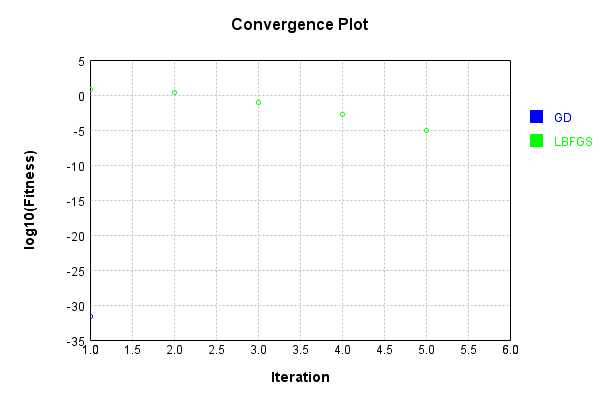
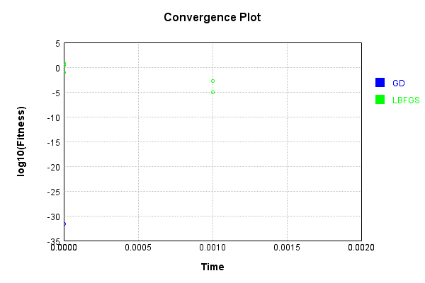

# SumInputsLayer
## NNTest
### Json Serialization
Code from [JsonTest.java:36](../../../../../../../../src/main/java/com/simiacryptus/mindseye/test/unit/JsonTest.java#L36) executed in 0.00 seconds: 
```java
    JsonObject json = layer.getJson();
    NNLayer echo = NNLayer.fromJson(json);
    if ((echo == null)) throw new AssertionError("Failed to deserialize");
    if ((layer == echo)) throw new AssertionError("Serialization did not copy");
    if ((!layer.equals(echo))) throw new AssertionError("Serialization not equal");
    return new GsonBuilder().setPrettyPrinting().create().toJson(json);
```

Returns: 

```
    {
      "class": "com.simiacryptus.mindseye.layers.java.SumInputsLayer",
      "id": "88ed869a-06af-455d-8bc4-4f6fa6299a27",
      "isFrozen": false,
      "name": "SumInputsLayer/88ed869a-06af-455d-8bc4-4f6fa6299a27"
    }
```


### Example Input/Output Pair
Code from [ReferenceIO.java:68](../../../../../../../../src/main/java/com/simiacryptus/mindseye/test/unit/ReferenceIO.java#L68) executed in 0.00 seconds: 
```java
    SimpleEval eval = SimpleEval.run(layer, inputPrototype);
    return String.format("--------------------\nInput: \n[%s]\n--------------------\nOutput: \n%s\n--------------------\nDerivative: \n%s",
      Arrays.stream(inputPrototype).map(t -> t.prettyPrint()).reduce((a, b) -> a + ",\n" + b).get(),
      eval.getOutput().prettyPrint(),
      Arrays.stream(eval.getDerivative()).map(t -> t.prettyPrint()).reduce((a, b) -> a + ",\n" + b).get());
```

Returns: 

```
    --------------------
    Input: 
    [[ 0.372, -1.304, 0.576 ],
    [ -1.804, -1.504, 1.212 ]]
    --------------------
    Output: 
    [ -1.432, -2.808, 1.7879999999999998 ]
    --------------------
    Derivative: 
    [ 1.0, 1.0, 1.0 ],
    [ 1.0, 1.0, 1.0 ]
```


### Batch Execution
Code from [BatchingTester.java:66](../../../../../../../../src/main/java/com/simiacryptus/mindseye/test/unit/BatchingTester.java#L66) executed in 0.00 seconds: 
```java
    return test(reference, inputPrototype);
```

Returns: 

```
    ToleranceStatistics{absoluteTol=0.0000e+00 +- 0.0000e+00 [0.0000e+00 - 0.0000e+00] (90#), relativeTol=0.0000e+00 +- 0.0000e+00 [0.0000e+00 - 0.0000e+00] (90#)}
```


Code from [SingleDerivativeTester.java:77](../../../../../../../../src/main/java/com/simiacryptus/mindseye/test/unit/SingleDerivativeTester.java#L77) executed in 0.00 seconds: 
```java
    return test(component, inputPrototype);
```
Logging: 
```
    Inputs: [ 1.324, -1.616, -1.852 ],
    [ 0.964, -1.248, 1.38 ]
    Inputs Statistics: {meanExponent=0.1993234412960547, negative=2, min=-1.852, max=-1.852, mean=-0.7146666666666667, count=3.0, positive=1, stdDev=1.4447711083613057, zeros=0},
    {meanExponent=0.07339023521682414, negative=1, min=1.38, max=1.38, mean=0.3653333333333333, count=3.0, positive=2, stdDev=1.1533710976476255, zeros=0}
    Output: [ 2.2880000000000003, -2.864, -0.4720000000000002 ]
    Outputs Statistics: {meanExponent=0.16345701079696415, negative=2, min=-0.4720000000000002, max=-0.4720000000000002, mean=-0.3493333333333333, count=3.0, positive=1, stdDev=2.1050829490122767, zeros=0}
    Feedback for input 0
    Inputs Values: [ 1.324, -1.616, -1.852 ]
    Value Statistics: {meanExponent=0.1993234412960547, negative=2, min=-1.852, max=-1.852, mean=-0.7146666666666667, count=3.0, positive=1, stdDev=1.4447711083613057, zeros=0}
    Implemented Feedback: [ [ 1.0, 0.0, 0.0 ], [ 0.0, 1.0, 0.0 ], [ 0.0, 0.0, 1.0 ] ]
    Implemented Statistics: {meanExponent=0.0, negative=
```
...[skipping 1096 bytes](etc/412.txt)...
```
    ] ]
    Implemented Statistics: {meanExponent=0.0, negative=0, min=1.0, max=1.0, mean=0.3333333333333333, count=9.0, positive=3, stdDev=0.4714045207910317, zeros=6}
    Measured Feedback: [ [ 0.9999999999976694, 0.0, 0.0 ], [ 0.0, 0.9999999999976694, 0.0 ], [ 0.0, 0.0, 0.9999999999998899 ] ]
    Measured Statistics: {meanExponent=-6.907156200440216E-13, negative=0, min=0.9999999999998899, max=0.9999999999998899, mean=0.3333333333328032, count=9.0, positive=3, stdDev=0.47140452079028194, zeros=6}
    Feedback Error: [ [ -2.3305801732931286E-12, 0.0, 0.0 ], [ 0.0, -2.3305801732931286E-12, 0.0 ], [ 0.0, 0.0, -1.1013412404281553E-13 ] ]
    Error Statistics: {meanExponent=-12.074383334342565, negative=3, min=-1.1013412404281553E-13, max=-1.1013412404281553E-13, mean=-5.30143830069897E-13, count=9.0, positive=0, stdDev=9.62973698067151E-13, zeros=6}
    Finite-Difference Derivative Accuracy:
    absoluteTol: 5.3014e-13 +- 9.6297e-13 [0.0000e+00 - 2.3306e-12] (18#)
    relativeTol: 7.9522e-13 +- 5.2336e-13 [5.5067e-14 - 1.1653e-12] (6#)
    
```

Returns: 

```
    ToleranceStatistics{absoluteTol=5.3014e-13 +- 9.6297e-13 [0.0000e+00 - 2.3306e-12] (18#), relativeTol=7.9522e-13 +- 5.2336e-13 [5.5067e-14 - 1.1653e-12] (6#)}
```


### Performance
Now we execute larger-scale runs to benchmark performance:

Code from [PerformanceTester.java:66](../../../../../../../../src/main/java/com/simiacryptus/mindseye/test/unit/PerformanceTester.java#L66) executed in 0.00 seconds: 
```java
    test(component, inputPrototype);
```
Logging: 
```
    100 batches
    Input Dimensions:
    	[100]
    	[100]
    Performance:
    	Evaluation performance: 0.000134s +- 0.000015s [0.000116s - 0.000156s]
    	Learning performance: 0.000247s +- 0.000005s [0.000243s - 0.000257s]
    
```

### Input Learning
In this test, we use a network to learn this target input, given it's pre-evaluated output:

Code from [LearningTester.java:127](../../../../../../../../src/main/java/com/simiacryptus/mindseye/test/unit/LearningTester.java#L127) executed in 0.00 seconds: 
```java
    return Arrays.stream(input_target).map(x -> x.prettyPrint()).reduce((a, b) -> a + "\n" + b).orElse("");
```

Returns: 

```
    [ 1.192, 0.164, 0.6, -0.472, 0.612, -1.92, 1.08, -0.592, ... ]
    [ -0.532, 0.696, 0.504, -1.996, 1.352, -0.112, 1.004, -0.096, ... ]
```


First, we use a conjugate gradient descent method, which converges the fastest for purely linear functions.

Code from [LearningTester.java:300](../../../../../../../../src/main/java/com/simiacryptus/mindseye/test/unit/LearningTester.java#L300) executed in 0.00 seconds: 
```java
    return new IterativeTrainer(trainable)
      .setLineSearchFactory(label -> new QuadraticSearch())
      .setOrientation(new GradientDescent())
      .setMonitor(monitor)
      .setTimeout(30, TimeUnit.SECONDS)
      .setMaxIterations(250)
      .setTerminateThreshold(0)
      .run();
```
Logging: 
```
    Constructing line search parameters: GD
    F(0.0) = LineSearchPoint{point=PointSample{avg=7.623063840000001}, derivative=-1.2196902144000001}
    New Minimum: 7.623063840000001 > 7.623063839878029
    F(1.0E-10) = LineSearchPoint{point=PointSample{avg=7.623063839878029}, derivative=-1.2196902143902426}, delta = -1.219726541989985E-10
    New Minimum: 7.623063839878029 > 7.623063839146216
    F(7.000000000000001E-10) = LineSearchPoint{point=PointSample{avg=7.623063839146216}, derivative=-1.2196902143316974}, delta = -8.537854867540773E-10
    New Minimum: 7.623063839146216 > 7.623063834023518
    F(4.900000000000001E-9) = LineSearchPoint{point=PointSample{avg=7.623063834023518}, derivative=-1.2196902139218815}, delta = -5.976483308245406E-9
    New Minimum: 7.623063834023518 > 7.623063798164626
    F(3.430000000000001E-8) = LineSearchPoint{point=PointSample{avg=7.623063798164626}, derivative=-1.2196902110531702}, delta = -4.1835375164112065E-8
    New Minimum: 7.623063798164626 > 7.62306354715238
    F(2.4010000000000004E-7) = LineSearchPoin
```
...[skipping 1494 bytes](etc/413.txt)...
```
    09972164922
    New Minimum: 7.383798740278352 > 6.028323485895064
    F(1.3841287201) = LineSearchPoint{point=PointSample{avg=6.028323485895064}, derivative=-1.0846335539699228}, delta = -1.5947403541049372
    Loops = 12
    New Minimum: 6.028323485895064 > 2.5861387293231803E-32
    F(12.5) = LineSearchPoint{point=PointSample{avg=2.5861387293231803E-32}, derivative=1.0370726499786545E-17}, delta = -7.623063840000001
    Right bracket at 12.5
    Converged to right
    Iteration 1 complete. Error: 2.5861387293231803E-32 Total: 249862598064546.4000; Orientation: 0.0000; Line Search: 0.0016
    Zero gradient: 6.432590432257511E-17
    F(0.0) = LineSearchPoint{point=PointSample{avg=2.5861387293231803E-32}, derivative=-4.1378219669170885E-33}
    New Minimum: 2.5861387293231803E-32 > 0.0
    F(12.5) = LineSearchPoint{point=PointSample{avg=0.0}, derivative=0.0}, delta = -2.5861387293231803E-32
    0.0 <= 2.5861387293231803E-32
    Converged to right
    Iteration 2 complete. Error: 0.0 Total: 249862598355794.4000; Orientation: 0.0000; Line Search: 0.0002
    
```

Returns: 

```
    0.0
```


Training Converged

Next, we run the same optimization using L-BFGS, which is nearly ideal for purely second-order or quadratic functions.

Code from [LearningTester.java:324](../../../../../../../../src/main/java/com/simiacryptus/mindseye/test/unit/LearningTester.java#L324) executed in 0.00 seconds: 
```java
    return new IterativeTrainer(trainable)
      .setLineSearchFactory(label -> new ArmijoWolfeSearch())
      .setOrientation(new LBFGS())
      .setMonitor(monitor)
      .setTimeout(30, TimeUnit.SECONDS)
      .setMaxIterations(250)
      .setTerminateThreshold(0)
      .run();
```
Logging: 
```
    LBFGS Accumulation History: 1 points
    Constructing line search parameters: GD
    th(0)=7.623063840000001;dx=-1.2196902144000001
    New Minimum: 7.623063840000001 > 5.221772950189244
    END: th(2.154434690031884)=5.221772950189244; dx=-1.0094707816803372 delta=2.401290889810757
    Iteration 1 complete. Error: 5.221772950189244 Total: 249862601020627.4000; Orientation: 0.0000; Line Search: 0.0002
    LBFGS Accumulation History: 1 points
    th(0)=5.221772950189244;dx=-0.8354836720302795
    New Minimum: 5.221772950189244 > 2.0637992698186016
    END: th(4.641588833612779)=2.0637992698186016; dx=-0.5252459374093558 delta=3.1579736803706426
    Iteration 2 complete. Error: 2.0637992698186016 Total: 249862601301046.4000; Orientation: 0.0000; Line Search: 0.0002
    LBFGS Accumulation History: 1 points
    th(0)=2.0637992698186016;dx=-0.3302078831709763
    New Minimum: 2.0637992698186016 > 0.08255197079274396
    END: th(10.000000000000002)=0.08255197079274396; dx=-0.06604157663419521 delta=1.9812472990258576
    Iteration 3 complete. Error: 0.0825519
```
...[skipping 525 bytes](etc/414.txt)...
```
    : 0.001577276039527373 Total: 249862602043985.4000; Orientation: 0.0000; Line Search: 0.0004
    LBFGS Accumulation History: 1 points
    th(0)=0.001577276039527373;dx=-2.523641663243797E-4
    New Minimum: 0.001577276039527373 > 0.0011574437019533773
    WOLF (strong): th(23.2079441680639)=0.0011574437019533773; dx=2.16184112241716E-4 delta=4.1983233757399564E-4
    New Minimum: 0.0011574437019533773 > 8.10458461482512E-6
    END: th(11.60397208403195)=8.10458461482512E-6; dx=-1.8090027041331852E-5 delta=0.0015691714549125478
    Iteration 5 complete. Error: 8.10458461482512E-6 Total: 249862602425001.4000; Orientation: 0.0000; Line Search: 0.0003
    LBFGS Accumulation History: 1 points
    th(0)=8.10458461482512E-6;dx=-1.296733538372019E-6
    Armijo: th(25.000000000000007)=8.10458461482512E-6; dx=1.296733538372019E-6 delta=0.0
    New Minimum: 8.10458461482512E-6 > 0.0
    END: th(12.500000000000004)=0.0; dx=0.0 delta=8.10458461482512E-6
    Iteration 6 complete. Error: 0.0 Total: 249862602796897.4000; Orientation: 0.0000; Line Search: 0.0003
    
```

Returns: 

```
    0.0
```


Training Converged

Code from [LearningTester.java:96](../../../../../../../../src/main/java/com/simiacryptus/mindseye/test/unit/LearningTester.java#L96) executed in 0.00 seconds: 
```java
    return TestUtil.compare(runs);
```

Returns: 




Code from [LearningTester.java:99](../../../../../../../../src/main/java/com/simiacryptus/mindseye/test/unit/LearningTester.java#L99) executed in 0.00 seconds: 
```java
    return TestUtil.compareTime(runs);
```

Returns: 




