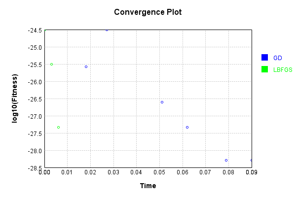

# SumReducerLayer
## SumReducerLayerTest
### Json Serialization
Code from [JsonTest.java:36](../../../../../../../src/main/java/com/simiacryptus/mindseye/test/unit/JsonTest.java#L36) executed in 0.00 seconds: 
```java
    JsonObject json = layer.getJson();
    NNLayer echo = NNLayer.fromJson(json);
    if ((echo == null)) throw new AssertionError("Failed to deserialize");
    if ((layer == echo)) throw new AssertionError("Serialization did not copy");
    if ((!layer.equals(echo))) throw new AssertionError("Serialization not equal");
    return new GsonBuilder().setPrettyPrinting().create().toJson(json);
```

Returns: 

```
    {
      "class": "com.simiacryptus.mindseye.layers.java.SumReducerLayer",
      "id": "6e5355e4-d6bd-49c7-8cae-e07a8b9bfc77",
      "isFrozen": false,
      "name": "SumReducerLayer/6e5355e4-d6bd-49c7-8cae-e07a8b9bfc77"
    }
```


### Example Input/Output Pair
Code from [ReferenceIO.java:68](../../../../../../../src/main/java/com/simiacryptus/mindseye/test/unit/ReferenceIO.java#L68) executed in 0.00 seconds: 
```java
    SimpleEval eval = SimpleEval.run(layer, inputPrototype);
    return String.format("--------------------\nInput: \n[%s]\n--------------------\nOutput: \n%s\n--------------------\nDerivative: \n%s",
      Arrays.stream(inputPrototype).map(t -> t.prettyPrint()).reduce((a, b) -> a + ",\n" + b).get(),
      eval.getOutput().prettyPrint(),
      Arrays.stream(eval.getDerivative()).map(t -> t.prettyPrint()).reduce((a, b) -> a + ",\n" + b).get());
```

Returns: 

```
    --------------------
    Input: 
    [[ 0.464, -0.036, -1.472 ]]
    --------------------
    Output: 
    [ -1.044 ]
    --------------------
    Derivative: 
    [ 1.0, 1.0, 1.0 ]
```


### Batch Execution
Code from [BatchingTester.java:66](../../../../../../../src/main/java/com/simiacryptus/mindseye/test/unit/BatchingTester.java#L66) executed in 0.00 seconds: 
```java
    return test(reference, inputPrototype);
```

Returns: 

```
    ToleranceStatistics{absoluteTol=0.0000e+00 +- 0.0000e+00 [0.0000e+00 - 0.0000e+00] (40#), relativeTol=0.0000e+00 +- 0.0000e+00 [0.0000e+00 - 0.0000e+00] (40#)}
```


Code from [SingleDerivativeTester.java:77](../../../../../../../src/main/java/com/simiacryptus/mindseye/test/unit/SingleDerivativeTester.java#L77) executed in 0.00 seconds: 
```java
    return test(component, inputPrototype);
```
Logging: 
```
    Inputs: [ -0.132, 0.532, 0.756 ]
    Inputs Statistics: {meanExponent=-0.4249975469992984, negative=1, min=0.756, max=0.756, mean=0.38533333333333336, count=3.0, positive=2, stdDev=0.37706704384705325, zeros=0}
    Output: [ 1.1560000000000001 ]
    Outputs Statistics: {meanExponent=0.0629578340845103, negative=0, min=1.1560000000000001, max=1.1560000000000001, mean=1.1560000000000001, count=1.0, positive=1, stdDev=0.0, zeros=0}
    Feedback for input 0
    Inputs Values: [ -0.132, 0.532, 0.756 ]
    Value Statistics: {meanExponent=-0.4249975469992984, negative=1, min=0.756, max=0.756, mean=0.38533333333333336, count=3.0, positive=2, stdDev=0.37706704384705325, zeros=0}
    Implemented Feedback: [ [ 1.0 ], [ 1.0 ], [ 1.0 ] ]
    Implemented Statistics: {meanExponent=0.0, negative=0, min=1.0, max=1.0, mean=1.0, count=3.0, positive=3, stdDev=0.0, zeros=0}
    Measured Feedback: [ [ 0.9999999999976694 ], [ 0.9999999999976694 ], [ 0.9999999999976694 ] ]
    Measured Statistics: {meanExponent=-1.0121581088955095E-12, negative=0, min=0.9999999999976694, max=0.9999999999976694, mean=0.9999999999976694, count=3.0, positive=3, stdDev=0.0, zeros=0}
    Feedback Error: [ [ -2.3305801732931286E-12 ], [ -2.3305801732931286E-12 ], [ -2.3305801732931286E-12 ] ]
    Error Statistics: {meanExponent=-11.632535952495438, negative=3, min=-2.3305801732931286E-12, max=-2.3305801732931286E-12, mean=-2.3305801732931286E-12, count=3.0, positive=0, stdDev=0.0, zeros=0}
    Finite-Difference Derivative Accuracy:
    absoluteTol: 2.3306e-12 +- 0.0000e+00 [2.3306e-12 - 2.3306e-12] (3#)
    relativeTol: 1.1653e-12 +- NaN [1.1653e-12 - 1.1653e-12] (3#)
    
```

Returns: 

```
    ToleranceStatistics{absoluteTol=2.3306e-12 +- 0.0000e+00 [2.3306e-12 - 2.3306e-12] (3#), relativeTol=1.1653e-12 +- NaN [1.1653e-12 - 1.1653e-12] (3#)}
```


### Performance
Now we execute larger-scale runs to benchmark performance:

Code from [PerformanceTester.java:66](../../../../../../../src/main/java/com/simiacryptus/mindseye/test/unit/PerformanceTester.java#L66) executed in 0.03 seconds: 
```java
    test(component, inputPrototype);
```
Logging: 
```
    100 batches
    Input Dimensions:
    	[100, 100, 1]
    Performance:
    	Evaluation performance: 0.006072s +- 0.009148s [0.000164s - 0.023794s]
    	Learning performance: 0.000034s +- 0.000011s [0.000026s - 0.000056s]
    
```

### Input Learning
In this test, we use a network to learn this target input, given it's pre-evaluated output:

Code from [LearningTester.java:127](../../../../../../../src/main/java/com/simiacryptus/mindseye/test/unit/LearningTester.java#L127) executed in 0.00 seconds: 
```java
    return Arrays.stream(input_target).map(x -> x.prettyPrint()).reduce((a, b) -> a + "\n" + b).orElse("");
```

Returns: 

```
    [
    	[ [ -0.584 ], [ 1.788 ], [ -0.188 ], [ -0.196 ], [ -1.824 ], [ -0.692 ], [ -0.788 ], [ -1.084 ], ... ],
    	[ [ -0.328 ], [ 0.304 ], [ 1.8 ], [ 1.18 ], [ 1.1 ], [ 0.236 ], [ 1.568 ], [ -0.388 ], ... ],
    	[ [ 1.892 ], [ 0.88 ], [ 1.86 ], [ -1.28 ], [ -1.724 ], [ 0.78 ], [ 1.508 ], [ 1.864 ], ... ],
    	[ [ 0.252 ], [ -1.568 ], [ -0.552 ], [ 0.54 ], [ 1.68 ], [ 0.12 ], [ -1.772 ], [ -1.184 ], ... ],
    	[ [ 1.064 ], [ 0.232 ], [ 0.052 ], [ 1.088 ], [ 0.608 ], [ -1.236 ], [ 1.888 ], [ -1.04 ], ... ],
    	[ [ -1.352 ], [ -1.096 ], [ -1.252 ], [ -1.0 ], [ 0.084 ], [ -1.78 ], [ -0.556 ], [ 1.004 ], ... ],
    	[ [ 0.972 ], [ 1.296 ], [ 0.096 ], [ -1.536 ], [ 1.188 ], [ 1.628 ], [ 0.636 ], [ 1.352 ], ... ],
    	[ [ -1.352 ], [ -1.532 ], [ -1.276 ], [ -0.632 ], [ 0.008 ], [ -0.576 ], [ 0.568 ], [ -0.18 ], ... ],
    	...
    ]
```


First, we use a conjugate gradient descent method, which converges the fastest for purely linear functions.

Code from [LearningTester.java:300](../../../../../../../src/main/java/com/simiacryptus/mindseye/test/unit/LearningTester.java#L300) executed in 0.14 seconds: 
```java
    return new IterativeTrainer(trainable)
      .setLineSearchFactory(label -> new QuadraticSearch())
      .setOrientation(new GradientDescent())
      .setMonitor(monitor)
      .setTimeout(30, TimeUnit.SECONDS)
      .setMaxIterations(250)
      .setTerminateThreshold(0)
      .run();
```
Logging: 
```
    Low gradient: 1.9468870959826745E-10
    Constructing line search parameters: GD
    F(0.0) = LineSearchPoint{point=PointSample{avg=9.47592341125963E-25}, derivative=-3.7903693645038517E-20}
    F(1.0E-10) = LineSearchPoint{point=PointSample{avg=9.47592341125963E-25}, derivative=-3.7903693645038517E-20}, delta = 0.0
    F(7.000000000000001E-10) = LineSearchPoint{point=PointSample{avg=9.47592341125963E-25}, derivative=-3.7903693645038517E-20}, delta = 0.0
    F(4.900000000000001E-9) = LineSearchPoint{point=PointSample{avg=9.47592341125963E-25}, derivative=-3.7903693645038517E-20}, delta = 0.0
    F(3.430000000000001E-8) = LineSearchPoint{point=PointSample{avg=9.47592341125963E-25}, derivative=-3.7903693645038517E-20}, delta = 0.0
    F(2.4010000000000004E-7) = LineSearchPoint{point=PointSample{avg=9.47592341125963E-25}, derivative=-3.7903693645038517E-20}, delta = 0.0
    F(1.6807000000000003E-6) = LineSearchPoint{point=PointSample{avg=9.47592341125963E-25}, derivative=-3.7903693645038517E-20}, delta = 0.0
    F(1.1764900000000001E-5) =
```
...[skipping 23105 bytes](etc/417.txt)...
```
    ket at 5.68069163053817E-6
    F(2.840345815269085E-6) = LineSearchPoint{point=PointSample{avg=5.0487097934144756E-29}, derivative=-2.0194839173657902E-24}, delta = 0.0
    Right bracket at 2.840345815269085E-6
    F(1.4201729076345425E-6) = LineSearchPoint{point=PointSample{avg=5.0487097934144756E-29}, derivative=-2.0194839173657902E-24}, delta = 0.0
    Right bracket at 1.4201729076345425E-6
    F(7.100864538172713E-7) = LineSearchPoint{point=PointSample{avg=5.0487097934144756E-29}, derivative=-2.0194839173657902E-24}, delta = 0.0
    Right bracket at 7.100864538172713E-7
    F(3.550432269086356E-7) = LineSearchPoint{point=PointSample{avg=5.0487097934144756E-29}, derivative=-2.0194839173657902E-24}, delta = 0.0
    Right bracket at 3.550432269086356E-7
    F(1.775216134543178E-7) = LineSearchPoint{point=PointSample{avg=5.0487097934144756E-29}, derivative=-2.0194839173657902E-24}, delta = 0.0
    Loops = 12
    Iteration 8 failed, aborting. Error: 5.0487097934144756E-29 Total: 249862907648256.1200; Orientation: 0.0003; Line Search: 0.0227
    
```

Returns: 

```
    5.0487097934144756E-29
```


Training Converged

Next, we run the same optimization using L-BFGS, which is nearly ideal for purely second-order or quadratic functions.

Code from [LearningTester.java:324](../../../../../../../src/main/java/com/simiacryptus/mindseye/test/unit/LearningTester.java#L324) executed in 0.03 seconds: 
```java
    return new IterativeTrainer(trainable)
      .setLineSearchFactory(label -> new ArmijoWolfeSearch())
      .setOrientation(new LBFGS())
      .setMonitor(monitor)
      .setTimeout(30, TimeUnit.SECONDS)
      .setMaxIterations(250)
      .setTerminateThreshold(0)
      .run();
```
Logging: 
```
    LBFGS Accumulation History: 1 points
    Constructing line search parameters: GD
    th(0)=9.47592341125963E-25;dx=-3.7903693645038517E-20
    Armijo: th(2.154434690031884)=1.7592370201869777E-15; dx=1.6331758149345421E-15 delta=-1.7592370192393854E-15
    Armijo: th(1.077217345015942)=4.398165566842511E-16; dx=8.165946858650397E-16 delta=-4.3981655573665877E-16
    Armijo: th(0.3590724483386473)=4.885115602931181E-17; dx=2.7214990371785995E-16 delta=-4.8851155081719466E-17
    Armijo: th(0.08976811208466183)=3.048996018208905E-18; dx=6.799064965100205E-17 delta=-3.048995070616564E-18
    Armijo: th(0.017953622416932366)=1.212145744547711E-19; dx=1.355651886797987E-17 delta=-1.2121362686242998E-19
    Armijo: th(0.002992270402822061)=3.2327900568675487E-21; dx=2.2139077120262643E-18 delta=-3.2318424645264228E-21
    Armijo: th(4.2746720040315154E-4)=5.587427323210974E-23; dx=2.9105610010642715E-19 delta=-5.492668089098377E-23
    New Minimum: 9.47592341125963E-25 > 3.150899782069974E-25
    END: th(5.343340005039394E-5)=3.150899782069974E-25
```
...[skipping 1661 bytes](etc/418.txt)...
```
    -7)=4.543838814073028E-28; dx=-1.8175355256292112E-23 delta=0.0
    Armijo: th(5.30093254468194E-8)=4.543838814073028E-28; dx=-1.8175355256292112E-23 delta=0.0
    Armijo: th(6.626165680852425E-9)=4.543838814073028E-28; dx=-1.8175355256292112E-23 delta=0.0
    Armijo: th(7.36240631205825E-10)=4.543838814073028E-28; dx=-1.8175355256292112E-23 delta=0.0
    Armijo: th(7.36240631205825E-11)=4.543838814073028E-28; dx=-1.8175355256292112E-23 delta=0.0
    Armijo: th(6.693096647325681E-12)=4.543838814073028E-28; dx=-1.8175355256292112E-23 delta=0.0
    Armijo: th(5.577580539438067E-13)=4.543838814073028E-28; dx=-1.8175355256292112E-23 delta=0.0
    Armijo: th(4.2904465687985137E-14)=4.543838814073028E-28; dx=-1.8175355256292112E-23 delta=0.0
    Armijo: th(3.0646046919989385E-15)=4.543838814073028E-28; dx=-1.8175355256292112E-23 delta=0.0
    MIN ALPHA: th(0)=4.543838814073028E-28;th'(0)=-1.8175355256292112E-23;
    Iteration 4 failed, aborting. Error: 4.543838814073028E-28 Total: 249862939746227.0600; Orientation: 0.0005; Line Search: 0.0144
    
```

Returns: 

```
    4.543838814073028E-28
```


Training Converged

Code from [LearningTester.java:96](../../../../../../../src/main/java/com/simiacryptus/mindseye/test/unit/LearningTester.java#L96) executed in 0.00 seconds: 
```java
    return TestUtil.compare(runs);
```

Returns: 


Code from [LearningTester.java:99](../../../../../../../src/main/java/com/simiacryptus/mindseye/test/unit/LearningTester.java#L99) executed in 0.00 seconds: 
```java
    return TestUtil.compareTime(runs);
```

Returns: 




