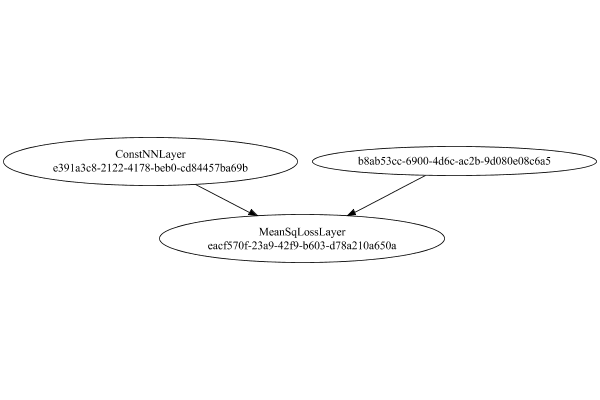

# TargetValueLayer
## Normal
### Json Serialization
Code from [StandardLayerTests.java:69](../../../../../../../../src/main/java/com/simiacryptus/mindseye/test/StandardLayerTests.java#L69) executed in 0.00 seconds: 
```java
    JsonObject json = layer.getJson();
    NNLayer echo = NNLayer.fromJson(json);
    if ((echo == null)) throw new AssertionError("Failed to deserialize");
    if ((layer == echo)) throw new AssertionError("Serialization did not copy");
    if ((!layer.equals(echo))) throw new AssertionError("Serialization not equal");
    return new GsonBuilder().setPrettyPrinting().create().toJson(json);
```

Returns: 

```
    {
      "class": "com.simiacryptus.mindseye.layers.java.TargetValueLayer",
      "id": "eb119b47-86b4-4597-b735-2cb69187c8ac",
      "isFrozen": false,
      "name": "TargetValueLayer/eb119b47-86b4-4597-b735-2cb69187c8ac",
      "inputs": [
        "b8ab53cc-6900-4d6c-ac2b-9d080e08c6a5"
      ],
      "nodes": {
        "d4f73ec5-86b7-4e92-979e-e3414b88c082": "e391a3c8-2122-4178-beb0-cd84457ba69b",
        "799b2b3e-30b2-4cfe-8b5a-d7464575b6ba": "eacf570f-23a9-42f9-b603-d78a210a650a"
      },
      "layers": {
        "e391a3c8-2122-4178-beb0-cd84457ba69b": {
          "class": "com.simiacryptus.mindseye.layers.java.ConstNNLayer",
          "id": "e391a3c8-2122-4178-beb0-cd84457ba69b",
          "isFrozen": true,
          "name": "ConstNNLayer/e391a3c8-2122-4178-beb0-cd84457ba69b",
          "value": [
            0.0,
            0.1,
            0.2
          ]
        },
        "eacf570f-23a9-42f9-b603-d78a210a650a": {
          "class": "com.simiacryptus.mindseye.layers.java.MeanSqLossLayer",
          "id": "eacf570f-23a9-42f9-b603-d78a210a650a",
          "isFrozen": false,
          "name": "MeanSqLossLayer/eacf570f-23a9-42f9-b603-d78a210a650a"
        }
      },
      "links": {
        "d4f73ec5-86b7-4e92-979e-e3414b88c082": [],
        "799b2b3e-30b2-4cfe-8b5a-d7464575b6ba": [
          "b8ab53cc-6900-4d6c-ac2b-9d080e08c6a5",
          "d4f73ec5-86b7-4e92-979e-e3414b88c082"
        ]
      },
      "labels": {},
      "head": "799b2b3e-30b2-4cfe-8b5a-d7464575b6ba",
      "target": "d4f73ec5-86b7-4e92-979e-e3414b88c082"
    }
```


### Network Diagram
Code from [StandardLayerTests.java:80](../../../../../../../../src/main/java/com/simiacryptus/mindseye/test/StandardLayerTests.java#L80) executed in 0.09 seconds: 
```java
    return Graphviz.fromGraph(TestUtil.toGraph((DAGNetwork) layer))
      .height(400).width(600).render(Format.PNG).toImage();
```

Returns: 




### Example Input/Output Pair
Code from [StandardLayerTests.java:153](../../../../../../../../src/main/java/com/simiacryptus/mindseye/test/StandardLayerTests.java#L153) executed in 0.00 seconds: 
```java
    SimpleEval eval = SimpleEval.run(layer, inputPrototype);
    return String.format("--------------------\nInput: \n[%s]\n--------------------\nOutput: \n%s\n--------------------\nDerivative: \n%s",
      Arrays.stream(inputPrototype).map(t -> t.prettyPrint()).reduce((a, b) -> a + ",\n" + b).get(),
      eval.getOutput().prettyPrint(),
      Arrays.stream(eval.getDerivative()).map(t -> t.prettyPrint()).reduce((a, b) -> a + ",\n" + b).get());
```

Returns: 

```
    --------------------
    Input: 
    [[ -0.336, 0.332, 1.588 ]]
    --------------------
    Output: 
    [ 0.6977546666666669 ]
    --------------------
    Derivative: 
    [ -0.224, 0.15466666666666667, 0.9253333333333333 ]
```


### Batch Execution
Code from [StandardLayerTests.java:102](../../../../../../../../src/main/java/com/simiacryptus/mindseye/test/StandardLayerTests.java#L102) executed in 0.00 seconds: 
```java
    return getBatchingTester().test(layer, inputPrototype);
```

Returns: 

```
    ToleranceStatistics{absoluteTol=0.0000e+00 +- 0.0000e+00 [0.0000e+00 - 0.0000e+00] (40#), relativeTol=0.0000e+00 +- 0.0000e+00 [0.0000e+00 - 0.0000e+00] (40#)}
```


### Differential Validation
Code from [StandardLayerTests.java:110](../../../../../../../../src/main/java/com/simiacryptus/mindseye/test/StandardLayerTests.java#L110) executed in 0.00 seconds: 
```java
    return getDerivativeTester().test(layer, inputPrototype);
```
Logging: 
```
    Inputs: [ -0.58, 0.872, -0.048 ]
    Inputs Statistics: {meanExponent=-0.5382714280429695, negative=2, min=-0.048, max=-0.048, mean=0.08133333333333335, count=3.0, positive=1, stdDev=0.5997895927369493, zeros=0}
    Output: [ 0.33129600000000003 ]
    Outputs Statistics: {meanExponent=-0.4797838076689447, negative=0, min=0.33129600000000003, max=0.33129600000000003, mean=0.33129600000000003, count=1.0, positive=1, stdDev=0.0, zeros=0}
    Feedback for input 0
    Inputs Values: [ -0.58, 0.872, -0.048 ]
    Value Statistics: {meanExponent=-0.5382714280429695, negative=2, min=-0.048, max=-0.048, mean=0.08133333333333335, count=3.0, positive=1, stdDev=0.5997895927369493, zeros=0}
    Implemented Feedback: [ [ -0.3866666666666666 ], [ 0.5146666666666666 ], [ -0.16533333333333333 ] ]
    Implemented Statistics: {meanExponent=-0.4942589341473847, negative=2, min=-0.16533333333333333, max=-0.16533333333333333, mean=-0.012444444444444444, count=3.0, positive=1, stdDev=0.3835202764771842, zeros=0}
    Measured Feedback: [ [ -0.38663333333355254
```
...[skipping 705 bytes](etc/111.txt)...
```
    ], [ 0.16533333333333333 ] ]
    Implemented Statistics: {meanExponent=-0.4942589341473847, negative=1, min=0.16533333333333333, max=0.16533333333333333, mean=0.012444444444444444, count=3.0, positive=2, stdDev=0.3835202764771842, zeros=0}
    Measured Gradient: [ [ 0.386699999999629 ], [ -0.5146333333333475 ], [ 0.16536666666677746 ] ]
    Measured Statistics: {meanExponent=-0.49422664770744634, negative=1, min=0.16536666666677746, max=0.16536666666677746, mean=0.012477777777686327, count=3.0, positive=2, stdDev=0.3835202764770847, zeros=0}
    Gradient Error: [ [ 3.333333296240415E-5 ], [ 3.333333331911881E-5 ], [ 3.333333344412992E-5 ] ]
    Error Statistics: {meanExponent=-4.477121255911137, negative=0, min=3.333333344412992E-5, max=3.333333344412992E-5, mean=3.333333324188429E-5, count=3.0, positive=3, stdDev=4.547473508864641E-13, zeros=0}
    Finite-Difference Derivative Accuracy:
    absoluteTol: 3.3333e-05 +- 0.0000e+00 [3.3333e-05 - 3.3333e-05] (6#)
    relativeTol: 5.8764e-05 +- 3.0049e-05 [3.2382e-05 - 1.0082e-04] (6#)
    
```

Returns: 

```
    ToleranceStatistics{absoluteTol=3.3333e-05 +- 0.0000e+00 [3.3333e-05 - 3.3333e-05] (6#), relativeTol=5.8764e-05 +- 3.0049e-05 [3.2382e-05 - 1.0082e-04] (6#)}
```


### Performance
Adding performance wrappers

Code from [TestUtil.java:260](../../../../../../../../src/main/java/com/simiacryptus/mindseye/test/TestUtil.java#L260) executed in 0.00 seconds: 
```java
    network.visitNodes(node -> {
      if (!(node.getLayer() instanceof MonitoringWrapperLayer)) {
        node.setLayer(new MonitoringWrapperLayer(node.getLayer()).shouldRecordSignalMetrics(false));
      }
      else {
        ((MonitoringWrapperLayer) node.getLayer()).shouldRecordSignalMetrics(false);
      }
    });
```

Code from [StandardLayerTests.java:120](../../../../../../../../src/main/java/com/simiacryptus/mindseye/test/StandardLayerTests.java#L120) executed in 0.00 seconds: 
```java
    getPerformanceTester().test(layer, permPrototype);
```
Logging: 
```
    Evaluation performance: 0.000192s +- 0.000018s [0.000171s - 0.000221s]
    Learning performance: 0.000248s +- 0.000046s [0.000215s - 0.000338s]
    
```

Per-layer Performance Metrics:

Code from [TestUtil.java:225](../../../../../../../../src/main/java/com/simiacryptus/mindseye/test/TestUtil.java#L225) executed in 0.00 seconds: 
```java
    Map<NNLayer, MonitoringWrapperLayer> metrics = new HashMap<>();
    network.visitNodes(node -> {
      if ((node.getLayer() instanceof MonitoringWrapperLayer)) {
        MonitoringWrapperLayer layer = node.getLayer();
        metrics.put(layer.getInner(), layer);
      }
    });
    System.out.println("Forward Performance: \n\t" + metrics.entrySet().stream().map(e -> {
      PercentileStatistics performance = e.getValue().getForwardPerformance();
      return String.format("%s -> %.6fs +- %.6fs (%s)", e.getKey(), performance.getMean(), performance.getStdDev(), performance.getCount());
    }).reduce((a, b) -> a + "\n\t" + b));
    System.out.println("Backward Performance: \n\t" + metrics.entrySet().stream().map(e -> {
      PercentileStatistics performance = e.getValue().getBackwardPerformance();
      return String.format("%s -> %.6fs +- %.6fs (%s)", e.getKey(), performance.getMean(), performance.getStdDev(), performance.getCount());
    }).reduce((a, b) -> a + "\n\t" + b));
```
Logging: 
```
    Forward Performance: 
    	Optional[ConstNNLayer/e391a3c8-2122-4178-beb0-cd84457ba69b -> 0.000001s +- 0.000000s (11.0)
    	MeanSqLossLayer/eacf570f-23a9-42f9-b603-d78a210a650a -> 0.000139s +- 0.000041s (11.0)]
    Backward Performance: 
    	Optional[ConstNNLayer/e391a3c8-2122-4178-beb0-cd84457ba69b -> 0.000004s +- 0.000002s (6.0)
    	MeanSqLossLayer/eacf570f-23a9-42f9-b603-d78a210a650a -> 0.000004s +- 0.000005s (6.0)]
    
```

Removing performance wrappers

Code from [TestUtil.java:243](../../../../../../../../src/main/java/com/simiacryptus/mindseye/test/TestUtil.java#L243) executed in 0.00 seconds: 
```java
    network.visitNodes(node -> {
      if (node.getLayer() instanceof MonitoringWrapperLayer) {
        node.setLayer(node.<MonitoringWrapperLayer>getLayer().getInner());
      }
    });
```

