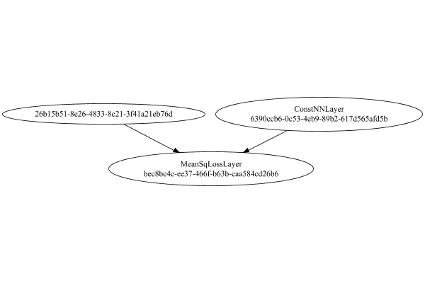
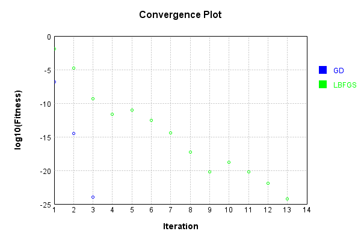
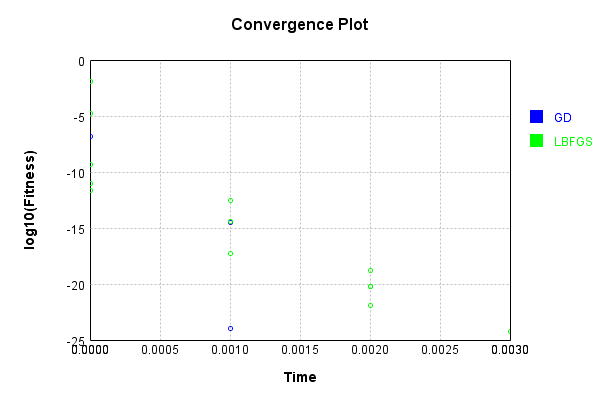

# TargetValueLayer
## Normal
### Network Diagram
This is a network with the following layout:

Code from [StandardLayerTests.java:72](../../../../../../../../src/main/java/com/simiacryptus/mindseye/test/unit/StandardLayerTests.java#L72) executed in 0.12 seconds: 
```java
    return Graphviz.fromGraph(TestUtil.toGraph((DAGNetwork) layer))
      .height(400).width(600).render(Format.PNG).toImage();
```

Returns: 




### Json Serialization
Code from [JsonTest.java:36](../../../../../../../../src/main/java/com/simiacryptus/mindseye/test/unit/JsonTest.java#L36) executed in 0.00 seconds: 
```java
    JsonObject json = layer.getJson();
    NNLayer echo = NNLayer.fromJson(json);
    if ((echo == null)) throw new AssertionError("Failed to deserialize");
    if ((layer == echo)) throw new AssertionError("Serialization did not copy");
    if ((!layer.equals(echo))) throw new AssertionError("Serialization not equal");
    return new GsonBuilder().setPrettyPrinting().create().toJson(json);
```

Returns: 

```
    {
      "class": "com.simiacryptus.mindseye.layers.java.TargetValueLayer",
      "id": "1117d4a8-3ef9-47fd-bbf8-0f305b659ddc",
      "isFrozen": false,
      "name": "TargetValueLayer/1117d4a8-3ef9-47fd-bbf8-0f305b659ddc",
      "inputs": [
        "26b15b51-8e26-4833-8c21-3f41a21eb76d"
      ],
      "nodes": {
        "eccf4cf2-35a9-4181-83f9-3b6882bea2b7": "6390ccb6-0c53-4eb9-89b2-617d565afd5b",
        "dddd29c3-1de6-4f02-8ba9-22dfe1d6953e": "bec8bc4c-ee37-466f-b63b-caa584cd26b6"
      },
      "layers": {
        "6390ccb6-0c53-4eb9-89b2-617d565afd5b": {
          "class": "com.simiacryptus.mindseye.layers.java.ConstNNLayer",
          "id": "6390ccb6-0c53-4eb9-89b2-617d565afd5b",
          "isFrozen": true,
          "name": "ConstNNLayer/6390ccb6-0c53-4eb9-89b2-617d565afd5b",
          "value": [
            0.0,
            0.1,
            0.2
          ]
        },
        "bec8bc4c-ee37-466f-b63b-caa584cd26b6": {
          "class": "com.simiacryptus.mindseye.layers.java.MeanSqLossLayer",
          "id": "bec8bc4c-ee37-466f-b63b-caa584cd26b6",
          "isFrozen": false,
          "name": "MeanSqLossLayer/bec8bc4c-ee37-466f-b63b-caa584cd26b6"
        }
      },
      "links": {
        "eccf4cf2-35a9-4181-83f9-3b6882bea2b7": [],
        "dddd29c3-1de6-4f02-8ba9-22dfe1d6953e": [
          "26b15b51-8e26-4833-8c21-3f41a21eb76d",
          "eccf4cf2-35a9-4181-83f9-3b6882bea2b7"
        ]
      },
      "labels": {},
      "head": "dddd29c3-1de6-4f02-8ba9-22dfe1d6953e",
      "target": "eccf4cf2-35a9-4181-83f9-3b6882bea2b7"
    }
```


### Example Input/Output Pair
Code from [ReferenceIO.java:68](../../../../../../../../src/main/java/com/simiacryptus/mindseye/test/unit/ReferenceIO.java#L68) executed in 0.00 seconds: 
```java
    SimpleEval eval = SimpleEval.run(layer, inputPrototype);
    return String.format("--------------------\nInput: \n[%s]\n--------------------\nOutput: \n%s\n--------------------\nDerivative: \n%s",
      Arrays.stream(inputPrototype).map(t -> t.prettyPrint()).reduce((a, b) -> a + ",\n" + b).get(),
      eval.getOutput().prettyPrint(),
      Arrays.stream(eval.getDerivative()).map(t -> t.prettyPrint()).reduce((a, b) -> a + ",\n" + b).get());
```

Returns: 

```
    --------------------
    Input: 
    [[ 1.284, 1.032, 0.424 ]]
    --------------------
    Output: 
    [ 0.8558186666666668 ]
    --------------------
    Derivative: 
    [ 0.856, 0.6213333333333333, 0.14933333333333332 ]
```


### Batch Execution
Code from [BatchingTester.java:66](../../../../../../../../src/main/java/com/simiacryptus/mindseye/test/unit/BatchingTester.java#L66) executed in 0.00 seconds: 
```java
    return test(reference, inputPrototype);
```

Returns: 

```
    ToleranceStatistics{absoluteTol=0.0000e+00 +- 0.0000e+00 [0.0000e+00 - 0.0000e+00] (40#), relativeTol=0.0000e+00 +- 0.0000e+00 [0.0000e+00 - 0.0000e+00] (40#)}
```


Code from [SingleDerivativeTester.java:77](../../../../../../../../src/main/java/com/simiacryptus/mindseye/test/unit/SingleDerivativeTester.java#L77) executed in 0.00 seconds: 
```java
    return test(component, inputPrototype);
```
Logging: 
```
    Inputs: [ -0.84, 0.572, -0.4 ]
    Inputs Statistics: {meanExponent=-0.23875489793904392, negative=2, min=-0.4, max=-0.4, mean=-0.22266666666666668, count=3.0, positive=1, stdDev=0.5899273024892324, zeros=0}
    Output: [ 0.4294613333333333 ]
    Outputs Statistics: {meanExponent=-0.3670759318930713, negative=0, min=0.4294613333333333, max=0.4294613333333333, mean=0.4294613333333333, count=1.0, positive=1, stdDev=0.0, zeros=0}
    Feedback for input 0
    Inputs Values: [ -0.84, 0.572, -0.4 ]
    Value Statistics: {meanExponent=-0.23875489793904392, negative=2, min=-0.4, max=-0.4, mean=-0.22266666666666668, count=3.0, positive=1, stdDev=0.5899273024892324, zeros=0}
    Implemented Feedback: [ [ -0.5599999999999999 ], [ 0.31466666666666665 ], [ -0.4 ] ]
    Implemented Statistics: {meanExponent=-0.3839670806958102, negative=2, min=-0.4, max=-0.4, mean=-0.21511111111111111, count=3.0, positive=1, stdDev=0.3802616383232036, zeros=0}
    Measured Feedback: [ [ -0.5599666666655789 ], [ 0.31470000000033416 ], [ -0.39996666666652914 ] ]
    Meas
```
...[skipping 579 bytes](etc/419.txt)...
```
    mented Gradient: [ [ 0.5599999999999999 ], [ -0.31466666666666665 ], [ 0.4 ] ]
    Implemented Statistics: {meanExponent=-0.3839670806958102, negative=1, min=0.4, max=0.4, mean=0.21511111111111111, count=3.0, positive=2, stdDev=0.3802616383232036, zeros=0}
    Measured Gradient: [ [ 0.5600333333338758 ], [ -0.3146333333337026 ], [ 0.4000333333337158 ] ]
    Measured Statistics: {meanExponent=-0.3839617368342572, negative=1, min=0.4000333333337158, max=0.4000333333337158, mean=0.21514444444462968, count=3.0, positive=2, stdDev=0.3802616383236011, zeros=0}
    Gradient Error: [ [ 3.3333333875895654E-5 ], [ 3.3333332964069484E-5 ], [ 3.3333333715801494E-5 ] ]
    Error Statistics: {meanExponent=-4.477121252305999, negative=0, min=3.3333333715801494E-5, max=3.3333333715801494E-5, mean=3.333333351858888E-5, count=3.0, positive=3, stdDev=0.0, zeros=0}
    Finite-Difference Derivative Accuracy:
    absoluteTol: 3.3333e-05 +- 6.4311e-13 [3.3333e-05 - 3.3333e-05] (6#)
    relativeTol: 4.1465e-05 +- 9.4741e-06 [2.9761e-05 - 5.2969e-05] (6#)
    
```

Returns: 

```
    ToleranceStatistics{absoluteTol=3.3333e-05 +- 6.4311e-13 [3.3333e-05 - 3.3333e-05] (6#), relativeTol=4.1465e-05 +- 9.4741e-06 [2.9761e-05 - 5.2969e-05] (6#)}
```


### Performance
Adding performance wrappers

Code from [TestUtil.java:302](../../../../../../../../src/main/java/com/simiacryptus/mindseye/test/TestUtil.java#L302) executed in 0.00 seconds: 
```java
    network.visitNodes(node -> {
      if (!(node.getLayer() instanceof MonitoringWrapperLayer)) {
        node.setLayer(new MonitoringWrapperLayer(node.getLayer()).shouldRecordSignalMetrics(false));
      }
      else {
        ((MonitoringWrapperLayer) node.getLayer()).shouldRecordSignalMetrics(false);
      }
    });
```

Now we execute larger-scale runs to benchmark performance:

Code from [PerformanceTester.java:66](../../../../../../../../src/main/java/com/simiacryptus/mindseye/test/unit/PerformanceTester.java#L66) executed in 0.00 seconds: 
```java
    test(component, inputPrototype);
```
Logging: 
```
    100 batches
    Input Dimensions:
    	[3]
    Performance:
    	Evaluation performance: 0.000269s +- 0.000121s [0.000169s - 0.000497s]
    	Learning performance: 0.000043s +- 0.000005s [0.000036s - 0.000050s]
    
```

Per-layer Performance Metrics:

Code from [TestUtil.java:267](../../../../../../../../src/main/java/com/simiacryptus/mindseye/test/TestUtil.java#L267) executed in 0.00 seconds: 
```java
    Map<NNLayer, MonitoringWrapperLayer> metrics = new HashMap<>();
    network.visitNodes(node -> {
      if ((node.getLayer() instanceof MonitoringWrapperLayer)) {
        MonitoringWrapperLayer layer = node.getLayer();
        metrics.put(layer.getInner(), layer);
      }
    });
    System.out.println("Forward Performance: \n\t" + metrics.entrySet().stream().map(e -> {
      PercentileStatistics performance = e.getValue().getForwardPerformance();
      return String.format("%s -> %.6fs +- %.6fs (%s)", e.getKey(), performance.getMean(), performance.getStdDev(), performance.getCount());
    }).reduce((a, b) -> a + "\n\t" + b));
    System.out.println("Backward Performance: \n\t" + metrics.entrySet().stream().map(e -> {
      PercentileStatistics performance = e.getValue().getBackwardPerformance();
      return String.format("%s -> %.6fs +- %.6fs (%s)", e.getKey(), performance.getMean(), performance.getStdDev(), performance.getCount());
    }).reduce((a, b) -> a + "\n\t" + b));
```
Logging: 
```
    Forward Performance: 
    	Optional[ConstNNLayer/70f149f6-6f14-4594-9942-ed88b8b20d57 -> 0.000000s +- 0.000000s (11.0)
    	MeanSqLossLayer/3d050805-ce3e-456d-a373-ffcda3c9431f -> 0.000136s +- 0.000039s (11.0)]
    Backward Performance: 
    	Optional[ConstNNLayer/70f149f6-6f14-4594-9942-ed88b8b20d57 -> NaNs +- NaNs (0.0)
    	MeanSqLossLayer/3d050805-ce3e-456d-a373-ffcda3c9431f -> 0.000005s +- 0.000012s (6.0)]
    
```

Removing performance wrappers

Code from [TestUtil.java:285](../../../../../../../../src/main/java/com/simiacryptus/mindseye/test/TestUtil.java#L285) executed in 0.00 seconds: 
```java
    network.visitNodes(node -> {
      if (node.getLayer() instanceof MonitoringWrapperLayer) {
        node.setLayer(node.<MonitoringWrapperLayer>getLayer().getInner());
      }
    });
```

### Input Learning
In this test, we use a network to learn this target input, given it's pre-evaluated output:

Code from [LearningTester.java:127](../../../../../../../../src/main/java/com/simiacryptus/mindseye/test/unit/LearningTester.java#L127) executed in 0.00 seconds: 
```java
    return Arrays.stream(input_target).map(x -> x.prettyPrint()).reduce((a, b) -> a + "\n" + b).orElse("");
```

Returns: 

```
    [ 1.24, -1.368, 1.492 ]
```


First, we use a conjugate gradient descent method, which converges the fastest for purely linear functions.

Code from [LearningTester.java:300](../../../../../../../../src/main/java/com/simiacryptus/mindseye/test/unit/LearningTester.java#L300) executed in 0.00 seconds: 
```java
    return new IterativeTrainer(trainable)
      .setLineSearchFactory(label -> new QuadraticSearch())
      .setOrientation(new GradientDescent())
      .setMonitor(monitor)
      .setTimeout(30, TimeUnit.SECONDS)
      .setMaxIterations(250)
      .setTerminateThreshold(0)
      .run();
```
Logging: 
```
    Constructing line search parameters: GD
    F(0.0) = LineSearchPoint{point=PointSample{avg=0.043042417777777696}, derivative=-0.4579168430196297}
    New Minimum: 0.043042417777777696 > 0.04304241773198595
    F(1.0E-10) = LineSearchPoint{point=PointSample{avg=0.04304241773198595}, derivative=-0.45791684276337963}, delta = -4.579174539554032E-11
    New Minimum: 0.04304241773198595 > 0.04304241745723596
    F(7.000000000000001E-10) = LineSearchPoint{point=PointSample{avg=0.04304241745723596}, derivative=-0.4579168412258816}, delta = -3.2054173898510285E-10
    New Minimum: 0.04304241745723596 > 0.04304241553398527
    F(4.900000000000001E-9) = LineSearchPoint{point=PointSample{avg=0.04304241553398527}, derivative=-0.45791683046339116}, delta = -2.2437924226959005E-9
    New Minimum: 0.04304241553398527 > 0.04304240207123144
    F(3.430000000000001E-8) = LineSearchPoint{point=PointSample{avg=0.04304240207123144}, derivative=-0.4579167551259572}, delta = -1.570654625804302E-8
    New Minimum: 0.04304240207123144 > 0.04304230783201767
    F(2.4
```
...[skipping 3526 bytes](etc/420.txt)...
```
    Line Search: 0.0005
    Low gradient: 1.63509474965409E-7
    F(0.0) = LineSearchPoint{point=PointSample{avg=2.8047273502469085E-15}, derivative=-2.673534840346371E-14}
    New Minimum: 2.8047273502469085E-15 > 1.17510317885055E-24
    F(0.20981845444751843) = LineSearchPoint{point=PointSample{avg=1.17510317885055E-24}, derivative=5.472408770157567E-19}, delta = -2.8047273490718056E-15
    1.17510317885055E-24 <= 2.8047273502469085E-15
    Converged to right
    Iteration 3 complete. Error: 1.17510317885055E-24 Total: 249863222308854.7800; Orientation: 0.0000; Line Search: 0.0001
    Zero gradient: 3.3468450506096208E-12
    F(0.0) = LineSearchPoint{point=PointSample{avg=1.17510317885055E-24}, derivative=-1.1201371792790114E-23}
    New Minimum: 1.17510317885055E-24 > 0.0
    F(0.20981845444751843) = LineSearchPoint{point=PointSample{avg=0.0}, derivative=0.0}, delta = -1.17510317885055E-24
    0.0 <= 1.17510317885055E-24
    Converged to right
    Iteration 4 complete. Error: 0.0 Total: 249863222579583.7800; Orientation: 0.0000; Line Search: 0.0002
    
```

Returns: 

```
    0.0
```


Training Converged

Next, we run the same optimization using L-BFGS, which is nearly ideal for purely second-order or quadratic functions.

Code from [LearningTester.java:324](../../../../../../../../src/main/java/com/simiacryptus/mindseye/test/unit/LearningTester.java#L324) executed in 0.00 seconds: 
```java
    return new IterativeTrainer(trainable)
      .setLineSearchFactory(label -> new ArmijoWolfeSearch())
      .setOrientation(new LBFGS())
      .setMonitor(monitor)
      .setTimeout(30, TimeUnit.SECONDS)
      .setMaxIterations(250)
      .setTerminateThreshold(0)
      .run();
```
Logging: 
```
    LBFGS Accumulation History: 1 points
    Constructing line search parameters: GD
    th(0)=0.043042417777777696;dx=-0.4579168430196297
    Armijo: th(2.154434690031884)=2.136454676740879; dx=1.3034808156824353 delta=-2.0934122589631015
    Armijo: th(1.077217345015942)=0.6467686550464747; dx=1.2461228516369838 delta=-0.603726237268697
    New Minimum: 0.043042417777777696 > 0.02860238115904669
    WOLF (strong): th(0.3590724483386473)=0.02860238115904669; dx=0.3362066703537874 delta=0.014440036618731007
    New Minimum: 0.02860238115904669 > 0.01201859789604163
    END: th(0.08976811208466183)=0.01201859789604163; dx=-0.23596342843075677 delta=0.031023819881736067
    Iteration 1 complete. Error: 0.01201859789604163 Total: 249863225795564.7800; Orientation: 0.0000; Line Search: 0.0004
    LBFGS Accumulation History: 1 points
    th(0)=0.01201859789604163;dx=-0.12159137713659086
    New Minimum: 0.01201859789604163 > 1.516599013777248E-5
    END: th(0.1933995347338658)=1.516599013777248E-5; dx=-0.004197174330322536 delta=0.012003431905903857
    Itera
```
...[skipping 5441 bytes](etc/421.txt)...
```
     Orientation: 0.0000; Line Search: 0.0002
    LBFGS Accumulation History: 1 points
    th(0)=1.201242676590727E-22;dx=-1.1450539898203016E-21
    New Minimum: 1.201242676590727E-22 > 8.821880806893151E-23
    WOLF (strong): th(0.38961854203412266)=8.821880806893151E-23; dx=9.812760082885533E-22 delta=3.190545959014119E-23
    New Minimum: 8.821880806893151E-23 > 6.143698033667816E-25
    END: th(0.19480927101706133)=6.143698033667816E-25; dx=-8.188899076284762E-23 delta=1.1950989785570592E-22
    Iteration 13 complete. Error: 6.143698033667816E-25 Total: 249863228774444.7800; Orientation: 0.0000; Line Search: 0.0002
    LBFGS Accumulation History: 1 points
    th(0)=6.143698033667816E-25;dx=-5.856323691086492E-24
    Armijo: th(0.41970385141897976)=6.14717937545017E-25; dx=5.857982706293861E-24 delta=-3.4813417823534777E-28
    New Minimum: 6.143698033667816E-25 > 0.0
    END: th(0.20985192570948988)=0.0; dx=0.0 delta=6.143698033667816E-25
    Iteration 14 complete. Error: 0.0 Total: 249863228984758.7800; Orientation: 0.0000; Line Search: 0.0001
    
```

Returns: 

```
    0.0
```


Training Converged

Code from [LearningTester.java:96](../../../../../../../../src/main/java/com/simiacryptus/mindseye/test/unit/LearningTester.java#L96) executed in 0.00 seconds: 
```java
    return TestUtil.compare(runs);
```

Returns: 




Code from [LearningTester.java:99](../../../../../../../../src/main/java/com/simiacryptus/mindseye/test/unit/LearningTester.java#L99) executed in 0.00 seconds: 
```java
    return TestUtil.compareTime(runs);
```

Returns: 




### Model Learning
In this test, attempt to train a network to emulate a randomized network given an example input/output. The target state is:

Code from [LearningTester.java:176](../../../../../../../../src/main/java/com/simiacryptus/mindseye/test/unit/LearningTester.java#L176) executed in 0.00 seconds: 
```java
    return network_target.state().stream().map(Arrays::toString).reduce((a, b) -> a + "\n" + b).orElse("");
```

Returns: 

```
    [0.1, 0.0, 0.2]
```


First, we use a conjugate gradient descent method, which converges the fastest for purely linear functions.

Code from [LearningTester.java:300](../../../../../../../../src/main/java/com/simiacryptus/mindseye/test/unit/LearningTester.java#L300) executed in 0.00 seconds: 
```java
    return new IterativeTrainer(trainable)
      .setLineSearchFactory(label -> new QuadraticSearch())
      .setOrientation(new GradientDescent())
      .setMonitor(monitor)
      .setTimeout(30, TimeUnit.SECONDS)
      .setMaxIterations(250)
      .setTerminateThreshold(0)
      .run();
```

Returns: 

```
    0.0
```


This training run resulted in the following configuration:

Code from [LearningTester.java:189](../../../../../../../../src/main/java/com/simiacryptus/mindseye/test/unit/LearningTester.java#L189) executed in 0.00 seconds: 
```java
    return network_gd.state().stream().map(Arrays::toString).reduce((a, b) -> a + "\n" + b).orElse("");
```

Returns: 

```
    [0.1, 0.0, 0.2]
    [1.9947626666666667]
```


Next, we run the same optimization using L-BFGS, which is nearly ideal for purely second-order or quadratic functions.

Code from [LearningTester.java:324](../../../../../../../../src/main/java/com/simiacryptus/mindseye/test/unit/LearningTester.java#L324) executed in 0.00 seconds: 
```java
    return new IterativeTrainer(trainable)
      .setLineSearchFactory(label -> new ArmijoWolfeSearch())
      .setOrientation(new LBFGS())
      .setMonitor(monitor)
      .setTimeout(30, TimeUnit.SECONDS)
      .setMaxIterations(250)
      .setTerminateThreshold(0)
      .run();
```

Returns: 

```
    0.0
```


This training run resulted in the following configuration:

Code from [LearningTester.java:203](../../../../../../../../src/main/java/com/simiacryptus/mindseye/test/unit/LearningTester.java#L203) executed in 0.00 seconds: 
```java
    return network_lbfgs.state().stream().map(Arrays::toString).reduce((a, b) -> a + "\n" + b).orElse("");
```

Returns: 

```
    [0.1, 0.0, 0.2]
    [1.9947626666666667]
```


Code from [LearningTester.java:96](../../../../../../../../src/main/java/com/simiacryptus/mindseye/test/unit/LearningTester.java#L96) executed in 0.00 seconds: 
```java
    return TestUtil.compare(runs);
```

Code from [LearningTester.java:99](../../../../../../../../src/main/java/com/simiacryptus/mindseye/test/unit/LearningTester.java#L99) executed in 0.00 seconds: 
```java
    return TestUtil.compareTime(runs);
```

### Composite Learning
In this test, attempt to train a network to emulate a randomized network given an example input/output. The target state is:

Code from [LearningTester.java:219](../../../../../../../../src/main/java/com/simiacryptus/mindseye/test/unit/LearningTester.java#L219) executed in 0.00 seconds: 
```java
    return network_target.state().stream().map(Arrays::toString).reduce((a, b) -> a + "\n" + b).orElse("");
```

Returns: 

```
    [0.1, 0.0, 0.2]
```


We simultaneously regress this target input:

Code from [LearningTester.java:223](../../../../../../../../src/main/java/com/simiacryptus/mindseye/test/unit/LearningTester.java#L223) executed in 0.00 seconds: 
```java
    return Arrays.stream(testInput).map(x -> x.prettyPrint()).reduce((a, b) -> a + "\n" + b).orElse("");
```

Returns: 

```
    [ 1.492, 1.24, -1.368 ]
```


Which produces the following output:

Code from [LearningTester.java:230](../../../../../../../../src/main/java/com/simiacryptus/mindseye/test/unit/LearningTester.java#L230) executed in 0.00 seconds: 
```java
    return Stream.of(targetOutput).map(x -> x.prettyPrint()).reduce((a, b) -> a + "\n" + b).orElse("");
```

Returns: 

```
    [ 1.9779626666666668 ]
```


First, we use a conjugate gradient descent method, which converges the fastest for purely linear functions.

Code from [LearningTester.java:300](../../../../../../../../src/main/java/com/simiacryptus/mindseye/test/unit/LearningTester.java#L300) executed in 0.00 seconds: 
```java
    return new IterativeTrainer(trainable)
      .setLineSearchFactory(label -> new QuadraticSearch())
      .setOrientation(new GradientDescent())
      .setMonitor(monitor)
      .setTimeout(30, TimeUnit.SECONDS)
      .setMaxIterations(250)
      .setTerminateThreshold(0)
      .run();
```

Returns: 

```
    0.0
```


This training run resulted in the following configuration:

Code from [LearningTester.java:245](../../../../../../../../src/main/java/com/simiacryptus/mindseye/test/unit/LearningTester.java#L245) executed in 0.00 seconds: 
```java
    return network_gd.state().stream().map(Arrays::toString).reduce((a, b) -> a + "\n" + b).orElse("");
```

Returns: 

```
    [1.9779626666666668]
    [0.1, 0.2, 0.0]
```


And regressed input:

Code from [LearningTester.java:249](../../../../../../../../src/main/java/com/simiacryptus/mindseye/test/unit/LearningTester.java#L249) executed in 0.00 seconds: 
```java
    return Arrays.stream(input_gd).map(x -> x.prettyPrint()).reduce((a, b) -> a + "\n" + b).orElse("");
```

Returns: 

```
    [ 1.492, -1.368, 1.24 ]
```


Which produces the following output:

Code from [LearningTester.java:256](../../../../../../../../src/main/java/com/simiacryptus/mindseye/test/unit/LearningTester.java#L256) executed in 0.00 seconds: 
```java
    return Stream.of(regressedOutput).map(x -> x.prettyPrint()).reduce((a, b) -> a + "\n" + b).orElse("");
```

Returns: 

```
    [ 0.0 ]
```


Next, we run the same optimization using L-BFGS, which is nearly ideal for purely second-order or quadratic functions.

Code from [LearningTester.java:324](../../../../../../../../src/main/java/com/simiacryptus/mindseye/test/unit/LearningTester.java#L324) executed in 0.00 seconds: 
```java
    return new IterativeTrainer(trainable)
      .setLineSearchFactory(label -> new ArmijoWolfeSearch())
      .setOrientation(new LBFGS())
      .setMonitor(monitor)
      .setTimeout(30, TimeUnit.SECONDS)
      .setMaxIterations(250)
      .setTerminateThreshold(0)
      .run();
```

Returns: 

```
    0.0
```


This training run resulted in the following configuration:

Code from [LearningTester.java:266](../../../../../../../../src/main/java/com/simiacryptus/mindseye/test/unit/LearningTester.java#L266) executed in 0.00 seconds: 
```java
    return network_lbfgs.state().stream().map(Arrays::toString).reduce((a, b) -> a + "\n" + b).orElse("");
```

Returns: 

```
    [1.9779626666666668]
    [0.1, 0.2, 0.0]
```


And regressed input:

Code from [LearningTester.java:270](../../../../../../../../src/main/java/com/simiacryptus/mindseye/test/unit/LearningTester.java#L270) executed in 0.00 seconds: 
```java
    return Arrays.stream(input_lbgfs).map(x -> x.prettyPrint()).reduce((a, b) -> a + "\n" + b).orElse("");
```

Returns: 

```
    [ 1.492, -1.368, 1.24 ]
```


Which produces the following output:

Code from [LearningTester.java:277](../../../../../../../../src/main/java/com/simiacryptus/mindseye/test/unit/LearningTester.java#L277) executed in 0.00 seconds: 
```java
    return Stream.of(regressedOutput).map(x -> x.prettyPrint()).reduce((a, b) -> a + "\n" + b).orElse("");
```

Returns: 

```
    [ 0.0 ]
```


Code from [LearningTester.java:96](../../../../../../../../src/main/java/com/simiacryptus/mindseye/test/unit/LearningTester.java#L96) executed in 0.00 seconds: 
```java
    return TestUtil.compare(runs);
```

Code from [LearningTester.java:99](../../../../../../../../src/main/java/com/simiacryptus/mindseye/test/unit/LearningTester.java#L99) executed in 0.00 seconds: 
```java
    return TestUtil.compareTime(runs);
```

