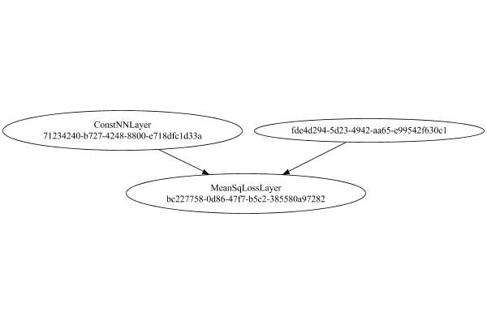

# TargetValueLayer
## Normal
### Json Serialization
Code from [StandardLayerTests.java:68](../../../../../../../../src/main/java/com/simiacryptus/mindseye/test/StandardLayerTests.java#L68) executed in 0.00 seconds: 
```java
    JsonObject json = layer.getJson();
    NNLayer echo = NNLayer.fromJson(json);
    if ((echo == null)) throw new AssertionError("Failed to deserialize");
    if ((layer == echo)) throw new AssertionError("Serialization did not copy");
    if ((!layer.equals(echo))) throw new AssertionError("Serialization not equal");
    return new GsonBuilder().setPrettyPrinting().create().toJson(json);
```

Returns: 

```
    {
      "class": "com.simiacryptus.mindseye.layers.java.TargetValueLayer",
      "id": "ccf76eb5-6445-4bbe-8964-bc60e7c79d71",
      "isFrozen": false,
      "name": "TargetValueLayer/ccf76eb5-6445-4bbe-8964-bc60e7c79d71",
      "inputs": [
        "fde4d294-5d23-4942-aa65-e99542f630c1"
      ],
      "nodes": {
        "91a13637-4881-48de-8070-c1dd83ec33ec": "71234240-b727-4248-8800-e718dfc1d33a",
        "b8cd6891-d4fb-4f3f-9926-f8bde2d9e913": "bc227758-0d86-47f7-b5c2-385580a97282"
      },
      "layers": {
        "71234240-b727-4248-8800-e718dfc1d33a": {
          "class": "com.simiacryptus.mindseye.layers.java.ConstNNLayer",
          "id": "71234240-b727-4248-8800-e718dfc1d33a",
          "isFrozen": true,
          "name": "ConstNNLayer/71234240-b727-4248-8800-e718dfc1d33a",
          "value": [
            0.0,
            0.1,
            0.2
          ]
        },
        "bc227758-0d86-47f7-b5c2-385580a97282": {
          "class": "com.simiacryptus.mindseye.layers.java.MeanSqLossLayer",
          "id": "bc227758-0d86-47f7-b5c2-385580a97282",
          "isFrozen": false,
          "name": "MeanSqLossLayer/bc227758-0d86-47f7-b5c2-385580a97282"
        }
      },
      "links": {
        "91a13637-4881-48de-8070-c1dd83ec33ec": [],
        "b8cd6891-d4fb-4f3f-9926-f8bde2d9e913": [
          "fde4d294-5d23-4942-aa65-e99542f630c1",
          "91a13637-4881-48de-8070-c1dd83ec33ec"
        ]
      },
      "labels": {},
      "head": "b8cd6891-d4fb-4f3f-9926-f8bde2d9e913",
      "target": "91a13637-4881-48de-8070-c1dd83ec33ec"
    }
```


### Network Diagram
Code from [StandardLayerTests.java:79](../../../../../../../../src/main/java/com/simiacryptus/mindseye/test/StandardLayerTests.java#L79) executed in 0.07 seconds: 
```java
    return Graphviz.fromGraph(TestUtil.toGraph((DAGNetwork) layer))
      .height(400).width(600).render(Format.PNG).toImage();
```

Returns: 




### Example Input/Output Pair
Code from [StandardLayerTests.java:152](../../../../../../../../src/main/java/com/simiacryptus/mindseye/test/StandardLayerTests.java#L152) executed in 0.00 seconds: 
```java
    SimpleEval eval = SimpleEval.run(layer, inputPrototype);
    return String.format("--------------------\nInput: \n[%s]\n--------------------\nOutput: \n%s\n--------------------\nDerivative: \n%s",
      Arrays.stream(inputPrototype).map(t -> t.prettyPrint()).reduce((a, b) -> a + ",\n" + b).get(),
      eval.getOutput().prettyPrint(),
      Arrays.stream(eval.getDerivative()).map(t -> t.prettyPrint()).reduce((a, b) -> a + ",\n" + b).get());
```

Returns: 

```
    --------------------
    Input: 
    [[ -0.424, 0.052, 1.0 ]]
    --------------------
    Output: 
    [ 0.2740266666666667 ]
    --------------------
    Derivative: 
    [ -0.2826666666666666, -0.032, 0.5333333333333333 ]
```


### Batch Execution
Code from [StandardLayerTests.java:101](../../../../../../../../src/main/java/com/simiacryptus/mindseye/test/StandardLayerTests.java#L101) executed in 0.00 seconds: 
```java
    return getBatchingTester().test(layer, inputPrototype);
```

Returns: 

```
    ToleranceStatistics{absoluteTol=0.0000e+00 +- 0.0000e+00 [0.0000e+00 - 0.0000e+00] (40#), relativeTol=0.0000e+00 +- 0.0000e+00 [0.0000e+00 - 0.0000e+00] (40#)}
```


### Differential Validation
Code from [StandardLayerTests.java:109](../../../../../../../../src/main/java/com/simiacryptus/mindseye/test/StandardLayerTests.java#L109) executed in 0.00 seconds: 
```java
    return getDerivativeTester().test(layer, inputPrototype);
```
Logging: 
```
    Inputs: [ 1.26, 1.352, 1.536 ]
    Inputs Statistics: {meanExponent=0.1392461508062244, negative=0, min=1.536, max=1.536, mean=1.3826666666666665, count=3.0, positive=3, stdDev=0.11474415986107127, zeros=0}
    Output: [ 1.6466666666666667 ]
    Outputs Statistics: {meanExponent=0.2166056942039845, negative=0, min=1.6466666666666667, max=1.6466666666666667, mean=1.6466666666666667, count=1.0, positive=1, stdDev=0.0, zeros=0}
    Feedback for input 0
    Inputs Values: [ 1.26, 1.352, 1.536 ]
    Value Statistics: {meanExponent=0.1392461508062244, negative=0, min=1.536, max=1.536, mean=1.3826666666666665, count=3.0, positive=3, stdDev=0.11474415986107127, zeros=0}
    Implemented Feedback: [ [ 0.84 ], [ 0.8346666666666667 ], [ 0.8906666666666667 ] ]
    Implemented Statistics: {meanExponent=-0.06816414834518103, negative=0, min=0.8906666666666667, max=0.8906666666666667, mean=0.855111111111111, count=3.0, positive=3, stdDev=0.025235679229475727, zeros=0}
    Measured Feedback: [ [ 0.8400333333336008 ], [ 0.8347000000030746 ], [ 0.8907000
```
...[skipping 647 bytes](etc/152.txt)...
```
     -0.8906666666666667 ] ]
    Implemented Statistics: {meanExponent=-0.06816414834518103, negative=3, min=-0.8906666666666667, max=-0.8906666666666667, mean=-0.855111111111111, count=3.0, positive=0, stdDev=0.025235679229475727, zeros=0}
    Measured Gradient: [ [ -0.839966666665859 ], [ -0.8346333333353328 ], [ -0.8906333333325023 ] ]
    Measured Statistics: {meanExponent=-0.06818109250020245, negative=3, min=-0.8906333333325023, max=-0.8906333333325023, mean=-0.8550777777778981, count=3.0, positive=0, stdDev=0.02523567922870363, zeros=0}
    Gradient Error: [ [ 3.333333414101691E-5 ], [ 3.3333331333817995E-5 ], [ 3.333333416444262E-5 ] ]
    Error Statistics: {meanExponent=-4.477121256286261, negative=0, min=3.333333416444262E-5, max=3.333333416444262E-5, mean=3.333333321309251E-5, count=3.0, positive=3, stdDev=1.3642420526593924E-12, zeros=0}
    Finite-Difference Derivative Accuracy:
    absoluteTol: 3.3333e-05 +- 1.4380e-12 [3.3333e-05 - 3.3333e-05] (6#)
    relativeTol: 1.9507e-05 +- 5.6433e-07 [1.8712e-05 - 1.9968e-05] (6#)
    
```

Returns: 

```
    ToleranceStatistics{absoluteTol=3.3333e-05 +- 1.4380e-12 [3.3333e-05 - 3.3333e-05] (6#), relativeTol=1.9507e-05 +- 5.6433e-07 [1.8712e-05 - 1.9968e-05] (6#)}
```


### Performance
Adding performance wrappers

Code from [TestUtil.java:269](../../../../../../../../src/main/java/com/simiacryptus/mindseye/test/TestUtil.java#L269) executed in 0.00 seconds: 
```java
    network.visitNodes(node -> {
      if (!(node.getLayer() instanceof MonitoringWrapperLayer)) {
        node.setLayer(new MonitoringWrapperLayer(node.getLayer()).shouldRecordSignalMetrics(false));
      }
      else {
        ((MonitoringWrapperLayer) node.getLayer()).shouldRecordSignalMetrics(false);
      }
    });
```

Code from [StandardLayerTests.java:119](../../../../../../../../src/main/java/com/simiacryptus/mindseye/test/StandardLayerTests.java#L119) executed in 0.00 seconds: 
```java
    getPerformanceTester().test(layer, permPrototype);
```
Logging: 
```
    100 batches
    Input Dimensions:
    	[3]
    Performance:
    	Evaluation performance: 0.000242s +- 0.000063s [0.000199s - 0.000362s]
    	Learning performance: 0.000274s +- 0.000034s [0.000224s - 0.000329s]
    
```

Per-layer Performance Metrics:

Code from [TestUtil.java:234](../../../../../../../../src/main/java/com/simiacryptus/mindseye/test/TestUtil.java#L234) executed in 0.00 seconds: 
```java
    Map<NNLayer, MonitoringWrapperLayer> metrics = new HashMap<>();
    network.visitNodes(node -> {
      if ((node.getLayer() instanceof MonitoringWrapperLayer)) {
        MonitoringWrapperLayer layer = node.getLayer();
        metrics.put(layer.getInner(), layer);
      }
    });
    System.out.println("Forward Performance: \n\t" + metrics.entrySet().stream().map(e -> {
      PercentileStatistics performance = e.getValue().getForwardPerformance();
      return String.format("%s -> %.6fs +- %.6fs (%s)", e.getKey(), performance.getMean(), performance.getStdDev(), performance.getCount());
    }).reduce((a, b) -> a + "\n\t" + b));
    System.out.println("Backward Performance: \n\t" + metrics.entrySet().stream().map(e -> {
      PercentileStatistics performance = e.getValue().getBackwardPerformance();
      return String.format("%s -> %.6fs +- %.6fs (%s)", e.getKey(), performance.getMean(), performance.getStdDev(), performance.getCount());
    }).reduce((a, b) -> a + "\n\t" + b));
```
Logging: 
```
    Forward Performance: 
    	Optional[MeanSqLossLayer/bc227758-0d86-47f7-b5c2-385580a97282 -> 0.000145s +- 0.000046s (11.0)
    	ConstNNLayer/71234240-b727-4248-8800-e718dfc1d33a -> 0.000002s +- 0.000001s (11.0)]
    Backward Performance: 
    	Optional[MeanSqLossLayer/bc227758-0d86-47f7-b5c2-385580a97282 -> 0.000008s +- 0.000013s (6.0)
    	ConstNNLayer/71234240-b727-4248-8800-e718dfc1d33a -> 0.000007s +- 0.000003s (6.0)]
    
```

Removing performance wrappers

Code from [TestUtil.java:252](../../../../../../../../src/main/java/com/simiacryptus/mindseye/test/TestUtil.java#L252) executed in 0.00 seconds: 
```java
    network.visitNodes(node -> {
      if (node.getLayer() instanceof MonitoringWrapperLayer) {
        node.setLayer(node.<MonitoringWrapperLayer>getLayer().getInner());
      }
    });
```

