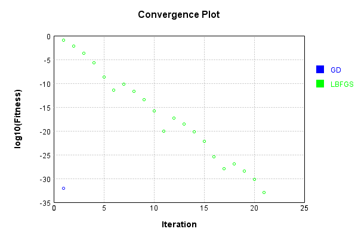
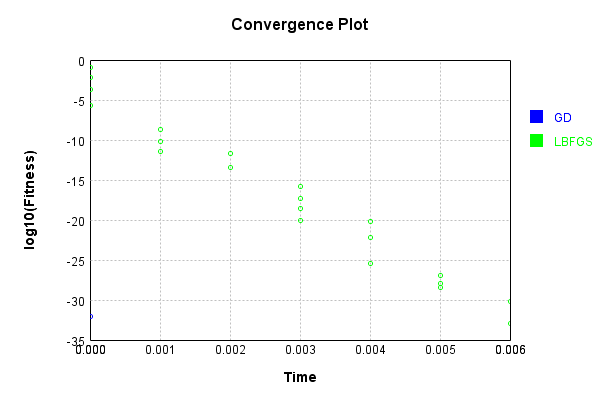

# VariableLayer
## VariableLayerTest
### Json Serialization
Code from [JsonTest.java:36](../../../../../../../src/main/java/com/simiacryptus/mindseye/test/unit/JsonTest.java#L36) executed in 0.00 seconds: 
```java
    JsonObject json = layer.getJson();
    NNLayer echo = NNLayer.fromJson(json);
    if ((echo == null)) throw new AssertionError("Failed to deserialize");
    if ((layer == echo)) throw new AssertionError("Serialization did not copy");
    if ((!layer.equals(echo))) throw new AssertionError("Serialization not equal");
    return new GsonBuilder().setPrettyPrinting().create().toJson(json);
```

Returns: 

```
    {
      "class": "com.simiacryptus.mindseye.layers.java.VariableLayer",
      "id": "2e4f9ceb-1b1d-41aa-85bb-c06ca6d3c8ce",
      "isFrozen": false,
      "name": "VariableLayer/2e4f9ceb-1b1d-41aa-85bb-c06ca6d3c8ce",
      "inner": {
        "class": "com.simiacryptus.mindseye.layers.java.MonitoringSynapse",
        "id": "04f22b07-f58e-4efd-8303-5e49bbc896f3",
        "isFrozen": false,
        "name": "MonitoringSynapse/04f22b07-f58e-4efd-8303-5e49bbc896f3",
        "totalBatches": 0,
        "totalItems": 0
      }
    }
```


### Example Input/Output Pair
Code from [ReferenceIO.java:68](../../../../../../../src/main/java/com/simiacryptus/mindseye/test/unit/ReferenceIO.java#L68) executed in 0.00 seconds: 
```java
    SimpleEval eval = SimpleEval.run(layer, inputPrototype);
    return String.format("--------------------\nInput: \n[%s]\n--------------------\nOutput: \n%s\n--------------------\nDerivative: \n%s",
      Arrays.stream(inputPrototype).map(t -> t.prettyPrint()).reduce((a, b) -> a + ",\n" + b).get(),
      eval.getOutput().prettyPrint(),
      Arrays.stream(eval.getDerivative()).map(t -> t.prettyPrint()).reduce((a, b) -> a + ",\n" + b).get());
```

Returns: 

```
    --------------------
    Input: 
    [[ 1.112, 0.492, -0.94 ]]
    --------------------
    Output: 
    [ 1.112, 0.492, -0.94 ]
    --------------------
    Derivative: 
    [ 1.0, 1.0, 1.0 ]
```


### Batch Execution
Code from [BatchingTester.java:66](../../../../../../../src/main/java/com/simiacryptus/mindseye/test/unit/BatchingTester.java#L66) executed in 0.00 seconds: 
```java
    return test(reference, inputPrototype);
```

Returns: 

```
    ToleranceStatistics{absoluteTol=0.0000e+00 +- 0.0000e+00 [0.0000e+00 - 0.0000e+00] (60#), relativeTol=0.0000e+00 +- 0.0000e+00 [0.0000e+00 - 0.0000e+00] (60#)}
```


Code from [SingleDerivativeTester.java:77](../../../../../../../src/main/java/com/simiacryptus/mindseye/test/unit/SingleDerivativeTester.java#L77) executed in 0.00 seconds: 
```java
    return test(component, inputPrototype);
```
Logging: 
```
    Inputs: [ 1.736, -1.724, 1.816 ]
    Inputs Statistics: {meanExponent=0.2450676088380778, negative=1, min=1.816, max=1.816, mean=0.6093333333333334, count=3.0, positive=2, stdDev=1.65023903992388, zeros=0}
    Output: [ 1.736, -1.724, 1.816 ]
    Outputs Statistics: {meanExponent=0.2450676088380778, negative=1, min=1.816, max=1.816, mean=0.6093333333333334, count=3.0, positive=2, stdDev=1.65023903992388, zeros=0}
    Feedback for input 0
    Inputs Values: [ 1.736, -1.724, 1.816 ]
    Value Statistics: {meanExponent=0.2450676088380778, negative=1, min=1.816, max=1.816, mean=0.6093333333333334, count=3.0, positive=2, stdDev=1.65023903992388, zeros=0}
    Implemented Feedback: [ [ 1.0, 0.0, 0.0 ], [ 0.0, 1.0, 0.0 ], [ 0.0, 0.0, 1.0 ] ]
    Implemented Statistics: {meanExponent=0.0, negative=0, min=1.0, max=1.0, mean=0.3333333333333333, count=9.0, positive=3, stdDev=0.4714045207910317, zeros=6}
    Measured Feedback: [ [ 0.9999999999998899, 0.0, 0.0 ], [ 0.0, 0.9999999999998899, 0.0 ], [ 0.0, 0.0, 0.9999999999998899 ] ]
    Measured Statistics: {meanExponent=-4.7830642341045674E-14, negative=0, min=0.9999999999998899, max=0.9999999999998899, mean=0.3333333333332966, count=9.0, positive=3, stdDev=0.4714045207909798, zeros=6}
    Feedback Error: [ [ -1.1013412404281553E-13, 0.0, 0.0 ], [ 0.0, -1.1013412404281553E-13, 0.0 ], [ 0.0, 0.0, -1.1013412404281553E-13 ] ]
    Error Statistics: {meanExponent=-12.958078098036827, negative=3, min=-1.1013412404281553E-13, max=-1.1013412404281553E-13, mean=-3.671137468093851E-14, count=9.0, positive=0, stdDev=5.1917723967143496E-14, zeros=6}
    Finite-Difference Derivative Accuracy:
    absoluteTol: 3.6711e-14 +- 5.1918e-14 [0.0000e+00 - 1.1013e-13] (9#)
    relativeTol: 5.5067e-14 +- 0.0000e+00 [5.5067e-14 - 5.5067e-14] (3#)
    
```

Returns: 

```
    ToleranceStatistics{absoluteTol=3.6711e-14 +- 5.1918e-14 [0.0000e+00 - 1.1013e-13] (9#), relativeTol=5.5067e-14 +- 0.0000e+00 [5.5067e-14 - 5.5067e-14] (3#)}
```


### Performance
Now we execute larger-scale runs to benchmark performance:

Code from [PerformanceTester.java:66](../../../../../../../src/main/java/com/simiacryptus/mindseye/test/unit/PerformanceTester.java#L66) executed in 0.01 seconds: 
```java
    test(component, inputPrototype);
```
Logging: 
```
    100 batches
    Input Dimensions:
    	[3]
    Performance:
    	Evaluation performance: 0.000406s +- 0.000358s [0.000193s - 0.001121s]
    	Learning performance: 0.000169s +- 0.000014s [0.000146s - 0.000192s]
    
```

### Input Learning
In this test, we use a network to learn this target input, given it's pre-evaluated output:

Code from [LearningTester.java:127](../../../../../../../src/main/java/com/simiacryptus/mindseye/test/unit/LearningTester.java#L127) executed in 0.00 seconds: 
```java
    return Arrays.stream(input_target).map(x -> x.prettyPrint()).reduce((a, b) -> a + "\n" + b).orElse("");
```

Returns: 

```
    [ 1.92, 1.48, 0.18 ]
```


First, we use a conjugate gradient descent method, which converges the fastest for purely linear functions.

Code from [LearningTester.java:300](../../../../../../../src/main/java/com/simiacryptus/mindseye/test/unit/LearningTester.java#L300) executed in 0.00 seconds: 
```java
    return new IterativeTrainer(trainable)
      .setLineSearchFactory(label -> new QuadraticSearch())
      .setOrientation(new GradientDescent())
      .setMonitor(monitor)
      .setTimeout(30, TimeUnit.SECONDS)
      .setMaxIterations(250)
      .setTerminateThreshold(0)
      .run();
```
Logging: 
```
    Constructing line search parameters: GD
    F(0.0) = LineSearchPoint{point=PointSample{avg=1.6370666666666667}, derivative=-2.1827555555555556}
    New Minimum: 1.6370666666666667 > 1.6370666664483908
    F(1.0E-10) = LineSearchPoint{point=PointSample{avg=1.6370666664483908}, derivative=-2.182755555410038}, delta = -2.1827584184563875E-10
    New Minimum: 1.6370666664483908 > 1.6370666651387378
    F(7.000000000000001E-10) = LineSearchPoint{point=PointSample{avg=1.6370666651387378}, derivative=-2.182755554536936}, delta = -1.527928894518027E-9
    New Minimum: 1.6370666651387378 > 1.6370666559711644
    F(4.900000000000001E-9) = LineSearchPoint{point=PointSample{avg=1.6370666559711644}, derivative=-2.1827555484252206}, delta = -1.0695502261626189E-8
    New Minimum: 1.6370666559711644 > 1.637066591798152
    F(3.430000000000001E-8) = LineSearchPoint{point=PointSample{avg=1.637066591798152}, derivative=-2.182755505643212}, delta = -7.48685147211603E-8
    New Minimum: 1.637066591798152 > 1.6370661425870996
    F(2.4010000000000004E-7) = LineS
```
...[skipping 1526 bytes](etc/422.txt)...
```
    462644054
    New Minimum: 1.2339118520402261 > 0.009768670384743364
    F(1.3841287201) = LineSearchPoint{point=PointSample{avg=0.009768670384743364}, derivative=-0.1686124532873718}, delta = -1.6272979962819234
    Loops = 12
    New Minimum: 0.009768670384743364 > 9.244463733058732E-33
    F(1.5) = LineSearchPoint{point=PointSample{avg=9.244463733058732E-33}, derivative=-1.2878587085651815E-16}, delta = -1.6370666666666667
    Right bracket at 1.5
    Converged to right
    Iteration 1 complete. Error: 9.244463733058732E-33 Total: 249863380336496.6200; Orientation: 0.0000; Line Search: 0.0014
    Zero gradient: 1.1102230246251565E-16
    F(0.0) = LineSearchPoint{point=PointSample{avg=9.244463733058732E-33}, derivative=-1.232595164407831E-32}
    New Minimum: 9.244463733058732E-33 > 0.0
    F(1.5) = LineSearchPoint{point=PointSample{avg=0.0}, derivative=0.0}, delta = -9.244463733058732E-33
    0.0 <= 9.244463733058732E-33
    Converged to right
    Iteration 2 complete. Error: 0.0 Total: 249863380588132.6200; Orientation: 0.0000; Line Search: 0.0002
    
```

Returns: 

```
    0.0
```


Training Converged

Next, we run the same optimization using L-BFGS, which is nearly ideal for purely second-order or quadratic functions.

Code from [LearningTester.java:324](../../../../../../../src/main/java/com/simiacryptus/mindseye/test/unit/LearningTester.java#L324) executed in 0.01 seconds: 
```java
    return new IterativeTrainer(trainable)
      .setLineSearchFactory(label -> new ArmijoWolfeSearch())
      .setOrientation(new LBFGS())
      .setMonitor(monitor)
      .setTimeout(30, TimeUnit.SECONDS)
      .setMaxIterations(250)
      .setTerminateThreshold(0)
      .run();
```
Logging: 
```
    LBFGS Accumulation History: 1 points
    Constructing line search parameters: GD
    th(0)=1.6370666666666667;dx=-2.1827555555555556
    New Minimum: 1.6370666666666667 > 0.3116136489756027
    WOLF (strong): th(2.154434690031884)=0.3116136489756027; dx=0.9523139702769147 delta=1.325453017691064
    New Minimum: 0.3116136489756027 > 0.13005234005672422
    END: th(1.077217345015942)=0.13005234005672422; dx=-0.6152207926393201 delta=1.5070143266099425
    Iteration 1 complete. Error: 0.13005234005672422 Total: 249863384049194.6200; Orientation: 0.0000; Line Search: 0.0004
    LBFGS Accumulation History: 1 points
    th(0)=0.13005234005672422;dx=-0.1734031200756323
    New Minimum: 0.13005234005672422 > 0.038940761503977496
    WOLF (strong): th(2.3207944168063896)=0.038940761503977496; dx=0.09488554187659129 delta=0.09111157855274674
    New Minimum: 0.038940761503977496 > 0.006666197186453702
    END: th(1.1603972084031948)=0.006666197186453702; dx=-0.03925878909952052 delta=0.12338614287027053
    Iteration 2 complete. Error: 0.006666197186453702 To
```
...[skipping 9676 bytes](etc/423.txt)...
```
    249863390151436.6200; Orientation: 0.0000; Line Search: 0.0002
    LBFGS Accumulation History: 1 points
    th(0)=6.501939492251308E-31;dx=-8.669252656335077E-31
    New Minimum: 6.501939492251308E-31 > 5.76238239360661E-31
    WOLF (strong): th(2.8257016782407427)=5.76238239360661E-31; dx=8.148823586918438E-31 delta=7.395570986446986E-32
    New Minimum: 5.76238239360661E-31 > 1.0271626370065257E-33
    END: th(1.4128508391203713)=1.0271626370065257E-33; dx=-2.602145347083198E-32 delta=6.491667865881243E-31
    Iteration 21 complete. Error: 1.0271626370065257E-33 Total: 249863390378849.6200; Orientation: 0.0000; Line Search: 0.0002
    LBFGS Accumulation History: 1 points
    th(0)=1.0271626370065257E-33;dx=-1.3695501826753676E-33
    Armijo: th(3.043894859641584)=1.0271626370065257E-33; dx=1.3695501826753676E-33 delta=0.0
    New Minimum: 1.0271626370065257E-33 > 0.0
    END: th(1.521947429820792)=0.0; dx=0.0 delta=1.0271626370065257E-33
    Iteration 22 complete. Error: 0.0 Total: 249863390588593.6000; Orientation: 0.0000; Line Search: 0.0002
    
```

Returns: 

```
    0.0
```


Training Converged

Code from [LearningTester.java:96](../../../../../../../src/main/java/com/simiacryptus/mindseye/test/unit/LearningTester.java#L96) executed in 0.00 seconds: 
```java
    return TestUtil.compare(runs);
```

Returns: 




Code from [LearningTester.java:99](../../../../../../../src/main/java/com/simiacryptus/mindseye/test/unit/LearningTester.java#L99) executed in 0.00 seconds: 
```java
    return TestUtil.compareTime(runs);
```

Returns: 




