# ExpandPipeline
This is a network with the following layout:

Code from [NLayerTest.java:87](../../../../../../../src/test/java/com/simiacryptus/mindseye/network/NLayerTest.java#L87) executed in 2.05 seconds: 
```java
    return Graphviz.fromGraph(TestUtil.toGraph((DAGNetwork) layer))
      .height(400).width(600).render(Format.PNG).toImage();
```

Returns: 

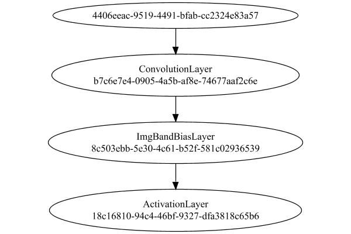


### Json Serialization
Code from [JsonTest.java:36](../../../../../../../src/main/java/com/simiacryptus/mindseye/test/unit/JsonTest.java#L36) executed in 0.03 seconds: 
```java
    JsonObject json = layer.getJson();
    NNLayer echo = NNLayer.fromJson(json);
    if ((echo == null)) throw new AssertionError("Failed to deserialize");
    if ((layer == echo)) throw new AssertionError("Serialization did not copy");
    if ((!layer.equals(echo))) throw new AssertionError("Serialization not equal");
    return new GsonBuilder().setPrettyPrinting().create().toJson(json);
```

Returns: 

```
    {
      "class": "com.simiacryptus.mindseye.network.PipelineNetwork",
      "id": "904850b1-f59a-4ffb-b190-f809f59137a3",
      "isFrozen": false,
      "name": "PipelineNetwork/904850b1-f59a-4ffb-b190-f809f59137a3",
      "inputs": [
        "4406eeac-9519-4491-bfab-cc2324e83a57"
      ],
      "nodes": {
        "e95542e1-443d-4b19-8d12-417f105ec116": "b7c6e7e4-0905-4a5b-af8e-74677aaf2c6e",
        "6b45cdfa-dc81-4520-9837-d42e976ef593": "8c503ebb-5e30-4c61-b52f-581c02936539",
        "d7d62060-f2e0-486e-bd37-95e58b4abdd1": "18c16810-94c4-46bf-9327-dfa3818c65b6"
      },
      "layers": {
        "b7c6e7e4-0905-4a5b-af8e-74677aaf2c6e": {
          "class": "com.simiacryptus.mindseye.layers.cudnn.ConvolutionLayer",
          "id": "b7c6e7e4-0905-4a5b-af8e-74677aaf2c6e",
          "isFrozen": false,
          "name": "ConvolutionLayer/b7c6e7e4-0905-4a5b-af8e-74677aaf2c6e",
          "filter": [
            [
              [
                -0.089,
                -0.0864,
                0.0034000000000000002
              ],
              [
                -0.08560000000000001,
                -0.047200000000000006,
     
```
...[skipping 8542 bytes](etc/1.txt)...
```
    
          "id": "8c503ebb-5e30-4c61-b52f-581c02936539",
          "isFrozen": false,
          "name": "ImgBandBiasLayer/8c503ebb-5e30-4c61-b52f-581c02936539",
          "bias": [
            0.0,
            0.0,
            0.0,
            0.0,
            0.0,
            0.0,
            0.0,
            0.0,
            0.0
          ],
          "precision": "Double"
        },
        "18c16810-94c4-46bf-9327-dfa3818c65b6": {
          "class": "com.simiacryptus.mindseye.layers.cudnn.ActivationLayer",
          "id": "18c16810-94c4-46bf-9327-dfa3818c65b6",
          "isFrozen": false,
          "name": "ActivationLayer/18c16810-94c4-46bf-9327-dfa3818c65b6",
          "mode": 1,
          "precision": "Double"
        }
      },
      "links": {
        "e95542e1-443d-4b19-8d12-417f105ec116": [
          "4406eeac-9519-4491-bfab-cc2324e83a57"
        ],
        "6b45cdfa-dc81-4520-9837-d42e976ef593": [
          "e95542e1-443d-4b19-8d12-417f105ec116"
        ],
        "d7d62060-f2e0-486e-bd37-95e58b4abdd1": [
          "6b45cdfa-dc81-4520-9837-d42e976ef593"
        ]
      },
      "labels": {},
      "head": "d7d62060-f2e0-486e-bd37-95e58b4abdd1"
    }
```


### Input Learning
In this test, we use a network to learn this target input, given it's pre-evaluated output:

Code from [LearningTester.java:127](../../../../../../../src/main/java/com/simiacryptus/mindseye/test/unit/LearningTester.java#L127) executed in 0.00 seconds: 
```java
    return Arrays.stream(input_target).map(x -> x.prettyPrint()).reduce((a, b) -> a + "\n" + b).orElse("");
```

Returns: 

```
    [
    	[ [ 0.054, -0.038200000000000005, 0.030400000000000003 ], [ 0.07460000000000001, 0.058, -0.09 ], [ 0.0164, 0.0416, -0.08660000000000001 ], [ -0.06380000000000001, -0.0536, 0.04240000000000001 ], [ 0.0342, 0.0648, -0.0712 ] ],
    	[ [ 0.0796, 0.017400000000000002, -0.009600000000000001 ], [ 0.07640000000000001, -0.0456, -0.0922 ], [ 0.023600000000000003, 0.0872, 0.0198 ], [ -0.0154, -0.011200000000000002, -0.0582 ], [ -0.0454, 0.0692, 0.08360000000000001 ] ],
    	[ [ -0.011200000000000002, -0.0022, -0.031400000000000004 ], [ -0.0108, 0.0482, 0.037200000000000004 ], [ 0.0724, 0.065, -0.0302 ], [ -0.0288, 0.0432, 0.0952 ], [ -0.055, 0.05940000000000001, 0.047 ] ],
    	[ [ -0.0522, -0.027800000000000002, -0.085 ], [ -0.09680000000000001, 0.085, 0.0 ], [ -0.0792, 0.063, -0.08580000000000002 ], [ 0.0416, -0.0052, -0.020200000000000003 ], [ -0.0728, -0.084, 0.094 ] ],
    	[ [ -0.0984, 0.0346, -0.0872 ], [ -0.015600000000000001, -0.0796, 0.041400000000000006 ], [ 0.0654, -0.016, -0.0044 ], [ 0.066, 0.0268, 0.0964 ], [ -0.07540000000000001, -6.000000000000001E-4, 0.049400000000000006 ] ]
    ]
```


First, we use a conjugate gradient descent method, which converges the fastest for purely linear functions.

Code from [LearningTester.java:300](../../../../../../../src/main/java/com/simiacryptus/mindseye/test/unit/LearningTester.java#L300) executed in 8.35 seconds: 
```java
    return new IterativeTrainer(trainable)
      .setLineSearchFactory(label -> new QuadraticSearch())
      .setOrientation(new GradientDescent())
      .setMonitor(monitor)
      .setTimeout(30, TimeUnit.SECONDS)
      .setMaxIterations(250)
      .setTerminateThreshold(0)
      .run();
```
Logging: 
```
    Constructing line search parameters: GD
    F(0.0) = LineSearchPoint{point=PointSample{avg=1.7344738944198405E-4}, derivative=-3.2395308421682916E-7}
    New Minimum: 1.7344738944198405E-4 > 1.734473894419516E-4
    F(1.0E-10) = LineSearchPoint{point=PointSample{avg=1.734473894419516E-4}, derivative=-3.239530842167611E-7}, delta = -3.244475001162872E-17
    New Minimum: 1.734473894419516E-4 > 1.7344738944175732E-4
    F(7.000000000000001E-10) = LineSearchPoint{point=PointSample{avg=1.7344738944175732E-4}, derivative=-3.239530842163526E-7}, delta = -2.267337793210311E-16
    New Minimum: 1.7344738944175732E-4 > 1.734473894403966E-4
    F(4.900000000000001E-9) = LineSearchPoint{point=PointSample{avg=1.734473894403966E-4}, derivative=-3.2395308421349296E-7}, delta = -1.5874617158989635E-15
    New Minimum: 1.734473894403966E-4 > 1.7344738943087242E-4
    F(3.430000000000001E-8) = LineSearchPoint{point=PointSample{avg=1.7344738943087242E-4}, derivative=-3.239530841934756E-7}, delta = -1.1111635700097877E-14
    New Minimum: 1.7344738943087242
```
...[skipping 298627 bytes](etc/2.txt)...
```
    895605595E-28}, delta = -2.8517964270126766E-13
    Right bracket at 596.6188286567535
    Converged to right
    Iteration 249 complete. Error: 8.079203190288234E-12 Total: 251266059888292.9700; Orientation: 0.0001; Line Search: 0.0311
    Low gradient: 3.319173082974068E-8
    F(0.0) = LineSearchPoint{point=PointSample{avg=8.079203190288234E-12}, derivative=-1.1016909954739579E-15}
    New Minimum: 8.079203190288234E-12 > 7.814079049824513E-12
    F(596.6188286567535) = LineSearchPoint{point=PointSample{avg=7.814079049824513E-12}, derivative=2.1293546940654082E-16}, delta = -2.6512414046372144E-13
    7.814079049824513E-12 <= 8.079203190288234E-12
    New Minimum: 7.814079049824513E-12 > 7.803790347379835E-12
    F(499.982016808945) = LineSearchPoint{point=PointSample{avg=7.803790347379835E-12}, derivative=-5.647751043316681E-29}, delta = -2.754128429083992E-13
    Left bracket at 499.982016808945
    Converged to left
    Iteration 250 complete. Error: 7.803790347379835E-12 Total: 251266077179356.9400; Orientation: 0.0001; Line Search: 0.0137
    
```

Returns: 

```
    7.803790347379835E-12
```


Training Converged

Next, we run the same optimization using L-BFGS, which is nearly ideal for purely second-order or quadratic functions.

Code from [LearningTester.java:324](../../../../../../../src/main/java/com/simiacryptus/mindseye/test/unit/LearningTester.java#L324) executed in 2.20 seconds: 
```java
    return new IterativeTrainer(trainable)
      .setLineSearchFactory(label -> new ArmijoWolfeSearch())
      .setOrientation(new LBFGS())
      .setMonitor(monitor)
      .setTimeout(30, TimeUnit.SECONDS)
      .setMaxIterations(250)
      .setTerminateThreshold(0)
      .run();
```
Logging: 
```
    LBFGS Accumulation History: 1 points
    Constructing line search parameters: GD
    th(0)=1.7344738944198405E-4;dx=-3.2395308421682916E-7
    New Minimum: 1.7344738944198405E-4 > 1.7275103381944457E-4
    WOLFE (weak): th(2.154434690031884)=1.7275103381944457E-4; dx=-3.2248621214369156E-7 delta=6.963556225394812E-7
    New Minimum: 1.7275103381944457E-4 > 1.7205783847698525E-4
    WOLFE (weak): th(4.308869380063768)=1.7205783847698525E-4; dx=-3.210193400705539E-7 delta=1.3895509649987999E-6
    New Minimum: 1.7205783847698525E-4 > 1.693166599079504E-4
    WOLFE (weak): th(12.926608140191302)=1.693166599079504E-4; dx=-3.1515185177800337E-7 delta=4.1307295340336635E-6
    New Minimum: 1.693166599079504E-4 > 1.576011809671391E-4
    END: th(51.70643256076521)=1.576011809671391E-4; dx=-2.892695796107901E-7 delta=1.584620847484494E-5
    Iteration 1 complete. Error: 1.576011809671391E-4 Total: 251266170013916.9000; Orientation: 0.0066; Line Search: 0.0504
    LBFGS Accumulation History: 1 points
    th(0)=1.576011809671391E-4;dx=-2.5883136873296575E-7
```
...[skipping 62348 bytes](etc/3.txt)...
```
    54290229057324E-15 delta=2.4712728768265354E-12
    New Minimum: 2.946924333565951E-11 > 2.4837079669945894E-11
    END: th(3548.706655294466)=2.4837079669945894E-11; dx=-1.870502144973024E-15 delta=7.103436542540154E-12
    Iteration 121 complete. Error: 2.4837079669945894E-11 Total: 251268265979817.7500; Orientation: 0.0002; Line Search: 0.0142
    LBFGS Accumulation History: 1 points
    th(0)=2.4837079669945894E-11;dx=-1.6422008506916198E-15
    New Minimum: 2.4837079669945894E-11 > 1.392884089815672E-11
    END: th(7645.456722913416)=1.392884089815672E-11; dx=-1.2113209641919449E-15 delta=1.0908238771789174E-11
    Iteration 122 complete. Error: 1.392884089815672E-11 Total: 251268276446219.7200; Orientation: 0.0001; Line Search: 0.0070
    LBFGS Accumulation History: 1 points
    th(0)=1.392884089815672E-11;dx=-9.517651651380769E-16
    MAX ALPHA: th(0)=1.392884089815672E-11;th'(0)=-9.517651651380769E-16;
    Iteration 123 failed, aborting. Error: 1.392884089815672E-11 Total: 251268286845650.7200; Orientation: 0.0001; Line Search: 0.0068
    
```

Returns: 

```
    1.392884089815672E-11
```


Training Converged

Code from [LearningTester.java:96](../../../../../../../src/main/java/com/simiacryptus/mindseye/test/unit/LearningTester.java#L96) executed in 0.09 seconds: 
```java
    return TestUtil.compare(runs);
```

Returns: 

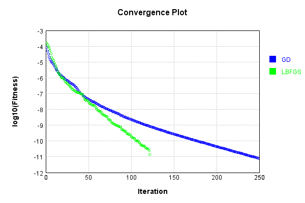


Code from [LearningTester.java:99](../../../../../../../src/main/java/com/simiacryptus/mindseye/test/unit/LearningTester.java#L99) executed in 0.01 seconds: 
```java
    return TestUtil.compareTime(runs);
```

Returns: 

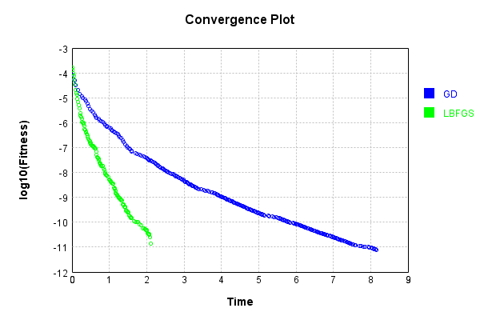


### Model Learning
In this test, attempt to train a network to emulate a randomized network given an example input/output. The target state is:

Code from [LearningTester.java:176](../../../../../../../src/main/java/com/simiacryptus/mindseye/test/unit/LearningTester.java#L176) executed in 0.00 seconds: 
```java
    return network_target.state().stream().map(Arrays::toString).reduce((a, b) -> a + "\n" + b).orElse("");
```

Returns: 

```
    [0.0, 0.0, 0.0, 0.0, 0.0, 0.0, 0.0, 0.0, 0.0]
    [-0.0422, 0.0796, -0.037, 0.0, -2.0E-4, 0.0698, -0.019600000000000003, -0.0342, -0.05240000000000001, 0.004200000000000001, 0.040600000000000004, -0.09680000000000001, 0.0488, -0.018400000000000003, 0.0688, 0.0068000000000000005, -0.08280000000000001, -4.0E-4, -0.015, -0.007600000000000001, -0.055200000000000006, -0.0678, 0.0288, 0.0054, -0.0862, 0.06180000000000001, 0.09, -4.0E-4, -0.0946, -0.097, -0.053200000000000004, -0.039, -0.03780000000000001, 0.045, 0.0842, -0.0786, 0.07479999999999999, -0.07479999999999999, 0.083, -0.074, 0.04580000000000001, 0.0512, 0.09780000000000001, 0.0178, -0.0166, -0.023600000000000003, 0.0722, 0.022, -0.006600000000000001, 0.026200000000000005, 0.07740000000000001, 0.0674, -0.026, -0.037, -0.0804, -0.0698, -0.089, -0.06520000000000001, 0.0158, -0.0034000000000000002, 0.0158, -0.0734, -0.0342, -0.053200000000000004, 0.069, -0.05940000000000001, -0.0708, 0.0324, 0.062, 0.0124, -0.07560000000000001, -0.0496, 0.097, -0.0318, 0.0476, 0
```
...[skipping 1130 bytes](etc/4.txt)...
```
    001, 0.0908, 0.086, -0.0892, -0.021200000000000004, -0.019600000000000003, 0.0246, -0.06720000000000001, -0.039400000000000004, 0.08, -0.0874, 0.0446, -0.0162, 0.047200000000000006, -0.001, 0.0302, -0.0446, 0.0534, -0.0258, -0.024, -0.07680000000000001, 0.09540000000000001, -0.04, -0.048400000000000006, -0.0826, 0.094, -0.076, -0.0064, -0.091, -0.0844, 0.0256, -0.0674, 0.0492, -0.036800000000000006, -0.0984, -0.091, -0.011, -0.011600000000000001, -0.012, -0.0376, -0.081, 0.0216, -0.0016, 0.09980000000000001, 0.058, -0.0128, 0.07479999999999999, -0.045, 0.0674, -0.0882, -0.0626, 0.07, -0.0068000000000000005, 0.056600000000000004, -0.0488, 0.055600000000000004, 0.0422, 0.040600000000000004, -0.07680000000000001, 0.03780000000000001, 0.0576, -0.028200000000000003, 0.0824, -0.038400000000000004, -0.0024000000000000002, 0.06, 0.0964, 0.0762, -0.0054, -0.0864, -0.045200000000000004, 0.029, 0.060200000000000004, 0.053200000000000004, 0.0666, 0.0712, 0.0644, -0.0946, 0.0026, 0.05240000000000001, -0.09060000000000001]
```


First, we use a conjugate gradient descent method, which converges the fastest for purely linear functions.

Code from [LearningTester.java:300](../../../../../../../src/main/java/com/simiacryptus/mindseye/test/unit/LearningTester.java#L300) executed in 9.06 seconds: 
```java
    return new IterativeTrainer(trainable)
      .setLineSearchFactory(label -> new QuadraticSearch())
      .setOrientation(new GradientDescent())
      .setMonitor(monitor)
      .setTimeout(30, TimeUnit.SECONDS)
      .setMaxIterations(250)
      .setTerminateThreshold(0)
      .run();
```
Logging: 
```
    Constructing line search parameters: GD
    F(0.0) = LineSearchPoint{point=PointSample{avg=1.3171113417679653E-4}, derivative=-4.901920707087438E-6}
    New Minimum: 1.3171113417679653E-4 > 1.317111341763063E-4
    F(1.0E-10) = LineSearchPoint{point=PointSample{avg=1.317111341763063E-4}, derivative=-4.9019207070399E-6}, delta = -4.902220122893208E-16
    New Minimum: 1.317111341763063E-4 > 1.3171113417336514E-4
    F(7.000000000000001E-10) = LineSearchPoint{point=PointSample{avg=1.3171113417336514E-4}, derivative=-4.9019207067546665E-6}, delta = -3.431391455699373E-15
    New Minimum: 1.3171113417336514E-4 > 1.3171113415277704E-4
    F(4.900000000000001E-9) = LineSearchPoint{point=PointSample{avg=1.3171113415277704E-4}, derivative=-4.901920704758039E-6}, delta = -2.4019496244406802E-14
    New Minimum: 1.3171113415277704E-4 > 1.317111340086606E-4
    F(3.430000000000001E-8) = LineSearchPoint{point=PointSample{avg=1.317111340086606E-4}, derivative=-4.9019206907816445E-6}, delta = -1.6813593160976137E-13
    New Minimum: 1.317111340086606E-
```
...[skipping 317661 bytes](etc/5.txt)...
```
    001; Line Search: 0.0319
    F(0.0) = LineSearchPoint{point=PointSample{avg=5.616041010141565E-5}, derivative=-1.2655048161330235E-9}
    New Minimum: 5.616041010141565E-5 > 5.615414483250667E-5
    F(21.867163166910117) = LineSearchPoint{point=PointSample{avg=5.615414483250667E-5}, derivative=6.706576815836241E-10}, delta = -6.2652689089773696E-9
    5.615414483250667E-5 <= 5.616041010141565E-5
    New Minimum: 5.615414483250667E-5 > 5.615149039110245E-5
    F(14.292705460170154) = LineSearchPoint{point=PointSample{avg=5.615149039110245E-5}, derivative=1.7356194019565502E-11}, delta = -8.919710313194413E-9
    Right bracket at 14.292705460170154
    New Minimum: 5.615149039110245E-5 > 5.615148871301792E-5
    F(14.099335354548415) = LineSearchPoint{point=PointSample{avg=5.615148871301792E-5}, derivative=6.307252170716836E-24}, delta = -8.921388397725282E-9
    Right bracket at 14.099335354548415
    Converged to right
    Iteration 250 complete. Error: 5.615148871301792E-5 Total: 251277739552907.2800; Orientation: 0.0000; Line Search: 0.0219
    
```

Returns: 

```
    5.615148871301792E-5
```


This training run resulted in the following configuration:

Code from [LearningTester.java:189](../../../../../../../src/main/java/com/simiacryptus/mindseye/test/unit/LearningTester.java#L189) executed in 0.00 seconds: 
```java
    return network_gd.state().stream().map(Arrays::toString).reduce((a, b) -> a + "\n" + b).orElse("");
```

Returns: 

```
    [0.0, 0.007745759999999999, 0.0, 0.007496440000000003, 0.0, 0.01401639999999999, 0.0, 0.010795320000000011, 0.021565320000000006, 0.0, 0.0, 0.018247999999999997, 0.0, 0.0, 0.015553040000000002, 0.005951960000000003, 0.02450416, 0.0, 0.0, 0.0, 0.011420040000000003, 0.0, 0.0039672399999999995, 0.014853280000000002, 0.0, 0.005182000000000001, 0.0020174800000000003, 0.0, 0.014552160000000003, 0.0, 0.007047480000000002, 0.0, 0.037238480000000004, 0.0, 0.0, 0.02206628, 0.0, 0.0, 0.024911240000000005, 0.0019308799999999996, 0.0, 0.0, 0.015187479999999998, 0.0, 0.0, 0.004952920000000001, 0.0, 0.023301320000000004, 0.0, 0.0, 0.003920560000000002, 0.0, 0.0, 0.012628280000000006, 0.004574560000000001, 0.0, 0.0011030799999999987, 0.0, 0.0, 0.0, 0.0, 0.012106360000000002, 0.0, 5.336000000000005E-4, 0.024276040000000002, 0.0260802, 0.0011146799999999968, 0.0, 0.01854548, 0.003049320000000003, 3.3539999999999997E-4, 0.013946839999999999, 0.0, 0.0, 0.026631639999999998, 0.005543039999999999, 0.0, 0.010591280000000002, 0.0, 0
```
...[skipping 6249 bytes](etc/6.txt)...
```
    , 0.022975863065905152, 0.08031536406549727, -0.09230779283691345, 0.07364743577772338, -0.0729201417192934, 0.02544574665240187, -3.2687359424335415E-5, 0.09371272566083737, 0.01660347433899479, 0.09435134074832208, 0.005544692154008895, -0.06371186677299459, 0.0683957052466738, -0.06589522233786464, 0.11326486917452197, -0.0987285508952309, -0.04063672304880986, 0.06436584601057342, 0.022151294744073517, -0.0720299749082158, -0.04170120651376737, 0.026486294711722144, -0.051442814808107064, 0.008931383666459587, -0.10261163500687241, 0.04908202421314458, -0.02850485748044052, -0.09735237193631673, 0.05139051615218975, 0.030821246048156788, 0.0026506144470212325, -0.04693719651098576, 0.07374223030093502, -0.03313071409649671, 0.050546572190765804, -0.04807251851588505, -0.09823566364785305, -0.06405540301949696, 0.03293704557364471, -0.019706807662867552, -0.07836307334048002, 0.07546301389715175, 0.03790972900632198, 0.006300427376527383, -0.10776412233930664, -0.044398977090365055, -0.0030735781754997206]
```


Next, we run the same optimization using L-BFGS, which is nearly ideal for purely second-order or quadratic functions.

Code from [LearningTester.java:324](../../../../../../../src/main/java/com/simiacryptus/mindseye/test/unit/LearningTester.java#L324) executed in 4.80 seconds: 
```java
    return new IterativeTrainer(trainable)
      .setLineSearchFactory(label -> new ArmijoWolfeSearch())
      .setOrientation(new LBFGS())
      .setMonitor(monitor)
      .setTimeout(30, TimeUnit.SECONDS)
      .setMaxIterations(250)
      .setTerminateThreshold(0)
      .run();
```
Logging: 
```
    LBFGS Accumulation History: 1 points
    Constructing line search parameters: GD
    th(0)=1.2903119803177963E-4;dx=-4.005210905979998E-6
    New Minimum: 1.2903119803177963E-4 > 1.2107093882846712E-4
    END: th(2.154434690031884)=1.2107093882846712E-4; dx=-3.3158597372210365E-6 delta=7.960259203312512E-6
    Iteration 1 complete. Error: 1.2107093882846712E-4 Total: 251277809382872.2500; Orientation: 0.0004; Line Search: 0.0133
    LBFGS Accumulation History: 1 points
    th(0)=1.2107093882846712E-4;dx=-2.768892341622501E-6
    New Minimum: 1.2107093882846712E-4 > 1.1057359301984346E-4
    END: th(4.641588833612779)=1.1057359301984346E-4; dx=-1.842036358862511E-6 delta=1.0497345808623657E-5
    Iteration 2 complete. Error: 1.1057359301984346E-4 Total: 251277832927502.2000; Orientation: 0.0002; Line Search: 0.0157
    LBFGS Accumulation History: 1 points
    th(0)=1.1057359301984346E-4;dx=-1.3514312435790337E-6
    New Minimum: 1.1057359301984346E-4 > 1.0100878483797435E-4
    END: th(10.000000000000002)=1.0100878483797435E-4; dx=-7.059665356134285E-
```
...[skipping 140952 bytes](etc/7.txt)...
```
    51496E-10
    New Minimum: 6.34689503952834E-5 > 6.346893898734961E-5
    WOLF (strong): th(38.950917448042524)=6.346893898734961E-5; dx=3.4164696020159745E-12 delta=1.140793378815938E-11
    New Minimum: 6.346893898734961E-5 > 6.346891448540341E-5
    END: th(12.983639149347509)=6.346891448540341E-5; dx=-1.5293294933459035E-12 delta=3.590987998223962E-11
    Iteration 249 complete. Error: 6.346891448540341E-5 Total: 251282535711279.4700; Orientation: 0.0001; Line Search: 0.0146
    LBFGS Accumulation History: 1 points
    th(0)=6.346891448540341E-5;dx=-1.9311077630448783E-12
    New Minimum: 6.346891448540341E-5 > 6.346886253057228E-5
    WOLFE (weak): th(27.972402586210332)=6.346886253057228E-5; dx=-1.7836129151324247E-12 delta=5.1954831130113406E-11
    New Minimum: 6.346886253057228E-5 > 6.346881470152638E-5
    END: th(55.944805172420665)=6.346881470152638E-5; dx=-1.6361180672199146E-12 delta=9.978387702973355E-11
    Iteration 250 complete. Error: 6.346881470152638E-5 Total: 251282550137456.4700; Orientation: 0.0001; Line Search: 0.0109
    
```

Returns: 

```
    6.346881470152638E-5
```


This training run resulted in the following configuration:

Code from [LearningTester.java:203](../../../../../../../src/main/java/com/simiacryptus/mindseye/test/unit/LearningTester.java#L203) executed in 0.00 seconds: 
```java
    return network_lbfgs.state().stream().map(Arrays::toString).reduce((a, b) -> a + "\n" + b).orElse("");
```

Returns: 

```
    [-0.004777603924110884, -0.006264323387769868, -0.0038725374039635125, -0.008943429615528598, -0.027433950124814477, -0.006846606500240624, -0.014684870016380495, -0.02750556771703345, -0.011051210621992174]
    [0.0, 0.007745759999999999, 0.0, 0.007496440000000003, 0.0, 0.01401639999999999, 0.0, 0.010795320000000011, 0.021565320000000006, 0.0, 0.0, 0.018247999999999997, 0.0, 0.0, 0.015553040000000002, 0.005951960000000003, 0.02450416, 0.0, 0.0, 0.0, 0.011420040000000003, 0.0, 0.0039672399999999995, 0.014853280000000002, 0.0, 0.005182000000000001, 0.0020174800000000003, 0.0, 0.014552160000000003, 0.0, 0.007047480000000002, 0.0, 0.037238480000000004, 0.0, 0.0, 0.02206628, 0.0, 0.0, 0.024911240000000005, 0.0019308799999999996, 0.0, 0.0, 0.015187479999999998, 0.0, 0.0, 0.004952920000000001, 0.0, 0.023301320000000004, 0.0, 0.0, 0.003920560000000002, 0.0, 0.0, 0.012628280000000006, 0.004574560000000001, 0.0, 0.0011030799999999987, 0.0, 0.0, 0.0, 0.0, 0.012106360000000002, 0.0, 5.336000000000005E-4, 0.02427604000000000
```
...[skipping 6247 bytes](etc/8.txt)...
```
    867754385017514, 0.042311998130542164, -0.06988734230944275, -0.03430265367351271, -0.09017316212519265, -0.002297439331002056, 0.024817444238981093, -0.04770208107662973, 0.05829036170957573, 0.06385676548148898, -0.08804955812477408, -0.021399787270654353, 0.028818869064149554, -0.03075475494412856, -0.07673515124855505, 0.0516765656127715, 0.03734923751980908, -0.001967892362627735, 0.033580142610754045, 0.010652171153433329, -0.04853129748199908, 0.07817862839889426, -0.039453154270695553, -0.005439388729702431, -0.07883515169435819, 0.04333842451943996, 0.0375460122454807, 0.07071974489319095, 0.0980727802343403, 0.026763877880780225, -0.04896452556340702, -4.7653769322744997E-4, 0.0030700903414656463, -0.08549893073798931, 0.016099358794227813, 0.06913043822798196, -0.018355598083769804, 0.0026924667866472175, 0.02087000010590134, -0.06623117936079925, -0.020813674921737323, -0.07887884363984161, -0.022889011226321646, -0.06829710214310808, -0.02452218058245567, 0.09319368951934748, 0.02326114369649145]
```


Code from [LearningTester.java:96](../../../../../../../src/main/java/com/simiacryptus/mindseye/test/unit/LearningTester.java#L96) executed in 0.01 seconds: 
```java
    return TestUtil.compare(runs);
```

Returns: 

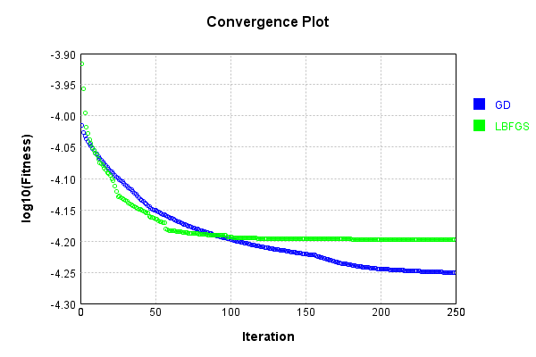


Code from [LearningTester.java:99](../../../../../../../src/main/java/com/simiacryptus/mindseye/test/unit/LearningTester.java#L99) executed in 0.01 seconds: 
```java
    return TestUtil.compareTime(runs);
```

Returns: 

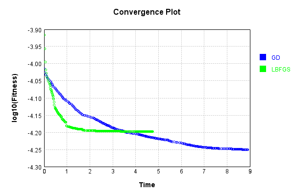


### Composite Learning
In this test, attempt to train a network to emulate a randomized network given an example input/output. The target state is:

Code from [LearningTester.java:219](../../../../../../../src/main/java/com/simiacryptus/mindseye/test/unit/LearningTester.java#L219) executed in 0.00 seconds: 
```java
    return network_target.state().stream().map(Arrays::toString).reduce((a, b) -> a + "\n" + b).orElse("");
```

Returns: 

```
    [0.0, 0.0, 0.0, 0.0, 0.0, 0.0, 0.0, 0.0, 0.0]
    [-0.0826, 0.0246, -0.0318, -0.0376, 0.077, -0.0946, 0.0576, -0.038400000000000004, -0.047400000000000005, -0.037, 0.033, 0.09980000000000001, -0.053200000000000004, 0.006, 0.0124, 0.0688, 0.0964, -0.036800000000000006, 0.026200000000000005, 0.013, -0.0162, 0.0, -0.0694, 0.064, 0.0068000000000000005, 0.046, 0.0256, 0.0834, 0.04580000000000001, 0.0666, -0.0422, 0.047200000000000006, -4.0E-4, 0.055600000000000004, 0.0158, -0.074, -0.015, -0.0698, 0.056, -0.0844, 0.07, 0.0018, 0.0658, 0.0684, -0.09060000000000001, -0.06720000000000001, -0.053200000000000004, -0.0342, 0.058, -0.0496, -0.0128, -0.091, -0.0974, -0.047200000000000006, -0.039, -0.0324, -0.06520000000000001, 0.07379999999999999, -0.0874, -0.052, -0.07880000000000001, -0.006600000000000001, -0.07479999999999999, 0.011800000000000001, 0.002, 0.048400000000000006, -0.0034000000000000002, 0.06180000000000001, -0.09680000000000001, 0.056, 0.0158, 0.013600000000000001, -0.08280000000000001, 0.0796, 0.09, -0.0864,
```
...[skipping 1130 bytes](etc/9.txt)...
```
    00000001, 0.0216, 0.0526, -0.011600000000000001, 0.064, -0.0946, 0.0492, -0.064, -0.055200000000000006, -0.097, 0.0054, -2.0E-4, 0.031400000000000004, -0.0308, 0.0488, 0.0286, 0.0842, -0.0664, -0.07680000000000001, 0.0362, -0.0708, 0.0204, 0.0688, 0.0446, 0.0216, -0.019600000000000003, -0.05940000000000001, 0.057800000000000004, -0.099, 0.0012000000000000001, -0.07560000000000001, -0.039400000000000004, 0.0762, 0.08280000000000001, -0.016, -0.012, -0.023600000000000003, 0.0674, -0.0446, 0.053200000000000004, 0.03780000000000001, 0.083, -0.08940000000000001, 0.08760000000000001, -0.081, 0.07740000000000001, 0.0534, -0.0166, 0.0246, -0.018400000000000003, -0.0488, -0.0626, -0.0024000000000000002, -0.0178, 0.0268, 0.029, -0.0654, 0.040600000000000004, -0.0258, -0.07680000000000001, 0.039400000000000004, -0.0864, -0.0892, 0.015600000000000001, 0.09140000000000001, -0.091, 0.0026, 0.0122, -0.0288, 0.0476, -0.001, 0.07479999999999999, -0.0796, 0.0178, -0.007600000000000001, -0.0678, -0.0728, -0.0342, 0.0698, 0.014]
```


We simultaneously regress this target input:

Code from [LearningTester.java:223](../../../../../../../src/main/java/com/simiacryptus/mindseye/test/unit/LearningTester.java#L223) executed in 0.00 seconds: 
```java
    return Arrays.stream(testInput).map(x -> x.prettyPrint()).reduce((a, b) -> a + "\n" + b).orElse("");
```

Returns: 

```
    [
    	[ [ -0.0022, 0.0416, -0.0154 ], [ -0.09, 0.0724, 0.085 ], [ 0.0346, 0.049400000000000006, -0.08660000000000001 ], [ -0.0052, -0.06380000000000001, -0.031400000000000004 ], [ 0.04240000000000001, -0.0108, -0.0288 ] ],
    	[ [ 0.0648, 0.0342, 0.0964 ], [ -0.0728, 0.0872, -0.009600000000000001 ], [ -0.0536, -0.0796, 0.063 ], [ 0.0432, 0.041400000000000006, 0.0692 ], [ -0.085, -0.0712, 0.0 ] ],
    	[ [ 0.0198, 0.0654, -0.011200000000000002 ], [ -0.0456, -6.000000000000001E-4, 0.0952 ], [ -0.015600000000000001, 0.0482, -0.0302 ], [ -0.0872, 0.017400000000000002, -0.011200000000000002 ], [ 0.094, -0.027800000000000002, -0.07540000000000001 ] ],
    	[ [ 0.054, -0.0454, 0.058 ], [ -0.055, 0.07640000000000001, -0.0582 ], [ -0.0792, 0.08360000000000001, -0.038200000000000005 ], [ -0.0984, -0.09680000000000001, 0.037200000000000004 ], [ 0.023600000000000003, -0.0044, -0.0522 ] ],
    	[ [ 0.030400000000000003, 0.047, -0.08580000000000002 ], [ 0.0268, -0.016, 0.066 ], [ 0.07460000000000001, 0.065, 0.0164 ], [ -0.084, 0.05940000000000001, 0.0416 ], [ 0.0796, -0.0922, -0.020200000000000003 ] ]
    ]
```


Which produces the following output:

Code from [LearningTester.java:230](../../../../../../../src/main/java/com/simiacryptus/mindseye/test/unit/LearningTester.java#L230) executed in 0.00 seconds: 
```java
    return Stream.of(targetOutput).map(x -> x.prettyPrint()).reduce((a, b) -> a + "\n" + b).orElse("");
```

Returns: 

```
    [
    	[ [ 0.005568000000000001, 0.0, 0.0, 0.0, 0.005070720000000001, 0.015551440000000001, 0.012028839999999997, 0.0, 0.0 ], [ 0.003574560000000002, 0.00301248, 0.029791280000000003, 0.0, 0.027406600000000003, 0.0, 0.0, 0.0, 0.02173108 ], [ 0.0024910799999999992, 0.0, 0.0, 0.0049651200000000026, 0.0, 0.0, 0.01092472, 0.0, 0.040052 ], [ 0.0, 0.007556400000000002, 0.009206679999999998, 0.0, 0.0, 0.01925656, 0.0, 0.0, 0.0 ], [ 0.003581400000000003, 0.009153799999999998, 0.0, 0.010495520000000001, 0.01294872, 0.0, 0.0, 0.0016981600000000002, 0.0030301600000000005 ] ],
    	[ [ 0.002031840000000001, 0.0, 0.0, 0.0, 0.026676520000000006, 0.012079840000000005, 0.022571680000000004, 0.005973000000000002, 0.0031905600000000016 ], [ 0.001676239999999997, 0.009753000000000003, 0.0, 0.017159120000000003, 0.006139440000000001, 0.0, 0.021767079999999998, 0.0030000800000000005, 0.0 ], [ 0.0, 0.015550240000000005, 0.0024397999999999993, 0.0021172799999999996, 0.006094399999999996, 0.021663080000000005, 0.0015140000000000004, 0.0, 0.
```
...[skipping 969 bytes](etc/10.txt)...
```
    88400000000002, 0.0, 0.0 ], [ 0.0, 0.0, 0.0, 0.0, 0.021751560000000003, 0.04128656, 0.015575559999999992, 0.0, 0.0 ], [ 0.012506520000000005, 0.005839800000000007, 0.010208080000000001, 0.016987999999999993, 0.0, 0.0, 0.0, 0.007871679999999999, 2.1131999999999938E-4 ], [ 0.0, 0.0, 0.0, 0.010388800000000002, 0.0, 0.002981519999999999, 0.01594464, 0.0, 0.00569972 ] ],
    	[ [ 0.0, 0.0, 0.0, 0.020094640000000004, 5.688800000000004E-4, 0.010472920000000004, 0.0, 0.0, 0.006379160000000001 ], [ 0.0, 0.00833884, 0.0, 0.0, 0.014211080000000004, 0.0013362000000000005, 0.014708800000000001, 0.010376479999999997, 0.0 ], [ 0.01311752, 0.0, 0.0, 0.0, 0.0, 0.0, 0.02516728, 0.0, 0.0 ], [ 0.0036130000000000008, 0.010822440000000003, 0.014962560000000003, 0.025577920000000004, 0.005205440000000001, 0.012835120000000002, 0.008238559999999999, 0.0, 0.0022528000000000014 ], [ 0.01690844, 0.007754080000000003, 0.0, 0.009269799999999998, 0.002704200000000002, 0.008870640000000003, 0.0, 0.016844240000000003, 0.015032680000000003 ] ]
    ]
```


First, we use a conjugate gradient descent method, which converges the fastest for purely linear functions.

Code from [LearningTester.java:300](../../../../../../../src/main/java/com/simiacryptus/mindseye/test/unit/LearningTester.java#L300) executed in 10.04 seconds: 
```java
    return new IterativeTrainer(trainable)
      .setLineSearchFactory(label -> new QuadraticSearch())
      .setOrientation(new GradientDescent())
      .setMonitor(monitor)
      .setTimeout(30, TimeUnit.SECONDS)
      .setMaxIterations(250)
      .setTerminateThreshold(0)
      .run();
```
Logging: 
```
    Constructing line search parameters: GD
    F(0.0) = LineSearchPoint{point=PointSample{avg=1.5707683618342401E-4}, derivative=-5.447047020367037E-6}
    New Minimum: 1.5707683618342401E-4 > 1.5707683618287934E-4
    F(1.0E-10) = LineSearchPoint{point=PointSample{avg=1.5707683618287934E-4}, derivative=-5.447047020306777E-6}, delta = -5.446760664024053E-16
    New Minimum: 1.5707683618287934E-4 > 1.570768361796111E-4
    F(7.000000000000001E-10) = LineSearchPoint{point=PointSample{avg=1.570768361796111E-4}, derivative=-5.447047019945219E-6}, delta = -3.812922200197022E-15
    New Minimum: 1.570768361796111E-4 > 1.5707683615673345E-4
    F(4.900000000000001E-9) = LineSearchPoint{point=PointSample{avg=1.5707683615673345E-4}, derivative=-5.447047017414319E-6}, delta = -2.6690563821596403E-14
    New Minimum: 1.5707683615673345E-4 > 1.5707683599659037E-4
    F(3.430000000000001E-8) = LineSearchPoint{point=PointSample{avg=1.5707683599659037E-4}, derivative=-5.447046999698002E-6}, delta = -1.8683364859557738E-13
    New Minimum: 1.570768359965903
```
...[skipping 303457 bytes](etc/11.txt)...
```
    4720879E-9}, delta = 3.076486745840271E-8
    F(5.304337681554382) = LineSearchPoint{point=PointSample{avg=8.268002071550256E-5}, derivative=-5.138764849642276E-10}, delta = -3.2160078564243914E-9
    F(37.13036377088068) = LineSearchPoint{point=PointSample{avg=8.268081179704848E-5}, derivative=5.490802455693912E-10}, delta = -2.4249263105055163E-9
    8.268081179704848E-5 <= 8.268323672335898E-5
    New Minimum: 8.267804450810372E-5 > 8.267620970919985E-5
    F(20.79155923551041) = LineSearchPoint{point=PointSample{avg=8.267620970919985E-5}, derivative=1.4250842724936214E-11}, delta = -7.027014159127049E-9
    Right bracket at 20.79155923551041
    New Minimum: 8.267620970919985E-5 > 8.267620661351709E-5
    F(20.37597755134901) = LineSearchPoint{point=PointSample{avg=8.267620661351709E-5}, derivative=6.472279313083838E-13}, delta = -7.030109841894795E-9
    Right bracket at 20.37597755134901
    Converged to right
    Iteration 250 complete. Error: 8.267620661351709E-5 Total: 251292752525393.2800; Orientation: 0.0001; Line Search: 0.0384
    
```

Returns: 

```
    8.267620661351709E-5
```


This training run resulted in the following configuration:

Code from [LearningTester.java:245](../../../../../../../src/main/java/com/simiacryptus/mindseye/test/unit/LearningTester.java#L245) executed in 0.00 seconds: 
```java
    return network_gd.state().stream().map(Arrays::toString).reduce((a, b) -> a + "\n" + b).orElse("");
```

Returns: 

```
    [0.005568000000000001, 0.002031840000000001, 0.0, 0.0, 0.0, 0.003574560000000002, 0.001676239999999997, 0.0, 0.011054119999999999, 0.0, 0.0024910799999999992, 0.0, 0.03784784, 0.0, 0.01311752, 0.0, 0.013983280000000002, 0.013612240000000005, 0.012506520000000005, 0.0036130000000000008, 0.003581400000000003, 0.0, 0.0, 0.0, 0.01690844, 0.0, 0.0, 0.0, 0.0, 0.0, 0.00301248, 0.009753000000000003, 0.03057368, 0.0, 0.00833884, 0.0, 0.015550240000000005, 0.0, 0.0, 0.0, 0.007556400000000002, 0.0, 0.009177160000000004, 0.005839800000000007, 0.010822440000000003, 0.009153799999999998, 0.0, 0.0, 0.0, 0.007754080000000003, 0.0, 0.0, 0.0, 0.011491720000000004, 0.0, 0.029791280000000003, 0.0, 0.019149839999999998, 0.002202000000000001, 0.0, 0.0, 0.0024397999999999993, 0.010576160000000005, 0.0, 0.0, 0.009206679999999998, 0.0, 0.00955472, 0.010208080000000001, 0.014962560000000003, 0.0, 0.012040800000000003, 0.0, 0.0, 0.0, 0.0, 0.0, 0.0, 0.0, 0.020094640000000004, 0.0, 0.017159120000000003, 0.0, 0.0, 0.0, 0.00496512000000000
```
...[skipping 6337 bytes](etc/12.txt)...
```
    .04345142947900179, -0.0029105950498115327, -0.052141758224017384, -0.08774276885465604, -0.06338416861586939, -0.07772933002122748, 0.017881873405577713, 0.022976376216602517, -0.04393676762654523, 0.053234172073192816, -0.04660660789904651, 0.03776637972978358, 0.026202213598392737, 0.031193202838481933, 0.026754960044167463, 0.02772791899439453, -0.0851839070313076, 0.04800964193891914, -0.001056627914822812, -0.06618408793140808, -0.04948286886307761, -0.04097677788590201, -0.03274265759161182, -0.062036046630725074, -0.06259549724525014, 0.09038059536384646, -0.028606161405510935, 0.047477363624658445, 0.13302909072748406, 0.04035344744405932, -0.002871525864958199, -0.08504254866912109, -0.08314913837617963, 0.07098153760768769, 0.08904087542011821, -0.0802812919360179, 0.043416651634433014, -0.038959882321343016, -0.07344767381284867, -0.07709908617382448, 0.04116319795467216, 0.0711153797809911, 0.07517433433627932, 0.0895767935170837, 0.01022453546886956, -0.021429582681329745, -0.022835621839397077]
```


And regressed input:

Code from [LearningTester.java:249](../../../../../../../src/main/java/com/simiacryptus/mindseye/test/unit/LearningTester.java#L249) executed in 0.00 seconds: 
```java
    return Arrays.stream(input_gd).map(x -> x.prettyPrint()).reduce((a, b) -> a + "\n" + b).orElse("");
```

Returns: 

```
    [
    	[ [ 0.017770235118382893, 0.07772860986732767, 0.023592909415063167 ], [ 0.07735194968713953, -0.0021413189188241597, -0.08569581268150805 ], [ -0.022762020976893674, 0.03314463514843898, 0.00439224298235024 ], [ -0.08666804029980174, -0.10216297164803664, 0.04931851641855161 ], [ 0.019171404427276433, 0.020243169606570407, -0.04718125603125788 ] ],
    	[ [ 0.08407957627406634, 0.045010837708321476, -0.03599688289195864 ], [ 0.025201493919825083, 0.0574889640369394, 0.06833669689393759 ], [ 0.048863684623128976, 0.054688662089625015, -0.0738303283013898 ], [ 0.08559386655723372, -0.011053123620463257, -0.05021278199002456 ], [ 0.036014731980362015, 0.0979273358854854, 0.08149778652704227 ] ],
    	[ [ 0.0036526111686513616, 0.09414722840132415, 0.0897178133501747 ], [ -0.020166564043941834, -0.06141976446518488, 0.03602425068217164 ], [ -0.009021803587677521, -0.0017473042757169663, -0.11763042909250852 ], [ 0.01758291754037511, -0.08963725462794805, 0.0847785340036716 ], [ -0.07390515299057138, -0.09780442433992072, -0.04966475212644381 ] ],
    	[ [ -0.07511909399969702, 0.054234876246623744, 0.059045285838285035 ], [ -0.11193444754052674, 0.08423130043917192, 0.09444213844327519 ], [ 0.008026202114798044, -0.02403165735668867, 0.07159588599003504 ], [ -0.06837609442328547, -0.01754064966485624, 0.06436757812865161 ], [ -0.03611988366548636, 0.051918312579436764, -0.05244959515502305 ] ],
    	[ [ 0.03719104994753426, -0.022009228308210553, -0.05909584753636781 ], [ 0.061374796449021704, 0.029855768245749207, 0.06506043530481426 ], [ -0.0404249040234969, -0.03537888852338437, -0.07042461259400115 ], [ 0.02260196472996523, -0.019643947057814113, -0.08580102485985132 ], [ 0.08111818629512113, -0.10112628604546561, -0.06255558061065543 ] ]
    ]
```


Which produces the following output:

Code from [LearningTester.java:256](../../../../../../../src/main/java/com/simiacryptus/mindseye/test/unit/LearningTester.java#L256) executed in 0.00 seconds: 
```java
    return Stream.of(regressedOutput).map(x -> x.prettyPrint()).reduce((a, b) -> a + "\n" + b).orElse("");
```

Returns: 

```
    [ 8.267620661351709E-5 ]
```


Next, we run the same optimization using L-BFGS, which is nearly ideal for purely second-order or quadratic functions.

Code from [LearningTester.java:324](../../../../../../../src/main/java/com/simiacryptus/mindseye/test/unit/LearningTester.java#L324) executed in 5.65 seconds: 
```java
    return new IterativeTrainer(trainable)
      .setLineSearchFactory(label -> new ArmijoWolfeSearch())
      .setOrientation(new LBFGS())
      .setMonitor(monitor)
      .setTimeout(30, TimeUnit.SECONDS)
      .setMaxIterations(250)
      .setTerminateThreshold(0)
      .run();
```
Logging: 
```
    LBFGS Accumulation History: 1 points
    Constructing line search parameters: GD
    th(0)=1.5707683618342401E-4;dx=-5.447047020367037E-6
    New Minimum: 1.5707683618342401E-4 > 1.4656271987833347E-4
    END: th(2.154434690031884)=1.4656271987833347E-4; dx=-4.280857397474783E-6 delta=1.0514116305090546E-5
    Iteration 1 complete. Error: 1.4656271987833347E-4 Total: 251292875539735.2000; Orientation: 0.0004; Line Search: 0.0174
    LBFGS Accumulation History: 1 points
    th(0)=1.4656271987833347E-4;dx=-3.388744223526643E-6
    New Minimum: 1.4656271987833347E-4 > 1.3359816242949744E-4
    END: th(4.641588833612779)=1.3359816242949744E-4; dx=-2.3869491272366707E-6 delta=1.2964557448836027E-5
    Iteration 2 complete. Error: 1.3359816242949744E-4 Total: 251292903912754.1200; Orientation: 0.0002; Line Search: 0.0191
    LBFGS Accumulation History: 1 points
    th(0)=1.3359816242949744E-4;dx=-1.7754630190374937E-6
    New Minimum: 1.3359816242949744E-4 > 1.2091044186757717E-4
    END: th(10.000000000000002)=1.2091044186757717E-4; dx=-8.100389013326782E
```
...[skipping 139519 bytes](etc/13.txt)...
```
    5;dx=-4.656515462935705E-13
    New Minimum: 8.522661637036985E-5 > 8.522660746887657E-5
    WOLF (strong): th(47.8628873601546)=8.522660746887657E-5; dx=8.592092590619035E-14 delta=8.901493284878617E-12
    END: th(23.9314436800773)=8.522660865237951E-5; dx=-1.848287506390869E-13 delta=7.717990336457772E-12
    Iteration 249 complete. Error: 8.522660746887657E-5 Total: 251298419849594.6000; Orientation: 0.0001; Line Search: 0.0130
    LBFGS Accumulation History: 1 points
    th(0)=8.522660865237951E-5;dx=-6.493103985752231E-13
    Armijo: th(51.55873244690282)=8.52266201036897E-5; dx=1.1103965261441007E-12 delta=-1.1451310182757947E-11
    New Minimum: 8.522660865237951E-5 > 8.522660294767572E-5
    WOLF (strong): th(25.77936622345141)=8.522660294767572E-5; dx=2.2059171457338624E-13 delta=5.704703799191274E-12
    END: th(8.593122074483803)=8.522660425399515E-5; dx=-3.726108127011077E-13 delta=4.398384366682655E-12
    Iteration 250 complete. Error: 8.522660294767572E-5 Total: 251298440927736.6000; Orientation: 0.0001; Line Search: 0.0168
    
```

Returns: 

```
    8.522660425399515E-5
```


This training run resulted in the following configuration:

Code from [LearningTester.java:266](../../../../../../../src/main/java/com/simiacryptus/mindseye/test/unit/LearningTester.java#L266) executed in 0.00 seconds: 
```java
    return network_lbfgs.state().stream().map(Arrays::toString).reduce((a, b) -> a + "\n" + b).orElse("");
```

Returns: 

```
    [0.005568000000000001, 0.002031840000000001, 0.0, 0.0, 0.0, 0.003574560000000002, 0.001676239999999997, 0.0, 0.011054119999999999, 0.0, 0.0024910799999999992, 0.0, 0.03784784, 0.0, 0.01311752, 0.0, 0.013983280000000002, 0.013612240000000005, 0.012506520000000005, 0.0036130000000000008, 0.003581400000000003, 0.0, 0.0, 0.0, 0.01690844, 0.0, 0.0, 0.0, 0.0, 0.0, 0.00301248, 0.009753000000000003, 0.03057368, 0.0, 0.00833884, 0.0, 0.015550240000000005, 0.0, 0.0, 0.0, 0.007556400000000002, 0.0, 0.009177160000000004, 0.005839800000000007, 0.010822440000000003, 0.009153799999999998, 0.0, 0.0, 0.0, 0.007754080000000003, 0.0, 0.0, 0.0, 0.011491720000000004, 0.0, 0.029791280000000003, 0.0, 0.019149839999999998, 0.002202000000000001, 0.0, 0.0, 0.0024397999999999993, 0.010576160000000005, 0.0, 0.0, 0.009206679999999998, 0.0, 0.00955472, 0.010208080000000001, 0.014962560000000003, 0.0, 0.012040800000000003, 0.0, 0.0, 0.0, 0.0, 0.0, 0.0, 0.0, 0.020094640000000004, 0.0, 0.017159120000000003, 0.0, 0.0, 0.0, 0.00496512000000000
```
...[skipping 6340 bytes](etc/14.txt)...
```
    .048705494205242415, -4.653025456449197E-5, -0.05125991216851017, -0.08806726056587734, -0.06286311832905205, -0.07822423549857727, 0.01746399101011483, 0.022700818677276656, -0.04365122722060448, 0.0532014651919024, -0.04660602108177413, 0.03931470160828899, 0.035811574539231505, 0.02865158513314847, 0.03610229276988183, 0.030883412221076913, -0.09352578070655627, 0.044265969301315135, -0.003421882334954463, -0.056718638935112684, -0.055156934451850576, -0.04198568077162302, -0.051557234482296904, -0.061334146915661185, -0.07484267842913858, 0.09565300516229189, -0.02553211582861896, 0.05962502667927601, 0.14065951911834185, 0.04108565151543363, -0.004417525402758351, -0.08421260936299645, -0.08227142182680694, 0.07289566001015295, 0.09113156082562206, -0.0777413596990818, 0.04436246605506391, -0.038541299466459046, -0.07394135098656177, -0.07652015132747292, 0.04096046490838881, 0.07159849839250747, 0.07469368086069365, 0.08829686965121779, 0.010271960860238138, -0.020704949479407566, -0.023659278084741803]
```


And regressed input:

Code from [LearningTester.java:270](../../../../../../../src/main/java/com/simiacryptus/mindseye/test/unit/LearningTester.java#L270) executed in 0.00 seconds: 
```java
    return Arrays.stream(input_lbgfs).map(x -> x.prettyPrint()).reduce((a, b) -> a + "\n" + b).orElse("");
```

Returns: 

```
    [
    	[ [ 0.019270626677788137, 0.07941825216110926, 0.02621296974809568 ], [ 0.08404589749631262, -0.01281595475697845, -0.09069337250796093 ], [ -0.024079772009386963, 0.026770353946189762, 6.011053691807974E-4 ], [ -0.09345572290080534, -0.10613773540001158, 0.05505919410103953 ], [ 0.020729547648654333, 0.02622271663786158, -0.04845420249427146 ] ],
    	[ [ 0.06251806636099264, 0.04533282287940171, -0.05507690956960887 ], [ 0.01005238001635342, 0.07195804116759934, 0.0769014787270224 ], [ 0.056034550478092936, 0.05393698759841369, -0.07732237215672509 ], [ 0.08226873647044909, -0.014010554652432599, -0.052568481474201956 ], [ 0.04077580123155617, 0.09992740728480187, 0.07893373881540103 ] ],
    	[ [ -0.01070439051786393, 0.07671821968004768, 0.10342779350600327 ], [ -0.013732724246134745, -0.06039662718576033, 0.0322505760127727 ], [ -0.007831060147747888, -0.002799124961136582, -0.12002378507581987 ], [ 0.012619755515587026, -0.09336106561053109, 0.08504038512149281 ], [ -0.0748634010922718, -0.10066559339253568, -0.048950802771961656 ] ],
    	[ [ -0.07023368223186786, 0.05945374963807634, 0.06738463478938819 ], [ -0.10707974220935952, 0.08417056145210745, 0.10761451192538697 ], [ 0.013950290411935152, -0.02003292590933217, 0.06284736869991893 ], [ -0.08002461112458939, -0.02221987011635822, 0.05530947145912437 ], [ -0.037415490242725655, 0.06262942067586395, -0.05230374416083499 ] ],
    	[ [ 0.03810512848444566, -0.019850024823420402, -0.061505470770092996 ], [ 0.060870082662227896, 0.0341960620397659, 0.06991736154227225 ], [ -0.0326164021258278, -0.035835123490010765, -0.07871532841048738 ], [ 0.0130478101269089, -0.02696370071684488, -0.07815783000735922 ], [ 0.08398235812569686, -0.10326540422842491, -0.06095615383716128 ] ]
    ]
```


Which produces the following output:

Code from [LearningTester.java:277](../../../../../../../src/main/java/com/simiacryptus/mindseye/test/unit/LearningTester.java#L277) executed in 0.00 seconds: 
```java
    return Stream.of(regressedOutput).map(x -> x.prettyPrint()).reduce((a, b) -> a + "\n" + b).orElse("");
```

Returns: 

```
    [ 8.522660425399515E-5 ]
```


Code from [LearningTester.java:96](../../../../../../../src/main/java/com/simiacryptus/mindseye/test/unit/LearningTester.java#L96) executed in 0.01 seconds: 
```java
    return TestUtil.compare(runs);
```

Returns: 


Code from [LearningTester.java:99](../../../../../../../src/main/java/com/simiacryptus/mindseye/test/unit/LearningTester.java#L99) executed in 0.01 seconds: 
```java
    return TestUtil.compareTime(runs);
```

Returns: 

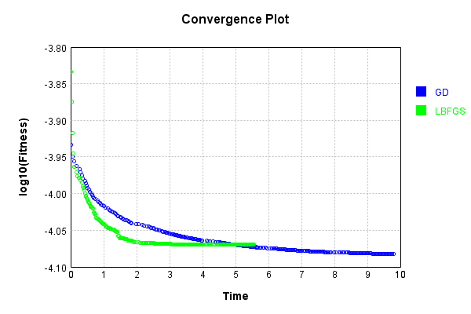


This is a network with the following layout:

Code from [NLayerTest.java:87](../../../../../../../src/test/java/com/simiacryptus/mindseye/network/NLayerTest.java#L87) executed in 0.18 seconds: 
```java
    return Graphviz.fromGraph(TestUtil.toGraph((DAGNetwork) layer))
      .height(400).width(600).render(Format.PNG).toImage();
```

Returns: 

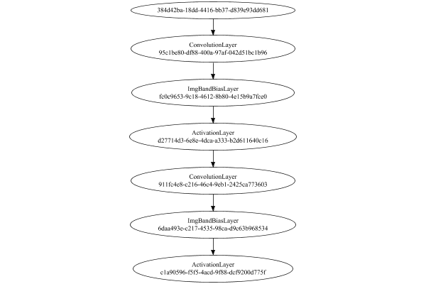


### Json Serialization
Code from [JsonTest.java:36](../../../../../../../src/main/java/com/simiacryptus/mindseye/test/unit/JsonTest.java#L36) executed in 0.00 seconds: 
```java
    JsonObject json = layer.getJson();
    NNLayer echo = NNLayer.fromJson(json);
    if ((echo == null)) throw new AssertionError("Failed to deserialize");
    if ((layer == echo)) throw new AssertionError("Serialization did not copy");
    if ((!layer.equals(echo))) throw new AssertionError("Serialization not equal");
    return new GsonBuilder().setPrettyPrinting().create().toJson(json);
```

Returns: 

```
    {
      "class": "com.simiacryptus.mindseye.network.PipelineNetwork",
      "id": "a7bf7d24-7980-4eb8-9c60-941d877712c6",
      "isFrozen": false,
      "name": "PipelineNetwork/a7bf7d24-7980-4eb8-9c60-941d877712c6",
      "inputs": [
        "384d42ba-18dd-4416-bb37-d839e93dd681"
      ],
      "nodes": {
        "37116c0b-5fca-4cbb-927b-bb3430da8a6c": "95c1be80-df88-400a-97af-042d51bc1b96",
        "7f5c47b3-7376-4445-9a9e-3a63ddbe6844": "fc0c9653-9c18-4612-8b80-4e15b9a7fce0",
        "e031a289-f4ad-4666-82df-832fc0b8bd22": "d27714d3-6e8e-4dca-a333-b2d611640c16",
        "1614d2d4-7eb5-4e65-a7c5-3986bfa6be7a": "911fc4e8-c216-46c4-9eb1-2425ca773603",
        "12d1eac9-8499-49a4-be7c-f602be1c499b": "6daa493e-c217-4535-98ca-d9c63b968534",
        "eadd8d4e-cae4-4a77-a13b-68a6a3268e44": "c1a90596-f5f5-4acd-9f88-dcf9200d775f"
      },
      "layers": {
        "95c1be80-df88-400a-97af-042d51bc1b96": {
          "class": "com.simiacryptus.mindseye.layers.cudnn.ConvolutionLayer",
          "id": "95c1be80-df88-400a-97af-042d51bc1b96",
          "isFrozen": false,
          "name": "ConvolutionLay
```
...[skipping 45483 bytes](etc/15.txt)...
```
      "precision": "Double"
        },
        "c1a90596-f5f5-4acd-9f88-dcf9200d775f": {
          "class": "com.simiacryptus.mindseye.layers.cudnn.ActivationLayer",
          "id": "c1a90596-f5f5-4acd-9f88-dcf9200d775f",
          "isFrozen": false,
          "name": "ActivationLayer/c1a90596-f5f5-4acd-9f88-dcf9200d775f",
          "mode": 1,
          "precision": "Double"
        }
      },
      "links": {
        "37116c0b-5fca-4cbb-927b-bb3430da8a6c": [
          "384d42ba-18dd-4416-bb37-d839e93dd681"
        ],
        "7f5c47b3-7376-4445-9a9e-3a63ddbe6844": [
          "37116c0b-5fca-4cbb-927b-bb3430da8a6c"
        ],
        "e031a289-f4ad-4666-82df-832fc0b8bd22": [
          "7f5c47b3-7376-4445-9a9e-3a63ddbe6844"
        ],
        "1614d2d4-7eb5-4e65-a7c5-3986bfa6be7a": [
          "e031a289-f4ad-4666-82df-832fc0b8bd22"
        ],
        "12d1eac9-8499-49a4-be7c-f602be1c499b": [
          "1614d2d4-7eb5-4e65-a7c5-3986bfa6be7a"
        ],
        "eadd8d4e-cae4-4a77-a13b-68a6a3268e44": [
          "12d1eac9-8499-49a4-be7c-f602be1c499b"
        ]
      },
      "labels": {},
      "head": "eadd8d4e-cae4-4a77-a13b-68a6a3268e44"
    }
```


### Input Learning
In this test, we use a network to learn this target input, given it's pre-evaluated output:

Code from [LearningTester.java:127](../../../../../../../src/main/java/com/simiacryptus/mindseye/test/unit/LearningTester.java#L127) executed in 0.00 seconds: 
```java
    return Arrays.stream(input_target).map(x -> x.prettyPrint()).reduce((a, b) -> a + "\n" + b).orElse("");
```

Returns: 

```
    [
    	[ [ 0.0354, 0.0576, 0.076 ], [ -0.0026, -0.023, -0.0536 ], [ 0.09580000000000001, 0.017, 0.089 ], [ -0.0144, 0.06860000000000001, -0.030600000000000002 ], [ 0.0492, -0.0476, 0.0078000000000000005 ] ],
    	[ [ -0.0134, -0.0332, -0.0234 ], [ -0.033800000000000004, -0.028200000000000003, -0.06340000000000001 ], [ -0.025, -0.0732, 0.078 ], [ -0.0078000000000000005, 0.0354, 0.086 ], [ 0.0698, -0.0082, 0.06860000000000001 ] ],
    	[ [ 0.0698, 0.0728, -0.0014000000000000002 ], [ 0.0648, 0.0456, 0.0166 ], [ 0.02, 0.06760000000000001, -0.039400000000000004 ], [ 0.034800000000000005, 0.07940000000000001, -0.009600000000000001 ], [ 0.06420000000000001, 0.0274, -0.0426 ] ],
    	[ [ -6.000000000000001E-4, -0.060200000000000004, 0.039 ], [ 0.0568, 0.0396, -0.041 ], [ -0.0124, 0.022400000000000003, 0.06380000000000001 ], [ -0.04, 0.0752, 0.019200000000000002 ], [ -0.009800000000000001, -0.0502, -0.0416 ] ],
    	[ [ -0.07060000000000001, -0.078, -0.031 ], [ 0.042800000000000005, -0.07460000000000001, 0.0596 ], [ 0.039, 0.07479999999999999, 0.092 ], [ -0.0204, 0.0446, 0.011200000000000002 ], [ 0.08960000000000001, 0.027600000000000003, 0.07379999999999999 ] ]
    ]
```


First, we use a conjugate gradient descent method, which converges the fastest for purely linear functions.

Code from [LearningTester.java:300](../../../../../../../src/main/java/com/simiacryptus/mindseye/test/unit/LearningTester.java#L300) executed in 30.28 seconds: 
```java
    return new IterativeTrainer(trainable)
      .setLineSearchFactory(label -> new QuadraticSearch())
      .setOrientation(new GradientDescent())
      .setMonitor(monitor)
      .setTimeout(30, TimeUnit.SECONDS)
      .setMaxIterations(250)
      .setTerminateThreshold(0)
      .run();
```
Logging: 
```
    Constructing line search parameters: GD
    F(0.0) = LineSearchPoint{point=PointSample{avg=8.950801064268429E-6}, derivative=-3.2557568313764237E-9}
    New Minimum: 8.950801064268429E-6 > 8.950801064268105E-6
    F(1.0E-10) = LineSearchPoint{point=PointSample{avg=8.950801064268105E-6}, derivative=-3.255756831376265E-9}, delta = -3.2356658585114273E-19
    New Minimum: 8.950801064268105E-6 > 8.950801064266153E-6
    F(7.000000000000001E-10) = LineSearchPoint{point=PointSample{avg=8.950801064266153E-6}, derivative=-3.2557568313753185E-9}, delta = -2.2751304963250507E-18
    New Minimum: 8.950801064266153E-6 > 8.950801064252477E-6
    F(4.900000000000001E-9) = LineSearchPoint{point=PointSample{avg=8.950801064252477E-6}, derivative=-3.255756831368689E-9}, delta = -1.5951324462692984E-17
    New Minimum: 8.950801064252477E-6 > 8.950801064156759E-6
    F(3.430000000000001E-8) = LineSearchPoint{point=PointSample{avg=8.950801064156759E-6}, derivative=-3.2557568313222843E-9}, delta = -1.1166943563421794E-16
    New Minimum: 8.950801064156759E-6 >
```
...[skipping 586619 bytes](etc/16.txt)...
```
    074.387947141889) = LineSearchPoint{point=PointSample{avg=2.081410661115729E-7}, derivative=6.397082471344151E-15}, delta = -1.9391149689414677E-10
    Right bracket at 2074.387947141889
    New Minimum: 2.081410661115729E-7 > 2.0814087932845415E-7
    F(2042.098914593019) = LineSearchPoint{point=PointSample{avg=2.0814087932845415E-7}, derivative=5.1723641230676856E-15}, delta = -1.9409828001291247E-10
    Right bracket at 2042.098914593019
    New Minimum: 2.0814087932845415E-7 > 2.081407585985705E-7
    F(2016.32115869827) = LineSearchPoint{point=PointSample{avg=2.081407585985705E-7}, derivative=4.19461755931181E-15}, delta = -1.9421900989655622E-10
    Right bracket at 2016.32115869827
    New Minimum: 2.081407585985705E-7 > 2.081406799290045E-7
    F(1995.6307595729675) = LineSearchPoint{point=PointSample{avg=2.081406799290045E-7}, derivative=3.409833704186363E-15}, delta = -1.9429767946256674E-10
    Loops = 12
    Iteration 240 complete. Error: 2.081406799290045E-7 Total: 251329106351392.2000; Orientation: 0.0001; Line Search: 0.2795
    
```

Returns: 

```
    2.081406799290045E-7
```


Training Converged

Next, we run the same optimization using L-BFGS, which is nearly ideal for purely second-order or quadratic functions.

Code from [LearningTester.java:324](../../../../../../../src/main/java/com/simiacryptus/mindseye/test/unit/LearningTester.java#L324) executed in 0.15 seconds: 
```java
    return new IterativeTrainer(trainable)
      .setLineSearchFactory(label -> new ArmijoWolfeSearch())
      .setOrientation(new LBFGS())
      .setMonitor(monitor)
      .setTimeout(30, TimeUnit.SECONDS)
      .setMaxIterations(250)
      .setTerminateThreshold(0)
      .run();
```
Logging: 
```
    LBFGS Accumulation History: 1 points
    Constructing line search parameters: GD
    th(0)=8.950801064268429E-6;dx=-3.2557568313764232E-9
    New Minimum: 8.950801064268429E-6 > 8.943790411960322E-6
    WOLFE (weak): th(2.154434690031884)=8.943790411960322E-6; dx=-3.2523562625547854E-9 delta=7.010652308106743E-9
    New Minimum: 8.943790411960322E-6 > 8.93678708595565E-6
    WOLFE (weak): th(4.308869380063768)=8.93678708595565E-6; dx=-3.248955693733148E-9 delta=1.401397831277865E-8
    New Minimum: 8.93678708595565E-6 > 8.90884704497131E-6
    WOLFE (weak): th(12.926608140191302)=8.90884704497131E-6; dx=-3.2353534184465978E-9 delta=4.1954019297117925E-8
    New Minimum: 8.90884704497131E-6 > 8.784590693868843E-6
    WOLFE (weak): th(51.70643256076521)=8.784590693868843E-6; dx=-3.1733392591880152E-9 delta=1.662103703995856E-7
    New Minimum: 8.784590693868843E-6 > 8.161439900965696E-6
    END: th(258.53216280382605)=8.161439900965696E-6; dx=-2.8559904248642376E-9 delta=7.893611633027324E-7
    Iteration 1 complete. Error: 8.161439900965696E-6 Tota
```
...[skipping 827 bytes](etc/17.txt)...
```
    tory: 1 points
    th(0)=5.5314703915031996E-6;dx=-5.733977175540019E-10
    New Minimum: 5.5314703915031996E-6 > 4.34938378402919E-6
    END: th(2585.3216280382608)=4.34938378402919E-6; dx=-3.73526798983259E-10 delta=1.1820866074740093E-6
    Iteration 4 complete. Error: 4.34938378402919E-6 Total: 251329221723467.7800; Orientation: 0.0001; Line Search: 0.0127
    LBFGS Accumulation History: 1 points
    th(0)=4.34938378402919E-6;dx=-4.0662451927621124E-10
    New Minimum: 4.34938378402919E-6 > 2.6125557292411363E-6
    END: th(5569.9066003353355)=2.6125557292411363E-6; dx=-2.0018557368446014E-10 delta=1.736828054788054E-6
    Iteration 5 complete. Error: 2.6125557292411363E-6 Total: 251329240092319.7800; Orientation: 0.0002; Line Search: 0.0125
    LBFGS Accumulation History: 1 points
    th(0)=2.6125557292411363E-6;dx=-3.290312119533843E-10
    MAX ALPHA: th(0)=2.6125557292411363E-6;th'(0)=-3.290312119533843E-10;
    Iteration 6 failed, aborting. Error: 2.6125557292411363E-6 Total: 251329257656392.7500; Orientation: 0.0002; Line Search: 0.0115
    
```

Returns: 

```
    2.6125557292411363E-6
```


Training Converged

Code from [LearningTester.java:96](../../../../../../../src/main/java/com/simiacryptus/mindseye/test/unit/LearningTester.java#L96) executed in 0.01 seconds: 
```java
    return TestUtil.compare(runs);
```

Returns: 

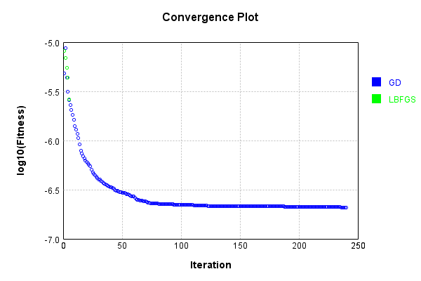


Code from [LearningTester.java:99](../../../../../../../src/main/java/com/simiacryptus/mindseye/test/unit/LearningTester.java#L99) executed in 0.01 seconds: 
```java
    return TestUtil.compareTime(runs);
```

Returns: 

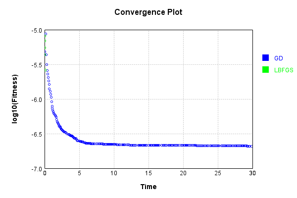


### Model Learning
In this test, attempt to train a network to emulate a randomized network given an example input/output. The target state is:

Code from [LearningTester.java:176](../../../../../../../src/main/java/com/simiacryptus/mindseye/test/unit/LearningTester.java#L176) executed in 0.00 seconds: 
```java
    return network_target.state().stream().map(Arrays::toString).reduce((a, b) -> a + "\n" + b).orElse("");
```

Returns: 

```
    [0.0, 0.0, 0.0, 0.0, 0.0, 0.0, 0.0, 0.0, 0.0, 0.0, 0.0, 0.0]
    [0.079, 0.0752, 0.09620000000000001, 0.04340000000000001, -0.029, 0.023, 0.0606, -0.0984, 0.0512, 0.0208, -0.037399999999999996, -0.0864, 0.0362, 0.09680000000000001, 0.09060000000000001, -0.062, -0.0248, -0.022400000000000003, -0.074, -0.0054, 0.0946, 0.07540000000000001, 0.027800000000000002, 0.021400000000000002, 0.03780000000000001, 0.011800000000000001, 0.04440000000000001, -0.088, -0.06420000000000001, -0.039, 0.0502, -0.05380000000000001, 0.044, -0.0844, 0.07360000000000001, -0.055400000000000005, 0.058800000000000005, -0.038400000000000004, 0.0548, 0.0072, -0.025400000000000002, 0.031, -0.021400000000000002, -0.036800000000000006, -0.0322, 0.09580000000000001, -0.0648, 0.0108, 0.0752, 0.0468, 0.0694, -0.0824, 0.09780000000000001, -0.0408, 0.027600000000000003, -0.0246, -0.013200000000000002, 0.0024000000000000002, 0.044, 0.09580000000000001, -0.0442, 0.018400000000000003, 0.068, 0.08880000000000002, -0.022, -0.0536, 0.055400000000000005, -0.
```
...[skipping 14817 bytes](etc/18.txt)...
```
    000000001, 4.0E-4, 0.058, -0.0852, -0.08860000000000001, -0.0796, 0.0018, 0.006, 0.0114, -0.048, -0.0606, 0.0296, -0.0842, 0.06760000000000001, -0.067, 0.0714, 0.014, 0.07260000000000001, -0.05140000000000001, 0.08760000000000001, -0.065, 0.09, -0.0352, 0.0718, -0.027600000000000003, 0.017400000000000002, 0.007, 0.02, -0.002, -0.07579999999999999, -0.076, -0.0072, -0.098, -0.09380000000000001, -0.07460000000000001, -0.052, 0.022200000000000004, 0.0308, -0.08, 0.08380000000000001, -0.0616, -0.013200000000000002, -0.0576, -0.023600000000000003, -0.056, -0.048400000000000006, 0.0806, -0.041400000000000006, 0.07880000000000001, -0.077, 0.088, 0.0992, 0.0664, -0.0072, -0.025400000000000002, -0.024, -0.03, -0.06420000000000001, 0.026400000000000003, 0.011200000000000002, 0.035, -0.0334, 0.026600000000000002, -0.018, -0.0728, -0.09060000000000001, -0.01, -0.09380000000000001, -0.0712, -0.0952, 0.0074, 0.048, 0.0466, -0.018400000000000003, -0.0568, -0.0396, 0.0388, 0.035]
    [0.0, 0.0, 0.0, 0.0, 0.0, 0.0, 0.0, 0.0, 0.0]
```


First, we use a conjugate gradient descent method, which converges the fastest for purely linear functions.

Code from [LearningTester.java:300](../../../../../../../src/main/java/com/simiacryptus/mindseye/test/unit/LearningTester.java#L300) executed in 19.78 seconds: 
```java
    return new IterativeTrainer(trainable)
      .setLineSearchFactory(label -> new QuadraticSearch())
      .setOrientation(new GradientDescent())
      .setMonitor(monitor)
      .setTimeout(30, TimeUnit.SECONDS)
      .setMaxIterations(250)
      .setTerminateThreshold(0)
      .run();
```
Logging: 
```
    Constructing line search parameters: GD
    F(0.0) = LineSearchPoint{point=PointSample{avg=1.0538139194467641E-5}, derivative=-9.4644331718448E-7}
    New Minimum: 1.0538139194467641E-5 > 1.053813919437299E-5
    F(1.0E-10) = LineSearchPoint{point=PointSample{avg=1.053813919437299E-5}, derivative=-9.464433171720567E-7}, delta = -9.465084965798454E-17
    New Minimum: 1.053813919437299E-5 > 1.0538139193805136E-5
    F(7.000000000000001E-10) = LineSearchPoint{point=PointSample{avg=1.0538139193805136E-5}, derivative=-9.464433170975169E-7}, delta = -6.625051256290565E-16
    New Minimum: 1.0538139193805136E-5 > 1.0538139189830072E-5
    F(4.900000000000001E-9) = LineSearchPoint{point=PointSample{avg=1.0538139189830072E-5}, derivative=-9.46443316575738E-7}, delta = -4.637569760721286E-15
    New Minimum: 1.0538139189830072E-5 > 1.0538139162004641E-5
    F(3.430000000000001E-8) = LineSearchPoint{point=PointSample{avg=1.0538139162004641E-5}, derivative=-9.464433129232865E-7}, delta = -3.246300018351026E-14
    New Minimum: 1.0538139162004641E-5 
```
...[skipping 350654 bytes](etc/19.txt)...
```
    {avg=3.3193268720322146E-6}, derivative=-5.1198534942038694E-11}, delta = -1.562292367714497E-9
    Left bracket at 10.252327936812826
    New Minimum: 3.3193268720322146E-6 > 3.3192712990418463E-6
    F(11.929483177057033) = LineSearchPoint{point=PointSample{avg=3.3192712990418463E-6}, derivative=-1.5072006427423943E-11}, delta = -1.6178653580827764E-9
    Left bracket at 11.929483177057033
    New Minimum: 3.3192712990418463E-6 > 3.3192666135878778E-6
    F(12.395623768267454) = LineSearchPoint{point=PointSample{avg=3.3192666135878778E-6}, derivative=-5.031173215585685E-12}, delta = -1.6225508120513033E-9
    Left bracket at 12.395623768267454
    New Minimum: 3.3192666135878778E-6 > 3.319266096654931E-6
    F(12.548211394377983) = LineSearchPoint{point=PointSample{avg=3.319266096654931E-6}, derivative=-1.7443820777525653E-12}, delta = -1.623067744998133E-9
    Left bracket at 12.548211394377983
    Converged to left
    Iteration 250 complete. Error: 3.319266096654931E-6 Total: 251349164768806.9000; Orientation: 0.0001; Line Search: 0.0801
    
```

Returns: 

```
    3.319266096654931E-6
```


Training Converged

Next, we run the same optimization using L-BFGS, which is nearly ideal for purely second-order or quadratic functions.

Code from [LearningTester.java:324](../../../../../../../src/main/java/com/simiacryptus/mindseye/test/unit/LearningTester.java#L324) executed in 7.04 seconds: 
```java
    return new IterativeTrainer(trainable)
      .setLineSearchFactory(label -> new ArmijoWolfeSearch())
      .setOrientation(new LBFGS())
      .setMonitor(monitor)
      .setTimeout(30, TimeUnit.SECONDS)
      .setMaxIterations(250)
      .setTerminateThreshold(0)
      .run();
```
Logging: 
```
    LBFGS Accumulation History: 1 points
    Constructing line search parameters: GD
    th(0)=7.799652291113062E-6;dx=-5.39242219624303E-7
    New Minimum: 7.799652291113062E-6 > 6.7787298083942495E-6
    END: th(2.154434690031884)=6.7787298083942495E-6; dx=-4.0934081149119114E-7 delta=1.0209224827188123E-6
    Iteration 1 complete. Error: 6.7787298083942495E-6 Total: 251349286801967.7800; Orientation: 0.0005; Line Search: 0.0273
    LBFGS Accumulation History: 1 points
    th(0)=6.7787298083942495E-6;dx=-3.122275943690538E-7
    New Minimum: 6.7787298083942495E-6 > 5.642456606638722E-6
    END: th(4.641588833612779)=5.642456606638722E-6; dx=-1.8378904795405584E-7 delta=1.1362732017555273E-6
    Iteration 2 complete. Error: 5.642456606638722E-6 Total: 251349330232104.7200; Orientation: 0.0004; Line Search: 0.0294
    LBFGS Accumulation History: 1 points
    th(0)=5.642456606638722E-6;dx=-1.1366968425007551E-7
    New Minimum: 5.642456606638722E-6 > 4.848761318999628E-6
    END: th(10.000000000000002)=4.848761318999628E-6; dx=-4.402019591431087E-8 delta=
```
...[skipping 109570 bytes](etc/20.txt)...
```
    .0715
    LBFGS Accumulation History: 1 points
    th(0)=2.515024933838477E-6;dx=-1.2497919560852612E-10
    New Minimum: 2.515024933838477E-6 > 2.5150249338384764E-6
    WOLF (strong): th(4.018366770189372E-12)=2.5150249338384764E-6; dx=1.04922772706392E-11 delta=4.2351647362715017E-22
    WOLF (strong): th(2.009183385094686E-12)=2.5150249338384764E-6; dx=1.049227727063866E-11 delta=4.2351647362715017E-22
    WOLF (strong): th(6.69727795031562E-13)=2.515024933838477E-6; dx=1.0492277270638295E-11 delta=0.0
    END: th(1.674319487578905E-13)=2.515024933838477E-6; dx=-1.1882529758181831E-11 delta=0.0
    Iteration 205 complete. Error: 2.5150249338384764E-6 Total: 251356240605253.8000; Orientation: 0.0002; Line Search: 0.0360
    LBFGS Accumulation History: 1 points
    th(0)=2.515024933838477E-6;dx=-4.866744422448451E-11
    END: th(3.607211986236401E-13)=2.515024933838477E-6; dx=-1.1882529758181812E-11 delta=0.0
    Iteration 206 failed, aborting. Error: 2.515024933838477E-6 Total: 251356260795972.7500; Orientation: 0.0002; Line Search: 0.0132
    
```

Returns: 

```
    2.515024933838477E-6
```


Training Converged

Code from [LearningTester.java:96](../../../../../../../src/main/java/com/simiacryptus/mindseye/test/unit/LearningTester.java#L96) executed in 0.01 seconds: 
```java
    return TestUtil.compare(runs);
```

Returns: 

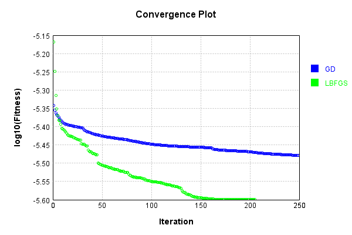


Code from [LearningTester.java:99](../../../../../../../src/main/java/com/simiacryptus/mindseye/test/unit/LearningTester.java#L99) executed in 0.01 seconds: 
```java
    return TestUtil.compareTime(runs);
```

Returns: 

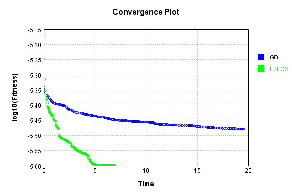


### Composite Learning
In this test, attempt to train a network to emulate a randomized network given an example input/output. The target state is:

Code from [LearningTester.java:219](../../../../../../../src/main/java/com/simiacryptus/mindseye/test/unit/LearningTester.java#L219) executed in 0.00 seconds: 
```java
    return network_target.state().stream().map(Arrays::toString).reduce((a, b) -> a + "\n" + b).orElse("");
```

Returns: 

```
    [0.0, 0.0, 0.0, 0.0, 0.0, 0.0, 0.0, 0.0, 0.0, 0.0, 0.0, 0.0]
    [0.0034000000000000002, 0.045200000000000004, -0.009200000000000002, -0.0664, -0.0592, 0.08180000000000001, 0.06280000000000001, 0.0712, 0.065, -0.0512, -4.0E-4, 0.05140000000000001, 0.0246, 0.066, 0.07940000000000001, 0.09580000000000001, 0.021400000000000002, -0.0724, -0.009600000000000001, 0.049800000000000004, 0.0, 0.0592, -0.027600000000000003, 0.024, 0.07260000000000001, -0.0308, 0.0908, 0.0028000000000000004, -0.0332, 0.098, 0.0656, 0.056, 0.035800000000000005, -0.044, 0.019, -0.0506, -0.043800000000000006, 0.055200000000000006, 0.0206, -0.0362, 0.04440000000000001, 0.040600000000000004, -0.0586, 0.037399999999999996, 0.0194, 0.03, 0.081, -0.005600000000000001, 0.07840000000000001, -0.0636, -0.025200000000000004, 0.0234, -0.0164, -0.066, -0.056600000000000004, 0.009800000000000001, -0.081, -0.0702, 0.0776, 0.09440000000000001, 0.046, -0.013, -0.0666, -0.079, 0.009800000000000001, -0.089, 0.07660000000000002, 0.0712, -0.0882, -0.0356, -0.0216,
```
...[skipping 14817 bytes](etc/21.txt)...
```
    0728, 0.035, -0.0606, -0.07460000000000001, -0.08860000000000001, -0.07479999999999999, -0.04, -0.0776, -0.0408, 4.0E-4, 0.0664, 0.021200000000000004, -0.0636, -0.0852, -0.0586, 0.0874, -0.0712, 0.059, -8.0E-4, 0.06760000000000001, 0.033, 0.017400000000000002, -0.0018, -0.037200000000000004, -0.0702, 0.0698, -2.0E-4, 0.0038000000000000004, -0.071, 0.004600000000000001, -0.006, 0.048, 0.07, 0.0388, -0.0048000000000000004, 0.041800000000000004, -0.0568, 0.05940000000000001, 0.0582, 0.026600000000000002, -0.037200000000000004, -0.073, 0.09680000000000001, 0.06340000000000001, -0.05140000000000001, -0.09380000000000001, 0.0114, 0.058, -0.0952, 0.0466, -0.025400000000000002, 0.0108, 0.09720000000000001, -0.0728, -0.0302, 0.09340000000000001, -0.0952, 0.0258, -0.0208, 0.027200000000000002, 0.0626, 0.0308, 0.037, -0.0606, 0.09480000000000001, -0.08, 0.011200000000000002, 0.0992, 0.0806, 0.042800000000000005, -0.0072, -0.040400000000000005, -0.062200000000000005, -0.0632]
    [0.0, 0.0, 0.0, 0.0, 0.0, 0.0, 0.0, 0.0, 0.0]
```


We simultaneously regress this target input:

Code from [LearningTester.java:223](../../../../../../../src/main/java/com/simiacryptus/mindseye/test/unit/LearningTester.java#L223) executed in 0.00 seconds: 
```java
    return Arrays.stream(testInput).map(x -> x.prettyPrint()).reduce((a, b) -> a + "\n" + b).orElse("");
```

Returns: 

```
    [
    	[ [ 0.07479999999999999, -0.023, -0.0124 ], [ -0.041, 0.0596, 0.0568 ], [ 0.078, 0.0354, -0.025 ], [ 0.092, 0.042800000000000005, 0.022400000000000003 ], [ 0.0648, 0.039, 0.0396 ] ],
    	[ [ -0.0078000000000000005, -0.0134, 0.0728 ], [ 0.06860000000000001, -0.009600000000000001, 0.086 ], [ 0.09580000000000001, -0.0082, -0.07060000000000001 ], [ -6.000000000000001E-4, 0.027600000000000003, -0.009800000000000001 ], [ 0.06860000000000001, 0.06420000000000001, -0.028200000000000003 ] ],
    	[ [ -0.0502, 0.06380000000000001, 0.0354 ], [ 0.0492, -0.0026, 0.0078000000000000005 ], [ 0.017, 0.0698, 0.0274 ], [ -0.0144, -0.06340000000000001, 0.07940000000000001 ], [ -0.0204, 0.0698, 0.039 ] ],
    	[ [ -0.0416, -0.0014000000000000002, 0.011200000000000002 ], [ -0.0476, -0.07460000000000001, 0.089 ], [ -0.060200000000000004, -0.031, -0.0426 ], [ -0.078, 0.07379999999999999, 0.0456 ], [ -0.0732, -0.039400000000000004, 0.034800000000000005 ] ],
    	[ [ -0.0332, -0.033800000000000004, -0.0234 ], [ -0.030600000000000002, 0.0166, 0.076 ], [ -0.04, -0.0536, 0.019200000000000002 ], [ 0.08960000000000001, 0.0576, 0.02 ], [ 0.06760000000000001, 0.0446, 0.0752 ] ]
    ]
```


Which produces the following output:

Code from [LearningTester.java:230](../../../../../../../src/main/java/com/simiacryptus/mindseye/test/unit/LearningTester.java#L230) executed in 0.00 seconds: 
```java
    return Stream.of(targetOutput).map(x -> x.prettyPrint()).reduce((a, b) -> a + "\n" + b).orElse("");
```

Returns: 

```
    [
    	[ [ 5.733780720000004E-4, 0.0, 0.002301065776, 0.0, 0.0, 0.008683555040000002, 0.0, 0.0, ... ], [ 2.910442239999994E-4, 5.072565199999979E-4, 0.0032581547840000013, 0.0022581106719999993, 0.004028794032, 0.002659741456000001, 0.003038648632000001, 5.5177119999999104E-5, ... ], [ 0.003099675584, 0.0032357283760000004, 8.52053800000001E-4, 3.60239904000001E-4, 0.0, 0.007698559600000003, 0.0, 0.0, ... ], [ 0.0, 0.0, 0.006366180304000001, 0.001262237816, 0.0, 0.002326044168, 0.0, 0.0024823417040000005, ... ], [ 0.0, 0.0, 0.00116812836, 0.0, 0.001362721312, 0.003019297280000001, 0.0, 0.0, ... ] ],
    	[ [ 0.006036867168000002, 0.0, 0.004019471552000001, 0.0038080315200000004, 0.0012901311600000006, 8.471279280000004E-4, 0.0, 0.0, ... ], [ 0.006507219328000004, 0.0, 0.005836896136000001, 0.0011325103599999988, 0.0, 0.008206681656000001, 0.0066710551360000024, 0.0, ... ], [ 0.0, 0.0, 0.013469940872000007, 0.0, 0.0, 0.008423849680000003, 0.001142024392, 0.0, ... ], [ 0.001146530952000001, 0.0, 0.004631907872000001, 0
```
...[skipping 942 bytes](etc/22.txt)...
```
    .0, 0.0019581574320000007, 0.001373033632, 0.001600640248000001, 0.010665823663999999, 0.0018997773520000021, 0.0, ... ], [ 0.006198509872000004, 0.0, 0.011251922232000004, 0.0, 0.0020772186319999997, 0.0037606750719999995, 0.00472350476, 0.0, ... ], [ 0.0, 0.0, 0.0048674161440000014, 0.0, 0.0, 0.0045991884799999995, 0.0, 0.0, ... ], [ 0.0, 0.0, 0.005945086176, 0.0, 0.004520859776, 0.008578021672000004, 0.00410608844, 0.0, ... ] ],
    	[ [ 0.0040187098560000006, 0.0014427937280000003, 0.003530303656, 0.0, 0.003042816032, 0.0, 0.0, 0.0, ... ], [ 0.0, 0.0, 0.010249363128000004, 0.0, 0.0038251800800000006, 0.0, 0.0039013936560000012, 0.0015401170560000008, ... ], [ 0.0056866925760000004, 0.0, 0.0051806880720000024, 0.001032135544, 0.005081511408000001, 0.0026798279360000015, 0.001061695168, 0.0, ... ], [ 0.005584370400000001, 0.0, 0.010789146592000002, 1.4556972000000042E-4, 0.0030012838640000004, 0.0, 2.9468784799999934E-4, 0.0, ... ], [ 0.0, 0.0, 0.0019007103600000002, 0.0, 0.0, 0.00201317784, 0.0, 0.0, ... ] ]
    ]
```


First, we use a conjugate gradient descent method, which converges the fastest for purely linear functions.

Code from [LearningTester.java:300](../../../../../../../src/main/java/com/simiacryptus/mindseye/test/unit/LearningTester.java#L300) executed in 17.07 seconds: 
```java
    return new IterativeTrainer(trainable)
      .setLineSearchFactory(label -> new QuadraticSearch())
      .setOrientation(new GradientDescent())
      .setMonitor(monitor)
      .setTimeout(30, TimeUnit.SECONDS)
      .setMaxIterations(250)
      .setTerminateThreshold(0)
      .run();
```
Logging: 
```
    Constructing line search parameters: GD
    F(0.0) = LineSearchPoint{point=PointSample{avg=1.2215882939685267E-5}, derivative=-5.180833007108102E-7}
    New Minimum: 1.2215882939685267E-5 > 1.221588293963345E-5
    F(1.0E-10) = LineSearchPoint{point=PointSample{avg=1.221588293963345E-5}, derivative=-5.180833007041503E-7}, delta = -5.181639351533457E-17
    New Minimum: 1.221588293963345E-5 > 1.2215882939322606E-5
    F(7.000000000000001E-10) = LineSearchPoint{point=PointSample{avg=1.2215882939322606E-5}, derivative=-5.180833006641908E-7}, delta = -3.626605444987177E-16
    New Minimum: 1.2215882939322606E-5 > 1.2215882937146655E-5
    F(4.900000000000001E-9) = LineSearchPoint{point=PointSample{avg=1.2215882937146655E-5}, derivative=-5.180833003844746E-7}, delta = -2.5386119530297624E-15
    New Minimum: 1.2215882937146655E-5 > 1.2215882921915004E-5
    F(3.430000000000001E-8) = LineSearchPoint{point=PointSample{avg=1.2215882921915004E-5}, derivative=-5.180832984264614E-7}, delta = -1.7770263342417603E-14
    New Minimum: 1.221588292191500
```
...[skipping 299391 bytes](etc/23.txt)...
```
    0001; Line Search: 0.0660
    F(0.0) = LineSearchPoint{point=PointSample{avg=5.345925481899235E-6}, derivative=-8.745708217234295E-10}
    New Minimum: 5.345925481899235E-6 > 5.344729287481186E-6
    F(16.039241780225705) = LineSearchPoint{point=PointSample{avg=5.344729287481186E-6}, derivative=6.931512583405733E-10}, delta = -1.1961944180493477E-9
    5.344729287481186E-6 <= 5.345925481899235E-6
    New Minimum: 5.344729287481186E-6 > 5.3421936137853375E-6
    F(8.947665560071771) = LineSearchPoint{point=PointSample{avg=5.3421936137853375E-6}, derivative=2.197385713198031E-11}, delta = -3.731868113897603E-9
    Right bracket at 8.947665560071771
    New Minimum: 5.3421936137853375E-6 > 5.342191070730884E-6
    F(8.728362797678747) = LineSearchPoint{point=PointSample{avg=5.342191070730884E-6}, derivative=1.2183240962094403E-12}, delta = -3.734411168351247E-9
    Right bracket at 8.728362797678747
    Converged to right
    Iteration 250 complete. Error: 5.342191070730884E-6 Total: 251373492372815.5600; Orientation: 0.0001; Line Search: 0.0436
    
```

Returns: 

```
    5.342191070730884E-6
```


Training Converged

Next, we run the same optimization using L-BFGS, which is nearly ideal for purely second-order or quadratic functions.

Code from [LearningTester.java:324](../../../../../../../src/main/java/com/simiacryptus/mindseye/test/unit/LearningTester.java#L324) executed in 8.67 seconds: 
```java
    return new IterativeTrainer(trainable)
      .setLineSearchFactory(label -> new ArmijoWolfeSearch())
      .setOrientation(new LBFGS())
      .setMonitor(monitor)
      .setTimeout(30, TimeUnit.SECONDS)
      .setMaxIterations(250)
      .setTerminateThreshold(0)
      .run();
```
Logging: 
```
    LBFGS Accumulation History: 1 points
    Constructing line search parameters: GD
    th(0)=1.2215882939685267E-5;dx=-5.180833007108102E-7
    New Minimum: 1.2215882939685267E-5 > 1.1234281036740933E-5
    END: th(2.154434690031884)=1.1234281036740933E-5; dx=-3.9519707216578765E-7 delta=9.816019029443337E-7
    Iteration 1 complete. Error: 1.1234281036740933E-5 Total: 251373572105494.5000; Orientation: 0.0005; Line Search: 0.0283
    LBFGS Accumulation History: 1 points
    th(0)=1.1234281036740933E-5;dx=-3.069291934480988E-7
    New Minimum: 1.1234281036740933E-5 > 1.0092430845508986E-5
    END: th(4.641588833612779)=1.0092430845508986E-5; dx=-2.0220913862476028E-7 delta=1.1418501912319467E-6
    Iteration 2 complete. Error: 1.0092430845508986E-5 Total: 251373618113545.4400; Orientation: 0.0003; Line Search: 0.0305
    LBFGS Accumulation History: 1 points
    th(0)=1.0092430845508986E-5;dx=-1.4814965865132987E-7
    New Minimum: 1.0092430845508986E-5 > 9.077984296042633E-6
    END: th(10.000000000000002)=9.077984296042633E-6; dx=-5.6363695866482266E-
```
...[skipping 124493 bytes](etc/24.txt)...
```
    00; Orientation: 0.0002; Line Search: 0.0294
    LBFGS Accumulation History: 1 points
    th(0)=4.727797299441758E-6;dx=-2.473907851596589E-10
    New Minimum: 4.727797299441758E-6 > 4.7252992041100994E-6
    END: th(18.202519174017254)=4.7252992041100994E-6; dx=-2.0875284606549456E-11 delta=2.4980953316582394E-9
    Iteration 249 complete. Error: 4.7252992041100994E-6 Total: 251382128996291.9000; Orientation: 0.0002; Line Search: 0.0149
    LBFGS Accumulation History: 1 points
    th(0)=4.7252992041100994E-6;dx=-4.927075951221297E-10
    Armijo: th(39.216138754473285)=4.7471229747995605E-6; dx=1.568108933692733E-9 delta=-2.1823770689461086E-8
    Armijo: th(19.608069377236642)=4.726227791374825E-6; dx=5.631837620845139E-10 delta=-9.285872647256475E-10
    New Minimum: 4.7252992041100994E-6 > 4.723244474671207E-6
    END: th(6.5360231257455474)=4.723244474671207E-6; dx=-1.0673776094163096E-10 delta=2.054729438892607E-9
    Iteration 250 complete. Error: 4.723244474671207E-6 Total: 251382166017263.8800; Orientation: 0.0002; Line Search: 0.0293
    
```

Returns: 

```
    4.723244474671207E-6
```


Training Converged

Code from [LearningTester.java:96](../../../../../../../src/main/java/com/simiacryptus/mindseye/test/unit/LearningTester.java#L96) executed in 0.01 seconds: 
```java
    return TestUtil.compare(runs);
```

Returns: 

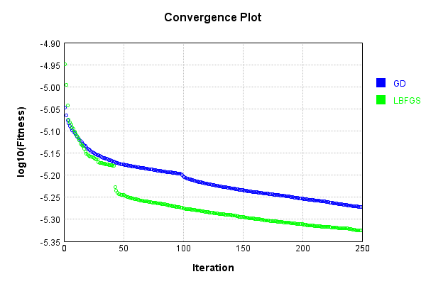


Code from [LearningTester.java:99](../../../../../../../src/main/java/com/simiacryptus/mindseye/test/unit/LearningTester.java#L99) executed in 0.00 seconds: 
```java
    return TestUtil.compareTime(runs);
```

Returns: 

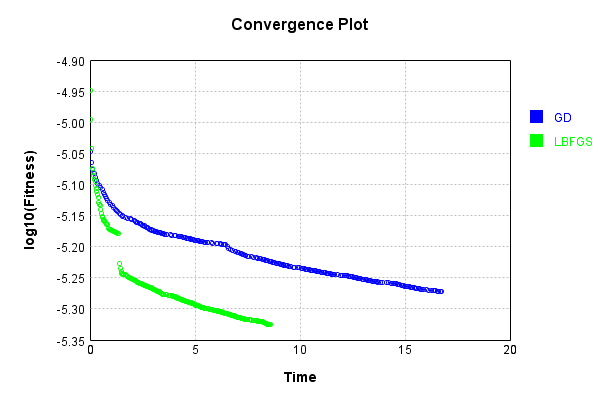


This is a network with the following layout:

Code from [NLayerTest.java:87](../../../../../../../src/test/java/com/simiacryptus/mindseye/network/NLayerTest.java#L87) executed in 0.24 seconds: 
```java
    return Graphviz.fromGraph(TestUtil.toGraph((DAGNetwork) layer))
      .height(400).width(600).render(Format.PNG).toImage();
```

Returns: 

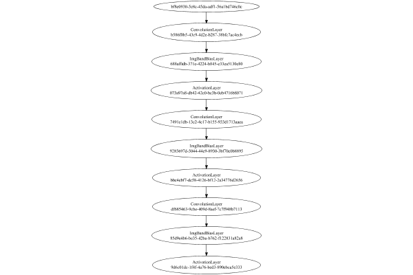


### Json Serialization
Code from [JsonTest.java:36](../../../../../../../src/main/java/com/simiacryptus/mindseye/test/unit/JsonTest.java#L36) executed in 0.01 seconds: 
```java
    JsonObject json = layer.getJson();
    NNLayer echo = NNLayer.fromJson(json);
    if ((echo == null)) throw new AssertionError("Failed to deserialize");
    if ((layer == echo)) throw new AssertionError("Serialization did not copy");
    if ((!layer.equals(echo))) throw new AssertionError("Serialization not equal");
    return new GsonBuilder().setPrettyPrinting().create().toJson(json);
```

Returns: 

```
    {
      "class": "com.simiacryptus.mindseye.network.PipelineNetwork",
      "id": "7e6dc03e-e1ae-4bc3-9507-b544a2792832",
      "isFrozen": false,
      "name": "PipelineNetwork/7e6dc03e-e1ae-4bc3-9507-b544a2792832",
      "inputs": [
        "bf8e0930-5e8c-45da-adf1-56a1bd746c0c"
      ],
      "nodes": {
        "dea598d7-12db-4c21-b64a-aecc9e270ddc": "b586f0b5-43c9-4d2e-b287-38bfc7ac4ecb",
        "a2b430e9-dfcb-4e89-9a58-f5470e23738d": "688af0db-371e-4224-b845-e33ea5130e80",
        "2ada856c-dcee-4b30-95cf-ccfaa3ee73ca": "073a97a8-db42-42c0-bc3b-0eb4716b8071",
        "b359804d-7309-4871-b094-4056fd4fd82f": "7491c1db-13c2-4c17-b155-933d1713aaea",
        "5f544ea7-5e8d-4b7e-acc6-d5f380f501ec": "9285697d-5044-44c9-8930-3bf70c0b8895",
        "c22a0a0f-e0ea-4109-88a5-803260f7e4b2": "bbc4ebf7-dc58-4126-bf12-2a34776d2656",
        "36202ccd-f819-434b-8636-01f40582f483": "df685463-9cbe-409d-8aef-7c7f948b7113",
        "19b4052d-5c22-4e2d-a30a-46c520a43ba0": "85d9e4b6-be35-42ba-b762-f122831a82a8",
        "8fbe569b-f364-4902-b34f-d401859a51fd": "9d6c01dc-1f4f-4a76-bed3-890ebca
```
...[skipping 231697 bytes](etc/25.txt)...
```
    ",
          "mode": 1,
          "precision": "Double"
        }
      },
      "links": {
        "dea598d7-12db-4c21-b64a-aecc9e270ddc": [
          "bf8e0930-5e8c-45da-adf1-56a1bd746c0c"
        ],
        "a2b430e9-dfcb-4e89-9a58-f5470e23738d": [
          "dea598d7-12db-4c21-b64a-aecc9e270ddc"
        ],
        "2ada856c-dcee-4b30-95cf-ccfaa3ee73ca": [
          "a2b430e9-dfcb-4e89-9a58-f5470e23738d"
        ],
        "b359804d-7309-4871-b094-4056fd4fd82f": [
          "2ada856c-dcee-4b30-95cf-ccfaa3ee73ca"
        ],
        "5f544ea7-5e8d-4b7e-acc6-d5f380f501ec": [
          "b359804d-7309-4871-b094-4056fd4fd82f"
        ],
        "c22a0a0f-e0ea-4109-88a5-803260f7e4b2": [
          "5f544ea7-5e8d-4b7e-acc6-d5f380f501ec"
        ],
        "36202ccd-f819-434b-8636-01f40582f483": [
          "c22a0a0f-e0ea-4109-88a5-803260f7e4b2"
        ],
        "19b4052d-5c22-4e2d-a30a-46c520a43ba0": [
          "36202ccd-f819-434b-8636-01f40582f483"
        ],
        "8fbe569b-f364-4902-b34f-d401859a51fd": [
          "19b4052d-5c22-4e2d-a30a-46c520a43ba0"
        ]
      },
      "labels": {},
      "head": "8fbe569b-f364-4902-b34f-d401859a51fd"
    }
```


### Input Learning
In this test, we use a network to learn this target input, given it's pre-evaluated output:

Code from [LearningTester.java:127](../../../../../../../src/main/java/com/simiacryptus/mindseye/test/unit/LearningTester.java#L127) executed in 0.00 seconds: 
```java
    return Arrays.stream(input_target).map(x -> x.prettyPrint()).reduce((a, b) -> a + "\n" + b).orElse("");
```

Returns: 

```
    [
    	[ [ -0.030600000000000002, 0.0468, -0.0208 ], [ -0.0024000000000000002, -0.0526, 0.0 ], [ -0.07660000000000002, -0.0864, 0.077 ], [ 0.06420000000000001, -0.028200000000000003, 0.093 ], [ -0.0932, 0.07780000000000001, 0.0586 ] ],
    	[ [ 0.0502, 0.031400000000000004, -0.0352 ], [ -0.0558, -0.057, 0.0724 ], [ -0.0722, -0.0512, -0.0632 ], [ -0.0234, -0.0362, 0.02 ], [ -0.031400000000000004, 0.0728, -0.07980000000000001 ] ],
    	[ [ 0.0028000000000000004, 0.0024000000000000002, 0.09040000000000001 ], [ -0.0086, -0.0974, 0.0694 ], [ -0.0206, -0.019200000000000002, 0.005 ], [ 0.037399999999999996, -0.009600000000000001, 0.06760000000000001 ], [ 0.084, -0.09440000000000001, 0.0902 ] ],
    	[ [ -0.034800000000000005, 0.05740000000000001, -0.001 ], [ 0.087, 0.0942, 0.019200000000000002 ], [ 0.09580000000000001, 0.085, -0.07460000000000001 ], [ -0.055600000000000004, 0.08380000000000001, -0.0562 ], [ 0.0946, 0.032, -0.0258 ] ],
    	[ [ -0.0902, -0.023200000000000002, -0.087 ], [ 0.041400000000000006, -0.058800000000000005, -0.08380000000000001 ], [ -0.0616, 0.0796, 0.029400000000000003 ], [ -0.08, -0.056, -0.05140000000000001 ], [ 0.09820000000000001, 0.0614, -0.050800000000000005 ] ]
    ]
```


First, we use a conjugate gradient descent method, which converges the fastest for purely linear functions.

Code from [LearningTester.java:300](../../../../../../../src/main/java/com/simiacryptus/mindseye/test/unit/LearningTester.java#L300) executed in 30.32 seconds: 
```java
    return new IterativeTrainer(trainable)
      .setLineSearchFactory(label -> new QuadraticSearch())
      .setOrientation(new GradientDescent())
      .setMonitor(monitor)
      .setTimeout(30, TimeUnit.SECONDS)
      .setMaxIterations(250)
      .setTerminateThreshold(0)
      .run();
```
Logging: 
```
    Low gradient: 4.85562423330801E-6
    Constructing line search parameters: GD
    F(0.0) = LineSearchPoint{point=PointSample{avg=1.4346188047690007E-6}, derivative=-2.3577086695087997E-11}
    New Minimum: 1.4346188047690007E-6 > 1.4346188047689988E-6
    F(1.0E-10) = LineSearchPoint{point=PointSample{avg=1.4346188047689988E-6}, derivative=-2.3577086695087933E-11}, delta = -1.9058241313221758E-21
    New Minimum: 1.4346188047689988E-6 > 1.4346188047689842E-6
    F(7.000000000000001E-10) = LineSearchPoint{point=PointSample{avg=1.4346188047689842E-6}, derivative=-2.3577086695087516E-11}, delta = -1.6517142471458857E-20
    New Minimum: 1.4346188047689842E-6 > 1.434618804768883E-6
    F(4.900000000000001E-9) = LineSearchPoint{point=PointSample{avg=1.434618804768883E-6}, derivative=-2.3577086695084598E-11}, delta = -1.1773757966834775E-19
    New Minimum: 1.434618804768883E-6 > 1.4346188047681905E-6
    F(3.430000000000001E-8) = LineSearchPoint{point=PointSample{avg=1.4346188047681905E-6}, derivative=-2.3577086695064164E-11}, delta = -8.10187
```
...[skipping 349064 bytes](etc/26.txt)...
```
    mple{avg=2.5167423489322886E-8}, derivative=7.09352166193728E-17}, delta = -2.170703053483071E-12
    Right bracket at 2947.2231734879647
    New Minimum: 2.5167423489322886E-8 > 2.5167421147290478E-8
    F(2913.136773497291) = LineSearchPoint{point=PointSample{avg=2.5167421147290478E-8}, derivative=6.648219331433916E-17}, delta = -2.1730450858907358E-12
    Right bracket at 2913.136773497291
    New Minimum: 2.5167421147290478E-8 > 2.516741911167525E-8
    F(2881.536717092816) = LineSearchPoint{point=PointSample{avg=2.516741911167525E-8}, derivative=6.235398418549929E-17}, delta = -2.1750807011187937E-12
    Right bracket at 2881.536717092816
    New Minimum: 2.516741911167525E-8 > 2.5167417338666017E-8
    F(2852.200599588285) = LineSearchPoint{point=PointSample{avg=2.5167417338666017E-8}, derivative=5.852153444126903E-17}, delta = -2.1768537103516375E-12
    Right bracket at 2852.200599588285
    Converged to right
    Iteration 159 complete. Error: 2.5167417338666017E-8 Total: 251412941141926.4700; Orientation: 0.0002; Line Search: 0.4048
    
```

Returns: 

```
    2.5167417338666017E-8
```


Training Converged

Next, we run the same optimization using L-BFGS, which is nearly ideal for purely second-order or quadratic functions.

Code from [LearningTester.java:324](../../../../../../../src/main/java/com/simiacryptus/mindseye/test/unit/LearningTester.java#L324) executed in 25.19 seconds: 
```java
    return new IterativeTrainer(trainable)
      .setLineSearchFactory(label -> new ArmijoWolfeSearch())
      .setOrientation(new LBFGS())
      .setMonitor(monitor)
      .setTimeout(30, TimeUnit.SECONDS)
      .setMaxIterations(250)
      .setTerminateThreshold(0)
      .run();
```
Logging: 
```
    LBFGS Accumulation History: 1 points
    Constructing line search parameters: GD
    th(0)=1.4346188047690007E-6;dx=-2.3577086695087997E-11
    New Minimum: 1.4346188047690007E-6 > 1.4345680110880384E-6
    WOLFE (weak): th(2.154434690031884)=1.4345680110880384E-6; dx=-2.3575589778290785E-11 delta=5.079368096231281E-11
    New Minimum: 1.4345680110880384E-6 > 1.4345172206320882E-6
    WOLFE (weak): th(4.308869380063768)=1.4345172206320882E-6; dx=-2.3574092861493566E-11 delta=1.0158413691253576E-10
    New Minimum: 1.4345172206320882E-6 > 1.4343140910583762E-6
    WOLFE (weak): th(12.926608140191302)=1.4343140910583762E-6; dx=-2.3568105194304704E-11 delta=3.0471371062450447E-10
    New Minimum: 1.4343140910583762E-6 > 1.4334006465285506E-6
    WOLFE (weak): th(51.70643256076521)=1.4334006465285506E-6; dx=-2.3541160691954804E-11 delta=1.218158240450097E-9
    New Minimum: 1.4334006465285506E-6 > 1.4285465896213328E-6
    WOLFE (weak): th(258.53216280382605)=1.4285465896213328E-6; dx=-2.3397456679422005E-11 delta=6.072215147667848E-9
    New Minimum:
```
...[skipping 305029 bytes](etc/27.txt)...
```
    47493956402396E-13 delta=1.1414836072981537E-9
    Iteration 233 complete. Error: 1.0774814078671781E-7 Total: 251438005067113.1000; Orientation: 0.0004; Line Search: 0.0738
    LBFGS Accumulation History: 1 points
    th(0)=1.0774814078671781E-7;dx=-7.141751829583145E-13
    New Minimum: 1.0774814078671781E-7 > 1.0543894166672242E-7
    WOLFE (weak): th(3341.943960201201)=1.0543894166672242E-7; dx=-6.711111252804848E-13 delta=2.3091991199953906E-9
    New Minimum: 1.0543894166672242E-7 > 1.0324636480477363E-7
    END: th(6683.887920402402)=1.0324636480477363E-7; dx=-6.396345792644576E-13 delta=4.5017759819441735E-9
    Iteration 234 complete. Error: 1.0324636480477363E-7 Total: 251438045976046.0000; Orientation: 0.0004; Line Search: 0.0308
    LBFGS Accumulation History: 1 points
    th(0)=1.0324636480477363E-7;dx=-6.056057596709483E-13
    MAX ALPHA: th(0)=1.0324636480477363E-7;th'(0)=-6.056057596709483E-13;
    Iteration 235 failed, aborting. Error: 1.0324636480477363E-7 Total: 251438134310797.9700; Orientation: 0.0005; Line Search: 0.0393
    
```

Returns: 

```
    1.0324636480477363E-7
```


Training Converged

Code from [LearningTester.java:96](../../../../../../../src/main/java/com/simiacryptus/mindseye/test/unit/LearningTester.java#L96) executed in 0.01 seconds: 
```java
    return TestUtil.compare(runs);
```

Returns: 

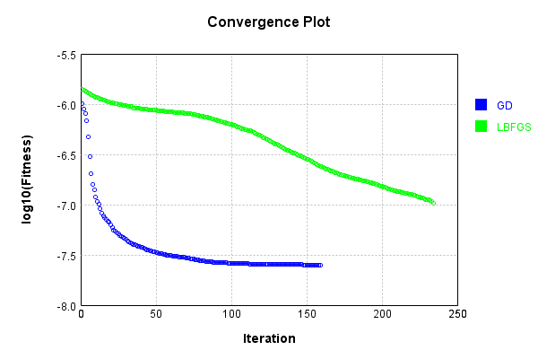


Code from [LearningTester.java:99](../../../../../../../src/main/java/com/simiacryptus/mindseye/test/unit/LearningTester.java#L99) executed in 0.01 seconds: 
```java
    return TestUtil.compareTime(runs);
```

Returns: 

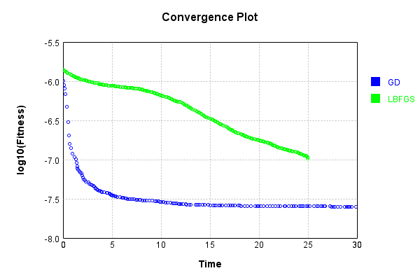


### Model Learning
In this test, attempt to train a network to emulate a randomized network given an example input/output. The target state is:

Code from [LearningTester.java:176](../../../../../../../src/main/java/com/simiacryptus/mindseye/test/unit/LearningTester.java#L176) executed in 0.00 seconds: 
```java
    return network_target.state().stream().map(Arrays::toString).reduce((a, b) -> a + "\n" + b).orElse("");
```

Returns: 

```
    [0.0, 0.0, 0.0, 0.0, 0.0, 0.0, 0.0, 0.0, 0.0]
    [-0.07880000000000001, -0.037200000000000004, 0.0872, 0.039, -0.0646, -0.09040000000000001, -0.0058000000000000005, 0.025, -0.026400000000000003, -0.0952, 0.0158, -0.0522, 0.0992, 0.0658, -0.0946, -0.09280000000000001, -0.0636, 0.032, -0.056600000000000004, 0.0144, 0.0052, 0.06420000000000001, -0.062200000000000005, 0.026600000000000002, 0.0952, -0.0344, -0.0028000000000000004, -0.0204, -0.014600000000000002, 0.036800000000000006, -0.0668, -0.08560000000000001, 0.0684, -0.039400000000000004, -0.0026, 0.012600000000000002, -0.0796, -0.079, -0.07, 0.0114, 0.08460000000000001, -0.039, -0.0402, 0.0284, 0.023600000000000003, 0.09540000000000001, -0.0362, -0.0678, -0.021200000000000004, -0.078, 0.08880000000000002, 0.039, -0.019200000000000002, -0.021400000000000002, 0.040600000000000004, 0.06420000000000001, -0.0072, -0.0396, -0.0792, 0.0912, -0.046, 0.022600000000000002, -0.0604, 0.086, 0.09620000000000001, -0.012600000000000002, -0.0052, -0.0682, -0.073, -0.074600000
```
...[skipping 83889 bytes](etc/28.txt)...
```
    0000000000001, 0.0094, -0.0476, -0.014600000000000002, 0.0228, 0.0082, -0.038, 0.035, 0.04240000000000001, -0.0114, -0.0816, -0.0872, -0.029, -0.0714, 0.026200000000000005, -0.042, -0.0034000000000000002, 0.04340000000000001, 0.0188, 0.018600000000000002, 0.015600000000000001, -0.066, -0.0032, -0.0288, 0.071, -0.027, 0.006, -0.0468, 0.085, -0.06420000000000001, 0.0626, 0.0332, 0.0864, 0.053200000000000004, 0.036, -0.0356, 0.06280000000000001, 0.07940000000000001, -0.048, -0.0586, 0.0842, -0.013, -0.0816, 0.025, 0.021, 0.016, -0.0956, -0.098, -0.0714, -0.074, -0.0712, 0.0752, -0.079, -0.08960000000000001, 0.0416, -0.0284, -0.033, -0.059, -0.06180000000000001, 0.0344, -0.0366, 0.07660000000000002, 0.0376, -0.0412, -0.0234, -0.0632, -0.08220000000000001, -0.031200000000000002, 0.067, 0.08880000000000002, -0.019, 0.026600000000000002, -0.001, -0.082, -0.0308, 0.07540000000000001, 0.0352, 0.007, -0.06760000000000001, 0.006, -0.0708, 0.09680000000000001, 0.0526, -0.0386, -0.046400000000000004, 0.040600000000000004]
```


First, we use a conjugate gradient descent method, which converges the fastest for purely linear functions.

Code from [LearningTester.java:300](../../../../../../../src/main/java/com/simiacryptus/mindseye/test/unit/LearningTester.java#L300) executed in 30.11 seconds: 
```java
    return new IterativeTrainer(trainable)
      .setLineSearchFactory(label -> new QuadraticSearch())
      .setOrientation(new GradientDescent())
      .setMonitor(monitor)
      .setTimeout(30, TimeUnit.SECONDS)
      .setMaxIterations(250)
      .setTerminateThreshold(0)
      .run();
```
Logging: 
```
    Constructing line search parameters: GD
    F(0.0) = LineSearchPoint{point=PointSample{avg=2.3602937567710104E-6}, derivative=-8.098853692936275E-8}
    New Minimum: 2.3602937567710104E-6 > 2.3602937567629127E-6
    F(1.0E-10) = LineSearchPoint{point=PointSample{avg=2.3602937567629127E-6}, derivative=-8.098853692898783E-8}, delta = -8.097634975751111E-18
    New Minimum: 2.3602937567629127E-6 > 2.3602937567143167E-6
    F(7.000000000000001E-10) = LineSearchPoint{point=PointSample{avg=2.3602937567143167E-6}, derivative=-8.098853692673845E-8}, delta = -5.669360922562483E-17
    New Minimum: 2.3602937567143167E-6 > 2.3602937563741657E-6
    F(4.900000000000001E-9) = LineSearchPoint{point=PointSample{avg=2.3602937563741657E-6}, derivative=-8.098853691099269E-8}, delta = -3.9684467666753313E-16
    New Minimum: 2.3602937563741657E-6 > 2.360293753993104E-6
    F(3.430000000000001E-8) = LineSearchPoint{point=PointSample{avg=2.360293753993104E-6}, derivative=-8.098853680077245E-8}, delta = -2.7779063839256275E-15
    New Minimum: 2.36029375399310
```
...[skipping 316615 bytes](etc/29.txt)...
```
    =PointSample{avg=7.825973516633451E-7}, derivative=-1.5224731390370707E-13}, delta = -2.501393015874509E-11
    Left bracket at 37.90217031018233
    New Minimum: 7.825973516633451E-7 > 7.825969618128361E-7
    F(41.74751679077415) = LineSearchPoint{point=PointSample{avg=7.825969618128361E-7}, derivative=-5.0517515202454444E-14}, delta = -2.540378066773847E-11
    Left bracket at 41.74751679077415
    New Minimum: 7.825969618128361E-7 > 7.825969204900864E-7
    F(42.93429752836016) = LineSearchPoint{point=PointSample{avg=7.825969204900864E-7}, derivative=-1.9120874824697814E-14}, delta = -2.544510341750977E-11
    Left bracket at 42.93429752836016
    New Minimum: 7.825969204900864E-7 > 7.825969146620186E-7
    F(43.37107491473702) = LineSearchPoint{point=PointSample{avg=7.825969146620186E-7}, derivative=-7.565798213502464E-15}, delta = -2.5450931485301593E-11
    Left bracket at 43.37107491473702
    Converged to left
    Iteration 232 complete. Error: 7.825969146620186E-7 Total: 251468408581379.7800; Orientation: 0.0003; Line Search: 0.1715
    
```

Returns: 

```
    7.825969146620186E-7
```


Training Converged

Next, we run the same optimization using L-BFGS, which is nearly ideal for purely second-order or quadratic functions.

Code from [LearningTester.java:324](../../../../../../../src/main/java/com/simiacryptus/mindseye/test/unit/LearningTester.java#L324) executed in 15.64 seconds: 
```java
    return new IterativeTrainer(trainable)
      .setLineSearchFactory(label -> new ArmijoWolfeSearch())
      .setOrientation(new LBFGS())
      .setMonitor(monitor)
      .setTimeout(30, TimeUnit.SECONDS)
      .setMaxIterations(250)
      .setTerminateThreshold(0)
      .run();
```
Logging: 
```
    LBFGS Accumulation History: 1 points
    Constructing line search parameters: GD
    th(0)=2.4322277336323574E-6;dx=-6.790203267238513E-8
    New Minimum: 2.4322277336323574E-6 > 2.29220870493604E-6
    WOLFE (weak): th(2.154434690031884)=2.29220870493604E-6; dx=-6.244253983922126E-8 delta=1.4001902869631733E-7
    New Minimum: 2.29220870493604E-6 > 2.1634317875116203E-6
    END: th(4.308869380063768)=2.1634317875116203E-6; dx=-5.702471805911925E-8 delta=2.687959461207371E-7
    Iteration 1 complete. Error: 2.1634317875116203E-6 Total: 251468527846545.6000; Orientation: 0.0005; Line Search: 0.0636
    LBFGS Accumulation History: 1 points
    th(0)=2.1634317875116203E-6;dx=-4.812306866851346E-8
    New Minimum: 2.1634317875116203E-6 > 1.7912675303361733E-6
    END: th(9.283177667225559)=1.7912675303361733E-6; dx=-3.2510005520466974E-8 delta=3.7216425717544705E-7
    Iteration 2 complete. Error: 1.7912675303361733E-6 Total: 251468567080945.4700; Orientation: 0.0005; Line Search: 0.0260
    LBFGS Accumulation History: 1 points
    th(0)=1.79126753033617
```
...[skipping 141120 bytes](etc/30.txt)...
```
    2604022E-7; dx=2.2205675084574508E-17 delta=9.65979772333972E-16
    New Minimum: 7.648561902604022E-7 > 7.648561902603767E-7
    WOLF (strong): th(0.0010445076331344757)=7.648561902603767E-7; dx=3.058353001432404E-18 delta=9.660051833223896E-16
    WOLFE (weak): th(2.611269082836189E-4)=7.648561904433652E-7; dx=-2.9986032539394033E-12 delta=7.830167381996621E-16
    New Minimum: 7.648561902603767E-7 > 7.648561902603755E-7
    END: th(6.528172707090473E-4)=7.648561902603755E-7; dx=-5.317698879208934E-19 delta=9.660064538718105E-16
    Iteration 249 complete. Error: 7.648561902603755E-7 Total: 251484007106088.1000; Orientation: 0.0005; Line Search: 0.0870
    LBFGS Accumulation History: 1 points
    th(0)=7.648561902603755E-7;dx=-8.186576513482321E-13
    New Minimum: 7.648561902603755E-7 > 7.648561892688398E-7
    END: th(0.0014064521742675068)=7.648561892688398E-7; dx=-8.442716697755243E-19 delta=9.915357092647E-16
    Iteration 250 complete. Error: 7.648561892688398E-7 Total: 251484045723224.0000; Orientation: 0.0005; Line Search: 0.0256
    
```

Returns: 

```
    7.648561892688398E-7
```


Training Converged

Code from [LearningTester.java:96](../../../../../../../src/main/java/com/simiacryptus/mindseye/test/unit/LearningTester.java#L96) executed in 0.01 seconds: 
```java
    return TestUtil.compare(runs);
```

Returns: 


Code from [LearningTester.java:99](../../../../../../../src/main/java/com/simiacryptus/mindseye/test/unit/LearningTester.java#L99) executed in 0.01 seconds: 
```java
    return TestUtil.compareTime(runs);
```

Returns: 

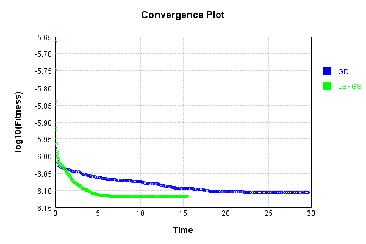


### Composite Learning
In this test, attempt to train a network to emulate a randomized network given an example input/output. The target state is:

Code from [LearningTester.java:219](../../../../../../../src/main/java/com/simiacryptus/mindseye/test/unit/LearningTester.java#L219) executed in 0.00 seconds: 
```java
    return network_target.state().stream().map(Arrays::toString).reduce((a, b) -> a + "\n" + b).orElse("");
```

Returns: 

```
    [0.0, 0.0, 0.0, 0.0, 0.0, 0.0, 0.0, 0.0, 0.0]
    [-0.012, 0.0476, 0.095, -0.021200000000000004, -0.07780000000000001, 0.026, -0.06, -0.0664, -0.022200000000000004, 0.022600000000000002, 0.064, 0.08580000000000002, -0.0586, -0.07880000000000001, 0.0824, 0.0834, 0.037200000000000004, -0.09280000000000001, -0.0678, 0.033800000000000004, -0.0318, 0.049400000000000006, -0.09280000000000001, -0.045200000000000004, 0.099, 0.049800000000000004, -0.07680000000000001, -0.081, -0.02, -0.0918, -0.0922, -0.0074, 0.0144, -0.022200000000000004, 0.0072, 0.09620000000000001, -0.017400000000000002, 0.0824, 0.09860000000000001, -0.0062, 0.0068000000000000005, -0.07640000000000001, -0.034800000000000005, 0.0648, 0.026, -0.088, -0.0792, -0.09060000000000001, -0.0892, -0.0526, 0.0614, -0.029400000000000003, 0.0562, -0.0026, -0.09380000000000001, -0.084, -0.046200000000000005, 0.0446, 0.012, 0.041, -0.06760000000000001, 0.0942, 0.06340000000000001, 0.07360000000000001, 0.09280000000000001, -0.011, 0.025200000000000004, -0.0246, 0.0634
```
...[skipping 83889 bytes](etc/31.txt)...
```
    40000000000001, 0.05740000000000001, -0.08480000000000001, 0.0936, -0.012600000000000002, 0.072, -0.0094, 0.0562, 0.041400000000000006, 0.0704, -0.0134, 0.0114, 0.0344, -0.0536, -0.0114, -0.018, -0.0436, 0.061200000000000004, 0.0844, -0.0038000000000000004, -0.0218, 4.0E-4, -0.012, -0.023600000000000003, 0.038, 0.097, -0.055, -0.0018, -0.056, -0.0698, 0.0844, -0.0872, 0.047200000000000006, 0.089, 0.0308, 0.025400000000000002, 0.0026, 0.026200000000000005, 0.047200000000000006, -0.0442, 0.0952, 0.0, 0.035800000000000005, -0.040600000000000004, -0.0208, -0.0248, -0.0576, -0.055400000000000005, -0.0522, -0.0842, -0.088, -0.0854, 0.049800000000000004, -0.026200000000000005, 0.046, -0.0712, 0.0342, 0.0882, -0.04340000000000001, -0.018600000000000002, -0.026200000000000005, -0.0604, 0.062, -0.011200000000000002, -0.0468, 0.025, 0.068, 0.0932, 0.07880000000000001, 0.0134, 0.09980000000000001, -0.0772, -0.004600000000000001, 0.0142, -0.0238, -0.09780000000000001, 0.062400000000000004, -0.0048000000000000004, -0.0114]
```


We simultaneously regress this target input:

Code from [LearningTester.java:223](../../../../../../../src/main/java/com/simiacryptus/mindseye/test/unit/LearningTester.java#L223) executed in 0.00 seconds: 
```java
    return Arrays.stream(testInput).map(x -> x.prettyPrint()).reduce((a, b) -> a + "\n" + b).orElse("");
```

Returns: 

```
    [
    	[ [ -0.0258, 0.09580000000000001, 0.0728 ], [ 0.031400000000000004, 0.09040000000000001, 0.093 ], [ -0.0234, -0.0086, -0.0616 ], [ -0.0208, -0.09440000000000001, 0.0586 ], [ 0.084, -0.0526, -0.0512 ] ],
    	[ [ -0.0902, -0.055600000000000004, 0.08380000000000001 ], [ -0.0932, 0.02, -0.0352 ], [ 0.0694, -0.07460000000000001, 0.019200000000000002 ], [ 0.07780000000000001, 0.0, -0.050800000000000005 ], [ 0.032, -0.009600000000000001, 0.0796 ] ],
    	[ [ 0.05740000000000001, -0.001, -0.019200000000000002 ], [ -0.056, -0.023200000000000002, 0.041400000000000006 ], [ -0.08380000000000001, 0.0946, -0.0206 ], [ -0.028200000000000003, -0.0562, 0.0942 ], [ -0.0362, -0.08, 0.0024000000000000002 ] ],
    	[ [ 0.077, -0.0632, -0.07660000000000002 ], [ -0.0024000000000000002, -0.07980000000000001, -0.058800000000000005 ], [ -0.030600000000000002, 0.09820000000000001, -0.05140000000000001 ], [ 0.06760000000000001, 0.0902, 0.037399999999999996 ], [ 0.0468, 0.029400000000000003, 0.085 ] ],
    	[ [ 0.087, 0.0502, -0.0722 ], [ -0.0974, -0.0558, -0.057 ], [ 0.005, 0.0614, -0.031400000000000004 ], [ -0.0864, -0.087, 0.06420000000000001 ], [ 0.0724, -0.034800000000000005, 0.0028000000000000004 ] ]
    ]
```


Which produces the following output:

Code from [LearningTester.java:230](../../../../../../../src/main/java/com/simiacryptus/mindseye/test/unit/LearningTester.java#L230) executed in 0.00 seconds: 
```java
    return Stream.of(targetOutput).map(x -> x.prettyPrint()).reduce((a, b) -> a + "\n" + b).orElse("");
```

Returns: 

```
    [
    	[ [ 1.75511527129601E-4, 0.0, 0.0, 0.0, 0.0010760199855936012, 9.222215782352002E-4, 5.756087091248002E-4, 0.0, ... ], [ 0.0012828461045408007, 0.0, 0.0015386700461631991, 0.0, 0.0, 3.5523538112320116E-4, 1.0117297436639968E-4, 0.0, ... ], [ 0.0019885048294784003, 0.0, 0.0, 0.0, 0.0, 0.0, 2.185645148735999E-4, 0.0, ... ], [ 0.0028558613595552, 0.0, 8.640745337584002E-4, 5.753868941471997E-4, 0.0, 1.475676374064006E-4, 0.0, 0.0018180038783696, ... ], [ 0.0014373400849071998, 0.0, 5.769417662400421E-6, 0.0, 0.0, 0.0, 2.4184175258080032E-4, 8.925686824480041E-5, ... ] ],
    	[ [ 0.00179884281848, 0.0, 0.0, 0.0, 0.0012847537256207998, 0.0, 0.0, 0.0, ... ], [ 0.0025468998212688, 0.0, 4.965685599216004E-4, 7.359891737760019E-4, 0.0, 0.0, 0.0, 1.4182814360800053E-4, ... ], [ 0.004003454828921601, 0.0, 0.0023632139623152, 0.0, 0.0, 0.0015444380690432004, 0.0, 0.0032963431366591993, ... ], [ 0.006018917298822404, 0.0, 0.0, 0.0, 0.0, 0.001331384460044801, 2.604667478896E-4, 0.0022213850730944005, ... ], [ 0.00176175414
```
...[skipping 812 bytes](etc/32.txt)...
```
    , ... ], [ 0.0012677970708592002, 0.0, 0.006065091888665601, 0.0, 0.0, 0.0, 0.0, 0.0011143282738799996, ... ], [ 2.408003265920007E-4, 0.0, 3.2864950473119974E-4, 6.969010288432E-4, 9.479863855584004E-4, 0.0, 0.0, 0.0032221061839776007, ... ], [ 0.0, 7.131801710303999E-4, 0.002427305787868801, 0.0, 0.0031123049720480005, 1.9326508448480096E-4, 0.0, 6.235400825264003E-4, ... ], [ 1.2486164044800047E-4, 0.0, 0.0015824578695071998, 0.0, 0.0, 2.4178319003519968E-4, 0.0, 0.0030125614233504003, ... ] ],
    	[ [ 0.0028980085111776025, 0.0, 4.438956582607994E-4, 0.0, 5.327789096560001E-4, 0.0, 0.0, 0.0014472365258336, ... ], [ 0.0031081255549968018, 0.0, 0.0037333799258096006, 0.0, 0.0, 0.0, 0.0, 0.0015839090058239996, ... ], [ 6.255713446479996E-4, 4.305670142000011E-4, 0.0030004612722624013, 0.0, 0.0, 0.0, 0.0, 0.001893848380472, ... ], [ 0.0, 0.0, 0.0014614894159504, 6.213438380607995E-4, 0.0, 0.0, 0.0, 0.0, ... ], [ 8.574480711824001E-4, 0.0, 9.499557752832001E-4, 2.6683249291199895E-5, 0.0, 0.0, 0.0, 0.0, ... ] ]
    ]
```


First, we use a conjugate gradient descent method, which converges the fastest for purely linear functions.

Code from [LearningTester.java:300](../../../../../../../src/main/java/com/simiacryptus/mindseye/test/unit/LearningTester.java#L300) executed in 30.41 seconds: 
```java
    return new IterativeTrainer(trainable)
      .setLineSearchFactory(label -> new QuadraticSearch())
      .setOrientation(new GradientDescent())
      .setMonitor(monitor)
      .setTimeout(30, TimeUnit.SECONDS)
      .setMaxIterations(250)
      .setTerminateThreshold(0)
      .run();
```
Logging: 
```
    Constructing line search parameters: GD
    F(0.0) = LineSearchPoint{point=PointSample{avg=2.7014183360183612E-6}, derivative=-1.0899972680274867E-7}
    New Minimum: 2.7014183360183612E-6 > 2.70141833600746E-6
    F(1.0E-10) = LineSearchPoint{point=PointSample{avg=2.70141833600746E-6}, derivative=-1.0899972680218774E-7}, delta = -1.0901314031162845E-17
    New Minimum: 2.70141833600746E-6 > 2.701418335942062E-6
    F(7.000000000000001E-10) = LineSearchPoint{point=PointSample{avg=2.701418335942062E-6}, derivative=-1.0899972679882225E-7}, delta = -7.629903382277287E-17
    New Minimum: 2.701418335942062E-6 > 2.7014183354842612E-6
    F(4.900000000000001E-9) = LineSearchPoint{point=PointSample{avg=2.7014183354842612E-6}, derivative=-1.089997267752636E-7}, delta = -5.341000130229881E-16
    New Minimum: 2.7014183354842612E-6 > 2.7014183322796684E-6
    F(3.430000000000001E-8) = LineSearchPoint{point=PointSample{avg=2.7014183322796684E-6}, derivative=-1.089997266103532E-7}, delta = -3.738692891380865E-15
    New Minimum: 2.7014183322796684E-6
```
...[skipping 270838 bytes](etc/33.txt)...
```
    81661725
    F(2.6463538022422037) = LineSearchPoint{point=PointSample{avg=7.328899314445518E-7}, derivative=1.0429698228040175E-12}, delta = -9.44318767968669E-13
    Right bracket at 2.6463538022422037
    New Minimum: 7.328898597121619E-7 > 7.328898098845929E-7
    F(2.3781483097709306) = LineSearchPoint{point=PointSample{avg=7.328898098845929E-7}, derivative=-3.982554953016207E-13}, delta = -1.0658787268541907E-12
    Left bracket at 2.3781483097709306
    New Minimum: 7.328898098845929E-7 > 7.328897804348917E-7
    F(2.45226185045391) = LineSearchPoint{point=PointSample{avg=7.328897804348917E-7}, derivative=-3.9646300390822536E-13}, delta = -1.095328428080151E-12
    Left bracket at 2.45226185045391
    F(2.5057205994919993) = LineSearchPoint{point=PointSample{avg=7.328897850138775E-7}, derivative=1.0394782751489969E-12}, delta = -1.0907494422944354E-12
    Right bracket at 2.5057205994919993
    Converged to left
    Iteration 137 complete. Error: 7.328897804348917E-7 Total: 251514628113011.8800; Orientation: 0.0003; Line Search: 0.4807
    
```

Returns: 

```
    7.328897804348917E-7
```


Training Converged

Next, we run the same optimization using L-BFGS, which is nearly ideal for purely second-order or quadratic functions.

Code from [LearningTester.java:324](../../../../../../../src/main/java/com/simiacryptus/mindseye/test/unit/LearningTester.java#L324) executed in 9.19 seconds: 
```java
    return new IterativeTrainer(trainable)
      .setLineSearchFactory(label -> new ArmijoWolfeSearch())
      .setOrientation(new LBFGS())
      .setMonitor(monitor)
      .setTimeout(30, TimeUnit.SECONDS)
      .setMaxIterations(250)
      .setTerminateThreshold(0)
      .run();
```
Logging: 
```
    LBFGS Accumulation History: 1 points
    Constructing line search parameters: GD
    th(0)=2.7014183360183612E-6;dx=-1.0899972680274867E-7
    New Minimum: 2.7014183360183612E-6 > 2.478861477541892E-6
    END: th(2.154434690031884)=2.478861477541892E-6; dx=-9.750489481055797E-8 delta=2.2255685847646936E-7
    Iteration 1 complete. Error: 2.478861477541892E-6 Total: 251514683839680.3800; Orientation: 0.0005; Line Search: 0.0262
    LBFGS Accumulation History: 1 points
    th(0)=2.478861477541892E-6;dx=-8.739203936059987E-8
    New Minimum: 2.478861477541892E-6 > 2.1116386350718317E-6
    END: th(4.641588833612779)=2.1116386350718317E-6; dx=-7.029657615691527E-8 delta=3.672228424700602E-7
    Iteration 2 complete. Error: 2.1116386350718317E-6 Total: 251514723135635.3000; Orientation: 0.0005; Line Search: 0.0264
    LBFGS Accumulation History: 1 points
    th(0)=2.1116386350718317E-6;dx=-5.68657289405032E-8
    New Minimum: 2.1116386350718317E-6 > 1.6501802959164974E-6
    END: th(10.000000000000002)=1.6501802959164974E-6; dx=-3.690267545949655E-8 delta
```
...[skipping 74611 bytes](etc/34.txt)...
```
    86587E-12 delta=-3.1763735522036263E-22
    Armijo: th(3.486168831494804E-11)=6.921323728913238E-7; dx=-1.5035571749186924E-12 delta=-3.1763735522036263E-22
    Armijo: th(2.9051406929123362E-11)=6.921323728913236E-7; dx=-2.885264346827512E-12 delta=-1.0587911840678754E-22
    WOLFE (weak): th(2.6146266236211025E-11)=6.921323728913235E-7; dx=-2.885264346827526E-12 delta=0.0
    Armijo: th(2.7598836582667194E-11)=6.921323728913236E-7; dx=-2.885264346827517E-12 delta=-1.0587911840678754E-22
    Armijo: th(2.687255140943911E-11)=6.921323728913236E-7; dx=-2.88526434682752E-12 delta=-1.0587911840678754E-22
    Armijo: th(2.650940882282507E-11)=6.921323728913236E-7; dx=-2.8852643468275207E-12 delta=-1.0587911840678754E-22
    Armijo: th(2.6327837529518047E-11)=6.921323728913236E-7; dx=-2.885264346827524E-12 delta=-1.0587911840678754E-22
    mu /= nu: th(0)=6.921323728913235E-7;th'(0)=-2.8852643468276273E-12;
    Iteration 139 failed, aborting. Error: 6.921323728913235E-7 Total: 251523821673744.6000; Orientation: 0.0005; Line Search: 0.4117
    
```

Returns: 

```
    6.921323728913235E-7
```


Training Converged

Code from [LearningTester.java:96](../../../../../../../src/main/java/com/simiacryptus/mindseye/test/unit/LearningTester.java#L96) executed in 0.01 seconds: 
```java
    return TestUtil.compare(runs);
```

Returns: 

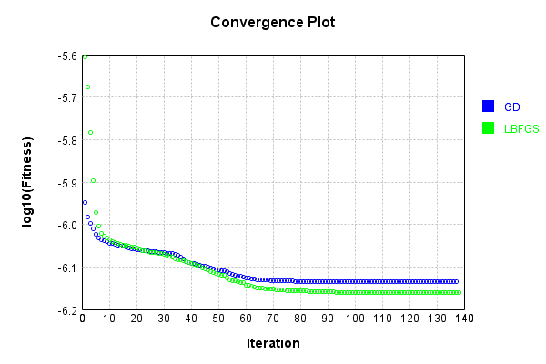


Code from [LearningTester.java:99](../../../../../../../src/main/java/com/simiacryptus/mindseye/test/unit/LearningTester.java#L99) executed in 0.00 seconds: 
```java
    return TestUtil.compareTime(runs);
```

Returns: 


This is a network with the following layout:

Code from [NLayerTest.java:87](../../../../../../../src/test/java/com/simiacryptus/mindseye/network/NLayerTest.java#L87) executed in 0.24 seconds: 
```java
    return Graphviz.fromGraph(TestUtil.toGraph((DAGNetwork) layer))
      .height(400).width(600).render(Format.PNG).toImage();
```

Returns: 

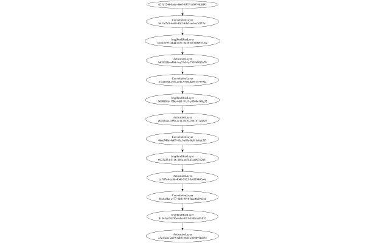


### Json Serialization
Code from [JsonTest.java:36](../../../../../../../src/main/java/com/simiacryptus/mindseye/test/unit/JsonTest.java#L36) executed in 0.03 seconds: 
```java
    JsonObject json = layer.getJson();
    NNLayer echo = NNLayer.fromJson(json);
    if ((echo == null)) throw new AssertionError("Failed to deserialize");
    if ((layer == echo)) throw new AssertionError("Serialization did not copy");
    if ((!layer.equals(echo))) throw new AssertionError("Serialization not equal");
    return new GsonBuilder().setPrettyPrinting().create().toJson(json);
```

Returns: 

```
    {
      "class": "com.simiacryptus.mindseye.network.PipelineNetwork",
      "id": "f50a3ece-ec32-4518-a3a6-99c42439712f",
      "isFrozen": false,
      "name": "PipelineNetwork/f50a3ece-ec32-4518-a3a6-99c42439712f",
      "inputs": [
        "d27d7244-8a6c-4663-857f-1a0574fdfd93"
      ],
      "nodes": {
        "94dc42e8-5492-4e9d-8f03-7949fe8e719f": "b453d5d1-4eb0-4fd2-8da5-ae16c7df57a1",
        "f9e522be-13e9-4f8d-b3c7-59d8dc47234e": "bb122197-3ddd-4851-8228-8738089273bc",
        "8fa93469-0c91-417d-9801-c256387fe365": "b6592f4b-a468-4ce7-b54c-7538680f3e79",
        "ae152d44-dcb5-4ff0-b349-8514634bc369": "61ca10bd-c5f6-48f0-95e0-da097c7979a4",
        "95db373f-56d9-4da6-86ab-8b952f752a10": "96988016-17bb-4df1-8151-c85086168e32",
        "001eba3b-c95d-4829-a0c3-82ba33189444": "e02414ac-355b-4c11-bc70-2061672e43e2",
        "a5e2a9f6-1b76-420a-801a-af9b7fa91b0b": "06cd948e-4d07-45a5-a83e-8e81babdc7f1",
        "2cf6d07d-8e97-4f4a-a325-c32d443ba676": "0123c234-0116-408a-a6ff-d3ed09312b51",
        "e27a1791-f8bd-4965-b9cb-179cb8fb0933": "caf1f7c4-ea86-4b40-8925-5c0f294
```
...[skipping 975077 bytes](etc/35.txt)...
```
    01-c256387fe365": [
          "f9e522be-13e9-4f8d-b3c7-59d8dc47234e"
        ],
        "ae152d44-dcb5-4ff0-b349-8514634bc369": [
          "8fa93469-0c91-417d-9801-c256387fe365"
        ],
        "95db373f-56d9-4da6-86ab-8b952f752a10": [
          "ae152d44-dcb5-4ff0-b349-8514634bc369"
        ],
        "001eba3b-c95d-4829-a0c3-82ba33189444": [
          "95db373f-56d9-4da6-86ab-8b952f752a10"
        ],
        "a5e2a9f6-1b76-420a-801a-af9b7fa91b0b": [
          "001eba3b-c95d-4829-a0c3-82ba33189444"
        ],
        "2cf6d07d-8e97-4f4a-a325-c32d443ba676": [
          "a5e2a9f6-1b76-420a-801a-af9b7fa91b0b"
        ],
        "e27a1791-f8bd-4965-b9cb-179cb8fb0933": [
          "2cf6d07d-8e97-4f4a-a325-c32d443ba676"
        ],
        "ca644d72-8084-4a12-bd0e-ad122c3f0519": [
          "e27a1791-f8bd-4965-b9cb-179cb8fb0933"
        ],
        "3f41f832-2435-4955-b4dc-b4cd1568d6ca": [
          "ca644d72-8084-4a12-bd0e-ad122c3f0519"
        ],
        "65847e91-e0b3-4e22-8c59-0fcffc094def": [
          "3f41f832-2435-4955-b4dc-b4cd1568d6ca"
        ]
      },
      "labels": {},
      "head": "65847e91-e0b3-4e22-8c59-0fcffc094def"
    }
```


### Input Learning
In this test, we use a network to learn this target input, given it's pre-evaluated output:

Code from [LearningTester.java:127](../../../../../../../src/main/java/com/simiacryptus/mindseye/test/unit/LearningTester.java#L127) executed in 0.00 seconds: 
```java
    return Arrays.stream(input_target).map(x -> x.prettyPrint()).reduce((a, b) -> a + "\n" + b).orElse("");
```

Returns: 

```
    [
    	[ [ 0.085, -0.0166, 0.009800000000000001 ], [ -0.0228, -0.061, -0.0644 ], [ -0.0344, 0.021, 0.013 ], [ -0.037200000000000004, 0.054400000000000004, -0.051800000000000006 ], [ 0.0974, -0.0692, -0.0024000000000000002 ] ],
    	[ [ 0.034, -0.0852, -0.0908 ], [ 0.0324, 0.085, -0.072 ], [ 0.0022, 0.010600000000000002, 0.033 ], [ -0.040400000000000005, -0.033800000000000004, 0.08220000000000001 ], [ 0.0582, -0.07360000000000001, 0.0648 ] ],
    	[ [ -0.011, 0.012600000000000002, 0.0572 ], [ 0.077, -0.0698, 0.086 ], [ 0.057800000000000004, -0.049400000000000006, 0.08220000000000001 ], [ 0.07880000000000001, -0.018, 0.0468 ], [ -0.0034000000000000002, -0.08020000000000001, 0.0142 ] ],
    	[ [ -0.0188, 0.09060000000000001, -0.0048000000000000004 ], [ 0.015, -0.0052, -0.0018 ], [ 0.07440000000000001, -0.023200000000000002, 0.082 ], [ -0.0346, 8.0E-4, -0.0386 ], [ 0.012, -0.056600000000000004, -0.035800000000000005 ] ],
    	[ [ 0.0364, -0.0072, 0.015 ], [ 0.0466, 0.08780000000000002, 0.09780000000000001 ], [ -0.0814, 0.07980000000000001, -0.047400000000000005 ], [ -0.0562, -0.095, 0.0572 ], [ -0.016800000000000002, 0.0054, -0.003 ] ]
    ]
```


First, we use a conjugate gradient descent method, which converges the fastest for purely linear functions.

Code from [LearningTester.java:300](../../../../../../../src/main/java/com/simiacryptus/mindseye/test/unit/LearningTester.java#L300) executed in 30.31 seconds: 
```java
    return new IterativeTrainer(trainable)
      .setLineSearchFactory(label -> new QuadraticSearch())
      .setOrientation(new GradientDescent())
      .setMonitor(monitor)
      .setTimeout(30, TimeUnit.SECONDS)
      .setMaxIterations(250)
      .setTerminateThreshold(0)
      .run();
```
Logging: 
```
    Low gradient: 2.7823116985360125E-6
    Constructing line search parameters: GD
    F(0.0) = LineSearchPoint{point=PointSample{avg=4.230065761547396E-7}, derivative=-7.74125838781035E-12}
    New Minimum: 4.230065761547396E-7 > 4.23006576154739E-7
    F(1.0E-10) = LineSearchPoint{point=PointSample{avg=4.23006576154739E-7}, derivative=-7.741258387810324E-12}, delta = -6.352747104407253E-22
    New Minimum: 4.23006576154739E-7 > 4.230065761547344E-7
    F(7.000000000000001E-10) = LineSearchPoint{point=PointSample{avg=4.230065761547344E-7}, derivative=-7.74125838781017E-12}, delta = -5.241016361135983E-21
    New Minimum: 4.230065761547344E-7 > 4.230065761547018E-7
    F(4.900000000000001E-9) = LineSearchPoint{point=PointSample{avg=4.230065761547018E-7}, derivative=-7.741258387809085E-12}, delta = -3.7851784830426546E-20
    New Minimum: 4.230065761547018E-7 > 4.230065761544743E-7
    F(3.430000000000001E-8) = LineSearchPoint{point=PointSample{avg=4.230065761544743E-7}, derivative=-7.741258387801495E-12}, delta = -2.653330707274096E-19
    New 
```
...[skipping 275368 bytes](etc/36.txt)...
```
    {avg=1.9150889449433483E-8}, derivative=-9.801234076166926E-17}, delta = -2.7293934850403217E-11
    Left bracket at 43368.67444967914
    New Minimum: 1.9150889449433483E-8 > 1.9150805172591567E-8
    F(44450.98606981501) = LineSearchPoint{point=PointSample{avg=1.9150805172591567E-8}, derivative=-6.526579895860965E-17}, delta = -2.7378211692319355E-11
    Left bracket at 44450.98606981501
    New Minimum: 1.9150805172591567E-8 > 1.9150765351495772E-8
    F(45114.25815112904) = LineSearchPoint{point=PointSample{avg=1.9150765351495772E-8}, derivative=-5.4808894175156806E-17}, delta = -2.741803278811442E-11
    Left bracket at 45114.25815112904
    New Minimum: 1.9150765351495772E-8 > 1.9150739017581476E-8
    F(45633.50312221261) = LineSearchPoint{point=PointSample{avg=1.9150739017581476E-8}, derivative=-4.6622668077490205E-17}, delta = -2.7444366702410457E-11
    Left bracket at 45633.50312221261
    Converged to left
    Iteration 152 complete. Error: 1.9150739017581476E-8 Total: 251554638718441.7000; Orientation: 0.0009; Line Search: 0.3069
    
```

Returns: 

```
    1.9150739017581476E-8
```


Training Converged

Next, we run the same optimization using L-BFGS, which is nearly ideal for purely second-order or quadratic functions.

Code from [LearningTester.java:324](../../../../../../../src/main/java/com/simiacryptus/mindseye/test/unit/LearningTester.java#L324) executed in 30.04 seconds: 
```java
    return new IterativeTrainer(trainable)
      .setLineSearchFactory(label -> new ArmijoWolfeSearch())
      .setOrientation(new LBFGS())
      .setMonitor(monitor)
      .setTimeout(30, TimeUnit.SECONDS)
      .setMaxIterations(250)
      .setTerminateThreshold(0)
      .run();
```
Logging: 
```
    LBFGS Accumulation History: 1 points
    Constructing line search parameters: GD
    th(0)=4.230065761547396E-7;dx=-7.74125838781035E-12
    New Minimum: 4.230065761547396E-7 > 4.2298989871826E-7
    WOLFE (weak): th(2.154434690031884)=4.2298989871826E-7; dx=-7.740702199411103E-12 delta=1.6677436479610467E-11
    New Minimum: 4.2298989871826E-7 > 4.229732224800524E-7
    WOLFE (weak): th(4.308869380063768)=4.229732224800524E-7; dx=-7.74014601101186E-12 delta=3.335367468722732E-11
    New Minimum: 4.229732224800524E-7 > 4.2290652950993716E-7
    WOLFE (weak): th(12.926608140191302)=4.2290652950993716E-7; dx=-7.737921257414875E-12 delta=1.0004664480247023E-10
    New Minimum: 4.2290652950993716E-7 > 4.2260666873261185E-7
    WOLFE (weak): th(51.70643256076521)=4.2260666873261185E-7; dx=-7.7258454589315E-12 delta=3.9990742212777344E-10
    New Minimum: 4.2260666873261185E-7 > 4.2101429624813137E-7
    WOLFE (weak): th(258.53216280382605)=4.2101429624813137E-7; dx=-7.672308882304713E-12 delta=1.992279906608257E-9
    New Minimum: 4.2101429624813137E-7
```
...[skipping 275567 bytes](etc/37.txt)...
```
    17032014202E-7
    WOLFE (weak): th(4.308869380063768)=1.6551117032014202E-7; dx=-1.5035696495981041E-13 delta=6.478781539347661E-13
    New Minimum: 1.6551117032014202E-7 > 1.6550987462162369E-7
    WOLFE (weak): th(12.926608140191302)=1.6550987462162369E-7; dx=-1.503480237878204E-13 delta=1.943576672266788E-12
    New Minimum: 1.6550987462162369E-7 > 1.6550404493208043E-7
    WOLFE (weak): th(51.70643256076521)=1.6550404493208043E-7; dx=-1.5030777002304305E-13 delta=7.773266215526433E-12
    New Minimum: 1.6550404493208043E-7 > 1.654726983029951E-7
    WOLFE (weak): th(258.53216280382605)=1.654726983029951E-7; dx=-1.5286914827343902E-13 delta=3.9119895300854494E-11
    New Minimum: 1.654726983029951E-7 > 1.652759562923658E-7
    WOLFE (weak): th(1551.1929768229563)=1.652759562923658E-7; dx=-1.515293582734119E-13 delta=2.3586190593014077E-10
    MAX ALPHA: th(0)=1.6551181819829595E-7;th'(0)=-1.5036143554580547E-13;
    Iteration 213 complete. Error: 1.652759562923658E-7 Total: 251584678441549.5600; Orientation: 0.0021; Line Search: 0.2018
    
```

Returns: 

```
    1.652759562923658E-7
```


Training Converged

Code from [LearningTester.java:96](../../../../../../../src/main/java/com/simiacryptus/mindseye/test/unit/LearningTester.java#L96) executed in 0.00 seconds: 
```java
    return TestUtil.compare(runs);
```

Returns: 

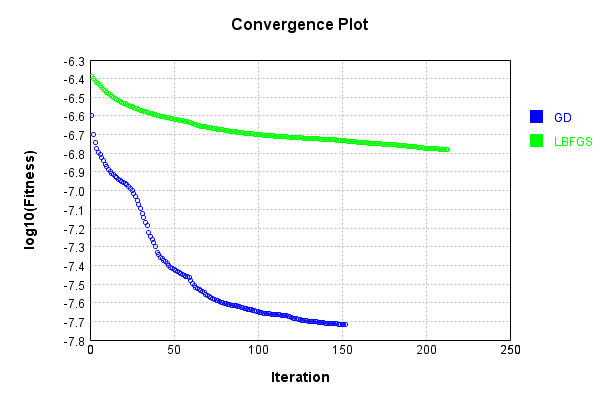


Code from [LearningTester.java:99](../../../../../../../src/main/java/com/simiacryptus/mindseye/test/unit/LearningTester.java#L99) executed in 0.00 seconds: 
```java
    return TestUtil.compareTime(runs);
```

Returns: 


### Model Learning
In this test, attempt to train a network to emulate a randomized network given an example input/output. The target state is:

Code from [LearningTester.java:176](../../../../../../../src/main/java/com/simiacryptus/mindseye/test/unit/LearningTester.java#L176) executed in 0.01 seconds: 
```java
    return network_target.state().stream().map(Arrays::toString).reduce((a, b) -> a + "\n" + b).orElse("");
```

Returns: 

```
    [0.0, 0.0, 0.0, 0.0, 0.0, 0.0, 0.0, 0.0, 0.0, 0.0, 0.0, 0.0, 0.0, 0.0, 0.0, 0.0, 0.0, 0.0, 0.0, 0.0, 0.0, 0.0, 0.0, 0.0, 0.0, 0.0, 0.0, 0.0, 0.0, 0.0, 0.0, 0.0, 0.0, 0.0, 0.0, 0.0, 0.0, 0.0, 0.0, 0.0, 0.0, 0.0, 0.0, 0.0, 0.0, 0.0, 0.0, 0.0]
    [0.0238, -0.046400000000000004, 0.012600000000000002, -0.033600000000000005, -0.0796, 0.0708, -0.0488, 0.0, -0.0492, -0.0308, 0.0992, 0.0626, -0.0548, -0.073, -0.037, -0.0976, -0.07540000000000001, -0.0832, -0.0078000000000000005, 0.014, -0.063, 0.07740000000000001, 0.0478, -0.041, -0.0842, 0.0054, -0.08280000000000001, -0.013600000000000001, 0.0732, 0.09620000000000001, 0.07560000000000001, 0.04580000000000001, 0.0026, -0.0668, -0.013, -0.016800000000000002, 0.0, 0.0832, 0.031, -0.0352, 0.0734, 0.056, 0.08020000000000001, 0.06760000000000001, -0.08120000000000001, -0.0052, 0.0674, 0.001, 0.030600000000000002, 0.0416, 0.0826, 0.0734, -0.09580000000000001, 0.07260000000000001, 0.0482, -0.0296, -0.0496, -0.0796, -0.0416, -0.07, 0.057800000000000004, 0.09580000000000001, -0.0
```
...[skipping 364527 bytes](etc/38.txt)...
```
    8, -0.025, 0.0898, -0.0512, 0.08660000000000001, -0.051800000000000006, -0.045, 0.007600000000000001, -0.06620000000000001, -0.0614, -0.0892, -0.0034000000000000002, 0.0874, 0.0248, 0.028200000000000003, 0.092, -0.007, 0.07260000000000001, -0.021400000000000002, 0.039400000000000004, -0.0432, -0.08580000000000002, -0.08760000000000001, -0.053200000000000004, 0.0124, 0.0804, 0.0606, 0.0654, -0.0884, -0.028200000000000003, 0.06280000000000001, -0.092, 0.0548, 0.0816, 0.059800000000000006, 0.0816, -0.0806, 0.0466, -0.0356, -0.0048000000000000004, 0.0782, -0.0898, -0.037200000000000004, 0.001, -0.08940000000000001, -0.0604, 0.024200000000000003, 0.0534, -0.087, -0.022200000000000004, 0.07060000000000001, 0.057, 0.0932, 0.04240000000000001, -0.020200000000000003, 0.05240000000000001, -0.007600000000000001, 0.062400000000000004, 0.07060000000000001, 0.0068000000000000005, -0.0088, -0.029200000000000004, -0.0422, -0.039200000000000006, 0.065, 0.0328, 0.04580000000000001]
    [0.0, 0.0, 0.0, 0.0, 0.0, 0.0, 0.0, 0.0, 0.0]
```


First, we use a conjugate gradient descent method, which converges the fastest for purely linear functions.

Code from [LearningTester.java:300](../../../../../../../src/main/java/com/simiacryptus/mindseye/test/unit/LearningTester.java#L300) executed in 30.31 seconds: 
```java
    return new IterativeTrainer(trainable)
      .setLineSearchFactory(label -> new QuadraticSearch())
      .setOrientation(new GradientDescent())
      .setMonitor(monitor)
      .setTimeout(30, TimeUnit.SECONDS)
      .setMaxIterations(250)
      .setTerminateThreshold(0)
      .run();
```
Logging: 
```
    Constructing line search parameters: GD
    F(0.0) = LineSearchPoint{point=PointSample{avg=6.611646585957396E-7}, derivative=-2.3762626688046543E-8}
    New Minimum: 6.611646585957396E-7 > 6.611646585933638E-7
    F(1.0E-10) = LineSearchPoint{point=PointSample{avg=6.611646585933638E-7}, derivative=-2.3762626687900648E-8}, delta = -2.3758215379299057E-18
    New Minimum: 6.611646585933638E-7 > 6.61164658579106E-7
    F(7.000000000000001E-10) = LineSearchPoint{point=PointSample{avg=6.61164658579106E-7}, derivative=-2.3762626687025233E-8}, delta = -1.6633609501706323E-17
    New Minimum: 6.61164658579106E-7 > 6.611646584793022E-7
    F(4.900000000000001E-9) = LineSearchPoint{point=PointSample{avg=6.611646584793022E-7}, derivative=-2.3762626680897373E-8}, delta = -1.164373840943124E-16
    New Minimum: 6.611646584793022E-7 > 6.611646577806811E-7
    F(3.430000000000001E-8) = LineSearchPoint{point=PointSample{avg=6.611646577806811E-7}, derivative=-2.376262663800232E-8}, delta = -8.150585122866346E-16
    New Minimum: 6.611646577806811E-7 > 6.6
```
...[skipping 216855 bytes](etc/39.txt)...
```
    5277760264058E-13
    Right bracket at 0.2868690706887627
    New Minimum: 2.3236835841754458E-7 > 2.3236832711584994E-7
    F(0.2449164228099779) = LineSearchPoint{point=PointSample{avg=2.3236832711584994E-7}, derivative=7.453078772894689E-13}, delta = -6.268294706664151E-13
    Right bracket at 0.2449164228099779
    F(0.2091655532725495) = LineSearchPoint{point=PointSample{avg=2.3236838909973536E-7}, derivative=-1.846438845320781E-12}, delta = -5.64845585243332E-13
    Left bracket at 0.2091655532725495
    F(0.23463555529551727) = LineSearchPoint{point=PointSample{avg=2.3236834208277752E-7}, derivative=-1.8455088698986835E-12}, delta = -6.118625430928376E-13
    Left bracket at 0.23463555529551727
    F(0.24195889540005475) = LineSearchPoint{point=PointSample{avg=2.3236832856846759E-7}, derivative=-1.8452414758758376E-12}, delta = -6.253768530222987E-13
    Left bracket at 0.24195889540005475
    Converged to left
    Iteration 113 complete. Error: 2.3236832711584994E-7 Total: 251615176867869.3800; Orientation: 0.0009; Line Search: 0.5478
    
```

Returns: 

```
    2.3236832711584994E-7
```


Training Converged

Next, we run the same optimization using L-BFGS, which is nearly ideal for purely second-order or quadratic functions.

Code from [LearningTester.java:324](../../../../../../../src/main/java/com/simiacryptus/mindseye/test/unit/LearningTester.java#L324) executed in 19.73 seconds: 
```java
    return new IterativeTrainer(trainable)
      .setLineSearchFactory(label -> new ArmijoWolfeSearch())
      .setOrientation(new LBFGS())
      .setMonitor(monitor)
      .setTimeout(30, TimeUnit.SECONDS)
      .setMaxIterations(250)
      .setTerminateThreshold(0)
      .run();
```
Logging: 
```
    LBFGS Accumulation History: 1 points
    Constructing line search parameters: GD
    th(0)=9.374814516514715E-7;dx=-4.703711400084465E-8
    New Minimum: 9.374814516514715E-7 > 8.429132171446937E-7
    END: th(2.154434690031884)=8.429132171446937E-7; dx=-4.0818474258658445E-8 delta=9.456823450677789E-8
    Iteration 1 complete. Error: 8.429132171446937E-7 Total: 251615276537065.8000; Orientation: 0.0016; Line Search: 0.0392
    LBFGS Accumulation History: 1 points
    th(0)=8.429132171446937E-7;dx=-3.547555622735361E-8
    New Minimum: 8.429132171446937E-7 > 7.009680360191251E-7
    END: th(4.641588833612779)=7.009680360191251E-7; dx=-2.600890275870465E-8 delta=1.4194518112556857E-7
    Iteration 2 complete. Error: 7.009680360191251E-7 Total: 251615334840223.7200; Orientation: 0.0015; Line Search: 0.0389
    LBFGS Accumulation History: 1 points
    th(0)=7.009680360191251E-7;dx=-1.9255363611056228E-8
    New Minimum: 7.009680360191251E-7 > 5.504034234760589E-7
    END: th(10.000000000000002)=5.504034234760589E-7; dx=-1.1295992076229238E-8 delta=1.505
```
...[skipping 127951 bytes](etc/40.txt)...
```
    2.3301052156369768E-7;dx=-3.4281971030406313E-12
    New Minimum: 2.3301052156369768E-7 > 2.3301052103888887E-7
    WOLF (strong): th(0.0023435021290705966)=2.3301052103888887E-7; dx=4.4065840764069513E-13 delta=5.248088027454373E-16
    New Minimum: 2.3301052103888887E-7 > 2.3301052052255345E-7
    WOLF (strong): th(0.0011717510645352983)=2.3301052052255345E-7; dx=4.4064779261010936E-13 delta=1.0411442319936773E-15
    END: th(3.9058368817843276E-4)=2.3301052075221041E-7; dx=-9.999183706633113E-13 delta=8.114872625623328E-16
    Iteration 249 complete. Error: 2.3301052052255345E-7 Total: 251634869389845.2200; Orientation: 0.0014; Line Search: 0.0705
    LBFGS Accumulation History: 1 points
    th(0)=2.3301052075221041E-7;dx=-7.027404894285728E-12
    New Minimum: 2.3301052075221041E-7 > 2.330105199207849E-7
    END: th(8.414870471722117E-4)=2.330105199207849E-7; dx=-7.898607089754121E-14 delta=8.314255181681926E-16
    Iteration 250 complete. Error: 2.330105199207849E-7 Total: 251634921192646.1200; Orientation: 0.0013; Line Search: 0.0349
    
```

Returns: 

```
    2.330105199207849E-7
```


Training Converged

Code from [LearningTester.java:96](../../../../../../../src/main/java/com/simiacryptus/mindseye/test/unit/LearningTester.java#L96) executed in 0.00 seconds: 
```java
    return TestUtil.compare(runs);
```

Returns: 

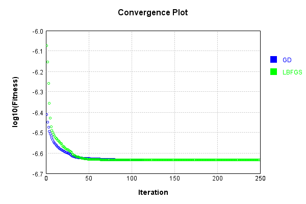


Code from [LearningTester.java:99](../../../../../../../src/main/java/com/simiacryptus/mindseye/test/unit/LearningTester.java#L99) executed in 0.00 seconds: 
```java
    return TestUtil.compareTime(runs);
```

Returns: 

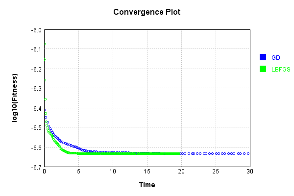


### Composite Learning
In this test, attempt to train a network to emulate a randomized network given an example input/output. The target state is:

Code from [LearningTester.java:219](../../../../../../../src/main/java/com/simiacryptus/mindseye/test/unit/LearningTester.java#L219) executed in 0.05 seconds: 
```java
    return network_target.state().stream().map(Arrays::toString).reduce((a, b) -> a + "\n" + b).orElse("");
```

Returns: 

```
    [0.0, 0.0, 0.0, 0.0, 0.0, 0.0, 0.0, 0.0, 0.0, 0.0, 0.0, 0.0, 0.0, 0.0, 0.0, 0.0, 0.0, 0.0, 0.0, 0.0, 0.0, 0.0, 0.0, 0.0, 0.0, 0.0, 0.0, 0.0, 0.0, 0.0, 0.0, 0.0, 0.0, 0.0, 0.0, 0.0, 0.0, 0.0, 0.0, 0.0, 0.0, 0.0, 0.0, 0.0, 0.0, 0.0, 0.0, 0.0]
    [0.09580000000000001, 0.0614, -0.043, -0.024200000000000003, -0.0724, 0.05, -0.0966, 0.0974, 0.0682, 0.0844, -0.0722, -0.0646, 0.0814, 0.083, 0.021200000000000004, -0.063, -0.09140000000000001, -0.06, -0.07260000000000001, -0.0604, 0.0188, -0.0246, -0.08860000000000001, 0.0724, -0.07060000000000001, -0.0582, -0.0104, 0.0108, 0.033600000000000005, 0.07940000000000001, -0.049400000000000006, -0.004, 0.011, -0.0308, 0.0966, -0.0698, -0.0388, 0.042800000000000005, -0.0164, -0.0182, -0.0674, -0.0362, -0.008, -0.0816, -0.053200000000000004, -0.0926, -0.0682, -0.031200000000000002, 0.07260000000000001, -0.074, 0.017400000000000002, -0.0992, 0.011800000000000001, -0.068, 0.0028000000000000004, 0.0516, 0.0674, -0.0068000000000000005, 0.043, -0.0796, -0.0248, -0.0296, 0.008, -0.0868
```
...[skipping 364527 bytes](etc/41.txt)...
```
    00000001, -0.0094, -0.077, 0.04240000000000001, -0.05040000000000001, 0.0332, 0.026400000000000003, -0.0302, -0.0864, -0.005600000000000001, 0.065, -0.021400000000000002, -0.08, -0.059, -0.038200000000000005, 0.0908, 0.06860000000000001, 0.0874, -0.0806, 0.0898, -0.09380000000000001, -0.045, -0.04580000000000001, 0.0456, 0.062400000000000004, -0.0824, -0.0058000000000000005, 0.0804, 0.0134, -0.0456, 0.032, 0.09980000000000001, 0.099, -0.07260000000000001, -0.041, -0.0442, -0.0034000000000000002, 0.06720000000000001, 0.04580000000000001, 0.048600000000000004, 0.0466, 0.01, -0.0088, 0.0164, 0.0442, -0.021400000000000002, 0.0114, 0.029400000000000003, 0.0816, 0.082, -0.0402, 0.0036, 0.0816, 0.0014000000000000002, -0.08940000000000001, 0.026600000000000002, -0.007, 0.013600000000000001, -0.0892, -0.08360000000000001, -0.07, -0.0408, 0.07479999999999999, -0.051800000000000006, -0.048400000000000006, -0.097, -0.072, -0.037200000000000004, -0.0248, 0.0068000000000000005]
    [0.0, 0.0, 0.0, 0.0, 0.0, 0.0, 0.0, 0.0, 0.0]
```


We simultaneously regress this target input:

Code from [LearningTester.java:223](../../../../../../../src/main/java/com/simiacryptus/mindseye/test/unit/LearningTester.java#L223) executed in 0.00 seconds: 
```java
    return Arrays.stream(testInput).map(x -> x.prettyPrint()).reduce((a, b) -> a + "\n" + b).orElse("");
```

Returns: 

```
    [
    	[ [ 0.07880000000000001, -0.0228, -0.0644 ], [ -0.056600000000000004, 0.0974, 0.0582 ], [ -0.0814, -0.0072, 0.0572 ], [ 0.08780000000000002, -0.072, 0.034 ], [ -0.0166, 0.0324, 0.0142 ] ],
    	[ [ -0.0908, 0.0022, -0.0562 ], [ -0.0034000000000000002, -0.018, -0.035800000000000005 ], [ 0.015, 0.012, 0.0054 ], [ -0.095, 0.0364, 0.013 ], [ 8.0E-4, 0.0572, 0.033 ] ],
    	[ [ 0.057800000000000004, -0.07360000000000001, -0.0346 ], [ 0.08220000000000001, -0.0052, -0.016800000000000002 ], [ -0.0698, 0.0648, 0.009800000000000001 ], [ 0.082, 0.07980000000000001, 0.0468 ], [ 0.08220000000000001, -0.0018, 0.085 ] ],
    	[ [ -0.047400000000000005, 0.077, -0.0048000000000000004 ], [ 0.010600000000000002, -0.051800000000000006, -0.023200000000000002 ], [ 0.086, -0.08020000000000001, 0.021 ], [ 0.012600000000000002, 0.09780000000000001, 0.07440000000000001 ], [ -0.040400000000000005, -0.003, -0.0024000000000000002 ] ],
    	[ [ -0.061, -0.011, 0.085 ], [ -0.0386, -0.033800000000000004, -0.0188 ], [ -0.037200000000000004, 0.09060000000000001, 0.054400000000000004 ], [ -0.049400000000000006, 0.015, -0.0692 ], [ 0.0466, -0.0344, -0.0852 ] ]
    ]
```


Which produces the following output:

Code from [LearningTester.java:230](../../../../../../../src/main/java/com/simiacryptus/mindseye/test/unit/LearningTester.java#L230) executed in 0.00 seconds: 
```java
    return Stream.of(targetOutput).map(x -> x.prettyPrint()).reduce((a, b) -> a + "\n" + b).orElse("");
```

Returns: 

```
    [
    	[ [ 0.0, 0.0015974616062825098, 9.012348264661274E-4, 5.524584542878332E-4, 0.0, 0.0, 0.0016799355827066085, 0.0, ... ], [ 0.0, 0.0017447758606703562, 0.0014556531595994284, 7.311141507425385E-4, 2.6069579876873174E-4, 0.0, 0.0011793609757019998, 0.0012184421787399754, ... ], [ 0.0, 4.55692731250912E-4, 5.272245332308375E-4, 2.0049870601874907E-4, 6.073118829606533E-4, 0.0, 0.002312682607060485, 0.0011038859552036416, ... ], [ 0.0018677168661763192, 0.0, 0.0, 0.0, 3.8942735146099027E-4, 0.0, 1.5112632361837476E-4, 0.001425181241057109, ... ], [ 5.279338019763053E-4, 0.0, 0.0011401729999619868, 2.6955097372478865E-4, 5.256579138327794E-4, 5.130610628145342E-4, 4.092675110136246E-4, 4.022196289387931E-4, ... ] ],
    	[ [ 6.610033682632709E-4, 0.002274741605543681, 0.001794641475579389, 0.001561972994730596, 0.0, 1.7462624294435776E-4, 3.5367559440415824E-4, 7.264469523502485E-4, ... ], [ 7.995670540664886E-4, 0.0034062814255348475, 8.675802562589923E-4, 0.0012996532222972798, 3.815244910107773E-4, 0.0, 0.002711
```
...[skipping 1551 bytes](etc/42.txt)...
```
     0.0014969028574995692, 0.0, 2.8676745936702635E-4, 0.0012109696760419695, 0.0011302049171113397, ... ], [ 6.269381864079034E-4, 6.996171784896466E-4, 0.0015975459092023333, 6.414578828646538E-4, 0.0, 0.0, 0.0028079727043526874, 0.0013577813582571969, ... ], [ 0.0, 0.0, 0.0, 0.0, 0.0, 1.36101993899358E-4, 2.744385406064485E-4, 0.002268665534730744, ... ] ],
    	[ [ 5.58068335783203E-4, 5.935847613433534E-4, 0.0, 0.0013853444540042903, 0.0, 0.0, 0.0, 6.078728052552998E-4, ... ], [ 7.949582869155265E-4, 1.093534608021818E-4, 0.0, 0.0017288551868956633, 0.0, 0.0, 0.0010898081254874766, 0.0, ... ], [ 7.399505383730106E-4, 3.0308280993841764E-4, 0.0017313722352939674, 0.002621026793309958, 0.0, 0.0, 7.995747962344961E-4, 1.635046232876628E-4, ... ], [ 0.0012236954425746168, 0.0012205180892016403, 1.4794601933841857E-4, 0.0, 0.0, 0.0, 4.43040063187605E-4, 5.80314996527286E-4, ... ], [ 0.001075598575357753, 0.0, 7.125085180813649E-4, 0.0, 0.0, 7.224410203493249E-5, 5.308975092582729E-4, 0.0011019763967012263, ... ] ]
    ]
```


First, we use a conjugate gradient descent method, which converges the fastest for purely linear functions.

Code from [LearningTester.java:300](../../../../../../../src/main/java/com/simiacryptus/mindseye/test/unit/LearningTester.java#L300) executed in 30.28 seconds: 
```java
    return new IterativeTrainer(trainable)
      .setLineSearchFactory(label -> new QuadraticSearch())
      .setOrientation(new GradientDescent())
      .setMonitor(monitor)
      .setTimeout(30, TimeUnit.SECONDS)
      .setMaxIterations(250)
      .setTerminateThreshold(0)
      .run();
```
Logging: 
```
    Constructing line search parameters: GD
    F(0.0) = LineSearchPoint{point=PointSample{avg=1.2476271807638234E-6}, derivative=-3.921096869781498E-8}
    New Minimum: 1.2476271807638234E-6 > 1.247627180759901E-6
    F(1.0E-10) = LineSearchPoint{point=PointSample{avg=1.247627180759901E-6}, derivative=-3.921096869757411E-8}, delta = -3.922397820497851E-18
    New Minimum: 1.247627180759901E-6 > 1.2476271807363753E-6
    F(7.000000000000001E-10) = LineSearchPoint{point=PointSample{avg=1.2476271807363753E-6}, derivative=-3.921096869612879E-8}, delta = -2.7448102655775602E-17
    New Minimum: 1.2476271807363753E-6 > 1.2476271805716893E-6
    F(4.900000000000001E-9) = LineSearchPoint{point=PointSample{avg=1.2476271805716893E-6}, derivative=-3.921096868601164E-8}, delta = -1.9213417749158745E-16
    New Minimum: 1.2476271805716893E-6 > 1.2476271794188876E-6
    F(3.430000000000001E-8) = LineSearchPoint{point=PointSample{avg=1.2476271794188876E-6}, derivative=-3.9210968615191595E-8}, delta = -1.3449358543093232E-15
    New Minimum: 1.2476271794188
```
...[skipping 207566 bytes](etc/43.txt)...
```
    (0.43789406794995384) = LineSearchPoint{point=PointSample{avg=4.2717649917423547E-7}, derivative=8.599857321848569E-13}, delta = -2.2204314260735117E-12
    Right bracket at 0.43789406794995384
    F(0.4043628083881722) = LineSearchPoint{point=PointSample{avg=4.271765026258148E-7}, derivative=-3.5750528979219388E-12}, delta = -2.216979846752185E-12
    Left bracket at 0.4043628083881722
    New Minimum: 4.2717649917423547E-7 > 4.271764935835839E-7
    F(0.4313921167359178) = LineSearchPoint{point=PointSample{avg=4.271764935835839E-7}, derivative=8.596984706367343E-13}, delta = -2.226022077624121E-12
    Right bracket at 0.4313921167359178
    New Minimum: 4.271764935835839E-7 > 4.2717648907957246E-7
    F(0.4261523517259399) = LineSearchPoint{point=PointSample{avg=4.2717648907957246E-7}, derivative=8.594669735125443E-13}, delta = -2.2305260890826037E-12
    Right bracket at 0.4261523517259399
    Converged to right
    Iteration 101 complete. Error: 4.2717648907957246E-7 Total: 251665500189196.0300; Orientation: 0.0009; Line Search: 0.5039
    
```

Returns: 

```
    4.2717648907957246E-7
```


Training Converged

Next, we run the same optimization using L-BFGS, which is nearly ideal for purely second-order or quadratic functions.

Code from [LearningTester.java:324](../../../../../../../src/main/java/com/simiacryptus/mindseye/test/unit/LearningTester.java#L324) executed in 14.83 seconds: 
```java
    return new IterativeTrainer(trainable)
      .setLineSearchFactory(label -> new ArmijoWolfeSearch())
      .setOrientation(new LBFGS())
      .setMonitor(monitor)
      .setTimeout(30, TimeUnit.SECONDS)
      .setMaxIterations(250)
      .setTerminateThreshold(0)
      .run();
```
Logging: 
```
    LBFGS Accumulation History: 1 points
    Constructing line search parameters: GD
    th(0)=1.2476271807638234E-6;dx=-3.921096869781498E-8
    New Minimum: 1.2476271807638234E-6 > 1.1684899619032925E-6
    END: th(2.154434690031884)=1.1684899619032925E-6; dx=-3.426513499036968E-8 delta=7.913721886053097E-8
    Iteration 1 complete. Error: 1.1684899619032925E-6 Total: 251665574510704.5000; Orientation: 0.0014; Line Search: 0.0365
    LBFGS Accumulation History: 1 points
    th(0)=1.1684899619032925E-6;dx=-3.0064668757560055E-8
    New Minimum: 1.1684899619032925E-6 > 1.0463004178685598E-6
    END: th(4.641588833612779)=1.0463004178685598E-6; dx=-2.2716288819104708E-8 delta=1.2218954403473264E-7
    Iteration 2 complete. Error: 1.0463004178685598E-6 Total: 251665627758631.4400; Orientation: 0.0014; Line Search: 0.0355
    LBFGS Accumulation History: 1 points
    th(0)=1.0463004178685598E-6;dx=-1.7446042211126717E-8
    New Minimum: 1.0463004178685598E-6 > 9.103312074308417E-7
    END: th(10.000000000000002)=9.103312074308417E-7; dx=-1.0031714025910402E-
```
...[skipping 90488 bytes](etc/44.txt)...
```
    2755058E-13)=4.443140751509938E-7; dx=-1.0159835526774827E-11 delta=-1.0587911840678754E-22
    WOLFE (weak): th(9.77050548503372E-14)=4.443140751509937E-7; dx=-1.015983552677483E-11 delta=0.0
    WOLFE (weak): th(1.221313185629215E-13)=4.443140751509937E-7; dx=-1.015983552677483E-11 delta=0.0
    Armijo: th(1.3434445041921367E-13)=4.443140751509938E-7; dx=-1.0159835526774827E-11 delta=-1.0587911840678754E-22
    WOLFE (weak): th(1.2823788449106757E-13)=4.443140751509937E-7; dx=-1.0159835526774827E-11 delta=0.0
    WOLFE (weak): th(1.3129116745514062E-13)=4.443140751509937E-7; dx=-1.0159835526774829E-11 delta=0.0
    Armijo: th(1.3281780893717713E-13)=4.443140751509938E-7; dx=-1.0159835526774827E-11 delta=-1.0587911840678754E-22
    WOLFE (weak): th(1.3205448819615886E-13)=4.443140751509937E-7; dx=-1.0159835526774827E-11 delta=0.0
    mu >= nu: th(0)=4.443140751509937E-7;th'(0)=-1.0159835526774839E-11;
    Iteration 167 failed, aborting. Error: 4.443140751509937E-7 Total: 251680331169067.9700; Orientation: 0.0014; Line Search: 0.2692
    
```

Returns: 

```
    4.443140751509937E-7
```


Training Converged

Code from [LearningTester.java:96](../../../../../../../src/main/java/com/simiacryptus/mindseye/test/unit/LearningTester.java#L96) executed in 0.00 seconds: 
```java
    return TestUtil.compare(runs);
```

Returns: 

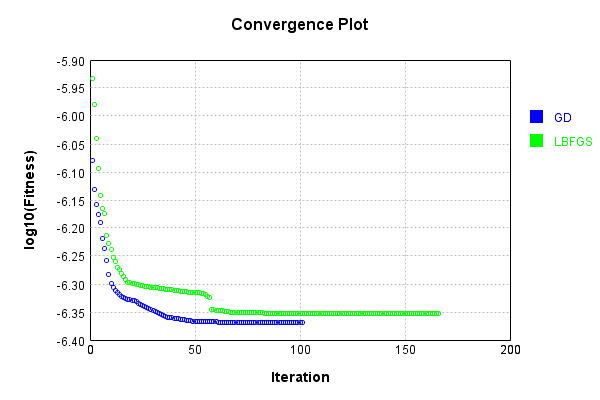


Code from [LearningTester.java:99](../../../../../../../src/main/java/com/simiacryptus/mindseye/test/unit/LearningTester.java#L99) executed in 0.00 seconds: 
```java
    return TestUtil.compareTime(runs);
```

Returns: 

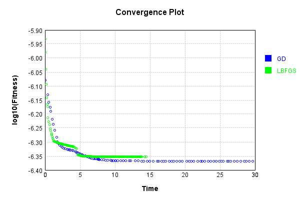


