# NarrowingPipeline
This is a network with the following layout:

Code from [NLayerTest.java:87](../../../../../../../src/test/java/com/simiacryptus/mindseye/network/NLayerTest.java#L87) executed in 2.02 seconds: 
```java
    return Graphviz.fromGraph(TestUtil.toGraph((DAGNetwork) layer))
      .height(400).width(600).render(Format.PNG).toImage();
```

Returns: 

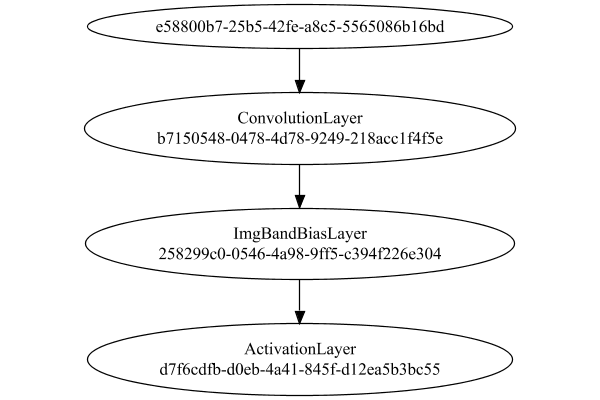


### Json Serialization
Code from [JsonTest.java:36](../../../../../../../src/main/java/com/simiacryptus/mindseye/test/unit/JsonTest.java#L36) executed in 0.03 seconds: 
```java
    JsonObject json = layer.getJson();
    NNLayer echo = NNLayer.fromJson(json);
    if ((echo == null)) throw new AssertionError("Failed to deserialize");
    if ((layer == echo)) throw new AssertionError("Serialization did not copy");
    if ((!layer.equals(echo))) throw new AssertionError("Serialization not equal");
    return new GsonBuilder().setPrettyPrinting().create().toJson(json);
```

Returns: 

```
    {
      "class": "com.simiacryptus.mindseye.network.PipelineNetwork",
      "id": "6efa1ae1-1745-4453-9b0c-760d32142f97",
      "isFrozen": false,
      "name": "PipelineNetwork/6efa1ae1-1745-4453-9b0c-760d32142f97",
      "inputs": [
        "e58800b7-25b5-42fe-a8c5-5565086b16bd"
      ],
      "nodes": {
        "56ada192-0c92-4c7f-a3f1-2df13b567ac6": "b7150548-0478-4d78-9249-218acc1f4f5e",
        "a1549ba7-3208-4ca2-8b8f-19fa9da87c44": "258299c0-0546-4a98-9ff5-c394f226e304",
        "fa219636-4ba6-43c4-872a-416370b0ed82": "d7f6cdfb-d0eb-4a41-845f-d12ea5b3bc55"
      },
      "layers": {
        "b7150548-0478-4d78-9249-218acc1f4f5e": {
          "class": "com.simiacryptus.mindseye.layers.cudnn.ConvolutionLayer",
          "id": "b7150548-0478-4d78-9249-218acc1f4f5e",
          "isFrozen": false,
          "name": "ConvolutionLayer/b7150548-0478-4d78-9249-218acc1f4f5e",
          "filter": [
            [
              [
                -0.09780000000000001,
                -0.0502,
                -0.0666
              ],
              [
                -0.019,
                0.0752,
                -0.073799999999999
```
...[skipping 1841 bytes](etc/1.txt)...
```
    -c394f226e304": {
          "class": "com.simiacryptus.mindseye.layers.cudnn.ImgBandBiasLayer",
          "id": "258299c0-0546-4a98-9ff5-c394f226e304",
          "isFrozen": false,
          "name": "ImgBandBiasLayer/258299c0-0546-4a98-9ff5-c394f226e304",
          "bias": [
            0.0,
            0.0
          ],
          "precision": "Double"
        },
        "d7f6cdfb-d0eb-4a41-845f-d12ea5b3bc55": {
          "class": "com.simiacryptus.mindseye.layers.cudnn.ActivationLayer",
          "id": "d7f6cdfb-d0eb-4a41-845f-d12ea5b3bc55",
          "isFrozen": false,
          "name": "ActivationLayer/d7f6cdfb-d0eb-4a41-845f-d12ea5b3bc55",
          "mode": 1,
          "precision": "Double"
        }
      },
      "links": {
        "56ada192-0c92-4c7f-a3f1-2df13b567ac6": [
          "e58800b7-25b5-42fe-a8c5-5565086b16bd"
        ],
        "a1549ba7-3208-4ca2-8b8f-19fa9da87c44": [
          "56ada192-0c92-4c7f-a3f1-2df13b567ac6"
        ],
        "fa219636-4ba6-43c4-872a-416370b0ed82": [
          "a1549ba7-3208-4ca2-8b8f-19fa9da87c44"
        ]
      },
      "labels": {},
      "head": "fa219636-4ba6-43c4-872a-416370b0ed82"
    }
```


### Input Learning
In this test, we use a network to learn this target input, given it's pre-evaluated output:

Code from [LearningTester.java:127](../../../../../../../src/main/java/com/simiacryptus/mindseye/test/unit/LearningTester.java#L127) executed in 0.00 seconds: 
```java
    return Arrays.stream(input_target).map(x -> x.prettyPrint()).reduce((a, b) -> a + "\n" + b).orElse("");
```

Returns: 

```
    [
    	[ [ -0.012600000000000002, -0.010600000000000002, -0.064 ], [ 0.003, 0.0864, 0.0572 ], [ 0.0324, -0.066, -0.024 ], [ -0.009200000000000002, 0.08020000000000001, -0.017400000000000002 ], [ -0.024, -0.029400000000000003, 0.069 ] ],
    	[ [ 0.0216, -0.0892, -0.06080000000000001 ], [ -0.07060000000000001, -0.038400000000000004, 0.0586 ], [ 0.09580000000000001, 0.0228, 0.024 ], [ -0.0102, -0.0064, -0.0806 ], [ -0.0926, 0.09380000000000001, -0.074 ] ],
    	[ [ -0.0688, -0.021200000000000004, 0.012 ], [ 0.041, 0.0926, -0.0536 ], [ -0.0572, 0.038200000000000005, -0.0298 ], [ -0.071, -0.061200000000000004, -0.0416 ], [ 0.0176, 0.0728, 0.0468 ] ],
    	[ [ -0.07060000000000001, -0.0732, 0.002 ], [ -0.046400000000000004, 0.07560000000000001, 0.0012000000000000001 ], [ -0.010600000000000002, 0.038400000000000004, 0.019200000000000002 ], [ -0.0052, 0.022600000000000002, -0.066 ], [ -0.0658, -0.0902, 0.044 ] ],
    	[ [ 0.059800000000000006, 0.0334, 0.045 ], [ 0.017400000000000002, -0.07940000000000001, 0.0732 ], [ -0.0782, -0.0026, 0.066 ], [ 0.034800000000000005, 0.0692, 0.0546 ], [ -0.014600000000000002, 0.06760000000000001, 0.0604 ] ]
    ]
```


First, we use a conjugate gradient descent method, which converges the fastest for purely linear functions.

Code from [LearningTester.java:300](../../../../../../../src/main/java/com/simiacryptus/mindseye/test/unit/LearningTester.java#L300) executed in 2.46 seconds: 
```java
    return new IterativeTrainer(trainable)
      .setLineSearchFactory(label -> new QuadraticSearch())
      .setOrientation(new GradientDescent())
      .setMonitor(monitor)
      .setTimeout(30, TimeUnit.SECONDS)
      .setMaxIterations(250)
      .setTerminateThreshold(0)
      .run();
```
Logging: 
```
    Constructing line search parameters: GD
    F(0.0) = LineSearchPoint{point=PointSample{avg=1.2996699158105606E-4}, derivative=-7.508576590954881E-7}
    New Minimum: 1.2996699158105606E-4 > 1.299669915809809E-4
    F(1.0E-10) = LineSearchPoint{point=PointSample{avg=1.299669915809809E-4}, derivative=-7.508576590950624E-7}, delta = -7.51623156075576E-17
    New Minimum: 1.299669915809809E-4 > 1.299669915805304E-4
    F(7.000000000000001E-10) = LineSearchPoint{point=PointSample{avg=1.299669915805304E-4}, derivative=-7.508576590925095E-7}, delta = -5.256483182752847E-16
    New Minimum: 1.299669915805304E-4 > 1.299669915773768E-4
    F(4.900000000000001E-9) = LineSearchPoint{point=PointSample{avg=1.299669915773768E-4}, derivative=-7.508576590746388E-7}, delta = -3.6792671773838714E-15
    New Minimum: 1.299669915773768E-4 > 1.2996699155530157E-4
    F(3.430000000000001E-8) = LineSearchPoint{point=PointSample{avg=1.2996699155530157E-4}, derivative=-7.508576589495439E-7}, delta = -2.575449077092673E-14
    New Minimum: 1.2996699155530157E-4 > 1
```
...[skipping 142113 bytes](etc/2.txt)...
```
    
    Right bracket at 284.66124910591105
    F(277.6843799589822) = LineSearchPoint{point=PointSample{avg=1.9783900391520016E-5}, derivative=1.7370915310216827E-31}, delta = -3.3881317890172014E-21
    Right bracket at 277.6843799589822
    Converged to right
    Iteration 107 complete. Error: 1.9783900391520016E-5 Total: 250789181127126.8400; Orientation: 0.0001; Line Search: 0.0224
    Zero gradient: 4.746634058018124E-12
    F(0.0) = LineSearchPoint{point=PointSample{avg=1.9783900391520016E-5}, derivative=-2.2530534880737598E-23}
    F(277.6843799589822) = LineSearchPoint{point=PointSample{avg=1.9783900391520016E-5}, derivative=3.654499337609422E-24}, delta = 0.0
    1.9783900391520016E-5 <= 1.9783900391520016E-5
    F(238.92951814888968) = LineSearchPoint{point=PointSample{avg=1.9783900391520016E-5}, derivative=3.7007759778286617E-31}, delta = 0.0
    Right bracket at 238.92951814888968
    Converged to right
    Iteration 108 failed, aborting. Error: 1.9783900391520016E-5 Total: 250789189524299.8000; Orientation: 0.0001; Line Search: 0.0065
    
```

Returns: 

```
    1.9783900391520016E-5
```


This training run resulted in the following regressed input:

Code from [LearningTester.java:144](../../../../../../../src/main/java/com/simiacryptus/mindseye/test/unit/LearningTester.java#L144) executed in 0.00 seconds: 
```java
    return Arrays.stream(input_gd).map(x -> x.prettyPrint()).reduce((a, b) -> a + "\n" + b).orElse("");
```

Returns: 

```
    [
    	[ [ -0.05349490583343883, -0.03527144000726159, 0.007502228665374016 ], [ 0.07828293738704505, 0.006878096979780248, 0.04265323599465715 ], [ 0.03979815799473839, -0.1461170082592027, 0.003929385075205488 ], [ 0.05371997733160876, -0.033846928605775754, 9.679876466753787E-4 ], [ -0.0934294324730631, -0.043656489256019664, 0.1190888921992273 ] ],
    	[ [ -0.023905856883314786, 1.0937063655283998E-4, -0.04596183071723736 ], [ -0.025764801705307063, 0.0016769305120329767, 0.05887115075311788 ], [ -0.003735792534203389, 0.025171658503901243, -0.002361681116210159 ], [ 0.03542108862854, -0.08393866559011953, -0.03294155699843228 ], [ 0.05227139167897427, 0.05033387174331908, -0.027765780591024077 ] ],
    	[ [ -0.0980158537130183, -0.060952209614365434, 0.03624466591811513 ], [ -0.029659770077414563, -0.05457913054561096, 0.002271257145733574 ], [ -0.06844359098809956, -0.011379289245140839, 0.05107640071834153 ], [ -0.08359354471297827, -0.08797381907376203, -0.027172129674178248 ], [ 0.023707578911759727, 0.060045877002847844, 0.06466439363189318 ] ],
    	[ [ 0.032157733075142345, 0.08617439948256629, 0.053578413837406434 ], [ 0.05289252551604097, -0.07994203725305449, 0.06855400288490035 ], [ -0.010515419888836277, -8.505154944435312E-4, 0.004147957059136256 ], [ 0.006603176509949453, 0.04450225024439726, -0.06142513317580401 ], [ -1.8247639468233713E-5, 0.004169610448580291, -0.0401033200033793 ] ],
    	[ [ 0.05119539533404335, 0.025163186634601886, -0.0031380441296791598 ], [ -0.013626736425280244, 0.01943568333720917, -0.008310156491325674 ], [ -0.03280820592604934, -0.05929528545383238, 0.04595976193876099 ], [ 0.03069063664753632, 0.07361491693194873, 0.03445271813771483 ], [ -0.002086307192988283, 0.04014102698922682, -0.0321300094054186 ] ]
    ]
```


Next, we run the same optimization using L-BFGS, which is nearly ideal for purely second-order or quadratic functions.

Code from [LearningTester.java:324](../../../../../../../src/main/java/com/simiacryptus/mindseye/test/unit/LearningTester.java#L324) executed in 1.07 seconds: 
```java
    return new IterativeTrainer(trainable)
      .setLineSearchFactory(label -> new ArmijoWolfeSearch())
      .setOrientation(new LBFGS())
      .setMonitor(monitor)
      .setTimeout(30, TimeUnit.SECONDS)
      .setMaxIterations(250)
      .setTerminateThreshold(0)
      .run();
```
Logging: 
```
    LBFGS Accumulation History: 1 points
    Constructing line search parameters: GD
    th(0)=1.2996699158105606E-4;dx=-7.508576590954881E-7
    New Minimum: 1.2996699158105606E-4 > 1.2835919261595884E-4
    WOLFE (weak): th(2.154434690031884)=1.2835919261595884E-4; dx=-7.41690685522359E-7 delta=1.6077989650972204E-6
    New Minimum: 1.2835919261595884E-4 > 1.2676816846504273E-4
    WOLFE (weak): th(4.308869380063768)=1.2676816846504273E-4; dx=-7.596800012646734E-7 delta=3.198823116013329E-6
    New Minimum: 1.2676816846504273E-4 > 1.2038079266112694E-4
    WOLFE (weak): th(12.926608140191302)=1.2038079266112694E-4; dx=-7.226986091125181E-7 delta=9.586198919929112E-6
    New Minimum: 1.2038079266112694E-4 > 9.512556246839718E-5
    END: th(51.70643256076521)=9.512556246839718E-5; dx=-5.694309169731055E-7 delta=3.484142911265887E-5
    Iteration 1 complete. Error: 9.512556246839718E-5 Total: 250789223809194.8000; Orientation: 0.0058; Line Search: 0.0170
    LBFGS Accumulation History: 1 points
    th(0)=9.512556246839718E-5;dx=-5.464927388283193E-7
    N
```
...[skipping 48161 bytes](etc/3.txt)...
```
    Line Search: 0.0036
    LBFGS Accumulation History: 1 points
    th(0)=1.9783900391520016E-5;dx=-9.201523760350656E-24
    New Minimum: 1.9783900391520016E-5 > 1.978390039152001E-5
    END: th(1355.724253383642)=1.978390039152001E-5; dx=-1.5298359635066645E-24 delta=6.776263578034403E-21
    Iteration 101 complete. Error: 1.978390039152001E-5 Total: 250790251831688.7500; Orientation: 0.0001; Line Search: 0.0036
    LBFGS Accumulation History: 1 points
    th(0)=1.978390039152001E-5;dx=-1.0422812186784361E-23
    Armijo: th(2920.819361607294)=1.9783900391520233E-5; dx=1.6642561506925975E-22 delta=-2.236166980751353E-19
    Armijo: th(1460.409680803647)=1.9783900391520064E-5; dx=7.797820779132131E-23 delta=-5.421010862427522E-20
    WOLF (strong): th(486.803226934549)=1.978390039152001E-5; dx=1.901326941012285E-23 delta=0.0
    END: th(121.70080673363725)=1.978390039152001E-5; dx=-3.0985826510612022E-24 delta=0.0
    Iteration 102 failed, aborting. Error: 1.978390039152001E-5 Total: 250790263432303.7500; Orientation: 0.0001; Line Search: 0.0098
    
```

Returns: 

```
    1.978390039152001E-5
```


This training run resulted in the following regressed input:

Code from [LearningTester.java:154](../../../../../../../src/main/java/com/simiacryptus/mindseye/test/unit/LearningTester.java#L154) executed in 0.00 seconds: 
```java
    return Arrays.stream(input_lbgfs).map(x -> x.prettyPrint()).reduce((a, b) -> a + "\n" + b).orElse("");
```

Returns: 

```
    [
    	[ [ -0.05089226390066293, -0.040647476176883995, -6.025350660069426E-4 ], [ 0.08425095892256894, 0.005486702623532262, 0.04182722314447641 ], [ 0.04603550832059021, -0.14465086940397953, -4.955256074272404E-4 ], [ 0.05340150108665973, -0.03284080720888688, -1.1562508118856444E-4 ], [ -0.0954508525763019, -0.044926350596758334, 0.11922599055200718 ] ],
    	[ [ -0.02777312940541997, -0.0015010523752005704, -0.043773633720119526 ], [ -0.026525833912937554, 0.003976027416499525, 0.055211920405542125 ], [ -0.001549327858305114, 0.02198628102275156, -0.003949935686804895 ], [ 0.034687055286695245, -0.08497436808888467, -0.03170810509757151 ], [ 0.04970586571909443, 0.0482695437737911, -0.02834637562985492 ] ],
    	[ [ -0.0923378549092033, -0.053765456709716324, 0.03296227080868908 ], [ -0.03140954497930873, -0.05770875952832359, 0.004497948742678521 ], [ -0.06759937761954869, -0.014090640396603633, 0.04931596364475371 ], [ -0.08210871495850239, -0.08374767584328843, -0.026135612878639768 ], [ 0.02181916979088428, 0.06043433787467393, 0.06572734594866197 ] ],
    	[ [ 0.03120039445560895, 0.08494143360695633, 0.05394927134433969 ], [ 0.04664739294147011, -0.0828826038412308, 0.07097132926582482 ], [ -0.01017439954742859, -0.002932382914815651, 0.0024436417271474793 ], [ 0.006828624681989056, 0.04553493259583389, -0.06234930553538055 ], [ 0.0012686858162047035, 0.005106595456068848, -0.0393519911084088 ] ],
    	[ [ 0.051550956803250614, 0.025287451739911565, -0.003352106646854959 ], [ -0.010801757582304153, 0.02053846412907586, -0.00945021704739717 ], [ -0.03345033346398002, -0.06039682148650373, 0.04551920479615139 ], [ 0.036159147932260036, 0.07116247118925347, 0.03371949478623018 ], [ -0.0013604228094821359, 0.038551229376466024, -0.032397088037992905 ] ]
    ]
```


Code from [LearningTester.java:96](../../../../../../../src/main/java/com/simiacryptus/mindseye/test/unit/LearningTester.java#L96) executed in 0.09 seconds: 
```java
    return TestUtil.compare(runs);
```

Returns: 

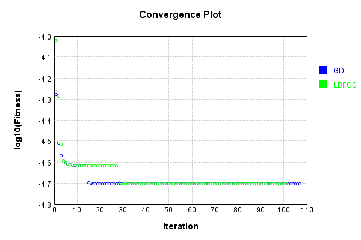


Code from [LearningTester.java:99](../../../../../../../src/main/java/com/simiacryptus/mindseye/test/unit/LearningTester.java#L99) executed in 0.01 seconds: 
```java
    return TestUtil.compareTime(runs);
```

Returns: 

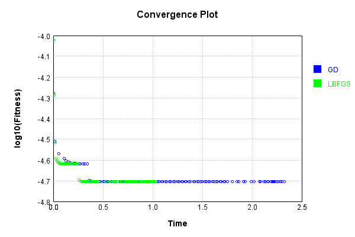


### Model Learning
In this test, attempt to train a network to emulate a randomized network given an example input/output. The target state is:

Code from [LearningTester.java:176](../../../../../../../src/main/java/com/simiacryptus/mindseye/test/unit/LearningTester.java#L176) executed in 0.00 seconds: 
```java
    return network_target.state().stream().map(Arrays::toString).reduce((a, b) -> a + "\n" + b).orElse("");
```

Returns: 

```
    [0.0, 0.0]
    [0.0144, -0.0502, -0.0776, -0.0548, -0.08860000000000001, -0.048400000000000006, 0.0354, -0.05140000000000001, -0.08480000000000001, 0.046200000000000005, -0.07379999999999999, -0.030400000000000003, 0.059800000000000006, 0.0946, 0.095, 0.011200000000000002, 0.0718, 0.0752, 0.0024000000000000002, 0.0884, -0.014, -0.0772, -0.08460000000000001, 0.0572, 0.0932, -0.0616, -0.078, 0.0284, 0.046, -0.06720000000000001, -0.0238, 0.0646, 0.048, -0.03, 0.07980000000000001, -0.0844, -0.039, -0.018400000000000003, 0.0926, 0.0994, -0.031, -0.004200000000000001, 0.0862, 0.047200000000000006, -0.019, -0.0666, 0.0898, -0.0274, -0.07840000000000001, -0.09780000000000001, 0.0048000000000000004, 0.021200000000000004, 0.0714, 0.0148]
```


First, we use a conjugate gradient descent method, which converges the fastest for purely linear functions.

Code from [LearningTester.java:300](../../../../../../../src/main/java/com/simiacryptus/mindseye/test/unit/LearningTester.java#L300) executed in 4.71 seconds: 
```java
    return new IterativeTrainer(trainable)
      .setLineSearchFactory(label -> new QuadraticSearch())
      .setOrientation(new GradientDescent())
      .setMonitor(monitor)
      .setTimeout(30, TimeUnit.SECONDS)
      .setMaxIterations(250)
      .setTerminateThreshold(0)
      .run();
```
Logging: 
```
    Constructing line search parameters: GD
    F(0.0) = LineSearchPoint{point=PointSample{avg=1.03439858390976E-4}, derivative=-5.040662298050361E-6}
    New Minimum: 1.03439858390976E-4 > 1.0343985839047191E-4
    F(1.0E-10) = LineSearchPoint{point=PointSample{avg=1.0343985839047191E-4}, derivative=-5.040662297829613E-6}, delta = -5.040862475699792E-16
    New Minimum: 1.0343985839047191E-4 > 1.0343985838744754E-4
    F(7.000000000000001E-10) = LineSearchPoint{point=PointSample{avg=1.0343985838744754E-4}, derivative=-5.040662296505122E-6}, delta = -3.5284546551911378E-15
    New Minimum: 1.0343985838744754E-4 > 1.0343985836627676E-4
    F(4.900000000000001E-9) = LineSearchPoint{point=PointSample{avg=1.0343985836627676E-4}, derivative=-5.040662287233679E-6}, delta = -2.469923679644659E-14
    New Minimum: 1.0343985836627676E-4 > 1.034398582180813E-4
    F(3.430000000000001E-8) = LineSearchPoint{point=PointSample{avg=1.034398582180813E-4}, derivative=-5.040662222333575E-6}, delta = -1.728946982327076E-13
    New Minimum: 1.034398582180813E-4 
```
...[skipping 317233 bytes](etc/4.txt)...
```
    66) = LineSearchPoint{point=PointSample{avg=1.7044777686039825E-5}, derivative=-3.3956073819185143E-9}, delta = -4.6310457138071465E-9
    F(6.6790993994425865) = LineSearchPoint{point=PointSample{avg=1.707541773638491E-5}, derivative=1.409966290341056E-8}, delta = 2.600900463127872E-8
    F(0.5137768768801989) = LineSearchPoint{point=PointSample{avg=1.704656937385668E-5}, derivative=-4.741397403866975E-9}, delta = -2.839357896952557E-9
    F(3.5964381381613926) = LineSearchPoint{point=PointSample{avg=1.704647340343812E-5}, derivative=4.679132749771836E-9}, delta = -2.9353283155119823E-9
    1.704647340343812E-5 <= 1.704940873175363E-5
    New Minimum: 1.7044777686039825E-5 > 1.7042891192148473E-5
    F(2.065294876702557) = LineSearchPoint{point=PointSample{avg=1.7042891192148473E-5}, derivative=-3.1122670547307666E-23}, delta = -6.517539605158508E-9
    Left bracket at 2.065294876702557
    Converged to left
    Iteration 250 complete. Error: 1.7042891192148473E-5 Total: 250795363777179.6600; Orientation: 0.0001; Line Search: 0.0140
    
```

Returns: 

```
    1.7042891192148473E-5
```


This training run resulted in the following configuration:

Code from [LearningTester.java:189](../../../../../../../src/main/java/com/simiacryptus/mindseye/test/unit/LearningTester.java#L189) executed in 0.00 seconds: 
```java
    return network_gd.state().stream().map(Arrays::toString).reduce((a, b) -> a + "\n" + b).orElse("");
```

Returns: 

```
    [-0.004515444160974145, -7.366027782390436E-4]
    [0.0056706000000000005, 0.004658319999999998, 0.0, 0.006323160000000001, 0.0, 0.010326680000000008, 0.020301960000000004, 0.0, 0.02159736, 0.0, 0.0, 0.031864, 0.0, 0.0072391600000000006, 0.0, 0.022291520000000006, 0.01373088, 0.0020072400000000017, 0.016585640000000006, 0.0011794, 0.00286456, 0.0, 0.002245599999999999, 0.007949, 0.0022922799999999985, 0.011971160000000003, 0.0, 0.015744, 0.0, 0.0137968, 0.006083960000000001, 0.0, 0.032243600000000004, 0.0, 0.017667560000000006, 0.0, 0.0, 0.0034250400000000025, 0.0, 0.0, 0.0, 0.0, 0.0, 0.0, 0.0207482, 0.00737072, 0.027640760000000004, 0.017345440000000004, 0.012654, 0.018934800000000005]
    [-0.08647413896678814, -0.05438298406328877, -0.058622701748303155, 0.038481835357554624, -0.044899063931935525, -0.0037146167293485768, 0.026723809090258944, 0.07293190376709592, -0.12805412504365712, -0.029318612882812407, -0.12565066290582358, -0.04045155995530565, -0.022687498836172666, 0.03321566755463638, 0.05079188093043902, -0.08424172308160244, 0.030338505417100526, 0.05107278387035988, 0.08111457709655963, -0.025505205776380945, -0.08907270150177342, 1.4488916534415963E-4, 0.0810383676144499, -0.03986363586636265, -0.04864300768319833, 0.008599880190703395, 0.021229091848905823, 0.026341137598120054, -0.0543067770073479, 0.031629475666928086, 0.02936382549760232, 0.09820269406101138, 0.11905440027342433, -0.02144654135893535, 0.02545175590899494, 0.01216902860987064, -0.04427392941017714, 0.06565596904889456, 0.0895170007098693, -0.014984968815152518, -0.026382842665264427, 0.080681584883949, 0.05851851844659722, -0.0760208375507433, -0.06544697279495483, -0.06589809479985136, 0.05323945756627311, -0.13316967695121826, -0.04766730416870056, -0.02003568888364794, -0.04898981499088172, 0.09394112664115863, 0.0392556952066239, -0.008336999463275364]
```


Next, we run the same optimization using L-BFGS, which is nearly ideal for purely second-order or quadratic functions.

Code from [LearningTester.java:324](../../../../../../../src/main/java/com/simiacryptus/mindseye/test/unit/LearningTester.java#L324) executed in 2.59 seconds: 
```java
    return new IterativeTrainer(trainable)
      .setLineSearchFactory(label -> new ArmijoWolfeSearch())
      .setOrientation(new LBFGS())
      .setMonitor(monitor)
      .setTimeout(30, TimeUnit.SECONDS)
      .setMaxIterations(250)
      .setTerminateThreshold(0)
      .run();
```
Logging: 
```
    LBFGS Accumulation History: 1 points
    Constructing line search parameters: GD
    th(0)=1.3655523301440005E-4;dx=-1.1787068253760248E-5
    New Minimum: 1.3655523301440005E-4 > 1.1555759086864066E-4
    END: th(2.154434690031884)=1.1555759086864066E-4; dx=-6.680313944022255E-6 delta=2.0997642145759393E-5
    Iteration 1 complete. Error: 1.1555759086864066E-4 Total: 250795402876214.6200; Orientation: 0.0004; Line Search: 0.0085
    LBFGS Accumulation History: 1 points
    th(0)=1.1555759086864066E-4;dx=-4.5931481263848295E-6
    New Minimum: 1.1555759086864066E-4 > 1.105318865249299E-4
    WOLF (strong): th(4.641588833612779)=1.105318865249299E-4; dx=1.216007787645192E-7 delta=5.0257043437107566E-6
    New Minimum: 1.105318865249299E-4 > 1.0976988406576803E-4
    END: th(2.3207944168063896)=1.0976988406576803E-4; dx=-4.924770444965387E-7 delta=5.787706802872622E-6
    Iteration 2 complete. Error: 1.0976988406576803E-4 Total: 250795418952700.6000; Orientation: 0.0001; Line Search: 0.0123
    LBFGS Accumulation History: 1 points
    th(0)=1.097698840
```
...[skipping 147151 bytes](etc/5.txt)...
```
    907623E-7 delta=-2.620795817619479E-5
    Armijo: th(175.5171632213601)=6.724859159191996E-5; dx=3.014581436834339E-8 delta=-2.583908655078303E-6
    Armijo: th(43.87929080534003)=6.481333122503312E-5; dx=7.15425838271826E-9 delta=-1.4864828819146627E-7
    Armijo: th(8.775858161068005)=6.466797551070146E-5; dx=1.1273085970502887E-9 delta=-3.2925738597990983E-9
    New Minimum: 6.466468293684166E-5 > 6.466432255003208E-5
    END: th(1.4626430268446675)=6.466432255003208E-5; dx=-1.2830594163052498E-10 delta=3.6038680957387655E-10
    Iteration 249 complete. Error: 6.466432255003208E-5 Total: 250797962250320.0600; Orientation: 0.0001; Line Search: 0.0141
    LBFGS Accumulation History: 1 points
    th(0)=6.466432255003208E-5;dx=-6.146949874506976E-11
    New Minimum: 6.466432255003208E-5 > 6.466419803554859E-5
    END: th(3.1511688761673877)=6.466419803554859E-5; dx=-1.7557991299830207E-11 delta=1.2451448349487006E-10
    Iteration 250 complete. Error: 6.466419803554859E-5 Total: 250797968049915.0300; Orientation: 0.0001; Line Search: 0.0040
    
```

Returns: 

```
    6.466419803554859E-5
```


This training run resulted in the following configuration:

Code from [LearningTester.java:203](../../../../../../../src/main/java/com/simiacryptus/mindseye/test/unit/LearningTester.java#L203) executed in 0.00 seconds: 
```java
    return network_lbfgs.state().stream().map(Arrays::toString).reduce((a, b) -> a + "\n" + b).orElse("");
```

Returns: 

```
    [-0.018030118916330926, 0.0022628899095386745]
    [-0.08521980294083388, 0.07065926438030083, 0.019663476683152943, 0.0916535955132787, -0.050658106138898026, 0.09388579064137424, 0.058171649790001737, 0.09251318365266804, 0.08726626521140857, 0.07831256612119913, 0.004280186922121201, -0.06303523949685777, 0.06435461605329085, 0.0589594418923259, 0.047711466861067614, 0.0037653181368600313, 0.08015552412801524, 0.1050403630854594, -0.08525688150131144, 0.08557270908044617, -0.03032368253462929, -0.017260875752122984, -0.06322021035911743, 0.010732241482336825, -0.0657639326176253, -0.05030315731888297, -0.018039967251518487, -0.008564469711301571, -0.011244161853429344, -8.209882985708058E-4, 2.2143224660701517E-4, 0.07359198722328113, 0.0073065996786181005, -0.08519763315901316, 0.023569914363998003, -0.0546829489539288, 0.09621880485329057, 0.034974581817606924, -0.021526719186042275, 0.0023051834476575644, -0.04923052687320519, -0.05359336298223075, -0.0137899615747169, 0.04493744616126694, 0.014595710633740412, -0.043925254036810066, -0.022764873336301453, -0.11961085932119737, -0.08410439203748425, -0.04059522611847692, -0.03641469128943136, -0.04887135085110665, -0.028481896077685438, 0.014579507141472211]
    [0.0056706000000000005, 0.004658319999999998, 0.0, 0.006323160000000001, 0.0, 0.010326680000000008, 0.020301960000000004, 0.0, 0.02159736, 0.0, 0.0, 0.031864, 0.0, 0.0072391600000000006, 0.0, 0.022291520000000006, 0.01373088, 0.0020072400000000017, 0.016585640000000006, 0.0011794, 0.00286456, 0.0, 0.002245599999999999, 0.007949, 0.0022922799999999985, 0.011971160000000003, 0.0, 0.015744, 0.0, 0.0137968, 0.006083960000000001, 0.0, 0.032243600000000004, 0.0, 0.017667560000000006, 0.0, 0.0, 0.0034250400000000025, 0.0, 0.0, 0.0, 0.0, 0.0, 0.0, 0.0207482, 0.00737072, 0.027640760000000004, 0.017345440000000004, 0.012654, 0.018934800000000005]
```


Code from [LearningTester.java:96](../../../../../../../src/main/java/com/simiacryptus/mindseye/test/unit/LearningTester.java#L96) executed in 0.01 seconds: 
```java
    return TestUtil.compare(runs);
```

Returns: 

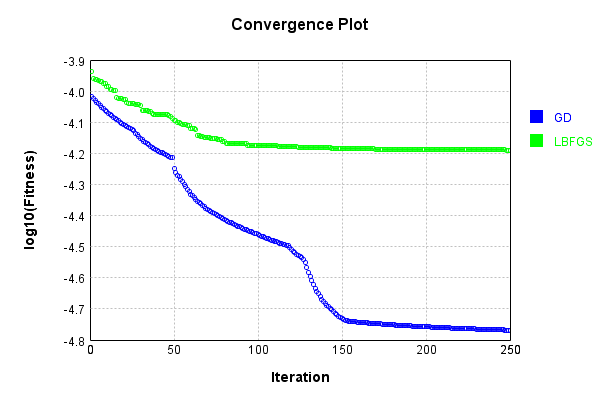


Code from [LearningTester.java:99](../../../../../../../src/main/java/com/simiacryptus/mindseye/test/unit/LearningTester.java#L99) executed in 0.01 seconds: 
```java
    return TestUtil.compareTime(runs);
```

Returns: 


### Composite Learning
In this test, attempt to train a network to emulate a randomized network given an example input/output. The target state is:

Code from [LearningTester.java:219](../../../../../../../src/main/java/com/simiacryptus/mindseye/test/unit/LearningTester.java#L219) executed in 0.00 seconds: 
```java
    return network_target.state().stream().map(Arrays::toString).reduce((a, b) -> a + "\n" + b).orElse("");
```

Returns: 

```
    [0.0, 0.0]
    [-0.0502, 0.0284, -0.014, 0.0946, 0.011200000000000002, 0.0148, 0.0994, 0.07980000000000001, -0.018400000000000003, 0.0898, 0.046200000000000005, 0.047200000000000006, 0.095, -0.0238, -0.039, -0.0274, -0.0844, 0.048, 0.059800000000000006, 0.0572, -0.07379999999999999, -0.09780000000000001, 0.0932, -0.05140000000000001, -0.08480000000000001, 0.021200000000000004, 0.0862, 0.0024000000000000002, -0.0616, 0.046, -0.031, 0.0646, -0.0776, 0.0048000000000000004, 0.0714, -0.0666, -0.078, 0.0354, -0.06720000000000001, 0.0926, 0.0718, -0.08460000000000001, -0.0548, -0.004200000000000001, -0.030400000000000003, 0.0884, -0.0772, -0.07840000000000001, 0.0752, 0.0144, -0.019, -0.048400000000000006, -0.03, -0.08860000000000001]
```


We simultaneously regress this target input:

Code from [LearningTester.java:223](../../../../../../../src/main/java/com/simiacryptus/mindseye/test/unit/LearningTester.java#L223) executed in 0.00 seconds: 
```java
    return Arrays.stream(testInput).map(x -> x.prettyPrint()).reduce((a, b) -> a + "\n" + b).orElse("");
```

Returns: 

```
    [
    	[ [ 0.06760000000000001, 0.0228, 0.069 ], [ -0.024, 0.038200000000000005, -0.0902 ], [ -0.0732, 0.044, 0.002 ], [ 0.0012000000000000001, -0.074, 0.045 ], [ 0.038400000000000004, -0.0782, 0.0216 ] ],
    	[ [ 0.024, -0.017400000000000002, -0.0416 ], [ -0.021200000000000004, 0.0604, -0.012600000000000002 ], [ 0.07560000000000001, 0.0728, 0.041 ], [ -0.064, 0.0572, -0.071 ], [ -0.06080000000000001, 0.022600000000000002, 0.0692 ] ],
    	[ [ -0.0026, 0.066, -0.0298 ], [ -0.0572, -0.038400000000000004, -0.0052 ], [ 0.0546, -0.07060000000000001, -0.046400000000000004 ], [ -0.024, -0.014600000000000002, 0.012 ], [ -0.009200000000000002, -0.066, -0.0536 ] ],
    	[ [ 0.0732, -0.066, -0.0806 ], [ 0.003, 0.0324, -0.0688 ], [ 0.017400000000000002, -0.061200000000000004, 0.034800000000000005 ], [ 0.09580000000000001, -0.010600000000000002, 0.019200000000000002 ], [ -0.0102, -0.029400000000000003, -0.0658 ] ],
    	[ [ 0.09380000000000001, 0.0586, 0.0926 ], [ -0.07060000000000001, 0.0864, 0.0334 ], [ -0.0064, 0.0468, -0.0926 ], [ -0.010600000000000002, 0.059800000000000006, -0.0892 ], [ 0.08020000000000001, 0.0176, -0.07940000000000001 ] ]
    ]
```


Which produces the following output:

Code from [LearningTester.java:230](../../../../../../../src/main/java/com/simiacryptus/mindseye/test/unit/LearningTester.java#L230) executed in 0.00 seconds: 
```java
    return Stream.of(targetOutput).map(x -> x.prettyPrint()).reduce((a, b) -> a + "\n" + b).orElse("");
```

Returns: 

```
    [
    	[ [ 0.011925560000000002, 0.0011775599999999996 ], [ 0.0, 0.0 ], [ 0.00955348, 0.010815000000000005 ], [ 0.0, 0.0 ], [ 0.0, 0.0 ] ],
    	[ [ 0.0, 0.0 ], [ 0.005847240000000001, 0.0 ], [ 0.019565240000000008, 0.01018888 ], [ 0.03273280000000001, 0.0 ], [ 0.0, 0.01782648 ] ],
    	[ [ 0.0145016, 0.005194960000000001 ], [ 0.0, 0.02134108000000001 ], [ 0.0, 0.006299 ], [ 0.017419600000000004, 0.0 ], [ 0.0, 0.0 ] ],
    	[ [ 0.009281680000000002, 0.0 ], [ 0.014480439999999999, 0.0 ], [ 0.0, 0.0 ], [ 0.0, 0.006394200000000001 ], [ 0.003646480000000003, 0.0 ] ],
    	[ [ 0.030764920000000005, 0.00254824 ], [ 0.018763760000000004, 0.014206240000000002 ], [ 0.0, 0.025700639999999997 ], [ 8.131999999999988E-4, 0.020115600000000004 ], [ 0.0013009199999999997, 0.013457880000000002 ] ]
    ]
```


First, we use a conjugate gradient descent method, which converges the fastest for purely linear functions.

Code from [LearningTester.java:300](../../../../../../../src/main/java/com/simiacryptus/mindseye/test/unit/LearningTester.java#L300) executed in 4.59 seconds: 
```java
    return new IterativeTrainer(trainable)
      .setLineSearchFactory(label -> new QuadraticSearch())
      .setOrientation(new GradientDescent())
      .setMonitor(monitor)
      .setTimeout(30, TimeUnit.SECONDS)
      .setMaxIterations(250)
      .setTerminateThreshold(0)
      .run();
```
Logging: 
```
    Constructing line search parameters: GD
    F(0.0) = LineSearchPoint{point=PointSample{avg=1.0348097964384E-4}, derivative=-1.170407078769611E-5}
    New Minimum: 1.0348097964384E-4 > 1.0348097964266959E-4
    F(1.0E-10) = LineSearchPoint{point=PointSample{avg=1.0348097964266959E-4}, derivative=-1.170407078714934E-5}, delta = -1.1704097977252581E-15
    New Minimum: 1.0348097964266959E-4 > 1.0348097963564718E-4
    F(7.000000000000001E-10) = LineSearchPoint{point=PointSample{avg=1.0348097963564718E-4}, derivative=-1.1704070783868686E-5}, delta = -8.192814373968182E-15
    New Minimum: 1.0348097963564718E-4 > 1.0348097958649004E-4
    F(4.900000000000001E-9) = LineSearchPoint{point=PointSample{avg=1.0348097958649004E-4}, derivative=-1.1704070760904123E-5}, delta = -5.734995811579324E-14
    New Minimum: 1.0348097958649004E-4 > 1.0348097924239039E-4
    F(3.430000000000001E-8) = LineSearchPoint{point=PointSample{avg=1.0348097924239039E-4}, derivative=-1.1704070600152174E-5}, delta = -4.014496119428626E-13
    New Minimum: 1.0348097924239039
```
...[skipping 294368 bytes](etc/6.txt)...
```
    }, derivative=-1.202622947818372E-11}, delta = -3.1835214152342584E-11
    F(14.935767327218105) = LineSearchPoint{point=PointSample{avg=6.0044897757223586E-5}, derivative=2.340852336108816E-11}, delta = 4.1023121877291954E-11
    F(1.1489051790167772) = LineSearchPoint{point=PointSample{avg=6.004483808415058E-5}, derivative=-1.475197122650383E-11}, delta = -1.8649951130959505E-11
    New Minimum: 6.004480753343853E-5 > 6.004480215650227E-5
    F(8.04233625311744) = LineSearchPoint{point=PointSample{avg=6.004480215650227E-5}, derivative=4.328246421798505E-12}, delta = -5.457759943853016E-11
    6.004480215650227E-5 <= 6.004485673410171E-5
    New Minimum: 6.004480215650227E-5 > 6.0044798772855595E-5
    F(6.460145036129943) = LineSearchPoint{point=PointSample{avg=6.0044798772855595E-5}, derivative=-5.1080591944284473E-14}, delta = -5.796124611355275E-11
    Left bracket at 6.460145036129943
    Converged to left
    Iteration 250 complete. Error: 6.0044798772855595E-5 Total: 250802713661956.3000; Orientation: 0.0001; Line Search: 0.0168
    
```

Returns: 

```
    6.0044798772855595E-5
```


This training run resulted in the following configuration:

Code from [LearningTester.java:245](../../../../../../../src/main/java/com/simiacryptus/mindseye/test/unit/LearningTester.java#L245) executed in 0.00 seconds: 
```java
    return network_gd.state().stream().map(Arrays::toString).reduce((a, b) -> a + "\n" + b).orElse("");
```

Returns: 

```
    [-0.002332931408611602, -0.018336768674159565]
    [0.011925560000000002, 0.0, 0.0145016, 0.009281680000000002, 0.030764920000000005, 0.0, 0.005847240000000001, 0.0, 0.014480439999999999, 0.018763760000000004, 0.00955348, 0.019565240000000008, 0.0, 0.0, 0.0, 0.0, 0.03273280000000001, 0.017419600000000004, 0.0, 8.131999999999988E-4, 0.0, 0.0, 0.0, 0.003646480000000003, 0.0013009199999999997, 0.0011775599999999996, 0.0, 0.005194960000000001, 0.0, 0.00254824, 0.0, 0.0, 0.02134108000000001, 0.0, 0.014206240000000002, 0.010815000000000005, 0.01018888, 0.006299, 0.0, 0.025700639999999997, 0.0, 0.0, 0.0, 0.006394200000000001, 0.020115600000000004, 0.0, 0.01782648, 0.0, 0.0, 0.013457880000000002]
    [0.014712064473858784, -0.04966143192465148, 0.10781898242790355, -0.012590730995126155, -0.02887498537161917, -0.007545901795016345, 0.07186673541387797, -0.0871699999316172, -0.004774529183707039, 0.043745758836352275, 0.016174168969971574, -0.05071896947924546, 0.054942173604338014, -0.08694628602133787, 0.09142117959698129, -0.06393930285079294, 0.02829362253587354, -0.07794883703955495, -0.07481215418385427, 0.008383422000003683, 0.07636753860585165, -0.04269130583704873, 0.09274534481591735, -0.04492391937450174, 0.07318392816683522, 0.08445966156779526, -0.0195817911944995, -0.08328538477815663, 0.0939736006628026, -0.06926577053002993, 0.04804383165288103, -0.06960371713306919, -0.0813043824680208, 0.07057956465870215, -0.025930514634747513, 0.016182986860442228, 0.047407632950577226, -0.012802526314571832, -0.10181569933416089, 0.05354257509950398, 0.11003777461988079, -0.01336357712083713, 0.046437192045828406, 0.09419996279418934, 0.0569152457298784, -0.08703279767988277, -0.028768942532645475, -0.06165737142800882, -0.07585705729276979, 0.08668887842009289, 0.06849400470915662, -0.059814233325602664, -0.030155371396274475, -0.05279500652416819]
```


And regressed input:

Code from [LearningTester.java:249](../../../../../../../src/main/java/com/simiacryptus/mindseye/test/unit/LearningTester.java#L249) executed in 0.00 seconds: 
```java
    return Arrays.stream(input_gd).map(x -> x.prettyPrint()).reduce((a, b) -> a + "\n" + b).orElse("");
```

Returns: 

```
    [
    	[ [ 0.07561972365217234, -0.07451874524270817, 0.018429198664754353 ], [ 0.023272890470576818, -0.025960088841763998, 0.021325146234102525 ], [ 0.061197931236871984, 0.029407095457062417, 0.03837575878829279 ], [ 0.06251996317146362, -0.05494066235657678, -0.025030174174638525 ], [ 0.09790567113703011, -0.024178783890840046, -0.09260441714016042 ] ],
    	[ [ -0.04946048492940236, 0.027548031340596368, -0.021911867474903455 ], [ 0.0025293216017861293, -0.06943608035682569, 0.07758923552190648 ], [ 0.035773719481005856, 0.1027773143860569, 0.06277610812534339 ], [ -0.06504965621514538, 0.056901769083560545, -0.0395105160025553 ], [ -0.040634139092383496, 0.06432656412055274, -0.009564362043396401 ] ],
    	[ [ 0.039793235981002935, -0.07471510124773556, -0.07447494787831414 ], [ -0.06482996202884707, 0.007264361911347794, 0.09427081979212283 ], [ 0.07077341938626941, 0.027462853217098192, -0.06251862665998492 ], [ 0.040693208663553214, -0.06893515224678126, -0.08296860513992332 ], [ 0.015564290307111187, 0.03774429077702772, -0.06819168188630373 ] ],
    	[ [ -0.01081625077580078, -0.09697212039766971, -0.03445619814938421 ], [ 0.09074115835448307, 0.00752811441318094, -0.08386183418427633 ], [ 0.006572896165717343, 0.0463054962966776, -0.08817834534927843 ], [ -0.024164943895197737, 0.0790253946744124, -0.051034712041495324 ], [ 0.06042844639783096, 0.06667391743029759, 9.103648768681055E-4 ] ],
    	[ [ -0.07657457602843411, 0.034485163587589684, 0.060587366242076814 ], [ 0.05557888856117292, -0.052770755569606004, -0.01659228682513465 ], [ -0.011339336770352336, 0.010636652641253165, -0.022278738884946022 ], [ 0.025694013982835738, 0.03869204364494947, -0.02750911004646076 ], [ -0.0041798501325489455, -0.06789190118622805, -0.08482774085942499 ] ]
    ]
```


Which produces the following output:

Code from [LearningTester.java:256](../../../../../../../src/main/java/com/simiacryptus/mindseye/test/unit/LearningTester.java#L256) executed in 0.00 seconds: 
```java
    return Stream.of(regressedOutput).map(x -> x.prettyPrint()).reduce((a, b) -> a + "\n" + b).orElse("");
```

Returns: 

```
    [ 6.0044798772855595E-5 ]
```


Next, we run the same optimization using L-BFGS, which is nearly ideal for purely second-order or quadratic functions.

Code from [LearningTester.java:324](../../../../../../../src/main/java/com/simiacryptus/mindseye/test/unit/LearningTester.java#L324) executed in 2.79 seconds: 
```java
    return new IterativeTrainer(trainable)
      .setLineSearchFactory(label -> new ArmijoWolfeSearch())
      .setOrientation(new LBFGS())
      .setMonitor(monitor)
      .setTimeout(30, TimeUnit.SECONDS)
      .setMaxIterations(250)
      .setTerminateThreshold(0)
      .run();
```
Logging: 
```
    LBFGS Accumulation History: 1 points
    Constructing line search parameters: GD
    th(0)=1.0348097964384E-4;dx=-1.170407078769611E-5
    New Minimum: 1.0348097964384E-4 > 8.416573560071885E-5
    END: th(2.154434690031884)=8.416573560071885E-5; dx=-6.545105112477837E-6 delta=1.9315244043121148E-5
    Iteration 1 complete. Error: 8.416573560071885E-5 Total: 250802756522135.2800; Orientation: 0.0002; Line Search: 0.0088
    LBFGS Accumulation History: 1 points
    th(0)=8.416573560071885E-5;dx=-3.7572975171561016E-6
    New Minimum: 8.416573560071885E-5 > 7.596072964042834E-5
    END: th(4.641588833612779)=7.596072964042834E-5; dx=-1.7777584432355373E-7 delta=8.20500596029051E-6
    Iteration 2 complete. Error: 7.596072964042834E-5 Total: 250802770270063.2500; Orientation: 0.0001; Line Search: 0.0093
    LBFGS Accumulation History: 1 points
    th(0)=7.596072964042834E-5;dx=-4.072224147762102E-7
    Armijo: th(10.000000000000002)=7.609961591970942E-5; dx=3.2797762395101636E-7 delta=-1.3888627928107555E-7
    New Minimum: 7.596072964042834E-5 > 7.5074
```
...[skipping 143774 bytes](etc/7.txt)...
```
    58E-16 delta=2.91394241635351E-15
    New Minimum: 6.0042735947638096E-5 > 6.004273594262742E-5
    END: th(38.73795160819507)=6.004273594262742E-5; dx=-1.7292576778663587E-16 delta=7.924616637813159E-15
    Iteration 249 complete. Error: 6.004273594262742E-5 Total: 250805498541455.5000; Orientation: 0.0002; Line Search: 0.0096
    LBFGS Accumulation History: 1 points
    th(0)=6.004273594262742E-5;dx=-6.84410248966722E-16
    Armijo: th(83.45838676547186)=6.004273643084682E-5; dx=1.1736824603065037E-14 delta=-4.8821939600905E-13
    Armijo: th(41.72919338273593)=6.004273606187035E-5; dx=5.947508345510025E-15 delta=-1.192429266222081E-13
    Armijo: th(13.909731127578643)=6.004273595079967E-5; dx=1.859451472968585E-15 delta=-8.172248414008848E-15
    New Minimum: 6.004273594262742E-5 > 6.0042735941353186E-5
    END: th(3.477432781894661)=6.0042735941353186E-5; dx=-4.8444816573037037E-17 delta=1.2742357082679012E-15
    Iteration 250 complete. Error: 6.0042735941353186E-5 Total: 250805511625098.5000; Orientation: 0.0001; Line Search: 0.0105
    
```

Returns: 

```
    6.0042735941353186E-5
```


This training run resulted in the following configuration:

Code from [LearningTester.java:266](../../../../../../../src/main/java/com/simiacryptus/mindseye/test/unit/LearningTester.java#L266) executed in 0.00 seconds: 
```java
    return network_lbfgs.state().stream().map(Arrays::toString).reduce((a, b) -> a + "\n" + b).orElse("");
```

Returns: 

```
    [-0.002361684921400838, -0.01833983584360862]
    [0.011925560000000002, 0.0, 0.0145016, 0.009281680000000002, 0.030764920000000005, 0.0, 0.005847240000000001, 0.0, 0.014480439999999999, 0.018763760000000004, 0.00955348, 0.019565240000000008, 0.0, 0.0, 0.0, 0.0, 0.03273280000000001, 0.017419600000000004, 0.0, 8.131999999999988E-4, 0.0, 0.0, 0.0, 0.003646480000000003, 0.0013009199999999997, 0.0011775599999999996, 0.0, 0.005194960000000001, 0.0, 0.00254824, 0.0, 0.0, 0.02134108000000001, 0.0, 0.014206240000000002, 0.010815000000000005, 0.01018888, 0.006299, 0.0, 0.025700639999999997, 0.0, 0.0, 0.0, 0.006394200000000001, 0.020115600000000004, 0.0, 0.01782648, 0.0, 0.0, 0.013457880000000002]
    [0.014805072042773674, -0.04948276639247056, 0.10793797061321975, -0.012641407205507334, -0.029077033738604884, -0.007857803865200023, 0.07190430428391992, -0.0871296256382576, -0.004783569371704444, 0.04380189486833747, 0.0161859041351894, -0.05064291390583152, 0.05487243872423199, -0.0868445796081357, 0.09120141625715888, -0.06401281771060281, 0.028464860865301544, -0.07808616998025461, -0.07462537168444693, 0.00825101732822529, 0.07623704541925477, -0.04285216608912552, 0.0929072222685237, -0.045014155326245774, 0.07323119550881335, 0.08445901526792353, -0.01967206314816846, -0.0832664542301147, 0.09398748997128721, -0.06937871828264645, 0.047999187434189176, -0.06962769875607312, -0.08135376641614966, 0.07079003657929708, -0.026164076916184154, 0.016187492167058677, 0.04731224980117248, -0.012879029403352534, -0.10182097016044392, 0.053539245627551565, 0.11035690460750082, -0.013336438678575294, 0.04641249423939519, 0.09405536290883242, 0.05683904387217958, -0.08701301581525926, -0.02886451800339269, -0.06176141004374494, -0.07570982570308206, 0.08664419228581881, 0.0685989212800861, -0.059662906943885326, -0.030082295955639413, -0.05263735992309923]
```


And regressed input:

Code from [LearningTester.java:270](../../../../../../../src/main/java/com/simiacryptus/mindseye/test/unit/LearningTester.java#L270) executed in 0.00 seconds: 
```java
    return Arrays.stream(input_lbgfs).map(x -> x.prettyPrint()).reduce((a, b) -> a + "\n" + b).orElse("");
```

Returns: 

```
    [
    	[ [ 0.07562776194387683, -0.07457361054702207, 0.01834590411582664 ], [ 0.023191184947150122, -0.026120071815654965, 0.02143859923338582 ], [ 0.06125971096936699, 0.029419875929278454, 0.03827556509710626 ], [ 0.06267681356063667, -0.05495454170042967, -0.024920462900352245 ], [ 0.09763282937467437, -0.024103717414895826, -0.09265394517662089 ] ],
    	[ [ -0.049378288123547914, 0.02748303561726115, -0.022064462896659563 ], [ 0.0025185877916754583, -0.06928483438802081, 0.07753396412118647 ], [ 0.03581711160252716, 0.10272995434064343, 0.06271856616464161 ], [ -0.06513323807369399, 0.05691909390674786, -0.0395639955483868 ], [ -0.040382806644447454, 0.06442248174757924, -0.009717141518782248 ] ],
    	[ [ 0.039836408974369436, -0.07466020799161983, -0.07448138393282987 ], [ -0.06486778356123624, 0.007302796211876734, 0.09411953710621156 ], [ 0.07079649166689433, 0.027344254351036507, -0.06257071422864206 ], [ 0.04074273052861238, -0.06907858454470392, -0.08284574463792432 ], [ 0.01527619358151268, 0.03743185842877362, -0.0679429942645818 ] ],
    	[ [ -0.010734500073860936, -0.09721479559377631, -0.03447485512465802 ], [ 0.09105482112409422, 0.007840057478244877, -0.08420527665150394 ], [ 0.006487402308659029, 0.04611675235280796, -0.08808619435398221 ], [ -0.02426144429147108, 0.07924136530731599, -0.050955886167793535 ], [ 0.06030619392490345, 0.06693909300325475, 0.00112635960169446 ] ],
    	[ [ -0.07660450300489603, 0.03472650752911152, 0.060825319984259774 ], [ 0.05543791847308153, -0.05273853939250842, -0.016916117486403138 ], [ -0.011260223266201063, 0.010469702204127306, -0.022406273391100757 ], [ 0.025879955417060337, 0.03886666856204771, -0.027498580711285744 ], [ -0.0041279039275278215, -0.06779590247477328, -0.08481326503718536 ] ]
    ]
```


Which produces the following output:

Code from [LearningTester.java:277](../../../../../../../src/main/java/com/simiacryptus/mindseye/test/unit/LearningTester.java#L277) executed in 0.00 seconds: 
```java
    return Stream.of(regressedOutput).map(x -> x.prettyPrint()).reduce((a, b) -> a + "\n" + b).orElse("");
```

Returns: 

```
    [ 6.0042735941353186E-5 ]
```


Code from [LearningTester.java:96](../../../../../../../src/main/java/com/simiacryptus/mindseye/test/unit/LearningTester.java#L96) executed in 0.01 seconds: 
```java
    return TestUtil.compare(runs);
```

Returns: 

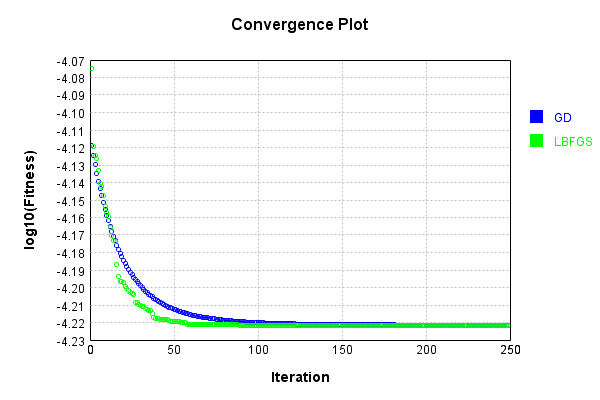


Code from [LearningTester.java:99](../../../../../../../src/main/java/com/simiacryptus/mindseye/test/unit/LearningTester.java#L99) executed in 0.01 seconds: 
```java
    return TestUtil.compareTime(runs);
```

Returns: 

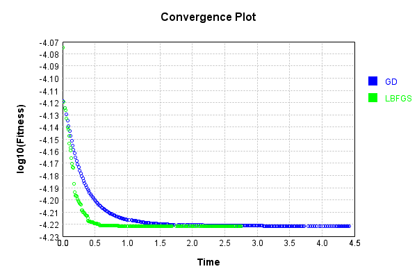


This is a network with the following layout:

Code from [NLayerTest.java:87](../../../../../../../src/test/java/com/simiacryptus/mindseye/network/NLayerTest.java#L87) executed in 0.18 seconds: 
```java
    return Graphviz.fromGraph(TestUtil.toGraph((DAGNetwork) layer))
      .height(400).width(600).render(Format.PNG).toImage();
```

Returns: 

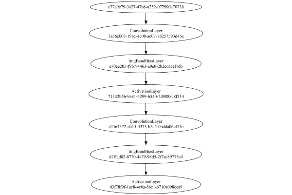


### Json Serialization
Code from [JsonTest.java:36](../../../../../../../src/main/java/com/simiacryptus/mindseye/test/unit/JsonTest.java#L36) executed in 0.00 seconds: 
```java
    JsonObject json = layer.getJson();
    NNLayer echo = NNLayer.fromJson(json);
    if ((echo == null)) throw new AssertionError("Failed to deserialize");
    if ((layer == echo)) throw new AssertionError("Serialization did not copy");
    if ((!layer.equals(echo))) throw new AssertionError("Serialization not equal");
    return new GsonBuilder().setPrettyPrinting().create().toJson(json);
```

Returns: 

```
    {
      "class": "com.simiacryptus.mindseye.network.PipelineNetwork",
      "id": "c11a0a48-9272-4c92-bcf8-5d05df99c890",
      "isFrozen": false,
      "name": "PipelineNetwork/c11a0a48-9272-4c92-bcf8-5d05df99c890",
      "inputs": [
        "c77e9e79-3a27-47b8-a252-077990a70738"
      ],
      "nodes": {
        "fe6bf820-ca00-4480-9186-735f188422ba": "3a56c603-19bc-4c08-ac07-78257593d45e",
        "fc392fd1-93bb-47e8-bcf4-68dd9b62dcb7": "e70ee205-f9b7-4463-a9e0-2b2c6aaef7db",
        "de49e047-4cd5-42d2-9746-4c10935fc1cc": "71332b5b-9a81-4299-b550-7d9888c8f314",
        "3b867d14-6649-4bac-be91-89b9b74fbd26": "e2364372-da15-4373-b5a5-0bdda06ef13c",
        "a2ddf9c7-83ff-4967-b508-7870919c427c": "d2ffad02-8770-4a79-98d5-2f7ac89775c4",
        "967a1ff9-f78e-48cd-9a20-164c8f5962c7": "03f78f9f-1ac8-4c6a-86e1-6710a098cca9"
      },
      "layers": {
        "3a56c603-19bc-4c08-ac07-78257593d45e": {
          "class": "com.simiacryptus.mindseye.layers.cudnn.ConvolutionLayer",
          "id": "3a56c603-19bc-4c08-ac07-78257593d45e",
          "isFrozen": false,
          "name": "ConvolutionLay
```
...[skipping 4073 bytes](etc/8.txt)...
```
      "precision": "Double"
        },
        "03f78f9f-1ac8-4c6a-86e1-6710a098cca9": {
          "class": "com.simiacryptus.mindseye.layers.cudnn.ActivationLayer",
          "id": "03f78f9f-1ac8-4c6a-86e1-6710a098cca9",
          "isFrozen": false,
          "name": "ActivationLayer/03f78f9f-1ac8-4c6a-86e1-6710a098cca9",
          "mode": 1,
          "precision": "Double"
        }
      },
      "links": {
        "fe6bf820-ca00-4480-9186-735f188422ba": [
          "c77e9e79-3a27-47b8-a252-077990a70738"
        ],
        "fc392fd1-93bb-47e8-bcf4-68dd9b62dcb7": [
          "fe6bf820-ca00-4480-9186-735f188422ba"
        ],
        "de49e047-4cd5-42d2-9746-4c10935fc1cc": [
          "fc392fd1-93bb-47e8-bcf4-68dd9b62dcb7"
        ],
        "3b867d14-6649-4bac-be91-89b9b74fbd26": [
          "de49e047-4cd5-42d2-9746-4c10935fc1cc"
        ],
        "a2ddf9c7-83ff-4967-b508-7870919c427c": [
          "3b867d14-6649-4bac-be91-89b9b74fbd26"
        ],
        "967a1ff9-f78e-48cd-9a20-164c8f5962c7": [
          "a2ddf9c7-83ff-4967-b508-7870919c427c"
        ]
      },
      "labels": {},
      "head": "967a1ff9-f78e-48cd-9a20-164c8f5962c7"
    }
```


### Input Learning
In this test, we use a network to learn this target input, given it's pre-evaluated output:

Code from [LearningTester.java:127](../../../../../../../src/main/java/com/simiacryptus/mindseye/test/unit/LearningTester.java#L127) executed in 0.00 seconds: 
```java
    return Arrays.stream(input_target).map(x -> x.prettyPrint()).reduce((a, b) -> a + "\n" + b).orElse("");
```

Returns: 

```
    [
    	[ [ 0.0616, -0.0364, -0.057800000000000004 ], [ 0.029200000000000004, -0.0108, -0.025 ], [ 0.032, 0.0102, -0.015600000000000001 ], [ 0.018400000000000003, -0.08780000000000002, -0.047200000000000006 ], [ -0.0956, 0.055200000000000006, 0.0268 ] ],
    	[ [ -0.08660000000000001, -0.095, -0.0636 ], [ -0.0592, -0.001, 0.057 ], [ -0.037399999999999996, -0.06520000000000001, 0.0074 ], [ 0.0946, -0.099, -0.050800000000000005 ], [ 0.0786, 0.0646, 0.0286 ] ],
    	[ [ 0.046200000000000005, -0.0862, -0.0388 ], [ 0.051800000000000006, -0.07640000000000001, -0.0354 ], [ -0.0762, 0.0502, 0.013200000000000002 ], [ 0.030400000000000003, -0.0442, 0.05940000000000001 ], [ -0.0854, 0.0592, -0.0086 ] ],
    	[ [ 0.0128, -0.055600000000000004, 0.0408 ], [ -0.011600000000000001, 0.0852, 0.0082 ], [ 0.014, -0.0698, -0.057 ], [ -0.031400000000000004, 0.0094, 0.0176 ], [ -0.009200000000000002, 0.013200000000000002, -0.051800000000000006 ] ],
    	[ [ -0.041800000000000004, 0.043800000000000006, -0.0446 ], [ 0.07880000000000001, 0.0128, -0.06960000000000001 ], [ -0.0172, -0.078, 0.0512 ], [ 0.045, 0.0234, -0.0316 ], [ 0.047200000000000006, -0.0074, 0.041 ] ]
    ]
```


First, we use a conjugate gradient descent method, which converges the fastest for purely linear functions.

Code from [LearningTester.java:300](../../../../../../../src/main/java/com/simiacryptus/mindseye/test/unit/LearningTester.java#L300) executed in 8.22 seconds: 
```java
    return new IterativeTrainer(trainable)
      .setLineSearchFactory(label -> new QuadraticSearch())
      .setOrientation(new GradientDescent())
      .setMonitor(monitor)
      .setTimeout(30, TimeUnit.SECONDS)
      .setMaxIterations(250)
      .setTerminateThreshold(0)
      .run();
```
Logging: 
```
    Constructing line search parameters: GD
    F(0.0) = LineSearchPoint{point=PointSample{avg=3.265122784745931E-6}, derivative=-1.0392190473431936E-9}
    New Minimum: 3.265122784745931E-6 > 3.265122784745827E-6
    F(1.0E-10) = LineSearchPoint{point=PointSample{avg=3.265122784745827E-6}, derivative=-1.0392190473431616E-9}, delta = -1.0418505251227894E-19
    New Minimum: 3.265122784745827E-6 > 3.265122784745204E-6
    F(7.000000000000001E-10) = LineSearchPoint{point=PointSample{avg=3.265122784745204E-6}, derivative=-1.0392190473429678E-9}, delta = -7.271777852178168E-19
    New Minimum: 3.265122784745204E-6 > 3.2651227847408395E-6
    F(4.900000000000001E-9) = LineSearchPoint{point=PointSample{avg=3.2651227847408395E-6}, derivative=-1.0392190473416102E-9}, delta = -5.091515045945599E-18
    New Minimum: 3.2651227847408395E-6 > 3.2651227847102875E-6
    F(3.430000000000001E-8) = LineSearchPoint{point=PointSample{avg=3.2651227847102875E-6}, derivative=-1.0392190473321096E-9}, delta = -3.5643569936934585E-17
    New Minimum: 3.265122784710287
```
...[skipping 300150 bytes](etc/9.txt)...
```
    8839623556764E-7}, derivative=-2.3800139424713348E-26}, delta = 0.0
    F(18147.738203078283) = LineSearchPoint{point=PointSample{avg=8.338839623556768E-7}, derivative=6.427014852475087E-26}, delta = 4.2351647362715017E-22
    F(1395.9798617752526) = LineSearchPoint{point=PointSample{avg=8.338839623556764E-7}, derivative=-3.345340304206527E-26}, delta = 0.0
    F(9771.859032426768) = LineSearchPoint{point=PointSample{avg=8.338839623556764E-7}, derivative=2.186988873631859E-26}, delta = 0.0
    8.338839623556764E-7 <= 8.338839623556764E-7
    F(6562.306048977273) = LineSearchPoint{point=PointSample{avg=8.338839623556764E-7}, derivative=2.1730499086346703E-27}, delta = 0.0
    Right bracket at 6562.306048977273
    F(6258.1762425894085) = LineSearchPoint{point=PointSample{avg=8.338839623556764E-7}, derivative=2.6412459565037076E-28}, delta = 0.0
    Right bracket at 6258.1762425894085
    Converged to right
    Iteration 211 failed, aborting. Error: 8.338839623556764E-7 Total: 250814121686023.9000; Orientation: 0.0001; Line Search: 0.0291
    
```

Returns: 

```
    8.338839623556764E-7
```


Training Converged

Next, we run the same optimization using L-BFGS, which is nearly ideal for purely second-order or quadratic functions.

Code from [LearningTester.java:324](../../../../../../../src/main/java/com/simiacryptus/mindseye/test/unit/LearningTester.java#L324) executed in 0.18 seconds: 
```java
    return new IterativeTrainer(trainable)
      .setLineSearchFactory(label -> new ArmijoWolfeSearch())
      .setOrientation(new LBFGS())
      .setMonitor(monitor)
      .setTimeout(30, TimeUnit.SECONDS)
      .setMaxIterations(250)
      .setTerminateThreshold(0)
      .run();
```
Logging: 
```
    LBFGS Accumulation History: 1 points
    Constructing line search parameters: GD
    th(0)=3.265122784745931E-6;dx=-1.0392190473431936E-9
    New Minimum: 3.265122784745931E-6 > 3.262884605168871E-6
    WOLFE (weak): th(2.154434690031884)=3.262884605168871E-6; dx=-1.0385228191576245E-9 delta=2.2381795770601054E-9
    New Minimum: 3.262884605168871E-6 > 3.2606479255699654E-6
    WOLFE (weak): th(4.308869380063768)=3.2606479255699654E-6; dx=-1.0378265909720555E-9 delta=4.4748591759656785E-9
    New Minimum: 3.2606479255699654E-6 > 3.251716206955897E-6
    WOLFE (weak): th(12.926608140191302)=3.251716206955897E-6; dx=-1.0350416782297793E-9 delta=1.3406577790034178E-8
    New Minimum: 3.251716206955897E-6 > 3.2118204688673067E-6
    WOLFE (weak): th(51.70643256076521)=3.2118204688673067E-6; dx=-1.0225095708895355E-9 delta=5.3302315878624326E-8
    New Minimum: 3.2118204688673067E-6 > 3.0072839165487783E-6
    WOLFE (weak): th(258.53216280382605)=3.0072839165487783E-6; dx=-9.55086928074051E-10 delta=2.578388681971527E-7
    New Minimum: 3.0072839165487
```
...[skipping 3426 bytes](etc/10.txt)...
```
    History: 1 points
    th(0)=8.502259259827499E-7;dx=-1.2258579515662984E-12
    New Minimum: 8.502259259827499E-7 > 8.465636184075256E-7
    END: th(3481.191625209586)=8.465636184075256E-7; dx=-8.700559279788581E-13 delta=3.6623075752243347E-9
    Iteration 8 complete. Error: 8.465636184075256E-7 Total: 250814283082964.7200; Orientation: 0.0001; Line Search: 0.0067
    LBFGS Accumulation History: 1 points
    th(0)=8.465636184075256E-7;dx=-7.938272048245118E-13
    New Minimum: 8.465636184075256E-7 > 8.418841980275059E-7
    END: th(7500.000000000005)=8.418841980275059E-7; dx=-4.4601965946292914E-13 delta=4.679420380019664E-9
    Iteration 9 complete. Error: 8.418841980275059E-7 Total: 250814292970005.7200; Orientation: 0.0001; Line Search: 0.0065
    LBFGS Accumulation History: 1 points
    th(0)=8.418841980275059E-7;dx=-5.091062595488349E-13
    MAX ALPHA: th(0)=8.418841980275059E-7;th'(0)=-5.091062595488349E-13;
    Iteration 10 failed, aborting. Error: 8.418841980275059E-7 Total: 250814303716825.7200; Orientation: 0.0001; Line Search: 0.0071
    
```

Returns: 

```
    8.418841980275059E-7
```


Training Converged

Code from [LearningTester.java:96](../../../../../../../src/main/java/com/simiacryptus/mindseye/test/unit/LearningTester.java#L96) executed in 0.01 seconds: 
```java
    return TestUtil.compare(runs);
```

Returns: 

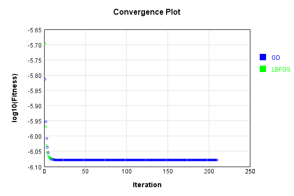


Code from [LearningTester.java:99](../../../../../../../src/main/java/com/simiacryptus/mindseye/test/unit/LearningTester.java#L99) executed in 0.01 seconds: 
```java
    return TestUtil.compareTime(runs);
```

Returns: 

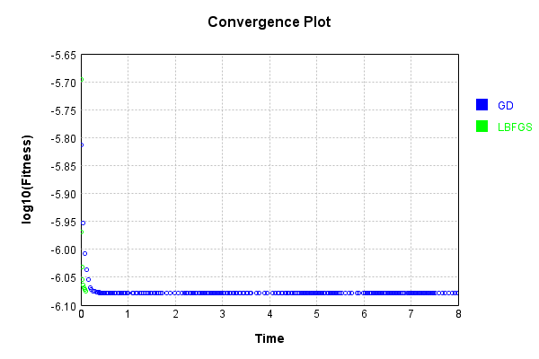


### Model Learning
In this test, attempt to train a network to emulate a randomized network given an example input/output. The target state is:

Code from [LearningTester.java:176](../../../../../../../src/main/java/com/simiacryptus/mindseye/test/unit/LearningTester.java#L176) executed in 0.00 seconds: 
```java
    return network_target.state().stream().map(Arrays::toString).reduce((a, b) -> a + "\n" + b).orElse("");
```

Returns: 

```
    [-0.038, -0.09860000000000001, 0.0426, 0.08580000000000002, -0.0796, -0.0752, -0.0476, 0.0352, -0.0248, -0.09440000000000001, 0.0892, -0.08380000000000001, -0.083, 0.036800000000000006, -0.0408, 0.0814, 0.05280000000000001, -0.062200000000000005, 0.042800000000000005, 0.016, 0.09880000000000001, -0.0908, 0.055, 0.026600000000000002, 0.0814, -0.081, -0.0936, -0.0632, -0.0704, -0.0616, 0.0668, -0.0228, 0.011600000000000001, -0.0826, -0.030600000000000002, -0.0936, 0.094, -0.0302, -0.0506, -0.048600000000000004, -0.006, -0.029400000000000003, 0.0562, 0.0032, -0.0714, 0.06960000000000001, 0.0562, -0.06280000000000001, 0.074, -0.0334, 0.0908, 0.026400000000000003, 0.060200000000000004, -0.026]
    [0.0]
    [0.008400000000000001, 0.009, -0.06080000000000001, 0.011600000000000001, 0.049400000000000006, 0.0536, 0.07479999999999999, -0.071, 0.0834, -0.066, 0.0506, 0.08760000000000001, -0.07440000000000001, -0.0734, -0.0412, -0.039400000000000004, 0.031200000000000002, 0.021400000000000002]
    [0.0, 0.0]
```


First, we use a conjugate gradient descent method, which converges the fastest for purely linear functions.

Code from [LearningTester.java:300](../../../../../../../src/main/java/com/simiacryptus/mindseye/test/unit/LearningTester.java#L300) executed in 8.61 seconds: 
```java
    return new IterativeTrainer(trainable)
      .setLineSearchFactory(label -> new QuadraticSearch())
      .setOrientation(new GradientDescent())
      .setMonitor(monitor)
      .setTimeout(30, TimeUnit.SECONDS)
      .setMaxIterations(250)
      .setTerminateThreshold(0)
      .run();
```
Logging: 
```
    Constructing line search parameters: GD
    F(0.0) = LineSearchPoint{point=PointSample{avg=3.522065751130031E-6}, derivative=-1.0234536436680044E-8}
    New Minimum: 3.522065751130031E-6 > 3.5220657511290087E-6
    F(1.0E-10) = LineSearchPoint{point=PointSample{avg=3.5220657511290087E-6}, derivative=-1.0234536436081906E-8}, delta = -1.0223687673359405E-18
    New Minimum: 3.5220657511290087E-6 > 3.5220657511228677E-6
    F(7.000000000000001E-10) = LineSearchPoint{point=PointSample{avg=3.5220657511228677E-6}, derivative=-1.023453643249298E-8}, delta = -7.163357634929618E-18
    New Minimum: 3.5220657511228677E-6 > 3.522065751079883E-6
    F(4.900000000000001E-9) = LineSearchPoint{point=PointSample{avg=3.522065751079883E-6}, derivative=-1.0234536407370611E-8}, delta = -5.0148162125717224E-17
    New Minimum: 3.522065751079883E-6 > 3.5220657507789867E-6
    F(3.430000000000001E-8) = LineSearchPoint{point=PointSample{avg=3.5220657507789867E-6}, derivative=-1.0234536231513854E-8}, delta = -3.5104433466007223E-16
    New Minimum: 3.522065750778
```
...[skipping 282659 bytes](etc/11.txt)...
```
    38791) = LineSearchPoint{point=PointSample{avg=2.6874724442899014E-6}, derivative=-4.996507101549693E-10}, delta = -6.437680159432722E-10
    F(6.449562249017154) = LineSearchPoint{point=PointSample{avg=2.691313081615217E-6}, derivative=1.889147492674851E-9}, delta = 3.1968693093722195E-9
    F(0.4961201730013195) = LineSearchPoint{point=PointSample{avg=2.687723987668269E-6}, derivative=-6.833982951921471E-10}, delta = -3.922246375754502E-10
    F(3.4728412110092366) = LineSearchPoint{point=PointSample{avg=2.6876040968499E-6}, derivative=6.028531685101505E-10}, delta = -5.121154559445396E-10
    2.6876040968499E-6 <= 2.6881162123058446E-6
    New Minimum: 2.6872125977102957E-6 > 2.687183563560707E-6
    F(2.0776780231077767) = LineSearchPoint{point=PointSample{avg=2.687183563560707E-6}, derivative=-7.010468084862833E-15}, delta = -9.3264874513755E-10
    Left bracket at 2.0776780231077767
    Converged to left
    Iteration 250 complete. Error: 2.687183563560707E-6 Total: 250823045286443.0000; Orientation: 0.0000; Line Search: 0.0344
    
```

Returns: 

```
    2.687183563560707E-6
```


Training Converged

Next, we run the same optimization using L-BFGS, which is nearly ideal for purely second-order or quadratic functions.

Code from [LearningTester.java:324](../../../../../../../src/main/java/com/simiacryptus/mindseye/test/unit/LearningTester.java#L324) executed in 5.34 seconds: 
```java
    return new IterativeTrainer(trainable)
      .setLineSearchFactory(label -> new ArmijoWolfeSearch())
      .setOrientation(new LBFGS())
      .setMonitor(monitor)
      .setTimeout(30, TimeUnit.SECONDS)
      .setMaxIterations(250)
      .setTerminateThreshold(0)
      .run();
```
Logging: 
```
    LBFGS Accumulation History: 1 points
    Constructing line search parameters: GD
    th(0)=3.824511982821675E-6;dx=-8.812199717638291E-7
    New Minimum: 3.824511982821675E-6 > 3.7299986975528196E-6
    WOLF (strong): th(2.154434690031884)=3.7299986975528196E-6; dx=1.9290044684567067E-7 delta=9.45132852688558E-8
    New Minimum: 3.7299986975528196E-6 > 3.5228982884459793E-6
    WOLF (strong): th(1.077217345015942)=3.5228982884459793E-6; dx=2.8136123660533094E-7 delta=3.016136943756961E-7
    END: th(0.3590724483386473)=3.5898662432569315E-6; dx=-4.3185885910592956E-7 delta=2.3464573956474381E-7
    Iteration 1 complete. Error: 3.5228982884459793E-6 Total: 250823111364097.9400; Orientation: 0.0005; Line Search: 0.0344
    LBFGS Accumulation History: 1 points
    th(0)=3.5898662432569315E-6;dx=-2.1277702720844657E-7
    New Minimum: 3.5898662432569315E-6 > 3.4879657888064663E-6
    END: th(0.7735981389354633)=3.4879657888064663E-6; dx=-4.474255608092391E-8 delta=1.0190045445046524E-7
    Iteration 2 complete. Error: 3.4879657888064663E-6 Total: 2508
```
...[skipping 136995 bytes](etc/12.txt)...
```
    .0002; Line Search: 0.0119
    LBFGS Accumulation History: 1 points
    th(0)=1.8381495251389024E-6;dx=-3.9975643078633505E-10
    Armijo: th(2.915025165108151)=1.838514517976816E-6; dx=6.215489291094844E-10 delta=-3.649928379136725E-10
    New Minimum: 1.8381495251389024E-6 > 1.8379666835033906E-6
    WOLF (strong): th(1.4575125825540756)=1.8379666835033906E-6; dx=1.3018979821448854E-10 delta=1.8284163551180157E-10
    END: th(0.48583752751802517)=1.8379993287430289E-6; dx=-1.9738362576795524E-10 delta=1.501963958735345E-10
    Iteration 249 complete. Error: 1.8379666835033906E-6 Total: 250828375859375.6600; Orientation: 0.0001; Line Search: 0.0160
    LBFGS Accumulation History: 1 points
    th(0)=1.8379993287430289E-6;dx=-1.9289259898395014E-10
    New Minimum: 1.8379993287430289E-6 > 1.8378198033439425E-6
    END: th(1.0467052230041534)=1.8378198033439425E-6; dx=-1.6285161344056907E-10 delta=1.7952539908631272E-10
    Iteration 250 complete. Error: 1.8378198033439425E-6 Total: 250828387904842.6200; Orientation: 0.0001; Line Search: 0.0081
    
```

Returns: 

```
    1.8378198033439425E-6
```


Training Converged

Code from [LearningTester.java:96](../../../../../../../src/main/java/com/simiacryptus/mindseye/test/unit/LearningTester.java#L96) executed in 0.01 seconds: 
```java
    return TestUtil.compare(runs);
```

Returns: 

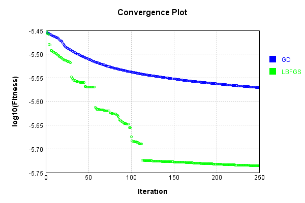


Code from [LearningTester.java:99](../../../../../../../src/main/java/com/simiacryptus/mindseye/test/unit/LearningTester.java#L99) executed in 0.01 seconds: 
```java
    return TestUtil.compareTime(runs);
```

Returns: 

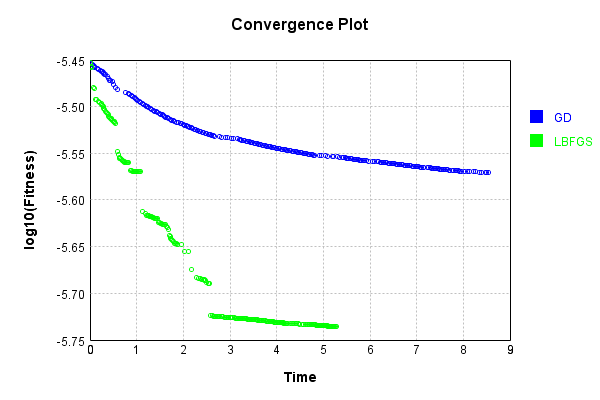


### Composite Learning
In this test, attempt to train a network to emulate a randomized network given an example input/output. The target state is:

Code from [LearningTester.java:219](../../../../../../../src/main/java/com/simiacryptus/mindseye/test/unit/LearningTester.java#L219) executed in 0.00 seconds: 
```java
    return network_target.state().stream().map(Arrays::toString).reduce((a, b) -> a + "\n" + b).orElse("");
```

Returns: 

```
    [-0.09860000000000001, 0.0426, -0.030600000000000002, -0.0334, -0.0752, -0.0228, 0.060200000000000004, 0.0352, 0.0562, -0.0506, 0.05280000000000001, -0.0476, 0.036800000000000006, 0.0908, 0.026400000000000003, -0.0408, -0.0704, -0.0826, 0.016, 0.0892, -0.029400000000000003, -0.0632, -0.026, -0.0714, -0.0936, -0.06280000000000001, -0.0616, -0.062200000000000005, -0.0936, 0.042800000000000005, 0.011600000000000001, 0.0032, -0.083, 0.09880000000000001, -0.0302, -0.0796, 0.094, -0.081, -0.0248, 0.08580000000000002, 0.0814, -0.006, 0.0562, 0.074, 0.055, -0.038, -0.09440000000000001, 0.0668, -0.0908, 0.06960000000000001, -0.08380000000000001, -0.048600000000000004, 0.026600000000000002, 0.0814]
    [0.0]
    [-0.071, 0.0506, 0.031200000000000002, 0.07479999999999999, 0.009, 0.049400000000000006, 0.0536, 0.008400000000000001, -0.06080000000000001, -0.0734, 0.021400000000000002, -0.066, -0.0412, 0.08760000000000001, -0.039400000000000004, 0.011600000000000001, 0.0834, -0.07440000000000001]
    [0.0, 0.0]
```


We simultaneously regress this target input:

Code from [LearningTester.java:223](../../../../../../../src/main/java/com/simiacryptus/mindseye/test/unit/LearningTester.java#L223) executed in 0.00 seconds: 
```java
    return Arrays.stream(testInput).map(x -> x.prettyPrint()).reduce((a, b) -> a + "\n" + b).orElse("");
```

Returns: 

```
    [
    	[ [ -0.011600000000000001, 0.014, -0.0074 ], [ -0.009200000000000002, -0.047200000000000006, 0.0786 ], [ 0.0128, -0.078, 0.0082 ], [ 0.0286, 0.0946, -0.0862 ], [ 0.046200000000000005, -0.025, -0.0592 ] ],
    	[ [ 0.032, -0.06960000000000001, 0.057 ], [ 0.0234, 0.043800000000000006, 0.041 ], [ 0.055200000000000006, 0.047200000000000006, -0.0364 ], [ -0.07640000000000001, -0.0086, 0.051800000000000006 ], [ -0.08780000000000002, -0.057, -0.0388 ] ],
    	[ [ -0.0762, 0.0408, -0.041800000000000004 ], [ 0.0852, 0.045, 0.0094 ], [ 0.018400000000000003, 0.013200000000000002, 0.029200000000000004 ], [ -0.015600000000000001, -0.0446, 0.0616 ], [ -0.0698, -0.050800000000000005, -0.0316 ] ],
    	[ [ -0.0354, 0.0128, -0.0636 ], [ 0.0592, 0.0646, 0.013200000000000002 ], [ -0.06520000000000001, 0.0502, -0.057800000000000004 ], [ -0.0854, -0.095, 0.0176 ], [ -0.055600000000000004, -0.099, 0.05940000000000001 ] ],
    	[ [ -0.037399999999999996, -0.0956, -0.001 ], [ -0.0442, -0.031400000000000004, -0.0172 ], [ 0.0268, -0.0108, 0.0074 ], [ 0.07880000000000001, 0.030400000000000003, 0.0512 ], [ -0.051800000000000006, -0.08660000000000001, 0.0102 ] ]
    ]
```


Which produces the following output:

Code from [LearningTester.java:230](../../../../../../../src/main/java/com/simiacryptus/mindseye/test/unit/LearningTester.java#L230) executed in 0.00 seconds: 
```java
    return Stream.of(targetOutput).map(x -> x.prettyPrint()).reduce((a, b) -> a + "\n" + b).orElse("");
```

Returns: 

```
    [
    	[ [ 0.0 ], [ 0.001330718288 ], [ 0.0020108294000000014 ], [ 0.0037293943120000005 ], [ 0.002673453416 ] ],
    	[ [ 0.0 ], [ 0.0 ], [ 4.701625120000001E-4 ], [ 0.0 ], [ 0.0021448035679999993 ] ],
    	[ [ 5.695211999999998E-4 ], [ 0.0019343585360000004 ], [ 0.002659541864 ], [ 0.0 ], [ 0.0023716700640000017 ] ],
    	[ [ 0.0 ], [ 0.0 ], [ 0.0 ], [ 4.5244130400000105E-4 ], [ 0.003874528408 ] ],
    	[ [ 6.603509280000002E-4 ], [ 0.0 ], [ 4.431634480000001E-4 ], [ 0.003017773384000001 ], [ 0.0035606081920000012 ] ]
    ]
```


First, we use a conjugate gradient descent method, which converges the fastest for purely linear functions.

Code from [LearningTester.java:300](../../../../../../../src/main/java/com/simiacryptus/mindseye/test/unit/LearningTester.java#L300) executed in 12.27 seconds: 
```java
    return new IterativeTrainer(trainable)
      .setLineSearchFactory(label -> new QuadraticSearch())
      .setOrientation(new GradientDescent())
      .setMonitor(monitor)
      .setTimeout(30, TimeUnit.SECONDS)
      .setMaxIterations(250)
      .setTerminateThreshold(0)
      .run();
```
Logging: 
```
    Constructing line search parameters: GD
    F(0.0) = LineSearchPoint{point=PointSample{avg=2.5122141812511524E-6}, derivative=-1.2405946220110896E-7}
    New Minimum: 2.5122141812511524E-6 > 2.512214181238747E-6
    F(1.0E-10) = LineSearchPoint{point=PointSample{avg=2.512214181238747E-6}, derivative=-1.2405946218771012E-7}, delta = -1.2405221029012856E-17
    New Minimum: 2.512214181238747E-6 > 2.512214181164311E-6
    F(7.000000000000001E-10) = LineSearchPoint{point=PointSample{avg=2.512214181164311E-6}, derivative=-1.2405946210731722E-7}, delta = -8.684120588429989E-17
    New Minimum: 2.512214181164311E-6 > 2.5122141806432627E-6
    F(4.900000000000001E-9) = LineSearchPoint{point=PointSample{avg=2.5122141806432627E-6}, derivative=-1.2405946154456743E-7}, delta = -6.078897117395201E-16
    New Minimum: 2.5122141806432627E-6 > 2.512214176995914E-6
    F(3.430000000000001E-8) = LineSearchPoint{point=PointSample{avg=2.512214176995914E-6}, derivative=-1.240594576053176E-7}, delta = -4.255238570088481E-15
    New Minimum: 2.512214176995914E-
```
...[skipping 353216 bytes](etc/13.txt)...
```
    316243E-6}, derivative=4.400430430445484E-11}, delta = -3.53630596572252E-10
    1.2649648210316243E-6 <= 1.2653184516281966E-6
    New Minimum: 1.2649648210316243E-6 > 1.2649628036836702E-6
    F(1.2174067053524276) = LineSearchPoint{point=PointSample{avg=1.2649628036836702E-6}, derivative=-9.714654760615291E-17}, delta = -3.556479445264097E-10
    Left bracket at 1.2174067053524276
    Converged to left
    Iteration 249 complete. Error: 1.2649628036836702E-6 Total: 250840774179358.2500; Orientation: 0.0002; Line Search: 0.0243
    F(0.0) = LineSearchPoint{point=PointSample{avg=1.2649628036836702E-6}, derivative=-5.652564813589903E-10}
    New Minimum: 1.2649628036836702E-6 > 1.26462752701316E-6
    F(1.2174067053524276) = LineSearchPoint{point=PointSample{avg=1.26462752701316E-6}, derivative=4.540957812211688E-12}, delta = -3.3527667051009453E-10
    1.26462752701316E-6 <= 1.2649628036836702E-6
    Converged to right
    Iteration 250 complete. Error: 1.26462752701316E-6 Total: 250840791502340.2200; Orientation: 0.0001; Line Search: 0.0124
    
```

Returns: 

```
    1.26462752701316E-6
```


Training Converged

Next, we run the same optimization using L-BFGS, which is nearly ideal for purely second-order or quadratic functions.

Code from [LearningTester.java:324](../../../../../../../src/main/java/com/simiacryptus/mindseye/test/unit/LearningTester.java#L324) executed in 5.72 seconds: 
```java
    return new IterativeTrainer(trainable)
      .setLineSearchFactory(label -> new ArmijoWolfeSearch())
      .setOrientation(new LBFGS())
      .setMonitor(monitor)
      .setTimeout(30, TimeUnit.SECONDS)
      .setMaxIterations(250)
      .setTerminateThreshold(0)
      .run();
```
Logging: 
```
    LBFGS Accumulation History: 1 points
    Constructing line search parameters: GD
    th(0)=2.5122141812511524E-6;dx=-1.2405946220110896E-7
    New Minimum: 2.5122141812511524E-6 > 2.498192302714269E-6
    WOLF (strong): th(2.154434690031884)=2.498192302714269E-6; dx=5.553466546233999E-8 delta=1.4021878536883521E-8
    New Minimum: 2.498192302714269E-6 > 2.4563146713214787E-6
    WOLF (strong): th(1.077217345015942)=2.4563146713214787E-6; dx=2.0274254593085377E-8 delta=5.58995099296737E-8
    END: th(0.3590724483386473)=2.4763055832917905E-6; dx=-7.594809582272776E-8 delta=3.5908597959361905E-8
    Iteration 1 complete. Error: 2.4563146713214787E-6 Total: 250840839960065.2000; Orientation: 0.0002; Line Search: 0.0254
    LBFGS Accumulation History: 1 points
    th(0)=2.4763055832917905E-6;dx=-4.750362007380428E-8
    New Minimum: 2.4763055832917905E-6 > 2.45357374909904E-6
    END: th(0.7735981389354633)=2.45357374909904E-6; dx=-1.1265512865673685E-8 delta=2.2731834192750686E-8
    Iteration 2 complete. Error: 2.45357374909904E-6 Total: 25084086057
```
...[skipping 141113 bytes](etc/14.txt)...
```
    0557292405036433E-6;dx=-2.600616002601845E-10
    New Minimum: 1.0557292405036433E-6 > 1.05489097348878E-6
    END: th(6.037778622278417)=1.05489097348878E-6; dx=-4.626817383096447E-11 delta=8.382670148633765E-10
    Iteration 249 complete. Error: 1.05489097348878E-6 Total: 250846498082884.5300; Orientation: 0.0002; Line Search: 0.0159
    LBFGS Accumulation History: 1 points
    th(0)=1.05489097348878E-6;dx=-1.554680276112053E-9
    Armijo: th(13.007999714569536)=1.2050794559943388E-6; dx=2.38844193702601E-8 delta=-1.501884825055588E-7
    Armijo: th(6.503999857284768)=1.0887795432926976E-6; dx=1.1684435455530175E-8 delta=-3.388856980391764E-8
    Armijo: th(2.167999952428256)=1.05657249050849E-6; dx=3.0514547715461166E-9 delta=-1.6815170197101354E-9
    New Minimum: 1.05489097348878E-6 > 1.054366002205766E-6
    END: th(0.541999988107064)=1.054366002205766E-6; dx=-3.8248278219616523E-10 delta=5.249712830139178E-10
    Iteration 250 complete. Error: 1.054366002205766E-6 Total: 250846524327969.5000; Orientation: 0.0001; Line Search: 0.0217
    
```

Returns: 

```
    1.054366002205766E-6
```


Training Converged

Code from [LearningTester.java:96](../../../../../../../src/main/java/com/simiacryptus/mindseye/test/unit/LearningTester.java#L96) executed in 0.01 seconds: 
```java
    return TestUtil.compare(runs);
```

Returns: 

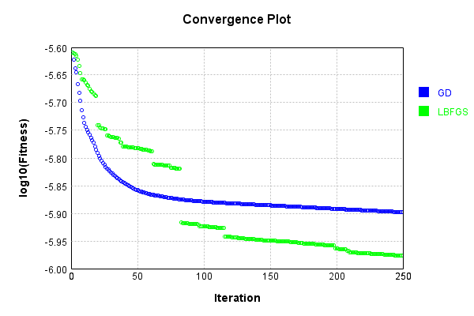


Code from [LearningTester.java:99](../../../../../../../src/main/java/com/simiacryptus/mindseye/test/unit/LearningTester.java#L99) executed in 0.00 seconds: 
```java
    return TestUtil.compareTime(runs);
```

Returns: 

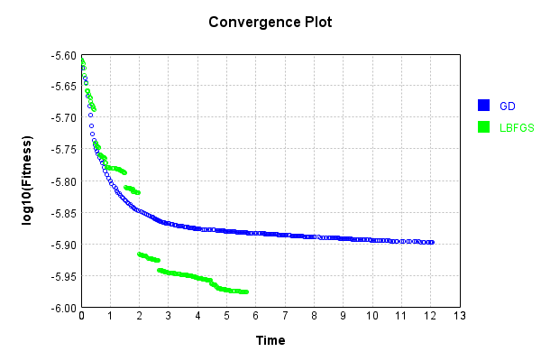


This is a network with the following layout:

Code from [NLayerTest.java:87](../../../../../../../src/test/java/com/simiacryptus/mindseye/network/NLayerTest.java#L87) executed in 0.25 seconds: 
```java
    return Graphviz.fromGraph(TestUtil.toGraph((DAGNetwork) layer))
      .height(400).width(600).render(Format.PNG).toImage();
```

Returns: 

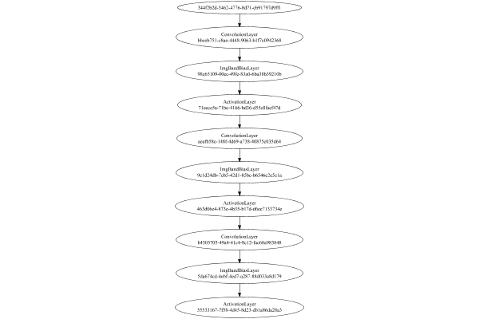


### Json Serialization
Code from [JsonTest.java:36](../../../../../../../src/main/java/com/simiacryptus/mindseye/test/unit/JsonTest.java#L36) executed in 0.00 seconds: 
```java
    JsonObject json = layer.getJson();
    NNLayer echo = NNLayer.fromJson(json);
    if ((echo == null)) throw new AssertionError("Failed to deserialize");
    if ((layer == echo)) throw new AssertionError("Serialization did not copy");
    if ((!layer.equals(echo))) throw new AssertionError("Serialization not equal");
    return new GsonBuilder().setPrettyPrinting().create().toJson(json);
```

Returns: 

```
    {
      "class": "com.simiacryptus.mindseye.network.PipelineNetwork",
      "id": "986fdcd7-a1e8-4091-8609-617798541635",
      "isFrozen": false,
      "name": "PipelineNetwork/986fdcd7-a1e8-4091-8609-617798541635",
      "inputs": [
        "344f2b2d-5462-4776-8d71-cb91797d9ff1"
      ],
      "nodes": {
        "9093c405-de5d-4b70-8ac2-05f2e90ba5e6": "bbceb751-c8ae-4448-9063-b1f7c0942368",
        "747dd6d0-21fa-484d-a853-46f20f006b48": "98c65109-00ec-49fe-83a0-6ba38b39210b",
        "aae99f7f-b336-4c1d-8a9b-e718a3533d7b": "71eece5a-71be-4166-bd36-d55e8faef47d",
        "d79129b3-2148-436b-84da-b67b5f0a95c3": "aeafb58c-148f-4d69-a738-40875c035d64",
        "2c1ffb0b-8561-477d-b12e-83bce05eff14": "9c1d24db-7cb5-42d1-85bc-b6546c2e5c1a",
        "467d298d-e22d-45cb-85b5-95f723f8f206": "463d06e4-873e-4b35-b17d-d6ee7133734e",
        "85c68c1e-4739-4a00-9313-00106f2fd70b": "b4303705-49a4-41c4-8c12-fac68a983848",
        "00a8732a-7c0c-440f-8b81-706db4316320": "5da674cd-4ebf-4ed7-a287-88d033a8d179",
        "a18d24ba-fdb4-42ef-80d4-b92e26742a74": "55533167-7f58-4d45-8d23-db1a86d
```
...[skipping 6039 bytes](etc/15.txt)...
```
    ",
          "mode": 1,
          "precision": "Double"
        }
      },
      "links": {
        "9093c405-de5d-4b70-8ac2-05f2e90ba5e6": [
          "344f2b2d-5462-4776-8d71-cb91797d9ff1"
        ],
        "747dd6d0-21fa-484d-a853-46f20f006b48": [
          "9093c405-de5d-4b70-8ac2-05f2e90ba5e6"
        ],
        "aae99f7f-b336-4c1d-8a9b-e718a3533d7b": [
          "747dd6d0-21fa-484d-a853-46f20f006b48"
        ],
        "d79129b3-2148-436b-84da-b67b5f0a95c3": [
          "aae99f7f-b336-4c1d-8a9b-e718a3533d7b"
        ],
        "2c1ffb0b-8561-477d-b12e-83bce05eff14": [
          "d79129b3-2148-436b-84da-b67b5f0a95c3"
        ],
        "467d298d-e22d-45cb-85b5-95f723f8f206": [
          "2c1ffb0b-8561-477d-b12e-83bce05eff14"
        ],
        "85c68c1e-4739-4a00-9313-00106f2fd70b": [
          "467d298d-e22d-45cb-85b5-95f723f8f206"
        ],
        "00a8732a-7c0c-440f-8b81-706db4316320": [
          "85c68c1e-4739-4a00-9313-00106f2fd70b"
        ],
        "a18d24ba-fdb4-42ef-80d4-b92e26742a74": [
          "00a8732a-7c0c-440f-8b81-706db4316320"
        ]
      },
      "labels": {},
      "head": "a18d24ba-fdb4-42ef-80d4-b92e26742a74"
    }
```


### Input Learning
In this test, we use a network to learn this target input, given it's pre-evaluated output:

Code from [LearningTester.java:127](../../../../../../../src/main/java/com/simiacryptus/mindseye/test/unit/LearningTester.java#L127) executed in 0.00 seconds: 
```java
    return Arrays.stream(input_target).map(x -> x.prettyPrint()).reduce((a, b) -> a + "\n" + b).orElse("");
```

Returns: 

```
    [
    	[ [ 0.035, -0.0298, 0.078 ], [ 0.021200000000000004, -0.0548, -0.07160000000000001 ], [ 0.012600000000000002, -0.044, -0.0712 ], [ -0.0892, 0.048400000000000006, 0.0704 ], [ -0.011200000000000002, -0.0032, 0.08960000000000001 ] ],
    	[ [ -0.0804, -0.09380000000000001, -0.0328 ], [ 0.0824, -0.051800000000000006, 0.049400000000000006 ], [ -0.0386, -0.013200000000000002, 0.056 ], [ -0.0682, -8.0E-4, -0.0898 ], [ 0.022200000000000004, 0.07560000000000001, -0.07660000000000002 ] ],
    	[ [ -0.0826, -0.034, -0.0708 ], [ -0.026600000000000002, -0.067, -0.0862 ], [ 0.04440000000000001, -0.055400000000000005, -0.015 ], [ 0.0648, -0.0044, -0.001 ], [ 0.0318, 0.014600000000000002, 0.0352 ] ],
    	[ [ 0.0526, 0.074, 0.09440000000000001 ], [ 0.09040000000000001, -0.053200000000000004, 0.0446 ], [ 0.06960000000000001, 0.009600000000000001, -0.047400000000000005 ], [ 0.0668, 0.07780000000000001, -0.025 ], [ -0.018600000000000002, 0.0422, 0.069 ] ],
    	[ [ -0.056600000000000004, 0.076, -0.0164 ], [ -0.0568, 0.0088, 0.009600000000000001 ], [ 0.09380000000000001, -0.07260000000000001, -0.0328 ], [ 0.09440000000000001, 0.029400000000000003, 0.07940000000000001 ], [ -0.0708, -0.0238, 0.0678 ] ]
    ]
```


First, we use a conjugate gradient descent method, which converges the fastest for purely linear functions.

Code from [LearningTester.java:300](../../../../../../../src/main/java/com/simiacryptus/mindseye/test/unit/LearningTester.java#L300) executed in 30.15 seconds: 
```java
    return new IterativeTrainer(trainable)
      .setLineSearchFactory(label -> new QuadraticSearch())
      .setOrientation(new GradientDescent())
      .setMonitor(monitor)
      .setTimeout(30, TimeUnit.SECONDS)
      .setMaxIterations(250)
      .setTerminateThreshold(0)
      .run();
```
Logging: 
```
    Low gradient: 5.426862956864322E-7
    Constructing line search parameters: GD
    F(0.0) = LineSearchPoint{point=PointSample{avg=7.270894643927978E-8}, derivative=-2.9450841552586163E-13}
    New Minimum: 7.270894643927978E-8 > 7.270894643927975E-8
    F(1.0E-10) = LineSearchPoint{point=PointSample{avg=7.270894643927975E-8}, derivative=-2.9450841552586153E-13}, delta = -2.6469779601696886E-23
    New Minimum: 7.270894643927975E-8 > 7.27089464392796E-8
    F(7.000000000000001E-10) = LineSearchPoint{point=PointSample{avg=7.27089464392796E-8}, derivative=-2.945084155258608E-13}, delta = -1.852884572118782E-22
    New Minimum: 7.27089464392796E-8 > 7.270894643927836E-8
    F(4.900000000000001E-9) = LineSearchPoint{point=PointSample{avg=7.270894643927836E-8}, derivative=-2.945084155258553E-13}, delta = -1.4161332086907834E-21
    New Minimum: 7.270894643927836E-8 > 7.270894643926968E-8
    F(3.430000000000001E-8) = LineSearchPoint{point=PointSample{avg=7.270894643926968E-8}, derivative=-2.94508415525817E-13}, delta = -1.0098220918047362E-20
```
...[skipping 646739 bytes](etc/16.txt)...
```
    at 2.0835376228207105E-6
    F(1.8227272948769015E-6) = LineSearchPoint{point=PointSample{avg=4.2715129737246504E-9}, derivative=2.683798067373037E-17}, delta = -2.4319110009059014E-22
    Right bracket at 1.8227272948769015E-6
    New Minimum: 4.2715129737246504E-9 > 4.271512973724636E-9
    F(1.5945643386042286E-6) = LineSearchPoint{point=PointSample{avg=4.271512973724636E-9}, derivative=2.6837980673681095E-17}, delta = -2.572531705039916E-22
    Right bracket at 1.5945643386042286E-6
    New Minimum: 4.271512973724636E-9 > 4.271512973724632E-9
    F(1.3949620643172753E-6) = LineSearchPoint{point=PointSample{avg=4.271512973724632E-9}, derivative=2.6837980673637156E-17}, delta = -2.6138907356675675E-22
    Right bracket at 1.3949620643172753E-6
    F(1.2203453405887882E-6) = LineSearchPoint{point=PointSample{avg=4.271512973724663E-9}, derivative=-1.791547197368469E-16}, delta = -2.307833909022947E-22
    Loops = 12
    Iteration 225 complete. Error: 4.271512973724632E-9 Total: 250877112551834.1000; Orientation: 0.0001; Line Search: 0.2075
    
```

Returns: 

```
    4.271512973724632E-9
```


Training Converged

Next, we run the same optimization using L-BFGS, which is nearly ideal for purely second-order or quadratic functions.

Code from [LearningTester.java:324](../../../../../../../src/main/java/com/simiacryptus/mindseye/test/unit/LearningTester.java#L324) executed in 13.19 seconds: 
```java
    return new IterativeTrainer(trainable)
      .setLineSearchFactory(label -> new ArmijoWolfeSearch())
      .setOrientation(new LBFGS())
      .setMonitor(monitor)
      .setTimeout(30, TimeUnit.SECONDS)
      .setMaxIterations(250)
      .setTerminateThreshold(0)
      .run();
```
Logging: 
```
    LBFGS Accumulation History: 1 points
    Constructing line search parameters: GD
    th(0)=7.270894643927978E-8;dx=-2.9450841552586163E-13
    New Minimum: 7.270894643927978E-8 > 7.270831194315461E-8
    WOLFE (weak): th(2.154434690031884)=7.270831194315461E-8; dx=-2.9450561039552546E-13 delta=6.344961251671474E-13
    New Minimum: 7.270831194315461E-8 > 7.27076774530729E-8
    WOLFE (weak): th(4.308869380063768)=7.27076774530729E-8; dx=-2.945028052651892E-13 delta=1.2689862068733301E-12
    New Minimum: 7.27076774530729E-8 > 7.270513955318076E-8
    WOLFE (weak): th(12.926608140191302)=7.270513955318076E-8; dx=-2.9449158474384424E-13 delta=3.80688609902224E-12
    New Minimum: 7.270513955318076E-8 > 7.269372020027323E-8
    WOLFE (weak): th(51.70643256076521)=7.269372020027323E-8; dx=-2.944410923977921E-13 delta=1.5226239006548597E-11
    New Minimum: 7.269372020027323E-8 > 7.263285005463472E-8
    WOLFE (weak): th(258.53216280382605)=7.263285005463472E-8; dx=-2.9417179988551377E-13 delta=7.609638464505732E-11
    New Minimum: 7.263285005463472E-
```
...[skipping 330279 bytes](etc/17.txt)...
```
    5213408E-8
    WOLFE (weak): th(4.308869380063768)=1.1416283835213408E-8; dx=-2.4404465827923233E-14 delta=1.0515646715902241E-13
    New Minimum: 1.1416283835213408E-8 > 1.1416073527148792E-8
    WOLFE (weak): th(12.926608140191302)=1.1416073527148792E-8; dx=-2.44037123899079E-14 delta=3.154645317754656E-13
    New Minimum: 1.1416073527148792E-8 > 1.1415127221208032E-8
    WOLFE (weak): th(51.70643256076521)=1.1415127221208032E-8; dx=-2.440032191883886E-14 delta=1.2617704725358993E-12
    New Minimum: 1.1415127221208032E-8 > 1.1410082476773421E-8
    WOLFE (weak): th(258.53216280382605)=1.1410082476773421E-8; dx=-2.4382239406470717E-14 delta=6.3065149071465335E-12
    New Minimum: 1.1410082476773421E-8 > 1.1378637556819512E-8
    WOLFE (weak): th(1551.1929768229563)=1.1378637556819512E-8; dx=-2.4269223704169687E-14 delta=3.775143486105566E-11
    MAX ALPHA: th(0)=1.1416388991680568E-8;th'(0)=-2.44048425469309E-14;
    Iteration 250 complete. Error: 1.1378637556819512E-8 Total: 250890297988683.7500; Orientation: 0.0002; Line Search: 0.0402
    
```

Returns: 

```
    1.1378637556819512E-8
```


Training Converged

Code from [LearningTester.java:96](../../../../../../../src/main/java/com/simiacryptus/mindseye/test/unit/LearningTester.java#L96) executed in 0.01 seconds: 
```java
    return TestUtil.compare(runs);
```

Returns: 

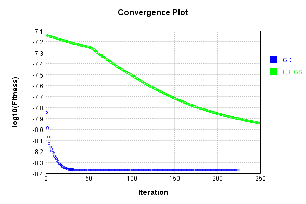


Code from [LearningTester.java:99](../../../../../../../src/main/java/com/simiacryptus/mindseye/test/unit/LearningTester.java#L99) executed in 0.01 seconds: 
```java
    return TestUtil.compareTime(runs);
```

Returns: 

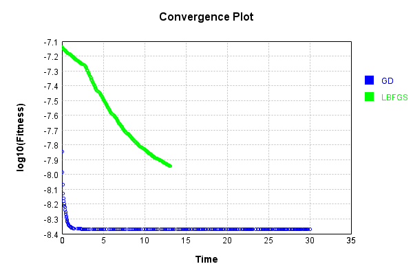


### Model Learning
In this test, attempt to train a network to emulate a randomized network given an example input/output. The target state is:

Code from [LearningTester.java:176](../../../../../../../src/main/java/com/simiacryptus/mindseye/test/unit/LearningTester.java#L176) executed in 0.00 seconds: 
```java
    return network_target.state().stream().map(Arrays::toString).reduce((a, b) -> a + "\n" + b).orElse("");
```

Returns: 

```
    [0.0]
    [0.0, 0.0]
    [0.0]
    [0.021200000000000004, 0.035800000000000005, 0.0328, 0.07660000000000002, 0.027800000000000002, 0.0164, -0.0432, 0.089, -0.008400000000000001, 0.094, -0.025400000000000002, 4.0E-4, -0.004200000000000001, 0.057800000000000004, -0.027800000000000002, 0.04440000000000001, 0.0016, -0.011800000000000001]
    [-0.041400000000000006, -0.08220000000000001, 0.0122, -0.0274, -0.0636, 0.08180000000000001, -0.0068000000000000005, 0.07740000000000001, 0.082]
    [0.0534, -0.026400000000000003, 0.09580000000000001, 0.0592, 0.052, -0.0826, 0.0834, 0.082, 0.0054, 0.0534, -0.008, 0.0576, -0.0922, 0.071, -0.091, -0.062200000000000005, 0.08660000000000001, -0.047200000000000006, -0.076, -0.0108, 0.05, -0.08860000000000001, -0.018600000000000002, -0.0562, -0.013800000000000002, 0.09620000000000001, -0.0062, 0.0322, 0.0238, -0.05040000000000001, -0.004, -0.08280000000000001, 0.030400000000000003, -0.055, -0.0572, -0.0442, -0.004200000000000001, -0.0288, 0.018400000000000003, -0.09480000000000001, 0.0688, 0.011200000000000002, -0.09060000000000001, 0.042, 0.0664, -0.046200000000000005, 0.008, -0.051, 0.044800000000000006, 0.0078000000000000005, -0.075, 0.09, 0.0488, 0.054200000000000005]
```


First, we use a conjugate gradient descent method, which converges the fastest for purely linear functions.

Code from [LearningTester.java:300](../../../../../../../src/main/java/com/simiacryptus/mindseye/test/unit/LearningTester.java#L300) executed in 3.34 seconds: 
```java
    return new IterativeTrainer(trainable)
      .setLineSearchFactory(label -> new QuadraticSearch())
      .setOrientation(new GradientDescent())
      .setMonitor(monitor)
      .setTimeout(30, TimeUnit.SECONDS)
      .setMaxIterations(250)
      .setTerminateThreshold(0)
      .run();
```
Logging: 
```
    Constructing line search parameters: GD
    F(0.0) = LineSearchPoint{point=PointSample{avg=6.889052638483407E-8}, derivative=-6.75036675367472E-8}
    New Minimum: 6.889052638483407E-8 > 6.889052637808372E-8
    F(1.0E-10) = LineSearchPoint{point=PointSample{avg=6.889052637808372E-8}, derivative=-6.750366752968693E-8}, delta = -6.7503496638043415E-18
    New Minimum: 6.889052637808372E-8 > 6.88905263375815E-8
    F(7.000000000000001E-10) = LineSearchPoint{point=PointSample{avg=6.88905263375815E-8}, derivative=-6.750366748732535E-8}, delta = -4.72525667606386E-17
    New Minimum: 6.88905263375815E-8 > 6.889052605406613E-8
    F(4.900000000000001E-9) = LineSearchPoint{point=PointSample{avg=6.889052605406613E-8}, derivative=-6.750366719079413E-8}, delta = -3.307679408546906E-16
    New Minimum: 6.889052605406613E-8 > 6.889052406945834E-8
    F(3.430000000000001E-8) = LineSearchPoint{point=PointSample{avg=6.889052406945834E-8}, derivative=-6.750366511507573E-8}, delta = -2.315375731566622E-15
    New Minimum: 6.889052406945834E-8 > 6.88905101
```
...[skipping 63925 bytes](etc/18.txt)...
```
    t 2.127603853590806E-10
    F(2.0479656427890495E-10) = LineSearchPoint{point=PointSample{avg=2.128009161395253E-8}, derivative=-1.0492966059166378E-13}, delta = -1.9852334701272664E-23
    Left bracket at 2.0479656427890495E-10
    Converged to right
    Iteration 30 complete. Error: 2.1280091613952524E-8 Total: 250893767680088.3400; Orientation: 0.0001; Line Search: 0.1079
    Low gradient: 3.2392848067371106E-7
    F(0.0) = LineSearchPoint{point=PointSample{avg=2.128009161395253E-8}, derivative=-1.0492966059157881E-13}
    F(2.127603853590806E-10) = LineSearchPoint{point=PointSample{avg=2.128009161395253E-8}, derivative=3.344032669851071E-14}, delta = 0.0
    2.128009161395253E-8 <= 2.128009161395253E-8
    F(1.61341888225069E-10) = LineSearchPoint{point=PointSample{avg=2.1280091613952534E-8}, derivative=3.344032669849189E-14}, delta = 3.3087224502121107E-24
    2.1280091613952534E-8 > 2.128009161395253E-8
    Iteration 31 failed, aborting. Error: 2.128009161395253E-8 Total: 250893798403894.2200; Orientation: 0.0001; Line Search: 0.0248
    
```

Returns: 

```
    2.128009161395253E-8
```


Training Converged

Next, we run the same optimization using L-BFGS, which is nearly ideal for purely second-order or quadratic functions.

Code from [LearningTester.java:324](../../../../../../../src/main/java/com/simiacryptus/mindseye/test/unit/LearningTester.java#L324) executed in 8.18 seconds: 
```java
    return new IterativeTrainer(trainable)
      .setLineSearchFactory(label -> new ArmijoWolfeSearch())
      .setOrientation(new LBFGS())
      .setMonitor(monitor)
      .setTimeout(30, TimeUnit.SECONDS)
      .setMaxIterations(250)
      .setTerminateThreshold(0)
      .run();
```
Logging: 
```
    LBFGS Accumulation History: 1 points
    Constructing line search parameters: GD
    th(0)=3.0448892943582635E-8;dx=-3.81768389316813E-9
    New Minimum: 3.0448892943582635E-8 > 2.4169005090835447E-8
    END: th(2.154434690031884)=2.4169005090835447E-8; dx=-1.0247228962146013E-9 delta=6.279887852747188E-9
    Iteration 1 complete. Error: 2.4169005090835447E-8 Total: 250893877412442.2000; Orientation: 0.0002; Line Search: 0.0266
    LBFGS Accumulation History: 1 points
    th(0)=2.4169005090835447E-8;dx=-2.753666820377126E-10
    Armijo: th(4.641588833612779)=2.4315327813721962E-8; dx=3.38415224019481E-10 delta=-1.4632272288651467E-10
    New Minimum: 2.4169005090835447E-8 > 2.388605104710012E-8
    WOLF (strong): th(2.3207944168063896)=2.388605104710012E-8; dx=3.1524277023554464E-11 delta=2.8295404373532715E-10
    END: th(0.7735981389354633)=2.3995550317822185E-8; dx=-1.730696943433649E-10 delta=1.7345477301326264E-10
    Iteration 2 complete. Error: 2.388605104710012E-8 Total: 250893942296037.1200; Orientation: 0.0002; Line Search: 0.0522
    LB
```
...[skipping 147061 bytes](etc/19.txt)...
```
    6674)=2.011190821337812E-8; dx=-1.87627611417884E-13 delta=2.2853015244001394E-11
    Iteration 249 complete. Error: 2.011190821337812E-8 Total: 250901891549357.1600; Orientation: 0.0002; Line Search: 0.0298
    LBFGS Accumulation History: 1 points
    th(0)=2.011190821337812E-8;dx=-3.3013891124690848E-12
    Armijo: th(224.42028021165473)=2.4936127403124334E-8; dx=-9.718163077173391E-13 delta=-4.824219189746214E-9
    Armijo: th(112.21014010582736)=2.4375749026477514E-8; dx=-1.0647911011391386E-11 delta=-4.263840813099394E-9
    Armijo: th(37.40338003527579)=2.1019719864079613E-8; dx=5.1843029037690054E-11 delta=-9.078116507014931E-10
    Armijo: th(9.350845008818947)=2.014549344698076E-8; dx=1.0484743934573296E-11 delta=-3.358523360263971E-11
    New Minimum: 2.011190821337812E-8 > 2.0108312299205353E-8
    END: th(1.8701690017637893)=2.0108312299205353E-8; dx=-5.441609825782187E-13 delta=3.595914172766829E-12
    Iteration 250 complete. Error: 2.0108312299205353E-8 Total: 250901975833711.1000; Orientation: 0.0002; Line Search: 0.0783
    
```

Returns: 

```
    2.0108312299205353E-8
```


Training Converged

Code from [LearningTester.java:96](../../../../../../../src/main/java/com/simiacryptus/mindseye/test/unit/LearningTester.java#L96) executed in 0.01 seconds: 
```java
    return TestUtil.compare(runs);
```

Returns: 

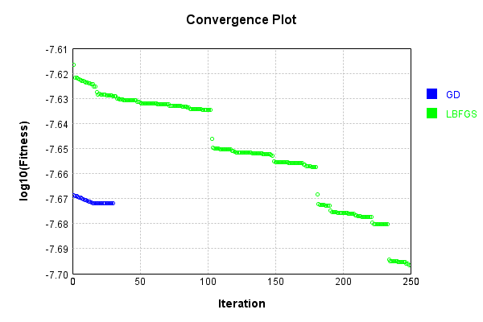


Code from [LearningTester.java:99](../../../../../../../src/main/java/com/simiacryptus/mindseye/test/unit/LearningTester.java#L99) executed in 0.01 seconds: 
```java
    return TestUtil.compareTime(runs);
```

Returns: 

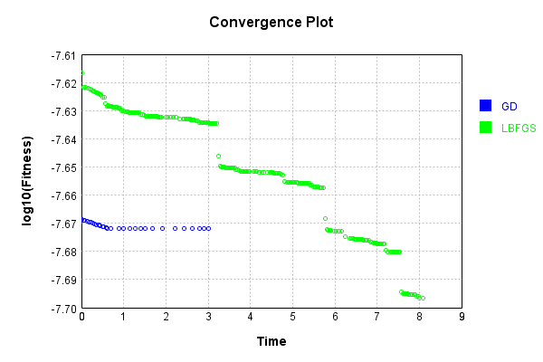


### Composite Learning
In this test, attempt to train a network to emulate a randomized network given an example input/output. The target state is:

Code from [LearningTester.java:219](../../../../../../../src/main/java/com/simiacryptus/mindseye/test/unit/LearningTester.java#L219) executed in 0.00 seconds: 
```java
    return network_target.state().stream().map(Arrays::toString).reduce((a, b) -> a + "\n" + b).orElse("");
```

Returns: 

```
    [0.0]
    [0.0, 0.0]
    [0.0]
    [-0.011800000000000001, 0.094, 0.035800000000000005, -0.0432, 0.021200000000000004, -0.004200000000000001, 0.0164, -0.008400000000000001, -0.027800000000000002, 0.089, 0.0328, 4.0E-4, -0.025400000000000002, 0.0016, 0.027800000000000002, 0.04440000000000001, 0.07660000000000002, 0.057800000000000004]
    [-0.0274, 0.0122, -0.0636, -0.041400000000000006, -0.08220000000000001, 0.08180000000000001, -0.0068000000000000005, 0.07740000000000001, 0.082]
    [-0.05040000000000001, -0.0826, -0.018600000000000002, -0.051, 0.018400000000000003, 0.052, 0.09, 0.042, 0.044800000000000006, -0.062200000000000005, -0.055, -0.047200000000000006, 0.0322, -0.0562, 0.008, -0.0922, 0.0488, 0.0592, 0.0664, 0.08660000000000001, 0.0534, -0.046200000000000005, -0.08860000000000001, 0.011200000000000002, 0.0238, 0.082, -0.08280000000000001, 0.05, 0.071, -0.09480000000000001, -0.0108, -0.0572, -0.0442, -0.0062, 0.054200000000000005, -0.09060000000000001, 0.09580000000000001, 0.0576, -0.076, -0.091, 0.0078000000000000005, 0.030400000000000003, -0.004, -0.013800000000000002, -0.075, 0.0688, 0.0054, -0.026400000000000003, -0.0288, 0.0834, -0.004200000000000001, 0.09620000000000001, 0.0534, -0.008]
```


We simultaneously regress this target input:

Code from [LearningTester.java:223](../../../../../../../src/main/java/com/simiacryptus/mindseye/test/unit/LearningTester.java#L223) executed in 0.00 seconds: 
```java
    return Arrays.stream(testInput).map(x -> x.prettyPrint()).reduce((a, b) -> a + "\n" + b).orElse("");
```

Returns: 

```
    [
    	[ [ -0.0548, -0.051800000000000006, 0.0318 ], [ 0.09440000000000001, -0.0804, -0.001 ], [ -0.055400000000000005, 0.07780000000000001, -0.0708 ], [ 0.0824, -0.025, 0.076 ], [ 0.09040000000000001, -0.053200000000000004, -0.09380000000000001 ] ],
    	[ [ 0.0704, 0.012600000000000002, 0.0678 ], [ 0.074, 0.009600000000000001, -0.015 ], [ -0.013200000000000002, -0.0386, -0.07160000000000001 ], [ -0.0044, 0.07560000000000001, -0.0892 ], [ -0.067, 0.048400000000000006, -0.018600000000000002 ] ],
    	[ [ -0.0238, -0.056600000000000004, 0.0526 ], [ 0.056, 0.08960000000000001, 0.078 ], [ 0.0648, 0.029400000000000003, -0.0708 ], [ 0.04440000000000001, -0.0568, 0.0668 ], [ -0.047400000000000005, 0.009600000000000001, 0.014600000000000002 ] ],
    	[ [ -0.0298, -0.07660000000000002, -0.0164 ], [ -0.0682, -0.0712, -0.0826 ], [ -0.026600000000000002, 0.06960000000000001, 0.0446 ], [ -0.044, 0.0422, 0.07940000000000001 ], [ 0.0352, -0.011200000000000002, 0.0088 ] ],
    	[ [ -0.0032, 0.022200000000000004, -0.034 ], [ 0.09440000000000001, -0.07260000000000001, -0.0862 ], [ 0.021200000000000004, 0.035, 0.069 ], [ 0.09380000000000001, -0.0328, -0.0898 ], [ -8.0E-4, -0.0328, 0.049400000000000006 ] ]
    ]
```


Which produces the following output:

Code from [LearningTester.java:230](../../../../../../../src/main/java/com/simiacryptus/mindseye/test/unit/LearningTester.java#L230) executed in 0.00 seconds: 
```java
    return Stream.of(targetOutput).map(x -> x.prettyPrint()).reduce((a, b) -> a + "\n" + b).orElse("");
```

Returns: 

```
    [
    	[ [ 0.0 ], [ 0.0 ], [ 0.0 ], [ 0.0 ], [ 1.3884105052160007E-4 ] ],
    	[ [ 0.0 ], [ 0.0 ], [ 0.0 ], [ 4.7400672945599974E-5 ], [ 2.679495206992001E-4 ] ],
    	[ [ 0.0 ], [ 8.43426479584001E-5 ], [ 0.0 ], [ 7.817578082224003E-4 ], [ 6.425801964799964E-6 ] ],
    	[ [ 0.0 ], [ 0.0 ], [ 3.5868455461600027E-4 ], [ 6.839600776336001E-4 ], [ 0.0 ] ],
    	[ [ 1.966191912320001E-5 ], [ 2.4643544958560007E-4 ], [ 3.746980074864001E-4 ], [ 2.128918418096E-4 ], [ 2.5794135854240017E-4 ] ]
    ]
```


First, we use a conjugate gradient descent method, which converges the fastest for purely linear functions.

Code from [LearningTester.java:300](../../../../../../../src/main/java/com/simiacryptus/mindseye/test/unit/LearningTester.java#L300) executed in 0.16 seconds: 
```java
    return new IterativeTrainer(trainable)
      .setLineSearchFactory(label -> new QuadraticSearch())
      .setOrientation(new GradientDescent())
      .setMonitor(monitor)
      .setTimeout(30, TimeUnit.SECONDS)
      .setMaxIterations(250)
      .setTerminateThreshold(0)
      .run();
```
Logging: 
```
    Constructing line search parameters: GD
    F(0.0) = LineSearchPoint{point=PointSample{avg=1.3041347169130433E-7}, derivative=-2.3245280885557485E-8}
    New Minimum: 1.3041347169130433E-7 > 1.304134716889798E-7
    F(1.0E-10) = LineSearchPoint{point=PointSample{avg=1.304134716889798E-7}, derivative=-2.324528088373421E-8}, delta = -2.324523105061817E-18
    New Minimum: 1.304134716889798E-7 > 1.3041347167503264E-7
    F(7.000000000000001E-10) = LineSearchPoint{point=PointSample{avg=1.3041347167503264E-7}, derivative=-2.3245280872794535E-8}, delta = -1.627168820521232E-17
    New Minimum: 1.3041347167503264E-7 > 1.3041347157740243E-7
    F(4.900000000000001E-9) = LineSearchPoint{point=PointSample{avg=1.3041347157740243E-7}, derivative=-2.324528079621689E-8}, delta = -1.1390189684582505E-16
    New Minimum: 1.3041347157740243E-7 > 1.3041347089399119E-7
    F(3.430000000000001E-8) = LineSearchPoint{point=PointSample{avg=1.3041347089399119E-7}, derivative=-2.3245280260173324E-8}, delta = -7.973131455718774E-16
    New Minimum: 1.3041347089399
```
...[skipping 1490 bytes](etc/20.txt)...
```
    imum: 1.2976412421243295E-7 > 1.2446999125597693E-7
    F(0.19773267430000002) = LineSearchPoint{point=PointSample{avg=1.2446999125597693E-7}, derivative=-3.09632821105551E-8}, delta = -5.943480435327405E-9
    New Minimum: 1.2446999125597693E-7 > 9.324923247056653E-8
    F(1.3841287201) = LineSearchPoint{point=PointSample{avg=9.324923247056653E-8}, derivative=-2.1506063024709745E-8}, delta = -3.71642392207378E-8
    Loops = 12
    New Minimum: 9.324923247056653E-8 > 6.485796590494195E-8
    F(18.49938504242879) = LineSearchPoint{point=PointSample{avg=6.485796590494195E-8}, derivative=0.0}, delta = -6.555550578636239E-8
    Right bracket at 18.49938504242879
    Converged to right
    Iteration 1 complete. Error: 6.485796590494195E-8 Total: 250902269819697.8800; Orientation: 0.0001; Line Search: 0.1105
    Zero gradient: 0.0
    F(0.0) = LineSearchPoint{point=PointSample{avg=6.485796590494195E-8}, derivative=0.0}
    Iteration 2 failed, aborting. Error: 6.485796590494195E-8 Total: 250902284080016.7200; Orientation: 0.0001; Line Search: 0.0066
    
```

Returns: 

```
    6.485796590494195E-8
```


Training Converged

Next, we run the same optimization using L-BFGS, which is nearly ideal for purely second-order or quadratic functions.

Code from [LearningTester.java:324](../../../../../../../src/main/java/com/simiacryptus/mindseye/test/unit/LearningTester.java#L324) executed in 0.11 seconds: 
```java
    return new IterativeTrainer(trainable)
      .setLineSearchFactory(label -> new ArmijoWolfeSearch())
      .setOrientation(new LBFGS())
      .setMonitor(monitor)
      .setTimeout(30, TimeUnit.SECONDS)
      .setMaxIterations(250)
      .setTerminateThreshold(0)
      .run();
```
Logging: 
```
    LBFGS Accumulation History: 1 points
    Constructing line search parameters: GD
    th(0)=1.3041347169130433E-7;dx=-2.3245280885557485E-8
    New Minimum: 1.3041347169130433E-7 > 7.945902937559614E-8
    END: th(2.154434690031884)=7.945902937559614E-8; dx=-1.4298421875972338E-8 delta=5.0954442315708194E-8
    Iteration 1 complete. Error: 7.945902937559614E-8 Total: 250902319649308.7200; Orientation: 0.0003; Line Search: 0.0149
    LBFGS Accumulation History: 1 points
    th(0)=7.945902937559614E-8;dx=-8.875041029464977E-9
    New Minimum: 7.945902937559614E-8 > 6.4990744838558E-8
    END: th(4.641588833612779)=6.4990744838558E-8; dx=-4.405071407655052E-10 delta=1.4468284537038138E-8
    Iteration 2 complete. Error: 6.4990744838558E-8 Total: 250902339426809.7000; Orientation: 0.0002; Line Search: 0.0132
    LBFGS Accumulation History: 1 points
    th(0)=6.4990744838558E-8;dx=-2.1900331439541528E-11
    New Minimum: 6.4990744838558E-8 > 6.486204661376436E-8
    END: th(10.000000000000002)=6.486204661376436E-8; dx=-3.839315532901813E-12 delta=1.286982247936408E-10
    Iteration 3 complete. Error: 6.486204661376436E-8 Total: 250902359359337.6600; Orientation: 0.0002; Line Search: 0.0128
    LBFGS Accumulation History: 1 points
    th(0)=6.486204661376436E-8;dx=-6.730648714883339E-13
    New Minimum: 6.486204661376436E-8 > 6.485796590494195E-8
    END: th(21.544346900318843)=6.485796590494195E-8; dx=0.0 delta=4.080708822412765E-12
    Iteration 4 complete. Error: 6.485796590494195E-8 Total: 250902379737002.6200; Orientation: 0.0002; Line Search: 0.0136
    LBFGS Accumulation History: 1 points
    th(0)=6.485796590494195E-8;dx=0.0 (ERROR: Starting derivative negative)
    Iteration 5 failed, aborting. Error: 6.485796590494195E-8 Total: 250902399023485.6200; Orientation: 0.0002; Line Search: 0.0129
    
```

Returns: 

```
    6.485796590494195E-8
```


Training Converged

Code from [LearningTester.java:96](../../../../../../../src/main/java/com/simiacryptus/mindseye/test/unit/LearningTester.java#L96) executed in 0.00 seconds: 
```java
    return TestUtil.compare(runs);
```

Returns: 


Code from [LearningTester.java:99](../../../../../../../src/main/java/com/simiacryptus/mindseye/test/unit/LearningTester.java#L99) executed in 0.00 seconds: 
```java
    return TestUtil.compareTime(runs);
```

Returns: 

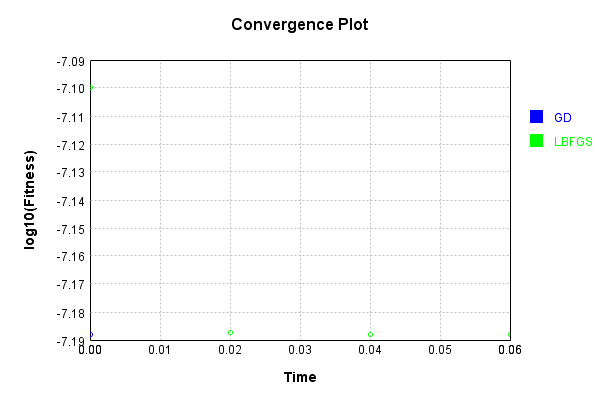


This is a network with the following layout:

Code from [NLayerTest.java:87](../../../../../../../src/test/java/com/simiacryptus/mindseye/network/NLayerTest.java#L87) executed in 0.22 seconds: 
```java
    return Graphviz.fromGraph(TestUtil.toGraph((DAGNetwork) layer))
      .height(400).width(600).render(Format.PNG).toImage();
```

Returns: 

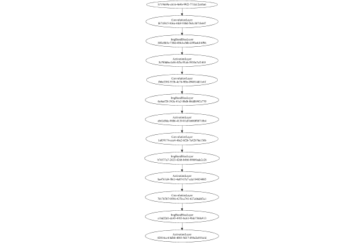


### Json Serialization
Code from [JsonTest.java:36](../../../../../../../src/main/java/com/simiacryptus/mindseye/test/unit/JsonTest.java#L36) executed in 0.00 seconds: 
```java
    JsonObject json = layer.getJson();
    NNLayer echo = NNLayer.fromJson(json);
    if ((echo == null)) throw new AssertionError("Failed to deserialize");
    if ((layer == echo)) throw new AssertionError("Serialization did not copy");
    if ((!layer.equals(echo))) throw new AssertionError("Serialization not equal");
    return new GsonBuilder().setPrettyPrinting().create().toJson(json);
```

Returns: 

```
    {
      "class": "com.simiacryptus.mindseye.network.PipelineNetwork",
      "id": "299b9df6-f192-4329-99bc-1c7b4557cc73",
      "isFrozen": false,
      "name": "PipelineNetwork/299b9df6-f192-4329-99bc-1c7b4557cc73",
      "inputs": [
        "b719669e-cb16-464b-99f2-771fa12c65a6"
      ],
      "nodes": {
        "365bc1f1-4461-481a-8ec2-fa48ac9c1f3c": "f671f415-836a-4fe8-930d-563c3871b447",
        "ee93464e-7202-4891-9ed3-f4981e1fa56f": "802e8b5e-730d-484d-a56b-d5f0a4d14f96",
        "704921f0-87fe-4e2b-9985-b25104eb9613": "1b780d6a-fe46-4f3e-91eb-5810a7cf1465",
        "7d9f3551-5853-4467-82cf-daddc10a495e": "fb8e238f-553b-4c76-9f8e-094814d11c6f",
        "2ad367cd-951e-4342-a1e7-067e332e8b46": "6e4aef28-543a-41a3-8bdb-bbddb942e770",
        "2b372e9e-4567-4c02-bde8-ea4ddb8c3a47": "eb63d9de-9886-4139-81df-b600f80710b4",
        "13cfae7b-6ec0-4985-87ba-85e448d3a9a5": "1a039174-cce4-46a2-bf26-7a42b76a136b",
        "799d54c4-1476-490f-8603-38abc06293ca": "b74577a7-2423-426b-b4b0-00889ade2c28",
        "e555b2f6-0318-4f34-a7be-9829eb730c78": "ba4761d4-f063-4a05-b7a7-cde1948
```
...[skipping 7967 bytes](etc/21.txt)...
```
    85-b25104eb9613": [
          "ee93464e-7202-4891-9ed3-f4981e1fa56f"
        ],
        "7d9f3551-5853-4467-82cf-daddc10a495e": [
          "704921f0-87fe-4e2b-9985-b25104eb9613"
        ],
        "2ad367cd-951e-4342-a1e7-067e332e8b46": [
          "7d9f3551-5853-4467-82cf-daddc10a495e"
        ],
        "2b372e9e-4567-4c02-bde8-ea4ddb8c3a47": [
          "2ad367cd-951e-4342-a1e7-067e332e8b46"
        ],
        "13cfae7b-6ec0-4985-87ba-85e448d3a9a5": [
          "2b372e9e-4567-4c02-bde8-ea4ddb8c3a47"
        ],
        "799d54c4-1476-490f-8603-38abc06293ca": [
          "13cfae7b-6ec0-4985-87ba-85e448d3a9a5"
        ],
        "e555b2f6-0318-4f34-a7be-9829eb730c78": [
          "799d54c4-1476-490f-8603-38abc06293ca"
        ],
        "71577dd8-8b93-49cc-b625-3792ea25704e": [
          "e555b2f6-0318-4f34-a7be-9829eb730c78"
        ],
        "180f9bf0-ae22-4c71-9e30-76da0203e4d0": [
          "71577dd8-8b93-49cc-b625-3792ea25704e"
        ],
        "d5a7a2a3-e966-40f7-afad-c16766e87872": [
          "180f9bf0-ae22-4c71-9e30-76da0203e4d0"
        ]
      },
      "labels": {},
      "head": "d5a7a2a3-e966-40f7-afad-c16766e87872"
    }
```


### Input Learning
In this test, we use a network to learn this target input, given it's pre-evaluated output:

Code from [LearningTester.java:127](../../../../../../../src/main/java/com/simiacryptus/mindseye/test/unit/LearningTester.java#L127) executed in 0.00 seconds: 
```java
    return Arrays.stream(input_target).map(x -> x.prettyPrint()).reduce((a, b) -> a + "\n" + b).orElse("");
```

Returns: 

```
    [
    	[ [ -0.057, 0.029200000000000004, -0.078 ], [ 0.048400000000000006, 0.0658, -0.0064 ], [ 0.046, 0.07479999999999999, -0.029 ], [ -0.0512, -0.048600000000000004, -0.088 ], [ -0.0034000000000000002, 0.007, -0.026200000000000005 ] ],
    	[ [ 0.0362, -0.0342, -0.055200000000000006 ], [ 0.0078000000000000005, 0.0072, -0.0864 ], [ -0.0536, -0.0234, -0.07780000000000001 ], [ 0.003, -0.08660000000000001, -0.028200000000000003 ], [ 0.02, 0.0208, 0.0124 ] ],
    	[ [ 0.007600000000000001, -0.082, -0.045200000000000004 ], [ -0.023, -0.07940000000000001, -0.0122 ], [ 0.001, 0.035800000000000005, 0.0782 ], [ 0.06720000000000001, -0.0072, 0.038200000000000005 ], [ -0.07479999999999999, 0.0762, -0.0692 ] ],
    	[ [ 0.06760000000000001, -0.0248, -0.046400000000000004 ], [ 0.002, 0.0994, -0.0826 ], [ 0.0576, 0.075, -0.04340000000000001 ], [ 0.0614, -0.039400000000000004, 0.0094 ], [ 0.015, 0.0824, -0.08660000000000001 ] ],
    	[ [ -0.0956, 0.09540000000000001, -0.0704 ], [ 0.027200000000000002, -0.08460000000000001, -0.0328 ], [ -0.0432, 0.0426, -0.0506 ], [ 0.049, -0.014600000000000002, 0.0718 ], [ 0.0108, 0.0772, -0.021400000000000002 ] ]
    ]
```


First, we use a conjugate gradient descent method, which converges the fastest for purely linear functions.

Code from [LearningTester.java:300](../../../../../../../src/main/java/com/simiacryptus/mindseye/test/unit/LearningTester.java#L300) executed in 0.02 seconds: 
```java
    return new IterativeTrainer(trainable)
      .setLineSearchFactory(label -> new QuadraticSearch())
      .setOrientation(new GradientDescent())
      .setMonitor(monitor)
      .setTimeout(30, TimeUnit.SECONDS)
      .setMaxIterations(250)
      .setTerminateThreshold(0)
      .run();
```
Logging: 
```
    Zero gradient: 0.0
    Constructing line search parameters: GD
    F(0.0) = LineSearchPoint{point=PointSample{avg=8.932053910369305E-13}, derivative=0.0}
    Iteration 1 failed, aborting. Error: 8.932053910369305E-13 Total: 250902796533856.2200; Orientation: 0.0001; Line Search: 0.0075
    
```

Returns: 

```
    8.932053910369305E-13
```


This training run resulted in the following regressed input:

Code from [LearningTester.java:144](../../../../../../../src/main/java/com/simiacryptus/mindseye/test/unit/LearningTester.java#L144) executed in 0.00 seconds: 
```java
    return Arrays.stream(input_gd).map(x -> x.prettyPrint()).reduce((a, b) -> a + "\n" + b).orElse("");
```

Returns: 

```
    [
    	[ [ 0.0762, -0.082, -0.0034000000000000002 ], [ 0.049, 0.0658, -0.07780000000000001 ], [ 0.0718, 0.0576, -0.088 ], [ -0.0342, -0.0864, -0.028200000000000003 ], [ -0.08660000000000001, 0.0994, 0.0782 ] ],
    	[ [ -0.0956, 0.0078000000000000005, 0.0772 ], [ 0.0108, -0.0536, -0.08460000000000001 ], [ -0.026200000000000005, -0.0432, -0.0506 ], [ -0.0248, -0.0064, 0.048400000000000006 ], [ -0.078, -0.0826, 0.06760000000000001 ] ],
    	[ [ -0.029, 0.06720000000000001, -0.039400000000000004 ], [ -0.046400000000000004, -0.0512, -0.08660000000000001 ], [ -0.0122, 0.046, 0.0426 ], [ 0.007, 0.0614, 0.007600000000000001 ], [ -0.0692, 0.003, -0.023 ] ],
    	[ [ 0.075, -0.0704, -0.07940000000000001 ], [ -0.0072, 0.02, -0.048600000000000004 ], [ -0.057, -0.0328, 0.035800000000000005 ], [ 0.0362, -0.04340000000000001, -0.055200000000000006 ], [ 0.038200000000000005, 0.07479999999999999, 0.002 ] ],
    	[ [ 0.0208, 0.029200000000000004, 0.001 ], [ 0.015, -0.014600000000000002, 0.0072 ], [ -0.07479999999999999, 0.027200000000000002, -0.021400000000000002 ], [ 0.0824, 0.0124, 0.0094 ], [ 0.09540000000000001, -0.0234, -0.045200000000000004 ] ]
    ]
```


Next, we run the same optimization using L-BFGS, which is nearly ideal for purely second-order or quadratic functions.

Code from [LearningTester.java:324](../../../../../../../src/main/java/com/simiacryptus/mindseye/test/unit/LearningTester.java#L324) executed in 0.03 seconds: 
```java
    return new IterativeTrainer(trainable)
      .setLineSearchFactory(label -> new ArmijoWolfeSearch())
      .setOrientation(new LBFGS())
      .setMonitor(monitor)
      .setTimeout(30, TimeUnit.SECONDS)
      .setMaxIterations(250)
      .setTerminateThreshold(0)
      .run();
```
Logging: 
```
    LBFGS Accumulation History: 1 points
    Constructing line search parameters: GD
    th(0)=8.932053910369305E-13;dx=0.0 (ERROR: Starting derivative negative)
    Iteration 1 failed, aborting. Error: 8.932053910369305E-13 Total: 250902828184981.2000; Orientation: 0.0002; Line Search: 0.0148
    
```

Returns: 

```
    8.932053910369305E-13
```


This training run resulted in the following regressed input:

Code from [LearningTester.java:154](../../../../../../../src/main/java/com/simiacryptus/mindseye/test/unit/LearningTester.java#L154) executed in 0.00 seconds: 
```java
    return Arrays.stream(input_lbgfs).map(x -> x.prettyPrint()).reduce((a, b) -> a + "\n" + b).orElse("");
```

Returns: 

```
    [
    	[ [ 0.0762, -0.082, -0.0034000000000000002 ], [ 0.049, 0.0658, -0.07780000000000001 ], [ 0.0718, 0.0576, -0.088 ], [ -0.0342, -0.0864, -0.028200000000000003 ], [ -0.08660000000000001, 0.0994, 0.0782 ] ],
    	[ [ -0.0956, 0.0078000000000000005, 0.0772 ], [ 0.0108, -0.0536, -0.08460000000000001 ], [ -0.026200000000000005, -0.0432, -0.0506 ], [ -0.0248, -0.0064, 0.048400000000000006 ], [ -0.078, -0.0826, 0.06760000000000001 ] ],
    	[ [ -0.029, 0.06720000000000001, -0.039400000000000004 ], [ -0.046400000000000004, -0.0512, -0.08660000000000001 ], [ -0.0122, 0.046, 0.0426 ], [ 0.007, 0.0614, 0.007600000000000001 ], [ -0.0692, 0.003, -0.023 ] ],
    	[ [ 0.075, -0.0704, -0.07940000000000001 ], [ -0.0072, 0.02, -0.048600000000000004 ], [ -0.057, -0.0328, 0.035800000000000005 ], [ 0.0362, -0.04340000000000001, -0.055200000000000006 ], [ 0.038200000000000005, 0.07479999999999999, 0.002 ] ],
    	[ [ 0.0208, 0.029200000000000004, 0.001 ], [ 0.015, -0.014600000000000002, 0.0072 ], [ -0.07479999999999999, 0.027200000000000002, -0.021400000000000002 ], [ 0.0824, 0.0124, 0.0094 ], [ 0.09540000000000001, -0.0234, -0.045200000000000004 ] ]
    ]
```


Code from [LearningTester.java:96](../../../../../../../src/main/java/com/simiacryptus/mindseye/test/unit/LearningTester.java#L96) executed in 0.00 seconds: 
```java
    return TestUtil.compare(runs);
```

Code from [LearningTester.java:99](../../../../../../../src/main/java/com/simiacryptus/mindseye/test/unit/LearningTester.java#L99) executed in 0.00 seconds: 
```java
    return TestUtil.compareTime(runs);
```

### Model Learning
In this test, attempt to train a network to emulate a randomized network given an example input/output. The target state is:

Code from [LearningTester.java:176](../../../../../../../src/main/java/com/simiacryptus/mindseye/test/unit/LearningTester.java#L176) executed in 0.00 seconds: 
```java
    return network_target.state().stream().map(Arrays::toString).reduce((a, b) -> a + "\n" + b).orElse("");
```

Returns: 

```
    [-0.0862, -0.098, 0.09060000000000001, 0.06720000000000001, -0.015600000000000001, -0.06860000000000001, -0.025400000000000002, -0.0014000000000000002, -0.0702]
    [0.0]
    [-0.0536, -0.06280000000000001, 0.009800000000000001, 0.06760000000000001, -0.0682, -0.035, -0.09880000000000001, -0.033, -0.037]
    [0.0, 0.0]
    [0.0]
    [0.0]
    [0.0024000000000000002, 0.06720000000000001, -0.0204, 0.08480000000000001, 0.0052, -0.037, 0.028, -0.023600000000000003, 0.055200000000000006, -0.0884, -0.0012000000000000001, 0.0752, -0.074, 0.06380000000000001, 0.0546, -0.0632, -0.0922, 0.055600000000000004, 0.017, -0.0644, 0.08080000000000001, 6.000000000000001E-4, 0.0178, -0.0994, -0.05940000000000001, 0.0364, 0.029200000000000004, -0.097, -0.063, 0.011600000000000001, 0.022, 0.002, -0.016800000000000002, 0.055400000000000005, -0.06080000000000001, -0.0058000000000000005, -0.051, -0.0864, -0.0692, 0.04340000000000001, -0.062200000000000005, -0.007, 0.09440000000000001, -0.0656, -0.08220000000000001, 0.0546, -0.0026, -0.089, 0.0218, 0.012, 0.09280000000000001, 0.023200000000000002, 0.09580000000000001, -0.0316]
    [0.08280000000000001, 0.039, -0.05, -0.084, 0.022, 0.08120000000000001, -0.009200000000000002, 0.07840000000000001, 0.05380000000000001, -0.06620000000000001, 0.0966, -0.0854, 0.078, -0.0816, 0.0436, 0.040600000000000004, -0.042800000000000005, -0.09820000000000001]
```


First, we use a conjugate gradient descent method, which converges the fastest for purely linear functions.

Code from [LearningTester.java:300](../../../../../../../src/main/java/com/simiacryptus/mindseye/test/unit/LearningTester.java#L300) executed in 0.20 seconds: 
```java
    return new IterativeTrainer(trainable)
      .setLineSearchFactory(label -> new QuadraticSearch())
      .setOrientation(new GradientDescent())
      .setMonitor(monitor)
      .setTimeout(30, TimeUnit.SECONDS)
      .setMaxIterations(250)
      .setTerminateThreshold(0)
      .run();
```
Logging: 
```
    Low gradient: 4.8824689159284895E-8
    Constructing line search parameters: GD
    F(0.0) = LineSearchPoint{point=PointSample{avg=6.306099401017846E-11}, derivative=-2.383850271500792E-15}
    New Minimum: 6.306099401017846E-11 > 6.306099401017823E-11
    F(1.0E-10) = LineSearchPoint{point=PointSample{avg=6.306099401017823E-11}, derivative=-2.3838502714817196E-15}, delta = -2.3264454728053903E-25
    New Minimum: 6.306099401017823E-11 > 6.30609940101768E-11
    F(7.000000000000001E-10) = LineSearchPoint{point=PointSample{avg=6.30609940101768E-11}, derivative=-2.383850271367283E-15}, delta = -1.6672859221771964E-24
    New Minimum: 6.30609940101768E-11 > 6.306099401016678E-11
    F(4.900000000000001E-9) = LineSearchPoint{point=PointSample{avg=6.306099401016678E-11}, derivative=-2.3838502705662327E-15}, delta = -1.1683926152311516E-23
    New Minimum: 6.306099401016678E-11 > 6.30609940100967E-11
    F(3.430000000000001E-8) = LineSearchPoint{point=PointSample{avg=6.30609940100967E-11}, derivative=-2.383850264958878E-15}, delta = -8.17616336
```
...[skipping 1929 bytes](etc/22.txt)...
```
    = -3.1168576532376867E-15
    Loops = 12
    New Minimum: 6.305787715252522E-11 > 6.304609637994304E-11
    F(12.49879693663783) = LineSearchPoint{point=PointSample{avg=6.304609637994304E-11}, derivative=-2.3871901474289608E-27}, delta = -1.4897630235420886E-14
    Right bracket at 12.49879693663783
    Converged to right
    Iteration 1 complete. Error: 6.304609637994304E-11 Total: 250903000460688.1600; Orientation: 0.0001; Line Search: 0.1383
    Zero gradient: 4.889309463171449E-20
    F(0.0) = LineSearchPoint{point=PointSample{avg=6.304609637994304E-11}, derivative=-2.390534702665788E-39}
    F(12.49879693663783) = LineSearchPoint{point=PointSample{avg=6.304609637994304E-11}, derivative=-4.141605513973993E-43}, delta = 0.0
    F(87.49157855646482) = LineSearchPoint{point=PointSample{avg=6.304609637994304E-11}, derivative=0.0}, delta = 0.0
    6.304609637994304E-11 <= 6.304609637994304E-11
    Converged to right
    Iteration 2 failed, aborting. Error: 6.304609637994304E-11 Total: 250903039552883.0000; Orientation: 0.0001; Line Search: 0.0290
    
```

Returns: 

```
    6.304609637994304E-11
```


Training Converged

Next, we run the same optimization using L-BFGS, which is nearly ideal for purely second-order or quadratic functions.

Code from [LearningTester.java:324](../../../../../../../src/main/java/com/simiacryptus/mindseye/test/unit/LearningTester.java#L324) executed in 0.03 seconds: 
```java
    return new IterativeTrainer(trainable)
      .setLineSearchFactory(label -> new ArmijoWolfeSearch())
      .setOrientation(new LBFGS())
      .setMonitor(monitor)
      .setTimeout(30, TimeUnit.SECONDS)
      .setMaxIterations(250)
      .setTerminateThreshold(0)
      .run();
```
Logging: 
```
    LBFGS Accumulation History: 1 points
    Constructing line search parameters: GD
    th(0)=6.304609637994304E-11;dx=0.0 (ERROR: Starting derivative negative)
    Iteration 1 failed, aborting. Error: 6.304609637994304E-11 Total: 250903078258077.9700; Orientation: 0.0002; Line Search: 0.0159
    
```

Returns: 

```
    6.304609637994304E-11
```


This training run resulted in the following configuration:

Code from [LearningTester.java:203](../../../../../../../src/main/java/com/simiacryptus/mindseye/test/unit/LearningTester.java#L203) executed in 0.00 seconds: 
```java
    return network_lbfgs.state().stream().map(Arrays::toString).reduce((a, b) -> a + "\n" + b).orElse("");
```

Returns: 

```
    [-0.025400000000000002, -0.0702, -0.0862, 0.09060000000000001, -0.015600000000000001, -0.098, -0.0014000000000000002, -0.06860000000000001, 0.06720000000000001]
    [0.0]
    [0.009800000000000001, -0.0536, -0.0682, -0.06280000000000001, -0.037, -0.09880000000000001, 0.06760000000000001, -0.033, -0.035]
    [0.0, 0.0]
    [0.0]
    [0.0]
    [0.0, 0.0, 0.0, 0.0, 0.0, 0.0, 0.0, 0.0, 2.8601260290397454E-5, 0.0, 0.0, 2.726516515996321E-5, 0.0, 0.0, 0.0, 0.0, 0.0, 0.0, 0.0, 0.0, 3.838109964479676E-6, 0.0, 0.0, 0.0, 0.0]
    [0.029200000000000004, -0.063, -0.0884, -0.05940000000000001, -0.0994, -0.062200000000000005, 0.08080000000000001, 0.055200000000000006, 0.0218, -0.0632, 0.0546, -0.037, 0.055400000000000005, -0.0656, -0.0864, -0.0012000000000000001, -0.097, 0.09440000000000001, 0.028, -0.0058000000000000005, 0.0546, -0.051, 0.09280000000000001, -0.074, 0.09580000000000001, 0.04340000000000001, -0.0316, 0.0752, -0.0644, -0.0922, -0.06080000000000001, 0.06720000000000001, 0.0024000000000000002, -0.023600000000000003, -0.016800000000000002, -0.0204, 0.023200000000000002, 0.0052, 0.002, 0.017, -0.0026, 0.055600000000000004, 0.011600000000000001, 0.012, 0.08480000000000001, -0.08220000000000001, -0.0692, 0.022, -0.007, 0.0364, 0.06380000000000001, 6.000000000000001E-4, 0.0178, -0.089]
    [-0.084, -0.05, 0.08280000000000001, 0.08120000000000001, -0.09820000000000001, -0.0854, -0.0816, 0.078, 0.07840000000000001, -0.042800000000000005, 0.05380000000000001, 0.0966, 0.039, 0.022, -0.009200000000000002, -0.06620000000000001, 0.040600000000000004, 0.0436]
```


Code from [LearningTester.java:96](../../../../../../../src/main/java/com/simiacryptus/mindseye/test/unit/LearningTester.java#L96) executed in 0.00 seconds: 
```java
    return TestUtil.compare(runs);
```

Returns: 

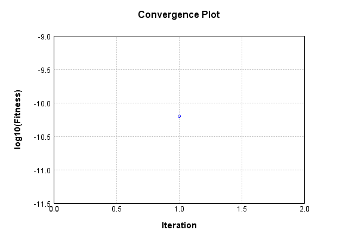


Code from [LearningTester.java:99](../../../../../../../src/main/java/com/simiacryptus/mindseye/test/unit/LearningTester.java#L99) executed in 0.00 seconds: 
```java
    return TestUtil.compareTime(runs);
```

Returns: 

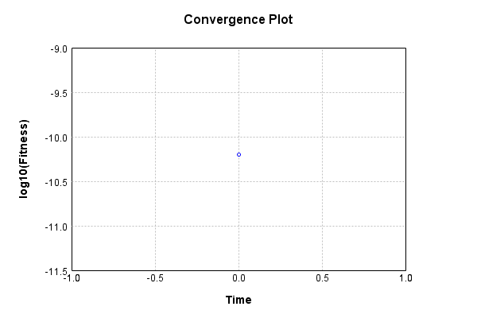


### Composite Learning
In this test, attempt to train a network to emulate a randomized network given an example input/output. The target state is:

Code from [LearningTester.java:219](../../../../../../../src/main/java/com/simiacryptus/mindseye/test/unit/LearningTester.java#L219) executed in 0.00 seconds: 
```java
    return network_target.state().stream().map(Arrays::toString).reduce((a, b) -> a + "\n" + b).orElse("");
```

Returns: 

```
    [0.06720000000000001, -0.06860000000000001, -0.0862, -0.0014000000000000002, 0.09060000000000001, -0.098, -0.015600000000000001, -0.0702, -0.025400000000000002]
    [0.0]
    [-0.06280000000000001, -0.037, -0.033, -0.0536, 0.009800000000000001, 0.06760000000000001, -0.0682, -0.035, -0.09880000000000001]
    [0.0, 0.0]
    [0.0]
    [0.0]
    [-0.0316, 0.0052, -0.0884, -0.05940000000000001, 0.0024000000000000002, 0.002, -0.0994, -0.0864, 0.029200000000000004, 0.09280000000000001, -0.062200000000000005, -0.0922, -0.063, 0.08080000000000001, -0.007, 0.055600000000000004, -0.0632, 0.09440000000000001, 0.023200000000000002, 0.06720000000000001, -0.097, 0.08480000000000001, 0.0364, 0.04340000000000001, -0.08220000000000001, 0.0218, -0.06080000000000001, -0.0204, -0.016800000000000002, -0.0026, 0.022, -0.0692, 0.0546, -0.089, 0.0752, 0.012, -0.051, 0.011600000000000001, -0.0644, -0.0058000000000000005, 0.0178, 0.017, 0.028, -0.037, -0.023600000000000003, 6.000000000000001E-4, -0.0656, 0.055400000000000005, 0.09580000000000001, 0.06380000000000001, 0.0546, 0.055200000000000006, -0.0012000000000000001, -0.074]
    [-0.042800000000000005, 0.08120000000000001, -0.084, -0.05, -0.0854, 0.08280000000000001, 0.0966, -0.09820000000000001, 0.022, 0.040600000000000004, 0.05380000000000001, 0.078, -0.06620000000000001, 0.0436, 0.039, -0.0816, -0.009200000000000002, 0.07840000000000001]
```


We simultaneously regress this target input:

Code from [LearningTester.java:223](../../../../../../../src/main/java/com/simiacryptus/mindseye/test/unit/LearningTester.java#L223) executed in 0.00 seconds: 
```java
    return Arrays.stream(testInput).map(x -> x.prettyPrint()).reduce((a, b) -> a + "\n" + b).orElse("");
```

Returns: 

```
    [
    	[ [ 0.0824, -0.0692, -0.045200000000000004 ], [ 0.0072, -0.0064, 0.0094 ], [ -0.028200000000000003, 0.0108, 0.07479999999999999 ], [ 0.0762, -0.055200000000000006, 0.049 ], [ -0.029, 0.003, -0.0956 ] ],
    	[ [ 0.02, 0.0994, 0.0078000000000000005 ], [ 0.046, 0.0576, -0.048600000000000004 ], [ -0.039400000000000004, -0.0248, -0.088 ], [ -0.0342, -0.026200000000000005, 0.002 ], [ -0.0328, 0.06720000000000001, -0.08460000000000001 ] ],
    	[ [ 0.0362, 0.035800000000000005, -0.0234 ], [ 0.048400000000000006, 0.029200000000000004, -0.0864 ], [ 0.0782, 0.015, -0.0512 ], [ 0.09540000000000001, 0.0426, 0.0718 ], [ -0.0432, 0.027200000000000002, 0.0658 ] ],
    	[ [ -0.07479999999999999, -0.0072, 0.075 ], [ 0.0124, -0.0826, 0.0772 ], [ -0.046400000000000004, 0.038200000000000005, -0.07780000000000001 ], [ -0.0034000000000000002, -0.0536, 0.007600000000000001 ], [ 0.0614, -0.082, 0.001 ] ],
    	[ [ 0.007, -0.0122, 0.0208 ], [ -0.023, -0.08660000000000001, -0.0704 ], [ -0.078, -0.0506, -0.07940000000000001 ], [ -0.04340000000000001, -0.014600000000000002, -0.021400000000000002 ], [ 0.06760000000000001, -0.08660000000000001, -0.057 ] ]
    ]
```


Which produces the following output:

Code from [LearningTester.java:230](../../../../../../../src/main/java/com/simiacryptus/mindseye/test/unit/LearningTester.java#L230) executed in 0.00 seconds: 
```java
    return Stream.of(targetOutput).map(x -> x.prettyPrint()).reduce((a, b) -> a + "\n" + b).orElse("");
```

Returns: 

```
    [
    	[ [ 0.0 ], [ 0.0 ], [ 0.0 ], [ 0.0 ], [ 0.0 ] ],
    	[ [ 0.0 ], [ 0.0 ], [ 1.990219090310199E-7 ], [ 0.0 ], [ 0.0 ] ],
    	[ [ 2.024072315229433E-6 ], [ 0.0 ], [ 0.0 ], [ 0.0 ], [ 0.0 ] ],
    	[ [ 1.640067433397407E-5 ], [ 0.0 ], [ 0.0 ], [ 0.0 ], [ 0.0 ] ],
    	[ [ 6.228247637360001E-7 ], [ 0.0 ], [ 2.4155422431444498E-5 ], [ 0.0 ], [ 0.0 ] ]
    ]
```


First, we use a conjugate gradient descent method, which converges the fastest for purely linear functions.

Code from [LearningTester.java:300](../../../../../../../src/main/java/com/simiacryptus/mindseye/test/unit/LearningTester.java#L300) executed in 0.20 seconds: 
```java
    return new IterativeTrainer(trainable)
      .setLineSearchFactory(label -> new QuadraticSearch())
      .setOrientation(new GradientDescent())
      .setMonitor(monitor)
      .setTimeout(30, TimeUnit.SECONDS)
      .setMaxIterations(250)
      .setTerminateThreshold(0)
      .run();
```
Logging: 
```
    Low gradient: 1.3099844593990565E-6
    Constructing line search parameters: GD
    F(0.0) = LineSearchPoint{point=PointSample{avg=4.2880169407031034E-11}, derivative=-1.7160592838670384E-12}
    New Minimum: 4.2880169407031034E-11 > 4.2880169406859427E-11
    F(1.0E-10) = LineSearchPoint{point=PointSample{avg=4.2880169406859427E-11}, derivative=-1.7160592838395817E-12}, delta = -1.716076653620754E-22
    New Minimum: 4.2880169406859427E-11 > 4.288016940582979E-11
    F(7.000000000000001E-10) = LineSearchPoint{point=PointSample{avg=4.288016940582979E-11}, derivative=-1.7160592836748372E-12}, delta = -1.2012471951859922E-21
    New Minimum: 4.288016940582979E-11 > 4.288016939862234E-11
    F(4.900000000000001E-9) = LineSearchPoint{point=PointSample{avg=4.288016939862234E-11}, derivative=-1.7160592825216327E-12}, delta = -8.408691592210732E-21
    New Minimum: 4.288016939862234E-11 > 4.28801693481702E-11
    F(3.430000000000001E-8) = LineSearchPoint{point=PointSample{avg=4.28801693481702E-11}, derivative=-1.7160592744491983E-12}, delta = -5
```
...[skipping 1827 bytes](etc/23.txt)...
```
    41287201) = LineSearchPoint{point=PointSample{avg=4.076793726688904E-11}, derivative=-1.3360154393433433E-12}, delta = -2.112232140141995E-12
    Loops = 12
    New Minimum: 4.076793726688904E-11 > 3.5980215847455465E-11
    F(6.249928723806798) = LineSearchPoint{point=PointSample{avg=3.5980215847455465E-11}, derivative=-6.833872514747171E-13}, delta = -6.8999535595755695E-12
    Right bracket at 6.249928723806798
    New Minimum: 3.5980215847455465E-11 > 3.4279637623779324E-11
    F(11.345059079145088) = LineSearchPoint{point=PointSample{avg=3.4279637623779324E-11}, derivative=0.0}, delta = -8.60053178325171E-12
    Right bracket at 11.345059079145088
    Converged to right
    Iteration 1 complete. Error: 3.4279637623779324E-11 Total: 250903406896012.7800; Orientation: 0.0001; Line Search: 0.1657
    Zero gradient: 0.0
    F(0.0) = LineSearchPoint{point=PointSample{avg=3.4279637623779324E-11}, derivative=0.0}
    Iteration 2 failed, aborting. Error: 3.4279637623779324E-11 Total: 250903423989585.6000; Orientation: 0.0001; Line Search: 0.0084
    
```

Returns: 

```
    3.4279637623779324E-11
```


Training Converged

Next, we run the same optimization using L-BFGS, which is nearly ideal for purely second-order or quadratic functions.

Code from [LearningTester.java:324](../../../../../../../src/main/java/com/simiacryptus/mindseye/test/unit/LearningTester.java#L324) executed in 0.14 seconds: 
```java
    return new IterativeTrainer(trainable)
      .setLineSearchFactory(label -> new ArmijoWolfeSearch())
      .setOrientation(new LBFGS())
      .setMonitor(monitor)
      .setTimeout(30, TimeUnit.SECONDS)
      .setMaxIterations(250)
      .setTerminateThreshold(0)
      .run();
```
Logging: 
```
    LBFGS Accumulation History: 1 points
    Constructing line search parameters: GD
    th(0)=4.2880169407031034E-11;dx=-1.7160592838670384E-12
    New Minimum: 4.2880169407031034E-11 > 3.9820258351555164E-11
    END: th(2.154434690031884)=3.9820258351555164E-11; dx=-1.1245105135268029E-12 delta=3.05991105547587E-12
    Iteration 1 complete. Error: 3.9820258351555164E-11 Total: 250903460703636.5600; Orientation: 0.0003; Line Search: 0.0169
    LBFGS Accumulation History: 1 points
    th(0)=3.9820258351555164E-11;dx=-7.36883652900449E-13
    New Minimum: 3.9820258351555164E-11 > 3.6776701691940243E-11
    END: th(4.641588833612779)=3.6776701691940243E-11; dx=-5.426460739457825E-13 delta=3.043556659614921E-12
    Iteration 2 complete. Error: 3.6776701691940243E-11 Total: 250903487422070.5300; Orientation: 0.0003; Line Search: 0.0177
    LBFGS Accumulation History: 1 points
    th(0)=3.6776701691940243E-11;dx=-3.9960923148095925E-13
    New Minimum: 3.6776701691940243E-11 > 3.4379362287826336E-11
    END: th(10.000000000000002)=3.4379362287826336E-11; dx=-7.985864934916785E-14 delta=2.397339404113907E-12
    Iteration 3 complete. Error: 3.4379362287826336E-11 Total: 250903512630404.5000; Orientation: 0.0002; Line Search: 0.0168
    LBFGS Accumulation History: 1 points
    th(0)=3.4379362287826336E-11;dx=-1.5959100474828045E-14
    New Minimum: 3.4379362287826336E-11 > 3.4279637623779324E-11
    END: th(21.544346900318843)=3.4279637623779324E-11; dx=0.0 delta=9.97246640470125E-14
    Iteration 4 complete. Error: 3.4279637623779324E-11 Total: 250903537242847.5000; Orientation: 0.0002; Line Search: 0.0162
    LBFGS Accumulation History: 1 points
    th(0)=3.4279637623779324E-11;dx=0.0 (ERROR: Starting derivative negative)
    Iteration 5 failed, aborting. Error: 3.4279637623779324E-11 Total: 250903562158508.4700; Orientation: 0.0002; Line Search: 0.0169
    
```

Returns: 

```
    3.4279637623779324E-11
```


Training Converged

Code from [LearningTester.java:96](../../../../../../../src/main/java/com/simiacryptus/mindseye/test/unit/LearningTester.java#L96) executed in 0.00 seconds: 
```java
    return TestUtil.compare(runs);
```

Returns: 

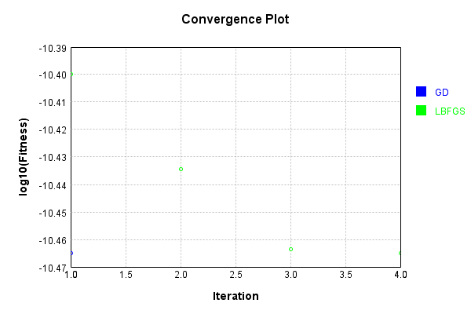


Code from [LearningTester.java:99](../../../../../../../src/main/java/com/simiacryptus/mindseye/test/unit/LearningTester.java#L99) executed in 0.00 seconds: 
```java
    return TestUtil.compareTime(runs);
```

Returns: 

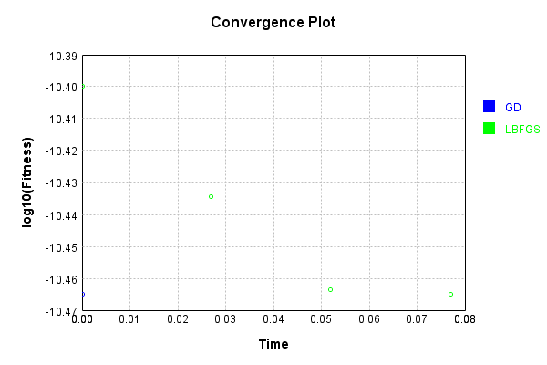


