# SigmoidPipeline
This is a network with the following layout:

Code from [NLayerTest.java:87](../../../../../../../src/test/java/com/simiacryptus/mindseye/network/NLayerTest.java#L87) executed in 0.18 seconds: 
```java
    return Graphviz.fromGraph(TestUtil.toGraph((DAGNetwork) layer))
      .height(400).width(600).render(Format.PNG).toImage();
```

Returns: 

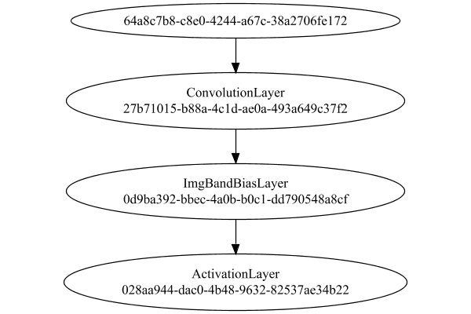


### Json Serialization
Code from [JsonTest.java:36](../../../../../../../src/main/java/com/simiacryptus/mindseye/test/unit/JsonTest.java#L36) executed in 0.00 seconds: 
```java
    JsonObject json = layer.getJson();
    NNLayer echo = NNLayer.fromJson(json);
    if ((echo == null)) throw new AssertionError("Failed to deserialize");
    if ((layer == echo)) throw new AssertionError("Serialization did not copy");
    if ((!layer.equals(echo))) throw new AssertionError("Serialization not equal");
    return new GsonBuilder().setPrettyPrinting().create().toJson(json);
```

Returns: 

```
    {
      "class": "com.simiacryptus.mindseye.network.PipelineNetwork",
      "id": "13411ec2-9cf2-4caa-8807-9ff7b9f5ca5d",
      "isFrozen": false,
      "name": "PipelineNetwork/13411ec2-9cf2-4caa-8807-9ff7b9f5ca5d",
      "inputs": [
        "64a8c7b8-c8e0-4244-a67c-38a2706fe172"
      ],
      "nodes": {
        "46a509cf-20a2-4f24-aadb-ef98a20dd3f1": "27b71015-b88a-4c1d-ae0a-493a649c37f2",
        "2e4247f2-21d3-47c3-a8cc-54637fff9d18": "0d9ba392-bbec-4a0b-b0c1-dd790548a8cf",
        "9547bca7-e52c-4715-82a8-149b088ca951": "028aa944-dac0-4b48-9632-82537ae34b22"
      },
      "layers": {
        "27b71015-b88a-4c1d-ae0a-493a649c37f2": {
          "class": "com.simiacryptus.mindseye.layers.cudnn.ConvolutionLayer",
          "id": "27b71015-b88a-4c1d-ae0a-493a649c37f2",
          "isFrozen": false,
          "name": "ConvolutionLayer/27b71015-b88a-4c1d-ae0a-493a649c37f2",
          "filter": [
            [
              [
                -0.0692,
                -0.027200000000000002,
                -0.0034000000000000002
              ],
              [
                0.059800000000000006,
                0.015600
```
...[skipping 2906 bytes](etc/24.txt)...
```
    ": {
          "class": "com.simiacryptus.mindseye.layers.cudnn.ImgBandBiasLayer",
          "id": "0d9ba392-bbec-4a0b-b0c1-dd790548a8cf",
          "isFrozen": false,
          "name": "ImgBandBiasLayer/0d9ba392-bbec-4a0b-b0c1-dd790548a8cf",
          "bias": [
            0.0,
            0.0,
            0.0
          ],
          "precision": "Double"
        },
        "028aa944-dac0-4b48-9632-82537ae34b22": {
          "class": "com.simiacryptus.mindseye.layers.cudnn.ActivationLayer",
          "id": "028aa944-dac0-4b48-9632-82537ae34b22",
          "isFrozen": false,
          "name": "ActivationLayer/028aa944-dac0-4b48-9632-82537ae34b22",
          "mode": 0,
          "precision": "Double"
        }
      },
      "links": {
        "46a509cf-20a2-4f24-aadb-ef98a20dd3f1": [
          "64a8c7b8-c8e0-4244-a67c-38a2706fe172"
        ],
        "2e4247f2-21d3-47c3-a8cc-54637fff9d18": [
          "46a509cf-20a2-4f24-aadb-ef98a20dd3f1"
        ],
        "9547bca7-e52c-4715-82a8-149b088ca951": [
          "2e4247f2-21d3-47c3-a8cc-54637fff9d18"
        ]
      },
      "labels": {},
      "head": "9547bca7-e52c-4715-82a8-149b088ca951"
    }
```


### Input Learning
In this test, we use a network to learn this target input, given it's pre-evaluated output:

Code from [LearningTester.java:127](../../../../../../../src/main/java/com/simiacryptus/mindseye/test/unit/LearningTester.java#L127) executed in 0.00 seconds: 
```java
    return Arrays.stream(input_target).map(x -> x.prettyPrint()).reduce((a, b) -> a + "\n" + b).orElse("");
```

Returns: 

```
    [
    	[ [ -0.0346, -0.049, 0.035800000000000005 ], [ 0.09580000000000001, -0.013200000000000002, -0.013800000000000002 ], [ 0.0078000000000000005, 0.0352, 0.050800000000000005 ], [ -0.0704, -0.0108, -0.0616 ], [ -0.0576, 0.018600000000000002, 0.057 ] ],
    	[ [ -0.068, 0.092, -0.026400000000000003 ], [ -0.0974, 0.046400000000000004, -0.07440000000000001 ], [ -0.058800000000000005, 0.015200000000000002, 0.05940000000000001 ], [ 0.0614, -0.052, -0.0826 ], [ -0.060200000000000004, 0.071, -0.017400000000000002 ] ],
    	[ [ 0.0114, 0.083, -0.046400000000000004 ], [ 0.0664, -0.0568, -0.09440000000000001 ], [ -0.086, 0.0028000000000000004, -0.076 ], [ 0.0592, -0.029400000000000003, -0.0966 ], [ 0.046, -0.065, 0.0108 ] ],
    	[ [ 0.0416, 0.08660000000000001, 0.015200000000000002 ], [ 0.06, 0.0586, 0.0182 ], [ -0.0476, -0.0732, -0.0234 ], [ 0.0806, 0.0576, 0.0346 ], [ -0.006600000000000001, 0.07479999999999999, -0.08560000000000001 ] ],
    	[ [ -0.005600000000000001, -0.030400000000000003, -0.0892 ], [ 0.045, 4.0E-4, -0.09620000000000001 ], [ -0.087, 0.048, -0.09780000000000001 ], [ 0.098, 0.037399999999999996, -0.025400000000000002 ], [ 0.029400000000000003, -0.07, 0.09380000000000001 ] ]
    ]
```


First, we use a conjugate gradient descent method, which converges the fastest for purely linear functions.

Code from [LearningTester.java:300](../../../../../../../src/main/java/com/simiacryptus/mindseye/test/unit/LearningTester.java#L300) executed in 3.62 seconds: 
```java
    return new IterativeTrainer(trainable)
      .setLineSearchFactory(label -> new QuadraticSearch())
      .setOrientation(new GradientDescent())
      .setMonitor(monitor)
      .setTimeout(30, TimeUnit.SECONDS)
      .setMaxIterations(250)
      .setTerminateThreshold(0)
      .run();
```
Logging: 
```
    Constructing line search parameters: GD
    F(0.0) = LineSearchPoint{point=PointSample{avg=3.7991285029244154E-5}, derivative=-1.6186286667884058E-8}
    New Minimum: 3.7991285029244154E-5 > 3.799128502924264E-5
    F(1.0E-10) = LineSearchPoint{point=PointSample{avg=3.799128502924264E-5}, derivative=-1.618628666788367E-8}, delta = -1.5111067779016718E-18
    New Minimum: 3.799128502924264E-5 > 3.7991285029232905E-5
    F(7.000000000000001E-10) = LineSearchPoint{point=PointSample{avg=3.7991285029232905E-5}, derivative=-1.6186286667881242E-8}, delta = -1.1248597539537109E-17
    New Minimum: 3.7991285029232905E-5 > 3.799128502916481E-5
    F(4.900000000000001E-9) = LineSearchPoint{point=PointSample{avg=3.799128502916481E-5}, derivative=-1.6186286667864255E-8}, delta = -7.934327023520482E-17
    New Minimum: 3.799128502916481E-5 > 3.799128502868896E-5
    F(3.430000000000001E-8) = LineSearchPoint{point=PointSample{avg=3.799128502868896E-5}, derivative=-1.6186286667745552E-8}, delta = -5.551928274755147E-16
    New Minimum: 3.799128502868896E
```
...[skipping 294703 bytes](etc/25.txt)...
```
    93471824E-25}, delta = -2.807798930041449E-13
    Right bracket at 5295.87812093234
    Converged to right
    Iteration 249 complete. Error: 3.6202278494855875E-11 Total: 250907514721286.5000; Orientation: 0.0000; Line Search: 0.0154
    Low gradient: 1.2123908203552326E-8
    F(0.0) = LineSearchPoint{point=PointSample{avg=3.6202278494855875E-11}, derivative=-1.4698915012816338E-16}
    New Minimum: 3.6202278494855875E-11 > 3.59708712620808E-11
    F(5295.87812093234) = LineSearchPoint{point=PointSample{avg=3.59708712620808E-11}, derivative=5.95977023746504E-17}, delta = -2.314072327750738E-13
    3.59708712620808E-11 <= 3.6202278494855875E-11
    New Minimum: 3.59708712620808E-11 > 3.5925344754826116E-11
    F(3768.0840515616883) = LineSearchPoint{point=PointSample{avg=3.5925344754826116E-11}, derivative=-1.10239581613891E-24}, delta = -2.769337400297597E-13
    Left bracket at 3768.0840515616883
    Converged to left
    Iteration 250 complete. Error: 3.5925344754826116E-11 Total: 250907522172331.5000; Orientation: 0.0000; Line Search: 0.0059
    
```

Returns: 

```
    3.5925344754826116E-11
```


Training Converged

Next, we run the same optimization using L-BFGS, which is nearly ideal for purely second-order or quadratic functions.

Code from [LearningTester.java:324](../../../../../../../src/main/java/com/simiacryptus/mindseye/test/unit/LearningTester.java#L324) executed in 0.04 seconds: 
```java
    return new IterativeTrainer(trainable)
      .setLineSearchFactory(label -> new ArmijoWolfeSearch())
      .setOrientation(new LBFGS())
      .setMonitor(monitor)
      .setTimeout(30, TimeUnit.SECONDS)
      .setMaxIterations(250)
      .setTerminateThreshold(0)
      .run();
```
Logging: 
```
    LBFGS Accumulation History: 1 points
    Constructing line search parameters: GD
    th(0)=3.7991285029244154E-5;dx=-1.6186286667884058E-8
    New Minimum: 3.7991285029244154E-5 > 3.795642210286121E-5
    WOLFE (weak): th(2.154434690031884)=3.795642210286121E-5; dx=-1.6177587291936316E-8 delta=3.486292638294429E-8
    New Minimum: 3.795642210286121E-5 > 3.7921577918724755E-5
    WOLFE (weak): th(4.308869380063768)=3.7921577918724755E-5; dx=-1.616888790741565E-8 delta=6.970711051939817E-8
    New Minimum: 3.7921577918724755E-5 > 3.77823886050138E-5
    WOLFE (weak): th(12.926608140191302)=3.77823886050138E-5; dx=-1.6134090283764885E-8 delta=2.088964242303527E-7
    New Minimum: 3.77823886050138E-5 > 3.7159747693284586E-5
    WOLFE (weak): th(51.70643256076521)=3.7159747693284586E-5; dx=-1.5977499295286957E-8 delta=8.315373359595672E-7
    New Minimum: 3.7159747693284586E-5 > 3.394155854608291E-5
    WOLFE (weak): th(258.53216280382605)=3.394155854608291E-5; dx=-1.514230260108136E-8 delta=4.049726483161241E-6
    New Minimum: 3.394155854608291E-5 > 
```
...[skipping 752 bytes](etc/26.txt)...
```
    > 1.497242751147328E-6
    WOLF (strong): th(7200.000000000001)=1.497242751147328E-6; dx=1.2498792640180624E-10 delta=2.62350536378938E-6
    END: th(3600.0000000000005)=1.9281210852067E-6; dx=-3.643719822335143E-10 delta=2.1926270297300082E-6
    Iteration 3 complete. Error: 1.497242751147328E-6 Total: 250907552413098.4700; Orientation: 0.0001; Line Search: 0.0048
    LBFGS Accumulation History: 1 points
    th(0)=1.9281210852067E-6;dx=-2.448023789819146E-10
    New Minimum: 1.9281210852067E-6 > 8.265256114390998E-7
    END: th(7755.964884114783)=8.265256114390998E-7; dx=-3.926563844376928E-11 delta=1.1015954737676005E-6
    Iteration 4 complete. Error: 8.265256114390998E-7 Total: 250907556963918.4400; Orientation: 0.0001; Line Search: 0.0030
    LBFGS Accumulation History: 1 points
    th(0)=8.265256114390998E-7;dx=-1.2790537243239524E-10
    MAX ALPHA: th(0)=8.265256114390998E-7;th'(0)=-1.2790537243239524E-10;
    Iteration 5 failed, aborting. Error: 8.265256114390998E-7 Total: 250907561752410.4400; Orientation: 0.0001; Line Search: 0.0031
    
```

Returns: 

```
    8.265256114390998E-7
```


Training Converged

Code from [LearningTester.java:96](../../../../../../../src/main/java/com/simiacryptus/mindseye/test/unit/LearningTester.java#L96) executed in 0.00 seconds: 
```java
    return TestUtil.compare(runs);
```

Returns: 

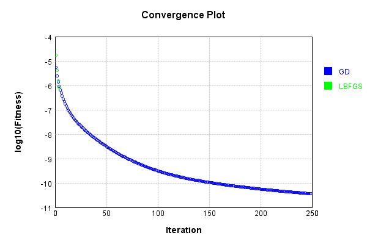


Code from [LearningTester.java:99](../../../../../../../src/main/java/com/simiacryptus/mindseye/test/unit/LearningTester.java#L99) executed in 0.00 seconds: 
```java
    return TestUtil.compareTime(runs);
```

Returns: 

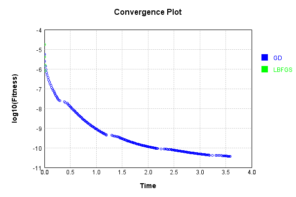


### Model Learning
In this test, attempt to train a network to emulate a randomized network given an example input/output. The target state is:

Code from [LearningTester.java:176](../../../../../../../src/main/java/com/simiacryptus/mindseye/test/unit/LearningTester.java#L176) executed in 0.00 seconds: 
```java
    return network_target.state().stream().map(Arrays::toString).reduce((a, b) -> a + "\n" + b).orElse("");
```

Returns: 

```
    [0.0, 0.0, 0.0]
    [0.09780000000000001, 0.0882, -0.0548, -0.0742, 0.0722, -0.029200000000000004, -0.021200000000000004, -0.0142, -0.048400000000000006, -0.0826, 0.0328, 0.0204, -0.08, -0.0872, 0.08880000000000002, 0.022400000000000003, -0.08280000000000001, -0.08460000000000001, -0.025400000000000002, 0.025400000000000002, 0.055200000000000006, -0.09, -0.0974, 0.011, -0.08960000000000001, 0.015600000000000001, 0.055600000000000004, -0.08960000000000001, 0.0936, -0.07460000000000001, -0.009, -0.031, 0.051800000000000006, 0.0526, -0.0976, -0.0692, 0.07660000000000002, 0.0536, 0.0502, -0.09960000000000001, 0.04240000000000001, -0.0714, -0.0376, -0.0044, -0.0492, 0.085, 0.071, -0.06720000000000001, -0.0188, -0.042800000000000005, -0.027200000000000002, -0.049800000000000004, -0.0034000000000000002, 0.0412, 0.017400000000000002, -0.055400000000000005, -0.0586, -0.06380000000000001, 0.045, -0.0932, 0.062, -0.0024000000000000002, 0.0038000000000000004, -0.0742, -0.08020000000000001, 0.0516, 0.055, -0.07560000000000001, -0.0386, 0.021200000000000004, -0.069, 0.059800000000000006, -0.0772, -0.08480000000000001, -0.078, -0.0834, 0.055, 0.0722, -0.0804, -0.0124, -0.013200000000000002]
```


First, we use a conjugate gradient descent method, which converges the fastest for purely linear functions.

Code from [LearningTester.java:300](../../../../../../../src/main/java/com/simiacryptus/mindseye/test/unit/LearningTester.java#L300) executed in 5.77 seconds: 
```java
    return new IterativeTrainer(trainable)
      .setLineSearchFactory(label -> new QuadraticSearch())
      .setOrientation(new GradientDescent())
      .setMonitor(monitor)
      .setTimeout(30, TimeUnit.SECONDS)
      .setMaxIterations(250)
      .setTerminateThreshold(0)
      .run();
```
Logging: 
```
    Constructing line search parameters: GD
    F(0.0) = LineSearchPoint{point=PointSample{avg=3.144614598526245E-5}, derivative=-1.6513305152613857E-7}
    New Minimum: 3.144614598526245E-5 > 3.144614598524597E-5
    F(1.0E-10) = LineSearchPoint{point=PointSample{avg=3.144614598524597E-5}, derivative=-1.6513305152550244E-7}, delta = -1.6479873021779667E-17
    New Minimum: 3.144614598524597E-5 > 3.144614598514685E-5
    F(7.000000000000001E-10) = LineSearchPoint{point=PointSample{avg=3.144614598514685E-5}, derivative=-1.6513305152168217E-7}, delta = -1.1559628037768888E-16
    New Minimum: 3.144614598514685E-5 > 3.144614598445329E-5
    F(4.900000000000001E-9) = LineSearchPoint{point=PointSample{avg=3.144614598445329E-5}, derivative=-1.651330514949415E-7}, delta = -8.091604101166661E-16
    New Minimum: 3.144614598445329E-5 > 3.144614597959841E-5
    F(3.430000000000001E-8) = LineSearchPoint{point=PointSample{avg=3.144614597959841E-5}, derivative=-1.6513305130775425E-7}, delta = -5.664041555653726E-15
    New Minimum: 3.144614597959841E-5 > 
```
...[skipping 431338 bytes](etc/27.txt)...
```
    -7}, derivative=-1.209395100264809E-11}, delta = -1.4785551874122699E-9
    F(686.5566912594857) = LineSearchPoint{point=PointSample{avg=4.3505929004790654E-7}, derivative=2.367941600409245E-11}, delta = 1.9303353548621395E-9
    F(52.81205317380659) = LineSearchPoint{point=PointSample{avg=4.322601455699186E-7}, derivative=-1.4845747985970956E-11}, delta = -8.688091231258223E-10
    New Minimum: 4.3084849757885837E-7 > 4.3060782822618027E-7
    F(369.6843722166461) = LineSearchPoint{point=PointSample{avg=4.3060782822618027E-7}, derivative=4.41683307987013E-12}, delta = -2.521126466864133E-9
    4.3060782822618027E-7 <= 4.331289546930444E-7
    New Minimum: 4.3060782822618027E-7 > 4.3044737008239246E-7
    F(297.0268103790891) = LineSearchPoint{point=PointSample{avg=4.3044737008239246E-7}, derivative=-4.609803979919946E-19}, delta = -2.681584610651936E-9
    Left bracket at 297.0268103790891
    Converged to left
    Iteration 250 complete. Error: 4.3044737008239246E-7 Total: 250913448855935.5600; Orientation: 0.0000; Line Search: 0.0176
    
```

Returns: 

```
    4.3044737008239246E-7
```


Training Converged

Next, we run the same optimization using L-BFGS, which is nearly ideal for purely second-order or quadratic functions.

Code from [LearningTester.java:324](../../../../../../../src/main/java/com/simiacryptus/mindseye/test/unit/LearningTester.java#L324) executed in 1.19 seconds: 
```java
    return new IterativeTrainer(trainable)
      .setLineSearchFactory(label -> new ArmijoWolfeSearch())
      .setOrientation(new LBFGS())
      .setMonitor(monitor)
      .setTimeout(30, TimeUnit.SECONDS)
      .setMaxIterations(250)
      .setTerminateThreshold(0)
      .run();
```
Logging: 
```
    LBFGS Accumulation History: 1 points
    Constructing line search parameters: GD
    th(0)=3.995182317000686E-5;dx=-3.043965470545239E-8
    New Minimum: 3.995182317000686E-5 > 3.988732626305342E-5
    WOLFE (weak): th(2.154434690031884)=3.988732626305342E-5; dx=-2.943396962760381E-8 delta=6.449690695344186E-8
    New Minimum: 3.988732626305342E-5 > 3.982499604077781E-5
    WOLFE (weak): th(4.308869380063768)=3.982499604077781E-5; dx=-2.8428282832801244E-8 delta=1.268271292290528E-7
    New Minimum: 3.982499604077781E-5 > 3.959734206961723E-5
    END: th(12.926608140191302)=3.959734206961723E-5; dx=-2.4405519530607543E-8 delta=3.5448110038963283E-7
    Iteration 1 complete. Error: 3.959734206961723E-5 Total: 250913466449646.5300; Orientation: 0.0001; Line Search: 0.0070
    LBFGS Accumulation History: 1 points
    th(0)=3.959734206961723E-5;dx=-2.159127068133523E-8
    New Minimum: 3.959734206961723E-5 > 3.9036010785725656E-5
    END: th(27.849533001676672)=3.9036010785725656E-5; dx=-1.8720441069607093E-8 delta=5.613312838915717E-7
    Iteration 2 co
```
...[skipping 67970 bytes](etc/28.txt)...
```
     (weak): th(104.55587262216346)=7.064750340495482E-7; dx=-5.7149355476644844E-11 delta=5.99664743805954E-9
    New Minimum: 7.064750340495482E-7 > 6.946098193934504E-7
    WOLFE (weak): th(313.6676178664904)=6.946098193934504E-7; dx=-5.6332693543547455E-11 delta=1.7861862094157354E-8
    New Minimum: 6.946098193934504E-7 > 6.433296752045225E-7
    WOLFE (weak): th(1254.6704714659616)=6.433296752045225E-7; dx=-5.2657719364982347E-11 delta=6.914200628308531E-8
    New Minimum: 6.433296752045225E-7 > 4.28239811286345E-7
    END: th(6273.352357329808)=4.28239811286345E-7; dx=-3.305800540173946E-11 delta=2.8423187020126276E-7
    Iteration 115 complete. Error: 4.28239811286345E-7 Total: 250914643658327.3800; Orientation: 0.0001; Line Search: 0.0110
    LBFGS Accumulation History: 1 points
    th(0)=4.28239811286345E-7;dx=-7.234191765007209E-10
    MAX ALPHA: th(0)=4.28239811286345E-7;th'(0)=-7.234191765007209E-10;
    Iteration 116 failed, aborting. Error: 4.28239811286345E-7 Total: 250914648954080.3400; Orientation: 0.0001; Line Search: 0.0035
    
```

Returns: 

```
    4.28239811286345E-7
```


Training Converged

Code from [LearningTester.java:96](../../../../../../../src/main/java/com/simiacryptus/mindseye/test/unit/LearningTester.java#L96) executed in 0.00 seconds: 
```java
    return TestUtil.compare(runs);
```

Returns: 

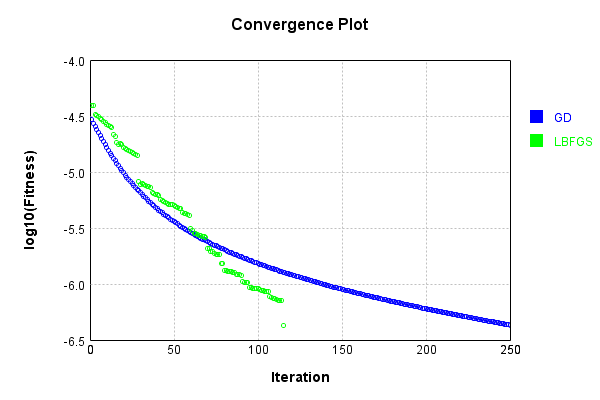


Code from [LearningTester.java:99](../../../../../../../src/main/java/com/simiacryptus/mindseye/test/unit/LearningTester.java#L99) executed in 0.00 seconds: 
```java
    return TestUtil.compareTime(runs);
```

Returns: 

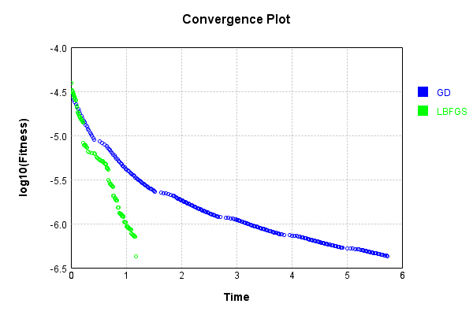


### Composite Learning
In this test, attempt to train a network to emulate a randomized network given an example input/output. The target state is:

Code from [LearningTester.java:219](../../../../../../../src/main/java/com/simiacryptus/mindseye/test/unit/LearningTester.java#L219) executed in 0.00 seconds: 
```java
    return network_target.state().stream().map(Arrays::toString).reduce((a, b) -> a + "\n" + b).orElse("");
```

Returns: 

```
    [0.0, 0.0, 0.0]
    [0.04240000000000001, -0.048400000000000006, -0.0586, -0.0024000000000000002, 0.0328, 0.0536, -0.0044, -0.078, 0.055200000000000006, -0.0376, 0.011, -0.0692, 0.022400000000000003, 0.0882, -0.0826, -0.0386, -0.021200000000000004, 0.08880000000000002, -0.0548, -0.0714, -0.029200000000000004, 0.017400000000000002, 0.0936, -0.08960000000000001, -0.0492, 0.045, -0.0124, -0.0742, -0.0142, -0.025400000000000002, -0.0834, -0.031, 0.051800000000000006, 0.055, -0.0188, 0.0722, 0.0526, 0.0204, -0.06380000000000001, 0.055600000000000004, 0.059800000000000006, -0.0976, 0.071, -0.08020000000000001, -0.0974, 0.062, -0.0872, -0.08, 0.025400000000000002, -0.049800000000000004, -0.09960000000000001, -0.08960000000000001, -0.09, 0.0516, 0.0722, -0.0742, 0.0502, -0.08280000000000001, -0.0804, -0.07460000000000001, -0.0932, 0.021200000000000004, -0.08460000000000001, -0.07560000000000001, 0.09780000000000001, 0.0038000000000000004, 0.055, -0.069, -0.027200000000000002, 0.07660000000000002, 0.015600000000000001, -0.0772, 0.0412, -0.0034000000000000002, -0.06720000000000001, -0.042800000000000005, -0.08480000000000001, -0.013200000000000002, 0.085, -0.055400000000000005, -0.009]
```


We simultaneously regress this target input:

Code from [LearningTester.java:223](../../../../../../../src/main/java/com/simiacryptus/mindseye/test/unit/LearningTester.java#L223) executed in 0.00 seconds: 
```java
    return Arrays.stream(testInput).map(x -> x.prettyPrint()).reduce((a, b) -> a + "\n" + b).orElse("");
```

Returns: 

```
    [
    	[ [ -0.0346, 0.037399999999999996, 0.0108 ], [ 0.092, 0.0416, -0.07 ], [ 0.018600000000000002, -0.065, -0.076 ], [ 0.09580000000000001, 0.0592, 0.09380000000000001 ], [ -0.0108, -0.086, 0.0182 ] ],
    	[ [ 0.083, 0.029400000000000003, -0.0826 ], [ 0.08660000000000001, -0.09780000000000001, -0.029400000000000003 ], [ 0.045, -0.0616, -0.08560000000000001 ], [ -0.005600000000000001, 0.0806, -0.0732 ], [ -0.0704, -0.087, 0.048 ] ],
    	[ [ 0.0614, -0.09620000000000001, 0.0078000000000000005 ], [ 0.015200000000000002, -0.049, -0.0476 ], [ 0.0576, 0.0664, 0.07479999999999999 ], [ -0.013200000000000002, -0.0892, -0.07440000000000001 ], [ -0.006600000000000001, -0.060200000000000004, 0.057 ] ],
    	[ [ 0.0028000000000000004, -0.068, -0.0234 ], [ -0.058800000000000005, -0.0576, 0.05940000000000001 ], [ 0.06, 0.050800000000000005, 0.0352 ], [ -0.052, -0.0974, -0.09440000000000001 ], [ 0.035800000000000005, -0.025400000000000002, 0.046 ] ],
    	[ [ -0.013800000000000002, 0.0114, 0.046400000000000004 ], [ -0.017400000000000002, 0.015200000000000002, -0.0568 ], [ 0.0346, -0.046400000000000004, -0.026400000000000003 ], [ -0.0966, 0.0586, 4.0E-4 ], [ -0.030400000000000003, 0.071, 0.098 ] ]
    ]
```


Which produces the following output:

Code from [LearningTester.java:230](../../../../../../../src/main/java/com/simiacryptus/mindseye/test/unit/LearningTester.java#L230) executed in 0.00 seconds: 
```java
    return Stream.of(targetOutput).map(x -> x.prettyPrint()).reduce((a, b) -> a + "\n" + b).orElse("");
```

Returns: 

```
    [
    	[ [ 0.502495459279669, 0.49655687442640883, 0.49443284007643223 ], [ 0.5087176464813535, 0.49844030505894854, 0.49707074351350744 ], [ 0.49611263832841396, 0.4995936000894952, 0.5026372055444223 ], [ 0.5007498294378829, 0.49779045438310804, 0.5046808532470665 ], [ 0.502245464903968, 0.495972787090225, 0.4942146682013087 ] ],
    	[ [ 0.501304877037562, 0.4993482603691149, 0.501533785189006 ], [ 0.5045139373615763, 0.48915494120669817, 0.5088760674274174 ], [ 0.5036682641835311, 0.5038310150286034, 0.5018269918688484 ], [ 0.506543776346792, 0.5024324108108527, 0.5027562520807685 ], [ 0.4978842526280075, 0.49254964147790176, 0.4996929800385868 ] ],
    	[ [ 0.5073993797661884, 0.4939950187428859, 0.5031607878948507 ], [ 0.5009028590187055, 0.5054681819787717, 0.5054867297525824 ], [ 0.4957138449932803, 0.5073476910097486, 0.5038275852297871 ], [ 0.5116228258163646, 0.5013451567546667, 0.49957183010466166 ], [ 0.49998295000000664, 0.4995605901131223, 0.5073993097815185 ] ],
    	[ [ 0.4970754833510833, 0.5041014080069125, 0.5057305390660636 ], [ 0.49713913122058834, 0.5022560846887645, 0.49440592342994927 ], [ 0.5051846241688154, 0.501143928004112, 0.5033772686373471 ], [ 0.5003651499350839, 0.49920500066994583, 0.5070100606377687 ], [ 0.4957996088157889, 0.5101517047144308, 0.5027630718730112 ] ],
    	[ [ 0.5016420440966844, 0.5014595358544204, 0.500869999121997 ], [ 0.49748312125848043, 0.5026324056777126, 0.4996464700589138 ], [ 0.49998771000000247, 0.4987299327316219, 0.5031364088616369 ], [ 0.49746407174484564, 0.5053949406229472, 0.5014774956994927 ], [ 0.49765486719676655, 0.5006461396403183, 0.49271269605352 ] ]
    ]
```


First, we use a conjugate gradient descent method, which converges the fastest for purely linear functions.

Code from [LearningTester.java:300](../../../../../../../src/main/java/com/simiacryptus/mindseye/test/unit/LearningTester.java#L300) executed in 4.38 seconds: 
```java
    return new IterativeTrainer(trainable)
      .setLineSearchFactory(label -> new QuadraticSearch())
      .setOrientation(new GradientDescent())
      .setMonitor(monitor)
      .setTimeout(30, TimeUnit.SECONDS)
      .setMaxIterations(250)
      .setTerminateThreshold(0)
      .run();
```
Logging: 
```
    Constructing line search parameters: GD
    F(0.0) = LineSearchPoint{point=PointSample{avg=3.597959889481925E-5}, derivative=-1.4680544472744705E-7}
    New Minimum: 3.597959889481925E-5 > 3.597959889480449E-5
    F(1.0E-10) = LineSearchPoint{point=PointSample{avg=3.597959889480449E-5}, derivative=-1.46805444726963E-7}, delta = -1.475870207295893E-17
    New Minimum: 3.597959889480449E-5 > 3.597959889471653E-5
    F(7.000000000000001E-10) = LineSearchPoint{point=PointSample{avg=3.597959889471653E-5}, derivative=-1.4680544472405757E-7}, delta = -1.0272137957942351E-16
    New Minimum: 3.597959889471653E-5 > 3.597959889409988E-5
    F(4.900000000000001E-9) = LineSearchPoint{point=PointSample{avg=3.597959889409988E-5}, derivative=-1.4680544470371375E-7}, delta = -7.193681414441322E-16
    New Minimum: 3.597959889409988E-5 > 3.597959888978382E-5
    F(3.430000000000001E-8) = LineSearchPoint{point=PointSample{avg=3.597959888978382E-5}, derivative=-1.468054445613121E-7}, delta = -5.0354279123102086E-15
    New Minimum: 3.597959888978382E-5 > 3.
```
...[skipping 280963 bytes](etc/29.txt)...
```
    255E-7}, derivative=-6.888688202574026E-11}, delta = -2.529863727091589E-9
    F(213.86573899641556) = LineSearchPoint{point=PointSample{avg=5.224773923498297E-7}, derivative=9.812799847173645E-11}, delta = 1.5018791721264589E-10
    F(16.451210692031967) = LineSearchPoint{point=PointSample{avg=5.208592955866029E-7}, derivative=-8.173392440549243E-11}, delta = -1.4679088460141328E-9
    New Minimum: 5.197973407055255E-7 > 5.172299242666906E-7
    F(115.15847484422378) = LineSearchPoint{point=PointSample{avg=5.172299242666906E-7}, derivative=8.196144726642986E-12}, delta = -5.097280165926494E-9
    5.172299242666906E-7 <= 5.223272044326171E-7
    New Minimum: 5.172299242666906E-7 > 5.171930579832065E-7
    F(106.16236949435397) = LineSearchPoint{point=PointSample{avg=5.171930579832065E-7}, derivative=-8.805807046917073E-17}, delta = -5.134146449410534E-9
    Left bracket at 106.16236949435397
    Converged to left
    Iteration 250 complete. Error: 5.171930579832065E-7 Total: 250919179205956.8400; Orientation: 0.0001; Line Search: 0.0133
    
```

Returns: 

```
    5.171930579832065E-7
```


Training Converged

Next, we run the same optimization using L-BFGS, which is nearly ideal for purely second-order or quadratic functions.

Code from [LearningTester.java:324](../../../../../../../src/main/java/com/simiacryptus/mindseye/test/unit/LearningTester.java#L324) executed in 2.74 seconds: 
```java
    return new IterativeTrainer(trainable)
      .setLineSearchFactory(label -> new ArmijoWolfeSearch())
      .setOrientation(new LBFGS())
      .setMonitor(monitor)
      .setTimeout(30, TimeUnit.SECONDS)
      .setMaxIterations(250)
      .setTerminateThreshold(0)
      .run();
```
Logging: 
```
    LBFGS Accumulation History: 1 points
    Constructing line search parameters: GD
    th(0)=3.597959889481925E-5;dx=-1.4680544472744705E-7
    New Minimum: 3.597959889481925E-5 > 3.5674557099244494E-5
    WOLFE (weak): th(2.154434690031884)=3.5674557099244494E-5; dx=-1.3637028230653978E-7 delta=3.050417955747573E-7
    New Minimum: 3.5674557099244494E-5 > 3.53919971207056E-5
    END: th(4.308869380063768)=3.53919971207056E-5; dx=-1.2593517604754083E-7 delta=5.876017741136532E-7
    Iteration 1 complete. Error: 3.53919971207056E-5 Total: 250919215314998.8000; Orientation: 0.0002; Line Search: 0.0143
    LBFGS Accumulation History: 1 points
    th(0)=3.53919971207056E-5;dx=-1.088059133940697E-7
    New Minimum: 3.53919971207056E-5 > 3.452255061658752E-5
    END: th(9.283177667225559)=3.452255061658752E-5; dx=-7.851089384474489E-8 delta=8.69446504118077E-7
    Iteration 2 complete. Error: 3.452255061658752E-5 Total: 250919226397523.7800; Orientation: 0.0001; Line Search: 0.0085
    LBFGS Accumulation History: 1 points
    th(0)=3.452255061658752E-5;dx=-5
```
...[skipping 146592 bytes](etc/30.txt)...
```
     Orientation: 0.0001; Line Search: 0.0044
    LBFGS Accumulation History: 1 points
    th(0)=2.3025738462047195E-8;dx=-3.546656592233706E-12
    Armijo: th(214.37672377683555)=2.3866554820250025E-8; dx=1.1390959992519062E-11 delta=-8.408163582028301E-10
    Armijo: th(107.18836188841777)=2.304586197706111E-8; dx=3.922139991092704E-12 delta=-2.0123515013914597E-11
    New Minimum: 2.3025738462047195E-8 > 2.294349430801516E-8
    END: th(35.72945396280593)=2.294349430801516E-8; dx=-1.0570603473293005E-12 delta=8.224415403203358E-11
    Iteration 249 complete. Error: 2.294349430801516E-8 Total: 250921917941756.1000; Orientation: 0.0001; Line Search: 0.0082
    LBFGS Accumulation History: 1 points
    th(0)=2.294349430801516E-8;dx=-2.2934157569049763E-12
    New Minimum: 2.294349430801516E-8 > 2.2818429992699742E-8
    END: th(76.97677507336626)=2.2818429992699742E-8; dx=-9.559875873519846E-13 delta=1.2506431531541955E-10
    Iteration 250 complete. Error: 2.2818429992699742E-8 Total: 250921924196747.1000; Orientation: 0.0001; Line Search: 0.0038
    
```

Returns: 

```
    2.2818429992699742E-8
```


Training Converged

Code from [LearningTester.java:96](../../../../../../../src/main/java/com/simiacryptus/mindseye/test/unit/LearningTester.java#L96) executed in 0.00 seconds: 
```java
    return TestUtil.compare(runs);
```

Returns: 


Code from [LearningTester.java:99](../../../../../../../src/main/java/com/simiacryptus/mindseye/test/unit/LearningTester.java#L99) executed in 0.00 seconds: 
```java
    return TestUtil.compareTime(runs);
```

Returns: 

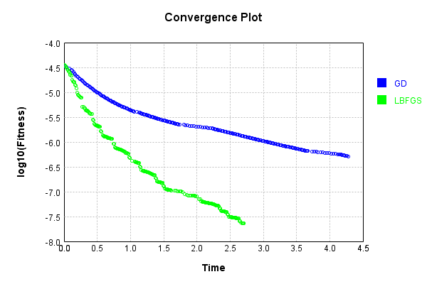


This is a network with the following layout:

Code from [NLayerTest.java:87](../../../../../../../src/test/java/com/simiacryptus/mindseye/network/NLayerTest.java#L87) executed in 0.19 seconds: 
```java
    return Graphviz.fromGraph(TestUtil.toGraph((DAGNetwork) layer))
      .height(400).width(600).render(Format.PNG).toImage();
```

Returns: 


### Json Serialization
Code from [JsonTest.java:36](../../../../../../../src/main/java/com/simiacryptus/mindseye/test/unit/JsonTest.java#L36) executed in 0.00 seconds: 
```java
    JsonObject json = layer.getJson();
    NNLayer echo = NNLayer.fromJson(json);
    if ((echo == null)) throw new AssertionError("Failed to deserialize");
    if ((layer == echo)) throw new AssertionError("Serialization did not copy");
    if ((!layer.equals(echo))) throw new AssertionError("Serialization not equal");
    return new GsonBuilder().setPrettyPrinting().create().toJson(json);
```

Returns: 

```
    {
      "class": "com.simiacryptus.mindseye.network.PipelineNetwork",
      "id": "84312a8e-6b09-47bb-8a44-e09a893cf5fc",
      "isFrozen": false,
      "name": "PipelineNetwork/84312a8e-6b09-47bb-8a44-e09a893cf5fc",
      "inputs": [
        "45a277db-3fe1-42ae-b4b9-fa9fb0694541"
      ],
      "nodes": {
        "3c239c4d-085c-4bbd-b6dd-4c2c0b913363": "b9c077f8-92eb-49a0-b823-c9d149182eb1",
        "b27ba094-403b-4b09-aa84-f2f5a9013bf1": "ac6f010e-036b-4b8b-8ae1-264fe8a130a9",
        "1908bda0-11c5-4b00-8a6b-747fbef6d79b": "bca19212-e84c-4ca5-b9ff-e4517cd65559",
        "5cb0c3a4-535c-4ce0-8fda-13062bb08640": "0f7e0155-e6b0-4414-99b2-9052d6da6a13",
        "caa53187-3c69-483e-bb46-aa49edfa49df": "913f5349-7123-4f48-8ca1-1dbe2ddee5bb",
        "9221b688-ea2d-4e7a-af66-1b54faccf0eb": "3af260b1-c96b-4903-a8e4-b187618ed8d5"
      },
      "layers": {
        "b9c077f8-92eb-49a0-b823-c9d149182eb1": {
          "class": "com.simiacryptus.mindseye.layers.cudnn.ConvolutionLayer",
          "id": "b9c077f8-92eb-49a0-b823-c9d149182eb1",
          "isFrozen": false,
          "name": "ConvolutionLay
```
...[skipping 7360 bytes](etc/31.txt)...
```
      "precision": "Double"
        },
        "3af260b1-c96b-4903-a8e4-b187618ed8d5": {
          "class": "com.simiacryptus.mindseye.layers.cudnn.ActivationLayer",
          "id": "3af260b1-c96b-4903-a8e4-b187618ed8d5",
          "isFrozen": false,
          "name": "ActivationLayer/3af260b1-c96b-4903-a8e4-b187618ed8d5",
          "mode": 0,
          "precision": "Double"
        }
      },
      "links": {
        "3c239c4d-085c-4bbd-b6dd-4c2c0b913363": [
          "45a277db-3fe1-42ae-b4b9-fa9fb0694541"
        ],
        "b27ba094-403b-4b09-aa84-f2f5a9013bf1": [
          "3c239c4d-085c-4bbd-b6dd-4c2c0b913363"
        ],
        "1908bda0-11c5-4b00-8a6b-747fbef6d79b": [
          "b27ba094-403b-4b09-aa84-f2f5a9013bf1"
        ],
        "5cb0c3a4-535c-4ce0-8fda-13062bb08640": [
          "1908bda0-11c5-4b00-8a6b-747fbef6d79b"
        ],
        "caa53187-3c69-483e-bb46-aa49edfa49df": [
          "5cb0c3a4-535c-4ce0-8fda-13062bb08640"
        ],
        "9221b688-ea2d-4e7a-af66-1b54faccf0eb": [
          "caa53187-3c69-483e-bb46-aa49edfa49df"
        ]
      },
      "labels": {},
      "head": "9221b688-ea2d-4e7a-af66-1b54faccf0eb"
    }
```


### Input Learning
In this test, we use a network to learn this target input, given it's pre-evaluated output:

Code from [LearningTester.java:127](../../../../../../../src/main/java/com/simiacryptus/mindseye/test/unit/LearningTester.java#L127) executed in 0.00 seconds: 
```java
    return Arrays.stream(input_target).map(x -> x.prettyPrint()).reduce((a, b) -> a + "\n" + b).orElse("");
```

Returns: 

```
    [
    	[ [ -0.055600000000000004, -0.0644, -0.0496 ], [ 0.040600000000000004, 0.0814, -0.0496 ], [ 0.030600000000000002, 0.068, -0.0182 ], [ 0.082, 0.076, 0.0332 ], [ -0.09680000000000001, -0.029, -0.029 ] ],
    	[ [ -0.011800000000000001, 0.0646, -0.05240000000000001 ], [ -0.0684, 0.051, 0.093 ], [ -0.046, -0.0072, -0.031400000000000004 ], [ -0.0238, 0.08, -0.004600000000000001 ], [ 0.06420000000000001, 0.07360000000000001, -0.058 ] ],
    	[ [ -0.09440000000000001, 0.0302, 0.014 ], [ -0.08020000000000001, 0.0388, 0.0852 ], [ -0.06860000000000001, -0.095, -0.027800000000000002 ], [ -0.0902, 0.0576, 0.07640000000000001 ], [ -0.09780000000000001, 0.063, 0.031200000000000002 ] ],
    	[ [ 0.06420000000000001, -0.07560000000000001, 0.093 ], [ 0.022200000000000004, -0.086, -0.09860000000000001 ], [ 0.0328, -0.0576, -0.05740000000000001 ], [ 0.0178, 0.035, -0.096 ], [ -0.0674, -0.089, 0.0816 ] ],
    	[ [ -0.0032, -0.08180000000000001, -0.0296 ], [ 0.07260000000000001, 0.07540000000000001, 0.04240000000000001 ], [ 0.040400000000000005, 0.0616, -0.024 ], [ 0.053, -0.062, -0.06760000000000001 ], [ -0.08460000000000001, -0.0284, 0.025200000000000004 ] ]
    ]
```


First, we use a conjugate gradient descent method, which converges the fastest for purely linear functions.

Code from [LearningTester.java:300](../../../../../../../src/main/java/com/simiacryptus/mindseye/test/unit/LearningTester.java#L300) executed in 6.35 seconds: 
```java
    return new IterativeTrainer(trainable)
      .setLineSearchFactory(label -> new QuadraticSearch())
      .setOrientation(new GradientDescent())
      .setMonitor(monitor)
      .setTimeout(30, TimeUnit.SECONDS)
      .setMaxIterations(250)
      .setTerminateThreshold(0)
      .run();
```
Logging: 
```
    Low gradient: 7.821545569449935E-7
    Constructing line search parameters: GD
    F(0.0) = LineSearchPoint{point=PointSample{avg=1.692940565459556E-7}, derivative=-6.117657509498191E-13}
    F(1.0E-10) = LineSearchPoint{point=PointSample{avg=1.692940565459556E-7}, derivative=-6.117657509498191E-13}, delta = 0.0
    F(7.000000000000001E-10) = LineSearchPoint{point=PointSample{avg=1.692940565459556E-7}, derivative=-6.117657509498191E-13}, delta = 0.0
    New Minimum: 1.692940565459556E-7 > 1.6929405654595503E-7
    F(4.900000000000001E-9) = LineSearchPoint{point=PointSample{avg=1.6929405654595503E-7}, derivative=-6.11765750949817E-13}, delta = -5.558653716356346E-22
    New Minimum: 1.6929405654595503E-7 > 1.6929405654594148E-7
    F(3.430000000000001E-8) = LineSearchPoint{point=PointSample{avg=1.6929405654594148E-7}, derivative=-6.117657509497735E-13}, delta = -1.410839252770444E-20
    New Minimum: 1.6929405654594148E-7 > 1.6929405654581368E-7
    F(2.4010000000000004E-7) = LineSearchPoint{point=PointSample{avg=1.6929405654581368E-7}, de
```
...[skipping 295383 bytes](etc/32.txt)...
```
    0592326E-26}, delta = -2.779751718535435E-13
    Right bracket at 483512.8037123576
    Converged to right
    Iteration 249 complete. Error: 6.377806703596832E-11 Total: 250928601574984.4700; Orientation: 0.0001; Line Search: 0.0568
    Low gradient: 1.2459676560779218E-9
    F(0.0) = LineSearchPoint{point=PointSample{avg=6.377806703596832E-11}, derivative=-1.5524353999923102E-18}
    New Minimum: 6.377806703596832E-11 > 6.353968186649168E-11
    F(483512.8037123576) = LineSearchPoint{point=PointSample{avg=6.353968186649168E-11}, derivative=5.663801966697105E-19}, delta = -2.3838516947663697E-13
    6.353968186649168E-11 <= 6.377806703596832E-11
    New Minimum: 6.353968186649168E-11 > 6.350308019524775E-11
    F(354265.0875400043) = LineSearchPoint{point=PointSample{avg=6.350308019524775E-11}, derivative=-2.773760283406333E-26}, delta = -2.7498684072057563E-13
    Left bracket at 354265.0875400043
    Converged to left
    Iteration 250 complete. Error: 6.350308019524775E-11 Total: 250928633374013.4000; Orientation: 0.0001; Line Search: 0.0254
    
```

Returns: 

```
    6.350308019524775E-11
```


Training Converged

Next, we run the same optimization using L-BFGS, which is nearly ideal for purely second-order or quadratic functions.

Code from [LearningTester.java:324](../../../../../../../src/main/java/com/simiacryptus/mindseye/test/unit/LearningTester.java#L324) executed in 7.51 seconds: 
```java
    return new IterativeTrainer(trainable)
      .setLineSearchFactory(label -> new ArmijoWolfeSearch())
      .setOrientation(new LBFGS())
      .setMonitor(monitor)
      .setTimeout(30, TimeUnit.SECONDS)
      .setMaxIterations(250)
      .setTerminateThreshold(0)
      .run();
```
Logging: 
```
    LBFGS Accumulation History: 1 points
    Constructing line search parameters: GD
    th(0)=1.692940565459556E-7;dx=-6.117657509498191E-13
    New Minimum: 1.692940565459556E-7 > 1.6929273854022955E-7
    WOLFE (weak): th(2.154434690031884)=1.6929273854022955E-7; dx=-6.117623750209295E-13 delta=1.3180057260386092E-12
    New Minimum: 1.6929273854022955E-7 > 1.692914205417895E-7
    WOLFE (weak): th(4.308869380063768)=1.692914205417895E-7; dx=-6.117589990920411E-13 delta=2.6360041660850945E-12
    New Minimum: 1.692914205417895E-7 > 1.6928614862073945E-7
    WOLFE (weak): th(12.926608140191302)=1.6928614862073945E-7; dx=-6.117454953763614E-13 delta=7.90792521614228E-12
    New Minimum: 1.6928614862073945E-7 > 1.692624264161071E-7
    WOLFE (weak): th(51.70643256076521)=1.692624264161071E-7; dx=-6.116847286537372E-13 delta=3.163012984847435E-11
    New Minimum: 1.692624264161071E-7 > 1.6913594779041378E-7
    WOLFE (weak): th(258.53216280382605)=1.6913594779041378E-7; dx=-6.113606394087523E-13 delta=1.5810875554181025E-10
    New Minimum: 1.691359477
```
...[skipping 329137 bytes](etc/33.txt)...
```
    -8 > 5.7610234051342154E-8
    WOLFE (weak): th(4.308869380063768)=5.7610234051342154E-8; dx=-1.230826692707635E-13 delta=5.303490813790221E-13
    New Minimum: 5.7610234051342154E-8 > 5.760917336479144E-8
    WOLFE (weak): th(12.926608140191302)=5.760917336479144E-8; dx=-1.23080873018909E-13 delta=1.5910356320896006E-12
    New Minimum: 5.760917336479144E-8 > 5.76044004668723E-8
    WOLFE (weak): th(51.70643256076521)=5.76044004668723E-8; dx=-1.2307278988555432E-13 delta=6.363933551235157E-12
    New Minimum: 5.76044004668723E-8 > 5.757895030536876E-8
    WOLFE (weak): th(258.53216280382605)=5.757895030536876E-8; dx=-1.2302967984101321E-13 delta=3.181409505477534E-11
    New Minimum: 5.757895030536876E-8 > 5.742008880510971E-8
    WOLFE (weak): th(1551.1929768229563)=5.742008880510971E-8; dx=-1.2276024206168215E-13 delta=1.9067559531382398E-10
    MAX ALPHA: th(0)=5.761076440042353E-8;th'(0)=-1.230835673966926E-13;
    Iteration 250 complete. Error: 5.742008880510971E-8 Total: 250936151953741.9000; Orientation: 0.0001; Line Search: 0.0512
    
```

Returns: 

```
    5.742008880510971E-8
```


Training Converged

Code from [LearningTester.java:96](../../../../../../../src/main/java/com/simiacryptus/mindseye/test/unit/LearningTester.java#L96) executed in 0.00 seconds: 
```java
    return TestUtil.compare(runs);
```

Returns: 

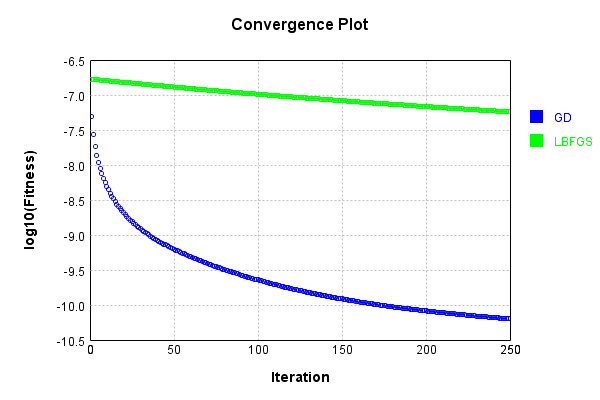


Code from [LearningTester.java:99](../../../../../../../src/main/java/com/simiacryptus/mindseye/test/unit/LearningTester.java#L99) executed in 0.00 seconds: 
```java
    return TestUtil.compareTime(runs);
```

Returns: 

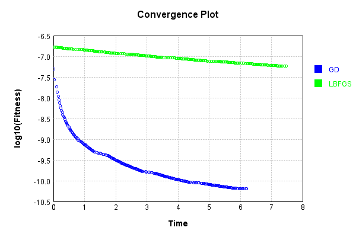


### Model Learning
In this test, attempt to train a network to emulate a randomized network given an example input/output. The target state is:

Code from [LearningTester.java:176](../../../../../../../src/main/java/com/simiacryptus/mindseye/test/unit/LearningTester.java#L176) executed in 0.00 seconds: 
```java
    return network_target.state().stream().map(Arrays::toString).reduce((a, b) -> a + "\n" + b).orElse("");
```

Returns: 

```
    [0.026, 0.013200000000000002, -0.025400000000000002, -0.022200000000000004, 0.050800000000000005, -0.029, 0.0824, -0.087, 0.08080000000000001, 0.0328, 0.07840000000000001, -0.0702, 0.036, 0.0658, 0.0422, -0.042800000000000005, 0.092, 0.021400000000000002, -0.0342, 0.032600000000000004, -0.0246, 0.0298, -0.0864, -0.0902, -0.0592, 0.0648, -0.05940000000000001, -0.009200000000000002, -0.0952, 0.011200000000000002, -0.018400000000000003, 0.035, 0.1, 0.0412, -0.09440000000000001, -0.0238, -0.0964, -0.006, -0.08560000000000001, -0.0854, 0.034800000000000005, -0.0576, -0.076, -0.08080000000000001, -0.012600000000000002, 0.0614, 0.049400000000000006, 0.041400000000000006, 0.053200000000000004, 0.017400000000000002, 0.0772, -0.01, 0.09040000000000001, 0.0646, -0.073, -0.095, 0.054, 0.033600000000000005, 0.09380000000000001, -0.0636, -0.017, -0.08760000000000001, 0.002, -0.0852, -0.0752, 0.0882, -0.08380000000000001, -0.006, 0.0176, 0.0614, 0.033600000000000005, 0.06960000000000001, -0.022400000000000003, 0.0742, 0.037
```
...[skipping 214 bytes](etc/34.txt)...
```
    .07660000000000002, -0.0742, 0.013800000000000002, -0.04580000000000001, -0.037, -0.019600000000000003, -0.040400000000000005, -0.011200000000000002, -0.009, 0.029200000000000004, 0.037200000000000004, 0.0776, -0.07780000000000001, -0.007600000000000001, -0.061200000000000004, -0.0694, 0.014, -0.07579999999999999, -0.055400000000000005, 0.08560000000000001, -0.0688, 0.091, -0.018600000000000002, -0.024, 0.0094, 0.084, 0.0596, 0.0456, -0.0976, -0.031200000000000002, -0.059800000000000006, -0.0014000000000000002, -0.0814, 0.0636, 0.0832, 0.0454, 0.038400000000000004, -0.0204, -0.033, 0.08660000000000001, -0.0682, 0.046, 0.005600000000000001, -0.023, -0.097, -0.072, 0.049800000000000004, 0.022, -0.0648, 0.0728, -0.017, -0.0256, -0.0268, -0.032, -0.0644, -4.0E-4, 0.031400000000000004, -0.0918, -0.028, 0.0228, 0.019200000000000002, -0.046200000000000005, 0.033, 0.0496, 0.026, -0.025, 0.09480000000000001, -0.0398, -0.07560000000000001, 0.07940000000000001, -0.04, 0.016800000000000002, -0.015, 0.0014000000000000002]
```


First, we use a conjugate gradient descent method, which converges the fastest for purely linear functions.

Code from [LearningTester.java:300](../../../../../../../src/main/java/com/simiacryptus/mindseye/test/unit/LearningTester.java#L300) executed in 10.87 seconds: 
```java
    return new IterativeTrainer(trainable)
      .setLineSearchFactory(label -> new QuadraticSearch())
      .setOrientation(new GradientDescent())
      .setMonitor(monitor)
      .setTimeout(30, TimeUnit.SECONDS)
      .setMaxIterations(250)
      .setTerminateThreshold(0)
      .run();
```
Logging: 
```
    Constructing line search parameters: GD
    F(0.0) = LineSearchPoint{point=PointSample{avg=8.539538521374438E-4}, derivative=-1.859263577925322E-4}
    New Minimum: 8.539538521374438E-4 > 8.539538521188509E-4
    F(1.0E-10) = LineSearchPoint{point=PointSample{avg=8.539538521188509E-4}, derivative=-1.8592635778887928E-4}, delta = -1.8592874635736667E-14
    New Minimum: 8.539538521188509E-4 > 8.539538520072955E-4
    F(7.000000000000001E-10) = LineSearchPoint{point=PointSample{avg=8.539538520072955E-4}, derivative=-1.8592635776696188E-4}, delta = -1.3014827930646344E-13
    New Minimum: 8.539538520072955E-4 > 8.539538512264048E-4
    F(4.900000000000001E-9) = LineSearchPoint{point=PointSample{avg=8.539538512264048E-4}, derivative=-1.8592635761354034E-4}, delta = -9.110390393474166E-13
    New Minimum: 8.539538512264048E-4 > 8.539538457601688E-4
    F(3.430000000000001E-8) = LineSearchPoint{point=PointSample{avg=8.539538457601688E-4}, derivative=-1.8592635653958951E-4}, delta = -6.377275010155392E-12
    New Minimum: 8.539538457601688E-4 > 
```
...[skipping 422225 bytes](etc/35.txt)...
```
    451) = LineSearchPoint{point=PointSample{avg=6.110268354530683E-7}, derivative=-9.173661299791654E-11}, delta = -2.4488230745729303E-9
    F(138.30814615663155) = LineSearchPoint{point=PointSample{avg=6.230570909439735E-7}, derivative=2.9469458141146633E-10}, delta = 9.581432416332328E-9
    F(10.639088165894735) = LineSearchPoint{point=PointSample{avg=6.119989370383688E-7}, derivative=-1.214618234127722E-10}, delta = -1.4767214892724364E-9
    F(74.47361716126315) = LineSearchPoint{point=PointSample{avg=6.108867266064457E-7}, derivative=8.661546717527477E-11}, delta = -2.5889319211955113E-9
    6.108867266064457E-7 <= 6.134756585276412E-7
    New Minimum: 6.099406718174804E-7 > 6.097359514845658E-7
    F(47.90146317394538) = LineSearchPoint{point=PointSample{avg=6.097359514845658E-7}, derivative=-2.9604297710094113E-16}, delta = -3.739707043075439E-9
    Left bracket at 47.90146317394538
    Converged to left
    Iteration 250 complete. Error: 6.097359514845658E-7 Total: 250947157880140.8800; Orientation: 0.0000; Line Search: 0.0321
    
```

Returns: 

```
    6.097359514845658E-7
```


Training Converged

Next, we run the same optimization using L-BFGS, which is nearly ideal for purely second-order or quadratic functions.

Code from [LearningTester.java:324](../../../../../../../src/main/java/com/simiacryptus/mindseye/test/unit/LearningTester.java#L324) executed in 4.72 seconds: 
```java
    return new IterativeTrainer(trainable)
      .setLineSearchFactory(label -> new ArmijoWolfeSearch())
      .setOrientation(new LBFGS())
      .setMonitor(monitor)
      .setTimeout(30, TimeUnit.SECONDS)
      .setMaxIterations(250)
      .setTerminateThreshold(0)
      .run();
```
Logging: 
```
    LBFGS Accumulation History: 1 points
    Constructing line search parameters: GD
    th(0)=0.0011257309379147738;dx=-2.3545363499131655E-4
    New Minimum: 0.0011257309379147738 > 7.274035596722447E-4
    END: th(2.154434690031884)=7.274035596722447E-4; dx=-1.3425258511257624E-4 delta=3.9832737824252906E-4
    Iteration 1 complete. Error: 7.274035596722447E-4 Total: 250947223638334.8400; Orientation: 0.0002; Line Search: 0.0155
    LBFGS Accumulation History: 1 points
    th(0)=7.274035596722447E-4;dx=-7.894311166351418E-5
    New Minimum: 7.274035596722447E-4 > 5.128415905111169E-4
    END: th(4.641588833612779)=5.128415905111169E-4; dx=-1.350987983366554E-5 delta=2.145619691611278E-4
    Iteration 2 complete. Error: 5.128415905111169E-4 Total: 250947245845275.7800; Orientation: 0.0002; Line Search: 0.0147
    LBFGS Accumulation History: 1 points
    th(0)=5.128415905111169E-4;dx=-1.1596732856882913E-5
    New Minimum: 5.128415905111169E-4 > 4.0489176793513003E-4
    END: th(10.000000000000002)=4.0489176793513003E-4; dx=-9.993082461975225E-6 delta=1
```
...[skipping 146135 bytes](etc/36.txt)...
```
    413852961E-7
    WOLF (strong): th(30.632247910498965)=2.475517413852961E-7; dx=5.0723231219556604E-12 delta=3.8347353156580237E-10
    END: th(15.316123955249482)=2.4760876562543753E-7; dx=-1.2518623414166739E-11 delta=3.264492914243721E-10
    Iteration 249 complete. Error: 2.475517413852961E-7 Total: 250951861404578.1600; Orientation: 0.0001; Line Search: 0.0100
    LBFGS Accumulation History: 1 points
    th(0)=2.4760876562543753E-7;dx=-5.183782029672762E-11
    Armijo: th(32.99758876601783)=2.4903712004592236E-7; dx=1.3841214113864083E-10 delta=-1.4283544204848285E-9
    New Minimum: 2.4760876562543753E-7 > 2.4753821908429635E-7
    WOLF (strong): th(16.498794383008914)=2.4753821908429635E-7; dx=4.3286365001801634E-11 delta=7.05465411411815E-11
    New Minimum: 2.4753821908429635E-7 > 2.474108686766949E-7
    END: th(5.499598127669638)=2.474108686766949E-7; dx=-2.012993552477542E-11 delta=1.9789694874265793E-10
    Iteration 250 complete. Error: 2.474108686766949E-7 Total: 250951879198059.1200; Orientation: 0.0002; Line Search: 0.0143
    
```

Returns: 

```
    2.474108686766949E-7
```


Training Converged

Code from [LearningTester.java:96](../../../../../../../src/main/java/com/simiacryptus/mindseye/test/unit/LearningTester.java#L96) executed in 0.00 seconds: 
```java
    return TestUtil.compare(runs);
```

Returns: 

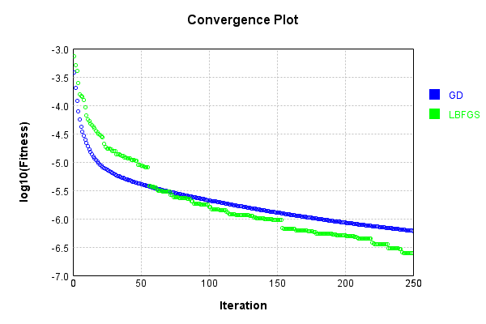


Code from [LearningTester.java:99](../../../../../../../src/main/java/com/simiacryptus/mindseye/test/unit/LearningTester.java#L99) executed in 0.00 seconds: 
```java
    return TestUtil.compareTime(runs);
```

Returns: 

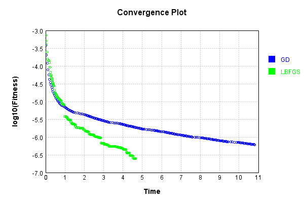


### Composite Learning
In this test, attempt to train a network to emulate a randomized network given an example input/output. The target state is:

Code from [LearningTester.java:219](../../../../../../../src/main/java/com/simiacryptus/mindseye/test/unit/LearningTester.java#L219) executed in 0.00 seconds: 
```java
    return network_target.state().stream().map(Arrays::toString).reduce((a, b) -> a + "\n" + b).orElse("");
```

Returns: 

```
    [-0.025400000000000002, 0.0646, 0.002, 0.021400000000000002, -0.029, 0.03780000000000001, -0.0342, -0.09440000000000001, 0.0824, -0.018400000000000003, 0.033600000000000005, -0.012600000000000002, -0.0688, -0.0752, 0.032600000000000004, 0.034800000000000005, 0.035, -0.022200000000000004, -0.006, 0.092, 0.050800000000000005, 0.036, -0.073, -0.042800000000000005, 0.0412, -0.017, 0.0614, 0.0298, 0.0772, -0.0246, 0.0422, -0.087, -0.08760000000000001, 0.1, -0.0576, -0.0864, 0.08080000000000001, 0.0658, -0.08560000000000001, 0.0882, 0.0176, 0.06960000000000001, 0.011200000000000002, -0.0632, 0.0328, 0.054, -0.0238, 0.041400000000000006, -0.0902, -0.01, -0.022400000000000003, -0.0852, -0.08380000000000001, 0.026, 0.0874, 0.09040000000000001, -0.0592, 0.09380000000000001, -0.0952, -0.095, 0.07840000000000001, 0.013200000000000002, -0.08080000000000001, 0.049400000000000006, -0.0864, -0.074, 0.046200000000000005, -0.05940000000000001, -0.0854, -0.076, -0.0702, 0.053200000000000004, 0.0742, 0.0614, -0.006, 0.0336000000
```
...[skipping 214 bytes](etc/37.txt)...
```
    00000000000002, 0.046, -0.023, 0.005600000000000001, -0.04580000000000001, 0.0596, -0.037, -0.06420000000000001, -0.0268, 0.014, -0.0918, -0.0014000000000000002, 0.08660000000000001, 0.0094, -0.055200000000000006, 0.0456, 0.031400000000000004, 0.0776, 0.09480000000000001, -0.011200000000000002, 0.049800000000000004, -0.097, -0.046200000000000005, 0.029200000000000004, 0.022, 0.0228, -0.019600000000000003, -0.0644, -0.0204, -0.0976, -0.024, 0.091, -0.08, -0.0398, 0.0496, -0.028, 0.0182, -0.0688, 0.0108, -0.0682, 0.084, 0.016800000000000002, -0.072, -0.061200000000000004, 0.08560000000000001, -0.07780000000000001, 0.0832, 0.038400000000000004, -0.0256, -0.032, -0.04, 0.033, 0.026, -0.07579999999999999, -0.051, 0.0636, -0.0814, -0.07560000000000001, -0.0648, -0.025, 0.019200000000000002, -0.0694, -0.015, 0.07660000000000002, 0.037200000000000004, -0.059800000000000006, -0.033, 0.0454, -0.055400000000000005, 0.0728, -0.018600000000000002, -4.0E-4, 0.07940000000000001, 0.0014000000000000002, 0.0014000000000000002]
```


We simultaneously regress this target input:

Code from [LearningTester.java:223](../../../../../../../src/main/java/com/simiacryptus/mindseye/test/unit/LearningTester.java#L223) executed in 0.00 seconds: 
```java
    return Arrays.stream(testInput).map(x -> x.prettyPrint()).reduce((a, b) -> a + "\n" + b).orElse("");
```

Returns: 

```
    [
    	[ [ -0.055600000000000004, -0.05240000000000001, -0.09860000000000001 ], [ -0.08020000000000001, -0.0284, 0.068 ], [ 0.0852, 0.063, 0.0178 ], [ 0.082, -0.0182, 0.06420000000000001 ], [ -0.027800000000000002, -0.0296, -0.004600000000000001 ] ],
    	[ [ 0.0646, -0.0644, -0.0684 ], [ -0.062, -0.08180000000000001, 0.07360000000000001 ], [ 0.0576, 0.076, -0.07560000000000001 ], [ 0.040400000000000005, -0.096, -0.06860000000000001 ], [ -0.0032, -0.05740000000000001, 0.0302 ] ],
    	[ [ 0.08, -0.029, -0.058 ], [ -0.0576, 0.030600000000000002, -0.0072 ], [ 0.07640000000000001, -0.031400000000000004, 0.0616 ], [ 0.093, 0.040600000000000004, -0.046 ], [ 0.0328, -0.024, -0.011800000000000001 ] ],
    	[ [ 0.0814, 0.051, -0.06760000000000001 ], [ -0.095, -0.08460000000000001, 0.022200000000000004 ], [ 0.025200000000000004, -0.0674, 0.04240000000000001 ], [ -0.086, -0.029, -0.09680000000000001 ], [ -0.089, 0.093, 0.07540000000000001 ] ],
    	[ [ 0.0332, -0.09780000000000001, 0.0388 ], [ 0.07260000000000001, -0.09440000000000001, 0.031200000000000002 ], [ -0.0496, -0.0496, 0.06420000000000001 ], [ 0.014, 0.053, 0.035 ], [ -0.0902, -0.0238, 0.0816 ] ]
    ]
```


Which produces the following output:

Code from [LearningTester.java:230](../../../../../../../src/main/java/com/simiacryptus/mindseye/test/unit/LearningTester.java#L230) executed in 0.00 seconds: 
```java
    return Stream.of(targetOutput).map(x -> x.prettyPrint()).reduce((a, b) -> a + "\n" + b).orElse("");
```

Returns: 

```
    [
    	[ [ 0.5336277478353678, 0.5088870679838609, 0.5064465514777796 ], [ 0.5340954398509381, 0.49308573400161243, 0.4953538745223376 ], [ 0.5343223035819122, 0.49301747192850015, 0.4952348266346036 ], [ 0.5347412909017251, 0.49303833653046647, 0.49541494005755393 ], [ 0.4940159131399693, 0.4772104294158602, 0.4641683712377061 ] ],
    	[ [ 0.5053908497036963, 0.4895836859252056, 0.5011580335813756 ], [ 0.4953376922818597, 0.4817462499224552, 0.503212526237112 ], [ 0.49521412534352155, 0.4817605374158397, 0.5031349356122112 ], [ 0.49530900796582567, 0.48112170871066656, 0.5028543804661457 ], [ 0.46556265342227304, 0.487235793736879, 0.46102621314250536 ] ],
    	[ [ 0.5058594860026256, 0.489790904286408, 0.5014235430996545 ], [ 0.4962266686048746, 0.48160463131009196, 0.5036029396185269 ], [ 0.4952906964362156, 0.4819448153345617, 0.5029823236017924 ], [ 0.495545384027472, 0.48163089598743397, 0.5030175989347843 ], [ 0.46550629312254604, 0.4878400055300347, 0.4607426716267898 ] ],
    	[ [ 0.505413579322815, 0.4894028005781523, 0.5012632466925923 ], [ 0.49544047594252166, 0.48124076764467233, 0.5031279140096974 ], [ 0.4954177369917131, 0.48155048499168956, 0.502962194112193 ], [ 0.4953756709697965, 0.4818403541511761, 0.5030832572321187 ], [ 0.46536504512952537, 0.4876012488217225, 0.4609567452454456 ] ],
    	[ [ 0.4741513864664577, 0.46747104388575533, 0.48817146753532015 ], [ 0.4466523780698056, 0.46326354561795474, 0.48813083437797744 ], [ 0.4463218864193997, 0.4632942453828915, 0.48784214518741376 ], [ 0.446219756071406, 0.46335022934510306, 0.48785666530838184 ], [ 0.4276957766988399, 0.48340316654564247, 0.46092714183413974 ] ]
    ]
```


First, we use a conjugate gradient descent method, which converges the fastest for purely linear functions.

Code from [LearningTester.java:300](../../../../../../../src/main/java/com/simiacryptus/mindseye/test/unit/LearningTester.java#L300) executed in 8.23 seconds: 
```java
    return new IterativeTrainer(trainable)
      .setLineSearchFactory(label -> new QuadraticSearch())
      .setOrientation(new GradientDescent())
      .setMonitor(monitor)
      .setTimeout(30, TimeUnit.SECONDS)
      .setMaxIterations(250)
      .setTerminateThreshold(0)
      .run();
```
Logging: 
```
    Constructing line search parameters: GD
    F(0.0) = LineSearchPoint{point=PointSample{avg=0.0012344149613655988}, derivative=-5.9161687492600004E-5}
    New Minimum: 0.0012344149613655988 > 0.0012344149613596825
    F(1.0E-10) = LineSearchPoint{point=PointSample{avg=0.0012344149613596825}, derivative=-5.916168749197991E-5}, delta = -5.9162744148189006E-15
    New Minimum: 0.0012344149613596825 > 0.0012344149613241861
    F(7.000000000000001E-10) = LineSearchPoint{point=PointSample{avg=0.0012344149613241861}, derivative=-5.916168748825941E-5}, delta = -4.141261986112532E-14
    New Minimum: 0.0012344149613241861 > 0.0012344149610757076
    F(4.900000000000001E-9) = LineSearchPoint{point=PointSample{avg=0.0012344149610757076}, derivative=-5.9161687462215875E-5}, delta = -2.898911579535257E-13
    New Minimum: 0.0012344149610757076 > 0.0012344149593363537
    F(3.430000000000001E-8) = LineSearchPoint{point=PointSample{avg=0.0012344149593363537}, derivative=-5.916168727991115E-5}, delta = -2.029245044568584E-12
    New Minimum: 0.00123441495
```
...[skipping 281362 bytes](etc/38.txt)...
```
    le{avg=3.095844492650786E-6}, derivative=5.4109569470793404E-14}, delta = -1.702966065241487E-8
    Right bracket at 10.67511043598946
    Converged to right
    Iteration 249 complete. Error: 3.095844492650786E-6 Total: 250960257254087.7800; Orientation: 0.0000; Line Search: 0.0308
    F(0.0) = LineSearchPoint{point=PointSample{avg=3.095844492650786E-6}, derivative=-3.9799712673284344E-9}
    New Minimum: 3.095844492650786E-6 > 3.080058890834589E-6
    F(10.67511043598946) = LineSearchPoint{point=PointSample{avg=3.080058890834589E-6}, derivative=1.0225637101610306E-9}, delta = -1.578560181619723E-8
    3.080058890834589E-6 <= 3.095844492650786E-6
    New Minimum: 3.080058890834589E-6 > 3.078943257681151E-6
    F(8.493020638931743) = LineSearchPoint{point=PointSample{avg=3.078943257681151E-6}, derivative=-2.5143085185275407E-14}, delta = -1.6901234969635277E-8
    Left bracket at 8.493020638931743
    Converged to left
    Iteration 250 complete. Error: 3.078943257681151E-6 Total: 250960275528041.7500; Orientation: 0.0000; Line Search: 0.0149
    
```

Returns: 

```
    3.078943257681151E-6
```


Training Converged

Next, we run the same optimization using L-BFGS, which is nearly ideal for purely second-order or quadratic functions.

Code from [LearningTester.java:324](../../../../../../../src/main/java/com/simiacryptus/mindseye/test/unit/LearningTester.java#L324) executed in 4.91 seconds: 
```java
    return new IterativeTrainer(trainable)
      .setLineSearchFactory(label -> new ArmijoWolfeSearch())
      .setOrientation(new LBFGS())
      .setMonitor(monitor)
      .setTimeout(30, TimeUnit.SECONDS)
      .setMaxIterations(250)
      .setTerminateThreshold(0)
      .run();
```
Logging: 
```
    LBFGS Accumulation History: 1 points
    Constructing line search parameters: GD
    th(0)=0.0012344149613655988;dx=-5.9161687492600004E-5
    New Minimum: 0.0012344149613655988 > 0.0011213511952648597
    END: th(2.154434690031884)=0.0011213511952648597; dx=-4.579555039810028E-5 delta=1.130637661007391E-4
    Iteration 1 complete. Error: 0.0011213511952648597 Total: 250960318965017.7200; Orientation: 0.0004; Line Search: 0.0153
    LBFGS Accumulation History: 1 points
    th(0)=0.0011213511952648597;dx=-3.809836969083213E-5
    New Minimum: 0.0011213511952648597 > 9.675226895947551E-4
    END: th(4.641588833612779)=9.675226895947551E-4; dx=-2.8183796192418677E-5 delta=1.538285056701046E-4
    Iteration 2 complete. Error: 9.675226895947551E-4 Total: 250960343511631.7000; Orientation: 0.0002; Line Search: 0.0161
    LBFGS Accumulation History: 1 points
    th(0)=9.675226895947551E-4;dx=-2.616343912552461E-5
    New Minimum: 9.675226895947551E-4 > 7.247503644817371E-4
    END: th(10.000000000000002)=7.247503644817371E-4; dx=-2.239025683553918E-5 delta=
```
...[skipping 144752 bytes](etc/39.txt)...
```
    h(237.9277035925876)=3.025340436234499E-7; dx=-3.5440473588166126E-11 delta=1.0207139108063968E-8
    Iteration 249 complete. Error: 3.025340436234499E-7 Total: 250965164012287.8400; Orientation: 0.0002; Line Search: 0.0187
    LBFGS Accumulation History: 1 points
    th(0)=3.025340436234499E-7;dx=-6.684136797880873E-10
    Armijo: th(512.5996983394944)=1.718008716961655E-5; dx=6.649110057709392E-8 delta=-1.6877553125993102E-5
    Armijo: th(256.2998491697472)=4.437971678826732E-6; dx=3.293243738562586E-8 delta=-4.135437635203282E-6
    Armijo: th(85.4332830565824)=7.240718578940982E-7; dx=1.0536004707380842E-8 delta=-4.2153781427064827E-7
    Armijo: th(21.3583207641456)=3.1817554497417624E-7; dx=2.133049991246824E-9 delta=-1.564150135072632E-8
    New Minimum: 3.025340436234499E-7 > 3.0087553913278226E-7
    END: th(4.2716641528291195)=3.0087553913278226E-7; dx=-1.0810232145228937E-10 delta=1.65850449066766E-9
    Iteration 250 complete. Error: 3.0087553913278226E-7 Total: 250965190903988.8400; Orientation: 0.0001; Line Search: 0.0232
    
```

Returns: 

```
    3.0087553913278226E-7
```


Training Converged

Code from [LearningTester.java:96](../../../../../../../src/main/java/com/simiacryptus/mindseye/test/unit/LearningTester.java#L96) executed in 0.00 seconds: 
```java
    return TestUtil.compare(runs);
```

Returns: 

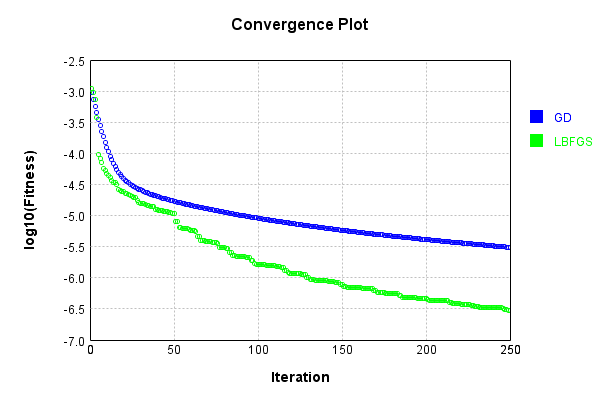


Code from [LearningTester.java:99](../../../../../../../src/main/java/com/simiacryptus/mindseye/test/unit/LearningTester.java#L99) executed in 0.00 seconds: 
```java
    return TestUtil.compareTime(runs);
```

Returns: 

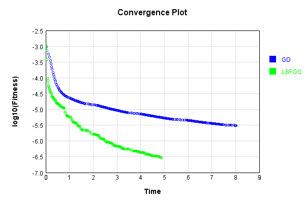


This is a network with the following layout:

Code from [NLayerTest.java:87](../../../../../../../src/test/java/com/simiacryptus/mindseye/network/NLayerTest.java#L87) executed in 0.23 seconds: 
```java
    return Graphviz.fromGraph(TestUtil.toGraph((DAGNetwork) layer))
      .height(400).width(600).render(Format.PNG).toImage();
```

Returns: 

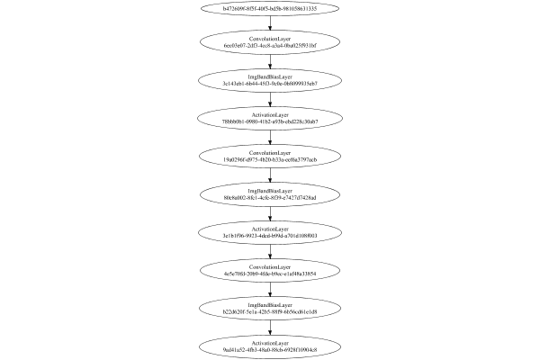


### Json Serialization
Code from [JsonTest.java:36](../../../../../../../src/main/java/com/simiacryptus/mindseye/test/unit/JsonTest.java#L36) executed in 0.00 seconds: 
```java
    JsonObject json = layer.getJson();
    NNLayer echo = NNLayer.fromJson(json);
    if ((echo == null)) throw new AssertionError("Failed to deserialize");
    if ((layer == echo)) throw new AssertionError("Serialization did not copy");
    if ((!layer.equals(echo))) throw new AssertionError("Serialization not equal");
    return new GsonBuilder().setPrettyPrinting().create().toJson(json);
```

Returns: 

```
    {
      "class": "com.simiacryptus.mindseye.network.PipelineNetwork",
      "id": "486a46a6-61f5-4048-a95a-36ca87207dff",
      "isFrozen": false,
      "name": "PipelineNetwork/486a46a6-61f5-4048-a95a-36ca87207dff",
      "inputs": [
        "b472609f-8f5f-40f5-bd5b-981058631335"
      ],
      "nodes": {
        "e464ae80-c7db-4a5b-8aaf-89721f2ee00d": "6ec03e07-2df3-4cc8-a3a4-0ba025f931bf",
        "9de8daee-e37e-40d7-b0e9-a2e26255f231": "3c143eb1-6b44-45f3-9c0e-0b8099935eb7",
        "a8ca1e84-ec11-41a2-b050-74f3f1ee8944": "78bbb0b1-0980-41b2-a93b-ebd228c30ab7",
        "6013580b-a770-4326-bb97-8a78fd7fff5d": "19a0296f-d975-4b20-b33a-eef6a3797acb",
        "f8bb1271-e7c9-4054-a028-38093ad14356": "80e8a002-8fc1-4cfe-8f39-e7427d7428ad",
        "dedf0329-490a-4be4-b7eb-d6e27516d666": "3e1b1f96-9923-4dcd-b99d-a701d108f003",
        "e6ec2ec5-dba5-407a-9b32-8bc9510be484": "4e5e70fd-20b9-4fde-b9ec-e1af48a33854",
        "9b03a2aa-7d33-448f-b9ac-2270022c243a": "b22d620f-5e1a-42b5-88f9-6b56cd61e1d8",
        "79bb8800-0d32-4597-8045-8c6da2455b90": "9ad41a52-4fb3-48a0-88cb-6928f10
```
...[skipping 11847 bytes](etc/40.txt)...
```
    ",
          "mode": 0,
          "precision": "Double"
        }
      },
      "links": {
        "e464ae80-c7db-4a5b-8aaf-89721f2ee00d": [
          "b472609f-8f5f-40f5-bd5b-981058631335"
        ],
        "9de8daee-e37e-40d7-b0e9-a2e26255f231": [
          "e464ae80-c7db-4a5b-8aaf-89721f2ee00d"
        ],
        "a8ca1e84-ec11-41a2-b050-74f3f1ee8944": [
          "9de8daee-e37e-40d7-b0e9-a2e26255f231"
        ],
        "6013580b-a770-4326-bb97-8a78fd7fff5d": [
          "a8ca1e84-ec11-41a2-b050-74f3f1ee8944"
        ],
        "f8bb1271-e7c9-4054-a028-38093ad14356": [
          "6013580b-a770-4326-bb97-8a78fd7fff5d"
        ],
        "dedf0329-490a-4be4-b7eb-d6e27516d666": [
          "f8bb1271-e7c9-4054-a028-38093ad14356"
        ],
        "e6ec2ec5-dba5-407a-9b32-8bc9510be484": [
          "dedf0329-490a-4be4-b7eb-d6e27516d666"
        ],
        "9b03a2aa-7d33-448f-b9ac-2270022c243a": [
          "e6ec2ec5-dba5-407a-9b32-8bc9510be484"
        ],
        "79bb8800-0d32-4597-8045-8c6da2455b90": [
          "9b03a2aa-7d33-448f-b9ac-2270022c243a"
        ]
      },
      "labels": {},
      "head": "79bb8800-0d32-4597-8045-8c6da2455b90"
    }
```


### Input Learning
In this test, we use a network to learn this target input, given it's pre-evaluated output:

Code from [LearningTester.java:127](../../../../../../../src/main/java/com/simiacryptus/mindseye/test/unit/LearningTester.java#L127) executed in 0.00 seconds: 
```java
    return Arrays.stream(input_target).map(x -> x.prettyPrint()).reduce((a, b) -> a + "\n" + b).orElse("");
```

Returns: 

```
    [
    	[ [ 0.0854, -0.023, 0.08780000000000002 ], [ 0.0692, -0.0234, -0.0994 ], [ -0.047200000000000006, 0.0614, -0.013200000000000002 ], [ 0.083, -0.0922, -0.0516 ], [ 0.033800000000000004, -0.017, -0.0898 ] ],
    	[ [ 0.0062, 0.0074, 0.09280000000000001 ], [ 0.095, 0.0864, 0.0898 ], [ 0.09, -0.0114, -0.089 ], [ 0.066, -0.0626, 0.0144 ], [ -0.0844, -0.009800000000000001, 0.07980000000000001 ] ],
    	[ [ -0.0526, 0.0172, 0.0408 ], [ -0.0674, -0.06620000000000001, 0.039200000000000006 ], [ 0.0068000000000000005, 0.0166, 0.04580000000000001 ], [ -0.049800000000000004, 0.077, 0.07940000000000001 ], [ -0.0388, 0.0718, 0.0704 ] ],
    	[ [ -0.068, 0.0946, 0.083 ], [ -0.0882, 0.0884, 0.0664 ], [ 0.0204, 0.0582, -0.07780000000000001 ], [ -0.06760000000000001, 0.07460000000000001, -0.09240000000000001 ], [ 0.0354, -0.052, -0.021 ] ],
    	[ [ -0.060200000000000004, -0.0582, 0.021200000000000004 ], [ -0.058, 0.099, 0.033 ], [ 0.0442, -0.0234, 0.024200000000000003 ], [ 0.0398, 0.0016, -0.08660000000000001 ], [ 0.046, -0.065, -0.0028000000000000004 ] ]
    ]
```


First, we use a conjugate gradient descent method, which converges the fastest for purely linear functions.

Code from [LearningTester.java:300](../../../../../../../src/main/java/com/simiacryptus/mindseye/test/unit/LearningTester.java#L300) executed in 9.44 seconds: 
```java
    return new IterativeTrainer(trainable)
      .setLineSearchFactory(label -> new QuadraticSearch())
      .setOrientation(new GradientDescent())
      .setMonitor(monitor)
      .setTimeout(30, TimeUnit.SECONDS)
      .setMaxIterations(250)
      .setTerminateThreshold(0)
      .run();
```
Logging: 
```
    Low gradient: 2.5636258571927578E-9
    Constructing line search parameters: GD
    F(0.0) = LineSearchPoint{point=PointSample{avg=4.429151971947402E-10}, derivative=-6.5721775356673025E-18}
    F(1.0E-10) = LineSearchPoint{point=PointSample{avg=4.429151971947402E-10}, derivative=-6.5721775356673025E-18}, delta = 0.0
    F(7.000000000000001E-10) = LineSearchPoint{point=PointSample{avg=4.429151971947402E-10}, derivative=-6.5721775356673025E-18}, delta = 0.0
    F(4.900000000000001E-9) = LineSearchPoint{point=PointSample{avg=4.429151971947402E-10}, derivative=-6.5721775356673025E-18}, delta = 0.0
    F(3.430000000000001E-8) = LineSearchPoint{point=PointSample{avg=4.429151971947402E-10}, derivative=-6.5721775356673025E-18}, delta = 0.0
    F(2.4010000000000004E-7) = LineSearchPoint{point=PointSample{avg=4.429151971947402E-10}, derivative=-6.5721775356673025E-18}, delta = 0.0
    F(1.6807000000000003E-6) = LineSearchPoint{point=PointSample{avg=4.429151971947402E-10}, derivative=-6.5721775356673025E-18}, delta = 0.0
    F(1.1764900000000001
```
...[skipping 299702 bytes](etc/41.txt)...
```
    =PointSample{avg=2.2796239886966697E-13}, derivative=-6.009513113877284E-24}, delta = -5.239509484618198E-16
    F(4.064865145406518E8) = LineSearchPoint{point=PointSample{avg=2.3216791880417333E-13}, derivative=3.015024474375536E-23}, delta = 3.6815689860445376E-15
    F(3.1268193426203985E7) = LineSearchPoint{point=PointSample{avg=2.2816073585781544E-13}, derivative=-8.791031701524938E-24}, delta = -3.256139603133587E-16
    F(2.1887735398342788E8) = LineSearchPoint{point=PointSample{avg=2.283378922788218E-13}, derivative=1.067960218599382E-23}, delta = -1.4845753930701538E-16
    2.283378922788218E-13 <= 2.284863498181288E-13
    New Minimum: 2.277918400668706E-13 > 2.277884095587968E-13
    F(1.1597411582602745E8) = LineSearchPoint{point=PointSample{avg=2.277884095587968E-13}, derivative=-1.4797761755268317E-30}, delta = -6.979402593320064E-16
    Left bracket at 1.1597411582602745E8
    Converged to left
    Iteration 250 complete. Error: 2.277884095587968E-13 Total: 250975067875957.9700; Orientation: 0.0000; Line Search: 0.0374
    
```

Returns: 

```
    2.277884095587968E-13
```


Training Converged

Next, we run the same optimization using L-BFGS, which is nearly ideal for purely second-order or quadratic functions.

Code from [LearningTester.java:324](../../../../../../../src/main/java/com/simiacryptus/mindseye/test/unit/LearningTester.java#L324) executed in 10.82 seconds: 
```java
    return new IterativeTrainer(trainable)
      .setLineSearchFactory(label -> new ArmijoWolfeSearch())
      .setOrientation(new LBFGS())
      .setMonitor(monitor)
      .setTimeout(30, TimeUnit.SECONDS)
      .setMaxIterations(250)
      .setTerminateThreshold(0)
      .run();
```
Logging: 
```
    LBFGS Accumulation History: 1 points
    Constructing line search parameters: GD
    th(0)=4.429151971947402E-10;dx=-6.5721775356673025E-18
    New Minimum: 4.429151971947402E-10 > 4.429151830354881E-10
    WOLFE (weak): th(2.154434690031884)=4.429151830354881E-10; dx=-6.572177375152765E-18 delta=1.415925208955878E-17
    New Minimum: 4.429151830354881E-10 > 4.4291516887588584E-10
    WOLFE (weak): th(4.308869380063768)=4.4291516887588584E-10; dx=-6.572177214635451E-18 delta=2.8318854335010613E-17
    New Minimum: 4.4291516887588584E-10 > 4.429151122388159E-10
    WOLFE (weak): th(12.926608140191302)=4.429151122388159E-10; dx=-6.572176572579324E-18 delta=8.495592426650258E-17
    New Minimum: 4.429151122388159E-10 > 4.429148573711148E-10
    WOLFE (weak): th(51.70643256076521)=4.429148573711148E-10; dx=-6.5721736833118466E-18 delta=3.39823625359791E-16
    New Minimum: 4.429148573711148E-10 > 4.4291349807799736E-10
    WOLFE (weak): th(258.53216280382605)=4.4291349807799736E-10; dx=-6.572158273884237E-18 delta=1.6991167428223925E-15
    New Minimu
```
...[skipping 334959 bytes](etc/42.txt)...
```
    LFE (weak): th(4.308869380063768)=4.4038773991928054E-10; dx=-6.5149172182673925E-18 delta=2.8071996705156093E-17
    New Minimum: 4.4038773991928054E-10 > 4.403876837754552E-10
    WOLFE (weak): th(12.926608140191302)=4.403876837754552E-10; dx=-6.5149165827720304E-18 delta=8.421582204270757E-17
    New Minimum: 4.403876837754552E-10 > 4.4038743112803995E-10
    WOLFE (weak): th(51.70643256076521)=4.4038743112803995E-10; dx=-6.514913723047691E-18 delta=3.368632372992226E-16
    New Minimum: 4.4038743112803995E-10 > 4.4038608367822085E-10
    WOLFE (weak): th(258.53216280382605)=4.4038608367822085E-10; dx=-6.5148984711885116E-18 delta=1.6843130563929763E-15
    New Minimum: 4.4038608367822085E-10 > 4.4037766218579096E-10
    WOLFE (weak): th(1551.1929768229563)=4.4037766218579096E-10; dx=-6.514803147045057E-18 delta=1.0105805486286564E-14
    MAX ALPHA: th(0)=4.4038776799127725E-10;th'(0)=-6.514917536014098E-18;
    Iteration 250 complete. Error: 4.4037766218579096E-10 Total: 250985886081108.1600; Orientation: 0.0001; Line Search: 0.0315
    
```

Returns: 

```
    4.4037766218579096E-10
```


Training Converged

Code from [LearningTester.java:96](../../../../../../../src/main/java/com/simiacryptus/mindseye/test/unit/LearningTester.java#L96) executed in 0.00 seconds: 
```java
    return TestUtil.compare(runs);
```

Returns: 

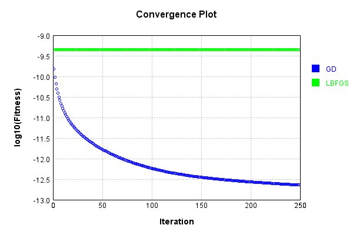


Code from [LearningTester.java:99](../../../../../../../src/main/java/com/simiacryptus/mindseye/test/unit/LearningTester.java#L99) executed in 0.00 seconds: 
```java
    return TestUtil.compareTime(runs);
```

Returns: 

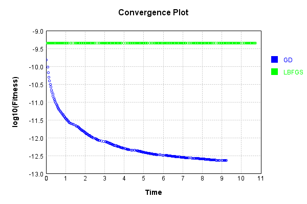


### Model Learning
In this test, attempt to train a network to emulate a randomized network given an example input/output. The target state is:

Code from [LearningTester.java:176](../../../../../../../src/main/java/com/simiacryptus/mindseye/test/unit/LearningTester.java#L176) executed in 0.00 seconds: 
```java
    return network_target.state().stream().map(Arrays::toString).reduce((a, b) -> a + "\n" + b).orElse("");
```

Returns: 

```
    [0.0908, -0.05, 0.03780000000000001, -0.005, 0.046, -0.0994, 0.0426, 0.0124, 0.0506, 0.0908, -0.0782, 0.08020000000000001, 0.0844, 0.0412, 0.060200000000000004, 0.011, -0.092, 0.084, 0.07980000000000001, 0.056600000000000004, 0.0964, -0.0354, 0.05240000000000001, -0.049400000000000006, 0.09340000000000001, -0.027200000000000002, -0.096, 0.0388, 0.011, -0.09160000000000001, 0.04440000000000001, -0.028, -0.009, -0.05, 0.07260000000000001, -0.0728, 0.09960000000000001, 0.05840000000000001, -0.006600000000000001, -0.055400000000000005, -0.0402, 0.027800000000000002, 0.0246, -0.096, 0.097, -0.0036, -0.011600000000000001, -0.0632, 0.017400000000000002, -0.0806, -0.043, 0.004, -0.0752, -0.0776, 0.041400000000000006, -0.0874, 0.0206, 0.060200000000000004, -0.056400000000000006, 0.024, -0.08120000000000001, 0.002, 0.026600000000000002, 0.0926, 0.0122, 0.0014000000000000002, 0.0454, 0.0396, 0.0134, 0.061200000000000004, 0.0352, 0.021400000000000002, 0.017400000000000002, -0.050800000000000005, -0.061200000000000004, 0.
```
...[skipping 1319 bytes](etc/43.txt)...
```
     0.005600000000000001, 0.019600000000000003, 0.08020000000000001, -0.08860000000000001, -0.09960000000000001, -0.075, -0.038400000000000004, 0.089, 0.0614, -0.0842, -0.049800000000000004, -0.0054, 0.007, 0.0044, -0.0842, -0.09580000000000001, -0.0158, 0.04, 0.09280000000000001, 0.04240000000000001, -0.0402, -0.017400000000000002, -0.060200000000000004, -0.060200000000000004, 0.017, -0.0942, 0.0068000000000000005, 0.09620000000000001, -0.0586, -0.0534, 0.0218, 0.049400000000000006, 0.048600000000000004, -0.0082, -0.0698, -0.021, 0.0274, -0.0198, 0.013, -0.042800000000000005, -0.09780000000000001, -0.0786, -0.0496, -0.060200000000000004, 0.0176, -0.003, 0.034, 0.0862, -0.05240000000000001, 0.093, 0.081, -0.0874, 0.031400000000000004, 0.038200000000000005, 0.07840000000000001, -0.0332, 0.0806, -0.07880000000000001, -0.067, -0.008400000000000001, 8.0E-4, 0.0018, 0.07440000000000001, 0.0884, 0.053200000000000004, -0.0456, 0.041800000000000004, -0.039200000000000006, 0.0134, -0.0216]
    [0.0, 0.0, 0.0]
    [0.0, 0.0, 0.0]
```


First, we use a conjugate gradient descent method, which converges the fastest for purely linear functions.

Code from [LearningTester.java:300](../../../../../../../src/main/java/com/simiacryptus/mindseye/test/unit/LearningTester.java#L300) executed in 16.59 seconds: 
```java
    return new IterativeTrainer(trainable)
      .setLineSearchFactory(label -> new QuadraticSearch())
      .setOrientation(new GradientDescent())
      .setMonitor(monitor)
      .setTimeout(30, TimeUnit.SECONDS)
      .setMaxIterations(250)
      .setTerminateThreshold(0)
      .run();
```
Logging: 
```
    Constructing line search parameters: GD
    F(0.0) = LineSearchPoint{point=PointSample{avg=8.352067855228229E-4}, derivative=-2.5268259202237075E-4}
    New Minimum: 8.352067855228229E-4 > 8.352067854975554E-4
    F(1.0E-10) = LineSearchPoint{point=PointSample{avg=8.352067854975554E-4}, derivative=-2.526825920170051E-4}, delta = -2.5267548470209178E-14
    New Minimum: 8.352067854975554E-4 > 8.352067853459453E-4
    F(7.000000000000001E-10) = LineSearchPoint{point=PointSample{avg=8.352067853459453E-4}, derivative=-2.5268259198481024E-4}, delta = -1.7687760978102318E-13
    New Minimum: 8.352067853459453E-4 > 8.352067842846786E-4
    F(4.900000000000001E-9) = LineSearchPoint{point=PointSample{avg=8.352067842846786E-4}, derivative=-2.526825917594473E-4}, delta = -1.2381443526693348E-12
    New Minimum: 8.352067842846786E-4 > 8.352067768558104E-4
    F(3.430000000000001E-8) = LineSearchPoint{point=PointSample{avg=8.352067768558104E-4}, derivative=-2.5268259018190677E-4}, delta = -8.667012528669471E-12
    New Minimum: 8.352067768558104E-4 > 
```
...[skipping 444816 bytes](etc/44.txt)...
```
    266678E-7}, derivative=-6.792540467050103E-11}, delta = -1.5281067186449866E-9
    F(130.31550216220927) = LineSearchPoint{point=PointSample{avg=9.898812852694425E-7}, derivative=1.020368407687529E-10}, delta = 3.759008241296635E-10
    F(10.02426939709302) = LineSearchPoint{point=PointSample{avg=9.886170554693857E-7}, derivative=-8.099453215638972E-11}, delta = -8.883289759270888E-10
    New Minimum: 9.870870516800173E-7 > 9.864970366636396E-7
    F(70.16988577965114) = LineSearchPoint{point=PointSample{avg=9.864970366636396E-7}, derivative=1.0504035583060503E-11}, delta = -3.008347781673249E-9
    9.864970366636396E-7 <= 9.895053844453128E-7
    New Minimum: 9.864970366636396E-7 > 9.864607792346935E-7
    F(63.26495366735447) = LineSearchPoint{point=PointSample{avg=9.864607792346935E-7}, derivative=-2.0674255194168896E-15}, delta = -3.04460521061933E-9
    Left bracket at 63.26495366735447
    Converged to left
    Iteration 250 complete. Error: 9.864607792346935E-7 Total: 251002643384090.4000; Orientation: 0.0000; Line Search: 0.0478
    
```

Returns: 

```
    9.864607792346935E-7
```


Training Converged

Next, we run the same optimization using L-BFGS, which is nearly ideal for purely second-order or quadratic functions.

Code from [LearningTester.java:324](../../../../../../../src/main/java/com/simiacryptus/mindseye/test/unit/LearningTester.java#L324) executed in 6.89 seconds: 
```java
    return new IterativeTrainer(trainable)
      .setLineSearchFactory(label -> new ArmijoWolfeSearch())
      .setOrientation(new LBFGS())
      .setMonitor(monitor)
      .setTimeout(30, TimeUnit.SECONDS)
      .setMaxIterations(250)
      .setTerminateThreshold(0)
      .run();
```
Logging: 
```
    LBFGS Accumulation History: 1 points
    Constructing line search parameters: GD
    th(0)=3.262737228502297E-4;dx=-3.659666077092187E-5
    New Minimum: 3.262737228502297E-4 > 2.637265700527284E-4
    END: th(2.154434690031884)=2.637265700527284E-4; dx=-2.146972122424894E-5 delta=6.254715279750125E-5
    Iteration 1 complete. Error: 2.637265700527284E-4 Total: 251002721319125.3400; Orientation: 0.0002; Line Search: 0.0224
    LBFGS Accumulation History: 1 points
    th(0)=2.637265700527284E-4;dx=-1.3465679246861403E-5
    New Minimum: 2.637265700527284E-4 > 2.2250906101085904E-4
    END: th(4.641588833612779)=2.2250906101085904E-4; dx=-4.298327996135686E-6 delta=4.121750904186939E-5
    Iteration 2 complete. Error: 2.2250906101085904E-4 Total: 251002755403110.2800; Orientation: 0.0002; Line Search: 0.0227
    LBFGS Accumulation History: 1 points
    th(0)=2.2250906101085904E-4;dx=-4.223574699149826E-6
    New Minimum: 2.2250906101085904E-4 > 1.8306989082994953E-4
    END: th(10.000000000000002)=1.8306989082994953E-4; dx=-3.664744291428552E-6 delta=3
```
...[skipping 143350 bytes](etc/45.txt)...
```
    17E-7 > 9.108839564062765E-7
    WOLFE (weak): th(11.345277003888484)=9.108839564062765E-7; dx=-8.180190171140077E-11 delta=9.782041589652104E-10
    New Minimum: 9.108839564062765E-7 > 9.100060305643702E-7
    END: th(22.690554007776967)=9.100060305643702E-7; dx=-7.296306782958381E-11 delta=1.8561300008714202E-9
    Iteration 249 complete. Error: 9.100060305643702E-7 Total: 251009513300282.5000; Orientation: 0.0001; Line Search: 0.0145
    LBFGS Accumulation History: 1 points
    th(0)=9.100060305643702E-7;dx=-1.426517656215412E-10
    Armijo: th(48.88531669039669)=9.177554221401974E-7; dx=4.5971358892261325E-10 delta=-7.749391575827147E-9
    Armijo: th(24.442658345198346)=9.101998736522709E-7; dx=1.585173417651852E-10 delta=-1.9384308790065338E-10
    New Minimum: 9.100060305643702E-7 > 9.092527186237972E-7
    END: th(8.147552781732783)=9.092527186237972E-7; dx=-4.2265082324003425E-11 delta=7.533119405730158E-10
    Iteration 250 complete. Error: 9.092527186237972E-7 Total: 251009537140434.5000; Orientation: 0.0001; Line Search: 0.0191
    
```

Returns: 

```
    9.092527186237972E-7
```


Training Converged

Code from [LearningTester.java:96](../../../../../../../src/main/java/com/simiacryptus/mindseye/test/unit/LearningTester.java#L96) executed in 0.00 seconds: 
```java
    return TestUtil.compare(runs);
```

Returns: 

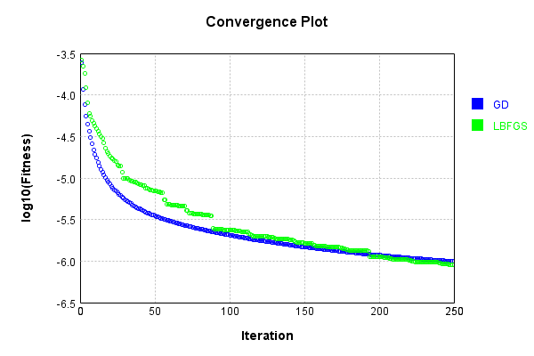


Code from [LearningTester.java:99](../../../../../../../src/main/java/com/simiacryptus/mindseye/test/unit/LearningTester.java#L99) executed in 0.00 seconds: 
```java
    return TestUtil.compareTime(runs);
```

Returns: 

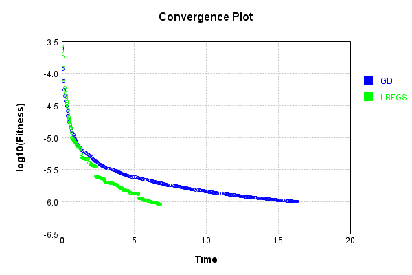


### Composite Learning
In this test, attempt to train a network to emulate a randomized network given an example input/output. The target state is:

Code from [LearningTester.java:219](../../../../../../../src/main/java/com/simiacryptus/mindseye/test/unit/LearningTester.java#L219) executed in 0.00 seconds: 
```java
    return network_target.state().stream().map(Arrays::toString).reduce((a, b) -> a + "\n" + b).orElse("");
```

Returns: 

```
    [0.048, 0.0908, 0.0124, 0.060200000000000004, -0.0728, -0.0994, 0.09960000000000001, -0.096, 0.0352, -0.061200000000000004, 0.024, -0.0354, 0.07260000000000001, -0.0776, 0.08860000000000001, -0.0632, 0.09340000000000001, -0.027200000000000002, -0.083, 0.046, 0.04440000000000001, 0.0412, 0.060200000000000004, 0.05840000000000001, -0.009, 0.0964, -0.011600000000000001, 0.0426, 0.0122, 0.0844, 0.0, 0.0246, -0.028, 0.011, 0.017400000000000002, -0.05, 0.061200000000000004, 0.026600000000000002, -0.055400000000000005, -0.0806, -0.050800000000000005, -0.0874, -0.056400000000000006, 0.011, -0.0036, -0.096, -0.092, 0.017400000000000002, 0.0454, 0.097, -0.025200000000000004, 0.0926, -0.0402, 0.0908, -0.09160000000000001, -0.0782, -0.049400000000000006, -0.043, 0.027800000000000002, -0.05, 0.0134, 0.0014000000000000002, 0.004, -0.0752, 0.03780000000000001, 0.041400000000000006, 0.056600000000000004, 0.084, 0.0506, 0.002, 0.0388, 0.0396, 0.0206, 0.021400000000000002, -0.006600000000000001, -0.005, -0.09160000000000001, -
```
...[skipping 1319 bytes](etc/46.txt)...
```
    004, 0.07440000000000001, -0.021, -0.09680000000000001, -0.0332, -0.0082, -0.003, 0.0134, 0.0806, 0.0626, -0.042800000000000005, 0.0884, 0.093, 0.034, 0.09240000000000001, 0.09620000000000001, -0.0318, 0.0052, -0.008400000000000001, 0.065, 0.019600000000000003, 0.0376, -0.08860000000000001, 0.017, 0.031400000000000004, -0.07880000000000001, 0.089, -0.0198, -0.0586, 0.0466, 8.0E-4, 0.049400000000000006, 0.038200000000000005, -0.0534, -0.0054, -0.060200000000000004, 0.04, -0.0496, -0.05240000000000001, 0.0218, -0.0992, -0.060200000000000004, 0.0068000000000000005, 0.048600000000000004, -0.093, -0.038400000000000004, 0.0044, -0.0216, 0.04240000000000001, -0.0942, -0.0698, -0.09780000000000001, -0.017400000000000002, 0.0018, -0.060200000000000004, 0.005600000000000001, 0.09280000000000001, 0.053200000000000004, 0.0614, -0.0842, 0.07840000000000001, -0.039200000000000006, -0.09580000000000001, 0.0862, -0.049800000000000004, 0.013, -0.0456, 0.08020000000000001, -0.075, 0.0274, 0.081]
    [0.0, 0.0, 0.0]
    [0.0, 0.0, 0.0]
```


We simultaneously regress this target input:

Code from [LearningTester.java:223](../../../../../../../src/main/java/com/simiacryptus/mindseye/test/unit/LearningTester.java#L223) executed in 0.00 seconds: 
```java
    return Arrays.stream(testInput).map(x -> x.prettyPrint()).reduce((a, b) -> a + "\n" + b).orElse("");
```

Returns: 

```
    [
    	[ [ 0.07940000000000001, 0.083, 0.0144 ], [ -0.0844, 0.095, -0.0626 ], [ 0.0354, 0.066, -0.052 ], [ -0.0234, 0.0704, 0.04580000000000001 ], [ 0.0946, 0.0884, 0.033800000000000004 ] ],
    	[ [ -0.017, 0.0664, 0.0016 ], [ 0.0614, -0.0234, -0.009800000000000001 ], [ -0.0582, -0.089, -0.0898 ], [ 0.0172, 0.0074, 0.046 ], [ -0.068, 0.0408, -0.049800000000000004 ] ],
    	[ [ -0.06760000000000001, 0.07980000000000001, -0.023 ], [ 0.0898, -0.0882, 0.021200000000000004 ], [ 0.033, -0.0388, -0.0114 ], [ 0.0166, -0.0674, 0.099 ], [ -0.0994, 0.09280000000000001, -0.0526 ] ],
    	[ [ 0.039200000000000006, 0.0864, 0.0692 ], [ -0.0028000000000000004, 0.0582, 0.0062 ], [ 0.07460000000000001, 0.024200000000000003, 0.0068000000000000005 ], [ 0.08780000000000002, 0.0442, 0.083 ], [ 0.077, 0.0718, -0.065 ] ],
    	[ [ 0.0398, 0.0204, 0.0854 ], [ -0.06620000000000001, 0.09, -0.0922 ], [ -0.0516, -0.07780000000000001, -0.047200000000000006 ], [ -0.060200000000000004, -0.013200000000000002, -0.021 ], [ -0.08660000000000001, -0.058, -0.09240000000000001 ] ]
    ]
```


Which produces the following output:

Code from [LearningTester.java:230](../../../../../../../src/main/java/com/simiacryptus/mindseye/test/unit/LearningTester.java#L230) executed in 0.00 seconds: 
```java
    return Stream.of(targetOutput).map(x -> x.prettyPrint()).reduce((a, b) -> a + "\n" + b).orElse("");
```

Returns: 

```
    [
    	[ [ 0.4657799957532928, 0.5283291022874643, 0.5201525877371196 ], [ 0.4597383698212945, 0.5301003224141093, 0.5187317486247794 ], [ 0.4601257414306602, 0.5289576716572463, 0.5179835309537412 ], [ 0.4598644039958798, 0.5294275578613641, 0.5183484559698135 ], [ 0.4720700874549017, 0.5149802348613286, 0.501787360599291 ] ],
    	[ [ 0.4916957627324951, 0.5413083685481977, 0.4897015835653602 ], [ 0.5157799122243908, 0.5601444756191472, 0.4806587433321123 ], [ 0.5169742648194746, 0.5594202507965857, 0.4793249694925796 ], [ 0.5164758478857316, 0.5603789729199173, 0.47946893097335863 ], [ 0.5259516730965768, 0.534891804860308, 0.47579075409092497 ] ],
    	[ [ 0.49066642501148755, 0.5418392495526579, 0.4900512252066168 ], [ 0.5147688210713004, 0.5602524757564206, 0.4813333919274718 ], [ 0.5164660311345601, 0.5599621356008093, 0.47989160130839964 ], [ 0.5159072651855299, 0.5608028236079563, 0.4802478895499408 ], [ 0.5259010380740371, 0.5348859262116468, 0.4762120771944253 ] ],
    	[ [ 0.4904577010242782, 0.5420155264721236, 0.4896896214816205 ], [ 0.5142113863502524, 0.5594897637021515, 0.4802017461444258 ], [ 0.5155456056500405, 0.5589608773831459, 0.47908353713185525 ], [ 0.5154327788919963, 0.5594971360165476, 0.4790281879082595 ], [ 0.5252357569326191, 0.533503538567173, 0.4758194656919107 ] ],
    	[ [ 0.4959747817905852, 0.51451290698885, 0.4763221586202094 ], [ 0.5157917786574941, 0.5284017648451059, 0.4551137763080289 ], [ 0.5171198019211601, 0.5287149134982396, 0.45469919080643817 ], [ 0.5168601889039037, 0.5293285635639016, 0.4546930093520488 ], [ 0.521182188259873, 0.5212461331982181, 0.4642714332132876 ] ]
    ]
```


First, we use a conjugate gradient descent method, which converges the fastest for purely linear functions.

Code from [LearningTester.java:300](../../../../../../../src/main/java/com/simiacryptus/mindseye/test/unit/LearningTester.java#L300) executed in 18.38 seconds: 
```java
    return new IterativeTrainer(trainable)
      .setLineSearchFactory(label -> new QuadraticSearch())
      .setOrientation(new GradientDescent())
      .setMonitor(monitor)
      .setTimeout(30, TimeUnit.SECONDS)
      .setMaxIterations(250)
      .setTerminateThreshold(0)
      .run();
```
Logging: 
```
    Constructing line search parameters: GD
    F(0.0) = LineSearchPoint{point=PointSample{avg=6.322374031121595E-4}, derivative=-1.832461216619305E-4}
    New Minimum: 6.322374031121595E-4 > 6.322374030938347E-4
    F(1.0E-10) = LineSearchPoint{point=PointSample{avg=6.322374030938347E-4}, derivative=-1.8324612165796945E-4}, delta = -1.832485985869825E-14
    New Minimum: 6.322374030938347E-4 > 6.322374029838874E-4
    F(7.000000000000001E-10) = LineSearchPoint{point=PointSample{avg=6.322374029838874E-4}, derivative=-1.83246121634203E-4}, delta = -1.2827217586719453E-13
    New Minimum: 6.322374029838874E-4 > 6.322374022142531E-4
    F(4.900000000000001E-9) = LineSearchPoint{point=PointSample{avg=6.322374022142531E-4}, derivative=-1.8324612146783736E-4}, delta = -8.979064236927514E-13
    New Minimum: 6.322374022142531E-4 > 6.322373968268173E-4
    F(3.430000000000001E-8) = LineSearchPoint{point=PointSample{avg=6.322373968268173E-4}, derivative=-1.8324612030327857E-4}, delta = -6.285342255343829E-12
    New Minimum: 6.322373968268173E-4 > 6.3
```
...[skipping 462560 bytes](etc/47.txt)...
```
    325388E-7}, derivative=-5.418848928635758E-11}, delta = -1.2034921216799346E-9
    F(128.88298022367698) = LineSearchPoint{point=PointSample{avg=5.614901893155253E-7}, derivative=7.993171229265377E-11}, delta = 2.1842876130659536E-10
    F(9.914075401821306) = LineSearchPoint{point=PointSample{avg=5.605725853799299E-7}, derivative=-6.450533478607081E-11}, delta = -6.99175174288806E-10
    New Minimum: 5.593642746540038E-7 > 5.588834476501988E-7
    F(69.39852781274914) = LineSearchPoint{point=PointSample{avg=5.588834476501988E-7}, derivative=7.712864932509694E-12}, delta = -2.3883129040198696E-9
    5.588834476501988E-7 <= 5.612717605542187E-7
    New Minimum: 5.588834476501988E-7 > 5.588589481940247E-7
    F(63.0456154311099) = LineSearchPoint{point=PointSample{avg=5.588589481940247E-7}, derivative=-3.6985765897486863E-17}, delta = -2.4128123601940535E-9
    Left bracket at 63.0456154311099
    Converged to left
    Iteration 250 complete. Error: 5.588589481940247E-7 Total: 251028074273099.9700; Orientation: 0.0001; Line Search: 0.0503
    
```

Returns: 

```
    5.588589481940247E-7
```


Training Converged

Next, we run the same optimization using L-BFGS, which is nearly ideal for purely second-order or quadratic functions.

Code from [LearningTester.java:324](../../../../../../../src/main/java/com/simiacryptus/mindseye/test/unit/LearningTester.java#L324) executed in 7.06 seconds: 
```java
    return new IterativeTrainer(trainable)
      .setLineSearchFactory(label -> new ArmijoWolfeSearch())
      .setOrientation(new LBFGS())
      .setMonitor(monitor)
      .setTimeout(30, TimeUnit.SECONDS)
      .setMaxIterations(250)
      .setTerminateThreshold(0)
      .run();
```
Logging: 
```
    LBFGS Accumulation History: 1 points
    Constructing line search parameters: GD
    th(0)=6.322374031121595E-4;dx=-1.832461216619305E-4
    New Minimum: 6.322374031121595E-4 > 3.2954870527083553E-4
    END: th(2.154434690031884)=3.2954870527083553E-4; dx=-9.769148825614919E-5 delta=3.02688697841324E-4
    Iteration 1 complete. Error: 3.2954870527083553E-4 Total: 251028105847565.9000; Orientation: 0.0002; Line Search: 0.0101
    LBFGS Accumulation History: 1 points
    th(0)=3.2954870527083553E-4;dx=-5.303696114430566E-5
    New Minimum: 3.2954870527083553E-4 > 2.0019459715363766E-4
    END: th(4.641588833612779)=2.0019459715363766E-4; dx=-2.729219017990796E-6 delta=1.2935410811719787E-4
    Iteration 2 complete. Error: 2.0019459715363766E-4 Total: 251028122639632.9000; Orientation: 0.0002; Line Search: 0.0116
    LBFGS Accumulation History: 1 points
    th(0)=2.0019459715363766E-4;dx=-4.0418319515240105E-6
    New Minimum: 2.0019459715363766E-4 > 1.6292335733708325E-4
    END: th(10.000000000000002)=1.6292335733708325E-4; dx=-3.41249217366915E-6 del
```
...[skipping 142676 bytes](etc/48.txt)...
```
    27953E-7 > 3.223813034172416E-7
    END: th(3.4444852820798526)=3.223813034172416E-7; dx=-9.220122435905809E-11 delta=6.964744750379084E-10
    Iteration 248 complete. Error: 3.223813034172416E-7 Total: 251035106474511.9400; Orientation: 0.0001; Line Search: 0.0365
    LBFGS Accumulation History: 1 points
    th(0)=3.223813034172416E-7;dx=-3.9511110899833975E-11
    New Minimum: 3.223813034172416E-7 > 3.2218900615294556E-7
    END: th(7.4209185810170935)=3.2218900615294556E-7; dx=-1.2314615949752786E-11 delta=1.9229726429606223E-10
    Iteration 249 complete. Error: 3.2218900615294556E-7 Total: 251035121708315.9000; Orientation: 0.0002; Line Search: 0.0102
    LBFGS Accumulation History: 1 points
    th(0)=3.2218900615294556E-7;dx=-2.965673496566746E-11
    New Minimum: 3.2218900615294556E-7 > 3.219059214710798E-7
    END: th(15.98788442284541)=3.219059214710798E-7; dx=-5.755740883261274E-12 delta=2.830846818657745E-10
    Iteration 250 complete. Error: 3.219059214710798E-7 Total: 251035136983157.8800; Orientation: 0.0002; Line Search: 0.0099
    
```

Returns: 

```
    3.219059214710798E-7
```


Training Converged

Code from [LearningTester.java:96](../../../../../../../src/main/java/com/simiacryptus/mindseye/test/unit/LearningTester.java#L96) executed in 0.00 seconds: 
```java
    return TestUtil.compare(runs);
```

Returns: 

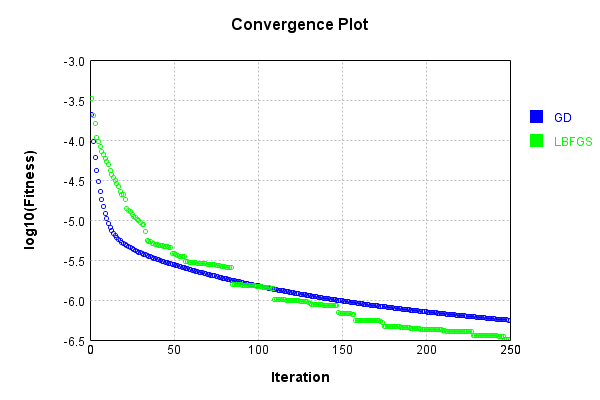


Code from [LearningTester.java:99](../../../../../../../src/main/java/com/simiacryptus/mindseye/test/unit/LearningTester.java#L99) executed in 0.00 seconds: 
```java
    return TestUtil.compareTime(runs);
```

Returns: 

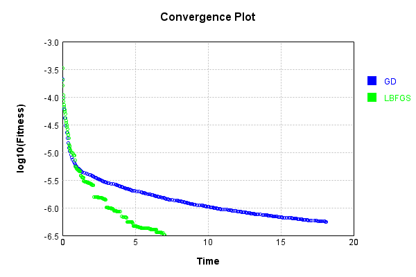


