# UniformPipeline
This is a network with the following layout:

Code from [NLayerTest.java:87](../../../../../../../src/test/java/com/simiacryptus/mindseye/network/NLayerTest.java#L87) executed in 0.13 seconds: 
```java
    return Graphviz.fromGraph(TestUtil.toGraph((DAGNetwork) layer))
      .height(400).width(600).render(Format.PNG).toImage();
```

Returns: 

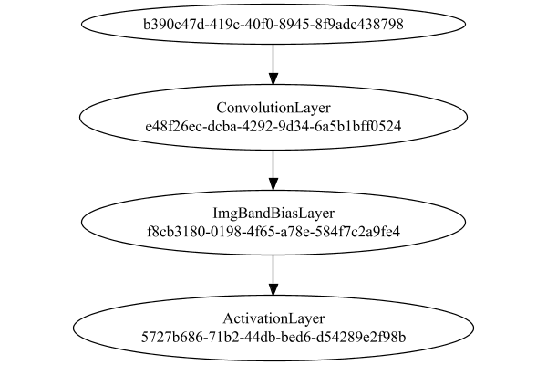


### Json Serialization
Code from [JsonTest.java:36](../../../../../../../src/main/java/com/simiacryptus/mindseye/test/unit/JsonTest.java#L36) executed in 0.00 seconds: 
```java
    JsonObject json = layer.getJson();
    NNLayer echo = NNLayer.fromJson(json);
    if ((echo == null)) throw new AssertionError("Failed to deserialize");
    if ((layer == echo)) throw new AssertionError("Serialization did not copy");
    if ((!layer.equals(echo))) throw new AssertionError("Serialization not equal");
    return new GsonBuilder().setPrettyPrinting().create().toJson(json);
```

Returns: 

```
    {
      "class": "com.simiacryptus.mindseye.network.PipelineNetwork",
      "id": "2d70d667-6c9f-4b7a-bf3c-31e6b8b1aab0",
      "isFrozen": false,
      "name": "PipelineNetwork/2d70d667-6c9f-4b7a-bf3c-31e6b8b1aab0",
      "inputs": [
        "b390c47d-419c-40f0-8945-8f9adc438798"
      ],
      "nodes": {
        "ec2a5519-2283-4706-bcab-d4d25403fb98": "e48f26ec-dcba-4292-9d34-6a5b1bff0524",
        "8c8af80c-74c0-49f1-ab18-7a0d2ec656c5": "f8cb3180-0198-4f65-a78e-584f7c2a9fe4",
        "5b666bcf-5f06-4ad7-a267-8c68ed24fba6": "5727b686-71b2-44db-bed6-d54289e2f98b"
      },
      "layers": {
        "e48f26ec-dcba-4292-9d34-6a5b1bff0524": {
          "class": "com.simiacryptus.mindseye.layers.cudnn.ConvolutionLayer",
          "id": "e48f26ec-dcba-4292-9d34-6a5b1bff0524",
          "isFrozen": false,
          "name": "ConvolutionLayer/e48f26ec-dcba-4292-9d34-6a5b1bff0524",
          "filter": [
            [
              [
                0.022200000000000004,
                -0.09440000000000001,
                -0.027200000000000002
              ],
              [
                -0.0108,
                0.0402,
      
```
...[skipping 2817 bytes](etc/49.txt)...
```
    ": {
          "class": "com.simiacryptus.mindseye.layers.cudnn.ImgBandBiasLayer",
          "id": "f8cb3180-0198-4f65-a78e-584f7c2a9fe4",
          "isFrozen": false,
          "name": "ImgBandBiasLayer/f8cb3180-0198-4f65-a78e-584f7c2a9fe4",
          "bias": [
            0.0,
            0.0,
            0.0
          ],
          "precision": "Double"
        },
        "5727b686-71b2-44db-bed6-d54289e2f98b": {
          "class": "com.simiacryptus.mindseye.layers.cudnn.ActivationLayer",
          "id": "5727b686-71b2-44db-bed6-d54289e2f98b",
          "isFrozen": false,
          "name": "ActivationLayer/5727b686-71b2-44db-bed6-d54289e2f98b",
          "mode": 1,
          "precision": "Double"
        }
      },
      "links": {
        "ec2a5519-2283-4706-bcab-d4d25403fb98": [
          "b390c47d-419c-40f0-8945-8f9adc438798"
        ],
        "8c8af80c-74c0-49f1-ab18-7a0d2ec656c5": [
          "ec2a5519-2283-4706-bcab-d4d25403fb98"
        ],
        "5b666bcf-5f06-4ad7-a267-8c68ed24fba6": [
          "8c8af80c-74c0-49f1-ab18-7a0d2ec656c5"
        ]
      },
      "labels": {},
      "head": "5b666bcf-5f06-4ad7-a267-8c68ed24fba6"
    }
```


### Input Learning
In this test, we use a network to learn this target input, given it's pre-evaluated output:

Code from [LearningTester.java:127](../../../../../../../src/main/java/com/simiacryptus/mindseye/test/unit/LearningTester.java#L127) executed in 0.00 seconds: 
```java
    return Arrays.stream(input_target).map(x -> x.prettyPrint()).reduce((a, b) -> a + "\n" + b).orElse("");
```

Returns: 

```
    [
    	[ [ -0.0198, 0.0364, 0.06340000000000001 ], [ 0.048600000000000004, 0.08280000000000001, -0.047 ], [ 0.046, 0.0416, -0.036800000000000006 ], [ 0.0674, 0.0402, 0.0426 ], [ 0.023, 0.0992, 0.026 ] ],
    	[ [ 0.041, -0.096, -0.071 ], [ 0.06080000000000001, 0.0286, -0.052 ], [ -0.0436, -0.0032, 0.029 ], [ 0.07540000000000001, -0.049800000000000004, 0.06340000000000001 ], [ 0.044, -0.037399999999999996, -0.062400000000000004 ] ],
    	[ [ 0.026600000000000002, 0.005600000000000001, -0.015600000000000001 ], [ 0.0694, -0.09820000000000001, -0.0284 ], [ 0.0062, 0.07940000000000001, 0.0154 ], [ 0.0352, -0.0388, -0.0234 ], [ -0.032600000000000004, 0.021200000000000004, -0.019600000000000003 ] ],
    	[ [ 0.0062, 0.0218, -0.07680000000000001 ], [ -0.08760000000000001, -0.040400000000000005, -0.08220000000000001 ], [ 0.0456, -0.0678, 0.0884 ], [ -0.0164, -0.025, 0.07579999999999999 ], [ 0.0956, -0.05040000000000001, -0.043 ] ],
    	[ [ -8.0E-4, 0.0648, 0.05040000000000001 ], [ -0.048600000000000004, 0.072, -0.019200000000000002 ], [ 0.05040000000000001, 0.055400000000000005, 0.088 ], [ -0.0882, -0.089, -0.089 ], [ 0.018400000000000003, -0.07260000000000001, 0.017400000000000002 ] ]
    ]
```


First, we use a conjugate gradient descent method, which converges the fastest for purely linear functions.

Code from [LearningTester.java:300](../../../../../../../src/main/java/com/simiacryptus/mindseye/test/unit/LearningTester.java#L300) executed in 3.50 seconds: 
```java
    return new IterativeTrainer(trainable)
      .setLineSearchFactory(label -> new QuadraticSearch())
      .setOrientation(new GradientDescent())
      .setMonitor(monitor)
      .setTimeout(30, TimeUnit.SECONDS)
      .setMaxIterations(250)
      .setTerminateThreshold(0)
      .run();
```
Logging: 
```
    Constructing line search parameters: GD
    F(0.0) = LineSearchPoint{point=PointSample{avg=1.0677719814182402E-4}, derivative=-2.767497499005315E-7}
    New Minimum: 1.0677719814182402E-4 > 1.0677719814179633E-4
    F(1.0E-10) = LineSearchPoint{point=PointSample{avg=1.0677719814179633E-4}, derivative=-2.7674974990044433E-7}, delta = -2.768781297984857E-17
    New Minimum: 1.0677719814179633E-4 > 1.0677719814163028E-4
    F(7.000000000000001E-10) = LineSearchPoint{point=PointSample{avg=1.0677719814163028E-4}, derivative=-2.7674974989992124E-7}, delta = -1.9373337569600357E-16
    New Minimum: 1.0677719814163028E-4 > 1.0677719814046795E-4
    F(4.900000000000001E-9) = LineSearchPoint{point=PointSample{avg=1.0677719814046795E-4}, derivative=-2.7674974989625935E-7}, delta = -1.3560658672362447E-15
    New Minimum: 1.0677719814046795E-4 > 1.0677719813233152E-4
    F(3.430000000000001E-8) = LineSearchPoint{point=PointSample{avg=1.0677719813233152E-4}, derivative=-2.767497498706264E-7}, delta = -9.492501728235181E-15
    New Minimum: 1.067771981
```
...[skipping 269671 bytes](etc/50.txt)...
```
    
    Right bracket at 507.1606920583219
    F(461.05637327961693) = LineSearchPoint{point=PointSample{avg=1.1469255250005346E-5}, derivative=5.207582345069098E-26}, delta = -1.6940658945086007E-21
    Right bracket at 461.05637327961693
    Converged to right
    Iteration 212 complete. Error: 1.1469255250005346E-5 Total: 251038956669062.0600; Orientation: 0.0000; Line Search: 0.0308
    Zero gradient: 2.6709995179183658E-12
    F(0.0) = LineSearchPoint{point=PointSample{avg=1.1469255250005346E-5}, derivative=-7.134238424720142E-24}
    F(461.05637327961693) = LineSearchPoint{point=PointSample{avg=1.1469255250005346E-5}, derivative=2.4966720095105827E-24}, delta = 0.0
    1.1469255250005346E-5 <= 1.1469255250005346E-5
    F(341.53428345907884) = LineSearchPoint{point=PointSample{avg=1.1469255250005346E-5}, derivative=2.888242534742993E-26}, delta = 0.0
    Right bracket at 341.53428345907884
    Converged to right
    Iteration 213 failed, aborting. Error: 1.1469255250005346E-5 Total: 251038973098066.0300; Orientation: 0.0000; Line Search: 0.0130
    
```

Returns: 

```
    1.1469255250005346E-5
```


This training run resulted in the following regressed input:

Code from [LearningTester.java:144](../../../../../../../src/main/java/com/simiacryptus/mindseye/test/unit/LearningTester.java#L144) executed in 0.00 seconds: 
```java
    return Arrays.stream(input_gd).map(x -> x.prettyPrint()).reduce((a, b) -> a + "\n" + b).orElse("");
```

Returns: 

```
    [
    	[ [ -0.06628408265731812, 0.031653658798959546, 0.0194612690257665 ], [ 0.015767114041336797, 0.05989662617026212, -0.08682908866602078 ], [ 0.030497389073369702, -0.008454835848209453, -0.010101488083603243 ], [ 0.005365043803875117, -0.05151507558946079, -0.13660952334424958 ], [ -0.06604175304478845, -0.03974442975579875, 0.0654403018850447 ] ],
    	[ [ 0.014183388422613432, -0.08686405849967861, -0.11500798322167186 ], [ 0.07491672427479988, 0.020493684281082142, 0.03911822079466682 ], [ -0.09284231951731615, 0.06058732515188499, 0.03487251247384265 ], [ 0.0785060928686297, -0.021117954305550097, 0.009780200478075355 ], [ 0.009310091295357979, 0.0459623508891122, -0.06268894461087453 ] ],
    	[ [ -0.026235623403872258, 0.07482760145948822, -0.06060556895528957 ], [ 0.027905435017185568, -0.09838880879200355, 0.06406502288652777 ], [ 0.029563367438269806, 0.05231948750622982, -0.05609760898894051 ], [ -0.02842661049304177, -0.047288941279217324, -0.041882843293050524 ], [ 0.022000146454986744, 0.03002507341845574, -0.09546987750278994 ] ],
    	[ [ 0.04827374830031952, 0.008145991014415046, -0.05554265568883389 ], [ -0.03461472967710117, -0.02038511135380664, -0.008895064757144376 ], [ 0.05045738286221065, -0.025008050215502373, 0.011114150571853268 ], [ 0.03602350755632026, -0.022410191828755685, 0.03702998788458334 ], [ 0.07318461741852947, 7.516507355710545E-4, -0.050696561296573385 ] ],
    	[ [ 0.016511941305510126, -0.009664894435697416, 0.03294056213036893 ], [ 0.03143351589531196, 0.03371000645352302, -0.02020170010031312 ], [ 0.09839075281434116, 5.195062679349752E-4, 0.04940802407733139 ], [ -0.08865500022986077, -0.015587365663231881, 0.012801349531824033 ], [ 0.026690682863779864, 0.016390866533418355, 0.08017766026531976 ] ]
    ]
```


Next, we run the same optimization using L-BFGS, which is nearly ideal for purely second-order or quadratic functions.

Code from [LearningTester.java:324](../../../../../../../src/main/java/com/simiacryptus/mindseye/test/unit/LearningTester.java#L324) executed in 1.27 seconds: 
```java
    return new IterativeTrainer(trainable)
      .setLineSearchFactory(label -> new ArmijoWolfeSearch())
      .setOrientation(new LBFGS())
      .setMonitor(monitor)
      .setTimeout(30, TimeUnit.SECONDS)
      .setMaxIterations(250)
      .setTerminateThreshold(0)
      .run();
```
Logging: 
```
    LBFGS Accumulation History: 1 points
    Constructing line search parameters: GD
    th(0)=1.0677719814182402E-4;dx=-2.767497499005315E-7
    New Minimum: 1.0677719814182402E-4 > 1.0618298231465327E-4
    WOLFE (weak): th(2.154434690031884)=1.0618298231465327E-4; dx=-2.7487135972982824E-7 delta=5.942158271707526E-7
    New Minimum: 1.0618298231465327E-4 > 1.0559281335642767E-4
    WOLFE (weak): th(4.308869380063768)=1.0559281335642767E-4; dx=-2.72992969559125E-7 delta=1.184384785396343E-6
    New Minimum: 1.0559281335642767E-4 > 1.0327109405075421E-4
    WOLFE (weak): th(12.926608140191302)=1.0327109405075421E-4; dx=-2.6572059662668004E-7 delta=3.5061040910698056E-6
    New Minimum: 1.0327109405075421E-4 > 9.362279807031526E-5
    END: th(51.70643256076521)=9.362279807031526E-5; dx=-2.3187299099772574E-7 delta=1.3154400071508762E-5
    Iteration 1 complete. Error: 9.362279807031526E-5 Total: 251039026101767.0300; Orientation: 0.0001; Line Search: 0.0204
    LBFGS Accumulation History: 1 points
    th(0)=9.362279807031526E-5;dx=-1.9584566283772735E
```
...[skipping 78129 bytes](etc/51.txt)...
```
    58 complete. Error: 1.1195577052992011E-5 Total: 251040238128822.7800; Orientation: 0.0001; Line Search: 0.0051
    LBFGS Accumulation History: 1 points
    th(0)=1.1195577052992011E-5;dx=-8.649915248499754E-24
    Armijo: th(1350.2646573118209)=1.1195577052992028E-5; dx=3.388565074062905E-23 delta=-1.6940658945086007E-20
    Armijo: th(675.1323286559104)=1.1195577052992013E-5; dx=1.250656249753194E-23 delta=-1.6940658945086007E-21
    New Minimum: 1.1195577052992011E-5 > 1.119557705299201E-5
    END: th(225.04410955197014)=1.119557705299201E-5; dx=-1.7826297895902345E-24 delta=1.6940658945086007E-21
    Iteration 159 complete. Error: 1.119557705299201E-5 Total: 251040246147829.7500; Orientation: 0.0001; Line Search: 0.0062
    LBFGS Accumulation History: 1 points
    th(0)=1.119557705299201E-5;dx=-2.617533135155993E-24
    END: th(484.8428364061001)=1.119557705299201E-5; dx=-2.0852793684848917E-24 delta=0.0
    Iteration 160 failed, aborting. Error: 1.119557705299201E-5 Total: 251040250714893.7500; Orientation: 0.0001; Line Search: 0.0030
    
```

Returns: 

```
    1.119557705299201E-5
```


This training run resulted in the following regressed input:

Code from [LearningTester.java:154](../../../../../../../src/main/java/com/simiacryptus/mindseye/test/unit/LearningTester.java#L154) executed in 0.00 seconds: 
```java
    return Arrays.stream(input_lbgfs).map(x -> x.prettyPrint()).reduce((a, b) -> a + "\n" + b).orElse("");
```

Returns: 

```
    [
    	[ [ -0.06844896720710614, 0.032568972103188716, 0.019432393643413884 ], [ 0.027780489834236418, 0.06337094221657344, -0.07876764451204857 ], [ 0.015635890718701206, -0.00619467109136046, -0.018225794058990157 ], [ 0.009208588210328616, -0.05415973717707232, -0.13308059422566187 ], [ -0.06409956721202084, -0.04005905127575694, 0.06343259733282454 ] ],
    	[ [ 0.013893559876023653, -0.08683989108377704, -0.11820419664162922 ], [ 0.07453953877322465, 0.03191345758865282, 0.032900327623361376 ], [ -0.09498963417101117, 0.062200842346022134, 0.03524027488792974 ], [ 0.07552422388704112, -0.018263415175292685, 0.003781098363879814 ], [ 0.01119108098048957, 0.04461314642914071, -0.06400559820465031 ] ],
    	[ [ -0.026991629515105024, 0.06827420590494272, -0.06658005806801238 ], [ 0.031286794390924695, -0.09350944135869196, 0.06319869650717669 ], [ 0.03281089781077412, 0.05617625406789082, -0.043108060887045656 ], [ -0.025468383641478635, -0.04179527909327971, -0.052698203231770095 ], [ 0.026673792236586162, 0.030549255598256924, -0.09167057504207578 ] ],
    	[ [ 0.04746931741433099, 0.009198017185942943, -0.057721905558633387 ], [ -0.0359478379334251, -0.012695720699079118, -0.013216097964962328 ], [ 0.05532715005607134, -0.027563347073857075, 0.018979733517185716 ], [ 0.03330888455848101, -0.012399373655473675, 0.02904626755726902 ], [ 0.0781873371638606, -0.0022557400562969398, -0.048325874608662785 ] ],
    	[ [ 0.016949267465653114, -0.003660630353617601, 0.03395550482000972 ], [ 0.02626194487641078, 0.035868972136938154, -0.018308652333589758 ], [ 0.09302634789619857, 0.0028065862649976955, 0.053651134863319405 ], [ -0.09522142425108843, -0.021993813644440675, 0.010899456719530305 ], [ 0.03148090414629081, 0.01809367113249569, 0.0793958183148627 ] ]
    ]
```


Code from [LearningTester.java:96](../../../../../../../src/main/java/com/simiacryptus/mindseye/test/unit/LearningTester.java#L96) executed in 0.00 seconds: 
```java
    return TestUtil.compare(runs);
```

Returns: 


Code from [LearningTester.java:99](../../../../../../../src/main/java/com/simiacryptus/mindseye/test/unit/LearningTester.java#L99) executed in 0.00 seconds: 
```java
    return TestUtil.compareTime(runs);
```

Returns: 

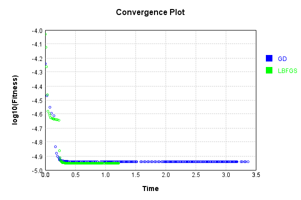


### Model Learning
In this test, attempt to train a network to emulate a randomized network given an example input/output. The target state is:

Code from [LearningTester.java:176](../../../../../../../src/main/java/com/simiacryptus/mindseye/test/unit/LearningTester.java#L176) executed in 0.00 seconds: 
```java
    return network_target.state().stream().map(Arrays::toString).reduce((a, b) -> a + "\n" + b).orElse("");
```

Returns: 

```
    [-0.063, 0.019200000000000002, -0.055400000000000005, 0.063, 0.028, -0.0206, 0.0402, 0.022600000000000002, 0.0534, 0.079, 0.0244, 0.0334, -0.033, -0.0164, 0.049800000000000004, -0.015200000000000002, -0.0534, -0.007, -0.0248, -0.0422, 0.0604, 0.08560000000000001, -0.0058000000000000005, -0.084, 0.0678, -0.027200000000000002, 0.014600000000000002, -0.07260000000000001, -0.08660000000000001, -0.0412, -0.075, 0.056400000000000006, 0.0682, 0.04440000000000001, 0.0332, 0.0388, 0.072, -0.0158, -0.09440000000000001, 0.0172, 0.0048000000000000004, -0.093, 0.0814, 0.0388, 0.0468, -0.08020000000000001, 0.0604, -0.0044, -0.06280000000000001, 0.035800000000000005, 0.0158, 0.0664, -6.000000000000001E-4, -0.0316, -0.0362, -0.041, -0.0034000000000000002, 0.0086, -0.019, 0.08460000000000001, 0.062200000000000005, -0.0558, -0.0898, 0.0932, -0.0068000000000000005, -0.058800000000000005, 0.0154, -0.019600000000000003, -0.0714, -0.0108, 0.0644, 0.08880000000000002, 0.09060000000000001, -0.0796, 0.022200000000000004, 0.063, 0.08120000000000001, 0.0054, -0.0824, 0.047200000000000006, 0.078]
    [0.0, 0.0, 0.0]
```


First, we use a conjugate gradient descent method, which converges the fastest for purely linear functions.

Code from [LearningTester.java:300](../../../../../../../src/main/java/com/simiacryptus/mindseye/test/unit/LearningTester.java#L300) executed in 4.71 seconds: 
```java
    return new IterativeTrainer(trainable)
      .setLineSearchFactory(label -> new QuadraticSearch())
      .setOrientation(new GradientDescent())
      .setMonitor(monitor)
      .setTimeout(30, TimeUnit.SECONDS)
      .setMaxIterations(250)
      .setTerminateThreshold(0)
      .run();
```
Logging: 
```
    Constructing line search parameters: GD
    F(0.0) = LineSearchPoint{point=PointSample{avg=9.059782099272534E-5}, derivative=-3.0884136817412156E-6}
    New Minimum: 9.059782099272534E-5 > 9.059782099241648E-5
    F(1.0E-10) = LineSearchPoint{point=PointSample{avg=9.059782099241648E-5}, derivative=-3.088413681646529E-6}, delta = -3.088620938868081E-16
    New Minimum: 9.059782099241648E-5 > 9.059782099056346E-5
    F(7.000000000000001E-10) = LineSearchPoint{point=PointSample{avg=9.059782099056346E-5}, derivative=-3.0884136810784068E-6}, delta = -2.1618855794089398E-15
    New Minimum: 9.059782099056346E-5 > 9.05978209775921E-5
    F(4.900000000000001E-9) = LineSearchPoint{point=PointSample{avg=9.05978209775921E-5}, derivative=-3.0884136771015507E-6}, delta = -1.5133239713444047E-14
    New Minimum: 9.05978209775921E-5 > 9.059782088679276E-5
    F(3.430000000000001E-8) = LineSearchPoint{point=PointSample{avg=9.059782088679276E-5}, derivative=-3.0884136492635545E-6}, delta = -1.0593258312641823E-13
    New Minimum: 9.059782088679276E-5 > 9.
```
...[skipping 325274 bytes](etc/52.txt)...
```
    69339700992E-5 Total: 251045068816316.9400; Orientation: 0.0000; Line Search: 0.0134
    Low gradient: 8.098339717395402E-6
    F(0.0) = LineSearchPoint{point=PointSample{avg=7.162169339700992E-5}, derivative=-6.558310617834383E-11}
    New Minimum: 7.162169339700992E-5 > 7.16214861176193E-5
    F(3.6820255799782613) = LineSearchPoint{point=PointSample{avg=7.16214861176193E-5}, derivative=-4.7006763780224064E-11}, delta = -2.072793906188284E-10
    F(25.774179059847828) = LineSearchPoint{point=PointSample{avg=7.162167881120135E-5}, derivative=6.445129060849165E-11}, delta = -1.458580856734861E-11
    7.162167881120135E-5 <= 7.162169339700992E-5
    New Minimum: 7.16214861176193E-5 > 7.162126713113869E-5
    F(12.999258378632131) = LineSearchPoint{point=PointSample{avg=7.162126713113869E-5}, derivative=-7.173206874483287E-25}, delta = -4.262658712334347E-10
    Left bracket at 12.999258378632131
    Converged to left
    Iteration 250 complete. Error: 7.162126713113869E-5 Total: 251045079526374.9400; Orientation: 0.0000; Line Search: 0.0090
    
```

Returns: 

```
    7.162126713113869E-5
```


This training run resulted in the following configuration:

Code from [LearningTester.java:189](../../../../../../../src/main/java/com/simiacryptus/mindseye/test/unit/LearningTester.java#L189) executed in 0.00 seconds: 
```java
    return network_gd.state().stream().map(Arrays::toString).reduce((a, b) -> a + "\n" + b).orElse("");
```

Returns: 

```
    [-0.05316303691239882, 0.07682171450014452, -0.05935278743497071, 0.03749946369910711, -0.01978349688101334, -0.013986312255494095, 0.0815226109622684, 0.04814327491389849, -0.016202266379614354, 0.018520336433294784, 0.08187117142695428, 0.0571039868759552, -0.04754175363879342, 0.0057113039970805995, -0.0026136731028291327, -0.08270506272260027, 0.03378333671003446, -0.03425254788282204, -0.07943618284170274, -0.0599516068790345, -0.0675238326940882, 0.0033871829365379035, -0.0969520750925274, -0.015420695622835807, -0.08168960784463783, 0.06642829737111329, 0.08679096929640764, 0.0348711304506587, 0.01177823079077149, 0.01251936778827225, 0.048169136720118445, -0.07607095758043864, 0.020798316884920003, 0.03345828669526629, -0.09026280742015792, 0.07249341386582916, -0.014740249786919811, 0.06873534929280578, -0.04828749862000823, -0.05619486074899207, 0.010043296999621743, -0.11209689186977209, 0.07512766434309398, 0.018097860984856693, -0.03582492428484092, 0.09132168012113033, -0.02559208342686316, 0.03
```
...[skipping 715 bytes](etc/53.txt)...
```
    988462702596485]
    [7.002400000000013E-4, 0.0, 0.005532639999999999, 0.0, 3.38079999999998E-4, 0.0, 0.001689759999999999, 0.012680920000000002, 0.0, 0.0, 0.0, 0.0, 0.0, 0.01903124000000001, 0.029851799999999998, 0.0, 0.016472479999999998, 0.0, 0.0, 0.0, 0.0160652, 0.017680920000000003, 0.0, 0.0, 0.0, 0.0, 0.0036766799999999994, 0.0, 8.881599999999994E-4, 0.003796080000000001, 0.014403039999999997, 0.019805879999999998, 0.0, 0.016340599999999993, 0.02450968, 0.0015046800000000006, 0.007379640000000002, 0.0, 0.00748308, 0.0, 0.012843160000000003, 0.0, 0.0, 0.021113120000000003, 0.0011129999999999983, 0.0, 0.0, 0.0, 0.0, 0.0, 0.0015068800000000006, 0.0, 0.0, 0.006622399999999999, 0.01953492, 0.009238080000000001, 0.016548280000000005, 0.0, 0.0, 0.0, 0.011586800000000003, 0.02127996000000001, 0.0, 0.016808000000000007, 0.0, 0.0, 1.9939999999999764E-4, 0.009213760000000005, 0.02606968, 0.0, 0.014538000000000002, 0.0, 0.0, 0.0, 0.012654320000000002]
    [-0.10527061866609903, -3.608334536350134E-4, -0.035844800170124425]
```


Next, we run the same optimization using L-BFGS, which is nearly ideal for purely second-order or quadratic functions.

Code from [LearningTester.java:324](../../../../../../../src/main/java/com/simiacryptus/mindseye/test/unit/LearningTester.java#L324) executed in 2.21 seconds: 
```java
    return new IterativeTrainer(trainable)
      .setLineSearchFactory(label -> new ArmijoWolfeSearch())
      .setOrientation(new LBFGS())
      .setMonitor(monitor)
      .setTimeout(30, TimeUnit.SECONDS)
      .setMaxIterations(250)
      .setTerminateThreshold(0)
      .run();
```
Logging: 
```
    LBFGS Accumulation History: 1 points
    Constructing line search parameters: GD
    th(0)=1.1889188635430406E-4;dx=-5.993440425599108E-6
    New Minimum: 1.1889188635430406E-4 > 1.0522726660410595E-4
    WOLFE (weak): th(2.154434690031884)=1.0522726660410595E-4; dx=-5.444374841730747E-6 delta=1.3664619750198111E-5
    New Minimum: 1.0522726660410595E-4 > 9.628347763593993E-5
    END: th(4.308869380063768)=9.628347763593993E-5; dx=-2.991203533160273E-6 delta=2.2608408718364137E-5
    Iteration 1 complete. Error: 9.628347763593993E-5 Total: 251045130075841.9000; Orientation: 0.0001; Line Search: 0.0122
    LBFGS Accumulation History: 1 points
    th(0)=9.628347763593993E-5;dx=-2.746513332897774E-6
    New Minimum: 9.628347763593993E-5 > 8.7141049130686E-5
    END: th(9.283177667225559)=8.7141049130686E-5; dx=-2.414334052876134E-7 delta=9.142428505253932E-6
    Iteration 2 complete. Error: 8.7141049130686E-5 Total: 251045141303704.8800; Orientation: 0.0001; Line Search: 0.0077
    LBFGS Accumulation History: 1 points
    th(0)=8.7141049130686E-5;dx=-2.
```
...[skipping 121825 bytes](etc/54.txt)...
```
    .0034
    LBFGS Accumulation History: 1 points
    th(0)=7.87179601837656E-5;dx=-1.6687067283865516E-21
    Armijo: th(132.07640736233998)=7.871796018376611E-5; dx=9.642707646281754E-21 delta=-5.149960319306146E-19
    Armijo: th(66.03820368116999)=7.871796018376568E-5; dx=3.987000455446788E-21 delta=-8.131516293641283E-20
    New Minimum: 7.87179601837656E-5 > 7.871796018376558E-5
    WOLF (strong): th(22.012734560389998)=7.871796018376558E-5; dx=2.165289786881102E-22 delta=1.3552527156068805E-20
    END: th(5.503183640097499)=7.871796018376558E-5; dx=-1.1973978135157039E-21 delta=1.3552527156068805E-20
    Iteration 231 complete. Error: 7.871796018376558E-5 Total: 251047293289232.7200; Orientation: 0.0001; Line Search: 0.0091
    LBFGS Accumulation History: 1 points
    th(0)=7.871796018376558E-5;dx=-9.375973131964214E-22
    END: th(11.85624973984199)=7.871796018376558E-5; dx=-6.270668340281532E-22 delta=0.0
    Iteration 232 failed, aborting. Error: 7.871796018376558E-5 Total: 251047298261250.7200; Orientation: 0.0001; Line Search: 0.0033
    
```

Returns: 

```
    7.871796018376558E-5
```


This training run resulted in the following configuration:

Code from [LearningTester.java:203](../../../../../../../src/main/java/com/simiacryptus/mindseye/test/unit/LearningTester.java#L203) executed in 0.00 seconds: 
```java
    return network_lbfgs.state().stream().map(Arrays::toString).reduce((a, b) -> a + "\n" + b).orElse("");
```

Returns: 

```
    [7.002400000000013E-4, 0.0, 0.005532639999999999, 0.0, 3.38079999999998E-4, 0.0, 0.001689759999999999, 0.012680920000000002, 0.0, 0.0, 0.0, 0.0, 0.0, 0.01903124000000001, 0.029851799999999998, 0.0, 0.016472479999999998, 0.0, 0.0, 0.0, 0.0160652, 0.017680920000000003, 0.0, 0.0, 0.0, 0.0, 0.0036766799999999994, 0.0, 8.881599999999994E-4, 0.003796080000000001, 0.014403039999999997, 0.019805879999999998, 0.0, 0.016340599999999993, 0.02450968, 0.0015046800000000006, 0.007379640000000002, 0.0, 0.00748308, 0.0, 0.012843160000000003, 0.0, 0.0, 0.021113120000000003, 0.0011129999999999983, 0.0, 0.0, 0.0, 0.0, 0.0, 0.0015068800000000006, 0.0, 0.0, 0.006622399999999999, 0.01953492, 0.009238080000000001, 0.016548280000000005, 0.0, 0.0, 0.0, 0.011586800000000003, 0.02127996000000001, 0.0, 0.016808000000000007, 0.0, 0.0, 1.9939999999999764E-4, 0.009213760000000005, 0.02606968, 0.0, 0.014538000000000002, 0.0, 0.0, 0.0, 0.012654320000000002]
    [-0.007171099709406102, 0.0199583242500947, -0.014707700034783814, -0.003271526939377
```
...[skipping 720 bytes](etc/55.txt)...
```
    78954, -0.009227759138413694, 0.009844283016228726, -0.0770435661380438, 0.0763426909202283, 0.05880505073661818, 0.014727234083965958, -0.06781528204608375, 0.025132041413878297, -0.0721994923429299, 0.04097123942300858, 0.1028971007204908, 0.0477248090987523, 0.01036307201246156, 3.997001325975923E-4, 0.06339790647537465, -0.02689176016722163, -0.08961514531808465, 0.06749108244394172, 0.0642594255753216, 0.06272006443516426, -0.06168224991094853, -0.017889461289677763, -0.05396458628720013, 0.04784635605989931, 0.07976506885477912, -0.09361441359212712, 0.06904538888808193, -0.03839782671056164, 0.05559123642559355, 0.03014883690136879, -0.018793206927627277, 0.02759935023335994, 0.021905461512497247, -0.02870925795765867, -0.019593568072055225, -0.031400951002381106, -0.08922316211430778, -0.08620086649958451, 0.09619098762028336, 0.07518897488979831, 0.06498693539902882, 0.017729044298669325, -0.06897240586759544, -0.049636676108031776]
    [-0.021901438668876394, -0.026105842059225497, -0.01144775287013411]
```


Code from [LearningTester.java:96](../../../../../../../src/main/java/com/simiacryptus/mindseye/test/unit/LearningTester.java#L96) executed in 0.00 seconds: 
```java
    return TestUtil.compare(runs);
```

Returns: 

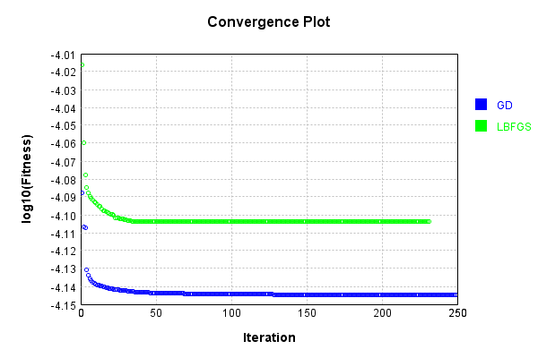


Code from [LearningTester.java:99](../../../../../../../src/main/java/com/simiacryptus/mindseye/test/unit/LearningTester.java#L99) executed in 0.00 seconds: 
```java
    return TestUtil.compareTime(runs);
```

Returns: 

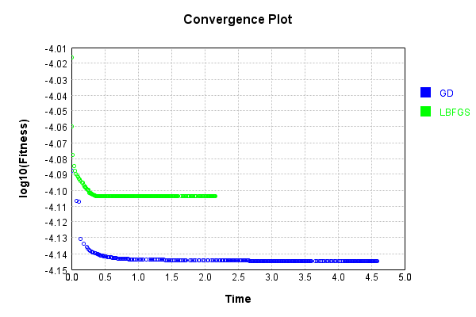


### Composite Learning
In this test, attempt to train a network to emulate a randomized network given an example input/output. The target state is:

Code from [LearningTester.java:219](../../../../../../../src/main/java/com/simiacryptus/mindseye/test/unit/LearningTester.java#L219) executed in 0.00 seconds: 
```java
    return network_target.state().stream().map(Arrays::toString).reduce((a, b) -> a + "\n" + b).orElse("");
```

Returns: 

```
    [-0.0206, 0.079, 0.0334, 0.062200000000000005, -0.08660000000000001, 0.0534, 0.063, 0.047200000000000006, 0.08560000000000001, 0.0814, -0.019600000000000003, -6.000000000000001E-4, -0.015200000000000002, 0.019200000000000002, 0.0664, -0.0248, -0.058800000000000005, -0.0316, -0.0034000000000000002, 0.072, 0.028, -0.041, 0.022600000000000002, -0.007, 0.0932, -0.0164, 0.08460000000000001, -0.0058000000000000005, 0.0048000000000000004, 0.0402, -0.0824, 0.049800000000000004, 0.0388, -0.0534, -0.08020000000000001, 0.056400000000000006, -0.0422, -0.0108, 0.022200000000000004, 0.0388, -0.027200000000000002, 0.014600000000000002, -0.063, 0.0172, -0.06280000000000001, 0.0604, -0.0362, -0.084, 0.08120000000000001, -0.0796, -0.0044, -0.019, 0.0158, -0.055400000000000005, 0.035800000000000005, 0.0604, -0.093, 0.0468, -0.0714, 0.0678, -0.033, 0.0644, -0.09440000000000001, 0.063, -0.075, 0.08880000000000002, 0.09060000000000001, 0.078, 0.0054, 0.0682, -0.0412, 0.0086, -0.0068000000000000005, -0.07260000000000001, 0.04440000000000001, 0.0332, -0.0898, 0.0154, -0.0558, 0.0244, -0.0158]
    [0.0, 0.0, 0.0]
```


We simultaneously regress this target input:

Code from [LearningTester.java:223](../../../../../../../src/main/java/com/simiacryptus/mindseye/test/unit/LearningTester.java#L223) executed in 0.00 seconds: 
```java
    return Arrays.stream(testInput).map(x -> x.prettyPrint()).reduce((a, b) -> a + "\n" + b).orElse("");
```

Returns: 

```
    [
    	[ [ -0.019600000000000003, -8.0E-4, 0.023 ], [ -0.052, 0.072, 0.0154 ], [ 0.005600000000000001, -0.037399999999999996, 0.0648 ], [ 0.0402, -0.049800000000000004, 0.044 ], [ -0.0436, -0.08220000000000001, -0.047 ] ],
    	[ [ -0.0284, 0.026600000000000002, 0.06340000000000001 ], [ -0.071, 0.08280000000000001, 0.0884 ], [ 0.0694, 0.05040000000000001, 0.0352 ], [ 0.07940000000000001, 0.0674, 0.017400000000000002 ], [ -0.05040000000000001, 0.05040000000000001, 0.0416 ] ],
    	[ [ -0.09820000000000001, 0.0286, -0.043 ], [ -0.019200000000000002, 0.0218, 0.048600000000000004 ], [ 0.0426, 0.055400000000000005, 0.07579999999999999 ], [ 0.021200000000000004, -0.096, -0.0234 ], [ 0.0956, 0.0062, 0.018400000000000003 ] ],
    	[ [ -0.0882, 0.06080000000000001, 0.041 ], [ 0.06340000000000001, 0.07540000000000001, -0.0198 ], [ -0.025, 0.0364, -0.036800000000000006 ], [ -0.0678, -0.0164, 0.046 ], [ 0.0062, -0.089, -0.07680000000000001 ] ],
    	[ [ 0.0456, 0.0992, -0.0388 ], [ -0.089, -0.0032, -0.040400000000000005 ], [ -0.062400000000000004, 0.029, 0.088 ], [ -0.07260000000000001, -0.048600000000000004, -0.015600000000000001 ], [ 0.026, -0.08760000000000001, -0.032600000000000004 ] ]
    ]
```


Which produces the following output:

Code from [LearningTester.java:230](../../../../../../../src/main/java/com/simiacryptus/mindseye/test/unit/LearningTester.java#L230) executed in 0.00 seconds: 
```java
    return Stream.of(targetOutput).map(x -> x.prettyPrint()).reduce((a, b) -> a + "\n" + b).orElse("");
```

Returns: 

```
    [
    	[ [ 3.389600000000017E-4, 0.004029480000000001, 1.5748000000000208E-4 ], [ 0.0, 0.015262840000000003, 0.0 ], [ 0.0, 0.017668760000000002, 0.0 ], [ 0.0, 0.00406376, 0.014342520000000004 ], [ 0.007250879999999999, 0.0, 0.022094400000000004 ] ],
    	[ [ 0.0, 0.0, 0.0 ], [ 0.0, 0.010867159999999997, 0.0 ], [ 0.0, 0.016371640000000007, 0.0 ], [ 0.0, 0.0, 0.0 ], [ 0.004672440000000005, 0.0, 0.0 ] ],
    	[ [ 4.252000000000139E-5, 0.0071999200000000055, 0.00409308 ], [ 0.0, 1.2728000000000376E-4, 0.0 ], [ 0.0, 0.0022896799999999966, 0.0 ], [ 0.010787439999999999, 0.0, 0.012844639999999997 ], [ 0.008160360000000002, 0.0, 0.0 ] ],
    	[ [ 0.0, 0.0, 0.0 ], [ 0.0, 0.0, 0.0 ], [ 0.0, 0.0, 0.0 ], [ 0.0, 0.01765068, 0.0 ], [ 0.012640320000000002, 0.007104879999999999, 0.008931 ] ],
    	[ [ 0.0016939999999999985, 0.0, 0.0 ], [ 0.003683280000000002, 0.0, 0.0 ], [ 0.0, 0.01036288, 0.0 ], [ 0.011061840000000002, 0.0, 0.016612039999999998 ], [ 0.0, 0.006680360000000001, 0.004141520000000002 ] ]
    ]
```


First, we use a conjugate gradient descent method, which converges the fastest for purely linear functions.

Code from [LearningTester.java:300](../../../../../../../src/main/java/com/simiacryptus/mindseye/test/unit/LearningTester.java#L300) executed in 0.71 seconds: 
```java
    return new IterativeTrainer(trainable)
      .setLineSearchFactory(label -> new QuadraticSearch())
      .setOrientation(new GradientDescent())
      .setMonitor(monitor)
      .setTimeout(30, TimeUnit.SECONDS)
      .setMaxIterations(250)
      .setTerminateThreshold(0)
      .run();
```
Logging: 
```
    Constructing line search parameters: GD
    F(0.0) = LineSearchPoint{point=PointSample{avg=1.4357186352652803E-4}, derivative=-4.790924999798335E-5}
    New Minimum: 1.4357186352652803E-4 > 1.4357186352173705E-4
    F(1.0E-10) = LineSearchPoint{point=PointSample{avg=1.4357186352173705E-4}, derivative=-4.7909249996050084E-5}, delta = -4.7909809799961955E-15
    New Minimum: 1.4357186352173705E-4 > 1.4357186349299152E-4
    F(7.000000000000001E-10) = LineSearchPoint{point=PointSample{avg=1.4357186349299152E-4}, derivative=-4.790924998445054E-5}, delta = -3.353651449426731E-14
    New Minimum: 1.4357186349299152E-4 > 1.4357186329177273E-4
    F(4.900000000000001E-9) = LineSearchPoint{point=PointSample{avg=1.4357186329177273E-4}, derivative=-4.790924990325376E-5}, delta = -2.3475530330427374E-13
    New Minimum: 1.4357186329177273E-4 > 1.435718618832408E-4
    F(3.430000000000001E-8) = LineSearchPoint{point=PointSample{avg=1.435718618832408E-4}, derivative=-4.790924933487628E-5}, delta = -1.6432872315501335E-12
    New Minimum: 1.435718618832
```
...[skipping 44372 bytes](etc/56.txt)...
```
    00176E-31}, delta = -6.776263578034403E-21
    Right bracket at 249.22309069728283
    Converged to right
    Iteration 34 complete. Error: 4.0767790094997346E-5 Total: 251048124590289.9000; Orientation: 0.0001; Line Search: 0.0168
    Zero gradient: 1.7153101755614113E-11
    F(0.0) = LineSearchPoint{point=PointSample{avg=4.0767790094997346E-5}, derivative=-2.94228899838452E-22}
    F(249.22309069728283) = LineSearchPoint{point=PointSample{avg=4.076779009499779E-5}, derivative=3.8530248648590016E-21}, delta = 4.472333961502706E-19
    F(19.171006976714065) = LineSearchPoint{point=PointSample{avg=4.0767790094997346E-5}, derivative=2.4790623543776272E-23}, delta = 0.0
    4.0767790094997346E-5 <= 4.0767790094997346E-5
    F(17.68125107752604) = LineSearchPoint{point=PointSample{avg=4.0767790094997346E-5}, derivative=-1.6102945539264818E-30}, delta = 0.0
    Left bracket at 17.68125107752604
    Converged to left
    Iteration 35 failed, aborting. Error: 4.0767790094997346E-5 Total: 251048136981434.8800; Orientation: 0.0000; Line Search: 0.0104
    
```

Returns: 

```
    4.0767790094997346E-5
```


This training run resulted in the following configuration:

Code from [LearningTester.java:245](../../../../../../../src/main/java/com/simiacryptus/mindseye/test/unit/LearningTester.java#L245) executed in 0.00 seconds: 
```java
    return network_gd.state().stream().map(Arrays::toString).reduce((a, b) -> a + "\n" + b).orElse("");
```

Returns: 

```
    [3.389600000000017E-4, 0.0, 4.252000000000139E-5, 0.0, 0.0016939999999999985, 0.0, 0.0, 0.0, 0.0, 0.003683280000000002, 0.0, 0.0, 0.0, 0.0, 0.0, 0.0, 0.0, 0.010787439999999999, 0.0, 0.011061840000000002, 0.007250879999999999, 0.004672440000000005, 0.008160360000000002, 0.012640320000000002, 0.0, 0.004029480000000001, 0.0, 0.0071999200000000055, 0.0, 0.0, 0.015262840000000003, 0.010867159999999997, 1.2728000000000376E-4, 0.0, 0.0, 0.017668760000000002, 0.016371640000000007, 0.0022896799999999966, 0.0, 0.01036288, 0.00406376, 0.0, 0.0, 0.01765068, 0.0, 0.0, 0.0, 0.0, 0.007104879999999999, 0.006680360000000001, 1.5748000000000208E-4, 0.0, 0.00409308, 0.0, 0.0, 0.0, 0.0, 0.0, 0.0, 0.0, 0.0, 0.0, 0.0, 0.0, 0.0, 0.014342520000000004, 0.0, 0.012844639999999997, 0.0, 0.016612039999999998, 0.022094400000000004, 0.0, 0.0, 0.008931, 0.004141520000000002]
    [-0.0666850421386313, -0.07595333519108377, -0.02649299129245072, -0.07636170695351671, -0.0485256983785632, 0.08129102359942113, -0.08044262106669453, -0.0049996368565
```
...[skipping 637 bytes](etc/57.txt)...
```
     0.0012681942210821927, 0.0510699371205879, 0.04410810131887816, -0.04551348621178954, -0.02493679470958238, 0.08315121843611022, 0.03646369796784618, -0.041526804215459734, 0.05560229956037016, 0.07302034235768487, -0.010151420837582473, 0.07601625263368059, 0.0030959563248437495, 0.042893630126399115, -0.0420058101254955, 0.017088796292803868, 0.09584292086359475, -0.04381493602937904, 0.020924578882919757, 0.08635919889987126, -0.03181338405183541, 0.03646055075696968, -0.020682568194669276, 0.004766838356813724, 0.04410463934949172, 0.0714967530537708, -0.07049010882888886, 0.045459369383271594, 0.0679964426448596, -0.11252410156235541, 0.016109309762355674, 0.03659266096453893, -0.020116392065114393, 0.044775129369375846, 0.047993900372855516, -0.007279558176242864, 0.03860000268241842, 0.021555925683804503, -0.014701774551705266, 0.019843799016994977, 0.004081785696087626, -0.07645533722232122, 0.03987516851708124, -0.022756093816186086]
    [-0.03190225268845452, -0.22614931358008822, -0.06317392222725333]
```


And regressed input:

Code from [LearningTester.java:249](../../../../../../../src/main/java/com/simiacryptus/mindseye/test/unit/LearningTester.java#L249) executed in 0.00 seconds: 
```java
    return Arrays.stream(input_gd).map(x -> x.prettyPrint()).reduce((a, b) -> a + "\n" + b).orElse("");
```

Returns: 

```
    [
    	[ [ -0.005163600421692913, 0.008594278343260695, -0.08631954652862839 ], [ 0.05250631987057641, 0.04745521172546504, 0.03040389418234871 ], [ 0.1034297083692195, 0.041634214252718973, 0.047871724717700556 ], [ -0.09369524069065464, -0.04316307080564789, 0.052109703881790995 ], [ 0.006466013888131643, -0.03684336420342055, -0.052246660771153544 ] ],
    	[ [ -0.042643976125943464, 0.04912152619035545, 0.09594389610369101 ], [ -0.013554370315705465, -0.01493287302406232, 0.015808064995356013 ], [ 0.038789356588864524, 0.04595769563135408, -0.09127284071686416 ], [ 0.08266800470536868, -0.07892058099213133, -0.003923415996740858 ], [ 0.021058464997030353, -0.002967391685582933, -0.03144270110189894 ] ],
    	[ [ -0.052208782554961086, -0.044407152477694216, 0.05094597012721304 ], [ -0.011573794117958856, 0.061246918147892876, 0.008055815594778961 ], [ -0.05019730974671528, 0.008219216055408651, 0.014126841352390191 ], [ -0.022243716960001193, 0.016623851326326038, 0.05106988437320242 ], [ 0.04513200457226642, -0.08865486786094612, 0.01959373008688362 ] ],
    	[ [ -0.014734426168442057, -0.011393421106631205, -0.024584259563111676 ], [ -0.057447101540139184, 7.434011793302706E-4, 0.04885805242139781 ], [ -0.08365487357318209, 0.03984723176756618, -0.037419541640000845 ], [ 0.10686920564116846, -0.01287457596186522, 0.09074642606115914 ], [ 0.02622310816145853, 0.026147035901505664, 0.09724873974533668 ] ],
    	[ [ 0.04740918123364177, 0.038345848777566444, 0.029917064495445997 ], [ -0.009723403288341639, -0.0642950126070804, -0.015983277033292255 ], [ -0.001778451452309491, -0.07728977414390965, 0.062214158949720495 ], [ -0.10512266575021685, -0.015271367220425464, 0.05861854048951086 ], [ -0.06975312382269645, 0.1005411815029525, -0.04548719505561089 ] ]
    ]
```


Which produces the following output:

Code from [LearningTester.java:256](../../../../../../../src/main/java/com/simiacryptus/mindseye/test/unit/LearningTester.java#L256) executed in 0.00 seconds: 
```java
    return Stream.of(regressedOutput).map(x -> x.prettyPrint()).reduce((a, b) -> a + "\n" + b).orElse("");
```

Returns: 

```
    [ 4.0767790094997346E-5 ]
```


Next, we run the same optimization using L-BFGS, which is nearly ideal for purely second-order or quadratic functions.

Code from [LearningTester.java:324](../../../../../../../src/main/java/com/simiacryptus/mindseye/test/unit/LearningTester.java#L324) executed in 2.80 seconds: 
```java
    return new IterativeTrainer(trainable)
      .setLineSearchFactory(label -> new ArmijoWolfeSearch())
      .setOrientation(new LBFGS())
      .setMonitor(monitor)
      .setTimeout(30, TimeUnit.SECONDS)
      .setMaxIterations(250)
      .setTerminateThreshold(0)
      .run();
```
Logging: 
```
    LBFGS Accumulation History: 1 points
    Constructing line search parameters: GD
    th(0)=1.4357186352652803E-4;dx=-4.790924999798335E-5
    New Minimum: 1.4357186352652803E-4 > 7.742331634846521E-5
    END: th(2.154434690031884)=7.742331634846521E-5; dx=-1.7811334285608532E-5 delta=6.614854717806282E-5
    Iteration 1 complete. Error: 7.742331634846521E-5 Total: 251048156482790.8400; Orientation: 0.0001; Line Search: 0.0046
    LBFGS Accumulation History: 1 points
    th(0)=7.742331634846521E-5;dx=-7.527623296560684E-6
    New Minimum: 7.742331634846521E-5 > 5.611259644952735E-5
    END: th(4.641588833612779)=5.611259644952735E-5; dx=-2.3572461275263274E-6 delta=2.1310719898937864E-5
    Iteration 2 complete. Error: 5.611259644952735E-5 Total: 251048162661977.8400; Orientation: 0.0001; Line Search: 0.0041
    LBFGS Accumulation History: 1 points
    th(0)=5.611259644952735E-5;dx=-8.37685069235058E-7
    New Minimum: 5.611259644952735E-5 > 5.169803139738361E-5
    END: th(10.000000000000002)=5.169803139738361E-5; dx=-1.7198161314403225E-7 delta=4.41
```
...[skipping 139177 bytes](etc/58.txt)...
```
    -20
    New Minimum: 3.956333750887132E-5 > 3.9563337508871065E-5
    END: th(6.305005144562988)=3.9563337508871065E-5; dx=-2.5430560911102747E-20 delta=2.574980159653073E-19
    Iteration 249 complete. Error: 3.9563337508871065E-5 Total: 251050933378051.1000; Orientation: 0.0001; Line Search: 0.0101
    LBFGS Accumulation History: 1 points
    th(0)=3.9563337508871065E-5;dx=-2.6307657735212962E-20
    New Minimum: 3.9563337508871065E-5 > 3.9563337508870705E-5
    WOLFE (weak): th(13.583721804275994)=3.9563337508870705E-5; dx=-2.553796767328011E-20 delta=3.5914196963582334E-19
    New Minimum: 3.9563337508870705E-5 > 3.956333750887036E-5
    WOLFE (weak): th(27.167443608551988)=3.956333750887036E-5; dx=-2.4768277609886134E-20 delta=7.047314121155779E-19
    New Minimum: 3.956333750887036E-5 > 3.956333750886911E-5
    END: th(81.50233082565596)=3.956333750886911E-5; dx=-2.1689517371890243E-20 delta=1.951563910473908E-18
    Iteration 250 complete. Error: 3.956333750886911E-5 Total: 251050943975258.0600; Orientation: 0.0001; Line Search: 0.0087
    
```

Returns: 

```
    3.956333750886911E-5
```


This training run resulted in the following configuration:

Code from [LearningTester.java:266](../../../../../../../src/main/java/com/simiacryptus/mindseye/test/unit/LearningTester.java#L266) executed in 0.00 seconds: 
```java
    return network_lbfgs.state().stream().map(Arrays::toString).reduce((a, b) -> a + "\n" + b).orElse("");
```

Returns: 

```
    [3.389600000000017E-4, 0.0, 4.252000000000139E-5, 0.0, 0.0016939999999999985, 0.0, 0.0, 0.0, 0.0, 0.003683280000000002, 0.0, 0.0, 0.0, 0.0, 0.0, 0.0, 0.0, 0.010787439999999999, 0.0, 0.011061840000000002, 0.007250879999999999, 0.004672440000000005, 0.008160360000000002, 0.012640320000000002, 0.0, 0.004029480000000001, 0.0, 0.0071999200000000055, 0.0, 0.0, 0.015262840000000003, 0.010867159999999997, 1.2728000000000376E-4, 0.0, 0.0, 0.017668760000000002, 0.016371640000000007, 0.0022896799999999966, 0.0, 0.01036288, 0.00406376, 0.0, 0.0, 0.01765068, 0.0, 0.0, 0.0, 0.0, 0.007104879999999999, 0.006680360000000001, 1.5748000000000208E-4, 0.0, 0.00409308, 0.0, 0.0, 0.0, 0.0, 0.0, 0.0, 0.0, 0.0, 0.0, 0.0, 0.0, 0.0, 0.014342520000000004, 0.0, 0.012844639999999997, 0.0, 0.016612039999999998, 0.022094400000000004, 0.0, 0.0, 0.008931, 0.004141520000000002]
    [-0.06373316806124395, -0.08284378570253065, -0.03496079627667464, -0.07916501286178264, -0.05490056309967254, 0.06643305263241785, -0.07435936721542429, -0.01551821051
```
...[skipping 639 bytes](etc/59.txt)...
```
    -0.012760138204970689, 0.07500638364076144, 0.03355549068337654, -0.0867078952787311, -0.020831288943531225, 0.0904316221537018, 0.047065177382578045, -0.05391126418462764, 0.05657511220156708, 0.07297030096677203, -0.012718118136960149, 0.0800292085717936, 0.006835812953406861, 0.038031725486902604, -0.0451829399492617, 0.018261242460095778, 0.09683342551589877, -0.029098932400653227, 0.027150335756533736, 0.08070747094419324, -0.03280681219140845, 0.03714174792353418, -0.038434621782419895, 0.013361898994396916, 0.027159168250766592, 0.08271277328651412, -0.07498924671130766, 0.0543549624843226, 0.0642843488897297, -0.0947127122175042, 8.029453393840496E-4, 0.06493874374424632, -0.027037808094072777, 0.060691892279760885, 0.041278089379936454, -0.0051591590144992455, 0.04375184667917643, 0.018666048183643216, -0.018430521491675973, 0.027362594136988293, 0.007440037884069584, -0.07544779485532335, 0.043264598958760565, -0.016019362062860466]
    [-0.03462425809255979, -0.03540158085870887, -0.012427283586176605]
```


And regressed input:

Code from [LearningTester.java:270](../../../../../../../src/main/java/com/simiacryptus/mindseye/test/unit/LearningTester.java#L270) executed in 0.00 seconds: 
```java
    return Arrays.stream(input_lbgfs).map(x -> x.prettyPrint()).reduce((a, b) -> a + "\n" + b).orElse("");
```

Returns: 

```
    [
    	[ [ -0.0049216945791437, 0.005589143694199862, -0.08574061517099842 ], [ 0.038397848133100376, 0.03679731274079101, 0.01737939954538812 ], [ 0.08810859959853286, 0.06145357564755077, 0.048574171729225284 ], [ -0.08901541719242786, -0.04289658479029539, 0.04105808679258306 ], [ 0.006210476540711869, -0.03736425118641131, -0.05053570954194811 ] ],
    	[ [ -0.0418652946650492, 0.05085443763624568, 0.09520738991008501 ], [ -0.031275438960330214, -0.035988148666199996, 0.02567418025508925 ], [ 0.04146511075359106, 0.03703339940535257, -0.07797286975658642 ], [ 0.07626196871754994, -0.09538905575816925, 0.013453772536935587 ], [ 0.021686649911036908, -7.981003990820873E-4, -0.03257654181181403 ] ],
    	[ [ -0.06844441132885455, -0.04685712968198595, 0.06725418423154196 ], [ -0.003921055588881677, 0.05627990713790903, 0.00731155853961547 ], [ -0.05652369018142962, 0.008352232058342587, 0.026941566252159942 ], [ -0.018512926980928896, 0.031876914732511266, 0.044766951962083634 ], [ 0.04664264778627981, -0.08476435011033377, 0.022798456602943162 ] ],
    	[ [ -0.04189909661207639, -0.03383705738051295, -0.010202821614182603 ], [ -0.06814003482742162, 0.011492586624366098, 0.0772052803013131 ], [ -0.08795017017151399, 0.0698186956953637, -0.02622173507151012 ], [ 0.10051326713980548, -0.009532938474743591, 0.09943937684460609 ], [ 0.027095557772042044, 0.029179769773372496, 0.0877369183844429 ] ],
    	[ [ 0.055851960667838374, 0.06444543177520322, 0.047602553571127824 ], [ 0.005549236160117887, -0.08071139455606414, -0.023154359580621706 ], [ -0.010857454299944157, -0.08338963192266755, 0.07232495077324977 ], [ -0.08701660474067946, -0.039211563520058515, 0.04546110102332125 ], [ -0.05863237806020061, 0.09355055334091623, -0.045819097157511 ] ]
    ]
```


Which produces the following output:

Code from [LearningTester.java:277](../../../../../../../src/main/java/com/simiacryptus/mindseye/test/unit/LearningTester.java#L277) executed in 0.00 seconds: 
```java
    return Stream.of(regressedOutput).map(x -> x.prettyPrint()).reduce((a, b) -> a + "\n" + b).orElse("");
```

Returns: 

```
    [ 3.956333750886911E-5 ]
```


Code from [LearningTester.java:96](../../../../../../../src/main/java/com/simiacryptus/mindseye/test/unit/LearningTester.java#L96) executed in 0.00 seconds: 
```java
    return TestUtil.compare(runs);
```

Returns: 

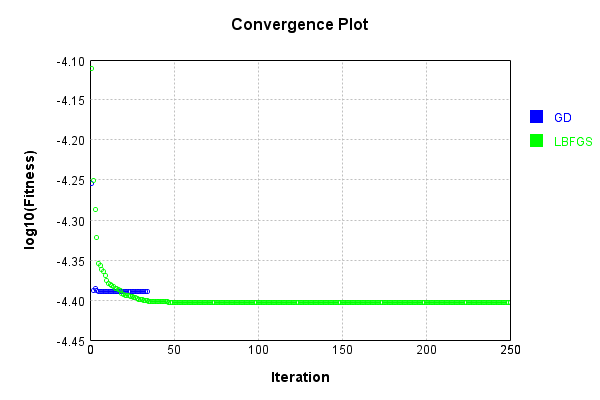


Code from [LearningTester.java:99](../../../../../../../src/main/java/com/simiacryptus/mindseye/test/unit/LearningTester.java#L99) executed in 0.00 seconds: 
```java
    return TestUtil.compareTime(runs);
```

Returns: 

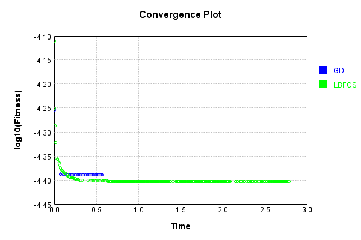


This is a network with the following layout:

Code from [NLayerTest.java:87](../../../../../../../src/test/java/com/simiacryptus/mindseye/network/NLayerTest.java#L87) executed in 0.22 seconds: 
```java
    return Graphviz.fromGraph(TestUtil.toGraph((DAGNetwork) layer))
      .height(400).width(600).render(Format.PNG).toImage();
```

Returns: 

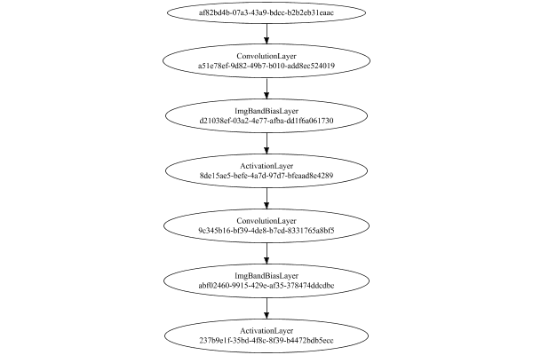


### Json Serialization
Code from [JsonTest.java:36](../../../../../../../src/main/java/com/simiacryptus/mindseye/test/unit/JsonTest.java#L36) executed in 0.00 seconds: 
```java
    JsonObject json = layer.getJson();
    NNLayer echo = NNLayer.fromJson(json);
    if ((echo == null)) throw new AssertionError("Failed to deserialize");
    if ((layer == echo)) throw new AssertionError("Serialization did not copy");
    if ((!layer.equals(echo))) throw new AssertionError("Serialization not equal");
    return new GsonBuilder().setPrettyPrinting().create().toJson(json);
```

Returns: 

```
    {
      "class": "com.simiacryptus.mindseye.network.PipelineNetwork",
      "id": "24c50d10-6ac9-4b1c-9ada-de401c3467ff",
      "isFrozen": false,
      "name": "PipelineNetwork/24c50d10-6ac9-4b1c-9ada-de401c3467ff",
      "inputs": [
        "af82bd4b-07a3-43a9-bdcc-b2b2eb31eaac"
      ],
      "nodes": {
        "e169962b-6e73-4859-89a9-f0a1026161db": "a51e78ef-9d82-49b7-b010-add8ec524019",
        "dbddca89-6e8c-4846-b017-1b302bd1a5fc": "d21038ef-03a2-4e77-afba-dd1f6a061730",
        "48729831-0afc-4611-9806-892edf2a9a02": "8de15ae5-befe-4a7d-97d7-bfeaad8e4289",
        "2e17b4c5-b985-4273-ae5b-ca7de2d6e201": "9c345b16-bf39-4de8-b7cd-8331765a8bf5",
        "5445a46f-c9ce-4cb4-99c3-abecbfbcc107": "abf02460-9915-429e-af35-378474ddcdbc",
        "1905453e-7298-4c25-9e64-42625c8a2589": "237b9e1f-35bd-4f8c-8f39-b4472bdb5ecc"
      },
      "layers": {
        "a51e78ef-9d82-49b7-b010-add8ec524019": {
          "class": "com.simiacryptus.mindseye.layers.cudnn.ConvolutionLayer",
          "id": "a51e78ef-9d82-49b7-b010-add8ec524019",
          "isFrozen": false,
          "name": "ConvolutionLay
```
...[skipping 7357 bytes](etc/60.txt)...
```
      "precision": "Double"
        },
        "237b9e1f-35bd-4f8c-8f39-b4472bdb5ecc": {
          "class": "com.simiacryptus.mindseye.layers.cudnn.ActivationLayer",
          "id": "237b9e1f-35bd-4f8c-8f39-b4472bdb5ecc",
          "isFrozen": false,
          "name": "ActivationLayer/237b9e1f-35bd-4f8c-8f39-b4472bdb5ecc",
          "mode": 1,
          "precision": "Double"
        }
      },
      "links": {
        "e169962b-6e73-4859-89a9-f0a1026161db": [
          "af82bd4b-07a3-43a9-bdcc-b2b2eb31eaac"
        ],
        "dbddca89-6e8c-4846-b017-1b302bd1a5fc": [
          "e169962b-6e73-4859-89a9-f0a1026161db"
        ],
        "48729831-0afc-4611-9806-892edf2a9a02": [
          "dbddca89-6e8c-4846-b017-1b302bd1a5fc"
        ],
        "2e17b4c5-b985-4273-ae5b-ca7de2d6e201": [
          "48729831-0afc-4611-9806-892edf2a9a02"
        ],
        "5445a46f-c9ce-4cb4-99c3-abecbfbcc107": [
          "2e17b4c5-b985-4273-ae5b-ca7de2d6e201"
        ],
        "1905453e-7298-4c25-9e64-42625c8a2589": [
          "5445a46f-c9ce-4cb4-99c3-abecbfbcc107"
        ]
      },
      "labels": {},
      "head": "1905453e-7298-4c25-9e64-42625c8a2589"
    }
```


### Input Learning
In this test, we use a network to learn this target input, given it's pre-evaluated output:

Code from [LearningTester.java:127](../../../../../../../src/main/java/com/simiacryptus/mindseye/test/unit/LearningTester.java#L127) executed in 0.00 seconds: 
```java
    return Arrays.stream(input_target).map(x -> x.prettyPrint()).reduce((a, b) -> a + "\n" + b).orElse("");
```

Returns: 

```
    [
    	[ [ 0.032, -0.0072, 0.0658 ], [ 0.0362, -0.07060000000000001, -0.04440000000000001 ], [ -0.0718, -0.0228, 0.08760000000000001 ], [ 0.0582, 0.075, 0.088 ], [ 0.05040000000000001, 0.0656, 0.05 ] ],
    	[ [ 0.094, 0.0366, -0.09820000000000001 ], [ -0.05140000000000001, -0.0852, -0.0502 ], [ -0.06620000000000001, -0.028, -0.0782 ], [ 0.0772, 0.08220000000000001, 0.0752 ], [ 0.07460000000000001, -0.0134, 0.008400000000000001 ] ],
    	[ [ 0.0668, 0.0496, -0.026600000000000002 ], [ -0.016, -0.0546, -0.0568 ], [ -0.040600000000000004, -0.0742, 0.030600000000000002 ], [ 0.0722, -0.0786, 0.07360000000000001 ], [ -0.051, -0.013200000000000002, -0.09820000000000001 ] ],
    	[ [ 0.026600000000000002, 0.0028000000000000004, 0.09480000000000001 ], [ 0.095, 0.0664, 0.0912 ], [ 0.07579999999999999, 0.013200000000000002, -0.0562 ], [ 0.0068000000000000005, -0.09540000000000001, -0.024200000000000003 ], [ -0.045, -0.0182, 0.0216 ] ],
    	[ [ 0.0576, 0.06860000000000001, 0.015 ], [ 0.0476, 0.05140000000000001, -0.019200000000000002 ], [ 0.031, -0.011, -0.0854 ], [ 0.0478, 0.0832, 0.036 ], [ -0.08580000000000002, 0.0426, -0.051800000000000006 ] ]
    ]
```


First, we use a conjugate gradient descent method, which converges the fastest for purely linear functions.

Code from [LearningTester.java:300](../../../../../../../src/main/java/com/simiacryptus/mindseye/test/unit/LearningTester.java#L300) executed in 7.03 seconds: 
```java
    return new IterativeTrainer(trainable)
      .setLineSearchFactory(label -> new QuadraticSearch())
      .setOrientation(new GradientDescent())
      .setMonitor(monitor)
      .setTimeout(30, TimeUnit.SECONDS)
      .setMaxIterations(250)
      .setTerminateThreshold(0)
      .run();
```
Logging: 
```
    Constructing line search parameters: GD
    F(0.0) = LineSearchPoint{point=PointSample{avg=3.61097277885545E-6}, derivative=-3.169756132144355E-10}
    New Minimum: 3.61097277885545E-6 > 3.6109727788554185E-6
    F(1.0E-10) = LineSearchPoint{point=PointSample{avg=3.6109727788554185E-6}, derivative=-3.169756132144297E-10}, delta = -3.134021904840911E-20
    New Minimum: 3.6109727788554185E-6 > 3.6109727788552263E-6
    F(7.000000000000001E-10) = LineSearchPoint{point=PointSample{avg=3.6109727788552263E-6}, derivative=-3.169756132143954E-10}, delta = -2.236166980751353E-19
    New Minimum: 3.6109727788552263E-6 > 3.6109727788538973E-6
    F(4.900000000000001E-9) = LineSearchPoint{point=PointSample{avg=3.6109727788538973E-6}, derivative=-3.169756132141555E-10}, delta = -1.5526113923171325E-18
    New Minimum: 3.6109727788538973E-6 > 3.610972778844578E-6
    F(3.430000000000001E-8) = LineSearchPoint{point=PointSample{avg=3.610972778844578E-6}, derivative=-3.169756132124756E-10}, delta = -1.0871667878008945E-17
    New Minimum: 3.6109727788445
```
...[skipping 320110 bytes](etc/61.txt)...
```
    ) = LineSearchPoint{point=PointSample{avg=8.872846751122331E-7}, derivative=-1.3207157612158846E-15}, delta = -3.56725419926817E-12
    F(13848.238632427889) = LineSearchPoint{point=PointSample{avg=8.873033587412463E-7}, derivative=4.468779245772294E-15}, delta = 1.5116374813972796E-11
    F(1065.249125571376) = LineSearchPoint{point=PointSample{avg=8.872860843351523E-7}, derivative=-1.7660615309843192E-15}, delta = -2.158031280072786E-12
    F(7456.743878999632) = LineSearchPoint{point=PointSample{avg=8.872847590501712E-7}, derivative=1.3513588573939425E-15}, delta = -3.483316261173385E-12
    8.872847590501712E-7 <= 8.872882423664324E-7
    New Minimum: 8.872831368039829E-7 > 8.872828869958142E-7
    F(4686.118820142786) = LineSearchPoint{point=PointSample{avg=8.872828869958142E-7}, derivative=4.572157687975298E-29}, delta = -5.355370618150751E-12
    Right bracket at 4686.118820142786
    Converged to right
    Iteration 250 complete. Error: 8.872828869958142E-7 Total: 251058368796241.6600; Orientation: 0.0000; Line Search: 0.0242
    
```

Returns: 

```
    8.872828869958142E-7
```


Training Converged

Next, we run the same optimization using L-BFGS, which is nearly ideal for purely second-order or quadratic functions.

Code from [LearningTester.java:324](../../../../../../../src/main/java/com/simiacryptus/mindseye/test/unit/LearningTester.java#L324) executed in 0.14 seconds: 
```java
    return new IterativeTrainer(trainable)
      .setLineSearchFactory(label -> new ArmijoWolfeSearch())
      .setOrientation(new LBFGS())
      .setMonitor(monitor)
      .setTimeout(30, TimeUnit.SECONDS)
      .setMaxIterations(250)
      .setTerminateThreshold(0)
      .run();
```
Logging: 
```
    LBFGS Accumulation History: 1 points
    Constructing line search parameters: GD
    th(0)=3.61097277885545E-6;dx=-3.169756132144355E-10
    New Minimum: 3.61097277885545E-6 > 3.6102900082055467E-6
    WOLFE (weak): th(2.154434690031884)=3.6102900082055467E-6; dx=-3.1685251168704464E-10 delta=6.827706499032008E-10
    New Minimum: 3.6102900082055467E-6 > 3.609607502769845E-6
    WOLFE (weak): th(4.308869380063768)=3.609607502769845E-6; dx=-3.167294101596538E-10 delta=1.3652760856048898E-9
    New Minimum: 3.609607502769845E-6 > 3.6068801331690495E-6
    WOLFE (weak): th(12.926608140191302)=3.6068801331690495E-6; dx=-3.162370040500904E-10 delta=4.09264568640034E-9
    New Minimum: 3.6068801331690495E-6 > 3.594659482377261E-6
    WOLFE (weak): th(51.70643256076521)=3.594659482377261E-6; dx=-3.1402117655705535E-10 delta=1.6313296478188755E-8
    New Minimum: 3.594659482377261E-6 > 3.530933930262303E-6
    WOLFE (weak): th(258.53216280382605)=3.530933930262303E-6; dx=-3.02203429927535E-10 delta=8.003884859314707E-8
    New Minimum: 3.530933930262303E-
```
...[skipping 276 bytes](etc/62.txt)...
```
    story: 1 points
    th(0)=3.1889509256018805E-6;dx=-1.713731206237606E-10
    New Minimum: 3.1889509256018805E-6 > 2.711524789212809E-6
    END: th(3341.943960201201)=2.711524789212809E-6; dx=-1.0942059368049556E-10 delta=4.774261363890717E-7
    Iteration 2 complete. Error: 2.711524789212809E-6 Total: 251058410809180.6000; Orientation: 0.0001; Line Search: 0.0057
    LBFGS Accumulation History: 1 points
    th(0)=2.711524789212809E-6;dx=-1.0376142946232488E-10
    New Minimum: 2.711524789212809E-6 > 2.220669563428412E-6
    END: th(7200.000000000001)=2.220669563428412E-6; dx=-1.652998839361095E-11 delta=4.908552257843969E-7
    Iteration 3 complete. Error: 2.220669563428412E-6 Total: 251058419292132.6000; Orientation: 0.0001; Line Search: 0.0054
    LBFGS Accumulation History: 1 points
    th(0)=2.220669563428412E-6;dx=-1.0180462539568613E-10
    MAX ALPHA: th(0)=2.220669563428412E-6;th'(0)=-1.0180462539568613E-10;
    Iteration 4 failed, aborting. Error: 2.220669563428412E-6 Total: 251058512675845.6000; Orientation: 0.0001; Line Search: 0.0701
    
```

Returns: 

```
    2.220669563428412E-6
```


Training Converged

Code from [LearningTester.java:96](../../../../../../../src/main/java/com/simiacryptus/mindseye/test/unit/LearningTester.java#L96) executed in 0.01 seconds: 
```java
    return TestUtil.compare(runs);
```

Returns: 

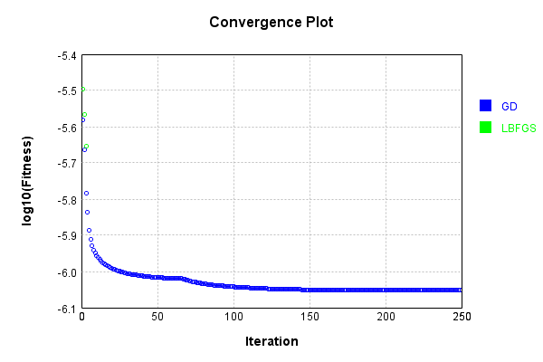


Code from [LearningTester.java:99](../../../../../../../src/main/java/com/simiacryptus/mindseye/test/unit/LearningTester.java#L99) executed in 0.00 seconds: 
```java
    return TestUtil.compareTime(runs);
```

Returns: 

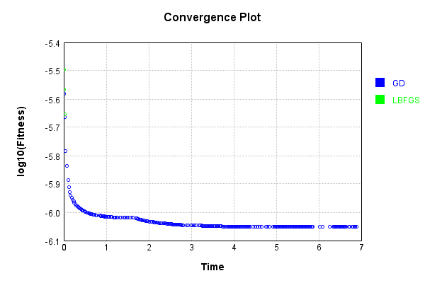


### Model Learning
In this test, attempt to train a network to emulate a randomized network given an example input/output. The target state is:

Code from [LearningTester.java:176](../../../../../../../src/main/java/com/simiacryptus/mindseye/test/unit/LearningTester.java#L176) executed in 0.00 seconds: 
```java
    return network_target.state().stream().map(Arrays::toString).reduce((a, b) -> a + "\n" + b).orElse("");
```

Returns: 

```
    [0.04240000000000001, 0.042, 0.0714, 0.08780000000000002, -0.0534, -0.053200000000000004, -0.0068000000000000005, -0.06860000000000001, 0.0946, -0.078, -0.08760000000000001, 0.0942, -0.0722, -0.057800000000000004, 0.07880000000000001, 0.033, -0.04340000000000001, -0.054400000000000004, 0.094, -0.08660000000000001, -0.04580000000000001, -0.0824, 0.08780000000000002, -0.0388, 0.08220000000000001, 0.074, -0.0064, -0.0694, 0.0022, 0.008, 0.0258, 0.0032, 0.06280000000000001, 0.053200000000000004, -0.0054, 0.088, 0.004200000000000001, -0.058800000000000005, -0.083, -0.0898, 0.005, -0.0038000000000000004, -0.046200000000000005, 0.027, -0.0328, 0.042800000000000005, 0.018600000000000002, -0.0048000000000000004, 0.086, -0.0258, -0.07940000000000001, -0.08120000000000001, -0.012600000000000002, -0.01, 0.018400000000000003, -0.0104, 0.073, 0.005600000000000001, 0.0704, 0.06720000000000001, 0.0898, 0.0356, -0.061, 0.0028000000000000004, -0.0782, 0.05840000000000001, 0.0216, -0.01, -0.06860000000000001, -0.0724, -0.033800
```
...[skipping 211 bytes](etc/63.txt)...
```
    0000000001, 0.004, -0.06280000000000001, 0.06720000000000001, -0.032600000000000004, -0.019600000000000003, -0.045, 0.069, 0.021400000000000002, 0.003, -0.0058000000000000005, -0.096, 0.0832, 0.0646, 0.09980000000000001, -0.041, -0.0952, 0.08880000000000002, 0.026400000000000003, -0.055, -0.0468, -0.0964, -0.029, -0.06, -0.011200000000000002, -0.0422, 0.0094, -0.0036, 0.0466, 0.09140000000000001, -0.095, 0.0104, -0.0194, -0.0604, -0.073, -0.0654, -0.0234, -0.043800000000000006, -0.099, -0.0248, -4.0E-4, -0.008, 0.08120000000000001, 0.06620000000000001, 0.03, -0.022600000000000002, -0.0308, 0.065, 0.031400000000000004, 0.0298, -0.048400000000000006, -0.075, -0.0994, -0.052, 0.034, -0.039400000000000004, -0.060200000000000004, 0.0732, 0.0284, 0.0038000000000000004, 0.0442, -0.031, -0.0158, 0.025200000000000004, -0.078, 0.0078000000000000005, -0.0412, -0.092, -0.016, -0.027, -0.021200000000000004, -0.0946, 0.0658, 0.0576, 0.082, -0.048600000000000004, -0.09720000000000001, -0.091]
    [0.0, 0.0, 0.0]
    [0.0, 0.0, 0.0]
```


First, we use a conjugate gradient descent method, which converges the fastest for purely linear functions.

Code from [LearningTester.java:300](../../../../../../../src/main/java/com/simiacryptus/mindseye/test/unit/LearningTester.java#L300) executed in 8.09 seconds: 
```java
    return new IterativeTrainer(trainable)
      .setLineSearchFactory(label -> new QuadraticSearch())
      .setOrientation(new GradientDescent())
      .setMonitor(monitor)
      .setTimeout(30, TimeUnit.SECONDS)
      .setMaxIterations(250)
      .setTerminateThreshold(0)
      .run();
```
Logging: 
```
    Constructing line search parameters: GD
    F(0.0) = LineSearchPoint{point=PointSample{avg=3.3535505456070266E-6}, derivative=-7.516550565995226E-7}
    New Minimum: 3.3535505456070266E-6 > 3.3535505455318618E-6
    F(1.0E-10) = LineSearchPoint{point=PointSample{avg=3.3535505455318618E-6}, derivative=-7.516550565692961E-7}, delta = -7.516485670639936E-17
    New Minimum: 3.3535505455318618E-6 > 3.3535505450808684E-6
    F(7.000000000000001E-10) = LineSearchPoint{point=PointSample{avg=3.3535505450808684E-6}, derivative=-7.516550563879387E-7}, delta = -5.261582321095318E-16
    New Minimum: 3.3535505450808684E-6 > 3.353550541923917E-6
    F(4.900000000000001E-9) = LineSearchPoint{point=PointSample{avg=3.353550541923917E-6}, derivative=-7.516550551184364E-7}, delta = -3.6831097423490906E-15
    New Minimum: 3.353550541923917E-6 > 3.3535505198252593E-6
    F(3.430000000000001E-8) = LineSearchPoint{point=PointSample{avg=3.3535505198252593E-6}, derivative=-7.516550462319212E-7}, delta = -2.5781767349410687E-14
    New Minimum: 3.353550519825259
```
...[skipping 305046 bytes](etc/64.txt)...
```
     = LineSearchPoint{point=PointSample{avg=1.066894682366354E-6}, derivative=-1.0975446009281934E-10}, delta = -2.7207905732323207E-10
    F(11.152307035499476) = LineSearchPoint{point=PointSample{avg=1.0693454372703317E-6}, derivative=6.225120049002004E-10}, delta = 2.17867584665453E-9
    F(0.8578697719614982) = LineSearchPoint{point=PointSample{avg=1.066996096205414E-6}, derivative=-1.6608261705735364E-10}, delta = -1.7066521826303734E-10
    F(6.005088403730487) = LineSearchPoint{point=PointSample{avg=1.06715599950511E-6}, derivative=2.282145796450349E-10}, delta = -1.0761918567175056E-11
    1.06715599950511E-6 <= 1.0671667614236771E-6
    New Minimum: 1.0668162296580269E-6 > 1.066816056878625E-6
    F(3.025938658424054) = LineSearchPoint{point=PointSample{avg=1.066816056878625E-6}, derivative=-3.888315241809827E-17}, delta = -3.507045450520821E-10
    Left bracket at 3.025938658424054
    Converged to left
    Iteration 250 complete. Error: 1.066816056878625E-6 Total: 251066732627573.3400; Orientation: 0.0000; Line Search: 0.0688
    
```

Returns: 

```
    1.066816056878625E-6
```


Training Converged

Next, we run the same optimization using L-BFGS, which is nearly ideal for purely second-order or quadratic functions.

Code from [LearningTester.java:324](../../../../../../../src/main/java/com/simiacryptus/mindseye/test/unit/LearningTester.java#L324) executed in 4.73 seconds: 
```java
    return new IterativeTrainer(trainable)
      .setLineSearchFactory(label -> new ArmijoWolfeSearch())
      .setOrientation(new LBFGS())
      .setMonitor(monitor)
      .setTimeout(30, TimeUnit.SECONDS)
      .setMaxIterations(250)
      .setTerminateThreshold(0)
      .run();
```
Logging: 
```
    LBFGS Accumulation History: 1 points
    Constructing line search parameters: GD
    th(0)=4.699907200015117E-6;dx=-7.674789014063457E-7
    New Minimum: 4.699907200015117E-6 > 3.6423247109148014E-6
    END: th(2.154434690031884)=3.6423247109148014E-6; dx=-2.3797748360708743E-7 delta=1.057582489100316E-6
    Iteration 1 complete. Error: 3.6423247109148014E-6 Total: 251066798895023.2500; Orientation: 0.0002; Line Search: 0.0160
    LBFGS Accumulation History: 1 points
    th(0)=3.6423247109148014E-6;dx=-8.39609611373134E-8
    New Minimum: 3.6423247109148014E-6 > 3.302040060684031E-6
    END: th(4.641588833612779)=3.302040060684031E-6; dx=-5.50034120557381E-8 delta=3.4028465023077027E-7
    Iteration 2 complete. Error: 3.302040060684031E-6 Total: 251066821997366.2000; Orientation: 0.0001; Line Search: 0.0149
    LBFGS Accumulation History: 1 points
    th(0)=3.302040060684031E-6;dx=-4.952335989725711E-8
    New Minimum: 3.302040060684031E-6 > 3.025341149623347E-6
    END: th(10.000000000000002)=3.025341149623347E-6; dx=-9.952018725243759E-9 delta=2.76
```
...[skipping 147582 bytes](etc/65.txt)...
```
    .3425546882873898E-6
    END: th(13.787906966842657)=1.3425546882873898E-6; dx=-2.5758085525434064E-12 delta=1.3677360344055896E-10
    Iteration 249 complete. Error: 1.3425546882873898E-6 Total: 251071448900803.5600; Orientation: 0.0001; Line Search: 0.0063
    LBFGS Accumulation History: 1 points
    th(0)=1.3425546882873898E-6;dx=-6.927874355462798E-11
    Armijo: th(29.705145072298112)=1.343902987480055E-6; dx=1.0053012464632098E-10 delta=-1.3482991926651274E-9
    Armijo: th(14.852572536149056)=1.342816428887006E-6; dx=4.578221075339272E-11 delta=-2.617405996162537E-10
    New Minimum: 1.3425546882873898E-6 > 1.34254380841192E-6
    WOLF (strong): th(4.950857512049685)=1.34254380841192E-6; dx=9.283015306873139E-12 delta=1.0879875469931469E-11
    New Minimum: 1.34254380841192E-6 > 1.3425347507146393E-6
    END: th(1.2377143780124213)=1.3425347507146393E-6; dx=-4.404303906332965E-12 delta=1.9937572750555827E-11
    Iteration 250 complete. Error: 1.3425347507146393E-6 Total: 251071469601349.5600; Orientation: 0.0001; Line Search: 0.0174
    
```

Returns: 

```
    1.3425347507146393E-6
```


Training Converged

Code from [LearningTester.java:96](../../../../../../../src/main/java/com/simiacryptus/mindseye/test/unit/LearningTester.java#L96) executed in 0.00 seconds: 
```java
    return TestUtil.compare(runs);
```

Returns: 

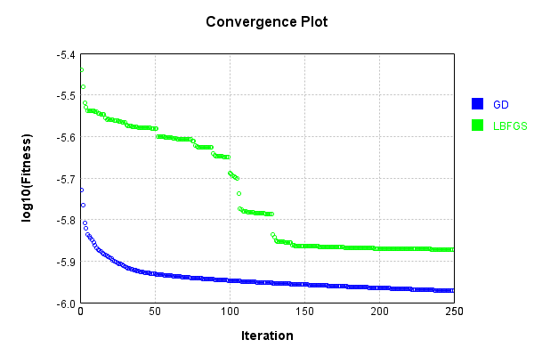


Code from [LearningTester.java:99](../../../../../../../src/main/java/com/simiacryptus/mindseye/test/unit/LearningTester.java#L99) executed in 0.00 seconds: 
```java
    return TestUtil.compareTime(runs);
```

Returns: 

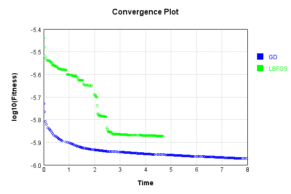


### Composite Learning
In this test, attempt to train a network to emulate a randomized network given an example input/output. The target state is:

Code from [LearningTester.java:219](../../../../../../../src/main/java/com/simiacryptus/mindseye/test/unit/LearningTester.java#L219) executed in 0.00 seconds: 
```java
    return network_target.state().stream().map(Arrays::toString).reduce((a, b) -> a + "\n" + b).orElse("");
```

Returns: 

```
    [0.06720000000000001, -0.01, -0.01, -0.0054, 0.018400000000000003, -0.08120000000000001, 0.008, -0.0724, -0.0534, -0.0824, -0.083, -0.0328, -0.0038000000000000004, 0.0022, 0.018600000000000002, -0.0692, -0.08760000000000001, 0.08780000000000002, -0.054400000000000004, 0.033, 0.05840000000000001, -0.0898, -0.049, -0.0064, 0.05040000000000001, -0.058800000000000005, -0.078, 0.0028000000000000004, -0.057800000000000004, 0.0704, -0.0388, -0.0694, 0.094, 0.0258, -0.046200000000000005, 0.027, 0.005, 0.04240000000000001, -0.04580000000000001, -0.0048000000000000004, -0.012600000000000002, -0.0324, -0.033800000000000004, 0.0946, 0.08780000000000002, -0.0058000000000000005, 0.053200000000000004, 0.086, 0.07880000000000001, -0.0782, 0.031, 0.09960000000000001, -0.0104, -0.061, -0.0258, -0.08660000000000001, -0.053200000000000004, 0.042, 0.08560000000000001, 0.073, 0.0032, 0.004200000000000001, -0.0068000000000000005, 0.088, -0.07940000000000001, 0.0942, -0.06860000000000001, 0.0714, 0.0898, -0.06860000000000001, 0.074,
```
...[skipping 211 bytes](etc/66.txt)...
```
    0038000000000000004, -0.022600000000000002, -0.091, 0.026400000000000003, -0.0412, -0.0952, 0.06620000000000001, 0.0576, 0.0078000000000000005, -0.0036, 0.0658, 0.0732, 0.08880000000000002, 0.03, -0.09820000000000001, -0.06280000000000001, -0.0058000000000000005, -0.031, -0.0994, -0.019600000000000003, -0.075, -0.008, -0.09720000000000001, -0.048400000000000006, 0.0832, 0.069, 0.0466, -0.073, -0.0158, -0.078, 0.003, -0.099, -0.045, -0.048600000000000004, -0.041, -0.0234, -0.092, 0.021400000000000002, -0.055, 0.065, 0.09140000000000001, -0.0194, -0.060200000000000004, -0.052, -0.016, -0.0946, -0.0468, -0.0422, -0.0604, -0.096, 0.0104, -0.043800000000000006, -0.0308, 0.04440000000000001, 0.0632, 0.025200000000000004, 0.004, 0.031400000000000004, 0.0284, 0.0646, -0.0248, -0.029, -4.0E-4, 0.034, -0.011200000000000002, -0.0654, 0.09980000000000001, -0.095, -0.032600000000000004, 0.082, -0.039400000000000004, -0.027, 0.0298, -0.021200000000000004, 0.0094, -0.06, -0.07260000000000001]
    [0.0, 0.0, 0.0]
    [0.0, 0.0, 0.0]
```


We simultaneously regress this target input:

Code from [LearningTester.java:223](../../../../../../../src/main/java/com/simiacryptus/mindseye/test/unit/LearningTester.java#L223) executed in 0.00 seconds: 
```java
    return Arrays.stream(testInput).map(x -> x.prettyPrint()).reduce((a, b) -> a + "\n" + b).orElse("");
```

Returns: 

```
    [
    	[ [ 0.0722, -0.04440000000000001, -0.0072 ], [ 0.0362, 0.07460000000000001, 0.05140000000000001 ], [ -0.026600000000000002, 0.09480000000000001, -0.0742 ], [ 0.030600000000000002, 0.075, -0.016 ], [ 0.0366, -0.07060000000000001, -0.0782 ] ],
    	[ [ 0.015, 0.0664, -0.024200000000000003 ], [ 0.008400000000000001, 0.026600000000000002, 0.088 ], [ -0.0228, 0.0656, 0.0478 ], [ 0.0576, 0.0912, 0.0216 ], [ -0.013200000000000002, 0.094, -0.040600000000000004 ] ],
    	[ [ -0.0546, -0.028, -0.051800000000000006 ], [ -0.011, 0.0426, -0.0786 ], [ 0.07360000000000001, 0.032, 0.0476 ], [ 0.031, -0.06620000000000001, 0.036 ], [ 0.0582, 0.06860000000000001, -0.0718 ] ],
    	[ [ 0.0028000000000000004, 0.0496, 0.0752 ], [ -0.0502, 0.08220000000000001, -0.0182 ], [ -0.0852, -0.05140000000000001, 0.0658 ], [ 0.05040000000000001, 0.08760000000000001, -0.0562 ], [ -0.051, -0.045, -0.09540000000000001 ] ],
    	[ [ -0.09820000000000001, 0.0068000000000000005, -0.0568 ], [ 0.0668, 0.07579999999999999, 0.05 ], [ 0.0832, 0.0772, 0.095 ], [ -0.0854, -0.09820000000000001, -0.08580000000000002 ], [ -0.019200000000000002, -0.0134, 0.013200000000000002 ] ]
    ]
```


Which produces the following output:

Code from [LearningTester.java:230](../../../../../../../src/main/java/com/simiacryptus/mindseye/test/unit/LearningTester.java#L230) executed in 0.00 seconds: 
```java
    return Stream.of(targetOutput).map(x -> x.prettyPrint()).reduce((a, b) -> a + "\n" + b).orElse("");
```

Returns: 

```
    [
    	[ [ 0.0015293296800000002, 0.0, 0.0 ], [ 0.0, 0.0, 0.0 ], [ 0.0, 0.0, 0.0010089848400000002 ], [ 0.0, 0.0, 0.0024112500960000007 ], [ 0.0, 0.0, 0.0018786795920000007 ] ],
    	[ [ 0.0, 0.0, 9.2618832E-4 ], [ 0.0, 3.57782248E-4, 0.0 ], [ 0.0, 0.0, 0.0 ], [ 0.0, 5.713730960000001E-4, 0.0 ], [ 0.0, 0.0, 0.002513586824 ] ],
    	[ [ 0.0, 0.0, 0.0 ], [ 0.0, 0.0, 0.0025164901520000004 ], [ 0.0, 0.0, 0.0032629182720000016 ], [ 0.0020180296960000017, 0.0, 0.0 ], [ 0.0, 0.0, 0.0 ] ],
    	[ [ 2.8653308E-4, 2.2648399999999976E-6, 0.0 ], [ 0.0, 0.0, 0.0013111025360000006 ], [ 0.0, 0.0, 0.00224436896 ], [ 0.0, 3.5089126400000094E-4, 0.0046902253280000005 ], [ 0.0012507971839999994, 0.0016151250480000014, 0.0 ] ],
    	[ [ 0.0, 3.6732972E-4, 0.0 ], [ 0.0, 0.0, 0.0012753436480000008 ], [ 0.0, 0.0, 0.00230854404 ], [ 0.0, 0.0042911798, 0.0 ], [ 0.0, 0.004630128368, 0.0 ] ]
    ]
```


First, we use a conjugate gradient descent method, which converges the fastest for purely linear functions.

Code from [LearningTester.java:300](../../../../../../../src/main/java/com/simiacryptus/mindseye/test/unit/LearningTester.java#L300) executed in 8.53 seconds: 
```java
    return new IterativeTrainer(trainable)
      .setLineSearchFactory(label -> new QuadraticSearch())
      .setOrientation(new GradientDescent())
      .setMonitor(monitor)
      .setTimeout(30, TimeUnit.SECONDS)
      .setMaxIterations(250)
      .setTerminateThreshold(0)
      .run();
```
Logging: 
```
    Constructing line search parameters: GD
    F(0.0) = LineSearchPoint{point=PointSample{avg=4.5594960642047485E-6}, derivative=-1.9488860725692506E-6}
    New Minimum: 4.5594960642047485E-6 > 4.559496064009859E-6
    F(1.0E-10) = LineSearchPoint{point=PointSample{avg=4.559496064009859E-6}, derivative=-1.948886072474912E-6}, delta = -1.948895756690057E-16
    New Minimum: 4.559496064009859E-6 > 4.5594960628405265E-6
    F(7.000000000000001E-10) = LineSearchPoint{point=PointSample{avg=4.5594960628405265E-6}, derivative=-1.948886071908874E-6}, delta = -1.3642219474853563E-15
    New Minimum: 4.5594960628405265E-6 > 4.559496054655208E-6
    F(4.900000000000001E-9) = LineSearchPoint{point=PointSample{avg=4.559496054655208E-6}, derivative=-1.948886067946611E-6}, delta = -9.549540079870338E-15
    New Minimum: 4.559496054655208E-6 > 4.559495997357956E-6
    F(3.430000000000001E-8) = LineSearchPoint{point=PointSample{avg=4.559495997357956E-6}, derivative=-1.948886040210774E-6}, delta = -6.684679241755363E-14
    New Minimum: 4.559495997357956E-6 >
```
...[skipping 304732 bytes](etc/67.txt)...
```
    4616294E-14}, delta = -3.1322646149884394E-11
    Right bracket at 11.959683241413448
    Converged to right
    Iteration 249 complete. Error: 1.015207894513738E-6 Total: 251080110855153.9400; Orientation: 0.0000; Line Search: 0.0462
    Low gradient: 2.4036494059180902E-6
    F(0.0) = LineSearchPoint{point=PointSample{avg=1.015207894513738E-6}, derivative=-5.7775304665703876E-12}
    New Minimum: 1.015207894513738E-6 > 1.0151738246208162E-6
    F(11.959683241413448) = LineSearchPoint{point=PointSample{avg=1.0151738246208162E-6}, derivative=8.006736140084698E-14}, delta = -3.406989292182836E-11
    1.0151738246208162E-6 <= 1.015207894513738E-6
    New Minimum: 1.0151738246208162E-6 > 1.0151738180762265E-6
    F(11.796206623787487) = LineSearchPoint{point=PointSample{avg=1.0151738180762265E-6}, derivative=2.30556122625099E-19}, delta = -3.4076437511519164E-11
    Right bracket at 11.796206623787487
    Converged to right
    Iteration 250 complete. Error: 1.0151738180762265E-6 Total: 251080129117993.8800; Orientation: 0.0001; Line Search: 0.0143
    
```

Returns: 

```
    1.0151738180762265E-6
```


Training Converged

Next, we run the same optimization using L-BFGS, which is nearly ideal for purely second-order or quadratic functions.

Code from [LearningTester.java:324](../../../../../../../src/main/java/com/simiacryptus/mindseye/test/unit/LearningTester.java#L324) executed in 4.70 seconds: 
```java
    return new IterativeTrainer(trainable)
      .setLineSearchFactory(label -> new ArmijoWolfeSearch())
      .setOrientation(new LBFGS())
      .setMonitor(monitor)
      .setTimeout(30, TimeUnit.SECONDS)
      .setMaxIterations(250)
      .setTerminateThreshold(0)
      .run();
```
Logging: 
```
    LBFGS Accumulation History: 1 points
    Constructing line search parameters: GD
    th(0)=4.5594960642047485E-6;dx=-1.9488860725692506E-6
    New Minimum: 4.5594960642047485E-6 > 2.1903539092111554E-6
    END: th(2.154434690031884)=2.1903539092111554E-6; dx=-5.146902421599371E-7 delta=2.369142154993593E-6
    Iteration 1 complete. Error: 2.1903539092111554E-6 Total: 251080182758621.8800; Orientation: 0.0002; Line Search: 0.0162
    LBFGS Accumulation History: 1 points
    th(0)=2.1903539092111554E-6;dx=-1.8197928991919362E-7
    New Minimum: 2.1903539092111554E-6 > 1.5787632418794112E-6
    END: th(4.641588833612779)=1.5787632418794112E-6; dx=-8.021527002409137E-8 delta=6.115906673317442E-7
    Iteration 2 complete. Error: 1.5787632418794112E-6 Total: 251080207774024.8000; Orientation: 0.0002; Line Search: 0.0165
    LBFGS Accumulation History: 1 points
    th(0)=1.5787632418794112E-6;dx=-3.678933366403953E-8
    New Minimum: 1.5787632418794112E-6 > 1.363787437602745E-6
    END: th(10.000000000000002)=1.363787437602745E-6; dx=-1.246559030158141E-8 d
```
...[skipping 139081 bytes](etc/68.txt)...
```
    .0097449528636122E-6; dx=1.496639370437539E-14 delta=8.389137444903715E-13
    END: th(31.51465834413472)=1.0097449611998479E-6; dx=-1.6772143799127557E-14 delta=8.305775088037084E-13
    Iteration 249 complete. Error: 1.0097449528636122E-6 Total: 251084813149624.2000; Orientation: 0.0001; Line Search: 0.0107
    LBFGS Accumulation History: 1 points
    th(0)=1.0097449611998479E-6;dx=-9.543264315591068E-14
    Armijo: th(67.89627318110661)=1.0097636815699688E-6; dx=6.314099899103156E-13 delta=-1.872037012093123E-11
    Armijo: th(33.948136590553304)=1.0097480859497392E-6; dx=2.7883231289245566E-13 delta=-3.1247498912945605E-12
    New Minimum: 1.0097449611998479E-6 > 1.0097445658761237E-6
    WOLF (strong): th(11.316045530184434)=1.0097445658761237E-6; dx=2.5563039007372147E-14 delta=3.953237241904108E-13
    END: th(2.8290113825461085)=1.0097447340070978E-6; dx=-6.518371402141021E-14 delta=2.271927500527315E-13
    Iteration 250 complete. Error: 1.0097445658761237E-6 Total: 251084833951622.2000; Orientation: 0.0001; Line Search: 0.0174
    
```

Returns: 

```
    1.0097447340070978E-6
```


Training Converged

Code from [LearningTester.java:96](../../../../../../../src/main/java/com/simiacryptus/mindseye/test/unit/LearningTester.java#L96) executed in 0.00 seconds: 
```java
    return TestUtil.compare(runs);
```

Returns: 

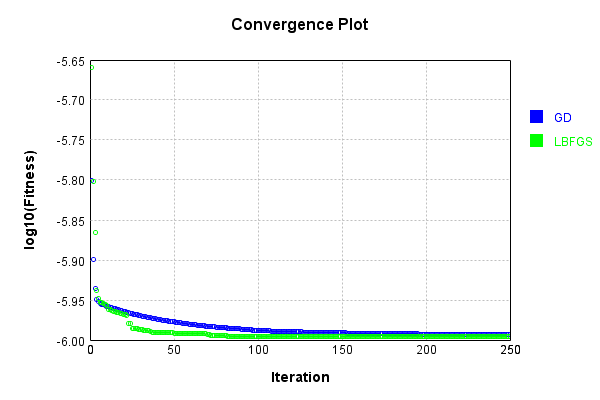


Code from [LearningTester.java:99](../../../../../../../src/main/java/com/simiacryptus/mindseye/test/unit/LearningTester.java#L99) executed in 0.00 seconds: 
```java
    return TestUtil.compareTime(runs);
```

Returns: 

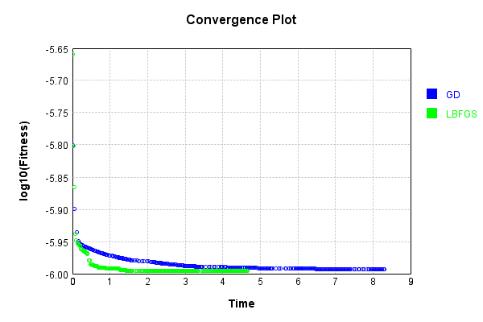


This is a network with the following layout:

Code from [NLayerTest.java:87](../../../../../../../src/test/java/com/simiacryptus/mindseye/network/NLayerTest.java#L87) executed in 0.25 seconds: 
```java
    return Graphviz.fromGraph(TestUtil.toGraph((DAGNetwork) layer))
      .height(400).width(600).render(Format.PNG).toImage();
```

Returns: 

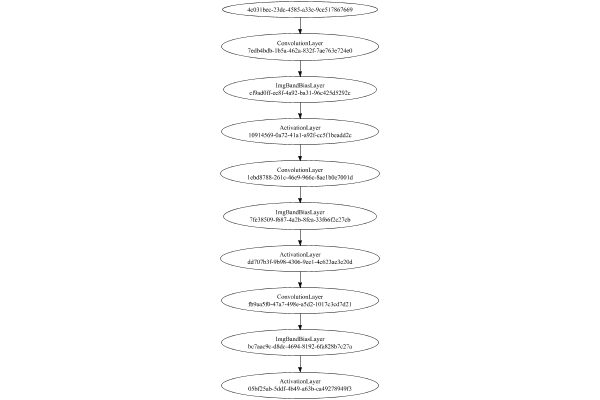


### Json Serialization
Code from [JsonTest.java:36](../../../../../../../src/main/java/com/simiacryptus/mindseye/test/unit/JsonTest.java#L36) executed in 0.00 seconds: 
```java
    JsonObject json = layer.getJson();
    NNLayer echo = NNLayer.fromJson(json);
    if ((echo == null)) throw new AssertionError("Failed to deserialize");
    if ((layer == echo)) throw new AssertionError("Serialization did not copy");
    if ((!layer.equals(echo))) throw new AssertionError("Serialization not equal");
    return new GsonBuilder().setPrettyPrinting().create().toJson(json);
```

Returns: 

```
    {
      "class": "com.simiacryptus.mindseye.network.PipelineNetwork",
      "id": "9d04f022-a6d5-4109-950d-017255aa9cfc",
      "isFrozen": false,
      "name": "PipelineNetwork/9d04f022-a6d5-4109-950d-017255aa9cfc",
      "inputs": [
        "4c031bec-23dc-4585-a33e-9ce517867669"
      ],
      "nodes": {
        "bff3458a-4e1c-4da9-bf79-a9b9db1288bf": "7edb4bdb-1b5a-462a-832f-7ae763e724e0",
        "f54f1d0e-aa96-4c35-b61f-896c4d6c0047": "cf9ad0ff-ec8f-4a92-ba31-96c425d5292c",
        "eacb2a60-2cc8-4c7d-8eff-e05ec3b19a1c": "10914569-0a72-41a1-a92f-cc5f1beadd2c",
        "ef4b2868-7144-4d0b-8ed3-51cac4a29432": "1ebd8788-261c-46e9-966c-8ae1b0e7001d",
        "9b3fff32-8525-4946-8966-8177aaed1a4f": "7fe38509-f687-4a2b-8fea-33f66f2c27cb",
        "de198b0f-62dd-44b0-a4a2-e37cdcb97942": "dd707b3f-9b98-4306-9ee1-4c623ae3e20d",
        "3310b19c-ddb4-4233-a6b3-677d564a0cf8": "fb9aa5f0-47a7-498e-a5d2-1017c3cd7d21",
        "467024bb-953b-4b5c-9b7c-2c6755a4aa8c": "bc7aac9c-d8dc-4694-8192-6fa828b7c27a",
        "69f2da01-17d4-434b-a7fe-e1785c5735b6": "05bf25ab-5ddf-4b49-a63b-ca49278
```
...[skipping 11646 bytes](etc/69.txt)...
```
    ",
          "mode": 1,
          "precision": "Double"
        }
      },
      "links": {
        "bff3458a-4e1c-4da9-bf79-a9b9db1288bf": [
          "4c031bec-23dc-4585-a33e-9ce517867669"
        ],
        "f54f1d0e-aa96-4c35-b61f-896c4d6c0047": [
          "bff3458a-4e1c-4da9-bf79-a9b9db1288bf"
        ],
        "eacb2a60-2cc8-4c7d-8eff-e05ec3b19a1c": [
          "f54f1d0e-aa96-4c35-b61f-896c4d6c0047"
        ],
        "ef4b2868-7144-4d0b-8ed3-51cac4a29432": [
          "eacb2a60-2cc8-4c7d-8eff-e05ec3b19a1c"
        ],
        "9b3fff32-8525-4946-8966-8177aaed1a4f": [
          "ef4b2868-7144-4d0b-8ed3-51cac4a29432"
        ],
        "de198b0f-62dd-44b0-a4a2-e37cdcb97942": [
          "9b3fff32-8525-4946-8966-8177aaed1a4f"
        ],
        "3310b19c-ddb4-4233-a6b3-677d564a0cf8": [
          "de198b0f-62dd-44b0-a4a2-e37cdcb97942"
        ],
        "467024bb-953b-4b5c-9b7c-2c6755a4aa8c": [
          "3310b19c-ddb4-4233-a6b3-677d564a0cf8"
        ],
        "69f2da01-17d4-434b-a7fe-e1785c5735b6": [
          "467024bb-953b-4b5c-9b7c-2c6755a4aa8c"
        ]
      },
      "labels": {},
      "head": "69f2da01-17d4-434b-a7fe-e1785c5735b6"
    }
```


### Input Learning
In this test, we use a network to learn this target input, given it's pre-evaluated output:

Code from [LearningTester.java:127](../../../../../../../src/main/java/com/simiacryptus/mindseye/test/unit/LearningTester.java#L127) executed in 0.00 seconds: 
```java
    return Arrays.stream(input_target).map(x -> x.prettyPrint()).reduce((a, b) -> a + "\n" + b).orElse("");
```

Returns: 

```
    [
    	[ [ -0.0606, 0.01, -0.007 ], [ 0.0666, -0.08960000000000001, 0.013 ], [ -0.0062, 0.0178, 0.0032 ], [ 0.029200000000000004, 0.04340000000000001, -0.0732 ], [ 0.06180000000000001, 0.0216, 0.053 ] ],
    	[ [ 0.017, -0.0536, 0.08220000000000001 ], [ -0.0862, -0.0246, -0.09820000000000001 ], [ 0.0068000000000000005, -0.0926, 0.015600000000000001 ], [ -0.0258, -0.0356, 0.005 ], [ 0.0974, 0.094, -0.016 ] ],
    	[ [ 0.026, -0.047400000000000005, -0.07060000000000001 ], [ 0.036, -0.07440000000000001, -0.0806 ], [ -0.0582, -0.0256, -0.008 ], [ -0.0522, 0.0122, 0.074 ], [ 0.0088, 0.0388, 0.0078000000000000005 ] ],
    	[ [ -0.0218, -0.0668, -0.089 ], [ 0.093, -0.0806, -0.039200000000000006 ], [ 0.0038000000000000004, -0.098, -0.0456 ], [ 0.0466, -0.09680000000000001, 0.07360000000000001 ], [ -0.07360000000000001, 0.027200000000000002, 0.0994 ] ],
    	[ [ 0.0724, -0.0864, 0.0854 ], [ -0.0268, 0.014, 0.014 ], [ -0.047400000000000005, -0.0506, 0.0694 ], [ 0.0208, -0.016, 0.0512 ], [ -0.0682, -0.062400000000000004, -0.013 ] ]
    ]
```


First, we use a conjugate gradient descent method, which converges the fastest for purely linear functions.

Code from [LearningTester.java:300](../../../../../../../src/main/java/com/simiacryptus/mindseye/test/unit/LearningTester.java#L300) executed in 24.94 seconds: 
```java
    return new IterativeTrainer(trainable)
      .setLineSearchFactory(label -> new QuadraticSearch())
      .setOrientation(new GradientDescent())
      .setMonitor(monitor)
      .setTimeout(30, TimeUnit.SECONDS)
      .setMaxIterations(250)
      .setTerminateThreshold(0)
      .run();
```
Logging: 
```
    Low gradient: 1.532427153475212E-6
    Constructing line search parameters: GD
    F(0.0) = LineSearchPoint{point=PointSample{avg=1.6649550002541048E-7}, derivative=-2.3483329807081412E-12}
    New Minimum: 1.6649550002541048E-7 > 1.6649550002541032E-7
    F(1.0E-10) = LineSearchPoint{point=PointSample{avg=1.6649550002541032E-7}, derivative=-2.3483329807081388E-12}, delta = -1.5881867761018131E-22
    New Minimum: 1.6649550002541032E-7 > 1.6649550002540887E-7
    F(7.000000000000001E-10) = LineSearchPoint{point=PointSample{avg=1.6649550002540887E-7}, derivative=-2.348332980708121E-12}, delta = -1.61465655570351E-21
    New Minimum: 1.6649550002540887E-7 > 1.6649550002539905E-7
    F(4.900000000000001E-9) = LineSearchPoint{point=PointSample{avg=1.6649550002539905E-7}, derivative=-2.348332980708004E-12}, delta = -1.1434944787933055E-20
    New Minimum: 1.6649550002539905E-7 > 1.6649550002532996E-7
    F(3.430000000000001E-8) = LineSearchPoint{point=PointSample{avg=1.6649550002532996E-7}, derivative=-2.3483329807071803E-12}, delta = -8.05210
```
...[skipping 674450 bytes](etc/70.txt)...
```
    12950487849793E-9}, derivative=5.0665252612123953E-17}, delta = -1.072719253618096E-11
    3.3412950487849793E-9 <= 3.3520222413211603E-9
    New Minimum: 3.3412950487849793E-9 > 3.3410204685432948E-9
    F(67455.09093769176) = LineSearchPoint{point=PointSample{avg=3.3410204685432948E-9}, derivative=1.3823263033146654E-17}, delta = -1.1001772777865529E-11
    Right bracket at 67455.09093769176
    New Minimum: 3.3410204685432948E-9 > 3.341000333760292E-9
    F(65209.08634153343) = LineSearchPoint{point=PointSample{avg=3.341000333760292E-9}, derivative=4.1061597658302025E-18}, delta = -1.1021907560868393E-11
    Right bracket at 65209.08634153343
    New Minimum: 3.341000333760292E-9 > 3.3409985654684428E-9
    F(64548.67408849865) = LineSearchPoint{point=PointSample{avg=3.3409985654684428E-9}, derivative=1.248955433871394E-18}, delta = -1.10236758527175E-11
    Right bracket at 64548.67408849865
    Converged to right
    Iteration 250 complete. Error: 3.3409985654684428E-9 Total: 251110209082330.8400; Orientation: 0.0000; Line Search: 0.0384
    
```

Returns: 

```
    3.3409985654684428E-9
```


Training Converged

Next, we run the same optimization using L-BFGS, which is nearly ideal for purely second-order or quadratic functions.

Code from [LearningTester.java:324](../../../../../../../src/main/java/com/simiacryptus/mindseye/test/unit/LearningTester.java#L324) executed in 3.10 seconds: 
```java
    return new IterativeTrainer(trainable)
      .setLineSearchFactory(label -> new ArmijoWolfeSearch())
      .setOrientation(new LBFGS())
      .setMonitor(monitor)
      .setTimeout(30, TimeUnit.SECONDS)
      .setMaxIterations(250)
      .setTerminateThreshold(0)
      .run();
```
Logging: 
```
    LBFGS Accumulation History: 1 points
    Constructing line search parameters: GD
    th(0)=1.6649550002541048E-7;dx=-2.3483329807081412E-12
    New Minimum: 1.6649550002541048E-7 > 1.6649044076034676E-7
    WOLFE (weak): th(2.154434690031884)=1.6649044076034676E-7; dx=-2.3482726644392417E-12 delta=5.059265063722184E-12
    New Minimum: 1.6649044076034676E-7 > 1.6648538162523068E-7
    WOLFE (weak): th(4.308869380063768)=1.6648538162523068E-7; dx=-2.348212348170344E-12 delta=1.0118400179805355E-11
    New Minimum: 1.6648538162523068E-7 > 1.664651463842405E-7
    WOLFE (weak): th(12.926608140191302)=1.664651463842405E-7; dx=-2.3479710830947494E-12 delta=3.035364116997138E-11
    New Minimum: 1.664651463842405E-7 > 1.6637411352938235E-7
    WOLFE (weak): th(51.70643256076521)=1.6637411352938235E-7; dx=-2.3468853902545757E-12 delta=1.2138649602813414E-10
    New Minimum: 1.6637411352938235E-7 > 1.6588931604265152E-7
    WOLFE (weak): th(258.53216280382605)=1.6588931604265152E-7; dx=-2.341095028440316E-12 delta=6.061839827589667E-10
    New Minimum: 1.
```
...[skipping 87490 bytes](etc/71.txt)...
```
    x=-2.1025386807432973E-13 delta=3.562794427071164E-10
    Iteration 77 complete. Error: 4.987231409523721E-8 Total: 251113285793950.7500; Orientation: 0.0001; Line Search: 0.0281
    LBFGS Accumulation History: 1 points
    th(0)=4.987231409523721E-8;dx=-2.1882088297523958E-13
    New Minimum: 4.987231409523721E-8 > 4.917959657535664E-8
    WOLFE (weak): th(3341.943960201201)=4.917959657535664E-8; dx=-2.013986859841431E-13 delta=6.92717519880564E-10
    New Minimum: 4.917959657535664E-8 > 4.8518919406300195E-8
    END: th(6683.887920402402)=4.8518919406300195E-8; dx=-1.945698054892781E-13 delta=1.3533946889370126E-9
    Iteration 78 complete. Error: 4.8518919406300195E-8 Total: 251113301791212.7200; Orientation: 0.0001; Line Search: 0.0121
    LBFGS Accumulation History: 1 points
    th(0)=4.8518919406300195E-8;dx=-1.8566697373308838E-13
    MAX ALPHA: th(0)=4.8518919406300195E-8;th'(0)=-1.8566697373308838E-13;
    Iteration 79 failed, aborting. Error: 4.8518919406300195E-8 Total: 251113313999116.7000; Orientation: 0.0001; Line Search: 0.0083
    
```

Returns: 

```
    4.8518919406300195E-8
```


Training Converged

Code from [LearningTester.java:96](../../../../../../../src/main/java/com/simiacryptus/mindseye/test/unit/LearningTester.java#L96) executed in 0.00 seconds: 
```java
    return TestUtil.compare(runs);
```

Returns: 

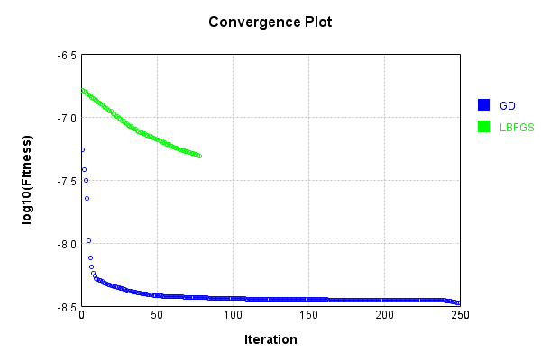


Code from [LearningTester.java:99](../../../../../../../src/main/java/com/simiacryptus/mindseye/test/unit/LearningTester.java#L99) executed in 0.00 seconds: 
```java
    return TestUtil.compareTime(runs);
```

Returns: 

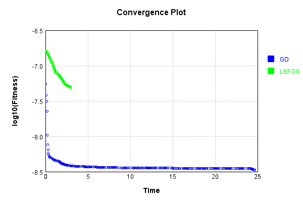


### Model Learning
In this test, attempt to train a network to emulate a randomized network given an example input/output. The target state is:

Code from [LearningTester.java:176](../../../../../../../src/main/java/com/simiacryptus/mindseye/test/unit/LearningTester.java#L176) executed in 0.00 seconds: 
```java
    return network_target.state().stream().map(Arrays::toString).reduce((a, b) -> a + "\n" + b).orElse("");
```

Returns: 

```
    [-0.0082, 0.0396, 0.09340000000000001, -0.049400000000000006, -0.048600000000000004, 0.0502, 0.091, -0.0298, 0.0408, 0.0164, 0.0786, -0.062200000000000005, 0.0902, 0.085, 0.059800000000000006, 0.099, -0.0654, 0.0088, 0.0966, -0.03, -0.096, -0.091, 0.0964, 0.0422, 0.0204, 0.011200000000000002, 0.062400000000000004, 4.0E-4, -0.005600000000000001, 0.0148, -0.0208, 0.0826, 0.0966, 0.0882, -0.0834, 0.0918, 0.067, -0.08120000000000001, -0.08180000000000001, -0.026600000000000002, 0.0072, -0.0068000000000000005, 0.0436, -0.062, -0.07780000000000001, 0.09720000000000001, 0.0188, -0.09380000000000001, -0.078, -0.0144, -0.0596, -0.030400000000000003, 0.009600000000000001, 0.0994, -0.038, 0.066, -0.079, -0.0936, 0.0164, 0.037, 0.0922, 0.0616, -0.06180000000000001, 0.004, -0.0536, 0.09340000000000001, 0.0, -0.044800000000000006, -0.089, -0.09980000000000001, -0.025200000000000004, -0.0402, -0.009, 0.0646, -0.0064, 0.0586, -0.079, -0.0028000000000000004, -0.09340000000000001, 0.023, -0.0308]
    [0.0172, -0.015200000000000002
```
...[skipping 1118 bytes](etc/72.txt)...
```
    .0154, -0.0302, 0.07740000000000001, 0.0994, -0.07440000000000001, 0.006, 0.0734, -0.035800000000000005, -0.025, -0.0792, -0.07460000000000001, -0.05140000000000001, -0.0722, 0.0548, 0.08080000000000001, -0.0398, 0.0026, 0.0476, 0.0712, -0.09860000000000001, -0.034, 0.0322, -0.0398, -0.018400000000000003, 0.0148, -0.0204, 0.0454, 0.076, -0.06760000000000001, 0.0862, 0.0268, 0.0762, -0.0412, 0.028, 0.067, -0.0682, -0.017400000000000002, 0.0864, 0.07840000000000001, -0.043800000000000006, -0.063, -0.0158, -0.0576, 0.0994, -0.025, 0.0674, 0.0536, -0.0198, 0.0804, 0.09540000000000001, 0.07260000000000001, -0.060200000000000004, 0.046400000000000004, -0.038400000000000004, -0.0316, 0.08480000000000001, -0.09160000000000001, -0.0024000000000000002, 0.0478, -0.013800000000000002, -0.0012000000000000001, 0.0902, 0.0804, -0.0114, 0.060200000000000004, -0.005, -0.035, 0.046400000000000004, 0.04340000000000001, -0.08760000000000001, 0.0144, 0.08360000000000001, -0.071, -0.038400000000000004, 0.010600000000000002, 0.013]
```


First, we use a conjugate gradient descent method, which converges the fastest for purely linear functions.

Code from [LearningTester.java:300](../../../../../../../src/main/java/com/simiacryptus/mindseye/test/unit/LearningTester.java#L300) executed in 13.31 seconds: 
```java
    return new IterativeTrainer(trainable)
      .setLineSearchFactory(label -> new QuadraticSearch())
      .setOrientation(new GradientDescent())
      .setMonitor(monitor)
      .setTimeout(30, TimeUnit.SECONDS)
      .setMaxIterations(250)
      .setTerminateThreshold(0)
      .run();
```
Logging: 
```
    Constructing line search parameters: GD
    F(0.0) = LineSearchPoint{point=PointSample{avg=2.8412798857281905E-7}, derivative=-1.0543645525362395E-7}
    New Minimum: 2.8412798857281905E-7 > 2.8412798856227534E-7
    F(1.0E-10) = LineSearchPoint{point=PointSample{avg=2.8412798856227534E-7}, derivative=-1.0543645524727028E-7}, delta = -1.054370730874392E-17
    New Minimum: 2.8412798856227534E-7 > 2.8412798849901347E-7
    F(7.000000000000001E-10) = LineSearchPoint{point=PointSample{avg=2.8412798849901347E-7}, derivative=-1.0543645520914823E-7}, delta = -7.380558058429302E-17
    New Minimum: 2.8412798849901347E-7 > 2.841279880561803E-7
    F(4.900000000000001E-9) = LineSearchPoint{point=PointSample{avg=2.841279880561803E-7}, derivative=-1.0543645494229387E-7}, delta = -5.166387464526959E-16
    New Minimum: 2.841279880561803E-7 > 2.8412798495634857E-7
    F(3.430000000000001E-8) = LineSearchPoint{point=PointSample{avg=2.8412798495634857E-7}, derivative=-1.0543645307431342E-7}, delta = -3.6164704840150426E-15
    New Minimum: 2.84127984956
```
...[skipping 345029 bytes](etc/73.txt)...
```
    ) = LineSearchPoint{point=PointSample{avg=7.602510038178353E-8}, derivative=-3.585038553861115E-12}, delta = -6.3114222286309E-11
    F(81.73072521500995) = LineSearchPoint{point=PointSample{avg=7.653917097895294E-8}, derivative=1.826132409334324E-11}, delta = 4.5095637488310526E-10
    F(6.286978862693074) = LineSearchPoint{point=PointSample{avg=7.604894747777943E-8}, derivative=-5.2655115668829675E-12}, delta = -3.926712629040912E-11
    F(44.008852038851515) = LineSearchPoint{point=PointSample{avg=7.607219015061924E-8}, derivative=6.497848787874597E-12}, delta = -1.6024453450604072E-11
    7.607219015061924E-8 <= 7.608821460406984E-8
    New Minimum: 7.602510038178353E-8 > 7.600449310524378E-8
    F(23.172014596305498) = LineSearchPoint{point=PointSample{avg=7.600449310524378E-8}, derivative=-1.9502160120750176E-17}, delta = -8.372149882606347E-11
    Left bracket at 23.172014596305498
    Converged to left
    Iteration 250 complete. Error: 7.600449310524378E-8 Total: 251126737468156.3000; Orientation: 0.0001; Line Search: 0.0426
    
```

Returns: 

```
    7.600449310524378E-8
```


Training Converged

Next, we run the same optimization using L-BFGS, which is nearly ideal for purely second-order or quadratic functions.

Code from [LearningTester.java:324](../../../../../../../src/main/java/com/simiacryptus/mindseye/test/unit/LearningTester.java#L324) executed in 6.46 seconds: 
```java
    return new IterativeTrainer(trainable)
      .setLineSearchFactory(label -> new ArmijoWolfeSearch())
      .setOrientation(new LBFGS())
      .setMonitor(monitor)
      .setTimeout(30, TimeUnit.SECONDS)
      .setMaxIterations(250)
      .setTerminateThreshold(0)
      .run();
```
Logging: 
```
    LBFGS Accumulation History: 1 points
    Constructing line search parameters: GD
    th(0)=2.461979923266001E-7;dx=-6.333394679198772E-8
    New Minimum: 2.461979923266001E-7 > 1.6104581766124278E-7
    END: th(2.154434690031884)=1.6104581766124278E-7; dx=-2.352961089448915E-8 delta=8.515217466535734E-8
    Iteration 1 complete. Error: 1.6104581766124278E-7 Total: 251126821805231.2500; Orientation: 0.0002; Line Search: 0.0245
    LBFGS Accumulation History: 1 points
    th(0)=1.6104581766124278E-7;dx=-9.033212863254447E-9
    New Minimum: 1.6104581766124278E-7 > 1.433801769246311E-7
    WOLF (strong): th(4.641588833612779)=1.433801769246311E-7; dx=7.294049061479343E-10 delta=1.766564073661168E-8
    END: th(2.3207944168063896)=1.4683156057290137E-7; dx=-3.385322444426671E-9 delta=1.421425708834141E-8
    Iteration 2 complete. Error: 1.433801769246311E-7 Total: 251126869840903.2000; Orientation: 0.0002; Line Search: 0.0348
    LBFGS Accumulation History: 1 points
    th(0)=1.4683156057290137E-7;dx=-1.447275006335423E-9
    New Minimum: 1.4683156057290
```
...[skipping 128543 bytes](etc/74.txt)...
```
    5 delta=6.177193677935103E-12
    END: th(1.520794975351339)=1.214042375121383E-7; dx=-9.777078715633031E-13 delta=2.8169835545390066E-12
    Iteration 248 complete. Error: 1.214008773020149E-7 Total: 251133172101516.8400; Orientation: 0.0001; Line Search: 0.0242
    LBFGS Accumulation History: 1 points
    th(0)=1.214042375121383E-7;dx=-1.4879063642943306E-12
    New Minimum: 1.214042375121383E-7 > 1.2140001965208596E-7
    END: th(3.2764534513231083)=1.2140001965208596E-7; dx=-8.874673965612465E-13 delta=4.217860052344188E-12
    Iteration 249 complete. Error: 1.2140001965208596E-7 Total: 251133186308544.8000; Orientation: 0.0001; Line Search: 0.0094
    LBFGS Accumulation History: 1 points
    th(0)=1.2140001965208596E-7;dx=-2.431180468730808E-12
    New Minimum: 1.2140001965208596E-7 > 1.2139731346508965E-7
    END: th(7.058904975805197)=1.2139731346508965E-7; dx=-2.088899486180022E-13 delta=2.7061869963095713E-12
    Iteration 250 complete. Error: 1.2139731346508965E-7 Total: 251133201499602.8000; Orientation: 0.0002; Line Search: 0.0094
    
```

Returns: 

```
    1.2139731346508965E-7
```


Training Converged

Code from [LearningTester.java:96](../../../../../../../src/main/java/com/simiacryptus/mindseye/test/unit/LearningTester.java#L96) executed in 0.00 seconds: 
```java
    return TestUtil.compare(runs);
```

Returns: 

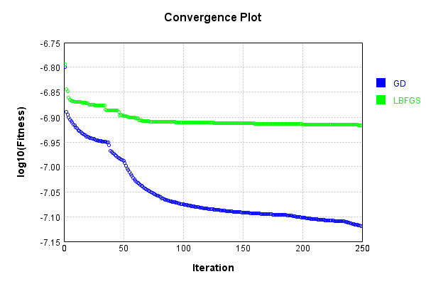


Code from [LearningTester.java:99](../../../../../../../src/main/java/com/simiacryptus/mindseye/test/unit/LearningTester.java#L99) executed in 0.00 seconds: 
```java
    return TestUtil.compareTime(runs);
```

Returns: 

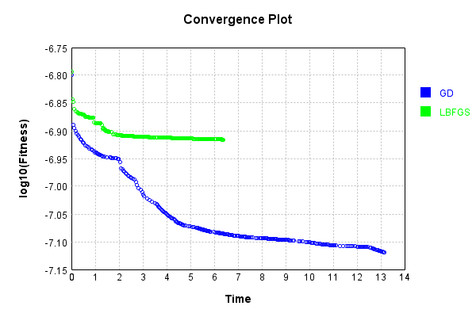


### Composite Learning
In this test, attempt to train a network to emulate a randomized network given an example input/output. The target state is:

Code from [LearningTester.java:219](../../../../../../../src/main/java/com/simiacryptus/mindseye/test/unit/LearningTester.java#L219) executed in 0.00 seconds: 
```java
    return network_target.state().stream().map(Arrays::toString).reduce((a, b) -> a + "\n" + b).orElse("");
```

Returns: 

```
    [0.0502, 0.0408, 0.0148, 0.011200000000000002, -0.096, -0.0298, -0.026600000000000002, 0.0882, 0.0902, -0.048600000000000004, -0.0144, -0.0064, -0.038, -0.091, 0.0922, -0.09380000000000001, -0.025200000000000004, 0.099, -0.009, 0.0, -0.0308, -0.0402, -0.0082, 0.0164, -0.0028000000000000004, -0.08120000000000001, -0.089, -0.0936, 0.0586, -0.06180000000000001, 0.0966, -0.079, 0.0964, -0.030400000000000003, 0.085, 0.059800000000000006, 0.023, -0.09340000000000001, 0.0436, 0.0646, 0.0422, -0.0596, 0.0396, -0.0208, 0.0826, -0.08180000000000001, -0.03, 0.066, 0.067, -0.09980000000000001, 0.037, -0.062200000000000005, -0.079, 0.004, 0.09720000000000001, 0.009600000000000001, 0.0994, -0.07780000000000001, -0.0068000000000000005, 0.0164, 0.0616, 0.0188, -0.005600000000000001, -0.078, 0.0204, 4.0E-4, 0.0786, -0.0834, 0.0966, -0.062, 0.0918, -0.0536, -0.044800000000000006, -0.049400000000000006, 0.09340000000000001, -0.0654, 0.091, 0.062400000000000004, 0.09340000000000001, 0.0088, 0.0072]
    [-0.072, 0.087, -0.06960000000
```
...[skipping 1118 bytes](etc/75.txt)...
```
    0000001, 0.0734, -0.0722, -0.071, -0.0792, -0.035800000000000005, 0.076, 0.0476, -0.035, -0.017400000000000002, -0.0684, 0.0144, -0.025, 0.0074, -0.043800000000000006, -0.013800000000000002, -0.0316, -0.079, -0.0302, -0.025, 0.060200000000000004, 0.0478, -0.0398, 0.0762, 0.0804, -0.0398, -0.06760000000000001, 0.0268, -0.038400000000000004, -0.0154, 0.028, 0.0656, 0.09540000000000001, 0.08360000000000001, 0.067, -0.034, -0.0198, -0.0158, 0.006, -0.0682, 0.08080000000000001, 0.0994, -0.07440000000000001, 0.07740000000000001, -0.05140000000000001, 0.013, 0.04340000000000001, -0.09160000000000001, -0.07460000000000001, 0.046400000000000004, -0.09860000000000001, 0.046400000000000004, -0.0114, 0.0902, -0.060200000000000004, -0.018400000000000003, 0.0712, 0.0454, -0.0024000000000000002, 0.0548, -0.063, -0.0412, 0.08480000000000001, 0.0028000000000000004, -0.005, -0.038400000000000004, -0.0012000000000000001, -0.0576, -0.0204, 0.0994, 0.0148, 0.07840000000000001, -0.08760000000000001, 0.0864, 0.0322, 0.0804, 0.0674]
```


We simultaneously regress this target input:

Code from [LearningTester.java:223](../../../../../../../src/main/java/com/simiacryptus/mindseye/test/unit/LearningTester.java#L223) executed in 0.00 seconds: 
```java
    return Arrays.stream(testInput).map(x -> x.prettyPrint()).reduce((a, b) -> a + "\n" + b).orElse("");
```

Returns: 

```
    [
    	[ [ 0.0038000000000000004, -0.0806, 0.036 ], [ 0.0512, -0.008, 0.027200000000000002 ], [ -0.09680000000000001, 0.0068000000000000005, -0.0522 ], [ -0.039200000000000006, -0.07060000000000001, -0.07360000000000001 ], [ -0.047400000000000005, 0.0854, 0.0666 ] ],
    	[ [ -0.0356, -0.07440000000000001, 0.0388 ], [ 0.0178, 0.0088, 0.0994 ], [ 0.013, -0.013, -0.0582 ], [ 0.005, -0.0456, 0.0208 ], [ -0.0606, 0.014, -0.0668 ] ],
    	[ [ 0.0694, -0.0864, -0.0218 ], [ -0.0862, -0.047400000000000005, -0.0806 ], [ -0.0732, 0.093, 0.04340000000000001 ], [ -0.098, -0.0062, -0.0246 ], [ -0.062400000000000004, -0.016, 0.0078000000000000005 ] ],
    	[ [ 0.01, 0.053, -0.0268 ], [ -0.007, 0.014, -0.0506 ], [ -0.0926, 0.0122, 0.0216 ], [ 0.07360000000000001, 0.0974, 0.015600000000000001 ], [ 0.017, -0.0536, 0.06180000000000001 ] ],
    	[ [ 0.029200000000000004, 0.026, -0.016 ], [ 0.074, -0.089, -0.0258 ], [ 0.0724, 0.094, -0.0256 ], [ -0.0682, 0.0032, -0.08960000000000001 ], [ 0.08220000000000001, 0.0466, -0.09820000000000001 ] ]
    ]
```


Which produces the following output:

Code from [LearningTester.java:230](../../../../../../../src/main/java/com/simiacryptus/mindseye/test/unit/LearningTester.java#L230) executed in 0.00 seconds: 
```java
    return Stream.of(targetOutput).map(x -> x.prettyPrint()).reduce((a, b) -> a + "\n" + b).orElse("");
```

Returns: 

```
    [
    	[ [ 2.6718040343040014E-4, 1.45500163968E-4, 0.0 ], [ 4.720393698416001E-4, 0.0, 0.0 ], [ 4.866292856272001E-4, 1.0470983006720002E-4, 1.342072196112002E-4 ], [ 3.861079697712001E-4, 0.0, 0.0 ], [ 0.0, 0.0, 4.5573891668480014E-4 ] ],
    	[ [ 3.0316199464160013E-4, 4.015372524224002E-4, 0.0 ], [ 0.0013524195413184004, 6.480879362640003E-4, 6.110860833968E-4 ], [ 5.260559322224E-4, 0.0, 0.0 ], [ 0.0010070713269568004, 1.322154035536001E-4, 0.0 ], [ 0.0, 0.0, 2.2983535068960015E-4 ] ],
    	[ [ 7.194819498912001E-4, 0.0, 0.0 ], [ 0.0010178841798976004, 0.0010861920965888003, 0.0 ], [ 0.0012883041981168006, 1.9519339637760007E-4, 1.9469132609599845E-5 ], [ 0.0013758684081456004, 0.0, 0.0 ], [ 0.0, 0.0, 6.132440197904003E-4 ] ],
    	[ [ 2.2112289744320008E-4, 2.203822147088E-4, 2.5242920529120014E-4 ], [ 1.6804583675519987E-4, 4.349710860608002E-4, 6.404544991039988E-5 ], [ 3.344401967360004E-4, 4.291583206928003E-4, 4.039003672336001E-4 ], [ 8.932075162016005E-4, 2.715010518544001E-4, 9.97130633648E-5 ], [ 0.0, 0.0, 0.0 ] ],
    	[ [ 6.247344784000266E-7, 1.5002283299840003E-4, 0.0 ], [ 4.150739540816001E-4, 0.0, 7.73727073712001E-5 ], [ 6.149566212639997E-5, 4.1885715965120005E-4, 0.0 ], [ 3.485923767456001E-4, 0.0, 0.0 ], [ 0.0, 0.0, 0.0 ] ]
    ]
```


First, we use a conjugate gradient descent method, which converges the fastest for purely linear functions.

Code from [LearningTester.java:300](../../../../../../../src/main/java/com/simiacryptus/mindseye/test/unit/LearningTester.java#L300) executed in 15.55 seconds: 
```java
    return new IterativeTrainer(trainable)
      .setLineSearchFactory(label -> new QuadraticSearch())
      .setOrientation(new GradientDescent())
      .setMonitor(monitor)
      .setTimeout(30, TimeUnit.SECONDS)
      .setMaxIterations(250)
      .setTerminateThreshold(0)
      .run();
```
Logging: 
```
    Constructing line search parameters: GD
    F(0.0) = LineSearchPoint{point=PointSample{avg=1.9713080166102887E-7}, derivative=-9.65789081357415E-9}
    New Minimum: 1.9713080166102887E-7 > 1.9713080166006317E-7
    F(1.0E-10) = LineSearchPoint{point=PointSample{avg=1.9713080166006317E-7}, derivative=-9.657890813101142E-9}, delta = -9.656969692087075E-19
    New Minimum: 1.9713080166006317E-7 > 1.9713080165426848E-7
    F(7.000000000000001E-10) = LineSearchPoint{point=PointSample{avg=1.9713080165426848E-7}, derivative=-9.657890810263087E-9}, delta = -6.7603817102733846E-18
    New Minimum: 1.9713080165426848E-7 > 1.971308016137053E-7
    F(4.900000000000001E-9) = LineSearchPoint{point=PointSample{avg=1.971308016137053E-7}, derivative=-9.657890790396676E-9}, delta = -4.732357194442015E-17
    New Minimum: 1.971308016137053E-7 > 1.9713080132976333E-7
    F(3.430000000000001E-8) = LineSearchPoint{point=PointSample{avg=1.9713080132976333E-7}, derivative=-9.657890651331812E-9}, delta = -3.312655330065331E-16
    New Minimum: 1.9713080132976333E
```
...[skipping 377495 bytes](etc/76.txt)...
```
     derivative=-6.137346312846941E-13}, delta = -2.000995537995148E-12
    F(17.936318358133875) = LineSearchPoint{point=PointSample{avg=1.558161520563156E-7}, derivative=1.3925826423849727E-12}, delta = 3.986004514348192E-12
    F(1.3797167967795287) = LineSearchPoint{point=PointSample{avg=1.5581098212536207E-7}, derivative=-7.680667418574478E-13}, delta = -1.1839264391658462E-12
    New Minimum: 1.5580913186668481E-7 > 1.558090954644678E-7
    F(9.6580175774567) = LineSearchPoint{point=PointSample{avg=1.558090954644678E-7}, derivative=3.1225799435725556E-13}, delta = -3.070587333432348E-12
    1.558090954644678E-7 <= 1.5581216605180124E-7
    New Minimum: 1.558090954644678E-7 > 1.5580872188411145E-7
    F(7.265250389755885) = LineSearchPoint{point=PointSample{avg=1.5580872188411145E-7}, derivative=1.1185216492184207E-20}, delta = -3.444167689785368E-12
    Right bracket at 7.265250389755885
    Converged to right
    Iteration 250 complete. Error: 1.5580872188411145E-7 Total: 251148900214163.2500; Orientation: 0.0001; Line Search: 0.1069
    
```

Returns: 

```
    1.5580872188411145E-7
```


Training Converged

Next, we run the same optimization using L-BFGS, which is nearly ideal for purely second-order or quadratic functions.

Code from [LearningTester.java:324](../../../../../../../src/main/java/com/simiacryptus/mindseye/test/unit/LearningTester.java#L324) executed in 5.59 seconds: 
```java
    return new IterativeTrainer(trainable)
      .setLineSearchFactory(label -> new ArmijoWolfeSearch())
      .setOrientation(new LBFGS())
      .setMonitor(monitor)
      .setTimeout(30, TimeUnit.SECONDS)
      .setMaxIterations(250)
      .setTerminateThreshold(0)
      .run();
```
Logging: 
```
    LBFGS Accumulation History: 1 points
    Constructing line search parameters: GD
    th(0)=1.9713080166102887E-7;dx=-9.65789081357415E-9
    New Minimum: 1.9713080166102887E-7 > 1.8193216590905453E-7
    END: th(2.154434690031884)=1.8193216590905453E-7; dx=-3.6561743807295347E-9 delta=1.5198635751974333E-8
    Iteration 1 complete. Error: 1.8193216590905453E-7 Total: 251148985389929.1000; Orientation: 0.0002; Line Search: 0.0248
    LBFGS Accumulation History: 1 points
    th(0)=1.8193216590905453E-7;dx=-2.2822716370512373E-9
    New Minimum: 1.8193216590905453E-7 > 1.7481894919244276E-7
    END: th(4.641588833612779)=1.7481894919244276E-7; dx=-8.769307454484847E-10 delta=7.113216716611772E-9
    Iteration 2 complete. Error: 1.7481894919244276E-7 Total: 251149024530856.0000; Orientation: 0.0003; Line Search: 0.0257
    LBFGS Accumulation History: 1 points
    th(0)=1.7481894919244276E-7;dx=-5.748918390236788E-10
    New Minimum: 1.7481894919244276E-7 > 1.716389668427285E-7
    END: th(10.000000000000002)=1.716389668427285E-7; dx=-1.2328138825931726E-
```
...[skipping 111556 bytes](etc/77.txt)...
```
    7; dx=-1.0282586738335295E-13 delta=-2.6469779601696886E-23
    Armijo: th(7.158201545797992E-12)=1.5628047444450277E-7; dx=-1.0282586738338301E-13 delta=-5.293955920339377E-23
    Armijo: th(5.624301214555565E-12)=1.5628047444450274E-7; dx=-1.8331713842202506E-12 delta=-2.6469779601696886E-23
    WOLFE (weak): th(4.857351048934351E-12)=1.5628047444450271E-7; dx=-1.8331713842202607E-12 delta=0.0
    Armijo: th(5.240826131744958E-12)=1.5628047444450277E-7; dx=-1.8331713842202543E-12 delta=-5.293955920339377E-23
    Armijo: th(5.049088590339655E-12)=1.5628047444450274E-7; dx=-1.833171384220256E-12 delta=-2.6469779601696886E-23
    WOLFE (weak): th(4.953219819637003E-12)=1.5628047444450271E-7; dx=-1.8331713842202575E-12 delta=0.0
    WOLFE (weak): th(5.001154204988329E-12)=1.5628047444450271E-7; dx=-1.8331713842202567E-12 delta=0.0
    mu /= nu: th(0)=1.5628047444450271E-7;th'(0)=-1.8331713842203076E-12;
    Iteration 200 failed, aborting. Error: 1.5628047444450271E-7 Total: 251154502593784.5600; Orientation: 0.0002; Line Search: 0.0728
    
```

Returns: 

```
    1.5628047444450271E-7
```


Training Converged

Code from [LearningTester.java:96](../../../../../../../src/main/java/com/simiacryptus/mindseye/test/unit/LearningTester.java#L96) executed in 0.00 seconds: 
```java
    return TestUtil.compare(runs);
```

Returns: 

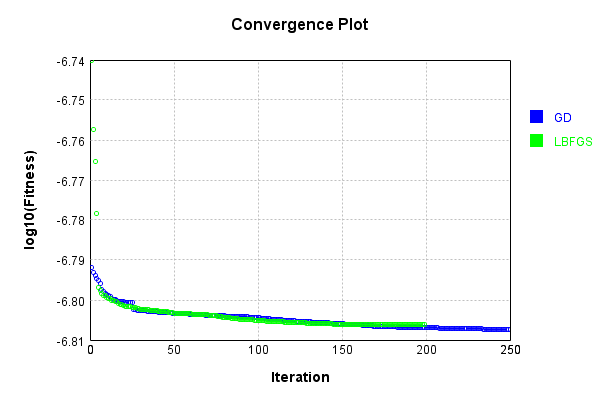


Code from [LearningTester.java:99](../../../../../../../src/main/java/com/simiacryptus/mindseye/test/unit/LearningTester.java#L99) executed in 0.00 seconds: 
```java
    return TestUtil.compareTime(runs);
```

Returns: 

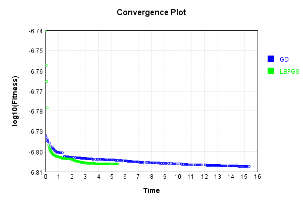


This is a network with the following layout:

Code from [NLayerTest.java:87](../../../../../../../src/test/java/com/simiacryptus/mindseye/network/NLayerTest.java#L87) executed in 0.23 seconds: 
```java
    return Graphviz.fromGraph(TestUtil.toGraph((DAGNetwork) layer))
      .height(400).width(600).render(Format.PNG).toImage();
```

Returns: 

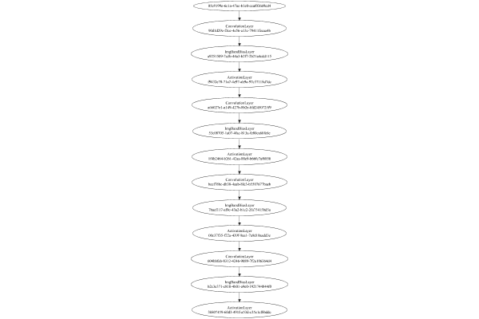


### Json Serialization
Code from [JsonTest.java:36](../../../../../../../src/main/java/com/simiacryptus/mindseye/test/unit/JsonTest.java#L36) executed in 0.00 seconds: 
```java
    JsonObject json = layer.getJson();
    NNLayer echo = NNLayer.fromJson(json);
    if ((echo == null)) throw new AssertionError("Failed to deserialize");
    if ((layer == echo)) throw new AssertionError("Serialization did not copy");
    if ((!layer.equals(echo))) throw new AssertionError("Serialization not equal");
    return new GsonBuilder().setPrettyPrinting().create().toJson(json);
```

Returns: 

```
    {
      "class": "com.simiacryptus.mindseye.network.PipelineNetwork",
      "id": "0adb87b1-48ab-4ef7-8afb-445677f4f1be",
      "isFrozen": false,
      "name": "PipelineNetwork/0adb87b1-48ab-4ef7-8afb-445677f4f1be",
      "inputs": [
        "05e9199e-6c1a-47ac-b1e0-ccaf03669cd4"
      ],
      "nodes": {
        "60c6531e-64df-4bc4-b8bd-0a07c377177b": "90d1d29e-f3ce-4e56-a13c-79411fecaa4b",
        "ea1859ae-0133-48ec-9296-93a50e9da316": "a9251509-7a3b-44a3-b2f7-2b21a4cdd115",
        "ee28836f-f158-4d17-a4e1-448b97213c09": "f9432e70-71a7-4e97-ab9a-97c37118d7dc",
        "439d34d0-f8b8-49c8-a73a-6e3640a0a450": "a66027e1-a149-427b-8b2e-8fd2450725f9",
        "7fcbdc05-f164-47e0-8999-af74d02b72da": "53c08705-1a07-4fac-813a-fe80ca68fc6e",
        "709c6278-ced7-4872-b9b7-929c2737b085": "1f4b2464-b261-42aa-88e9-b66fc7af6850",
        "3e737af9-d6cc-4791-b22a-29aabd06d6a0": "beef78bc-db38-4aab-8fe3-b5507677baeb",
        "27546086-e1ec-40e8-b351-810d3c06a4f9": "7bacf117-af9c-43a2-b1c2-2fa75415bd5a",
        "cac49ca1-82d2-449a-9936-2789686b6c22": "00c37f35-f22a-439f-9aa1-7a9d10a
```
...[skipping 16172 bytes](etc/78.txt)...
```
    e1-448b97213c09": [
          "ea1859ae-0133-48ec-9296-93a50e9da316"
        ],
        "439d34d0-f8b8-49c8-a73a-6e3640a0a450": [
          "ee28836f-f158-4d17-a4e1-448b97213c09"
        ],
        "7fcbdc05-f164-47e0-8999-af74d02b72da": [
          "439d34d0-f8b8-49c8-a73a-6e3640a0a450"
        ],
        "709c6278-ced7-4872-b9b7-929c2737b085": [
          "7fcbdc05-f164-47e0-8999-af74d02b72da"
        ],
        "3e737af9-d6cc-4791-b22a-29aabd06d6a0": [
          "709c6278-ced7-4872-b9b7-929c2737b085"
        ],
        "27546086-e1ec-40e8-b351-810d3c06a4f9": [
          "3e737af9-d6cc-4791-b22a-29aabd06d6a0"
        ],
        "cac49ca1-82d2-449a-9936-2789686b6c22": [
          "27546086-e1ec-40e8-b351-810d3c06a4f9"
        ],
        "1010912b-94dc-4f44-b4d7-4982b7c5838f": [
          "cac49ca1-82d2-449a-9936-2789686b6c22"
        ],
        "6cca390e-2adc-4c01-8db8-3ed0e62ffc02": [
          "1010912b-94dc-4f44-b4d7-4982b7c5838f"
        ],
        "623d7434-27f7-485a-8962-93ce5ccbc155": [
          "6cca390e-2adc-4c01-8db8-3ed0e62ffc02"
        ]
      },
      "labels": {},
      "head": "623d7434-27f7-485a-8962-93ce5ccbc155"
    }
```


### Input Learning
In this test, we use a network to learn this target input, given it's pre-evaluated output:

Code from [LearningTester.java:127](../../../../../../../src/main/java/com/simiacryptus/mindseye/test/unit/LearningTester.java#L127) executed in 0.00 seconds: 
```java
    return Arrays.stream(input_target).map(x -> x.prettyPrint()).reduce((a, b) -> a + "\n" + b).orElse("");
```

Returns: 

```
    [
    	[ [ -0.1, -0.0034000000000000002, 0.0054 ], [ 0.08020000000000001, -0.062200000000000005, 0.037200000000000004 ], [ -0.0016, -0.06, -0.0632 ], [ -0.0366, -0.087, -0.0644 ], [ -0.0052, 0.030400000000000003, 0.0852 ] ],
    	[ [ -0.046400000000000004, 0.017, -0.0646 ], [ 0.098, -0.02, -0.07560000000000001 ], [ 0.089, 0.020200000000000003, -0.019200000000000002 ], [ 0.0682, -0.0932, -0.04 ], [ -0.062400000000000004, -0.033600000000000005, 0.017400000000000002 ] ],
    	[ [ 0.012, -0.095, 0.0302 ], [ -0.046400000000000004, -0.026400000000000003, 0.0688 ], [ 0.07479999999999999, -0.082, -0.053200000000000004 ], [ 0.07579999999999999, -0.07740000000000001, 0.087 ], [ -0.0228, -0.058, 0.0684 ] ],
    	[ [ 0.038400000000000004, -0.019, 0.038 ], [ 0.0882, -0.0144, 0.0412 ], [ 0.051800000000000006, -0.0342, -0.08 ], [ -0.0104, 0.0912, 0.09440000000000001 ], [ 0.08360000000000001, -0.0164, 0.060200000000000004 ] ],
    	[ [ -0.0218, 0.0086, 0.0902 ], [ -0.08480000000000001, -0.0176, -0.0048000000000000004 ], [ -0.0328, 0.025400000000000002, -0.07560000000000001 ], [ 0.0086, -0.047200000000000006, 0.0216 ], [ 0.083, 0.006600000000000001, -0.041800000000000004 ] ]
    ]
```


First, we use a conjugate gradient descent method, which converges the fastest for purely linear functions.

Code from [LearningTester.java:300](../../../../../../../src/main/java/com/simiacryptus/mindseye/test/unit/LearningTester.java#L300) executed in 7.32 seconds: 
```java
    return new IterativeTrainer(trainable)
      .setLineSearchFactory(label -> new QuadraticSearch())
      .setOrientation(new GradientDescent())
      .setMonitor(monitor)
      .setTimeout(30, TimeUnit.SECONDS)
      .setMaxIterations(250)
      .setTerminateThreshold(0)
      .run();
```
Logging: 
```
    Low gradient: 2.1433385262688613E-7
    Constructing line search parameters: GD
    F(0.0) = LineSearchPoint{point=PointSample{avg=1.6459576446438913E-8}, derivative=-4.5939000381883754E-14}
    New Minimum: 1.6459576446438913E-8 > 1.6459576446438903E-8
    F(1.0E-10) = LineSearchPoint{point=PointSample{avg=1.6459576446438903E-8}, derivative=-4.593900038188374E-14}, delta = -9.926167350636332E-24
    New Minimum: 1.6459576446438903E-8 > 1.6459576446438873E-8
    F(7.000000000000001E-10) = LineSearchPoint{point=PointSample{avg=1.6459576446438873E-8}, derivative=-4.5939000381883684E-14}, delta = -3.970466940254533E-23
    New Minimum: 1.6459576446438873E-8 > 1.6459576446438684E-8
    F(4.900000000000001E-9) = LineSearchPoint{point=PointSample{avg=1.6459576446438684E-8}, derivative=-4.593900038188336E-14}, delta = -2.2830184906463564E-22
    New Minimum: 1.6459576446438684E-8 > 1.645957644643733E-8
    F(3.430000000000001E-8) = LineSearchPoint{point=PointSample{avg=1.645957644643733E-8}, derivative=-4.5939000381881065E-14}, delta = -1.581569
```
...[skipping 155423 bytes](etc/79.txt)...
```
    =PointSample{avg=8.738127350876401E-10}, derivative=1.5913867854300203E-18}, delta = 1.0339757656912846E-25
    Right bracket at 2.589006836083386E-10
    F(2.2988372801129163E-10) = LineSearchPoint{point=PointSample{avg=8.738127350876401E-10}, derivative=1.5913867854300178E-18}, delta = 1.0339757656912846E-25
    Right bracket at 2.2988372801129163E-10
    F(2.0411892185002887E-10) = LineSearchPoint{point=PointSample{avg=8.738127350876401E-10}, derivative=1.5913867854300158E-18}, delta = 1.0339757656912846E-25
    Right bracket at 2.0411892185002887E-10
    F(1.8124177216741365E-10) = LineSearchPoint{point=PointSample{avg=8.7381273508764E-10}, derivative=-1.2607591644789554E-17}, delta = 0.0
    Left bracket at 1.8124177216741365E-10
    F(2.0155490684908101E-10) = LineSearchPoint{point=PointSample{avg=8.738127350876401E-10}, derivative=1.5913867854300172E-18}, delta = 1.0339757656912846E-25
    Loops = 12
    Iteration 64 failed, aborting. Error: 8.7381273508764E-10 Total: 251162222899741.0300; Orientation: 0.0001; Line Search: 0.2376
    
```

Returns: 

```
    8.7381273508764E-10
```


Training Converged

Next, we run the same optimization using L-BFGS, which is nearly ideal for purely second-order or quadratic functions.

Code from [LearningTester.java:324](../../../../../../../src/main/java/com/simiacryptus/mindseye/test/unit/LearningTester.java#L324) executed in 14.15 seconds: 
```java
    return new IterativeTrainer(trainable)
      .setLineSearchFactory(label -> new ArmijoWolfeSearch())
      .setOrientation(new LBFGS())
      .setMonitor(monitor)
      .setTimeout(30, TimeUnit.SECONDS)
      .setMaxIterations(250)
      .setTerminateThreshold(0)
      .run();
```
Logging: 
```
    LBFGS Accumulation History: 1 points
    Constructing line search parameters: GD
    th(0)=1.6459576446438913E-8;dx=-4.5939000381883754E-14
    New Minimum: 1.6459576446438913E-8 > 1.6459477474045207E-8
    WOLFE (weak): th(2.154434690031884)=1.6459477474045207E-8; dx=-4.593883110935557E-14 delta=9.897239370579501E-14
    New Minimum: 1.6459477474045207E-8 > 1.6459378502016172E-8
    WOLFE (weak): th(4.308869380063768)=1.6459378502016172E-8; dx=-4.5938661836827383E-14 delta=1.9794442274074517E-13
    New Minimum: 1.6459378502016172E-8 > 1.645898261754699E-8
    WOLFE (weak): th(12.926608140191302)=1.645898261754699E-8; dx=-4.5937984746714693E-14 delta=5.938288919239431E-13
    New Minimum: 1.645898261754699E-8 > 1.6457201209643494E-8
    WOLFE (weak): th(51.70643256076521)=1.6457201209643494E-8; dx=-4.593493784120746E-14 delta=2.375236795418388E-12
    New Minimum: 1.6457201209643494E-8 > 1.6447702363056698E-8
    WOLFE (weak): th(258.53216280382605)=1.6447702363056698E-8; dx=-4.591868767850234E-14 delta=1.1874083382214407E-11
    New Minimum: 1.6
```
...[skipping 329758 bytes](etc/80.txt)...
```
    6.557431856018586E-9
    WOLFE (weak): th(4.308869380063768)=6.557431856018586E-9; dx=-1.2980431596741802E-14 delta=5.593116905514868E-14
    New Minimum: 6.557431856018586E-9 > 6.557319994789327E-9
    WOLFE (weak): th(12.926608140191302)=6.557319994789327E-9; dx=-1.298026003531535E-14 delta=1.6779239831411848E-13
    New Minimum: 6.557319994789327E-9 > 6.5568166375537465E-9
    WOLFE (weak): th(51.70643256076521)=6.5568166375537465E-9; dx=-1.2979488008896325E-14 delta=6.711496338945275E-13
    New Minimum: 6.5568166375537465E-9 > 6.554132571267937E-9
    WOLFE (weak): th(258.53216280382605)=6.554132571267937E-9; dx=-1.2975370534661514E-14 delta=3.3552159197038263E-12
    New Minimum: 6.554132571267937E-9 > 6.537376451035388E-9
    WOLFE (weak): th(1551.1929768229563)=6.537376451035388E-9; dx=-1.2949636320693947E-14 delta=2.011133615225318E-11
    MAX ALPHA: th(0)=6.557487787187641E-9;th'(0)=-1.298051737745503E-14;
    Iteration 250 complete. Error: 6.537376451035388E-9 Total: 251176373516220.7000; Orientation: 0.0002; Line Search: 0.0444
    
```

Returns: 

```
    6.537376451035388E-9
```


Training Converged

Code from [LearningTester.java:96](../../../../../../../src/main/java/com/simiacryptus/mindseye/test/unit/LearningTester.java#L96) executed in 0.00 seconds: 
```java
    return TestUtil.compare(runs);
```

Returns: 

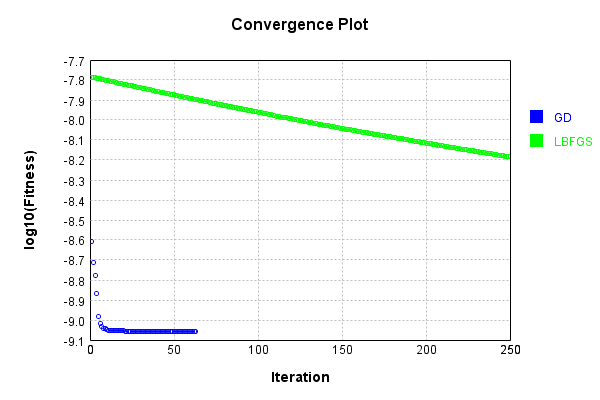


Code from [LearningTester.java:99](../../../../../../../src/main/java/com/simiacryptus/mindseye/test/unit/LearningTester.java#L99) executed in 0.00 seconds: 
```java
    return TestUtil.compareTime(runs);
```

Returns: 

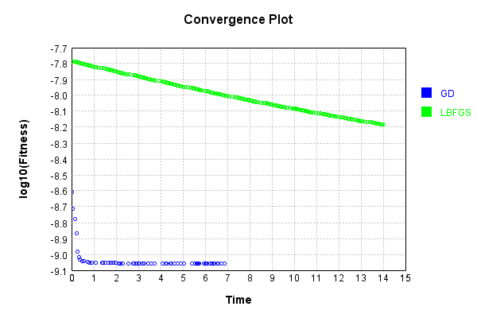


### Model Learning
In this test, attempt to train a network to emulate a randomized network given an example input/output. The target state is:

Code from [LearningTester.java:176](../../../../../../../src/main/java/com/simiacryptus/mindseye/test/unit/LearningTester.java#L176) executed in 0.00 seconds: 
```java
    return network_target.state().stream().map(Arrays::toString).reduce((a, b) -> a + "\n" + b).orElse("");
```

Returns: 

```
    [0.0, 0.0, 0.0]
    [0.0776, 0.07780000000000001, -0.09720000000000001, 0.0786, 0.005, 0.048600000000000004, -0.048600000000000004, 0.08280000000000001, -0.0874, -0.0786, -0.1, 0.0408, -0.0496, 0.07560000000000001, 0.0562, -0.060200000000000004, 0.023200000000000002, -0.093, -0.07880000000000001, -0.0284, 0.028, -0.0644, 0.0402, 0.0626, -0.057, 0.0834, -0.0534, -0.09380000000000001, -0.0316, -0.042800000000000005, 0.009200000000000002, 0.031200000000000002, 0.07540000000000001, -0.0456, -0.027200000000000002, 0.08080000000000001, 0.0194, 0.021200000000000004, 0.0632, 0.082, -0.0268, 0.0396, 0.0732, 0.09, -0.067, -0.075, 0.06520000000000001, -0.0562, -0.062200000000000005, 0.09720000000000001, 0.099, 0.0012000000000000001, 0.085, 0.077, 0.09480000000000001, 0.05240000000000001, -0.0898, -0.0926, -0.0108, -0.049, -0.0334, 0.03780000000000001, 0.008, 0.054400000000000004, 0.0884, 0.0296, 0.072, 0.0616, -0.040400000000000005, -0.0256, -0.0562, 0.0376, 0.0072, 0.0354, 0.0356, 0.048600000000000004, -0.02420000000000000
```
...[skipping 2262 bytes](etc/81.txt)...
```
    55400000000000005, -0.022600000000000002, 0.027, -0.044, -0.021, -0.049, -0.0872, -0.009600000000000001, 0.0468, 0.032600000000000004, -0.07479999999999999, -0.057800000000000004, -0.0216, -0.037, -0.0466, -0.0164, -0.0022, -0.010600000000000002, -0.09, 0.0852, 0.0142, -0.011600000000000001, -0.014, -0.0942, 0.023200000000000002, 0.076, -0.022200000000000004, 0.031, 0.021, 0.0694, 0.0426, 0.08280000000000001, 0.008400000000000001, -0.0344, -0.096, -0.07479999999999999, 0.0488, 0.06620000000000001, -0.027200000000000002, -0.017400000000000002, -0.034, 0.03, -0.0322, 0.049800000000000004, 0.091, 0.010600000000000002, 0.039, 0.07360000000000001, 0.08660000000000001, -0.0534, -0.031, 0.09980000000000001, 0.0582, 0.0182, -0.0692, -0.0144, 0.05040000000000001, -0.0354, 0.08860000000000001, 0.0908, -0.0172, 0.0446, 0.016, 0.095, 0.0854, 0.0162, 0.0422, 0.0332, -0.062400000000000004, 0.043800000000000006, -0.0422, 0.083, 0.0946, 0.0166, 0.08760000000000001, 6.000000000000001E-4, 0.018600000000000002, 0.0862, -0.0354]
```


First, we use a conjugate gradient descent method, which converges the fastest for purely linear functions.

Code from [LearningTester.java:300](../../../../../../../src/main/java/com/simiacryptus/mindseye/test/unit/LearningTester.java#L300) executed in 19.29 seconds: 
```java
    return new IterativeTrainer(trainable)
      .setLineSearchFactory(label -> new QuadraticSearch())
      .setOrientation(new GradientDescent())
      .setMonitor(monitor)
      .setTimeout(30, TimeUnit.SECONDS)
      .setMaxIterations(250)
      .setTerminateThreshold(0)
      .run();
```
Logging: 
```
    Constructing line search parameters: GD
    F(0.0) = LineSearchPoint{point=PointSample{avg=1.0797500325282861E-8}, derivative=-3.3931643640570027E-9}
    New Minimum: 1.0797500325282861E-8 > 1.0797500324943548E-8
    F(1.0E-10) = LineSearchPoint{point=PointSample{avg=1.0797500324943548E-8}, derivative=-3.393164363816219E-9}, delta = -3.3931279599170216E-19
    New Minimum: 1.0797500324943548E-8 > 1.0797500322907643E-8
    F(7.000000000000001E-10) = LineSearchPoint{point=PointSample{avg=1.0797500322907643E-8}, derivative=-3.393164362371502E-9}, delta = -2.375217696082742E-18
    New Minimum: 1.0797500322907643E-8 > 1.0797500308656354E-8
    F(4.900000000000001E-9) = LineSearchPoint{point=PointSample{avg=1.0797500308656354E-8}, derivative=-3.3931643522584897E-9}, delta = -1.6626507328966943E-17
    New Minimum: 1.0797500308656354E-8 > 1.0797500208897323E-8
    F(3.430000000000001E-8) = LineSearchPoint{point=PointSample{avg=1.0797500208897323E-8}, derivative=-3.39316428146741E-9}, delta = -1.163855380678788E-16
    New Minimum: 1.07975002088
```
...[skipping 369292 bytes](etc/82.txt)...
```
    ple{avg=5.9088631611232974E-9}, derivative=6.100048005969242E-15}, delta = -2.232251668948757E-13
    Right bracket at 2.52832699398568
    New Minimum: 5.9088631611232974E-9 > 5.9088628554996975E-9
    F(2.4684771357180066) = LineSearchPoint{point=PointSample{avg=5.9088628554996975E-9}, derivative=4.1129619613571446E-15}, delta = -2.235307904947735E-13
    Right bracket at 2.4684771357180066
    New Minimum: 5.9088628554996975E-9 > 5.908862718365909E-9
    F(2.428772402977403) = LineSearchPoint{point=PointSample{avg=5.908862718365909E-9}, derivative=2.7947178982677555E-15}, delta = -2.2366792428355537E-13
    Right bracket at 2.428772402977403
    New Minimum: 5.908862718365909E-9 > 5.908862655614562E-9
    F(2.4020898130201966) = LineSearchPoint{point=PointSample{avg=5.908862655614562E-9}, derivative=1.908824369401018E-15}, delta = -2.2373067563005584E-13
    Right bracket at 2.4020898130201966
    Converged to right
    Iteration 250 complete. Error: 5.908862655614562E-9 Total: 251195813360397.2800; Orientation: 0.0001; Line Search: 0.1004
    
```

Returns: 

```
    5.908862655614562E-9
```


Training Converged

Next, we run the same optimization using L-BFGS, which is nearly ideal for purely second-order or quadratic functions.

Code from [LearningTester.java:324](../../../../../../../src/main/java/com/simiacryptus/mindseye/test/unit/LearningTester.java#L324) executed in 9.19 seconds: 
```java
    return new IterativeTrainer(trainable)
      .setLineSearchFactory(label -> new ArmijoWolfeSearch())
      .setOrientation(new LBFGS())
      .setMonitor(monitor)
      .setTimeout(30, TimeUnit.SECONDS)
      .setMaxIterations(250)
      .setTerminateThreshold(0)
      .run();
```
Logging: 
```
    LBFGS Accumulation History: 1 points
    Constructing line search parameters: GD
    th(0)=1.820353050860983E-8;dx=-4.176879768301819E-9
    New Minimum: 1.820353050860983E-8 > 1.4092185221359528E-8
    END: th(2.154434690031884)=1.4092185221359528E-8; dx=-4.3087840680049787E-10 delta=4.111345287250303E-9
    Iteration 1 complete. Error: 1.4092185221359528E-8 Total: 251195908804505.2000; Orientation: 0.0003; Line Search: 0.0290
    LBFGS Accumulation History: 1 points
    th(0)=1.4092185221359528E-8;dx=-9.920942056651479E-11
    New Minimum: 1.4092185221359528E-8 > 1.3657977689071229E-8
    END: th(4.641588833612779)=1.3657977689071229E-8; dx=-8.892769821344422E-11 delta=4.3420753228829947E-10
    Iteration 2 complete. Error: 1.3657977689071229E-8 Total: 251195954530997.1000; Orientation: 0.0002; Line Search: 0.0303
    LBFGS Accumulation History: 1 points
    th(0)=1.3657977689071229E-8;dx=-1.4313889788220132E-10
    New Minimum: 1.3657977689071229E-8 > 1.2713223978930088E-8
    END: th(10.000000000000002)=1.2713223978930088E-8; dx=-1.19709804238045
```
...[skipping 145775 bytes](etc/83.txt)...
```
    6138E-9;dx=-4.737327465715945E-13
    Armijo: th(44.36752940566091)=6.5024015547530045E-9; dx=4.263238515167851E-12 delta=-8.947221469686617E-11
    Armijo: th(22.183764702830455)=6.4327248770539416E-9; dx=2.0185336388522823E-12 delta=-1.9795536997803242E-11
    Armijo: th(7.394588234276818)=6.413938205722403E-9; dx=5.220637188207591E-13 delta=-1.0088656662646079E-12
    New Minimum: 6.412929340056138E-9 > 6.412598996201841E-9
    END: th(1.8486470585692045)=6.412598996201841E-9; dx=-3.911250170417594E-14 delta=3.3034385429728425E-13
    Iteration 249 complete. Error: 6.412598996201841E-9 Total: 251204939145575.1000; Orientation: 0.0002; Line Search: 0.0334
    LBFGS Accumulation History: 1 points
    th(0)=6.412598996201841E-9;dx=-1.0426781302252678E-13
    New Minimum: 6.412598996201841E-9 > 6.41223760576302E-9
    END: th(3.982789352606898)=6.41223760576302E-9; dx=-7.720823645121976E-14 delta=3.613904388213574E-13
    Iteration 250 complete. Error: 6.41223760576302E-9 Total: 251204999393141.0600; Orientation: 0.0002; Line Search: 0.0536
    
```

Returns: 

```
    6.41223760576302E-9
```


Training Converged

Code from [LearningTester.java:96](../../../../../../../src/main/java/com/simiacryptus/mindseye/test/unit/LearningTester.java#L96) executed in 0.00 seconds: 
```java
    return TestUtil.compare(runs);
```

Returns: 

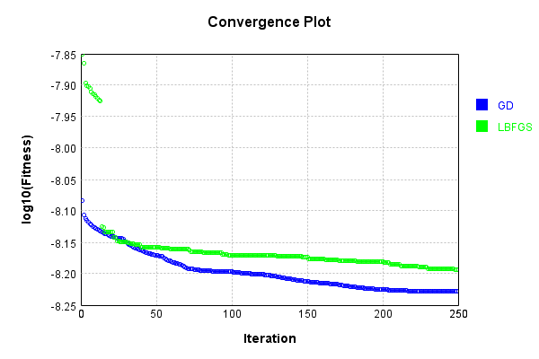


Code from [LearningTester.java:99](../../../../../../../src/main/java/com/simiacryptus/mindseye/test/unit/LearningTester.java#L99) executed in 0.00 seconds: 
```java
    return TestUtil.compareTime(runs);
```

Returns: 

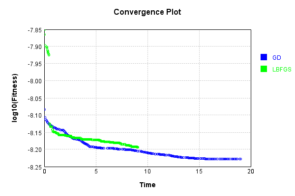


### Composite Learning
In this test, attempt to train a network to emulate a randomized network given an example input/output. The target state is:

Code from [LearningTester.java:219](../../../../../../../src/main/java/com/simiacryptus/mindseye/test/unit/LearningTester.java#L219) executed in 0.00 seconds: 
```java
    return network_target.state().stream().map(Arrays::toString).reduce((a, b) -> a + "\n" + b).orElse("");
```

Returns: 

```
    [0.0, 0.0, 0.0]
    [0.0408, 0.07540000000000001, 0.08080000000000001, -0.0874, 0.082, -0.024200000000000003, -0.0644, -0.049, 0.09480000000000001, -0.0456, -0.0284, 0.025400000000000002, 0.028, 0.0402, -0.0534, 0.072, 0.07780000000000001, -0.09720000000000001, 0.0194, 0.07560000000000001, 0.0632, -0.0316, 0.077, 0.0012000000000000001, -0.093, -0.027200000000000002, 0.099, -0.040400000000000005, -0.0496, -0.0898, -0.057, 0.0356, 0.0396, 0.0072, -0.0256, -0.042800000000000005, 0.0884, 0.07160000000000001, 0.08280000000000001, 0.09720000000000001, 0.0732, 0.0776, 0.021200000000000004, 0.005, -0.07640000000000001, 0.06520000000000001, 0.0974, -0.067, 0.009200000000000002, 0.031200000000000002, -0.0562, 0.03780000000000001, 0.09, -0.07880000000000001, -0.060200000000000004, -0.0334, 0.0834, -0.0926, 0.05240000000000001, 0.048600000000000004, 0.085, -0.09380000000000001, 0.0616, 0.0786, -0.1, 0.0626, -0.075, 0.0376, 0.0296, 0.008, 0.023200000000000002, 0.0562, -0.0268, -0.0108, -0.0786, -0.048600000000000004, -0.06220
```
...[skipping 2262 bytes](etc/84.txt)...
```
    2, -0.0144, 0.08280000000000001, -0.031, -0.010600000000000002, -0.037, 0.076, -0.022600000000000002, -0.0354, 6.000000000000001E-4, 0.03, 0.0422, 0.010600000000000002, -0.0354, -0.011600000000000001, -0.07479999999999999, 0.0468, 0.039, -0.059800000000000006, -0.034, 0.0426, 0.091, -0.0872, 0.016, 0.07360000000000001, -0.055400000000000005, -0.0216, -0.049, -0.044, 0.0854, 0.083, 0.08660000000000001, -0.0466, -0.0322, -0.027200000000000002, -0.0022, 0.0332, -0.022200000000000004, -0.0172, -0.07479999999999999, -0.09, 0.043800000000000006, 0.0582, 0.0862, -0.096, -0.021, 0.023200000000000002, 0.06620000000000001, 0.031, 0.0142, 0.0946, -0.0534, -0.0942, -0.009600000000000001, -0.0422, 0.0488, 0.027, 0.0694, -0.014, 0.05040000000000001, 0.095, -0.0344, 0.08860000000000001, 0.08760000000000001, 0.09980000000000001, 0.018600000000000002, 0.0446, -0.057800000000000004, -0.0692, 0.0162, -0.0164, 0.0908, -0.062400000000000004, 0.0852, 0.032600000000000004, 0.008400000000000001, 0.0166, -0.017400000000000002, 0.021]
```


We simultaneously regress this target input:

Code from [LearningTester.java:223](../../../../../../../src/main/java/com/simiacryptus/mindseye/test/unit/LearningTester.java#L223) executed in 0.00 seconds: 
```java
    return Arrays.stream(testInput).map(x -> x.prettyPrint()).reduce((a, b) -> a + "\n" + b).orElse("");
```

Returns: 

```
    [
    	[ [ -0.07560000000000001, 0.0412, -0.0052 ], [ -0.08, -0.058, -0.0646 ], [ 0.020200000000000003, 0.098, -0.0034000000000000002 ], [ 0.0684, -0.07740000000000001, -0.06 ], [ -0.08480000000000001, -0.062400000000000004, -0.095 ] ],
    	[ [ 0.087, 0.0902, 0.038 ], [ 0.0912, -0.04, 0.089 ], [ -0.1, 0.0086, 0.09440000000000001 ], [ 0.0054, -0.0176, -0.087 ], [ -0.07560000000000001, 0.0852, -0.0932 ] ],
    	[ [ -0.0144, 0.030400000000000003, -0.062200000000000005 ], [ -0.033600000000000005, -0.026400000000000003, -0.0342 ], [ 0.07579999999999999, 0.08360000000000001, -0.02 ], [ 0.0688, 0.08020000000000001, 0.017400000000000002 ], [ -0.0328, 0.0216, -0.046400000000000004 ] ],
    	[ [ -0.019200000000000002, -0.0644, -0.0632 ], [ -0.082, -0.047200000000000006, -0.0164 ], [ 0.0882, -0.046400000000000004, -0.0016 ], [ -0.0104, 0.060200000000000004, -0.0228 ], [ 0.0302, -0.041800000000000004, 0.083 ] ],
    	[ [ 0.038400000000000004, 0.0682, 0.025400000000000002 ], [ -0.0366, -0.053200000000000004, 0.051800000000000006 ], [ 0.037200000000000004, 0.017, -0.0048000000000000004 ], [ 0.012, 0.006600000000000001, -0.019 ], [ 0.07479999999999999, 0.0086, -0.0218 ] ]
    ]
```


Which produces the following output:

Code from [LearningTester.java:230](../../../../../../../src/main/java/com/simiacryptus/mindseye/test/unit/LearningTester.java#L230) executed in 0.00 seconds: 
```java
    return Stream.of(targetOutput).map(x -> x.prettyPrint()).reduce((a, b) -> a + "\n" + b).orElse("");
```

Returns: 

```
    [
    	[ [ 2.7657547300425598E-5, 8.47748604927741E-5, 0.0 ], [ 0.0, 2.4268516853657448E-4, 0.0 ], [ 0.0, 1.1459770969829502E-4, 0.0 ], [ 4.7721822370562584E-5, 2.388831325274531E-5, 1.2937155732250248E-5 ], [ 0.0, 4.5573414889225E-5, 0.0 ] ],
    	[ [ 2.1955953724503332E-4, 1.073819590973786E-4, 1.9179442164689092E-4 ], [ 1.1249342050716547E-4, 1.263572020328202E-4, 2.207515524923332E-4 ], [ 0.0, 2.30794102754802E-4, 0.0 ], [ 8.703924270811526E-5, 9.900169559751787E-6, 5.32616212468736E-5 ], [ 0.0, 4.8782678768135355E-5, 0.0 ] ],
    	[ [ 6.584054273290813E-5, 9.590411064560644E-5, 0.0 ], [ 1.2081766817693507E-4, 0.0, 0.0 ], [ 2.68716260600778E-4, 7.036662140471907E-5, 7.231077203247775E-5 ], [ 7.890308535099423E-5, 1.19616035602336E-4, 7.29940418019316E-5 ], [ 5.4638617725240684E-5, 1.0419479146226149E-4, 0.0 ] ],
    	[ [ 6.654446092104222E-5, 5.1078889620508514E-5, 0.0 ], [ 0.0, 1.709636708382065E-4, 0.0 ], [ 0.0, 3.765896140499809E-5, 4.667312172859428E-5 ], [ 1.8123164493514914E-4, 8.925456839969447E-5, 6.0145770117011544E-5 ], [ 2.7486218166204816E-5, 1.762053697651015E-4, 0.0 ] ],
    	[ [ 8.468846921660356E-5, 7.565128258095526E-5, 3.553244501219109E-5 ], [ 1.0365276772889736E-4, 5.90027818629674E-5, 1.444175265867668E-4 ], [ 1.684579127302276E-4, 7.767114093560261E-5, 7.019345552217255E-5 ], [ 1.2792100313021475E-4, 1.4601802436133607E-4, 0.0 ], [ 1.0751222462727523E-4, 9.375602363250595E-5, 1.0220372094479777E-4 ] ]
    ]
```


First, we use a conjugate gradient descent method, which converges the fastest for purely linear functions.

Code from [LearningTester.java:300](../../../../../../../src/main/java/com/simiacryptus/mindseye/test/unit/LearningTester.java#L300) executed in 18.11 seconds: 
```java
    return new IterativeTrainer(trainable)
      .setLineSearchFactory(label -> new QuadraticSearch())
      .setOrientation(new GradientDescent())
      .setMonitor(monitor)
      .setTimeout(30, TimeUnit.SECONDS)
      .setMaxIterations(250)
      .setTerminateThreshold(0)
      .run();
```
Logging: 
```
    Constructing line search parameters: GD
    F(0.0) = LineSearchPoint{point=PointSample{avg=9.651544645909455E-9}, derivative=-9.756678318978014E-10}
    New Minimum: 9.651544645909455E-9 > 9.651544645811893E-9
    F(1.0E-10) = LineSearchPoint{point=PointSample{avg=9.651544645811893E-9}, derivative=-9.756678318486414E-10}, delta = -9.75626445281794E-20
    New Minimum: 9.651544645811893E-9 > 9.651544645226493E-9
    F(7.000000000000001E-10) = LineSearchPoint{point=PointSample{avg=9.651544645226493E-9}, derivative=-9.756678315536829E-10}, delta = -6.829616727544073E-19
    New Minimum: 9.651544645226493E-9 > 9.651544641128684E-9
    F(4.900000000000001E-9) = LineSearchPoint{point=PointSample{avg=9.651544641128684E-9}, derivative=-9.756678294889679E-10}, delta = -4.780771413950254E-18
    New Minimum: 9.651544641128684E-9 > 9.65154461244405E-9
    F(3.430000000000001E-8) = LineSearchPoint{point=PointSample{avg=9.65154461244405E-9}, derivative=-9.756678150359667E-10}, delta = -3.346540486073545E-17
    New Minimum: 9.65154461244405E-9 > 9.651
```
...[skipping 345712 bytes](etc/85.txt)...
```
    1107960537E-13}
    F(5.603421990986289) = LineSearchPoint{point=PointSample{avg=4.169690964839866E-9}, derivative=2.2455213597898127E-13}, delta = 2.668016846069328E-13
    New Minimum: 4.169424163155259E-9 > 4.169374286927999E-9
    F(0.4310324608450991) = LineSearchPoint{point=PointSample{avg=4.169374286927999E-9}, derivative=-1.0210276899869442E-13}, delta = -4.987622726034658E-14
    New Minimum: 4.169374286927999E-9 > 4.169321427582623E-9
    F(3.017227225915694) = LineSearchPoint{point=PointSample{avg=4.169321427582623E-9}, derivative=6.122468348858714E-14}, delta = -1.0273557263636845E-13
    4.169321427582623E-9 <= 4.169424163155259E-9
    New Minimum: 4.169321427582623E-9 > 4.169291750231042E-9
    F(2.0477701412662555) = LineSearchPoint{point=PointSample{avg=4.169291750231042E-9}, derivative=-4.63086594913701E-25}, delta = -1.324129242173255E-13
    Left bracket at 2.0477701412662555
    Converged to left
    Iteration 250 complete. Error: 4.169291750231042E-9 Total: 251223243154803.8800; Orientation: 0.0004; Line Search: 0.1163
    
```

Returns: 

```
    4.169291750231042E-9
```


Training Converged

Next, we run the same optimization using L-BFGS, which is nearly ideal for purely second-order or quadratic functions.

Code from [LearningTester.java:324](../../../../../../../src/main/java/com/simiacryptus/mindseye/test/unit/LearningTester.java#L324) executed in 9.69 seconds: 
```java
    return new IterativeTrainer(trainable)
      .setLineSearchFactory(label -> new ArmijoWolfeSearch())
      .setOrientation(new LBFGS())
      .setMonitor(monitor)
      .setTimeout(30, TimeUnit.SECONDS)
      .setMaxIterations(250)
      .setTerminateThreshold(0)
      .run();
```
Logging: 
```
    LBFGS Accumulation History: 1 points
    Constructing line search parameters: GD
    th(0)=9.651544645909455E-9;dx=-9.756678318978014E-10
    New Minimum: 9.651544645909455E-9 > 8.528349060530588E-9
    END: th(2.154434690031884)=8.528349060530588E-9; dx=-1.8109158933704058E-10 delta=1.123195585378867E-9
    Iteration 1 complete. Error: 8.528349060530588E-9 Total: 251223331126207.7500; Orientation: 0.0003; Line Search: 0.0323
    LBFGS Accumulation History: 1 points
    th(0)=8.528349060530588E-9;dx=-1.444223008258208E-10
    New Minimum: 8.528349060530588E-9 > 8.062797811549887E-9
    END: th(4.641588833612779)=8.062797811549887E-9; dx=-3.594898653732365E-11 delta=4.655512489807008E-10
    Iteration 2 complete. Error: 8.062797811549887E-9 Total: 251223360787328.6600; Orientation: 0.0002; Line Search: 0.0152
    LBFGS Accumulation History: 1 points
    th(0)=8.062797811549887E-9;dx=-6.621106128679813E-11
    Armijo: th(10.000000000000002)=8.50836190478569E-9; dx=1.6129715681147753E-10 delta=-4.4556409323580284E-10
    New Minimum: 8.062797811549887E-
```
...[skipping 147883 bytes](etc/86.txt)...
```
    155417.1200; Orientation: 0.0002; Line Search: 0.0215
    LBFGS Accumulation History: 1 points
    th(0)=4.135748795484625E-9;dx=-7.200451205757433E-14
    Armijo: th(4.945760366155168)=4.135786723202804E-9; dx=5.309140938470317E-14 delta=-3.792771817845386E-14
    New Minimum: 4.135748795484625E-9 > 4.135694487826778E-9
    END: th(2.472880183077584)=4.135694487826778E-9; dx=2.1506119958980242E-14 delta=5.430765784697078E-14
    Iteration 249 complete. Error: 4.135694487826778E-9 Total: 251232923951354.1000; Orientation: 0.0003; Line Search: 0.0207
    LBFGS Accumulation History: 1 points
    th(0)=4.135694487826778E-9;dx=-6.108958389567653E-13
    Armijo: th(5.3276588507147435)=4.135767944449044E-9; dx=5.753661153095926E-14 delta=-7.345662226596173E-14
    New Minimum: 4.135694487826778E-9 > 4.135651785332247E-9
    END: th(2.6638294253573718)=4.135651785332247E-9; dx=2.967551667394777E-14 delta=4.270249453143146E-14
    Iteration 250 complete. Error: 4.135651785332247E-9 Total: 251232951327233.0600; Orientation: 0.0002; Line Search: 0.0206
    
```

Returns: 

```
    4.135651785332247E-9
```


Training Converged

Code from [LearningTester.java:96](../../../../../../../src/main/java/com/simiacryptus/mindseye/test/unit/LearningTester.java#L96) executed in 0.00 seconds: 
```java
    return TestUtil.compare(runs);
```

Returns: 

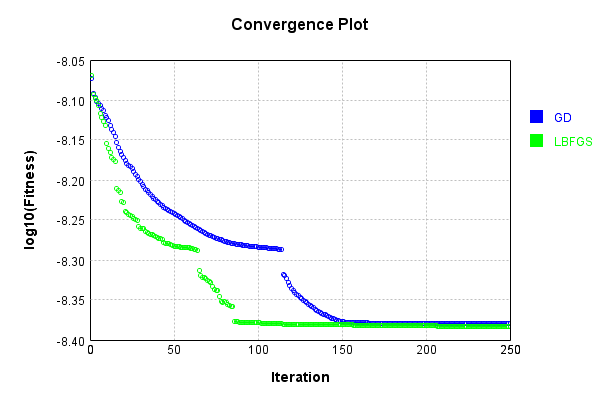


Code from [LearningTester.java:99](../../../../../../../src/main/java/com/simiacryptus/mindseye/test/unit/LearningTester.java#L99) executed in 0.00 seconds: 
```java
    return TestUtil.compareTime(runs);
```

Returns: 

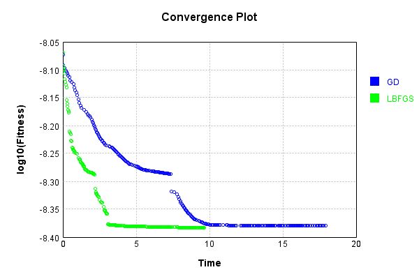


