# NarrowingPipeline
This is a network with the following layout:

Code from [NLayerTest.java:87](../../../../../../../src/test/java/com/simiacryptus/mindseye/network/NLayerTest.java#L87) executed in 0.17 seconds: 
```java
    return Graphviz.fromGraph(TestUtil.toGraph((DAGNetwork) layer))
      .height(400).width(600).render(Format.PNG).toImage();
```

Returns: 

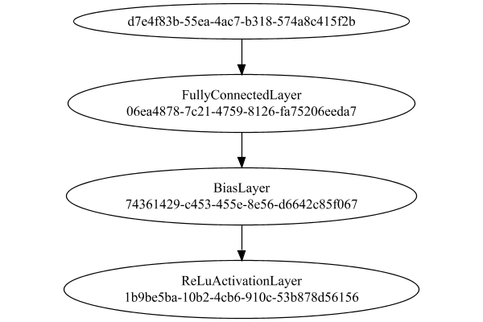


### Json Serialization
Code from [JsonTest.java:36](../../../../../../../src/main/java/com/simiacryptus/mindseye/test/unit/JsonTest.java#L36) executed in 0.00 seconds: 
```java
    JsonObject json = layer.getJson();
    NNLayer echo = NNLayer.fromJson(json);
    if ((echo == null)) throw new AssertionError("Failed to deserialize");
    if ((layer == echo)) throw new AssertionError("Serialization did not copy");
    if ((!layer.equals(echo))) throw new AssertionError("Serialization not equal");
    return new GsonBuilder().setPrettyPrinting().create().toJson(json);
```

Returns: 

```
    {
      "class": "com.simiacryptus.mindseye.network.PipelineNetwork",
      "id": "8f63cad7-d703-427b-8b98-df4784f2e8aa",
      "isFrozen": false,
      "name": "PipelineNetwork/8f63cad7-d703-427b-8b98-df4784f2e8aa",
      "inputs": [
        "d7e4f83b-55ea-4ac7-b318-574a8c415f2b"
      ],
      "nodes": {
        "61e11d78-bd0b-4e5b-baa2-acba73ecdfb0": "06ea4878-7c21-4759-8126-fa75206eeda7",
        "d6f88f1e-850f-4487-a25d-0c0e9e2a4156": "74361429-c453-455e-8e56-d6642c85f067",
        "04e77fea-736e-4e1a-baaf-0ab69d2354fa": "1b9be5ba-10b2-4cb6-910c-53b878d56156"
      },
      "layers": {
        "06ea4878-7c21-4759-8126-fa75206eeda7": {
          "class": "com.simiacryptus.mindseye.layers.java.FullyConnectedLayer",
          "id": "06ea4878-7c21-4759-8126-fa75206eeda7",
          "isFrozen": false,
          "name": "FullyConnectedLayer/06ea4878-7c21-4759-8126-fa75206eeda7",
          "outputDims": [
            4,
            4,
            2
          ],
          "inputDims": [
            5,
            5,
            3
          ],
          "weights": [
            [
              0.08220000000000001,
              0.04240000
```
...[skipping 57458 bytes](etc/43.txt)...
```
           0.0,
            0.0,
            0.0,
            0.0,
            0.0,
            0.0,
            0.0,
            0.0,
            0.0,
            0.0,
            0.0,
            0.0,
            0.0,
            0.0,
            0.0,
            0.0,
            0.0,
            0.0,
            0.0,
            0.0,
            0.0,
            0.0,
            0.0,
            0.0
          ]
        },
        "1b9be5ba-10b2-4cb6-910c-53b878d56156": {
          "class": "com.simiacryptus.mindseye.layers.java.ReLuActivationLayer",
          "id": "1b9be5ba-10b2-4cb6-910c-53b878d56156",
          "isFrozen": true,
          "name": "ReLuActivationLayer/1b9be5ba-10b2-4cb6-910c-53b878d56156",
          "weights": [
            1.0
          ]
        }
      },
      "links": {
        "61e11d78-bd0b-4e5b-baa2-acba73ecdfb0": [
          "d7e4f83b-55ea-4ac7-b318-574a8c415f2b"
        ],
        "d6f88f1e-850f-4487-a25d-0c0e9e2a4156": [
          "61e11d78-bd0b-4e5b-baa2-acba73ecdfb0"
        ],
        "04e77fea-736e-4e1a-baaf-0ab69d2354fa": [
          "d6f88f1e-850f-4487-a25d-0c0e9e2a4156"
        ]
      },
      "labels": {},
      "head": "04e77fea-736e-4e1a-baaf-0ab69d2354fa"
    }
```


### Input Learning
In this test, we use a network to learn this target input, given it's pre-evaluated output:

Code from [LearningTester.java:127](../../../../../../../src/main/java/com/simiacryptus/mindseye/test/unit/LearningTester.java#L127) executed in 0.00 seconds: 
```java
    return Arrays.stream(input_target).map(x -> x.prettyPrint()).reduce((a, b) -> a + "\n" + b).orElse("");
```

Returns: 

```
    [
    	[ [ -0.0128, 0.0308, 0.0366 ], [ -6.000000000000001E-4, -0.045, -0.026400000000000003 ], [ 0.06760000000000001, 0.08940000000000001, 0.05240000000000001 ], [ -0.048400000000000006, 0.08, 0.08080000000000001 ], [ 0.055200000000000006, -0.056400000000000006, -0.043800000000000006 ] ],
    	[ [ 0.0698, 0.044, 0.07940000000000001 ], [ -0.08280000000000001, -8.0E-4, 0.056600000000000004 ], [ -0.0548, 0.075, 0.099 ], [ 0.0884, 0.0614, 0.052 ], [ 0.0722, -0.0964, 0.04240000000000001 ] ],
    	[ [ 0.0704, 0.0316, -0.0172 ], [ -0.055600000000000004, -0.08380000000000001, 0.004 ], [ 0.08360000000000001, -0.0824, 0.07640000000000001 ], [ 0.0678, -0.038, 0.0454 ], [ -0.029200000000000004, -0.0664, -0.0362 ] ],
    	[ [ -0.043800000000000006, 0.0562, -0.08360000000000001 ], [ 0.008, -0.0162, -0.0862 ], [ 0.08080000000000001, -0.07260000000000001, -0.07160000000000001 ], [ 0.034800000000000005, 0.057, -0.0854 ], [ -0.023200000000000002, -0.0178, 0.09860000000000001 ] ],
    	[ [ -0.0882, -0.021200000000000004, 0.018 ], [ 0.0366, 0.006, 0.06280000000000001 ], [ 0.06860000000000001, -0.06620000000000001, 0.0086 ], [ -0.0648, -0.062400000000000004, -0.0698 ], [ 0.0128, 0.0178, -0.0956 ] ]
    ]
```


First, we use a conjugate gradient descent method, which converges the fastest for purely linear functions.

Code from [LearningTester.java:300](../../../../../../../src/main/java/com/simiacryptus/mindseye/test/unit/LearningTester.java#L300) executed in 0.06 seconds: 
```java
    return new IterativeTrainer(trainable)
      .setLineSearchFactory(label -> new QuadraticSearch())
      .setOrientation(new GradientDescent())
      .setMonitor(monitor)
      .setTimeout(30, TimeUnit.SECONDS)
      .setMaxIterations(250)
      .setTerminateThreshold(0)
      .run();
```
Logging: 
```
    Constructing line search parameters: GD
    F(0.0) = LineSearchPoint{point=PointSample{avg=3.3263092260445E-4}, derivative=-8.933784798362516E-6}
    New Minimum: 3.3263092260445E-4 > 3.3263092260355675E-4
    F(1.0E-10) = LineSearchPoint{point=PointSample{avg=3.3263092260355675E-4}, derivative=-8.933784798342888E-6}, delta = -8.932741699108071E-16
    New Minimum: 3.3263092260355675E-4 > 3.3263092259819635E-4
    F(7.000000000000001E-10) = LineSearchPoint{point=PointSample{avg=3.3263092259819635E-4}, derivative=-8.933784798225105E-6}, delta = -6.2536781308963896E-15
    New Minimum: 3.3263092259819635E-4 > 3.326309225606745E-4
    F(4.900000000000001E-9) = LineSearchPoint{point=PointSample{avg=3.326309225606745E-4}, derivative=-8.933784797400644E-6}, delta = -4.377553007584023E-14
    New Minimum: 3.326309225606745E-4 > 3.3263092229802137E-4
    F(3.430000000000001E-8) = LineSearchPoint{point=PointSample{avg=3.3263092229802137E-4}, derivative=-8.933784791629417E-6}, delta = -3.06428656320773E-13
    New Minimum: 3.3263092229802137E-4 > 3
```
...[skipping 44706 bytes](etc/44.txt)...
```
    2
    F(0.0) = LineSearchPoint{point=PointSample{avg=8.095662319700001E-6}, derivative=-8.92465288979243E-24}
    F(55.00685120679334) = LineSearchPoint{point=PointSample{avg=8.095662319700001E-6}, derivative=-2.9302459481278114E-24}, delta = 0.0
    F(385.0479584475534) = LineSearchPoint{point=PointSample{avg=8.095662319700006E-6}, derivative=3.2640969855991836E-23}, delta = 5.082197683525802E-21
    F(29.61907372673488) = LineSearchPoint{point=PointSample{avg=8.095662319700001E-6}, derivative=-5.696894853297146E-24}, delta = 0.0
    F(207.33351608714415) = LineSearchPoint{point=PointSample{avg=8.095662319700001E-6}, derivative=1.3504678509332682E-23}, delta = 0.0
    8.095662319700001E-6 <= 8.095662319700001E-6
    F(82.49820873261218) = LineSearchPoint{point=PointSample{avg=8.095662319700001E-6}, derivative=6.241322976937511E-26}, delta = 0.0
    Right bracket at 82.49820873261218
    Converged to right
    Iteration 34 failed, aborting. Error: 8.095662319700001E-6 Total: 250037843452139.1600; Orientation: 0.0000; Line Search: 0.0008
    
```

Returns: 

```
    8.095662319700001E-6
```


Training Converged

Next, we run the same optimization using L-BFGS, which is nearly ideal for purely second-order or quadratic functions.

Code from [LearningTester.java:324](../../../../../../../src/main/java/com/simiacryptus/mindseye/test/unit/LearningTester.java#L324) executed in 0.03 seconds: 
```java
    return new IterativeTrainer(trainable)
      .setLineSearchFactory(label -> new ArmijoWolfeSearch())
      .setOrientation(new LBFGS())
      .setMonitor(monitor)
      .setTimeout(30, TimeUnit.SECONDS)
      .setMaxIterations(250)
      .setTerminateThreshold(0)
      .run();
```
Logging: 
```
    LBFGS Accumulation History: 1 points
    Constructing line search parameters: GD
    th(0)=3.3263092260445E-4;dx=-8.933784798362516E-6
    New Minimum: 3.3263092260445E-4 > 3.1383923927229897E-4
    WOLFE (weak): th(2.154434690031884)=3.1383923927229897E-4; dx=-8.510868705497576E-6 delta=1.8791683332151053E-5
    New Minimum: 3.1383923927229897E-4 > 2.9595870104158863E-4
    WOLFE (weak): th(4.308869380063768)=2.9595870104158863E-4; dx=-8.087952612632635E-6 delta=3.667222156286139E-5
    New Minimum: 2.9595870104158863E-4 > 2.3355208477674413E-4
    END: th(12.926608140191302)=2.3355208477674413E-4; dx=-6.390351187307439E-6 delta=9.90788378277059E-5
    Iteration 1 complete. Error: 2.3355208477674413E-4 Total: 250037848308170.1600; Orientation: 0.0003; Line Search: 0.0008
    LBFGS Accumulation History: 1 points
    th(0)=2.3355208477674413E-4;dx=-4.669495488318285E-6
    New Minimum: 2.3355208477674413E-4 > 1.3952018985990408E-4
    END: th(27.849533001676672)=1.3952018985990408E-4; dx=-2.10697655365222E-6 delta=9.403189491684005E-5
    Iteration 2 
```
...[skipping 16290 bytes](etc/45.txt)...
```
    0; Line Search: 0.0004
    LBFGS Accumulation History: 1 points
    th(0)=3.759277255515009E-5;dx=-4.4355605772221515E-22
    New Minimum: 3.759277255515009E-5 > 3.759277255515005E-5
    END: th(139.18129216468154)=3.759277255515005E-5; dx=-5.932491907927452E-23 delta=4.0657581468206416E-20
    Iteration 37 complete. Error: 3.759277255515005E-5 Total: 250037871457535.1200; Orientation: 0.0000; Line Search: 0.0003
    LBFGS Accumulation History: 1 points
    th(0)=3.759277255515005E-5;dx=-1.1510071268019567E-22
    Armijo: th(299.8570040430527)=3.759277255515008E-5; dx=3.57271251372451E-22 delta=-3.3881317890172014E-20
    Armijo: th(149.92850202152636)=3.7592772555150056E-5; dx=1.610417727673826E-22 delta=-6.776263578034403E-21
    WOLF (strong): th(49.97616734050879)=3.759277255515005E-5; dx=2.424065801762093E-23 delta=0.0
    END: th(12.494041835127197)=3.759277255515005E-5; dx=-8.270125535923934E-23 delta=0.0
    Iteration 38 failed, aborting. Error: 3.759277255515005E-5 Total: 250037872147183.1200; Orientation: 0.0000; Line Search: 0.0005
    
```

Returns: 

```
    3.759277255515005E-5
```


This training run resulted in the following regressed input:

Code from [LearningTester.java:154](../../../../../../../src/main/java/com/simiacryptus/mindseye/test/unit/LearningTester.java#L154) executed in 0.00 seconds: 
```java
    return Arrays.stream(input_lbgfs).map(x -> x.prettyPrint()).reduce((a, b) -> a + "\n" + b).orElse("");
```

Returns: 

```
    [
    	[ [ 0.04484940351698498, 0.023068295457418283, 0.017640621537744077 ], [ 0.04601870175096637, 0.003837742856346386, 0.044582006655420156 ], [ 0.03420188903292991, -0.03214497865038367, -0.012669694336417903 ], [ -0.05124672080018488, -0.05078578871958474, -0.007495932953773787 ], [ 0.04164035175297778, 0.04817119608724325, -0.07782253493465077 ] ],
    	[ [ -0.0483553725011539, 0.007433762471742263, 0.05473192672793515 ], [ -0.09322073327176528, 0.039109880409297, -0.04210578192320066 ], [ 0.08350395795591163, 0.06740994771120264, 0.11661620994487433 ], [ -0.036281934285558745, 0.07813487844243162, -0.046998682821550286 ], [ -0.05995731270766168, -0.009492582264509544, 0.05044645957210523 ] ],
    	[ [ -4.4511037241684874E-4, 0.06503423062020848, 0.09401055208662115 ], [ -0.017035775566004375, -0.01628024170701121, 0.04953378952454108 ], [ 0.05275324491440007, -0.04880209560552973, -0.07912419834649757 ], [ 0.0364289299890249, -0.02910219638735033, 0.09483550860003412 ], [ 0.08938630153289145, -0.04102606355895426, 0.02264492703323897 ] ],
    	[ [ 0.03554300407460846, 0.08904723828474877, 0.034405685097457256 ], [ 0.08021511933858261, -0.033645557129736235, -0.1002156949606966 ], [ 0.08769169062345884, 0.004029344633688321, 0.009010409420281985 ], [ -0.07995150593674115, -0.06496438887717627, -0.07434227576373256 ], [ -0.08420250466185845, -0.043980229727870336, 0.08810690713224457 ] ],
    	[ [ -0.1201290447262166, -0.06345864220618827, 0.010151944342778512 ], [ 0.06091430638354308, -0.09590930804436584, 0.07538948080306974 ], [ -0.014845517084760246, 0.01692822990279979, 0.06805444292228469 ], [ 0.03406082973413005, -0.09041820713591357, -0.09884965339438427 ], [ -0.00706695736676998, 0.07218347465451516, 0.05579716302356703 ] ]
    ]
```


Code from [LearningTester.java:96](../../../../../../../src/main/java/com/simiacryptus/mindseye/test/unit/LearningTester.java#L96) executed in 0.01 seconds: 
```java
    return TestUtil.compare(runs);
```

Returns: 

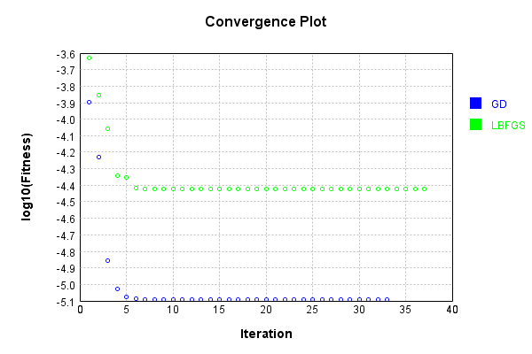


Code from [LearningTester.java:99](../../../../../../../src/main/java/com/simiacryptus/mindseye/test/unit/LearningTester.java#L99) executed in 0.00 seconds: 
```java
    return TestUtil.compareTime(runs);
```

Returns: 


### Model Learning
In this test, attempt to train a network to emulate a randomized network given an example input/output. The target state is:

Code from [LearningTester.java:176](../../../../../../../src/main/java/com/simiacryptus/mindseye/test/unit/LearningTester.java#L176) executed in 0.00 seconds: 
```java
    return network_target.state().stream().map(Arrays::toString).reduce((a, b) -> a + "\n" + b).orElse("");
```

Returns: 

```
    [-0.041800000000000004, -0.0078000000000000005, -0.025, -0.03780000000000001, -0.026600000000000002, 0.061, 0.081, 0.0636, -0.0902, -0.033, 0.06380000000000001, 0.069, -0.0974, 0.0666, -0.038200000000000005, -0.079, 0.034, 0.09380000000000001, -0.056600000000000004, -0.06380000000000001, -0.021200000000000004, -0.07460000000000001, -0.059, 0.02, -0.0826, -0.05840000000000001, -0.09620000000000001, 0.0122, 0.0792, -0.0512, -0.019200000000000002, -0.0344, 0.015600000000000001, 0.025400000000000002, 0.048600000000000004, -0.031400000000000004, -0.0852, -0.060200000000000004, 0.05040000000000001, -0.009800000000000001, 0.06380000000000001, 0.023600000000000003, 0.009200000000000002, 0.0354, 0.062400000000000004, 0.0826, -0.0386, 0.0874, -0.0796, 0.030600000000000002, -0.0718, -0.0582, -0.08660000000000001, 0.026, 0.07980000000000001, -0.0862, 0.0364, -0.0536, -0.05040000000000001, 0.0182, -0.0512, -0.011200000000000002, 0.0586, 0.0804, -0.05740000000000001, 0.0134, -0.09580000000000001, 0.049800000000000004, 0.05
```
...[skipping 30610 bytes](etc/46.txt)...
```
    0000001, 0.0522, -0.08, -0.0712, 0.0386, -0.09780000000000001, -0.0976, -0.07640000000000001, 0.095, 0.0526, -0.040600000000000004, 0.0324, 0.023600000000000003, 0.082, -0.0496, 0.06, -0.0668, -0.032600000000000004, -0.0388, -0.07, 0.020200000000000003, 0.006, -0.0332, -0.026, -0.0234, -0.006, 0.082, -0.061200000000000004, 0.0712, 0.068, -0.0992, 0.0826, 2.0E-4, -0.0208, -0.010600000000000002, 0.0024000000000000002, 0.046400000000000004, 0.047, -0.001, 0.0952, -0.0488, 0.0724, -0.0124, 0.022, -0.022400000000000003, 0.029200000000000004, 0.009600000000000001, 0.0942, 0.0288, 0.09040000000000001, 0.062200000000000005, 0.0362, -0.08940000000000001, 0.017, -0.07479999999999999, -0.025200000000000004, 0.073, 0.0772, -0.018400000000000003, -0.0976, 0.010600000000000002, 0.0884, 0.008400000000000001, -0.0422, -0.09440000000000001, -0.06380000000000001]
    [1.0]
    [0.0, 0.0, 0.0, 0.0, 0.0, 0.0, 0.0, 0.0, 0.0, 0.0, 0.0, 0.0, 0.0, 0.0, 0.0, 0.0, 0.0, 0.0, 0.0, 0.0, 0.0, 0.0, 0.0, 0.0, 0.0, 0.0, 0.0, 0.0, 0.0, 0.0, 0.0, 0.0]
```


First, we use a conjugate gradient descent method, which converges the fastest for purely linear functions.

Code from [LearningTester.java:300](../../../../../../../src/main/java/com/simiacryptus/mindseye/test/unit/LearningTester.java#L300) executed in 0.02 seconds: 
```java
    return new IterativeTrainer(trainable)
      .setLineSearchFactory(label -> new QuadraticSearch())
      .setOrientation(new GradientDescent())
      .setMonitor(monitor)
      .setTimeout(30, TimeUnit.SECONDS)
      .setMaxIterations(250)
      .setTerminateThreshold(0)
      .run();
```
Logging: 
```
    Constructing line search parameters: GD
    F(0.0) = LineSearchPoint{point=PointSample{avg=5.327125287969E-4}, derivative=-5.013729539250841E-5}
    New Minimum: 5.327125287969E-4 > 5.327125287918863E-4
    F(1.0E-10) = LineSearchPoint{point=PointSample{avg=5.327125287918863E-4}, derivative=-5.013729539210998E-5}, delta = -5.013676106224718E-15
    New Minimum: 5.327125287918863E-4 > 5.327125287618039E-4
    F(7.000000000000001E-10) = LineSearchPoint{point=PointSample{avg=5.327125287618039E-4}, derivative=-5.013729538971945E-5}, delta = -3.509605800422477E-14
    New Minimum: 5.327125287618039E-4 > 5.327125285512272E-4
    F(4.900000000000001E-9) = LineSearchPoint{point=PointSample{avg=5.327125285512272E-4}, derivative=-5.013729537298568E-5}, delta = -2.456728397104424E-13
    New Minimum: 5.327125285512272E-4 > 5.327125270771909E-4
    F(3.430000000000001E-8) = LineSearchPoint{point=PointSample{avg=5.327125270771909E-4}, derivative=-5.0137295255849376E-5}, delta = -1.719709119031576E-12
    New Minimum: 5.327125270771909E-4 > 5.327125167
```
...[skipping 2867 bytes](etc/47.txt)...
```
    20.837286603592364
    F(16.09017449582787) = LineSearchPoint{point=PointSample{avg=2.1725014073414994E-4}, derivative=1.6261205743892208E-35}, delta = 0.0
    Right bracket at 16.09017449582787
    F(14.378252937891167) = LineSearchPoint{point=PointSample{avg=2.1725014073414994E-4}, derivative=4.259598931074705E-36}, delta = 0.0
    Right bracket at 14.378252937891167
    F(13.943380594975006) = LineSearchPoint{point=PointSample{avg=2.1725014073414994E-4}, derivative=2.6902730090998136E-36}, delta = 0.0
    Right bracket at 13.943380594975006
    F(13.674030036153853) = LineSearchPoint{point=PointSample{avg=2.1725014073414994E-4}, derivative=1.4796501550048975E-36}, delta = 0.0
    Right bracket at 13.674030036153853
    F(13.52747498867315) = LineSearchPoint{point=PointSample{avg=2.1725014073414994E-4}, derivative=8.818117085382723E-37}, delta = 0.0
    Right bracket at 13.52747498867315
    Converged to right
    Iteration 2 failed, aborting. Error: 2.1725014073414994E-4 Total: 250038023619750.9700; Orientation: 0.0002; Line Search: 0.0059
    
```

Returns: 

```
    2.1725014073414994E-4
```


This training run resulted in the following configuration:

Code from [LearningTester.java:189](../../../../../../../src/main/java/com/simiacryptus/mindseye/test/unit/LearningTester.java#L189) executed in 0.00 seconds: 
```java
    return network_gd.state().stream().map(Arrays::toString).reduce((a, b) -> a + "\n" + b).orElse("");
```

Returns: 

```
    [-0.08601494930685136, 0.0068000000000000005, 0.0216, 0.009383836632255463, -0.05176407376655985, -0.09627153776767931, 0.0426, 0.033800000000000004, 0.0064, -0.08347180614539285, 0.022482650042105867, -0.0807519494538318, 0.08208612357480576, 0.0984, 0.0258, -0.005, 0.0284, -0.08440295216743288, 0.0134, -0.011048241822074145, -0.08658809901447606, -0.08980832650444792, 0.0714, -0.08486790496003593, 0.02, 0.0206, -0.0256, -0.07623904752904248, 0.0248, -0.071, 0.0433388335642906, 0.024881803608470303, 0.04165292021680621, -0.07680000000000001, 0.086, 0.03839959414272908, 0.012240130276509456, 0.06141686703656742, -0.08020000000000001, -0.08940000000000001, 0.0426, 0.010965537857780325, -0.05702301258041768, 0.021936523605711907, 0.07862862815158515, 0.08480000000000001, -0.091, 0.0488, 0.060200000000000004, -0.09335121314226548, 0.026400000000000003, -0.05813759283802605, 0.0818450528248683, -0.09155097937039018, 0.058, 0.015165674431293947, 0.0854, 0.029200000000000004, 0.009600000000000001, -0.04039018358208
```
...[skipping 41277 bytes](etc/48.txt)...
```
    63424441486944, 0.030600000000000002, 0.08570866248309349, 0.031400000000000004, -0.037200000000000004, 0.09680000000000001, -0.07463806588725092, -0.0546, 0.09880000000000001, -0.04809482426274465, 0.0886445515624473]
    [1.0]
    [-0.0081710990663219, 0.0, 0.0, -0.044466992070607, -0.00888165130503021, -0.010174053524032056, 0.0, 0.0, 0.0, -0.024136785678870912, -0.02350069891209312, -0.014637577460449925, 0.001590452865841593, 0.0, 0.0, 0.0, 0.0, -0.019511841236971215, 0.0, 0.003467064554108168, -0.01971928750731757, -0.030609965021677087, 0.0, -0.013018087150336321, 0.0, 0.0, 0.0, 5.453565508725976E-4, 0.0, 0.0, -0.018698792797354754, -0.020695581123886884]
    [0.005047600000000006, 0.0, 0.0, 0.02288556, 0.0, 0.0, 0.04594975999999999, 0.0, 0.04436871999999999, 0.0, 0.0, 0.0, 0.03078664, 0.01448752, 0.027441240000000006, 0.0, 0.004588439999999983, 0.0, 0.013765160000000002, 0.019927639999999986, 0.0, 0.03019659999999999, 0.0, 0.02482832, 0.0, 0.0, 0.020679200000000005, 0.00915264, 0.0, 0.03565063999999998, 0.0, 0.0]
```


Next, we run the same optimization using L-BFGS, which is nearly ideal for purely second-order or quadratic functions.

Code from [LearningTester.java:324](../../../../../../../src/main/java/com/simiacryptus/mindseye/test/unit/LearningTester.java#L324) executed in 0.02 seconds: 
```java
    return new IterativeTrainer(trainable)
      .setLineSearchFactory(label -> new ArmijoWolfeSearch())
      .setOrientation(new LBFGS())
      .setMonitor(monitor)
      .setTimeout(30, TimeUnit.SECONDS)
      .setMaxIterations(250)
      .setTerminateThreshold(0)
      .run();
```
Logging: 
```
    LBFGS Accumulation History: 1 points
    Constructing line search parameters: GD
    th(0)=3.9393971314489996E-4;dx=-3.880520522992601E-5
    New Minimum: 3.9393971314489996E-4 > 3.174930861016529E-4
    END: th(2.154434690031884)=3.174930861016529E-4; dx=-3.2161556860333174E-5 delta=7.644662704324706E-5
    Iteration 1 complete. Error: 3.174930861016529E-4 Total: 250038033488267.9700; Orientation: 0.0004; Line Search: 0.0010
    LBFGS Accumulation History: 1 points
    th(0)=3.174930861016529E-4;dx=-2.6655334859117202E-5
    New Minimum: 3.174930861016529E-4 > 2.1658762550473158E-4
    END: th(4.641588833612779)=2.1658762550473158E-4; dx=-1.6823510085613353E-5 delta=1.0090546059692132E-4
    Iteration 2 complete. Error: 2.1658762550473158E-4 Total: 250038034975284.9700; Orientation: 0.0002; Line Search: 0.0010
    LBFGS Accumulation History: 1 points
    th(0)=2.1658762550473158E-4;dx=-1.061815554359566E-5
    New Minimum: 2.1658762550473158E-4 > 1.5259537861694335E-4
    END: th(10.000000000000002)=1.5259537861694335E-4; dx=-2.1802938339619746E-6 d
```
...[skipping 3994 bytes](etc/49.txt)...
```
    0)=1.4977850310630004E-4;dx=-1.9335713662543813E-20
    New Minimum: 1.4977850310630004E-4 > 1.4977850310629996E-4
    WOLF (strong): th(24.17494184173324)=1.4977850310629996E-4; dx=4.296173696223498E-21 delta=8.131516293641283E-20
    New Minimum: 1.4977850310629996E-4 > 1.4977850310629994E-4
    END: th(12.08747092086662)=1.4977850310629994E-4; dx=-7.628457678536104E-22 delta=1.0842021724855044E-19
    Iteration 11 complete. Error: 1.4977850310629994E-4 Total: 250038049568743.9400; Orientation: 0.0002; Line Search: 0.0010
    LBFGS Accumulation History: 1 points
    th(0)=1.4977850310629994E-4;dx=-3.0096311710466163E-23
    WOLF (strong): th(26.041666666666686)=1.4977850310629994E-4; dx=7.763998381606512E-24 delta=0.0
    WOLF (strong): th(13.020833333333343)=1.4977850310629994E-4; dx=2.5205023859828835E-25 delta=0.0
    END: th(4.340277777777781)=1.4977850310629994E-4; dx=-1.9715906098210963E-23 delta=0.0
    Iteration 12 failed, aborting. Error: 1.4977850310629994E-4 Total: 250038051179441.9400; Orientation: 0.0002; Line Search: 0.0013
    
```

Returns: 

```
    1.4977850310629994E-4
```


This training run resulted in the following configuration:

Code from [LearningTester.java:203](../../../../../../../src/main/java/com/simiacryptus/mindseye/test/unit/LearningTester.java#L203) executed in 0.00 seconds: 
```java
    return network_lbfgs.state().stream().map(Arrays::toString).reduce((a, b) -> a + "\n" + b).orElse("");
```

Returns: 

```
    [0.0984, -0.0804576098870625, -0.0443738514639344, -0.0714, -0.0047489383439401995, 0.018046382316842552, 0.01762650128991225, -0.049285897241374735, 0.028803257807348197, 0.05840000000000001, 0.079, 0.0698, 0.031818116874056473, 0.07052821201327572, -0.05280000000000001, 0.013800000000000002, 0.0534, -0.0826, -0.0178, 0.021, 0.09832501741610247, 0.064, 0.07092458375963649, 0.059800000000000006, -0.08940000000000001, -0.0058000000000000005, -0.002652344891223064, -0.0386, 0.04340000000000001, 0.06620000000000001, -0.038200000000000005, -0.033, 0.09340000000000001, 0.08846364494367494, 0.09289286768646396, 0.0026, 0.06628548729316933, 0.09738498768570997, 0.0626447343125919, 0.05161824232325063, -0.09309802570575793, -0.0626, 0.0072, -0.06, 0.0805965627970249, -0.05238195274076765, 0.0386, -0.077, 0.07740000000000001, 0.0274, 0.045200000000000004, 0.086, -0.07203142895935537, 0.0502, 0.016215607434728246, 0.013, -0.09140000000000001, 0.0926, -0.09183600268097743, 0.077, 0.028, -0.088, -0.026, 0.075600000000000
```
...[skipping 38547 bytes](etc/50.txt)...
```
    0.0644, -0.073, 0.04243777315375897, 0.010530016739198931, -0.006, -0.0416, -0.03780000000000001, -0.009800000000000001, -0.0054, -0.08560000000000001, -0.00607812547983307, -0.0194, 0.04366614450310934, 0.083, 0.076, -0.0342, -0.0010359451593208076, 0.0218, 0.0288, 0.07, 0.0122, 0.0786]
    [1.0]
    [0.0, -0.007575280906948633, -0.005951795196447093, 0.0, -0.01747292815725977, -0.03416735079389033, 0.01359635069954965, -0.03231987093052045, 0.02788746079122637, 0.0, 0.0, 0.0, 0.01092015539027278, 0.0010026255129092902, 0.0, 0.0, 0.0, 0.0, 0.0, 0.0, -0.0017460532975204974, 0.0, -0.032466253626208155, 0.0, 0.0, 0.0, 0.009110962167919881, 0.0, 0.0, 0.0, 0.0, 0.0]
    [0.005047600000000006, 0.0, 0.0, 0.02288556, 0.0, 0.0, 0.04594975999999999, 0.0, 0.04436871999999999, 0.0, 0.0, 0.0, 0.03078664, 0.01448752, 0.027441240000000006, 0.0, 0.004588439999999983, 0.0, 0.013765160000000002, 0.019927639999999986, 0.0, 0.03019659999999999, 0.0, 0.02482832, 0.0, 0.0, 0.020679200000000005, 0.00915264, 0.0, 0.03565063999999998, 0.0, 0.0]
```


Code from [LearningTester.java:96](../../../../../../../src/main/java/com/simiacryptus/mindseye/test/unit/LearningTester.java#L96) executed in 0.00 seconds: 
```java
    return TestUtil.compare(runs);
```

Returns: 


Code from [LearningTester.java:99](../../../../../../../src/main/java/com/simiacryptus/mindseye/test/unit/LearningTester.java#L99) executed in 0.00 seconds: 
```java
    return TestUtil.compareTime(runs);
```

Returns: 

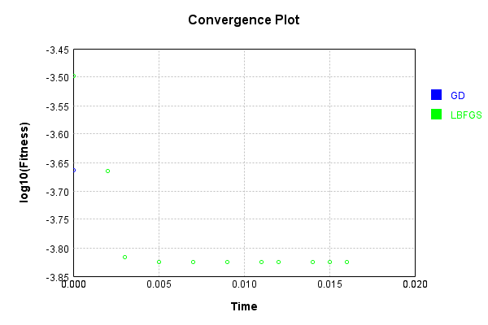


### Composite Learning
In this test, attempt to train a network to emulate a randomized network given an example input/output. The target state is:

Code from [LearningTester.java:219](../../../../../../../src/main/java/com/simiacryptus/mindseye/test/unit/LearningTester.java#L219) executed in 0.00 seconds: 
```java
    return network_target.state().stream().map(Arrays::toString).reduce((a, b) -> a + "\n" + b).orElse("");
```

Returns: 

```
    [-0.09340000000000001, 0.06520000000000001, -0.0296, -0.0892, 0.0054, 0.0606, 0.095, -0.09780000000000001, 0.0234, 0.0256, 0.0342, 0.036800000000000006, 0.025, -0.08120000000000001, 0.06180000000000001, 0.0874, 0.098, -0.07, -0.07479999999999999, -0.0048000000000000004, -0.023, -0.0088, -0.0188, 0.0872, 0.0026, 0.044800000000000006, -0.0454, -0.0558, -0.0496, 0.0512, 0.082, 0.0248, -0.0576, -0.0074, 0.098, 0.0874, -0.0596, -0.027600000000000003, 0.0468, -0.08020000000000001, 0.030600000000000002, 0.0028000000000000004, 0.0512, 0.09340000000000001, 0.0942, -0.0596, -0.0204, -0.053, 0.0172, -0.0548, 0.06340000000000001, -0.063, 0.042, 0.0704, 0.013800000000000002, 0.0506, 0.042800000000000005, 0.0416, 0.046400000000000004, -0.0074, 0.0742, 0.089, -0.072, 0.02, -0.0054, 0.0208, -0.0288, 0.037, -0.055200000000000006, 0.0568, 0.0664, -0.0762, -0.016800000000000002, -0.072, -0.0918, -0.0592, 0.0032, 0.0496, 0.029200000000000004, 0.077, -0.039, -0.0332, 0.0352, -0.058, 0.0692, 0.0834, 0.0844, -0.0476, -0.02320000000
```
...[skipping 30610 bytes](etc/51.txt)...
```
    0606, -0.074, 0.005, 0.068, 0.0844, -0.0422, -0.082, 0.0956, -0.05380000000000001, 0.07540000000000001, 0.086, 0.06, 0.0884, -0.0546, -0.099, -0.008400000000000001, -0.0218, 0.039400000000000004, -0.089, 0.0062, 0.0024000000000000002, -0.0946, -0.0376, 0.0682, -0.029400000000000003, 0.009600000000000001, -0.007, -0.0432, 0.027600000000000003, -0.088, 0.0664, -0.0674, -0.08220000000000001, -0.040400000000000005, 0.0256, -0.05040000000000001, 0.0244, 0.074, -0.0104, -0.0546, -0.030400000000000003, -0.009, -0.081, 0.004200000000000001, 0.0834, 2.0E-4, 0.0964, 0.049800000000000004, -0.009800000000000001, -0.032600000000000004, -0.08780000000000002, 0.0826, 0.0604, -0.0942, -0.011600000000000001, -0.0698, -0.08180000000000001, 0.0284, -0.033800000000000004, 0.062, 0.0154, 0.0248, -0.023200000000000002, -0.0682, -0.046200000000000005, 0.0902, -0.0128]
    [1.0]
    [0.0, 0.0, 0.0, 0.0, 0.0, 0.0, 0.0, 0.0, 0.0, 0.0, 0.0, 0.0, 0.0, 0.0, 0.0, 0.0, 0.0, 0.0, 0.0, 0.0, 0.0, 0.0, 0.0, 0.0, 0.0, 0.0, 0.0, 0.0, 0.0, 0.0, 0.0, 0.0]
```


We simultaneously regress this target input:

Code from [LearningTester.java:223](../../../../../../../src/main/java/com/simiacryptus/mindseye/test/unit/LearningTester.java#L223) executed in 0.00 seconds: 
```java
    return Arrays.stream(testInput).map(x -> x.prettyPrint()).reduce((a, b) -> a + "\n" + b).orElse("");
```

Returns: 

```
    [
    	[ [ -0.0964, -0.038, 0.04240000000000001 ], [ 0.0884, -0.07160000000000001, 0.0704 ], [ -0.0648, -0.055600000000000004, -0.0862 ], [ -0.0548, -0.043800000000000006, -0.021200000000000004 ], [ -8.0E-4, 0.0722, 0.08 ] ],
    	[ [ 0.099, -0.056400000000000006, 0.07640000000000001 ], [ -0.043800000000000006, -0.062400000000000004, 0.08940000000000001 ], [ 0.057, -0.08360000000000001, 0.0086 ], [ 0.0316, 0.0614, 0.0454 ], [ -0.023200000000000002, -0.0362, -0.0882 ] ],
    	[ [ -0.029200000000000004, -0.026400000000000003, 0.0678 ], [ 0.0178, 0.0562, -0.06620000000000001 ], [ 0.004, -0.0956, 0.06280000000000001 ], [ -0.045, -0.0664, 0.0128 ], [ 0.05240000000000001, -0.0162, 0.08360000000000001 ] ],
    	[ [ -0.048400000000000006, 0.0366, 0.06760000000000001 ], [ 0.09860000000000001, -0.08280000000000001, -0.0128 ], [ -0.0824, 0.044, 0.052 ], [ -6.000000000000001E-4, -0.0698, 0.018 ], [ 0.075, 0.055200000000000006, 0.006 ] ],
    	[ [ 0.0366, 0.08080000000000001, 0.056600000000000004 ], [ 0.06860000000000001, -0.0178, 0.07940000000000001 ], [ 0.0698, -0.0172, 0.008 ], [ -0.07260000000000001, 0.0308, -0.0854 ], [ 0.08080000000000001, 0.034800000000000005, -0.08380000000000001 ] ]
    ]
```


Which produces the following output:

Code from [LearningTester.java:230](../../../../../../../src/main/java/com/simiacryptus/mindseye/test/unit/LearningTester.java#L230) executed in 0.00 seconds: 
```java
    return Stream.of(targetOutput).map(x -> x.prettyPrint()).reduce((a, b) -> a + "\n" + b).orElse("");
```

Returns: 

```
    [
    	[ [ 0.0, 0.0 ], [ 0.0, 0.029094119999999998 ], [ 0.0, 0.010415440000000005 ], [ 0.0, 0.04835160000000001 ] ],
    	[ [ 0.0, 0.0 ], [ 0.0, 0.0479042 ], [ 0.0, 0.0 ], [ 0.0, 0.0 ] ],
    	[ [ 0.0, 0.0 ], [ 0.006938640000000006, 0.0 ], [ 0.025976440000000007, 0.0 ], [ 0.0, 0.0 ] ],
    	[ [ 0.012789960000000001, 0.0 ], [ 0.028764520000000002, 0.0 ], [ 0.009145159999999994, 0.018060999999999997 ], [ 0.0, 0.0 ] ]
    ]
```


First, we use a conjugate gradient descent method, which converges the fastest for purely linear functions.

Code from [LearningTester.java:300](../../../../../../../src/main/java/com/simiacryptus/mindseye/test/unit/LearningTester.java#L300) executed in 0.02 seconds: 
```java
    return new IterativeTrainer(trainable)
      .setLineSearchFactory(label -> new QuadraticSearch())
      .setOrientation(new GradientDescent())
      .setMonitor(monitor)
      .setTimeout(30, TimeUnit.SECONDS)
      .setMaxIterations(250)
      .setTerminateThreshold(0)
      .run();
```
Logging: 
```
    Constructing line search parameters: GD
    F(0.0) = LineSearchPoint{point=PointSample{avg=3.111037403710005E-4}, derivative=-4.042734628244842E-5}
    New Minimum: 3.111037403710005E-4 > 3.111037403669574E-4
    F(1.0E-10) = LineSearchPoint{point=PointSample{avg=3.111037403669574E-4}, derivative=-4.042734628206663E-5}, delta = -4.0430983214156946E-15
    New Minimum: 3.111037403669574E-4 > 3.1110374034270085E-4
    F(7.000000000000001E-10) = LineSearchPoint{point=PointSample{avg=3.1110374034270085E-4}, derivative=-4.042734627977608E-5}, delta = -2.829962826578214E-14
    New Minimum: 3.1110374034270085E-4 > 3.1110374017290606E-4
    F(4.900000000000001E-9) = LineSearchPoint{point=PointSample{avg=3.1110374017290606E-4}, derivative=-4.042734626374225E-5}, delta = -1.9809441630450064E-13
    New Minimum: 3.1110374017290606E-4 > 3.111037389843421E-4
    F(3.430000000000001E-8) = LineSearchPoint{point=PointSample{avg=3.111037389843421E-4}, derivative=-4.042734615150549E-5}, delta = -1.3866583662563992E-12
    New Minimum: 3.111037389843421E-4
```
...[skipping 8659 bytes](etc/52.txt)...
```
    .587250272595008E-5 > 9.587250272595003E-5
    F(10.630222434508292) = LineSearchPoint{point=PointSample{avg=9.587250272595003E-5}, derivative=8.206999120214537E-23}, delta = -5.421010862427522E-20
    9.587250272595003E-5 <= 9.587250272595008E-5
    Converged to right
    Iteration 7 complete. Error: 9.587250272595003E-5 Total: 250038257831805.7500; Orientation: 0.0001; Line Search: 0.0006
    Zero gradient: 6.1108075330666884E-12
    F(0.0) = LineSearchPoint{point=PointSample{avg=9.587250272595003E-5}, derivative=-3.7341968706184583E-23}
    F(10.630222434508292) = LineSearchPoint{point=PointSample{avg=9.587250272595003E-5}, derivative=6.653157165190745E-25}, delta = 0.0
    9.587250272595003E-5 <= 9.587250272595003E-5
    F(10.44414089347751) = LineSearchPoint{point=PointSample{avg=9.587250272595003E-5}, derivative=-7.648236475758583E-30}, delta = 0.0
    Left bracket at 10.44414089347751
    Converged to left
    Iteration 8 failed, aborting. Error: 9.587250272595003E-5 Total: 250038259150970.7500; Orientation: 0.0001; Line Search: 0.0010
    
```

Returns: 

```
    9.587250272595003E-5
```


This training run resulted in the following configuration:

Code from [LearningTester.java:245](../../../../../../../src/main/java/com/simiacryptus/mindseye/test/unit/LearningTester.java#L245) executed in 0.00 seconds: 
```java
    return network_gd.state().stream().map(Arrays::toString).reduce((a, b) -> a + "\n" + b).orElse("");
```

Returns: 

```
    [-0.0649743631266427, 0.03854263533278274, 0.07440063927555012, 0.038200000000000005, -0.081, -0.0422, -0.076, -0.011896044796130939, -0.0078000000000000005, -0.09010011693452824, 0.016214374241120735, 0.0244, 0.09758563586063422, 0.040400000000000005, -0.0568, -0.022, 0.05240000000000001, -0.02985657081379734, 0.0246, -0.0724, -0.07568186891475363, 0.003883032797618865, 0.08176858043734153, -0.03929960770520216, -0.05, 0.037200000000000004, -0.01352720492223506, 0.09340000000000001, 0.0786, 0.0344, -0.0842, 0.0648, 0.02962166406265973, 0.06389597282410225, 0.09639522895672298, -0.013800000000000002, 0.05940000000000001, 0.0134, -0.0134, -0.04171138222759308, 0.08120000000000001, 0.04763528331240508, 0.09611411531248173, -0.0074, -0.024643788792133147, 0.09060000000000001, 0.011, -0.08760000000000001, 0.07680000000000001, 0.031362965769343484, 0.0016, 0.044800000000000006, -0.005401793270502108, 0.03460433606286957, -0.046081431804487503, 0.07477199286718363, -0.0492, -0.09440000000000001, 0.03134459003546679
```
...[skipping 38949 bytes](etc/53.txt)...
```
    , 0.003, 0.0892, -0.06380000000000001, -0.011200000000000002, 0.022811977900691796, -0.0656, 0.038400000000000004, 0.03399251131020857, 0.04097779226927027, -0.048197213546490224, -0.0635922907731255, 0.0364, 0.0296, 0.029004509009549834, -0.0412, 0.0288, 0.05040000000000001, -0.0416, -0.048400000000000006]
    [1.0]
    [-0.017058613085894427, -0.011201039213470357, -0.03719622847858507, 0.0, 0.0, 0.0, 0.0, 0.006085037405965914, 0.0, -0.0020522621374880383, 0.003859048322536637, 0.0, -0.007967683070954783, 0.0, 0.0, 0.0, 0.0, -0.01533723565287803, 0.0, 0.0, 0.009920861355929648, 0.027242569333368393, -0.003483066887221483, -0.010297235903532232, 0.0, 0.0, -0.0056362619372921745, 0.0, 0.0, 0.0, 0.0, 0.0]
    [0.0, 0.0, 0.0, 0.012789960000000001, 0.0, 0.0, 0.006938640000000006, 0.028764520000000002, 0.0, 0.0, 0.025976440000000007, 0.009145159999999994, 0.0, 0.0, 0.0, 0.0, 0.0, 0.0, 0.0, 0.0, 0.029094119999999998, 0.0479042, 0.0, 0.0, 0.010415440000000005, 0.0, 0.0, 0.018060999999999997, 0.04835160000000001, 0.0, 0.0, 0.0]
```


And regressed input:

Code from [LearningTester.java:249](../../../../../../../src/main/java/com/simiacryptus/mindseye/test/unit/LearningTester.java#L249) executed in 0.00 seconds: 
```java
    return Arrays.stream(input_gd).map(x -> x.prettyPrint()).reduce((a, b) -> a + "\n" + b).orElse("");
```

Returns: 

```
    [
    	[ [ -0.05093252622877254, -0.08955499195777021, -0.03312131934263456 ], [ 0.002062235906288057, 0.0411120774602392, 0.05632613954568295 ], [ 0.015737696802279454, -0.03896958622566793, -0.04489267832293128 ], [ -0.03662524954659141, 0.007083450570933542, 0.10149033792779479 ], [ -0.030061054852614635, -0.08426610148884373, -0.00965121085429595 ] ],
    	[ [ 0.07557802732069217, -0.04204276668975497, 0.034435849281116045 ], [ -0.06739377711558825, 0.052697001905781936, -0.06251231004631441 ], [ 0.0734200730329313, 0.007698516198318256, 0.07244246624848245 ], [ -0.0779179179802445, -0.020254106263962474, 0.043678807472004956 ], [ -0.0643467404860178, -0.06969656628748244, -0.08117331656905336 ] ],
    	[ [ -0.05472857876195327, 0.014207774336691953, 0.08302911965551248 ], [ -0.059625655443230896, -0.06147058324836881, 0.0871672128468411 ], [ 0.08109399554321758, 0.041032376438668486, 0.06917650273322476 ], [ 0.07942616117535145, 0.003701620847747663, 0.05683276230157154 ], [ 0.002168732661540071, 0.07435012792461783, 0.05828667357942048 ] ],
    	[ [ -0.09501099081348825, 0.014377396797000348, -0.07771140291060412 ], [ 0.08123345159023557, -0.011273561587180623, -0.023273928432343896 ], [ -0.05576016351638909, -0.09568518342605016, 0.033514711787721065 ], [ 0.026042164441442764, 0.09078924211526795, 0.06988900186853804 ], [ 0.05849352007342982, -0.07174391583687974, 0.04760240253522063 ] ],
    	[ [ 0.059829960981296414, -0.01931325497420898, -0.01701623678085778 ], [ -0.08355939370726034, 0.05156018664369867, 0.07364956120984739 ], [ 0.07106606589989213, -0.06701867345469667, -0.08268107472347858 ], [ 0.09705515888361128, 0.04808653686753342, 0.03897287830340537 ], [ 0.07117493996792891, -0.027999536176653142, -1.0750944614567332E-4 ] ]
    ]
```


Which produces the following output:

Code from [LearningTester.java:256](../../../../../../../src/main/java/com/simiacryptus/mindseye/test/unit/LearningTester.java#L256) executed in 0.00 seconds: 
```java
    return Stream.of(regressedOutput).map(x -> x.prettyPrint()).reduce((a, b) -> a + "\n" + b).orElse("");
```

Returns: 

```
    [ 9.587250272595003E-5 ]
```


Next, we run the same optimization using L-BFGS, which is nearly ideal for purely second-order or quadratic functions.

Code from [LearningTester.java:324](../../../../../../../src/main/java/com/simiacryptus/mindseye/test/unit/LearningTester.java#L324) executed in 0.02 seconds: 
```java
    return new IterativeTrainer(trainable)
      .setLineSearchFactory(label -> new ArmijoWolfeSearch())
      .setOrientation(new LBFGS())
      .setMonitor(monitor)
      .setTimeout(30, TimeUnit.SECONDS)
      .setMaxIterations(250)
      .setTerminateThreshold(0)
      .run();
```
Logging: 
```
    LBFGS Accumulation History: 1 points
    Constructing line search parameters: GD
    th(0)=3.111037403710005E-4;dx=-4.042734628244842E-5
    New Minimum: 3.111037403710005E-4 > 2.3285899644621304E-4
    END: th(2.154434690031884)=2.3285899644621304E-4; dx=-3.221164613264231E-5 delta=7.824474392478743E-5
    Iteration 1 complete. Error: 2.3285899644621304E-4 Total: 250038271200996.7200; Orientation: 0.0004; Line Search: 0.0011
    LBFGS Accumulation History: 1 points
    th(0)=2.3285899644621304E-4;dx=-2.5669647341015903E-5
    New Minimum: 2.3285899644621304E-4 > 1.3970489855246962E-4
    END: th(4.641588833612779)=1.3970489855246962E-4; dx=-1.4475495923102817E-5 delta=9.315409789374343E-5
    Iteration 2 complete. Error: 1.3970489855246962E-4 Total: 250038272391921.7200; Orientation: 0.0002; Line Search: 0.0007
    LBFGS Accumulation History: 1 points
    th(0)=1.3970489855246962E-4;dx=-8.172885888158301E-6
    New Minimum: 1.3970489855246962E-4 > 9.614422957269648E-5
    END: th(10.000000000000002)=9.614422957269648E-5; dx=-5.655009429896284E-7 del
```
...[skipping 3661 bytes](etc/54.txt)...
```
    213761E-20
    END: th(3.7403380035275773)=9.587250272595004E-5; dx=-4.0107130138939134E-21 delta=1.3552527156068805E-20
    Iteration 10 complete. Error: 9.587250272595003E-5 Total: 250038286260394.7200; Orientation: 0.0002; Line Search: 0.0022
    LBFGS Accumulation History: 1 points
    th(0)=9.587250272595004E-5;dx=-2.6394408150682788E-21
    New Minimum: 9.587250272595004E-5 > 9.587250272595003E-5
    END: th(8.058313947244411)=9.587250272595003E-5; dx=-6.953301388098129E-22 delta=1.3552527156068805E-20
    Iteration 11 complete. Error: 9.587250272595003E-5 Total: 250038288077987.7200; Orientation: 0.0004; Line Search: 0.0010
    LBFGS Accumulation History: 1 points
    th(0)=9.587250272595003E-5;dx=-1.83339666170059E-22
    WOLF (strong): th(17.361111111111118)=9.587250272595003E-5; dx=1.0742503993375677E-22 delta=0.0
    END: th(8.680555555555559)=9.587250272595003E-5; dx=-3.7957308523071385E-23 delta=0.0
    Iteration 12 failed, aborting. Error: 9.587250272595003E-5 Total: 250038290246672.7200; Orientation: 0.0003; Line Search: 0.0017
    
```

Returns: 

```
    9.587250272595003E-5
```


This training run resulted in the following configuration:

Code from [LearningTester.java:266](../../../../../../../src/main/java/com/simiacryptus/mindseye/test/unit/LearningTester.java#L266) executed in 0.00 seconds: 
```java
    return network_lbfgs.state().stream().map(Arrays::toString).reduce((a, b) -> a + "\n" + b).orElse("");
```

Returns: 

```
    [-0.0650326035602001, 0.03855507044944741, 0.07443343024251146, 0.038200000000000005, -0.081, -0.0422, -0.076, -0.011899657557533697, -0.0078000000000000005, -0.09009943859687322, 0.016208655059930414, 0.0244, 0.0975706880024632, 0.040400000000000005, -0.0568, -0.022, 0.05240000000000001, -0.02984091835686324, 0.0246, -0.0724, -0.0756879292356575, 0.003858079896048455, 0.08175633878208559, -0.039289744668777736, -0.05, 0.037200000000000004, -0.013548643796018847, 0.09340000000000001, 0.0786, 0.0344, -0.0842, 0.0648, 0.029762047783616696, 0.06390904867725757, 0.0964538785263015, -0.013800000000000002, 0.05940000000000001, 0.0134, -0.0134, -0.04172051037007988, 0.08120000000000001, 0.04763909049516067, 0.0961090336537042, -0.0074, -0.024597287937520723, 0.09060000000000001, 0.011, -0.08760000000000001, 0.07680000000000001, 0.03138196561667772, 0.0016, 0.044800000000000006, -0.005418143344432718, 0.034558891258353645, -0.046052216345653325, 0.07478307432022022, -0.0492, -0.09440000000000001, 0.031394439995736156
```
...[skipping 38944 bytes](etc/55.txt)...
```
    , 0.003, 0.0892, -0.06380000000000001, -0.011200000000000002, 0.022808785862091067, -0.0656, 0.038400000000000004, 0.03399443565856795, 0.04098403532066713, -0.04819808653739929, -0.06359423552854959, 0.0364, 0.0296, 0.029003080611565295, -0.0412, 0.0288, 0.05040000000000001, -0.0416, -0.048400000000000006]
    [1.0]
    [-0.015610836526528709, -0.011265870637969091, -0.037230530403597646, 0.0, 0.0, 0.0, 0.0, 0.006073356201595826, 0.0, -0.0020381355508687442, 0.003894518468441633, 0.0, -0.007536746990107767, 0.0, 0.0, 0.0, 0.0, -0.015404369751142894, 0.0, 0.0, 0.009895546041437836, 0.02726445609093893, -0.0031804108013534418, -0.01034427883701483, 0.0, 0.0, -0.005113670011135936, 0.0, 0.0, 0.0, 0.0, 0.0]
    [0.0, 0.0, 0.0, 0.012789960000000001, 0.0, 0.0, 0.006938640000000006, 0.028764520000000002, 0.0, 0.0, 0.025976440000000007, 0.009145159999999994, 0.0, 0.0, 0.0, 0.0, 0.0, 0.0, 0.0, 0.0, 0.029094119999999998, 0.0479042, 0.0, 0.0, 0.010415440000000005, 0.0, 0.0, 0.018060999999999997, 0.04835160000000001, 0.0, 0.0, 0.0]
```


And regressed input:

Code from [LearningTester.java:270](../../../../../../../src/main/java/com/simiacryptus/mindseye/test/unit/LearningTester.java#L270) executed in 0.00 seconds: 
```java
    return Arrays.stream(input_lbgfs).map(x -> x.prettyPrint()).reduce((a, b) -> a + "\n" + b).orElse("");
```

Returns: 

```
    [
    	[ [ -0.05101722056588424, -0.08956072988675508, -0.033243902668450405 ], [ 0.0021341446782991067, 0.041073446470207955, 0.056470726457350656 ], [ 0.015802677460977778, -0.039171870445785927, -0.04495659976256914 ], [ -0.036510631573731044, 0.006983389314748138, 0.10145714595177976 ], [ -0.0299121546684726, -0.08447600542243887, -0.00967917309426687 ] ],
    	[ [ 0.07568848546622481, -0.04230916291164333, 0.03463032553954565 ], [ -0.06749286670737366, 0.05291175644908065, -0.06276385869299622 ], [ 0.0734827025873557, 0.007875889130299069, 0.07249020800822661 ], [ -0.07808855514734153, -0.020231576267731845, 0.04377296439364015 ], [ -0.06441655044743856, -0.06983898924926889, -0.08136402099120658 ] ],
    	[ [ -0.054660983387875485, 0.014209476161432838, 0.0830127409135828 ], [ -0.05959498395771585, -0.061466877335177236, 0.08720585737229399 ], [ 0.0810792079739979, 0.04108177200891833, 0.06918307102835725 ], [ 0.07953648627791594, 0.0035775472059586416, 0.056829027020807964 ], [ 0.002313320965193117, 0.07437743922913374, 0.05816723120878711 ] ],
    	[ [ -0.09506874349844573, 0.014364005128706296, -0.07792552582679382 ], [ 0.08129472427671837, -0.011334190274658424, -0.023367525238317213 ], [ -0.055669151473676466, -0.09567857816217656, 0.033497218484001015 ], [ 0.026187564757365767, 0.09089111356071829, 0.07007967942423317 ], [ 0.05862781767613166, -0.07188114925736076, 0.0477828324827895 ] ],
    	[ [ 0.060016684464939685, -0.01930001140130422, -0.01703699529840493 ], [ -0.08363896402616415, 0.05147737347306032, 0.07355675712230676 ], [ 0.07127836389488766, -0.06708860450474696, -0.08291619593346694 ], [ 0.0972204721763293, 0.048257731668659015, 0.038902829805158086 ], [ 0.07131361059749851, -0.027997061237277215, -9.97660016917688E-5 ] ]
    ]
```


Which produces the following output:

Code from [LearningTester.java:277](../../../../../../../src/main/java/com/simiacryptus/mindseye/test/unit/LearningTester.java#L277) executed in 0.00 seconds: 
```java
    return Stream.of(regressedOutput).map(x -> x.prettyPrint()).reduce((a, b) -> a + "\n" + b).orElse("");
```

Returns: 

```
    [ 9.587250272595003E-5 ]
```


Code from [LearningTester.java:96](../../../../../../../src/main/java/com/simiacryptus/mindseye/test/unit/LearningTester.java#L96) executed in 0.01 seconds: 
```java
    return TestUtil.compare(runs);
```

Returns: 

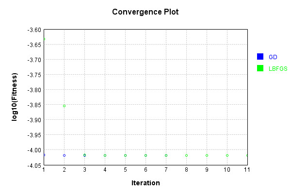


Code from [LearningTester.java:99](../../../../../../../src/main/java/com/simiacryptus/mindseye/test/unit/LearningTester.java#L99) executed in 0.00 seconds: 
```java
    return TestUtil.compareTime(runs);
```

Returns: 

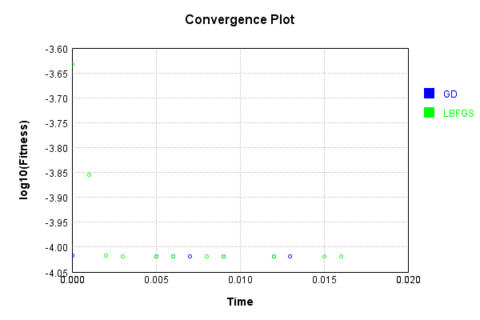


This is a network with the following layout:

Code from [NLayerTest.java:87](../../../../../../../src/test/java/com/simiacryptus/mindseye/network/NLayerTest.java#L87) executed in 0.17 seconds: 
```java
    return Graphviz.fromGraph(TestUtil.toGraph((DAGNetwork) layer))
      .height(400).width(600).render(Format.PNG).toImage();
```

Returns: 

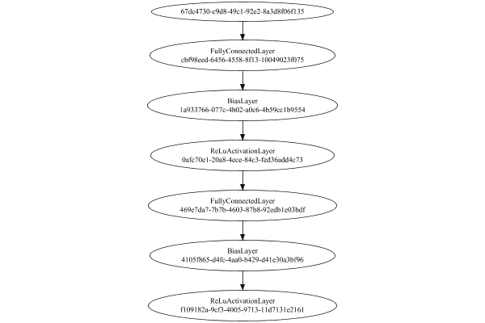


### Json Serialization
Code from [JsonTest.java:36](../../../../../../../src/main/java/com/simiacryptus/mindseye/test/unit/JsonTest.java#L36) executed in 0.00 seconds: 
```java
    JsonObject json = layer.getJson();
    NNLayer echo = NNLayer.fromJson(json);
    if ((echo == null)) throw new AssertionError("Failed to deserialize");
    if ((layer == echo)) throw new AssertionError("Serialization did not copy");
    if ((!layer.equals(echo))) throw new AssertionError("Serialization not equal");
    return new GsonBuilder().setPrettyPrinting().create().toJson(json);
```

Returns: 

```
    {
      "class": "com.simiacryptus.mindseye.network.PipelineNetwork",
      "id": "db29f505-ee83-4d83-bc44-9ecc35052d6b",
      "isFrozen": false,
      "name": "PipelineNetwork/db29f505-ee83-4d83-bc44-9ecc35052d6b",
      "inputs": [
        "67dc4730-c9d8-49c1-92e2-8a3d8f06f135"
      ],
      "nodes": {
        "de11bec5-3eab-4f51-adf5-1d2d91b8158b": "cbf98eed-6456-4558-8f13-10049023f075",
        "9c15dde0-dde3-4fed-9934-757617841785": "1a933766-077c-4b02-a0c6-4b59cc1b9554",
        "7a4dc4ff-3f99-464f-af5a-39ac3f329883": "0afc70e1-20a8-4ece-84c3-fed36add4c73",
        "0511bf16-1d02-4a14-ad97-5c8854eab9a5": "469e7da7-7b7b-4603-87b8-92edb1e03bdf",
        "cdf978f6-43f7-455b-8e42-0d9a35d078dc": "4105f865-d4fc-4aa0-b429-d41e30a3bf96",
        "0aafe7d6-9584-458f-ae64-c8d6d9b70c56": "f109182a-9cf3-4005-9713-11d7131e2161"
      },
      "layers": {
        "cbf98eed-6456-4558-8f13-10049023f075": {
          "class": "com.simiacryptus.mindseye.layers.java.FullyConnectedLayer",
          "id": "cbf98eed-6456-4558-8f13-10049023f075",
          "isFrozen": false,
          "name": "FullyConnect
```
...[skipping 65348 bytes](etc/56.txt)...
```
    .0,
            0.0
          ]
        },
        "f109182a-9cf3-4005-9713-11d7131e2161": {
          "class": "com.simiacryptus.mindseye.layers.java.ReLuActivationLayer",
          "id": "f109182a-9cf3-4005-9713-11d7131e2161",
          "isFrozen": true,
          "name": "ReLuActivationLayer/f109182a-9cf3-4005-9713-11d7131e2161",
          "weights": [
            1.0
          ]
        }
      },
      "links": {
        "de11bec5-3eab-4f51-adf5-1d2d91b8158b": [
          "67dc4730-c9d8-49c1-92e2-8a3d8f06f135"
        ],
        "9c15dde0-dde3-4fed-9934-757617841785": [
          "de11bec5-3eab-4f51-adf5-1d2d91b8158b"
        ],
        "7a4dc4ff-3f99-464f-af5a-39ac3f329883": [
          "9c15dde0-dde3-4fed-9934-757617841785"
        ],
        "0511bf16-1d02-4a14-ad97-5c8854eab9a5": [
          "7a4dc4ff-3f99-464f-af5a-39ac3f329883"
        ],
        "cdf978f6-43f7-455b-8e42-0d9a35d078dc": [
          "0511bf16-1d02-4a14-ad97-5c8854eab9a5"
        ],
        "0aafe7d6-9584-458f-ae64-c8d6d9b70c56": [
          "cdf978f6-43f7-455b-8e42-0d9a35d078dc"
        ]
      },
      "labels": {},
      "head": "0aafe7d6-9584-458f-ae64-c8d6d9b70c56"
    }
```


### Input Learning
In this test, we use a network to learn this target input, given it's pre-evaluated output:

Code from [LearningTester.java:127](../../../../../../../src/main/java/com/simiacryptus/mindseye/test/unit/LearningTester.java#L127) executed in 0.00 seconds: 
```java
    return Arrays.stream(input_target).map(x -> x.prettyPrint()).reduce((a, b) -> a + "\n" + b).orElse("");
```

Returns: 

```
    [
    	[ [ 0.040400000000000005, -0.0034000000000000002, -0.068 ], [ 0.08940000000000001, -0.042800000000000005, -0.025400000000000002 ], [ -0.0912, -0.050800000000000005, 0.0932 ], [ -0.0018, 0.0826, -0.0078000000000000005 ], [ -0.068, -0.0832, -0.0088 ] ],
    	[ [ -0.039400000000000004, 0.09040000000000001, -0.0814 ], [ 0.0722, -0.041, -0.0708 ], [ -0.0952, 0.0324, 0.0548 ], [ 0.088, 0.0142, -0.076 ], [ 0.0376, -0.074, 0.0732 ] ],
    	[ [ -0.06420000000000001, 0.0058000000000000005, 0.0936 ], [ -0.0388, -0.02, 0.0586 ], [ 0.007, -0.053200000000000004, 0.0572 ], [ -0.087, 0.039400000000000004, -0.088 ], [ 0.045, 0.015, 0.083 ] ],
    	[ [ -0.0708, -0.043, 0.0062 ], [ -0.0606, 0.05380000000000001, -0.0586 ], [ 0.0912, 0.08280000000000001, -0.085 ], [ -0.0586, -0.030600000000000002, 0.07440000000000001 ], [ 0.013200000000000002, -0.060200000000000004, -0.08760000000000001 ] ],
    	[ [ -0.07360000000000001, -0.0032, 0.055600000000000004 ], [ -0.055200000000000006, -0.092, -0.09720000000000001 ], [ -0.055400000000000005, 0.002, 0.02 ], [ -0.061200000000000004, 0.0918, -0.045200000000000004 ], [ 0.0478, -0.02, 0.07360000000000001 ] ]
    ]
```


First, we use a conjugate gradient descent method, which converges the fastest for purely linear functions.

Code from [LearningTester.java:300](../../../../../../../src/main/java/com/simiacryptus/mindseye/test/unit/LearningTester.java#L300) executed in 0.01 seconds: 
```java
    return new IterativeTrainer(trainable)
      .setLineSearchFactory(label -> new QuadraticSearch())
      .setOrientation(new GradientDescent())
      .setMonitor(monitor)
      .setTimeout(30, TimeUnit.SECONDS)
      .setMaxIterations(250)
      .setTerminateThreshold(0)
      .run();
```
Logging: 
```
    Constructing line search parameters: GD
    F(0.0) = LineSearchPoint{point=PointSample{avg=7.259363164556914E-6}, derivative=-7.944884050047753E-8}
    New Minimum: 7.259363164556914E-6 > 7.259363164548971E-6
    F(1.0E-10) = LineSearchPoint{point=PointSample{avg=7.259363164548971E-6}, derivative=-7.944884050043165E-8}, delta = -7.943474979350829E-18
    New Minimum: 7.259363164548971E-6 > 7.2593631645012945E-6
    F(7.000000000000001E-10) = LineSearchPoint{point=PointSample{avg=7.2593631645012945E-6}, derivative=-7.944884050015632E-8}, delta = -5.561957144850638E-17
    New Minimum: 7.2593631645012945E-6 > 7.259363164167613E-6
    F(4.900000000000001E-9) = LineSearchPoint{point=PointSample{avg=7.259363164167613E-6}, derivative=-7.944884049822936E-8}, delta = -3.8930142475575996E-16
    New Minimum: 7.259363164167613E-6 > 7.25936316183182E-6
    F(3.430000000000001E-8) = LineSearchPoint{point=PointSample{avg=7.25936316183182E-6}, derivative=-7.944884048474036E-8}, delta = -2.725093879664322E-15
    New Minimum: 7.25936316183182E-6 > 7.259
```
...[skipping 15755 bytes](etc/57.txt)...
```
     0.0
    2.3824310944555886E-7 <= 2.3824310944555886E-7
    F(325.0290258396153) = LineSearchPoint{point=PointSample{avg=2.382431094455588E-7}, derivative=-2.5515773279170164E-32}, delta = -5.293955920339377E-23
    Left bracket at 325.0290258396153
    Converged to left
    Iteration 12 complete. Error: 2.382431094455588E-7 Total: 250038659358947.3400; Orientation: 0.0000; Line Search: 0.0007
    Zero gradient: 7.403679857869457E-14
    F(0.0) = LineSearchPoint{point=PointSample{avg=2.382431094455588E-7}, derivative=-5.481447543782189E-27}
    F(325.0290258396153) = LineSearchPoint{point=PointSample{avg=2.382431094455588E-7}, derivative=2.413260549374627E-27}, delta = 0.0
    2.382431094455588E-7 <= 2.382431094455588E-7
    F(225.67389880960957) = LineSearchPoint{point=PointSample{avg=2.382431094455588E-7}, derivative=-5.551531194641418E-33}, delta = 0.0
    Left bracket at 225.67389880960957
    Converged to left
    Iteration 13 failed, aborting. Error: 2.382431094455588E-7 Total: 250038659854525.3400; Orientation: 0.0000; Line Search: 0.0004
    
```

Returns: 

```
    2.382431094455588E-7
```


Training Converged

Next, we run the same optimization using L-BFGS, which is nearly ideal for purely second-order or quadratic functions.

Code from [LearningTester.java:324](../../../../../../../src/main/java/com/simiacryptus/mindseye/test/unit/LearningTester.java#L324) executed in 0.01 seconds: 
```java
    return new IterativeTrainer(trainable)
      .setLineSearchFactory(label -> new ArmijoWolfeSearch())
      .setOrientation(new LBFGS())
      .setMonitor(monitor)
      .setTimeout(30, TimeUnit.SECONDS)
      .setMaxIterations(250)
      .setTerminateThreshold(0)
      .run();
```
Logging: 
```
    LBFGS Accumulation History: 1 points
    Constructing line search parameters: GD
    th(0)=7.259363164556914E-6;dx=-7.944884050047753E-8
    New Minimum: 7.259363164556914E-6 > 7.089260628656145E-6
    WOLFE (weak): th(2.154434690031884)=7.089260628656145E-6; dx=-7.846036574076113E-8 delta=1.701025359007694E-7
    New Minimum: 7.089260628656145E-6 > 6.921287697067945E-6
    WOLFE (weak): th(4.308869380063768)=6.921287697067945E-6; dx=-7.74718909810448E-8 delta=3.380754674889695E-7
    New Minimum: 6.921287697067945E-6 > 6.270692013840649E-6
    WOLFE (weak): th(12.926608140191302)=6.270692013840649E-6; dx=-7.351799194217933E-8 delta=9.886711507162647E-7
    New Minimum: 6.270692013840649E-6 > 3.764673093203489E-6
    END: th(51.70643256076521)=3.764673093203489E-6; dx=-5.5725446267284695E-8 delta=3.494690071353425E-6
    Iteration 1 complete. Error: 3.764673093203489E-6 Total: 250038663576913.3400; Orientation: 0.0001; Line Search: 0.0007
    LBFGS Accumulation History: 1 points
    th(0)=3.764673093203489E-6;dx=-3.915372328107762E-8
    New Minimum:
```
...[skipping 10458 bytes](etc/58.txt)...
```
    Iteration 22 complete. Error: 2.3824310944555897E-7 Total: 250038674462802.3000; Orientation: 0.0000; Line Search: 0.0002
    LBFGS Accumulation History: 1 points
    th(0)=2.3824310944555897E-7;dx=-8.916394954347448E-25
    New Minimum: 2.3824310944555897E-7 > 2.382431094455588E-7
    WOLF (strong): th(419.70385141897987)=2.382431094455588E-7; dx=2.1299067736815727E-25 delta=1.5881867761018131E-22
    END: th(209.85192570948993)=2.382431094455588E-7; dx=-3.444859735989692E-25 delta=1.5881867761018131E-22
    Iteration 23 complete. Error: 2.382431094455588E-7 Total: 250038675002266.3000; Orientation: 0.0000; Line Search: 0.0004
    LBFGS Accumulation History: 1 points
    th(0)=2.382431094455588E-7;dx=-1.379084913507759E-25
    WOLF (strong): th(452.1122685185189)=2.382431094455588E-7; dx=4.0011505297529516E-26 delta=0.0
    END: th(226.05613425925944)=2.382431094455588E-7; dx=-4.894847508331354E-26 delta=0.0
    Iteration 24 failed, aborting. Error: 2.382431094455588E-7 Total: 250038675520357.3000; Orientation: 0.0000; Line Search: 0.0004
    
```

Returns: 

```
    2.382431094455588E-7
```


Training Converged

Code from [LearningTester.java:96](../../../../../../../src/main/java/com/simiacryptus/mindseye/test/unit/LearningTester.java#L96) executed in 0.00 seconds: 
```java
    return TestUtil.compare(runs);
```

Returns: 

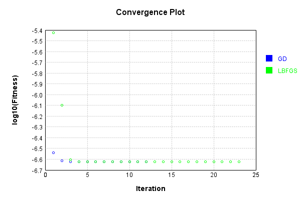


Code from [LearningTester.java:99](../../../../../../../src/main/java/com/simiacryptus/mindseye/test/unit/LearningTester.java#L99) executed in 0.00 seconds: 
```java
    return TestUtil.compareTime(runs);
```

Returns: 

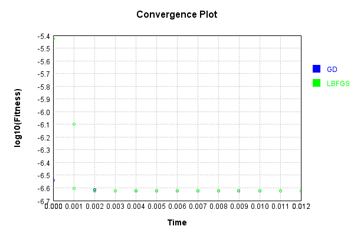


### Model Learning
In this test, attempt to train a network to emulate a randomized network given an example input/output. The target state is:

Code from [LearningTester.java:176](../../../../../../../src/main/java/com/simiacryptus/mindseye/test/unit/LearningTester.java#L176) executed in 0.00 seconds: 
```java
    return network_target.state().stream().map(Arrays::toString).reduce((a, b) -> a + "\n" + b).orElse("");
```

Returns: 

```
    [1.0]
    [0.0, 0.0, 0.0, 0.0, 0.0, 0.0, 0.0, 0.0, 0.0, 0.0, 0.0, 0.0, 0.0, 0.0, 0.0, 0.0, 0.0, 0.0, 0.0, 0.0, 0.0, 0.0, 0.0, 0.0, 0.0, 0.0, 0.0, 0.0, 0.0, 0.0, 0.0, 0.0]
    [0.0, 0.0, 0.0, 0.0, 0.0, 0.0, 0.0, 0.0, 0.0]
    [-0.08580000000000002, -0.09880000000000001, 0.0976, 0.027200000000000002, -0.0964, 0.0354, 0.0872, 0.07740000000000001, 8.0E-4, -0.0792, 0.0258, 0.061, -0.07440000000000001, 0.037200000000000004, -0.0256, -0.0862, 0.0862, 0.0354, 0.0012000000000000001, 0.0364, 0.0024000000000000002, -0.09140000000000001, 0.0614, 0.027800000000000002, 0.0826, -0.0296, 0.037, 0.055600000000000004, 0.08580000000000002, -0.0344, 0.04440000000000001, 0.08, -0.0362, -0.0478, -0.043, 0.0048000000000000004, 0.09540000000000001, 0.0122, 0.057, -0.05040000000000001, -0.0148, -0.09880000000000001, -0.0324, 0.0334, -0.059800000000000006, -0.046200000000000005, 0.0456, -0.0952, 0.021400000000000002, 0.0296, -0.019600000000000003, 0.004600000000000001, 0.0964, 0.0164, 0.09140000000000001, 0.09060000000000001, 0.032, -0.018, -0.08
```
...[skipping 33798 bytes](etc/59.txt)...
```
    , 0.0364, -0.028, -0.0482, 0.074, -0.027800000000000002, -0.0026, -0.0776, 0.0342, 0.042800000000000005, 0.042800000000000005, 0.0332, -0.096, -0.039200000000000006, 0.0328, 0.0732, -0.0604, -0.085, -0.039400000000000004, -0.0194, -0.022400000000000003, 0.046400000000000004, -0.061200000000000004, 0.0606, -0.009600000000000001, 0.03780000000000001, -0.052, -0.0028000000000000004, 0.047, -0.0274, 0.09580000000000001, -0.0606, 0.004600000000000001, -0.022600000000000002, -0.0144, 0.0724, -0.0094, 0.025200000000000004, -0.0684, -0.0704, -0.0536, 0.0682, 0.0318, -0.0666, -0.044, -0.0646, -0.0664, -0.082, 0.0854, 0.02, -0.04240000000000001, 0.053200000000000004, -0.0492, 0.0702, 0.06280000000000001, -0.0956, -0.07060000000000001, -0.0926, -0.010600000000000002, -0.0576, 0.03780000000000001, 0.08940000000000001, -0.07560000000000001, 0.0162, -0.006600000000000001, 0.03, -0.0244, 0.0204, 0.0506, 0.059, 0.011200000000000002, 0.062200000000000005, 0.0572, -0.0604, 0.021, -0.0522, -0.0018, -0.0082, -0.015, 0.076]
    [1.0]
```


First, we use a conjugate gradient descent method, which converges the fastest for purely linear functions.

Code from [LearningTester.java:300](../../../../../../../src/main/java/com/simiacryptus/mindseye/test/unit/LearningTester.java#L300) executed in 0.02 seconds: 
```java
    return new IterativeTrainer(trainable)
      .setLineSearchFactory(label -> new QuadraticSearch())
      .setOrientation(new GradientDescent())
      .setMonitor(monitor)
      .setTimeout(30, TimeUnit.SECONDS)
      .setMaxIterations(250)
      .setTerminateThreshold(0)
      .run();
```
Logging: 
```
    Constructing line search parameters: GD
    F(0.0) = LineSearchPoint{point=PointSample{avg=5.6289161771878085E-6}, derivative=-2.33265377922971E-6}
    New Minimum: 5.6289161771878085E-6 > 5.628916176954533E-6
    F(1.0E-10) = LineSearchPoint{point=PointSample{avg=5.628916176954533E-6}, derivative=-2.332653779172416E-6}, delta = -2.332754147726761E-16
    New Minimum: 5.628916176954533E-6 > 5.6289161755549475E-6
    F(7.000000000000001E-10) = LineSearchPoint{point=PointSample{avg=5.6289161755549475E-6}, derivative=-2.332653778828664E-6}, delta = -1.6328609878058994E-15
    New Minimum: 5.6289161755549475E-6 > 5.6289161657577985E-6
    F(4.900000000000001E-9) = LineSearchPoint{point=PointSample{avg=5.6289161657577985E-6}, derivative=-2.3326537764223918E-6}, delta = -1.1430009973982351E-14
    New Minimum: 5.6289161657577985E-6 > 5.6289160971777734E-6
    F(3.430000000000001E-8) = LineSearchPoint{point=PointSample{avg=5.6289160971777734E-6}, derivative=-2.3326537595784924E-6}, delta = -8.001003508952562E-14
    New Minimum: 5.62891609717777
```
...[skipping 5445 bytes](etc/60.txt)...
```
    2
    F(0.0) = LineSearchPoint{point=PointSample{avg=8.790838888816964E-7}, derivative=-5.852157780580051E-24}
    F(4.058371175293617) = LineSearchPoint{point=PointSample{avg=8.790838888816964E-7}, derivative=-8.289637303698356E-26}, delta = 0.0
    F(28.40859822705532) = LineSearchPoint{point=PointSample{avg=8.790838888816968E-7}, derivative=3.453269499246039E-23}, delta = 4.2351647362715017E-22
    F(2.185276786696563) = LineSearchPoint{point=PointSample{avg=8.790838888816964E-7}, derivative=-2.7456304034231897E-24}, delta = 0.0
    F(15.296937506875942) = LineSearchPoint{point=PointSample{avg=8.790838888816964E-7}, derivative=1.5893532936955787E-23}, delta = 0.0
    8.790838888816964E-7 <= 8.790838888816964E-7
    F(4.116681921614998) = LineSearchPoint{point=PointSample{avg=8.790838888816964E-7}, derivative=5.802265832090701E-31}, delta = 0.0
    Right bracket at 4.116681921614998
    Converged to right
    Iteration 5 failed, aborting. Error: 8.790838888816964E-7 Total: 250038807406076.2000; Orientation: 0.0001; Line Search: 0.0021
    
```

Returns: 

```
    8.790838888816964E-7
```


Training Converged

Next, we run the same optimization using L-BFGS, which is nearly ideal for purely second-order or quadratic functions.

Code from [LearningTester.java:324](../../../../../../../src/main/java/com/simiacryptus/mindseye/test/unit/LearningTester.java#L324) executed in 0.02 seconds: 
```java
    return new IterativeTrainer(trainable)
      .setLineSearchFactory(label -> new ArmijoWolfeSearch())
      .setOrientation(new LBFGS())
      .setMonitor(monitor)
      .setTimeout(30, TimeUnit.SECONDS)
      .setMaxIterations(250)
      .setTerminateThreshold(0)
      .run();
```
Logging: 
```
    LBFGS Accumulation History: 1 points
    Constructing line search parameters: GD
    th(0)=2.5987914307361565E-5;dx=-9.397852308927662E-6
    New Minimum: 2.5987914307361565E-5 > 1.0974272951104966E-5
    END: th(2.154434690031884)=1.0974272951104966E-5; dx=-4.5400899529101605E-6 delta=1.50136413562566E-5
    Iteration 1 complete. Error: 1.0974272951104966E-5 Total: 250038814069441.2000; Orientation: 0.0003; Line Search: 0.0009
    LBFGS Accumulation History: 1 points
    th(0)=1.0974272951104966E-5;dx=-2.1933373013686236E-6
    New Minimum: 1.0974272951104966E-5 > 6.4095532671680916E-6
    WOLF (strong): th(4.641588833612779)=6.4095532671680916E-6; dx=3.8677644770269564E-8 delta=4.564719683936874E-6
    END: th(2.3207944168063896)=7.300537211801325E-6; dx=-9.72656808081228E-7 delta=3.6737357393036412E-6
    Iteration 2 complete. Error: 6.4095532671680916E-6 Total: 250038816104756.2000; Orientation: 0.0003; Line Search: 0.0015
    LBFGS Accumulation History: 1 points
    th(0)=7.300537211801325E-6;dx=-4.313396207253009E-7
    New Minimum: 7.300537211
```
...[skipping 3494 bytes](etc/61.txt)...
```
    History: 1 points
    th(0)=6.400943629854049E-6;dx=-1.3437498596596488E-16
    New Minimum: 6.400943629854049E-6 > 6.40094362964972E-6
    WOLF (strong): th(8.41576050793705)=6.40094362964972E-6; dx=3.629318792640446E-17 delta=2.0432891083320762E-16
    New Minimum: 6.40094362964972E-6 > 6.400943629573457E-6
    END: th(4.207880253968525)=6.400943629573457E-6; dx=-4.6013752692931246E-20 delta=2.8059152223924855E-16
    Iteration 10 complete. Error: 6.400943629573457E-6 Total: 250038830298105.1600; Orientation: 0.0002; Line Search: 0.0011
    LBFGS Accumulation History: 1 points
    th(0)=6.400943629573457E-6;dx=-5.764723787470908E-23
    WOLF (strong): th(9.065603190649963)=6.400943629573457E-6; dx=6.5235362690657E-23 delta=0.0
    WOLF (strong): th(4.532801595324981)=6.400943629573457E-6; dx=3.794063160687674E-24 delta=0.0
    END: th(1.510933865108327)=6.400943629573457E-6; dx=-3.716680570159788E-23 delta=0.0
    Iteration 11 failed, aborting. Error: 6.400943629573457E-6 Total: 250038832274715.1600; Orientation: 0.0002; Line Search: 0.0016
    
```

Returns: 

```
    6.400943629573457E-6
```


Training Converged

Code from [LearningTester.java:96](../../../../../../../src/main/java/com/simiacryptus/mindseye/test/unit/LearningTester.java#L96) executed in 0.00 seconds: 
```java
    return TestUtil.compare(runs);
```

Returns: 

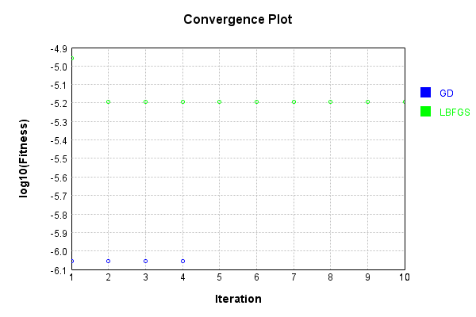


Code from [LearningTester.java:99](../../../../../../../src/main/java/com/simiacryptus/mindseye/test/unit/LearningTester.java#L99) executed in 0.00 seconds: 
```java
    return TestUtil.compareTime(runs);
```

Returns: 

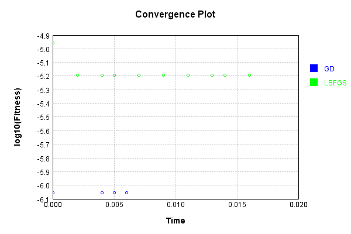


### Composite Learning
In this test, attempt to train a network to emulate a randomized network given an example input/output. The target state is:

Code from [LearningTester.java:219](../../../../../../../src/main/java/com/simiacryptus/mindseye/test/unit/LearningTester.java#L219) executed in 0.00 seconds: 
```java
    return network_target.state().stream().map(Arrays::toString).reduce((a, b) -> a + "\n" + b).orElse("");
```

Returns: 

```
    [1.0]
    [0.0, 0.0, 0.0, 0.0, 0.0, 0.0, 0.0, 0.0, 0.0, 0.0, 0.0, 0.0, 0.0, 0.0, 0.0, 0.0, 0.0, 0.0, 0.0, 0.0, 0.0, 0.0, 0.0, 0.0, 0.0, 0.0, 0.0, 0.0, 0.0, 0.0, 0.0, 0.0]
    [0.0, 0.0, 0.0, 0.0, 0.0, 0.0, 0.0, 0.0, 0.0]
    [0.048400000000000006, -0.0668, -0.0436, -0.0862, -0.0496, 0.02, 0.05840000000000001, -0.0826, -0.027800000000000002, -0.022400000000000003, 0.0188, 0.0248, 0.0814, -0.099, 0.037399999999999996, 0.0734, 0.0258, -0.0124, -0.037, 0.0122, -0.039, -0.038400000000000004, 0.07980000000000001, 8.0E-4, -0.0826, 0.041, -0.0522, 0.061, 0.06080000000000001, 0.0782, 0.075, -0.0596, -0.055, -0.0148, -0.08, 0.07540000000000001, -0.0956, -0.1, -0.08680000000000002, -0.017400000000000002, 0.06180000000000001, 0.0078000000000000005, 0.035, 0.0636, -0.06180000000000001, 0.037200000000000004, -0.0902, 0.0648, 0.032600000000000004, -0.066, 0.0024000000000000002, 0.0248, -0.09720000000000001, -0.088, 0.023600000000000003, 0.0558, -0.094, -0.07560000000000001, -0.04440000000000001, 0.0164, -0.0952, 0.07740000000000001, -0
```
...[skipping 33798 bytes](etc/62.txt)...
```
    0000000004, 0.057, 0.039200000000000006, -0.06380000000000001, -0.014600000000000002, 0.047400000000000005, 0.047400000000000005, 0.05140000000000001, 0.08460000000000001, -0.0832, -0.0402, 0.0124, 0.054400000000000004, -0.0992, -0.0022, 0.0442, 0.092, -0.0734, -0.009, 0.011200000000000002, 0.09820000000000001, -0.0844, -0.036800000000000006, -0.0644, -0.08880000000000002, -0.05280000000000001, -0.006, 0.054200000000000005, -0.015, -0.0684, 0.08080000000000001, -8.0E-4, -0.037399999999999996, 0.0826, 0.0704, 0.0134, -0.09820000000000001, -0.0284, 0.0062, -0.0992, 0.016800000000000002, -0.08660000000000001, -0.0028000000000000004, 0.07479999999999999, -0.0206, 0.092, -0.0722, -0.031200000000000002, 0.046200000000000005, 0.011200000000000002, 0.0344, -0.025400000000000002, -0.0854, -0.0402, 0.06280000000000001, 0.040600000000000004, 0.0078000000000000005, -0.0664, 0.045200000000000004, -0.044, 0.0094, 0.045200000000000004, -0.0688, 0.017, -0.0078000000000000005, 0.020200000000000003, 0.0208, 0.004, 0.054]
    [1.0]
```


We simultaneously regress this target input:

Code from [LearningTester.java:223](../../../../../../../src/main/java/com/simiacryptus/mindseye/test/unit/LearningTester.java#L223) executed in 0.00 seconds: 
```java
    return Arrays.stream(testInput).map(x -> x.prettyPrint()).reduce((a, b) -> a + "\n" + b).orElse("");
```

Returns: 

```
    [
    	[ [ 0.0586, -0.0708, -0.0708 ], [ 0.013200000000000002, 0.0548, -0.068 ], [ -0.039400000000000004, -0.043, 0.0062 ], [ -0.088, -0.0388, -0.0952 ], [ -0.061200000000000004, 0.02, -0.042800000000000005 ] ],
    	[ [ -0.09720000000000001, 0.007, 0.083 ], [ 0.0912, -0.053200000000000004, -0.02 ], [ 0.0936, -0.08760000000000001, -0.0814 ], [ -0.055200000000000006, -0.0912, 0.07360000000000001 ], [ 0.039400000000000004, 0.08940000000000001, -0.041 ] ],
    	[ [ -0.068, -0.092, 0.08280000000000001 ], [ -0.0034000000000000002, -0.0018, 0.0572 ], [ -0.087, 0.09040000000000001, -0.076 ], [ -0.0586, 0.040400000000000005, -0.0606 ], [ 0.002, -0.0032, 0.0376 ] ],
    	[ [ 0.015, 0.055600000000000004, 0.0058000000000000005 ], [ 0.0918, 0.0826, -0.0088 ], [ -0.050800000000000005, 0.088, -0.060200000000000004 ], [ 0.05380000000000001, -0.0078000000000000005, -0.055400000000000005 ], [ -0.07360000000000001, 0.0732, -0.074 ] ],
    	[ [ -0.025400000000000002, 0.0142, -0.030600000000000002 ], [ 0.0722, -0.0586, 0.0324 ], [ -0.085, 0.0478, -0.045200000000000004 ], [ 0.07440000000000001, 0.0932, -0.06420000000000001 ], [ -0.02, 0.045, -0.0832 ] ]
    ]
```


Which produces the following output:

Code from [LearningTester.java:230](../../../../../../../src/main/java/com/simiacryptus/mindseye/test/unit/LearningTester.java#L230) executed in 0.00 seconds: 
```java
    return Stream.of(targetOutput).map(x -> x.prettyPrint()).reduce((a, b) -> a + "\n" + b).orElse("");
```

Returns: 

```
    [
    	[ [ 0.0 ], [ 0.0 ], [ 0.0013047189440000008 ] ],
    	[ [ 0.0 ], [ 0.0 ], [ 0.0014698552319999982 ] ],
    	[ [ 0.0 ], [ 0.008327036816000005 ], [ 0.009119153744000005 ] ]
    ]
```


First, we use a conjugate gradient descent method, which converges the fastest for purely linear functions.

Code from [LearningTester.java:300](../../../../../../../src/main/java/com/simiacryptus/mindseye/test/unit/LearningTester.java#L300) executed in 0.01 seconds: 
```java
    return new IterativeTrainer(trainable)
      .setLineSearchFactory(label -> new QuadraticSearch())
      .setOrientation(new GradientDescent())
      .setMonitor(monitor)
      .setTimeout(30, TimeUnit.SECONDS)
      .setMaxIterations(250)
      .setTerminateThreshold(0)
      .run();
```
Logging: 
```
    Constructing line search parameters: GD
    F(0.0) = LineSearchPoint{point=PointSample{avg=6.565737840456927E-5}, derivative=-2.3553372755783298E-5}
    New Minimum: 6.565737840456927E-5 > 6.565737840221391E-5
    F(1.0E-10) = LineSearchPoint{point=PointSample{avg=6.565737840221391E-5}, derivative=-2.3553372755208068E-5}, delta = -2.355361457088978E-15
    New Minimum: 6.565737840221391E-5 > 6.56573783880819E-5
    F(7.000000000000001E-10) = LineSearchPoint{point=PointSample{avg=6.56573783880819E-5}, derivative=-2.3553372751756747E-5}, delta = -1.6487367569296973E-14
    New Minimum: 6.56573783880819E-5 > 6.565737828915774E-5
    F(4.900000000000001E-9) = LineSearchPoint{point=PointSample{avg=6.565737828915774E-5}, derivative=-2.3553372727597467E-5}, delta = -1.1541153232749735E-13
    New Minimum: 6.565737828915774E-5 > 6.565737759668857E-5
    F(3.430000000000001E-8) = LineSearchPoint{point=PointSample{avg=6.565737759668857E-5}, derivative=-2.3553372558482484E-5}, delta = -8.078806991874271E-13
    New Minimum: 6.565737759668857E-5 > 6.
```
...[skipping 2189 bytes](etc/63.txt)...
```
    4646E-5 Total: 250039016140208.0000; Orientation: 0.0001; Line Search: 0.0060
    F(0.0) = LineSearchPoint{point=PointSample{avg=1.7376620645544646E-5}, derivative=-1.5508340929656467E-9}
    New Minimum: 1.7376620645544646E-5 > 1.7373476901937152E-5
    F(4.0972031235307504) = LineSearchPoint{point=PointSample{avg=1.7373476901937152E-5}, derivative=-1.2851219983872535E-11}, delta = -3.1437436074945567E-9
    New Minimum: 1.7373476901937152E-5 > 1.7373474785288787E-5
    F(28.680421864715253) = LineSearchPoint{point=PointSample{avg=1.7373474785288787E-5}, derivative=0.0}, delta = -3.1458602558597903E-9
    1.7373474785288787E-5 <= 1.7376620645544646E-5
    Converged to right
    Iteration 2 complete. Error: 1.7373474785288787E-5 Total: 250039017562534.9700; Orientation: 0.0001; Line Search: 0.0010
    Zero gradient: 0.0
    F(0.0) = LineSearchPoint{point=PointSample{avg=1.7373474785288787E-5}, derivative=0.0}
    Iteration 3 failed, aborting. Error: 1.7373474785288787E-5 Total: 250039018135625.9700; Orientation: 0.0001; Line Search: 0.0003
    
```

Returns: 

```
    1.7373474785288787E-5
```


This training run resulted in the following configuration:

Code from [LearningTester.java:245](../../../../../../../src/main/java/com/simiacryptus/mindseye/test/unit/LearningTester.java#L245) executed in 0.00 seconds: 
```java
    return network_gd.state().stream().map(Arrays::toString).reduce((a, b) -> a + "\n" + b).orElse("");
```

Returns: 

```
    [1.0]
    [6.442533349850115E-5, 0.0, 0.0, 0.0, 0.0, 0.0, 0.0, -9.465057021851073E-4, -0.0017782292063096695, 0.0, 0.0, -0.0012795917055849766, 0.0012524041355335082, 6.43960405322925E-4, 0.0, 0.0, -7.237848579328583E-4, -0.0016776806495865078, 0.0, -9.774937672538753E-4, 0.0, 0.0, 0.0, 0.001483151171570701, 0.0, -0.001490205646431164, -7.473020429893521E-4, -6.624914664581482E-4, 0.0, -0.0010673420413070875, 0.0, 0.0]
    [-0.0035067480944636887, -0.01530793370845436, -0.010099797487408024, 0.0, -0.005209205495509562, 0.0, 0.0, 0.0, 0.0]
    [0.07733533887150074, -0.09748024417935272, 0.07521495720869398, -0.06760000000000001, 0.07490445417824708, -0.025400000000000002, -0.066, -0.07560000000000001, 0.0102, 0.09960000000000001, -0.0478, -0.008, 0.0826, 0.07379999999999999, 0.033600000000000005, 0.037200000000000004, -0.094, -0.0734, 0.0078000000000000005, -0.0782, -0.0926, 0.08880000000000002, 0.0442, -0.0882, -0.029200000000000004, -0.029200000000000004, -0.09880000000000001, -0.0422, 0.016800000000000002, -0.099600000
```
...[skipping 43421 bytes](etc/64.txt)...
```
    62, 0.0762, -0.055, 0.08305224680759493, -0.08870183943658129, 0.094, -0.0684, -0.05432936360636648, -0.07106913519603264, 0.04976445452658825, 0.0742, -0.0094, -0.08176004913606359, 0.004892609745896427, 0.06420000000000001, 0.019253960306215484, 0.011600000000000001, 0.073, -0.0804, -0.09348186902550266, 0.034800000000000005, 0.018282257377494723, -0.08115874695169233, 0.04423656625847476, -0.035800000000000005, 0.03485892141929905, -0.08560000000000001, 0.095, 0.022594078134159718, -0.0762, -0.0664, -0.07780000000000001, 0.0408, 0.011800000000000001, -0.0142, 0.09528707816600097, -0.04003640021477746, -0.078, -0.011200000000000002, -0.016682274140728728, 0.04228477591521002, -0.08985924302527547, -0.037200000000000004, -0.022400000000000003, 0.041866585801727765, 0.03135434869086108, 0.0568, -0.04831006747936752, -0.08580000000000002, 0.024, -0.025, 0.0022635511652966747, 0.0752, 0.05273709661470891, 0.03266875409428961, -0.03133905460319486, 0.078, -0.08610179970057615, 0.0102, 0.027600000000000003]
    [1.0]
```


And regressed input:

Code from [LearningTester.java:249](../../../../../../../src/main/java/com/simiacryptus/mindseye/test/unit/LearningTester.java#L249) executed in 0.00 seconds: 
```java
    return Arrays.stream(input_gd).map(x -> x.prettyPrint()).reduce((a, b) -> a + "\n" + b).orElse("");
```

Returns: 

```
    [
    	[ [ -0.01996852194511726, -0.05894315607090465, 0.0831647362375934 ], [ -0.07014398944716796, -0.04504934351570847, -0.07423244577599122 ], [ 0.032249001409204725, -0.04276407479211167, 0.08771671759030684 ], [ -0.030985265837560196, 0.02023985906711475, -0.05862066502164522 ], [ -0.0554049669567505, 0.0825151388287856, 0.056915530771673106 ] ],
    	[ [ 0.0909339853084877, 0.04793368028524877, 0.054967249576895166 ], [ 0.09015799248158213, -0.09148424168889177, 0.07424086847065546 ], [ -0.020461104146351532, -0.06810586083781264, -0.0600764810150796 ], [ -0.03850232629094466, -0.07371282001909205, -0.0406382124110034 ], [ -0.002925513990823364, -0.08730626318365892, -0.09683956035355802 ] ],
    	[ [ 0.0017687257952709418, 0.07356234445437393, 0.09152238543024849 ], [ -0.06794836905083325, 0.07307185785759433, -0.05084517493641172 ], [ 0.08208025490552903, -0.06103176934944147, 0.09341794161819834 ], [ 0.013259558924854826, 0.04522606665636046, -0.0760780510853053 ], [ 0.0141085293061817, -0.05335054330480949, -0.08712271551769298 ] ],
    	[ [ -0.025498383357704057, 0.014841231266875771, -0.06055916098805435 ], [ -0.002031336301535133, -0.08788322275616765, -0.03930830869942637 ], [ -0.07076824805823477, -0.008176298008297984, 0.038869831378082025 ], [ -0.06394876095762833, -0.084424571278429, 0.058381199810141816 ], [ 0.005962799698375011, 0.07197602678510054, -0.05524126243690108 ] ],
    	[ [ 0.006846882651162408, 0.0058421135525926655, -0.09510897213708266 ], [ 0.054297890269972136, -0.04276985321724544, 0.08905553501329037 ], [ 0.0927694834712705, -0.008943443805590328, -0.08109841659763856 ], [ -0.08313369891025797, -0.0034068918854933696, 0.03812995385287057 ], [ 0.04069566006818456, 0.0556559286753352, -0.09202208937529774 ] ]
    ]
```


Which produces the following output:

Code from [LearningTester.java:256](../../../../../../../src/main/java/com/simiacryptus/mindseye/test/unit/LearningTester.java#L256) executed in 0.00 seconds: 
```java
    return Stream.of(regressedOutput).map(x -> x.prettyPrint()).reduce((a, b) -> a + "\n" + b).orElse("");
```

Returns: 

```
    [ 1.7373474785288787E-5 ]
```


Next, we run the same optimization using L-BFGS, which is nearly ideal for purely second-order or quadratic functions.

Code from [LearningTester.java:324](../../../../../../../src/main/java/com/simiacryptus/mindseye/test/unit/LearningTester.java#L324) executed in 0.00 seconds: 
```java
    return new IterativeTrainer(trainable)
      .setLineSearchFactory(label -> new ArmijoWolfeSearch())
      .setOrientation(new LBFGS())
      .setMonitor(monitor)
      .setTimeout(30, TimeUnit.SECONDS)
      .setMaxIterations(250)
      .setTerminateThreshold(0)
      .run();
```
Logging: 
```
    LBFGS Accumulation History: 1 points
    Constructing line search parameters: GD
    th(0)=6.565737840456927E-5;dx=-2.3553372755783298E-5
    New Minimum: 6.565737840456927E-5 > 2.8254290652224335E-5
    END: th(2.154434690031884)=2.8254290652224335E-5; dx=-1.117256032587741E-5 delta=3.7403087752344935E-5
    Iteration 1 complete. Error: 2.8254290652224335E-5 Total: 250039034861007.9700; Orientation: 0.0003; Line Search: 0.0009
    LBFGS Accumulation History: 1 points
    th(0)=2.8254290652224335E-5;dx=-5.300236360454823E-6
    New Minimum: 2.8254290652224335E-5 > 1.7373474785288787E-5
    END: th(4.641588833612779)=1.7373474785288787E-5; dx=0.0 delta=1.0880815866935549E-5
    Iteration 2 complete. Error: 1.7373474785288787E-5 Total: 250039036244862.9700; Orientation: 0.0002; Line Search: 0.0009
    LBFGS Accumulation History: 1 points
    th(0)=1.7373474785288787E-5;dx=0.0 (ERROR: Starting derivative negative)
    Iteration 3 failed, aborting. Error: 1.7373474785288787E-5 Total: 250039037393610.9700; Orientation: 0.0002; Line Search: 0.0007
    
```

Returns: 

```
    1.7373474785288787E-5
```


This training run resulted in the following configuration:

Code from [LearningTester.java:266](../../../../../../../src/main/java/com/simiacryptus/mindseye/test/unit/LearningTester.java#L266) executed in 0.00 seconds: 
```java
    return network_lbfgs.state().stream().map(Arrays::toString).reduce((a, b) -> a + "\n" + b).orElse("");
```

Returns: 

```
    [1.0]
    [1.9017931197868828E-4, 0.0, 0.0, 0.0, 0.0, 0.0, 0.0, -0.001008765574625657, -0.0018206527325636762, 0.0, 0.0, -0.0012786513135538292, 0.0012626070776971309, 7.14799652627274E-4, 0.0, 0.0, -8.211755241426875E-4, -0.001731005445243015, 0.0, -9.615503088096673E-4, 0.0, 0.0, 0.0, 0.001602189045891515, 0.0, -0.0016306852127155541, -7.386933686716068E-4, -7.836824575161279E-4, 0.0, -0.0010179030833163331, 0.0, 0.0]
    [-0.0027890438994569, -0.016247734453049553, -0.01044121660490899, 0.0, -0.00517100839509286, 0.0, 0.0, 0.0, 0.0]
    [0.07734857302763454, -0.09749952832560506, 0.07520751033664931, -0.06760000000000001, 0.07490466716399528, -0.025400000000000002, -0.066, -0.07560000000000001, 0.0102, 0.09960000000000001, -0.0478, -0.008, 0.0826, 0.07379999999999999, 0.033600000000000005, 0.037200000000000004, -0.094, -0.0734, 0.0078000000000000005, -0.0782, -0.0926, 0.08880000000000002, 0.0442, -0.0882, -0.029200000000000004, -0.029200000000000004, -0.09880000000000001, -0.0422, 0.016800000000000002, -0.099600000000
```
...[skipping 43421 bytes](etc/65.txt)...
```
    762, 0.0762, -0.055, 0.08305569348802638, -0.08869948249837066, 0.094, -0.0684, -0.054329406123104836, -0.07106970807915862, 0.049760536224897324, 0.0742, -0.0094, -0.081754663306949, 0.0048955681238796985, 0.06420000000000001, 0.019253086816015196, 0.011600000000000001, 0.073, -0.0804, -0.09348845620980253, 0.034800000000000005, 0.018290029377594514, -0.08115921700873034, 0.04424326664111059, -0.035800000000000005, 0.03485619807379724, -0.08560000000000001, 0.095, 0.02258250149090901, -0.0762, -0.0664, -0.07780000000000001, 0.0408, 0.011800000000000001, -0.0142, 0.09529281767341628, -0.04003247955235786, -0.078, -0.011200000000000002, -0.016682349691068365, 0.042283825942792515, -0.08986576954670757, -0.037200000000000004, -0.022400000000000003, 0.04187555725912583, 0.0313592719078084, 0.0568, -0.04831152658557095, -0.08580000000000002, 0.024, -0.025, 0.002252580658879871, 0.0752, 0.052750041197888675, 0.03266796809901976, -0.03132789261044997, 0.078, -0.08610634144779189, 0.0102, 0.027600000000000003]
    [1.0]
```


And regressed input:

Code from [LearningTester.java:270](../../../../../../../src/main/java/com/simiacryptus/mindseye/test/unit/LearningTester.java#L270) executed in 0.00 seconds: 
```java
    return Arrays.stream(input_lbgfs).map(x -> x.prettyPrint()).reduce((a, b) -> a + "\n" + b).orElse("");
```

Returns: 

```
    [
    	[ [ -0.019955690075218788, -0.05897790965924138, 0.08315272328662901 ], [ -0.07009598528549082, -0.04503855321497583, -0.07425235211525245 ], [ 0.0322454638857749, -0.0427657552902139, 0.08767905190995748 ], [ -0.031023813281911467, 0.020219909860210435, -0.058621105074159414 ], [ -0.05539676504669268, 0.0825153949046327, 0.05689797376003431 ] ],
    	[ [ 0.09091682945555596, 0.04796143844199566, 0.05498589366340931 ], [ 0.09013858323386954, -0.09148241527687741, 0.0742609866620431 ], [ -0.02048172279131907, -0.06811538159890905, -0.06006013597123815 ], [ -0.03847748036659605, -0.07370739413413603, -0.04064481894633971 ], [ -0.002910991636831327, -0.08730905169755208, -0.09683978274875726 ] ],
    	[ [ 0.001737876277677339, 0.07359031170169025, 0.09151409516929083 ], [ -0.06793833723979152, 0.07303705747519548, -0.05086556350819593 ], [ 0.08206171638152104, -0.06101305593577429, 0.09340024061674108 ], [ 0.01325612188956458, 0.04524031823957077, -0.076089081378307 ], [ 0.01411537156721495, -0.05337240785866503, -0.08715022968379017 ] ],
    	[ [ -0.025511833169470276, 0.01485064469754087, -0.06055389534502294 ], [ -0.002055586474587768, -0.08787792117664306, -0.03931867739177944 ], [ -0.07076770049409217, -0.008206642329691063, 0.03886601761068871 ], [ -0.06394805592254027, -0.08438946002285724, 0.058361797878259444 ], [ 0.005944454905611887, 0.07194300957525472, -0.05523912424506687 ] ],
    	[ [ 0.006834566601391656, 0.005849236056340179, -0.09509226266417875 ], [ 0.054340867783668576, -0.042768088035379244, 0.089046226363303 ], [ 0.09273143155280575, -0.008945950697820339, -0.0810922724208064 ], [ -0.08314317598896462, -0.0034075860277023324, 0.03815161270251174 ], [ 0.04071065823360961, 0.05563467436579344, -0.09204363495279128 ] ]
    ]
```


Which produces the following output:

Code from [LearningTester.java:277](../../../../../../../src/main/java/com/simiacryptus/mindseye/test/unit/LearningTester.java#L277) executed in 0.00 seconds: 
```java
    return Stream.of(regressedOutput).map(x -> x.prettyPrint()).reduce((a, b) -> a + "\n" + b).orElse("");
```

Returns: 

```
    [ 1.7373474785288787E-5 ]
```


Code from [LearningTester.java:96](../../../../../../../src/main/java/com/simiacryptus/mindseye/test/unit/LearningTester.java#L96) executed in 0.00 seconds: 
```java
    return TestUtil.compare(runs);
```

Returns: 

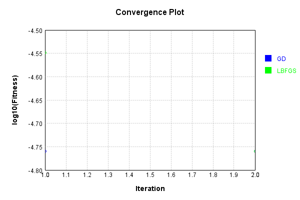


Code from [LearningTester.java:99](../../../../../../../src/main/java/com/simiacryptus/mindseye/test/unit/LearningTester.java#L99) executed in 0.00 seconds: 
```java
    return TestUtil.compareTime(runs);
```

Returns: 


This is a network with the following layout:

Code from [NLayerTest.java:87](../../../../../../../src/test/java/com/simiacryptus/mindseye/network/NLayerTest.java#L87) executed in 0.18 seconds: 
```java
    return Graphviz.fromGraph(TestUtil.toGraph((DAGNetwork) layer))
      .height(400).width(600).render(Format.PNG).toImage();
```

Returns: 

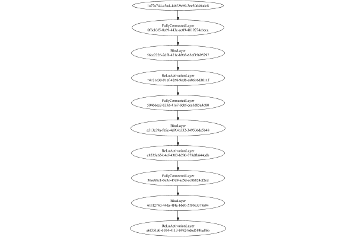


### Json Serialization
Code from [JsonTest.java:36](../../../../../../../src/main/java/com/simiacryptus/mindseye/test/unit/JsonTest.java#L36) executed in 0.00 seconds: 
```java
    JsonObject json = layer.getJson();
    NNLayer echo = NNLayer.fromJson(json);
    if ((echo == null)) throw new AssertionError("Failed to deserialize");
    if ((layer == echo)) throw new AssertionError("Serialization did not copy");
    if ((!layer.equals(echo))) throw new AssertionError("Serialization not equal");
    return new GsonBuilder().setPrettyPrinting().create().toJson(json);
```

Returns: 

```
    {
      "class": "com.simiacryptus.mindseye.network.PipelineNetwork",
      "id": "846eae24-b54e-4107-8e15-5b0f109baf7f",
      "isFrozen": false,
      "name": "PipelineNetwork/846eae24-b54e-4107-8e15-5b0f109baf7f",
      "inputs": [
        "1a77a744-c5ad-446f-9eb9-3ee30d46adc8"
      ],
      "nodes": {
        "f8a5d5c0-d725-4827-a375-b3de704646db": "0f6cb3f5-0c69-443c-ac09-4019274cbeca",
        "29b4a65b-f986-48f7-a6a8-71a100dab7a9": "56ce2226-2df8-421c-b9b8-65ef35695297",
        "75ffd142-f240-44d9-9e56-eb6af4e0ac4f": "74731c30-91ef-4858-9edb-eab676d3011f",
        "f46dc0bf-ad43-4dc4-a6a5-4c12e6cba3ad": "50466ee2-835d-41e7-8cbf-ccc5d85a4d80",
        "ca3ce839-ab0f-46af-b30c-a02d2f3ba76d": "a513e39a-fb5c-4d90-b332-349506de5b48",
        "5a3fc99d-c5ce-4376-8190-a3b1e869e57d": "c8535e65-b4ef-4303-b280-778dfb644cdb",
        "ee01942d-821d-4c26-9553-9bbee63eb56b": "56eebbc1-0e5c-47d9-ac5d-cc8b824cf2cd",
        "59e1cbf4-a27b-409b-bf66-cb4695c3d546": "611f274d-44da-4f4a-bb3b-5f10c3378a94",
        "97f70bcf-b671-4631-9f2d-7515fda61225": "a6f351a0-6104-4113-b982-8d6d584
```
...[skipping 68724 bytes](etc/66.txt)...
```
    4ba86b",
          "weights": [
            1.0
          ]
        }
      },
      "links": {
        "f8a5d5c0-d725-4827-a375-b3de704646db": [
          "1a77a744-c5ad-446f-9eb9-3ee30d46adc8"
        ],
        "29b4a65b-f986-48f7-a6a8-71a100dab7a9": [
          "f8a5d5c0-d725-4827-a375-b3de704646db"
        ],
        "75ffd142-f240-44d9-9e56-eb6af4e0ac4f": [
          "29b4a65b-f986-48f7-a6a8-71a100dab7a9"
        ],
        "f46dc0bf-ad43-4dc4-a6a5-4c12e6cba3ad": [
          "75ffd142-f240-44d9-9e56-eb6af4e0ac4f"
        ],
        "ca3ce839-ab0f-46af-b30c-a02d2f3ba76d": [
          "f46dc0bf-ad43-4dc4-a6a5-4c12e6cba3ad"
        ],
        "5a3fc99d-c5ce-4376-8190-a3b1e869e57d": [
          "ca3ce839-ab0f-46af-b30c-a02d2f3ba76d"
        ],
        "ee01942d-821d-4c26-9553-9bbee63eb56b": [
          "5a3fc99d-c5ce-4376-8190-a3b1e869e57d"
        ],
        "59e1cbf4-a27b-409b-bf66-cb4695c3d546": [
          "ee01942d-821d-4c26-9553-9bbee63eb56b"
        ],
        "97f70bcf-b671-4631-9f2d-7515fda61225": [
          "59e1cbf4-a27b-409b-bf66-cb4695c3d546"
        ]
      },
      "labels": {},
      "head": "97f70bcf-b671-4631-9f2d-7515fda61225"
    }
```


### Input Learning
In this test, we use a network to learn this target input, given it's pre-evaluated output:

Code from [LearningTester.java:127](../../../../../../../src/main/java/com/simiacryptus/mindseye/test/unit/LearningTester.java#L127) executed in 0.00 seconds: 
```java
    return Arrays.stream(input_target).map(x -> x.prettyPrint()).reduce((a, b) -> a + "\n" + b).orElse("");
```

Returns: 

```
    [
    	[ [ -0.0694, -0.0154, -0.0902 ], [ 0.024200000000000003, -0.0334, -0.0586 ], [ -0.07940000000000001, -0.043, -0.0422 ], [ -0.0974, 0.0816, 0.07479999999999999 ], [ -0.0596, -0.041, 0.0632 ] ],
    	[ [ 0.0206, -0.012, 0.0786 ], [ -0.059800000000000006, 0.039400000000000004, 0.052 ], [ 0.0102, 0.097, -0.018 ], [ -0.096, 0.0054, -0.055200000000000006 ], [ 0.0216, 0.0984, 0.04440000000000001 ] ],
    	[ [ -0.01, -0.0432, 0.0604 ], [ 0.038400000000000004, -0.0506, -0.071 ], [ 0.07579999999999999, -0.0274, -0.0328 ], [ -0.025200000000000004, -0.0398, -0.08380000000000001 ], [ 0.027, 0.0772, -0.0164 ] ],
    	[ [ -0.06, 0.05140000000000001, -0.04440000000000001 ], [ 0.058800000000000005, 0.018600000000000002, -0.084 ], [ -0.0852, -0.007600000000000001, 0.008400000000000001 ], [ 0.016, -0.0442, 0.05840000000000001 ], [ 0.031400000000000004, 0.027, -0.034800000000000005 ] ],
    	[ [ 0.0426, 0.067, 0.009 ], [ 0.053, -0.047, 0.042800000000000005 ], [ 0.013800000000000002, -0.0012000000000000001, 0.09980000000000001 ], [ -0.0632, -0.053200000000000004, -0.08660000000000001 ], [ 0.029200000000000004, -0.034800000000000005, -0.046 ] ]
    ]
```


First, we use a conjugate gradient descent method, which converges the fastest for purely linear functions.

Code from [LearningTester.java:300](../../../../../../../src/main/java/com/simiacryptus/mindseye/test/unit/LearningTester.java#L300) executed in 0.08 seconds: 
```java
    return new IterativeTrainer(trainable)
      .setLineSearchFactory(label -> new QuadraticSearch())
      .setOrientation(new GradientDescent())
      .setMonitor(monitor)
      .setTimeout(30, TimeUnit.SECONDS)
      .setMaxIterations(250)
      .setTerminateThreshold(0)
      .run();
```
Logging: 
```
    Constructing line search parameters: GD
    F(0.0) = LineSearchPoint{point=PointSample{avg=1.0543546156463088E-6}, derivative=-1.5347967893810603E-10}
    New Minimum: 1.0543546156463088E-6 > 1.0543546156462936E-6
    F(1.0E-10) = LineSearchPoint{point=PointSample{avg=1.0543546156462936E-6}, derivative=-1.5347967893810388E-10}, delta = -1.5246593050577406E-20
    New Minimum: 1.0543546156462936E-6 > 1.0543546156462019E-6
    F(7.000000000000001E-10) = LineSearchPoint{point=PointSample{avg=1.0543546156462019E-6}, derivative=-1.5347967893809085E-10}, delta = -1.0693790959085542E-19
    New Minimum: 1.0543546156462019E-6 > 1.054354615645557E-6
    F(4.900000000000001E-9) = LineSearchPoint{point=PointSample{avg=1.054354615645557E-6}, derivative=-1.5347967893799953E-10}, delta = -7.5174174068819155E-19
    New Minimum: 1.054354615645557E-6 > 1.0543546156410451E-6
    F(3.430000000000001E-8) = LineSearchPoint{point=PointSample{avg=1.0543546156410451E-6}, derivative=-1.5347967893736022E-10}, delta = -5.263674492475036E-18
    New Minimum: 1.0543
```
...[skipping 96457 bytes](etc/67.txt)...
```
    acket at 0.01081350562578125
    F(0.005406752812890625) = LineSearchPoint{point=PointSample{avg=1.4693679385278594E-38}, derivative=-3.724327618218921E-42}, delta = 0.0
    Right bracket at 0.005406752812890625
    F(0.0027033764064453127) = LineSearchPoint{point=PointSample{avg=1.4693679385278594E-38}, derivative=-3.724327618218921E-42}, delta = 0.0
    Right bracket at 0.0027033764064453127
    F(0.0013516882032226563) = LineSearchPoint{point=PointSample{avg=1.4693679385278594E-38}, derivative=-3.724327618218921E-42}, delta = 0.0
    Right bracket at 0.0013516882032226563
    F(6.758441016113282E-4) = LineSearchPoint{point=PointSample{avg=1.4693679385278594E-38}, derivative=-3.724327618218921E-42}, delta = 0.0
    Right bracket at 6.758441016113282E-4
    F(3.379220508056641E-4) = LineSearchPoint{point=PointSample{avg=1.4693679385278594E-38}, derivative=-3.724327618218921E-42}, delta = 0.0
    Loops = 12
    Iteration 72 failed, aborting. Error: 1.4693679385278594E-38 Total: 250039468998796.5300; Orientation: 0.0000; Line Search: 0.0045
    
```

Returns: 

```
    1.4693679385278594E-38
```


Training Converged

Next, we run the same optimization using L-BFGS, which is nearly ideal for purely second-order or quadratic functions.

Code from [LearningTester.java:324](../../../../../../../src/main/java/com/simiacryptus/mindseye/test/unit/LearningTester.java#L324) executed in 0.01 seconds: 
```java
    return new IterativeTrainer(trainable)
      .setLineSearchFactory(label -> new ArmijoWolfeSearch())
      .setOrientation(new LBFGS())
      .setMonitor(monitor)
      .setTimeout(30, TimeUnit.SECONDS)
      .setMaxIterations(250)
      .setTerminateThreshold(0)
      .run();
```
Logging: 
```
    LBFGS Accumulation History: 1 points
    Constructing line search parameters: GD
    th(0)=1.0543546156463088E-6;dx=-1.5347967893810603E-10
    New Minimum: 1.0543546156463088E-6 > 1.0540240041705954E-6
    WOLFE (weak): th(2.154434690031884)=1.0540240041705954E-6; dx=-1.5343282784953774E-10 delta=3.3061147571339325E-10
    New Minimum: 1.0540240041705954E-6 > 1.0536934936324918E-6
    WOLFE (weak): th(4.308869380063768)=1.0536934936324918E-6; dx=-1.5338597676096928E-10 delta=6.611220138170671E-10
    New Minimum: 1.0536934936324918E-6 > 1.0523724608561823E-6
    WOLFE (weak): th(12.926608140191302)=1.0523724608561823E-6; dx=-1.5319857240669552E-10 delta=1.9821547901265213E-9
    New Minimum: 1.0523724608561823E-6 > 1.0464477990096654E-6
    WOLFE (weak): th(51.70643256076521)=1.0464477990096654E-6; dx=-1.5235525281246401E-10 delta=7.906816636643423E-9
    New Minimum: 1.0464477990096654E-6 > 1.0154019330994419E-6
    WOLFE (weak): th(258.53216280382605)=1.0154019330994419E-6; dx=-1.4785754830989575E-10 delta=3.895268254686697E-8
    New Minimum: 
```
...[skipping 2857 bytes](etc/68.txt)...
```
    872558E-8
    WOLF (strong): th(7200.000000000001)=3.104762140872558E-8; dx=7.98490533139127E-14 delta=5.0763523059645665E-8
    END: th(3600.0000000000005)=4.365191506342158E-8; dx=-7.0822344170339045E-12 delta=3.8159229404949665E-8
    Iteration 6 complete. Error: 3.104762140872558E-8 Total: 250039476300798.5300; Orientation: 0.0000; Line Search: 0.0004
    LBFGS Accumulation History: 1 points
    th(0)=4.365191506342158E-8;dx=-3.895814433040369E-12
    New Minimum: 4.365191506342158E-8 > 2.6125359712217985E-8
    END: th(7755.964884114783)=2.6125359712217985E-8; dx=-6.236891008397916E-13 delta=1.7526555351203596E-8
    Iteration 7 complete. Error: 2.6125359712217985E-8 Total: 250039476710312.5300; Orientation: 0.0000; Line Search: 0.0003
    LBFGS Accumulation History: 1 points
    th(0)=2.6125359712217985E-8;dx=-1.1138553636276718E-12
    MAX ALPHA: th(0)=2.6125359712217985E-8;th'(0)=-1.1138553636276718E-12;
    Iteration 8 failed, aborting. Error: 2.6125359712217985E-8 Total: 250039477169127.5300; Orientation: 0.0000; Line Search: 0.0003
    
```

Returns: 

```
    2.6125359712217985E-8
```


Training Converged

Code from [LearningTester.java:96](../../../../../../../src/main/java/com/simiacryptus/mindseye/test/unit/LearningTester.java#L96) executed in 0.00 seconds: 
```java
    return TestUtil.compare(runs);
```

Returns: 

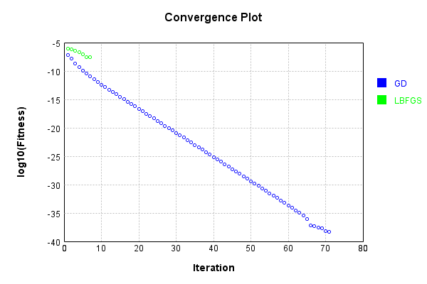


Code from [LearningTester.java:99](../../../../../../../src/main/java/com/simiacryptus/mindseye/test/unit/LearningTester.java#L99) executed in 0.00 seconds: 
```java
    return TestUtil.compareTime(runs);
```

Returns: 

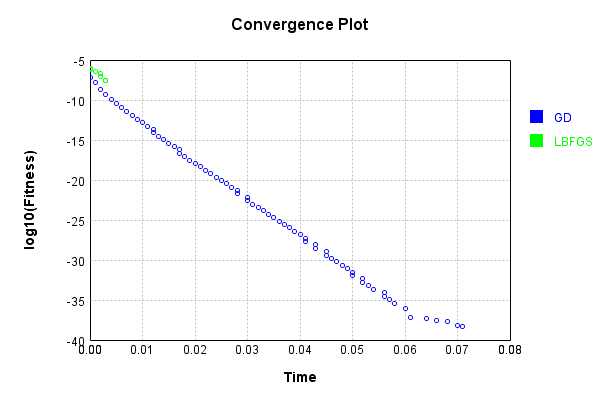


### Model Learning
In this test, attempt to train a network to emulate a randomized network given an example input/output. The target state is:

Code from [LearningTester.java:176](../../../../../../../src/main/java/com/simiacryptus/mindseye/test/unit/LearningTester.java#L176) executed in 0.00 seconds: 
```java
    return network_target.state().stream().map(Arrays::toString).reduce((a, b) -> a + "\n" + b).orElse("");
```

Returns: 

```
    [0.05380000000000001, -0.015200000000000002, -0.045200000000000004, 0.045200000000000004, -0.0182, 0.0884, 0.0804, -0.0234, -0.0258, -0.058, 0.07680000000000001, 0.045200000000000004, -0.016800000000000002, -0.065, -0.031200000000000002, 0.01, 0.0148, 0.0678, -0.0734, -0.034800000000000005, 0.085, -0.023200000000000002, -0.09980000000000001, -0.0328, 0.053, 0.0388, -0.004, 0.019600000000000003, -0.0724, 0.0782, 0.0534, -0.058800000000000005, -0.055, 0.055200000000000006, -0.010600000000000002, -0.0074, -0.056, 0.076, 0.035, 0.0408, 0.04580000000000001, 0.026, -0.048600000000000004, 0.031, 0.022600000000000002, -0.0922, 0.0402, 0.0012000000000000001, -0.013200000000000002, -0.022600000000000002, -0.07460000000000001, 0.0284, -0.043, 0.008400000000000001, -0.09240000000000001, -0.0354, -0.0872, 0.039200000000000006, -0.06960000000000001, -0.011, -0.07160000000000001, 0.0646, 0.0606, 0.0782, 0.042, 0.049400000000000006, -0.025200000000000004, 0.0632, 0.08460000000000001, 0.07060000000000001, -0.00460000000000000
```
...[skipping 35132 bytes](etc/69.txt)...
```
    , 0.0526, 0.033600000000000005, -0.0668, -0.0912, 0.055200000000000006, -0.0142, 0.08460000000000001, 0.07379999999999999, -0.009600000000000001, -0.0036, -0.0714, 0.0734, -0.031, -0.020200000000000003, -0.09720000000000001, -0.0182]
    [0.0, 0.0, 0.0, 0.0, 0.0, 0.0, 0.0, 0.0, 0.0, 0.0, 0.0, 0.0, 0.0, 0.0, 0.0, 0.0, 0.0, 0.0, 0.0, 0.0, 0.0, 0.0, 0.0, 0.0, 0.0, 0.0, 0.0, 0.0, 0.0, 0.0, 0.0, 0.0]
    [-0.0752, -0.009800000000000001, 0.06380000000000001, -0.0932, 0.07660000000000002, 0.08680000000000002, 0.09820000000000001, 0.0468, -0.0468, 0.0976, 0.0198, -0.025200000000000004, -0.07940000000000001, -0.096, -0.0172, 0.096, 0.0298, 0.09240000000000001, 0.055, -0.020200000000000003, -0.045200000000000004, -0.095, -0.041800000000000004, -0.0718, -0.026600000000000002, 0.0604, 0.030600000000000002, 2.0E-4, 0.09480000000000001, 0.0614, -0.0512, 0.007600000000000001, 0.0376, -0.026600000000000002, -0.08180000000000001, 0.09240000000000001]
    [0.0, 0.0, 0.0, 0.0]
    [1.0]
    [0.0, 0.0, 0.0, 0.0, 0.0, 0.0, 0.0, 0.0, 0.0]
    [1.0]
    [1.0]
```


First, we use a conjugate gradient descent method, which converges the fastest for purely linear functions.

Code from [LearningTester.java:300](../../../../../../../src/main/java/com/simiacryptus/mindseye/test/unit/LearningTester.java#L300) executed in 0.02 seconds: 
```java
    return new IterativeTrainer(trainable)
      .setLineSearchFactory(label -> new QuadraticSearch())
      .setOrientation(new GradientDescent())
      .setMonitor(monitor)
      .setTimeout(30, TimeUnit.SECONDS)
      .setMaxIterations(250)
      .setTerminateThreshold(0)
      .run();
```
Logging: 
```
    Constructing line search parameters: GD
    F(0.0) = LineSearchPoint{point=PointSample{avg=9.570011740572385E-8}, derivative=-9.578090624807336E-8}
    New Minimum: 9.570011740572385E-8 > 9.570011739614575E-8
    F(1.0E-10) = LineSearchPoint{point=PointSample{avg=9.570011739614575E-8}, derivative=-9.578090624319743E-8}, delta = -9.578102983763819E-18
    New Minimum: 9.570011739614575E-8 > 9.570011733867713E-8
    F(7.000000000000001E-10) = LineSearchPoint{point=PointSample{avg=9.570011733867713E-8}, derivative=-9.578090621394177E-8}, delta = -6.704672088634673E-17
    New Minimum: 9.570011733867713E-8 > 9.570011693639736E-8
    F(4.900000000000001E-9) = LineSearchPoint{point=PointSample{avg=9.570011693639736E-8}, derivative=-9.578090600915249E-8}, delta = -4.693264903390555E-16
    New Minimum: 9.570011693639736E-8 > 9.570011412043864E-8
    F(3.430000000000001E-8) = LineSearchPoint{point=PointSample{avg=9.570011412043864E-8}, derivative=-9.578090457562726E-8}, delta = -3.285285207380262E-15
    New Minimum: 9.570011412043864E-8 > 9.5700
```
...[skipping 5213 bytes](etc/70.txt)...
```
    ro gradient: 5.136475772856483E-13
    F(0.0) = LineSearchPoint{point=PointSample{avg=1.6228116748206513E-9}, derivative=-2.638338336514161E-25}
    New Minimum: 1.6228116748206513E-9 > 1.6228116748206511E-9
    F(1.9710934965934466) = LineSearchPoint{point=PointSample{avg=1.6228116748206511E-9}, derivative=1.8829838474799296E-27}, delta = -2.0679515313825692E-25
    1.6228116748206511E-9 <= 1.6228116748206513E-9
    Converged to right
    Iteration 5 complete. Error: 1.6228116748206511E-9 Total: 250039685916083.3000; Orientation: 0.0002; Line Search: 0.0006
    Zero gradient: 3.914671838211206E-15
    F(0.0) = LineSearchPoint{point=PointSample{avg=1.6228116748206511E-9}, derivative=-1.53246556008839E-29}
    F(1.9710934965934466) = LineSearchPoint{point=PointSample{avg=1.6228116748206511E-9}, derivative=1.154254420036437E-31}, delta = 0.0
    1.6228116748206511E-9 <= 1.6228116748206511E-9
    Converged to right
    Iteration 6 failed, aborting. Error: 1.6228116748206511E-9 Total: 250039686952834.3000; Orientation: 0.0001; Line Search: 0.0007
    
```

Returns: 

```
    1.6228116748206511E-9
```


Training Converged

Next, we run the same optimization using L-BFGS, which is nearly ideal for purely second-order or quadratic functions.

Code from [LearningTester.java:324](../../../../../../../src/main/java/com/simiacryptus/mindseye/test/unit/LearningTester.java#L324) executed in 0.02 seconds: 
```java
    return new IterativeTrainer(trainable)
      .setLineSearchFactory(label -> new ArmijoWolfeSearch())
      .setOrientation(new LBFGS())
      .setMonitor(monitor)
      .setTimeout(30, TimeUnit.SECONDS)
      .setMaxIterations(250)
      .setTerminateThreshold(0)
      .run();
```
Logging: 
```
    LBFGS Accumulation History: 1 points
    Constructing line search parameters: GD
    th(0)=3.8230553263507853E-8;dx=-1.286111834075622E-8
    New Minimum: 3.8230553263507853E-8 > 2.551312065746556E-8
    WOLF (strong): th(2.154434690031884)=2.551312065746556E-8; dx=1.055298400419871E-9 delta=1.2717432606042293E-8
    END: th(1.077217345015942)=2.812408558697045E-8; dx=-5.902908991380256E-9 delta=1.0106467676537402E-8
    Iteration 1 complete. Error: 2.551312065746556E-8 Total: 250039693844181.3000; Orientation: 0.0003; Line Search: 0.0014
    LBFGS Accumulation History: 1 points
    th(0)=2.812408558697045E-8;dx=-2.7092771903489235E-9
    New Minimum: 2.812408558697045E-8 > 2.5500888091780207E-8
    WOLF (strong): th(2.3207944168063896)=2.5500888091780207E-8; dx=4.4867397117481734E-10 delta=2.623197495190244E-9
    END: th(1.1603972084031948)=2.5896367411348892E-8; dx=-1.1303014999392634E-9 delta=2.2277181756215593E-9
    Iteration 2 complete. Error: 2.5500888091780207E-8 Total: 250039695505035.3000; Orientation: 0.0002; Line Search: 0.0012
    LB
```
...[skipping 4754 bytes](etc/71.txt)...
```
    671574.2800; Orientation: 0.0002; Line Search: 0.0009
    LBFGS Accumulation History: 1 points
    th(0)=2.5426916822315116E-8;dx=-3.955373075291134E-23
    New Minimum: 2.5426916822315116E-8 > 2.5426916822315093E-8
    WOLF (strong): th(3.2552083333333353)=2.5426916822315093E-8; dx=2.511308816664868E-23 delta=2.3161057151484775E-23
    New Minimum: 2.5426916822315093E-8 > 2.5426916822315076E-8
    END: th(1.6276041666666676)=2.5426916822315076E-8; dx=-7.220321421269064E-24 delta=3.970466940254533E-23
    Iteration 12 complete. Error: 2.5426916822315076E-8 Total: 250039713496576.2800; Orientation: 0.0002; Line Search: 0.0014
    LBFGS Accumulation History: 1 points
    th(0)=2.5426916822315076E-8;dx=-1.3180309526832604E-24
    WOLF (strong): th(3.5065668783071047)=2.5426916822315076E-8; dx=1.003224696791623E-24 delta=0.0
    END: th(1.7532834391535523)=2.5426916822315076E-8; dx=-1.5740305777310998E-25 delta=0.0
    Iteration 13 failed, aborting. Error: 2.5426916822315076E-8 Total: 250039715584328.2800; Orientation: 0.0003; Line Search: 0.0015
    
```

Returns: 

```
    2.5426916822315076E-8
```


Training Converged

Code from [LearningTester.java:96](../../../../../../../src/main/java/com/simiacryptus/mindseye/test/unit/LearningTester.java#L96) executed in 0.00 seconds: 
```java
    return TestUtil.compare(runs);
```

Returns: 

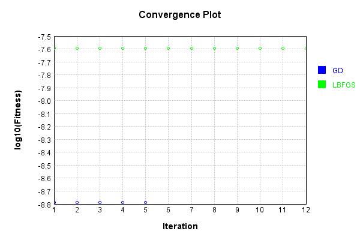


Code from [LearningTester.java:99](../../../../../../../src/main/java/com/simiacryptus/mindseye/test/unit/LearningTester.java#L99) executed in 0.00 seconds: 
```java
    return TestUtil.compareTime(runs);
```

Returns: 

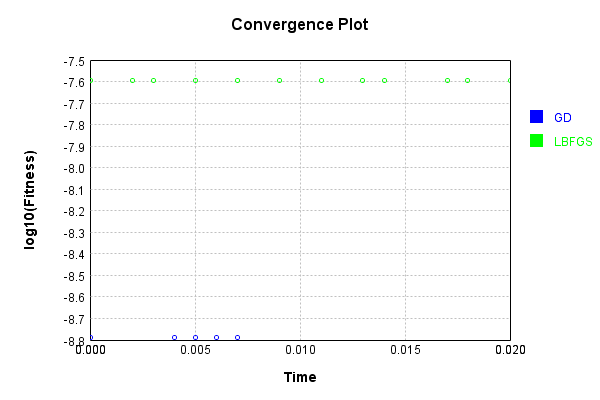


### Composite Learning
In this test, attempt to train a network to emulate a randomized network given an example input/output. The target state is:

Code from [LearningTester.java:219](../../../../../../../src/main/java/com/simiacryptus/mindseye/test/unit/LearningTester.java#L219) executed in 0.00 seconds: 
```java
    return network_target.state().stream().map(Arrays::toString).reduce((a, b) -> a + "\n" + b).orElse("");
```

Returns: 

```
    [0.078, 0.0656, -6.000000000000001E-4, -0.005600000000000001, -0.063, -0.093, 0.0162, 0.0512, -0.09380000000000001, 0.0762, 0.012600000000000002, 0.0024000000000000002, 0.0024000000000000002, -0.0926, 0.027800000000000002, -0.043, 0.0094, -0.038400000000000004, -0.08380000000000001, 0.043800000000000006, 0.0182, 0.07880000000000001, -0.0734, 0.0476, -0.086, 0.0664, 0.056400000000000006, 0.075, -0.0932, 0.08, 0.0562, 0.0976, -0.022600000000000002, -0.042, 0.0992, -0.0902, -0.08660000000000001, 0.08220000000000001, 0.056400000000000006, 0.0064, 0.0506, -0.0432, -0.0036, 0.007, -0.0476, 0.08180000000000001, -0.0956, -0.085, 0.039, 0.010600000000000002, 0.08220000000000001, -0.026400000000000003, -0.046, 0.06340000000000001, 0.08480000000000001, -0.050800000000000005, 0.030400000000000003, 0.0346, 0.045, -0.004600000000000001, -0.065, 0.09540000000000001, 0.07680000000000001, -0.07579999999999999, -0.087, -0.0296, -0.055200000000000006, 0.0656, -0.0952, -0.035, -0.014600000000000002, 0.0062, 0.0722, -0.0314000000
```
...[skipping 35132 bytes](etc/72.txt)...
```
     -0.0402, -0.0442, -0.0516, -0.07440000000000001, -0.0714, 0.0182, 0.04240000000000001, 0.05840000000000001, 0.0028000000000000004, 0.0666, -0.0446, 0.0234, 0.0804, 0.0658, 0.037399999999999996, 0.023, -0.0324, 0.064, 0.004, -0.0586]
    [0.0, 0.0, 0.0, 0.0, 0.0, 0.0, 0.0, 0.0, 0.0, 0.0, 0.0, 0.0, 0.0, 0.0, 0.0, 0.0, 0.0, 0.0, 0.0, 0.0, 0.0, 0.0, 0.0, 0.0, 0.0, 0.0, 0.0, 0.0, 0.0, 0.0, 0.0, 0.0]
    [0.0604, 2.0E-4, 0.0298, -0.0172, 0.0614, -0.0512, 0.09480000000000001, -0.096, -0.025200000000000004, 0.06380000000000001, -0.041800000000000004, -0.020200000000000003, 0.08680000000000002, 0.030600000000000002, -0.026600000000000002, -0.07940000000000001, -0.0718, 0.07660000000000002, 0.0376, -0.0752, -0.095, 0.0198, 0.055, -0.009800000000000001, 0.0976, 0.007600000000000001, -0.045200000000000004, 0.0468, -0.0932, -0.0468, 0.09240000000000001, -0.08180000000000001, 0.096, -0.026600000000000002, 0.09820000000000001, 0.09240000000000001]
    [0.0, 0.0, 0.0, 0.0]
    [1.0]
    [0.0, 0.0, 0.0, 0.0, 0.0, 0.0, 0.0, 0.0, 0.0]
    [1.0]
    [1.0]
```


We simultaneously regress this target input:

Code from [LearningTester.java:223](../../../../../../../src/main/java/com/simiacryptus/mindseye/test/unit/LearningTester.java#L223) executed in 0.00 seconds: 
```java
    return Arrays.stream(testInput).map(x -> x.prettyPrint()).reduce((a, b) -> a + "\n" + b).orElse("");
```

Returns: 

```
    [
    	[ [ -0.0328, -0.034800000000000005, 0.07579999999999999 ], [ 0.0816, 0.027, 0.0054 ], [ 0.013800000000000002, 0.008400000000000001, -0.07940000000000001 ], [ -0.0902, 0.031400000000000004, 0.009 ], [ -0.0442, 0.053, -0.059800000000000006 ] ],
    	[ [ -0.04440000000000001, -0.047, -0.018 ], [ -0.0422, 0.024200000000000003, -0.0694 ], [ -0.034800000000000005, 0.05140000000000001, -0.0012000000000000001 ], [ 0.0216, -0.0596, 0.0206 ], [ -0.0164, -0.055200000000000006, 0.09980000000000001 ] ],
    	[ [ 0.05840000000000001, -0.0852, -0.096 ], [ -0.0586, 0.0984, -0.08660000000000001 ], [ -0.0154, 0.018600000000000002, 0.039400000000000004 ], [ -0.0334, 0.027, -0.0974 ], [ -0.0432, -0.071, 0.0604 ] ],
    	[ [ -0.0506, 0.016, -0.007600000000000001 ], [ 0.042800000000000005, -0.0274, 0.038400000000000004 ], [ -0.06, 0.029200000000000004, -0.012 ], [ -0.0398, -0.025200000000000004, -0.084 ], [ -0.041, 0.058800000000000005, 0.097 ] ],
    	[ [ 0.0102, -0.0632, -0.01 ], [ 0.07479999999999999, 0.052, -0.043 ], [ 0.0426, -0.053200000000000004, 0.0632 ], [ 0.0786, 0.0772, 0.04440000000000001 ], [ -0.08380000000000001, -0.046, 0.067 ] ]
    ]
```


Which produces the following output:

Code from [LearningTester.java:230](../../../../../../../src/main/java/com/simiacryptus/mindseye/test/unit/LearningTester.java#L230) executed in 0.00 seconds: 
```java
    return Stream.of(targetOutput).map(x -> x.prettyPrint()).reduce((a, b) -> a + "\n" + b).orElse("");
```

Returns: 

```
    [
    	[ [ 1.6786826083519996E-4 ], [ 0.0 ] ],
    	[ [ 0.0011361810221280008 ], [ 0.0 ] ]
    ]
```


First, we use a conjugate gradient descent method, which converges the fastest for purely linear functions.

Code from [LearningTester.java:300](../../../../../../../src/main/java/com/simiacryptus/mindseye/test/unit/LearningTester.java#L300) executed in 0.03 seconds: 
```java
    return new IterativeTrainer(trainable)
      .setLineSearchFactory(label -> new QuadraticSearch())
      .setOrientation(new GradientDescent())
      .setMonitor(monitor)
      .setTimeout(30, TimeUnit.SECONDS)
      .setMaxIterations(250)
      .setTerminateThreshold(0)
      .run();
```
Logging: 
```
    Constructing line search parameters: GD
    F(0.0) = LineSearchPoint{point=PointSample{avg=1.7617321565394513E-7}, derivative=-1.7960606243362966E-7}
    New Minimum: 1.7617321565394513E-7 > 1.7617321563598464E-7
    F(1.0E-10) = LineSearchPoint{point=PointSample{avg=1.7617321563598464E-7}, derivative=-1.7960606242447408E-7}, delta = -1.7960486613580184E-17
    New Minimum: 1.7617321563598464E-7 > 1.7617321552822077E-7
    F(7.000000000000001E-10) = LineSearchPoint{point=PointSample{avg=1.7617321552822077E-7}, derivative=-1.7960606236954013E-7}, delta = -1.2572435920712695E-16
    New Minimum: 1.7617321552822077E-7 > 1.7617321477387538E-7
    F(4.900000000000001E-9) = LineSearchPoint{point=PointSample{avg=1.7617321477387538E-7}, derivative=-1.7960606198500348E-7}, delta = -8.800697468262802E-16
    New Minimum: 1.7617321477387538E-7 > 1.761732094934573E-7
    F(3.430000000000001E-8) = LineSearchPoint{point=PointSample{avg=1.761732094934573E-7}, derivative=-1.7960605929324636E-7}, delta = -6.1604878307372675E-15
    New Minimum: 1.76173209
```
...[skipping 11565 bytes](etc/73.txt)...
```
     -1.4399805797573022E-37
    Left bracket at 1.5576158034400593
    New Minimum: 1.1754943508222875E-38 > 2.9387358770557188E-39
    F(1.7633087439670896) = LineSearchPoint{point=PointSample{avg=2.9387358770557188E-39}, derivative=2.1168954103508014E-38}, delta = -1.5281426560689738E-37
    Right bracket at 1.7633087439670896
    F(1.6947444304580792) = LineSearchPoint{point=PointSample{avg=2.9387358770557188E-39}, derivative=2.1168954103508014E-38}, delta = -1.5281426560689738E-37
    Right bracket at 1.6947444304580792
    New Minimum: 2.9387358770557188E-39 > 0.0
    F(1.6490348881187393) = LineSearchPoint{point=PointSample{avg=0.0}, derivative=0.0}, delta = -1.557530014839531E-37
    Right bracket at 1.6490348881187393
    F(1.6033253457793992) = LineSearchPoint{point=PointSample{avg=2.9387358770557188E-39}, derivative=-2.1168954103508014E-38}, delta = -1.5281426560689738E-37
    Left bracket at 1.6033253457793992
    Converged to right
    Iteration 8 complete. Error: 0.0 Total: 250039883598752.1200; Orientation: 0.0001; Line Search: 0.0042
    
```

Returns: 

```
    0.0
```


Training Converged

Next, we run the same optimization using L-BFGS, which is nearly ideal for purely second-order or quadratic functions.

Code from [LearningTester.java:324](../../../../../../../src/main/java/com/simiacryptus/mindseye/test/unit/LearningTester.java#L324) executed in 0.04 seconds: 
```java
    return new IterativeTrainer(trainable)
      .setLineSearchFactory(label -> new ArmijoWolfeSearch())
      .setOrientation(new LBFGS())
      .setMonitor(monitor)
      .setTimeout(30, TimeUnit.SECONDS)
      .setMaxIterations(250)
      .setTerminateThreshold(0)
      .run();
```
Logging: 
```
    LBFGS Accumulation History: 1 points
    Constructing line search parameters: GD
    th(0)=1.7617321565394513E-7;dx=-1.7960606243362964E-7
    New Minimum: 1.7617321565394513E-7 > 1.364872499419842E-9
    WOLF (strong): th(2.154434690031884)=1.364872499419842E-9; dx=1.3737629314982709E-8 delta=1.748083431545253E-7
    END: th(1.077217345015942)=3.5819300835155224E-8; dx=-8.098002584509799E-8 delta=1.403539148187899E-7
    Iteration 1 complete. Error: 1.364872499419842E-9 Total: 250039889485551.1200; Orientation: 0.0005; Line Search: 0.0015
    LBFGS Accumulation History: 1 points
    th(0)=3.5819300835155224E-8;dx=-3.651393904974949E-8
    New Minimum: 3.5819300835155224E-8 > 9.298330383747873E-10
    WOLF (strong): th(2.3207944168063896)=9.298330383747873E-10; dx=5.096804153139681E-9 delta=3.488946779678044E-8
    END: th(1.1603972084031948)=5.9791665326696996E-9; dx=-1.491695970977332E-8 delta=2.984013430248552E-8
    Iteration 2 complete. Error: 9.298330383747873E-10 Total: 250039891683589.1200; Orientation: 0.0003; Line Search: 0.0016
    LBFG
```
...[skipping 9048 bytes](etc/74.txt)...
```
    9925492855.0600; Orientation: 0.0003; Line Search: 0.0013
    LBFGS Accumulation History: 1 points
    th(0)=8.939634538003496E-36;dx=-8.997852298685142E-36
    New Minimum: 8.939634538003496E-36 > 5.877471754111438E-38
    WOLF (strong): th(3.9347236070529372)=5.877471754111438E-38; dx=5.049198954593866E-38 delta=8.880859820462382E-36
    New Minimum: 5.877471754111438E-38 > 1.1754943508222875E-38
    END: th(1.9673618035264686)=1.1754943508222875E-38; dx=-5.8451832421792294E-39 delta=8.927879594495274E-36
    Iteration 20 complete. Error: 1.1754943508222875E-38 Total: 250039927850197.0600; Orientation: 0.0003; Line Search: 0.0019
    LBFGS Accumulation History: 1 points
    th(0)=1.1754943508222875E-38;dx=-1.2083209119041307E-38
    Armijo: th(4.238552517361115)=1.1754943508222875E-38; dx=1.2083209119041307E-38 delta=0.0
    New Minimum: 1.1754943508222875E-38 > 0.0
    END: th(2.1192762586805576)=0.0; dx=0.0 delta=1.1754943508222875E-38
    Iteration 21 complete. Error: 0.0 Total: 250039929584290.0600; Orientation: 0.0002; Line Search: 0.0013
    
```

Returns: 

```
    0.0
```


Training Converged

Code from [LearningTester.java:96](../../../../../../../src/main/java/com/simiacryptus/mindseye/test/unit/LearningTester.java#L96) executed in 0.00 seconds: 
```java
    return TestUtil.compare(runs);
```

Returns: 

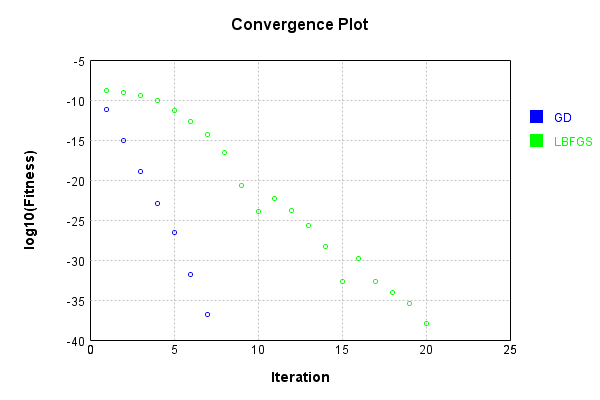


Code from [LearningTester.java:99](../../../../../../../src/main/java/com/simiacryptus/mindseye/test/unit/LearningTester.java#L99) executed in 0.00 seconds: 
```java
    return TestUtil.compareTime(runs);
```

Returns: 

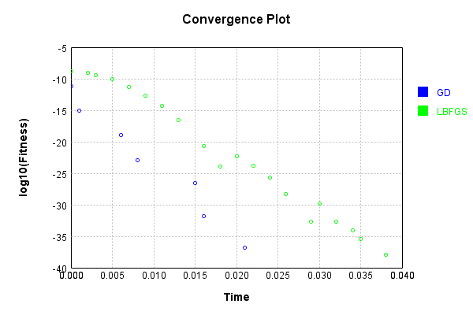


This is a network with the following layout:

Code from [NLayerTest.java:87](../../../../../../../src/test/java/com/simiacryptus/mindseye/network/NLayerTest.java#L87) executed in 0.25 seconds: 
```java
    return Graphviz.fromGraph(TestUtil.toGraph((DAGNetwork) layer))
      .height(400).width(600).render(Format.PNG).toImage();
```

Returns: 

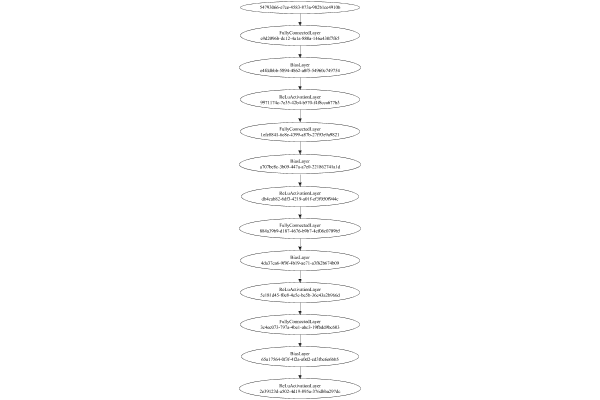


### Json Serialization
Code from [JsonTest.java:36](../../../../../../../src/main/java/com/simiacryptus/mindseye/test/unit/JsonTest.java#L36) executed in 0.00 seconds: 
```java
    JsonObject json = layer.getJson();
    NNLayer echo = NNLayer.fromJson(json);
    if ((echo == null)) throw new AssertionError("Failed to deserialize");
    if ((layer == echo)) throw new AssertionError("Serialization did not copy");
    if ((!layer.equals(echo))) throw new AssertionError("Serialization not equal");
    return new GsonBuilder().setPrettyPrinting().create().toJson(json);
```

Returns: 

```
    {
      "class": "com.simiacryptus.mindseye.network.PipelineNetwork",
      "id": "97306fa8-3e70-4728-ade2-b64f49b7c85f",
      "isFrozen": false,
      "name": "PipelineNetwork/97306fa8-3e70-4728-ade2-b64f49b7c85f",
      "inputs": [
        "54793066-e7ce-4583-873a-982b1ce4910b"
      ],
      "nodes": {
        "d4b1a654-6b94-4210-8957-e3741a07e158": "e9d2096b-dc12-4a1a-880a-146a430f7f65",
        "6e317756-0d79-48c5-b316-38cd7b938207": "e4fddbbb-5894-4862-a0f5-54960c749754",
        "74624bff-5afb-4f9d-8759-974f9cb9edf2": "9971174c-7e35-42b4-b570-f4f8cca677b3",
        "36e6eed9-e927-4cdf-92df-a81f43c204c9": "1efe8841-6c8e-4399-a87b-27f93e9a9821",
        "b25ea433-252d-4e9f-977f-062dcf5df0f7": "a707be8c-3b09-447a-a7e0-221862741a1d",
        "3e387eb1-14ca-408a-bac4-270c1b082e26": "db4cab82-6df3-4219-a01f-ef3f050f944c",
        "772438b1-5b5d-4b14-8ce7-5026e841cbe5": "884a39b9-d187-4676-b9b7-4ef06c0709b5",
        "1f641b1a-d1f1-47dd-a1f5-7a2f23a1557d": "4da37ca6-9f9f-4b19-ae71-a3f62b674b09",
        "fa37e804-cb05-4bc7-bd44-bbbdf19fec06": "5e181d45-f0e8-4e5e-be5b-36c43a2
```
...[skipping 71149 bytes](etc/75.txt)...
```
    59-974f9cb9edf2": [
          "6e317756-0d79-48c5-b316-38cd7b938207"
        ],
        "36e6eed9-e927-4cdf-92df-a81f43c204c9": [
          "74624bff-5afb-4f9d-8759-974f9cb9edf2"
        ],
        "b25ea433-252d-4e9f-977f-062dcf5df0f7": [
          "36e6eed9-e927-4cdf-92df-a81f43c204c9"
        ],
        "3e387eb1-14ca-408a-bac4-270c1b082e26": [
          "b25ea433-252d-4e9f-977f-062dcf5df0f7"
        ],
        "772438b1-5b5d-4b14-8ce7-5026e841cbe5": [
          "3e387eb1-14ca-408a-bac4-270c1b082e26"
        ],
        "1f641b1a-d1f1-47dd-a1f5-7a2f23a1557d": [
          "772438b1-5b5d-4b14-8ce7-5026e841cbe5"
        ],
        "fa37e804-cb05-4bc7-bd44-bbbdf19fec06": [
          "1f641b1a-d1f1-47dd-a1f5-7a2f23a1557d"
        ],
        "53e9ef5c-bd78-4fb2-b768-aa55fdea30ce": [
          "fa37e804-cb05-4bc7-bd44-bbbdf19fec06"
        ],
        "d7ba48c3-927c-40bf-a0f8-4607f98d286f": [
          "53e9ef5c-bd78-4fb2-b768-aa55fdea30ce"
        ],
        "b6348a7d-1e49-47b8-b1da-953c1648579e": [
          "d7ba48c3-927c-40bf-a0f8-4607f98d286f"
        ]
      },
      "labels": {},
      "head": "b6348a7d-1e49-47b8-b1da-953c1648579e"
    }
```


### Input Learning
In this test, we use a network to learn this target input, given it's pre-evaluated output:

Code from [LearningTester.java:127](../../../../../../../src/main/java/com/simiacryptus/mindseye/test/unit/LearningTester.java#L127) executed in 0.00 seconds: 
```java
    return Arrays.stream(input_target).map(x -> x.prettyPrint()).reduce((a, b) -> a + "\n" + b).orElse("");
```

Returns: 

```
    [
    	[ [ 0.06380000000000001, 0.0582, -0.032600000000000004 ], [ 0.009200000000000002, -0.0688, -0.0482 ], [ 0.05140000000000001, 0.09960000000000001, 0.07479999999999999 ], [ 0.0442, 0.012600000000000002, 0.07880000000000001 ], [ 0.062, -0.0062, 0.0488 ] ],
    	[ [ -0.037399999999999996, 0.0034000000000000002, -0.0558 ], [ -0.019200000000000002, -0.038400000000000004, 0.039200000000000006 ], [ -0.0134, -0.0172, 0.0364 ], [ -0.0614, 0.014, -0.0976 ], [ 0.0946, 0.084, -0.011600000000000001 ] ],
    	[ [ -0.044800000000000006, 0.033800000000000004, -0.014600000000000002 ], [ 0.021400000000000002, 0.0386, -0.04580000000000001 ], [ -0.066, -0.0606, 0.0922 ], [ -0.034, -0.073, 0.0208 ], [ 0.0018, 0.082, -0.01 ] ],
    	[ [ 0.0932, 0.06760000000000001, 0.0558 ], [ -0.04, -0.07640000000000001, 0.05240000000000001 ], [ 0.0128, 0.0034000000000000002, 0.0356 ], [ 0.058800000000000005, -0.08760000000000001, -0.0422 ], [ -0.08080000000000001, -0.062, 0.08080000000000001 ] ],
    	[ [ 4.0E-4, -0.015200000000000002, 0.06620000000000001 ], [ 0.06520000000000001, 0.050800000000000005, -0.09480000000000001 ], [ -0.0852, -0.073, -0.032600000000000004 ], [ 0.08940000000000001, 0.0376, 0.0408 ], [ -0.0074, 0.0044, -0.09620000000000001 ] ]
    ]
```


First, we use a conjugate gradient descent method, which converges the fastest for purely linear functions.

Code from [LearningTester.java:300](../../../../../../../src/main/java/com/simiacryptus/mindseye/test/unit/LearningTester.java#L300) executed in 0.45 seconds: 
```java
    return new IterativeTrainer(trainable)
      .setLineSearchFactory(label -> new QuadraticSearch())
      .setOrientation(new GradientDescent())
      .setMonitor(monitor)
      .setTimeout(30, TimeUnit.SECONDS)
      .setMaxIterations(250)
      .setTerminateThreshold(0)
      .run();
```
Logging: 
```
    Low gradient: 3.4237630755673436E-8
    Constructing line search parameters: GD
    F(0.0) = LineSearchPoint{point=PointSample{avg=1.3019063726415637E-10}, derivative=-1.1722153597618358E-15}
    F(1.0E-10) = LineSearchPoint{point=PointSample{avg=1.3019063726415637E-10}, derivative=-1.1722153597618358E-15}, delta = 0.0
    New Minimum: 1.3019063726415637E-10 > 1.3019063726415627E-10
    F(7.000000000000001E-10) = LineSearchPoint{point=PointSample{avg=1.3019063726415627E-10}, derivative=-1.1722153597618352E-15}, delta = -1.0339757656912846E-25
    New Minimum: 1.3019063726415627E-10 > 1.3019063726415043E-10
    F(4.900000000000001E-9) = LineSearchPoint{point=PointSample{avg=1.3019063726415043E-10}, derivative=-1.1722153597618088E-15}, delta = -5.9453606527248864E-24
    New Minimum: 1.3019063726415043E-10 > 1.3019063726411656E-10
    F(3.430000000000001E-8) = LineSearchPoint{point=PointSample{avg=1.3019063726411656E-10}, derivative=-1.1722153597616563E-15}, delta = -3.9808066979114457E-23
    New Minimum: 1.3019063726411656E-10 > 1.3019063
```
...[skipping 440828 bytes](etc/76.txt)...
```
    rchPoint{point=PointSample{avg=9.160496446744091E-17}, derivative=-1.3158287506923715E-24}, delta = -1.773265190670497E-18
    F(6782503.115813188) = LineSearchPoint{point=PointSample{avg=1.0189483572469733E-16}, derivative=4.8557754621877265E-24}, delta = 8.516606066585928E-18
    F(521731.0089087068) = LineSearchPoint{point=PointSample{avg=9.229955158268858E-17}, derivative=-1.7905675363509558E-24}, delta = -1.0786780754228296E-18
    F(3652117.0623609475) = LineSearchPoint{point=PointSample{avg=9.189578879661318E-17}, derivative=1.532603962969972E-24}, delta = -1.4824408614982248E-18
    9.189578879661318E-17 <= 9.33782296581114E-17
    New Minimum: 9.087826780597827E-17 > 9.078948338117817E-17
    F(2208423.267991515) = LineSearchPoint{point=PointSample{avg=9.078948338117817E-17}, derivative=-3.7953842728796726E-35}, delta = -2.58874627693324E-18
    Left bracket at 2208423.267991515
    Converged to left
    Iteration 250 complete. Error: 9.078948338117817E-17 Total: 250040841772758.1600; Orientation: 0.0000; Line Search: 0.0009
    
```

Returns: 

```
    9.078948338117817E-17
```


Training Converged

Next, we run the same optimization using L-BFGS, which is nearly ideal for purely second-order or quadratic functions.

Code from [LearningTester.java:324](../../../../../../../src/main/java/com/simiacryptus/mindseye/test/unit/LearningTester.java#L324) executed in 0.43 seconds: 
```java
    return new IterativeTrainer(trainable)
      .setLineSearchFactory(label -> new ArmijoWolfeSearch())
      .setOrientation(new LBFGS())
      .setMonitor(monitor)
      .setTimeout(30, TimeUnit.SECONDS)
      .setMaxIterations(250)
      .setTerminateThreshold(0)
      .run();
```
Logging: 
```
    LBFGS Accumulation History: 1 points
    Constructing line search parameters: GD
    th(0)=1.3019063726415637E-10;dx=-1.1722153597618358E-15
    New Minimum: 1.3019063726415637E-10 > 1.3018811181496982E-10
    WOLFE (weak): th(2.154434690031884)=1.3018811181496982E-10; dx=-1.1722039903394812E-15 delta=2.5254491865540885E-15
    New Minimum: 1.3018811181496982E-10 > 1.3018558639027505E-10
    WOLFE (weak): th(4.308869380063768)=1.3018558639027505E-10; dx=-1.1721926209171139E-15 delta=5.050873881324215E-15
    New Minimum: 1.3018558639027505E-10 > 1.301754849364495E-10
    WOLFE (weak): th(12.926608140191302)=1.301754849364495E-10; dx=-1.1721471432276743E-15 delta=1.515232770686709E-14
    New Minimum: 1.301754849364495E-10 > 1.301300332441767E-10
    WOLFE (weak): th(51.70643256076521)=1.301300332441767E-10; dx=-1.1719424936251787E-15 delta=6.060401997967917E-14
    New Minimum: 1.301300332441767E-10 > 1.2988775825360576E-10
    WOLFE (weak): th(258.53216280382605)=1.2988775825360576E-10; dx=-1.1708510290785636E-15 delta=3.0287901055061384E-13
```
...[skipping 334464 bytes](etc/77.txt)...
```
    32311302E-12
    WOLFE (weak): th(4.308869380063768)=4.755530632311302E-12; dx=-3.96618052910665E-17 delta=1.7089911787014166E-16
    New Minimum: 4.755530632311302E-12 > 4.755188843552513E-12
    WOLFE (weak): th(12.926608140191302)=4.755188843552513E-12; dx=-3.9660339045026386E-17 delta=5.126878766586925E-16
    New Minimum: 4.755188843552513E-12 > 4.753650950504685E-12
    WOLFE (weak): th(51.70643256076521)=4.753650950504685E-12; dx=-3.965374093784419E-17 delta=2.0505809244867672E-15
    New Minimum: 4.753650950504685E-12 > 4.745453175667121E-12
    WOLFE (weak): th(258.53216280382605)=4.745453175667121E-12; dx=-3.96185510328701E-17 delta=1.0248355762051026E-14
    New Minimum: 4.745453175667121E-12 > 4.694381979148937E-12
    WOLFE (weak): th(1551.1929768229563)=4.694381979148937E-12; dx=-3.93986141267863E-17 delta=6.131955228023496E-14
    MAX ALPHA: th(0)=4.755701531429172E-12;th'(0)=-3.9662538414086903E-17;
    Iteration 250 complete. Error: 4.694381979148937E-12 Total: 250041277445155.7200; Orientation: 0.0000; Line Search: 0.0008
    
```

Returns: 

```
    4.694381979148937E-12
```


Training Converged

Code from [LearningTester.java:96](../../../../../../../src/main/java/com/simiacryptus/mindseye/test/unit/LearningTester.java#L96) executed in 0.00 seconds: 
```java
    return TestUtil.compare(runs);
```

Returns: 

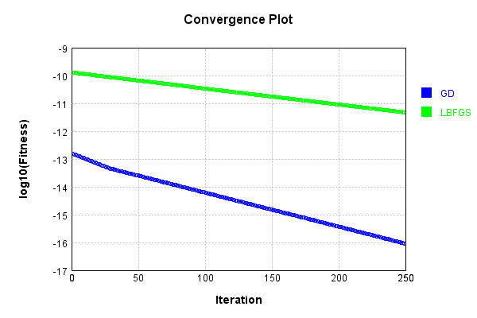


Code from [LearningTester.java:99](../../../../../../../src/main/java/com/simiacryptus/mindseye/test/unit/LearningTester.java#L99) executed in 0.00 seconds: 
```java
    return TestUtil.compareTime(runs);
```

Returns: 

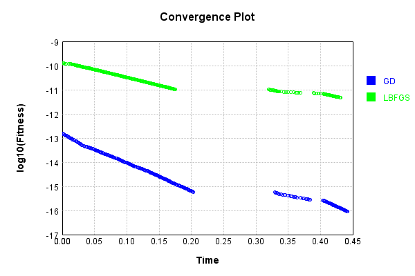


### Model Learning
In this test, attempt to train a network to emulate a randomized network given an example input/output. The target state is:

Code from [LearningTester.java:176](../../../../../../../src/main/java/com/simiacryptus/mindseye/test/unit/LearningTester.java#L176) executed in 0.00 seconds: 
```java
    return network_target.state().stream().map(Arrays::toString).reduce((a, b) -> a + "\n" + b).orElse("");
```

Returns: 

```
    [0.07260000000000001, 0.018600000000000002, -0.0734, -0.082, -0.0476, 0.0832, -0.0936, 0.008, -0.0586, 0.09620000000000001, -0.09680000000000001, 0.06720000000000001, -0.0032, -0.049800000000000004, -0.0026, -0.07460000000000001, 0.008400000000000001, 0.0388, -0.045, 0.0946, -0.0048000000000000004, -0.087, 0.06860000000000001, -0.0974, -0.05040000000000001, 0.083, -0.066, 0.032600000000000004, 0.0842, 0.0176, 0.0874, 0.099, 0.067, -0.0964, 0.058, -0.056, -0.056, -0.0922, 0.07479999999999999, -0.06340000000000001, 0.06760000000000001, 0.036, -0.013600000000000001, 0.0258, 0.028, 0.078, -0.081, 0.036, 0.089, 0.031200000000000002, -0.084, 0.057, -0.004, -0.038, -0.009, -0.020200000000000003, -0.083, 0.013200000000000002, 0.0316, -0.08360000000000001, -0.026200000000000005, 0.08940000000000001, -0.0176, 0.0862, -0.0248, -0.0572, 0.0068000000000000005, -0.08680000000000002, -0.0176, 0.0122, 0.0258, 0.08880000000000002, -0.008400000000000001, 0.091, 0.050800000000000005, -0.0328, 0.049, -0.0964, 0.02360000000000000
```
...[skipping 35715 bytes](etc/78.txt)...
```
    .098, -0.06860000000000001, -0.0966, -0.08780000000000002, 0.0164, 0.0412, 0.040400000000000005, 0.0436, 0.07640000000000001, -0.0256, 0.05280000000000001, -0.007600000000000001, 0.018400000000000003, 0.049400000000000006, -0.041800000000000004, 0.07740000000000001, 0.0864, -0.040600000000000004, 0.004600000000000001, -0.0992, 0.08080000000000001, 0.0144, -0.016, 0.06380000000000001, 0.0124, -0.0824, -0.012, -0.06960000000000001, -0.0842, 0.091, 0.0974, 0.0546, 0.0164, -0.0322, 0.03780000000000001, 0.094, 0.072, 0.08780000000000002, -0.036800000000000006, -0.0704, -0.08680000000000002, -0.0854, 0.040400000000000005, 0.057, -0.0356, -0.08220000000000001, -0.07660000000000002, -0.07460000000000001, -0.0842, -0.09280000000000001, 0.0352, 0.019, 0.0072, 0.007, -0.059800000000000006, -0.0592, -0.0052, -0.097, -0.09480000000000001, -0.051800000000000006, 0.07379999999999999, 0.0082, -0.0188, 0.07740000000000001, -0.0194, 0.0772, 0.09820000000000001, -0.051, 0.044800000000000006, 0.0052, 0.06760000000000001, 0.0974]
```


First, we use a conjugate gradient descent method, which converges the fastest for purely linear functions.

Code from [LearningTester.java:300](../../../../../../../src/main/java/com/simiacryptus/mindseye/test/unit/LearningTester.java#L300) executed in 0.02 seconds: 
```java
    return new IterativeTrainer(trainable)
      .setLineSearchFactory(label -> new QuadraticSearch())
      .setOrientation(new GradientDescent())
      .setMonitor(monitor)
      .setTimeout(30, TimeUnit.SECONDS)
      .setMaxIterations(250)
      .setTerminateThreshold(0)
      .run();
```
Logging: 
```
    Low gradient: 6.6954791778047625E-6
    Constructing line search parameters: GD
    F(0.0) = LineSearchPoint{point=PointSample{avg=4.63926163142561E-11}, derivative=-4.482944142041714E-11}
    New Minimum: 4.63926163142561E-11 > 4.6392616309773206E-11
    F(1.0E-10) = LineSearchPoint{point=PointSample{avg=4.6392616309773206E-11}, derivative=-4.482944141815413E-11}, delta = -4.482892405034062E-21
    New Minimum: 4.6392616309773206E-11 > 4.639261628287556E-11
    F(7.000000000000001E-10) = LineSearchPoint{point=PointSample{avg=4.639261628287556E-11}, derivative=-4.482944140457599E-11}, delta = -3.138053764092254E-20
    New Minimum: 4.639261628287556E-11 > 4.639261609459222E-11
    F(4.900000000000001E-9) = LineSearchPoint{point=PointSample{avg=4.639261609459222E-11}, derivative=-4.482944130952905E-11}, delta = -2.196638798087314E-19
    New Minimum: 4.639261609459222E-11 > 4.6392614776606283E-11
    F(3.430000000000001E-8) = LineSearchPoint{point=PointSample{avg=4.6392614776606283E-11}, derivative=-4.4829440644199177E-11}, delta = -1.5376
```
...[skipping 7554 bytes](etc/79.txt)...
```
    Sample{avg=1.9894167916307792E-12}, derivative=4.924947816878933E-25}, delta = -5.827018895167251E-24
    1.9894167916307792E-12 <= 1.9894167916366062E-12
    New Minimum: 1.9894167916307384E-12 > 1.989416791630738E-12
    F(1.9961597883931723) = LineSearchPoint{point=PointSample{avg=1.989416791630738E-12}, derivative=-2.2379675571339795E-32}, delta = -5.868216367081513E-24
    Left bracket at 1.9961597883931723
    Converged to left
    Iteration 4 complete. Error: 1.989416791630738E-12 Total: 250041422185964.6000; Orientation: 0.0001; Line Search: 0.0037
    Zero gradient: 1.078290439985685E-14
    F(0.0) = LineSearchPoint{point=PointSample{avg=1.989416791630738E-12}, derivative=-1.1627102729645223E-28}
    F(1.9961597883931723) = LineSearchPoint{point=PointSample{avg=1.989416791630738E-12}, derivative=9.749479022082476E-31}, delta = 0.0
    1.989416791630738E-12 <= 1.989416791630738E-12
    Converged to right
    Iteration 5 failed, aborting. Error: 1.989416791630738E-12 Total: 250041423121263.5600; Orientation: 0.0001; Line Search: 0.0006
    
```

Returns: 

```
    1.989416791630738E-12
```


Training Converged

Next, we run the same optimization using L-BFGS, which is nearly ideal for purely second-order or quadratic functions.

Code from [LearningTester.java:324](../../../../../../../src/main/java/com/simiacryptus/mindseye/test/unit/LearningTester.java#L324) executed in 0.06 seconds: 
```java
    return new IterativeTrainer(trainable)
      .setLineSearchFactory(label -> new ArmijoWolfeSearch())
      .setOrientation(new LBFGS())
      .setMonitor(monitor)
      .setTimeout(30, TimeUnit.SECONDS)
      .setMaxIterations(250)
      .setTerminateThreshold(0)
      .run();
```
Logging: 
```
    LBFGS Accumulation History: 1 points
    Constructing line search parameters: GD
    th(0)=1.5114836238224037E-9;dx=-1.5254719801681425E-9
    New Minimum: 1.5114836238224037E-9 > 1.926923254377447E-13
    WOLF (strong): th(2.154434690031884)=1.926923254377447E-13; dx=2.004314585980713E-12 delta=1.511290931496966E-9
    END: th(1.077217345015942)=3.148540647793788E-10; dx=-6.962329823028296E-10 delta=1.196629559043025E-9
    Iteration 1 complete. Error: 1.926923254377447E-13 Total: 250041430935086.5600; Orientation: 0.0006; Line Search: 0.0015
    LBFGS Accumulation History: 1 points
    th(0)=3.148540647793788E-10;dx=-3.17765578655361E-10
    New Minimum: 3.148540647793788E-10 > 1.3749391388804397E-13
    WOLF (strong): th(2.3207944168063896)=1.3749391388804397E-13; dx=7.699587049300597E-13 delta=3.1471657086549076E-10
    END: th(1.1603972084031948)=5.407884532426287E-11; dx=-1.316929649256377E-10 delta=2.6077521945511593E-10
    Iteration 2 complete. Error: 1.3749391388804397E-13 Total: 250041433149653.5600; Orientation: 0.0003; Line Search:
```
...[skipping 12594 bytes](etc/80.txt)...
```
    84905146642655E-44 delta=0.0
    Armijo: th(1.0635484481401995E-10)=4.4841550858394146E-44; dx=-4.484905146642655E-44 delta=0.0
    Armijo: th(7.343548808587092E-11)=4.4841550858394146E-44; dx=-4.484905146642655E-44 delta=0.0
    Armijo: th(5.6975809721796404E-11)=4.4841550858394146E-44; dx=-4.484905146642655E-44 delta=0.0
    WOLFE (weak): th(4.8745970539759144E-11)=4.4841550858394146E-44; dx=-4.484905146642655E-44 delta=0.0
    WOLFE (weak): th(5.2860890130777774E-11)=4.4841550858394146E-44; dx=-4.484905146642655E-44 delta=0.0
    WOLFE (weak): th(5.4918349926287086E-11)=4.4841550858394146E-44; dx=-4.484905146642655E-44 delta=0.0
    Armijo: th(5.5947079824041745E-11)=4.4841550858394146E-44; dx=-4.484905146642655E-44 delta=0.0
    WOLFE (weak): th(5.5432714875164415E-11)=4.4841550858394146E-44; dx=-4.484905146642655E-44 delta=0.0
    mu /= nu: th(0)=4.4841550858394146E-44;th'(0)=-4.484905146642655E-44;
    Iteration 24 failed, aborting. Error: 4.4841550858394146E-44 Total: 250041489295525.5300; Orientation: 0.0003; Line Search: 0.0129
    
```

Returns: 

```
    4.4841550858394146E-44
```


Training Converged

Code from [LearningTester.java:96](../../../../../../../src/main/java/com/simiacryptus/mindseye/test/unit/LearningTester.java#L96) executed in 0.00 seconds: 
```java
    return TestUtil.compare(runs);
```

Returns: 

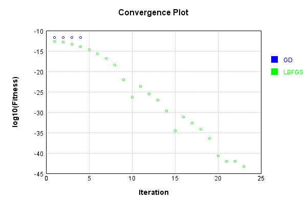


Code from [LearningTester.java:99](../../../../../../../src/main/java/com/simiacryptus/mindseye/test/unit/LearningTester.java#L99) executed in 0.01 seconds: 
```java
    return TestUtil.compareTime(runs);
```

Returns: 

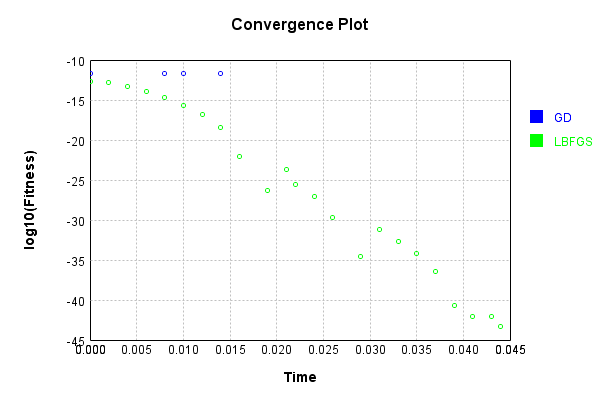


### Composite Learning
In this test, attempt to train a network to emulate a randomized network given an example input/output. The target state is:

Code from [LearningTester.java:219](../../../../../../../src/main/java/com/simiacryptus/mindseye/test/unit/LearningTester.java#L219) executed in 0.00 seconds: 
```java
    return network_target.state().stream().map(Arrays::toString).reduce((a, b) -> a + "\n" + b).orElse("");
```

Returns: 

```
    [-0.0208, -0.020200000000000003, 0.0536, 0.024, 0.044800000000000006, -0.0176, 0.0166, 0.05280000000000001, -0.0912, 0.015200000000000002, -0.0884, 0.06380000000000001, -0.004, -0.09160000000000001, 0.0258, -0.0234, 8.0E-4, 0.0994, -0.0964, 0.08940000000000001, 0.01, 0.044, -0.018600000000000002, 0.0872, 0.057, -0.07540000000000001, -0.0898, -0.09, -0.0124, 0.023600000000000003, 0.06860000000000001, -0.0804, -0.004, -0.0902, 0.07560000000000001, 0.0068000000000000005, -0.0328, -0.036, -0.008400000000000001, -0.0956, 0.06960000000000001, -0.011600000000000001, 0.0678, -0.054, -0.0028000000000000004, 0.018600000000000002, 0.049800000000000004, 0.011200000000000002, -0.009, 0.08780000000000002, -0.0296, -0.0014000000000000002, 0.0674, 0.062, 0.099, 0.0728, -0.07980000000000001, -0.066, 0.045200000000000004, -0.027800000000000002, 0.0356, -0.0036, -0.037, 0.04, 0.05240000000000001, 8.0E-4, -0.0256, -0.09980000000000001, 0.0842, -0.043800000000000006, -0.0386, -0.0734, -0.092, 0.0548, -0.06720000000000001, 0.0362,
```
...[skipping 35715 bytes](etc/81.txt)...
```
    0000000002, -0.055600000000000004, -0.028200000000000003, -0.07479999999999999, 0.0572, 0.0128, -0.018400000000000003, -0.0158, -0.07479999999999999, -0.08, 0.056400000000000006, -0.07, 0.0036, 0.032600000000000004, 0.0298, -0.019600000000000003, 0.0606, 0.08480000000000001, 0.0204, 0.035800000000000005, 0.07980000000000001, -0.0534, 0.09680000000000001, -0.015200000000000002, 0.08080000000000001, -0.044, -0.07640000000000001, 0.06720000000000001, 0.07840000000000001, -0.06860000000000001, 0.0752, 0.08780000000000002, -0.0844, -0.0688, -0.029, -0.09480000000000001, 0.09440000000000001, -0.09060000000000001, -0.07460000000000001, 0.05380000000000001, 0.0656, 0.050800000000000005, 0.047400000000000005, -0.0854, -0.09540000000000001, 0.057800000000000004, 0.0912, -0.025, 0.053, -0.031200000000000002, 0.025400000000000002, 0.06420000000000001, -0.016, 0.0354, -0.05740000000000001, -0.045200000000000004, 0.0636, -0.034, 0.0534, 0.07560000000000001, -0.025200000000000004, 0.08760000000000001, 0.0068000000000000005]
```


We simultaneously regress this target input:

Code from [LearningTester.java:223](../../../../../../../src/main/java/com/simiacryptus/mindseye/test/unit/LearningTester.java#L223) executed in 0.00 seconds: 
```java
    return Arrays.stream(testInput).map(x -> x.prettyPrint()).reduce((a, b) -> a + "\n" + b).orElse("");
```

Returns: 

```
    [
    	[ [ 0.0044, -0.032600000000000004, 0.06760000000000001 ], [ -0.0482, -0.09620000000000001, 0.0922 ], [ 0.0128, -0.0852, -0.044800000000000006 ], [ 0.021400000000000002, -0.066, -0.032600000000000004 ], [ 0.0208, -0.0614, 0.0582 ] ],
    	[ [ -0.04580000000000001, -0.07640000000000001, -0.01 ], [ 0.0364, 0.039200000000000006, 0.050800000000000005 ], [ 0.0386, -0.0688, -0.0976 ], [ 0.07479999999999999, 0.0408, -0.0172 ], [ -0.0422, -0.073, 0.062 ] ],
    	[ [ 0.014, -0.0134, -0.062 ], [ 0.0034000000000000002, 0.08080000000000001, 0.09960000000000001 ], [ 0.012600000000000002, 0.0932, 0.0018 ], [ 4.0E-4, 0.07880000000000001, 0.06380000000000001 ], [ -0.08080000000000001, 0.0442, 0.0488 ] ],
    	[ [ -0.038400000000000004, 0.0034000000000000002, 0.082 ], [ 0.08940000000000001, 0.009200000000000002, 0.033800000000000004 ], [ 0.0356, 0.0558, -0.09480000000000001 ], [ -0.08760000000000001, -0.0606, 0.06620000000000001 ], [ -0.019200000000000002, 0.084, -0.011600000000000001 ] ],
    	[ [ -0.014600000000000002, -0.0074, 0.06520000000000001 ], [ 0.058800000000000005, 0.0376, 0.05140000000000001 ], [ -0.0062, 0.0946, -0.015200000000000002 ], [ -0.034, -0.04, -0.0558 ], [ 0.05240000000000001, -0.037399999999999996, -0.073 ] ]
    ]
```


Which produces the following output:

Code from [LearningTester.java:230](../../../../../../../src/main/java/com/simiacryptus/mindseye/test/unit/LearningTester.java#L230) executed in 0.00 seconds: 
```java
    return Stream.of(targetOutput).map(x -> x.prettyPrint()).reduce((a, b) -> a + "\n" + b).orElse("");
```

Returns: 

```
    [
    	[ [ 2.6549792287018567E-5 ], [ 5.032313570742081E-5 ] ],
    	[ [ 5.257900041154657E-5 ], [ 0.0 ] ]
    ]
```


First, we use a conjugate gradient descent method, which converges the fastest for purely linear functions.

Code from [LearningTester.java:300](../../../../../../../src/main/java/com/simiacryptus/mindseye/test/unit/LearningTester.java#L300) executed in 0.01 seconds: 
```java
    return new IterativeTrainer(trainable)
      .setLineSearchFactory(label -> new QuadraticSearch())
      .setOrientation(new GradientDescent())
      .setMonitor(monitor)
      .setTimeout(30, TimeUnit.SECONDS)
      .setMaxIterations(250)
      .setTerminateThreshold(0)
      .run();
```
Logging: 
```
    Constructing line search parameters: GD
    F(0.0) = LineSearchPoint{point=PointSample{avg=1.5004651855471842E-9}, derivative=-1.5004651855471842E-9}
    New Minimum: 1.5004651855471842E-9 > 1.5004651853971375E-9
    F(1.0E-10) = LineSearchPoint{point=PointSample{avg=1.5004651853971375E-9}, derivative=-1.5004651854721607E-9}, delta = -1.500466340092096E-19
    New Minimum: 1.5004651853971375E-9 > 1.5004651844968585E-9
    F(7.000000000000001E-10) = LineSearchPoint{point=PointSample{avg=1.5004651844968585E-9}, derivative=-1.5004651850220212E-9}, delta = -1.0503256108838546E-18
    New Minimum: 1.5004651844968585E-9 > 1.5004651781949047E-9
    F(4.900000000000001E-9) = LineSearchPoint{point=PointSample{avg=1.5004651781949047E-9}, derivative=-1.5004651818710444E-9}, delta = -7.352279482982135E-18
    New Minimum: 1.5004651781949047E-9 > 1.5004651340812288E-9
    F(3.430000000000001E-8) = LineSearchPoint{point=PointSample{avg=1.5004651340812288E-9}, derivative=-1.5004651598142064E-9}, delta = -5.146595534689918E-17
    New Minimum: 1.50046513
```
...[skipping 1192 bytes](etc/82.txt)...
```
    750487E-9}, derivative=-1.4974377264264463E-9}, delta = -6.048809796697067E-12
    New Minimum: 1.494416375750487E-9 > 1.4583800716509954E-9
    F(0.028247524900000005) = LineSearchPoint{point=PointSample{avg=1.4583800716509954E-9}, derivative=-1.4792729717020205E-9}, delta = -4.2085113896188746E-11
    New Minimum: 1.4583800716509954E-9 > 1.2184405676276895E-9
    F(0.19773267430000002) = LineSearchPoint{point=PointSample{avg=1.2184405676276895E-9}, derivative=-1.3521196886310388E-9}, delta = -2.820246179194947E-10
    New Minimum: 1.2184405676276895E-9 > 1.4228064844815008E-10
    F(1.3841287201) = LineSearchPoint{point=PointSample{avg=1.4228064844815008E-10}, derivative=-4.6204670713416757E-10}, delta = -1.358184537099034E-9
    Loops = 12
    New Minimum: 1.4228064844815008E-10 > 0.0
    F(2.0) = LineSearchPoint{point=PointSample{avg=0.0}, derivative=0.0}, delta = -1.5004651855471842E-9
    Right bracket at 2.0
    Converged to right
    Iteration 1 complete. Error: 0.0 Total: 250041708410565.3000; Orientation: 0.0002; Line Search: 0.0067
    
```

Returns: 

```
    0.0
```


Training Converged

Next, we run the same optimization using L-BFGS, which is nearly ideal for purely second-order or quadratic functions.

Code from [LearningTester.java:324](../../../../../../../src/main/java/com/simiacryptus/mindseye/test/unit/LearningTester.java#L324) executed in 0.05 seconds: 
```java
    return new IterativeTrainer(trainable)
      .setLineSearchFactory(label -> new ArmijoWolfeSearch())
      .setOrientation(new LBFGS())
      .setMonitor(monitor)
      .setTimeout(30, TimeUnit.SECONDS)
      .setMaxIterations(250)
      .setTerminateThreshold(0)
      .run();
```
Logging: 
```
    LBFGS Accumulation History: 1 points
    Constructing line search parameters: GD
    th(0)=1.5004651855471842E-9;dx=-1.5004651855471842E-9
    New Minimum: 1.5004651855471842E-9 > 8.946551234337668E-12
    WOLF (strong): th(2.154434690031884)=8.946551234337668E-12; dx=1.158619379168062E-10 delta=1.4915186343128464E-9
    END: th(1.077217345015942)=3.194219652369773E-10; dx=-6.92301623815189E-10 delta=1.181043220310207E-9
    Iteration 1 complete. Error: 8.946551234337668E-12 Total: 250041716580895.2800; Orientation: 0.0003; Line Search: 0.0019
    LBFGS Accumulation History: 1 points
    th(0)=3.194219652369773E-10;dx=-3.194219652369773E-10
    New Minimum: 3.194219652369773E-10 > 8.217853375114737E-12
    WOLF (strong): th(2.3207944168063896)=8.217853375114737E-12; dx=5.123439152667353E-11 delta=3.1120411186186256E-10
    END: th(1.1603972084031948)=5.629275888968624E-11; dx=-1.3409378685515188E-10 delta=2.631292063472911E-10
    Iteration 2 complete. Error: 8.217853375114737E-12 Total: 250041718964739.2800; Orientation: 0.0003; Line Search: 0
```
...[skipping 9138 bytes](etc/83.txt)...
```
    0447049.2500; Orientation: 0.0003; Line Search: 0.0017
    LBFGS Accumulation History: 1 points
    th(0)=3.80845533384221E-36;dx=-3.80845533384221E-36
    New Minimum: 3.80845533384221E-36 > 3.563320565863237E-36
    WOLF (strong): th(3.9347236070529372)=3.563320565863237E-36; dx=3.6838489148520903E-36 delta=2.4513476797897298E-37
    New Minimum: 3.563320565863237E-36 > 9.29834398599661E-40
    END: th(1.9673618035264686)=9.29834398599661E-40; dx=-5.949218235484868E-38 delta=3.80752549944361E-36
    Iteration 20 complete. Error: 9.29834398599661E-40 Total: 250041762572418.2500; Orientation: 0.0003; Line Search: 0.0016
    LBFGS Accumulation History: 1 points
    th(0)=9.29834398599661E-40;dx=-9.29834398599661E-40
    Armijo: th(4.238552517361115)=1.2656079314273164E-39; dx=1.0848067983662712E-39 delta=-3.3577353282765537E-40
    New Minimum: 9.29834398599661E-40 > 0.0
    END: th(2.1192762586805576)=0.0; dx=0.0 delta=9.29834398599661E-40
    Iteration 21 complete. Error: 0.0 Total: 250041764537344.2500; Orientation: 0.0003; Line Search: 0.0014
    
```

Returns: 

```
    0.0
```


Training Converged

Code from [LearningTester.java:96](../../../../../../../src/main/java/com/simiacryptus/mindseye/test/unit/LearningTester.java#L96) executed in 0.00 seconds: 
```java
    return TestUtil.compare(runs);
```

Returns: 

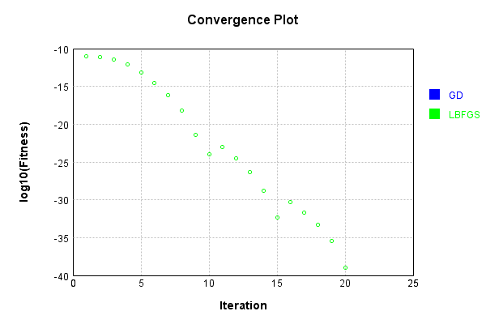


Code from [LearningTester.java:99](../../../../../../../src/main/java/com/simiacryptus/mindseye/test/unit/LearningTester.java#L99) executed in 0.00 seconds: 
```java
    return TestUtil.compareTime(runs);
```

Returns: 

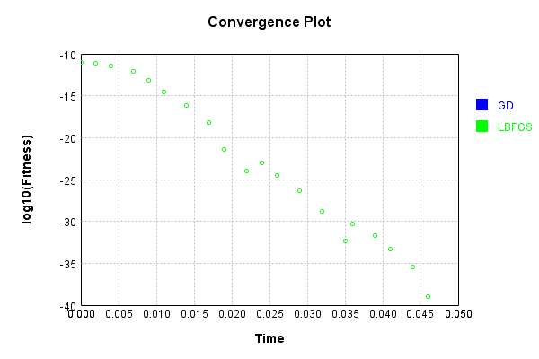


