# SigmoidPipeline
This is a network with the following layout:

Code from [NLayerTest.java:87](../../../../../../../src/test/java/com/simiacryptus/mindseye/network/NLayerTest.java#L87) executed in 0.10 seconds: 
```java
    return Graphviz.fromGraph(TestUtil.toGraph((DAGNetwork) layer))
      .height(400).width(600).render(Format.PNG).toImage();
```

Returns: 

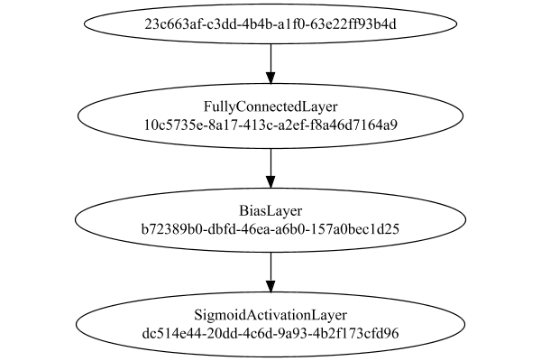


### Json Serialization
Code from [JsonTest.java:36](../../../../../../../src/main/java/com/simiacryptus/mindseye/test/unit/JsonTest.java#L36) executed in 0.00 seconds: 
```java
    JsonObject json = layer.getJson();
    NNLayer echo = NNLayer.fromJson(json);
    if ((echo == null)) throw new AssertionError("Failed to deserialize");
    if ((layer == echo)) throw new AssertionError("Serialization did not copy");
    if ((!layer.equals(echo))) throw new AssertionError("Serialization not equal");
    return new GsonBuilder().setPrettyPrinting().create().toJson(json);
```

Returns: 

```
    {
      "class": "com.simiacryptus.mindseye.network.PipelineNetwork",
      "id": "8b7f8650-43ca-4123-b0ae-423b24761ca9",
      "isFrozen": false,
      "name": "PipelineNetwork/8b7f8650-43ca-4123-b0ae-423b24761ca9",
      "inputs": [
        "23c663af-c3dd-4b4b-a1f0-63e22ff93b4d"
      ],
      "nodes": {
        "bf9f5bf6-a941-458e-890d-6da11d5c2749": "10c5735e-8a17-413c-a2ef-f8a46d7164a9",
        "725fe5d1-fcfe-4ef8-99b7-30cba0b26d59": "b72389b0-dbfd-46ea-a6b0-157a0bec1d25",
        "31b8e0b8-22ab-4a26-920b-da0f37956280": "dc514e44-20dd-4c6d-9a93-4b2f173cfd96"
      },
      "layers": {
        "10c5735e-8a17-413c-a2ef-f8a46d7164a9": {
          "class": "com.simiacryptus.mindseye.layers.java.FullyConnectedLayer",
          "id": "10c5735e-8a17-413c-a2ef-f8a46d7164a9",
          "isFrozen": false,
          "name": "FullyConnectedLayer/10c5735e-8a17-413c-a2ef-f8a46d7164a9",
          "outputDims": [
            10
          ],
          "inputDims": [
            5,
            5,
            3
          ],
          "weights": [
            [
              0.062,
              -0.0228,
              0.072,
              -0.028,
     
```
...[skipping 17853 bytes](etc/84.txt)...
```
    .mindseye.layers.java.BiasLayer",
          "id": "b72389b0-dbfd-46ea-a6b0-157a0bec1d25",
          "isFrozen": false,
          "name": "BiasLayer/b72389b0-dbfd-46ea-a6b0-157a0bec1d25",
          "bias": [
            0.0,
            0.0,
            0.0,
            0.0,
            0.0,
            0.0,
            0.0,
            0.0,
            0.0,
            0.0
          ]
        },
        "dc514e44-20dd-4c6d-9a93-4b2f173cfd96": {
          "class": "com.simiacryptus.mindseye.layers.java.SigmoidActivationLayer",
          "id": "dc514e44-20dd-4c6d-9a93-4b2f173cfd96",
          "isFrozen": true,
          "name": "SigmoidActivationLayer/dc514e44-20dd-4c6d-9a93-4b2f173cfd96",
          "balanced": true
        }
      },
      "links": {
        "bf9f5bf6-a941-458e-890d-6da11d5c2749": [
          "23c663af-c3dd-4b4b-a1f0-63e22ff93b4d"
        ],
        "725fe5d1-fcfe-4ef8-99b7-30cba0b26d59": [
          "bf9f5bf6-a941-458e-890d-6da11d5c2749"
        ],
        "31b8e0b8-22ab-4a26-920b-da0f37956280": [
          "725fe5d1-fcfe-4ef8-99b7-30cba0b26d59"
        ]
      },
      "labels": {},
      "head": "31b8e0b8-22ab-4a26-920b-da0f37956280"
    }
```


### Input Learning
In this test, we use a network to learn this target input, given it's pre-evaluated output:

Code from [LearningTester.java:127](../../../../../../../src/main/java/com/simiacryptus/mindseye/test/unit/LearningTester.java#L127) executed in 0.00 seconds: 
```java
    return Arrays.stream(input_target).map(x -> x.prettyPrint()).reduce((a, b) -> a + "\n" + b).orElse("");
```

Returns: 

```
    [
    	[ [ 0.0688, 0.011800000000000001, 0.0048000000000000004 ], [ -0.09620000000000001, 0.025400000000000002, 0.044800000000000006 ], [ 0.007600000000000001, 0.0064, 0.0 ], [ -0.007, 0.0912, -0.0984 ], [ 0.0626, -0.096, -0.0626 ] ],
    	[ [ -0.0396, 0.054200000000000005, 0.07780000000000001 ], [ 0.08660000000000001, 0.018, 0.08360000000000001 ], [ 0.047200000000000006, -0.037200000000000004, 0.0094 ], [ -0.019200000000000002, -0.053, -4.0E-4 ], [ 0.061, -0.014, -0.0128 ] ],
    	[ [ -0.046400000000000004, 0.05840000000000001, 0.0964 ], [ -0.0086, 0.030600000000000002, 0.032 ], [ -0.0218, -0.007, 0.011 ], [ -0.0322, -0.0058000000000000005, 0.0102 ], [ 0.024200000000000003, 0.0082, 0.035800000000000005 ] ],
    	[ [ 0.0068000000000000005, -0.0162, -0.011800000000000001 ], [ 0.0344, 0.040400000000000005, -0.021200000000000004 ], [ -0.0286, 0.0698, 0.024200000000000003 ], [ 0.07379999999999999, -0.0356, 0.0548 ], [ 0.064, 0.08180000000000001, -0.0422 ] ],
    	[ [ -0.023, -0.09280000000000001, 0.0466 ], [ 0.030600000000000002, -0.011200000000000002, -0.0678 ], [ -0.0366, 0.0568, -0.002 ], [ -0.017, 0.0128, -0.0416 ], [ 0.020200000000000003, 0.038200000000000005, 0.0852 ] ]
    ]
```


First, we use a conjugate gradient descent method, which converges the fastest for purely linear functions.

Code from [LearningTester.java:300](../../../../../../../src/main/java/com/simiacryptus/mindseye/test/unit/LearningTester.java#L300) executed in 0.05 seconds: 
```java
    return new IterativeTrainer(trainable)
      .setLineSearchFactory(label -> new QuadraticSearch())
      .setOrientation(new GradientDescent())
      .setMonitor(monitor)
      .setTimeout(30, TimeUnit.SECONDS)
      .setMaxIterations(250)
      .setTerminateThreshold(0)
      .run();
```
Logging: 
```
    Constructing line search parameters: GD
    F(0.0) = LineSearchPoint{point=PointSample{avg=3.4841125234234393E-4}, derivative=-1.0184078682135588E-5}
    New Minimum: 3.4841125234234393E-4 > 3.484112523413283E-4
    F(1.0E-10) = LineSearchPoint{point=PointSample{avg=3.484112523413283E-4}, derivative=-1.0184078682120145E-5}, delta = -1.0156263850757963E-15
    New Minimum: 3.484112523413283E-4 > 3.484112523352163E-4
    F(7.000000000000001E-10) = LineSearchPoint{point=PointSample{avg=3.484112523352163E-4}, derivative=-1.0184078682027193E-5}, delta = -7.127653502136955E-15
    New Minimum: 3.484112523352163E-4 > 3.4841125229244423E-4
    F(4.900000000000001E-9) = LineSearchPoint{point=PointSample{avg=3.4841125229244423E-4}, derivative=-1.018407868137673E-5}, delta = -4.9899700257233226E-14
    New Minimum: 3.4841125229244423E-4 > 3.484112519930316E-4
    F(3.430000000000001E-8) = LineSearchPoint{point=PointSample{avg=3.484112519930316E-4}, derivative=-1.0184078676823317E-5}, delta = -3.4931232168952664E-13
    New Minimum: 3.484112519930316
```
...[skipping 70263 bytes](etc/85.txt)...
```
    complete. Error: 1.479114197289397E-32 Total: 250042086402196.9000; Orientation: 0.0000; Line Search: 0.0020
    Zero gradient: 1.5861186152974536E-17
    F(0.0) = LineSearchPoint{point=PointSample{avg=1.479114197289397E-32}, derivative=-2.5157722617931114E-34}
    New Minimum: 1.479114197289397E-32 > 4.930380657631324E-33
    F(89.15536272161312) = LineSearchPoint{point=PointSample{avg=4.930380657631324E-33}, derivative=7.194598021657435E-36}, delta = -9.860761315262647E-33
    4.930380657631324E-33 <= 1.479114197289397E-32
    F(86.67658823278425) = LineSearchPoint{point=PointSample{avg=4.930380657631324E-33}, derivative=7.194598021657435E-36}, delta = -9.860761315262647E-33
    Right bracket at 86.67658823278425
    New Minimum: 4.930380657631324E-33 > 0.0
    F(84.26673077574017) = LineSearchPoint{point=PointSample{avg=0.0}, derivative=0.0}, delta = -1.479114197289397E-32
    Right bracket at 84.26673077574017
    Converged to right
    Iteration 55 complete. Error: 0.0 Total: 250042087103243.9000; Orientation: 0.0000; Line Search: 0.0006
    
```

Returns: 

```
    0.0
```


Training Converged

Next, we run the same optimization using L-BFGS, which is nearly ideal for purely second-order or quadratic functions.

Code from [LearningTester.java:324](../../../../../../../src/main/java/com/simiacryptus/mindseye/test/unit/LearningTester.java#L324) executed in 0.02 seconds: 
```java
    return new IterativeTrainer(trainable)
      .setLineSearchFactory(label -> new ArmijoWolfeSearch())
      .setOrientation(new LBFGS())
      .setMonitor(monitor)
      .setTimeout(30, TimeUnit.SECONDS)
      .setMaxIterations(250)
      .setTerminateThreshold(0)
      .run();
```
Logging: 
```
    LBFGS Accumulation History: 1 points
    Constructing line search parameters: GD
    th(0)=3.4841125234234393E-4;dx=-1.0184078682135588E-5
    New Minimum: 3.4841125234234393E-4 > 3.268297815078317E-4
    WOLFE (weak): th(2.154434690031884)=3.268297815078317E-4; dx=-9.850373388702633E-6 delta=2.158147083451223E-5
    New Minimum: 3.268297815078317E-4 > 3.059673252893421E-4
    WOLFE (weak): th(4.308869380063768)=3.059673252893421E-4; dx=-9.516605122278376E-6 delta=4.244392705300183E-5
    New Minimum: 3.059673252893421E-4 > 2.2971020391079067E-4
    END: th(12.926608140191302)=2.2971020391079067E-4; dx=-8.180960295474595E-6 delta=1.1870104843155326E-4
    Iteration 1 complete. Error: 2.2971020391079067E-4 Total: 250042091256803.9000; Orientation: 0.0001; Line Search: 0.0004
    LBFGS Accumulation History: 1 points
    th(0)=2.2971020391079067E-4;dx=-6.583058363913231E-6
    New Minimum: 2.2971020391079067E-4 > 8.469788439450691E-5
    END: th(27.849533001676672)=8.469788439450691E-5; dx=-3.83045996350818E-6 delta=1.4501231951628377E-4
    Iteration 2
```
...[skipping 27307 bytes](etc/86.txt)...
```
    25296E-32; dx=-2.997147689908877E-34 delta=0.0
    Armijo: th(5.7095761098302285E-9)=1.9721522630525296E-32; dx=-2.997147689908877E-34 delta=0.0
    WOLFE (weak): th(3.2354264622371296E-9)=1.9721522630525296E-32; dx=-2.997147689908877E-34 delta=0.0
    WOLFE (weak): th(4.472501286033679E-9)=1.9721522630525296E-32; dx=-2.997147689908877E-34 delta=0.0
    Armijo: th(5.091038697931954E-9)=1.9721522630525296E-32; dx=-2.997147689908877E-34 delta=0.0
    Armijo: th(4.781769991982816E-9)=1.9721522630525296E-32; dx=-2.997147689908877E-34 delta=0.0
    Armijo: th(4.627135639008247E-9)=1.9721522630525296E-32; dx=-2.997147689908877E-34 delta=0.0
    WOLFE (weak): th(4.549818462520963E-9)=1.9721522630525296E-32; dx=-2.997147689908877E-34 delta=0.0
    Armijo: th(4.5884770507646046E-9)=1.9721522630525296E-32; dx=-2.997147689908877E-34 delta=0.0
    mu /= nu: th(0)=1.9721522630525296E-32;th'(0)=-2.997147689908877E-34;
    Iteration 55 failed, aborting. Error: 1.9721522630525296E-32 Total: 250042114239170.8800; Orientation: 0.0000; Line Search: 0.0021
    
```

Returns: 

```
    1.9721522630525296E-32
```


Training Converged

Code from [LearningTester.java:96](../../../../../../../src/main/java/com/simiacryptus/mindseye/test/unit/LearningTester.java#L96) executed in 0.00 seconds: 
```java
    return TestUtil.compare(runs);
```

Returns: 

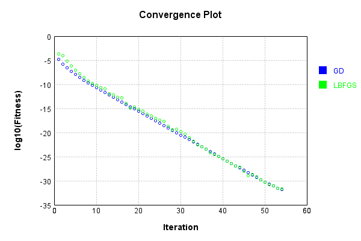


Code from [LearningTester.java:99](../../../../../../../src/main/java/com/simiacryptus/mindseye/test/unit/LearningTester.java#L99) executed in 0.01 seconds: 
```java
    return TestUtil.compareTime(runs);
```

Returns: 

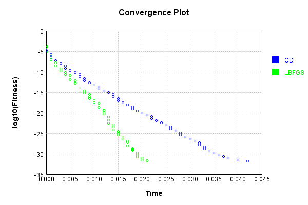


### Model Learning
In this test, attempt to train a network to emulate a randomized network given an example input/output. The target state is:

Code from [LearningTester.java:176](../../../../../../../src/main/java/com/simiacryptus/mindseye/test/unit/LearningTester.java#L176) executed in 0.00 seconds: 
```java
    return network_target.state().stream().map(Arrays::toString).reduce((a, b) -> a + "\n" + b).orElse("");
```

Returns: 

```
    [0.033600000000000005, -0.0466, 0.0376, -0.0154, -0.055600000000000004, -0.09980000000000001, 0.09060000000000001, 0.0218, -0.032, 0.04240000000000001, 0.043800000000000006, -0.09380000000000001, -0.008400000000000001, -0.055, -0.0614, -0.034, 0.0984, 0.0892, -0.0086, -0.003, -0.0454, -0.018400000000000003, 0.08020000000000001, 0.0684, -0.0974, -0.030600000000000002, -0.0864, 0.056600000000000004, 0.0902, -0.062400000000000004, 0.059, 0.0062, -0.04, 0.038400000000000004, -0.06420000000000001, 0.0546, -0.0476, 0.0734, 0.011, -0.041, -0.05140000000000001, 0.0826, -0.0546, -0.0366, 0.07060000000000001, -0.0806, 0.0512, -0.029200000000000004, 0.0952, -0.035800000000000005, 0.0864, -0.0302, -0.071, -0.089, -0.0546, -0.09380000000000001, -0.0426, -0.06420000000000001, 0.0536, -0.075, -0.0734, 0.034, -0.0526, 0.026200000000000005, -0.031200000000000002, -0.047400000000000005, -0.0516, 0.094, -0.0238, 0.023200000000000002, 0.04340000000000001, -0.0548, 0.0206, -0.09440000000000001, 0.0248, 0.046400000000000004, 0.014
```
...[skipping 8146 bytes](etc/87.txt)...
```
    592, 0.016800000000000002, 0.0992, -0.0178, -0.07260000000000001, -0.028200000000000003, -0.07660000000000002, 0.061200000000000004, 0.0712, -0.0742, 0.0776, -0.012, -0.085, -0.015600000000000001, 0.0094, -0.04, 0.06, -0.09860000000000001, 0.08220000000000001, 0.033800000000000004, 0.067, -0.0064, -0.0684, -0.06760000000000001, -0.04, -0.0874, 0.0426, -0.09380000000000001, 0.0712, -0.058800000000000005, 0.028200000000000003, -0.042, 0.09720000000000001, 0.0656, -0.0898, -0.0854, 0.0038000000000000004, -0.0298, 0.0412, 0.04240000000000001, 4.0E-4, -0.0204, 0.0454, -0.0586, -0.0492, 0.06420000000000001, -0.0108, -0.07680000000000001, -0.062, 6.000000000000001E-4, -0.08180000000000001, -0.079, 0.0806, -0.0446, -0.0396, 0.0632, 0.0984, 0.07560000000000001, 6.000000000000001E-4, -0.0926, 0.0496, 0.027800000000000002, -2.0E-4, -0.009200000000000002, 0.08360000000000001, -0.0644, 0.092, -0.041400000000000006, 0.0218, -0.0466, 0.0032, -0.012, 0.0144, 0.0656, -0.0094]
    [0.0, 0.0, 0.0, 0.0, 0.0, 0.0, 0.0, 0.0, 0.0, 0.0]
```


First, we use a conjugate gradient descent method, which converges the fastest for purely linear functions.

Code from [LearningTester.java:300](../../../../../../../src/main/java/com/simiacryptus/mindseye/test/unit/LearningTester.java#L300) executed in 0.01 seconds: 
```java
    return new IterativeTrainer(trainable)
      .setLineSearchFactory(label -> new QuadraticSearch())
      .setOrientation(new GradientDescent())
      .setMonitor(monitor)
      .setTimeout(30, TimeUnit.SECONDS)
      .setMaxIterations(250)
      .setTerminateThreshold(0)
      .run();
```
Logging: 
```
    Constructing line search parameters: GD
    F(0.0) = LineSearchPoint{point=PointSample{avg=4.7214892301072854E-4}, derivative=-5.5392399145914624E-5}
    New Minimum: 4.7214892301072854E-4 > 4.721489230051899E-4
    F(1.0E-10) = LineSearchPoint{point=PointSample{avg=4.721489230051899E-4}, derivative=-5.539239914559007E-5}, delta = -5.5386467981421994E-15
    New Minimum: 4.721489230051899E-4 > 4.7214892297195427E-4
    F(7.000000000000001E-10) = LineSearchPoint{point=PointSample{avg=4.7214892297195427E-4}, derivative=-5.539239914364247E-5}, delta = -3.877426808449047E-14
    New Minimum: 4.7214892297195427E-4 > 4.7214892273930476E-4
    F(4.900000000000001E-9) = LineSearchPoint{point=PointSample{avg=4.7214892273930476E-4}, derivative=-5.539239913000941E-5}, delta = -2.7142377971925424E-13
    New Minimum: 4.7214892273930476E-4 > 4.7214892111076734E-4
    F(3.430000000000001E-8) = LineSearchPoint{point=PointSample{avg=4.7214892111076734E-4}, derivative=-5.539239903457848E-5}, delta = -1.899961199654243E-12
    New Minimum: 4.72148921110767
```
...[skipping 4390 bytes](etc/88.txt)...
```
    ete. Error: 4.4373425918681915E-32 Total: 250042301558885.7000; Orientation: 0.0000; Line Search: 0.0002
    Zero gradient: 7.21715210696312E-17
    F(0.0) = LineSearchPoint{point=PointSample{avg=4.4373425918681915E-32}, derivative=-5.208728453504221E-33}
    New Minimum: 4.4373425918681915E-32 > 4.930380657631324E-33
    F(17.06187732337266) = LineSearchPoint{point=PointSample{avg=4.930380657631324E-33}, derivative=5.783599437353077E-34}, delta = -3.944304526105059E-32
    4.930380657631324E-33 <= 4.4373425918681915E-32
    F(15.356718229298414) = LineSearchPoint{point=PointSample{avg=4.930380657631324E-33}, derivative=5.783599437353077E-34}, delta = -3.944304526105059E-32
    Right bracket at 15.356718229298414
    New Minimum: 4.930380657631324E-33 > 0.0
    F(13.821972242820546) = LineSearchPoint{point=PointSample{avg=0.0}, derivative=0.0}, delta = -4.4373425918681915E-32
    Right bracket at 13.821972242820546
    Converged to right
    Iteration 6 complete. Error: 0.0 Total: 250042302469391.7000; Orientation: 0.0000; Line Search: 0.0008
    
```

Returns: 

```
    0.0
```


Training Converged

Next, we run the same optimization using L-BFGS, which is nearly ideal for purely second-order or quadratic functions.

Code from [LearningTester.java:324](../../../../../../../src/main/java/com/simiacryptus/mindseye/test/unit/LearningTester.java#L324) executed in 0.02 seconds: 
```java
    return new IterativeTrainer(trainable)
      .setLineSearchFactory(label -> new ArmijoWolfeSearch())
      .setOrientation(new LBFGS())
      .setMonitor(monitor)
      .setTimeout(30, TimeUnit.SECONDS)
      .setMaxIterations(250)
      .setTerminateThreshold(0)
      .run();
```
Logging: 
```
    LBFGS Accumulation History: 1 points
    Constructing line search parameters: GD
    th(0)=2.3649958169931398E-4;dx=-2.7760485136596563E-5
    New Minimum: 2.3649958169931398E-4 > 1.8047177600758973E-4
    END: th(2.154434690031884)=1.8047177600758973E-4; dx=-2.4251013061475094E-5 delta=5.6027805691724245E-5
    Iteration 1 complete. Error: 1.8047177600758973E-4 Total: 250042306822151.7000; Orientation: 0.0001; Line Search: 0.0004
    LBFGS Accumulation History: 1 points
    th(0)=1.8047177600758973E-4;dx=-2.1185207467021323E-5
    New Minimum: 1.8047177600758973E-4 > 9.553223818202996E-5
    END: th(4.641588833612779)=9.553223818202996E-5; dx=-1.5413924656166626E-5 delta=8.493953782555977E-5
    Iteration 2 complete. Error: 9.553223818202996E-5 Total: 250042307376719.7000; Orientation: 0.0001; Line Search: 0.0003
    LBFGS Accumulation History: 1 points
    th(0)=9.553223818202996E-5;dx=-1.121485718867697E-5
    New Minimum: 9.553223818202996E-5 > 1.6298253545666483E-5
    END: th(10.000000000000002)=1.6298253545666483E-5; dx=-4.631971079266901E-6 d
```
...[skipping 8745 bytes](etc/89.txt)...
```
    445.7000; Orientation: 0.0001; Line Search: 0.0005
    LBFGS Accumulation History: 1 points
    th(0)=7.923121716813537E-30;dx=-9.297746604322273E-31
    New Minimum: 7.923121716813537E-30 > 5.768545369428649E-30
    WOLF (strong): th(31.4777888564235)=5.768545369428649E-30; dx=7.920744587736497E-31 delta=2.154576347384888E-30
    New Minimum: 5.768545369428649E-30 > 4.930380657631324E-32
    END: th(15.73889442821175)=4.930380657631324E-32; dx=-6.422360850175505E-32 delta=7.873817910237224E-30
    Iteration 20 complete. Error: 4.930380657631324E-32 Total: 250042320758164.7000; Orientation: 0.0001; Line Search: 0.0005
    LBFGS Accumulation History: 1 points
    th(0)=4.930380657631324E-32;dx=-5.785986065617086E-33
    Armijo: th(33.90842013888893)=6.409494854920721E-32; dx=6.364688569705283E-33 delta=-1.4791141972893974E-32
    New Minimum: 4.930380657631324E-32 > 0.0
    END: th(16.954210069444464)=0.0; dx=0.0 delta=4.930380657631324E-32
    Iteration 21 complete. Error: 0.0 Total: 250042321456362.7000; Orientation: 0.0001; Line Search: 0.0005
    
```

Returns: 

```
    0.0
```


Training Converged

Code from [LearningTester.java:96](../../../../../../../src/main/java/com/simiacryptus/mindseye/test/unit/LearningTester.java#L96) executed in 0.00 seconds: 
```java
    return TestUtil.compare(runs);
```

Returns: 

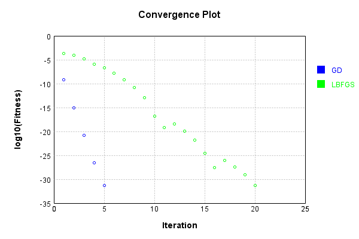


Code from [LearningTester.java:99](../../../../../../../src/main/java/com/simiacryptus/mindseye/test/unit/LearningTester.java#L99) executed in 0.00 seconds: 
```java
    return TestUtil.compareTime(runs);
```

Returns: 

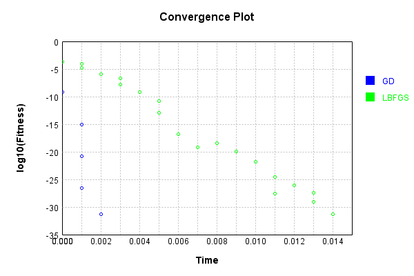


### Composite Learning
In this test, attempt to train a network to emulate a randomized network given an example input/output. The target state is:

Code from [LearningTester.java:219](../../../../../../../src/main/java/com/simiacryptus/mindseye/test/unit/LearningTester.java#L219) executed in 0.00 seconds: 
```java
    return network_target.state().stream().map(Arrays::toString).reduce((a, b) -> a + "\n" + b).orElse("");
```

Returns: 

```
    [-0.0884, -0.049, 0.07840000000000001, -0.012600000000000002, -0.009600000000000001, 0.0796, 0.0144, 0.017, 0.062400000000000004, 0.038, -0.013200000000000002, 0.0298, -0.0644, -0.093, 0.044800000000000006, 0.0684, -0.05, 0.06, -0.068, 0.05040000000000001, -0.06280000000000001, -0.0946, 0.058, 0.045200000000000004, 0.056, -0.04, 0.0648, -0.0446, -0.055, 0.0362, 0.09880000000000001, -0.049400000000000006, -0.0124, -0.0074, -0.08860000000000001, 0.037399999999999996, -0.028, 0.0694, -0.0064, 0.09060000000000001, 0.0674, -0.062400000000000004, -0.0862, -0.015600000000000001, 0.0324, -0.0824, -0.082, 0.0864, 0.028, 0.055200000000000006, -0.0044, 0.0128, -0.0854, -0.047400000000000005, 0.035, -0.0884, -0.04, -0.048400000000000006, -0.046200000000000005, -0.09860000000000001, 0.0792, 0.011800000000000001, -0.09380000000000001, 0.0722, -0.035800000000000005, -0.0872, 0.0902, -0.099, -0.09380000000000001, -0.0048000000000000004, 0.0908, -0.0752, -0.0288, -0.0058000000000000005, -0.08580000000000002, 0.0022, -0.080800
```
...[skipping 8146 bytes](etc/90.txt)...
```
    0102, -0.0302, 0.02, -0.0654, -0.06420000000000001, -0.06520000000000001, 0.08660000000000001, -0.0792, -0.0698, -0.0054, 0.06340000000000001, 0.0796, -0.05040000000000001, 0.06720000000000001, -0.07680000000000001, 0.0724, 0.043, -0.045200000000000004, -0.079, 0.0134, -0.074, -0.0852, 0.06080000000000001, -0.05040000000000001, 0.06960000000000001, 0.0632, -0.003, -0.048, -0.0288, 0.0668, -0.07440000000000001, -0.0832, -0.018400000000000003, 0.0854, -0.06620000000000001, 0.0616, -0.0688, -0.034, 0.0912, 0.0908, 0.0466, -0.0298, 0.0134, 0.022, -0.0844, -0.011600000000000001, 0.014, 0.046400000000000004, -0.095, -0.041400000000000006, -0.0034000000000000002, -0.07260000000000001, 0.027800000000000002, -0.0388, -0.0396, 0.0984, 0.0206, 0.016800000000000002, 0.066, -0.026, 0.092, 0.0874, 0.0218, 0.0308, -0.017400000000000002, -0.08180000000000001, -0.0022, 0.07540000000000001, -0.073, 0.055400000000000005, 0.0182, 0.08380000000000001, 0.08780000000000002, 0.0044]
    [0.0, 0.0, 0.0, 0.0, 0.0, 0.0, 0.0, 0.0, 0.0, 0.0]
```


We simultaneously regress this target input:

Code from [LearningTester.java:223](../../../../../../../src/main/java/com/simiacryptus/mindseye/test/unit/LearningTester.java#L223) executed in 0.00 seconds: 
```java
    return Arrays.stream(testInput).map(x -> x.prettyPrint()).reduce((a, b) -> a + "\n" + b).orElse("");
```

Returns: 

```
    [
    	[ [ 0.030600000000000002, 0.025400000000000002, 0.0068000000000000005 ], [ 0.011, 0.0466, -0.0218 ], [ -0.023, -0.09620000000000001, 0.047200000000000006 ], [ 0.0094, 0.0064, -0.0322 ], [ 0.05840000000000001, -0.0058000000000000005, 0.024200000000000003 ] ],
    	[ [ -0.0626, 0.044800000000000006, 0.0344 ], [ -0.014, -0.0162, 0.07780000000000001 ], [ -0.046400000000000004, 0.0128, -0.0128 ], [ 0.024200000000000003, -0.0422, 0.064 ], [ 0.018, -0.096, -0.0286 ] ],
    	[ [ 0.011800000000000001, 0.0082, 0.0626 ], [ 0.0102, 0.040400000000000005, -0.011800000000000001 ], [ 0.0964, -0.0086, -0.019200000000000002 ], [ -0.0984, -0.002, -0.007 ], [ 0.0852, 0.032, 0.061 ] ],
    	[ [ 0.0, -0.021200000000000004, 0.0048000000000000004 ], [ 0.0548, 0.07379999999999999, 0.08360000000000001 ], [ -0.0396, 0.035800000000000005, -0.007 ], [ 0.038200000000000005, 0.0912, 0.0688 ], [ -0.0366, 0.08180000000000001, 0.020200000000000003 ] ],
    	[ [ 0.0698, -0.053, -0.0416 ], [ -0.0678, -4.0E-4, -0.011200000000000002 ], [ -0.017, 0.0568, 0.054200000000000005 ], [ 0.030600000000000002, 0.08660000000000001, -0.09280000000000001 ], [ 0.007600000000000001, -0.0356, -0.037200000000000004 ] ]
    ]
```


Which produces the following output:

Code from [LearningTester.java:230](../../../../../../../src/main/java/com/simiacryptus/mindseye/test/unit/LearningTester.java#L230) executed in 0.00 seconds: 
```java
    return Stream.of(targetOutput).map(x -> x.prettyPrint()).reduce((a, b) -> a + "\n" + b).orElse("");
```

Returns: 

```
    [ 0.01708443751833011, -0.015379447274338487, -0.009092729398832655, -0.0012906992832720787, -0.01926189728210137, 0.002007817301935111, 0.0011322795161172738, 0.004060057691023022, 0.009942732341264193, -0.01852879914958183 ]
```


First, we use a conjugate gradient descent method, which converges the fastest for purely linear functions.

Code from [LearningTester.java:300](../../../../../../../src/main/java/com/simiacryptus/mindseye/test/unit/LearningTester.java#L300) executed in 0.02 seconds: 
```java
    return new IterativeTrainer(trainable)
      .setLineSearchFactory(label -> new QuadraticSearch())
      .setOrientation(new GradientDescent())
      .setMonitor(monitor)
      .setTimeout(30, TimeUnit.SECONDS)
      .setMaxIterations(250)
      .setTerminateThreshold(0)
      .run();
```
Logging: 
```
    Constructing line search parameters: GD
    F(0.0) = LineSearchPoint{point=PointSample{avg=1.281506138756024E-4}, derivative=-1.9121152067377637E-5}
    New Minimum: 1.281506138756024E-4 > 1.2815061387369E-4
    F(1.0E-10) = LineSearchPoint{point=PointSample{avg=1.2815061387369E-4}, derivative=-1.912115206723359E-5}, delta = -1.912397106992869E-15
    New Minimum: 1.2815061387369E-4 > 1.2815061386221835E-4
    F(7.000000000000001E-10) = LineSearchPoint{point=PointSample{avg=1.2815061386221835E-4}, derivative=-1.9121152066369535E-5}, delta = -1.3384042138464558E-14
    New Minimum: 1.2815061386221835E-4 > 1.2815061378190908E-4
    F(4.900000000000001E-9) = LineSearchPoint{point=PointSample{avg=1.2815061378190908E-4}, derivative=-1.9121152060320575E-5}, delta = -9.369330940429965E-14
    New Minimum: 1.2815061378190908E-4 > 1.2815061321974687E-4
    F(3.430000000000001E-8) = LineSearchPoint{point=PointSample{avg=1.2815061321974687E-4}, derivative=-1.9121152017978055E-5}, delta = -6.558555239698227E-13
    New Minimum: 1.2815061321974687E-4 
```
...[skipping 18616 bytes](etc/91.txt)...
```
    ntSample{avg=4.930380657631324E-33}, derivative=8.268234301651122E-34}, delta = -6.40949485492072E-32
    Right bracket at 11.933442251032988
    F(11.025021692837578) = LineSearchPoint{point=PointSample{avg=4.930380657631324E-33}, derivative=8.268234301651122E-34}, delta = -6.40949485492072E-32
    Right bracket at 11.025021692837578
    F(10.185753680336235) = LineSearchPoint{point=PointSample{avg=4.930380657631324E-33}, derivative=8.268234301651122E-34}, delta = -6.40949485492072E-32
    Right bracket at 10.185753680336235
    F(9.410374049774816) = LineSearchPoint{point=PointSample{avg=4.930380657631324E-33}, derivative=8.268234301651122E-34}, delta = -6.40949485492072E-32
    Right bracket at 9.410374049774816
    New Minimum: 4.930380657631324E-33 > 0.0
    F(8.694019366248021) = LineSearchPoint{point=PointSample{avg=0.0}, derivative=0.0}, delta = -6.902532920683853E-32
    Right bracket at 8.694019366248021
    Converged to right
    Iteration 15 complete. Error: 0.0 Total: 250042457990363.5300; Orientation: 0.0000; Line Search: 0.0019
    
```

Returns: 

```
    0.0
```


Training Converged

Next, we run the same optimization using L-BFGS, which is nearly ideal for purely second-order or quadratic functions.

Code from [LearningTester.java:324](../../../../../../../src/main/java/com/simiacryptus/mindseye/test/unit/LearningTester.java#L324) executed in 0.03 seconds: 
```java
    return new IterativeTrainer(trainable)
      .setLineSearchFactory(label -> new ArmijoWolfeSearch())
      .setOrientation(new LBFGS())
      .setMonitor(monitor)
      .setTimeout(30, TimeUnit.SECONDS)
      .setMaxIterations(250)
      .setTerminateThreshold(0)
      .run();
```
Logging: 
```
    LBFGS Accumulation History: 1 points
    Constructing line search parameters: GD
    th(0)=1.281506138756024E-4;dx=-1.9121152067377637E-5
    New Minimum: 1.281506138756024E-4 > 9.029688955156554E-5
    END: th(2.154434690031884)=9.029688955156554E-5; dx=-1.601956255647042E-5 delta=3.785372432403686E-5
    Iteration 1 complete. Error: 9.029688955156554E-5 Total: 250042461773736.5300; Orientation: 0.0002; Line Search: 0.0005
    LBFGS Accumulation History: 1 points
    th(0)=9.029688955156554E-5;dx=-1.3425170085281896E-5
    New Minimum: 9.029688955156554E-5 > 3.8827366734362746E-5
    END: th(4.641588833612779)=3.8827366734362746E-5; dx=-8.753495098033365E-6 delta=5.146952281720279E-5
    Iteration 2 complete. Error: 3.8827366734362746E-5 Total: 250042462404393.5300; Orientation: 0.0001; Line Search: 0.0004
    LBFGS Accumulation History: 1 points
    th(0)=3.8827366734362746E-5;dx=-5.720279088916606E-6
    New Minimum: 3.8827366734362746E-5 > 2.8607826878480424E-6
    END: th(10.000000000000002)=2.8607826878480424E-6; dx=-1.4742842755835276E-6 delta
```
...[skipping 11828 bytes](etc/92.txt)...
```
    2648E-33; dx=-1.4367851490969095E-33 delta=0.0
    Armijo: th(4.118971204154402E-9)=9.860761315262648E-33; dx=-1.4367851490969095E-33 delta=0.0
    Armijo: th(3.089228403115802E-9)=9.860761315262648E-33; dx=-1.4367851490969095E-33 delta=0.0
    Armijo: th(2.574357002596502E-9)=9.860761315262648E-33; dx=-1.4367851490969095E-33 delta=0.0
    WOLFE (weak): th(2.3169213023368513E-9)=9.860761315262648E-33; dx=-1.4367851490969095E-33 delta=0.0
    Armijo: th(2.4456391524666766E-9)=9.860761315262648E-33; dx=-1.4367851490969095E-33 delta=0.0
    Armijo: th(2.381280227401764E-9)=9.860761315262648E-33; dx=-1.4367851490969095E-33 delta=0.0
    WOLFE (weak): th(2.3491007648693076E-9)=9.860761315262648E-33; dx=-1.4367851490969095E-33 delta=0.0
    WOLFE (weak): th(2.3651904961355358E-9)=9.860761315262648E-33; dx=-1.4367851490969095E-33 delta=0.0
    mu /= nu: th(0)=9.860761315262648E-33;th'(0)=-1.4367851490969095E-33;
    Iteration 21 failed, aborting. Error: 9.860761315262648E-33 Total: 250042486170736.5300; Orientation: 0.0002; Line Search: 0.0025
    
```

Returns: 

```
    9.860761315262648E-33
```


Training Converged

Code from [LearningTester.java:96](../../../../../../../src/main/java/com/simiacryptus/mindseye/test/unit/LearningTester.java#L96) executed in 0.00 seconds: 
```java
    return TestUtil.compare(runs);
```

Returns: 

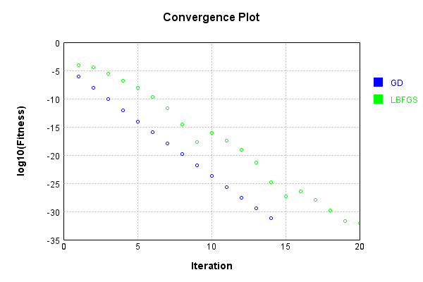


Code from [LearningTester.java:99](../../../../../../../src/main/java/com/simiacryptus/mindseye/test/unit/LearningTester.java#L99) executed in 0.00 seconds: 
```java
    return TestUtil.compareTime(runs);
```

Returns: 

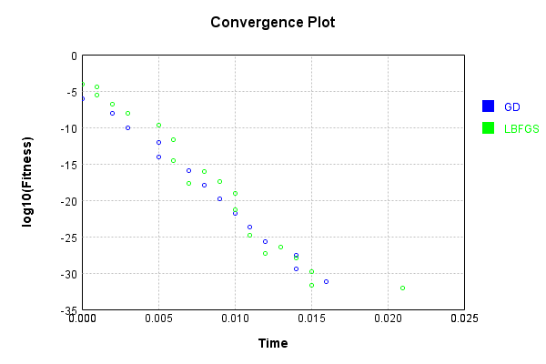


This is a network with the following layout:

Code from [NLayerTest.java:87](../../../../../../../src/test/java/com/simiacryptus/mindseye/network/NLayerTest.java#L87) executed in 0.19 seconds: 
```java
    return Graphviz.fromGraph(TestUtil.toGraph((DAGNetwork) layer))
      .height(400).width(600).render(Format.PNG).toImage();
```

Returns: 

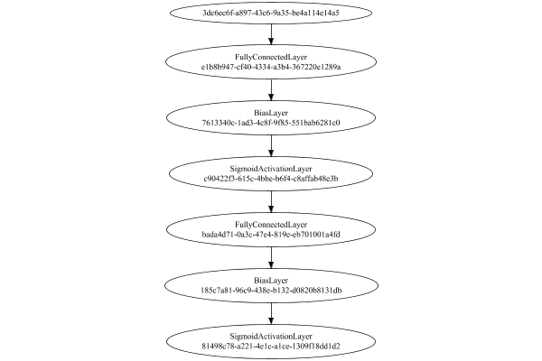


### Json Serialization
Code from [JsonTest.java:36](../../../../../../../src/main/java/com/simiacryptus/mindseye/test/unit/JsonTest.java#L36) executed in 0.00 seconds: 
```java
    JsonObject json = layer.getJson();
    NNLayer echo = NNLayer.fromJson(json);
    if ((echo == null)) throw new AssertionError("Failed to deserialize");
    if ((layer == echo)) throw new AssertionError("Serialization did not copy");
    if ((!layer.equals(echo))) throw new AssertionError("Serialization not equal");
    return new GsonBuilder().setPrettyPrinting().create().toJson(json);
```

Returns: 

```
    {
      "class": "com.simiacryptus.mindseye.network.PipelineNetwork",
      "id": "241296ce-45f3-409e-9b3b-3d43baa48df0",
      "isFrozen": false,
      "name": "PipelineNetwork/241296ce-45f3-409e-9b3b-3d43baa48df0",
      "inputs": [
        "3dc6ec6f-a897-43c6-9a35-be4a114e14a5"
      ],
      "nodes": {
        "0c5e3016-a8b4-49a0-ac74-ccf608e58ff8": "e1b8b947-cf40-4334-a3b4-367220e1289a",
        "c8875f3a-c426-4e10-93e4-b71e0d634476": "7613340c-1ad3-4c8f-9f85-551bab6281c0",
        "5319bf3a-fc5d-46ce-8424-9326f6d38839": "c90422f3-615c-4bbe-b6f4-c8affab48e3b",
        "a21f92d0-40e9-4999-be10-bdf9dc7d3560": "bada4d71-0a3c-47e4-819e-eb701001a4fd",
        "23cb140e-f2a8-4b48-b04e-379d84d0aad6": "185c7a81-96c9-438e-b132-d0820b8131db",
        "9b3a7cb4-72de-43c6-8932-906ddc3d5701": "81498c78-a221-4e1c-a1ce-1309f18dd1d2"
      },
      "layers": {
        "e1b8b947-cf40-4334-a3b4-367220e1289a": {
          "class": "com.simiacryptus.mindseye.layers.java.FullyConnectedLayer",
          "id": "e1b8b947-cf40-4334-a3b4-367220e1289a",
          "isFrozen": false,
          "name": "FullyConnect
```
...[skipping 21845 bytes](etc/93.txt)...
```
    
            0.0,
            0.0
          ]
        },
        "81498c78-a221-4e1c-a1ce-1309f18dd1d2": {
          "class": "com.simiacryptus.mindseye.layers.java.SigmoidActivationLayer",
          "id": "81498c78-a221-4e1c-a1ce-1309f18dd1d2",
          "isFrozen": true,
          "name": "SigmoidActivationLayer/81498c78-a221-4e1c-a1ce-1309f18dd1d2",
          "balanced": true
        }
      },
      "links": {
        "0c5e3016-a8b4-49a0-ac74-ccf608e58ff8": [
          "3dc6ec6f-a897-43c6-9a35-be4a114e14a5"
        ],
        "c8875f3a-c426-4e10-93e4-b71e0d634476": [
          "0c5e3016-a8b4-49a0-ac74-ccf608e58ff8"
        ],
        "5319bf3a-fc5d-46ce-8424-9326f6d38839": [
          "c8875f3a-c426-4e10-93e4-b71e0d634476"
        ],
        "a21f92d0-40e9-4999-be10-bdf9dc7d3560": [
          "5319bf3a-fc5d-46ce-8424-9326f6d38839"
        ],
        "23cb140e-f2a8-4b48-b04e-379d84d0aad6": [
          "a21f92d0-40e9-4999-be10-bdf9dc7d3560"
        ],
        "9b3a7cb4-72de-43c6-8932-906ddc3d5701": [
          "23cb140e-f2a8-4b48-b04e-379d84d0aad6"
        ]
      },
      "labels": {},
      "head": "9b3a7cb4-72de-43c6-8932-906ddc3d5701"
    }
```


### Input Learning
In this test, we use a network to learn this target input, given it's pre-evaluated output:

Code from [LearningTester.java:127](../../../../../../../src/main/java/com/simiacryptus/mindseye/test/unit/LearningTester.java#L127) executed in 0.00 seconds: 
```java
    return Arrays.stream(input_target).map(x -> x.prettyPrint()).reduce((a, b) -> a + "\n" + b).orElse("");
```

Returns: 

```
    [
    	[ [ 0.026400000000000003, 0.047200000000000006, 0.08580000000000002 ], [ -0.0762, -0.023200000000000002, -0.0402 ], [ 0.0626, 0.0534, -0.0708 ], [ -0.0032, 0.0892, 0.0376 ], [ 0.0646, -0.08380000000000001, -0.038200000000000005 ] ],
    	[ [ -0.0018, -0.006600000000000001, 0.0228 ], [ -0.040600000000000004, 0.0334, -0.019 ], [ -0.094, -0.0912, -0.0456 ], [ -0.0714, 0.0512, -0.09540000000000001 ], [ -0.032, 0.0416, 0.0322 ] ],
    	[ [ 0.04440000000000001, 0.027, 0.054200000000000005 ], [ -0.0582, -0.0028000000000000004, 0.0234 ], [ -0.018, -0.0364, -0.039 ], [ 0.0814, -0.054, 0.07579999999999999 ], [ 0.0396, -0.09540000000000001, -0.0478 ] ],
    	[ [ 0.06760000000000001, 0.0488, -0.07940000000000001 ], [ -0.0062, -0.0526, -0.024200000000000003 ], [ -0.0052, 0.0666, -0.022 ], [ -0.0376, -0.026200000000000005, -0.002 ], [ -0.09160000000000001, -0.083, 0.07379999999999999 ] ],
    	[ [ 0.0506, -0.0166, -0.08120000000000001 ], [ -0.0912, 0.0244, -0.0432 ], [ 0.0446, -0.071, -0.030400000000000003 ], [ 0.011, 0.030400000000000003, -0.0694 ], [ -0.0014000000000000002, 0.084, -0.09060000000000001 ] ]
    ]
```


First, we use a conjugate gradient descent method, which converges the fastest for purely linear functions.

Code from [LearningTester.java:300](../../../../../../../src/main/java/com/simiacryptus/mindseye/test/unit/LearningTester.java#L300) executed in 0.25 seconds: 
```java
    return new IterativeTrainer(trainable)
      .setLineSearchFactory(label -> new QuadraticSearch())
      .setOrientation(new GradientDescent())
      .setMonitor(monitor)
      .setTimeout(30, TimeUnit.SECONDS)
      .setMaxIterations(250)
      .setTerminateThreshold(0)
      .run();
```
Logging: 
```
    Constructing line search parameters: GD
    F(0.0) = LineSearchPoint{point=PointSample{avg=2.3412692257049283E-6}, derivative=-5.725337839341685E-10}
    F(1.0E-10) = LineSearchPoint{point=PointSample{avg=2.3412692257049283E-6}, derivative=-5.725337839341685E-10}, delta = 0.0
    New Minimum: 2.3412692257049283E-6 > 2.34126922570466E-6
    F(7.000000000000001E-10) = LineSearchPoint{point=PointSample{avg=2.34126922570466E-6}, derivative=-5.725337839341091E-10}, delta = -2.685094442796132E-19
    New Minimum: 2.34126922570466E-6 > 2.3412692257022187E-6
    F(4.900000000000001E-9) = LineSearchPoint{point=PointSample{avg=2.3412692257022187E-6}, derivative=-5.725337839336831E-10}, delta = -2.7096583982665068E-18
    New Minimum: 2.3412692257022187E-6 > 2.3412692256853166E-6
    F(3.430000000000001E-8) = LineSearchPoint{point=PointSample{avg=2.3412692256853166E-6}, derivative=-5.725337839308521E-10}, delta = -1.9611777344252443E-17
    New Minimum: 2.3412692256853166E-6 > 2.3412692255675116E-6
    F(2.4010000000000004E-7) = LineSearchPoint{poin
```
...[skipping 294656 bytes](etc/94.txt)...
```
    23125E-24}, delta = -6.700251304812575E-14
    Right bracket at 6418.924742984359
    Converged to right
    Iteration 249 complete. Error: 3.79893091363324E-11 Total: 250043085315572.9000; Orientation: 0.0000; Line Search: 0.0016
    Low gradient: 5.208284030301839E-9
    F(0.0) = LineSearchPoint{point=PointSample{avg=3.79893091363324E-11}, derivative=-2.7126222540297168E-17}
    New Minimum: 3.79893091363324E-11 > 3.7928883579797245E-11
    F(6418.924742984359) = LineSearchPoint{point=PointSample{avg=3.7928883579797245E-11}, derivative=8.298905433119355E-18}, delta = -6.042555653515278E-14
    3.7928883579797245E-11 <= 3.79893091363324E-11
    New Minimum: 3.7928883579797245E-11 > 3.7922643895940205E-11
    F(4915.188483673971) = LineSearchPoint{point=PointSample{avg=3.7922643895940205E-11}, derivative=1.4406340509652172E-24}, delta = -6.666524039219242E-14
    Right bracket at 4915.188483673971
    Converged to right
    Iteration 250 complete. Error: 3.7922643895940205E-11 Total: 250043086206415.9000; Orientation: 0.0000; Line Search: 0.0007
    
```

Returns: 

```
    3.7922643895940205E-11
```


Training Converged

Next, we run the same optimization using L-BFGS, which is nearly ideal for purely second-order or quadratic functions.

Code from [LearningTester.java:324](../../../../../../../src/main/java/com/simiacryptus/mindseye/test/unit/LearningTester.java#L324) executed in 0.00 seconds: 
```java
    return new IterativeTrainer(trainable)
      .setLineSearchFactory(label -> new ArmijoWolfeSearch())
      .setOrientation(new LBFGS())
      .setMonitor(monitor)
      .setTimeout(30, TimeUnit.SECONDS)
      .setMaxIterations(250)
      .setTerminateThreshold(0)
      .run();
```
Logging: 
```
    LBFGS Accumulation History: 1 points
    Constructing line search parameters: GD
    th(0)=2.3412692257049283E-6;dx=-5.725337839341685E-10
    New Minimum: 2.3412692257049283E-6 > 2.3400359619678287E-6
    WOLFE (weak): th(2.154434690031884)=2.3400359619678287E-6; dx=-5.723268543210192E-10 delta=1.2332637370996608E-9
    New Minimum: 2.3400359619678287E-6 > 2.3388031440471263E-6
    WOLFE (weak): th(4.308869380063768)=2.3388031440471263E-6; dx=-5.721199245916389E-10 delta=2.4660816578020477E-9
    New Minimum: 2.3388031440471263E-6 > 2.333876330533935E-6
    WOLFE (weak): th(12.926608140191302)=2.333876330533935E-6; dx=-5.712922045140442E-10 delta=7.392895170993382E-9
    New Minimum: 2.333876330533935E-6 > 2.311793941860387E-6
    WOLFE (weak): th(51.70643256076521)=2.311793941860387E-6; dx=-5.67567441352745E-10 delta=2.9475283844541517E-8
    New Minimum: 2.311793941860387E-6 > 2.196460775226837E-6
    WOLFE (weak): th(258.53216280382605)=2.196460775226837E-6; dx=-5.477014298193496E-10 delta=1.4480845047809147E-7
    New Minimum: 2.1964607752268
```
...[skipping 283 bytes](etc/95.txt)...
```
    ry: 1 points
    th(0)=1.5687274782826357E-6;dx=-3.2388223813650686E-10
    New Minimum: 1.5687274782826357E-6 > 7.376144771665881E-7
    END: th(3341.943960201201)=7.376144771665881E-7; dx=-1.73502029220544E-10 delta=8.311130011160476E-7
    Iteration 2 complete. Error: 7.376144771665881E-7 Total: 250043093098047.9000; Orientation: 0.0000; Line Search: 0.0003
    LBFGS Accumulation History: 1 points
    th(0)=7.376144771665881E-7;dx=-1.1181344347518055E-10
    New Minimum: 7.376144771665881E-7 > 2.1003321730690784E-7
    END: th(7200.000000000001)=2.1003321730690784E-7; dx=-3.473952117029448E-11 delta=5.275812598596803E-7
    Iteration 3 complete. Error: 2.1003321730690784E-7 Total: 250043093628107.9000; Orientation: 0.0000; Line Search: 0.0003
    LBFGS Accumulation History: 1 points
    th(0)=2.1003321730690784E-7;dx=-2.607608149472505E-11
    MAX ALPHA: th(0)=2.1003321730690784E-7;th'(0)=-2.607608149472505E-11;
    Iteration 4 failed, aborting. Error: 2.1003321730690784E-7 Total: 250043094294671.9000; Orientation: 0.0000; Line Search: 0.0005
    
```

Returns: 

```
    2.1003321730690784E-7
```


Training Converged

Code from [LearningTester.java:96](../../../../../../../src/main/java/com/simiacryptus/mindseye/test/unit/LearningTester.java#L96) executed in 0.00 seconds: 
```java
    return TestUtil.compare(runs);
```

Returns: 

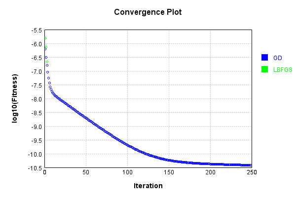


Code from [LearningTester.java:99](../../../../../../../src/main/java/com/simiacryptus/mindseye/test/unit/LearningTester.java#L99) executed in 0.00 seconds: 
```java
    return TestUtil.compareTime(runs);
```

Returns: 

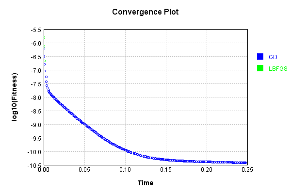


### Model Learning
In this test, attempt to train a network to emulate a randomized network given an example input/output. The target state is:

Code from [LearningTester.java:176](../../../../../../../src/main/java/com/simiacryptus/mindseye/test/unit/LearningTester.java#L176) executed in 0.00 seconds: 
```java
    return network_target.state().stream().map(Arrays::toString).reduce((a, b) -> a + "\n" + b).orElse("");
```

Returns: 

```
    [0.0, 0.0, 0.0, 0.0, 0.0, 0.0, 0.0, 0.0, 0.0, 0.0]
    [0.0, 0.0, 0.0, 0.0, 0.0, 0.0, 0.0, 0.0, 0.0, 0.0]
    [0.0792, 0.0344, 0.094, 0.029400000000000003, 0.0692, 0.0346, -0.051800000000000006, -0.0936, -0.004200000000000001, 0.0874, 0.010600000000000002, 0.0682, 0.0804, 0.0936, -0.0476, 0.07680000000000001, -0.06760000000000001, -0.022200000000000004, -0.0592, -0.033, -0.0102, 0.0668, 0.0154, 0.009, -0.0852, -0.0782, -0.013, 0.0194, 0.023200000000000002, 0.08580000000000002, 0.076, -0.052, 0.0772, -0.0302, -0.034800000000000005, -0.05240000000000001, -0.0718, -0.02, -0.039200000000000006, 0.09440000000000001, -0.0568, 0.065, 0.014, 0.025400000000000002, 0.0028000000000000004, 0.09980000000000001, 0.0274, 0.068, -0.099, -0.095, -0.0442, -0.0068000000000000005, -0.0548, -0.0582, 0.032600000000000004, 0.050800000000000005, -0.008, 0.0932, -0.0014000000000000002, 0.0712, -0.09340000000000001, -0.0454, 0.06760000000000001, 0.009800000000000001, -0.0082, 0.018400000000000003, 0.035800000000000005, 0.014, 0.02420000000000
```
...[skipping 9334 bytes](etc/96.txt)...
```
    .049400000000000006, 0.0932, 0.092, -0.0396, 0.0606, -0.0786, -0.0526, 0.08220000000000001, 0.020200000000000003, 0.0256, 0.0068000000000000005, -0.0734, 0.042800000000000005, 0.049800000000000004, -0.022600000000000002, 0.013, 0.056600000000000004, -0.03780000000000001, -0.03, -0.02, 0.041400000000000006, 0.0234, -0.046200000000000005, -0.04, 0.0664, -0.055, -0.085, -0.043800000000000006, -0.0422, 0.0522, 0.0218, -0.0036, -0.0038000000000000004, -0.0248, -0.095, 0.056, -0.0228, 0.099, -0.0698, -0.09340000000000001, 0.007, -0.0318, -0.0708, 0.08120000000000001, 0.0178, 0.09040000000000001, -0.050800000000000005, 0.004200000000000001, -0.08360000000000001, 0.0826, -0.013200000000000002, 0.09720000000000001, 0.027600000000000003, 0.0256, -0.062200000000000005, -0.061, -0.030400000000000003, 0.06520000000000001, -0.08480000000000001, 0.1, -0.034800000000000005, 0.0208, -0.0356, -0.0708, 0.08680000000000002, 0.047, -0.006600000000000001, -0.0752, 0.0026, -0.06860000000000001, -0.0718, -0.06180000000000001, 0.044]
```


First, we use a conjugate gradient descent method, which converges the fastest for purely linear functions.

Code from [LearningTester.java:300](../../../../../../../src/main/java/com/simiacryptus/mindseye/test/unit/LearningTester.java#L300) executed in 0.01 seconds: 
```java
    return new IterativeTrainer(trainable)
      .setLineSearchFactory(label -> new QuadraticSearch())
      .setOrientation(new GradientDescent())
      .setMonitor(monitor)
      .setTimeout(30, TimeUnit.SECONDS)
      .setMaxIterations(250)
      .setTerminateThreshold(0)
      .run();
```
Logging: 
```
    Constructing line search parameters: GD
    F(0.0) = LineSearchPoint{point=PointSample{avg=4.2713714349728485E-6}, derivative=-4.3316285159731097E-7}
    New Minimum: 4.2713714349728485E-6 > 4.2713714349296125E-6
    F(1.0E-10) = LineSearchPoint{point=PointSample{avg=4.2713714349296125E-6}, derivative=-4.3316285159511843E-7}, delta = -4.3235949759648507E-17
    New Minimum: 4.2713714349296125E-6 > 4.27137143466955E-6
    F(7.000000000000001E-10) = LineSearchPoint{point=PointSample{avg=4.27137143466955E-6}, derivative=-4.3316285158193007E-7}, delta = -3.0329878148924183E-16
    New Minimum: 4.27137143466955E-6 > 4.271371432850495E-6
    F(4.900000000000001E-9) = LineSearchPoint{point=PointSample{avg=4.271371432850495E-6}, derivative=-4.331628514896831E-7}, delta = -2.1223537047276343E-15
    New Minimum: 4.271371432850495E-6 > 4.2713714201154315E-6
    F(3.430000000000001E-8) = LineSearchPoint{point=PointSample{avg=4.2713714201154315E-6}, derivative=-4.3316285084386744E-7}, delta = -1.485741698669784E-14
    New Minimum: 4.2713714201154315
```
...[skipping 5873 bytes](etc/97.txt)...
```
    21522630525296E-32}, derivative=-1.993018115185543E-33}
    New Minimum: 1.9721522630525296E-32 > 4.930380657631324E-33
    F(19.504736152925492) = LineSearchPoint{point=PointSample{avg=4.930380657631324E-33}, derivative=4.934885819173964E-34}, delta = -1.4791141972893974E-32
    4.930380657631324E-33 <= 1.9721522630525296E-32
    F(15.633697077907192) = LineSearchPoint{point=PointSample{avg=4.930380657631324E-33}, derivative=4.934885819173964E-34}, delta = -1.4791141972893974E-32
    Right bracket at 15.633697077907192
    F(12.530930047321082) = LineSearchPoint{point=PointSample{avg=4.930380657631324E-33}, derivative=4.934885819173964E-34}, delta = -1.4791141972893974E-32
    Right bracket at 12.530930047321082
    New Minimum: 4.930380657631324E-33 > 0.0
    F(10.043958704608238) = LineSearchPoint{point=PointSample{avg=0.0}, derivative=0.0}, delta = -1.9721522630525296E-32
    Right bracket at 10.043958704608238
    Converged to right
    Iteration 8 complete. Error: 0.0 Total: 250043309504367.7000; Orientation: 0.0001; Line Search: 0.0015
    
```

Returns: 

```
    0.0
```


Training Converged

Next, we run the same optimization using L-BFGS, which is nearly ideal for purely second-order or quadratic functions.

Code from [LearningTester.java:324](../../../../../../../src/main/java/com/simiacryptus/mindseye/test/unit/LearningTester.java#L324) executed in 0.03 seconds: 
```java
    return new IterativeTrainer(trainable)
      .setLineSearchFactory(label -> new ArmijoWolfeSearch())
      .setOrientation(new LBFGS())
      .setMonitor(monitor)
      .setTimeout(30, TimeUnit.SECONDS)
      .setMaxIterations(250)
      .setTerminateThreshold(0)
      .run();
```
Logging: 
```
    LBFGS Accumulation History: 1 points
    Constructing line search parameters: GD
    th(0)=3.940072873701894E-6;dx=-3.9783955431089713E-7
    New Minimum: 3.940072873701894E-6 > 3.1295706225976982E-6
    END: th(2.154434690031884)=3.1295706225976982E-6; dx=-3.545641407480072E-7 delta=8.105022511041956E-7
    Iteration 1 complete. Error: 3.1295706225976982E-6 Total: 250043315119581.7000; Orientation: 0.0003; Line Search: 0.0008
    LBFGS Accumulation History: 1 points
    th(0)=3.1295706225976982E-6;dx=-3.1599622447529834E-7
    New Minimum: 3.1295706225976982E-6 > 1.8347070523610676E-6
    END: th(4.641588833612779)=1.8347070523610676E-6; dx=-2.419437888682678E-7 delta=1.2948635702366306E-6
    Iteration 2 complete. Error: 1.8347070523610676E-6 Total: 250043316258355.7000; Orientation: 0.0002; Line Search: 0.0007
    LBFGS Accumulation History: 1 points
    th(0)=1.8347070523610676E-6;dx=-1.852458606134204E-7
    New Minimum: 1.8347070523610676E-6 > 4.49866262067978E-7
    END: th(10.000000000000002)=4.49866262067978E-7; dx=-9.172286144111864E-8 delt
```
...[skipping 9728 bytes](etc/98.txt)...
```
    rientation: 0.0001; Line Search: 0.0008
    LBFGS Accumulation History: 1 points
    th(0)=4.930380657631324E-32;dx=-4.956171150425451E-33
    New Minimum: 4.930380657631324E-32 > 4.4373425918681915E-32
    WOLF (strong): th(36.52673831569902)=4.4373425918681915E-32; dx=4.460440042755538E-33 delta=4.930380657631323E-33
    New Minimum: 4.4373425918681915E-32 > 9.860761315262648E-33
    WOLF (strong): th(18.26336915784951)=9.860761315262648E-33; dx=3.627086225285161E-36 delta=3.944304526105059E-32
    END: th(6.08778971928317)=1.479114197289397E-32; dx=-1.9813013972987918E-33 delta=3.4512664603419264E-32
    Iteration 22 complete. Error: 9.860761315262648E-33 Total: 250043339541089.6600; Orientation: 0.0001; Line Search: 0.0010
    LBFGS Accumulation History: 1 points
    th(0)=1.479114197289397E-32;dx=-1.4866364256550153E-33
    New Minimum: 1.479114197289397E-32 > 0.0
    END: th(13.115745356843124)=0.0; dx=0.0 delta=1.479114197289397E-32
    Iteration 23 complete. Error: 0.0 Total: 250043340278043.6600; Orientation: 0.0001; Line Search: 0.0005
    
```

Returns: 

```
    0.0
```


Training Converged

Code from [LearningTester.java:96](../../../../../../../src/main/java/com/simiacryptus/mindseye/test/unit/LearningTester.java#L96) executed in 0.00 seconds: 
```java
    return TestUtil.compare(runs);
```

Returns: 

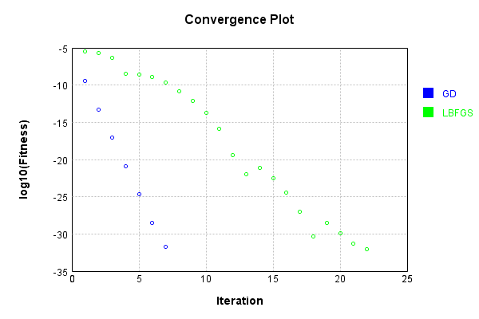


Code from [LearningTester.java:99](../../../../../../../src/main/java/com/simiacryptus/mindseye/test/unit/LearningTester.java#L99) executed in 0.00 seconds: 
```java
    return TestUtil.compareTime(runs);
```

Returns: 

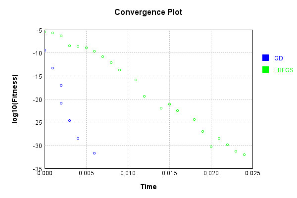


### Composite Learning
In this test, attempt to train a network to emulate a randomized network given an example input/output. The target state is:

Code from [LearningTester.java:219](../../../../../../../src/main/java/com/simiacryptus/mindseye/test/unit/LearningTester.java#L219) executed in 0.00 seconds: 
```java
    return network_target.state().stream().map(Arrays::toString).reduce((a, b) -> a + "\n" + b).orElse("");
```

Returns: 

```
    [0.0, 0.0, 0.0, 0.0, 0.0, 0.0, 0.0, 0.0, 0.0, 0.0]
    [0.0, 0.0, 0.0, 0.0, 0.0, 0.0, 0.0, 0.0, 0.0, 0.0]
    [0.0932, -0.031200000000000002, 0.024200000000000003, 0.027, -0.052, 0.009, 0.0974, -0.0718, 0.050800000000000005, 0.025400000000000002, -0.0454, 0.06760000000000001, -0.099, -0.0442, 0.0692, -0.0582, 0.019200000000000002, -0.0782, -0.0102, -0.064, 0.018400000000000003, 0.065, -0.022200000000000004, 0.0346, 0.032600000000000004, 0.0668, -0.06180000000000001, -0.004200000000000001, -0.011800000000000001, -0.008, 0.0682, 0.029400000000000003, 0.0936, 0.0044, 0.0792, 0.0108, -0.0852, 0.07680000000000001, -0.007600000000000001, 0.0344, 0.0286, 0.0274, 0.049800000000000004, -0.0548, 0.009800000000000001, 0.0712, 0.0124, -0.0842, 0.09980000000000001, 0.035800000000000005, -0.0604, 0.038, 0.0762, -0.029400000000000003, -0.0014000000000000002, 0.07160000000000001, -0.05240000000000001, -0.0302, 0.0804, 0.094, -0.034800000000000005, -0.095, -0.0936, 0.0772, 0.068, 0.0844, 0.09440000000000001, 0.076, -0.067600000000000
```
...[skipping 9334 bytes](etc/99.txt)...
```
    032600000000000004, -0.023, 0.0984, 0.0386, 0.0596, 0.0216, 0.073, -0.045, 0.0256, -0.06620000000000001, 0.0216, 0.042800000000000005, 0.023600000000000003, -0.046200000000000005, -0.0204, 0.09980000000000001, 0.0062, -0.0606, 0.1, 0.0534, -0.06, 0.09880000000000001, -0.0596, -0.0708, 0.0936, 0.057, 0.0482, 0.0178, 0.0102, -0.0752, 0.092, -0.0898, 0.0324, -0.0366, 0.0864, -0.048, -0.0912, 0.0512, -0.0194, -0.056, 0.07460000000000001, -0.0488, -0.0216, 0.0074, -0.0482, -0.09680000000000001, 0.011600000000000001, 0.0922, 0.0172, -0.0834, -0.036800000000000006, 0.0388, -0.0824, 0.0302, 0.01, -0.061200000000000004, -0.0228, 0.0054, -0.0734, 0.0632, -0.07, -0.07460000000000001, -0.05, 0.059800000000000006, 0.0432, -0.042, 0.0692, 0.055200000000000006, -0.0216, 0.09720000000000001, 0.0932, 0.08940000000000001, -0.0412, -0.0062, -0.009800000000000001, -0.07360000000000001, -0.091, -0.03, -0.03780000000000001, 0.0466, 0.0026, 0.05140000000000001, -0.0108, -0.0946, 0.020200000000000003, 0.0068000000000000005, -0.0268]
```


We simultaneously regress this target input:

Code from [LearningTester.java:223](../../../../../../../src/main/java/com/simiacryptus/mindseye/test/unit/LearningTester.java#L223) executed in 0.00 seconds: 
```java
    return Arrays.stream(testInput).map(x -> x.prettyPrint()).reduce((a, b) -> a + "\n" + b).orElse("");
```

Returns: 

```
    [
    	[ [ -0.0402, -0.07940000000000001, -0.0166 ], [ -0.038200000000000005, -0.08120000000000001, 0.0646 ], [ -0.0714, 0.0506, -0.0032 ], [ 0.0334, -0.0018, 0.0814 ], [ -0.083, 0.0244, 0.030400000000000003 ] ],
    	[ [ 0.0322, 0.04440000000000001, -0.0912 ], [ -0.09540000000000001, -0.018, 0.08580000000000002 ], [ -0.023200000000000002, -0.0526, 0.054200000000000005 ], [ -0.08380000000000001, 0.0626, 0.0892 ], [ 0.0534, -0.054, -0.019 ] ],
    	[ [ 0.084, 0.0416, 0.047200000000000006 ], [ 0.0396, -0.0028000000000000004, -0.094 ], [ 0.0228, -0.0456, -0.0062 ], [ -0.030400000000000003, -0.09060000000000001, 0.027 ], [ -0.0364, -0.040600000000000004, 0.0666 ] ],
    	[ [ -0.002, 0.0512, 0.0376 ], [ -0.0432, -0.0052, -0.0478 ], [ -0.0582, -0.0014000000000000002, 0.0488 ], [ -0.0912, 0.06760000000000001, -0.006600000000000001 ], [ -0.026200000000000005, -0.032, -0.09540000000000001 ] ],
    	[ [ -0.071, -0.0694, -0.09160000000000001 ], [ -0.024200000000000003, 0.026400000000000003, 0.0234 ], [ -0.0376, -0.022, -0.0762 ], [ 0.011, -0.0708, -0.039 ], [ 0.0446, 0.07379999999999999, 0.07579999999999999 ] ]
    ]
```


Which produces the following output:

Code from [LearningTester.java:230](../../../../../../../src/main/java/com/simiacryptus/mindseye/test/unit/LearningTester.java#L230) executed in 0.00 seconds: 
```java
    return Stream.of(targetOutput).map(x -> x.prettyPrint()).reduce((a, b) -> a + "\n" + b).orElse("");
```

Returns: 

```
    [ -0.0010488871223051088, 6.984833285812453E-4, 4.2239206229499615E-4, -0.001396076081022657, -2.4750017714392225E-4, -7.789261435019457E-4, 0.001046572981576066, -9.468397181949806E-4, 0.0014434573461665767, 0.001008150617726855 ]
```


First, we use a conjugate gradient descent method, which converges the fastest for purely linear functions.

Code from [LearningTester.java:300](../../../../../../../src/main/java/com/simiacryptus/mindseye/test/unit/LearningTester.java#L300) executed in 0.01 seconds: 
```java
    return new IterativeTrainer(trainable)
      .setLineSearchFactory(label -> new QuadraticSearch())
      .setOrientation(new GradientDescent())
      .setMonitor(monitor)
      .setTimeout(30, TimeUnit.SECONDS)
      .setMaxIterations(250)
      .setTerminateThreshold(0)
      .run();
```
Logging: 
```
    Constructing line search parameters: GD
    F(0.0) = LineSearchPoint{point=PointSample{avg=2.279915034940868E-6}, derivative=-2.322059359519728E-7}
    New Minimum: 2.279915034940868E-6 > 2.2799150349175265E-6
    F(1.0E-10) = LineSearchPoint{point=PointSample{avg=2.2799150349175265E-6}, derivative=-2.3220593595078404E-7}, delta = -2.3341686927486754E-17
    New Minimum: 2.2799150349175265E-6 > 2.2799150347784276E-6
    F(7.000000000000001E-10) = LineSearchPoint{point=PointSample{avg=2.2799150347784276E-6}, derivative=-2.3220593594369993E-7}, delta = -1.624405904926407E-16
    New Minimum: 2.2799150347784276E-6 > 2.279915033803118E-6
    F(4.900000000000001E-9) = LineSearchPoint{point=PointSample{avg=2.279915033803118E-6}, derivative=-2.322059358940291E-7}, delta = -1.1377503248615004E-15
    New Minimum: 2.279915033803118E-6 > 2.2799150269762445E-6
    F(3.430000000000001E-8) = LineSearchPoint{point=PointSample{avg=2.2799150269762445E-6}, derivative=-2.3220593554634767E-7}, delta = -7.964623697977874E-15
    New Minimum: 2.27991502697624
```
...[skipping 8380 bytes](etc/100.txt)...
```
    1E-31}, delta = 3.853585522004643E-29
    F(10.516934940268763) = LineSearchPoint{point=PointSample{avg=1.873544649899903E-31}, derivative=-4.5148978855649985E-32}, delta = -9.367723249499515E-31
    F(73.61854458188134) = LineSearchPoint{point=PointSample{avg=8.504906634414034E-30}, derivative=3.1113668888498904E-31}, delta = 7.380779844474091E-30
    F(5.662964967837026) = LineSearchPoint{point=PointSample{avg=4.930380657631324E-31}, derivative=-7.439180983554968E-32}, delta = -6.310887241768095E-31
    F(39.64075477485918) = LineSearchPoint{point=PointSample{avg=1.0896141253365226E-30}, derivative=1.1117375339627965E-31}, delta = -3.451266460341923E-32
    1.0896141253365226E-30 <= 1.1241267899399419E-30
    New Minimum: 4.930380657631324E-33 > 0.0
    F(19.993811003900607) = LineSearchPoint{point=PointSample{avg=0.0}, derivative=0.0}, delta = -1.1241267899399419E-30
    Right bracket at 19.993811003900607
    Converged to right
    Iteration 7 complete. Error: 0.0 Total: 250043469589553.5300; Orientation: 0.0001; Line Search: 0.0016
    
```

Returns: 

```
    0.0
```


Training Converged

Next, we run the same optimization using L-BFGS, which is nearly ideal for purely second-order or quadratic functions.

Code from [LearningTester.java:324](../../../../../../../src/main/java/com/simiacryptus/mindseye/test/unit/LearningTester.java#L324) executed in 0.03 seconds: 
```java
    return new IterativeTrainer(trainable)
      .setLineSearchFactory(label -> new ArmijoWolfeSearch())
      .setOrientation(new LBFGS())
      .setMonitor(monitor)
      .setTimeout(30, TimeUnit.SECONDS)
      .setMaxIterations(250)
      .setTerminateThreshold(0)
      .run();
```
Logging: 
```
    LBFGS Accumulation History: 1 points
    Constructing line search parameters: GD
    th(0)=2.279915034940868E-6;dx=-2.322059359519728E-7
    New Minimum: 2.279915034940868E-6 > 1.8070878565327092E-6
    END: th(2.154434690031884)=1.8070878565327092E-6; dx=-2.067279620189881E-7 delta=4.72827178408159E-7
    Iteration 1 complete. Error: 1.8070878565327092E-6 Total: 250043473221032.5300; Orientation: 0.0002; Line Search: 0.0007
    LBFGS Accumulation History: 1 points
    th(0)=1.8070878565327092E-6;dx=-1.8404563179039513E-7
    New Minimum: 1.8070878565327092E-6 > 1.0537902507738522E-6
    END: th(4.641588833612779)=1.0537902507738522E-6; dx=-1.4054056605532904E-7 delta=7.53297605758857E-7
    Iteration 2 complete. Error: 1.0537902507738522E-6 Total: 250043474145787.5300; Orientation: 0.0002; Line Search: 0.0006
    LBFGS Accumulation History: 1 points
    th(0)=1.0537902507738522E-6;dx=-1.0731991218831012E-7
    New Minimum: 1.0537902507738522E-6 > 2.5385088776193933E-7
    END: th(10.000000000000002)=2.5385088776193933E-7; dx=-5.266819545026262E-8 de
```
...[skipping 9623 bytes](etc/101.txt)...
```
    -31
    Iteration 21 complete. Error: 2.465190328815662E-32 Total: 250043495713237.5000; Orientation: 0.0001; Line Search: 0.0009
    LBFGS Accumulation History: 1 points
    th(0)=2.465190328815662E-32;dx=-2.4824662169042608E-33
    Armijo: th(36.52673831569902)=2.465190328815662E-32; dx=2.4824662169042608E-33 delta=0.0
    New Minimum: 2.465190328815662E-32 > 4.930380657631324E-33
    WOLF (strong): th(18.26336915784951)=4.930380657631324E-33; dx=4.939392656977182E-34 delta=1.9721522630525296E-32
    END: th(6.08778971928317)=4.930380657631324E-33; dx=-4.982853189138037E-34 delta=1.9721522630525296E-32
    Iteration 22 complete. Error: 4.930380657631324E-33 Total: 250043497044086.5000; Orientation: 0.0001; Line Search: 0.0010
    LBFGS Accumulation History: 1 points
    th(0)=4.930380657631324E-33;dx=-4.997518606197589E-34
    New Minimum: 4.930380657631324E-33 > 0.0
    END: th(13.115745356843124)=0.0; dx=0.0 delta=4.930380657631324E-33
    Iteration 23 complete. Error: 0.0 Total: 250043497825781.5000; Orientation: 0.0001; Line Search: 0.0005
    
```

Returns: 

```
    0.0
```


Training Converged

Code from [LearningTester.java:96](../../../../../../../src/main/java/com/simiacryptus/mindseye/test/unit/LearningTester.java#L96) executed in 0.00 seconds: 
```java
    return TestUtil.compare(runs);
```

Returns: 

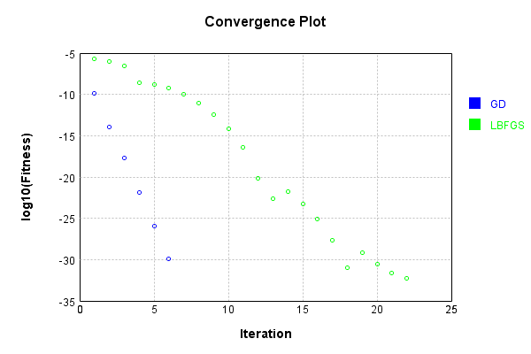


Code from [LearningTester.java:99](../../../../../../../src/main/java/com/simiacryptus/mindseye/test/unit/LearningTester.java#L99) executed in 0.00 seconds: 
```java
    return TestUtil.compareTime(runs);
```

Returns: 

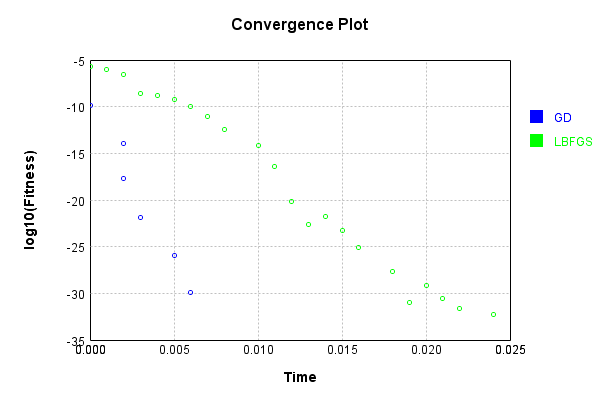


This is a network with the following layout:

Code from [NLayerTest.java:87](../../../../../../../src/test/java/com/simiacryptus/mindseye/network/NLayerTest.java#L87) executed in 0.17 seconds: 
```java
    return Graphviz.fromGraph(TestUtil.toGraph((DAGNetwork) layer))
      .height(400).width(600).render(Format.PNG).toImage();
```

Returns: 

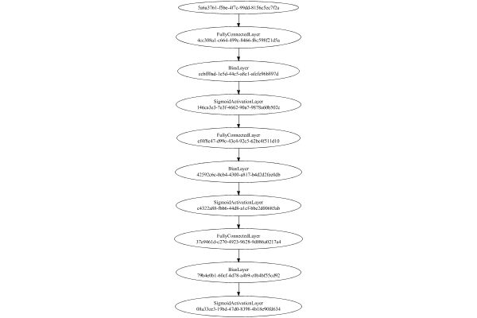


### Json Serialization
Code from [JsonTest.java:36](../../../../../../../src/main/java/com/simiacryptus/mindseye/test/unit/JsonTest.java#L36) executed in 0.00 seconds: 
```java
    JsonObject json = layer.getJson();
    NNLayer echo = NNLayer.fromJson(json);
    if ((echo == null)) throw new AssertionError("Failed to deserialize");
    if ((layer == echo)) throw new AssertionError("Serialization did not copy");
    if ((!layer.equals(echo))) throw new AssertionError("Serialization not equal");
    return new GsonBuilder().setPrettyPrinting().create().toJson(json);
```

Returns: 

```
    {
      "class": "com.simiacryptus.mindseye.network.PipelineNetwork",
      "id": "09d4eb72-e04b-4c17-8e5a-03508dac1c89",
      "isFrozen": false,
      "name": "PipelineNetwork/09d4eb72-e04b-4c17-8e5a-03508dac1c89",
      "inputs": [
        "5a6a3761-f5be-4f7c-99dd-8156c5ec7f2a"
      ],
      "nodes": {
        "54f3d809-6797-4450-a750-76ea0a33ee86": "4cc308a1-c664-499c-8466-f6c598f21d5a",
        "74ee715f-2b07-4388-979a-9735d19ea53c": "ccbff0ad-1e5d-44c5-a8e1-afcfe96b897d",
        "2883185d-0bd6-4062-b449-194aecb5f8f4": "146ca3e3-7e3f-4662-90a7-9878a60b502c",
        "273f2f65-9ca1-4d7d-bb0b-f7ce64675539": "ef4f8e47-d99c-43e4-92c5-62bc4f511d10",
        "c5549cd8-01aa-40dd-8860-b19c5f395270": "42592c6c-0cb4-4300-a817-b4d2d2fec0db",
        "c52969f5-5857-4d2c-bd76-086b34c15466": "c4322a88-fbb6-44d8-a1cf-bbe2d00685ab",
        "b35de86c-d36e-4440-b84e-39a8ee74878e": "37e9461d-c270-4923-9628-9d086a0217a4",
        "0149bd9c-a6e3-4322-8879-cbd685207f30": "79b4e0b1-60cf-4d78-a4b9-c0b4bf55cd92",
        "868993a4-e929-4a91-a527-62f856065a02": "08a33ce3-19bd-47d0-8398-4b18e90
```
...[skipping 26583 bytes](etc/102.txt)...
```
    47d0-8398-4b18e90fd634",
          "balanced": true
        }
      },
      "links": {
        "54f3d809-6797-4450-a750-76ea0a33ee86": [
          "5a6a3761-f5be-4f7c-99dd-8156c5ec7f2a"
        ],
        "74ee715f-2b07-4388-979a-9735d19ea53c": [
          "54f3d809-6797-4450-a750-76ea0a33ee86"
        ],
        "2883185d-0bd6-4062-b449-194aecb5f8f4": [
          "74ee715f-2b07-4388-979a-9735d19ea53c"
        ],
        "273f2f65-9ca1-4d7d-bb0b-f7ce64675539": [
          "2883185d-0bd6-4062-b449-194aecb5f8f4"
        ],
        "c5549cd8-01aa-40dd-8860-b19c5f395270": [
          "273f2f65-9ca1-4d7d-bb0b-f7ce64675539"
        ],
        "c52969f5-5857-4d2c-bd76-086b34c15466": [
          "c5549cd8-01aa-40dd-8860-b19c5f395270"
        ],
        "b35de86c-d36e-4440-b84e-39a8ee74878e": [
          "c52969f5-5857-4d2c-bd76-086b34c15466"
        ],
        "0149bd9c-a6e3-4322-8879-cbd685207f30": [
          "b35de86c-d36e-4440-b84e-39a8ee74878e"
        ],
        "868993a4-e929-4a91-a527-62f856065a02": [
          "0149bd9c-a6e3-4322-8879-cbd685207f30"
        ]
      },
      "labels": {},
      "head": "868993a4-e929-4a91-a527-62f856065a02"
    }
```


### Input Learning
In this test, we use a network to learn this target input, given it's pre-evaluated output:

Code from [LearningTester.java:127](../../../../../../../src/main/java/com/simiacryptus/mindseye/test/unit/LearningTester.java#L127) executed in 0.00 seconds: 
```java
    return Arrays.stream(input_target).map(x -> x.prettyPrint()).reduce((a, b) -> a + "\n" + b).orElse("");
```

Returns: 

```
    [
    	[ [ -0.06340000000000001, 0.08360000000000001, 0.0874 ], [ 0.0078000000000000005, -0.047200000000000006, 0.057 ], [ -0.042800000000000005, 0.06280000000000001, -0.0824 ], [ -0.029200000000000004, 0.0016, -0.066 ], [ -0.0038000000000000004, -0.009800000000000001, -0.09880000000000001 ] ],
    	[ [ 0.082, 0.06420000000000001, -0.07460000000000001 ], [ 0.0714, 0.005, 0.0298 ], [ -0.024, 0.0926, -0.07379999999999999 ], [ -0.088, 0.018400000000000003, 0.039400000000000004 ], [ 0.079, -0.0892, 0.098 ] ],
    	[ [ -0.0204, 0.09620000000000001, 0.062 ], [ 0.079, -0.0742, 0.0526 ], [ -0.04340000000000001, 0.09480000000000001, -0.058800000000000005 ], [ 0.016, 0.060200000000000004, -0.07560000000000001 ], [ 0.0824, 0.0908, -0.0228 ] ],
    	[ [ 0.0318, -0.0034000000000000002, -0.0688 ], [ -0.07060000000000001, 0.0286, 0.0302 ], [ 0.041400000000000006, -0.048400000000000006, 0.0244 ], [ 0.0772, 0.0604, 0.088 ], [ 0.012, -0.0936, 0.0722 ] ],
    	[ [ -0.0728, -0.0884, -0.08860000000000001 ], [ 0.023200000000000002, 0.0606, -0.0912 ], [ 0.025, 0.09040000000000001, -0.011200000000000002 ], [ 0.0708, 0.099, 0.07660000000000002 ], [ 0.06420000000000001, 0.07, 0.0562 ] ]
    ]
```


First, we use a conjugate gradient descent method, which converges the fastest for purely linear functions.

Code from [LearningTester.java:300](../../../../../../../src/main/java/com/simiacryptus/mindseye/test/unit/LearningTester.java#L300) executed in 0.48 seconds: 
```java
    return new IterativeTrainer(trainable)
      .setLineSearchFactory(label -> new QuadraticSearch())
      .setOrientation(new GradientDescent())
      .setMonitor(monitor)
      .setTimeout(30, TimeUnit.SECONDS)
      .setMaxIterations(250)
      .setTerminateThreshold(0)
      .run();
```
Logging: 
```
    Low gradient: 2.31174564122633E-7
    Constructing line search parameters: GD
    F(0.0) = LineSearchPoint{point=PointSample{avg=1.9302740904066244E-8}, derivative=-5.3441679097289355E-14}
    F(1.0E-10) = LineSearchPoint{point=PointSample{avg=1.9302740904066244E-8}, derivative=-5.3441679097289355E-14}, delta = 0.0
    F(7.000000000000001E-10) = LineSearchPoint{point=PointSample{avg=1.9302740904066244E-8}, derivative=-5.344167909728935E-14}, delta = 0.0
    F(4.900000000000001E-9) = LineSearchPoint{point=PointSample{avg=1.9302740904066244E-8}, derivative=-5.3441679097289355E-14}, delta = 0.0
    New Minimum: 1.9302740904066244E-8 > 1.930274090406394E-8
    F(3.430000000000001E-8) = LineSearchPoint{point=PointSample{avg=1.930274090406394E-8}, derivative=-5.344167909728469E-14}, delta = -2.302870825347629E-21
    New Minimum: 1.930274090406394E-8 > 1.9302740904045773E-8
    F(2.4010000000000004E-7) = LineSearchPoint{point=PointSample{avg=1.9302740904045773E-8}, derivative=-5.3441679097253516E-14}, delta = -2.047106579946233E-20
    New Mini
```
...[skipping 443344 bytes](etc/103.txt)...
```
    .032974987260558E-17
    F(186449.96705699168) = LineSearchPoint{point=PointSample{avg=1.2017873465183326E-14}, derivative=-2.6601879757205114E-23}, delta = -5.972566163318887E-18
    F(1305149.7693989417) = LineSearchPoint{point=PointSample{avg=1.2024569277709126E-14}, derivative=3.8572596957872233E-23}, delta = 7.232463624810606E-19
    F(100396.1361076109) = LineSearchPoint{point=PointSample{avg=1.2020378373540578E-14}, derivative=-3.16153009041736E-23}, delta = -3.4676578060662603E-18
    F(702772.9527532763) = LineSearchPoint{point=PointSample{avg=1.2011903939750938E-14}, derivative=3.4786469302875836E-24}, delta = -1.1942091595706627E-17
    1.2011903939750938E-14 <= 1.2023846031346645E-14
    F(643063.049591235) = LineSearchPoint{point=PointSample{avg=1.2011800083301987E-14}, derivative=-1.5097130065329986E-32}, delta = -1.2045948044657385E-17
    Left bracket at 643063.049591235
    Converged to left
    Iteration 250 complete. Error: 1.2011800079946678E-14 Total: 250044362477859.6200; Orientation: 0.0000; Line Search: 0.0010
    
```

Returns: 

```
    1.2011800083301987E-14
```


Training Converged

Next, we run the same optimization using L-BFGS, which is nearly ideal for purely second-order or quadratic functions.

Code from [LearningTester.java:324](../../../../../../../src/main/java/com/simiacryptus/mindseye/test/unit/LearningTester.java#L324) executed in 0.37 seconds: 
```java
    return new IterativeTrainer(trainable)
      .setLineSearchFactory(label -> new ArmijoWolfeSearch())
      .setOrientation(new LBFGS())
      .setMonitor(monitor)
      .setTimeout(30, TimeUnit.SECONDS)
      .setMaxIterations(250)
      .setTerminateThreshold(0)
      .run();
```
Logging: 
```
    LBFGS Accumulation History: 1 points
    Constructing line search parameters: GD
    th(0)=1.9302740904066244E-8;dx=-5.3441679097289355E-14
    New Minimum: 1.9302740904066244E-8 > 1.930262576768041E-8
    WOLFE (weak): th(2.154434690031884)=1.930262576768041E-8; dx=-5.34414600972406E-14 delta=1.151363858341368E-13
    New Minimum: 1.930262576768041E-8 > 1.930251063178134E-8
    WOLFE (weak): th(4.308869380063768)=1.930251063178134E-8; dx=-5.3441241097220267E-14 delta=2.302722849022616E-13
    New Minimum: 1.930251063178134E-8 > 1.9302050092895747E-8
    WOLFE (weak): th(12.926608140191302)=1.9302050092895747E-8; dx=-5.344036509710168E-14 delta=6.908111704969776E-13
    New Minimum: 1.9302050092895747E-8 > 1.929997776135003E-8
    WOLFE (weak): th(51.70643256076521)=1.929997776135003E-8; dx=-5.3436423096386204E-14 delta=2.7631427162146595E-12
    New Minimum: 1.929997776135003E-8 > 1.9288927908294474E-8
    WOLFE (weak): th(258.53216280382605)=1.9288927908294474E-8; dx=-5.341539908603177E-14 delta=1.3812995771769624E-11
    New Minimum: 1.92889279
```
...[skipping 330235 bytes](etc/104.txt)...
```
    > 7.855501313066667E-9
    WOLFE (weak): th(4.308869380063768)=7.855501313066667E-9; dx=-1.5571088933040095E-14 delta=6.709397597104516E-14
    New Minimum: 7.855501313066667E-9 > 7.855367126263699E-9
    WOLFE (weak): th(12.926608140191302)=7.855367126263699E-9; dx=-1.5570911279739304E-14 delta=2.012807789394123E-13
    New Minimum: 7.855367126263699E-9 > 7.854763304555756E-9
    WOLFE (weak): th(51.70643256076521)=7.854763304555756E-9; dx=-1.5570111839818252E-14 delta=8.051024868823325E-13
    New Minimum: 7.854763304555756E-9 > 7.851543445725542E-9
    WOLFE (weak): th(258.53216280382605)=7.851543445725542E-9; dx=-1.5565848160052756E-14 delta=4.024961317096447E-12
    New Minimum: 7.851543445725542E-9 > 7.831439307182737E-9
    WOLFE (weak): th(1551.1929768229563)=7.831439307182737E-9; dx=-1.5539200152438615E-14 delta=2.4129099859900958E-11
    MAX ALPHA: th(0)=7.855568407042638E-9;th'(0)=-1.5571177759684938E-14;
    Iteration 250 complete. Error: 7.831439307182737E-9 Total: 250044733618325.2800; Orientation: 0.0000; Line Search: 0.0009
    
```

Returns: 

```
    7.831439307182737E-9
```


Training Converged

Code from [LearningTester.java:96](../../../../../../../src/main/java/com/simiacryptus/mindseye/test/unit/LearningTester.java#L96) executed in 0.00 seconds: 
```java
    return TestUtil.compare(runs);
```

Returns: 

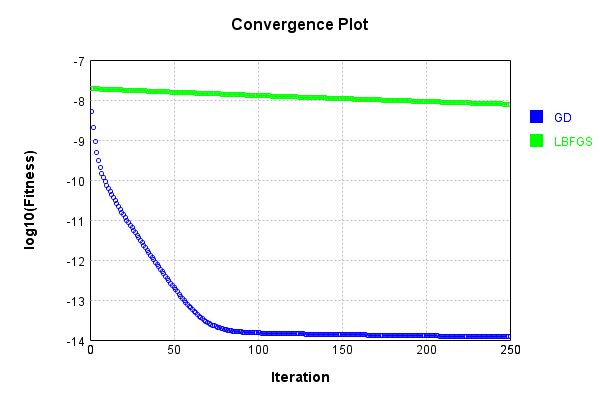


Code from [LearningTester.java:99](../../../../../../../src/main/java/com/simiacryptus/mindseye/test/unit/LearningTester.java#L99) executed in 0.00 seconds: 
```java
    return TestUtil.compareTime(runs);
```

Returns: 

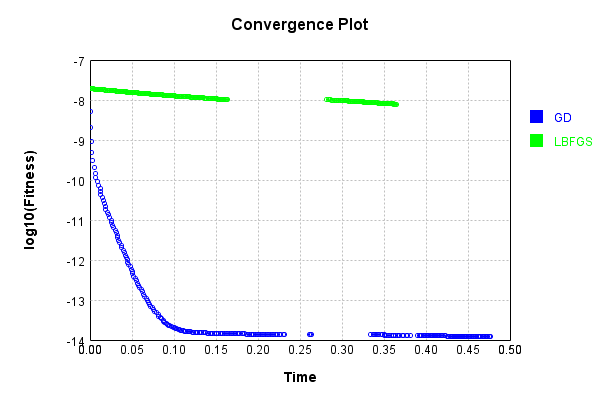


### Model Learning
In this test, attempt to train a network to emulate a randomized network given an example input/output. The target state is:

Code from [LearningTester.java:176](../../../../../../../src/main/java/com/simiacryptus/mindseye/test/unit/LearningTester.java#L176) executed in 0.00 seconds: 
```java
    return network_target.state().stream().map(Arrays::toString).reduce((a, b) -> a + "\n" + b).orElse("");
```

Returns: 

```
    [0.0852, 0.0656, 0.07840000000000001, 0.0576, -0.022200000000000004, -0.04, 0.0606, 0.03780000000000001, -0.07379999999999999, 0.07579999999999999, 0.06340000000000001, -0.067, -0.0648, 0.018600000000000002, 0.038200000000000005, -0.026400000000000003, 0.0032, -0.057, 2.0E-4, -0.007, -0.08560000000000001, -0.0028000000000000004, 0.038, -0.018600000000000002, 0.0826, 0.0918, 0.047400000000000005, -0.08, -0.030400000000000003, 0.0614, -0.09960000000000001, 0.0616, 0.08960000000000001, -0.0178, 0.0018, 0.01, 0.0632, -0.09140000000000001, 0.076, -0.0068000000000000005, -0.07479999999999999, -0.0516, 0.09860000000000001, -0.09720000000000001, -0.069, 0.0734, 0.067, 0.042800000000000005, -0.0416, 0.08380000000000001, -0.016, 0.0636, -0.058800000000000005, -0.066, -0.05280000000000001, -0.0592, -0.0078000000000000005, 0.0012000000000000001, -0.0512, -2.0E-4, 0.0208, 0.07680000000000001, -0.0396, -0.0576, 0.09780000000000001, 0.09880000000000001, 0.09060000000000001, 0.0182, -0.026200000000000005, 0.0636, 0.042400000
```
...[skipping 11268 bytes](etc/105.txt)...
```
    0000001, 0.0176, 0.0946, 0.052, 0.0456, 0.032, -0.017400000000000002, -0.05940000000000001, 0.0078000000000000005, -0.0172, 0.09040000000000001, -0.068, 0.0068000000000000005, 0.04240000000000001, 0.051, 0.038, 0.0658, 0.08380000000000001, 0.0882, -0.062200000000000005, 0.0456, 0.07660000000000002, 0.058, 0.004, -8.0E-4, -0.055200000000000006, 0.08680000000000002, 0.062400000000000004, 0.0356, -0.07980000000000001, -0.0258, 0.08860000000000001, 0.0704, 0.008400000000000001, -0.05840000000000001, 0.008400000000000001, -0.02, -0.0176, -0.06, 0.001, 0.0342, -0.0238, 0.054, 0.0032, -0.0942, 0.08880000000000002, -0.039400000000000004, 0.08880000000000002, 0.021200000000000004, -0.0616, 0.09680000000000001, -0.0664, -0.07260000000000001, 0.0892, 0.0656, -0.055400000000000005, 0.0038000000000000004, -0.05740000000000001, 0.043, 0.014600000000000002, 0.093, 0.0154, -0.06620000000000001, 0.0568, 0.07460000000000001, -0.0734, 0.09680000000000001, 0.0604, -0.047200000000000006, -0.0308, -0.0614, -0.0506, 0.0558, -0.012]
```


First, we use a conjugate gradient descent method, which converges the fastest for purely linear functions.

Code from [LearningTester.java:300](../../../../../../../src/main/java/com/simiacryptus/mindseye/test/unit/LearningTester.java#L300) executed in 0.01 seconds: 
```java
    return new IterativeTrainer(trainable)
      .setLineSearchFactory(label -> new QuadraticSearch())
      .setOrientation(new GradientDescent())
      .setMonitor(monitor)
      .setTimeout(30, TimeUnit.SECONDS)
      .setMaxIterations(250)
      .setTerminateThreshold(0)
      .run();
```
Logging: 
```
    Constructing line search parameters: GD
    F(0.0) = LineSearchPoint{point=PointSample{avg=1.025059945571528E-7}, derivative=-1.046471950587823E-8}
    New Minimum: 1.025059945571528E-7 > 1.0250599455612292E-7
    F(1.0E-10) = LineSearchPoint{point=PointSample{avg=1.0250599455612292E-7}, derivative=-1.0464719505825652E-8}, delta = -1.0298861847428224E-18
    New Minimum: 1.0250599455612292E-7 > 1.0250599454984099E-7
    F(7.000000000000001E-10) = LineSearchPoint{point=PointSample{avg=1.0250599454984099E-7}, derivative=-1.0464719505504936E-8}, delta = -7.311813393825735E-18
    New Minimum: 1.0250599454984099E-7 > 1.0250599450587858E-7
    F(4.900000000000001E-9) = LineSearchPoint{point=PointSample{avg=1.0250599450587858E-7}, derivative=-1.0464719503260534E-8}, delta = -5.127422625464281E-17
    New Minimum: 1.0250599450587858E-7 > 1.0250599419820131E-7
    F(3.430000000000001E-8) = LineSearchPoint{point=PointSample{avg=1.0250599419820131E-7}, derivative=-1.046471948755278E-8}, delta = -3.5895149310180953E-16
    New Minimum: 1.02505994198
```
...[skipping 6647 bytes](etc/106.txt)...
```
    earchPoint{point=PointSample{avg=1.479114197289397E-32}, derivative=1.7410269460233725E-32}, delta = -1.3173977117190897E-29
    1.479114197289397E-32 <= 1.318876825916379E-29
    New Minimum: 1.479114197289397E-32 > 4.930380657631324E-33
    F(19.451150355639818) = LineSearchPoint{point=PointSample{avg=4.930380657631324E-33}, derivative=-8.899185368027687E-33}, delta = -1.318383787850616E-29
    Left bracket at 19.451150355639818
    Converged to left
    Iteration 7 complete. Error: 4.930380657631324E-33 Total: 250044869370346.1200; Orientation: 0.0001; Line Search: 0.0009
    Zero gradient: 2.224431364042509E-17
    F(0.0) = LineSearchPoint{point=PointSample{avg=4.930380657631324E-33}, derivative=-4.9480948933360165E-34}
    New Minimum: 4.930380657631324E-33 > 0.0
    F(19.451150355639818) = LineSearchPoint{point=PointSample{avg=0.0}, derivative=0.0}, delta = -4.930380657631324E-33
    0.0 <= 4.930380657631324E-33
    Converged to right
    Iteration 8 complete. Error: 0.0 Total: 250044869987324.1200; Orientation: 0.0001; Line Search: 0.0004
    
```

Returns: 

```
    0.0
```


Training Converged

Next, we run the same optimization using L-BFGS, which is nearly ideal for purely second-order or quadratic functions.

Code from [LearningTester.java:324](../../../../../../../src/main/java/com/simiacryptus/mindseye/test/unit/LearningTester.java#L324) executed in 0.03 seconds: 
```java
    return new IterativeTrainer(trainable)
      .setLineSearchFactory(label -> new ArmijoWolfeSearch())
      .setOrientation(new LBFGS())
      .setMonitor(monitor)
      .setTimeout(30, TimeUnit.SECONDS)
      .setMaxIterations(250)
      .setTerminateThreshold(0)
      .run();
```
Logging: 
```
    LBFGS Accumulation History: 1 points
    Constructing line search parameters: GD
    th(0)=1.1865020743864242E-7;dx=-1.218222872463258E-8
    New Minimum: 1.1865020743864242E-7 > 9.385590052202627E-8
    END: th(2.154434690031884)=9.385590052202627E-8; dx=-1.08347669858115E-8 delta=2.479430691661615E-8
    Iteration 1 complete. Error: 9.385590052202627E-8 Total: 250044875521605.1200; Orientation: 0.0002; Line Search: 0.0007
    LBFGS Accumulation History: 1 points
    th(0)=9.385590052202627E-8;dx=-9.636355664477008E-9
    New Minimum: 9.385590052202627E-8 > 5.445714340558858E-8
    END: th(4.641588833612779)=5.445714340558858E-8; dx=-7.340054450851297E-9 delta=3.939875711643769E-8
    Iteration 2 complete. Error: 5.445714340558858E-8 Total: 250044876538408.1200; Orientation: 0.0002; Line Search: 0.0006
    LBFGS Accumulation History: 1 points
    th(0)=5.445714340558858E-8;dx=-5.590986001210391E-9
    New Minimum: 5.445714340558858E-8 > 1.2898553147796198E-8
    END: th(10.000000000000002)=1.2898553147796198E-8; dx=-2.720732732436817E-9 delta=4.1558
```
...[skipping 9218 bytes](etc/107.txt)...
```
    .0009
    LBFGS Accumulation History: 1 points
    th(0)=1.479114197289397E-32;dx=-1.4928472751516497E-33
    Armijo: th(33.90842013888892)=1.9721522630525296E-32; dx=1.4954921858552378E-33 delta=-4.9303806576313254E-33
    New Minimum: 1.479114197289397E-32 > 4.930380657631324E-33
    END: th(16.95421006944446)=4.930380657631324E-33; dx=-4.985303891991201E-34 delta=9.860761315262647E-33
    Iteration 21 complete. Error: 4.930380657631324E-33 Total: 250044899195900.1000; Orientation: 0.0002; Line Search: 0.0010
    LBFGS Accumulation History: 1 points
    th(0)=4.930380657631324E-33;dx=-4.9748986346120436E-34
    Armijo: th(36.52673831569902)=9.860761315262648E-33; dx=4.986232869332207E-34 delta=-4.930380657631324E-33
    Armijo: th(18.26336915784951)=9.860761315262648E-33; dx=4.986232869332207E-34 delta=-4.930380657631324E-33
    New Minimum: 4.930380657631324E-33 > 0.0
    END: th(6.08778971928317)=0.0; dx=0.0 delta=4.930380657631324E-33
    Iteration 22 complete. Error: 0.0 Total: 250044900645300.1000; Orientation: 0.0001; Line Search: 0.0011
    
```

Returns: 

```
    0.0
```


Training Converged

Code from [LearningTester.java:96](../../../../../../../src/main/java/com/simiacryptus/mindseye/test/unit/LearningTester.java#L96) executed in 0.00 seconds: 
```java
    return TestUtil.compare(runs);
```

Returns: 

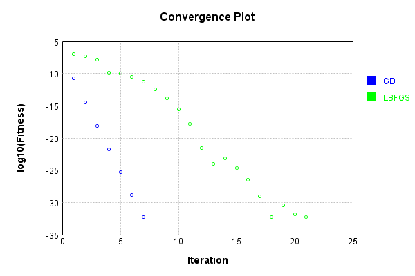


Code from [LearningTester.java:99](../../../../../../../src/main/java/com/simiacryptus/mindseye/test/unit/LearningTester.java#L99) executed in 0.00 seconds: 
```java
    return TestUtil.compareTime(runs);
```

Returns: 

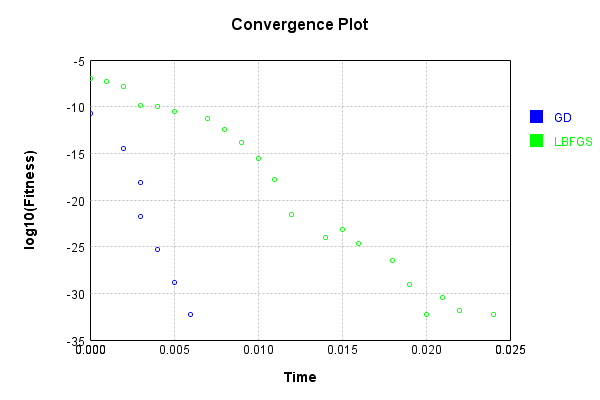


### Composite Learning
In this test, attempt to train a network to emulate a randomized network given an example input/output. The target state is:

Code from [LearningTester.java:219](../../../../../../../src/main/java/com/simiacryptus/mindseye/test/unit/LearningTester.java#L219) executed in 0.00 seconds: 
```java
    return network_target.state().stream().map(Arrays::toString).reduce((a, b) -> a + "\n" + b).orElse("");
```

Returns: 

```
    [0.0012000000000000001, -0.0648, 0.08380000000000001, 0.0616, 0.056600000000000004, -0.0516, -0.0692, -0.026400000000000003, -0.09720000000000001, -0.04, -0.037200000000000004, -0.0396, 0.01, 0.0208, 0.09880000000000001, 0.0734, 0.038, -0.07479999999999999, 0.07579999999999999, -0.030400000000000003, 0.06340000000000001, -0.08940000000000001, -0.07540000000000001, 0.038200000000000005, -0.07260000000000001, 0.029400000000000003, -0.09620000000000001, -0.0068000000000000005, 0.076, 0.019200000000000002, 0.046400000000000004, 0.0636, 0.042800000000000005, 0.0614, 0.0718, -0.067, -0.09140000000000001, -0.09960000000000001, 0.07680000000000001, -0.0816, 0.018600000000000002, -0.033800000000000004, 0.047400000000000005, 0.0826, 0.0114, -0.0028000000000000004, 0.0576, -0.066, -0.018600000000000002, 0.0656, 2.0E-4, -0.069, -0.0512, 0.0636, 0.07640000000000001, -0.08, -0.07379999999999999, 0.0664, 0.08780000000000002, 0.0182, -0.0576, -0.058800000000000005, 0.0852, 0.0522, 0.09060000000000001, -0.057, -2.0E-4, -0.052
```
...[skipping 11268 bytes](etc/108.txt)...
```
    0000000000001, 0.09680000000000001, -0.055200000000000006, 0.0704, 0.0454, 0.0656, -0.062200000000000005, 0.08880000000000002, 0.09680000000000001, 0.07460000000000001, 0.08880000000000002, 0.07940000000000001, -0.0308, -0.066, 0.0558, -0.049800000000000004, 0.0892, -0.017400000000000002, -0.07980000000000001, 0.052, -0.0734, 0.07660000000000002, -0.055400000000000005, 0.04240000000000001, 0.013600000000000001, 0.0176, -0.034, 0.0078000000000000005, -0.053, 0.0658, 0.0038000000000000004, 0.0604, -0.05740000000000001, -0.0616, 0.0456, -0.039400000000000004, 0.05, 0.08460000000000001, 0.021200000000000004, 0.014600000000000002, 0.0882, 0.04340000000000001, 0.09780000000000001, -0.060200000000000004, -0.0258, 0.08380000000000001, -0.068, 0.008400000000000001, 0.008400000000000001, 0.051, -0.06620000000000001, 0.0946, -0.07260000000000001, -0.0172, 0.0068000000000000005, 0.0654, 0.0422, -0.0664, 0.089, 0.054, -0.08880000000000002, 0.0032, 0.0946, 0.038, -0.0614, 0.0342, 0.058, -0.06, -0.0238, 0.08860000000000001]
```


We simultaneously regress this target input:

Code from [LearningTester.java:223](../../../../../../../src/main/java/com/simiacryptus/mindseye/test/unit/LearningTester.java#L223) executed in 0.00 seconds: 
```java
    return Arrays.stream(testInput).map(x -> x.prettyPrint()).reduce((a, b) -> a + "\n" + b).orElse("");
```

Returns: 

```
    [
    	[ [ -0.042800000000000005, 0.0526, 0.088 ], [ 0.0772, -0.011200000000000002, 0.0926 ], [ -0.024, 0.060200000000000004, 0.0722 ], [ -0.0228, 0.0298, 0.0824 ], [ -0.047200000000000006, 0.099, 0.079 ] ],
    	[ [ 0.0078000000000000005, 0.023200000000000002, 0.082 ], [ -0.009800000000000001, -0.0824, 0.0606 ], [ 0.07, 0.098, -0.08860000000000001 ], [ 0.012, -0.0034000000000000002, -0.09880000000000001 ], [ 0.041400000000000006, 0.0244, 0.0708 ] ],
    	[ [ 0.0908, 0.0286, 0.09480000000000001 ], [ -0.0892, 0.057, -0.0936 ], [ 0.039400000000000004, -0.0912, 0.0016 ], [ 0.0874, 0.018400000000000003, -0.066 ], [ -0.0884, 0.0604, 0.0714 ] ],
    	[ [ 0.06420000000000001, 0.016, 0.07660000000000002 ], [ -0.0038000000000000004, 0.09040000000000001, -0.0742 ], [ -0.029200000000000004, 0.0302, -0.058800000000000005 ], [ -0.07460000000000001, 0.0562, 0.08360000000000001 ], [ 0.0318, -0.0204, 0.005 ] ],
    	[ [ -0.07379999999999999, -0.06340000000000001, -0.04340000000000001 ], [ -0.088, -0.0688, -0.07060000000000001 ], [ 0.06420000000000001, 0.06280000000000001, 0.079 ], [ -0.048400000000000006, 0.062, -0.0728 ], [ -0.07560000000000001, 0.09620000000000001, 0.025 ] ]
    ]
```


Which produces the following output:

Code from [LearningTester.java:230](../../../../../../../src/main/java/com/simiacryptus/mindseye/test/unit/LearningTester.java#L230) executed in 0.00 seconds: 
```java
    return Stream.of(targetOutput).map(x -> x.prettyPrint()).reduce((a, b) -> a + "\n" + b).orElse("");
```

Returns: 

```
    [ 1.946929358997984E-5, 1.3417532045401082E-4, 1.834352754126467E-4, 1.8983189576271542E-5, 1.2826827200296265E-4, 8.344090972167706E-6, 1.9301360828594127E-4, 1.5785539476231847E-5, -1.3494194786900504E-4, -4.2961529018392675E-5 ]
```


First, we use a conjugate gradient descent method, which converges the fastest for purely linear functions.

Code from [LearningTester.java:300](../../../../../../../src/main/java/com/simiacryptus/mindseye/test/unit/LearningTester.java#L300) executed in 0.08 seconds: 
```java
    return new IterativeTrainer(trainable)
      .setLineSearchFactory(label -> new QuadraticSearch())
      .setOrientation(new GradientDescent())
      .setMonitor(monitor)
      .setTimeout(30, TimeUnit.SECONDS)
      .setMaxIterations(250)
      .setTerminateThreshold(0)
      .run();
```
Logging: 
```
    Constructing line search parameters: GD
    F(0.0) = LineSearchPoint{point=PointSample{avg=2.259073405681326E-8}, derivative=-2.2963475130307957E-9}
    New Minimum: 2.259073405681326E-8 > 2.259073405657302E-8
    F(1.0E-10) = LineSearchPoint{point=PointSample{avg=2.259073405657302E-8}, derivative=-2.2963475130185885E-9}, delta = -2.4023971966500093E-19
    New Minimum: 2.259073405657302E-8 > 2.2590734055197903E-8
    F(7.000000000000001E-10) = LineSearchPoint{point=PointSample{avg=2.2590734055197903E-8}, derivative=-2.296347512948687E-9}, delta = -1.615358004862955E-18
    New Minimum: 2.2590734055197903E-8 > 2.2590734045549996E-8
    F(4.900000000000001E-9) = LineSearchPoint{point=PointSample{avg=2.2590734045549996E-8}, derivative=-2.296347512458279E-9}, delta = -1.1263265106158899E-17
    New Minimum: 2.2590734045549996E-8 > 2.2590733978039048E-8
    F(3.430000000000001E-8) = LineSearchPoint{point=PointSample{avg=2.2590733978039048E-8}, derivative=-2.2963475090266778E-9}, delta = -7.877421298716019E-17
    New Minimum: 2.25907339780390
```
...[skipping 7152 bytes](etc/109.txt)...
```
    .0004
    Zero gradient: 1.5523854425925112E-14
    F(0.0) = LineSearchPoint{point=PointSample{avg=2.371429279849487E-27}, derivative=-2.409900562373147E-28}
    New Minimum: 2.371429279849487E-27 > 4.5359502050208175E-31
    F(19.695021941887703) = LineSearchPoint{point=PointSample{avg=4.5359502050208175E-31}, derivative=4.414511035543356E-31}, delta = -2.3709756848289852E-27
    4.5359502050208175E-31 <= 2.371429279849487E-27
    Converged to right
    Iteration 6 complete. Error: 4.5359502050208175E-31 Total: 250045053941444.9400; Orientation: 0.0002; Line Search: 0.0004
    Zero gradient: 2.1487644125387447E-16
    F(0.0) = LineSearchPoint{point=PointSample{avg=4.5359502050208175E-31}, derivative=-4.617188500592976E-32}
    New Minimum: 4.5359502050208175E-31 > 0.0
    F(19.695021941887703) = LineSearchPoint{point=PointSample{avg=0.0}, derivative=0.0}, delta = -4.5359502050208175E-31
    0.0 <= 4.5359502050208175E-31
    Converged to right
    Iteration 7 complete. Error: 0.0 Total: 250045101694418.9400; Orientation: 0.0001; Line Search: 0.0475
    
```

Returns: 

```
    0.0
```


Training Converged

Next, we run the same optimization using L-BFGS, which is nearly ideal for purely second-order or quadratic functions.

Code from [LearningTester.java:324](../../../../../../../src/main/java/com/simiacryptus/mindseye/test/unit/LearningTester.java#L324) executed in 0.06 seconds: 
```java
    return new IterativeTrainer(trainable)
      .setLineSearchFactory(label -> new ArmijoWolfeSearch())
      .setOrientation(new LBFGS())
      .setMonitor(monitor)
      .setTimeout(30, TimeUnit.SECONDS)
      .setMaxIterations(250)
      .setTerminateThreshold(0)
      .run();
```
Logging: 
```
    LBFGS Accumulation History: 1 points
    Constructing line search parameters: GD
    th(0)=2.259073405681326E-8;dx=-2.2963475130307957E-9
    New Minimum: 2.259073405681326E-8 > 1.791429627751776E-8
    END: th(2.154434690031884)=1.791429627751776E-8; dx=-2.0448727649704316E-9 delta=4.6764377792954994E-9
    Iteration 1 complete. Error: 1.791429627751776E-8 Total: 250045114416423.8800; Orientation: 0.0005; Line Search: 0.0016
    LBFGS Accumulation History: 1 points
    th(0)=1.791429627751776E-8;dx=-1.8209401299749537E-9
    New Minimum: 1.791429627751776E-8 > 1.0459277431781775E-8
    END: th(4.641588833612779)=1.0459277431781775E-8; dx=-1.3913301226109399E-9 delta=7.455018845735986E-9
    Iteration 2 complete. Error: 1.0459277431781775E-8 Total: 250045117357115.8800; Orientation: 0.0004; Line Search: 0.0021
    LBFGS Accumulation History: 1 points
    th(0)=1.0459277431781775E-8;dx=-1.0630877262581173E-9
    New Minimum: 1.0459277431781775E-8 > 2.530010019524208E-9
    END: th(10.000000000000002)=2.530010019524208E-9; dx=-5.22765779533399E-10 delt
```
...[skipping 8610 bytes](etc/110.txt)...
```
    250045169743553.8400; Orientation: 0.0002; Line Search: 0.0010
    LBFGS Accumulation History: 1 points
    th(0)=1.1339875512552044E-31;dx=-1.1381740764022326E-32
    New Minimum: 1.1339875512552044E-31 > 3.944304526105059E-32
    WOLF (strong): th(31.477788856423498)=3.944304526105059E-32; dx=5.934404337701406E-33 delta=7.395570986446985E-32
    New Minimum: 3.944304526105059E-32 > 4.930380657631324E-33
    END: th(15.738894428211749)=4.930380657631324E-33; dx=-1.4842553272737385E-33 delta=1.084683744678891E-31
    Iteration 20 complete. Error: 4.930380657631324E-33 Total: 250045171476222.8400; Orientation: 0.0003; Line Search: 0.0012
    LBFGS Accumulation History: 1 points
    th(0)=4.930380657631324E-33;dx=-4.9914436921847315E-34
    Armijo: th(33.90842013888892)=4.930380657631324E-33; dx=4.9914436921847315E-34 delta=0.0
    New Minimum: 4.930380657631324E-33 > 0.0
    END: th(16.95421006944446)=0.0; dx=0.0 delta=4.930380657631324E-33
    Iteration 21 complete. Error: 0.0 Total: 250045173010545.8400; Orientation: 0.0002; Line Search: 0.0011
    
```

Returns: 

```
    0.0
```


Training Converged

Code from [LearningTester.java:96](../../../../../../../src/main/java/com/simiacryptus/mindseye/test/unit/LearningTester.java#L96) executed in 0.00 seconds: 
```java
    return TestUtil.compare(runs);
```

Returns: 

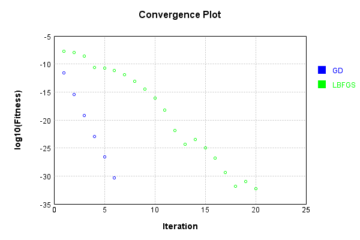


Code from [LearningTester.java:99](../../../../../../../src/main/java/com/simiacryptus/mindseye/test/unit/LearningTester.java#L99) executed in 0.00 seconds: 
```java
    return TestUtil.compareTime(runs);
```

Returns: 

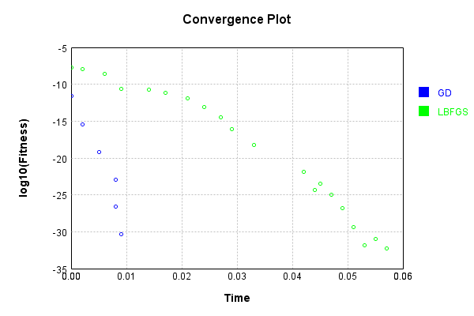


This is a network with the following layout:

Code from [NLayerTest.java:87](../../../../../../../src/test/java/com/simiacryptus/mindseye/network/NLayerTest.java#L87) executed in 0.20 seconds: 
```java
    return Graphviz.fromGraph(TestUtil.toGraph((DAGNetwork) layer))
      .height(400).width(600).render(Format.PNG).toImage();
```

Returns: 

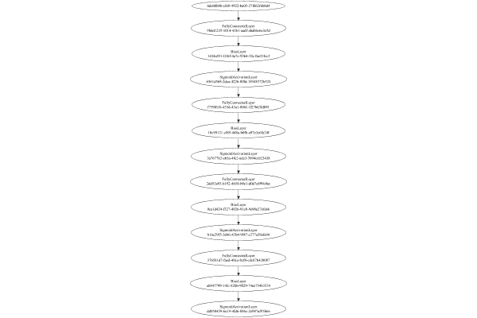


### Json Serialization
Code from [JsonTest.java:36](../../../../../../../src/main/java/com/simiacryptus/mindseye/test/unit/JsonTest.java#L36) executed in 0.00 seconds: 
```java
    JsonObject json = layer.getJson();
    NNLayer echo = NNLayer.fromJson(json);
    if ((echo == null)) throw new AssertionError("Failed to deserialize");
    if ((layer == echo)) throw new AssertionError("Serialization did not copy");
    if ((!layer.equals(echo))) throw new AssertionError("Serialization not equal");
    return new GsonBuilder().setPrettyPrinting().create().toJson(json);
```

Returns: 

```
    {
      "class": "com.simiacryptus.mindseye.network.PipelineNetwork",
      "id": "02f6020b-e976-4574-bcb2-0cebc8a47310",
      "isFrozen": false,
      "name": "PipelineNetwork/02f6020b-e976-4574-bcb2-0cebc8a47310",
      "inputs": [
        "6deb0b8b-cf68-4922-ba05-27f062f6b8d4"
      ],
      "nodes": {
        "e8a4c6ec-c31e-4e37-aa36-feb49f6f2eff": "9b6d1235-1014-41b1-aadf-ababbc6e3e5d",
        "de798a15-2f24-4f46-9665-8dd9476f6ad4": "1434a951-026f-4a7c-9264-28c1be23fccf",
        "51ffe4e1-7a5d-4ca0-b99c-ae47f6b330bd": "6561d568-2dca-4226-8f0d-18548372b524",
        "bc0393c2-6e9c-4e28-ae81-7e538138e296": "f759f61b-433d-43a1-80bf-1f27b63fd091",
        "3c4859aa-b82e-4c83-b321-3d08fc60f901": "10c99121-cf89-448a-b0fb-a97e3c6fa24f",
        "7d4f7a7f-e311-42c1-aee3-b045b48afdf7": "3a7677b2-e63a-4fe2-ade3-7694ccb23438",
        "31a91dda-2601-47eb-a95b-33f239acfb02": "2dd53a93-6192-4658-b9e1-d0d7e699c0ac",
        "67609261-5cc9-4d1b-ac5c-5f60f945754a": "0ca1d424-f327-4026-91c8-9e90e27efa66",
        "9dbd1d25-1f71-46fe-abde-baae52cdd3b4": "b16e29f5-3d46-42b4-9f47-c277a58
```
...[skipping 30738 bytes](etc/111.txt)...
```
    9c-ae47f6b330bd": [
          "de798a15-2f24-4f46-9665-8dd9476f6ad4"
        ],
        "bc0393c2-6e9c-4e28-ae81-7e538138e296": [
          "51ffe4e1-7a5d-4ca0-b99c-ae47f6b330bd"
        ],
        "3c4859aa-b82e-4c83-b321-3d08fc60f901": [
          "bc0393c2-6e9c-4e28-ae81-7e538138e296"
        ],
        "7d4f7a7f-e311-42c1-aee3-b045b48afdf7": [
          "3c4859aa-b82e-4c83-b321-3d08fc60f901"
        ],
        "31a91dda-2601-47eb-a95b-33f239acfb02": [
          "7d4f7a7f-e311-42c1-aee3-b045b48afdf7"
        ],
        "67609261-5cc9-4d1b-ac5c-5f60f945754a": [
          "31a91dda-2601-47eb-a95b-33f239acfb02"
        ],
        "9dbd1d25-1f71-46fe-abde-baae52cdd3b4": [
          "67609261-5cc9-4d1b-ac5c-5f60f945754a"
        ],
        "c6eecb5f-74eb-4224-ae0c-e2630216a227": [
          "9dbd1d25-1f71-46fe-abde-baae52cdd3b4"
        ],
        "6857ab46-4850-4c0a-92f9-b48dc1a2ca89": [
          "c6eecb5f-74eb-4224-ae0c-e2630216a227"
        ],
        "575e0a00-24ba-4d1a-87a6-462297ae7642": [
          "6857ab46-4850-4c0a-92f9-b48dc1a2ca89"
        ]
      },
      "labels": {},
      "head": "575e0a00-24ba-4d1a-87a6-462297ae7642"
    }
```


### Input Learning
In this test, we use a network to learn this target input, given it's pre-evaluated output:

Code from [LearningTester.java:127](../../../../../../../src/main/java/com/simiacryptus/mindseye/test/unit/LearningTester.java#L127) executed in 0.00 seconds: 
```java
    return Arrays.stream(input_target).map(x -> x.prettyPrint()).reduce((a, b) -> a + "\n" + b).orElse("");
```

Returns: 

```
    [
    	[ [ -0.05380000000000001, 0.0016, 0.0722 ], [ 0.07540000000000001, 0.07440000000000001, -0.09480000000000001 ], [ -0.0834, -0.0334, -0.0398 ], [ -0.08760000000000001, -0.0048000000000000004, 0.09860000000000001 ], [ -0.026400000000000003, -0.086, -0.07840000000000001 ] ],
    	[ [ -0.082, -0.006, -0.007 ], [ 0.07260000000000001, 0.062, -0.026400000000000003 ], [ 0.079, 0.0526, -0.0256 ], [ -0.0104, 0.042800000000000005, -0.0882 ], [ -0.0966, -0.0712, 0.098 ] ],
    	[ [ -0.0316, -0.0568, 0.0208 ], [ -0.0354, 0.07579999999999999, -0.0702 ], [ -0.056, 0.051, -0.0558 ], [ -0.08580000000000002, -0.051, 0.05280000000000001 ], [ -0.0704, 0.0134, 0.07540000000000001 ] ],
    	[ [ 0.0064, 0.06720000000000001, -0.0792 ], [ 0.0398, 0.0536, 0.0102 ], [ 0.0218, 0.09860000000000001, 0.0884 ], [ 0.08780000000000002, -0.049800000000000004, 0.043 ], [ 0.046, 0.024200000000000003, 0.036800000000000006 ] ],
    	[ [ -0.0834, 0.07260000000000001, -0.033600000000000005 ], [ -0.0426, 0.0068000000000000005, -0.047400000000000005 ], [ 0.013200000000000002, -0.0412, -0.09860000000000001 ], [ -0.007, 0.06080000000000001, -0.0456 ], [ -0.0064, 0.024, 0.025400000000000002 ] ]
    ]
```


First, we use a conjugate gradient descent method, which converges the fastest for purely linear functions.

Code from [LearningTester.java:300](../../../../../../../src/main/java/com/simiacryptus/mindseye/test/unit/LearningTester.java#L300) executed in 0.36 seconds: 
```java
    return new IterativeTrainer(trainable)
      .setLineSearchFactory(label -> new QuadraticSearch())
      .setOrientation(new GradientDescent())
      .setMonitor(monitor)
      .setTimeout(30, TimeUnit.SECONDS)
      .setMaxIterations(250)
      .setTerminateThreshold(0)
      .run();
```
Logging: 
```
    Low gradient: 4.482203741783177E-9
    Constructing line search parameters: GD
    F(0.0) = LineSearchPoint{point=PointSample{avg=2.5488252493234384E-10}, derivative=-2.0090150382855115E-17}
    F(1.0E-10) = LineSearchPoint{point=PointSample{avg=2.5488252493234384E-10}, derivative=-2.0090150382855115E-17}, delta = 0.0
    F(7.000000000000001E-10) = LineSearchPoint{point=PointSample{avg=2.5488252493234384E-10}, derivative=-2.0090150382855115E-17}, delta = 0.0
    F(4.900000000000001E-9) = LineSearchPoint{point=PointSample{avg=2.5488252493234384E-10}, derivative=-2.0090150382855115E-17}, delta = 0.0
    F(3.430000000000001E-8) = LineSearchPoint{point=PointSample{avg=2.5488252493234384E-10}, derivative=-2.0090150382855115E-17}, delta = 0.0
    F(2.4010000000000004E-7) = LineSearchPoint{point=PointSample{avg=2.5488252493234384E-10}, derivative=-2.0090150382855118E-17}, delta = 0.0
    F(1.6807000000000003E-6) = LineSearchPoint{point=PointSample{avg=2.5488252493234384E-10}, derivative=-2.0090150382855118E-17}, delta = 0.0
    F(1.1764900000
```
...[skipping 306555 bytes](etc/112.txt)...
```
    9069239398604E-23}, delta = -5.599599485629437E-16
    F(9.290556732541116E7) = LineSearchPoint{point=PointSample{avg=2.588778037976005E-13}, derivative=7.48052544350455E-23}, delta = 1.0969946522457857E-15
    F(7146582.101954704) = LineSearchPoint{point=PointSample{avg=2.5744960754610917E-13}, derivative=-4.1498080254425096E-23}, delta = -3.312015992455161E-16
    New Minimum: 2.569310214905583E-13 > 2.5691694869411086E-13
    F(5.002607471368293E7) = LineSearchPoint{point=PointSample{avg=2.5691694869411086E-13}, derivative=1.6653612658808625E-23}, delta = -8.638604512438314E-16
    2.5691694869411086E-13 <= 2.577808091453547E-13
    New Minimum: 2.5691694869411086E-13 > 2.568146960411298E-13
    F(3.7746150055076964E7) = LineSearchPoint{point=PointSample{avg=2.568146960411298E-13}, derivative=6.518365481039169E-30}, delta = -9.66113104224865E-16
    Right bracket at 3.7746150055076964E7
    Converged to right
    Iteration 250 complete. Error: 2.568146960411298E-13 Total: 250045886699596.2200; Orientation: 0.0000; Line Search: 0.1026
    
```

Returns: 

```
    2.568146960411298E-13
```


Training Converged

Next, we run the same optimization using L-BFGS, which is nearly ideal for purely second-order or quadratic functions.

Code from [LearningTester.java:324](../../../../../../../src/main/java/com/simiacryptus/mindseye/test/unit/LearningTester.java#L324) executed in 0.32 seconds: 
```java
    return new IterativeTrainer(trainable)
      .setLineSearchFactory(label -> new ArmijoWolfeSearch())
      .setOrientation(new LBFGS())
      .setMonitor(monitor)
      .setTimeout(30, TimeUnit.SECONDS)
      .setMaxIterations(250)
      .setTerminateThreshold(0)
      .run();
```
Logging: 
```
    LBFGS Accumulation History: 1 points
    Constructing line search parameters: GD
    th(0)=2.5488252493234384E-10;dx=-2.0090150382855115E-17
    New Minimum: 2.5488252493234384E-10 > 2.548824816496318E-10
    WOLFE (weak): th(2.154434690031884)=2.548824816496318E-10; dx=-2.0090148098258486E-17 delta=4.328271203743493E-17
    New Minimum: 2.548824816496318E-10 > 2.5488243836691827E-10
    WOLFE (weak): th(4.308869380063768)=2.5488243836691827E-10; dx=-2.0090145813638113E-17 delta=8.656542557413472E-17
    New Minimum: 2.5488243836691827E-10 > 2.5488226523369715E-10
    WOLFE (weak): th(12.926608140191302)=2.5488226523369715E-10; dx=-2.009013667521649E-17 delta=2.596986466982567E-16
    New Minimum: 2.5488226523369715E-10 > 2.548814861446294E-10
    WOLFE (weak): th(51.70643256076521)=2.548814861446294E-10; dx=-2.0090095552674007E-17 delta=1.0387877144214014E-15
    New Minimum: 2.548814861446294E-10 > 2.548773310175747E-10
    WOLFE (weak): th(258.53216280382605)=2.548773310175747E-10; dx=-2.008987623181492E-17 delta=5.1939147691577E-15
    New Min
```
...[skipping 335542 bytes](etc/113.txt)...
```
    57378E-10
    WOLFE (weak): th(4.308869380063768)=2.472781401757378E-10; dx=-1.9289795175510182E-17 delta=8.31170752950176E-17
    New Minimum: 2.472781401757378E-10 > 2.472779739402619E-10
    WOLFE (weak): th(12.926608140191302)=2.472779739402619E-10; dx=-1.928978645418362E-17 delta=2.493525511834905E-16
    New Minimum: 2.472779739402619E-10 > 2.4727722588631564E-10
    WOLFE (weak): th(51.70643256076521)=2.4727722588631564E-10; dx=-1.9289747208603863E-17 delta=9.974064974655528E-16
    New Minimum: 2.4727722588631564E-10 > 2.472732362921407E-10
    WOLFE (weak): th(258.53216280382605)=2.472732362921407E-10; dx=-1.928953789861022E-17 delta=4.987000672410442E-15
    New Minimum: 2.472732362921407E-10 > 2.472483023089647E-10
    WOLFE (weak): th(1551.1929768229563)=2.472483023089647E-10; dx=-1.928822971118747E-17 delta=2.9920983848418155E-14
    MAX ALPHA: th(0)=2.472782232928131E-10;th'(0)=-1.928979953610212E-17;
    Iteration 250 complete. Error: 2.472483023089647E-10 Total: 250046212127818.7800; Orientation: 0.0000; Line Search: 0.0008
    
```

Returns: 

```
    2.472483023089647E-10
```


Training Converged

Code from [LearningTester.java:96](../../../../../../../src/main/java/com/simiacryptus/mindseye/test/unit/LearningTester.java#L96) executed in 0.00 seconds: 
```java
    return TestUtil.compare(runs);
```

Returns: 

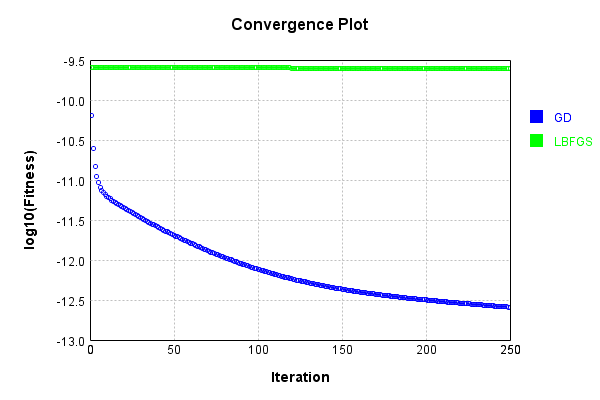


Code from [LearningTester.java:99](../../../../../../../src/main/java/com/simiacryptus/mindseye/test/unit/LearningTester.java#L99) executed in 0.09 seconds: 
```java
    return TestUtil.compareTime(runs);
```

Returns: 

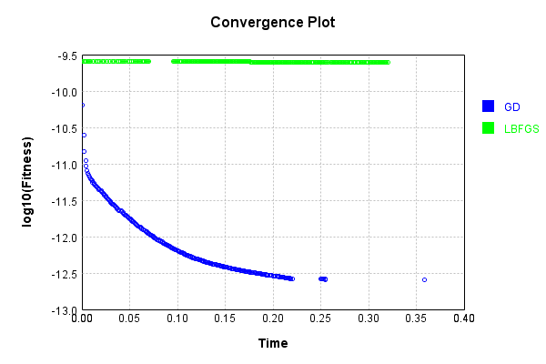


### Model Learning
In this test, attempt to train a network to emulate a randomized network given an example input/output. The target state is:

Code from [LearningTester.java:176](../../../../../../../src/main/java/com/simiacryptus/mindseye/test/unit/LearningTester.java#L176) executed in 0.00 seconds: 
```java
    return network_target.state().stream().map(Arrays::toString).reduce((a, b) -> a + "\n" + b).orElse("");
```

Returns: 

```
    [0.0, 0.0, 0.0, 0.0, 0.0, 0.0, 0.0, 0.0, 0.0, 0.0]
    [0.0, 0.0, 0.0, 0.0, 0.0, 0.0, 0.0, 0.0, 0.0, 0.0]
    [0.0, 0.0, 0.0, 0.0, 0.0, 0.0, 0.0, 0.0, 0.0, 0.0]
    [0.028, 0.014600000000000002, -0.0478, 0.0468, -0.0302, 0.029400000000000003, -0.0664, 0.0512, 0.052, 0.03780000000000001, -0.09480000000000001, 0.023600000000000003, 0.0426, -0.059, 0.0144, 0.09620000000000001, 0.057, -0.0814, 0.0936, -0.047, -0.0364, -0.022400000000000003, 0.08960000000000001, 0.0616, -0.0148, -0.0454, -0.0352, -0.027800000000000002, 0.0688, -0.0198, -0.042, -0.07880000000000001, -0.030600000000000002, -0.033600000000000005, 0.07060000000000001, -0.07440000000000001, -0.0586, 0.08940000000000001, -0.045, 0.072, -0.022200000000000004, 0.0206, 0.0852, -0.026, -0.0562, 0.089, 0.033600000000000005, -0.0234, 0.019200000000000002, 0.020200000000000003, -0.0302, 0.014, 0.045200000000000004, 0.0586, 0.0396, 0.099, -0.017, 0.0068000000000000005, -0.0806, 0.062400000000000004, 0.025, 0.09820000000000001, 0.030600000000000002, -0.0678, -0.0324, -0.010
```
...[skipping 12619 bytes](etc/114.txt)...
```
    12, -0.013600000000000001, -0.0592, -0.0052, 0.0052, 0.088, -0.0632, -0.04340000000000001, 0.0984, -0.07680000000000001, 0.0712, -0.0616, -0.048600000000000004, 0.029200000000000004, 0.06280000000000001, 0.005, -0.0616, -0.0512, 0.0558, -0.0648, -0.0044, -0.027200000000000002, 0.053200000000000004, -0.0396, 0.0086, 0.08080000000000001, 0.0862, -0.0732, 0.0656, -0.05740000000000001, 0.0926, -0.038, 0.0054, 0.0476, 0.014600000000000002, 0.024200000000000003, -0.019600000000000003, 0.014600000000000002, -0.0316, -0.0058000000000000005, -0.0108, -0.017, 0.07940000000000001, -0.0956, 0.059, 0.062, 0.049800000000000004, -0.0626, 0.0204, 0.036, 0.0456, -0.0512, 0.0832, -0.021, 0.0862, -0.0592, 0.07379999999999999, 0.0362, 0.005600000000000001, -0.0018, 0.072, 0.045, -0.053, 0.0158, 0.0898, 0.035800000000000005, -0.0742, 0.0654, 0.0992, -0.0274, -0.05040000000000001, -0.0234, 0.042, 0.09040000000000001, -0.0882, -0.050800000000000005, -0.066, -0.020200000000000003, 0.0028000000000000004, -0.06420000000000001, 0.0032]
```


First, we use a conjugate gradient descent method, which converges the fastest for purely linear functions.

Code from [LearningTester.java:300](../../../../../../../src/main/java/com/simiacryptus/mindseye/test/unit/LearningTester.java#L300) executed in 0.01 seconds: 
```java
    return new IterativeTrainer(trainable)
      .setLineSearchFactory(label -> new QuadraticSearch())
      .setOrientation(new GradientDescent())
      .setMonitor(monitor)
      .setTimeout(30, TimeUnit.SECONDS)
      .setMaxIterations(250)
      .setTerminateThreshold(0)
      .run();
```
Logging: 
```
    Low gradient: 3.7517231576424843E-6
    Constructing line search parameters: GD
    F(0.0) = LineSearchPoint{point=PointSample{avg=1.3891399918509454E-10}, derivative=-1.4075426651590894E-11}
    New Minimum: 1.3891399918509454E-10 > 1.3891399918407674E-10
    F(1.0E-10) = LineSearchPoint{point=PointSample{avg=1.3891399918407674E-10}, derivative=-1.4075426651539455E-11}, delta = -1.017794044958216E-21
    New Minimum: 1.3891399918407674E-10 > 1.389139991764328E-10
    F(7.000000000000001E-10) = LineSearchPoint{point=PointSample{avg=1.389139991764328E-10}, derivative=-1.4075426651152288E-11}, delta = -8.661744236166602E-21
    New Minimum: 1.389139991764328E-10 > 1.3891399911714667E-10
    F(4.900000000000001E-9) = LineSearchPoint{point=PointSample{avg=1.3891399911714667E-10}, derivative=-1.4075426648148453E-11}, delta = -6.794787253876762E-20
    New Minimum: 1.3891399911714667E-10 > 1.3891399870194131E-10
    F(3.430000000000001E-8) = LineSearchPoint{point=PointSample{avg=1.3891399870194131E-10}, derivative=-1.407542662711201E-11}, delta
```
...[skipping 4035 bytes](etc/115.txt)...
```
    ; Line Search: 0.0007
    Zero gradient: 3.640340066765876E-14
    F(0.0) = LineSearchPoint{point=PointSample{avg=1.3074087605067287E-26}, derivative=-1.325207580170098E-27}
    New Minimum: 1.3074087605067287E-26 > 1.75028513345912E-30
    F(19.737626116541016) = LineSearchPoint{point=PointSample{avg=1.75028513345912E-30}, derivative=7.197568630716065E-31}, delta = -1.3072337319933827E-26
    1.75028513345912E-30 <= 1.3074087605067287E-26
    Converged to right
    Iteration 5 complete. Error: 1.75028513345912E-30 Total: 250046503979887.5000; Orientation: 0.0001; Line Search: 0.0006
    Zero gradient: 4.210776355551729E-16
    F(0.0) = LineSearchPoint{point=PointSample{avg=1.75028513345912E-30}, derivative=-1.77306375164735E-31}
    New Minimum: 1.75028513345912E-30 > 0.0
    F(19.737626116541016) = LineSearchPoint{point=PointSample{avg=0.0}, derivative=0.0}, delta = -1.75028513345912E-30
    0.0 <= 1.75028513345912E-30
    Converged to right
    Iteration 6 complete. Error: 0.0 Total: 250046504974746.5000; Orientation: 0.0001; Line Search: 0.0006
    
```

Returns: 

```
    0.0
```


Training Converged

Next, we run the same optimization using L-BFGS, which is nearly ideal for purely second-order or quadratic functions.

Code from [LearningTester.java:324](../../../../../../../src/main/java/com/simiacryptus/mindseye/test/unit/LearningTester.java#L324) executed in 0.04 seconds: 
```java
    return new IterativeTrainer(trainable)
      .setLineSearchFactory(label -> new ArmijoWolfeSearch())
      .setOrientation(new LBFGS())
      .setMonitor(monitor)
      .setTimeout(30, TimeUnit.SECONDS)
      .setMaxIterations(250)
      .setTerminateThreshold(0)
      .run();
```
Logging: 
```
    LBFGS Accumulation History: 1 points
    Constructing line search parameters: GD
    th(0)=2.2856143533307548E-10;dx=-2.3197128213233282E-11
    New Minimum: 2.2856143533307548E-10 > 1.8131705093151538E-10
    END: th(2.154434690031884)=1.8131705093151538E-10; dx=-2.0660673204180158E-11 delta=4.724438440156011E-11
    Iteration 1 complete. Error: 1.8131705093151538E-10 Total: 250046511402149.5000; Orientation: 0.0003; Line Search: 0.0008
    LBFGS Accumulation History: 1 points
    th(0)=1.8131705093151538E-10;dx=-1.8401600576770367E-11
    New Minimum: 1.8131705093151538E-10 > 1.059645293885146E-10
    END: th(4.641588833612779)=1.059645293885146E-10; dx=-1.4066816702663496E-11 delta=7.535252154300078E-11
    Iteration 2 complete. Error: 1.059645293885146E-10 Total: 250046512708490.5000; Orientation: 0.0002; Line Search: 0.0008
    LBFGS Accumulation History: 1 points
    th(0)=1.059645293885146E-10;dx=-1.0753296681388666E-11
    New Minimum: 1.059645293885146E-10 > 2.5716357877854233E-11
    END: th(10.000000000000002)=2.5716357877854233E-11; dx=-5
```
...[skipping 8702 bytes](etc/116.txt)...
```
    ete. Error: 4.930380657631324E-33 Total: 250046543103715.4700; Orientation: 0.0002; Line Search: 0.0012
    LBFGS Accumulation History: 1 points
    th(0)=9.860761315262648E-33;dx=-9.985431931033587E-34
    New Minimum: 9.860761315262648E-33 > 4.930380657631324E-33
    WOLF (strong): th(15.738894428211749)=4.930380657631324E-33; dx=5.535527325406685E-36 delta=4.930380657631324E-33
    WOLF (strong): th(7.8694472141058744)=4.930380657631324E-33; dx=5.535527325406685E-36 delta=4.930380657631324E-33
    END: th(2.623149071368625)=4.930380657631324E-33; dx=-4.983822273216675E-34 delta=4.930380657631324E-33
    Iteration 20 complete. Error: 4.930380657631324E-33 Total: 250046545065791.4700; Orientation: 0.0002; Line Search: 0.0016
    LBFGS Accumulation History: 1 points
    th(0)=4.930380657631324E-33;dx=-4.972517808090981E-34
    New Minimum: 4.930380657631324E-33 > 0.0
    END: th(5.651403356481487)=0.0; dx=0.0 delta=4.930380657631324E-33
    Iteration 21 complete. Error: 0.0 Total: 250046546222234.4700; Orientation: 0.0002; Line Search: 0.0008
    
```

Returns: 

```
    0.0
```


Training Converged

Code from [LearningTester.java:96](../../../../../../../src/main/java/com/simiacryptus/mindseye/test/unit/LearningTester.java#L96) executed in 0.00 seconds: 
```java
    return TestUtil.compare(runs);
```

Returns: 

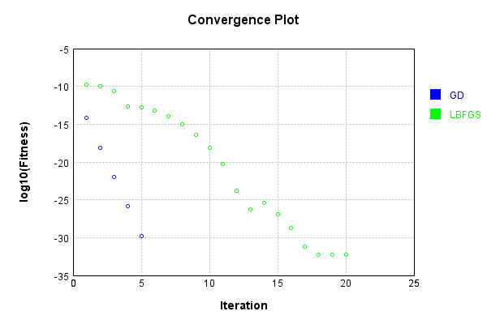


Code from [LearningTester.java:99](../../../../../../../src/main/java/com/simiacryptus/mindseye/test/unit/LearningTester.java#L99) executed in 0.00 seconds: 
```java
    return TestUtil.compareTime(runs);
```

Returns: 

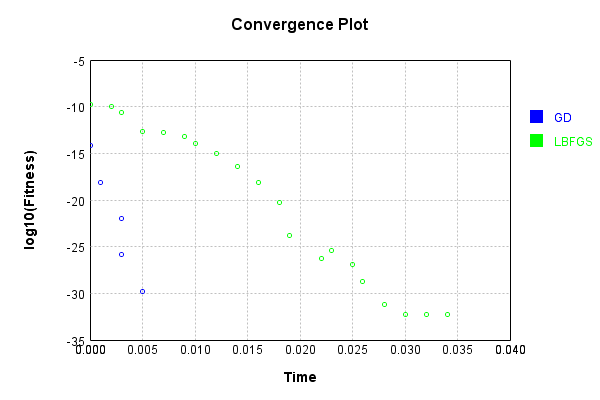


### Composite Learning
In this test, attempt to train a network to emulate a randomized network given an example input/output. The target state is:

Code from [LearningTester.java:219](../../../../../../../src/main/java/com/simiacryptus/mindseye/test/unit/LearningTester.java#L219) executed in 0.00 seconds: 
```java
    return network_target.state().stream().map(Arrays::toString).reduce((a, b) -> a + "\n" + b).orElse("");
```

Returns: 

```
    [0.0, 0.0, 0.0, 0.0, 0.0, 0.0, 0.0, 0.0, 0.0, 0.0]
    [0.0, 0.0, 0.0, 0.0, 0.0, 0.0, 0.0, 0.0, 0.0, 0.0]
    [0.0, 0.0, 0.0, 0.0, 0.0, 0.0, 0.0, 0.0, 0.0, 0.0]
    [0.0952, 0.0688, -0.0324, 0.0068000000000000005, -0.07440000000000001, -0.0814, -0.059, 0.019200000000000002, 0.07540000000000001, 0.0616, -0.047, 0.019200000000000002, -0.073, -0.05280000000000001, 0.08940000000000001, -0.095, -0.0882, 0.0318, -0.0302, 0.07060000000000001, 0.057, 0.05240000000000001, -0.0688, -4.0E-4, 0.072, -0.0302, 0.0426, 0.0128, -0.063, -0.0548, -0.026, -0.0592, -0.030600000000000002, -0.046400000000000004, 0.08960000000000001, 0.081, -0.042, -0.027800000000000002, -0.020200000000000003, -0.0664, -0.033600000000000005, -0.0562, 0.0936, 0.020200000000000003, 0.0144, 0.093, 0.03780000000000001, 0.030600000000000002, 0.033600000000000005, -0.0688, 0.094, -0.017, -0.0364, 0.02, -0.0102, 0.0148, -0.0352, 0.028, 0.023600000000000003, 0.032, 0.059800000000000006, 0.0468, -0.0496, 0.099, 0.0592, 0.09820000000000001, 0.08760000000000001, -0.09480
```
...[skipping 12619 bytes](etc/117.txt)...
```
    .0396, 0.045, -0.019600000000000003, -0.0592, -0.0194, -0.0316, 0.0032, 0.049400000000000006, 0.007600000000000001, 0.0158, 0.036, -0.0882, -0.0614, -0.06760000000000001, 0.0558, -0.0512, 0.0862, 0.029200000000000004, 0.09040000000000001, 0.088, 0.062200000000000005, 0.0362, 0.08080000000000001, -0.017, -0.04340000000000001, 0.07379999999999999, -0.0632, -0.0942, -0.0616, -0.020200000000000003, 0.072, 0.0656, 0.0654, 0.0984, 0.005, 0.0992, -0.013600000000000001, -0.0234, 0.014600000000000002, -0.021, -0.07680000000000001, -0.0044, -0.027200000000000002, 0.0898, 0.0052, 0.042, 0.0456, -0.053, -0.0742, -0.07640000000000001, -0.038, -0.0792, 0.0028000000000000004, 0.0086, -0.06420000000000001, -0.0732, 0.0926, -0.066, 0.073, -0.0616, -0.0058000000000000005, 0.07940000000000001, -0.0468, -0.0626, -0.0052, 0.059, -0.038400000000000004, 0.0862, -0.050800000000000005, -0.0108, 0.0426, -0.0482, -0.0648, 0.06280000000000001, 0.0362, -0.05740000000000001, -0.0956, -0.0274, -0.0018, 0.019, 0.053200000000000004, -0.0728]
```


We simultaneously regress this target input:

Code from [LearningTester.java:223](../../../../../../../src/main/java/com/simiacryptus/mindseye/test/unit/LearningTester.java#L223) executed in 0.00 seconds: 
```java
    return Arrays.stream(testInput).map(x -> x.prettyPrint()).reduce((a, b) -> a + "\n" + b).orElse("");
```

Returns: 

```
    [
    	[ [ -0.0558, 0.0064, -0.0966 ], [ 0.07260000000000001, 0.09860000000000001, -0.047400000000000005 ], [ -0.026400000000000003, 0.0398, -0.0834 ], [ -0.007, -0.0712, 0.09860000000000001 ], [ 0.07260000000000001, 0.07540000000000001, 0.0218 ] ],
    	[ [ 0.036800000000000006, 0.07440000000000001, -0.0792 ], [ 0.0016, -0.07840000000000001, -0.082 ], [ 0.0884, 0.024200000000000003, 0.06720000000000001 ], [ 0.079, -0.09860000000000001, -0.0064 ], [ 0.0536, 0.046, -0.026400000000000003 ] ],
    	[ [ -0.049800000000000004, 0.051, -0.08580000000000002 ], [ -0.0316, -0.033600000000000005, 0.062 ], [ 0.0722, -0.007, -0.0834 ], [ 0.025400000000000002, 0.07579999999999999, -0.09480000000000001 ], [ 0.0134, -0.006, -0.0456 ] ],
    	[ [ -0.0426, 0.07540000000000001, 0.013200000000000002 ], [ -0.0104, -0.0568, -0.051 ], [ -0.0704, -0.0354, 0.0526 ], [ -0.0412, 0.0208, 0.08780000000000002 ], [ -0.0702, 0.0068000000000000005, -0.0882 ] ],
    	[ [ 0.06080000000000001, -0.0398, -0.0048000000000000004 ], [ -0.056, 0.05280000000000001, -0.086 ], [ 0.043, -0.05380000000000001, -0.0256 ], [ 0.0102, -0.0334, 0.042800000000000005 ], [ -0.08760000000000001, 0.098, 0.024 ] ]
    ]
```


Which produces the following output:

Code from [LearningTester.java:230](../../../../../../../src/main/java/com/simiacryptus/mindseye/test/unit/LearningTester.java#L230) executed in 0.00 seconds: 
```java
    return Stream.of(targetOutput).map(x -> x.prettyPrint()).reduce((a, b) -> a + "\n" + b).orElse("");
```

Returns: 

```
    [ 1.4285948820358385E-5, -1.654867648359648E-6, -6.698608633559644E-6, 4.134880497996818E-6, -2.4575436466944822E-6, 1.319544413291851E-6, -6.1700483413584806E-6, -8.58421514204899E-7, -9.324454030457119E-6, 8.637794719934533E-6 ]
```


First, we use a conjugate gradient descent method, which converges the fastest for purely linear functions.

Code from [LearningTester.java:300](../../../../../../../src/main/java/com/simiacryptus/mindseye/test/unit/LearningTester.java#L300) executed in 0.02 seconds: 
```java
    return new IterativeTrainer(trainable)
      .setLineSearchFactory(label -> new QuadraticSearch())
      .setOrientation(new GradientDescent())
      .setMonitor(monitor)
      .setTimeout(30, TimeUnit.SECONDS)
      .setMaxIterations(250)
      .setTerminateThreshold(0)
      .run();
```
Logging: 
```
    Low gradient: 2.9122683725608515E-6
    Constructing line search parameters: GD
    F(0.0) = LineSearchPoint{point=PointSample{avg=8.308719690984134E-11}, derivative=-8.48130707381823E-12}
    New Minimum: 8.308719690984134E-11 > 8.308719690816165E-11
    F(1.0E-10) = LineSearchPoint{point=PointSample{avg=8.308719690816165E-11}, derivative=-8.481307073732225E-12}, delta = -1.6796936313654918E-21
    New Minimum: 8.308719690816165E-11 > 8.308719690289676E-11
    F(7.000000000000001E-10) = LineSearchPoint{point=PointSample{avg=8.308719690289676E-11}, derivative=-8.481307073463375E-12}, delta = -6.944581907991873E-21
    New Minimum: 8.308719690289676E-11 > 8.30871968667826E-11
    F(4.900000000000001E-9) = LineSearchPoint{point=PointSample{avg=8.30871968667826E-11}, derivative=-8.481307071619809E-12}, delta = -4.3058744614780073E-20
    New Minimum: 8.30871968667826E-11 > 8.308719661747932E-11
    F(3.430000000000001E-8) = LineSearchPoint{point=PointSample{avg=8.308719661747932E-11}, derivative=-8.481307058893739E-12}, delta = -2.9236202442
```
...[skipping 7400 bytes](etc/118.txt)...
```
    Sample{avg=4.4373425918681915E-32}, derivative=8.54014646786544E-32}, delta = -2.628385928583259E-29
    4.4373425918681915E-32 <= 2.632823271175127E-29
    New Minimum: 4.4373425918681915E-32 > 4.930380657631324E-33
    F(19.243587544079418) = LineSearchPoint{point=PointSample{avg=4.930380657631324E-33}, derivative=-5.8589967567343217E-33}, delta = -2.6323302331093637E-29
    Left bracket at 19.243587544079418
    Converged to left
    Iteration 6 complete. Error: 4.930380657631324E-33 Total: 250046674938423.3000; Orientation: 0.0001; Line Search: 0.0011
    Zero gradient: 2.2303660507812707E-17
    F(0.0) = LineSearchPoint{point=PointSample{avg=4.930380657631324E-33}, derivative=-4.974532720477642E-34}
    F(19.243587544079418) = LineSearchPoint{point=PointSample{avg=4.930380657631324E-33}, derivative=1.4016280583484081E-36}, delta = 0.0
    4.930380657631324E-33 <= 4.930380657631324E-33
    Converged to right
    Iteration 7 failed, aborting. Error: 4.930380657631324E-33 Total: 250046675677657.3000; Orientation: 0.0001; Line Search: 0.0005
    
```

Returns: 

```
    4.930380657631324E-33
```


Training Converged

Next, we run the same optimization using L-BFGS, which is nearly ideal for purely second-order or quadratic functions.

Code from [LearningTester.java:324](../../../../../../../src/main/java/com/simiacryptus/mindseye/test/unit/LearningTester.java#L324) executed in 0.03 seconds: 
```java
    return new IterativeTrainer(trainable)
      .setLineSearchFactory(label -> new ArmijoWolfeSearch())
      .setOrientation(new LBFGS())
      .setMonitor(monitor)
      .setTimeout(30, TimeUnit.SECONDS)
      .setMaxIterations(250)
      .setTerminateThreshold(0)
      .run();
```
Logging: 
```
    LBFGS Accumulation History: 1 points
    Constructing line search parameters: GD
    th(0)=8.308719690984134E-11;dx=-8.481307073818232E-12
    New Minimum: 8.308719690984134E-11 > 6.581958728160318E-11
    END: th(2.154434690031884)=6.581958728160318E-11; dx=-7.548521732094366E-12 delta=1.726760962823816E-11
    Iteration 1 complete. Error: 6.581958728160318E-11 Total: 250046679745723.3000; Orientation: 0.0002; Line Search: 0.0008
    LBFGS Accumulation History: 1 points
    th(0)=6.581958728160318E-11;dx=-6.718345726822245E-12
    New Minimum: 6.581958728160318E-11 > 3.83300699934262E-11
    END: th(4.641588833612779)=3.83300699934262E-11; dx=-5.12652820446599E-12 delta=2.748951728817698E-11
    Iteration 2 complete. Error: 3.83300699934262E-11 Total: 250046681022427.3000; Orientation: 0.0002; Line Search: 0.0009
    LBFGS Accumulation History: 1 points
    th(0)=3.83300699934262E-11;dx=-3.9119445013838245E-12
    New Minimum: 3.83300699934262E-11 > 9.193904371570663E-12
    END: th(10.000000000000002)=9.193904371570663E-12; dx=-1.9152886232985695E-
```
...[skipping 7072 bytes](etc/119.txt)...
```
    514.2800; Orientation: 0.0002; Line Search: 0.0012
    LBFGS Accumulation History: 1 points
    th(0)=8.524628157044559E-30;dx=-8.539691945045992E-31
    New Minimum: 8.524628157044559E-30 > 6.606710081225974E-30
    WOLF (strong): th(37.77334662770819)=6.606710081225974E-30; dx=7.512372270732942E-31 delta=1.9179180758185852E-30
    New Minimum: 6.606710081225974E-30 > 6.409494854920721E-32
    END: th(18.886673313854097)=6.409494854920721E-32; dx=-6.470778119522742E-32 delta=8.460533208495351E-30
    Iteration 17 complete. Error: 6.409494854920721E-32 Total: 250046708570718.2800; Orientation: 0.0002; Line Search: 0.0014
    LBFGS Accumulation History: 1 points
    th(0)=6.409494854920721E-32;dx=-6.431870884451678E-33
    Armijo: th(40.6901041666667)=8.874685183736383E-32; dx=7.424572266315002E-33 delta=-2.465190328815662E-32
    New Minimum: 6.409494854920721E-32 > 0.0
    END: th(20.34505208333335)=0.0; dx=0.0 delta=6.409494854920721E-32
    Iteration 18 complete. Error: 0.0 Total: 250046710542483.2800; Orientation: 0.0003; Line Search: 0.0015
    
```

Returns: 

```
    0.0
```


Training Converged

Code from [LearningTester.java:96](../../../../../../../src/main/java/com/simiacryptus/mindseye/test/unit/LearningTester.java#L96) executed in 0.00 seconds: 
```java
    return TestUtil.compare(runs);
```

Returns: 

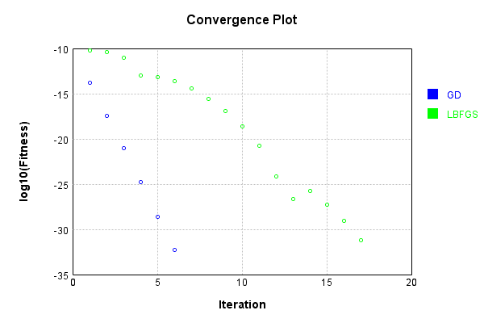


Code from [LearningTester.java:99](../../../../../../../src/main/java/com/simiacryptus/mindseye/test/unit/LearningTester.java#L99) executed in 0.00 seconds: 
```java
    return TestUtil.compareTime(runs);
```

Returns: 

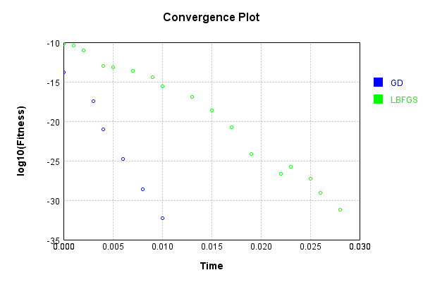


