# UniformPipeline
This is a network with the following layout:

Code from [NLayerTest.java:87](../../../../../../../src/test/java/com/simiacryptus/mindseye/network/NLayerTest.java#L87) executed in 0.17 seconds: 
```java
    return Graphviz.fromGraph(TestUtil.toGraph((DAGNetwork) layer))
      .height(400).width(600).render(Format.PNG).toImage();
```

Returns: 

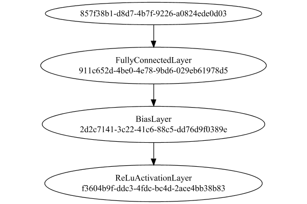


### Json Serialization
Code from [JsonTest.java:36](../../../../../../../src/main/java/com/simiacryptus/mindseye/test/unit/JsonTest.java#L36) executed in 0.00 seconds: 
```java
    JsonObject json = layer.getJson();
    NNLayer echo = NNLayer.fromJson(json);
    if ((echo == null)) throw new AssertionError("Failed to deserialize");
    if ((layer == echo)) throw new AssertionError("Serialization did not copy");
    if ((!layer.equals(echo))) throw new AssertionError("Serialization not equal");
    return new GsonBuilder().setPrettyPrinting().create().toJson(json);
```

Returns: 

```
    {
      "class": "com.simiacryptus.mindseye.network.PipelineNetwork",
      "id": "fc6365cf-c0d1-4e35-bbe5-2070b19fb6ee",
      "isFrozen": false,
      "name": "PipelineNetwork/fc6365cf-c0d1-4e35-bbe5-2070b19fb6ee",
      "inputs": [
        "857f38b1-d8d7-4b7f-9226-a0824ede0d03"
      ],
      "nodes": {
        "00949687-356a-4b23-b8d0-fc64e9c72066": "911c652d-4be0-4e78-9bd6-029eb61978d5",
        "9481c582-db44-4d8d-acda-bd67733b63ea": "2d2c7141-3c22-41c6-88c5-dd76d9f0389e",
        "57671b36-ce0c-4eb5-ad87-f7600d0037ce": "f3604b9f-ddc3-4fdc-bc4d-2ace4bb38b83"
      },
      "layers": {
        "911c652d-4be0-4e78-9bd6-029eb61978d5": {
          "class": "com.simiacryptus.mindseye.layers.java.FullyConnectedLayer",
          "id": "911c652d-4be0-4e78-9bd6-029eb61978d5",
          "isFrozen": false,
          "name": "FullyConnectedLayer/911c652d-4be0-4e78-9bd6-029eb61978d5",
          "outputDims": [
            10
          ],
          "inputDims": [
            5,
            5,
            3
          ],
          "weights": [
            [
              -0.097,
              -0.0144,
              0.069,
              -0.0872,
```
...[skipping 17743 bytes](etc/120.txt)...
```
    layers.java.BiasLayer",
          "id": "2d2c7141-3c22-41c6-88c5-dd76d9f0389e",
          "isFrozen": false,
          "name": "BiasLayer/2d2c7141-3c22-41c6-88c5-dd76d9f0389e",
          "bias": [
            0.0,
            0.0,
            0.0,
            0.0,
            0.0,
            0.0,
            0.0,
            0.0,
            0.0,
            0.0
          ]
        },
        "f3604b9f-ddc3-4fdc-bc4d-2ace4bb38b83": {
          "class": "com.simiacryptus.mindseye.layers.java.ReLuActivationLayer",
          "id": "f3604b9f-ddc3-4fdc-bc4d-2ace4bb38b83",
          "isFrozen": true,
          "name": "ReLuActivationLayer/f3604b9f-ddc3-4fdc-bc4d-2ace4bb38b83",
          "weights": [
            1.0
          ]
        }
      },
      "links": {
        "00949687-356a-4b23-b8d0-fc64e9c72066": [
          "857f38b1-d8d7-4b7f-9226-a0824ede0d03"
        ],
        "9481c582-db44-4d8d-acda-bd67733b63ea": [
          "00949687-356a-4b23-b8d0-fc64e9c72066"
        ],
        "57671b36-ce0c-4eb5-ad87-f7600d0037ce": [
          "9481c582-db44-4d8d-acda-bd67733b63ea"
        ]
      },
      "labels": {},
      "head": "57671b36-ce0c-4eb5-ad87-f7600d0037ce"
    }
```


### Input Learning
In this test, we use a network to learn this target input, given it's pre-evaluated output:

Code from [LearningTester.java:127](../../../../../../../src/main/java/com/simiacryptus/mindseye/test/unit/LearningTester.java#L127) executed in 0.00 seconds: 
```java
    return Arrays.stream(input_target).map(x -> x.prettyPrint()).reduce((a, b) -> a + "\n" + b).orElse("");
```

Returns: 

```
    [
    	[ [ 0.0154, -0.013, 0.025200000000000004 ], [ -0.029, -0.0606, -0.013 ], [ 0.044, -0.0966, -0.05840000000000001 ], [ -0.0772, 0.09980000000000001, 0.064 ], [ -0.0398, -0.004, -0.0966 ] ],
    	[ [ 0.079, 0.0036, -0.0926 ], [ 0.0, 0.0946, -0.0918 ], [ 0.039200000000000006, -0.030400000000000003, -0.024200000000000003 ], [ 0.08880000000000002, 0.023600000000000003, -0.027 ], [ -0.040600000000000004, -0.0702, 0.0188 ] ],
    	[ [ -0.04, 0.088, 0.05 ], [ -0.0016, 0.039200000000000006, -0.08120000000000001 ], [ -0.0308, 0.067, -0.03780000000000001 ], [ 0.075, 0.0296, -0.024200000000000003 ], [ -0.0884, -0.0288, -0.0674 ] ],
    	[ [ -0.0682, -0.041, 0.09880000000000001 ], [ 0.055400000000000005, -0.0796, -0.07740000000000001 ], [ -0.0158, -0.037, 0.09540000000000001 ], [ 0.013200000000000002, 0.06520000000000001, -0.019 ], [ -0.094, -0.04440000000000001, -0.0966 ] ],
    	[ [ 0.09140000000000001, -0.079, 0.0658 ], [ 0.0322, -0.0742, 0.0806 ], [ -0.0492, -0.0234, 0.06620000000000001 ], [ -0.0984, -0.025, -0.0572 ], [ -0.022, 0.0522, -0.017 ] ]
    ]
```


First, we use a conjugate gradient descent method, which converges the fastest for purely linear functions.

Code from [LearningTester.java:300](../../../../../../../src/main/java/com/simiacryptus/mindseye/test/unit/LearningTester.java#L300) executed in 0.02 seconds: 
```java
    return new IterativeTrainer(trainable)
      .setLineSearchFactory(label -> new QuadraticSearch())
      .setOrientation(new GradientDescent())
      .setMonitor(monitor)
      .setTimeout(30, TimeUnit.SECONDS)
      .setMaxIterations(250)
      .setTerminateThreshold(0)
      .run();
```
Logging: 
```
    Constructing line search parameters: GD
    F(0.0) = LineSearchPoint{point=PointSample{avg=3.0650293189952006E-4}, derivative=-6.481367665494817E-6}
    New Minimum: 3.0650293189952006E-4 > 3.06502931898872E-4
    F(1.0E-10) = LineSearchPoint{point=PointSample{avg=3.06502931898872E-4}, derivative=-6.481367665461473E-6}, delta = -6.480818486032103E-16
    New Minimum: 3.06502931898872E-4 > 3.065029318949831E-4
    F(7.000000000000001E-10) = LineSearchPoint{point=PointSample{avg=3.065029318949831E-4}, derivative=-6.481367665261401E-6}, delta = -4.536952410982842E-15
    New Minimum: 3.065029318949831E-4 > 3.065029318677614E-4
    F(4.900000000000001E-9) = LineSearchPoint{point=PointSample{avg=3.065029318677614E-4}, derivative=-6.481367663860899E-6}, delta = -3.175866687687989E-14
    New Minimum: 3.065029318677614E-4 > 3.065029316772092E-4
    F(3.430000000000001E-8) = LineSearchPoint{point=PointSample{avg=3.065029316772092E-4}, derivative=-6.481367654057375E-6}, delta = -2.2231088497859375E-13
    New Minimum: 3.065029316772092E-4 > 3.0650
```
...[skipping 20672 bytes](etc/121.txt)...
```
    tSample{avg=2.4054305242656024E-4}, derivative=3.667982729545294E-21}, delta = 1.6263032587282567E-19
    F(9.652945664101171) = LineSearchPoint{point=PointSample{avg=2.4054305242656007E-4}, derivative=-4.191476772994342E-22}, delta = 0.0
    F(67.5706196487082) = LineSearchPoint{point=PointSample{avg=2.405430524265601E-4}, derivative=1.6581749518895695E-21}, delta = 2.710505431213761E-20
    F(5.197739972977554) = LineSearchPoint{point=PointSample{avg=2.4054305242656007E-4}, derivative=-5.859232100344573E-22}, delta = 0.0
    F(36.38417981084288) = LineSearchPoint{point=PointSample{avg=2.4054305242656007E-4}, derivative=5.759707624055049E-22}, delta = 0.0
    2.4054305242656007E-4 <= 2.4054305242656007E-4
    F(20.935039831654695) = LineSearchPoint{point=PointSample{avg=2.4054305242656007E-4}, derivative=3.184679943555263E-24}, delta = 0.0
    Right bracket at 20.935039831654695
    Converged to right
    Iteration 16 failed, aborting. Error: 2.4054305242656007E-4 Total: 250047062543515.9400; Orientation: 0.0000; Line Search: 0.0008
    
```

Returns: 

```
    2.4054305242656007E-4
```


This training run resulted in the following regressed input:

Code from [LearningTester.java:144](../../../../../../../src/main/java/com/simiacryptus/mindseye/test/unit/LearningTester.java#L144) executed in 0.00 seconds: 
```java
    return Arrays.stream(input_gd).map(x -> x.prettyPrint()).reduce((a, b) -> a + "\n" + b).orElse("");
```

Returns: 

```
    [
    	[ [ -0.028821816418395006, 0.03634395952540044, -0.09886040328934477 ], [ 0.09284438267377833, 0.08995978849329486, -0.01799041405393268 ], [ 0.09602844393022325, -0.03968455313174323, 0.0815737459156009 ], [ -0.07275255916961511, 0.04050657416056106, -0.10111917508928553 ], [ 0.010418520051020966, -0.08000673436329597, 0.0529561199371718 ] ],
    	[ [ -0.09161755325329761, -0.03232359165723341, 0.04379272404902198 ], [ -0.08262041109802803, -0.025039756893276893, -0.05061526021532428 ], [ -0.022333356122200148, -0.07647774314236233, 0.05830476267581566 ], [ -0.08801779157472651, 0.05648050071978818, -0.05676384536834427 ], [ 0.026107769205170342, -0.006555047857220363, -0.08731411886598334 ] ],
    	[ [ 0.11050925249787348, -0.04968131441647696, -0.04039061303270777 ], [ -0.049143838157305574, -0.02250149154481197, -0.016522099386786386 ], [ 3.867168254187534E-6, 0.04811127020284453, 0.027472499153906108 ], [ -0.050635276933894045, -0.10082377421666108, -0.08978805150507048 ], [ -0.023825959750188763, 0.09506931427415667, -0.06514251909389174 ] ],
    	[ [ -0.009798359849866363, 0.0601938767092499, -0.042914260496498526 ], [ 0.09668823237785552, -2.164262544128747E-4, 0.07470843980527175 ], [ 0.09482035637983324, -0.02985270992491075, -0.08234288675596349 ], [ -0.021096244926467778, 0.057627995674568444, -0.06967575977815217 ], [ -0.04000709911586854, -0.053719752436282256, 0.054477263350825714 ] ],
    	[ [ 0.0502160957101559, -0.07166372367746596, -0.026620764155379208 ], [ -0.022752738206576917, -0.08083754077513534, 0.05306336412142802 ], [ -0.023891128529093017, 0.008036633866646173, -0.025652896207751092 ], [ 0.018342059907075065, 0.028802748709331003, -0.02527118423153781 ], [ -0.08385228728675688, 0.017473196629871332, 0.07215837599609577 ] ]
    ]
```


Next, we run the same optimization using L-BFGS, which is nearly ideal for purely second-order or quadratic functions.

Code from [LearningTester.java:324](../../../../../../../src/main/java/com/simiacryptus/mindseye/test/unit/LearningTester.java#L324) executed in 0.01 seconds: 
```java
    return new IterativeTrainer(trainable)
      .setLineSearchFactory(label -> new ArmijoWolfeSearch())
      .setOrientation(new LBFGS())
      .setMonitor(monitor)
      .setTimeout(30, TimeUnit.SECONDS)
      .setMaxIterations(250)
      .setTerminateThreshold(0)
      .run();
```
Logging: 
```
    LBFGS Accumulation History: 1 points
    Constructing line search parameters: GD
    th(0)=3.0650293189952006E-4;dx=-6.481367665494817E-6
    New Minimum: 3.0650293189952006E-4 > 2.933131248822864E-4
    END: th(2.154434690031884)=2.933131248822864E-4; dx=-5.762964528245038E-6 delta=1.3189807017233678E-5
    Iteration 1 complete. Error: 2.933131248822864E-4 Total: 250047070793354.9400; Orientation: 0.0001; Line Search: 0.0002
    LBFGS Accumulation History: 1 points
    th(0)=2.933131248822864E-4;dx=-5.127492638504082E-6
    New Minimum: 2.933131248822864E-4 > 2.723256761812236E-4
    END: th(4.641588833612779)=2.723256761812236E-4; dx=-3.915724868862786E-6 delta=2.0987448701062777E-5
    Iteration 2 complete. Error: 2.723256761812236E-4 Total: 250047071082037.9400; Orientation: 0.0000; Line Search: 0.0002
    LBFGS Accumulation History: 1 points
    th(0)=2.723256761812236E-4;dx=-3.002536873758909E-6
    New Minimum: 2.723256761812236E-4 > 2.4974245399770657E-4
    END: th(10.000000000000002)=2.4974245399770657E-4; dx=-1.514107562944502E-6 delta=2.2
```
...[skipping 6999 bytes](etc/122.txt)...
```
    on 17 complete. Error: 2.4054305242656007E-4 Total: 250047076830621.9400; Orientation: 0.0000; Line Search: 0.0003
    LBFGS Accumulation History: 1 points
    th(0)=2.4054305242656045E-4;dx=-3.1004640434097705E-20
    New Minimum: 2.4054305242656045E-4 > 2.4054305242656007E-4
    WOLF (strong): th(36.1689814814815)=2.4054305242656007E-4; dx=4.0048020463130746E-21 delta=3.7947076036992655E-19
    END: th(18.08449074074075)=2.4054305242656007E-4; dx=-1.0855510276121225E-20 delta=3.7947076036992655E-19
    Iteration 18 complete. Error: 2.4054305242656007E-4 Total: 250047077280602.9400; Orientation: 0.0000; Line Search: 0.0003
    LBFGS Accumulation History: 1 points
    th(0)=2.4054305242656007E-4;dx=-3.8099200789182944E-21
    WOLF (strong): th(38.96185420341227)=2.4054305242656007E-4; dx=4.985096465504614E-22 delta=0.0
    END: th(19.480927101706136)=2.4054305242656007E-4; dx=-1.143984374048933E-21 delta=0.0
    Iteration 19 failed, aborting. Error: 2.4054305242656007E-4 Total: 250047077680997.9400; Orientation: 0.0000; Line Search: 0.0003
    
```

Returns: 

```
    2.4054305242656007E-4
```


This training run resulted in the following regressed input:

Code from [LearningTester.java:154](../../../../../../../src/main/java/com/simiacryptus/mindseye/test/unit/LearningTester.java#L154) executed in 0.00 seconds: 
```java
    return Arrays.stream(input_lbgfs).map(x -> x.prettyPrint()).reduce((a, b) -> a + "\n" + b).orElse("");
```

Returns: 

```
    [
    	[ [ -0.02882181636039538, 0.036343959486120424, -0.09886040323124226 ], [ 0.0928443826818815, 0.0899597885045755, -0.017990414032113773 ], [ 0.09602844394652367, -0.039684553108143596, 0.08157374594004115 ], [ -0.07275255914340449, 0.04050657418446239, -0.10111917505403174 ], [ 0.01041852005947895, -0.08000673433977848, 0.05295611995633459 ] ],
    	[ [ -0.09161755326792871, -0.03232359164160771, 0.04379272409611923 ], [ -0.08262041102765519, -0.025039756912837555, -0.05061526026427287 ], [ -0.0223333561309871, -0.07647774320258828, 0.058304762626179306 ], [ -0.08801779159559765, 0.056480500746847094, -0.05676384536229112 ], [ 0.026107769222909093, -0.006555047798743125, -0.08731411884141993 ] ],
    	[ [ 0.11050925242137878, -0.04968131440448778, -0.04039061310077335 ], [ -0.049143838130503395, -0.022501491498537557, -0.01652209940832406 ], [ 3.867186422034302E-6, 0.04811127013391926, 0.02747249912469155 ], [ -0.0506352769670671, -0.10082377420497378, -0.08978805151222419 ], [ -0.023825959737312902, 0.09506931425626543, -0.06514251909823084 ] ],
    	[ [ -0.009798359797926044, 0.06019387672403422, -0.04291426046145051 ], [ 0.09668823236805978, -2.1642624871413412E-4, 0.07470843983760878 ], [ 0.09482035636761818, -0.02985270998003332, -0.08234288681879363 ], [ -0.02109624488361545, 0.057627995748092124, -0.06967575981411119 ], [ -0.04000709908695533, -0.05371975248577053, 0.05447726343478132 ] ],
    	[ [ 0.05021609564337479, -0.0716637236821553, -0.026620764177387776 ], [ -0.02275273829410606, -0.08083754086162516, 0.05306336414831162 ], [ -0.02389112856932276, 0.008036633838129829, -0.02565289623593765 ], [ 0.01834205979712881, 0.028802748760395017, -0.025271184265268438 ], [ -0.08385228719556248, 0.01747319668988334, 0.07215837606144358 ] ]
    ]
```


Code from [LearningTester.java:96](../../../../../../../src/main/java/com/simiacryptus/mindseye/test/unit/LearningTester.java#L96) executed in 0.00 seconds: 
```java
    return TestUtil.compare(runs);
```

Returns: 

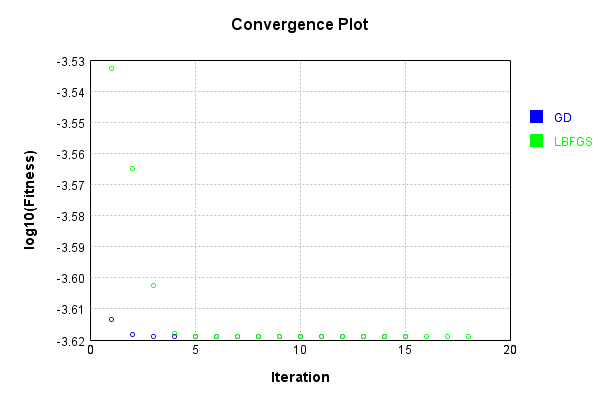


Code from [LearningTester.java:99](../../../../../../../src/main/java/com/simiacryptus/mindseye/test/unit/LearningTester.java#L99) executed in 0.00 seconds: 
```java
    return TestUtil.compareTime(runs);
```

Returns: 

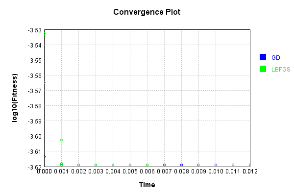


### Model Learning
In this test, attempt to train a network to emulate a randomized network given an example input/output. The target state is:

Code from [LearningTester.java:176](../../../../../../../src/main/java/com/simiacryptus/mindseye/test/unit/LearningTester.java#L176) executed in 0.00 seconds: 
```java
    return network_target.state().stream().map(Arrays::toString).reduce((a, b) -> a + "\n" + b).orElse("");
```

Returns: 

```
    [0.0, 0.0, 0.0, 0.0, 0.0, 0.0, 0.0, 0.0, 0.0, 0.0]
    [0.0286, 0.027, 0.023, -0.037, -0.073, -0.007600000000000001, -0.09440000000000001, 0.024, -0.0908, 0.04440000000000001, 0.056, -0.0078000000000000005, -0.0088, 0.06280000000000001, -0.0596, -0.0482, -0.08960000000000001, -0.062200000000000005, 0.08660000000000001, 0.08, 0.09, 0.057, -0.004200000000000001, 0.049400000000000006, 0.028200000000000003, 0.0078000000000000005, 0.0356, -0.04340000000000001, 0.0166, 0.07980000000000001, 0.027, -0.09380000000000001, -0.0614, -0.0782, 0.0356, -0.0416, -0.002, -0.0682, -0.027200000000000002, -0.0482, -0.026600000000000002, -0.004200000000000001, -0.056, -0.0966, 0.0466, -0.0898, -0.0054, -0.049800000000000004, 0.0834, 0.014, 0.084, -0.0354, -0.0352, 0.059800000000000006, 0.0568, 0.0158, 0.0936, -0.0256, -0.0298, 0.025400000000000002, 0.0248, -0.08860000000000001, -0.08860000000000001, 0.0018, -0.009, -0.07160000000000001, 0.0316, 0.032, 0.0068000000000000005, -0.025400000000000002, -0.022, -0.0874, 0.0884, 0.0578000000
```
...[skipping 8032 bytes](etc/123.txt)...
```
    40000000000001, 0.0814, -0.06080000000000001, -0.0054, 0.0188, -0.09860000000000001, 0.055600000000000004, 0.0722, -0.09620000000000001, -0.0946, 0.09480000000000001, 0.014600000000000002, 0.056, 0.05280000000000001, 0.06080000000000001, 0.0884, 0.0772, -0.0088, 0.028200000000000003, -0.0496, -0.0592, 0.07780000000000001, 0.0036, 0.055400000000000005, 0.07540000000000001, -0.024, 0.07680000000000001, 0.0902, 0.073, -0.0308, 0.0078000000000000005, 0.034, 0.0678, -0.06420000000000001, 0.0162, -0.092, 0.024200000000000003, 2.0E-4, -0.06960000000000001, 0.059800000000000006, 0.07, 0.074, -0.081, -0.0852, 0.047200000000000006, -0.037, 0.0022, -0.054, 0.007, 0.0992, -0.0124, 0.0412, 0.0572, 0.092, -0.06620000000000001, -0.0246, 0.0366, 0.0724, -0.0646, 0.061, 0.08280000000000001, -0.044800000000000006, 0.056, 0.0684, -0.022400000000000003, 0.0176, 6.000000000000001E-4, -0.05280000000000001, 0.056600000000000004, -0.059, 0.0964, 0.028, 0.061200000000000004, 0.04, -0.0674, -0.061, -0.0668, -0.09980000000000001]
    [1.0]
```


First, we use a conjugate gradient descent method, which converges the fastest for purely linear functions.

Code from [LearningTester.java:300](../../../../../../../src/main/java/com/simiacryptus/mindseye/test/unit/LearningTester.java#L300) executed in 0.01 seconds: 
```java
    return new IterativeTrainer(trainable)
      .setLineSearchFactory(label -> new QuadraticSearch())
      .setOrientation(new GradientDescent())
      .setMonitor(monitor)
      .setTimeout(30, TimeUnit.SECONDS)
      .setMaxIterations(250)
      .setTerminateThreshold(0)
      .run();
```
Logging: 
```
    Constructing line search parameters: GD
    F(0.0) = LineSearchPoint{point=PointSample{avg=9.079445013600007E-4}, derivative=-3.0989521256066365E-4}
    New Minimum: 9.079445013600007E-4 > 9.079445013290106E-4
    F(1.0E-10) = LineSearchPoint{point=PointSample{avg=9.079445013290106E-4}, derivative=-3.098952125527715E-4}, delta = -3.099007595680492E-14
    New Minimum: 9.079445013290106E-4 > 9.079445011430734E-4
    F(7.000000000000001E-10) = LineSearchPoint{point=PointSample{avg=9.079445011430734E-4}, derivative=-3.098952125054191E-4}, delta = -2.1692727909111698E-13
    New Minimum: 9.079445011430734E-4 > 9.079444998415136E-4
    F(4.900000000000001E-9) = LineSearchPoint{point=PointSample{avg=9.079444998415136E-4}, derivative=-3.0989521217395226E-4}, delta = -1.5184870505099979E-12
    New Minimum: 9.079444998415136E-4 > 9.079444907305947E-4
    F(3.430000000000001E-8) = LineSearchPoint{point=PointSample{avg=9.079444907305947E-4}, derivative=-3.0989520985368415E-4}, delta = -1.062940599254325E-11
    New Minimum: 9.079444907305947E-4 > 9
```
...[skipping 3860 bytes](etc/124.txt)...
```
    65337633645E-37}, delta = 0.0
    Right bracket at 22.963946691382887
    F(22.443727834296542) = LineSearchPoint{point=PointSample{avg=2.9951693321360014E-4}, derivative=5.364565337633645E-37}, delta = 0.0
    Right bracket at 22.443727834296542
    F(21.9352938704128) = LineSearchPoint{point=PointSample{avg=2.9951693321360014E-4}, derivative=5.364565337633645E-37}, delta = 0.0
    Right bracket at 21.9352938704128
    F(21.438377828040988) = LineSearchPoint{point=PointSample{avg=2.9951693321360014E-4}, derivative=4.598198860828839E-37}, delta = 0.0
    Right bracket at 21.438377828040988
    F(21.020747091131096) = LineSearchPoint{point=PointSample{avg=2.9951693321360014E-4}, derivative=4.598198860828839E-37}, delta = 0.0
    Right bracket at 21.020747091131096
    F(20.611252017927242) = LineSearchPoint{point=PointSample{avg=2.9951693321360014E-4}, derivative=4.598198860828839E-37}, delta = 0.0
    Loops = 12
    Iteration 2 failed, aborting. Error: 2.9951693321360014E-4 Total: 250047207888193.7800; Orientation: 0.0001; Line Search: 0.0033
    
```

Returns: 

```
    2.9951693321360014E-4
```


This training run resulted in the following configuration:

Code from [LearningTester.java:189](../../../../../../../src/main/java/com/simiacryptus/mindseye/test/unit/LearningTester.java#L189) executed in 0.00 seconds: 
```java
    return network_gd.state().stream().map(Arrays::toString).reduce((a, b) -> a + "\n" + b).orElse("");
```

Returns: 

```
    [0.006649799999999995, 0.04958732000000001, 0.0, 0.0, 0.0, 0.0, 0.0, 0.0, 0.02315744000000001, 0.0]
    [-6.508214052201068E-4, 0.0, 0.0, -0.054352885682048484, 0.0, -0.006748651692685385, -0.013903037977021667, -0.022864287684799197, 0.0, -0.006016061385168379]
    [-0.08854025459500081, -0.0356, 0.052, 0.04718959490561205, 0.084, -0.04278047377461149, 0.03267629888629059, -0.08530105839053545, -0.029200000000000004, -0.007047725564841544, -0.0524100226496404, 0.0456, -0.04240000000000001, -0.06343703443950355, -0.0044, 0.008096070763932645, 0.03138589321515387, -0.05955211003034591, -0.0666, -0.0732926473453316, 0.08262460104911733, 0.08880000000000002, 0.0356, -0.08774546092121857, 0.049400000000000006, -0.019744900966016492, -0.038274465164468585, 0.036464270074485404, -0.0946, -0.08777259287964063, 0.051637226984378594, 0.0082, 0.020200000000000003, -0.018691014938986828, -0.0386, 0.0817860228768216, 0.03879525377228564, -4.921627444294859E-4, -0.0616, -0.032855881288768374, 0.010011063963888742, -0.088600000000
```
...[skipping 11869 bytes](etc/125.txt)...
```
    9267473776, 0.09270668182297094, 0.08541999729971002, -0.024, -0.0867211215137406, 0.04435639496585026, -0.0062, 0.06280000000000001, -0.029041643340697254, 0.0162, -0.08905215966340993, 0.039468496455539556, -0.05653190727488155, -0.021400000000000002, 0.08699692388719373, 0.030363944494150807, -0.0072, 0.0166, 0.007588850133214515, -0.09280000000000001, 0.06962612469622524, 0.056229771696073, -0.09486668153773788, -0.09380000000000001, -0.09893328980073833, 0.09021574987800633, 0.07160000000000001, -0.0682, 0.09631533983350557, 0.0366, 0.074763317370963, -0.05866354648095607, -0.09084668423802787, 0.0104, 0.025545588685521075, 0.08361627053513052, -0.0468, 0.07880000000000001, -0.04324117785794879, -0.067, 0.046168716292317134, -2.5242405057445837E-4, -0.08982839280788003, 0.0048000000000000004, 0.028750401534629207, -0.04514975658751701, -0.0142, -0.0342, 0.08199604277465415, -0.08860000000000001, -0.051279004089324697, 0.05767331453182607, 0.0803651230092665, 0.07540000000000001, -0.096535560061065]
    [1.0]
```


Next, we run the same optimization using L-BFGS, which is nearly ideal for purely second-order or quadratic functions.

Code from [LearningTester.java:324](../../../../../../../src/main/java/com/simiacryptus/mindseye/test/unit/LearningTester.java#L324) executed in 0.01 seconds: 
```java
    return new IterativeTrainer(trainable)
      .setLineSearchFactory(label -> new ArmijoWolfeSearch())
      .setOrientation(new LBFGS())
      .setMonitor(monitor)
      .setTimeout(30, TimeUnit.SECONDS)
      .setMaxIterations(250)
      .setTerminateThreshold(0)
      .run();
```
Logging: 
```
    LBFGS Accumulation History: 1 points
    Constructing line search parameters: GD
    th(0)=8.357910903400004E-4;dx=-3.0045885809137294E-4
    New Minimum: 8.357910903400004E-4 > 3.6605358340535877E-4
    END: th(2.154434690031884)=3.6605358340535877E-4; dx=-1.3560681529201448E-4 delta=4.697375069346416E-4
    Iteration 1 complete. Error: 3.6605358340535877E-4 Total: 250047215123510.7800; Orientation: 0.0001; Line Search: 0.0004
    LBFGS Accumulation History: 1 points
    th(0)=3.6605358340535877E-4;dx=-6.120374839489727E-5
    New Minimum: 3.6605358340535877E-4 > 2.4742642189727506E-4
    WOLF (strong): th(4.641588833612779)=2.4742642189727506E-4; dx=4.297505488465885E-6 delta=1.1862716150808371E-4
    END: th(2.3207944168063896)=2.659879085896282E-4; dx=-2.5030236046886565E-5 delta=1.0006567481573057E-4
    Iteration 2 complete. Error: 2.4742642189727506E-4 Total: 250047216032591.7800; Orientation: 0.0001; Line Search: 0.0007
    LBFGS Accumulation History: 1 points
    th(0)=2.659879085896282E-4;dx=-1.0236508922958283E-5
    New Minimum: 2.6598790
```
...[skipping 4054 bytes](etc/126.txt)...
```
    4681098E-18
    END: th(1.4026267513228416)=2.458902304782411E-4; dx=-7.857321876235942E-19 delta=1.3552527156068805E-18
    Iteration 10 complete. Error: 2.458902304782401E-4 Total: 250047222088382.7800; Orientation: 0.0001; Line Search: 0.0007
    LBFGS Accumulation History: 1 points
    th(0)=2.458902304782411E-4;dx=-5.050643506135317E-19
    New Minimum: 2.458902304782411E-4 > 2.458902304782401E-4
    END: th(3.0218677302166546)=2.458902304782401E-4; dx=-1.1637901615106216E-19 delta=1.0299920638612292E-18
    Iteration 11 complete. Error: 2.458902304782401E-4 Total: 250047222569710.7800; Orientation: 0.0001; Line Search: 0.0003
    LBFGS Accumulation History: 1 points
    th(0)=2.458902304782401E-4;dx=-2.681653413834577E-20
    WOLF (strong): th(6.5104166666666705)=2.458902304782401E-4; dx=6.805070764555742E-21 delta=0.0
    END: th(3.2552083333333353)=2.458902304782401E-4; dx=-4.58561448228534E-21 delta=0.0
    Iteration 12 failed, aborting. Error: 2.458902304782401E-4 Total: 250047223192673.7800; Orientation: 0.0001; Line Search: 0.0005
    
```

Returns: 

```
    2.458902304782401E-4
```


This training run resulted in the following configuration:

Code from [LearningTester.java:203](../../../../../../../src/main/java/com/simiacryptus/mindseye/test/unit/LearningTester.java#L203) executed in 0.00 seconds: 
```java
    return network_lbfgs.state().stream().map(Arrays::toString).reduce((a, b) -> a + "\n" + b).orElse("");
```

Returns: 

```
    [-0.03352248551440319, 0.0, 0.0, -0.03245374114657677, -0.014233097829723188, 0.0, -0.026457030383395287, -0.01671217513323637, -0.016713745799816566, 0.0]
    [0.006649799999999995, 0.04958732000000001, 0.0, 0.0, 0.0, 0.0, 0.0, 0.0, 0.02315744000000001, 0.0]
    [0.10267736417022223, 0.07980000000000001, 0.07460000000000001, -0.055220746562744255, -0.06849340161923141, 0.0238, 0.010228755389195687, 0.06553417767723112, 0.012134321864423165, 0.0162, -0.006516246276921809, 0.094, 0.0496, 0.07390021238634273, 0.04658081029342227, 0.09440000000000001, 0.018792561732095713, 0.07414263250294816, -0.08885739168531719, -0.06380000000000001, 0.036867149952444445, 0.0546, -0.058800000000000005, 0.01702675141534061, 0.08253801109796353, -0.09040000000000001, 0.06080007574849234, -0.021368279779963664, 0.03263177959123307, -0.09480000000000001, -0.09488251382857615, -0.014, -0.0072, 0.029456353993584195, 0.01741413319586017, -0.002, 0.04691334213793022, -0.06064406358237888, 0.007356026259749507, 0.047200000000000006, -0.071030
```
...[skipping 12015 bytes](etc/127.txt)...
```
    32954587245976, -0.0674, 0.07010597961851826, -0.09846971085939439, -0.08026958583433462, 0.015, -0.09464600652946502, 0.0582, 0.086, 0.007625599343179356, 0.08464638244540858, 0.059, -0.0011726210356874846, -0.03491971573392684, 0.08148017903141232, -0.0356, 0.053542854302502066, 0.0058000000000000005, 0.044800000000000006, 0.04260206274047965, -0.09598851361976665, 0.0154, 0.057934280516759896, -0.009925854502381292, -0.018525941517309838, 0.025400000000000002, 0.02781124414944856, -0.0286, 0.04340000000000001, -0.03581461946425284, -0.05885555903252069, -0.096, 0.08064026013527818, 0.09180443463822434, -0.08819552735164445, 0.0826, 0.014838062137860078, 0.07940000000000001, 0.07780000000000001, -0.00458865647133558, 0.09535582744574309, 0.0596, 0.03106142575958489, 0.10041780437833094, 0.01661784364499542, 0.057, -0.025212064118288073, -0.029400000000000003, 0.099, -0.08309457118348428, 0.06829879515245463, 0.068, -0.09775751725440192, -0.09150982007971417, -0.09010969882425414, 0.054200000000000005]
    [1.0]
```


Code from [LearningTester.java:96](../../../../../../../src/main/java/com/simiacryptus/mindseye/test/unit/LearningTester.java#L96) executed in 0.00 seconds: 
```java
    return TestUtil.compare(runs);
```

Returns: 

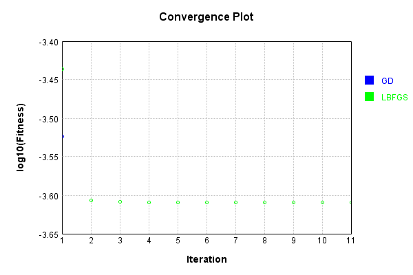


Code from [LearningTester.java:99](../../../../../../../src/main/java/com/simiacryptus/mindseye/test/unit/LearningTester.java#L99) executed in 0.00 seconds: 
```java
    return TestUtil.compareTime(runs);
```

Returns: 

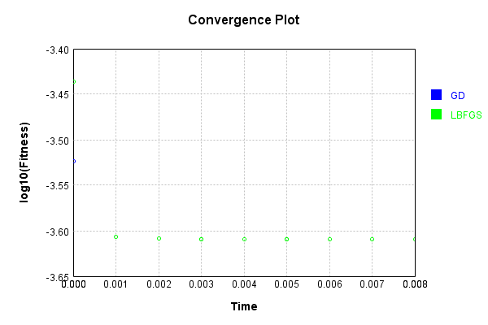


### Composite Learning
In this test, attempt to train a network to emulate a randomized network given an example input/output. The target state is:

Code from [LearningTester.java:219](../../../../../../../src/main/java/com/simiacryptus/mindseye/test/unit/LearningTester.java#L219) executed in 0.00 seconds: 
```java
    return network_target.state().stream().map(Arrays::toString).reduce((a, b) -> a + "\n" + b).orElse("");
```

Returns: 

```
    [0.0, 0.0, 0.0, 0.0, 0.0, 0.0, 0.0, 0.0, 0.0, 0.0]
    [0.019600000000000003, -0.0694, 0.0122, 0.0844, 0.0154, 0.06180000000000001, 0.009800000000000001, 0.046, -0.0308, -0.056, 0.074, 0.014, 0.07680000000000001, 0.047200000000000006, 0.057800000000000004, 0.081, 0.059800000000000006, 0.027, 2.0E-4, -0.0772, -0.0994, -0.055, 0.0082, 0.014, -0.0062, 0.0936, 0.0166, -0.05140000000000001, -0.097, -0.0018, -0.0044, -0.0852, -0.038, -0.047, 0.0616, -0.059, 0.0028000000000000004, 0.038, 0.019200000000000002, -0.0388, 0.0162, 0.044800000000000006, 0.07, 0.08560000000000001, -0.020200000000000003, -0.0446, 0.09620000000000001, 0.0078000000000000005, -0.0616, 0.087, 0.07460000000000001, 0.055600000000000004, 0.07980000000000001, 0.047200000000000006, -0.056, -0.0482, 0.06280000000000001, -0.0936, -0.09440000000000001, 0.0546, -0.061, -0.0364, 0.07, 0.09440000000000001, 0.0992, 0.0526, -0.09880000000000001, 0.0842, -0.0468, 0.08, -0.04580000000000001, -0.0164, -0.021400000000000002, 0.032, -0.08860000000000001, 0.0664, 0.0
```
...[skipping 8032 bytes](etc/128.txt)...
```
    29200000000000004, -0.054, 0.056, -0.079, 0.0128, 0.028200000000000003, -0.0164, -0.06960000000000001, -0.0692, 0.025200000000000004, -0.079, -0.0248, 0.0592, 0.0422, 0.0274, -0.0698, 0.030400000000000003, 0.039200000000000006, -0.015200000000000002, 0.07379999999999999, -0.0334, -0.0782, -0.0386, -0.09980000000000001, 0.006600000000000001, -0.0246, -0.022200000000000004, -0.037, 0.08380000000000001, -0.018, -0.09680000000000001, 0.0412, 0.09, -0.0086, -0.051800000000000006, -0.0592, -0.0722, -0.0614, -0.05140000000000001, 0.092, 0.019, 0.08360000000000001, 0.003, -0.067, -0.049, 0.036, -0.07880000000000001, 0.08780000000000002, -0.003, 0.0288, 0.0426, -0.0432, 0.0926, 0.08360000000000001, -0.05380000000000001, 0.013, 0.030400000000000003, 0.09480000000000001, -0.0496, -0.07160000000000001, 0.0022, 0.069, -0.0176, 0.068, -0.0342, 0.0654, 0.0606, -0.096, -0.054400000000000004, 0.062200000000000005, -0.0286, 0.086, 0.0366, -0.0018, 0.0356, 0.07940000000000001, 0.0216, 0.052, 0.024200000000000003, -0.0352]
    [1.0]
```


We simultaneously regress this target input:

Code from [LearningTester.java:223](../../../../../../../src/main/java/com/simiacryptus/mindseye/test/unit/LearningTester.java#L223) executed in 0.00 seconds: 
```java
    return Arrays.stream(testInput).map(x -> x.prettyPrint()).reduce((a, b) -> a + "\n" + b).orElse("");
```

Returns: 

```
    [
    	[ [ 0.067, -0.094, -0.0926 ], [ -0.013, 0.055400000000000005, -0.0234 ], [ -0.017, -0.0288, -0.0016 ], [ -0.0796, -0.0492, 0.064 ], [ -0.013, -0.0984, -0.0682 ] ],
    	[ [ 0.09880000000000001, -0.025, 0.09980000000000001 ], [ -0.0308, -0.040600000000000004, -0.08120000000000001 ], [ -0.05840000000000001, -0.0966, 0.039200000000000006 ], [ -0.041, -0.030400000000000003, -0.0772 ], [ 0.0296, -0.027, 0.0946 ] ],
    	[ [ -0.024200000000000003, 0.023600000000000003, 0.0 ], [ 0.088, -0.022, -0.029 ], [ 0.0806, 0.079, -0.0918 ], [ -0.03780000000000001, -0.024200000000000003, -0.079 ], [ 0.044, 0.0188, -0.04440000000000001 ] ],
    	[ [ 0.0658, 0.05, -0.0398 ], [ -0.0702, 0.06520000000000001, -0.0742 ], [ -0.04, -0.004, -0.0674 ], [ -0.07740000000000001, 0.025200000000000004, 0.0522 ], [ 0.075, 0.06620000000000001, 0.09140000000000001 ] ],
    	[ [ -0.0884, 0.039200000000000006, 0.09540000000000001 ], [ -0.0606, 0.0036, -0.0572 ], [ 0.08880000000000002, -0.0158, -0.037 ], [ 0.013200000000000002, -0.0966, -0.0966 ], [ -0.019, 0.0154, 0.0322 ] ]
    ]
```


Which produces the following output:

Code from [LearningTester.java:230](../../../../../../../src/main/java/com/simiacryptus/mindseye/test/unit/LearningTester.java#L230) executed in 0.00 seconds: 
```java
    return Stream.of(targetOutput).map(x -> x.prettyPrint()).reduce((a, b) -> a + "\n" + b).orElse("");
```

Returns: 

```
    [ 0.00252628, 0.03163879999999999, 0.016847120000000004, 0.048919760000000014, 0.0, 0.07012632, 0.0, 0.06108816000000002, 0.0, 0.014974640000000011 ]
```


First, we use a conjugate gradient descent method, which converges the fastest for purely linear functions.

Code from [LearningTester.java:300](../../../../../../../src/main/java/com/simiacryptus/mindseye/test/unit/LearningTester.java#L300) executed in 0.01 seconds: 
```java
    return new IterativeTrainer(trainable)
      .setLineSearchFactory(label -> new QuadraticSearch())
      .setOrientation(new GradientDescent())
      .setMonitor(monitor)
      .setTimeout(30, TimeUnit.SECONDS)
      .setMaxIterations(250)
      .setTerminateThreshold(0)
      .run();
```
Logging: 
```
    Constructing line search parameters: GD
    F(0.0) = LineSearchPoint{point=PointSample{avg=0.0011584792607913603}, derivative=-2.3697984701978903E-4}
    New Minimum: 0.0011584792607913603 > 0.001158479260767662
    F(1.0E-10) = LineSearchPoint{point=PointSample{avg=0.001158479260767662}, derivative=-2.3697984701283604E-4}, delta = -2.369827424575366E-14
    New Minimum: 0.001158479260767662 > 0.0011584792606254743
    F(7.000000000000001E-10) = LineSearchPoint{point=PointSample{avg=0.0011584792606254743}, derivative=-2.3697984697111844E-4}, delta = -1.6588596815636514E-13
    New Minimum: 0.0011584792606254743 > 0.0011584792596301594
    F(4.900000000000001E-9) = LineSearchPoint{point=PointSample{avg=0.0011584792596301594}, derivative=-2.3697984667909517E-4}, delta = -1.161200909732818E-12
    New Minimum: 0.0011584792596301594 > 0.0011584792526629518
    F(3.430000000000001E-8) = LineSearchPoint{point=PointSample{avg=0.0011584792526629518}, derivative=-2.3697984463493186E-4}, delta = -8.12840853653407E-12
    New Minimum: 0.001158479252
```
...[skipping 7210 bytes](etc/129.txt)...
```
    4E-19
    7.541465608968009E-4 <= 7.54146560896801E-4
    F(3.383657311607775) = LineSearchPoint{point=PointSample{avg=7.541465608968003E-4}, derivative=9.013579182939642E-28}, delta = -7.589415207398531E-19
    Right bracket at 3.383657311607775
    Converged to right
    Iteration 6 complete. Error: 7.541465608968003E-4 Total: 250047347430142.6600; Orientation: 0.0000; Line Search: 0.0013
    Zero gradient: 2.4634414517942312E-11
    F(0.0) = LineSearchPoint{point=PointSample{avg=7.541465608968003E-4}, derivative=-6.068543786418069E-22}
    F(3.383657311607775) = LineSearchPoint{point=PointSample{avg=7.541465608968003E-4}, derivative=2.2950965732689307E-23}, delta = 0.0
    7.541465608968003E-4 <= 7.541465608968003E-4
    F(3.2603522242446292) = LineSearchPoint{point=PointSample{avg=7.541465608968003E-4}, derivative=6.2636417736693234E-30}, delta = 0.0
    Right bracket at 3.2603522242446292
    Converged to right
    Iteration 7 failed, aborting. Error: 7.541465608968003E-4 Total: 250047348300751.6600; Orientation: 0.0001; Line Search: 0.0007
    
```

Returns: 

```
    7.541465608968003E-4
```


This training run resulted in the following configuration:

Code from [LearningTester.java:245](../../../../../../../src/main/java/com/simiacryptus/mindseye/test/unit/LearningTester.java#L245) executed in 0.00 seconds: 
```java
    return network_gd.state().stream().map(Arrays::toString).reduce((a, b) -> a + "\n" + b).orElse("");
```

Returns: 

```
    [0.0, 0.019997093084051804, -0.004031067312139044, 0.0, -0.019271089318192883, 0.0, 0.0, 0.025585121134113757, -0.021115709305127787, 0.0]
    [0.00252628, 0.03163879999999999, 0.016847120000000004, 0.048919760000000014, 0.0, 0.07012632, 0.0, 0.06108816000000002, 0.0, 0.014974640000000011]
    [0.0356, -0.09848368405591801, 0.0173345201427932, -0.0732, -0.050667701127275776, -0.07780000000000001, -0.05240000000000001, -0.05991666051907799, -0.08998922955230965, -0.005600000000000001, 0.032, -0.06298791605309767, 0.0074749481837717464, 0.055, -0.021753038542843946, -0.045200000000000004, -0.0022, 0.09646205872595123, 0.09329818940421916, -0.078, -0.075, -0.01941982890695235, -0.053834750381411445, 0.003, -0.06000985094706756, 0.09140000000000001, 0.0064, -0.09124900610284448, -0.056534237103896004, 0.026600000000000002, -0.029, -0.002298501929537157, -0.07449988448556144, 0.05940000000000001, -0.01811727534101795, -0.0354, 0.0274, -0.056640094946109845, 0.08472841105121824, -0.094, 0.037399999999999996, -0.02014401174
```
...[skipping 11325 bytes](etc/130.txt)...
```
    0.09009021948963894, 0.01, -0.07277823648017316, -0.031, -0.06380000000000001, 0.07263820942494904, -0.06873665821659562, -0.056400000000000006, -0.0782, 0.04648133498961911, 0.06462195452998064, -0.0874, 0.09215304450495743, 0.0206, -0.06620000000000001, -0.043474734557406323, 0.017471440791070252, 0.0058000000000000005, 0.094, -1.5701319632342302E-4, -0.031010022084388824, 0.027, -0.057206523371360056, -0.0332, 0.08, 0.07733582489872434, 0.07349744676561708, -0.0926, 0.009800000000000001, 0.09463161880433461, 0.07755664249017442, -0.014, -0.05269685968355255, -0.0722, 0.028200000000000003, -0.10166151725371426, -0.04533360324835133, 0.059800000000000006, -0.054, 0.05659859555035324, -0.043199348320621486, 0.06280000000000001, -0.02560093313356746, 0.0592, 0.09, 0.008400457102758111, -0.022200510499459706, 0.0482, 0.0884, -0.026859738468425536, 0.03925229990641551, -0.05140000000000001, -0.09334932742909373, -0.078, 0.04580000000000001, -0.014732677429452078, 0.052274585413102405, 0.055400000000000005]
    [1.0]
```


And regressed input:

Code from [LearningTester.java:249](../../../../../../../src/main/java/com/simiacryptus/mindseye/test/unit/LearningTester.java#L249) executed in 0.00 seconds: 
```java
    return Arrays.stream(input_gd).map(x -> x.prettyPrint()).reduce((a, b) -> a + "\n" + b).orElse("");
```

Returns: 

```
    [
    	[ [ 0.06498036084307603, -0.004782986201942114, -0.04037466888832462 ], [ -0.07989474660019522, 0.0881682372339003, -0.0791084567752033 ], [ -0.013785330909081553, -0.027790497052569262, 0.07859426112829916 ], [ -0.06915329751005467, 0.09529987487443961, -0.04120671057482323 ], [ -0.040680893348211296, 0.06479023744054022, 0.04132896284634058 ] ],
    	[ [ 0.0800755307203111, 9.347340571883545E-4, 0.03845043326598059 ], [ -0.09096020002637469, -0.01660582772287266, 0.09555771766001772 ], [ -0.10001922985961523, -0.01595313808283243, -0.09546779791699155 ], [ -0.038860102100623954, -0.030191242448907613, 0.016088864590076444 ], [ -0.06474254650569762, 0.06515879183151127, 0.053752605276143235 ] ],
    	[ [ -0.04107845769138392, 0.07637048502284452, -0.026875969728087548 ], [ -0.07777156498351892, -0.02150128531138856, 0.05426280335533163 ], [ 0.0038612336481826763, -0.09648529586713947, 0.06339624687011328 ], [ 0.02627923533502353, -0.026843526758515736, -0.02269302439780452 ], [ -0.022131614759178967, -0.06667060353250105, -0.08728192289115234 ] ],
    	[ [ -0.027587626958597913, 0.018903006663430224, -0.05609322959230825 ], [ -0.0619472056561001, 0.08863435540222027, -0.04403631731256864 ], [ -0.1010010894234529, 0.09941223284386871, -0.09667089841930625 ], [ 0.028734174172894318, -0.04586089900271625, 0.017079960304093866 ], [ -0.07387598205726272, 0.05052667244116729, 0.0024830012248716555 ] ],
    	[ [ -0.07677950143017756, 0.034749148449218836, 0.022777515851395994 ], [ 0.02756298732072805, 0.08719030134508565, -0.058360142956577744 ], [ -0.08226366878965889, -0.03209531503780805, -0.029655134289514946 ], [ 0.09739822992576201, 0.06873058428645763, -0.016046415518694516 ], [ -0.09263824708994271, -0.03943367754470351, -0.013352652118265099 ] ]
    ]
```


Which produces the following output:

Code from [LearningTester.java:256](../../../../../../../src/main/java/com/simiacryptus/mindseye/test/unit/LearningTester.java#L256) executed in 0.00 seconds: 
```java
    return Stream.of(regressedOutput).map(x -> x.prettyPrint()).reduce((a, b) -> a + "\n" + b).orElse("");
```

Returns: 

```
    [ 7.541465608968003E-4 ]
```


Next, we run the same optimization using L-BFGS, which is nearly ideal for purely second-order or quadratic functions.

Code from [LearningTester.java:324](../../../../../../../src/main/java/com/simiacryptus/mindseye/test/unit/LearningTester.java#L324) executed in 0.01 seconds: 
```java
    return new IterativeTrainer(trainable)
      .setLineSearchFactory(label -> new ArmijoWolfeSearch())
      .setOrientation(new LBFGS())
      .setMonitor(monitor)
      .setTimeout(30, TimeUnit.SECONDS)
      .setMaxIterations(250)
      .setTerminateThreshold(0)
      .run();
```
Logging: 
```
    LBFGS Accumulation History: 1 points
    Constructing line search parameters: GD
    th(0)=0.0011584792607913603;dx=-2.3697984701978903E-4
    New Minimum: 0.0011584792607913603 > 8.0919777794978E-4
    END: th(2.154434690031884)=8.0919777794978E-4; dx=-8.73048454940384E-5 delta=3.492814828415803E-4
    Iteration 1 complete. Error: 8.0919777794978E-4 Total: 250047358551424.6600; Orientation: 0.0002; Line Search: 0.0006
    LBFGS Accumulation History: 1 points
    th(0)=8.0919777794978E-4;dx=-3.220321758545744E-5
    New Minimum: 8.0919777794978E-4 > 7.583555026170774E-4
    WOLF (strong): th(4.641588833612779)=7.583555026170774E-4; dx=6.703517482515023E-6 delta=5.0842275332702654E-5
    END: th(2.3207944168063896)=7.598339691058528E-4; dx=-1.0337557054220981E-5 delta=4.936380884392724E-5
    Iteration 2 complete. Error: 7.583555026170774E-4 Total: 250047359657425.6600; Orientation: 0.0001; Line Search: 0.0008
    LBFGS Accumulation History: 1 points
    th(0)=7.598339691058528E-4;dx=-3.322991777636286E-6
    New Minimum: 7.598339691058528E-4 > 7.5482
```
...[skipping 4106 bytes](etc/131.txt)...
```
    l: 250047367248679.6200; Orientation: 0.0001; Line Search: 0.0006
    LBFGS Accumulation History: 1 points
    th(0)=7.541465608968035E-4;dx=-1.8587249511333704E-18
    New Minimum: 7.541465608968035E-4 > 7.541465608968015E-4
    WOLF (strong): th(6.043735460433309)=7.541465608968015E-4; dx=1.0099741012556413E-18 delta=2.0599841277224584E-18
    New Minimum: 7.541465608968015E-4 > 7.541465608968003E-4
    END: th(3.0218677302166546)=7.541465608968003E-4; dx=-2.480773689339746E-19 delta=3.2526065174565133E-18
    Iteration 11 complete. Error: 7.541465608968003E-4 Total: 250047368116723.6200; Orientation: 0.0001; Line Search: 0.0007
    LBFGS Accumulation History: 1 points
    th(0)=7.541465608968003E-4;dx=-3.314369431592135E-20
    WOLF (strong): th(6.5104166666666705)=7.541465608968003E-4; dx=2.170190161631435E-20 delta=0.0
    END: th(3.2552083333333353)=7.541465608968003E-4; dx=-2.214652885348707E-21 delta=0.0
    Iteration 12 failed, aborting. Error: 7.541465608968003E-4 Total: 250047368973938.6200; Orientation: 0.0001; Line Search: 0.0006
    
```

Returns: 

```
    7.541465608968003E-4
```


This training run resulted in the following configuration:

Code from [LearningTester.java:266](../../../../../../../src/main/java/com/simiacryptus/mindseye/test/unit/LearningTester.java#L266) executed in 0.00 seconds: 
```java
    return network_lbfgs.state().stream().map(Arrays::toString).reduce((a, b) -> a + "\n" + b).orElse("");
```

Returns: 

```
    [0.0, 0.019995526716283935, -0.00403836021677904, 0.0, -0.019265208208280055, 0.0, 0.0, 0.025575379219994882, -0.021107143985237185, 0.0]
    [0.00252628, 0.03163879999999999, 0.016847120000000004, 0.048919760000000014, 0.0, 0.07012632, 0.0, 0.06108816000000002, 0.0, 0.014974640000000011]
    [0.0356, -0.09848867906804949, 0.017335100920658382, -0.0732, -0.05066302457532657, -0.07780000000000001, -0.05240000000000001, -0.05992314626823854, -0.08998387340337936, -0.005600000000000001, 0.032, -0.0629911015343162, 0.007475024074333153, 0.055, -0.02174988520843747, -0.045200000000000004, -0.0022, 0.0964576223621278, 0.09330187409230549, -0.078, -0.075, -0.019420289264997295, -0.05383433865419394, 0.003, -0.06000962496168096, 0.09140000000000001, 0.0064, -0.09124924102300293, -0.056534068210714154, 0.026600000000000002, -0.029, -0.002312698803744147, -0.07449663774069717, 0.05940000000000001, -0.018104797450657045, -0.0354, 0.0274, -0.05665699331899152, 0.08474226694941794, -0.094, 0.037399999999999996, -0.020141597170630
```
...[skipping 11320 bytes](etc/132.txt)...
```
    8758, 0.09008328259478841, 0.01, -0.07280754961622359, -0.031, -0.06380000000000001, 0.07267806270356492, -0.06876937938412604, -0.056400000000000006, -0.0782, 0.046466686427051714, 0.06462477325797718, -0.0874, 0.09216622419545314, 0.0206, -0.06620000000000001, -0.04349270941031363, 0.017486219775953493, 0.0058000000000000005, 0.094, -1.4848043866311748E-4, -0.03101225670278099, 0.027, -0.05721385919212136, -0.0332, 0.08, 0.07734569311354791, 0.07348937704996497, -0.0926, 0.009800000000000001, 0.09463801817870217, 0.07755593461175238, -0.014, -0.05270289997207935, -0.0722, 0.028200000000000003, -0.10165314844395613, -0.045340520621032616, 0.059800000000000006, -0.054, 0.0566125279756861, -0.0432023515667714, 0.06280000000000001, -0.025613262319937855, 0.0592, 0.09, 0.008417208922484739, -0.022214257438525, 0.0482, 0.0884, -0.026861895662535523, 0.03925286602414722, -0.05140000000000001, -0.09334748870114483, -0.078, 0.04580000000000001, -0.014735158631177173, 0.052276612349428826, 0.055400000000000005]
    [1.0]
```


And regressed input:

Code from [LearningTester.java:270](../../../../../../../src/main/java/com/simiacryptus/mindseye/test/unit/LearningTester.java#L270) executed in 0.00 seconds: 
```java
    return Arrays.stream(input_lbgfs).map(x -> x.prettyPrint()).reduce((a, b) -> a + "\n" + b).orElse("");
```

Returns: 

```
    [
    	[ [ 0.0650126549837604, -0.004785984242549532, -0.04039457285672968 ], [ -0.07993273575889207, 0.08821209007781103, -0.07914678299180262 ], [ -0.013791591910817448, -0.02780597636188207, 0.07863424341742768 ], [ -0.06918809220333222, 0.09534785657196251, -0.041226358490381795 ], [ -0.04070067183870785, 0.06482269222200523, 0.041351352859250255 ] ],
    	[ [ 0.08011544597423387, 9.34048020599565E-4, 0.03846942671087041 ], [ -0.09100727926531692, -0.016614428314641033, 0.09560707502811783 ], [ -0.10006767241492978, -0.015961000702821106, -0.09551307395748135 ], [ -0.03887852220959321, -0.030206187004978454, 0.0160965758017059 ], [ -0.06477607196386999, 0.0651929289142358, 0.053778444675600695 ] ],
    	[ [ -0.04109841664673805, 0.07640828545533082, -0.026888027123074525 ], [ -0.07781107143088759, -0.021513871009956508, 0.05429058390317928 ], [ 0.003862019291806827, -0.09653334389135079, 0.06342734879170636 ], [ 0.0262915426220716, -0.026859256595607697, -0.022700829497157012 ], [ -0.02214400063830142, -0.06670535960595607, -0.08732634768583021 ] ],
    	[ [ -0.02759846966224153, 0.01890750073155072, -0.05612208532963417 ], [ -0.06197756668436074, 0.08867949907158242, -0.044061683036412454 ], [ -0.10104863978651771, 0.09946172620974857, -0.09671702563756235 ], [ 0.028748540599625578, -0.04588289671574926, 0.017088918922343283 ], [ -0.07391339945246862, 0.050551805621875195, 0.0024829065672270618 ] ],
    	[ [ -0.07681734862753778, 0.034770225696485586, 0.02278896341415288 ], [ 0.027580112120061315, 0.08723418178545506, -0.05838970693473327 ], [ -0.08230319678380256, -0.032108325102192345, -0.029667114188177503 ], [ 0.09744548107792797, 0.06876413862587205, -0.01605964223682738 ], [ -0.0926874072205348, -0.039451543637397404, -0.013359347892920238 ] ]
    ]
```


Which produces the following output:

Code from [LearningTester.java:277](../../../../../../../src/main/java/com/simiacryptus/mindseye/test/unit/LearningTester.java#L277) executed in 0.00 seconds: 
```java
    return Stream.of(regressedOutput).map(x -> x.prettyPrint()).reduce((a, b) -> a + "\n" + b).orElse("");
```

Returns: 

```
    [ 7.541465608968003E-4 ]
```


Code from [LearningTester.java:96](../../../../../../../src/main/java/com/simiacryptus/mindseye/test/unit/LearningTester.java#L96) executed in 0.00 seconds: 
```java
    return TestUtil.compare(runs);
```

Returns: 

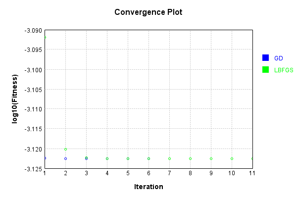


Code from [LearningTester.java:99](../../../../../../../src/main/java/com/simiacryptus/mindseye/test/unit/LearningTester.java#L99) executed in 0.00 seconds: 
```java
    return TestUtil.compareTime(runs);
```

Returns: 

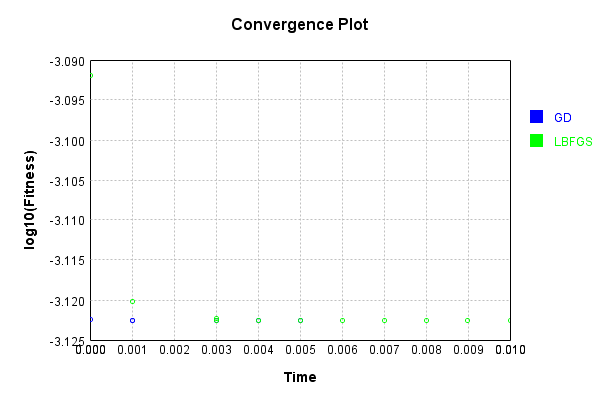


This is a network with the following layout:

Code from [NLayerTest.java:87](../../../../../../../src/test/java/com/simiacryptus/mindseye/network/NLayerTest.java#L87) executed in 0.11 seconds: 
```java
    return Graphviz.fromGraph(TestUtil.toGraph((DAGNetwork) layer))
      .height(400).width(600).render(Format.PNG).toImage();
```

Returns: 

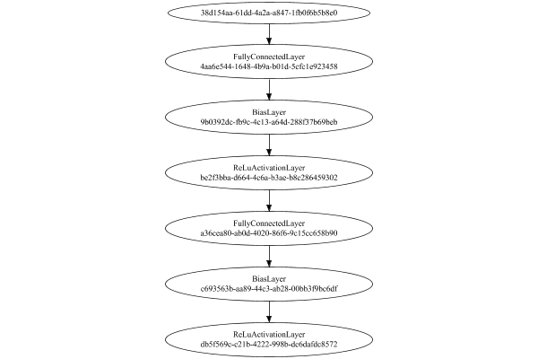


### Json Serialization
Code from [JsonTest.java:36](../../../../../../../src/main/java/com/simiacryptus/mindseye/test/unit/JsonTest.java#L36) executed in 0.02 seconds: 
```java
    JsonObject json = layer.getJson();
    NNLayer echo = NNLayer.fromJson(json);
    if ((echo == null)) throw new AssertionError("Failed to deserialize");
    if ((layer == echo)) throw new AssertionError("Serialization did not copy");
    if ((!layer.equals(echo))) throw new AssertionError("Serialization not equal");
    return new GsonBuilder().setPrettyPrinting().create().toJson(json);
```

Returns: 

```
    {
      "class": "com.simiacryptus.mindseye.network.PipelineNetwork",
      "id": "407186f2-b9d2-48c3-99cd-3e807791ad67",
      "isFrozen": false,
      "name": "PipelineNetwork/407186f2-b9d2-48c3-99cd-3e807791ad67",
      "inputs": [
        "38d154aa-61dd-4a2a-a847-1fb0f6b5b8e0"
      ],
      "nodes": {
        "88abc9e9-e563-4305-b841-0df84011b484": "4aa6e544-1648-4b9a-b01d-5cfc1e923458",
        "5a1c6c69-e93c-4513-8fee-ca58cc45c482": "9b0392dc-fb9c-4c13-a64d-288f37b69beb",
        "a3f192df-627d-478d-be39-75ca3c65736e": "be2f3bba-d664-4c6a-b3ae-b8c286459302",
        "d49058b4-2e0f-424b-9df8-e4c8a7f6326f": "a36cea80-ab0d-4020-86f6-9c15cc658b90",
        "779dbd98-319f-4268-8ebe-4fef9739ba90": "c693563b-aa89-44c3-ab28-00bb3f9bc6df",
        "aa07b203-0bc3-48e3-8254-5ac1d8971993": "db5f569c-c21b-4222-998b-dc6dafdc8572"
      },
      "layers": {
        "4aa6e544-1648-4b9a-b01d-5cfc1e923458": {
          "class": "com.simiacryptus.mindseye.layers.java.FullyConnectedLayer",
          "id": "4aa6e544-1648-4b9a-b01d-5cfc1e923458",
          "isFrozen": false,
          "name": "FullyConnect
```
...[skipping 21908 bytes](etc/133.txt)...
```
    .0,
            0.0
          ]
        },
        "db5f569c-c21b-4222-998b-dc6dafdc8572": {
          "class": "com.simiacryptus.mindseye.layers.java.ReLuActivationLayer",
          "id": "db5f569c-c21b-4222-998b-dc6dafdc8572",
          "isFrozen": true,
          "name": "ReLuActivationLayer/db5f569c-c21b-4222-998b-dc6dafdc8572",
          "weights": [
            1.0
          ]
        }
      },
      "links": {
        "88abc9e9-e563-4305-b841-0df84011b484": [
          "38d154aa-61dd-4a2a-a847-1fb0f6b5b8e0"
        ],
        "5a1c6c69-e93c-4513-8fee-ca58cc45c482": [
          "88abc9e9-e563-4305-b841-0df84011b484"
        ],
        "a3f192df-627d-478d-be39-75ca3c65736e": [
          "5a1c6c69-e93c-4513-8fee-ca58cc45c482"
        ],
        "d49058b4-2e0f-424b-9df8-e4c8a7f6326f": [
          "a3f192df-627d-478d-be39-75ca3c65736e"
        ],
        "779dbd98-319f-4268-8ebe-4fef9739ba90": [
          "d49058b4-2e0f-424b-9df8-e4c8a7f6326f"
        ],
        "aa07b203-0bc3-48e3-8254-5ac1d8971993": [
          "779dbd98-319f-4268-8ebe-4fef9739ba90"
        ]
      },
      "labels": {},
      "head": "aa07b203-0bc3-48e3-8254-5ac1d8971993"
    }
```


### Input Learning
In this test, we use a network to learn this target input, given it's pre-evaluated output:

Code from [LearningTester.java:127](../../../../../../../src/main/java/com/simiacryptus/mindseye/test/unit/LearningTester.java#L127) executed in 0.00 seconds: 
```java
    return Arrays.stream(input_target).map(x -> x.prettyPrint()).reduce((a, b) -> a + "\n" + b).orElse("");
```

Returns: 

```
    [
    	[ [ -0.0034000000000000002, 0.051, 0.08360000000000001 ], [ -0.0466, 0.0796, 0.0702 ], [ -0.030600000000000002, 0.0842, 0.043 ], [ 0.0704, 0.0816, 0.063 ], [ 0.085, -0.069, -0.0596 ] ],
    	[ [ 0.0572, -0.0072, 0.0274 ], [ -0.0064, -0.0454, 0.0246 ], [ 0.0826, 0.015200000000000002, -0.033800000000000004 ], [ 0.0288, -0.019200000000000002, 0.011800000000000001 ], [ -0.069, -0.008400000000000001, -0.0722 ] ],
    	[ [ -0.0964, 0.0246, -0.059 ], [ 0.0352, 0.0298, 0.0352 ], [ -0.025400000000000002, 0.085, -0.026 ], [ -0.022200000000000004, -0.0994, 0.09620000000000001 ], [ -0.0094, 0.062200000000000005, -0.0648 ] ],
    	[ [ 0.0636, 0.030600000000000002, 0.009800000000000001 ], [ 0.0658, -0.031400000000000004, -0.085 ], [ 0.041, 0.0708, -0.089 ], [ -0.0734, -0.0016, -0.06960000000000001 ], [ -0.0912, -0.0288, -0.0286 ] ],
    	[ [ -0.0114, 0.0376, -0.019200000000000002 ], [ 0.015200000000000002, 0.059800000000000006, -0.066 ], [ -0.0902, 0.0732, 0.0522 ], [ -0.022, 0.0898, -0.074 ], [ 0.087, 0.0942, 0.009 ] ]
    ]
```


First, we use a conjugate gradient descent method, which converges the fastest for purely linear functions.

Code from [LearningTester.java:300](../../../../../../../src/main/java/com/simiacryptus/mindseye/test/unit/LearningTester.java#L300) executed in 0.06 seconds: 
```java
    return new IterativeTrainer(trainable)
      .setLineSearchFactory(label -> new QuadraticSearch())
      .setOrientation(new GradientDescent())
      .setMonitor(monitor)
      .setTimeout(30, TimeUnit.SECONDS)
      .setMaxIterations(250)
      .setTerminateThreshold(0)
      .run();
```
Logging: 
```
    Constructing line search parameters: GD
    F(0.0) = LineSearchPoint{point=PointSample{avg=5.065291507692416E-6}, derivative=-1.0308427576537231E-8}
    New Minimum: 5.065291507692416E-6 > 5.065291507691387E-6
    F(1.0E-10) = LineSearchPoint{point=PointSample{avg=5.065291507691387E-6}, derivative=-1.0308427576535139E-8}, delta = -1.029145030913975E-18
    New Minimum: 5.065291507691387E-6 > 5.065291507685199E-6
    F(7.000000000000001E-10) = LineSearchPoint{point=PointSample{avg=5.065291507685199E-6}, derivative=-1.0308427576522526E-8}, delta = -7.216720710606639E-18
    New Minimum: 5.065291507685199E-6 > 5.065291507641905E-6
    F(4.900000000000001E-9) = LineSearchPoint{point=PointSample{avg=5.065291507641905E-6}, derivative=-1.0308427576434267E-8}, delta = -5.051111574361569E-17
    New Minimum: 5.065291507641905E-6 > 5.065291507338836E-6
    F(3.430000000000001E-8) = LineSearchPoint{point=PointSample{avg=5.065291507338836E-6}, derivative=-1.0308427575816451E-8}, delta = -3.5357950427120435E-16
    New Minimum: 5.065291507338836E-6 > 
```
...[skipping 51756 bytes](etc/134.txt)...
```
    }, derivative=-2.7758122819536414E-32}, delta = -1.0587911840678754E-22
    Left bracket at 554.2011819603356
    Converged to left
    Iteration 37 complete. Error: 8.563098685605882E-7 Total: 250047745298447.2500; Orientation: 0.0000; Line Search: 0.0015
    Zero gradient: 1.2702108650065585E-13
    F(0.0) = LineSearchPoint{point=PointSample{avg=8.563098685605882E-7}, derivative=-1.6134356415807094E-26}
    F(554.2011819603356) = LineSearchPoint{point=PointSample{avg=8.563098685605882E-7}, derivative=-1.1779522755934108E-26}, delta = 0.0
    F(3879.408273722349) = LineSearchPoint{point=PointSample{avg=8.563098685605882E-7}, derivative=1.43495001584957E-26}, delta = 0.0
    8.563098685605882E-7 <= 8.563098685605882E-7
    F(2053.275497412973) = LineSearchPoint{point=PointSample{avg=8.563098685605882E-7}, derivative=-1.1681435641763417E-33}, delta = 0.0
    Left bracket at 2053.275497412973
    Converged to left
    Iteration 38 failed, aborting. Error: 8.563098685605882E-7 Total: 250047745899751.2500; Orientation: 0.0000; Line Search: 0.0005
    
```

Returns: 

```
    8.563098685605882E-7
```


Training Converged

Next, we run the same optimization using L-BFGS, which is nearly ideal for purely second-order or quadratic functions.

Code from [LearningTester.java:324](../../../../../../../src/main/java/com/simiacryptus/mindseye/test/unit/LearningTester.java#L324) executed in 0.04 seconds: 
```java
    return new IterativeTrainer(trainable)
      .setLineSearchFactory(label -> new ArmijoWolfeSearch())
      .setOrientation(new LBFGS())
      .setMonitor(monitor)
      .setTimeout(30, TimeUnit.SECONDS)
      .setMaxIterations(250)
      .setTerminateThreshold(0)
      .run();
```
Logging: 
```
    LBFGS Accumulation History: 1 points
    Constructing line search parameters: GD
    th(0)=5.065291507692416E-6;dx=-1.0308427576537231E-8
    New Minimum: 5.065291507692416E-6 > 5.043131443060582E-6
    WOLFE (weak): th(2.154434690031884)=5.043131443060582E-6; dx=-1.0263154132913603E-8 delta=2.2160064631833588E-8
    New Minimum: 5.043131443060582E-6 > 5.021068917106229E-6
    WOLFE (weak): th(4.308869380063768)=5.021068917106229E-6; dx=-1.0217880689289967E-8 delta=4.422259058618696E-8
    New Minimum: 5.021068917106229E-6 > 4.933794200063615E-6
    WOLFE (weak): th(12.926608140191302)=4.933794200063615E-6; dx=-1.0036786914795443E-8 delta=1.3149730762880084E-7
    New Minimum: 4.933794200063615E-6 > 4.560370631512889E-6
    END: th(51.70643256076521)=4.560370631512889E-6; dx=-9.221864929570072E-9 delta=5.049208761795269E-7
    Iteration 1 complete. Error: 4.560370631512889E-6 Total: 250047749628693.2500; Orientation: 0.0000; Line Search: 0.0006
    LBFGS Accumulation History: 1 points
    th(0)=4.560370631512889E-6;dx=-8.253702049813849E-9
    New Mi
```
...[skipping 34661 bytes](etc/135.txt)...
```
    3933E-7 Total: 250047785237313.2200; Orientation: 0.0000; Line Search: 0.0003
    LBFGS Accumulation History: 1 points
    th(0)=7.384380541063933E-7;dx=-3.860570523941119E-25
    New Minimum: 7.384380541063933E-7 > 7.384380541063932E-7
    WOLF (strong): th(2253.66220551648)=7.384380541063932E-7; dx=4.927911158817255E-25 delta=1.0587911840678754E-22
    New Minimum: 7.384380541063932E-7 > 7.38438054106393E-7
    WOLF (strong): th(1126.83110275824)=7.38438054106393E-7; dx=5.33670323088249E-26 delta=3.1763735522036263E-22
    END: th(375.61036758608)=7.384380541063933E-7; dx=-2.3958236441584313E-25 delta=0.0
    Iteration 75 complete. Error: 7.38438054106393E-7 Total: 250047785838617.2200; Orientation: 0.0000; Line Search: 0.0005
    LBFGS Accumulation History: 1 points
    th(0)=7.384380541063933E-7;dx=-1.91852663131898E-25
    END: th(809.2280058630781)=7.384380541063933E-7; dx=-1.4522613493385576E-25 delta=0.0
    Iteration 76 failed, aborting. Error: 7.384380541063933E-7 Total: 250047786266940.2200; Orientation: 0.0000; Line Search: 0.0003
    
```

Returns: 

```
    7.384380541063933E-7
```


Training Converged

Code from [LearningTester.java:96](../../../../../../../src/main/java/com/simiacryptus/mindseye/test/unit/LearningTester.java#L96) executed in 0.00 seconds: 
```java
    return TestUtil.compare(runs);
```

Returns: 


Code from [LearningTester.java:99](../../../../../../../src/main/java/com/simiacryptus/mindseye/test/unit/LearningTester.java#L99) executed in 0.00 seconds: 
```java
    return TestUtil.compareTime(runs);
```

Returns: 

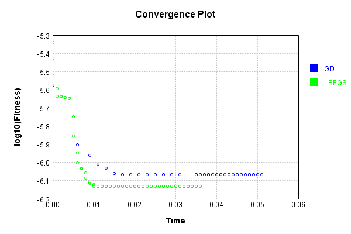


### Model Learning
In this test, attempt to train a network to emulate a randomized network given an example input/output. The target state is:

Code from [LearningTester.java:176](../../../../../../../src/main/java/com/simiacryptus/mindseye/test/unit/LearningTester.java#L176) executed in 0.00 seconds: 
```java
    return network_target.state().stream().map(Arrays::toString).reduce((a, b) -> a + "\n" + b).orElse("");
```

Returns: 

```
    [0.09340000000000001, -0.013600000000000001, -0.047200000000000006, 0.0772, 0.09980000000000001, 0.0918, 0.0826, -0.05240000000000001, -0.0166, -0.0178, 0.04580000000000001, -0.030400000000000003, -0.059800000000000006, 0.098, -0.009600000000000001, 0.0328, -0.0892, 0.0188, -0.0316, -0.015600000000000001, 0.040600000000000004, -0.07640000000000001, -0.006600000000000001, -0.0816, 0.01, 0.0844, -0.0582, 0.0562, 0.0824, 0.0206, 0.0922, 0.07060000000000001, 0.001, -0.088, -0.0882, 0.07379999999999999, -0.0832, -0.0814, 0.040600000000000004, -0.0122, 0.071, -0.059, 0.0436, 0.004, 0.06760000000000001, 0.0288, 0.0442, -0.0422, 0.003, 0.009600000000000001, -0.069, -0.092, 0.049800000000000004, -0.0816, -0.059800000000000006, 0.08280000000000001, 0.0386, -0.08860000000000001, 0.062, 0.0342, 0.0678, -0.08120000000000001, -0.0872, 0.0834, -0.0244, -0.08560000000000001, 0.050800000000000005, -0.0032, 0.09380000000000001, -0.0086, 0.0992, 0.025, -0.0234, 0.08780000000000002, 0.013, 0.011200000000000002, 0.0328, -0.0568, 
```
...[skipping 9389 bytes](etc/136.txt)...
```
    0.0102, -0.0678, 0.0964, -0.09480000000000001, -0.0124, 0.047200000000000006, 0.06340000000000001, -0.015200000000000002, 0.089, 0.0806, -0.07, -0.067, -0.026600000000000002, 0.0244, -0.0122, 0.045200000000000004, 0.0908, -0.0636, 0.09160000000000001, 0.011800000000000001, 0.0432, -0.0724, -0.075, -0.088, 0.0714, -0.0094, 0.0712, -0.022400000000000003, -0.0842, 0.09540000000000001, 0.0814, 0.029400000000000003, -0.0362, 0.005, -0.0416, -0.026200000000000005, -0.09280000000000001, -0.077, 0.0396, 0.0052, 0.030400000000000003, -0.075, -0.0772, 0.0974, 0.0882, -0.040600000000000004, 0.0408, 0.0712, 0.0024000000000000002, 0.027, -0.0466, -0.043800000000000006, -0.0124, 0.0708, 0.08680000000000002, -0.026200000000000005, -0.013, -0.07460000000000001, 0.024, 0.001, 0.0026, -0.0782, 0.0334, 0.054, 0.0786, 0.019, 0.08220000000000001, 0.0478, -0.0844, 0.0512, 0.042800000000000005, -0.0178, 0.028200000000000003, -0.0078000000000000005, -0.06620000000000001]
    [1.0]
    [0.0, 0.0, 0.0, 0.0, 0.0, 0.0, 0.0, 0.0, 0.0, 0.0]
    [1.0]
```


First, we use a conjugate gradient descent method, which converges the fastest for purely linear functions.

Code from [LearningTester.java:300](../../../../../../../src/main/java/com/simiacryptus/mindseye/test/unit/LearningTester.java#L300) executed in 0.01 seconds: 
```java
    return new IterativeTrainer(trainable)
      .setLineSearchFactory(label -> new QuadraticSearch())
      .setOrientation(new GradientDescent())
      .setMonitor(monitor)
      .setTimeout(30, TimeUnit.SECONDS)
      .setMaxIterations(250)
      .setTerminateThreshold(0)
      .run();
```
Logging: 
```
    Constructing line search parameters: GD
    F(0.0) = LineSearchPoint{point=PointSample{avg=9.94103307520665E-6}, derivative=-1.8053917353101946E-6}
    New Minimum: 9.94103307520665E-6 > 9.941033075026108E-6
    F(1.0E-10) = LineSearchPoint{point=PointSample{avg=9.941033075026108E-6}, derivative=-1.805391735272551E-6}, delta = -1.805416845754651E-16
    New Minimum: 9.941033075026108E-6 > 9.941033073942878E-6
    F(7.000000000000001E-10) = LineSearchPoint{point=PointSample{avg=9.941033073942878E-6}, derivative=-1.8053917350466934E-6}, delta = -1.2637714632375216E-15
    New Minimum: 9.941033073942878E-6 > 9.94103306636023E-6
    F(4.900000000000001E-9) = LineSearchPoint{point=PointSample{avg=9.94103306636023E-6}, derivative=-1.8053917334656825E-6}, delta = -8.846420571453385E-15
    New Minimum: 9.94103306636023E-6 > 9.941033013281714E-6
    F(3.430000000000001E-8) = LineSearchPoint{point=PointSample{avg=9.941033013281714E-6}, derivative=-1.8053917223986088E-6}, delta = -6.192493552984422E-14
    New Minimum: 9.941033013281714E-6 > 9.9410
```
...[skipping 5706 bytes](etc/137.txt)...
```
    3
    Zero gradient: 7.149313537916038E-11
    F(0.0) = LineSearchPoint{point=PointSample{avg=5.61044474688839E-6}, derivative=-5.111268406342954E-21}
    New Minimum: 5.61044474688839E-6 > 5.6104447468883775E-6
    F(4.855128790018463) = LineSearchPoint{point=PointSample{avg=5.6104447468883775E-6}, derivative=2.6261453138595485E-23}, delta = -1.2705494208814505E-20
    5.6104447468883775E-6 <= 5.61044474688839E-6
    Converged to right
    Iteration 5 complete. Error: 5.6104447468883775E-6 Total: 250047908742388.1000; Orientation: 0.0000; Line Search: 0.0004
    Zero gradient: 1.0187472930589576E-12
    F(0.0) = LineSearchPoint{point=PointSample{avg=5.6104447468883775E-6}, derivative=-1.0378460471149537E-24}
    F(4.855128790018463) = LineSearchPoint{point=PointSample{avg=5.6104447468883775E-6}, derivative=7.570240442706096E-27}, delta = 0.0
    5.6104447468883775E-6 <= 5.6104447468883775E-6
    Converged to right
    Iteration 6 failed, aborting. Error: 5.6104447468883775E-6 Total: 250047909225426.1000; Orientation: 0.0000; Line Search: 0.0003
    
```

Returns: 

```
    5.6104447468883775E-6
```


Training Converged

Next, we run the same optimization using L-BFGS, which is nearly ideal for purely second-order or quadratic functions.

Code from [LearningTester.java:324](../../../../../../../src/main/java/com/simiacryptus/mindseye/test/unit/LearningTester.java#L324) executed in 0.01 seconds: 
```java
    return new IterativeTrainer(trainable)
      .setLineSearchFactory(label -> new ArmijoWolfeSearch())
      .setOrientation(new LBFGS())
      .setMonitor(monitor)
      .setTimeout(30, TimeUnit.SECONDS)
      .setMaxIterations(250)
      .setTerminateThreshold(0)
      .run();
```
Logging: 
```
    LBFGS Accumulation History: 1 points
    Constructing line search parameters: GD
    th(0)=8.826763249034588E-6;dx=-1.2468633575155278E-6
    New Minimum: 8.826763249034588E-6 > 6.73342248013714E-6
    END: th(2.154434690031884)=6.73342248013714E-6; dx=-6.964316618238985E-7 delta=2.0933407688974488E-6
    Iteration 1 complete. Error: 6.73342248013714E-6 Total: 250047915158391.1000; Orientation: 0.0002; Line Search: 0.0007
    LBFGS Accumulation History: 1 points
    th(0)=6.73342248013714E-6;dx=-3.890362520469268E-7
    New Minimum: 6.73342248013714E-6 > 5.786041661626227E-6
    END: th(4.641588833612779)=5.786041661626227E-6; dx=-1.9185407817207256E-8 delta=9.473808185109126E-7
    Iteration 2 complete. Error: 5.786041661626227E-6 Total: 250047916292035.1000; Orientation: 0.0002; Line Search: 0.0007
    LBFGS Accumulation History: 1 points
    th(0)=5.786041661626227E-6;dx=-1.014196502856973E-9
    New Minimum: 5.786041661626227E-6 > 5.783658067735863E-6
    WOLF (strong): th(10.000000000000002)=5.783658067735863E-6; dx=4.3403311551310397E-11 delta=
```
...[skipping 3842 bytes](etc/138.txt)...
```
    E-6 Total: 250047924717706.0600; Orientation: 0.0001; Line Search: 0.0005
    LBFGS Accumulation History: 1 points
    th(0)=5.783546272225754E-6;dx=-5.95279349559415E-21
    New Minimum: 5.783546272225754E-6 > 5.783546272225741E-6
    WOLF (strong): th(8.058313947244411)=5.783546272225741E-6; dx=1.2457822024029736E-21 delta=1.2705494208814505E-20
    New Minimum: 5.783546272225741E-6 > 5.78354627222574E-6
    END: th(4.0291569736222055)=5.78354627222574E-6; dx=-1.1372927227930045E-21 delta=1.3552527156068805E-20
    Iteration 11 complete. Error: 5.78354627222574E-6 Total: 250047925784950.0600; Orientation: 0.0001; Line Search: 0.0008
    LBFGS Accumulation History: 1 points
    th(0)=5.78354627222574E-6;dx=-2.1729556393468043E-22
    WOLF (strong): th(8.680555555555559)=5.78354627222574E-6; dx=5.549108340722704E-23 delta=0.0
    END: th(4.3402777777777795)=5.78354627222574E-6; dx=-2.794683219324733E-23 delta=0.0
    Iteration 12 failed, aborting. Error: 5.78354627222574E-6 Total: 250047926785794.0600; Orientation: 0.0001; Line Search: 0.0007
    
```

Returns: 

```
    5.78354627222574E-6
```


Training Converged

Code from [LearningTester.java:96](../../../../../../../src/main/java/com/simiacryptus/mindseye/test/unit/LearningTester.java#L96) executed in 0.00 seconds: 
```java
    return TestUtil.compare(runs);
```

Returns: 

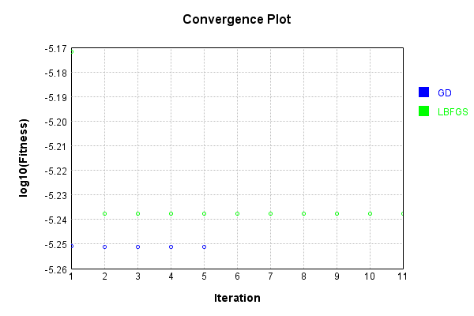


Code from [LearningTester.java:99](../../../../../../../src/main/java/com/simiacryptus/mindseye/test/unit/LearningTester.java#L99) executed in 0.00 seconds: 
```java
    return TestUtil.compareTime(runs);
```

Returns: 


### Composite Learning
In this test, attempt to train a network to emulate a randomized network given an example input/output. The target state is:

Code from [LearningTester.java:219](../../../../../../../src/main/java/com/simiacryptus/mindseye/test/unit/LearningTester.java#L219) executed in 0.00 seconds: 
```java
    return network_target.state().stream().map(Arrays::toString).reduce((a, b) -> a + "\n" + b).orElse("");
```

Returns: 

```
    [0.08380000000000001, -0.07, 0.0364, 0.0512, -0.037399999999999996, 0.025, 0.0432, -0.07640000000000001, 0.0942, -0.0354, -0.0178, 0.0234, -0.08120000000000001, 0.0964, -0.059, 0.086, -0.021, 0.0864, 0.0074, -0.07940000000000001, -0.033, -0.008, 0.013800000000000002, 0.0482, 0.009200000000000002, -0.0288, -0.03, 0.04580000000000001, 0.0108, 0.079, 0.0158, -0.09380000000000001, 0.062, -0.0872, 0.019, -0.030400000000000003, -4.0E-4, 0.07540000000000001, 0.011, 0.0356, 0.07379999999999999, 0.06280000000000001, 0.093, 0.0114, 0.0922, 0.05280000000000001, -0.08180000000000001, 0.05840000000000001, -0.017, 0.0796, 4.0E-4, -0.0558, 0.0446, -0.023200000000000002, -0.015600000000000001, 0.0328, -0.0408, -0.040400000000000005, -0.060200000000000004, 0.0134, 0.0832, -0.006, 0.0952, -0.07379999999999999, 0.0154, 0.039400000000000004, 0.05240000000000001, -0.0088, -0.082, -0.0892, 0.0826, -0.0852, -0.040600000000000004, 0.045200000000000004, 0.0322, 0.003, 0.041, -0.0666, 0.0732, 0.0218, 0.07479999999999999, 0.04580000000
```
...[skipping 9389 bytes](etc/139.txt)...
```
     -0.0466, 0.013200000000000002, -0.0772, 0.0536, 0.0708, -0.075, -0.013600000000000001, 0.011800000000000001, 0.0022, 0.0536, 0.0334, 0.0714, -0.022400000000000003, 0.047200000000000006, 0.019600000000000003, -0.084, 0.0164, -0.0844, -0.0124, -0.09480000000000001, -0.015200000000000002, -0.031, -0.042800000000000005, -0.09280000000000001, -0.09340000000000001, -0.0094, -0.026200000000000005, 0.001, 0.0024000000000000002, 0.030400000000000003, 0.0992, 0.0908, -0.088, 0.049, 0.0432, 0.089, 0.0512, -0.0178, -0.0636, 0.019, 0.0318, 0.08220000000000001, 0.0026, 0.031200000000000002, -0.0782, 0.029400000000000003, -0.06860000000000001, 0.027, -0.0362, 0.042800000000000005, 0.09540000000000001, 0.045200000000000004, 0.0712, -0.013200000000000002, -0.07, 0.0964, -0.0078000000000000005, -0.026600000000000002, 0.08680000000000002, 0.0806, -0.07460000000000001, -0.09240000000000001, -0.013, -0.075, 0.0102, 0.028200000000000003, 0.0688, -0.033800000000000004]
    [1.0]
    [0.0, 0.0, 0.0, 0.0, 0.0, 0.0, 0.0, 0.0, 0.0, 0.0]
    [1.0]
```


We simultaneously regress this target input:

Code from [LearningTester.java:223](../../../../../../../src/main/java/com/simiacryptus/mindseye/test/unit/LearningTester.java#L223) executed in 0.00 seconds: 
```java
    return Arrays.stream(testInput).map(x -> x.prettyPrint()).reduce((a, b) -> a + "\n" + b).orElse("");
```

Returns: 

```
    [
    	[ [ -0.0902, -0.0734, -0.031400000000000004 ], [ 0.0732, -0.0072, -0.0466 ], [ 0.085, -0.0648, -0.022200000000000004 ], [ 0.015200000000000002, 0.063, -0.085 ], [ 0.0704, 0.0572, -0.033800000000000004 ] ],
    	[ [ -0.069, -0.0016, -0.066 ], [ 0.009, -0.025400000000000002, 0.0288 ], [ 0.059800000000000006, -0.0964, 0.011800000000000001 ], [ 0.0298, 0.0522, -0.059 ], [ 0.0708, -0.06960000000000001, -0.0722 ] ],
    	[ [ -0.026, -0.089, 0.085 ], [ 0.0796, -0.019200000000000002, 0.015200000000000002 ], [ 0.0942, -0.074, 0.087 ], [ -0.0094, 0.0376, 0.0702 ], [ -0.008400000000000001, -0.069, 0.09620000000000001 ] ],
    	[ [ 0.051, 0.08360000000000001, -0.0288 ], [ 0.0636, 0.0246, 0.030600000000000002 ], [ 0.0826, 0.0352, 0.0658 ], [ 0.0898, 0.0352, 0.009800000000000001 ], [ -0.0994, -0.019200000000000002, -0.0034000000000000002 ] ],
    	[ [ -0.0064, -0.0912, -0.022 ], [ -0.0286, 0.062200000000000005, -0.0596 ], [ 0.0842, -0.0454, 0.0246 ], [ 0.043, -0.030600000000000002, 0.0816 ], [ 0.0274, 0.041, -0.0114 ] ]
    ]
```


Which produces the following output:

Code from [LearningTester.java:230](../../../../../../../src/main/java/com/simiacryptus/mindseye/test/unit/LearningTester.java#L230) executed in 0.00 seconds: 
```java
    return Stream.of(targetOutput).map(x -> x.prettyPrint()).reduce((a, b) -> a + "\n" + b).orElse("");
```

Returns: 

```
    [ 4.273521760000001E-4, 0.002995624208000002, 0.002000937024000001, 0.004111273768000003, 0.0, 0.0025540331920000017, 0.0012254062240000007, 0.0, 6.914785680000007E-4, 0.0 ]
```


First, we use a conjugate gradient descent method, which converges the fastest for purely linear functions.

Code from [LearningTester.java:300](../../../../../../../src/main/java/com/simiacryptus/mindseye/test/unit/LearningTester.java#L300) executed in 0.01 seconds: 
```java
    return new IterativeTrainer(trainable)
      .setLineSearchFactory(label -> new QuadraticSearch())
      .setOrientation(new GradientDescent())
      .setMonitor(monitor)
      .setTimeout(30, TimeUnit.SECONDS)
      .setMaxIterations(250)
      .setTerminateThreshold(0)
      .run();
```
Logging: 
```
    Constructing line search parameters: GD
    F(0.0) = LineSearchPoint{point=PointSample{avg=1.650276967289644E-5}, derivative=-6.478064797689913E-6}
    New Minimum: 1.650276967289644E-5 > 1.650276967224863E-5
    F(1.0E-10) = LineSearchPoint{point=PointSample{avg=1.650276967224863E-5}, derivative=-6.478064797551766E-6}, delta = -6.478107980600889E-16
    New Minimum: 1.650276967224863E-5 > 1.6502769668361785E-5
    F(7.000000000000001E-10) = LineSearchPoint{point=PointSample{avg=1.6502769668361785E-5}, derivative=-6.478064796722895E-6}, delta = -4.534655257629888E-15
    New Minimum: 1.6502769668361785E-5 > 1.650276964115392E-5
    F(4.900000000000001E-9) = LineSearchPoint{point=PointSample{avg=1.650276964115392E-5}, derivative=-6.478064790920791E-6}, delta = -3.174251904077344E-14
    New Minimum: 1.650276964115392E-5 > 1.6502769450698814E-5
    F(3.430000000000001E-8) = LineSearchPoint{point=PointSample{avg=1.6502769450698814E-5}, derivative=-6.478064750306066E-6}, delta = -2.2219762650915048E-13
    New Minimum: 1.6502769450698814E-5 >
```
...[skipping 8136 bytes](etc/140.txt)...
```
    ntSample{avg=1.297751336956963E-6}, derivative=6.741503192067609E-23}, delta = 8.470329472543003E-22
    F(2.5023132630578186) = LineSearchPoint{point=PointSample{avg=1.2977513369569621E-6}, derivative=-5.728796109018118E-24}, delta = 0.0
    F(17.51619284140473) = LineSearchPoint{point=PointSample{avg=1.2977513369569623E-6}, derivative=3.084311617384111E-23}, delta = 2.1175823681357508E-22
    F(1.3473994493388255) = LineSearchPoint{point=PointSample{avg=1.2977513369569621E-6}, derivative=-8.542019142358195E-24}, delta = 0.0
    F(9.431796145371779) = LineSearchPoint{point=PointSample{avg=1.2977513369569621E-6}, derivative=1.1150546089578009E-23}, delta = 0.0
    1.2977513369569621E-6 <= 1.2977513369569621E-6
    F(4.854158351145639) = LineSearchPoint{point=PointSample{avg=1.2977513369569621E-6}, derivative=-5.486886053170201E-31}, delta = 0.0
    Left bracket at 4.854158351145639
    Converged to left
    Iteration 7 failed, aborting. Error: 1.2977513369569621E-6 Total: 250048072183193.9400; Orientation: 0.0001; Line Search: 0.0017
    
```

Returns: 

```
    1.2977513369569621E-6
```


Training Converged

Next, we run the same optimization using L-BFGS, which is nearly ideal for purely second-order or quadratic functions.

Code from [LearningTester.java:324](../../../../../../../src/main/java/com/simiacryptus/mindseye/test/unit/LearningTester.java#L324) executed in 0.02 seconds: 
```java
    return new IterativeTrainer(trainable)
      .setLineSearchFactory(label -> new ArmijoWolfeSearch())
      .setOrientation(new LBFGS())
      .setMonitor(monitor)
      .setTimeout(30, TimeUnit.SECONDS)
      .setMaxIterations(250)
      .setTerminateThreshold(0)
      .run();
```
Logging: 
```
    LBFGS Accumulation History: 1 points
    Constructing line search parameters: GD
    th(0)=1.650276967289644E-5;dx=-6.478064797689913E-6
    New Minimum: 1.650276967289644E-5 > 5.751570822501403E-6
    END: th(2.154434690031884)=5.751570822501403E-6; dx=-3.5027891610731948E-6 delta=1.0751198850395037E-5
    Iteration 1 complete. Error: 5.751570822501403E-6 Total: 250048075955167.9400; Orientation: 0.0002; Line Search: 0.0006
    LBFGS Accumulation History: 1 points
    th(0)=5.751570822501403E-6;dx=-1.8948223841182572E-6
    New Minimum: 5.751570822501403E-6 > 1.301026277213668E-6
    END: th(4.641588833612779)=1.301026277213668E-6; dx=-2.3091958994046367E-8 delta=4.4505445452877355E-6
    Iteration 2 complete. Error: 1.301026277213668E-6 Total: 250048076847434.9400; Orientation: 0.0002; Line Search: 0.0006
    LBFGS Accumulation History: 1 points
    th(0)=1.301026277213668E-6;dx=-1.3684650110624817E-9
    New Minimum: 1.301026277213668E-6 > 1.3007910097144069E-6
    WOLF (strong): th(10.000000000000002)=1.3007910097144069E-6; dx=1.1530103184524329E
```
...[skipping 4456 bytes](etc/141.txt)...
```
    n 11 complete. Error: 1.2977513369569623E-6 Total: 250048088149107.9000; Orientation: 0.0001; Line Search: 0.0012
    LBFGS Accumulation History: 1 points
    th(0)=1.2977513369569623E-6;dx=-1.0482116073444888E-22
    New Minimum: 1.2977513369569623E-6 > 1.2977513369569621E-6
    WOLF (strong): th(8.680555555555559)=1.2977513369569621E-6; dx=7.331314053256554E-23 delta=2.1175823681357508E-22
    END: th(4.3402777777777795)=1.2977513369569621E-6; dx=-1.2935703813588722E-23 delta=2.1175823681357508E-22
    Iteration 12 complete. Error: 1.2977513369569621E-6 Total: 250048089207802.9000; Orientation: 0.0001; Line Search: 0.0008
    LBFGS Accumulation History: 1 points
    th(0)=1.2977513369569621E-6;dx=-1.6017873978888593E-24
    WOLF (strong): th(9.350845008818943)=1.2977513369569621E-6; dx=1.2936219541298543E-24 delta=0.0
    END: th(4.675422504409472)=1.2977513369569621E-6; dx=-9.049779135475631E-26 delta=0.0
    Iteration 13 failed, aborting. Error: 1.2977513369569621E-6 Total: 250048090296134.9000; Orientation: 0.0001; Line Search: 0.0008
    
```

Returns: 

```
    1.2977513369569621E-6
```


Training Converged

Code from [LearningTester.java:96](../../../../../../../src/main/java/com/simiacryptus/mindseye/test/unit/LearningTester.java#L96) executed in 0.00 seconds: 
```java
    return TestUtil.compare(runs);
```

Returns: 

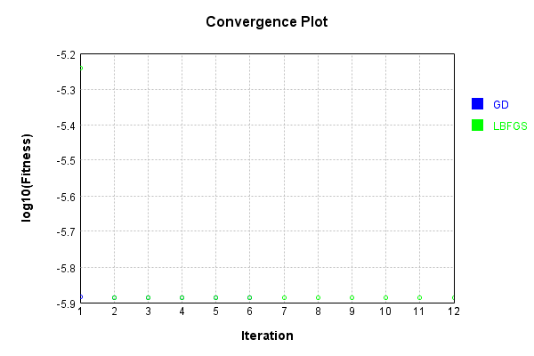


Code from [LearningTester.java:99](../../../../../../../src/main/java/com/simiacryptus/mindseye/test/unit/LearningTester.java#L99) executed in 0.00 seconds: 
```java
    return TestUtil.compareTime(runs);
```

Returns: 

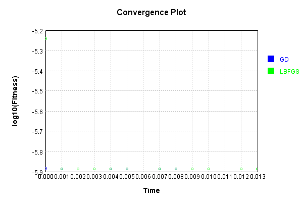


This is a network with the following layout:

Code from [NLayerTest.java:87](../../../../../../../src/test/java/com/simiacryptus/mindseye/network/NLayerTest.java#L87) executed in 0.23 seconds: 
```java
    return Graphviz.fromGraph(TestUtil.toGraph((DAGNetwork) layer))
      .height(400).width(600).render(Format.PNG).toImage();
```

Returns: 

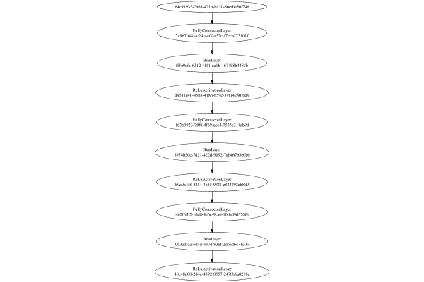


### Json Serialization
Code from [JsonTest.java:36](../../../../../../../src/main/java/com/simiacryptus/mindseye/test/unit/JsonTest.java#L36) executed in 0.00 seconds: 
```java
    JsonObject json = layer.getJson();
    NNLayer echo = NNLayer.fromJson(json);
    if ((echo == null)) throw new AssertionError("Failed to deserialize");
    if ((layer == echo)) throw new AssertionError("Serialization did not copy");
    if ((!layer.equals(echo))) throw new AssertionError("Serialization not equal");
    return new GsonBuilder().setPrettyPrinting().create().toJson(json);
```

Returns: 

```
    {
      "class": "com.simiacryptus.mindseye.network.PipelineNetwork",
      "id": "9bbf8e46-75a2-4d60-84af-a6bc45b5330d",
      "isFrozen": false,
      "name": "PipelineNetwork/9bbf8e46-75a2-4d60-84af-a6bc45b5330d",
      "inputs": [
        "64c91935-2668-421b-b110-86cf6a56f746"
      ],
      "nodes": {
        "7aeb04a4-8ff8-4d90-a409-fda7860932bc": "7a967b48-4c24-440f-a57c-f7ecb273101f",
        "4151c06b-0b43-4adc-ad06-f1f67e0f5543": "ff5e9afa-6312-4f11-ae1b-1674b8b4485b",
        "9b46cc47-fcd3-4913-a6d9-28f2f7f44073": "d9511e40-45b8-4186-b59c-59f14280f6d9",
        "a014a1dd-a875-4909-bf8c-2266f764809d": "163b9923-7f08-4f89-aec4-7535e314ab9d",
        "5ecc0c19-af1f-49ac-838b-b6b1106643e6": "8974b30c-7d51-422d-9092-7ab467b3e0b0",
        "a303b807-e4c9-4d5b-a630-d90f0cdde92c": "b9a0a456-f354-4c55-9f28-e823292ab8d9",
        "b6c94d6a-bc7d-4041-93ac-6e9e1debac43": "462f6fb2-1dd8-4e6c-9ca6-10dad9d376f6",
        "abb15e72-b688-419a-9498-b210c4756c35": "0b3adfda-6d4d-437d-93af-2dbad6c71c06",
        "7fb149a5-fda7-4482-8a2d-94a34e9821e2": "48c48d08-2d4c-4392-8557-2478b6a
```
...[skipping 25906 bytes](etc/142.txt)...
```
    a0218a",
          "weights": [
            1.0
          ]
        }
      },
      "links": {
        "7aeb04a4-8ff8-4d90-a409-fda7860932bc": [
          "64c91935-2668-421b-b110-86cf6a56f746"
        ],
        "4151c06b-0b43-4adc-ad06-f1f67e0f5543": [
          "7aeb04a4-8ff8-4d90-a409-fda7860932bc"
        ],
        "9b46cc47-fcd3-4913-a6d9-28f2f7f44073": [
          "4151c06b-0b43-4adc-ad06-f1f67e0f5543"
        ],
        "a014a1dd-a875-4909-bf8c-2266f764809d": [
          "9b46cc47-fcd3-4913-a6d9-28f2f7f44073"
        ],
        "5ecc0c19-af1f-49ac-838b-b6b1106643e6": [
          "a014a1dd-a875-4909-bf8c-2266f764809d"
        ],
        "a303b807-e4c9-4d5b-a630-d90f0cdde92c": [
          "5ecc0c19-af1f-49ac-838b-b6b1106643e6"
        ],
        "b6c94d6a-bc7d-4041-93ac-6e9e1debac43": [
          "a303b807-e4c9-4d5b-a630-d90f0cdde92c"
        ],
        "abb15e72-b688-419a-9498-b210c4756c35": [
          "b6c94d6a-bc7d-4041-93ac-6e9e1debac43"
        ],
        "7fb149a5-fda7-4482-8a2d-94a34e9821e2": [
          "abb15e72-b688-419a-9498-b210c4756c35"
        ]
      },
      "labels": {},
      "head": "7fb149a5-fda7-4482-8a2d-94a34e9821e2"
    }
```


### Input Learning
In this test, we use a network to learn this target input, given it's pre-evaluated output:

Code from [LearningTester.java:127](../../../../../../../src/main/java/com/simiacryptus/mindseye/test/unit/LearningTester.java#L127) executed in 0.00 seconds: 
```java
    return Arrays.stream(input_target).map(x -> x.prettyPrint()).reduce((a, b) -> a + "\n" + b).orElse("");
```

Returns: 

```
    [
    	[ [ 0.018400000000000003, 0.059, 0.0826 ], [ 0.022, 0.011800000000000001, -0.0014000000000000002 ], [ -0.060200000000000004, 0.09820000000000001, -0.072 ], [ -0.0446, -0.004, 0.0834 ], [ 0.0288, -0.0656, -0.0558 ] ],
    	[ [ -0.0516, 0.0248, 0.030400000000000003 ], [ -0.013600000000000001, -0.0902, 0.0614 ], [ -0.0678, -8.0E-4, 0.0882 ], [ -0.0546, 0.015, 0.0332 ], [ -0.09160000000000001, 0.046200000000000005, -0.04440000000000001 ] ],
    	[ [ 0.08360000000000001, 0.009800000000000001, 0.06760000000000001 ], [ -0.087, -0.097, 0.0692 ], [ -0.0966, -0.059, -0.028 ], [ 0.099, 0.042, 0.025 ], [ 0.09580000000000001, -0.0128, 0.0872 ] ],
    	[ [ -0.0926, -0.051, -0.08780000000000002 ], [ 0.035, 0.0862, -0.048400000000000006 ], [ -0.035800000000000005, -0.0164, 0.035800000000000005 ], [ 0.041400000000000006, -0.025400000000000002, -0.0288 ], [ 0.049, -0.0162, -0.08780000000000002 ] ],
    	[ [ 0.06860000000000001, 0.065, -0.07579999999999999 ], [ 0.07360000000000001, -0.06720000000000001, -0.029400000000000003 ], [ -0.049800000000000004, -0.023200000000000002, -0.018400000000000003 ], [ 0.0832, -0.0376, 0.058 ], [ -0.0932, 0.033800000000000004, -0.0176 ] ]
    ]
```


First, we use a conjugate gradient descent method, which converges the fastest for purely linear functions.

Code from [LearningTester.java:300](../../../../../../../src/main/java/com/simiacryptus/mindseye/test/unit/LearningTester.java#L300) executed in 0.02 seconds: 
```java
    return new IterativeTrainer(trainable)
      .setLineSearchFactory(label -> new QuadraticSearch())
      .setOrientation(new GradientDescent())
      .setMonitor(monitor)
      .setTimeout(30, TimeUnit.SECONDS)
      .setMaxIterations(250)
      .setTerminateThreshold(0)
      .run();
```
Logging: 
```
    Low gradient: 4.964528667337781E-7
    Constructing line search parameters: GD
    F(0.0) = LineSearchPoint{point=PointSample{avg=3.455613242882649E-8}, derivative=-2.4646544888818647E-13}
    New Minimum: 3.455613242882649E-8 > 3.455613242882646E-8
    F(1.0E-10) = LineSearchPoint{point=PointSample{avg=3.455613242882646E-8}, derivative=-2.464654488881863E-13}, delta = -2.6469779601696886E-23
    New Minimum: 3.455613242882646E-8 > 3.45561324288263E-8
    F(7.000000000000001E-10) = LineSearchPoint{point=PointSample{avg=3.45561324288263E-8}, derivative=-2.4646544888818505E-13}, delta = -1.852884572118782E-22
    New Minimum: 3.45561324288263E-8 > 3.455613242882527E-8
    F(4.900000000000001E-9) = LineSearchPoint{point=PointSample{avg=3.455613242882527E-8}, derivative=-2.4646544888817637E-13}, delta = -1.2176098616780567E-21
    New Minimum: 3.455613242882527E-8 > 3.455613242881805E-8
    F(3.430000000000001E-8) = LineSearchPoint{point=PointSample{avg=3.455613242881805E-8}, derivative=-2.464654488881166E-13}, delta = -8.437242248040882E-21
```
...[skipping 21095 bytes](etc/143.txt)...
```
    ple{avg=1.7874722931662177E-8}, derivative=1.0257495356472197E-29}, delta = 3.3087224502121107E-24
    F(107809.6755958828) = LineSearchPoint{point=PointSample{avg=1.7874722931662173E-8}, derivative=-9.136575179879744E-31}, delta = 0.0
    F(754667.7291711796) = LineSearchPoint{point=PointSample{avg=1.7874722931662177E-8}, derivative=4.671919030590862E-30}, delta = 3.3087224502121107E-24
    F(58051.36378239843) = LineSearchPoint{point=PointSample{avg=1.7874722931662173E-8}, derivative=-1.3433170417106595E-30}, delta = 0.0
    F(406359.54647678905) = LineSearchPoint{point=PointSample{avg=1.7874722931662173E-8}, derivative=1.6643008416292684E-30}, delta = 0.0
    1.7874722931662173E-8 <= 1.7874722931662173E-8
    F(213619.1301086779) = LineSearchPoint{point=PointSample{avg=1.7874722931662173E-8}, derivative=-1.2196756105319407E-37}, delta = 0.0
    Left bracket at 213619.1301086779
    Converged to left
    Iteration 15 failed, aborting. Error: 1.7874722931662173E-8 Total: 250048568167277.4400; Orientation: 0.0000; Line Search: 0.0008
    
```

Returns: 

```
    1.7874722931662173E-8
```


Training Converged

Next, we run the same optimization using L-BFGS, which is nearly ideal for purely second-order or quadratic functions.

Code from [LearningTester.java:324](../../../../../../../src/main/java/com/simiacryptus/mindseye/test/unit/LearningTester.java#L324) executed in 0.38 seconds: 
```java
    return new IterativeTrainer(trainable)
      .setLineSearchFactory(label -> new ArmijoWolfeSearch())
      .setOrientation(new LBFGS())
      .setMonitor(monitor)
      .setTimeout(30, TimeUnit.SECONDS)
      .setMaxIterations(250)
      .setTerminateThreshold(0)
      .run();
```
Logging: 
```
    LBFGS Accumulation History: 1 points
    Constructing line search parameters: GD
    th(0)=3.455613242882649E-8;dx=-2.4646544888818647E-13
    New Minimum: 3.455613242882649E-8 > 3.455560143984571E-8
    WOLFE (weak): th(2.154434690031884)=3.455560143984571E-8; dx=-2.4646105591953033E-13 delta=5.309889807768583E-13
    New Minimum: 3.455560143984571E-8 > 3.455507046032926E-8
    WOLFE (weak): th(4.308869380063768)=3.455507046032926E-8; dx=-2.46456662950874E-13 delta=1.061968497224463E-12
    New Minimum: 3.455507046032926E-8 > 3.4552946636907136E-8
    WOLFE (weak): th(12.926608140191302)=3.4552946636907136E-8; dx=-2.4643909107624837E-13 delta=3.185791919351769E-12
    New Minimum: 3.4552946636907136E-8 > 3.4543391305451836E-8
    WOLFE (weak): th(51.70643256076521)=3.4543391305451836E-8; dx=-2.4636001764043433E-13 delta=1.2741123374651769E-11
    New Minimum: 3.4543391305451836E-8 > 3.449248132669026E-8
    WOLFE (weak): th(258.53216280382605)=3.449248132669026E-8; dx=-2.459382926494257E-13 delta=6.365110213622973E-11
    New Minimum: 3.449248132
```
...[skipping 330097 bytes](etc/144.txt)...
```
    6194423392487802E-8
    WOLFE (weak): th(4.308869380063768)=1.6194423392487802E-8; dx=-4.349972644527207E-15 delta=1.874357693776714E-14
    New Minimum: 1.6194423392487802E-8 > 1.619438590601198E-8
    WOLFE (weak): th(12.926608140191302)=1.619438590601198E-8; dx=-4.349867734383359E-15 delta=5.623005276011842E-14
    New Minimum: 1.619438590601198E-8 > 1.6194217228058892E-8
    WOLFE (weak): th(51.70643256076521)=1.6194217228058892E-8; dx=-4.349395638736067E-15 delta=2.2490800584826039E-13
    New Minimum: 1.6194217228058892E-8 > 1.619331792150719E-8
    WOLFE (weak): th(258.53216280382605)=1.619331792150719E-8; dx=-4.346877795283819E-15 delta=1.1242145575493122E-12
    New Minimum: 1.619331792150719E-8 > 1.6187709053910294E-8
    WOLFE (weak): th(1551.1929768229563)=1.6187709053910294E-8; dx=-4.331141273707307E-15 delta=6.733082154445782E-12
    MAX ALPHA: th(0)=1.619444213606474E-8;th'(0)=-4.350025099599116E-15;
    Iteration 250 complete. Error: 1.6187709053910294E-8 Total: 250048954895492.0300; Orientation: 0.0001; Line Search: 0.0008
    
```

Returns: 

```
    1.6187709053910294E-8
```


Training Converged

Code from [LearningTester.java:96](../../../../../../../src/main/java/com/simiacryptus/mindseye/test/unit/LearningTester.java#L96) executed in 0.00 seconds: 
```java
    return TestUtil.compare(runs);
```

Returns: 

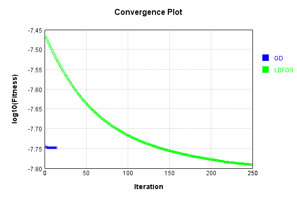


Code from [LearningTester.java:99](../../../../../../../src/main/java/com/simiacryptus/mindseye/test/unit/LearningTester.java#L99) executed in 0.00 seconds: 
```java
    return TestUtil.compareTime(runs);
```

Returns: 

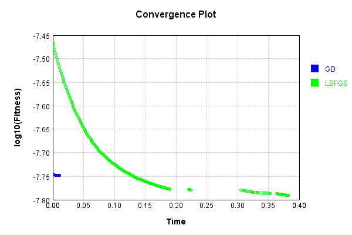


### Model Learning
In this test, attempt to train a network to emulate a randomized network given an example input/output. The target state is:

Code from [LearningTester.java:176](../../../../../../../src/main/java/com/simiacryptus/mindseye/test/unit/LearningTester.java#L176) executed in 0.00 seconds: 
```java
    return network_target.state().stream().map(Arrays::toString).reduce((a, b) -> a + "\n" + b).orElse("");
```

Returns: 

```
    [0.0, 0.0, 0.0, 0.0, 0.0, 0.0, 0.0, 0.0, 0.0, 0.0]
    [-0.029400000000000003, 0.006, -0.0014000000000000002, 0.0342, 0.05, -0.008, -0.07360000000000001, 0.0432, 0.07, -0.05940000000000001, 0.05380000000000001, 0.028200000000000003, -0.0332, -0.077, 0.0198, 0.0854, 0.0178, 0.04440000000000001, -0.0194, 0.046400000000000004, -0.0912, -0.04340000000000001, 0.052, -0.0694, -0.0436, 0.025400000000000002, 0.060200000000000004, 0.005600000000000001, 0.0974, 0.096, -0.0344, 0.0804, -0.08180000000000001, 0.0502, -0.004200000000000001, -0.09280000000000001, 0.009600000000000001, 0.076, 0.0658, 0.069, -0.0668, 0.09340000000000001, -0.073, 0.09720000000000001, -0.0064, 0.062200000000000005, -0.0062, 0.0082, 0.0234, -0.0926, 0.0932, 0.0388, 0.046400000000000004, 0.0658, 0.0322, -0.0678, -0.09280000000000001, 0.0188, -0.0216, 0.0366, -0.0826, -2.0E-4, 0.019200000000000002, 0.0408, 0.009800000000000001, -0.0704, 0.0872, -0.0284, 0.0666, -0.051, 0.0356, 0.013600000000000001, 0.0082, 0.0912, 0.028, -0.0322, 0.0742, 0.005, -0.032
```
...[skipping 10579 bytes](etc/145.txt)...
```
    6, 0.09280000000000001, -0.019600000000000003, 0.0918, 0.048, -0.08660000000000001, -0.0522, -0.021, 0.06, -0.0014000000000000002, -0.027800000000000002, -0.07360000000000001, -0.0984, 0.013, -0.05040000000000001, 0.046, -0.076, -0.0728, -0.0776, 0.08960000000000001, -0.06340000000000001, -0.05380000000000001, 0.0572, -0.0704, -0.08080000000000001, -0.0422, -0.07579999999999999, -0.057800000000000004, 0.0124, -0.09720000000000001, 0.0248, -0.06, 0.04340000000000001, -0.06180000000000001, 0.0568, -0.0478, 0.0516, -0.031200000000000002, -0.0176, 0.088, -0.0534, 0.0732, 0.055200000000000006, 0.008400000000000001, -0.0742, -0.0102, -0.0572, 0.005, 0.048400000000000006, 0.061, 0.018600000000000002, -0.0016, -0.0492, 0.039400000000000004, 0.066, 0.0466, -0.0302, 0.084, 0.0124, 0.0334, -0.0804, 0.0908, -0.047400000000000005, 0.09480000000000001, 0.07540000000000001, -0.0052, 0.0376, 0.037200000000000004]
    [0.0, 0.0, 0.0, 0.0, 0.0, 0.0, 0.0, 0.0, 0.0, 0.0]
    [1.0]
    [1.0]
    [0.0, 0.0, 0.0, 0.0, 0.0, 0.0, 0.0, 0.0, 0.0, 0.0]
```


First, we use a conjugate gradient descent method, which converges the fastest for purely linear functions.

Code from [LearningTester.java:300](../../../../../../../src/main/java/com/simiacryptus/mindseye/test/unit/LearningTester.java#L300) executed in 0.01 seconds: 
```java
    return new IterativeTrainer(trainable)
      .setLineSearchFactory(label -> new QuadraticSearch())
      .setOrientation(new GradientDescent())
      .setMonitor(monitor)
      .setTimeout(30, TimeUnit.SECONDS)
      .setMaxIterations(250)
      .setTerminateThreshold(0)
      .run();
```
Logging: 
```
    Constructing line search parameters: GD
    F(0.0) = LineSearchPoint{point=PointSample{avg=1.4302941554716928E-7}, derivative=-4.238542364500032E-8}
    New Minimum: 1.4302941554716928E-7 > 1.430294155429307E-7
    F(1.0E-10) = LineSearchPoint{point=PointSample{avg=1.430294155429307E-7}, derivative=-4.2385423644127314E-8}, delta = -4.2385793378401206E-18
    New Minimum: 1.430294155429307E-7 > 1.4302941551749946E-7
    F(7.000000000000001E-10) = LineSearchPoint{point=PointSample{avg=1.4302941551749946E-7}, derivative=-4.238542363888931E-8}, delta = -2.966981713686443E-17
    New Minimum: 1.4302941551749946E-7 > 1.4302941533948072E-7
    F(4.900000000000001E-9) = LineSearchPoint{point=PointSample{avg=1.4302941533948072E-7}, derivative=-4.238542360222328E-8}, delta = -2.076885611393734E-16
    New Minimum: 1.4302941533948072E-7 > 1.430294140933493E-7
    F(3.430000000000001E-8) = LineSearchPoint{point=PointSample{avg=1.430294140933493E-7}, derivative=-4.238542334556107E-8}, delta = -1.453819980915173E-15
    New Minimum: 1.430294140933493E-
```
...[skipping 4178 bytes](etc/146.txt)...
```
    -13
    F(0.0) = LineSearchPoint{point=PointSample{avg=4.010930079661119E-8}, derivative=-1.0398808443133081E-25}
    F(4.80228447171725) = LineSearchPoint{point=PointSample{avg=4.010930079661119E-8}, derivative=-5.6413190513456565E-28}, delta = 0.0
    F(33.61599130202075) = LineSearchPoint{point=PointSample{avg=4.01093007966112E-8}, derivative=6.199795827600477E-25}, delta = 1.3234889800848443E-23
    F(2.585845484770827) = LineSearchPoint{point=PointSample{avg=4.010930079661119E-8}, derivative=-4.82982544734982E-26}, delta = 0.0
    F(18.100918393395787) = LineSearchPoint{point=PointSample{avg=4.010930079661119E-8}, derivative=2.858406570130283E-25}, delta = 0.0
    4.010930079661119E-8 <= 4.010930079661119E-8
    F(4.828478842280876) = LineSearchPoint{point=PointSample{avg=4.010930079661119E-8}, derivative=2.2996065138024816E-33}, delta = 0.0
    Right bracket at 4.828478842280876
    Converged to right
    Iteration 5 failed, aborting. Error: 4.010930079661119E-8 Total: 250049081435870.9000; Orientation: 0.0001; Line Search: 0.0013
    
```

Returns: 

```
    4.010930079661119E-8
```


Training Converged

Next, we run the same optimization using L-BFGS, which is nearly ideal for purely second-order or quadratic functions.

Code from [LearningTester.java:324](../../../../../../../src/main/java/com/simiacryptus/mindseye/test/unit/LearningTester.java#L324) executed in 0.01 seconds: 
```java
    return new IterativeTrainer(trainable)
      .setLineSearchFactory(label -> new ArmijoWolfeSearch())
      .setOrientation(new LBFGS())
      .setMonitor(monitor)
      .setTimeout(30, TimeUnit.SECONDS)
      .setMaxIterations(250)
      .setTerminateThreshold(0)
      .run();
```
Logging: 
```
    LBFGS Accumulation History: 1 points
    Constructing line search parameters: GD
    th(0)=1.2725726988438335E-7;dx=-2.554306663401236E-8
    New Minimum: 1.2725726988438335E-7 > 8.429100657763738E-8
    END: th(2.154434690031884)=8.429100657763738E-8; dx=-1.4343280322197494E-8 delta=4.296626330674597E-8
    Iteration 1 complete. Error: 8.429100657763738E-8 Total: 250049086788334.9000; Orientation: 0.0002; Line Search: 0.0007
    LBFGS Accumulation History: 1 points
    th(0)=8.429100657763738E-8;dx=-8.054835449302013E-9
    New Minimum: 8.429100657763738E-8 > 6.455923244864141E-8
    END: th(4.641588833612779)=6.455923244864141E-8; dx=-4.473293800951289E-10 delta=1.9731774128995966E-8
    Iteration 2 complete. Error: 6.455923244864141E-8 Total: 250049087724773.9000; Orientation: 0.0002; Line Search: 0.0006
    LBFGS Accumulation History: 1 points
    th(0)=6.455923244864141E-8;dx=-2.5739524653861404E-11
    New Minimum: 6.455923244864141E-8 > 6.453286649752546E-8
    WOLF (strong): th(10.000000000000002)=6.453286649752546E-8; dx=1.4694571371510348E-
```
...[skipping 3967 bytes](etc/147.txt)...
```
     250049097848061.9000; Orientation: 0.0001; Line Search: 0.0006
    LBFGS Accumulation History: 1 points
    th(0)=6.449570234262374E-8;dx=-1.0938882667958216E-22
    New Minimum: 6.449570234262374E-8 > 6.449570234262353E-8
    WOLF (strong): th(8.058313947244411)=6.449570234262353E-8; dx=3.7701956356342133E-23 delta=2.1175823681357508E-22
    New Minimum: 6.449570234262353E-8 > 6.449570234262348E-8
    END: th(4.0291569736222055)=6.449570234262348E-8; dx=-2.0427628388626198E-23 delta=2.6469779601696886E-22
    Iteration 11 complete. Error: 6.449570234262348E-8 Total: 250049099074038.9000; Orientation: 0.0001; Line Search: 0.0009
    LBFGS Accumulation History: 1 points
    th(0)=6.449570234262348E-8;dx=-3.8166083381579736E-24
    WOLF (strong): th(8.680555555555559)=6.449570234262348E-8; dx=1.5674406770436586E-24 delta=0.0
    END: th(4.3402777777777795)=6.449570234262348E-8; dx=-4.738189045743227E-25 delta=0.0
    Iteration 12 failed, aborting. Error: 6.449570234262348E-8 Total: 250049100201127.9000; Orientation: 0.0001; Line Search: 0.0008
    
```

Returns: 

```
    6.449570234262348E-8
```


Training Converged

Code from [LearningTester.java:96](../../../../../../../src/main/java/com/simiacryptus/mindseye/test/unit/LearningTester.java#L96) executed in 0.00 seconds: 
```java
    return TestUtil.compare(runs);
```

Returns: 

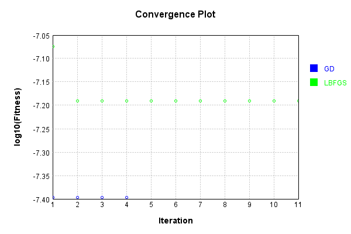


Code from [LearningTester.java:99](../../../../../../../src/main/java/com/simiacryptus/mindseye/test/unit/LearningTester.java#L99) executed in 0.00 seconds: 
```java
    return TestUtil.compareTime(runs);
```

Returns: 


### Composite Learning
In this test, attempt to train a network to emulate a randomized network given an example input/output. The target state is:

Code from [LearningTester.java:219](../../../../../../../src/main/java/com/simiacryptus/mindseye/test/unit/LearningTester.java#L219) executed in 0.00 seconds: 
```java
    return network_target.state().stream().map(Arrays::toString).reduce((a, b) -> a + "\n" + b).orElse("");
```

Returns: 

```
    [0.0, 0.0, 0.0, 0.0, 0.0, 0.0, 0.0, 0.0, 0.0, 0.0]
    [0.019200000000000002, 0.028, 0.046400000000000004, 0.0678, -0.0912, -0.0668, -0.0284, 0.0082, -0.008, -0.0344, 0.0658, -0.0216, 0.0432, -0.0436, 0.09720000000000001, 0.0502, 0.0356, -0.0322, 0.0178, 0.0408, 0.08940000000000001, -0.09280000000000001, -0.0616, -0.049400000000000006, -0.0678, 0.062200000000000005, 0.005, 0.0162, 0.069, 0.0666, 0.0388, 0.0742, -0.0332, 0.0974, 0.0932, 0.086, -0.07360000000000001, 0.06, 0.0198, 0.028200000000000003, -0.061, 0.013600000000000001, -0.05940000000000001, -2.0E-4, 0.04440000000000001, -0.09580000000000001, 0.0412, -0.077, -0.09280000000000001, 0.0188, -0.004200000000000001, -0.029400000000000003, 0.025400000000000002, 0.052, 0.006, -0.051, 0.005600000000000001, -0.0246, 0.09340000000000001, 0.0366, 0.0658, 0.009600000000000001, 0.0912, 0.05, 0.0322, 0.096, -0.036800000000000006, 0.046400000000000004, 0.009800000000000001, -0.0062, -0.0064, -0.04340000000000001, 0.0854, 0.023600000000000003, 0.0804, -0.0826, 0.0918, -0
```
...[skipping 10579 bytes](etc/148.txt)...
```
    00000000000005, -0.08080000000000001, -0.0782, 0.0786, -0.0354, 0.0082, 0.05240000000000001, -0.08120000000000001, -0.0522, 0.061200000000000004, 0.038400000000000004, -0.0144, 0.0658, -0.08280000000000001, -0.0984, -0.0522, 0.029200000000000004, -0.089, 0.066, -0.019200000000000002, 0.0476, -0.040600000000000004, -0.015, 0.0842, -0.046400000000000004, 0.0668, 0.09340000000000001, -0.0918, 0.016, 0.09440000000000001, 0.0286, -0.09580000000000001, 0.048600000000000004, 0.018, 0.04240000000000001, 0.0178, 0.04340000000000001, -0.021, 0.043, -0.0038000000000000004, -0.0482, -0.0884, -0.07579999999999999, -0.022, -0.037200000000000004, 0.0124, 0.0238, -0.015600000000000001, -0.0104, 0.09480000000000001, 0.09780000000000001, -0.0328, 0.084, 0.04340000000000001, -0.0036, 0.018600000000000002, -0.0714, 0.087, -0.0176, 0.056, 0.001, 0.007, 0.0648, -0.047, 0.089, -0.023200000000000002, 0.04240000000000001]
    [0.0, 0.0, 0.0, 0.0, 0.0, 0.0, 0.0, 0.0, 0.0, 0.0]
    [1.0]
    [1.0]
    [0.0, 0.0, 0.0, 0.0, 0.0, 0.0, 0.0, 0.0, 0.0, 0.0]
```


We simultaneously regress this target input:

Code from [LearningTester.java:223](../../../../../../../src/main/java/com/simiacryptus/mindseye/test/unit/LearningTester.java#L223) executed in 0.00 seconds: 
```java
    return Arrays.stream(testInput).map(x -> x.prettyPrint()).reduce((a, b) -> a + "\n" + b).orElse("");
```

Returns: 

```
    [
    	[ [ -0.013600000000000001, 0.059, 0.0614 ], [ 0.022, -0.07579999999999999, -8.0E-4 ], [ -0.035800000000000005, -0.087, -0.06720000000000001 ], [ -0.051, -0.049800000000000004, 0.0248 ], [ -0.0558, -0.0014000000000000002, -0.028 ] ],
    	[ [ -0.018400000000000003, 0.08360000000000001, -0.0376 ], [ 0.065, -0.0164, 0.0862 ], [ -0.025400000000000002, 0.033800000000000004, 0.0882 ], [ -0.097, -0.059, -0.09160000000000001 ], [ 0.046200000000000005, 0.07360000000000001, -0.08780000000000002 ] ],
    	[ [ 0.035, 0.0872, -0.04440000000000001 ], [ -0.0656, 0.06760000000000001, -0.0162 ], [ -0.0176, -0.029400000000000003, -0.0288 ], [ 0.09820000000000001, 0.025, -0.072 ], [ -0.060200000000000004, 0.049, 0.042 ] ],
    	[ [ 0.0834, -0.0516, -0.023200000000000002 ], [ -0.0128, 0.035800000000000005, 0.009800000000000001 ], [ 0.09580000000000001, -0.0966, -0.0932 ], [ -0.048400000000000006, -0.0546, -0.0926 ], [ 0.06860000000000001, 0.0832, 0.0692 ] ],
    	[ [ -0.0446, 0.041400000000000006, 0.011800000000000001 ], [ 0.018400000000000003, 0.0826, 0.030400000000000003 ], [ 0.015, 0.0332, -0.004 ], [ -0.08780000000000002, 0.099, 0.0288 ], [ 0.058, -0.0678, -0.0902 ] ]
    ]
```


Which produces the following output:

Code from [LearningTester.java:230](../../../../../../../src/main/java/com/simiacryptus/mindseye/test/unit/LearningTester.java#L230) executed in 0.00 seconds: 
```java
    return Stream.of(targetOutput).map(x -> x.prettyPrint()).reduce((a, b) -> a + "\n" + b).orElse("");
```

Returns: 

```
    [ 5.176456507376002E-4, 5.7530210699199895E-5, 0.0, 0.0, 6.455382814464001E-4, 0.0, 0.0, 0.0, 4.1212517641760004E-4, 3.962179990560003E-5 ]
```


First, we use a conjugate gradient descent method, which converges the fastest for purely linear functions.

Code from [LearningTester.java:300](../../../../../../../src/main/java/com/simiacryptus/mindseye/test/unit/LearningTester.java#L300) executed in 0.01 seconds: 
```java
    return new IterativeTrainer(trainable)
      .setLineSearchFactory(label -> new QuadraticSearch())
      .setOrientation(new GradientDescent())
      .setMonitor(monitor)
      .setTimeout(30, TimeUnit.SECONDS)
      .setMaxIterations(250)
      .setTerminateThreshold(0)
      .run();
```
Logging: 
```
    Constructing line search parameters: GD
    F(0.0) = LineSearchPoint{point=PointSample{avg=1.1554606249250594E-7}, derivative=-3.587391330445777E-8}
    New Minimum: 1.1554606249250594E-7 > 1.1554606248891848E-7
    F(1.0E-10) = LineSearchPoint{point=PointSample{avg=1.1554606248891848E-7}, derivative=-3.587391330372859E-8}, delta = -3.58746246430778E-18
    New Minimum: 1.1554606248891848E-7 > 1.1554606246739412E-7
    F(7.000000000000001E-10) = LineSearchPoint{point=PointSample{avg=1.1554606246739412E-7}, derivative=-3.587391329935359E-8}, delta = -2.511181373368083E-17
    New Minimum: 1.1554606246739412E-7 > 1.1554606231672369E-7
    F(4.900000000000001E-9) = LineSearchPoint{point=PointSample{avg=1.1554606231672369E-7}, derivative=-3.5873913268728604E-8}, delta = -1.757822461495126E-16
    New Minimum: 1.1554606231672369E-7 > 1.1554606126203067E-7
    F(3.430000000000001E-8) = LineSearchPoint{point=PointSample{avg=1.1554606126203067E-7}, derivative=-3.587391305435372E-8}, delta = -1.2304752730603349E-15
    New Minimum: 1.1554606126203
```
...[skipping 5273 bytes](etc/149.txt)...
```
     0.0
    2.7283663189840756E-8 <= 2.7283663189840756E-8
    F(4.948678492767265) = LineSearchPoint{point=PointSample{avg=2.728366318984072E-8}, derivative=2.7179726907277075E-31}, delta = -3.639594695233322E-23
    Right bracket at 4.948678492767265
    Converged to right
    Iteration 5 complete. Error: 2.728366318984072E-8 Total: 250049232154671.7800; Orientation: 0.0001; Line Search: 0.0023
    Zero gradient: 3.092337934478376E-14
    F(0.0) = LineSearchPoint{point=PointSample{avg=2.728366318984072E-8}, derivative=-9.562553901013991E-28}
    F(4.948678492767265) = LineSearchPoint{point=PointSample{avg=2.728366318984072E-8}, derivative=1.8703552173235794E-29}, delta = 0.0
    2.728366318984072E-8 <= 2.728366318984072E-8
    F(4.853743349998997) = LineSearchPoint{point=PointSample{avg=2.728366318984072E-8}, derivative=1.0179077279737415E-34}, delta = 0.0
    Right bracket at 4.853743349998997
    Converged to right
    Iteration 6 failed, aborting. Error: 2.728366318984072E-8 Total: 250049233508319.7800; Orientation: 0.0001; Line Search: 0.0010
    
```

Returns: 

```
    2.728366318984072E-8
```


Training Converged

Next, we run the same optimization using L-BFGS, which is nearly ideal for purely second-order or quadratic functions.

Code from [LearningTester.java:324](../../../../../../../src/main/java/com/simiacryptus/mindseye/test/unit/LearningTester.java#L324) executed in 0.02 seconds: 
```java
    return new IterativeTrainer(trainable)
      .setLineSearchFactory(label -> new ArmijoWolfeSearch())
      .setOrientation(new LBFGS())
      .setMonitor(monitor)
      .setTimeout(30, TimeUnit.SECONDS)
      .setMaxIterations(250)
      .setTerminateThreshold(0)
      .run();
```
Logging: 
```
    LBFGS Accumulation History: 1 points
    Constructing line search parameters: GD
    th(0)=1.1554606249250594E-7;dx=-3.587391330445777E-8
    New Minimum: 1.1554606249250594E-7 > 5.518049266894125E-8
    END: th(2.154434690031884)=5.518049266894125E-8; dx=-2.0164525488452524E-8 delta=6.036556982356468E-8
    Iteration 1 complete. Error: 5.518049266894125E-8 Total: 250049237156612.7500; Orientation: 0.0002; Line Search: 0.0007
    LBFGS Accumulation History: 1 points
    th(0)=5.518049266894125E-8;dx=-1.1335540130196096E-8
    New Minimum: 5.518049266894125E-8 > 2.7378406618198628E-8
    END: th(4.641588833612779)=2.7378406618198628E-8; dx=-6.440219739148988E-10 delta=2.7802086050742624E-8
    Iteration 2 complete. Error: 2.7378406618198628E-8 Total: 250049238211887.7500; Orientation: 0.0002; Line Search: 0.0007
    LBFGS Accumulation History: 1 points
    th(0)=2.7378406618198628E-8;dx=-3.8299716771845393E-11
    New Minimum: 2.7378406618198628E-8 > 2.735835336546792E-8
    WOLF (strong): th(10.000000000000002)=2.735835336546792E-8; dx=2.954169156718
```
...[skipping 4555 bytes](etc/150.txt)...
```
    50049250681116.7500; Orientation: 0.0002; Line Search: 0.0010
    LBFGS Accumulation History: 1 points
    th(0)=2.7283663189840746E-8;dx=-1.028505342086092E-23
    New Minimum: 2.7283663189840746E-8 > 2.7283663189840736E-8
    WOLF (strong): th(8.680555555555559)=2.7283663189840736E-8; dx=6.2743154013390805E-24 delta=9.926167350636332E-24
    New Minimum: 2.7283663189840736E-8 > 2.728366318984072E-8
    END: th(4.3402777777777795)=2.728366318984072E-8; dx=-1.321861215930004E-24 delta=2.6469779601696886E-23
    Iteration 12 complete. Error: 2.728366318984072E-8 Total: 250049252076371.7500; Orientation: 0.0001; Line Search: 0.0011
    LBFGS Accumulation History: 1 points
    th(0)=2.728366318984072E-8;dx=-1.6990946670787076E-25
    WOLF (strong): th(9.350845008818943)=2.728366318984072E-8; dx=1.2350194319337116E-25 delta=0.0
    END: th(4.675422504409472)=2.728366318984072E-8; dx=-1.0408664363980474E-26 delta=0.0
    Iteration 13 failed, aborting. Error: 2.728366318984072E-8 Total: 250049253462790.7500; Orientation: 0.0002; Line Search: 0.0010
    
```

Returns: 

```
    2.728366318984072E-8
```


Training Converged

Code from [LearningTester.java:96](../../../../../../../src/main/java/com/simiacryptus/mindseye/test/unit/LearningTester.java#L96) executed in 0.00 seconds: 
```java
    return TestUtil.compare(runs);
```

Returns: 


Code from [LearningTester.java:99](../../../../../../../src/main/java/com/simiacryptus/mindseye/test/unit/LearningTester.java#L99) executed in 0.00 seconds: 
```java
    return TestUtil.compareTime(runs);
```

Returns: 

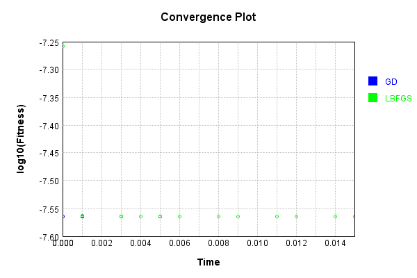


This is a network with the following layout:

Code from [NLayerTest.java:87](../../../../../../../src/test/java/com/simiacryptus/mindseye/network/NLayerTest.java#L87) executed in 0.19 seconds: 
```java
    return Graphviz.fromGraph(TestUtil.toGraph((DAGNetwork) layer))
      .height(400).width(600).render(Format.PNG).toImage();
```

Returns: 

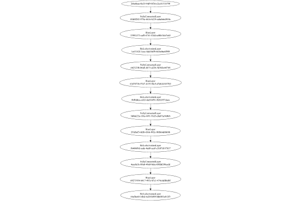


### Json Serialization
Code from [JsonTest.java:36](../../../../../../../src/main/java/com/simiacryptus/mindseye/test/unit/JsonTest.java#L36) executed in 0.00 seconds: 
```java
    JsonObject json = layer.getJson();
    NNLayer echo = NNLayer.fromJson(json);
    if ((echo == null)) throw new AssertionError("Failed to deserialize");
    if ((layer == echo)) throw new AssertionError("Serialization did not copy");
    if ((!layer.equals(echo))) throw new AssertionError("Serialization not equal");
    return new GsonBuilder().setPrettyPrinting().create().toJson(json);
```

Returns: 

```
    {
      "class": "com.simiacryptus.mindseye.network.PipelineNetwork",
      "id": "34c56d5c-bd62-4aea-90a0-9b2d8de60de2",
      "isFrozen": false,
      "name": "PipelineNetwork/34c56d5c-bd62-4aea-90a0-9b2d8de60de2",
      "inputs": [
        "26be0eae-0e3f-44d9-8f36-e2cc8151b798"
      ],
      "nodes": {
        "e8ba5685-7e40-4bd2-9060-ef9714a8c151": "02d0f282-979a-4416-b229-eabab66d930e",
        "072e0b34-ec06-4eb2-a8b9-a0191b73435f": "25993372-eaf8-4741-83dd-a40b18eb7e65",
        "2a559db6-c7f2-49e0-b2ad-63816c298d82": "1c63142f-1eec-4ddf-bff9-6b3a66e6f989",
        "fc8db008-c46a-4b5f-8ac0-3bd3687a0f8d": "cb2323f6-b6a0-4475-a22b-5d3b2cebf768",
        "0f7f1a73-89f8-4afe-966d-d4338a4b9b97": "63d7073b-97d7-4159-94c9-d7d63d105703",
        "ebad6de6-5c12-4173-9752-7dfe999caad8": "5bf8d4ca-cd83-4a6f-bf91-fb563f57daea",
        "034b6873-90c0-4dd7-a9b2-4f6dd5894fd2": "3d0de22a-1f4a-4491-91d5-eba07ac9d0cb",
        "009ad50f-4d60-4297-8173-be5bd14fb78e": "2f1dbef3-6fd8-4366-992c-98f664d8869b",
        "963ce30f-f94a-4626-89e2-77ba575505e4": "3b40609d-aede-4ad0-aea9-e2687d1
```
...[skipping 30499 bytes](etc/151.txt)...
```
    ad-63816c298d82": [
          "072e0b34-ec06-4eb2-a8b9-a0191b73435f"
        ],
        "fc8db008-c46a-4b5f-8ac0-3bd3687a0f8d": [
          "2a559db6-c7f2-49e0-b2ad-63816c298d82"
        ],
        "0f7f1a73-89f8-4afe-966d-d4338a4b9b97": [
          "fc8db008-c46a-4b5f-8ac0-3bd3687a0f8d"
        ],
        "ebad6de6-5c12-4173-9752-7dfe999caad8": [
          "0f7f1a73-89f8-4afe-966d-d4338a4b9b97"
        ],
        "034b6873-90c0-4dd7-a9b2-4f6dd5894fd2": [
          "ebad6de6-5c12-4173-9752-7dfe999caad8"
        ],
        "009ad50f-4d60-4297-8173-be5bd14fb78e": [
          "034b6873-90c0-4dd7-a9b2-4f6dd5894fd2"
        ],
        "963ce30f-f94a-4626-89e2-77ba575505e4": [
          "009ad50f-4d60-4297-8173-be5bd14fb78e"
        ],
        "0fb148c0-a44f-42e5-bd70-996d0bf4de3b": [
          "963ce30f-f94a-4626-89e2-77ba575505e4"
        ],
        "2594ed53-9dd5-4321-8827-64cc7fc9ee6a": [
          "0fb148c0-a44f-42e5-bd70-996d0bf4de3b"
        ],
        "d82b5e31-c08a-4e3f-af52-d8da476301f3": [
          "2594ed53-9dd5-4321-8827-64cc7fc9ee6a"
        ]
      },
      "labels": {},
      "head": "d82b5e31-c08a-4e3f-af52-d8da476301f3"
    }
```


### Input Learning
In this test, we use a network to learn this target input, given it's pre-evaluated output:

Code from [LearningTester.java:127](../../../../../../../src/main/java/com/simiacryptus/mindseye/test/unit/LearningTester.java#L127) executed in 0.00 seconds: 
```java
    return Arrays.stream(input_target).map(x -> x.prettyPrint()).reduce((a, b) -> a + "\n" + b).orElse("");
```

Returns: 

```
    [
    	[ [ 0.0704, 0.012, -0.026200000000000005 ], [ -0.0468, 0.055, 0.0664 ], [ 0.048600000000000004, -2.0E-4, 0.0576 ], [ -0.002, -0.0752, 0.07379999999999999 ], [ -0.0722, 0.0614, -0.0114 ] ],
    	[ [ 0.042, 0.074, 0.024200000000000003 ], [ 0.08280000000000001, -0.038200000000000005, 0.0248 ], [ -0.0964, 0.0632, 0.08220000000000001 ], [ 0.0166, 0.0102, -0.0616 ], [ -0.08860000000000001, -0.0148, -0.08380000000000001 ] ],
    	[ [ 0.073, -0.074, 0.0522 ], [ 0.0248, -0.050800000000000005, 0.009800000000000001 ], [ -0.0344, 0.055600000000000004, 0.060200000000000004 ], [ -0.0054, 0.0178, -0.096 ], [ 0.022200000000000004, -0.08660000000000001, 0.081 ] ],
    	[ [ -0.014, 0.0902, -0.09580000000000001 ], [ -0.059, -0.009, 0.0346 ], [ -0.0408, 0.0142, -0.002 ], [ 0.09340000000000001, -0.08880000000000002, 0.07440000000000001 ], [ 0.044800000000000006, -0.0176, 0.029 ] ],
    	[ [ 0.0238, 0.004200000000000001, -0.0248 ], [ -0.0614, 0.009, -8.0E-4 ], [ 0.0994, -0.014600000000000002, 0.08 ], [ -0.07360000000000001, -0.025, 0.0034000000000000002 ], [ -0.0032, 0.04340000000000001, -0.0436 ] ]
    ]
```


First, we use a conjugate gradient descent method, which converges the fastest for purely linear functions.

Code from [LearningTester.java:300](../../../../../../../src/main/java/com/simiacryptus/mindseye/test/unit/LearningTester.java#L300) executed in 0.02 seconds: 
```java
    return new IterativeTrainer(trainable)
      .setLineSearchFactory(label -> new QuadraticSearch())
      .setOrientation(new GradientDescent())
      .setMonitor(monitor)
      .setTimeout(30, TimeUnit.SECONDS)
      .setMaxIterations(250)
      .setTerminateThreshold(0)
      .run();
```
Logging: 
```
    Low gradient: 8.891366903621249E-9
    Constructing line search parameters: GD
    F(0.0) = LineSearchPoint{point=PointSample{avg=2.7880371309544535E-10}, derivative=-7.90564054148113E-17}
    F(1.0E-10) = LineSearchPoint{point=PointSample{avg=2.7880371309544535E-10}, derivative=-7.90564054148113E-17}, delta = 0.0
    F(7.000000000000001E-10) = LineSearchPoint{point=PointSample{avg=2.7880371309544535E-10}, derivative=-7.90564054148113E-17}, delta = 0.0
    New Minimum: 2.7880371309544535E-10 > 2.788037130954452E-10
    F(4.900000000000001E-9) = LineSearchPoint{point=PointSample{avg=2.788037130954452E-10}, derivative=-7.905640541481129E-17}, delta = -1.550963648536927E-25
    New Minimum: 2.788037130954452E-10 > 2.788037130954428E-10
    F(3.430000000000001E-8) = LineSearchPoint{point=PointSample{avg=2.788037130954428E-10}, derivative=-7.905640541481089E-17}, delta = -2.5332406259436473E-24
    New Minimum: 2.788037130954428E-10 > 2.7880371309542663E-10
    F(2.4010000000000004E-7) = LineSearchPoint{point=PointSample{avg=2.7880371309542663
```
...[skipping 20398 bytes](etc/152.txt)...
```
     at 0.01081350562578125
    F(0.005406752812890625) = LineSearchPoint{point=PointSample{avg=1.7182414658561201E-12}, derivative=-2.5023761090686626E-37}, delta = 0.0
    Right bracket at 0.005406752812890625
    F(0.0027033764064453127) = LineSearchPoint{point=PointSample{avg=1.7182414658561201E-12}, derivative=-2.5023761090686626E-37}, delta = 0.0
    Right bracket at 0.0027033764064453127
    F(0.0013516882032226563) = LineSearchPoint{point=PointSample{avg=1.7182414658561201E-12}, derivative=-2.5023761090686626E-37}, delta = 0.0
    Right bracket at 0.0013516882032226563
    F(6.758441016113282E-4) = LineSearchPoint{point=PointSample{avg=1.7182414658561201E-12}, derivative=-2.5023761090686626E-37}, delta = 0.0
    Right bracket at 6.758441016113282E-4
    F(3.379220508056641E-4) = LineSearchPoint{point=PointSample{avg=1.7182414658561201E-12}, derivative=-2.5023761090686626E-37}, delta = 0.0
    Loops = 12
    Iteration 12 failed, aborting. Error: 1.7182414658561201E-12 Total: 250049633851661.3800; Orientation: 0.0000; Line Search: 0.0037
    
```

Returns: 

```
    1.7182414658561201E-12
```


Training Converged

Next, we run the same optimization using L-BFGS, which is nearly ideal for purely second-order or quadratic functions.

Code from [LearningTester.java:324](../../../../../../../src/main/java/com/simiacryptus/mindseye/test/unit/LearningTester.java#L324) executed in 0.38 seconds: 
```java
    return new IterativeTrainer(trainable)
      .setLineSearchFactory(label -> new ArmijoWolfeSearch())
      .setOrientation(new LBFGS())
      .setMonitor(monitor)
      .setTimeout(30, TimeUnit.SECONDS)
      .setMaxIterations(250)
      .setTerminateThreshold(0)
      .run();
```
Logging: 
```
    LBFGS Accumulation History: 1 points
    Constructing line search parameters: GD
    th(0)=2.7880371309544535E-10;dx=-7.90564054148113E-17
    New Minimum: 2.7880371309544535E-10 > 2.7880354277361115E-10
    WOLFE (weak): th(2.154434690031884)=2.7880354277361115E-10; dx=-7.905637916215801E-17 delta=1.7032183419296733E-16
    New Minimum: 2.7880354277361115E-10 > 2.7880337245183414E-10
    WOLFE (weak): th(4.308869380063768)=2.7880337245183414E-10; dx=-7.90563529095048E-17 delta=3.406436112070748E-16
    New Minimum: 2.7880337245183414E-10 > 2.7880269116528996E-10
    WOLFE (weak): th(12.926608140191302)=2.7880269116528996E-10; dx=-7.905624789889171E-17 delta=1.021930155384821E-15
    New Minimum: 2.7880269116528996E-10 > 2.787996253870397E-10
    WOLFE (weak): th(51.70643256076521)=2.787996253870397E-10; dx=-7.905577535113289E-17 delta=4.0877084056326E-15
    New Minimum: 2.787996253870397E-10 > 2.787832748791997E-10
    WOLFE (weak): th(258.53216280382605)=2.787832748791997E-10; dx=-7.905325509641908E-17 delta=2.0438216245663685E-14
    New Minim
```
...[skipping 334314 bytes](etc/153.txt)...
```
    16569258E-10
    WOLFE (weak): th(4.308869380063768)=2.500053116569258E-10; dx=-7.023677668788172E-17 delta=3.026411961150181E-16
    New Minimum: 2.500053116569258E-10 > 2.500047063751299E-10
    WOLFE (weak): th(12.926608140191302)=2.500047063751299E-10; dx=-7.023668462777056E-17 delta=9.079229919995315E-16
    New Minimum: 2.500047063751299E-10 > 2.5000198261686465E-10
    WOLFE (weak): th(51.70643256076521)=2.5000198261686465E-10; dx=-7.02362703572701E-17 delta=3.631681257249964E-15
    New Minimum: 2.5000198261686465E-10 > 2.4998745617744323E-10
    WOLFE (weak): th(258.53216280382605)=2.4998745617744323E-10; dx=-7.02340609146011E-17 delta=1.8158120678672088E-14
    New Minimum: 2.4998745617744323E-10 > 2.49896676284277E-10
    WOLFE (weak): th(1551.1929768229563)=2.49896676284277E-10; dx=-7.02202518979199E-17 delta=1.0893801384489127E-13
    MAX ALPHA: th(0)=2.500056142981219E-10;th'(0)=-7.023682271793738E-17;
    Iteration 250 complete. Error: 2.49896676284277E-10 Total: 250050011886324.0000; Orientation: 0.0000; Line Search: 0.0012
    
```

Returns: 

```
    2.49896676284277E-10
```


Training Converged

Code from [LearningTester.java:96](../../../../../../../src/main/java/com/simiacryptus/mindseye/test/unit/LearningTester.java#L96) executed in 0.13 seconds: 
```java
    return TestUtil.compare(runs);
```

Returns: 

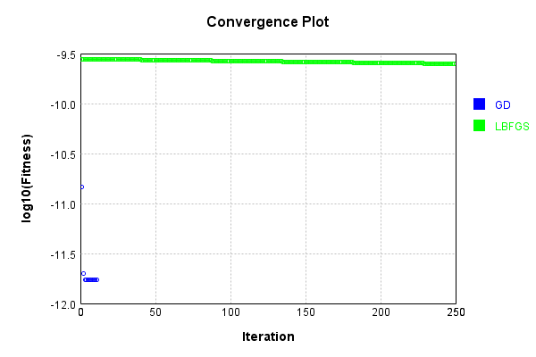


Code from [LearningTester.java:99](../../../../../../../src/main/java/com/simiacryptus/mindseye/test/unit/LearningTester.java#L99) executed in 0.01 seconds: 
```java
    return TestUtil.compareTime(runs);
```

Returns: 

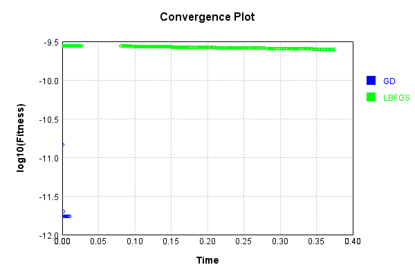


### Model Learning
In this test, attempt to train a network to emulate a randomized network given an example input/output. The target state is:

Code from [LearningTester.java:176](../../../../../../../src/main/java/com/simiacryptus/mindseye/test/unit/LearningTester.java#L176) executed in 0.00 seconds: 
```java
    return network_target.state().stream().map(Arrays::toString).reduce((a, b) -> a + "\n" + b).orElse("");
```

Returns: 

```
    [0.033, 0.045200000000000004, 0.08220000000000001, -0.054, -0.021400000000000002, 0.073, 0.068, 0.0316, -0.0144, -0.043800000000000006, -0.027800000000000002, -0.0506, 0.0026, 0.008400000000000001, -0.08780000000000002, -0.061, 0.073, -0.007, 0.08020000000000001, 0.0166, 0.0724, -0.0258, -0.0694, -0.037, -0.029400000000000003, 0.0422, 0.0386, 0.0388, -0.07540000000000001, -0.054400000000000004, -0.038200000000000005, 0.0228, -0.015200000000000002, 0.09620000000000001, 0.027, -0.030600000000000002, -0.0198, -0.0502, -0.0086, 0.065, 0.0454, -0.076, 0.0862, 0.053200000000000004, 0.025, 0.0402, -0.046200000000000005, 0.030400000000000003, 0.0912, 0.0872, -0.0884, -0.0456, 0.0362, -0.09340000000000001, -0.0814, -0.078, -0.0356, -0.0526, -0.011800000000000001, 0.007, 0.06760000000000001, 0.098, -0.09780000000000001, 0.08220000000000001, -0.0426, 0.047, 0.09580000000000001, -0.056600000000000004, 0.0684, 0.031, -0.038, 6.000000000000001E-4, -0.08960000000000001, -0.048, 0.0496, -0.07460000000000001, 0.074, 0.0796, 0
```
...[skipping 12364 bytes](etc/154.txt)...
```
     -0.0568, 0.016, -0.057, -0.0022, -0.0454, 0.0, -0.059, -0.0028000000000000004, 0.048, 0.09960000000000001, -0.066, 0.08080000000000001, 0.013600000000000001, -0.0094, -0.08660000000000001, 0.09060000000000001, -0.0814, 0.030400000000000003, 0.0814, 0.0198, 0.038200000000000005, 0.059, 0.07780000000000001, -0.0316, 0.04580000000000001, 0.08460000000000001, -0.0044, 0.022600000000000002, -0.06, -0.010600000000000002, 0.0204, -0.033600000000000005, -0.0388, -0.086, 0.0692, 0.0936, 0.055600000000000004, 0.0806, 0.021400000000000002, 0.004200000000000001, -0.0966, -0.06620000000000001, -0.003, -0.0194, -0.023200000000000002, -0.08660000000000001, 0.0322, -0.06180000000000001, 0.06760000000000001, -0.09620000000000001, 0.015200000000000002, 0.0436, -0.0362, -0.07940000000000001, -0.0318, -0.0792, 0.05040000000000001, 0.0536, 0.027200000000000002, -0.08680000000000002, 0.0614, 0.0114, -0.07540000000000001, 0.0994, 0.0806, 0.0814, -0.028200000000000003, 0.0562, 0.0218, -0.093, 0.0946, -0.013600000000000001, -0.0522]
```


First, we use a conjugate gradient descent method, which converges the fastest for purely linear functions.

Code from [LearningTester.java:300](../../../../../../../src/main/java/com/simiacryptus/mindseye/test/unit/LearningTester.java#L300) executed in 0.02 seconds: 
```java
    return new IterativeTrainer(trainable)
      .setLineSearchFactory(label -> new QuadraticSearch())
      .setOrientation(new GradientDescent())
      .setMonitor(monitor)
      .setTimeout(30, TimeUnit.SECONDS)
      .setMaxIterations(250)
      .setTerminateThreshold(0)
      .run();
```
Logging: 
```
    Constructing line search parameters: GD
    F(0.0) = LineSearchPoint{point=PointSample{avg=3.796700488095014E-9}, derivative=-1.5390506299210145E-9}
    New Minimum: 3.796700488095014E-9 > 3.796700487941108E-9
    F(1.0E-10) = LineSearchPoint{point=PointSample{avg=3.796700487941108E-9}, derivative=-1.5390506298898006E-9}, delta = -1.5390522477161633E-19
    New Minimum: 3.796700487941108E-9 > 3.796700487017682E-9
    F(7.000000000000001E-10) = LineSearchPoint{point=PointSample{avg=3.796700487017682E-9}, derivative=-1.539050629702519E-9}, delta = -1.077331610317639E-18
    New Minimum: 3.796700487017682E-9 > 3.796700480553665E-9
    F(4.900000000000001E-9) = LineSearchPoint{point=PointSample{avg=3.796700480553665E-9}, derivative=-1.5390506283915416E-9}, delta = -7.541348569183687E-18
    New Minimum: 3.796700480553665E-9 > 3.796700435305576E-9
    F(3.430000000000001E-8) = LineSearchPoint{point=PointSample{avg=3.796700435305576E-9}, derivative=-1.5390506192147062E-9}, delta = -5.278943750274397E-17
    New Minimum: 3.796700435305576E-9 > 3
```
...[skipping 3949 bytes](etc/155.txt)...
```
    1.0645066999853216E-13
    F(0.0) = LineSearchPoint{point=PointSample{avg=2.0760725440533496E-12}, derivative=-1.1331745143136394E-26}
    New Minimum: 2.0760725440533496E-12 > 2.0760725440533218E-12
    F(4.930685542303765) = LineSearchPoint{point=PointSample{avg=2.0760725440533218E-12}, derivative=3.5004574492339135E-29}, delta = -2.7868878059647905E-26
    2.0760725440533218E-12 <= 2.0760725440533496E-12
    Converged to right
    Iteration 5 complete. Error: 2.0760725440533218E-12 Total: 250050304926752.7000; Orientation: 0.0002; Line Search: 0.0021
    Zero gradient: 7.245135945222442E-16
    F(0.0) = LineSearchPoint{point=PointSample{avg=2.0760725440533218E-12}, derivative=-5.249199486475429E-31}
    F(4.930685542303765) = LineSearchPoint{point=PointSample{avg=2.0760725440533218E-12}, derivative=1.566909373762336E-33}, delta = 0.0
    2.0760725440533218E-12 <= 2.0760725440533218E-12
    Converged to right
    Iteration 6 failed, aborting. Error: 2.0760725440533218E-12 Total: 250050306629783.7000; Orientation: 0.0001; Line Search: 0.0010
    
```

Returns: 

```
    2.0760725440533218E-12
```


Training Converged

Next, we run the same optimization using L-BFGS, which is nearly ideal for purely second-order or quadratic functions.

Code from [LearningTester.java:324](../../../../../../../src/main/java/com/simiacryptus/mindseye/test/unit/LearningTester.java#L324) executed in 0.04 seconds: 
```java
    return new IterativeTrainer(trainable)
      .setLineSearchFactory(label -> new ArmijoWolfeSearch())
      .setOrientation(new LBFGS())
      .setMonitor(monitor)
      .setTimeout(30, TimeUnit.SECONDS)
      .setMaxIterations(250)
      .setTerminateThreshold(0)
      .run();
```
Logging: 
```
    LBFGS Accumulation History: 1 points
    Constructing line search parameters: GD
    th(0)=9.686195294608183E-10;dx=-3.92992737734569E-10
    New Minimum: 9.686195294608183E-10 > 3.0736140266183055E-10
    END: th(2.154434690031884)=3.0736140266183055E-10; dx=-2.2086493050997612E-10 delta=6.612581267989878E-10
    Iteration 1 complete. Error: 3.0736140266183055E-10 Total: 250050315637665.7000; Orientation: 0.0005; Line Search: 0.0012
    LBFGS Accumulation History: 1 points
    th(0)=3.0736140266183055E-10;dx=-1.2412778893501496E-10
    New Minimum: 3.0736140266183055E-10 > 3.0463085716678178E-12
    END: th(4.641588833612779)=3.0463085716678178E-12; dx=-6.997610758123064E-12 delta=3.0431509409016275E-10
    Iteration 2 complete. Error: 3.0463085716678178E-12 Total: 250050317710028.7000; Orientation: 0.0004; Line Search: 0.0013
    LBFGS Accumulation History: 1 points
    th(0)=3.0463085716678178E-12;dx=-3.944929700385883E-13
    New Minimum: 3.0463085716678178E-12 > 2.1938192043581537E-12
    WOLF (strong): th(10.000000000000002)=2.1938192043581537E
```
...[skipping 5205 bytes](etc/156.txt)...
```
    : 0.0012
    LBFGS Accumulation History: 1 points
    th(0)=2.076072544053322E-12;dx=-3.2673167702314853E-28
    New Minimum: 2.076072544053322E-12 > 2.0760725440533218E-12
    WOLF (strong): th(9.350845008818943)=2.0760725440533218E-12; dx=2.440922685382774E-29 delta=4.0389678347315804E-28
    END: th(4.675422504409472)=2.0760725440533218E-12; dx=-1.6197692629168778E-29 delta=4.0389678347315804E-28
    Iteration 13 complete. Error: 2.0760725440533218E-12 Total: 250050348166238.6600; Orientation: 0.0002; Line Search: 0.0012
    LBFGS Accumulation History: 1 points
    th(0)=2.0760725440533218E-12;dx=-8.034173617117612E-31
    WOLF (strong): th(10.072892434055515)=2.0760725440533218E-12; dx=5.968273521604095E-32 delta=0.0
    WOLF (strong): th(5.036446217027757)=2.0760725440533218E-12; dx=1.6671831932240666E-33 delta=0.0
    END: th(1.678815405675919)=2.0760725440533218E-12; dx=-5.2925399011041975E-31 delta=0.0
    Iteration 14 failed, aborting. Error: 2.0760725440533218E-12 Total: 250050350391064.6600; Orientation: 0.0002; Line Search: 0.0017
    
```

Returns: 

```
    2.0760725440533218E-12
```


Training Converged

Code from [LearningTester.java:96](../../../../../../../src/main/java/com/simiacryptus/mindseye/test/unit/LearningTester.java#L96) executed in 0.00 seconds: 
```java
    return TestUtil.compare(runs);
```

Returns: 

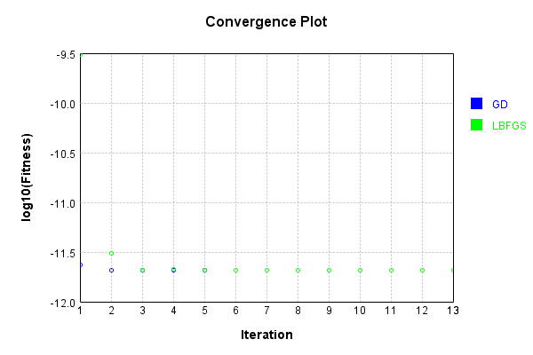


Code from [LearningTester.java:99](../../../../../../../src/main/java/com/simiacryptus/mindseye/test/unit/LearningTester.java#L99) executed in 0.00 seconds: 
```java
    return TestUtil.compareTime(runs);
```

Returns: 

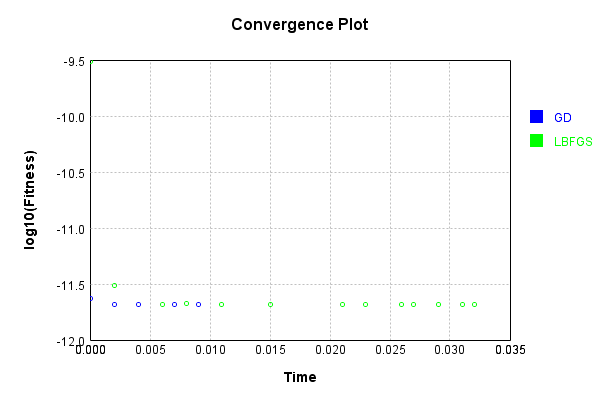


### Composite Learning
In this test, attempt to train a network to emulate a randomized network given an example input/output. The target state is:

Code from [LearningTester.java:219](../../../../../../../src/main/java/com/simiacryptus/mindseye/test/unit/LearningTester.java#L219) executed in 0.00 seconds: 
```java
    return network_target.state().stream().map(Arrays::toString).reduce((a, b) -> a + "\n" + b).orElse("");
```

Returns: 

```
    [0.09, -0.0646, -0.004, -0.061, 0.04, 0.0762, 2.0E-4, 0.0124, -0.08, 0.0122, 0.045, -0.049800000000000004, -0.036800000000000006, 0.029400000000000003, -0.0632, 0.0124, 0.08360000000000001, -0.0088, 0.014, -0.09620000000000001, 0.0912, -0.0318, 0.008, -0.09060000000000001, -0.039400000000000004, 0.0806, -0.064, -0.025400000000000002, -0.0506, 0.0446, 0.0492, 0.07980000000000001, -0.0478, 0.039200000000000006, -0.0506, 0.0572, -0.0356, 0.028200000000000003, 0.0164, 0.057, 0.011800000000000001, 0.09880000000000001, 0.053200000000000004, 0.0128, 0.08460000000000001, -0.042800000000000005, 0.0228, -0.037, 0.085, -0.054, -0.015, -0.0238, -0.084, -0.0548, -0.0038000000000000004, -0.05940000000000001, 0.013800000000000002, 0.012600000000000002, 0.048400000000000006, -0.0346, -0.0826, 0.065, 0.095, -0.016800000000000002, -0.056400000000000006, -0.0038000000000000004, -0.0714, -0.021400000000000002, -0.005600000000000001, 0.09280000000000001, -0.006, -0.0666, -0.059, -0.0964, 0.099, -0.053, 0.017400000000000002, 0.073
```
...[skipping 12364 bytes](etc/157.txt)...
```
    02, 0.09960000000000001, 0.0114, 0.009800000000000001, -0.057, 0.053, -0.0194, -0.0204, -0.0316, -0.06180000000000001, -0.023200000000000002, 0.013600000000000001, 0.021400000000000002, -0.0898, 0.0436, -0.0814, -0.003, 0.0456, -0.09620000000000001, 0.0946, 0.004, 0.055600000000000004, -0.08660000000000001, -0.0792, -0.0568, 0.0536, -0.0316, 0.0814, -0.0044, -0.013600000000000001, 0.023200000000000002, 0.0674, -0.0522, 0.0322, 0.08460000000000001, -0.0966, 0.059, 0.04580000000000001, -0.08660000000000001, -0.086, -0.0078000000000000005, 0.0692, 0.016, 0.0562, -0.0318, 0.0936, -0.0398, 0.0814, -0.06620000000000001, -0.07540000000000001, -0.059, 0.08080000000000001, -0.0454, 0.030400000000000003, -0.08680000000000002, -0.0362, -0.09, 0.05040000000000001, 0.0582, 0.048, -0.066, 0.004200000000000001, -0.011, 0.07780000000000001, -0.028200000000000003, -0.0028000000000000004, 0.0932, 0.09060000000000001, 0.0994, 0.027200000000000002, 0.0218, 0.0198, -0.0124, 0.0806, -0.0022, -0.093, -0.010600000000000002, -0.0872]
```


We simultaneously regress this target input:

Code from [LearningTester.java:223](../../../../../../../src/main/java/com/simiacryptus/mindseye/test/unit/LearningTester.java#L223) executed in 0.00 seconds: 
```java
    return Arrays.stream(testInput).map(x -> x.prettyPrint()).reduce((a, b) -> a + "\n" + b).orElse("");
```

Returns: 

```
    [
    	[ [ 0.081, 0.0346, 0.044800000000000006 ], [ 0.0102, -0.096, -0.074 ], [ 0.0166, 0.0142, 0.0902 ], [ 0.08220000000000001, 0.04340000000000001, 0.060200000000000004 ], [ -0.0176, 0.0704, 0.0522 ] ],
    	[ [ 0.012, 0.0632, 0.055 ], [ -0.025, -0.0468, -0.0032 ], [ 0.0034000000000000002, 0.009, -0.050800000000000005 ], [ 0.07440000000000001, -0.0964, -0.0248 ], [ 0.009800000000000001, -0.0614, -0.0752 ] ],
    	[ [ 0.08, -0.0408, -0.0114 ], [ -0.08380000000000001, -0.08660000000000001, -0.09580000000000001 ], [ 0.048600000000000004, -0.009, 0.029 ], [ -2.0E-4, 0.073, 0.022200000000000004 ], [ -0.08880000000000002, -0.0054, -0.038200000000000005 ] ],
    	[ [ -0.08860000000000001, 0.0178, -0.059 ], [ -0.0616, 0.0994, 0.0248 ], [ 0.004200000000000001, -0.014600000000000002, 0.0238 ], [ -0.014, 0.055600000000000004, 0.074 ], [ -0.026200000000000005, 0.042, -0.0722 ] ],
    	[ [ 0.024200000000000003, 0.0576, -8.0E-4 ], [ -0.0148, -0.0436, -0.07360000000000001 ], [ 0.0614, -0.002, 0.0248 ], [ 0.09340000000000001, 0.08280000000000001, 0.0664 ], [ -0.0344, -0.002, 0.07379999999999999 ] ]
    ]
```


Which produces the following output:

Code from [LearningTester.java:230](../../../../../../../src/main/java/com/simiacryptus/mindseye/test/unit/LearningTester.java#L230) executed in 0.00 seconds: 
```java
    return Stream.of(targetOutput).map(x -> x.prettyPrint()).reduce((a, b) -> a + "\n" + b).orElse("");
```

Returns: 

```
    [ 0.0, 0.0, 0.0, 0.0, 0.0, 0.0, 3.1937729012295385E-5, 0.0, 0.0, 1.0247909026870428E-6 ]
```


First, we use a conjugate gradient descent method, which converges the fastest for purely linear functions.

Code from [LearningTester.java:300](../../../../../../../src/main/java/com/simiacryptus/mindseye/test/unit/LearningTester.java#L300) executed in 0.02 seconds: 
```java
    return new IterativeTrainer(trainable)
      .setLineSearchFactory(label -> new QuadraticSearch())
      .setOrientation(new GradientDescent())
      .setMonitor(monitor)
      .setTimeout(30, TimeUnit.SECONDS)
      .setMaxIterations(250)
      .setTerminateThreshold(0)
      .run();
```
Logging: 
```
    Constructing line search parameters: GD
    F(0.0) = LineSearchPoint{point=PointSample{avg=9.866040899459796E-10}, derivative=-3.609872051906605E-10}
    New Minimum: 9.866040899459796E-10 > 9.866040899098813E-10
    F(1.0E-10) = LineSearchPoint{point=PointSample{avg=9.866040899098813E-10}, derivative=-3.609872051832943E-10}, delta = -3.6098368726967266E-20
    New Minimum: 9.866040899098813E-10 > 9.866040896932894E-10
    F(7.000000000000001E-10) = LineSearchPoint{point=PointSample{avg=9.866040896932894E-10}, derivative=-3.6098720513909675E-10}, delta = -2.5269023544999597E-19
    New Minimum: 9.866040896932894E-10 > 9.866040881771422E-10
    F(4.900000000000001E-9) = LineSearchPoint{point=PointSample{avg=9.866040881771422E-10}, derivative=-3.6098720482971295E-10}, delta = -1.7688374384142596E-18
    New Minimum: 9.866040881771422E-10 > 9.866040775641182E-10
    F(3.430000000000001E-8) = LineSearchPoint{point=PointSample{avg=9.866040775641182E-10}, derivative=-3.6098720266402786E-10}, delta = -1.2381861448514358E-17
    New Minimum: 9.86
```
...[skipping 6850 bytes](etc/158.txt)...
```
    3.3933866138030644
    F(4.453819930616524) = LineSearchPoint{point=PointSample{avg=1.0200185344628144E-10}, derivative=9.993386164333353E-44}, delta = 0.0
    Right bracket at 4.453819930616524
    F(4.122434519112318) = LineSearchPoint{point=PointSample{avg=1.0200185344628144E-10}, derivative=9.993386164333353E-44}, delta = 0.0
    Right bracket at 4.122434519112318
    F(3.894607048703176) = LineSearchPoint{point=PointSample{avg=1.0200185344628144E-10}, derivative=9.993386164333353E-44}, delta = 0.0
    Right bracket at 3.894607048703176
    F(3.737975662796891) = LineSearchPoint{point=PointSample{avg=1.0200185344628144E-10}, derivative=9.993386164333353E-44}, delta = 0.0
    Right bracket at 3.737975662796891
    F(3.6302915849863204) = LineSearchPoint{point=PointSample{avg=1.0200185344628144E-10}, derivative=-2.1985449561533373E-43}, delta = 0.0
    Left bracket at 3.6302915849863204
    Converged to right
    Iteration 4 failed, aborting. Error: 1.0200185344628144E-10 Total: 250050480854171.5300; Orientation: 0.0001; Line Search: 0.0033
    
```

Returns: 

```
    1.0200185344628144E-10
```


Training Converged

Next, we run the same optimization using L-BFGS, which is nearly ideal for purely second-order or quadratic functions.

Code from [LearningTester.java:324](../../../../../../../src/main/java/com/simiacryptus/mindseye/test/unit/LearningTester.java#L324) executed in 0.02 seconds: 
```java
    return new IterativeTrainer(trainable)
      .setLineSearchFactory(label -> new ArmijoWolfeSearch())
      .setOrientation(new LBFGS())
      .setMonitor(monitor)
      .setTimeout(30, TimeUnit.SECONDS)
      .setMaxIterations(250)
      .setTerminateThreshold(0)
      .run();
```
Logging: 
```
    LBFGS Accumulation History: 1 points
    Constructing line search parameters: GD
    th(0)=9.866040899459796E-10;dx=-3.609872051906605E-10
    New Minimum: 9.866040899459796E-10 > 3.798368476260041E-10
    END: th(2.154434690031884)=3.798368476260041E-10; dx=-2.022856067365873E-10 delta=6.067672423199755E-10
    Iteration 1 complete. Error: 3.798368476260041E-10 Total: 250050485064157.5300; Orientation: 0.0003; Line Search: 0.0009
    LBFGS Accumulation History: 1 points
    th(0)=3.798368476260041E-10;dx=-1.1336114201019617E-10
    New Minimum: 3.798368476260041E-10 > 1.0280894685091474E-10
    END: th(4.641588833612779)=1.0280894685091474E-10; dx=-6.0065623963193306E-12 delta=2.7702790077508935E-10
    Iteration 2 complete. Error: 1.0280894685091474E-10 Total: 250050486381042.5000; Orientation: 0.0003; Line Search: 0.0008
    LBFGS Accumulation History: 1 points
    th(0)=1.0280894685091474E-10;dx=-3.281891196577986E-13
    New Minimum: 1.0280894685091474E-10 > 1.0202694578865708E-10
    WOLF (strong): th(10.000000000000002)=1.0202694578865708E-10;
```
...[skipping 4440 bytes](etc/159.txt)...
```
    mplete. Error: 1.0200185344628145E-10 Total: 250050502298795.5000; Orientation: 0.0002; Line Search: 0.0012
    LBFGS Accumulation History: 1 points
    th(0)=1.020018534462815E-10;dx=-2.640932541023279E-26
    New Minimum: 1.020018534462815E-10 > 1.0200185344628144E-10
    WOLF (strong): th(8.680555555555559)=1.0200185344628144E-10; dx=3.5705940917077524E-28 delta=6.462348535570529E-26
    END: th(4.3402777777777795)=1.0200185344628144E-10; dx=-3.1537331122907182E-27 delta=6.462348535570529E-26
    Iteration 12 complete. Error: 1.0200185344628144E-10 Total: 250050503987862.5000; Orientation: 0.0002; Line Search: 0.0012
    LBFGS Accumulation History: 1 points
    th(0)=1.0200185344628144E-10;dx=-3.7662315317468007E-28
    WOLF (strong): th(9.350845008818943)=1.0200185344628144E-10; dx=5.554680035489828E-30 delta=0.0
    END: th(4.675422504409472)=1.0200185344628144E-10; dx=-1.9369517327692423E-29 delta=0.0
    Iteration 13 failed, aborting. Error: 1.0200185344628144E-10 Total: 250050505561798.5000; Orientation: 0.0002; Line Search: 0.0012
    
```

Returns: 

```
    1.0200185344628144E-10
```


Training Converged

Code from [LearningTester.java:96](../../../../../../../src/main/java/com/simiacryptus/mindseye/test/unit/LearningTester.java#L96) executed in 0.00 seconds: 
```java
    return TestUtil.compare(runs);
```

Returns: 


Code from [LearningTester.java:99](../../../../../../../src/main/java/com/simiacryptus/mindseye/test/unit/LearningTester.java#L99) executed in 0.00 seconds: 
```java
    return TestUtil.compareTime(runs);
```

Returns: 

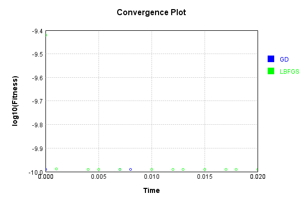


