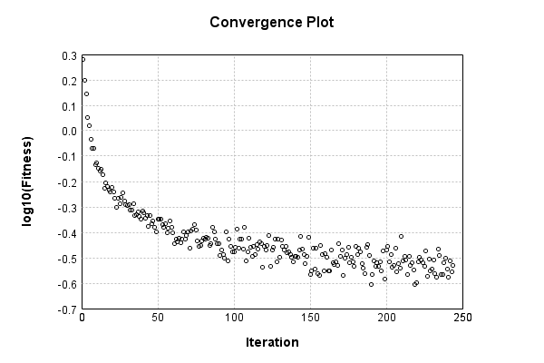

### Model
This is a very simple model that performs basic logistic regression. It is expected to be trainable to about 91% accuracy on MNIST.

Code from [MnistTestBase.java:293](../../../../../../../src/test/java/com/simiacryptus/mindseye/opt/MnistTestBase.java#L293) executed in 0.00 seconds: 
```java
    PipelineNetwork network = new PipelineNetwork();
    network.add(new BiasLayer(28, 28, 1));
    network.add(new FullyConnectedLayer(new int[]{28, 28, 1}, new int[]{10})
      .setWeights(() -> 0.001 * (Math.random() - 0.45)));
    network.add(new SoftmaxActivationLayer());
    return network;
```

Returns: 

```
    PipelineNetwork/9510dcc2-d29e-4ad4-b0cc-dabd384d0a52
```


### Training
Code from [BisectionLineSearchTest.java:43](../../../../../../../src/test/java/com/simiacryptus/mindseye/opt/line/BisectionLineSearchTest.java#L43) executed in 180.02 seconds: 
```java
    SimpleLossNetwork supervisedNetwork = new SimpleLossNetwork(network, new EntropyLossLayer());
    Trainable trainable = new SampledArrayTrainable(trainingData, supervisedNetwork, 1000);
    return new IterativeTrainer(trainable)
      .setMonitor(monitor)
      .setOrientation(new GradientDescent())
      .setLineSearchFactory((String name) -> new BisectionSearch())
      .setTimeout(3, TimeUnit.MINUTES)
      .setMaxIterations(500)
      .run();
```
Logging: 
```
    Constructing line search parameters: GD
    F(0.0) = LineSearchPoint{point=PointSample{avg=2.54651884239271}, derivative=-456994.26450151845}
    F(1.0)@0 = LineSearchPoint{point=PointSample{avg=19.673287034541126}, derivative=2.5331506459193617E-153}
    Right is at most 1.0
    F(0.5)@1 = LineSearchPoint{point=PointSample{avg=19.673287034541126}, derivative=6.576388036964152E-71}
    Right is at most 0.5
    F(0.25)@2 = LineSearchPoint{point=PointSample{avg=19.673287034541126}, derivative=1.0660419884782153E-29}
    Right is at most 0.25
    F(0.125)@3 = LineSearchPoint{point=PointSample{avg=19.673287034541126}, derivative=4.298584171075386E-9}
    Right is at most 0.125
    F(0.0625)@4 = LineSearchPoint{point=PointSample{avg=19.668553069034797}, derivative=0.759151138264176}
    Right is at most 0.0625
    F(0.03125)@5 = LineSearchPoint{point=PointSample{avg=19.652128846741228}, derivative=2.5605381093814423}
    Right is at most 0.03125
    F(0.015625)@6 = LineSearchPoint{point=PointSample{avg=19.616664343264883}, derivative=11.289683288731144}
```
...[skipping 278533 bytes](etc/153.txt)...
```
     derivative=-3982.149816652249}
    New Minimum: 0.3077381192761008 > 0.29562801136129235
    F(1.063359961290605E-5)@0 = LineSearchPoint{point=PointSample{avg=0.29562801136129235}, derivative=-471.105109433295}
    Right is at least 1.063359961290605E-5
    F(2.6583999032265127E-5)@1 = LineSearchPoint{point=PointSample{avg=0.3122092635543959}, derivative=4792.093983980507}
    Right is at most 2.6583999032265127E-5
    F(1.8608799322585587E-5)@2 = LineSearchPoint{point=PointSample{avg=0.2986754636719864}, derivative=2122.0562237580407}
    Right is at most 1.8608799322585587E-5
    F(1.4621199467745819E-5)@3 = LineSearchPoint{point=PointSample{avg=0.29585782112194536}, derivative=820.9252092855788}
    Right is at most 1.4621199467745819E-5
    New Minimum: 0.29562801136129235 > 0.29542031241885336
    F(1.2627399540325935E-5)@4 = LineSearchPoint{point=PointSample{avg=0.29542031241885336}, derivative=174.58078395826917}
    Iteration 244 complete. Error: 0.29542031241885336 Total: 59659409873490.1640; Orientation: 0.0003; Line Search: 0.4870
    
```

Returns: 

```
    0.29542031241885336
```


Code from [MnistTestBase.java:139](../../../../../../../src/test/java/com/simiacryptus/mindseye/opt/MnistTestBase.java#L139) executed in 0.00 seconds: 
```java
    PlotCanvas plot = ScatterPlot.plot(history.stream().map(step -> new double[]{step.iteration, Math.log10(step.point.getMean())}).toArray(i -> new double[i][]));
    plot.setTitle("Convergence Plot");
    plot.setAxisLabels("Iteration", "log10(Fitness)");
    plot.setSize(600, 400);
    return plot;
```

Returns: 




Saved model as [model0.json](etc/model0.json)

### Metrics
Code from [MnistTestBase.java:152](../../../../../../../src/test/java/com/simiacryptus/mindseye/opt/MnistTestBase.java#L152) executed in 0.39 seconds: 
```java
    try {
      ByteArrayOutputStream out = new ByteArrayOutputStream();
      JsonUtil.writeJson(out, monitoringRoot.getMetrics());
      return out.toString();
    } catch (IOException e) {
      throw new RuntimeException(e);
    }
```

Returns: 

```
    [ "java.util.HashMap", {
      "BiasLayer/e389cf9a-3027-42c2-8d8c-ae9ba46b3ff7" : [ "java.util.HashMap", {
        "avgMsPerItem" : 0.01792619601828941,
        "medianMsPerItem" : "NaN",
        "avgMsPerItem_Backward" : 2.1612797578267854E-5,
        "totalItems" : 1859000,
        "backpropStatistics" : [ "java.util.HashMap", {
          "meanExponent" : -5.053468631305106,
          "tp50" : -0.0014007163006374646,
          "negative" : 191822,
          "min" : -5.533319015726803E-4,
          "max" : 5.99416489230631E-4,
          "tp90" : -0.0012141521248427796,
          "mean" : 2.107401788407737E-10,
          "count" : 392000.0,
          "positive" : 200178,
          "stdDev" : 1.631228148603626E-4,
          "tp75" : -0.0012661920206623876,
          "zeros" : 0
        } ],
        "totalBatches" : 3718,
        "weights" : [ "java.util.HashMap", {
          "tp50" : "NaN",
          "buffers" : 1,
          "max" : 3.2046220007266304E-8,
          "tp90" : "NaN",
          "count" : 784.0,
          "positive" : 408,
          "tp75" : "NaN",
          "zeros" : 0,
          "mean
```
...[skipping 2800 bytes](etc/154.txt)...
```
    tics" : [ "java.util.HashMap", {
          "meanExponent" : 0.11245324156150062,
          "tp50" : -1.037451266811472,
          "negative" : 500,
          "min" : -24.30056945342591,
          "max" : 0.0,
          "tp90" : -1.0016052889813243,
          "mean" : -0.7300836661946787,
          "count" : 5000.0,
          "positive" : 0,
          "stdDev" : 30.127062629612972,
          "tp75" : -1.0102681779768858,
          "zeros" : 4500
        } ],
        "totalBatches" : 3718,
        "class" : "com.simiacryptus.mindseye.layers.java.SoftmaxActivationLayer",
        "outputStatistics" : [ "java.util.HashMap", {
          "meanExponent" : -3.422131462974013,
          "tp50" : 6.485838445604398E-8,
          "negative" : 0,
          "min" : 5.88887972843669E-14,
          "max" : 0.9922610664700161,
          "tp90" : 5.623980663873677E-7,
          "mean" : 0.1,
          "count" : 5000.0,
          "positive" : 5000,
          "stdDev" : 0.27120646988606517,
          "tp75" : 2.93016496715203E-7,
          "zeros" : 0
        } ],
        "medianMsPerItem_Backward" : "NaN"
      } ]
    } ]
```


### Validation
If we run our model against the entire validation dataset, we get this accuracy:

Code from [MnistTestBase.java:209](../../../../../../../src/test/java/com/simiacryptus/mindseye/opt/MnistTestBase.java#L209) executed in 0.82 seconds: 
```java
    return MNIST.validationDataStream().mapToDouble(labeledObject ->
      predict(network, labeledObject)[0] == parse(labeledObject.label) ? 1 : 0)
      .average().getAsDouble() * 100;
```

Returns: 

```
    91.47999999999999
```


Let's examine some incorrectly predicted results in more detail:

Code from [MnistTestBase.java:216](../../../../../../../src/test/java/com/simiacryptus/mindseye/opt/MnistTestBase.java#L216) executed in 0.05 seconds: 
```java
    try {
      TableOutput table = new TableOutput();
      MNIST.validationDataStream().map(labeledObject -> {
        try {
          int actualCategory = parse(labeledObject.label);
          double[] predictionSignal = GpuController.call(ctx -> network.eval(ctx, labeledObject.data).getData().get(0).getData());
          int[] predictionList = IntStream.range(0, 10).mapToObj(x -> x).sorted(Comparator.comparing(i -> -predictionSignal[i])).mapToInt(x -> x).toArray();
          if (predictionList[0] == actualCategory) return null; // We will only examine mispredicted rows
          LinkedHashMap<String, Object> row = new LinkedHashMap<String, Object>();
          row.put("Image", log.image(labeledObject.data.toGrayImage(), labeledObject.label));
          row.put("Prediction", Arrays.stream(predictionList).limit(3)
            .mapToObj(i -> String.format("%d (%.1f%%)", i, 100.0 * predictionSignal[i]))
            .reduce((a, b) -> a + ", " + b).get());
          return row;
        } catch (IOException e) {
          throw new RuntimeException(e);
        }
      }).filter(x -> null != x).limit(10).forEach(table::putRow);
      return table;
    } catch (IOException e) {
      throw new RuntimeException(e);
    }
```

Returns: 

Image | Prediction
----- | ----------
![[5]](etc/test.687.png) | 6 (95.3%), 2 (2.3%), 4 (1.1%)  
![[4]](etc/test.688.png) | 6 (53.3%), 0 (35.1%), 5 (4.7%) 
![[3]](etc/test.689.png) | 2 (62.2%), 3 (31.1%), 8 (4.3%) 
![[6]](etc/test.690.png) | 7 (34.2%), 2 (26.5%), 6 (18.5%)
![[2]](etc/test.691.png) | 7 (71.8%), 2 (19.5%), 9 (6.1%) 
![[7]](etc/test.692.png) | 9 (52.7%), 7 (45.6%), 4 (1.0%) 
![[7]](etc/test.693.png) | 4 (65.9%), 9 (29.2%), 7 (3.9%) 
![[2]](etc/test.694.png) | 9 (69.3%), 8 (10.0%), 4 (8.7%) 
![[9]](etc/test.695.png) | 4 (34.8%), 9 (28.8%), 3 (27.8%)
![[3]](etc/test.696.png) | 8 (40.4%), 5 (22.7%), 3 (21.4%)


