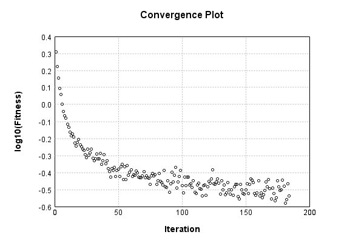

### Model
This is a very simple model that performs basic logistic regression. It is expected to be trainable to about 91% accuracy on MNIST.

Code from [MnistTestBase.java:295](../../../../../../../../MindsEye/src/test/java/com/simiacryptus/mindseye/mnist/MnistTestBase.java#L295) executed in 0.21 seconds: 
```java
    PipelineNetwork network = new PipelineNetwork();
    network.add(new BiasLayer(28, 28, 1));
    network.add(new FullyConnectedLayer(new int[]{28, 28, 1}, new int[]{10})
      .setWeights(() -> 0.001 * (Math.random() - 0.45)));
    network.add(new SoftmaxActivationLayer());
    return network;
```

Returns: 

```
    PipelineNetwork/3cc8990a-29bd-4377-9ee9-863800000001
```


### Training
Code from [BisectionLineSearchTest.java:43](../../../../../../../../MindsEye/src/test/java/com/simiacryptus/mindseye/opt/line/BisectionLineSearchTest.java#L43) executed in 180.55 seconds: 
```java
    SimpleLossNetwork supervisedNetwork = new SimpleLossNetwork(network, new EntropyLossLayer());
    Trainable trainable = new SampledArrayTrainable(trainingData, supervisedNetwork, 1000);
    return new IterativeTrainer(trainable)
      .setMonitor(monitor)
      .setOrientation(new GradientDescent())
      .setLineSearchFactory((String name) -> new BisectionSearch())
      .setTimeout(3, TimeUnit.MINUTES)
      .setMaxIterations(500)
      .run();
```
Logging: 
```
    Found 2 devices
    Device 0 - GeForce GTX 1080 Ti
    Device 1 - GeForce GTX 1060 6GB
    Found 2 devices; using devices [0, 1]
    Constructing line search parameters: GD
    Returning cached value; 2 buffers unchanged since 0.0 => 2.6178400638310975
    F(0.0) = LineSearchPoint{point=PointSample{avg=2.6178400638310975}, derivative=-496247.59775968443}
    F(1.0)@0 = LineSearchPoint{point=PointSample{avg=18.98251150664291}, derivative=5.520379917237167E-203}
    Right is at most 1.0
    F(0.5)@1 = LineSearchPoint{point=PointSample{avg=18.98251150664291}, derivative=1.3695120694742319E-100}
    Right is at most 0.5
    F(0.25)@2 = LineSearchPoint{point=PointSample{avg=18.98251150664291}, derivative=1.671315442566962E-45}
    Right is at most 0.25
    F(0.125)@3 = LineSearchPoint{point=PointSample{avg=18.98251150664291}, derivative=1.0087760736696058E-16}
    Right is at most 0.125
    F(0.0625)@4 = LineSearchPoint{point=PointSample{avg=18.98251150664291}, derivative=0.0247926904825026}
    Right is at most 0.0625
    F(0.03125)@5 = LineSearchPoint{point=PointSample{avg=18.969699517420565}, derivative=1.060816812813731}
    Right is at most 0.03125
    F(0.015625)@6 = LineSearchPoint{point=PointSample{avg=18.95120749416247}, derivative=5.477031360395279}
    Right is at most 0.015625
    F(0.0078125)@7 = LineSearchPoint{point=PointSample{avg=18.911824436779597}, derivative=11.037984873495892}
    Right is at most 0.0078125
    F(0.00390625)@8 = LineSearchPoint{point=PointSample{avg=18.862340855622474}, derivative=78.62324302393786}
    Right is at most 0.00390625
    F(0.001953125)@9 = LineSearchPoint{point=PointSample{avg=18.759866959181043}, derivative=158.24693914912814}
    Right is at most 0.001953125
    F(9.765625E-4)@10 = LineSearchPoint{point=PointSample{avg=18.60548298956443}, derivative=669.5900340640063}
    Right is at most 9.765625E-4
    F(4.8828125E-4)@11 = LineSearchPoint{point=PointSample{avg=18.28547628857673}, derivative=3253.9624593492463}
    Right is at most 4.8828125E-4
    F(2.44140625E-4)@12 = LineSearchPoint{point=PointSample{avg=17.432600068957107}, derivative=20952.4734274898
```
...[skipping 218009 bytes](etc/1.txt)...
```
    37153716476}
    Right is at least 9.08515836431683E-6
    F(2.2712895910792075E-5)@1 = LineSearchPoint{point=PointSample{avg=0.3777285015513434}, derivative=11985.706677048714}
    Right is at most 2.2712895910792075E-5
    F(1.5899027137554453E-5)@2 = LineSearchPoint{point=PointSample{avg=0.34879209279879864}, derivative=5095.693682198286}
    Right is at most 1.5899027137554453E-5
    F(1.2492092750935641E-5)@3 = LineSearchPoint{point=PointSample{avg=0.3426080277123543}, derivative=2111.923107571018}
    Right is at most 1.2492092750935641E-5
    F(1.0788625557626237E-5)@4 = LineSearchPoint{point=PointSample{avg=0.3413710028262025}, derivative=717.1904590635259}
    Right is at most 1.0788625557626237E-5
    New Minimum: 0.34130195370739136 > 0.3411933804751977
    F(9.936891960971533E-6)@5 = LineSearchPoint{point=PointSample{avg=0.3411933804751977}, derivative=41.02189170131485}
    Iteration 183 complete. Error: 0.3411933804751977 Total: 12351767029100.2950; Orientation: 0.0003; Line Search: 0.9161
    Returning cached value; 2 buffers unchanged since 0.0 => 0.3026673526362975
    F(0.0) = LineSearchPoint{point=PointSample{avg=0.3026673526362975}, derivative=-5416.4792885470715}
    New Minimum: 0.3026673526362975 > 0.2899516036305081
    F(9.936891960971533E-6)@0 = LineSearchPoint{point=PointSample{avg=0.2899516036305081}, derivative=526.0871104701787}
    F(4.968445980485767E-6) = LineSearchPoint{point=PointSample{avg=0.292620997555188}, derivative=-2315.393104019249}
    F(7.45266897072865E-6) = LineSearchPoint{point=PointSample{avg=0.29040230681595885}, derivative=-867.6480318385131}
    F(8.694780465850092E-6) = LineSearchPoint{point=PointSample{avg=0.28995999394298333}, derivative=-164.69205657672777}
    New Minimum: 0.2899516036305081 > 0.28990201914748237
    F(9.315836213410813E-6) = LineSearchPoint{point=PointSample{avg=0.28990201914748237}, derivative=182.13928536550173}
    End (narrow range) at 9.315836213410813E-6 to 8.694780465850092E-6
    Iteration 184 complete. Error: 0.28990201914748237 Total: 12352648425165.2320; Orientation: 0.0003; Line Search: 0.7272
    
```

Returns: 

```
    0.28990201914748237
```


Code from [MnistTestBase.java:141](../../../../../../../../MindsEye/src/test/java/com/simiacryptus/mindseye/mnist/MnistTestBase.java#L141) executed in 0.16 seconds: 
```java
    PlotCanvas plot = ScatterPlot.plot(history.stream().map(step -> new double[]{step.iteration, Math.log10(step.point.getMean())}).toArray(i -> new double[i][]));
    plot.setTitle("Convergence Plot");
    plot.setAxisLabels("Iteration", "log10(Fitness)");
    plot.setSize(600, 400);
    return plot;
```

Returns: 




Saved model as [model0.json](etc/model0.json)

### Metrics
Code from [MnistTestBase.java:154](../../../../../../../../MindsEye/src/test/java/com/simiacryptus/mindseye/mnist/MnistTestBase.java#L154) executed in 0.40 seconds: 
```java
    try {
      ByteArrayOutputStream out = new ByteArrayOutputStream();
      JsonUtil.writeJson(out, monitoringRoot.getMetrics());
      return out.toString();
    } catch (IOException e) {
      throw new RuntimeException(e);
    }
```

Returns: 

```
    [ "java.util.HashMap", {
      "BiasLayer/3cc8990a-29bd-4377-9ee9-863800000002" : [ "java.util.HashMap", {
        "avgMsPerItem" : 0.014334096614093962,
        "medianMsPerItem" : "NaN",
        "avgMsPerItem_Backward" : 1.774401854697984E-5,
        "totalItems" : 1192000,
        "backpropStatistics" : [ "java.util.HashMap", {
          "meanExponent" : -7.662058232491563,
          "tp50" : -2.7717998977972903E-6,
          "negative" : 192394,
          "min" : -1.4308918880588346E-6,
          "max" : 1.3503689418958747E-6,
          "tp90" : -2.4348922248039257E-6,
          "mean" : -3.3248957587328603E-10,
          "count" : 392000.0,
          "positive" : 199606,
          "stdDev" : 3.509242035260977E-7,
          "tp75" : -2.555883065241605E-6,
          "zeros" : 0
        } ],
        "totalBatches" : 2384,
        "weights" : [ "java.util.HashMap", {
          "tp50" : "NaN",
          "buffers" : 1,
          "max" : 2.4651066370270872E-8,
          "tp90" : "NaN",
          "count" : 784.0,
          "positive" : 412,
          "tp75" : "NaN",
          "zeros" : 0,
          "meanExponent" : -8.410336134185064,
          "negative" : 372,
          "min" : -2.711053772491294E-8,
          "mean" : -3.710408211375626E-10,
          "stdDev" : 7.646493729280011E-9
        } ],
        "class" : "com.simiacryptus.mindseye.layers.java.BiasLayer",
        "outputStatistics" : [ "java.util.HashMap", {
          "meanExponent" : -6.403667364027085,
          "tp50" : -2.711053772491294E-8,
          "negative" : 144285,
          "min" : -1.9262488457487053E-9,
          "max" : -1.9262488457487053E-9,
          "tp90" : -2.436506829871137E-8,
          "mean" : 33.31341581595574,
          "count" : 392000.0,
          "positive" : 247715,
          "stdDev" : 78.48658329693973,
          "tp75" : -2.436506829871137E-8,
          "zeros" : 0
        } ],
        "medianMsPerItem_Backward" : "NaN"
      } ],
      "SoftmaxActivationLayer/3cc8990a-29bd-4377-9ee9-863800000004" : [ "java.util.HashMap", {
        "avgMsPerItem" : 0.0021923862407718167,
        "medianMsPerItem" : "NaN",
        "avgMsPerItem_Backward" : 1.2709331073825545E-6,
        "totalItems" : 11920
```
...[skipping 790 bytes](etc/2.txt)...
```
    172053566,
          "tp90" : 9.534979039059433E-7,
          "mean" : 0.1,
          "count" : 5000.0,
          "positive" : 5000,
          "stdDev" : 0.2637699178380495,
          "tp75" : 4.5370522135644044E-7,
          "zeros" : 0
        } ],
        "medianMsPerItem_Backward" : "NaN"
      } ],
      "FullyConnectedLayer/3cc8990a-29bd-4377-9ee9-863800000003" : [ "java.util.HashMap", {
        "avgMsPerItem" : 0.009234772342281872,
        "medianMsPerItem" : "NaN",
        "avgMsPerItem_Backward" : 5.202776222986565E-5,
        "totalItems" : 1192000,
        "backpropStatistics" : [ "java.util.HashMap", {
          "meanExponent" : -6.068250009355342,
          "tp50" : -1.0650689490680767E-4,
          "negative" : 500,
          "min" : -0.0018676856912716996,
          "max" : 0.0011395088382493402,
          "tp90" : -4.405304730547767E-6,
          "mean" : 3.914794234741441E-22,
          "count" : 5000.0,
          "positive" : 4500,
          "stdDev" : 2.3844327997595927E-4,
          "tp75" : -2.4023610764746135E-5,
          "zeros" : 0
        } ],
        "totalBatches" : 2384,
        "weights" : [ "java.util.HashMap", {
          "tp50" : "NaN",
          "buffers" : 1,
          "max" : 0.0028145301965347737,
          "tp90" : "NaN",
          "count" : 7840.0,
          "positive" : 4269,
          "tp75" : "NaN",
          "zeros" : 0,
          "meanExponent" : -3.6142154452675235,
          "negative" : 3571,
          "min" : -0.002116391864156438,
          "mean" : 4.6970389676880586E-5,
          "stdDev" : 4.7305073170189973E-4
        } ],
        "class" : "com.simiacryptus.mindseye.layers.java.FullyConnectedLayer",
        "outputStatistics" : [ "java.util.HashMap", {
          "meanExponent" : 0.31360654048962977,
          "tp50" : -4.951441817051232,
          "negative" : 1898,
          "min" : -8.157074164647481,
          "max" : 10.437622740636225,
          "tp90" : -3.746059814674183,
          "mean" : 1.2777811040602824,
          "count" : 5000.0,
          "positive" : 3102,
          "stdDev" : 4.033733065248844,
          "tp75" : -4.085830761481064,
          "zeros" : 0
        } ],
        "medianMsPerItem_Backward" : "NaN"
      } ]
    } ]
```


### Validation
If we run our model against the entire validation dataset, we get this accuracy:

Code from [MnistTestBase.java:211](../../../../../../../../MindsEye/src/test/java/com/simiacryptus/mindseye/mnist/MnistTestBase.java#L211) executed in 1.01 seconds: 
```java
    return MNIST.validationDataStream().mapToDouble(labeledObject ->
      predict(network, labeledObject)[0] == parse(labeledObject.label) ? 1 : 0)
      .average().getAsDouble() * 100;
```

Returns: 

```
    91.16911691169118
```


Let's examine some incorrectly predicted results in more detail:

Code from [MnistTestBase.java:218](../../../../../../../../MindsEye/src/test/java/com/simiacryptus/mindseye/mnist/MnistTestBase.java#L218) executed in 0.27 seconds: 
```java
    try {
      TableOutput table = new TableOutput();
      MNIST.validationDataStream().map(labeledObject -> {
        try {
          int actualCategory = parse(labeledObject.label);
          double[] predictionSignal = CudaExecutionContext.gpuContexts.run(ctx -> network.eval(ctx, labeledObject.data).getData().get(0).getData());
          int[] predictionList = IntStream.range(0, 10).mapToObj(x -> x).sorted(Comparator.comparing(i -> -predictionSignal[i])).mapToInt(x -> x).toArray();
          if (predictionList[0] == actualCategory) return null; // We will only examine mispredicted rows
          LinkedHashMap<String, Object> row = new LinkedHashMap<String, Object>();
          row.put("Image", log.image(labeledObject.data.toGrayImage(), labeledObject.label));
          row.put("Prediction", Arrays.stream(predictionList).limit(3)
            .mapToObj(i -> String.format("%d (%.1f%%)", i, 100.0 * predictionSignal[i]))
            .reduce((a, b) -> a + ", " + b).get());
          return row;
        } catch (IOException e) {
          throw new RuntimeException(e);
        }
      }).filter(x -> null != x).limit(10).forEach(table::putRow);
      return table;
    } catch (IOException e) {
      throw new RuntimeException(e);
    }
```

Returns: 

Image | Prediction
----- | ----------
![[5]](etc/test.2.png)  | 6 (93.1%), 4 (2.4%), 2 (2.3%)  
![[4]](etc/test.3.png)  | 6 (51.1%), 0 (36.0%), 4 (4.5%) 
![[1]](etc/test.4.png)  | 3 (51.9%), 1 (40.6%), 8 (2.8%) 
![[2]](etc/test.5.png)  | 7 (76.6%), 2 (17.1%), 9 (4.5%) 
![[9]](etc/test.6.png)  | 4 (35.4%), 9 (33.5%), 8 (14.5%)
![[7]](etc/test.7.png)  | 4 (63.7%), 9 (24.6%), 7 (9.2%) 
![[2]](etc/test.8.png)  | 9 (62.9%), 4 (10.1%), 8 (9.4%) 
![[9]](etc/test.9.png)  | 4 (45.2%), 3 (27.6%), 9 (14.7%)
![[3]](etc/test.10.png) | 8 (32.7%), 3 (30.0%), 5 (13.6%)
![[5]](etc/test.11.png) | 7 (48.3%), 5 (26.1%), 9 (9.1%) 


