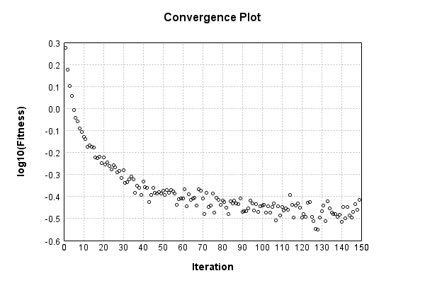

### Model
This is a very simple model that performs basic logistic regression. It is expected to be trainable to about 91% accuracy on MNIST.

Code from [MnistTestBase.java:295](../../../../../../../../MindsEye/src/test/java/com/simiacryptus/mindseye/mnist/MnistTestBase.java#L295) executed in 0.00 seconds: 
```java
    PipelineNetwork network = new PipelineNetwork();
    network.add(new BiasLayer(28, 28, 1));
    network.add(new FullyConnectedLayer(new int[]{28, 28, 1}, new int[]{10})
      .setWeights(() -> 0.001 * (Math.random() - 0.45)));
    network.add(new SoftmaxActivationLayer());
    return network;
```

Returns: 

```
    PipelineNetwork/3cc8990a-29bd-4377-9ee9-86380000000a
```


### Training
Code from [QuadraticLineSearchTest.java:43](../../../../../../../../MindsEye/src/test/java/com/simiacryptus/mindseye/opt/line/QuadraticLineSearchTest.java#L43) executed in 180.14 seconds: 
```java
    SimpleLossNetwork supervisedNetwork = new SimpleLossNetwork(network, new EntropyLossLayer());
    Trainable trainable = new SampledArrayTrainable(trainingData, supervisedNetwork, 1000);
    return new IterativeTrainer(trainable)
      .setMonitor(monitor)
      .setOrientation(new GradientDescent())
      .setLineSearchFactory((String name) -> new QuadraticSearch())
      .setTimeout(3, TimeUnit.MINUTES)
      .setMaxIterations(500)
      .run();
```
Logging: 
```
    Constructing line search parameters: GD
    Returning cached value; 2 buffers unchanged since 0.0 => 2.612488721455952
    F(0.0) = LineSearchPoint{point=PointSample{avg=2.612488721455952}, derivative=-408997.9164698912}
    New Minimum: 2.612488721455952 > 2.612468243249202
    F(1.0E-10) = LineSearchPoint{point=PointSample{avg=2.612468243249202}, derivative=-408990.8732681633}, delta = -2.047820674988543E-5
    New Minimum: 2.612468243249202 > 2.6123453813969495
    F(7.000000000000001E-10) = LineSearchPoint{point=PointSample{avg=2.6123453813969495}, derivative=-408948.6144913668}, delta = -1.4334005900229485E-4
    New Minimum: 2.6123453813969495 > 2.6114857030493637
    F(4.900000000000001E-9) = LineSearchPoint{point=PointSample{avg=2.6114857030493637}, derivative=-408652.8238876286}, delta = -0.0010030184065881187
    New Minimum: 2.6114857030493637 > 2.6054853248298073
    F(3.430000000000001E-8) = LineSearchPoint{point=PointSample{avg=2.6054853248298073}, derivative=-406583.3258498245}, delta = -0.007003396626144465
    New Minimum: 2.6054853248298073 > 2.564331577264652
    F(2.4010000000000004E-7) = LineSearchPoint{point=PointSample{avg=2.564331577264652}, derivative=-392152.7901046876}, delta = -0.04815714419129957
    New Minimum: 2.564331577264652 > 2.31674781918018
    F(1.6807000000000003E-6) = LineSearchPoint{point=PointSample{avg=2.31674781918018}, derivative=-295425.9669335972}, delta = -0.29574090227577177
    New Minimum: 2.31674781918018 > 1.9499987852794458
    F(1.1764900000000001E-5) = LineSearchPoint{point=PointSample{avg=1.9499987852794458}, derivative=70808.18156976893}, delta = -0.662489936176506
    1.9499987852794458 <= 2.612488721455952
    New Minimum: 1.9499987852794458 > 1.902892795901858
    Returning cached value; 2 buffers unchanged since 0.0 => 1.902892795901858
    isLeft=false; isBracketed=true; leftPoint=LineSearchPoint{point=PointSample{avg=2.612488721455952}, derivative=-408997.9164698912}; rightPoint=LineSearchPoint{point=PointSample{avg=1.9499987852794458}, derivative=70808.18156976893}
    F(1.002867534851315E-5) = LineSearchPoint
```
...[skipping 274316 bytes](etc/1.txt)...
```
    =0.3483708030708421}, derivative=2714.2761278225394}
    F(9.580082105331916E-6) = LineSearchPoint{point=PointSample{avg=0.34561759669102277}, derivative=-48.06582289341617}, delta = -0.015982509409249723
    Left bracket at 9.580082105331916E-6
    Converged to left
    Iteration 148 complete. Error: 0.34561759669102277 Total: 12534558102067.9730; Orientation: 0.0004; Line Search: 0.3530
    Returning cached value; 2 buffers unchanged since 0.0 => 0.40581313440927014
    F(0.0) = LineSearchPoint{point=PointSample{avg=0.40581313440927014}, derivative=-11480.61912554787}
    New Minimum: 0.40581313440927014 > 0.3882978350122853
    F(9.580082105331916E-6) = LineSearchPoint{point=PointSample{avg=0.3882978350122853}, derivative=4284.170288892759}, delta = -0.017515299396984818
    0.3882978350122853 <= 0.40581313440927014
    New Minimum: 0.3882978350122853 > 0.3855662735162566
    Returning cached value; 2 buffers unchanged since 0.0 => 0.3855662735162566
    isLeft=true; isBracketed=true; leftPoint=LineSearchPoint{point=PointSample{avg=0.40581313440927014}, derivative=-11480.61912554787}; rightPoint=LineSearchPoint{point=PointSample{avg=0.3882978350122853}, derivative=4284.170288892759}
    F(6.97664085141825E-6) = LineSearchPoint{point=PointSample{avg=0.3855662735162566}, derivative=-187.98337546038087}, delta = -0.02024686089301353
    Left bracket at 6.97664085141825E-6
    New Minimum: 0.3855662735162566 > 0.38556475120170686
    Returning cached value; 2 buffers unchanged since 0.0 => 0.38556475120170686
    isLeft=true; isBracketed=true; leftPoint=LineSearchPoint{point=PointSample{avg=0.3855662735162566}, derivative=-187.98337546038087}; rightPoint=LineSearchPoint{point=PointSample{avg=0.3882978350122853}, derivative=4284.170288892759}
    F(7.086074406580824E-6) = LineSearchPoint{point=PointSample{avg=0.38556475120170686}, derivative=-4.7305637008824615}, delta = -0.02024838320756328
    Left bracket at 7.086074406580824E-6
    Converged to left
    Iteration 149 complete. Error: 0.38556475120170686 Total: 12535269428724.4410; Orientation: 0.0003; Line Search: 0.5220
    
```

Returns: 

```
    0.3893499219747667
```


Code from [MnistTestBase.java:141](../../../../../../../../MindsEye/src/test/java/com/simiacryptus/mindseye/mnist/MnistTestBase.java#L141) executed in 0.01 seconds: 
```java
    PlotCanvas plot = ScatterPlot.plot(history.stream().map(step -> new double[]{step.iteration, Math.log10(step.point.getMean())}).toArray(i -> new double[i][]));
    plot.setTitle("Convergence Plot");
    plot.setAxisLabels("Iteration", "log10(Fitness)");
    plot.setSize(600, 400);
    return plot;
```

Returns: 




Saved model as [model0.json](etc/model0.json)

### Metrics
Code from [MnistTestBase.java:154](../../../../../../../../MindsEye/src/test/java/com/simiacryptus/mindseye/mnist/MnistTestBase.java#L154) executed in 0.07 seconds: 
```java
    try {
      ByteArrayOutputStream out = new ByteArrayOutputStream();
      JsonUtil.writeJson(out, monitoringRoot.getMetrics());
      return out.toString();
    } catch (IOException e) {
      throw new RuntimeException(e);
    }
```

Returns: 

```
    [ "java.util.HashMap", {
      "BiasLayer/3cc8990a-29bd-4377-9ee9-86380000000b" : [ "java.util.HashMap", {
        "avgMsPerItem" : 0.014354511062801955,
        "medianMsPerItem" : "NaN",
        "avgMsPerItem_Backward" : 1.9552230635748782E-5,
        "totalItems" : 1035000,
        "backpropStatistics" : [ "java.util.HashMap", {
          "meanExponent" : -7.530630986098907,
          "tp50" : -2.6396250380805123E-6,
          "negative" : 192608,
          "min" : -1.1816068182211468E-6,
          "max" : 8.12311139644593E-7,
          "tp90" : -2.346190003448275E-6,
          "mean" : 1.0747785639255915E-10,
          "count" : 392000.0,
          "positive" : 199392,
          "stdDev" : 3.4613435335655836E-7,
          "tp75" : -2.4414755308945056E-6,
          "zeros" : 0
        } ],
        "totalBatches" : 2070,
        "weights" : [ "java.util.HashMap", {
          "tp50" : "NaN",
          "buffers" : 1,
          "max" : 1.503653764106652E-8,
          "tp90" : "NaN",
          "count" : 784.0,
          "positive" : 396,
          "tp75" : "NaN",
          "zeros" : 0,
          "meanExponent" : -8.521595464875379,
          "negative" : 388,
          "min" : -2.0324375551212187E-8,
          "mean" : -3.38201691499704E-10,
          "stdDev" : 5.819024978558855E-9
        } ],
        "class" : "com.simiacryptus.mindseye.layers.java.BiasLayer",
        "outputStatistics" : [ "java.util.HashMap", {
          "meanExponent" : -6.5091970171224345,
          "tp50" : -2.0324375551212187E-8,
          "negative" : 152177,
          "min" : 3.0956703417306436E-9,
          "max" : 3.0956703417306436E-9,
          "tp90" : -1.840542175641853E-8,
          "mean" : 32.84733928537629,
          "count" : 392000.0,
          "positive" : 239823,
          "stdDev" : 78.03256694029238,
          "tp75" : -1.840542175641853E-8,
          "zeros" : 0
        } ],
        "medianMsPerItem_Backward" : "NaN"
      } ],
      "SoftmaxActivationLayer/3cc8990a-29bd-4377-9ee9-86380000000d" : [ "java.util.HashMap", {
        "avgMsPerItem" : 0.0021128612067632833,
        "medianMsPerItem" : "NaN",
        "avgMsPerItem_Backward" : 1.2695668830917889E-6,
        "totalItems" : 1035000
```
...[skipping 776 bytes](etc/2.txt)...
```
    721205406325,
          "tp90" : 3.1945837748890793E-6,
          "mean" : 0.1,
          "count" : 5000.0,
          "positive" : 5000,
          "stdDev" : 0.26278104603078345,
          "tp75" : 2.0848266384588697E-6,
          "zeros" : 0
        } ],
        "medianMsPerItem_Backward" : "NaN"
      } ],
      "FullyConnectedLayer/3cc8990a-29bd-4377-9ee9-86380000000c" : [ "java.util.HashMap", {
        "avgMsPerItem" : 0.008989065863768091,
        "medianMsPerItem" : "NaN",
        "avgMsPerItem_Backward" : 5.096913572173915E-5,
        "totalItems" : 1035000,
        "backpropStatistics" : [ "java.util.HashMap", {
          "meanExponent" : -5.853875359358212,
          "tp50" : -1.2127183968403388E-4,
          "negative" : 500,
          "min" : -0.0019888350208475247,
          "max" : 0.0013667449501282532,
          "tp90" : -9.196644177801809E-6,
          "mean" : 2.053812331627705E-21,
          "count" : 5000.0,
          "positive" : 4500,
          "stdDev" : 2.513262609774066E-4,
          "tp75" : -3.542261777971565E-5,
          "zeros" : 0
        } ],
        "totalBatches" : 2070,
        "weights" : [ "java.util.HashMap", {
          "tp50" : "NaN",
          "buffers" : 1,
          "max" : 0.002463526087419943,
          "tp90" : "NaN",
          "count" : 7840.0,
          "positive" : 4260,
          "tp75" : "NaN",
          "zeros" : 0,
          "meanExponent" : -3.633740245616081,
          "negative" : 3580,
          "min" : -0.0020507949349857692,
          "mean" : 4.8363242641321685E-5,
          "stdDev" : 4.4601796145559347E-4
        } ],
        "class" : "com.simiacryptus.mindseye.layers.java.FullyConnectedLayer",
        "outputStatistics" : [ "java.util.HashMap", {
          "meanExponent" : 0.27184269522742394,
          "tp50" : -4.668656062942205,
          "negative" : 2077,
          "min" : -6.677569755446058,
          "max" : 9.884819509023902,
          "tp90" : -3.670712652994158,
          "mean" : 0.990586637117401,
          "count" : 5000.0,
          "positive" : 2923,
          "stdDev" : 3.7187540690471295,
          "tp75" : -4.01836073177686,
          "zeros" : 0
        } ],
        "medianMsPerItem_Backward" : "NaN"
      } ]
    } ]
```


### Validation
If we run our model against the entire validation dataset, we get this accuracy:

Code from [MnistTestBase.java:211](../../../../../../../../MindsEye/src/test/java/com/simiacryptus/mindseye/mnist/MnistTestBase.java#L211) executed in 0.74 seconds: 
```java
    return MNIST.validationDataStream().mapToDouble(labeledObject ->
      predict(network, labeledObject)[0] == parse(labeledObject.label) ? 1 : 0)
      .average().getAsDouble() * 100;
```

Returns: 

```
    90.7
```


Let's examine some incorrectly predicted results in more detail:

Code from [MnistTestBase.java:218](../../../../../../../../MindsEye/src/test/java/com/simiacryptus/mindseye/mnist/MnistTestBase.java#L218) executed in 0.17 seconds: 
```java
    try {
      TableOutput table = new TableOutput();
      MNIST.validationDataStream().map(labeledObject -> {
        try {
          int actualCategory = parse(labeledObject.label);
          double[] predictionSignal = CudaExecutionContext.gpuContexts.run(ctx -> network.eval(ctx, labeledObject.data).getData().get(0).getData());
          int[] predictionList = IntStream.range(0, 10).mapToObj(x -> x).sorted(Comparator.comparing(i -> -predictionSignal[i])).mapToInt(x -> x).toArray();
          if (predictionList[0] == actualCategory) return null; // We will only examine mispredicted rows
          LinkedHashMap<String, Object> row = new LinkedHashMap<String, Object>();
          row.put("Image", log.image(labeledObject.data.toGrayImage(), labeledObject.label));
          row.put("Prediction", Arrays.stream(predictionList).limit(3)
            .mapToObj(i -> String.format("%d (%.1f%%)", i, 100.0 * predictionSignal[i]))
            .reduce((a, b) -> a + ", " + b).get());
          return row;
        } catch (IOException e) {
          throw new RuntimeException(e);
        }
      }).filter(x -> null != x).limit(10).forEach(table::putRow);
      return table;
    } catch (IOException e) {
      throw new RuntimeException(e);
    }
```

Returns: 

Image | Prediction
----- | ----------
![[5]](etc/test.2.png)  | 6 (89.2%), 2 (5.3%), 4 (2.1%)  
![[4]](etc/test.3.png)  | 6 (57.0%), 0 (26.5%), 5 (5.5%) 
![[1]](etc/test.4.png)  | 3 (55.8%), 1 (33.7%), 5 (3.5%) 
![[3]](etc/test.5.png)  | 2 (62.9%), 3 (26.7%), 8 (7.6%) 
![[6]](etc/test.6.png)  | 2 (31.0%), 6 (27.8%), 7 (21.4%)
![[2]](etc/test.7.png)  | 7 (74.7%), 2 (15.9%), 9 (7.3%) 
![[9]](etc/test.8.png)  | 4 (33.2%), 8 (26.7%), 9 (24.6%)
![[7]](etc/test.9.png)  | 1 (40.3%), 7 (38.6%), 9 (7.3%) 
![[7]](etc/test.10.png) | 4 (60.3%), 9 (25.4%), 7 (10.1%)
![[2]](etc/test.11.png) | 9 (40.0%), 8 (30.1%), 4 (9.2%) 


