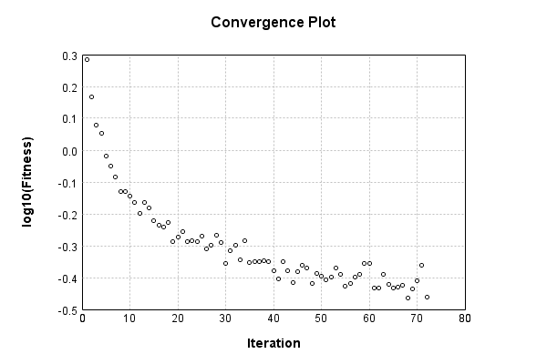

### Model
This is a very simple model that performs basic logistic regression. It is expected to be trainable to about 91% accuracy on MNIST.

Code from [MnistTestBase.java:272](../../../../../../../../MindsEye/src/test/java/com/simiacryptus/mindseye/mnist/MnistTestBase.java#L272) executed in 0.10 seconds: 
```java
    PipelineNetwork network = new PipelineNetwork();
    network.add(new BiasLayer(28, 28, 1));
    network.add(new FullyConnectedLayer(new int[]{28, 28, 1}, new int[]{10})
      .setWeights(() -> 0.001 * (Math.random() - 0.45)));
    network.add(new SoftmaxActivationLayer());
    return network;
```

Returns: 

```
    PipelineNetwork/e1035fb9-1fe3-4846-a360-622900000013
```


### Training
Code from [StaticRateTest.java:43](../../../../../../../../MindsEye/src/test/java/com/simiacryptus/mindseye/opt/line/StaticRateTest.java#L43) executed in 180.91 seconds: 
```java
    SimpleLossNetwork supervisedNetwork = new SimpleLossNetwork(network, new EntropyLossLayer());
    Trainable trainable = new SampledArrayTrainable(trainingData, supervisedNetwork, 1000);
    return new IterativeTrainer(trainable)
      .setMonitor(monitor)
      .setOrientation(new GradientDescent())
      .setLineSearchFactory((String name) -> new StaticLearningRate().setRate(0.001))
      .setTimeout(3, TimeUnit.MINUTES)
      .setMaxIterations(500)
      .run();
```
Logging: 
```
    Constructing line search parameters: GD
    Returning cached value; 2 buffers unchanged since 0.0 => 2.5192671315820245
    Non-decreasing runStep. 42.75530847534314 > 5.038534263164049 at 0.001
    Non-decreasing runStep. 41.20341411482295 > 5.038534263164049 at 5.0E-4
    Non-decreasing runStep. 37.99861591596172 > 5.038534263164049 at 2.5E-4
    Non-decreasing runStep. 30.179455584413112 > 5.038534263164049 at 1.25E-4
    Non-decreasing runStep. 19.431285268439122 > 5.038534263164049 at 6.25E-5
    Non-decreasing runStep. 10.597282379851192 > 5.038534263164049 at 3.125E-5
    Non-decreasing runStep. 5.40245975947791 > 5.038534263164049 at 1.5625E-5
    New Minimum: 2.5192671315820245 > 1.9205236433263941
    Iteration 1 complete. Error: 1.9205236433263941 Total: 180286319301009.4000; Orientation: 0.0003; Line Search: 2.0422
    Returning cached value; 2 buffers unchanged since 0.0 => 2.0277281412838937
    Non-decreasing runStep. 38.165160383513445 > 4.055456282567787 at 0.001
    Non-decreasing runStep. 37.337443501851226 > 4.055456282567787 at 5.0E-4
    Non-decreasing runStep. 36.06186428885567 > 4.055456282567787 at 2.5E-4
    Non-decreasing runStep. 34.191870886280945 > 4.055456282567787 at 1.25E-4
    Non-decreasing runStep. 27.845039790893416 > 4.055456282567787 at 6.25E-5
    Non-decreasing runStep. 18.53207739925152 > 4.055456282567787 at 3.125E-5
    Non-decreasing runStep. 8.729393626753424 > 4.055456282567787 at 1.5625E-5
    Non-decreasing runStep. 4.087264931152937 > 4.055456282567787 at 7.8125E-6
    New Minimum: 2.0277281412838937 > 1.4649095393718023
    Iteration 2 complete. Error: 1.4649095393718023 Total: 180288872625023.7000; Orientation: 0.0003; Line Search: 2.3014
    Returning cached value; 2 buffers unchanged since 0.0 => 1.4508851250554655
    Non-decreasing runStep. 38.961361731422826 > 2.901770250110931 at 0.001
    Non-decreasing runStep. 36.925273110942165 > 2.901770250110931 at 5.0E-4
    Non-decreasing runStep. 33.63562373919933 > 2.901770250110931 at 2.5E-4
    Non-decreasing runStep. 30.41156304499087 > 2.901770250110931 at 1.25E-4
    Non-decreasing runSt
```
...[skipping 52874 bytes](etc/1.txt)...
```
     2.5E-4
    Non-decreasing runStep. 8.224480795576675 > 0.8121025137016246 at 1.25E-4
    Non-decreasing runStep. 3.257065726842036 > 0.8121025137016246 at 6.25E-5
    Non-decreasing runStep. 1.4587361849155154 > 0.8121025137016246 at 3.125E-5
    Non-decreasing runStep. 0.8964912679782806 > 0.8121025137016246 at 1.5625E-5
    New Minimum: 0.4060512568508123 > 0.3896740308633323
    Iteration 70 complete. Error: 0.3896740308633323 Total: 180459268596911.3400; Orientation: 0.0008; Line Search: 2.3324
    Returning cached value; 2 buffers unchanged since 0.0 => 0.4600125626171855
    Non-decreasing runStep. 44.37737903089226 > 0.920025125234371 at 0.001
    Non-decreasing runStep. 39.062322991672495 > 0.920025125234371 at 5.0E-4
    Non-decreasing runStep. 28.899698456423145 > 0.920025125234371 at 2.5E-4
    Non-decreasing runStep. 15.371852491650888 > 0.920025125234371 at 1.25E-4
    Non-decreasing runStep. 5.6894380731311225 > 0.920025125234371 at 6.25E-5
    Non-decreasing runStep. 1.9675236610393485 > 0.920025125234371 at 3.125E-5
    Non-decreasing runStep. 1.0147210858368545 > 0.920025125234371 at 1.5625E-5
    New Minimum: 0.4600125626171855 > 0.43567303393328927
    Iteration 71 complete. Error: 0.43567303393328927 Total: 180462003596073.7200; Orientation: 0.0007; Line Search: 2.4550
    Returning cached value; 2 buffers unchanged since 0.0 => 0.36608819724073294
    Non-decreasing runStep. 46.86573559716804 > 0.7321763944814659 at 0.001
    Non-decreasing runStep. 40.30540777578368 > 0.7321763944814659 at 5.0E-4
    Non-decreasing runStep. 28.800772631963444 > 0.7321763944814659 at 2.5E-4
    Non-decreasing runStep. 14.365538593245418 > 0.7321763944814659 at 1.25E-4
    Non-decreasing runStep. 4.7546798962157375 > 0.7321763944814659 at 6.25E-5
    Non-decreasing runStep. 1.5733339464348814 > 0.7321763944814659 at 3.125E-5
    Non-decreasing runStep. 0.8188201287123331 > 0.7321763944814659 at 1.5625E-5
    New Minimum: 0.36608819724073294 > 0.34597219786327726
    Iteration 72 complete. Error: 0.34597219786327726 Total: 180464490443464.0000; Orientation: 0.0003; Line Search: 2.1932
    
```

Returns: 

```
    0.34597219786327726
```


Code from [MnistTestBase.java:131](../../../../../../../../MindsEye/src/test/java/com/simiacryptus/mindseye/mnist/MnistTestBase.java#L131) executed in 0.01 seconds: 
```java
    PlotCanvas plot = ScatterPlot.plot(history.stream().map(step -> new double[]{step.iteration, Math.log10(step.point.getMean())}).toArray(i -> new double[i][]));
    plot.setTitle("Convergence Plot");
    plot.setAxisLabels("Iteration", "log10(Fitness)");
    plot.setSize(600, 400);
    return plot;
```

Returns: 




Saved model as [model0.json](etc/model0.json)

### Metrics
Code from [MnistTestBase.java:144](../../../../../../../../MindsEye/src/test/java/com/simiacryptus/mindseye/mnist/MnistTestBase.java#L144) executed in 0.07 seconds: 
```java
    try {
      ByteArrayOutputStream out = new ByteArrayOutputStream();
      JsonUtil.writeJson(out, monitoringRoot.getMetrics());
      return out.toString();
    } catch (IOException e) {
      throw new RuntimeException(e);
    }
```

Returns: 

```
    [ "java.util.HashMap", {
      "SoftmaxActivationLayer/e1035fb9-1fe3-4846-a360-622900000016" : [ "java.util.HashMap", {
        "avgMsPerItem" : 0.003923228532526474,
        "medianMsPerItem" : "NaN",
        "avgMsPerItem_Backward" : 2.501126456883511E-6,
        "totalItems" : 661000,
        "backpropStatistics" : [ "java.util.HashMap", {
          "meanExponent" : -2.5429810389079166,
          "tp50" : -0.0021495188200345884,
          "negative" : 500,
          "min" : -0.6994867682447053,
          "max" : 0.0,
          "tp90" : -0.0020098103516643555,
          "mean" : -8.676602556279104E-4,
          "count" : 5000.0,
          "positive" : 0,
          "stdDev" : 0.01614832202895197,
          "tp75" : -0.002045062135967219,
          "zeros" : 4500
        } ],
        "totalBatches" : 1322,
        "class" : "com.simiacryptus.mindseye.layers.java.SoftmaxActivationLayer",
        "outputStatistics" : [ "java.util.HashMap", {
          "meanExponent" : -2.8179690297216604,
          "tp50" : 2.311260326100567E-6,
          "negative" : 0,
          "min" : 3.38389148618213E-8,
          "max" : 0.9368396149822569,
          "tp90" : 9.264315799724922E-6,
          "mean" : 0.1,
          "count" : 5000.0,
          "positive" : 5000,
          "stdDev" : 0.25926867562194506,
          "tp75" : 5.746453490393785E-6,
          "zeros" : 0
        } ],
        "medianMsPerItem_Backward" : "NaN"
      } ],
      "BiasLayer/e1035fb9-1fe3-4846-a360-622900000014" : [ "java.util.HashMap", {
        "avgMsPerItem" : 0.022222307016641452,
        "medianMsPerItem" : "NaN",
        "avgMsPerItem_Backward" : 2.8817057860816926E-5,
        "totalItems" : 661000,
        "backpropStatistics" : [ "java.util.HashMap", {
          "meanExponent" : -7.510852755074,
          "tp50" : -2.457827404654452E-6,
          "negative" : 192021,
          "min" : -8.904406618753072E-7,
          "max" : 1.3130452412101636E-6,
          "tp90" : -2.1738287376743367E-6,
          "mean" : 7.515714361718558E-10,
          "count" : 392000.0,
          "positive" : 199979,
          "stdDev" : 3.137046161050254E-7,
          "tp75" : -2.26780040859853E-6,
          "zeros" : 0
        } ],
       
```
...[skipping 773 bytes](etc/2.txt)...
```
    "tp90" : -1.2400224199619362E-8,
          "mean" : 33.71617857080313,
          "count" : 392000.0,
          "positive" : 230425,
          "stdDev" : 79.08238100940125,
          "tp75" : -1.2400224199619362E-8,
          "zeros" : 0
        } ],
        "medianMsPerItem_Backward" : "NaN"
      } ],
      "FullyConnectedLayer/e1035fb9-1fe3-4846-a360-622900000015" : [ "java.util.HashMap", {
        "avgMsPerItem" : 0.014866292226928876,
        "medianMsPerItem" : "NaN",
        "avgMsPerItem_Backward" : 7.685883045688356E-5,
        "totalItems" : 661000,
        "backpropStatistics" : [ "java.util.HashMap", {
          "meanExponent" : -5.621350526086035,
          "tp50" : -1.391184097957163E-4,
          "negative" : 500,
          "min" : -0.0019942815215646783,
          "max" : 0.0012865119891637133,
          "tp90" : -9.762465056696758E-6,
          "mean" : -2.2181082553764914E-21,
          "count" : 5000.0,
          "positive" : 4500,
          "stdDev" : 2.4924937789763403E-4,
          "tp75" : -4.406920960952291E-5,
          "zeros" : 0
        } ],
        "totalBatches" : 1322,
        "weights" : [ "java.util.HashMap", {
          "tp50" : "NaN",
          "buffers" : 1,
          "max" : 0.0021642809488199672,
          "tp90" : "NaN",
          "count" : 7840.0,
          "positive" : 4282,
          "tp75" : "NaN",
          "zeros" : 0,
          "meanExponent" : -3.661848403684288,
          "negative" : 3558,
          "min" : -0.0017837056077255496,
          "mean" : 5.333927344919504E-5,
          "stdDev" : 4.07450814611157E-4
        } ],
        "class" : "com.simiacryptus.mindseye.layers.java.FullyConnectedLayer",
        "outputStatistics" : [ "java.util.HashMap", {
          "meanExponent" : 0.23135649927914487,
          "tp50" : -3.6694632179251063,
          "negative" : 1828,
          "min" : -5.331322113680581,
          "max" : 9.162716802641722,
          "tp90" : -2.7835241936746877,
          "mean" : 1.3356458661212376,
          "count" : 5000.0,
          "positive" : 3172,
          "stdDev" : 3.346151963041001,
          "tp75" : -3.0478684259983075,
          "zeros" : 0
        } ],
        "medianMsPerItem_Backward" : "NaN"
      } ]
    } ]
```


### Validation
If we run our model against the entire validation dataset, we get this accuracy:

Code from [MnistTestBase.java:201](../../../../../../../../MindsEye/src/test/java/com/simiacryptus/mindseye/mnist/MnistTestBase.java#L201) executed in 1.15 seconds: 
```java
    return MNIST.validationDataStream().mapToDouble(labeledObject ->
      predict(network, labeledObject)[0] == parse(labeledObject.label) ? 1 : 0)
      .average().getAsDouble() * 100;
```

Returns: 

```
    89.9
```


Let's examine some incorrectly predicted results in more detail:

Code from [MnistTestBase.java:208](../../../../../../../../MindsEye/src/test/java/com/simiacryptus/mindseye/mnist/MnistTestBase.java#L208) executed in 0.10 seconds: 
```java
    try {
      TableOutput table = new TableOutput();
      MNIST.validationDataStream().map(labeledObject -> {
        try {
          int actualCategory = parse(labeledObject.label);
          double[] predictionSignal = CudaExecutionContext.gpuContexts.run(ctx -> network.eval(ctx, labeledObject.data).getData().get(0).getData());
          int[] predictionList = IntStream.range(0, 10).mapToObj(x -> x).sorted(Comparator.comparing(i -> -predictionSignal[i])).mapToInt(x -> x).toArray();
          if (predictionList[0] == actualCategory) return null; // We will only examine mispredicted rows
          LinkedHashMap<String, Object> row = new LinkedHashMap<String, Object>();
          row.put("Image", log.image(labeledObject.data.toGrayImage(), labeledObject.label));
          row.put("Prediction", Arrays.stream(predictionList).limit(3)
            .mapToObj(i -> String.format("%d (%.1f%%)", i, 100.0 * predictionSignal[i]))
            .reduce((a, b) -> a + ", " + b).get());
          return row;
        } catch (IOException e) {
          throw new RuntimeException(e);
        }
      }).filter(x -> null != x).limit(10).forEach(table::putRow);
      return table;
    } catch (IOException e) {
      throw new RuntimeException(e);
    }
```

Returns: 

Image | Prediction
----- | ----------
![[5]](etc/test.2.png)  | 6 (76.4%), 2 (8.4%), 4 (5.7%)  
![[4]](etc/test.3.png)  | 0 (39.7%), 6 (38.0%), 5 (8.8%) 
![[1]](etc/test.4.png)  | 3 (55.6%), 1 (21.7%), 8 (7.6%) 
![[9]](etc/test.5.png)  | 4 (39.4%), 9 (33.4%), 8 (12.2%)
![[9]](etc/test.6.png)  | 7 (38.2%), 9 (34.1%), 8 (20.5%)
![[2]](etc/test.7.png)  | 7 (74.5%), 2 (16.7%), 9 (5.5%) 
![[9]](etc/test.8.png)  | 4 (37.3%), 9 (21.8%), 8 (20.4%)
![[7]](etc/test.9.png)  | 1 (44.5%), 7 (35.9%), 8 (6.6%) 
![[7]](etc/test.10.png) | 4 (65.4%), 9 (22.2%), 7 (7.3%) 
![[2]](etc/test.11.png) | 9 (28.9%), 8 (21.5%), 1 (12.2%)


