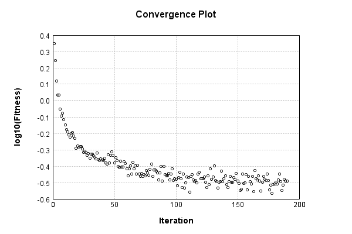

### Model
This is a very simple model that performs basic logistic regression. It is expected to be trainable to about 91% accuracy on MNIST.

Code from [MnistTestBase.java:293](../../../../../../../src/test/java/com/simiacryptus/mindseye/opt/MnistTestBase.java#L293) executed in 0.00 seconds: 
```java
    PipelineNetwork network = new PipelineNetwork();
    network.add(new BiasLayer(28, 28, 1));
    network.add(new FullyConnectedLayer(new int[]{28, 28, 1}, new int[]{10})
      .setWeights(() -> 0.001 * (Math.random() - 0.45)));
    network.add(new SoftmaxActivationLayer());
    return network;
```

Returns: 

```
    PipelineNetwork/da23ec5d-8790-4058-8f89-1e35c92a5cbc
```


### Training
Code from [StaticRateTest.java:43](../../../../../../../src/test/java/com/simiacryptus/mindseye/opt/line/StaticRateTest.java#L43) executed in 180.38 seconds: 
```java
    SimpleLossNetwork supervisedNetwork = new SimpleLossNetwork(network, new EntropyLossLayer());
    Trainable trainable = new SampledArrayTrainable(trainingData, supervisedNetwork, 1000);
    return new IterativeTrainer(trainable)
      .setMonitor(monitor)
      .setOrientation(new GradientDescent())
      .setLineSearchFactory((String name) -> new StaticLearningRate().setRate(0.001))
      .setTimeout(3, TimeUnit.MINUTES)
      .setMaxIterations(500)
      .run();
```
Logging: 
```
    Constructing line search parameters: GD
    Non-decreasing runStep. 38.95930391929332 > 4.9255074195962045 at 0.001
    Non-decreasing runStep. 38.510495512643445 > 4.9255074195962045 at 5.0E-4
    Non-decreasing runStep. 37.46774181938518 > 4.9255074195962045 at 2.5E-4
    Non-decreasing runStep. 34.3742780304629 > 4.9255074195962045 at 1.25E-4
    Non-decreasing runStep. 26.072680049413854 > 4.9255074195962045 at 6.25E-5
    Non-decreasing runStep. 15.069068653628188 > 4.9255074195962045 at 3.125E-5
    Non-decreasing runStep. 7.567009857169435 > 4.9255074195962045 at 1.5625E-5
    New Minimum: 2.4627537097981023 > 2.222848266362975
    Iteration 1 complete. Error: 2.222848266362975 Total: 59844194360679.1100; Orientation: 0.0003; Line Search: 0.8026
    Non-decreasing runStep. 42.42406453868654 > 4.41354497450508 at 0.001
    Non-decreasing runStep. 41.438124572708574 > 4.41354497450508 at 5.0E-4
    Non-decreasing runStep. 39.20851733144868 > 4.41354497450508 at 2.5E-4
    Non-decreasing runStep. 34.44325140136368 > 4.41354497450508 at 1.25E-4
```
...[skipping 128426 bytes](etc/157.txt)...
```
    .25E-4
    Non-decreasing runStep. 2.027528158044157 > 0.66836255307604 at 6.25E-5
    Non-decreasing runStep. 0.9039908208078172 > 0.66836255307604 at 3.125E-5
    Non-decreasing runStep. 0.6746273444596649 > 0.66836255307604 at 1.5625E-5
    New Minimum: 0.33418127653802 > 0.3227312671507705
    Iteration 189 complete. Error: 0.3227312671507705 Total: 60022418787821.5300; Orientation: 0.0003; Line Search: 0.8392
    Non-decreasing runStep. 25.720300865865056 > 0.674606672687307 at 0.001
    Non-decreasing runStep. 16.64742799812099 > 0.674606672687307 at 5.0E-4
    Non-decreasing runStep. 6.596125559938571 > 0.674606672687307 at 2.5E-4
    Non-decreasing runStep. 2.1697105127836354 > 0.674606672687307 at 1.25E-4
    Non-decreasing runStep. 0.920987608218627 > 0.674606672687307 at 6.25E-5
    Non-decreasing runStep. 0.6760137969095865 > 0.674606672687307 at 3.125E-5
    New Minimum: 0.3373033363436535 > 0.32324689916555066
    Iteration 190 complete. Error: 0.32324689916555066 Total: 60023264740757.5800; Orientation: 0.0003; Line Search: 0.7624
    
```

Returns: 

```
    0.32324689916555066
```


Code from [MnistTestBase.java:139](../../../../../../../src/test/java/com/simiacryptus/mindseye/opt/MnistTestBase.java#L139) executed in 0.00 seconds: 
```java
    PlotCanvas plot = ScatterPlot.plot(history.stream().map(step -> new double[]{step.iteration, Math.log10(step.point.getMean())}).toArray(i -> new double[i][]));
    plot.setTitle("Convergence Plot");
    plot.setAxisLabels("Iteration", "log10(Fitness)");
    plot.setSize(600, 400);
    return plot;
```

Returns: 




Saved model as [model0.json](etc/model0.json)

### Metrics
Code from [MnistTestBase.java:152](../../../../../../../src/test/java/com/simiacryptus/mindseye/opt/MnistTestBase.java#L152) executed in 0.05 seconds: 
```java
    try {
      ByteArrayOutputStream out = new ByteArrayOutputStream();
      JsonUtil.writeJson(out, monitoringRoot.getMetrics());
      return out.toString();
    } catch (IOException e) {
      throw new RuntimeException(e);
    }
```

Returns: 

```
    [ "java.util.HashMap", {
      "FullyConnectedLayer/9499bfb6-a91c-4e4d-985e-a8490e775b2c" : [ "java.util.HashMap", {
        "avgMsPerItem" : 0.011398026818425307,
        "medianMsPerItem" : "NaN",
        "avgMsPerItem_Backward" : 7.533454660096414E-5,
        "totalItems" : 1867000,
        "backpropStatistics" : [ "java.util.HashMap", {
          "meanExponent" : -3.521947831546606,
          "tp50" : -0.0355061502588836,
          "negative" : 500,
          "min" : -0.9968099670056968,
          "max" : 0.7638610356993567,
          "tp90" : -0.0013774602041209973,
          "mean" : -2.6006432557125067E-19,
          "count" : 5000.0,
          "positive" : 4500,
          "stdDev" : 0.11858550031016438,
          "tp75" : -0.009065057416264219,
          "zeros" : 0
        } ],
        "totalBatches" : 3734,
        "weights" : [ "java.util.HashMap", {
          "tp50" : "NaN",
          "buffers" : 1,
          "max" : 0.0023566885914125804,
          "tp90" : "NaN",
          "count" : 7840.0,
          "positive" : 4260,
          "tp75" : "NaN",
          "zeros" : 0,
          "meanE
```
...[skipping 2803 bytes](etc/158.txt)...
```
        "weights" : [ "java.util.HashMap", {
          "tp50" : "NaN",
          "buffers" : 1,
          "max" : 2.7720528695024013E-8,
          "tp90" : "NaN",
          "count" : 784.0,
          "positive" : 345,
          "tp75" : "NaN",
          "zeros" : 0,
          "meanExponent" : -8.30191635555076,
          "negative" : 439,
          "min" : -3.687211661640199E-8,
          "mean" : -1.3460225260759995E-9,
          "stdDev" : 9.420870638230467E-9
        } ],
        "class" : "com.simiacryptus.mindseye.layers.java.BiasLayer",
        "outputStatistics" : [ "java.util.HashMap", {
          "meanExponent" : -6.289558906557283,
          "tp50" : -3.687211661640199E-8,
          "negative" : 168968,
          "min" : 1.0154478415544202E-8,
          "max" : 1.0154478415544202E-8,
          "tp90" : -3.290973371478542E-8,
          "mean" : 33.917918366000585,
          "count" : 392000.0,
          "positive" : 223032,
          "stdDev" : 79.21900138698958,
          "tp75" : -3.290973371478542E-8,
          "zeros" : 0
        } ],
        "medianMsPerItem_Backward" : "NaN"
      } ]
    } ]
```


### Validation
If we run our model against the entire validation dataset, we get this accuracy:

Code from [MnistTestBase.java:209](../../../../../../../src/test/java/com/simiacryptus/mindseye/opt/MnistTestBase.java#L209) executed in 0.82 seconds: 
```java
    return MNIST.validationDataStream().mapToDouble(labeledObject ->
      predict(network, labeledObject)[0] == parse(labeledObject.label) ? 1 : 0)
      .average().getAsDouble() * 100;
```

Returns: 

```
    91.06
```


Let's examine some incorrectly predicted results in more detail:

Code from [MnistTestBase.java:216](../../../../../../../src/test/java/com/simiacryptus/mindseye/opt/MnistTestBase.java#L216) executed in 0.23 seconds: 
```java
    try {
      TableOutput table = new TableOutput();
      MNIST.validationDataStream().map(labeledObject -> {
        try {
          int actualCategory = parse(labeledObject.label);
          double[] predictionSignal = GpuController.call(ctx -> network.eval(ctx, labeledObject.data).getData().get(0).getData());
          int[] predictionList = IntStream.range(0, 10).mapToObj(x -> x).sorted(Comparator.comparing(i -> -predictionSignal[i])).mapToInt(x -> x).toArray();
          if (predictionList[0] == actualCategory) return null; // We will only examine mispredicted rows
          LinkedHashMap<String, Object> row = new LinkedHashMap<String, Object>();
          row.put("Image", log.image(labeledObject.data.toGrayImage(), labeledObject.label));
          row.put("Prediction", Arrays.stream(predictionList).limit(3)
            .mapToObj(i -> String.format("%d (%.1f%%)", i, 100.0 * predictionSignal[i]))
            .reduce((a, b) -> a + ", " + b).get());
          return row;
        } catch (IOException e) {
          throw new RuntimeException(e);
        }
      }).filter(x -> null != x).limit(10).forEach(table::putRow);
      return table;
    } catch (IOException e) {
      throw new RuntimeException(e);
    }
```

Returns: 

Image | Prediction
----- | ----------
![[5]](etc/test.709.png) | 6 (96.0%), 2 (1.7%), 4 (0.8%)  
![[4]](etc/test.710.png) | 0 (48.6%), 6 (36.8%), 5 (6.2%) 
![[9]](etc/test.711.png) | 4 (42.1%), 9 (38.0%), 5 (6.5%) 
![[3]](etc/test.712.png) | 2 (54.0%), 3 (40.6%), 8 (3.7%) 
![[6]](etc/test.713.png) | 7 (34.6%), 6 (26.1%), 2 (15.5%)
![[2]](etc/test.714.png) | 7 (79.8%), 2 (14.8%), 9 (3.7%) 
![[9]](etc/test.715.png) | 4 (45.9%), 9 (30.1%), 8 (10.3%)
![[7]](etc/test.716.png) | 4 (76.9%), 9 (15.6%), 7 (6.0%) 
![[2]](etc/test.717.png) | 9 (65.5%), 4 (12.9%), 8 (8.8%) 
![[9]](etc/test.718.png) | 3 (38.6%), 4 (36.3%), 9 (16.3%)


