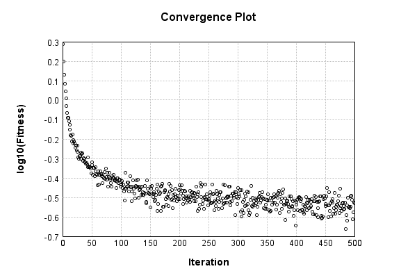

### Model
This is a very simple model that performs basic logistic regression. It is expected to be trainable to about 91% accuracy on MNIST.

Code from [MnistTestBase.java:293](../../../../../../../src/test/java/com/simiacryptus/mindseye/opt/MnistTestBase.java#L293) executed in 0.00 seconds: 
```java
    PipelineNetwork network = new PipelineNetwork();
    network.add(new BiasLayer(28, 28, 1));
    network.add(new FullyConnectedLayer(new int[]{28, 28, 1}, new int[]{10})
      .setWeights(() -> 0.001 * (Math.random() - 0.45)));
    network.add(new SoftmaxActivationLayer());
    return network;
```

Returns: 

```
    PipelineNetwork/3bf7cdb1-5718-4ea0-b37f-354b48cce500
```


### Training
Code from [GDTest.java:42](../../../../../../../src/test/java/com/simiacryptus/mindseye/opt/orient/GDTest.java#L42) executed in 190.81 seconds: 
```java
    SimpleLossNetwork supervisedNetwork = new SimpleLossNetwork(network, new EntropyLossLayer());
    Trainable trainable = new SampledArrayTrainable(trainingData, supervisedNetwork, 1000);
    return new IterativeTrainer(trainable)
      .setMonitor(monitor)
      .setOrientation(new GradientDescent())
      .setTimeout(5, TimeUnit.MINUTES)
      .setMaxIterations(500)
      .run();
```
Logging: 
```
    Constructing line search parameters: GD
    th(0)=2.6451898071590394;dx=-506101.21514175
    Armijo: th(2.154434690031884)=15.556264888267773; dx=0.0 delta=-12.911075081108734
    Armijo: th(1.077217345015942)=15.556264888267773; dx=8.508981475824114E-172 delta=-12.911075081108734
    Armijo: th(0.3590724483386473)=15.556264888267773; dx=8.96209273311062E-50 delta=-12.911075081108734
    Armijo: th(0.08976811208466183)=15.556264888267773; dx=5.133628885363375E-4 delta=-12.911075081108734
    Armijo: th(0.017953622416932366)=15.509491360556186; dx=3.9600700564735387 delta=-12.864301553397148
    Armijo: th(0.002992270402822061)=15.25249695028289; dx=276.7999847677119 delta=-12.607307143123851
    Armijo: th(4.2746720040315154E-4)=12.794576176408704; dx=13068.328746922149 delta=-10.149386369249665
    Armijo: th(5.343340005039394E-5)=5.692061710373354; dx=140988.9332336034 delta=-3.0468719032143143
    New Minimum: 2.6451898071590394 > 1.9409778425347837
    END: th(5.9370444500437714E-6)=1.9409778425347837; dx=-55717.77750150153 delta=0.70421
```
...[skipping 220818 bytes](etc/159.txt)...
```
    214877124358.4800; Orientation: 0.0003; Line Search: 0.2712
    th(0)=0.3127672767660553;dx=-8639.232376496571
    Armijo: th(3.700879018906194E-5)=0.5545570062569178; dx=33277.81816855418 delta=-0.24178972949086253
    Armijo: th(1.850439509453097E-5)=0.33317700442171394; dx=13152.149134490983 delta=-0.020409727655658627
    New Minimum: 0.3127672767660553 > 0.29759153561617335
    END: th(6.16813169817699E-6)=0.29759153561617335; dx=-1646.2496841823338 delta=0.01517574114988196
    Iteration 499 complete. Error: 0.29759153561617335 Total: 60215290218773.1250; Orientation: 0.0002; Line Search: 0.3263
    th(0)=0.3049020731573445;dx=-3776.9309421610196
    New Minimum: 0.3049020731573445 > 0.2943490025328437
    WOLF (strong): th(1.328883690323778E-5)=0.2943490025328437; dx=525.5231656233341 delta=0.010553070624500838
    END: th(6.64441845161889E-6)=0.2960877161532417; dx=-1680.1876973525527 delta=0.008814357004102824
    Iteration 500 complete. Error: 0.2943490025328437 Total: 60215711564451.7100; Orientation: 0.0002; Line Search: 0.3408
    
```

Returns: 

```
    0.33863023425827954
```


Code from [MnistTestBase.java:139](../../../../../../../src/test/java/com/simiacryptus/mindseye/opt/MnistTestBase.java#L139) executed in 0.00 seconds: 
```java
    PlotCanvas plot = ScatterPlot.plot(history.stream().map(step -> new double[]{step.iteration, Math.log10(step.point.getMean())}).toArray(i -> new double[i][]));
    plot.setTitle("Convergence Plot");
    plot.setAxisLabels("Iteration", "log10(Fitness)");
    plot.setSize(600, 400);
    return plot;
```

Returns: 




Saved model as [model0.json](etc/model0.json)

### Metrics
Code from [MnistTestBase.java:152](../../../../../../../src/test/java/com/simiacryptus/mindseye/opt/MnistTestBase.java#L152) executed in 0.05 seconds: 
```java
    try {
      ByteArrayOutputStream out = new ByteArrayOutputStream();
      JsonUtil.writeJson(out, monitoringRoot.getMetrics());
      return out.toString();
    } catch (IOException e) {
      throw new RuntimeException(e);
    }
```

Returns: 

```
    [ "java.util.HashMap", {
      "SoftmaxActivationLayer/62fa02fd-a45e-4fdf-b2e3-9bddaf66e2e2" : [ "java.util.HashMap", {
        "avgMsPerItem" : 0.0023210569742684196,
        "medianMsPerItem" : "NaN",
        "avgMsPerItem_Backward" : 8.967487911200849E-7,
        "totalItems" : 1982000,
        "backpropStatistics" : [ "java.util.HashMap", {
          "meanExponent" : 0.17643217010093815,
          "tp50" : -1.0326557502678293,
          "negative" : 500,
          "min" : -427573.4632132635,
          "max" : 0.0,
          "tp90" : -1.0012583429739645,
          "mean" : -454.5426000751264,
          "count" : 5000.0,
          "positive" : 0,
          "stdDev" : 20753.62503055881,
          "tp75" : -1.00770586191515,
          "zeros" : 4500
        } ],
        "totalBatches" : 3964,
        "class" : "com.simiacryptus.mindseye.layers.java.SoftmaxActivationLayer",
        "outputStatistics" : [ "java.util.HashMap", {
          "meanExponent" : -3.6172999643594683,
          "tp50" : 1.9121159108887496E-8,
          "negative" : 0,
          "min" : 3.365960661855148E-11,
        
```
...[skipping 2801 bytes](etc/160.txt)...
```
     : 3964,
        "weights" : [ "java.util.HashMap", {
          "tp50" : "NaN",
          "buffers" : 1,
          "max" : 0.00321223246681449,
          "tp90" : "NaN",
          "count" : 7840.0,
          "positive" : 4250,
          "tp75" : "NaN",
          "zeros" : 0,
          "meanExponent" : -3.5772360458500265,
          "negative" : 3590,
          "min" : -0.002562097109266626,
          "mean" : 5.0915293846816755E-5,
          "stdDev" : 5.447532965999027E-4
        } ],
        "class" : "com.simiacryptus.mindseye.layers.java.FullyConnectedLayer",
        "outputStatistics" : [ "java.util.HashMap", {
          "meanExponent" : 0.3661562093897059,
          "tp50" : -6.0743627408197245,
          "negative" : 1992,
          "min" : -6.97978999830125,
          "max" : 11.712636820584379,
          "tp90" : -4.687405939645533,
          "mean" : 1.1817434319859137,
          "count" : 5000.0,
          "positive" : 3008,
          "stdDev" : 4.57157175982089,
          "tp75" : -5.160866929865765,
          "zeros" : 0
        } ],
        "medianMsPerItem_Backward" : "NaN"
      } ]
    } ]
```


### Validation
If we run our model against the entire validation dataset, we get this accuracy:

Code from [MnistTestBase.java:209](../../../../../../../src/test/java/com/simiacryptus/mindseye/opt/MnistTestBase.java#L209) executed in 0.81 seconds: 
```java
    return MNIST.validationDataStream().mapToDouble(labeledObject ->
      predict(network, labeledObject)[0] == parse(labeledObject.label) ? 1 : 0)
      .average().getAsDouble() * 100;
```

Returns: 

```
    91.99000000000001
```


Let's examine some incorrectly predicted results in more detail:

Code from [MnistTestBase.java:216](../../../../../../../src/test/java/com/simiacryptus/mindseye/opt/MnistTestBase.java#L216) executed in 0.21 seconds: 
```java
    try {
      TableOutput table = new TableOutput();
      MNIST.validationDataStream().map(labeledObject -> {
        try {
          int actualCategory = parse(labeledObject.label);
          double[] predictionSignal = GpuController.call(ctx -> network.eval(ctx, labeledObject.data).getData().get(0).getData());
          int[] predictionList = IntStream.range(0, 10).mapToObj(x -> x).sorted(Comparator.comparing(i -> -predictionSignal[i])).mapToInt(x -> x).toArray();
          if (predictionList[0] == actualCategory) return null; // We will only examine mispredicted rows
          LinkedHashMap<String, Object> row = new LinkedHashMap<String, Object>();
          row.put("Image", log.image(labeledObject.data.toGrayImage(), labeledObject.label));
          row.put("Prediction", Arrays.stream(predictionList).limit(3)
            .mapToObj(i -> String.format("%d (%.1f%%)", i, 100.0 * predictionSignal[i]))
            .reduce((a, b) -> a + ", " + b).get());
          return row;
        } catch (IOException e) {
          throw new RuntimeException(e);
        }
      }).filter(x -> null != x).limit(10).forEach(table::putRow);
      return table;
    } catch (IOException e) {
      throw new RuntimeException(e);
    }
```

Returns: 

Image | Prediction
----- | ----------
![[5]](etc/test.720.png) | 6 (98.5%), 4 (0.7%), 2 (0.3%)  
![[4]](etc/test.721.png) | 6 (52.1%), 0 (34.4%), 5 (7.8%) 
![[3]](etc/test.722.png) | 2 (56.5%), 3 (38.4%), 8 (4.3%) 
![[6]](etc/test.723.png) | 2 (26.8%), 7 (26.6%), 6 (22.1%)
![[2]](etc/test.724.png) | 7 (53.5%), 2 (37.1%), 9 (6.4%) 
![[9]](etc/test.725.png) | 4 (43.8%), 9 (29.4%), 8 (14.7%)
![[7]](etc/test.726.png) | 4 (66.5%), 9 (21.2%), 7 (10.6%)
![[2]](etc/test.727.png) | 9 (81.6%), 4 (7.7%), 8 (5.0%)  
![[9]](etc/test.728.png) | 3 (36.3%), 4 (27.1%), 9 (26.8%)
![[3]](etc/test.729.png) | 8 (42.2%), 3 (29.9%), 5 (16.0%)


