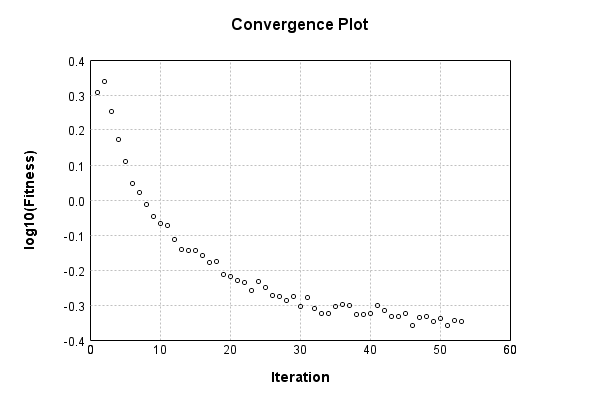

### Model
This is a very simple model that performs basic logistic regression. It is expected to be trainable to about 91% accuracy on MNIST.

Code from [MnistTestBase.java:272](../../../../../../../../MindsEye/src/test/java/com/simiacryptus/mindseye/mnist/MnistTestBase.java#L272) executed in 0.00 seconds: 
```java
    PipelineNetwork network = new PipelineNetwork();
    network.add(new BiasLayer(28, 28, 1));
    network.add(new FullyConnectedLayer(new int[]{28, 28, 1}, new int[]{10})
      .setWeights(() -> 0.001 * (Math.random() - 0.45)));
    network.add(new SoftmaxActivationLayer());
    return network;
```

Returns: 

```
    PipelineNetwork/e1035fb9-1fe3-4846-a360-62290000001c
```


### Training
Code from [GDTest.java:42](../../../../../../../../MindsEye/src/test/java/com/simiacryptus/mindseye/opt/orient/GDTest.java#L42) executed in 180.74 seconds: 
```java
    SimpleLossNetwork supervisedNetwork = new SimpleLossNetwork(network, new EntropyLossLayer());
```
Logging: 
```
    Constructing line search parameters: GD
    Returning cached value; 2 buffers unchanged since 0.0 => 2.5696901142826603
    -555775.9474001677 vs (-556328.3867414913, -557351.196165009); probe=0.001
    -555315.9048123888 vs (-556328.3867414913, -556430.7453100558); probe=1.0E-4
    -555265.2719224922 vs (-556328.3867414913, -556329.410412122); probe=1.0E-6
    th(0)=2.5696901142826603;dx=-556328.3867414913
    0.0 vs (0.0018511004003147274, 1.8785640065826676E-121); probe=0.001
    0.0 vs (0.0018511004003147274, 4.3666975134436433E-16); probe=1.0E-4
    0.0 vs (0.0018511004003147274, 0.001380714372593963); probe=1.0E-6
    Armijo: th(2.154434690031884)=18.706201295483627; dx=0.0018511004003147274 delta=-16.136511181200966
    0.020207024496800716 vs (0.02925445405579133, 1.01288305188589E-4); probe=0.001
    0.029178704782849972 vs (0.02925445405579133, 0.02916143461639832); probe=1.0E-4
    0.029191833238177336 vs (0.02925445405579133, 0.02919081158048089); probe=1.0E-6
    Armijo: th(1.077217345015942)=18.69328921883197; dx=0.02925445405579133 delta=-16.12359910454931
    0.02918174360651707 vs (0.02886192320203213, 0.02915308643428403); probe=0.001
    0.029114738039268246 vs (0.02886192320203213, 0.029252794256849013); probe=1.0E-4
    0.028866288611256223 vs (0.02886192320203213, 0.028870152136134062); probe=1.0E-6
    Armijo: th(0.3590724483386473)=18.682796556816406; dx=0.02886192320203213 delta=-16.113106442533745
    0.4764255349911014 vs (0.7296615059677808, 0.2597136324884139); probe=0.001
    0.7301019015767912 vs (0.7296615059677808, 0.7305730464644051); probe=1.0E-4
    0.729632624125967 vs (0.7296615059677808, 0.7296712332521236); probe=1.0E-6
    Armijo: th(0.08976811208466183)=18.655962798444676; dx=0.7296615059677808 delta=-16.086272684162015
    6.241934460071301 vs (6.221089438986571, 6.259266692340295); probe=0.001
    6.223542243176841 vs (6.221089438986571, 6.2259491957723645); probe=1.0E-4
    6.221111275084559 vs (6.221089438986571, 6.221136607018255); probe=1.0E-6
    Armijo: th(0.017953622416932366)=18.567756215825682; dx=6.221089438986571 delta=-15.998066101
```
...[skipping 61904 bytes](etc/1.txt)...
```
    4577683196; dx=-464.3631983642687 delta=0.01672291045226293
    Iteration 52 complete. Error: 0.4529834577683196 Total: 180641699235553.5000; Orientation: 0.0004; Line Search: 1.9271
    Returning cached value; 2 buffers unchanged since 0.0 => 0.4706861682453173
    -22268.447665399777 vs (-21881.71599894117, -22138.926281517473); probe=0.001
    -22155.089666898835 vs (-21881.71599894117, -21907.41203897577); probe=1.0E-4
    -22142.62923360206 vs (-21881.71599894117, -21881.97293183078); probe=1.0E-6
    th(0)=0.4706861682453173;dx=-21881.71599894117
    55510.92299757731 vs (56924.6188864963, 56966.59215626264); probe=0.001
    55492.151344999125 vs (56924.6188864963, 56928.81820405418); probe=1.0E-4
    55490.08575897022 vs (56924.6188864963, 56924.66088187826); probe=1.0E-6
    Armijo: th(2.4906126971096277E-5)=0.7901090771177339; dx=56924.6188864963 delta=-0.31942290887241664
    30179.61471561965 vs (31286.743727787285, 31380.65576185876); probe=0.001
    30137.873350970447 vs (31286.743727787285, 31296.14361779773); probe=1.0E-4
    30133.27866713137 vs (31286.743727787285, 31286.83773624976); probe=1.0E-6
    Armijo: th(1.2453063485548139E-5)=0.5152173860725723; dx=31286.743727787285 delta=-0.044531217827255
    5850.07428090597 vs (317.6034521788722, 12638.196295211717); probe=0.001
    279.37126089862755 vs (317.6034521788722, 1644.2286154816022); probe=1.0E-4
    -367.37362835935863 vs (317.6034521788722, 330.9788552663344); probe=1.0E-6
    New Minimum: 0.4706861682453173 > 0.44818255552362035
    WOLF (strong): th(4.15102116184938E-6)=0.44818255552362035; dx=317.6034521788722 delta=0.02250361272169693
    -16390.686440884565 vs (-15846.51130854327, -16176.062481426025); probe=0.001
    -16245.421996866067 vs (-15846.51130854327, -15879.420176640848); probe=1.0E-4
    -16229.459375651715 vs (-15846.51130854327, -15846.840346355502); probe=1.0E-6
    END: th(1.037755290462345E-6)=0.46074476225754335; dx=-15846.51130854327 delta=0.009941405987773932
    Iteration 53 complete. Error: 0.44818255552362035 Total: 180647226360364.3000; Orientation: 0.0004; Line Search: 5.2429
    
```

Returns: 

```
    0.44818255552362035
```


Code from [MnistTestBase.java:131](../../../../../../../../MindsEye/src/test/java/com/simiacryptus/mindseye/mnist/MnistTestBase.java#L131) executed in 0.02 seconds: 
```java
    PlotCanvas plot = ScatterPlot.plot(history.stream().map(step -> new double[]{step.iteration, Math.log10(step.point.getMean())}).toArray(i -> new double[i][]));
    plot.setTitle("Convergence Plot");
    plot.setAxisLabels("Iteration", "log10(Fitness)");
    plot.setSize(600, 400);
    return plot;
```

Returns: 




Saved model as [model0.json](etc/model0.json)

### Metrics
Code from [MnistTestBase.java:144](../../../../../../../../MindsEye/src/test/java/com/simiacryptus/mindseye/mnist/MnistTestBase.java#L144) executed in 0.06 seconds: 
```java
    try {
      ByteArrayOutputStream out = new ByteArrayOutputStream();
      JsonUtil.writeJson(out, monitoringRoot.getMetrics());
      return out.toString();
    } catch (IOException e) {
      throw new RuntimeException(e);
    }
```

Returns: 

```
    [ "java.util.HashMap", {
      "SoftmaxActivationLayer/e1035fb9-1fe3-4846-a360-62290000001f" : [ "java.util.HashMap", {
        "avgMsPerItem" : 0.00403180621879815,
        "medianMsPerItem" : "NaN",
        "avgMsPerItem_Backward" : 2.5539086070878253E-6,
        "totalItems" : 649000,
        "backpropStatistics" : [ "java.util.HashMap", {
          "meanExponent" : -2.4919232827188336,
          "tp50" : -0.0023888994659027095,
          "negative" : 500,
          "min" : -1.3188791589861453,
          "max" : 0.0,
          "tp90" : -0.0020339332965919115,
          "mean" : -0.001030924640630855,
          "count" : 5000.0,
          "positive" : 0,
          "stdDev" : 0.022832144931888475,
          "tp75" : -0.002125376092167976,
          "zeros" : 4500
        } ],
        "totalBatches" : 1298,
        "class" : "com.simiacryptus.mindseye.layers.java.SoftmaxActivationLayer",
        "outputStatistics" : [ "java.util.HashMap", {
          "meanExponent" : -2.3389383412712066,
          "tp50" : 2.377508845702019E-5,
          "negative" : 0,
          "min" : 3.6101706023111295E-7,
          "max" : 0.9410099263702139,
          "tp90" : 6.886091999653306E-5,
          "mean" : 0.1,
          "count" : 5000.0,
          "positive" : 5000,
          "stdDev" : 0.24044117664739081,
          "tp75" : 4.716397247623554E-5,
          "zeros" : 0
        } ],
        "medianMsPerItem_Backward" : "NaN"
      } ],
      "BiasLayer/e1035fb9-1fe3-4846-a360-62290000001d" : [ "java.util.HashMap", {
        "avgMsPerItem" : 0.02214019638212636,
        "medianMsPerItem" : "NaN",
        "avgMsPerItem_Backward" : 2.9915967038520825E-5,
        "totalItems" : 649000,
        "backpropStatistics" : [ "java.util.HashMap", {
          "meanExponent" : -7.230235004048602,
          "tp50" : -2.1415122876945627E-6,
          "negative" : 192456,
          "min" : -1.3908699453313902E-6,
          "max" : 1.434315942088149E-6,
          "tp90" : -1.8978559962619402E-6,
          "mean" : 2.093388978874472E-9,
          "count" : 392000.0,
          "positive" : 199544,
          "stdDev" : 3.2242622354032816E-7,
          "tp75" : -1.9710211583883622E-6,
          "zeros" : 0
        }
```
...[skipping 777 bytes](etc/2.txt)...
```
         "tp90" : -4.869585094433673E-9,
          "mean" : 33.692711734503625,
          "count" : 392000.0,
          "positive" : 220681,
          "stdDev" : 78.98358832325191,
          "tp75" : -4.869585094433673E-9,
          "zeros" : 0
        } ],
        "medianMsPerItem_Backward" : "NaN"
      } ],
      "FullyConnectedLayer/e1035fb9-1fe3-4846-a360-62290000001e" : [ "java.util.HashMap", {
        "avgMsPerItem" : 0.01495604355161788,
        "medianMsPerItem" : "NaN",
        "avgMsPerItem_Backward" : 7.663686296456082E-5,
        "totalItems" : 649000,
        "backpropStatistics" : [ "java.util.HashMap", {
          "meanExponent" : -5.104942256966011,
          "tp50" : -3.2558880895036197E-4,
          "negative" : 500,
          "min" : -0.001996967121686057,
          "max" : 0.0015291222816669783,
          "tp90" : -3.33671675947001E-5,
          "mean" : -3.166469305139223E-22,
          "count" : 5000.0,
          "positive" : 4500,
          "stdDev" : 2.873471325576093E-4,
          "tp75" : -1.1798014725957246E-4,
          "zeros" : 0
        } ],
        "totalBatches" : 1298,
        "weights" : [ "java.util.HashMap", {
          "tp50" : "NaN",
          "buffers" : 1,
          "max" : 0.0017753639866841388,
          "tp90" : "NaN",
          "count" : 7840.0,
          "positive" : 4227,
          "tp75" : "NaN",
          "zeros" : 0,
          "meanExponent" : -3.696725844993567,
          "negative" : 3613,
          "min" : -0.001330948570651953,
          "mean" : 4.899360189913262E-5,
          "stdDev" : 3.619014456729368E-4
        } ],
        "class" : "com.simiacryptus.mindseye.layers.java.FullyConnectedLayer",
        "outputStatistics" : [ "java.util.HashMap", {
          "meanExponent" : 0.14164584575559178,
          "tp50" : -2.7645228949593377,
          "negative" : 1611,
          "min" : -4.946137995772931,
          "max" : 8.138623531550603,
          "tp90" : -2.0588290317278903,
          "mean" : 1.276408106937957,
          "count" : 5000.0,
          "positive" : 3389,
          "stdDev" : 2.746551853026755,
          "tp75" : -2.2775748220206937,
          "zeros" : 0
        } ],
        "medianMsPerItem_Backward" : "NaN"
      } ]
    } ]
```


### Validation
If we run our model against the entire validation dataset, we get this accuracy:

Code from [MnistTestBase.java:201](../../../../../../../../MindsEye/src/test/java/com/simiacryptus/mindseye/mnist/MnistTestBase.java#L201) executed in 1.10 seconds: 
```java
    return MNIST.validationDataStream().mapToDouble(labeledObject ->
      predict(network, labeledObject)[0] == parse(labeledObject.label) ? 1 : 0)
      .average().getAsDouble() * 100;
```

Returns: 

```
    88.52
```


Let's examine some incorrectly predicted results in more detail:

Code from [MnistTestBase.java:208](../../../../../../../../MindsEye/src/test/java/com/simiacryptus/mindseye/mnist/MnistTestBase.java#L208) executed in 0.09 seconds: 
```java
    try {
      TableOutput table = new TableOutput();
      MNIST.validationDataStream().map(labeledObject -> {
        try {
          int actualCategory = parse(labeledObject.label);
          double[] predictionSignal = CudaExecutionContext.gpuContexts.run(ctx -> network.eval(ctx, labeledObject.data).getData().get(0).getData());
          int[] predictionList = IntStream.range(0, 10).mapToObj(x -> x).sorted(Comparator.comparing(i -> -predictionSignal[i])).mapToInt(x -> x).toArray();
          if (predictionList[0] == actualCategory) return null; // We will only examine mispredicted rows
          LinkedHashMap<String, Object> row = new LinkedHashMap<String, Object>();
          row.put("Image", log.image(labeledObject.data.toGrayImage(), labeledObject.label));
          row.put("Prediction", Arrays.stream(predictionList).limit(3)
            .mapToObj(i -> String.format("%d (%.1f%%)", i, 100.0 * predictionSignal[i]))
            .reduce((a, b) -> a + ", " + b).get());
          return row;
        } catch (IOException e) {
          throw new RuntimeException(e);
        }
      }).filter(x -> null != x).limit(10).forEach(table::putRow);
      return table;
    } catch (IOException e) {
      throw new RuntimeException(e);
    }
```

Returns: 

Image | Prediction
----- | ----------
![[5]](etc/test.2.png)  | 6 (33.0%), 2 (26.1%), 4 (17.1%)
![[4]](etc/test.3.png)  | 0 (47.4%), 6 (24.7%), 4 (10.3%)
![[1]](etc/test.4.png)  | 3 (52.2%), 5 (15.7%), 1 (9.0%) 
![[3]](etc/test.5.png)  | 2 (52.8%), 3 (25.2%), 9 (9.9%) 
![[2]](etc/test.6.png)  | 7 (76.2%), 2 (12.9%), 9 (4.9%) 
![[7]](etc/test.7.png)  | 9 (48.7%), 7 (38.5%), 4 (8.8%) 
![[9]](etc/test.8.png)  | 4 (29.5%), 9 (25.0%), 8 (21.3%)
![[7]](etc/test.9.png)  | 1 (49.4%), 7 (24.8%), 9 (8.9%) 
![[2]](etc/test.10.png) | 7 (27.8%), 2 (27.6%), 8 (18.0%)
![[7]](etc/test.11.png) | 4 (74.0%), 7 (14.7%), 9 (7.6%) 


