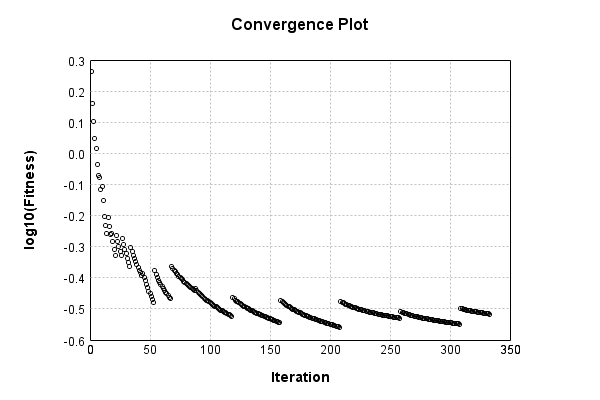

### Model
This is a very simple model that performs basic logistic regression. It is expected to be trainable to about 91% accuracy on MNIST.

Code from [MnistTestBase.java:272](../../../../../../../../MindsEye/src/test/java/com/simiacryptus/mindseye/mnist/MnistTestBase.java#L272) executed in 0.00 seconds: 
```java
    PipelineNetwork network = new PipelineNetwork();
    network.add(new BiasLayer(28, 28, 1));
    network.add(new FullyConnectedLayer(new int[]{28, 28, 1}, new int[]{10})
      .setWeights(() -> 0.001 * (Math.random() - 0.45)));
    network.add(new SoftmaxActivationLayer());
    return network;
```

Returns: 

```
    PipelineNetwork/e1035fb9-1fe3-4846-a360-622900000025
```


### Training
Code from [LBFGSTest.java:60](../../../../../../../../MindsEye/src/test/java/com/simiacryptus/mindseye/opt/orient/LBFGSTest.java#L60) executed in 1815.81 seconds: 
```java
    SimpleLossNetwork supervisedNetwork = new SimpleLossNetwork(network, new EntropyLossLayer());
    return new ValidatingTrainer(
      new SampledArrayTrainable(trainingData, supervisedNetwork, 1000, 10000),
      new ArrayTrainable(trainingData, supervisedNetwork).cached()
    )
      .setMonitor(monitor)
      //.setOrientation(new ValidatingOrientationWrapper(new LBFGS()))
      .setOrientation(new LBFGS())
      .setLineSearchFactory(name -> name.contains("LBFGS") ? new QuadraticSearch().setCurrentRate(1.0) : new QuadraticSearch())
      .setTimeout(30, TimeUnit.MINUTES)
      .setMaxIterations(500)
      .run();
```
Logging: 
```
    Epoch parameters: 1000, 1
    Phase 0: TrainingPhase{trainingSubject=SampledCachedTrainable{inner=PerformanceWrapper{inner=SampledArrayTrainable{inner=ArrayTrainable{inner=com.simiacryptus.mindseye.eval.GpuTrainable@19b9f903}}}}, orientation=com.simiacryptus.mindseye.opt.orient.LBFGS@10e56da9}
    resetAndMeasure; trainingSize=1000
    LBFGS Accumulation History: 1 points
    Constructing line search parameters: GD
    Returning cached value; 2 buffers unchanged since 0.0 => 2.4948489337767628
    F(0.0) = LineSearchPoint{point=PointSample{avg=2.4948489337767628}, derivative=-394810.25476594316}
    New Minimum: 2.4948489337767628 > 2.4948291437959034
    F(1.0E-10) = LineSearchPoint{point=PointSample{avg=2.4948291437959034}, derivative=-394804.55764284}, delta = -1.978998085938599E-5
    New Minimum: 2.4948291437959034 > 2.4947104098903785
    F(7.000000000000001E-10) = LineSearchPoint{point=PointSample{avg=2.4947104098903785}, derivative=-394770.3735509031}, delta = -1.385238863842453E-4
    New Minimum: 2.4947104098903785 > 2.4938795596272048
    F(4.900000000000001E-9) = LineSearchPoint{point=PointSample{avg=2.4938795596272048}, derivative=-394531.01997173415}, delta = -9.693741495579999E-4
    New Minimum: 2.4938795596272048 > 2.4880776927063026
    F(3.430000000000001E-8) = LineSearchPoint{point=PointSample{avg=2.4880776927063026}, derivative=-392852.3693871712}, delta = -0.006771241070460121
    New Minimum: 2.4880776927063026 > 2.44816096625215
    F(2.4010000000000004E-7) = LineSearchPoint{point=PointSample{avg=2.44816096625215}, derivative=-380948.63729329256}, delta = -0.046687967524612795
    New Minimum: 2.44816096625215 > 2.2047027341545173
    F(1.6807000000000003E-6) = LineSearchPoint{point=PointSample{avg=2.2047027341545173}, derivative=-291637.7894104888}, delta = -0.2901461996222454
    New Minimum: 2.2047027341545173 > 1.9701555446106604
    F(1.1764900000000001E-5) = LineSearchPoint{point=PointSample{avg=1.9701555446106604}, derivative=108170.83970655738}, delta = -0.5246933891661023
    1.9701555446106604 <= 2.4948489337767628
    New Minimum: 1.9701555446
```
...[skipping 742630 bytes](etc/1.txt)...
```
    }, delta = -3.202635454474523E-5
    F(2.1812071818571326E-6) = LineSearchPoint{point=PointSample{avg=0.3046118085621763}, derivative=-294.4073193330609}, delta = -1.9352316603621356E-4
    F(1.526845027299993E-5) = LineSearchPoint{point=PointSample{avg=0.3049522935433746}, derivative=492.8151472821924}, delta = 1.469618151621055E-4
    F(1.526845027299993E-7) = LineSearchPoint{point=PointSample{avg=0.3047894563285919}, derivative=-416.4169874741193}, delta = -1.5875399620612907E-5
    F(1.068791519109995E-6) = LineSearchPoint{point=PointSample{avg=0.3047015669605441}, derivative=-361.3044205065982}, delta = -1.037647676683795E-4
    New Minimum: 0.30448633540233233 > 0.30443951340573217
    F(7.4815406337699646E-6) = LineSearchPoint{point=PointSample{avg=0.30443951340573217}, derivative=24.163691091410644}, delta = -3.6581832248033797E-4
    0.30443951340573217 <= 0.3048053317282125
    New Minimum: 0.30443951340573217 > 0.3044377892473982
    Returning cached value; 2 buffers unchanged since 0.0 => 0.3044377892473982
    isLeft=false; isBracketed=true; leftPoint=LineSearchPoint{point=PointSample{avg=0.3048053317282125}, derivative=-425.6045467404464}; rightPoint=LineSearchPoint{point=PointSample{avg=0.30443951340573217}, derivative=24.163691091410644}
    F(7.079596651167445E-6) = LineSearchPoint{point=PointSample{avg=0.3044377892473982}, derivative=0.005696025326620306}, delta = -3.6754248081427576E-4
    Right bracket at 7.079596651167445E-6
    Converged to right
    Returning cached value; 2 buffers unchanged since 7.079596651167445E-6 => 0.3044377892473982
    Overall network state change: {FullyConnectedLayer=0.999299997594542, BiasLayer=0.9953598776484328}
    Iteration 333 complete. Error: 0.3044377892473982 (12284 in 17.550 seconds; 0.003 in orientation, 3.204 in gc, 17.547 in line search; 17.532 eval time)
    Training timeout
    Epoch 23 result with 26 iterations, 12284/1000000 samples: {validation *= 2^-0.01992; training *= 2^-0.071; Overtraining = 3.56}, {itr*=2.76, len*=1.33} 0 since improvement; 8.1652 validation time
    Training 23 runPhase halted
    
```

Returns: 

```
    0.30849047321613254
```


Code from [MnistTestBase.java:131](../../../../../../../../MindsEye/src/test/java/com/simiacryptus/mindseye/mnist/MnistTestBase.java#L131) executed in 0.01 seconds: 
```java
    PlotCanvas plot = ScatterPlot.plot(history.stream().map(step -> new double[]{step.iteration, Math.log10(step.point.getMean())}).toArray(i -> new double[i][]));
    plot.setTitle("Convergence Plot");
    plot.setAxisLabels("Iteration", "log10(Fitness)");
    plot.setSize(600, 400);
    return plot;
```

Returns: 




Saved model as [model0.json](etc/model0.json)

### Metrics
Code from [MnistTestBase.java:144](../../../../../../../../MindsEye/src/test/java/com/simiacryptus/mindseye/mnist/MnistTestBase.java#L144) executed in 6.19 seconds: 
```java
    try {
      ByteArrayOutputStream out = new ByteArrayOutputStream();
      JsonUtil.writeJson(out, monitoringRoot.getMetrics());
      return out.toString();
    } catch (IOException e) {
      throw new RuntimeException(e);
    }
```

Returns: 

```
    [ "java.util.HashMap", {
      "SoftmaxActivationLayer/e1035fb9-1fe3-4846-a360-622900000028" : [ "java.util.HashMap", {
        "avgMsPerItem" : 0.003725564470638599,
        "medianMsPerItem" : "NaN",
        "avgMsPerItem_Backward" : 3.9766802817135517E-7,
        "totalItems" : 10859075,
        "backpropStatistics" : [ "java.util.HashMap", {
          "meanExponent" : -4.344225238335656,
          "tp50" : -3.4633196623693156E-5,
          "negative" : 30000,
          "min" : -0.5542687730394134,
          "max" : 0.0,
          "tp90" : -3.339093012419223E-5,
          "mean" : -3.7845423299019253E-4,
          "count" : 300000.0,
          "positive" : 0,
          "stdDev" : 0.08508439072608667,
          "tp75" : -3.3608794224581854E-5,
          "zeros" : 270000
        } ],
        "totalBatches" : 4584,
        "class" : "com.simiacryptus.mindseye.layers.java.SoftmaxActivationLayer",
        "outputStatistics" : [ "java.util.HashMap", {
          "meanExponent" : -3.5285741601110017,
          "tp50" : 3.0808002940998145E-8,
          "negative" : 0,
          "min" : 5.6484035797875947E-14,
          "max" : 0.9997237158301634,
          "tp90" : 2.562186309508295E-7,
          "mean" : 0.1,
          "count" : 300000.0,
          "positive" : 300000,
          "stdDev" : 0.26997303241265963,
          "tp75" : 1.290181822014723E-7,
          "zeros" : 0
        } ],
        "medianMsPerItem_Backward" : "NaN"
      } ],
      "BiasLayer/e1035fb9-1fe3-4846-a360-622900000026" : [ "java.util.HashMap", {
        "avgMsPerItem" : 0.023755494045947755,
        "medianMsPerItem" : "NaN",
        "avgMsPerItem_Backward" : 8.519042238577615E-6,
        "totalItems" : 10859075,
        "backpropStatistics" : [ "java.util.HashMap", {
          "meanExponent" : -9.498363306808749,
          "tp50" : -5.578689975692026E-8,
          "negative" : 11513160,
          "min" : -3.006740568423565E-8,
          "max" : 2.836367952498952E-8,
          "tp90" : -4.8458225675625744E-8,
          "mean" : -2.067676798115767E-12,
          "count" : 2.352E7,
          "positive" : 12006840,
          "stdDev" : 6.432080527018974E-9,
          "tp75" : -5.0755377057536676E-8,
          
```
...[skipping 808 bytes](etc/2.txt)...
```
    5.125948507958692E-8,
          "mean" : 33.051478018199234,
          "count" : 2.352E7,
          "positive" : 13843505,
          "stdDev" : 78.21283592059734,
          "tp75" : -5.125948507958692E-8,
          "zeros" : 0
        } ],
        "medianMsPerItem_Backward" : "NaN"
      } ],
      "FullyConnectedLayer/e1035fb9-1fe3-4846-a360-622900000027" : [ "java.util.HashMap", {
        "avgMsPerItem" : 0.013056933570584966,
        "medianMsPerItem" : "NaN",
        "avgMsPerItem_Backward" : 1.8846124567705352E-5,
        "totalItems" : 10859075,
        "backpropStatistics" : [ "java.util.HashMap", {
          "meanExponent" : -8.141620164479855,
          "tp50" : -1.25107644021763E-6,
          "negative" : 30000,
          "min" : -3.333132869016173E-5,
          "max" : 3.302553041614462E-5,
          "tp90" : -5.749744081668559E-8,
          "mean" : -2.704516645374319E-24,
          "count" : 300000.0,
          "positive" : 269988,
          "stdDev" : 3.8401729672935045E-6,
          "tp75" : -2.732031874433625E-7,
          "zeros" : 12
        } ],
        "totalBatches" : 4584,
        "weights" : [ "java.util.HashMap", {
          "tp50" : "NaN",
          "buffers" : 1,
          "max" : 0.002989378985411999,
          "tp90" : "NaN",
          "count" : 7840.0,
          "positive" : 4252,
          "tp75" : "NaN",
          "zeros" : 0,
          "meanExponent" : -3.582675973431038,
          "negative" : 3588,
          "min" : -0.002669711567622046,
          "mean" : 5.1776556489730775E-5,
          "stdDev" : 5.367115833589105E-4
        } ],
        "class" : "com.simiacryptus.mindseye.layers.java.FullyConnectedLayer",
        "outputStatistics" : [ "java.util.HashMap", {
          "meanExponent" : 0.3631673803808811,
          "tp50" : -5.862731992906765,
          "negative" : 111821,
          "min" : -9.721328337131386,
          "max" : 16.119875520880065,
          "tp90" : -4.429609502248862,
          "mean" : 1.389434792048031,
          "count" : 300000.0,
          "positive" : 188179,
          "stdDev" : 4.5002151113256605,
          "tp75" : -4.9028872788643385,
          "zeros" : 0
        } ],
        "medianMsPerItem_Backward" : "NaN"
      } ]
    } ]
```


### Validation
If we run our model against the entire validation dataset, we get this accuracy:

Code from [MnistTestBase.java:201](../../../../../../../../MindsEye/src/test/java/com/simiacryptus/mindseye/mnist/MnistTestBase.java#L201) executed in 0.82 seconds: 
```java
    return MNIST.validationDataStream().mapToDouble(labeledObject ->
      predict(network, labeledObject)[0] == parse(labeledObject.label) ? 1 : 0)
      .average().getAsDouble() * 100;
```

Returns: 

```
    91.5
```


Let's examine some incorrectly predicted results in more detail:

Code from [MnistTestBase.java:208](../../../../../../../../MindsEye/src/test/java/com/simiacryptus/mindseye/mnist/MnistTestBase.java#L208) executed in 0.10 seconds: 
```java
    try {
      TableOutput table = new TableOutput();
      MNIST.validationDataStream().map(labeledObject -> {
        try {
          int actualCategory = parse(labeledObject.label);
          double[] predictionSignal = CudaExecutionContext.gpuContexts.run(ctx -> network.eval(ctx, labeledObject.data).getData().get(0).getData());
          int[] predictionList = IntStream.range(0, 10).mapToObj(x -> x).sorted(Comparator.comparing(i -> -predictionSignal[i])).mapToInt(x -> x).toArray();
          if (predictionList[0] == actualCategory) return null; // We will only examine mispredicted rows
          LinkedHashMap<String, Object> row = new LinkedHashMap<String, Object>();
          row.put("Image", log.image(labeledObject.data.toGrayImage(), labeledObject.label));
          row.put("Prediction", Arrays.stream(predictionList).limit(3)
            .mapToObj(i -> String.format("%d (%.1f%%)", i, 100.0 * predictionSignal[i]))
            .reduce((a, b) -> a + ", " + b).get());
          return row;
        } catch (IOException e) {
          throw new RuntimeException(e);
        }
      }).filter(x -> null != x).limit(10).forEach(table::putRow);
      return table;
    } catch (IOException e) {
      throw new RuntimeException(e);
    }
```

Returns: 

Image | Prediction
----- | ----------
![[5]](etc/test.2.png)  | 6 (98.6%), 4 (0.7%), 2 (0.2%)  
![[4]](etc/test.3.png)  | 0 (42.5%), 6 (33.9%), 5 (16.2%)
![[3]](etc/test.4.png)  | 2 (75.6%), 3 (20.7%), 8 (2.9%) 
![[6]](etc/test.5.png)  | 7 (29.5%), 3 (24.9%), 2 (22.0%)
![[2]](etc/test.6.png)  | 7 (75.1%), 2 (15.7%), 9 (6.6%) 
![[7]](etc/test.7.png)  | 9 (49.9%), 7 (47.4%), 4 (1.6%) 
![[7]](etc/test.8.png)  | 4 (69.5%), 9 (20.5%), 7 (8.1%) 
![[2]](etc/test.9.png)  | 9 (89.3%), 4 (2.9%), 8 (2.7%)  
![[9]](etc/test.10.png) | 3 (44.4%), 4 (24.5%), 9 (20.8%)
![[3]](etc/test.11.png) | 8 (41.5%), 3 (24.5%), 5 (20.4%)


