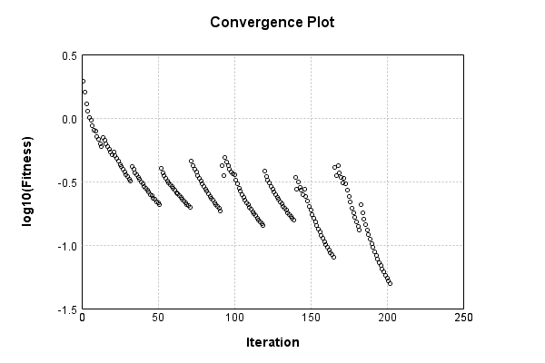

### Model
This is a very simple model that performs basic logistic regression. It is expected to be trainable to about 91% accuracy on MNIST.

Code from [MnistTestBase.java:293](../../../../../../../src/test/java/com/simiacryptus/mindseye/opt/MnistTestBase.java#L293) executed in 0.00 seconds: 
```java
    PipelineNetwork network = new PipelineNetwork();
    network.add(new BiasLayer(28, 28, 1));
    network.add(new FullyConnectedLayer(new int[]{28, 28, 1}, new int[]{10})
      .setWeights(() -> 0.001 * (Math.random() - 0.45)));
    network.add(new SoftmaxActivationLayer());
    return network;
```

Returns: 

```
    PipelineNetwork/5f794d13-dca6-4df4-88d1-f3a38c8870c5
```


### Training
Code from [LBFGSTest.java:43](../../../../../../../src/test/java/com/simiacryptus/mindseye/opt/orient/LBFGSTest.java#L43) executed in 308.12 seconds: 
```java
    SimpleLossNetwork supervisedNetwork = new SimpleLossNetwork(network, new EntropyLossLayer());
    return new ValidatingTrainer(
      new SampledArrayTrainable(trainingData, supervisedNetwork, 1000, 10000),
      new ArrayTrainable(trainingData, supervisedNetwork).cached()
    )
      .setMonitor(monitor)
      //.setOrientation(new ValidatingOrientationWrapper(new LBFGS()))
      .setOrientation(new LBFGS())
      .setLineSearchFactory(name -> name.contains("LBFGS") ? new QuadraticSearch().setCurrentRate(1.0) : new QuadraticSearch())
      .setTimeout(5, TimeUnit.MINUTES)
      .setMaxIterations(500)
      .run();
```
Logging: 
```
    Epoch parameters: 1000, 1
    Phase 0: TrainingPhase{trainingSubject=PerformanceWrapper{inner=SampledArrayTrainable{inner=ArrayTrainable{inner=com.simiacryptus.mindseye.eval.GpuTrainable@17063023}}}, orientation=com.simiacryptus.mindseye.opt.orient.LBFGS@1823707d}
    resetAndMeasure; trainingSize=1000
    LBFGS Accumulation History: 1 points
    Constructing line search parameters: GD
    F(0.0) = LineSearchPoint{point=PointSample{avg=2.4786056312876426}, derivative=-549961.38395592}
    New Minimum: 2.4786056312876426 > 2.4785782198897133
    F(1.0E-10) = LineSearchPoint{point=PointSample{avg=2.4785782198897133}, derivative=-549942.4105783268}, delta = -2.7411397929277825E-5
    New Minimum: 2.4785782198897133 > 2.478413771493584
    F(7.000000000000001E-10) = LineSearchPoint{point=PointSample{avg=2.478413771493584}, derivative=-549828.5749069401}, delta = -1.918597940586686E-4
    New Minimum: 2.478413771493584 > 2.4772635921265254
    F(4.900000000000001E-9) = LineSearchPoint{point=PointSample{avg=2.4772635921265254}, derivative=-549031.
```
...[skipping 358919 bytes](etc/161.txt)...
```
    34478946105689E-4
    New Minimum: 0.051103948325864276 > 0.04973011986783821
    F(1.9054068775186986E-5) = LineSearchPoint{point=PointSample{avg=0.04973011986783821}, derivative=142.74326778298501}, delta = -0.002167276352636638
    0.04973011986783821 <= 0.051897396220474845
    New Minimum: 0.04973011986783821 > 0.049547720390466815
    F(1.5720403689091973E-5) = LineSearchPoint{point=PointSample{avg=0.049547720390466815}, derivative=3.0541182142123113}, delta = -0.00234967583000803
    Right bracket at 1.5720403689091973E-5
    Converged to right
    Overall network state change: {FullyConnectedLayer=0.9982094690590125, BiasLayer=1.0036409921176155}
    Iteration 202 complete. Error: 0.049547720390466815 (302 in 0.290 seconds; 0.003 in orientation, 0.119 in gc, 0.287 in line search; 0.283 eval time)
    Epoch 26 result with 21 iterations, 302/2147483647 samples: {validation *= 2^0.08160; training *= 2^-2.366; Overtraining = -28.99}, {itr*=NaN, len*=NaN} 38 since improvement; 8.8275 validation time
    Training timeout
    Training halted
    
```

Returns: 

```
    0.42270575724928316
```


Code from [MnistTestBase.java:139](../../../../../../../src/test/java/com/simiacryptus/mindseye/opt/MnistTestBase.java#L139) executed in 0.00 seconds: 
```java
    PlotCanvas plot = ScatterPlot.plot(history.stream().map(step -> new double[]{step.iteration, Math.log10(step.point.getMean())}).toArray(i -> new double[i][]));
    plot.setTitle("Convergence Plot");
    plot.setAxisLabels("Iteration", "log10(Fitness)");
    plot.setSize(600, 400);
    return plot;
```

Returns: 




Saved model as [model0.json](etc/model0.json)

### Metrics
Code from [MnistTestBase.java:152](../../../../../../../src/test/java/com/simiacryptus/mindseye/opt/MnistTestBase.java#L152) executed in 4.32 seconds: 
```java
    try {
      ByteArrayOutputStream out = new ByteArrayOutputStream();
      JsonUtil.writeJson(out, monitoringRoot.getMetrics());
      return out.toString();
    } catch (IOException e) {
      throw new RuntimeException(e);
    }
```

Returns: 

```
    [ "java.util.HashMap", {
      "FullyConnectedLayer/445aa006-a28c-47d4-90aa-67428ccbf7aa" : [ "java.util.HashMap", {
        "avgMsPerItem" : 0.012687245372174947,
        "medianMsPerItem" : "NaN",
        "avgMsPerItem_Backward" : 1.5042283664428802E-4,
        "totalItems" : 2198603,
        "backpropStatistics" : [ "java.util.HashMap", {
          "meanExponent" : -3.983303623411997,
          "tp50" : -0.026826961149795655,
          "negative" : 30000,
          "min" : -0.999999264671144,
          "max" : 0.9948681730076953,
          "tp90" : -6.111866590495583E-4,
          "mean" : 1.6783258450330386E-19,
          "count" : 300000.0,
          "positive" : 270000,
          "stdDev" : 0.134196228556974,
          "tp75" : -0.003997554761027527,
          "zeros" : 0
        } ],
        "totalBatches" : 3242,
        "weights" : [ "java.util.HashMap", {
          "tp50" : "NaN",
          "buffers" : 1,
          "max" : 0.002938422089091642,
          "tp90" : "NaN",
          "count" : 7840.0,
          "positive" : 4168,
          "tp75" : "NaN",
          "zeros" : 0,
          "me
```
...[skipping 2826 bytes](etc/162.txt)...
```
    "weights" : [ "java.util.HashMap", {
          "tp50" : "NaN",
          "buffers" : 1,
          "max" : 2.9612937690328843E-8,
          "tp90" : "NaN",
          "count" : 784.0,
          "positive" : 357,
          "tp75" : "NaN",
          "zeros" : 0,
          "meanExponent" : -8.309723619283714,
          "negative" : 427,
          "min" : -3.7821567047041024E-8,
          "mean" : -1.013489944236239E-9,
          "stdDev" : 9.546232159405353E-9
        } ],
        "class" : "com.simiacryptus.mindseye.layers.java.BiasLayer",
        "outputStatistics" : [ "java.util.HashMap", {
          "meanExponent" : -6.339018702846521,
          "tp50" : -3.7821567047041024E-8,
          "negative" : 10046015,
          "min" : -3.976179154850273E-9,
          "max" : -3.976179154850273E-9,
          "tp90" : -3.563110239821601E-8,
          "mean" : 33.05147801768531,
          "count" : 2.352E7,
          "positive" : 13473985,
          "stdDev" : 78.21283592050193,
          "tp75" : -3.563110239821601E-8,
          "zeros" : 0
        } ],
        "medianMsPerItem_Backward" : "NaN"
      } ]
    } ]
```


### Validation
If we run our model against the entire validation dataset, we get this accuracy:

Code from [MnistTestBase.java:209](../../../../../../../src/test/java/com/simiacryptus/mindseye/opt/MnistTestBase.java#L209) executed in 0.83 seconds: 
```java
    return MNIST.validationDataStream().mapToDouble(labeledObject ->
      predict(network, labeledObject)[0] == parse(labeledObject.label) ? 1 : 0)
      .average().getAsDouble() * 100;
```

Returns: 

```
    88.68
```


Let's examine some incorrectly predicted results in more detail:

Code from [MnistTestBase.java:216](../../../../../../../src/test/java/com/simiacryptus/mindseye/opt/MnistTestBase.java#L216) executed in 0.04 seconds: 
```java
    try {
      TableOutput table = new TableOutput();
      MNIST.validationDataStream().map(labeledObject -> {
        try {
          int actualCategory = parse(labeledObject.label);
          double[] predictionSignal = GpuController.call(ctx -> network.eval(ctx, labeledObject.data).getData().get(0).getData());
          int[] predictionList = IntStream.range(0, 10).mapToObj(x -> x).sorted(Comparator.comparing(i -> -predictionSignal[i])).mapToInt(x -> x).toArray();
          if (predictionList[0] == actualCategory) return null; // We will only examine mispredicted rows
          LinkedHashMap<String, Object> row = new LinkedHashMap<String, Object>();
          row.put("Image", log.image(labeledObject.data.toGrayImage(), labeledObject.label));
          row.put("Prediction", Arrays.stream(predictionList).limit(3)
            .mapToObj(i -> String.format("%d (%.1f%%)", i, 100.0 * predictionSignal[i]))
            .reduce((a, b) -> a + ", " + b).get());
          return row;
        } catch (IOException e) {
          throw new RuntimeException(e);
        }
      }).filter(x -> null != x).limit(10).forEach(table::putRow);
      return table;
    } catch (IOException e) {
      throw new RuntimeException(e);
    }
```

Returns: 

Image | Prediction
----- | ----------
![[5]](etc/test.731.png) | 6 (93.9%), 4 (3.0%), 2 (2.6%)  
![[4]](etc/test.732.png) | 6 (41.6%), 0 (40.8%), 2 (8.6%) 
![[1]](etc/test.733.png) | 3 (49.3%), 1 (47.4%), 2 (2.3%) 
![[3]](etc/test.734.png) | 2 (77.9%), 3 (19.3%), 8 (2.0%) 
![[6]](etc/test.735.png) | 2 (50.5%), 6 (35.8%), 7 (4.7%) 
![[9]](etc/test.736.png) | 8 (49.4%), 9 (43.7%), 3 (4.2%) 
![[7]](etc/test.737.png) | 9 (93.7%), 4 (2.6%), 7 (2.2%)  
![[9]](etc/test.738.png) | 8 (36.0%), 9 (35.1%), 4 (17.6%)
![[9]](etc/test.739.png) | 5 (28.2%), 9 (27.8%), 3 (26.4%)
![[7]](etc/test.740.png) | 1 (75.5%), 3 (10.4%), 7 (8.2%) 


