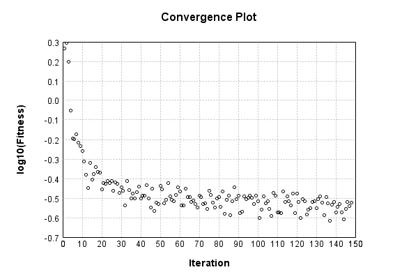

### Model
This is a very simple model that performs basic logistic regression. It is expected to be trainable to about 91% accuracy on MNIST.

Code from [MnistTestBase.java:272](../../../../../../../../MindsEye/src/test/java/com/simiacryptus/mindseye/mnist/MnistTestBase.java#L272) executed in 0.00 seconds: 
```java
    PipelineNetwork network = new PipelineNetwork();
    network.add(new BiasLayer(28, 28, 1));
    network.add(new FullyConnectedLayer(new int[]{28, 28, 1}, new int[]{10})
      .setWeights(() -> 0.001 * (Math.random() - 0.45)));
    network.add(new SoftmaxActivationLayer());
    return network;
```

Returns: 

```
    PipelineNetwork/e1035fb9-1fe3-4846-a360-62290000002e
```


### Training
Code from [MomentumTest.java:42](../../../../../../../../MindsEye/src/test/java/com/simiacryptus/mindseye/opt/orient/MomentumTest.java#L42) executed in 183.04 seconds: 
```java
    SimpleLossNetwork supervisedNetwork = new SimpleLossNetwork(network, new EntropyLossLayer());
    Trainable trainable = new SampledArrayTrainable(trainingData, supervisedNetwork, 1000);
    return new IterativeTrainer(trainable)
      .setMonitor(monitor)
      .setOrientation(new ValidatingOrientationWrapper(new MomentumStrategy(new GradientDescent()).setCarryOver(0.8)))
      .setTimeout(3, TimeUnit.MINUTES)
      .setMaxIterations(500)
      .run();
```
Logging: 
```
    Constructing line search parameters: 
    Returning cached value; 2 buffers unchanged since 0.0 => 2.417460074882464
    -491138.55561315856 vs (-492374.5715991007, -493487.8342522362); probe=0.001
    -490637.15497292276 vs (-492374.5715991007, -492485.95800755953); probe=1.0E-4
    -490581.9789652677 vs (-492374.5715991007, -492375.6855290539); probe=1.0E-6
    th(0)=2.417460074882464;dx=-492374.5715991007
    2.5959804312362244E-88 vs (2.8580160146708666E-91, 0.0); probe=0.001
    2.595980431236224E-87 vs (2.8580160146708666E-91, 0.0); probe=1.0E-4
    2.5959804312362243E-85 vs (2.8580160146708666E-91, 0.0); probe=1.0E-6
    Armijo: th(2.154434690031884)=12.958948903370487; dx=2.8580160146708666E-91 delta=-10.541488828488024
    1.4284689085332048E-41 vs (1.5726570847466502E-44, 0.0); probe=0.001
    1.4284689085332046E-40 vs (1.5726570847466502E-44, 0.0); probe=1.0E-4
    1.4284689085332048E-38 vs (1.5726570847466502E-44, 0.0); probe=1.0E-6
    Armijo: th(1.077217345015942)=12.958948903370487; dx=1.5726570847466502E-44 delta=-10.541488828488024
    4.229368380084473E-11 vs (4.656276456008492E-14, 0.0); probe=0.001
    4.2293683800844726E-10 vs (4.656276456008492E-14, 0.0); probe=1.0E-4
    4.229368380084473E-8 vs (4.656276456008492E-14, 0.0); probe=1.0E-6
    Armijo: th(0.3590724483386473)=12.958948903370487; dx=4.656276456008492E-14 delta=-10.541488828488024
    -0.05593042875794439 vs (-5.2779420778286235E-5, 0.0); probe=0.001
    -0.5593042875794438 vs (-5.2779420778286235E-5, 0.0); probe=1.0E-4
    -55.930428757944384 vs (-5.2779420778286235E-5, -3.2228940129241594E-236); probe=1.0E-6
    Armijo: th(0.08976811208466183)=12.95894916753987; dx=-5.2779420778286235E-5 delta=-10.541489092657407
    2.8308771000002992 vs (4.217673144253928, 1.560022375739322); probe=0.001
    4.2188279732604705 vs (4.217673144253928, 4.219974404276608); probe=1.0E-4
    4.217682311257902 vs (4.217673144253928, 4.21769641566149); probe=1.0E-6
    Armijo: th(0.017953622416932366)=12.94054371481728; dx=4.217673144253928 delta=-10.523083639934818
    107.93921952891998 vs (122.61512011828046, 109.93580563302
```
...[skipping 61052 bytes](etc/1.txt)...
```
    67897); probe=1.0E-4
    1256.2764058290393 vs (1196.7112713719262, 1196.825281366056); probe=1.0E-6
    New Minimum: 0.31484120204115806 > 0.3043088151781166
    WOLF (strong): th(2.037350877754854E-5)=0.3043088151781166; dx=1196.7112713719262 delta=0.010532386863041476
    -1080.103146904798 vs (-1079.0634323115917, -1206.1127582666502); probe=0.001
    -1023.0126603820072 vs (-1079.0634323115917, -1091.753747433126); probe=1.0E-4
    -1016.7380233909861 vs (-1079.0634323115917, -1079.190319922232); probe=1.0E-6
    New Minimum: 0.3043088151781166 > 0.30369337888111614
    END: th(1.018675438877427E-5)=0.30369337888111614; dx=-1079.0634323115917 delta=0.011147823160041925
    Iteration 51 complete. Error: 0.30369337888111614 Total: 182652007966308.4400; Orientation: 0.0014; Line Search: 3.1630
    Returning cached value; 2 buffers unchanged since 0.0 => 0.37206202956575707
    -5699.986231019747 vs (-5691.6413691044645, -5753.797379862893); probe=0.001
    -5672.0894376120605 vs (-5691.6413691044645, -5697.859349521798); probe=1.0E-4
    -5669.0199716994775 vs (-5691.6413691044645, -5691.703551540631); probe=1.0E-6
    th(0)=0.37206202956575707;dx=-5691.6413691044645
    5737.787315048255 vs (5747.44147463689, 5820.4206975889565); probe=0.001
    5705.227563244618 vs (5747.44147463689, 5754.7379354753); probe=1.0E-4
    5701.646488955801 vs (5747.44147463689, 5747.5144376009); probe=1.0E-6
    New Minimum: 0.37206202956575707 > 0.3703626393901829
    WOLF (strong): th(2.1946697034009826E-5)=0.3703626393901829; dx=5747.44147463689 delta=0.0016993901755741891
    -996.9084394887514 vs (-242.52892050316683, -1749.0077638479688); probe=0.001
    -320.51040954613813 vs (-242.52892050316683, -395.00685611747076); probe=1.0E-4
    -245.45436982128336 vs (-242.52892050316683, -244.0557512423086); probe=1.0E-6
    New Minimum: 0.3703626393901829 > 0.35562062387530935
    END: th(1.0973348517004913E-5)=0.35562062387530935; dx=-242.52892050316683 delta=0.01644140569044772
    Iteration 52 complete. Error: 0.35562062387530935 Total: 182655427367576.0000; Orientation: 0.0008; Line Search: 3.1459
    
```

Returns: 

```
    0.35562062387530935
```


Code from [MnistTestBase.java:131](../../../../../../../../MindsEye/src/test/java/com/simiacryptus/mindseye/mnist/MnistTestBase.java#L131) executed in 0.02 seconds: 
```java
    PlotCanvas plot = ScatterPlot.plot(history.stream().map(step -> new double[]{step.iteration, Math.log10(step.point.getMean())}).toArray(i -> new double[i][]));
    plot.setTitle("Convergence Plot");
    plot.setAxisLabels("Iteration", "log10(Fitness)");
    plot.setSize(600, 400);
    return plot;
```

Returns: 




Saved model as [model0.json](etc/model0.json)

### Metrics
Code from [MnistTestBase.java:144](../../../../../../../../MindsEye/src/test/java/com/simiacryptus/mindseye/mnist/MnistTestBase.java#L144) executed in 0.07 seconds: 
```java
    try {
      ByteArrayOutputStream out = new ByteArrayOutputStream();
      JsonUtil.writeJson(out, monitoringRoot.getMetrics());
      return out.toString();
    } catch (IOException e) {
      throw new RuntimeException(e);
    }
```

Returns: 

```
    [ "java.util.HashMap", {
      "BiasLayer/e1035fb9-1fe3-4846-a360-62290000002f" : [ "java.util.HashMap", {
        "avgMsPerItem" : 0.021544594363494516,
        "medianMsPerItem" : "NaN",
        "avgMsPerItem_Backward" : 2.8616195248049914E-5,
        "totalItems" : 641000,
        "backpropStatistics" : [ "java.util.HashMap", {
          "meanExponent" : -7.7557109910100355,
          "tp50" : -3.281825411113765E-6,
          "negative" : 191884,
          "min" : -1.531253859278534E-6,
          "max" : 1.1623108438243123E-6,
          "tp90" : -2.8781195220205515E-6,
          "mean" : -5.82625830401141E-10,
          "count" : 392000.0,
          "positive" : 200116,
          "stdDev" : 3.852372747605242E-7,
          "tp75" : -2.998584893219902E-6,
          "zeros" : 0
        } ],
        "totalBatches" : 1282,
        "weights" : [ "java.util.HashMap", {
          "tp50" : "NaN",
          "buffers" : 1,
          "max" : 2.032583533441596E-8,
          "tp90" : "NaN",
          "count" : 784.0,
          "positive" : 364,
          "tp75" : "NaN",
          "zeros" : 0,
          "meanExponent" : -8.446018319287536,
          "negative" : 420,
          "min" : -2.777622874119555E-8,
          "mean" : -9.211935682249115E-10,
          "stdDev" : 6.973034882177544E-9
        } ],
        "class" : "com.simiacryptus.mindseye.layers.java.BiasLayer",
        "outputStatistics" : [ "java.util.HashMap", {
          "meanExponent" : -6.408551993688739,
          "tp50" : -2.777622874119555E-8,
          "negative" : 162396,
          "min" : -1.2567628781919181E-8,
          "max" : -1.2567628781919181E-8,
          "tp90" : -2.518169583088329E-8,
          "mean" : 34.00958673377261,
          "count" : 392000.0,
          "positive" : 229604,
          "stdDev" : 79.27788040313298,
          "tp75" : -2.518169583088329E-8,
          "zeros" : 0
        } ],
        "medianMsPerItem_Backward" : "NaN"
      } ],
      "FullyConnectedLayer/e1035fb9-1fe3-4846-a360-622900000030" : [ "java.util.HashMap", {
        "avgMsPerItem" : 0.015262691614664588,
        "medianMsPerItem" : "NaN",
        "avgMsPerItem_Backward" : 7.563705705148217E-5,
        "totalItems" : 641000,
        "
```
...[skipping 772 bytes](etc/2.txt)...
```
    2309283787667,
          "negative" : 3528,
          "min" : -0.002639402509213866,
          "mean" : 5.535447608524194E-5,
          "stdDev" : 5.028842791527809E-4
        } ],
        "class" : "com.simiacryptus.mindseye.layers.java.FullyConnectedLayer",
        "outputStatistics" : [ "java.util.HashMap", {
          "meanExponent" : 0.38338689792525776,
          "tp50" : -6.32902096774659,
          "negative" : 1958,
          "min" : -7.114695239698788,
          "max" : 11.361759111307661,
          "tp90" : -4.761955382731526,
          "mean" : 1.262781703127487,
          "count" : 5000.0,
          "positive" : 3042,
          "stdDev" : 4.764711900112716,
          "tp75" : -5.228098798639274,
          "zeros" : 0
        } ],
        "medianMsPerItem_Backward" : "NaN"
      } ],
      "SoftmaxActivationLayer/e1035fb9-1fe3-4846-a360-622900000031" : [ "java.util.HashMap", {
        "avgMsPerItem" : 0.003719024450858028,
        "medianMsPerItem" : "NaN",
        "avgMsPerItem_Backward" : 2.48807562558502E-6,
        "totalItems" : 641000,
        "backpropStatistics" : [ "java.util.HashMap", {
          "meanExponent" : -2.537935844473236,
          "tp50" : -0.00208342697344408,
          "negative" : 500,
          "min" : -0.37382040539434414,
          "max" : 0.0,
          "tp90" : -0.0020025252906139815,
          "mean" : -0.00754499784127912,
          "count" : 5000.0,
          "positive" : 0,
          "stdDev" : 0.4291929427401757,
          "tp75" : -0.0020144225976260004,
          "zeros" : 4500
        } ],
        "totalBatches" : 1282,
        "class" : "com.simiacryptus.mindseye.layers.java.SoftmaxActivationLayer",
        "outputStatistics" : [ "java.util.HashMap", {
          "meanExponent" : -3.6677330286487084,
          "tp50" : 1.1351198024090473E-8,
          "negative" : 0,
          "min" : 2.430619636657188E-11,
          "max" : 0.9851488081201258,
          "tp90" : 1.0735082484249622E-7,
          "mean" : 0.1,
          "count" : 5000.0,
          "positive" : 5000,
          "stdDev" : 0.26791429123027755,
          "tp75" : 5.310082791927521E-8,
          "zeros" : 0
        } ],
        "medianMsPerItem_Backward" : "NaN"
      } ]
    } ]
```


### Validation
If we run our model against the entire validation dataset, we get this accuracy:

Code from [MnistTestBase.java:201](../../../../../../../../MindsEye/src/test/java/com/simiacryptus/mindseye/mnist/MnistTestBase.java#L201) executed in 0.81 seconds: 
```java
    return MNIST.validationDataStream().mapToDouble(labeledObject ->
      predict(network, labeledObject)[0] == parse(labeledObject.label) ? 1 : 0)
      .average().getAsDouble() * 100;
```

Returns: 

```
    90.89
```


Let's examine some incorrectly predicted results in more detail:

Code from [MnistTestBase.java:208](../../../../../../../../MindsEye/src/test/java/com/simiacryptus/mindseye/mnist/MnistTestBase.java#L208) executed in 0.13 seconds: 
```java
    try {
      TableOutput table = new TableOutput();
      MNIST.validationDataStream().map(labeledObject -> {
        try {
          int actualCategory = parse(labeledObject.label);
          double[] predictionSignal = CudaExecutionContext.gpuContexts.run(ctx -> network.eval(ctx, labeledObject.data).getData().get(0).getData());
          int[] predictionList = IntStream.range(0, 10).mapToObj(x -> x).sorted(Comparator.comparing(i -> -predictionSignal[i])).mapToInt(x -> x).toArray();
          if (predictionList[0] == actualCategory) return null; // We will only examine mispredicted rows
          LinkedHashMap<String, Object> row = new LinkedHashMap<String, Object>();
          row.put("Image", log.image(labeledObject.data.toGrayImage(), labeledObject.label));
          row.put("Prediction", Arrays.stream(predictionList).limit(3)
            .mapToObj(i -> String.format("%d (%.1f%%)", i, 100.0 * predictionSignal[i]))
            .reduce((a, b) -> a + ", " + b).get());
          return row;
        } catch (IOException e) {
          throw new RuntimeException(e);
        }
      }).filter(x -> null != x).limit(10).forEach(table::putRow);
      return table;
    } catch (IOException e) {
      throw new RuntimeException(e);
    }
```

Returns: 

Image | Prediction
----- | ----------
![[5]](etc/test.2.png)  | 6 (91.3%), 2 (3.8%), 4 (2.0%)  
![[6]](etc/test.3.png)  | 8 (49.8%), 6 (44.6%), 2 (3.5%) 
![[4]](etc/test.4.png)  | 6 (53.5%), 0 (37.1%), 5 (4.5%) 
![[3]](etc/test.5.png)  | 2 (66.3%), 3 (27.0%), 8 (5.4%) 
![[2]](etc/test.6.png)  | 7 (76.7%), 2 (14.5%), 9 (7.5%) 
![[3]](etc/test.7.png)  | 5 (50.8%), 3 (48.0%), 8 (0.5%) 
![[9]](etc/test.8.png)  | 4 (36.3%), 9 (34.1%), 8 (18.5%)
![[7]](etc/test.9.png)  | 1 (40.2%), 7 (39.1%), 9 (7.6%) 
![[7]](etc/test.10.png) | 4 (86.6%), 9 (9.6%), 7 (3.1%)  
![[2]](etc/test.11.png) | 9 (47.3%), 8 (21.1%), 4 (16.8%)


