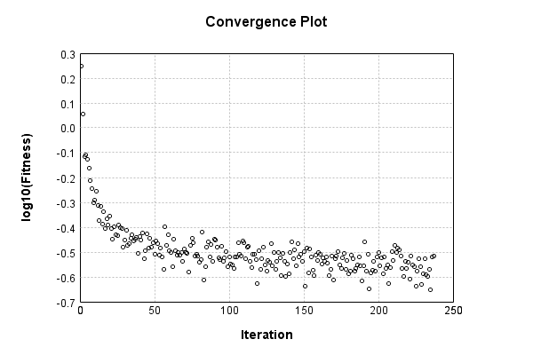

### Model
This is a very simple model that performs basic logistic regression. It is expected to be trainable to about 91% accuracy on MNIST.

Code from [MnistTestBase.java:293](../../../../../../../src/test/java/com/simiacryptus/mindseye/opt/MnistTestBase.java#L293) executed in 0.00 seconds: 
```java
    PipelineNetwork network = new PipelineNetwork();
    network.add(new BiasLayer(28, 28, 1));
    network.add(new FullyConnectedLayer(new int[]{28, 28, 1}, new int[]{10})
      .setWeights(() -> 0.001 * (Math.random() - 0.45)));
    network.add(new SoftmaxActivationLayer());
    return network;
```

Returns: 

```
    PipelineNetwork/4a799f75-30ff-4128-b612-a66277a3a5ae
```


### Training
Code from [MomentumTest.java:42](../../../../../../../src/test/java/com/simiacryptus/mindseye/opt/orient/MomentumTest.java#L42) executed in 300.06 seconds: 
```java
    SimpleLossNetwork supervisedNetwork = new SimpleLossNetwork(network, new EntropyLossLayer());
    Trainable trainable = new SampledArrayTrainable(trainingData, supervisedNetwork, 1000);
    return new IterativeTrainer(trainable)
      .setMonitor(monitor)
      .setOrientation(new ValidatingOrientationWrapper(new MomentumStrategy(new GradientDescent()).setCarryOver(0.8)))
      .setTimeout(5, TimeUnit.MINUTES)
      .setMaxIterations(500)
      .run();
```
Logging: 
```
    Constructing line search parameters: 
    -400313.72579488554 vs (-400679.20894296194, -401624.0149461827); probe=0.001
    -399888.3969342408 vs (-400679.20894296194, -400773.6591225328); probe=1.0E-4
    -399841.6219010376 vs (-400679.20894296194, -400680.15341113205); probe=1.0E-6
    th(0)=2.3961157787716236;dx=-400679.20894296194
    0.0 vs (0.0, 0.0); probe=0.001
    0.0 vs (0.0, 0.0); probe=1.0E-4
    0.0 vs (0.0, 0.0); probe=1.0E-6
    Armijo: th(2.154434690031884)=16.606243690673058; dx=0.0 delta=-14.210127911901434
    0.0 vs (0.0, 0.0); probe=0.001
    0.0 vs (0.0, 0.0); probe=1.0E-4
    0.0 vs (0.0, 0.0); probe=1.0E-6
    Armijo: th(1.077217345015942)=16.606243690673058; dx=0.0 delta=-14.210127911901434
    4.992575907515358E-129 vs (9.742006884469907E-132, 0.0); probe=0.001
    4.992575907515358E-128 vs (9.742006884469907E-132, 0.0); probe=1.0E-4
    4.992575907515359E-126 vs (9.742006884469907E-132, 0.0); probe=1.0E-6
    Armijo: th(0.3590724483386473)=16.606243690673058; dx=9.742006884469907E-132 delta=-14.210127911901434
    7.377561634004643E
```
...[skipping 271197 bytes](etc/163.txt)...
```
    95151842, -2438.874371791469); probe=1.0E-4
    -2129.370248005337 vs (-2431.341295151842, -2431.416636788374); probe=1.0E-6
    th(0)=0.3074648609509675;dx=-2431.341295151842
    897.7259156655634 vs (360.27321798187813, 943.0562851473336); probe=0.001
    643.2925588250121 vs (360.27321798187813, 417.80612787616064); probe=1.0E-4
    615.5425044276395 vs (360.27321798187813, 360.84773074542767); probe=1.0E-6
    New Minimum: 0.3074648609509675 > 0.3040162502637937
    WOLF (strong): th(8.796045123553294E-6)=0.3040162502637937; dx=360.27321798187813 delta=0.003448610687173781
    -884.9860840986244 vs (-1082.8239635181094, -1259.8810867855163); probe=0.001
    -806.5013228376679 vs (-1082.8239635181094, -1100.5990912350067); probe=1.0E-4
    -797.8460529282455 vs (-1082.8239635181094, -1083.0017920099085); probe=1.0E-6
    END: th(4.398022561776647E-6)=0.3042335770496484; dx=-1082.8239635181094 delta=0.003231283901319104
    Iteration 237 complete. Error: 0.3040162502637937 Total: 60831175285518.0100; Orientation: 0.0004; Line Search: 1.0912
    
```

Returns: 

```
    0.31268458232484586
```


Code from [MnistTestBase.java:139](../../../../../../../src/test/java/com/simiacryptus/mindseye/opt/MnistTestBase.java#L139) executed in 0.00 seconds: 
```java
    PlotCanvas plot = ScatterPlot.plot(history.stream().map(step -> new double[]{step.iteration, Math.log10(step.point.getMean())}).toArray(i -> new double[i][]));
    plot.setTitle("Convergence Plot");
    plot.setAxisLabels("Iteration", "log10(Fitness)");
    plot.setSize(600, 400);
    return plot;
```

Returns: 




Saved model as [model0.json](etc/model0.json)

### Metrics
Code from [MnistTestBase.java:152](../../../../../../../src/test/java/com/simiacryptus/mindseye/opt/MnistTestBase.java#L152) executed in 0.05 seconds: 
```java
    try {
      ByteArrayOutputStream out = new ByteArrayOutputStream();
      JsonUtil.writeJson(out, monitoringRoot.getMetrics());
      return out.toString();
    } catch (IOException e) {
      throw new RuntimeException(e);
    }
```

Returns: 

```
    [ "java.util.HashMap", {
      "SoftmaxActivationLayer/68d4ae18-7c2f-4434-bd59-bc2fe56aabd9" : [ "java.util.HashMap", {
        "avgMsPerItem" : 0.0023312356637512164,
        "medianMsPerItem" : "NaN",
        "avgMsPerItem_Backward" : 9.535934272756853E-7,
        "totalItems" : 3087000,
        "backpropStatistics" : [ "java.util.HashMap", {
          "meanExponent" : 0.13178076338601524,
          "tp50" : -1.0215724918167803,
          "negative" : 500,
          "min" : -20.174662268185763,
          "max" : 0.0,
          "tp90" : -1.000469022735559,
          "mean" : -13.25252584937379,
          "count" : 5000.0,
          "positive" : 0,
          "stdDev" : 825.6028069949375,
          "tp75" : -1.0032014093607293,
          "zeros" : 4500
        } ],
        "totalBatches" : 6174,
        "class" : "com.simiacryptus.mindseye.layers.java.SoftmaxActivationLayer",
        "outputStatistics" : [ "java.util.HashMap", {
          "meanExponent" : -4.01241279788281,
          "tp50" : 1.7924131081166514E-9,
          "negative" : 0,
          "min" : 8.864289576401715E-13,
        
```
...[skipping 2804 bytes](etc/164.txt)...
```
     : 6174,
        "weights" : [ "java.util.HashMap", {
          "tp50" : "NaN",
          "buffers" : 1,
          "max" : 0.003830549044655932,
          "tp90" : "NaN",
          "count" : 7840.0,
          "positive" : 4225,
          "tp75" : "NaN",
          "zeros" : 0,
          "meanExponent" : -3.535817311691629,
          "negative" : 3615,
          "min" : -0.0032254431167686756,
          "mean" : 5.443842644241784E-5,
          "stdDev" : 6.33152068592418E-4
        } ],
        "class" : "com.simiacryptus.mindseye.layers.java.FullyConnectedLayer",
        "outputStatistics" : [ "java.util.HashMap", {
          "meanExponent" : 0.4286398937623319,
          "tp50" : -7.3480966791684725,
          "negative" : 1980,
          "min" : -8.814233330084031,
          "max" : 13.08642165040421,
          "tp90" : -5.665420337146254,
          "mean" : 1.2471477827297428,
          "count" : 5000.0,
          "positive" : 3020,
          "stdDev" : 5.189302379393811,
          "tp75" : -6.199917258269017,
          "zeros" : 0
        } ],
        "medianMsPerItem_Backward" : "NaN"
      } ]
    } ]
```


### Validation
If we run our model against the entire validation dataset, we get this accuracy:

Code from [MnistTestBase.java:209](../../../../../../../src/test/java/com/simiacryptus/mindseye/opt/MnistTestBase.java#L209) executed in 0.93 seconds: 
```java
    return MNIST.validationDataStream().mapToDouble(labeledObject ->
      predict(network, labeledObject)[0] == parse(labeledObject.label) ? 1 : 0)
      .average().getAsDouble() * 100;
```

Returns: 

```
    91.39
```


Let's examine some incorrectly predicted results in more detail:

Code from [MnistTestBase.java:216](../../../../../../../src/test/java/com/simiacryptus/mindseye/opt/MnistTestBase.java#L216) executed in 0.21 seconds: 
```java
    try {
      TableOutput table = new TableOutput();
      MNIST.validationDataStream().map(labeledObject -> {
        try {
          int actualCategory = parse(labeledObject.label);
          double[] predictionSignal = GpuController.call(ctx -> network.eval(ctx, labeledObject.data).getData().get(0).getData());
          int[] predictionList = IntStream.range(0, 10).mapToObj(x -> x).sorted(Comparator.comparing(i -> -predictionSignal[i])).mapToInt(x -> x).toArray();
          if (predictionList[0] == actualCategory) return null; // We will only examine mispredicted rows
          LinkedHashMap<String, Object> row = new LinkedHashMap<String, Object>();
          row.put("Image", log.image(labeledObject.data.toGrayImage(), labeledObject.label));
          row.put("Prediction", Arrays.stream(predictionList).limit(3)
            .mapToObj(i -> String.format("%d (%.1f%%)", i, 100.0 * predictionSignal[i]))
            .reduce((a, b) -> a + ", " + b).get());
          return row;
        } catch (IOException e) {
          throw new RuntimeException(e);
        }
      }).filter(x -> null != x).limit(10).forEach(table::putRow);
      return table;
    } catch (IOException e) {
      throw new RuntimeException(e);
    }
```

Returns: 

Image | Prediction
----- | ----------
![[5]](etc/test.742.png) | 6 (99.3%), 4 (0.3%), 5 (0.2%)  
![[4]](etc/test.743.png) | 0 (70.2%), 6 (25.3%), 5 (2.4%) 
![[3]](etc/test.744.png) | 2 (64.0%), 3 (34.5%), 8 (1.3%) 
![[6]](etc/test.745.png) | 2 (34.7%), 7 (27.5%), 3 (14.7%)
![[7]](etc/test.746.png) | 4 (73.0%), 9 (19.8%), 7 (6.7%) 
![[2]](etc/test.747.png) | 9 (74.6%), 4 (14.1%), 8 (3.9%) 
![[9]](etc/test.748.png) | 4 (40.5%), 3 (33.4%), 9 (20.9%)
![[5]](etc/test.749.png) | 7 (41.9%), 5 (31.3%), 0 (10.6%)
![[6]](etc/test.750.png) | 5 (69.8%), 6 (26.3%), 8 (1.8%) 
![[8]](etc/test.751.png) | 7 (71.9%), 9 (17.8%), 8 (9.0%) 


