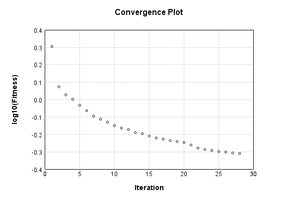

### Model
This is a very simple model that performs basic logistic regression. It is expected to be trainable to about 91% accuracy on MNIST.

Code from [MnistTestBase.java:272](../../../../../../../../MindsEye/src/test/java/com/simiacryptus/mindseye/mnist/MnistTestBase.java#L272) executed in 0.00 seconds: 
```java
    PipelineNetwork network = new PipelineNetwork();
    network.add(new BiasLayer(28, 28, 1));
    network.add(new FullyConnectedLayer(new int[]{28, 28, 1}, new int[]{10})
      .setWeights(() -> 0.001 * (Math.random() - 0.45)));
    network.add(new SoftmaxActivationLayer());
    return network;
```

Returns: 

```
    PipelineNetwork/e1035fb9-1fe3-4846-a360-622900000037
```


### Training
Code from [OWLQNTest.java:42](../../../../../../../../MindsEye/src/test/java/com/simiacryptus/mindseye/opt/orient/OWLQNTest.java#L42) executed in 180.61 seconds: 
```java
    SimpleLossNetwork supervisedNetwork = new SimpleLossNetwork(network, new EntropyLossLayer());
    Trainable trainable = new SampledArrayTrainable(trainingData, supervisedNetwork, 10000);
    return new IterativeTrainer(trainable)
      .setIterationsPerSample(100)
      .setMonitor(monitor)
      .setOrientation(new ValidatingOrientationWrapper(new OwlQn()))
      .setTimeout(3, TimeUnit.MINUTES)
      .setMaxIterations(500)
      .run();
```
Logging: 
```
    LBFGS Accumulation History: 1 points
    Constructing line search parameters: OWL/QN
    Returning cached value; 2 buffers unchanged since 0.0 => 2.4782226230156015
    -388174.2028094232 vs (-387529.70376967377, -388585.71760774206); probe=0.001
    -387699.11409713136 vs (-387529.70376967377, -387635.27302724693); probe=1.0E-4
    -387646.8660677881 vs (-387529.70376967377, -387530.7594250117); probe=1.0E-6
    th(0)=2.4782226230156015;dx=-387529.70376967377
    0.0 vs (4.9431329702547546E-20, 0.0); probe=0.001
    0.0 vs (4.9431329702547546E-20, 0.0); probe=1.0E-4
    0.0 vs (4.9431329702547546E-20, 0.0); probe=1.0E-6
    Armijo: th(2.154434690031884)=14.724571152678323; dx=4.9431329702547546E-20 delta=-12.246348529662722
    0.0 vs (2.2031881785909962E-5, 0.0); probe=0.001
    0.0 vs (2.2031881785909962E-5, 0.0); probe=1.0E-4
    0.0 vs (2.2031881785909962E-5, 1.2739358221338951E-23); probe=1.0E-6
    Armijo: th(1.077217345015942)=14.724571152678323; dx=2.2031881785909962E-5 delta=-12.246348529662722
    0.020967637536204866 vs (0.06652482391347721, 0.006283748310986481); probe=0.001
    0.05389907281090292 vs (0.06652482391347721, 0.04441983120345249); probe=1.0E-4
    0.06614556188557721 vs (0.06652482391347721, 0.06651004059323759); probe=1.0E-6
    Armijo: th(0.3590724483386473)=14.719631154560641; dx=0.06652482391347721 delta=-12.24140853154504
    0.24664931583521463 vs (0.3863893367543833, 0.2159647355560969); probe=0.001
    0.37247342915660975 vs (0.3863893367543833, 0.36968070618412924); probe=1.0E-4
    0.3758908951326841 vs (0.3863893367543833, 0.3861302477269529); probe=1.0E-6
    Armijo: th(0.08976811208466183)=14.697204328912843; dx=0.3863893367543833 delta=-12.218981705897242
    7.662539741180103 vs (10.059393869303491, 7.099186614100956); probe=0.001
    9.348526106800884 vs (10.059393869303491, 9.789037135291059); probe=1.0E-4
    9.463742302181535 vs (10.059393869303491, 10.056592264107435); probe=1.0E-6
    Armijo: th(0.017953622416932366)=14.636097611009607; dx=10.059393869303491 delta=-12.157874987994006
    420.9702999563804 vs (447.4828872860625, 435.256964223526)
```
...[skipping 10791 bytes](etc/1.txt)...
```
    43532914E8 vs (65224.585481935326, 64736.940656385625); probe=1.0E-6
    Armijo: th(1.91370272388791E-5)=1.0390330327662398; dx=65224.585481935326 delta=-0.19661985333713616
    21403.787423641967 vs (21254.24306729743, 21640.682814036267); probe=0.001
    21229.908634162857 vs (21254.24306729743, 21292.9054122584); probe=1.0E-4
    21210.775297561537 vs (21254.24306729743, 21254.629710885478); probe=1.0E-6
    New Minimum: 0.8424131794291037 > 0.8275486370815732
    WOLF (strong): th(9.56851361943955E-6)=0.8275486370815732; dx=21254.24306729743 delta=0.01486454234753043
    -11677.943891835113 vs (-11283.018816583643, -12021.319750639934); probe=0.001
    -11345.902950666014 vs (-11283.018816583643, -11356.877057053696); probe=1.0E-4
    -11309.368284894927 vs (-11283.018816583643, -11283.757428830046); probe=1.0E-6
    New Minimum: 0.8275486370815732 > 0.8114576200680834
    END: th(3.1895045398131836E-6)=0.8114576200680834; dx=-11283.018816583643 delta=0.030955559361020235
    Iteration 9 complete. Error: 0.8114576200680834 Total: 182827532477710.6200; Orientation: 0.0022; Line Search: 20.1467
    Orientation vanished. Popping history element from 1.0032930094850985, 0.9374182771114397, 0.8424131794291037, 0.8114576200680834
    LBFGS Accumulation History: 3 points
    -15575.62198938978 vs (-17592.750831711925, -15623.30273630772); probe=0.001
    -15547.650102402655 vs (-17592.750831711925, -15567.331865531452); probe=1.0E-4
    -15544.5740239726 vs (-17592.750831711925, -15561.17754320876); probe=1.0E-6
    th(0)=0.8114576200680834;dx=-17592.750831711925
    -20344.888230374843 vs (-10749.928836634255, -10882.301092280459); probe=0.001
    -105973.39359460496 vs (-10749.928836634255, -10805.65358859451); probe=1.0E-4
    -9529316.512721853 vs (-10749.928836634255, -10797.22940075798); probe=1.0E-6
    New Minimum: 0.8114576200680834 > 0.7665117685317205
    END: th(6.871579224587702E-6)=0.7665117685317205; dx=-10749.928836634255 delta=0.04494585153636288
    Iteration 10 complete. Error: 0.7665117685317205 Total: 182837536566275.4700; Orientation: 0.0027; Line Search: 10.0012
    
```

Returns: 

```
    0.7665117685317205
```


Code from [MnistTestBase.java:131](../../../../../../../../MindsEye/src/test/java/com/simiacryptus/mindseye/mnist/MnistTestBase.java#L131) executed in 0.04 seconds: 
```java
    PlotCanvas plot = ScatterPlot.plot(history.stream().map(step -> new double[]{step.iteration, Math.log10(step.point.getMean())}).toArray(i -> new double[i][]));
    plot.setTitle("Convergence Plot");
    plot.setAxisLabels("Iteration", "log10(Fitness)");
    plot.setSize(600, 400);
    return plot;
```

Returns: 




Saved model as [model0.json](etc/model0.json)

### Metrics
Code from [MnistTestBase.java:144](../../../../../../../../MindsEye/src/test/java/com/simiacryptus/mindseye/mnist/MnistTestBase.java#L144) executed in 0.65 seconds: 
```java
    try {
      ByteArrayOutputStream out = new ByteArrayOutputStream();
      JsonUtil.writeJson(out, monitoringRoot.getMetrics());
      return out.toString();
    } catch (IOException e) {
      throw new RuntimeException(e);
    }
```

Returns: 

```
    [ "java.util.HashMap", {
      "BiasLayer/e1035fb9-1fe3-4846-a360-622900000038" : [ "java.util.HashMap", {
        "avgMsPerItem" : 0.017772173575862058,
        "medianMsPerItem" : "NaN",
        "avgMsPerItem_Backward" : 3.4193706811034482E-6,
        "totalItems" : 1450000,
        "backpropStatistics" : [ "java.util.HashMap", {
          "meanExponent" : -7.841143235643946,
          "tp50" : -1.5264507358804071E-7,
          "negative" : 1968803,
          "min" : -1.5358743091342589E-7,
          "max" : 1.5298324610541604E-7,
          "tp90" : -1.4104771322013354E-7,
          "mean" : 5.699933992448722E-11,
          "count" : 3920000.0,
          "positive" : 1951197,
          "stdDev" : 3.6020513287925E-8,
          "tp75" : -1.4460350087296653E-7,
          "zeros" : 0
        } ],
        "totalBatches" : 290,
        "weights" : [ "java.util.HashMap", {
          "tp50" : "NaN",
          "buffers" : 1,
          "max" : 0.0,
          "tp90" : "NaN",
          "count" : 784.0,
          "positive" : 0,
          "tp75" : "NaN",
          "zeros" : 784,
          "meanExponent" : "NaN",
          "negative" : 0,
          "min" : 0.0,
          "mean" : 0.0,
          "stdDev" : 0.0
        } ],
        "class" : "com.simiacryptus.mindseye.layers.java.BiasLayer",
        "outputStatistics" : [ "java.util.HashMap", {
          "meanExponent" : 2.1117910157181567,
          "tp50" : 0.0,
          "negative" : 0,
          "min" : 0.0,
          "max" : 0.0,
          "tp90" : 0.0,
          "mean" : 33.18171147959184,
          "count" : 3920000.0,
          "positive" : 747016,
          "stdDev" : 78.4265335317425,
          "tp75" : 0.0,
          "zeros" : 3172984
        } ],
        "medianMsPerItem_Backward" : "NaN"
      } ],
      "SoftmaxActivationLayer/e1035fb9-1fe3-4846-a360-62290000003a" : [ "java.util.HashMap", {
        "avgMsPerItem" : 0.0032811953937931016,
        "medianMsPerItem" : "NaN",
        "avgMsPerItem_Backward" : 1.661795074482758E-7,
        "totalItems" : 1450000,
        "backpropStatistics" : [ "java.util.HashMap", {
          "meanExponent" : -3.3711123107649006,
          "tp50" : -3.475781335575363E-4,
          "negative" : 5000,
          "min"
```
...[skipping 623 bytes](etc/2.txt)...
```
         "tp90" : 0.0026271519246143476,
          "mean" : 0.1,
          "count" : 50000.0,
          "positive" : 50000,
          "stdDev" : 0.18438160738891868,
          "tp75" : 0.0021607957155420437,
          "zeros" : 0
        } ],
        "medianMsPerItem_Backward" : "NaN"
      } ],
      "FullyConnectedLayer/e1035fb9-1fe3-4846-a360-622900000039" : [ "java.util.HashMap", {
        "avgMsPerItem" : 0.0115418236862069,
        "medianMsPerItem" : "NaN",
        "avgMsPerItem_Backward" : 7.349343826344827E-6,
        "totalItems" : 1450000,
        "backpropStatistics" : [ "java.util.HashMap", {
          "meanExponent" : -5.275655001102074,
          "tp50" : -8.491796192530449E-5,
          "negative" : 5000,
          "min" : -1.9820893249062284E-4,
          "max" : 1.4217594935798006E-4,
          "tp90" : -2.4879624586002435E-5,
          "mean" : 2.8494651566777696E-23,
          "count" : 50000.0,
          "positive" : 45000,
          "stdDev" : 3.6470914074583265E-5,
          "tp75" : -4.6891418516675894E-5,
          "zeros" : 0
        } ],
        "totalBatches" : 290,
        "weights" : [ "java.util.HashMap", {
          "tp50" : "NaN",
          "buffers" : 1,
          "max" : 0.0012365207655343849,
          "tp90" : "NaN",
          "count" : 7840.0,
          "positive" : 4436,
          "tp75" : "NaN",
          "zeros" : 181,
          "meanExponent" : -3.7066820450283684,
          "negative" : 3223,
          "min" : -9.910259128608557E-4,
          "mean" : 5.788151003329443E-5,
          "stdDev" : 3.167914109036458E-4
        } ],
        "class" : "com.simiacryptus.mindseye.layers.java.FullyConnectedLayer",
        "outputStatistics" : [ "java.util.HashMap", {
          "meanExponent" : 0.13642830191695815,
          "tp50" : -0.40299426198001015,
          "negative" : 4772,
          "min" : -1.8212634410871449,
          "max" : 7.739447633076614,
          "tp90" : -0.03782686145045894,
          "mean" : 1.9422476651190934,
          "count" : 50000.0,
          "positive" : 45228,
          "stdDev" : 1.696095200887086,
          "tp75" : -0.15558540197657567,
          "zeros" : 0
        } ],
        "medianMsPerItem_Backward" : "NaN"
      } ]
    } ]
```


### Validation
If we run our model against the entire validation dataset, we get this accuracy:

Code from [MnistTestBase.java:201](../../../../../../../../MindsEye/src/test/java/com/simiacryptus/mindseye/mnist/MnistTestBase.java#L201) executed in 0.74 seconds: 
```java
    return MNIST.validationDataStream().mapToDouble(labeledObject ->
      predict(network, labeledObject)[0] == parse(labeledObject.label) ? 1 : 0)
      .average().getAsDouble() * 100;
```

Returns: 

```
    82.95
```


Let's examine some incorrectly predicted results in more detail:

Code from [MnistTestBase.java:208](../../../../../../../../MindsEye/src/test/java/com/simiacryptus/mindseye/mnist/MnistTestBase.java#L208) executed in 0.07 seconds: 
```java
    try {
      TableOutput table = new TableOutput();
      MNIST.validationDataStream().map(labeledObject -> {
        try {
          int actualCategory = parse(labeledObject.label);
          double[] predictionSignal = CudaExecutionContext.gpuContexts.run(ctx -> network.eval(ctx, labeledObject.data).getData().get(0).getData());
          int[] predictionList = IntStream.range(0, 10).mapToObj(x -> x).sorted(Comparator.comparing(i -> -predictionSignal[i])).mapToInt(x -> x).toArray();
          if (predictionList[0] == actualCategory) return null; // We will only examine mispredicted rows
          LinkedHashMap<String, Object> row = new LinkedHashMap<String, Object>();
          row.put("Image", log.image(labeledObject.data.toGrayImage(), labeledObject.label));
          row.put("Prediction", Arrays.stream(predictionList).limit(3)
            .mapToObj(i -> String.format("%d (%.1f%%)", i, 100.0 * predictionSignal[i]))
            .reduce((a, b) -> a + ", " + b).get());
          return row;
        } catch (IOException e) {
          throw new RuntimeException(e);
        }
      }).filter(x -> null != x).limit(10).forEach(table::putRow);
      return table;
    } catch (IOException e) {
      throw new RuntimeException(e);
    }
```

Returns: 

Image | Prediction
----- | ----------
![[5]](etc/test.2.png)  | 6 (25.5%), 4 (16.4%), 5 (15.9%)
![[6]](etc/test.3.png)  | 2 (29.1%), 6 (23.0%), 8 (15.5%)
![[5]](etc/test.4.png)  | 3 (38.9%), 5 (25.6%), 8 (11.8%)
![[9]](etc/test.5.png)  | 7 (45.3%), 9 (35.5%), 4 (7.5%) 
![[4]](etc/test.6.png)  | 6 (41.8%), 0 (28.5%), 4 (9.1%) 
![[2]](etc/test.7.png)  | 3 (36.1%), 2 (19.6%), 5 (12.3%)
![[1]](etc/test.8.png)  | 5 (21.7%), 3 (20.1%), 1 (14.0%)
![[6]](etc/test.9.png)  | 2 (55.2%), 6 (20.6%), 4 (7.4%) 
![[3]](etc/test.10.png) | 2 (28.0%), 8 (20.7%), 3 (17.9%)
![[4]](etc/test.11.png) | 8 (19.8%), 9 (15.9%), 5 (14.9%)


