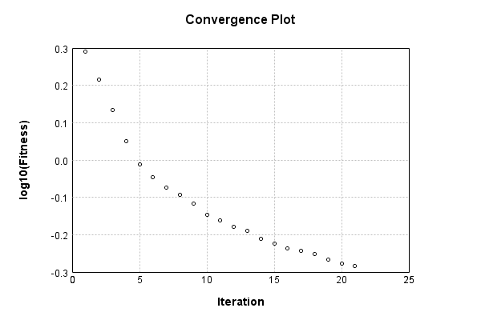

### Model
This is a very simple model that performs basic logistic regression. It is expected to be trainable to about 91% accuracy on MNIST.

Code from [MnistTestBase.java:293](../../../../../../../src/test/java/com/simiacryptus/mindseye/opt/MnistTestBase.java#L293) executed in 0.00 seconds: 
```java
    PipelineNetwork network = new PipelineNetwork();
    network.add(new BiasLayer(28, 28, 1));
    network.add(new FullyConnectedLayer(new int[]{28, 28, 1}, new int[]{10})
      .setWeights(() -> 0.001 * (Math.random() - 0.45)));
    network.add(new SoftmaxActivationLayer());
    return network;
```

Returns: 

```
    PipelineNetwork/a8dff0d7-60d3-46f8-9da1-558839a61206
```


### Training
Code from [OWLQNTest.java:42](../../../../../../../src/test/java/com/simiacryptus/mindseye/opt/orient/OWLQNTest.java#L42) executed in 306.66 seconds: 
```java
    SimpleLossNetwork supervisedNetwork = new SimpleLossNetwork(network, new EntropyLossLayer());
    Trainable trainable = new SampledArrayTrainable(trainingData, supervisedNetwork, 10000);
    return new IterativeTrainer(trainable)
      .setIterationsPerSample(100)
      .setMonitor(monitor)
      .setOrientation(new ValidatingOrientationWrapper(new OwlQn()))
      .setTimeout(5, TimeUnit.MINUTES)
      .setMaxIterations(500)
      .run();
```
Logging: 
```
    LBFGS Accumulation History: 1 points
    Constructing line search parameters: OWL/QN
    -434634.8900906275 vs (-434372.3964789285, -435261.5375622658); probe=0.001
    -434234.769980089 vs (-434372.3964789285, -434461.313493675); probe=1.0E-4
    -434190.7557187982 vs (-434372.3964789285, -434373.285651094); probe=1.0E-6
    th(0)=2.639252152979382;dx=-434372.3964789285
    0.0 vs (3.44953573034317E-71, 0.0); probe=0.001
    0.0 vs (3.44953573034317E-71, 0.0); probe=1.0E-4
    0.0 vs (3.44953573034317E-71, 0.0); probe=1.0E-6
    Armijo: th(2.154434690031884)=19.825257650678733; dx=3.44953573034317E-71 delta=-17.18600549769935
    0.0 vs (6.2436416227547555E-31, 0.0); probe=0.001
    0.0 vs (6.2436416227547555E-31, 0.0); probe=1.0E-4
    0.0 vs (6.2436416227547555E-31, 0.0); probe=1.0E-6
    Armijo: th(1.077217345015942)=19.825257650678733; dx=6.2436416227547555E-31 delta=-17.18600549769935
    0.0 vs (4.30417096401731E-4, 0.0); probe=0.001
    0.0 vs (4.30417096401731E-4, 0.0); probe=1.0E-4
    0.0 vs (4.30417096401731E-4, 1.552908109439199E-7); probe=1.0
```
...[skipping 26256 bytes](etc/165.txt)...
```
    .0E-4
    20314.068866213027 vs (20314.649675150547, 20314.776276725464); probe=1.0E-6
    Armijo: th(1.2305187267797779E-5)=0.5597555541450158; dx=20314.649675150547 delta=-0.031081250485006207
    5696.164937617661 vs (5449.22308020619, 5944.64235689011); probe=0.001
    5473.116675173362 vs (5449.22308020619, 5498.844451941354); probe=1.0E-4
    5448.552235833699 vs (5449.22308020619, 5449.719381515963); probe=1.0E-6
    New Minimum: 0.5286743036600096 > 0.519702775586946
    WOLF (strong): th(6.1525936338988894E-6)=0.519702775586946; dx=5449.22308020619 delta=0.008971528073063562
    -5972.5855806413565 vs (-5712.392006356216, -6230.7493841717205); probe=0.001
    -5739.44097134995 vs (-5712.392006356216, -5764.111378259259); probe=1.0E-4
    -5713.8395785619705 vs (-5712.392006356216, -5712.909111488184); probe=1.0E-6
    END: th(2.050864544632963E-6)=0.519788277079523; dx=-5712.392006356216 delta=0.008886026580486539
    Iteration 21 complete. Error: 0.519702775586946 Total: 61139490613244.4450; Orientation: 0.0014; Line Search: 16.9364
    
```

Returns: 

```
    0.519702775586946
```


Code from [MnistTestBase.java:139](../../../../../../../src/test/java/com/simiacryptus/mindseye/opt/MnistTestBase.java#L139) executed in 0.00 seconds: 
```java
    PlotCanvas plot = ScatterPlot.plot(history.stream().map(step -> new double[]{step.iteration, Math.log10(step.point.getMean())}).toArray(i -> new double[i][]));
    plot.setTitle("Convergence Plot");
    plot.setAxisLabels("Iteration", "log10(Fitness)");
    plot.setSize(600, 400);
    return plot;
```

Returns: 




Saved model as [model0.json](etc/model0.json)

### Metrics
Code from [MnistTestBase.java:152](../../../../../../../src/test/java/com/simiacryptus/mindseye/opt/MnistTestBase.java#L152) executed in 0.62 seconds: 
```java
    try {
      ByteArrayOutputStream out = new ByteArrayOutputStream();
      JsonUtil.writeJson(out, monitoringRoot.getMetrics());
      return out.toString();
    } catch (IOException e) {
      throw new RuntimeException(e);
    }
```

Returns: 

```
    [ "java.util.HashMap", {
      "BiasLayer/ddab0f27-9b27-4b15-81dc-233c191f8666" : [ "java.util.HashMap", {
        "avgMsPerItem" : 0.021480807167518247,
        "medianMsPerItem" : "NaN",
        "avgMsPerItem_Backward" : 2.7363132646715317E-6,
        "totalItems" : 2740000,
        "backpropStatistics" : [ "java.util.HashMap", {
          "meanExponent" : -4.409617947817639,
          "tp50" : -9.425657535363545E-4,
          "negative" : 1940175,
          "min" : -7.517710883753729E-4,
          "max" : 7.498715458753106E-4,
          "tp90" : -8.49442412705809E-4,
          "mean" : 2.8926134467470784E-7,
          "count" : 3920000.0,
          "positive" : 1979825,
          "stdDev" : 1.6365387303661402E-4,
          "tp75" : -8.770697223055954E-4,
          "zeros" : 0
        } ],
        "totalBatches" : 548,
        "weights" : [ "java.util.HashMap", {
          "tp50" : "NaN",
          "buffers" : 1,
          "max" : 0.0,
          "tp90" : "NaN",
          "count" : 784.0,
          "positive" : 0,
          "tp75" : "NaN",
          "zeros" : 784,
          "meanExponent" : "NaN"
```
...[skipping 2634 bytes](etc/166.txt)...
```
    s" : [ "java.util.HashMap", {
          "meanExponent" : 0.2265695581274317,
          "tp50" : -1.2805091885215303,
          "negative" : 5000,
          "min" : -115.42592612926684,
          "max" : 0.0,
          "tp90" : -1.039056809959614,
          "mean" : -0.30018170669586275,
          "count" : 50000.0,
          "positive" : 0,
          "stdDev" : 4.213849073113703,
          "tp75" : -1.0965847323861406,
          "zeros" : 45000
        } ],
        "totalBatches" : 548,
        "class" : "com.simiacryptus.mindseye.layers.java.SoftmaxActivationLayer",
        "outputStatistics" : [ "java.util.HashMap", {
          "meanExponent" : -2.004423951451445,
          "tp50" : 1.460908495171829E-4,
          "negative" : 0,
          "min" : 2.723030258850206E-7,
          "max" : 0.9281519021979953,
          "tp90" : 3.51913594757985E-4,
          "mean" : 0.1,
          "count" : 50000.0,
          "positive" : 50000,
          "stdDev" : 0.2261500582326016,
          "tp75" : 2.723090260681021E-4,
          "zeros" : 0
        } ],
        "medianMsPerItem_Backward" : "NaN"
      } ]
    } ]
```


### Validation
If we run our model against the entire validation dataset, we get this accuracy:

Code from [MnistTestBase.java:209](../../../../../../../src/test/java/com/simiacryptus/mindseye/opt/MnistTestBase.java#L209) executed in 0.74 seconds: 
```java
    return MNIST.validationDataStream().mapToDouble(labeledObject ->
      predict(network, labeledObject)[0] == parse(labeledObject.label) ? 1 : 0)
      .average().getAsDouble() * 100;
```

Returns: 

```
    87.28
```


Let's examine some incorrectly predicted results in more detail:

Code from [MnistTestBase.java:216](../../../../../../../src/test/java/com/simiacryptus/mindseye/opt/MnistTestBase.java#L216) executed in 0.03 seconds: 
```java
    try {
      TableOutput table = new TableOutput();
      MNIST.validationDataStream().map(labeledObject -> {
        try {
          int actualCategory = parse(labeledObject.label);
          double[] predictionSignal = GpuController.call(ctx -> network.eval(ctx, labeledObject.data).getData().get(0).getData());
          int[] predictionList = IntStream.range(0, 10).mapToObj(x -> x).sorted(Comparator.comparing(i -> -predictionSignal[i])).mapToInt(x -> x).toArray();
          if (predictionList[0] == actualCategory) return null; // We will only examine mispredicted rows
          LinkedHashMap<String, Object> row = new LinkedHashMap<String, Object>();
          row.put("Image", log.image(labeledObject.data.toGrayImage(), labeledObject.label));
          row.put("Prediction", Arrays.stream(predictionList).limit(3)
            .mapToObj(i -> String.format("%d (%.1f%%)", i, 100.0 * predictionSignal[i]))
            .reduce((a, b) -> a + ", " + b).get());
          return row;
        } catch (IOException e) {
          throw new RuntimeException(e);
        }
      }).filter(x -> null != x).limit(10).forEach(table::putRow);
      return table;
    } catch (IOException e) {
      throw new RuntimeException(e);
    }
```

Returns: 

Image | Prediction
----- | ----------
![[5]](etc/test.753.png) | 2 (40.9%), 6 (23.6%), 5 (8.2%) 
![[9]](etc/test.754.png) | 7 (53.0%), 9 (32.0%), 4 (5.7%) 
![[4]](etc/test.755.png) | 6 (40.0%), 0 (33.0%), 2 (10.0%)
![[2]](etc/test.756.png) | 3 (33.9%), 2 (21.4%), 8 (12.7%)
![[1]](etc/test.757.png) | 3 (42.3%), 1 (16.8%), 5 (13.3%)
![[5]](etc/test.758.png) | 3 (35.4%), 5 (27.0%), 8 (15.1%)
![[6]](etc/test.759.png) | 2 (55.1%), 6 (18.8%), 4 (7.5%) 
![[9]](etc/test.760.png) | 4 (28.2%), 9 (24.8%), 8 (17.1%)
![[3]](etc/test.761.png) | 2 (57.5%), 3 (16.2%), 8 (9.4%) 
![[6]](etc/test.762.png) | 2 (30.7%), 6 (19.8%), 0 (17.2%)


