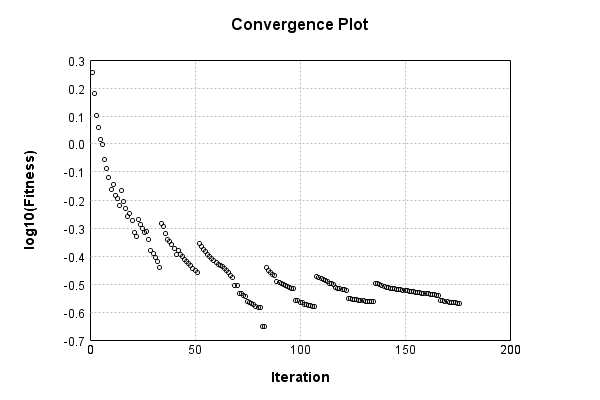

Code from [QQNTest.java:44](../../../../../../../../MindsEye/src/test/java/com/simiacryptus/mindseye/opt/orient/QQNTest.java#L44) executed in 0.01 seconds: 
```java
    PipelineNetwork network = new PipelineNetwork();
    network.add(new BiasLayer(28, 28, 1));
    network.add(new LinearActivationLayer().setScale(1.0 / 1000));
    network.add(new FullyConnectedLayer(new int[]{28, 28, 1}, new int[]{100}));
    network.add(new SinewaveActivationLayer());
    network.add(new FullyConnectedLayer(new int[]{100}, new int[]{10}));
    network.add(new LinearActivationLayer());
    network.add(new SoftmaxActivationLayer());
    return network;
```

Returns: 

```
    PipelineNetwork/e1035fb9-1fe3-4846-a360-622900000040
```


### Training
Code from [QQNTest.java:59](../../../../../../../../MindsEye/src/test/java/com/simiacryptus/mindseye/opt/orient/QQNTest.java#L59) executed in 940.69 seconds: 
```java
    SimpleLossNetwork supervisedNetwork = new SimpleLossNetwork(network, new EntropyLossLayer());
    //return new IterativeTrainer(new SampledArrayTrainable(trainingData, supervisedNetwork, 10000))
    return new ValidatingTrainer(
      new SampledArrayTrainable(trainingData, supervisedNetwork, 1000, 10000),
      new ArrayTrainable(trainingData, supervisedNetwork)
    )
      .setMonitor(monitor)
      //.setOrientation(new ValidatingOrientationWrapper(new QQN()))
      .setOrientation(new QQN())
      //.setLineSearchFactory(name->name.contains("QQN") ? new QuadraticSearch().setCurrentRate(1.0) : new QuadraticSearch().setCurrentRate(1e-6))
      .setTimeout(30, TimeUnit.MINUTES)
      .setMaxIterations(500)
      .run();
```
Logging: 
```
    Epoch parameters: 1000, 1
    Phase 0: TrainingPhase{trainingSubject=SampledCachedTrainable{inner=PerformanceWrapper{inner=SampledArrayTrainable{inner=ArrayTrainable{inner=com.simiacryptus.mindseye.eval.GpuTrainable@6236d83a}}}}, orientation=com.simiacryptus.mindseye.opt.orient.QQN@34dd9ae1}
    resetAndMeasure; trainingSize=1000
    LBFGS Accumulation History: 1 points
    Constructing line search parameters: GD
    Returning cached value; 5 buffers unchanged since 0.0 => 2.329937376024546
    th(0)=2.329937376024546;dx=-4869.433564821166
    Armijo: th(2.154434690031884)=2.585637626392055; dx=-109.1112033091666 delta=-0.255700250367509
    Armijo: th(1.077217345015942)=2.6179915648877774; dx=208.18069672409615 delta=-0.28805418886323153
    Armijo: th(0.3590724483386473)=2.6434910723932594; dx=240.82007837633188 delta=-0.31355369636871355
    Armijo: th(0.08976811208466183)=2.6665750903817633; dx=-126.9800281945376 delta=-0.33663771435721745
    Armijo: th(0.017953622416932366)=2.6798329943131765; dx=-207.76101145145105 delta=-0.3498956182886306
    Armijo: th(0.002992270402822061)=2.666639851006286; dx=468.24243898244987 delta=-0.33670247498174
    Armijo: th(4.2746720040315154E-4)=2.660903895015965; dx=-168.47937796616887 delta=-0.33096651899141927
    New Minimum: 2.329937376024546 > 2.302739399867427
    WOLF (strong): th(5.343340005039394E-5)=2.302739399867427; dx=2245.5312188965886 delta=0.02719797615711883
    END: th(5.9370444500437714E-6)=2.316746509735334; dx=-4009.110667660407 delta=0.013190866289211733
    Returning cached value; 5 buffers unchanged since 0.0 => 2.302739399867427
    Overall network state change: {FullyConnectedLayer=1.0000e+00 +- 9.1857e-08 [1.0000e+00 - 1.0000e+00] (2#), BiasLayer=0.0, LinearActivationLayer=6.8326e-01 +- 3.1674e-01 [3.6651e-01 - 1.0000e+00] (2#)}
    Iteration 1 complete. Error: 2.302739399867427 (1000 in 5.986 seconds; 0.010 in orientation, 0.684 in gc, 5.964 in line search; 7.108 eval time)
    Epoch 1 result with 2 iterations, 1000/1000000 samples: {validation *= 2^-0.01161; training *= 2^-0.017; Overtraining = 1.46}, {
```
...[skipping 592592 bytes](etc/1.txt)...
```
     element from 0.6708342657308282, 0.6673581855032226, 0.667050974242432, 0.6668640831204731, 0.6666799748687777, 0.6659713780946905, 0.6633349094145249
    Orientation vanished. Popping history element from 0.6708342657308282, 0.6673581855032226, 0.667050974242432, 0.6668640831204731, 0.6666799748687777, 0.6659713780946905
    Orientation vanished. Popping history element from 0.6708342657308282, 0.6673581855032226, 0.667050974242432, 0.6668640831204731, 0.6666799748687777
    Orientation vanished. Popping history element from 0.6708342657308282, 0.6673581855032226, 0.667050974242432, 0.6668640831204731
    LBFGS Accumulation History: 3 points
    Returning cached value; 5 buffers unchanged since 0.001492134537691723 => 0.6633349094145249
    th(0)=0.6633349094145249;dx=-107.03123195453662
    Armijo: th(0.0032147064101977355)=2.6721584179963846; dx=-64.25688322638439 delta=-2.0088235085818598
    Armijo: th(0.0016073532050988677)=2.362075520841929; dx=1684.4118470197134 delta=-1.6987406114274042
    Armijo: th(5.357844016996225E-4)=0.9229364359451552; dx=2299.030205603882 delta=-0.2596015265306303
    Armijo: th(1.3394610042490564E-4)=0.6713675575890624; dx=349.46918500070313 delta=-0.008032648174537527
    New Minimum: 0.6633349094145249 > 0.6625139734676424
    END: th(2.6789220084981127E-5)=0.6625139734676424; dx=-16.033772967165014 delta=8.20935946882484E-4
    Returning cached value; 5 buffers unchanged since 0.0 => 0.6625139734676424
    Overall network state change: {FullyConnectedLayer=1.0000e+00 +- 5.1834e-07 [1.0000e+00 - 1.0000e+00] (2#), BiasLayer=0.9999359299775725, LinearActivationLayer=9.9998e-01 +- 1.4386e-06 [9.9998e-01 - 9.9998e-01] (2#)}
    Iteration 501 complete. Error: 0.6625139734676424 (224 in 1.731 seconds; 0.035 in orientation, 0.232 in gc, 1.694 in line search; 1.637 eval time)
    Training iteration overflow
    Epoch 14 result with 10 iterations, 224/1000000 samples: {validation *= 2^-0.00899; training *= 2^-0.023; Overtraining = 2.54}, {itr*=4.11, len*=1.13} 0 since improvement; 29.4018 validation time
    Training 14 runPhase halted
    
```

Returns: 

```
    0.8283011150006224
```


Code from [MnistTestBase.java:131](../../../../../../../../MindsEye/src/test/java/com/simiacryptus/mindseye/mnist/MnistTestBase.java#L131) executed in 0.01 seconds: 
```java
    PlotCanvas plot = ScatterPlot.plot(history.stream().map(step -> new double[]{step.iteration, Math.log10(step.point.getMean())}).toArray(i -> new double[i][]));
    plot.setTitle("Convergence Plot");
    plot.setAxisLabels("Iteration", "log10(Fitness)");
    plot.setSize(600, 400);
    return plot;
```

Returns: 




Saved model as [model0.json](etc/model0.json)

### Metrics
Code from [MnistTestBase.java:144](../../../../../../../../MindsEye/src/test/java/com/simiacryptus/mindseye/mnist/MnistTestBase.java#L144) executed in 11.77 seconds: 
```java
    try {
      ByteArrayOutputStream out = new ByteArrayOutputStream();
      JsonUtil.writeJson(out, monitoringRoot.getMetrics());
      return out.toString();
    } catch (IOException e) {
      throw new RuntimeException(e);
    }
```

Returns: 

```
    [ "java.util.HashMap", {
      "LinearActivationLayer/e1035fb9-1fe3-4846-a360-622900000046" : [ "java.util.HashMap", {
        "avgMsPerItem" : 0.0010674639634480646,
        "medianMsPerItem" : "NaN",
        "avgMsPerItem_Backward" : 8.501933753971793E-6,
        "totalItems" : 1231125,
        "backpropStatistics" : [ "java.util.HashMap", {
          "meanExponent" : -6.212735037899251,
          "tp50" : -1.3611451658543918E-5,
          "negative" : 30000,
          "min" : -3.3321469539953605E-5,
          "max" : 2.6897737862013412E-5,
          "tp90" : -1.966341354244237E-6,
          "mean" : -1.574228792582158E-24,
          "count" : 300000.0,
          "positive" : 270000,
          "stdDev" : 6.41305051791847E-6,
          "tp75" : -6.224793820175085E-6,
          "zeros" : 0
        } ],
        "totalBatches" : 2588,
        "weights" : [ "java.util.HashMap", {
          "tp50" : "NaN",
          "buffers" : 1,
          "max" : 1.1090385278374295,
          "tp90" : "NaN",
          "count" : 2.0,
          "positive" : 1,
          "tp75" : "NaN",
          "zeros" : 0,
          "meanExponent" : -8.337879969621897,
          "negative" : 1,
          "min" : -1.9023631597488697E-17,
          "mean" : 0.5545192639187148,
          "stdDev" : 0.5545192639187148
        } ],
        "class" : "com.simiacryptus.mindseye.layers.java.LinearActivationLayer",
        "outputStatistics" : [ "java.util.HashMap", {
          "meanExponent" : -0.04549982976586316,
          "tp50" : -2.742420324969164,
          "negative" : 154899,
          "min" : -4.896724821605829,
          "max" : 5.100430920531562,
          "tp90" : -2.285114532980314,
          "mean" : 0.04077742589625818,
          "count" : 300000.0,
          "positive" : 145101,
          "stdDev" : 1.8339956667290882,
          "tp75" : -2.4379475304038327,
          "zeros" : 0
        } ],
        "medianMsPerItem_Backward" : "NaN"
      } ],
      "LinearActivationLayer/e1035fb9-1fe3-4846-a360-622900000042" : [ "java.util.HashMap", {
        "avgMsPerItem" : 0.033739146970453826,
        "medianMsPerItem" : "NaN",
        "avgMsPerItem_Backward" : 7.0442876901677E-5,
        "totalItems" : 1231125,
        
```
...[skipping 7499 bytes](etc/2.txt)...
```
    1006E-5,
          "mean" : -7.096095078936938E-7,
          "stdDev" : 1.1392191030532402E-5
        } ],
        "class" : "com.simiacryptus.mindseye.layers.java.BiasLayer",
        "outputStatistics" : [ "java.util.HashMap", {
          "meanExponent" : -3.8093324496303205,
          "tp50" : -3.815676338528777E-5,
          "negative" : 9746684,
          "min" : 5.541218897811875E-7,
          "max" : 5.541218897811875E-7,
          "tp90" : -3.815676338528777E-5,
          "mean" : 33.05147730908749,
          "count" : 2.352E7,
          "positive" : 13773316,
          "stdDev" : 78.2128347851988,
          "tp75" : -3.815676338528777E-5,
          "zeros" : 0
        } ],
        "medianMsPerItem_Backward" : "NaN"
      } ],
      "SinewaveActivationLayer/e1035fb9-1fe3-4846-a360-622900000044" : [ "java.util.HashMap", {
        "avgMsPerItem" : 0.003007641730124887,
        "medianMsPerItem" : "NaN",
        "avgMsPerItem_Backward" : 7.140727999495775E-6,
        "totalItems" : 1231125,
        "backpropStatistics" : [ "java.util.HashMap", {
          "meanExponent" : -6.018938945422242,
          "tp50" : -9.41055790247063E-6,
          "negative" : 1487288,
          "min" : -1.550793010083403E-5,
          "max" : 1.4925935874333029E-5,
          "tp90" : -8.508392697829564E-6,
          "mean" : -7.539052137006825E-9,
          "count" : 3000000.0,
          "positive" : 1512712,
          "stdDev" : 2.952295028302938E-6,
          "tp75" : -8.794377139177532E-6,
          "zeros" : 0
        } ],
        "totalBatches" : 2588,
        "class" : "com.simiacryptus.mindseye.layers.java.SinewaveActivationLayer",
        "outputStatistics" : [ "java.util.HashMap", {
          "meanExponent" : -0.37326579557382744,
          "tp50" : -0.9997327139327986,
          "negative" : 1510171,
          "min" : -0.9999999984357908,
          "max" : 0.9999990766380878,
          "tp90" : -0.9991296366710987,
          "mean" : -0.005782135981359706,
          "count" : 3000000.0,
          "positive" : 1489829,
          "stdDev" : 0.6458407588476002,
          "tp75" : -0.9993953417924132,
          "zeros" : 0
        } ],
        "medianMsPerItem_Backward" : "NaN"
      } ]
    } ]
```


### Validation
If we run our model against the entire validation dataset, we get this accuracy:

Code from [MnistTestBase.java:201](../../../../../../../../MindsEye/src/test/java/com/simiacryptus/mindseye/mnist/MnistTestBase.java#L201) executed in 2.45 seconds: 
```java
    return MNIST.validationDataStream().mapToDouble(labeledObject ->
      predict(network, labeledObject)[0] == parse(labeledObject.label) ? 1 : 0)
      .average().getAsDouble() * 100;
```

Returns: 

```
    75.56
```


Let's examine some incorrectly predicted results in more detail:

Code from [MnistTestBase.java:208](../../../../../../../../MindsEye/src/test/java/com/simiacryptus/mindseye/mnist/MnistTestBase.java#L208) executed in 0.25 seconds: 
```java
    try {
      TableOutput table = new TableOutput();
      MNIST.validationDataStream().map(labeledObject -> {
        try {
          int actualCategory = parse(labeledObject.label);
          double[] predictionSignal = CudaExecutionContext.gpuContexts.run(ctx -> network.eval(ctx, labeledObject.data).getData().get(0).getData());
          int[] predictionList = IntStream.range(0, 10).mapToObj(x -> x).sorted(Comparator.comparing(i -> -predictionSignal[i])).mapToInt(x -> x).toArray();
          if (predictionList[0] == actualCategory) return null; // We will only examine mispredicted rows
          LinkedHashMap<String, Object> row = new LinkedHashMap<String, Object>();
          row.put("Image", log.image(labeledObject.data.toGrayImage(), labeledObject.label));
          row.put("Prediction", Arrays.stream(predictionList).limit(3)
            .mapToObj(i -> String.format("%d (%.1f%%)", i, 100.0 * predictionSignal[i]))
            .reduce((a, b) -> a + ", " + b).get());
          return row;
        } catch (IOException e) {
          throw new RuntimeException(e);
        }
      }).filter(x -> null != x).limit(10).forEach(table::putRow);
      return table;
    } catch (IOException e) {
      throw new RuntimeException(e);
    }
```

Returns: 

Image | Prediction
----- | ----------
![[5]](etc/test.2.png)  | 4 (25.7%), 8 (16.8%), 6 (14.3%)
![[9]](etc/test.3.png)  | 7 (34.9%), 9 (33.9%), 4 (16.8%)
![[6]](etc/test.4.png)  | 4 (39.2%), 6 (19.9%), 3 (15.2%)
![[3]](etc/test.5.png)  | 8 (20.8%), 2 (16.7%), 6 (16.6%)
![[6]](etc/test.6.png)  | 4 (34.9%), 2 (27.0%), 6 (20.7%)
![[5]](etc/test.7.png)  | 8 (29.6%), 5 (25.5%), 6 (16.7%)
![[7]](etc/test.8.png)  | 9 (59.4%), 7 (30.9%), 4 (3.5%) 
![[4]](etc/test.9.png)  | 0 (43.1%), 6 (30.0%), 2 (16.7%)
![[7]](etc/test.10.png) | 8 (31.6%), 7 (25.3%), 2 (19.3%)
![[2]](etc/test.11.png) | 1 (61.5%), 2 (13.1%), 8 (8.2%) 


