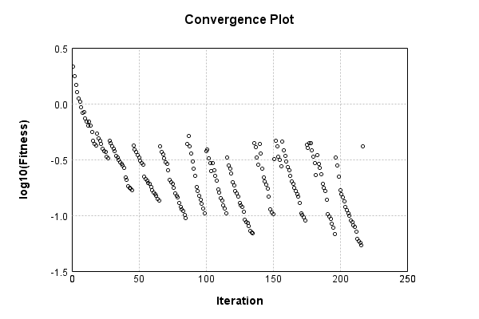

### Model
This is a very simple model that performs basic logistic regression. It is expected to be trainable to about 91% accuracy on MNIST.

Code from [MnistTestBase.java:293](../../../../../../../src/test/java/com/simiacryptus/mindseye/opt/MnistTestBase.java#L293) executed in 0.00 seconds: 
```java
    PipelineNetwork network = new PipelineNetwork();
    network.add(new BiasLayer(28, 28, 1));
    network.add(new FullyConnectedLayer(new int[]{28, 28, 1}, new int[]{10})
      .setWeights(() -> 0.001 * (Math.random() - 0.45)));
    network.add(new SoftmaxActivationLayer());
    return network;
```

Returns: 

```
    PipelineNetwork/013a254a-ed71-4559-a283-7ea8fe223b36
```


### Training
Code from [QQNTest.java:42](../../../../../../../src/test/java/com/simiacryptus/mindseye/opt/orient/QQNTest.java#L42) executed in 305.96 seconds: 
```java
    SimpleLossNetwork supervisedNetwork = new SimpleLossNetwork(network, new EntropyLossLayer());
    //return new IterativeTrainer(new SampledArrayTrainable(trainingData, supervisedNetwork, 10000))
    return new ValidatingTrainer(
      new SampledArrayTrainable(trainingData, supervisedNetwork, 1000, 10000),
      new ArrayTrainable(trainingData, supervisedNetwork)
    )
      .setMonitor(monitor)
      .setOrientation(new QQN())
      .setTimeout(5, TimeUnit.MINUTES)
      .setMaxIterations(500)
      .run();
```
Logging: 
```
    Epoch parameters: 1000, 1
    Phase 0: TrainingPhase{trainingSubject=PerformanceWrapper{inner=SampledArrayTrainable{inner=ArrayTrainable{inner=com.simiacryptus.mindseye.eval.GpuTrainable@54999b12}}}, orientation=com.simiacryptus.mindseye.opt.orient.QQN@70b64f33}
    resetAndMeasure; trainingSize=1000
    LBFGS Accumulation History: 1 points
    Constructing line search parameters: GD
    th(0)=2.6026072159084803;dx=-457162.3689469498
    Armijo: th(2.154434690031884)=18.319366999860627; dx=1.110213079617484E-78 delta=-15.716759783952146
    Armijo: th(1.077217345015942)=18.319366999860627; dx=3.565264751215995E-34 delta=-15.716759783952146
    Armijo: th(0.3590724483386473)=18.319366999860627; dx=1.6961578210348112E-4 delta=-15.716759783952146
    Armijo: th(0.08976811208466183)=18.30076167504874; dx=0.19081938491405687 delta=-15.698154459140259
    Armijo: th(0.017953622416932366)=18.254929963333815; dx=5.025133166558643 delta=-15.652322747425334
    Armijo: th(0.002992270402822061)=18.07069008757184; dx=148.4151459860197 delta=-15.46808287
```
...[skipping 173969 bytes](etc/167.txt)...
```
    rientation=com.simiacryptus.mindseye.opt.orient.QQN@70b64f33}
    resetAndMeasure; trainingSize=244
    LBFGS Accumulation History: 1 points
    th(0)=0.531364499967343;dx=-30145.100673228295
    Armijo: th(8.468749814172843E-5)=2.380093321894371; dx=111625.59635473853 delta=-1.8487288219270281
    Armijo: th(4.234374907086421E-5)=0.6739934487900973; dx=45414.526793490026 delta=-0.14262894882275423
    New Minimum: 0.531364499967343 > 0.4133945008551424
    END: th(1.4114583023621405E-5)=0.4133945008551424; dx=-2712.8614559571156 delta=0.11796999911220063
    Overall network state change: {FullyConnectedLayer=1.001060885035382, BiasLayer=1.0116863348492502}
    Iteration 217 complete. Error: 0.4133945008551424 (244 in 0.087 seconds; 0.001 in orientation, 0.000 in gc, 0.085 in line search; 0.106 eval time)
    Epoch 32 result with 2 iterations, 244/2147483647 samples: {validation *= 2^0.06445; training *= 2^-0.362; Overtraining = -5.62}, {itr*=NaN, len*=NaN} 117 since improvement; 7.7041 validation time
    Training timeout
    Training halted
    
```

Returns: 

```
    0.5117753336487474
```


Code from [MnistTestBase.java:139](../../../../../../../src/test/java/com/simiacryptus/mindseye/opt/MnistTestBase.java#L139) executed in 0.00 seconds: 
```java
    PlotCanvas plot = ScatterPlot.plot(history.stream().map(step -> new double[]{step.iteration, Math.log10(step.point.getMean())}).toArray(i -> new double[i][]));
    plot.setTitle("Convergence Plot");
    plot.setAxisLabels("Iteration", "log10(Fitness)");
    plot.setSize(600, 400);
    return plot;
```

Returns: 




Saved model as [model0.json](etc/model0.json)

### Metrics
Code from [MnistTestBase.java:152](../../../../../../../src/test/java/com/simiacryptus/mindseye/opt/MnistTestBase.java#L152) executed in 4.40 seconds: 
```java
    try {
      ByteArrayOutputStream out = new ByteArrayOutputStream();
      JsonUtil.writeJson(out, monitoringRoot.getMetrics());
      return out.toString();
    } catch (IOException e) {
      throw new RuntimeException(e);
    }
```

Returns: 

```
    [ "java.util.HashMap", {
      "SoftmaxActivationLayer/6fa8047b-d97f-4342-80d7-73bcf90c5424" : [ "java.util.HashMap", {
        "avgMsPerItem" : 0.003089079219148939,
        "medianMsPerItem" : "NaN",
        "avgMsPerItem_Backward" : 3.421428340962329E-7,
        "totalItems" : 2185103,
        "backpropStatistics" : [ "java.util.HashMap", {
          "meanExponent" : 0.22149731329138325,
          "tp50" : -1.017239750542686,
          "negative" : 30000,
          "min" : -284856.18001119717,
          "max" : 0.0,
          "tp90" : -1.0002167905164845,
          "mean" : -400.8206515462354,
          "count" : 300000.0,
          "positive" : 0,
          "stdDev" : 120603.2037783258,
          "tp75" : -1.0017710884644988,
          "zeros" : 270000
        } ],
        "totalBatches" : 1424,
        "class" : "com.simiacryptus.mindseye.layers.java.SoftmaxActivationLayer",
        "outputStatistics" : [ "java.util.HashMap", {
          "meanExponent" : -4.231305446920356,
          "tp50" : 1.7377469038083904E-9,
          "negative" : 0,
          "min" : 6.667795771356266E-17,
```
...[skipping 2828 bytes](etc/168.txt)...
```
    
        "weights" : [ "java.util.HashMap", {
          "tp50" : "NaN",
          "buffers" : 1,
          "max" : 0.003929759239314176,
          "tp90" : "NaN",
          "count" : 7840.0,
          "positive" : 4131,
          "tp75" : "NaN",
          "zeros" : 0,
          "meanExponent" : -3.541206996381301,
          "negative" : 3709,
          "min" : -0.002771726909267315,
          "mean" : 4.923578085746141E-5,
          "stdDev" : 6.294263870738865E-4
        } ],
        "class" : "com.simiacryptus.mindseye.layers.java.FullyConnectedLayer",
        "outputStatistics" : [ "java.util.HashMap", {
          "meanExponent" : 0.40213942123011776,
          "tp50" : -6.5752950743135985,
          "negative" : 126298,
          "min" : -12.092269649281677,
          "max" : 18.737163378390687,
          "tp90" : -5.152745790923451,
          "mean" : 1.2504450303644892,
          "count" : 300000.0,
          "positive" : 173702,
          "stdDev" : 5.139326481863922,
          "tp75" : -5.616816679033856,
          "zeros" : 0
        } ],
        "medianMsPerItem_Backward" : "NaN"
      } ]
    } ]
```


### Validation
If we run our model against the entire validation dataset, we get this accuracy:

Code from [MnistTestBase.java:209](../../../../../../../src/test/java/com/simiacryptus/mindseye/opt/MnistTestBase.java#L209) executed in 0.86 seconds: 
```java
    return MNIST.validationDataStream().mapToDouble(labeledObject ->
      predict(network, labeledObject)[0] == parse(labeledObject.label) ? 1 : 0)
      .average().getAsDouble() * 100;
```

Returns: 

```
    85.85000000000001
```


Let's examine some incorrectly predicted results in more detail:

Code from [MnistTestBase.java:216](../../../../../../../src/test/java/com/simiacryptus/mindseye/opt/MnistTestBase.java#L216) executed in 0.04 seconds: 
```java
    try {
      TableOutput table = new TableOutput();
      MNIST.validationDataStream().map(labeledObject -> {
        try {
          int actualCategory = parse(labeledObject.label);
          double[] predictionSignal = GpuController.call(ctx -> network.eval(ctx, labeledObject.data).getData().get(0).getData());
          int[] predictionList = IntStream.range(0, 10).mapToObj(x -> x).sorted(Comparator.comparing(i -> -predictionSignal[i])).mapToInt(x -> x).toArray();
          if (predictionList[0] == actualCategory) return null; // We will only examine mispredicted rows
          LinkedHashMap<String, Object> row = new LinkedHashMap<String, Object>();
          row.put("Image", log.image(labeledObject.data.toGrayImage(), labeledObject.label));
          row.put("Prediction", Arrays.stream(predictionList).limit(3)
            .mapToObj(i -> String.format("%d (%.1f%%)", i, 100.0 * predictionSignal[i]))
            .reduce((a, b) -> a + ", " + b).get());
          return row;
        } catch (IOException e) {
          throw new RuntimeException(e);
        }
      }).filter(x -> null != x).limit(10).forEach(table::putRow);
      return table;
    } catch (IOException e) {
      throw new RuntimeException(e);
    }
```

Returns: 

Image | Prediction
----- | ----------
![[5]](etc/test.764.png) | 6 (57.5%), 2 (31.0%), 4 (6.4%) 
![[6]](etc/test.765.png) | 8 (66.2%), 6 (23.1%), 2 (9.4%) 
![[5]](etc/test.766.png) | 8 (89.1%), 5 (8.8%), 3 (1.8%)  
![[3]](etc/test.767.png) | 8 (59.4%), 6 (18.4%), 3 (15.4%)
![[7]](etc/test.768.png) | 9 (80.5%), 7 (18.8%), 3 (0.6%) 
![[4]](etc/test.769.png) | 9 (63.5%), 4 (36.3%), 8 (0.1%) 
![[4]](etc/test.770.png) | 0 (64.2%), 6 (21.3%), 2 (7.5%) 
![[5]](etc/test.771.png) | 8 (95.2%), 3 (2.3%), 5 (2.1%)  
![[6]](etc/test.772.png) | 8 (59.1%), 2 (29.6%), 6 (11.1%)
![[7]](etc/test.773.png) | 3 (67.6%), 7 (32.3%), 9 (0.1%) 


