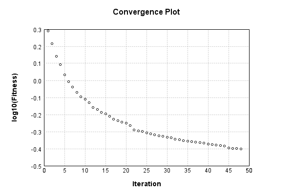

### Model
This is a very simple model that performs basic logistic regression. It is expected to be trainable to about 91% accuracy on MNIST.

Code from [MnistTestBase.java:293](../../../../../../../src/test/java/com/simiacryptus/mindseye/opt/MnistTestBase.java#L293) executed in 0.00 seconds: 
```java
    PipelineNetwork network = new PipelineNetwork();
    network.add(new BiasLayer(28, 28, 1));
    network.add(new FullyConnectedLayer(new int[]{28, 28, 1}, new int[]{10})
      .setWeights(() -> 0.001 * (Math.random() - 0.45)));
    network.add(new SoftmaxActivationLayer());
    return network;
```

Returns: 

```
    PipelineNetwork/726894bb-9adc-4470-ac29-28e6a3328ac0
```


### Training
Code from [LinearSumConstraintTest.java:43](../../../../../../../src/test/java/com/simiacryptus/mindseye/opt/region/LinearSumConstraintTest.java#L43) executed in 181.82 seconds: 
```java
    SimpleLossNetwork supervisedNetwork = new SimpleLossNetwork(network, new EntropyLossLayer());
    Trainable trainable = new SampledArrayTrainable(trainingData, supervisedNetwork, 10000);
    TrustRegionStrategy trustRegionStrategy = new TrustRegionStrategy() {
      @Override
      public TrustRegion getRegionPolicy(NNLayer layer) {
        return new LinearSumConstraint();
      }
    };
    return new IterativeTrainer(trainable)
      .setIterationsPerSample(100)
      .setMonitor(monitor)
      //.setOrientation(new ValidatingOrientationWrapper(trustRegionStrategy))
      .setOrientation(trustRegionStrategy)
      .setTimeout(3, TimeUnit.MINUTES)
      .setMaxIterations(500)
      .run();
```
Logging: 
```
    LBFGS Accumulation History: 1 points
    Constructing line search parameters: GD+Trust
    th(0)=2.5789566942091997;dx=-401802.0289799008
    Armijo: th(2.154434690031884)=22.0025821146139; dx=0.0 delta=-19.4236254204047
    Armijo: th(1.077217345015942)=22.0025821146139; dx=1.5155001883020465E-303 delta=-19.4236254204047
    Armijo: th(0.3590724483386473)=22.0025821146139; dx=6.561025141710382E-101 delta=-19.4236254204047
    Armijo: th(0.08976811208466183)=22.005345216725495; dx=7.042401285694382E-25 delta=-19.426388522516294
    Armijo: th(0.017953622416932366)=22.00436260809594; dx=0.18565472340555172 delta=-19.42540591388674
    Armijo: th(0.002992270402822061)=21.992580346667353; dx=11.026665985042893 delta=-19.413623652458153
    Armijo: th(4.2746720040315154E-4)=21.608334105742898; dx=4369.533579770499 delta=-19.029377411533698
    Armijo: th(5.343340005039394E-5)=9.33605387068447; dx=357193.79909938056 delta=-6.75709717647527
    New Minimum: 2.5789566942091997 > 1.949014662848688
    END: th(5.9370444500437714E-6)=1.949014662848688; d
```
...[skipping 26458 bytes](etc/169.txt)...
```
    th(0)=0.40067856520892897;dx=-1561.4297304905547
    Armijo: th(2.656653543583602E-5)=0.425551117527409; dx=5226.80339520456 delta=-0.024872552318480012
    Armijo: th(1.328326771791801E-5)=0.40207972376259304; dx=1886.3439861939366 delta=-0.0014011585536640725
    New Minimum: 0.40067856520892897 > 0.3986745547964845
    END: th(4.42775590597267E-6)=0.3986745547964845; dx=-344.86338341061156 delta=0.002004010412444468
    Iteration 47 complete. Error: 0.3986745547964845 Total: 61632802557495.3750; Orientation: 0.0012; Line Search: 6.1749
    Orientation vanished. Popping history element from 0.41180556330708995, 0.40285064900346534, 0.40067856520892897, 0.3986745547964845
    LBFGS Accumulation History: 3 points
    th(0)=0.3986745547964845;dx=-568.3995690018997
    New Minimum: 0.3986745547964845 > 0.3965496243387001
    END: th(9.539310922821072E-6)=0.3965496243387001; dx=-426.0616417400914 delta=0.002124930457784391
    Iteration 48 complete. Error: 0.3965496243387001 Total: 61634743835412.1950; Orientation: 0.0012; Line Search: 1.9400
    
```

Returns: 

```
    0.3965496243387001
```


Code from [MnistTestBase.java:139](../../../../../../../src/test/java/com/simiacryptus/mindseye/opt/MnistTestBase.java#L139) executed in 0.00 seconds: 
```java
    PlotCanvas plot = ScatterPlot.plot(history.stream().map(step -> new double[]{step.iteration, Math.log10(step.point.getMean())}).toArray(i -> new double[i][]));
    plot.setTitle("Convergence Plot");
    plot.setAxisLabels("Iteration", "log10(Fitness)");
    plot.setSize(600, 400);
    return plot;
```

Returns: 




Saved model as [model0.json](etc/model0.json)

### Metrics
Code from [MnistTestBase.java:152](../../../../../../../src/test/java/com/simiacryptus/mindseye/opt/MnistTestBase.java#L152) executed in 0.66 seconds: 
```java
    try {
      ByteArrayOutputStream out = new ByteArrayOutputStream();
      JsonUtil.writeJson(out, monitoringRoot.getMetrics());
      return out.toString();
    } catch (IOException e) {
      throw new RuntimeException(e);
    }
```

Returns: 

```
    [ "java.util.HashMap", {
      "FullyConnectedLayer/fbea82c2-a42a-49f2-a8cd-dcc43abbec8a" : [ "java.util.HashMap", {
        "avgMsPerItem" : 0.011943892629655178,
        "medianMsPerItem" : "NaN",
        "avgMsPerItem_Backward" : 1.6825068687724144E-5,
        "totalItems" : 1450000,
        "backpropStatistics" : [ "java.util.HashMap", {
          "meanExponent" : -2.5493936456490682,
          "tp50" : -0.11728950175035949,
          "negative" : 5000,
          "min" : -0.9995399580879195,
          "max" : 0.8792516417711187,
          "tp90" : -0.012042758278776974,
          "mean" : -3.0941658680037136E-19,
          "count" : 50000.0,
          "positive" : 45000,
          "stdDev" : 0.13447429874397288,
          "tp75" : -0.037124857159242984,
          "zeros" : 0
        } ],
        "totalBatches" : 290,
        "weights" : [ "java.util.HashMap", {
          "tp50" : "NaN",
          "buffers" : 1,
          "max" : 0.0022293968156472657,
          "tp90" : "NaN",
          "count" : 7840.0,
          "positive" : 4257,
          "tp75" : "NaN",
          "zeros" : 0,
          "m
```
...[skipping 2820 bytes](etc/170.txt)...
```
    "java.util.HashMap", {
          "meanExponent" : 0.17963594311073294,
          "tp50" : -1.1328742571691819,
          "negative" : 5000,
          "min" : -2173.7149893100077,
          "max" : 0.0,
          "tp90" : -1.0121895541327235,
          "mean" : -0.5320168770548321,
          "count" : 50000.0,
          "positive" : 0,
          "stdDev" : 26.197099439261876,
          "tp75" : -1.0385562525268999,
          "zeros" : 45000
        } ],
        "totalBatches" : 290,
        "class" : "com.simiacryptus.mindseye.layers.java.SoftmaxActivationLayer",
        "outputStatistics" : [ "java.util.HashMap", {
          "meanExponent" : -2.466915776980964,
          "tp50" : 1.2110891960826774E-5,
          "negative" : 0,
          "min" : 1.8783646044466273E-8,
          "max" : 0.9791896554826475,
          "tp90" : 4.075646746185772E-5,
          "mean" : 0.1,
          "count" : 50000.0,
          "positive" : 50000,
          "stdDev" : 0.24748879109225919,
          "tp75" : 2.7923892761886966E-5,
          "zeros" : 0
        } ],
        "medianMsPerItem_Backward" : "NaN"
      } ]
    } ]
```


### Validation
If we run our model against the entire validation dataset, we get this accuracy:

Code from [MnistTestBase.java:209](../../../../../../../src/test/java/com/simiacryptus/mindseye/opt/MnistTestBase.java#L209) executed in 0.92 seconds: 
```java
    return MNIST.validationDataStream().mapToDouble(labeledObject ->
      predict(network, labeledObject)[0] == parse(labeledObject.label) ? 1 : 0)
      .average().getAsDouble() * 100;
```

Returns: 

```
    89.67
```


Let's examine some incorrectly predicted results in more detail:

Code from [MnistTestBase.java:216](../../../../../../../src/test/java/com/simiacryptus/mindseye/opt/MnistTestBase.java#L216) executed in 0.05 seconds: 
```java
    try {
      TableOutput table = new TableOutput();
      MNIST.validationDataStream().map(labeledObject -> {
        try {
          int actualCategory = parse(labeledObject.label);
          double[] predictionSignal = GpuController.call(ctx -> network.eval(ctx, labeledObject.data).getData().get(0).getData());
          int[] predictionList = IntStream.range(0, 10).mapToObj(x -> x).sorted(Comparator.comparing(i -> -predictionSignal[i])).mapToInt(x -> x).toArray();
          if (predictionList[0] == actualCategory) return null; // We will only examine mispredicted rows
          LinkedHashMap<String, Object> row = new LinkedHashMap<String, Object>();
          row.put("Image", log.image(labeledObject.data.toGrayImage(), labeledObject.label));
          row.put("Prediction", Arrays.stream(predictionList).limit(3)
            .mapToObj(i -> String.format("%d (%.1f%%)", i, 100.0 * predictionSignal[i]))
            .reduce((a, b) -> a + ", " + b).get());
          return row;
        } catch (IOException e) {
          throw new RuntimeException(e);
        }
      }).filter(x -> null != x).limit(10).forEach(table::putRow);
      return table;
    } catch (IOException e) {
      throw new RuntimeException(e);
    }
```

Returns: 

Image | Prediction
----- | ----------
![[5]](etc/test.775.png) | 6 (71.1%), 2 (13.1%), 4 (6.5%) 
![[4]](etc/test.776.png) | 6 (43.0%), 0 (35.7%), 5 (6.8%) 
![[3]](etc/test.777.png) | 2 (41.0%), 3 (39.2%), 8 (8.2%) 
![[2]](etc/test.778.png) | 7 (75.5%), 2 (10.5%), 9 (9.3%) 
![[7]](etc/test.779.png) | 9 (50.7%), 7 (40.6%), 4 (4.1%) 
![[7]](etc/test.780.png) | 1 (63.2%), 7 (16.8%), 9 (8.1%) 
![[7]](etc/test.781.png) | 4 (67.9%), 9 (17.7%), 7 (10.4%)
![[2]](etc/test.782.png) | 9 (45.9%), 8 (16.0%), 1 (14.2%)
![[2]](etc/test.783.png) | 3 (46.1%), 2 (37.3%), 8 (8.3%) 
![[9]](etc/test.784.png) | 4 (36.4%), 3 (24.6%), 9 (23.5%)


