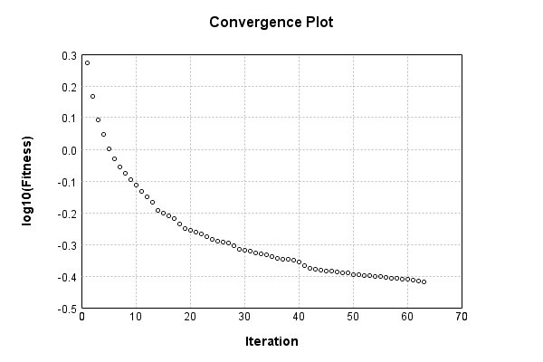

### Model
This is a very simple model that performs basic logistic regression. It is expected to be trainable to about 91% accuracy on MNIST.

Code from [MnistTestBase.java:272](../../../../../../../../MindsEye/src/test/java/com/simiacryptus/mindseye/mnist/MnistTestBase.java#L272) executed in 0.00 seconds: 
```java
    PipelineNetwork network = new PipelineNetwork();
    network.add(new BiasLayer(28, 28, 1));
    network.add(new FullyConnectedLayer(new int[]{28, 28, 1}, new int[]{10})
      .setWeights(() -> 0.001 * (Math.random() - 0.45)));
    network.add(new SoftmaxActivationLayer());
    return network;
```

Returns: 

```
    PipelineNetwork/e1035fb9-1fe3-4846-a360-622900000051
```


### Training
Code from [LinearSumConstraintTest.java:43](../../../../../../../../MindsEye/src/test/java/com/simiacryptus/mindseye/opt/region/LinearSumConstraintTest.java#L43) executed in 182.16 seconds: 
```java
    SimpleLossNetwork supervisedNetwork = new SimpleLossNetwork(network, new EntropyLossLayer());
    Trainable trainable = new SampledArrayTrainable(trainingData, supervisedNetwork, 10000);
    TrustRegionStrategy trustRegionStrategy = new TrustRegionStrategy() {
      @Override
      public TrustRegion getRegionPolicy(NNLayer layer) {
        return new LinearSumConstraint();
      }
    };
    return new IterativeTrainer(trainable)
      .setIterationsPerSample(100)
      .setMonitor(monitor)
      //.setOrientation(new ValidatingOrientationWrapper(trustRegionStrategy))
      .setOrientation(trustRegionStrategy)
      .setTimeout(3, TimeUnit.MINUTES)
      .setMaxIterations(500)
      .run();
```
Logging: 
```
    LBFGS Accumulation History: 1 points
    Constructing line search parameters: GD+Trust
    Returning cached value; 2 buffers unchanged since 0.0 => 2.453916458205654
    th(0)=2.453916458205654;dx=-319096.15812707774
    Armijo: th(2.154434690031884)=15.221932953739579; dx=-1.0567423826657749E-5 delta=-12.768016495533924
    Armijo: th(1.077217345015942)=16.786905113830848; dx=0.007126348981736195 delta=-14.332988655625194
    Armijo: th(0.3590724483386473)=17.188692806121473; dx=0.059543350437347584 delta=-14.734776347915819
    Armijo: th(0.08976811208466183)=17.43656284728624; dx=1.1649632324239945 delta=-14.982646389080585
    Armijo: th(0.017953622416932366)=18.026388219349236; dx=12.304428731701307 delta=-15.572471761143582
    Armijo: th(0.002992270402822061)=17.358999157358497; dx=981.1482008557591 delta=-14.905082699152842
    Armijo: th(4.2746720040315154E-4)=8.146605561026709; dx=35370.86735398066 delta=-5.6926891028210544
    New Minimum: 2.453916458205654 > 1.8773570070040089
    WOLF (strong): th(5.343340005039394E-5)=1.8773570070040089; dx=5819.676565887444 delta=0.576559451201645
    END: th(5.9370444500437714E-6)=2.29346874932281; dx=-48116.80853120228 delta=0.160447708882844
    Iteration 1 complete. Error: 1.8773570070040089 Total: 183811235349988.7500; Orientation: 0.0027; Line Search: 12.6399
    LBFGS Accumulation History: 2 points
    Returning cached value; 2 buffers unchanged since 0.0 => 1.8773570070040089
    th(0)=1.8773570070040089;dx=-648833.1811257699
    Armijo: th(1.279097451943557E-5)=2.747627533891606; dx=411580.18587180716 delta=-0.8702705268875972
    New Minimum: 1.8773570070040089 > 1.6342211278577392
    WOLF (strong): th(6.395487259717785E-6)=1.6342211278577392; dx=248451.4784937382 delta=0.24313587914626966
    New Minimum: 1.6342211278577392 > 1.46584171672353
    END: th(2.131829086572595E-6)=1.46584171672353; dx=-178536.20044407426 delta=0.41151529028047884
    Iteration 2 complete. Error: 1.46584171672353 Total: 183815644458109.7500; Orientation: 0.0021; Line Search: 4.4069
    LBFGS Accumulation History: 3 points
    Returning cached value;
```
...[skipping 38433 bytes](etc/1.txt)...
```
    : th(3.881555551278108E-6)=0.3888511909017417; dx=-257.07716496137607 delta=0.0011258866045729121
    Iteration 60 complete. Error: 0.3888511909017417 Total: 183971577954540.3000; Orientation: 0.0266; Line Search: 2.8789
    Orientation vanished. Popping history element from 0.3926478238864606, 0.3911343088175502, 0.3899770775063146, 0.3888511909017417
    LBFGS Accumulation History: 3 points
    Returning cached value; 2 buffers unchanged since 0.0 => 0.3888511909017417
    th(0)=0.3888511909017417;dx=-390.37632600101307
    New Minimum: 0.3888511909017417 > 0.3876040235810906
    END: th(8.362557930959388E-6)=0.3876040235810906; dx=-295.0136032313399 delta=0.0012471673206511102
    Iteration 61 complete. Error: 0.3876040235810906 Total: 183973041168102.4000; Orientation: 0.0020; Line Search: 1.4611
    Orientation vanished. Popping history element from 0.3911343088175502, 0.3899770775063146, 0.3888511909017417, 0.3876040235810906
    LBFGS Accumulation History: 3 points
    Returning cached value; 2 buffers unchanged since 0.0 => 0.3876040235810906
    th(0)=0.3876040235810906;dx=-382.4912980846053
    New Minimum: 0.3876040235810906 > 0.38502779284532307
    END: th(1.801658490386016E-5)=0.38502779284532307; dx=-276.73864910637366 delta=0.002576230735767515
    Iteration 62 complete. Error: 0.38502779284532307 Total: 183974494222470.9700; Orientation: 0.0011; Line Search: 1.4518
    Orientation vanished. Popping history element from 0.3899770775063146, 0.3888511909017417, 0.3876040235810906, 0.38502779284532307
    LBFGS Accumulation History: 3 points
    Returning cached value; 2 buffers unchanged since 0.0 => 0.38502779284532307
    th(0)=0.38502779284532307;dx=-395.9869024725056
    New Minimum: 0.38502779284532307 > 0.38236272914321723
    WOLF (strong): th(3.881555551278108E-5)=0.38236272914321723; dx=32.39934429692056 delta=0.002665063702105841
    END: th(1.940777775639054E-5)=0.38303275503176015; dx=-122.40164380060375 delta=0.0019950378135629165
    Iteration 63 complete. Error: 0.38236272914321723 Total: 183977405334004.5000; Orientation: 0.0010; Line Search: 2.9100
    
```

Returns: 

```
    0.38236272914321723
```


Code from [MnistTestBase.java:131](../../../../../../../../MindsEye/src/test/java/com/simiacryptus/mindseye/mnist/MnistTestBase.java#L131) executed in 0.01 seconds: 
```java
    PlotCanvas plot = ScatterPlot.plot(history.stream().map(step -> new double[]{step.iteration, Math.log10(step.point.getMean())}).toArray(i -> new double[i][]));
    plot.setTitle("Convergence Plot");
    plot.setAxisLabels("Iteration", "log10(Fitness)");
    plot.setSize(600, 400);
    return plot;
```

Returns: 




Saved model as [model0.json](etc/model0.json)

### Metrics
Code from [MnistTestBase.java:144](../../../../../../../../MindsEye/src/test/java/com/simiacryptus/mindseye/mnist/MnistTestBase.java#L144) executed in 0.67 seconds: 
```java
    try {
      ByteArrayOutputStream out = new ByteArrayOutputStream();
      JsonUtil.writeJson(out, monitoringRoot.getMetrics());
      return out.toString();
    } catch (IOException e) {
      throw new RuntimeException(e);
    }
```

Returns: 

```
    [ "java.util.HashMap", {
      "FullyConnectedLayer/e1035fb9-1fe3-4846-a360-622900000053" : [ "java.util.HashMap", {
        "avgMsPerItem" : 0.01185088381290323,
        "medianMsPerItem" : "NaN",
        "avgMsPerItem_Backward" : 8.247312577258066E-6,
        "totalItems" : 1240000,
        "backpropStatistics" : [ "java.util.HashMap", {
          "meanExponent" : -6.360436070769375,
          "tp50" : -2.0693147662860594E-5,
          "negative" : 5000,
          "min" : -1.997218190295749E-4,
          "max" : 1.7213319134042944E-4,
          "tp90" : -1.9362760695330373E-6,
          "mean" : -8.33568885933833E-23,
          "count" : 50000.0,
          "positive" : 45000,
          "stdDev" : 2.5837025487965878E-5,
          "tp75" : -6.223591836863561E-6,
          "zeros" : 0
        } ],
        "totalBatches" : 248,
        "weights" : [ "java.util.HashMap", {
          "tp50" : "NaN",
          "buffers" : 1,
          "max" : 0.002162567163704902,
          "tp90" : "NaN",
          "count" : 7840.0,
          "positive" : 4259,
          "tp75" : "NaN",
          "zeros" : 0,
          "meanExponent" : -4.140865173111277,
          "negative" : 3581,
          "min" : -0.001722301557936319,
          "mean" : 3.6975414634750556E-5,
          "stdDev" : 3.3834568722512884E-4
        } ],
        "class" : "com.simiacryptus.mindseye.layers.java.FullyConnectedLayer",
        "outputStatistics" : [ "java.util.HashMap", {
          "meanExponent" : 0.17941798830952976,
          "tp50" : -3.6705335429451327,
          "negative" : 20048,
          "min" : -6.1066008496414,
          "max" : 9.982214100674414,
          "tp90" : -2.907144737054511,
          "mean" : 0.8877891424913665,
          "count" : 50000.0,
          "positive" : 29952,
          "stdDev" : 3.0341899315088177,
          "tp75" : -3.1624493626180725,
          "zeros" : 0
        } ],
        "medianMsPerItem_Backward" : "NaN"
      } ],
      "BiasLayer/e1035fb9-1fe3-4846-a360-622900000052" : [ "java.util.HashMap", {
        "avgMsPerItem" : 0.01786764980080646,
        "medianMsPerItem" : "NaN",
        "avgMsPerItem_Backward" : 4.424246208225806E-6,
        "totalItems" : 1240000,
        "backpropSt
```
...[skipping 803 bytes](etc/2.txt)...
```
    8,
          "min" : -7.695686497072642E-9,
          "mean" : -8.802390277427331E-11,
          "stdDev" : 1.0429811271936584E-9
        } ],
        "class" : "com.simiacryptus.mindseye.layers.java.BiasLayer",
        "outputStatistics" : [ "java.util.HashMap", {
          "meanExponent" : -7.969039017332885,
          "tp50" : -7.695686497072642E-9,
          "negative" : 1519825,
          "min" : -2.4127817748312226E-11,
          "max" : -2.4127817748312226E-11,
          "tp90" : -6.7253189227462945E-9,
          "mean" : 33.470370152970126,
          "count" : 3920000.0,
          "positive" : 2400175,
          "stdDev" : 78.74328533487063,
          "tp75" : -6.7253189227462945E-9,
          "zeros" : 0
        } ],
        "medianMsPerItem_Backward" : "NaN"
      } ],
      "SoftmaxActivationLayer/e1035fb9-1fe3-4846-a360-622900000054" : [ "java.util.HashMap", {
        "avgMsPerItem" : 0.0032025145185483857,
        "medianMsPerItem" : "NaN",
        "avgMsPerItem_Backward" : 1.6118773016129016E-7,
        "totalItems" : 1240000,
        "backpropStatistics" : [ "java.util.HashMap", {
          "meanExponent" : -3.528316022305248,
          "tp50" : -2.2308126810898738E-4,
          "negative" : 5000,
          "min" : -0.14379128787592887,
          "max" : 0.0,
          "tp90" : -2.0195520515428944E-4,
          "mean" : -1.6850497513864904E-4,
          "count" : 50000.0,
          "positive" : 0,
          "stdDev" : 0.011993252823384606,
          "tp75" : -2.0642347734263302E-4,
          "zeros" : 45000
        } ],
        "totalBatches" : 248,
        "class" : "com.simiacryptus.mindseye.layers.java.SoftmaxActivationLayer",
        "outputStatistics" : [ "java.util.HashMap", {
          "meanExponent" : -2.5725546873096063,
          "tp50" : 6.846272766859167E-6,
          "negative" : 0,
          "min" : 1.1796004011224603E-8,
          "max" : 0.9861136124404106,
          "tp90" : 2.4872588783728432E-5,
          "mean" : 0.1,
          "count" : 50000.0,
          "positive" : 50000,
          "stdDev" : 0.25110365623260467,
          "tp75" : 1.6674298534728093E-5,
          "zeros" : 0
        } ],
        "medianMsPerItem_Backward" : "NaN"
      } ]
    } ]
```


### Validation
If we run our model against the entire validation dataset, we get this accuracy:

Code from [MnistTestBase.java:201](../../../../../../../../MindsEye/src/test/java/com/simiacryptus/mindseye/mnist/MnistTestBase.java#L201) executed in 0.92 seconds: 
```java
    return MNIST.validationDataStream().mapToDouble(labeledObject ->
      predict(network, labeledObject)[0] == parse(labeledObject.label) ? 1 : 0)
      .average().getAsDouble() * 100;
```

Returns: 

```
    89.92
```


Let's examine some incorrectly predicted results in more detail:

Code from [MnistTestBase.java:208](../../../../../../../../MindsEye/src/test/java/com/simiacryptus/mindseye/mnist/MnistTestBase.java#L208) executed in 0.07 seconds: 
```java
    try {
      TableOutput table = new TableOutput();
      MNIST.validationDataStream().map(labeledObject -> {
        try {
          int actualCategory = parse(labeledObject.label);
          double[] predictionSignal = CudaExecutionContext.gpuContexts.run(ctx -> network.eval(ctx, labeledObject.data).getData().get(0).getData());
          int[] predictionList = IntStream.range(0, 10).mapToObj(x -> x).sorted(Comparator.comparing(i -> -predictionSignal[i])).mapToInt(x -> x).toArray();
          if (predictionList[0] == actualCategory) return null; // We will only examine mispredicted rows
          LinkedHashMap<String, Object> row = new LinkedHashMap<String, Object>();
          row.put("Image", log.image(labeledObject.data.toGrayImage(), labeledObject.label));
          row.put("Prediction", Arrays.stream(predictionList).limit(3)
            .mapToObj(i -> String.format("%d (%.1f%%)", i, 100.0 * predictionSignal[i]))
            .reduce((a, b) -> a + ", " + b).get());
          return row;
        } catch (IOException e) {
          throw new RuntimeException(e);
        }
      }).filter(x -> null != x).limit(10).forEach(table::putRow);
      return table;
    } catch (IOException e) {
      throw new RuntimeException(e);
    }
```

Returns: 

Image | Prediction
----- | ----------
![[5]](etc/test.2.png)  | 6 (79.2%), 2 (8.4%), 8 (3.6%)  
![[6]](etc/test.3.png)  | 8 (36.4%), 6 (35.4%), 2 (10.2%)
![[4]](etc/test.4.png)  | 0 (46.8%), 6 (38.1%), 4 (6.0%) 
![[1]](etc/test.5.png)  | 3 (47.8%), 1 (33.8%), 8 (6.6%) 
![[3]](etc/test.6.png)  | 2 (55.6%), 3 (27.6%), 9 (6.5%) 
![[6]](etc/test.7.png)  | 2 (26.3%), 6 (22.2%), 7 (22.1%)
![[2]](etc/test.8.png)  | 7 (84.9%), 2 (7.7%), 9 (5.3%)  
![[7]](etc/test.9.png)  | 9 (54.4%), 7 (33.9%), 4 (7.1%) 
![[9]](etc/test.10.png) | 4 (28.4%), 9 (27.7%), 8 (22.9%)
![[7]](etc/test.11.png) | 1 (53.7%), 7 (22.3%), 9 (6.9%) 


