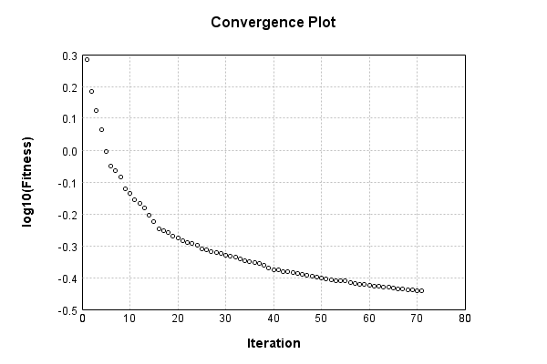

### Model
This is a very simple model that performs basic logistic regression. It is expected to be trainable to about 91% accuracy on MNIST.

Code from [MnistTestBase.java:295](../../../../../../../../MindsEye/src/test/java/com/simiacryptus/mindseye/mnist/MnistTestBase.java#L295) executed in 0.00 seconds: 
```java
    PipelineNetwork network = new PipelineNetwork();
    network.add(new BiasLayer(28, 28, 1));
    network.add(new FullyConnectedLayer(new int[]{28, 28, 1}, new int[]{10})
      .setWeights(() -> 0.001 * (Math.random() - 0.45)));
    network.add(new SoftmaxActivationLayer());
    return network;
```

Returns: 

```
    PipelineNetwork/3cc8990a-29bd-4377-9ee9-863800000052
```


### Training
Code from [SingleOrthantTrustRegionTest.java:43](../../../../../../../../MindsEye/src/test/java/com/simiacryptus/mindseye/opt/region/SingleOrthantTrustRegionTest.java#L43) executed in 180.18 seconds: 
```java
    SimpleLossNetwork supervisedNetwork = new SimpleLossNetwork(network, new EntropyLossLayer());
    Trainable trainable = new SampledArrayTrainable(trainingData, supervisedNetwork, 10000);
    TrustRegionStrategy trustRegionStrategy = new TrustRegionStrategy() {
      @Override
      public TrustRegion getRegionPolicy(NNLayer layer) {
        return new SingleOrthant();
      }
    };
    return new IterativeTrainer(trainable)
      .setIterationsPerSample(100)
      .setMonitor(monitor)
      //.setOrientation(new ValidatingOrientationWrapper(trustRegionStrategy))
      .setOrientation(trustRegionStrategy)
      .setTimeout(3, TimeUnit.MINUTES)
      .setMaxIterations(500)
      .run();
```
Logging: 
```
    LBFGS Accumulation History: 1 points
    Constructing line search parameters: GD+Trust
    Returning cached value; 2 buffers unchanged since 0.0 => 2.451712653764921
    th(0)=2.451712653764921;dx=-517515.0785265892
    Armijo: th(2.154434690031884)=17.600960450846486; dx=4.4617136922393926E-20 delta=-15.149247797081564
    Armijo: th(1.077217345015942)=17.600960450846486; dx=3.212944096970774E-5 delta=-15.149247797081564
    Armijo: th(0.3590724483386473)=17.59633439874205; dx=0.03749462084272871 delta=-15.14462174497713
    Armijo: th(0.08976811208466183)=17.58361047681796; dx=0.6641419326965253 delta=-15.131897823053038
    Armijo: th(0.017953622416932366)=17.492541954701124; dx=11.197035793910102 delta=-15.040829300936203
    Armijo: th(0.002992270402822061)=17.08887414326378; dx=332.4005422044559 delta=-14.637161489498858
    Armijo: th(4.2746720040315154E-4)=14.317150808567675; dx=14435.527770477773 delta=-11.865438154802753
    Armijo: th(5.343340005039394E-5)=5.361264170494455; dx=166824.26984168374 delta=-2.9095515167295343
    New Minimum: 2.451712653764921 > 1.9228557379934357
    END: th(5.9370444500437714E-6)=1.9228557379934357; dx=-47206.72022075966 delta=0.5288569157714853
    Iteration 1 complete. Error: 1.9228557379934357 Total: 14146246439870.0020; Orientation: 0.0007; Line Search: 7.2902
    LBFGS Accumulation History: 2 points
    Returning cached value; 2 buffers unchanged since 0.0 => 1.9228557379934357
    th(0)=1.9228557379934357;dx=-320067.30136337405
    Armijo: th(1.279097451943557E-5)=2.366256439854208; dx=326493.47795026354 delta=-0.4434007018607724
    New Minimum: 1.9228557379934357 > 1.6208409397745034
    WOLF (strong): th(6.395487259717785E-6)=1.6208409397745034; dx=97341.04474399303 delta=0.3020147982189323
    END: th(2.131829086572595E-6)=1.6799991788153967; dx=-161058.58846187734 delta=0.24285655917803894
    Iteration 2 complete. Error: 1.6208409397745034 Total: 14148880950175.7540; Orientation: 0.0009; Line Search: 2.6335
    LBFGS Accumulation History: 3 points
    Returning cached value; 2 buffers unchanged since 0.0 => 1.6208409397745034
    th
```
...[skipping 67434 bytes](etc/1.txt)...
```
    82072031614, 0.3412968281481007
    LBFGS Accumulation History: 3 points
    Returning cached value; 2 buffers unchanged since 0.0 => 0.3412968281481007
    th(0)=0.3412968281481007;dx=-359.8695142233828
    Armijo: th(4.8371365110222913E-5)=0.34214716979158727; dx=340.05244109823695 delta=-8.50341643486574E-4
    New Minimum: 0.3412968281481007 > 0.3398796964499321
    WOLF (strong): th(2.4185682555111457E-5)=0.3398796964499321; dx=35.18498351460631 delta=0.0014171316981685944
    END: th(8.061894185037153E-6)=0.34041480321321316; dx=-167.71054979546489 delta=8.820249348875375E-4
    Iteration 105 complete. Error: 0.3398796964499321 Total: 14313708497893.9180; Orientation: 0.0011; Line Search: 2.6245
    Orientation vanished. Popping history element from 0.34483512981968967, 0.34360182072031614, 0.3412968281481007, 0.3398796964499321
    LBFGS Accumulation History: 3 points
    Returning cached value; 2 buffers unchanged since 0.0 => 0.3398796964499321
    th(0)=0.3398796964499321;dx=-1043.437497292679
    Armijo: th(1.7368824499610364E-5)=0.3412375991637122; dx=1169.1134549689841 delta=-0.0013579027137801125
    New Minimum: 0.3398796964499321 > 0.3383452553715578
    WOLF (strong): th(8.684412249805182E-6)=0.3383452553715578; dx=159.03148598985388 delta=0.0015344410783743045
    END: th(2.894804083268394E-6)=0.3388707504700562; dx=-524.2343775809417 delta=0.001008945979875886
    Iteration 106 complete. Error: 0.3383452553715578 Total: 14316319656467.2910; Orientation: 0.0010; Line Search: 2.6101
    Orientation vanished. Popping history element from 0.34360182072031614, 0.3412968281481007, 0.3398796964499321, 0.3383452553715578
    LBFGS Accumulation History: 3 points
    Returning cached value; 2 buffers unchanged since 0.0 => 0.3383452553715578
    th(0)=0.3383452553715578;dx=-448.93942053461103
    New Minimum: 0.3383452553715578 > 0.33756638972835806
    END: th(6.236666337839374E-6)=0.33756638972835806; dx=-150.2575065831401 delta=7.788656431997332E-4
    Iteration 107 complete. Error: 0.33756638972835806 Total: 14317169138885.6800; Orientation: 0.0014; Line Search: 0.8479
    
```

Returns: 

```
    0.33756638972835806
```


Code from [MnistTestBase.java:141](../../../../../../../../MindsEye/src/test/java/com/simiacryptus/mindseye/mnist/MnistTestBase.java#L141) executed in 0.01 seconds: 
```java
    PlotCanvas plot = ScatterPlot.plot(history.stream().map(step -> new double[]{step.iteration, Math.log10(step.point.getMean())}).toArray(i -> new double[i][]));
    plot.setTitle("Convergence Plot");
    plot.setAxisLabels("Iteration", "log10(Fitness)");
    plot.setSize(600, 400);
    return plot;
```

Returns: 




Saved model as [model0.json](etc/model0.json)

### Metrics
Code from [MnistTestBase.java:154](../../../../../../../../MindsEye/src/test/java/com/simiacryptus/mindseye/mnist/MnistTestBase.java#L154) executed in 0.52 seconds: 
```java
    try {
      ByteArrayOutputStream out = new ByteArrayOutputStream();
      JsonUtil.writeJson(out, monitoringRoot.getMetrics());
      return out.toString();
    } catch (IOException e) {
      throw new RuntimeException(e);
    }
```

Returns: 

```
    [ "java.util.HashMap", {
      "BiasLayer/3cc8990a-29bd-4377-9ee9-863800000053" : [ "java.util.HashMap", {
        "avgMsPerItem" : 0.012216667120772953,
        "medianMsPerItem" : "NaN",
        "avgMsPerItem_Backward" : 2.1383630714975833E-6,
        "totalItems" : 2070000,
        "backpropStatistics" : [ "java.util.HashMap", {
          "meanExponent" : -8.552745721935262,
          "tp50" : -2.9091334978894017E-7,
          "negative" : 1905227,
          "min" : -1.0546631855883273E-7,
          "max" : 1.0163075968469051E-7,
          "tp90" : -2.511912723231936E-7,
          "mean" : -1.6830364351049573E-11,
          "count" : 3920000.0,
          "positive" : 2014773,
          "stdDev" : 3.559998170661128E-8,
          "tp75" : -2.630222777605511E-7,
          "zeros" : 0
        } ],
        "totalBatches" : 414,
        "weights" : [ "java.util.HashMap", {
          "tp50" : "NaN",
          "buffers" : 1,
          "max" : 0.0,
          "tp90" : "NaN",
          "count" : 784.0,
          "positive" : 0,
          "tp75" : "NaN",
          "zeros" : 784,
          "meanExponent" : "NaN",
          "negative" : 0,
          "min" : 0.0,
          "mean" : 0.0,
          "stdDev" : 0.0
        } ],
        "class" : "com.simiacryptus.mindseye.layers.java.BiasLayer",
        "outputStatistics" : [ "java.util.HashMap", {
          "meanExponent" : 2.1126856158268033,
          "tp50" : 0.0,
          "negative" : 0,
          "min" : 0.0,
          "max" : 0.0,
          "tp90" : 0.0,
          "mean" : 33.133401785714284,
          "count" : 3920000.0,
          "positive" : 745411,
          "stdDev" : 78.38660641942197,
          "tp75" : 0.0,
          "zeros" : 3174589
        } ],
        "medianMsPerItem_Backward" : "NaN"
      } ],
      "FullyConnectedLayer/3cc8990a-29bd-4377-9ee9-863800000054" : [ "java.util.HashMap", {
        "avgMsPerItem" : 0.007729641643478258,
        "medianMsPerItem" : "NaN",
        "avgMsPerItem_Backward" : 5.343848493043478E-6,
        "totalItems" : 2070000,
        "backpropStatistics" : [ "java.util.HashMap", {
          "meanExponent" : -6.784013477205853,
          "tp50" : -1.2444138049443702E-5,
          "negative" : 5000,
          "min"
```
...[skipping 620 bytes](etc/2.txt)...
```
    
          "negative" : 2673,
          "min" : -0.002979064855625181,
          "mean" : 9.947040546375894E-5,
          "stdDev" : 4.773781085205899E-4
        } ],
        "class" : "com.simiacryptus.mindseye.layers.java.FullyConnectedLayer",
        "outputStatistics" : [ "java.util.HashMap", {
          "meanExponent" : 0.49909261650794645,
          "tp50" : -1.3649380261293433,
          "negative" : 5684,
          "min" : -5.950967726997144,
          "max" : 17.498589454752654,
          "tp90" : -0.44752412084497994,
          "mean" : 4.247025386513437,
          "count" : 50000.0,
          "positive" : 44316,
          "stdDev" : 3.7965627061260045,
          "tp75" : -0.7661653661273587,
          "zeros" : 0
        } ],
        "medianMsPerItem_Backward" : "NaN"
      } ],
      "SoftmaxActivationLayer/3cc8990a-29bd-4377-9ee9-863800000055" : [ "java.util.HashMap", {
        "avgMsPerItem" : 0.001974056256521741,
        "medianMsPerItem" : "NaN",
        "avgMsPerItem_Backward" : 9.100680879227051E-8,
        "totalItems" : 2070000,
        "backpropStatistics" : [ "java.util.HashMap", {
          "meanExponent" : -3.5537214788827507,
          "tp50" : -2.1326979377773246E-4,
          "negative" : 5000,
          "min" : -0.516059734459634,
          "max" : 0.0,
          "tp90" : -2.0089803002363272E-4,
          "mean" : -1.4102498221793376E-4,
          "count" : 50000.0,
          "positive" : 0,
          "stdDev" : 0.006886745524538309,
          "tp75" : -2.0339776645085733E-4,
          "zeros" : 45000
        } ],
        "totalBatches" : 414,
        "class" : "com.simiacryptus.mindseye.layers.java.SoftmaxActivationLayer",
        "outputStatistics" : [ "java.util.HashMap", {
          "meanExponent" : -2.972682290548861,
          "tp50" : 7.817609896915955E-7,
          "negative" : 0,
          "min" : 2.373247759057671E-10,
          "max" : 0.9982904348963564,
          "tp90" : 3.716374973387221E-6,
          "mean" : 0.1,
          "count" : 50000.0,
          "positive" : 50000,
          "stdDev" : 0.2618595626732177,
          "tp75" : 2.289873716673819E-6,
          "zeros" : 0
        } ],
        "medianMsPerItem_Backward" : "NaN"
      } ]
    } ]
```


### Validation
If we run our model against the entire validation dataset, we get this accuracy:

Code from [MnistTestBase.java:211](../../../../../../../../MindsEye/src/test/java/com/simiacryptus/mindseye/mnist/MnistTestBase.java#L211) executed in 0.50 seconds: 
```java
    return MNIST.validationDataStream().mapToDouble(labeledObject ->
      predict(network, labeledObject)[0] == parse(labeledObject.label) ? 1 : 0)
      .average().getAsDouble() * 100;
```

Returns: 

```
    90.8
```


Let's examine some incorrectly predicted results in more detail:

Code from [MnistTestBase.java:218](../../../../../../../../MindsEye/src/test/java/com/simiacryptus/mindseye/mnist/MnistTestBase.java#L218) executed in 0.23 seconds: 
```java
    try {
      TableOutput table = new TableOutput();
      MNIST.validationDataStream().map(labeledObject -> {
        try {
          int actualCategory = parse(labeledObject.label);
          double[] predictionSignal = CudaExecutionContext.gpuContexts.run(ctx -> network.eval(ctx, labeledObject.data).getData().get(0).getData());
          int[] predictionList = IntStream.range(0, 10).mapToObj(x -> x).sorted(Comparator.comparing(i -> -predictionSignal[i])).mapToInt(x -> x).toArray();
          if (predictionList[0] == actualCategory) return null; // We will only examine mispredicted rows
          LinkedHashMap<String, Object> row = new LinkedHashMap<String, Object>();
          row.put("Image", log.image(labeledObject.data.toGrayImage(), labeledObject.label));
          row.put("Prediction", Arrays.stream(predictionList).limit(3)
            .mapToObj(i -> String.format("%d (%.1f%%)", i, 100.0 * predictionSignal[i]))
            .reduce((a, b) -> a + ", " + b).get());
          return row;
        } catch (IOException e) {
          throw new RuntimeException(e);
        }
      }).filter(x -> null != x).limit(10).forEach(table::putRow);
      return table;
    } catch (IOException e) {
      throw new RuntimeException(e);
    }
```

Returns: 

Image | Prediction
----- | ----------
![[5]](etc/test.2.png)  | 6 (91.0%), 2 (3.2%), 4 (1.8%)  
![[4]](etc/test.3.png)  | 6 (50.3%), 0 (22.2%), 4 (15.3%)
![[3]](etc/test.4.png)  | 2 (55.7%), 3 (37.6%), 8 (4.0%) 
![[2]](etc/test.5.png)  | 7 (70.9%), 2 (21.3%), 9 (4.1%) 
![[9]](etc/test.6.png)  | 4 (33.8%), 9 (30.4%), 8 (15.5%)
![[7]](etc/test.7.png)  | 1 (45.8%), 7 (37.1%), 9 (6.2%) 
![[2]](etc/test.8.png)  | 8 (35.4%), 2 (32.9%), 7 (16.6%)
![[7]](etc/test.9.png)  | 4 (61.8%), 9 (21.0%), 7 (13.6%)
![[2]](etc/test.10.png) | 9 (43.5%), 8 (18.3%), 4 (16.1%)
![[9]](etc/test.11.png) | 4 (42.3%), 3 (28.8%), 9 (17.0%)


