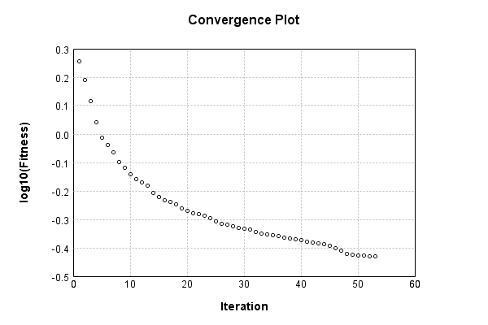

### Model
This is a very simple model that performs basic logistic regression. It is expected to be trainable to about 91% accuracy on MNIST.

Code from [MnistTestBase.java:293](../../../../../../../src/test/java/com/simiacryptus/mindseye/opt/MnistTestBase.java#L293) executed in 0.00 seconds: 
```java
    PipelineNetwork network = new PipelineNetwork();
    network.add(new BiasLayer(28, 28, 1));
    network.add(new FullyConnectedLayer(new int[]{28, 28, 1}, new int[]{10})
      .setWeights(() -> 0.001 * (Math.random() - 0.45)));
    network.add(new SoftmaxActivationLayer());
    return network;
```

Returns: 

```
    PipelineNetwork/571e1d46-4310-432c-b0eb-de6df3ab60b4
```


### Training
Code from [SingleOrthantTrustRegionTest.java:43](../../../../../../../src/test/java/com/simiacryptus/mindseye/opt/region/SingleOrthantTrustRegionTest.java#L43) executed in 182.08 seconds: 
```java
    SimpleLossNetwork supervisedNetwork = new SimpleLossNetwork(network, new EntropyLossLayer());
    Trainable trainable = new SampledArrayTrainable(trainingData, supervisedNetwork, 10000);
    TrustRegionStrategy trustRegionStrategy = new TrustRegionStrategy() {
      @Override
      public TrustRegion getRegionPolicy(NNLayer layer) {
        return new SingleOrthant();
      }
    };
    return new IterativeTrainer(trainable)
      .setIterationsPerSample(100)
      .setMonitor(monitor)
      //.setOrientation(new ValidatingOrientationWrapper(trustRegionStrategy))
      .setOrientation(trustRegionStrategy)
      .setTimeout(3, TimeUnit.MINUTES)
      .setMaxIterations(500)
      .run();
```
Logging: 
```
    LBFGS Accumulation History: 1 points
    Constructing line search parameters: GD+Trust
    th(0)=2.426312917336424;dx=-336488.30167366564
    Armijo: th(2.154434690031884)=17.2085999510003; dx=2.118302611816224E-70 delta=-14.782287033663874
    Armijo: th(1.077217345015942)=17.2085999510003; dx=7.74313257150068E-35 delta=-14.782287033663874
    Armijo: th(0.3590724483386473)=17.2085999510003; dx=8.824113466050562E-12 delta=-14.782287033663874
    Armijo: th(0.08976811208466183)=17.206646485995698; dx=0.09643301749729609 delta=-14.780333568659273
    Armijo: th(0.017953622416932366)=17.182628817923536; dx=3.064960094586095 delta=-14.756315900587111
    Armijo: th(0.002992270402822061)=17.07981254662468; dx=88.63721807091228 delta=-14.653499629288255
    Armijo: th(4.2746720040315154E-4)=16.19553967379988; dx=8179.011633060669 delta=-13.769226756463453
    Armijo: th(5.343340005039394E-5)=4.776320063140465; dx=170020.0240480651 delta=-2.3500071458040415
    New Minimum: 2.426312917336424 > 1.8005479539628613
    END: th(5.9370444500437714E-6)=1.8
```
...[skipping 29829 bytes](etc/171.txt)...
```
    90614798846 delta=1.2513022965210396E-4
    New Minimum: 0.373480249563965 > 0.3722070041977797
    END: th(1.0837875078523371E-5)=0.3722070041977797; dx=-8.36403155475781 delta=0.0013983755958374422
    Iteration 52 complete. Error: 0.3722070041977797 Total: 61814692903895.8900; Orientation: 0.0015; Line Search: 3.5783
    Orientation vanished. Popping history element from 0.3765033196307582, 0.37506720631194546, 0.37360537979361713, 0.3722070041977797
    LBFGS Accumulation History: 3 points
    th(0)=0.3722070041977797;dx=-822.4379195449627
    Armijo: th(2.3349494035402776E-5)=0.374803787980318; dx=1110.595522802398 delta=-0.0025967837825383033
    New Minimum: 0.3722070041977797 > 0.37096987803407644
    WOLF (strong): th(1.1674747017701388E-5)=0.37096987803407644; dx=219.28932823436313 delta=0.0012371261637032505
    END: th(3.891582339233796E-6)=0.3712430704150342; dx=-352.967846034552 delta=9.639337827455075E-4
    Iteration 53 complete. Error: 0.37096987803407644 Total: 61819003464222.3050; Orientation: 0.0013; Line Search: 4.3092
    
```

Returns: 

```
    0.37096987803407644
```


Code from [MnistTestBase.java:139](../../../../../../../src/test/java/com/simiacryptus/mindseye/opt/MnistTestBase.java#L139) executed in 0.00 seconds: 
```java
    PlotCanvas plot = ScatterPlot.plot(history.stream().map(step -> new double[]{step.iteration, Math.log10(step.point.getMean())}).toArray(i -> new double[i][]));
    plot.setTitle("Convergence Plot");
    plot.setAxisLabels("Iteration", "log10(Fitness)");
    plot.setSize(600, 400);
    return plot;
```

Returns: 




Saved model as [model0.json](etc/model0.json)

### Metrics
Code from [MnistTestBase.java:152](../../../../../../../src/test/java/com/simiacryptus/mindseye/opt/MnistTestBase.java#L152) executed in 0.65 seconds: 
```java
    try {
      ByteArrayOutputStream out = new ByteArrayOutputStream();
      JsonUtil.writeJson(out, monitoringRoot.getMetrics());
      return out.toString();
    } catch (IOException e) {
      throw new RuntimeException(e);
    }
```

Returns: 

```
    [ "java.util.HashMap", {
      "BiasLayer/c004a16b-95b2-4ddb-95b0-39ea18da9945" : [ "java.util.HashMap", {
        "avgMsPerItem" : 0.02091940333749999,
        "medianMsPerItem" : "NaN",
        "avgMsPerItem_Backward" : 2.8095889101249996E-6,
        "totalItems" : 1600000,
        "backpropStatistics" : [ "java.util.HashMap", {
          "meanExponent" : -4.730477704226167,
          "tp50" : -0.0011998997532164629,
          "negative" : 1922160,
          "min" : -5.932262702755268E-4,
          "max" : 6.323353923921838E-4,
          "tp90" : -0.0010460409537211982,
          "mean" : 1.063032775734633E-7,
          "count" : 3920000.0,
          "positive" : 1997840,
          "stdDev" : 1.6229305073338295E-4,
          "tp75" : -0.001091784983172546,
          "zeros" : 0
        } ],
        "totalBatches" : 320,
        "weights" : [ "java.util.HashMap", {
          "tp50" : "NaN",
          "buffers" : 1,
          "max" : 0.0,
          "tp90" : "NaN",
          "count" : 784.0,
          "positive" : 0,
          "tp75" : "NaN",
          "zeros" : 784,
          "meanExponent" : "NaN
```
...[skipping 2637 bytes](etc/172.txt)...
```
    ,
        "weights" : [ "java.util.HashMap", {
          "tp50" : "NaN",
          "buffers" : 1,
          "max" : 0.002416129021434648,
          "tp90" : "NaN",
          "count" : 7840.0,
          "positive" : 4236,
          "tp75" : "NaN",
          "zeros" : 703,
          "meanExponent" : -3.627019197628873,
          "negative" : 2901,
          "min" : -0.0026998843305277164,
          "mean" : 7.502292764963551E-5,
          "stdDev" : 4.130846992174693E-4
        } ],
        "class" : "com.simiacryptus.mindseye.layers.java.FullyConnectedLayer",
        "outputStatistics" : [ "java.util.HashMap", {
          "meanExponent" : 0.36338997404957424,
          "tp50" : -1.5137783106905216,
          "negative" : 7491,
          "min" : -4.720162046475386,
          "max" : 12.709490847030246,
          "tp90" : -0.7978204725764426,
          "mean" : 3.100007025957382,
          "count" : 50000.0,
          "positive" : 42509,
          "stdDev" : 3.219953169691455,
          "tp75" : -1.039511968253454,
          "zeros" : 0
        } ],
        "medianMsPerItem_Backward" : "NaN"
      } ]
    } ]
```


### Validation
If we run our model against the entire validation dataset, we get this accuracy:

Code from [MnistTestBase.java:209](../../../../../../../src/test/java/com/simiacryptus/mindseye/opt/MnistTestBase.java#L209) executed in 0.72 seconds: 
```java
    return MNIST.validationDataStream().mapToDouble(labeledObject ->
      predict(network, labeledObject)[0] == parse(labeledObject.label) ? 1 : 0)
      .average().getAsDouble() * 100;
```

Returns: 

```
    89.47
```


Let's examine some incorrectly predicted results in more detail:

Code from [MnistTestBase.java:216](../../../../../../../src/test/java/com/simiacryptus/mindseye/opt/MnistTestBase.java#L216) executed in 0.20 seconds: 
```java
    try {
      TableOutput table = new TableOutput();
      MNIST.validationDataStream().map(labeledObject -> {
        try {
          int actualCategory = parse(labeledObject.label);
          double[] predictionSignal = GpuController.call(ctx -> network.eval(ctx, labeledObject.data).getData().get(0).getData());
          int[] predictionList = IntStream.range(0, 10).mapToObj(x -> x).sorted(Comparator.comparing(i -> -predictionSignal[i])).mapToInt(x -> x).toArray();
          if (predictionList[0] == actualCategory) return null; // We will only examine mispredicted rows
          LinkedHashMap<String, Object> row = new LinkedHashMap<String, Object>();
          row.put("Image", log.image(labeledObject.data.toGrayImage(), labeledObject.label));
          row.put("Prediction", Arrays.stream(predictionList).limit(3)
            .mapToObj(i -> String.format("%d (%.1f%%)", i, 100.0 * predictionSignal[i]))
            .reduce((a, b) -> a + ", " + b).get());
          return row;
        } catch (IOException e) {
          throw new RuntimeException(e);
        }
      }).filter(x -> null != x).limit(10).forEach(table::putRow);
      return table;
    } catch (IOException e) {
      throw new RuntimeException(e);
    }
```

Returns: 

Image | Prediction
----- | ----------
![[5]](etc/test.786.png) | 6 (57.6%), 2 (27.0%), 4 (5.4%) 
![[4]](etc/test.787.png) | 0 (40.3%), 6 (34.0%), 2 (10.6%)
![[2]](etc/test.788.png) | 3 (44.4%), 2 (33.2%), 8 (11.6%)
![[1]](etc/test.789.png) | 3 (37.3%), 1 (31.9%), 5 (10.5%)
![[3]](etc/test.790.png) | 2 (48.9%), 3 (33.6%), 9 (8.9%) 
![[2]](etc/test.791.png) | 7 (82.3%), 2 (12.7%), 9 (2.9%) 
![[9]](etc/test.792.png) | 4 (30.8%), 9 (28.9%), 8 (18.9%)
![[7]](etc/test.793.png) | 1 (62.2%), 7 (20.5%), 9 (6.4%) 
![[7]](etc/test.794.png) | 4 (65.3%), 9 (21.3%), 8 (7.0%) 
![[2]](etc/test.795.png) | 9 (38.7%), 8 (15.0%), 1 (13.1%)


