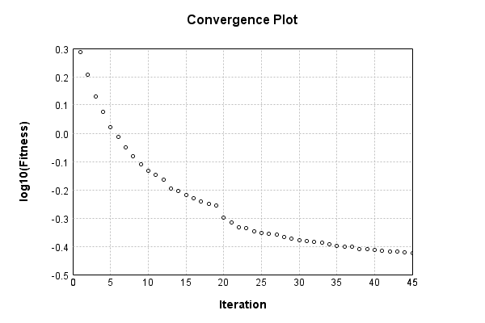

### Model
This is a very simple model that performs basic logistic regression. It is expected to be trainable to about 91% accuracy on MNIST.

Code from [MnistTestBase.java:293](../../../../../../../src/test/java/com/simiacryptus/mindseye/opt/MnistTestBase.java#L293) executed in 0.00 seconds: 
```java
    PipelineNetwork network = new PipelineNetwork();
    network.add(new BiasLayer(28, 28, 1));
    network.add(new FullyConnectedLayer(new int[]{28, 28, 1}, new int[]{10})
      .setWeights(() -> 0.001 * (Math.random() - 0.45)));
    network.add(new SoftmaxActivationLayer());
    return network;
```

Returns: 

```
    PipelineNetwork/737f4093-3448-486f-91b5-60eb2d45f088
```


### Training
Code from [TrustSphereTest.java:43](../../../../../../../src/test/java/com/simiacryptus/mindseye/opt/region/TrustSphereTest.java#L43) executed in 180.20 seconds: 
```java
    SimpleLossNetwork supervisedNetwork = new SimpleLossNetwork(network, new EntropyLossLayer());
    Trainable trainable = new SampledArrayTrainable(trainingData, supervisedNetwork, 10000);
    TrustRegionStrategy trustRegionStrategy = new TrustRegionStrategy() {
      @Override
      public TrustRegion getRegionPolicy(NNLayer layer) {
        return new AdaptiveTrustSphere();
      }
    };
    return new IterativeTrainer(trainable)
      .setIterationsPerSample(100)
      .setMonitor(monitor)
      //.setOrientation(new ValidatingOrientationWrapper(trustRegionStrategy))
      .setOrientation(trustRegionStrategy)
      .setTimeout(3, TimeUnit.MINUTES)
      .setMaxIterations(500)
      .run();
```
Logging: 
```
    LBFGS Accumulation History: 1 points
    Constructing line search parameters: GD+Trust
    th(0)=2.608414188160418;dx=-415440.0531528494
    Armijo: th(2.154434690031884)=20.861420942526053; dx=1.953830427250074E-23 delta=-18.253006754365636
    Armijo: th(1.077217345015942)=20.861420942526053; dx=3.0658786046011726E-7 delta=-18.253006754365636
    Armijo: th(0.3590724483386473)=20.859556228283353; dx=0.035219731144208004 delta=-18.251142040122936
    Armijo: th(0.08976811208466183)=20.853406258448743; dx=0.12705925511421434 delta=-18.244992070288326
    Armijo: th(0.017953622416932366)=20.82925808392032; dx=4.848240742306004 delta=-18.220843895759902
    Armijo: th(0.002992270402822061)=20.643182552899496; dx=160.65739839184735 delta=-18.03476836473908
    Armijo: th(4.2746720040315154E-4)=19.4661090990205; dx=6426.5090151133045 delta=-16.857694910860083
    Armijo: th(5.343340005039394E-5)=8.606964817778941; dx=319866.5640254438 delta=-5.9985506296185225
    New Minimum: 2.608414188160418 > 1.9409313140796225
    END: th(5.9370444500437714E-6
```
...[skipping 26130 bytes](etc/173.txt)...
```
    62497655554 > 0.3792671077186816
    WOLF (strong): th(8.966205709594661E-6)=0.3792671077186816; dx=161.4498209912995 delta=0.0015955172578739352
    END: th(4.483102854797331E-6)=0.37948476917238017; dx=-356.71303335311256 delta=0.0013778558041753763
    Iteration 44 complete. Error: 0.3792671077186816 Total: 61998088741546.7660; Orientation: 0.0011; Line Search: 3.8494
    Orientation vanished. Popping history element from 0.38429400727198615, 0.3825305242367123, 0.38086262497655554, 0.3792671077186816
    LBFGS Accumulation History: 3 points
    th(0)=0.3792671077186816;dx=-1051.098226475172
    New Minimum: 0.3792671077186816 > 0.3779646869641397
    WOLF (strong): th(9.65855230935634E-6)=0.3779646869641397; dx=499.79831528410585 delta=0.0013024207545418998
    New Minimum: 0.3779646869641397 > 0.37767958989960115
    END: th(4.82927615467817E-6)=0.37767958989960115; dx=-267.053151150993 delta=0.0015875178190804529
    Iteration 45 complete. Error: 0.37767958989960115 Total: 62001171653724.9140; Orientation: 0.0012; Line Search: 3.0817
    
```

Returns: 

```
    0.37767958989960115
```


Code from [MnistTestBase.java:139](../../../../../../../src/test/java/com/simiacryptus/mindseye/opt/MnistTestBase.java#L139) executed in 0.00 seconds: 
```java
    PlotCanvas plot = ScatterPlot.plot(history.stream().map(step -> new double[]{step.iteration, Math.log10(step.point.getMean())}).toArray(i -> new double[i][]));
    plot.setTitle("Convergence Plot");
    plot.setAxisLabels("Iteration", "log10(Fitness)");
    plot.setSize(600, 400);
    return plot;
```

Returns: 




Saved model as [model0.json](etc/model0.json)

### Metrics
Code from [MnistTestBase.java:152](../../../../../../../src/test/java/com/simiacryptus/mindseye/opt/MnistTestBase.java#L152) executed in 0.65 seconds: 
```java
    try {
      ByteArrayOutputStream out = new ByteArrayOutputStream();
      JsonUtil.writeJson(out, monitoringRoot.getMetrics());
      return out.toString();
    } catch (IOException e) {
      throw new RuntimeException(e);
    }
```

Returns: 

```
    [ "java.util.HashMap", {
      "FullyConnectedLayer/36433de8-7ff7-47bb-8fb1-dcf08646b288" : [ "java.util.HashMap", {
        "avgMsPerItem" : 0.011824472099315067,
        "medianMsPerItem" : "NaN",
        "avgMsPerItem_Backward" : 1.6215695171232875E-5,
        "totalItems" : 1460000,
        "backpropStatistics" : [ "java.util.HashMap", {
          "meanExponent" : -2.7042739947420285,
          "tp50" : -0.09292729597146038,
          "negative" : 5000,
          "min" : -0.9996673510949179,
          "max" : 0.8333757407683801,
          "tp90" : -0.008773938446451378,
          "mean" : 2.7956908167263546E-19,
          "count" : 50000.0,
          "positive" : 45000,
          "stdDev" : 0.1272454900800541,
          "tp75" : -0.02946872895786,
          "zeros" : 0
        } ],
        "totalBatches" : 292,
        "weights" : [ "java.util.HashMap", {
          "tp50" : "NaN",
          "buffers" : 1,
          "max" : 0.0022386243547084885,
          "tp90" : "NaN",
          "count" : 7840.0,
          "positive" : 4282,
          "tp75" : "NaN",
          "zeros" : 0,
          "meanExp
```
...[skipping 2811 bytes](etc/174.txt)...
```
     "weights" : [ "java.util.HashMap", {
          "tp50" : "NaN",
          "buffers" : 1,
          "max" : 9.910547062570107E-9,
          "tp90" : "NaN",
          "count" : 784.0,
          "positive" : 359,
          "tp75" : "NaN",
          "zeros" : 0,
          "meanExponent" : -8.854832090090536,
          "negative" : 425,
          "min" : -9.251474537351227E-9,
          "mean" : -2.6924686182166507E-10,
          "stdDev" : 2.5595656389169465E-9
        } ],
        "class" : "com.simiacryptus.mindseye.layers.java.BiasLayer",
        "outputStatistics" : [ "java.util.HashMap", {
          "meanExponent" : -6.7674861174856815,
          "tp50" : -9.251474537351227E-9,
          "negative" : 1728296,
          "min" : 3.644816990403601E-9,
          "max" : 3.644816990403601E-9,
          "tp90" : -8.699682087521888E-9,
          "mean" : 33.29015459156965,
          "count" : 3920000.0,
          "positive" : 2191704,
          "stdDev" : 78.55116572870442,
          "tp75" : -8.699682087521888E-9,
          "zeros" : 0
        } ],
        "medianMsPerItem_Backward" : "NaN"
      } ]
    } ]
```


### Validation
If we run our model against the entire validation dataset, we get this accuracy:

Code from [MnistTestBase.java:209](../../../../../../../src/test/java/com/simiacryptus/mindseye/opt/MnistTestBase.java#L209) executed in 0.81 seconds: 
```java
    return MNIST.validationDataStream().mapToDouble(labeledObject ->
      predict(network, labeledObject)[0] == parse(labeledObject.label) ? 1 : 0)
      .average().getAsDouble() * 100;
```

Returns: 

```
    89.72
```


Let's examine some incorrectly predicted results in more detail:

Code from [MnistTestBase.java:216](../../../../../../../src/test/java/com/simiacryptus/mindseye/opt/MnistTestBase.java#L216) executed in 0.20 seconds: 
```java
    try {
      TableOutput table = new TableOutput();
      MNIST.validationDataStream().map(labeledObject -> {
        try {
          int actualCategory = parse(labeledObject.label);
          double[] predictionSignal = GpuController.call(ctx -> network.eval(ctx, labeledObject.data).getData().get(0).getData());
          int[] predictionList = IntStream.range(0, 10).mapToObj(x -> x).sorted(Comparator.comparing(i -> -predictionSignal[i])).mapToInt(x -> x).toArray();
          if (predictionList[0] == actualCategory) return null; // We will only examine mispredicted rows
          LinkedHashMap<String, Object> row = new LinkedHashMap<String, Object>();
          row.put("Image", log.image(labeledObject.data.toGrayImage(), labeledObject.label));
          row.put("Prediction", Arrays.stream(predictionList).limit(3)
            .mapToObj(i -> String.format("%d (%.1f%%)", i, 100.0 * predictionSignal[i]))
            .reduce((a, b) -> a + ", " + b).get());
          return row;
        } catch (IOException e) {
          throw new RuntimeException(e);
        }
      }).filter(x -> null != x).limit(10).forEach(table::putRow);
      return table;
    } catch (IOException e) {
      throw new RuntimeException(e);
    }
```

Returns: 

Image | Prediction
----- | ----------
![[5]](etc/test.797.png) | 6 (71.7%), 2 (17.6%), 4 (4.1%) 
![[4]](etc/test.798.png) | 6 (47.0%), 0 (26.3%), 4 (15.1%)
![[2]](etc/test.799.png) | 3 (44.5%), 2 (27.8%), 8 (10.0%)
![[1]](etc/test.800.png) | 3 (57.7%), 1 (22.3%), 5 (6.9%) 
![[3]](etc/test.801.png) | 2 (50.8%), 3 (41.0%), 8 (3.5%) 
![[6]](etc/test.802.png) | 2 (26.7%), 6 (24.4%), 7 (21.8%)
![[2]](etc/test.803.png) | 7 (79.3%), 2 (12.7%), 9 (5.5%) 
![[7]](etc/test.804.png) | 9 (51.0%), 7 (41.7%), 4 (4.4%) 
![[7]](etc/test.805.png) | 1 (57.3%), 7 (23.9%), 3 (5.6%) 
![[7]](etc/test.806.png) | 4 (62.2%), 9 (19.0%), 7 (13.8%)


