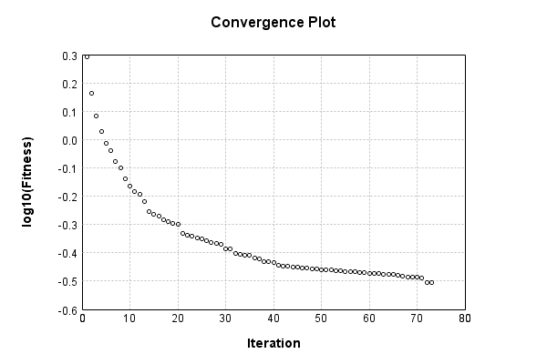

### Model
This is a very simple model that performs basic logistic regression. It is expected to be trainable to about 91% accuracy on MNIST.

Code from [MnistTestBase.java:272](../../../../../../../../MindsEye/src/test/java/com/simiacryptus/mindseye/mnist/MnistTestBase.java#L272) executed in 0.00 seconds: 
```java
    PipelineNetwork network = new PipelineNetwork();
    network.add(new BiasLayer(28, 28, 1));
    network.add(new FullyConnectedLayer(new int[]{28, 28, 1}, new int[]{10})
      .setWeights(() -> 0.001 * (Math.random() - 0.45)));
    network.add(new SoftmaxActivationLayer());
    return network;
```

Returns: 

```
    PipelineNetwork/e1035fb9-1fe3-4846-a360-622900000063
```


### Training
Code from [TrustSphereTest.java:43](../../../../../../../../MindsEye/src/test/java/com/simiacryptus/mindseye/opt/region/TrustSphereTest.java#L43) executed in 181.10 seconds: 
```java
    SimpleLossNetwork supervisedNetwork = new SimpleLossNetwork(network, new EntropyLossLayer());
    Trainable trainable = new SampledArrayTrainable(trainingData, supervisedNetwork, 10000);
    TrustRegionStrategy trustRegionStrategy = new TrustRegionStrategy() {
      @Override
      public TrustRegion getRegionPolicy(NNLayer layer) {
        return new AdaptiveTrustSphere();
      }
    };
    return new IterativeTrainer(trainable)
      .setIterationsPerSample(100)
      .setMonitor(monitor)
      //.setOrientation(new ValidatingOrientationWrapper(trustRegionStrategy))
      .setOrientation(trustRegionStrategy)
      .setTimeout(3, TimeUnit.MINUTES)
      .setMaxIterations(500)
      .run();
```
Logging: 
```
    LBFGS Accumulation History: 1 points
    Constructing line search parameters: GD+Trust
    Returning cached value; 2 buffers unchanged since 0.0 => 2.431096931755002
    th(0)=2.431096931755002;dx=-456728.90823694115
    Armijo: th(2.154434690031884)=20.963655720654987; dx=4.836460345111252E-22 delta=-18.532558788899983
    Armijo: th(1.077217345015942)=20.963655720654987; dx=1.9592274270045517E-10 delta=-18.532558788899983
    Armijo: th(0.3590724483386473)=20.961980971373936; dx=0.02428414843035565 delta=-18.530884039618932
    Armijo: th(0.08976811208466183)=20.951863694712202; dx=0.24027139687658525 delta=-18.5207667629572
    Armijo: th(0.017953622416932366)=20.928281466913063; dx=2.338021304411462 delta=-18.497184535158063
    Armijo: th(0.002992270402822061)=20.822135575565376; dx=99.34999557136511 delta=-18.391038643810376
    Armijo: th(4.2746720040315154E-4)=19.458227323770195; dx=10866.00578613285 delta=-17.027130392015195
    Armijo: th(5.343340005039394E-5)=8.267296509048311; dx=260242.32814330995 delta=-5.836199577293309
    New Minimum: 2.431096931755002 > 1.8800941179545103
    WOLF (strong): th(5.9370444500437714E-6)=1.8800941179545103; dx=41723.29985414295 delta=0.5510028138004919
    END: th(5.937044450043771E-7)=2.303578784446302; dx=-402073.23685695115 delta=0.12751814730870015
    Iteration 1 complete. Error: 1.8800941179545103 Total: 184180894975135.7200; Orientation: 0.0006; Line Search: 13.5796
    LBFGS Accumulation History: 2 points
    Returning cached value; 2 buffers unchanged since 0.0 => 1.8800941179545103
    th(0)=1.8800941179545103;dx=-490645.6949689389
    New Minimum: 1.8800941179545103 > 1.6244553117942153
    END: th(1.2790974519435567E-6)=1.6244553117942153; dx=-307445.80646296847 delta=0.255638806160295
    Iteration 2 complete. Error: 1.6244553117942153 Total: 184182331268484.1000; Orientation: 0.0023; Line Search: 1.4336
    LBFGS Accumulation History: 3 points
    Returning cached value; 2 buffers unchanged since 0.0 => 1.6244553117942153
    th(0)=1.6244553117942153;dx=-239418.0610423453
    New Minimum: 1.6244553117942153 > 1.377111592780093
```
...[skipping 36152 bytes](etc/1.txt)...
```
    ory: 3 points
    Returning cached value; 2 buffers unchanged since 0.0 => 0.35291388677335783
    th(0)=0.35291388677335783;dx=-258.65054661281727
    New Minimum: 0.35291388677335783 > 0.35157949112538367
    WOLFE (weak): th(1.0837875078523368E-5)=0.35157949112538367; dx=-233.46565358502392 delta=0.0013343956479741625
    New Minimum: 0.35157949112538367 > 0.3503806147372715
    END: th(2.1675750157046735E-5)=0.3503806147372715; dx=-208.6254862568356 delta=0.0025332720360863314
    Iteration 55 complete. Error: 0.3503806147372715 Total: 184338204307322.6200; Orientation: 0.0021; Line Search: 2.8132
    Orientation vanished. Popping history element from 0.3614646950083724, 0.35379530375887913, 0.35291388677335783, 0.3503806147372715
    LBFGS Accumulation History: 3 points
    Returning cached value; 2 buffers unchanged since 0.0 => 0.3503806147372715
    th(0)=0.3503806147372715;dx=-379.5097054082964
    Armijo: th(4.669898807080554E-5)=0.35983198086089724; dx=1195.3775278487435 delta=-0.009451366123625737
    Armijo: th(2.334949403540277E-5)=0.35052279818292287; dx=399.976775796961 delta=-1.421834456513671E-4
    New Minimum: 0.3503806147372715 > 0.3494180888599162
    END: th(7.78316467846759E-6)=0.3494180888599162; dx=-119.99457077015227 delta=9.625258773552914E-4
    Iteration 56 complete. Error: 0.3494180888599162 Total: 184342483458186.7800; Orientation: 0.0020; Line Search: 4.2770
    Orientation vanished. Popping history element from 0.35379530375887913, 0.35291388677335783, 0.3503806147372715, 0.3494180888599162
    LBFGS Accumulation History: 3 points
    Returning cached value; 2 buffers unchanged since 0.0 => 0.3494180888599162
    th(0)=0.3494180888599162;dx=-327.4809971440762
    New Minimum: 0.3494180888599162 > 0.3482161367813411
    WOLF (strong): th(1.676831998152143E-5)=0.3482161367813411; dx=42.48289912840083 delta=0.001201952078575097
    END: th(8.384159990760714E-6)=0.34842950424978164; dx=-141.55217105483518 delta=9.885846101345686E-4
    Iteration 57 complete. Error: 0.3482161367813411 Total: 184345378828081.5300; Orientation: 0.0019; Line Search: 2.8934
    
```

Returns: 

```
    0.3482161367813411
```


Code from [MnistTestBase.java:131](../../../../../../../../MindsEye/src/test/java/com/simiacryptus/mindseye/mnist/MnistTestBase.java#L131) executed in 0.01 seconds: 
```java
    PlotCanvas plot = ScatterPlot.plot(history.stream().map(step -> new double[]{step.iteration, Math.log10(step.point.getMean())}).toArray(i -> new double[i][]));
    plot.setTitle("Convergence Plot");
    plot.setAxisLabels("Iteration", "log10(Fitness)");
    plot.setSize(600, 400);
    return plot;
```

Returns: 




Saved model as [model0.json](etc/model0.json)

### Metrics
Code from [MnistTestBase.java:144](../../../../../../../../MindsEye/src/test/java/com/simiacryptus/mindseye/mnist/MnistTestBase.java#L144) executed in 0.66 seconds: 
```java
    try {
      ByteArrayOutputStream out = new ByteArrayOutputStream();
      JsonUtil.writeJson(out, monitoringRoot.getMetrics());
      return out.toString();
    } catch (IOException e) {
      throw new RuntimeException(e);
    }
```

Returns: 

```
    [ "java.util.HashMap", {
      "FullyConnectedLayer/e1035fb9-1fe3-4846-a360-622900000065" : [ "java.util.HashMap", {
        "avgMsPerItem" : 0.0118807989,
        "medianMsPerItem" : "NaN",
        "avgMsPerItem_Backward" : 8.223576343307085E-6,
        "totalItems" : 1270000,
        "backpropStatistics" : [ "java.util.HashMap", {
          "meanExponent" : -6.5768449233303325,
          "tp50" : -1.534768321637019E-5,
          "negative" : 5000,
          "min" : -1.99921744271287E-4,
          "max" : 1.9400875620744526E-4,
          "tp90" : -1.1153531419500568E-6,
          "mean" : -1.156785298547713E-22,
          "count" : 50000.0,
          "positive" : 45000,
          "stdDev" : 2.482995611189328E-5,
          "tp75" : -4.350161393650106E-6,
          "zeros" : 0
        } ],
        "totalBatches" : 254,
        "weights" : [ "java.util.HashMap", {
          "tp50" : "NaN",
          "buffers" : 1,
          "max" : 0.0021594104754522328,
          "tp90" : "NaN",
          "count" : 7840.0,
          "positive" : 4292,
          "tp75" : "NaN",
          "zeros" : 0,
          "meanExponent" : -3.6573931405659588,
          "negative" : 3548,
          "min" : -0.0018135747399317084,
          "mean" : 4.8448505484238953E-5,
          "stdDev" : 4.0925451114193E-4
        } ],
        "class" : "com.simiacryptus.mindseye.layers.java.FullyConnectedLayer",
        "outputStatistics" : [ "java.util.HashMap", {
          "meanExponent" : 0.21054398725394047,
          "tp50" : -3.68289363433008,
          "negative" : 18972,
          "min" : -7.248517540601434,
          "max" : 10.777766810386014,
          "tp90" : -2.893094618393246,
          "mean" : 1.1185241963911023,
          "count" : 50000.0,
          "positive" : 31028,
          "stdDev" : 3.2604489046892495,
          "tp75" : -3.1375856907621427,
          "zeros" : 0
        } ],
        "medianMsPerItem_Backward" : "NaN"
      } ],
      "SoftmaxActivationLayer/e1035fb9-1fe3-4846-a360-622900000066" : [ "java.util.HashMap", {
        "avgMsPerItem" : 0.0032075855007874018,
        "medianMsPerItem" : "NaN",
        "avgMsPerItem_Backward" : 1.637997448818898E-7,
        "totalItems" : 1270000,
        "ba
```
...[skipping 789 bytes](etc/2.txt)...
```
          "tp90" : 1.0525139225256566E-5,
          "mean" : 0.1,
          "count" : 50000.0,
          "positive" : 50000,
          "stdDev" : 0.2579124859351239,
          "tp75" : 6.7260235590318765E-6,
          "zeros" : 0
        } ],
        "medianMsPerItem_Backward" : "NaN"
      } ],
      "BiasLayer/e1035fb9-1fe3-4846-a360-622900000064" : [ "java.util.HashMap", {
        "avgMsPerItem" : 0.017650414392125988,
        "medianMsPerItem" : "NaN",
        "avgMsPerItem_Backward" : 4.340646778425198E-6,
        "totalItems" : 1270000,
        "backpropStatistics" : [ "java.util.HashMap", {
          "meanExponent" : -8.498855754184381,
          "tp50" : -2.348707879363633E-7,
          "negative" : 1944349,
          "min" : -1.483127765227264E-7,
          "max" : 1.596773095184447E-7,
          "tp90" : -2.0706535156884134E-7,
          "mean" : -1.117885193915567E-11,
          "count" : 3920000.0,
          "positive" : 1975651,
          "stdDev" : 3.172570862790125E-8,
          "tp75" : -2.1566629751319126E-7,
          "zeros" : 0
        } ],
        "totalBatches" : 254,
        "weights" : [ "java.util.HashMap", {
          "tp50" : "NaN",
          "buffers" : 1,
          "max" : 9.552458276293625E-9,
          "tp90" : "NaN",
          "count" : 784.0,
          "positive" : 385,
          "tp75" : "NaN",
          "zeros" : 0,
          "meanExponent" : -8.75822305746763,
          "negative" : 399,
          "min" : -1.3273271065570084E-8,
          "mean" : -1.4930085751752458E-10,
          "stdDev" : 3.3842208964646367E-9
        } ],
        "class" : "com.simiacryptus.mindseye.layers.java.BiasLayer",
        "outputStatistics" : [ "java.util.HashMap", {
          "meanExponent" : -6.698599589804761,
          "tp50" : -1.3273271065570084E-8,
          "negative" : 1579260,
          "min" : 6.205581152696723E-10,
          "max" : 6.205581152696723E-10,
          "tp90" : -1.2580658969293301E-8,
          "mean" : 33.30233749984889,
          "count" : 3920000.0,
          "positive" : 2340740,
          "stdDev" : 78.57190727396099,
          "tp75" : -1.2580658969293301E-8,
          "zeros" : 0
        } ],
        "medianMsPerItem_Backward" : "NaN"
      } ]
    } ]
```


### Validation
If we run our model against the entire validation dataset, we get this accuracy:

Code from [MnistTestBase.java:201](../../../../../../../../MindsEye/src/test/java/com/simiacryptus/mindseye/mnist/MnistTestBase.java#L201) executed in 0.92 seconds: 
```java
    return MNIST.validationDataStream().mapToDouble(labeledObject ->
      predict(network, labeledObject)[0] == parse(labeledObject.label) ? 1 : 0)
      .average().getAsDouble() * 100;
```

Returns: 

```
    90.33
```


Let's examine some incorrectly predicted results in more detail:

Code from [MnistTestBase.java:208](../../../../../../../../MindsEye/src/test/java/com/simiacryptus/mindseye/mnist/MnistTestBase.java#L208) executed in 0.26 seconds: 
```java
    try {
      TableOutput table = new TableOutput();
      MNIST.validationDataStream().map(labeledObject -> {
        try {
          int actualCategory = parse(labeledObject.label);
          double[] predictionSignal = CudaExecutionContext.gpuContexts.run(ctx -> network.eval(ctx, labeledObject.data).getData().get(0).getData());
          int[] predictionList = IntStream.range(0, 10).mapToObj(x -> x).sorted(Comparator.comparing(i -> -predictionSignal[i])).mapToInt(x -> x).toArray();
          if (predictionList[0] == actualCategory) return null; // We will only examine mispredicted rows
          LinkedHashMap<String, Object> row = new LinkedHashMap<String, Object>();
          row.put("Image", log.image(labeledObject.data.toGrayImage(), labeledObject.label));
          row.put("Prediction", Arrays.stream(predictionList).limit(3)
            .mapToObj(i -> String.format("%d (%.1f%%)", i, 100.0 * predictionSignal[i]))
            .reduce((a, b) -> a + ", " + b).get());
          return row;
        } catch (IOException e) {
          throw new RuntimeException(e);
        }
      }).filter(x -> null != x).limit(10).forEach(table::putRow);
      return table;
    } catch (IOException e) {
      throw new RuntimeException(e);
    }
```

Returns: 

Image | Prediction
----- | ----------
![[5]](etc/test.2.png)  | 6 (78.2%), 2 (12.0%), 4 (2.8%) 
![[4]](etc/test.3.png)  | 0 (61.2%), 6 (24.0%), 2 (6.4%) 
![[2]](etc/test.4.png)  | 7 (85.8%), 2 (9.3%), 9 (3.3%)  
![[9]](etc/test.5.png)  | 4 (49.6%), 9 (24.8%), 8 (10.8%)
![[7]](etc/test.6.png)  | 1 (49.7%), 7 (30.5%), 9 (7.5%) 
![[7]](etc/test.7.png)  | 4 (73.4%), 9 (19.3%), 7 (4.8%) 
![[0]](etc/test.8.png)  | 3 (40.0%), 2 (31.2%), 0 (27.0%)
![[2]](etc/test.9.png)  | 9 (45.4%), 4 (20.0%), 8 (9.9%) 
![[9]](etc/test.10.png) | 3 (37.9%), 4 (35.1%), 9 (14.7%)
![[6]](etc/test.11.png) | 5 (72.1%), 8 (13.0%), 6 (7.1%) 


