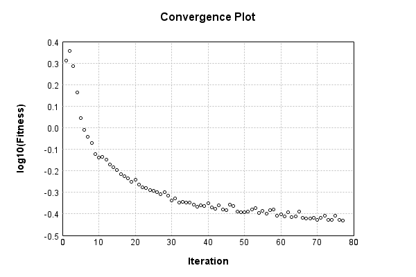

### Model
This is a very simple model that performs basic logistic regression. It is expected to be trainable to about 91% accuracy on MNIST.

Code from [MnistTestBase.java:295](../../../../../../../../MindsEye/src/test/java/com/simiacryptus/mindseye/mnist/MnistTestBase.java#L295) executed in 0.00 seconds: 
```java
    PipelineNetwork network = new PipelineNetwork();
    network.add(new BiasLayer(28, 28, 1));
    network.add(new FullyConnectedLayer(new int[]{28, 28, 1}, new int[]{10})
      .setWeights(() -> 0.001 * (Math.random() - 0.45)));
    network.add(new SoftmaxActivationLayer());
    return network;
```

Returns: 

```
    PipelineNetwork/3cc8990a-29bd-4377-9ee9-863800000064
```


### Training
Training a model involves a few different components. First, our model is combined mapCoords a loss function. Then we take that model and combine it mapCoords our training data to define a trainable object. Finally, we use a simple iterative scheme to refine the weights of our model. The final output is the last output value of the loss function when evaluating the last batch.

Code from [HoldoverStochasticGradientDescentTest.java:47](../../../../../../../../MindsEye/src/test/java/com/simiacryptus/mindseye/opt/trainable/HoldoverStochasticGradientDescentTest.java#L47) executed in 301.76 seconds: 
```java
    SimpleLossNetwork supervisedNetwork = new SimpleLossNetwork(network, new EntropyLossLayer());
    Trainable trainable = new DeltaHoldoverArrayTrainable(trainingData, supervisedNetwork, 10000);
    return new IterativeTrainer(trainable)
      .setMonitor(monitor)
      .setOrientation(new GradientDescent())
      .setTimeout(5, TimeUnit.MINUTES)
      .setMaxIterations(500)
      .run();
```
Logging: 
```
    Constructing line search parameters: GD
    th(0)=2.6279095295985986;dx=-528013.9359219795
    Armijo: th(2.154434690031884)=21.20957180858675; dx=1.128728086428576E-26 delta=-18.581662278988155
    Armijo: th(1.077217345015942)=21.20957180858675; dx=9.331717883849735E-9 delta=-18.581662278988155
    Armijo: th(0.3590724483386473)=21.208180050609172; dx=0.007672844771271681 delta=-18.580270521010576
    Armijo: th(0.08976811208466183)=21.202622658181596; dx=0.15521114340894038 delta=-18.574713128583
    Armijo: th(0.017953622416932366)=21.185465753375706; dx=2.8885950047845035 delta=-18.557556223777105
    Armijo: th(0.002992270402822061)=21.00719718103646; dx=161.69717965440694 delta=-18.379287651437863
    Armijo: th(4.2746720040315154E-4)=19.6632659984314; dx=8427.016146622442 delta=-17.035356468832802
    Armijo: th(5.343340005039394E-5)=9.483428523972236; dx=294449.7831325349 delta=-6.855518994373638
    New Minimum: 2.6279095295985986 > 2.0424717832834407
    WOLF (strong): th(5.9370444500437714E-6)=2.0424717832834407; dx=54125.34936762172 delta=0.5854377463151579
    END: th(5.937044450043771E-7)=2.4824347193408016; dx=-451824.18996388617 delta=0.14547481025779696
    Iteration 1 complete. Error: 2.0424717832834407 Total: 14513623853276.5940; Orientation: 0.0004; Line Search: 10.2306
    th(0)=2.4982208877839747;dx=-404295.49671538704
    New Minimum: 2.4982208877839747 > 2.2673814248580295
    END: th(1.2790974519435567E-6)=2.2673814248580295; dx=-317085.36581216636 delta=0.23083946292594515
    Iteration 2 complete. Error: 2.2673814248580295 Total: 14516601089722.3770; Orientation: 0.0005; Line Search: 1.9801
    th(0)=2.2691970475660472;dx=-278681.81014978274
    New Minimum: 2.2691970475660472 > 1.928210409265488
    END: th(2.755731922398589E-6)=1.928210409265488; dx=-215149.74769053658 delta=0.3409866383005593
    Iteration 3 complete. Error: 1.928210409265488 Total: 14519593273318.3980; Orientation: 0.0003; Line Search: 1.9771
    th(0)=1.935060556199181;dx=-192359.8156337727
    New Minimum: 1.935060556199181 > 1.454835571621056
    END: th(5.937044450043771E-6)=1.4548
```
...[skipping 30047 bytes](etc/1.txt)...
```
    22836;dx=-716.2853548564793
    New Minimum: 0.3749313592922836 > 0.37402141236828035
    WOLF (strong): th(1.8535581176810884E-5)=0.37402141236828035; dx=513.4309298805588 delta=9.099469240032576E-4
    New Minimum: 0.37402141236828035 > 0.3730530869186379
    END: th(9.267790588405442E-6)=0.3730530869186379; dx=-99.8084489787406 delta=0.0018782723736456841
    Iteration 74 complete. Error: 0.3730530869186379 Total: 14789596091775.4160; Orientation: 0.0004; Line Search: 2.9860
    th(0)=0.39375606480793757;dx=-786.1959389528377
    New Minimum: 0.39375606480793757 > 0.39174804570375693
    WOLF (strong): th(1.996684954361169E-5)=0.39174804570375693; dx=373.2242839483473 delta=0.002008019104180636
    New Minimum: 0.39174804570375693 > 0.39130717393295167
    END: th(9.983424771805844E-6)=0.39130717393295167; dx=-202.11416757032794 delta=0.0024488908749858984
    Iteration 75 complete. Error: 0.39130717393295167 Total: 14793809325221.4040; Orientation: 0.0004; Line Search: 3.1969
    th(0)=0.37490782872678313;dx=-726.0733852362392
    New Minimum: 0.37490782872678313 > 0.3735013134048319
    WOLF (strong): th(2.1508636653702154E-5)=0.3735013134048319; dx=459.4908911385131 delta=0.0014065153219512405
    New Minimum: 0.3735013134048319 > 0.3726113565327789
    END: th(1.0754318326851077E-5)=0.3726113565327789; dx=-127.95846661199508 delta=0.002296472194004251
    Iteration 76 complete. Error: 0.3726113565327789 Total: 14797883349336.1910; Orientation: 0.0004; Line Search: 3.0518
    th(0)=0.3741526669757295;dx=-1536.4854745545301
    Armijo: th(2.316947647101361E-5)=0.3869416117270653; dx=3751.988395427476 delta=-0.012788944751335796
    New Minimum: 0.3741526669757295 > 0.3729056433132882
    WOLF (strong): th(1.1584738235506804E-5)=0.3729056433132882; dx=1089.7020907612443 delta=0.0012470236624413378
    New Minimum: 0.3729056433132882 > 0.37204751641826983
    END: th(3.861579411835602E-6)=0.37204751641826983; dx=-660.4156823538885 delta=0.0021051505574596896
    Iteration 77 complete. Error: 0.37204751641826983 Total: 14803114884125.1170; Orientation: 0.0007; Line Search: 4.1452
    
```

Returns: 

```
    0.37204751641826983
```


Code from [MnistTestBase.java:141](../../../../../../../../MindsEye/src/test/java/com/simiacryptus/mindseye/mnist/MnistTestBase.java#L141) executed in 0.01 seconds: 
```java
    PlotCanvas plot = ScatterPlot.plot(history.stream().map(step -> new double[]{step.iteration, Math.log10(step.point.getMean())}).toArray(i -> new double[i][]));
    plot.setTitle("Convergence Plot");
    plot.setAxisLabels("Iteration", "log10(Fitness)");
    plot.setSize(600, 400);
    return plot;
```

Returns: 




Saved model as [model0.json](etc/model0.json)

### Metrics
Code from [MnistTestBase.java:154](../../../../../../../../MindsEye/src/test/java/com/simiacryptus/mindseye/mnist/MnistTestBase.java#L154) executed in 0.59 seconds: 
```java
    try {
      ByteArrayOutputStream out = new ByteArrayOutputStream();
      JsonUtil.writeJson(out, monitoringRoot.getMetrics());
      return out.toString();
    } catch (IOException e) {
      throw new RuntimeException(e);
    }
```

Returns: 

```
    [ "java.util.HashMap", {
      "FullyConnectedLayer/3cc8990a-29bd-4377-9ee9-863800000066" : [ "java.util.HashMap", {
        "avgMsPerItem" : 0.007931025190553742,
        "medianMsPerItem" : "NaN",
        "avgMsPerItem_Backward" : 5.929447728143321E-6,
        "totalItems" : 3070000,
        "backpropStatistics" : [ "java.util.HashMap", {
          "meanExponent" : -6.5318298545938624,
          "tp50" : -1.709867448509812E-5,
          "negative" : 5000,
          "min" : -1.9999311299885754E-4,
          "max" : 1.9054111973826617E-4,
          "tp90" : -1.517114695604955E-6,
          "mean" : 1.327388301616432E-23,
          "count" : 50000.0,
          "positive" : 45000,
          "stdDev" : 2.5926627892263284E-5,
          "tp75" : -5.0754520473598215E-6,
          "zeros" : 0
        } ],
        "totalBatches" : 614,
        "weights" : [ "java.util.HashMap", {
          "tp50" : "NaN",
          "buffers" : 1,
          "max" : 0.0020814386080889357,
          "tp90" : "NaN",
          "count" : 7840.0,
          "positive" : 4248,
          "tp75" : "NaN",
          "zeros" : 0,
          "meanExponent" : -3.6633314492351667,
          "negative" : 3592,
          "min" : -0.0016634799902978282,
          "mean" : 4.970956646047177E-5,
          "stdDev" : 4.00859602924373E-4
        } ],
        "class" : "com.simiacryptus.mindseye.layers.java.FullyConnectedLayer",
        "outputStatistics" : [ "java.util.HashMap", {
          "meanExponent" : 0.21435912418438094,
          "tp50" : -3.7396916011319825,
          "negative" : 18869,
          "min" : -6.053316500647624,
          "max" : 10.08530189018335,
          "tp90" : -2.9329750925529816,
          "mean" : 1.1245072962836593,
          "count" : 50000.0,
          "positive" : 31131,
          "stdDev" : 3.26337071552227,
          "tp75" : -3.2092229784201423,
          "zeros" : 0
        } ],
        "medianMsPerItem_Backward" : "NaN"
      } ],
      "SoftmaxActivationLayer/3cc8990a-29bd-4377-9ee9-863800000067" : [ "java.util.HashMap", {
        "avgMsPerItem" : 0.0019816452762215016,
        "medianMsPerItem" : "NaN",
        "avgMsPerItem_Backward" : 9.159271335504882E-8,
        "totalItems" : 3070000
```
...[skipping 790 bytes](etc/2.txt)...
```
    
          "tp90" : 1.1985474498235135E-5,
          "mean" : 0.1,
          "count" : 50000.0,
          "positive" : 50000,
          "stdDev" : 0.25571933994118773,
          "tp75" : 7.63287662077241E-6,
          "zeros" : 0
        } ],
        "medianMsPerItem_Backward" : "NaN"
      } ],
      "BiasLayer/3cc8990a-29bd-4377-9ee9-863800000065" : [ "java.util.HashMap", {
        "avgMsPerItem" : 0.012459128737459284,
        "medianMsPerItem" : "NaN",
        "avgMsPerItem_Backward" : 2.9633925866449524E-6,
        "totalItems" : 3070000,
        "backpropStatistics" : [ "java.util.HashMap", {
          "meanExponent" : -8.449129842252868,
          "tp50" : -2.3265916932514807E-7,
          "negative" : 1909408,
          "min" : -1.2054735261505358E-7,
          "max" : 1.2779372082828088E-7,
          "tp90" : -2.0638228628187764E-7,
          "mean" : 2.1095628252530344E-11,
          "count" : 3920000.0,
          "positive" : 2010592,
          "stdDev" : 3.2251943047492345E-8,
          "tp75" : -2.1451874608749855E-7,
          "zeros" : 0
        } ],
        "totalBatches" : 614,
        "weights" : [ "java.util.HashMap", {
          "tp50" : "NaN",
          "buffers" : 1,
          "max" : 8.752122772130764E-9,
          "tp90" : "NaN",
          "count" : 784.0,
          "positive" : 375,
          "tp75" : "NaN",
          "zeros" : 0,
          "meanExponent" : -8.763401956584755,
          "negative" : 409,
          "min" : -9.65370366356546E-9,
          "mean" : -3.208719967584753E-10,
          "stdDev" : 3.137764300194963E-9
        } ],
        "class" : "com.simiacryptus.mindseye.layers.java.BiasLayer",
        "outputStatistics" : [ "java.util.HashMap", {
          "meanExponent" : -6.6882893518585105,
          "tp50" : -9.65370366356546E-9,
          "negative" : 1640748,
          "min" : 1.2844297312864442E-9,
          "max" : 1.2844297312864442E-9,
          "tp90" : -9.267496422795998E-9,
          "mean" : 33.36027678539148,
          "count" : 3920000.0,
          "positive" : 2279252,
          "stdDev" : 78.60525795665005,
          "tp75" : -9.267496422795998E-9,
          "zeros" : 0
        } ],
        "medianMsPerItem_Backward" : "NaN"
      } ]
    } ]
```


### Validation
If we run our model against the entire validation dataset, we get this accuracy:

Code from [MnistTestBase.java:211](../../../../../../../../MindsEye/src/test/java/com/simiacryptus/mindseye/mnist/MnistTestBase.java#L211) executed in 0.68 seconds: 
```java
    return MNIST.validationDataStream().mapToDouble(labeledObject ->
      predict(network, labeledObject)[0] == parse(labeledObject.label) ? 1 : 0)
      .average().getAsDouble() * 100;
```

Returns: 

```
    90.4
```


Let's examine some incorrectly predicted results in more detail:

Code from [MnistTestBase.java:218](../../../../../../../../MindsEye/src/test/java/com/simiacryptus/mindseye/mnist/MnistTestBase.java#L218) executed in 0.23 seconds: 
```java
    try {
      TableOutput table = new TableOutput();
      MNIST.validationDataStream().map(labeledObject -> {
        try {
          int actualCategory = parse(labeledObject.label);
          double[] predictionSignal = CudaExecutionContext.gpuContexts.run(ctx -> network.eval(ctx, labeledObject.data).getData().get(0).getData());
          int[] predictionList = IntStream.range(0, 10).mapToObj(x -> x).sorted(Comparator.comparing(i -> -predictionSignal[i])).mapToInt(x -> x).toArray();
          if (predictionList[0] == actualCategory) return null; // We will only examine mispredicted rows
          LinkedHashMap<String, Object> row = new LinkedHashMap<String, Object>();
          row.put("Image", log.image(labeledObject.data.toGrayImage(), labeledObject.label));
          row.put("Prediction", Arrays.stream(predictionList).limit(3)
            .mapToObj(i -> String.format("%d (%.1f%%)", i, 100.0 * predictionSignal[i]))
            .reduce((a, b) -> a + ", " + b).get());
          return row;
        } catch (IOException e) {
          throw new RuntimeException(e);
        }
      }).filter(x -> null != x).limit(10).forEach(table::putRow);
      return table;
    } catch (IOException e) {
      throw new RuntimeException(e);
    }
```

Returns: 

Image | Prediction
----- | ----------
![[5]](etc/test.2.png)  | 6 (80.1%), 2 (11.0%), 4 (2.7%) 
![[4]](etc/test.3.png)  | 0 (45.1%), 6 (27.3%), 5 (9.9%) 
![[1]](etc/test.4.png)  | 3 (56.0%), 1 (23.9%), 5 (8.2%) 
![[2]](etc/test.5.png)  | 7 (91.1%), 2 (4.8%), 9 (2.7%)  
![[7]](etc/test.6.png)  | 9 (49.4%), 7 (42.6%), 4 (5.4%) 
![[9]](etc/test.7.png)  | 4 (33.0%), 9 (27.5%), 8 (24.6%)
![[7]](etc/test.8.png)  | 1 (50.1%), 7 (25.5%), 9 (8.5%) 
![[7]](etc/test.9.png)  | 4 (50.7%), 9 (29.6%), 7 (14.3%)
![[2]](etc/test.10.png) | 9 (42.0%), 8 (19.6%), 4 (10.3%)
![[9]](etc/test.11.png) | 3 (36.7%), 4 (28.9%), 9 (20.4%)


