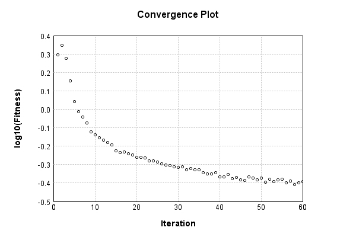

### Model
This is a very simple model that performs basic logistic regression. It is expected to be trainable to about 91% accuracy on MNIST.

Code from [MnistTestBase.java:293](../../../../../../../src/test/java/com/simiacryptus/mindseye/opt/MnistTestBase.java#L293) executed in 0.00 seconds: 
```java
    PipelineNetwork network = new PipelineNetwork();
    network.add(new BiasLayer(28, 28, 1));
    network.add(new FullyConnectedLayer(new int[]{28, 28, 1}, new int[]{10})
      .setWeights(() -> 0.001 * (Math.random() - 0.45)));
    network.add(new SoftmaxActivationLayer());
    return network;
```

Returns: 

```
    PipelineNetwork/3442b395-31c0-46af-91f7-51fd8a4ef35a
```


### Training
Training a model involves a few different components. First, our model is combined mapCoords a loss function. Then we take that model and combine it mapCoords our training data to define a trainable object. Finally, we use a simple iterative scheme to refine the weights of our model. The final output is the last output value of the loss function when evaluating the last batch.

Code from [HoldoverStochasticGradientDescentTest.java:47](../../../../../../../src/test/java/com/simiacryptus/mindseye/opt/trainable/HoldoverStochasticGradientDescentTest.java#L47) executed in 301.27 seconds: 
```java
    SimpleLossNetwork supervisedNetwork = new SimpleLossNetwork(network, new EntropyLossLayer());
    Trainable trainable = new DeltaHoldoverArrayTrainable(trainingData, supervisedNetwork, 10000);
    return new IterativeTrainer(trainable)
      .setMonitor(monitor)
      .setOrientation(new GradientDescent())
      .setTimeout(5, TimeUnit.MINUTES)
      .setMaxIterations(500)
      .run();
```
Logging: 
```
    Constructing line search parameters: GD
    th(0)=2.5753221111899336;dx=-455650.5193042621
    Armijo: th(2.154434690031884)=19.170402450231226; dx=-1.0333582557468205E-14 delta=-16.595080339041292
    Armijo: th(1.077217345015942)=19.17040245046231; dx=-5.931556499953397E-9 delta=-16.595080339272375
    Armijo: th(0.3590724483386473)=19.170404797120067; dx=-5.9994942030945616E-5 delta=-16.595082685930134
    Armijo: th(0.08976811208466183)=19.16823749577961; dx=0.13620948937269087 delta=-16.592915384589677
    Armijo: th(0.017953622416932366)=19.15607224753343; dx=2.75403948588715 delta=-16.580750136343497
    Armijo: th(0.002992270402822061)=19.04591053405605; dx=99.56226098024715 delta=-16.470588422866115
    Armijo: th(4.2746720040315154E-4)=17.953623616653328; dx=9467.230060089621 delta=-15.378301505463394
    Armijo: th(5.343340005039394E-5)=7.3424795156836; dx=202934.20924742182 delta=-4.767157404493666
    New Minimum: 2.5753221111899336 > 1.9757130303521224
    WOLF (strong): th(5.9370444500437714E-6)=1.9757130303521224; dx=2549.578
```
...[skipping 24332 bytes](etc/175.txt)...
```
    h(0)=0.402281545533542;dx=-1215.943656347606
    New Minimum: 0.402281545533542 > 0.400400495699011
    WOLF (strong): th(1.5374152451293996E-5)=0.400400495699011; dx=697.8209462156755 delta=0.0018810498345310234
    New Minimum: 0.400400495699011 > 0.3995024611167606
    END: th(7.687076225646998E-6)=0.3995024611167606; dx=-241.27142802679867 delta=0.00277908441678143
    Iteration 59 complete. Error: 0.3995024611167606 Total: 62298176978535.5000; Orientation: 0.0002; Line Search: 3.1498
    th(0)=0.40920750691101715;dx=-2118.877442667964
    Armijo: th(1.6561303685453252E-5)=0.4140348160472235; dx=3332.5758149674753 delta=-0.004827309136206326
    New Minimum: 0.40920750691101715 > 0.40599018454559305
    WOLF (strong): th(8.280651842726626E-6)=0.40599018454559305; dx=574.7887112121034 delta=0.0032173223654241023
    END: th(2.7602172809088755E-6)=0.4068979005407447; dx=-1224.4219563329689 delta=0.0023096063702724434
    Iteration 60 complete. Error: 0.40599018454559305 Total: 62304491257829.8200; Orientation: 0.0002; Line Search: 5.3229
    
```

Returns: 

```
    0.40599018454559305
```


Code from [MnistTestBase.java:139](../../../../../../../src/test/java/com/simiacryptus/mindseye/opt/MnistTestBase.java#L139) executed in 0.00 seconds: 
```java
    PlotCanvas plot = ScatterPlot.plot(history.stream().map(step -> new double[]{step.iteration, Math.log10(step.point.getMean())}).toArray(i -> new double[i][]));
    plot.setTitle("Convergence Plot");
    plot.setAxisLabels("Iteration", "log10(Fitness)");
    plot.setSize(600, 400);
    return plot;
```

Returns: 




Saved model as [model0.json](etc/model0.json)

### Metrics
Code from [MnistTestBase.java:152](../../../../../../../src/test/java/com/simiacryptus/mindseye/opt/MnistTestBase.java#L152) executed in 0.68 seconds: 
```java
    try {
      ByteArrayOutputStream out = new ByteArrayOutputStream();
      JsonUtil.writeJson(out, monitoringRoot.getMetrics());
      return out.toString();
    } catch (IOException e) {
      throw new RuntimeException(e);
    }
```

Returns: 

```
    [ "java.util.HashMap", {
      "BiasLayer/3916c55b-d5e6-4009-8142-580af5990cef" : [ "java.util.HashMap", {
        "avgMsPerItem" : 0.021586241085892105,
        "medianMsPerItem" : "NaN",
        "avgMsPerItem_Backward" : 2.5039783745228224E-6,
        "totalItems" : 2410000,
        "backpropStatistics" : [ "java.util.HashMap", {
          "meanExponent" : -4.675126778183739,
          "tp50" : -0.0011198413374222795,
          "negative" : 1939660,
          "min" : -6.98344919163726E-4,
          "max" : 7.229659808723074E-4,
          "tp90" : -9.889604136145138E-4,
          "mean" : 2.144424657932043E-7,
          "count" : 3920000.0,
          "positive" : 1980340,
          "stdDev" : 1.6125985989712252E-4,
          "tp75" : -0.001031472090747441,
          "zeros" : 0
        } ],
        "totalBatches" : 482,
        "weights" : [ "java.util.HashMap", {
          "tp50" : "NaN",
          "buffers" : 1,
          "max" : 6.749688077324032E-9,
          "tp90" : "NaN",
          "count" : 784.0,
          "positive" : 382,
          "tp75" : "NaN",
          "zeros" : 0,
          "mean
```
...[skipping 2812 bytes](etc/176.txt)...
```
    2,
        "weights" : [ "java.util.HashMap", {
          "tp50" : "NaN",
          "buffers" : 1,
          "max" : 0.002208960442401765,
          "tp90" : "NaN",
          "count" : 7840.0,
          "positive" : 4238,
          "tp75" : "NaN",
          "zeros" : 0,
          "meanExponent" : -3.6680698967399823,
          "negative" : 3602,
          "min" : -0.0016643240546037605,
          "mean" : 4.6770882506357746E-5,
          "stdDev" : 3.861613279020059E-4
        } ],
        "class" : "com.simiacryptus.mindseye.layers.java.FullyConnectedLayer",
        "outputStatistics" : [ "java.util.HashMap", {
          "meanExponent" : 0.18274308554281693,
          "tp50" : -3.282922274646618,
          "negative" : 17963,
          "min" : -6.867706971260422,
          "max" : 10.014696828376499,
          "tp90" : -2.550573997520525,
          "mean" : 1.1790570902013873,
          "count" : 50000.0,
          "positive" : 32037,
          "stdDev" : 3.02373871805658,
          "tp75" : -2.792039258649741,
          "zeros" : 0
        } ],
        "medianMsPerItem_Backward" : "NaN"
      } ]
    } ]
```


### Validation
If we run our model against the entire validation dataset, we get this accuracy:

Code from [MnistTestBase.java:209](../../../../../../../src/test/java/com/simiacryptus/mindseye/opt/MnistTestBase.java#L209) executed in 0.97 seconds: 
```java
    return MNIST.validationDataStream().mapToDouble(labeledObject ->
      predict(network, labeledObject)[0] == parse(labeledObject.label) ? 1 : 0)
      .average().getAsDouble() * 100;
```

Returns: 

```
    89.9
```


Let's examine some incorrectly predicted results in more detail:

Code from [MnistTestBase.java:216](../../../../../../../src/test/java/com/simiacryptus/mindseye/opt/MnistTestBase.java#L216) executed in 0.04 seconds: 
```java
    try {
      TableOutput table = new TableOutput();
      MNIST.validationDataStream().map(labeledObject -> {
        try {
          int actualCategory = parse(labeledObject.label);
          double[] predictionSignal = GpuController.call(ctx -> network.eval(ctx, labeledObject.data).getData().get(0).getData());
          int[] predictionList = IntStream.range(0, 10).mapToObj(x -> x).sorted(Comparator.comparing(i -> -predictionSignal[i])).mapToInt(x -> x).toArray();
          if (predictionList[0] == actualCategory) return null; // We will only examine mispredicted rows
          LinkedHashMap<String, Object> row = new LinkedHashMap<String, Object>();
          row.put("Image", log.image(labeledObject.data.toGrayImage(), labeledObject.label));
          row.put("Prediction", Arrays.stream(predictionList).limit(3)
            .mapToObj(i -> String.format("%d (%.1f%%)", i, 100.0 * predictionSignal[i]))
            .reduce((a, b) -> a + ", " + b).get());
          return row;
        } catch (IOException e) {
          throw new RuntimeException(e);
        }
      }).filter(x -> null != x).limit(10).forEach(table::putRow);
      return table;
    } catch (IOException e) {
      throw new RuntimeException(e);
    }
```

Returns: 

Image | Prediction
----- | ----------
![[5]](etc/test.808.png) | 6 (52.7%), 2 (23.8%), 0 (7.8%) 
![[4]](etc/test.809.png) | 6 (37.9%), 0 (30.7%), 2 (14.4%)
![[1]](etc/test.810.png) | 3 (44.3%), 1 (25.8%), 5 (8.3%) 
![[3]](etc/test.811.png) | 2 (55.5%), 3 (35.4%), 8 (3.6%) 
![[2]](etc/test.812.png) | 7 (83.5%), 9 (8.0%), 2 (5.4%)  
![[7]](etc/test.813.png) | 1 (43.3%), 7 (26.1%), 9 (11.3%)
![[7]](etc/test.814.png) | 4 (65.7%), 9 (20.8%), 7 (9.1%) 
![[2]](etc/test.815.png) | 9 (32.8%), 8 (23.8%), 1 (8.4%) 
![[5]](etc/test.816.png) | 4 (35.2%), 5 (33.0%), 3 (12.0%)
![[9]](etc/test.817.png) | 3 (32.0%), 4 (27.9%), 9 (24.0%)


