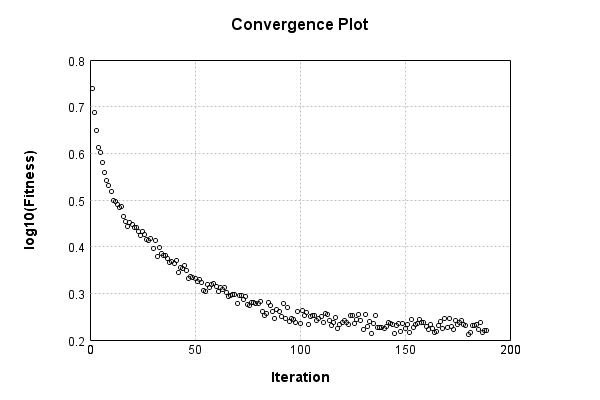

### Model
This is a very simple model that performs basic logistic regression. It is expected to be trainable to about 91% accuracy on MNIST.

Code from [MnistTestBase.java:272](../../../../../../../../MindsEye/src/test/java/com/simiacryptus/mindseye/mnist/MnistTestBase.java#L272) executed in 0.00 seconds: 
```java
    PipelineNetwork network = new PipelineNetwork();
    network.add(new BiasLayer(28, 28, 1));
    network.add(new FullyConnectedLayer(new int[]{28, 28, 1}, new int[]{10})
      .setWeights(() -> 0.001 * (Math.random() - 0.45)));
    network.add(new SoftmaxActivationLayer());
    return network;
```

Returns: 

```
    PipelineNetwork/e1035fb9-1fe3-4846-a360-622900000077
```


### Training
Code from [L1NormalizationTest.java:43](../../../../../../../../MindsEye/src/test/java/com/simiacryptus/mindseye/opt/trainable/L1NormalizationTest.java#L43) executed in 180.18 seconds: 
```java
    SimpleLossNetwork supervisedNetwork = new SimpleLossNetwork(network, new EntropyLossLayer());
    Trainable trainable = new L12Normalizer(new SampledArrayTrainable(trainingData, supervisedNetwork, 1000)) {
      @Override
      protected double getL1(NNLayer layer) {
        return 1.0;
      }
      
      @Override
      protected double getL2(NNLayer layer) {
        return 0;
      }
    };
    return new IterativeTrainer(trainable)
      .setMonitor(monitor)
      .setTimeout(3, TimeUnit.MINUTES)
      .setMaxIterations(500)
      .run();
```
Logging: 
```
    LBFGS Accumulation History: 1 points
    Constructing line search parameters: GD
    Returning cached value; 2 buffers unchanged since 0.0 => 2.37434644975707
    th(0)=6.712483047933626;dx=-412213.67625978
    Armijo: th(2.154434690031884)=72325.6071462531; dx=33556.781433216354 delta=-72318.89466320517
    Armijo: th(1.077217345015942)=36177.66014348344; dx=33556.781433216354 delta=-36170.9476604355
    Armijo: th(0.3590724483386473)=12079.023149509881; dx=33556.915925610665 delta=-12072.310666461948
    Armijo: th(0.08976811208466183)=3041.971023917662; dx=33557.20115389915 delta=-3035.258540869728
    Armijo: th(0.017953622416932366)=632.0112895605821; dx=33564.82867717276 delta=-625.2988065126485
    Armijo: th(0.002992270402822061)=129.4667174338857; dx=33707.16044370828 delta=-122.75423438595206
    Armijo: th(4.2746720040315154E-4)=40.3916568018185; dx=42785.28721055324 delta=-33.679173753884875
    Armijo: th(5.343340005039394E-5)=13.495970365669203; dx=185063.19726443008 delta=-6.7834873177355774
    New Minimum: 6.712483047933626 > 5.475960388134377
    END: th(5.9370444500437714E-6)=5.475960388134377; dx=-73807.1828494962 delta=1.236522659799249
    Iteration 1 complete. Error: 5.475960388134377 Total: 184654174092173.8400; Orientation: 0.0013; Line Search: 2.8413
    LBFGS Accumulation History: 1 points
    Returning cached value; 2 buffers unchanged since 0.0 => 1.8062292514098486
    th(0)=5.540866912709178;dx=-316085.8304138032
    Armijo: th(1.279097451943557E-5)=6.211500637631562; dx=312801.1398689459 delta=-0.6706337249223839
    New Minimum: 5.540866912709178 > 4.8632008999833785
    WOLF (strong): th(6.395487259717785E-6)=4.8632008999833785; dx=86225.91985839784 delta=0.6776660127257994
    END: th(2.131829086572595E-6)=5.017393197844937; dx=-171021.17532850188 delta=0.5234737148642408
    Iteration 2 complete. Error: 4.8632008999833785 Total: 184655410547004.8000; Orientation: 0.0012; Line Search: 0.9133
    LBFGS Accumulation History: 1 points
    Returning cached value; 2 buffers unchanged since 0.0 => 1.5579670516093966
    th(0)=5.032064584393815;dx=-171827.729
```
...[skipping 104461 bytes](etc/1.txt)...
```
    28179301809888; dx=-972.1766129464203 delta=0.004375197644554518
    Iteration 186 complete. Error: 1.728179301809888 Total: 184827124821513.5000; Orientation: 0.0014; Line Search: 0.3026
    LBFGS Accumulation History: 1 points
    Returning cached value; 2 buffers unchanged since 0.0 => 0.4813976732389015
    th(0)=1.6523800705999867;dx=-9346.773796548641
    New Minimum: 1.6523800705999867 > 1.6495485327362218
    WOLF (strong): th(1.8227595523475014E-6)=1.6495485327362218; dx=1664.9473860482638 delta=0.002831537863764888
    New Minimum: 1.6495485327362218 > 1.648558311670136
    WOLF (strong): th(9.113797761737507E-7)=1.648558311670136; dx=549.8191789782246 delta=0.003821758929850816
    END: th(3.0379325872458354E-7)=1.649806096110645; dx=-7320.2825585843 delta=0.0025739744893416017
    Iteration 187 complete. Error: 1.648558311670136 Total: 184828423293059.8800; Orientation: 0.0009; Line Search: 0.9794
    LBFGS Accumulation History: 1 points
    Returning cached value; 2 buffers unchanged since 0.0 => 0.48870216012615475
    th(0)=1.6656468266876898;dx=-12013.977324461042
    New Minimum: 1.6656468266876898 > 1.6623412315384738
    END: th(6.54502735194074E-7)=1.6623412315384738; dx=-1845.0438900789327 delta=0.003305595149216023
    Iteration 188 complete. Error: 1.6623412315384738 Total: 184829055536425.5600; Orientation: 0.0027; Line Search: 0.3159
    LBFGS Accumulation History: 1 points
    Returning cached value; 2 buffers unchanged since 0.0 => 0.48767851516522226
    th(0)=1.6642307115770225;dx=-9665.100288223444
    New Minimum: 1.6642307115770225 > 1.6608008948692659
    WOLF (strong): th(1.410083397422865E-6)=1.6608008948692659; dx=1324.2193330131852 delta=0.003429816707756661
    New Minimum: 1.6608008948692659 > 1.6602351391868573
    WOLF (strong): th(7.050416987114325E-7)=1.6602351391868573; dx=117.12678667788713 delta=0.003995572390165236
    END: th(2.350138995704775E-7)=1.6622000615149213; dx=-7333.969362931348 delta=0.0020306500621012358
    Iteration 189 complete. Error: 1.6602351391868573 Total: 184830338523955.9400; Orientation: 0.0010; Line Search: 0.9698
    
```

Returns: 

```
    1.6602351391868573
```


Code from [MnistTestBase.java:131](../../../../../../../../MindsEye/src/test/java/com/simiacryptus/mindseye/mnist/MnistTestBase.java#L131) executed in 0.01 seconds: 
```java
    PlotCanvas plot = ScatterPlot.plot(history.stream().map(step -> new double[]{step.iteration, Math.log10(step.point.getMean())}).toArray(i -> new double[i][]));
    plot.setTitle("Convergence Plot");
    plot.setAxisLabels("Iteration", "log10(Fitness)");
    plot.setSize(600, 400);
    return plot;
```

Returns: 




Saved model as [model0.json](etc/model0.json)

### Metrics
Code from [MnistTestBase.java:144](../../../../../../../../MindsEye/src/test/java/com/simiacryptus/mindseye/mnist/MnistTestBase.java#L144) executed in 0.05 seconds: 
```java
    try {
      ByteArrayOutputStream out = new ByteArrayOutputStream();
      JsonUtil.writeJson(out, monitoringRoot.getMetrics());
      return out.toString();
    } catch (IOException e) {
      throw new RuntimeException(e);
    }
```

Returns: 

```
    [ "java.util.HashMap", {
      "BiasLayer/e1035fb9-1fe3-4846-a360-622900000078" : [ "java.util.HashMap", {
        "avgMsPerItem" : 0.021283820557894743,
        "medianMsPerItem" : "NaN",
        "avgMsPerItem_Backward" : 2.8788201992982456E-5,
        "totalItems" : 570000,
        "backpropStatistics" : [ "java.util.HashMap", {
          "meanExponent" : -8.528094379914013,
          "tp50" : -1.7227931272854653E-6,
          "negative" : 156942,
          "min" : -8.50178567430789E-8,
          "max" : 4.966107149518748E-8,
          "tp90" : -1.523492874123543E-6,
          "mean" : 7.959525815061294E-10,
          "count" : 392000.0,
          "positive" : 235058,
          "stdDev" : 1.9731642443465087E-7,
          "tp75" : -1.584633148745329E-6,
          "zeros" : 0
        } ],
        "totalBatches" : 1140,
        "weights" : [ "java.util.HashMap", {
          "tp50" : "NaN",
          "buffers" : 1,
          "max" : 6.175510732291205E-9,
          "tp90" : "NaN",
          "count" : 784.0,
          "positive" : 379,
          "tp75" : "NaN",
          "zeros" : 0,
          "meanExponent" : -8.994876602254921,
          "negative" : 405,
          "min" : -1.0811902815710133E-8,
          "mean" : -2.467870356390387E-10,
          "stdDev" : 2.129311502726379E-9
        } ],
        "class" : "com.simiacryptus.mindseye.layers.java.BiasLayer",
        "outputStatistics" : [ "java.util.HashMap", {
          "meanExponent" : -6.896134294070527,
          "tp50" : -1.0811902815710133E-8,
          "negative" : 161961,
          "min" : 1.7324344408634977E-9,
          "max" : 1.7324344408634977E-9,
          "tp90" : -9.765623035991486E-9,
          "mean" : 33.46736224465097,
          "count" : 392000.0,
          "positive" : 230039,
          "stdDev" : 78.72919359774185,
          "tp75" : -9.765623035991486E-9,
          "zeros" : 0
        } ],
        "medianMsPerItem_Backward" : "NaN"
      } ],
      "FullyConnectedLayer/e1035fb9-1fe3-4846-a360-622900000079" : [ "java.util.HashMap", {
        "avgMsPerItem" : 0.014209078008771943,
        "medianMsPerItem" : "NaN",
        "avgMsPerItem_Backward" : 7.458828685964911E-5,
        "totalItems" : 570000,
        "ba
```
...[skipping 783 bytes](etc/2.txt)...
```
    ,
          "negative" : 3695,
          "min" : -0.0016729811173261876,
          "mean" : 1.4132411370093039E-5,
          "stdDev" : 2.243799420913296E-4
        } ],
        "class" : "com.simiacryptus.mindseye.layers.java.FullyConnectedLayer",
        "outputStatistics" : [ "java.util.HashMap", {
          "meanExponent" : 0.012172977989468573,
          "tp50" : -2.6884763235267886,
          "negative" : 2145,
          "min" : -4.137536480988593,
          "max" : 5.582474251428361,
          "tp90" : -2.1883076426056736,
          "mean" : 0.48034550539772763,
          "count" : 5000.0,
          "positive" : 2855,
          "stdDev" : 2.138628808901023,
          "tp75" : -2.3641163286447804,
          "zeros" : 0
        } ],
        "medianMsPerItem_Backward" : "NaN"
      } ],
      "SoftmaxActivationLayer/e1035fb9-1fe3-4846-a360-62290000007a" : [ "java.util.HashMap", {
        "avgMsPerItem" : 0.0036261970385964896,
        "medianMsPerItem" : "NaN",
        "avgMsPerItem_Backward" : 2.321034964912279E-6,
        "totalItems" : 570000,
        "backpropStatistics" : [ "java.util.HashMap", {
          "meanExponent" : -2.4915176411138074,
          "tp50" : -0.002540021524884976,
          "negative" : 500,
          "min" : -0.05635205392814693,
          "max" : 0.0,
          "tp90" : -0.0020784552615549803,
          "mean" : -4.488055910765734E-4,
          "count" : 5000.0,
          "positive" : 0,
          "stdDev" : 0.0028567618730124438,
          "tp75" : -0.002188444671861051,
          "zeros" : 4500
        } ],
        "totalBatches" : 1140,
        "class" : "com.simiacryptus.mindseye.layers.java.SoftmaxActivationLayer",
        "outputStatistics" : [ "java.util.HashMap", {
          "meanExponent" : -1.9712007822356328,
          "tp50" : 1.7426689995384367E-4,
          "negative" : 0,
          "min" : 9.83336730810375E-6,
          "max" : 0.8699229379896516,
          "tp90" : 4.0529558812439577E-4,
          "mean" : 0.1,
          "count" : 5000.0,
          "positive" : 5000,
          "stdDev" : 0.2259098701188306,
          "tp75" : 3.1894888365076535E-4,
          "zeros" : 0
        } ],
        "medianMsPerItem_Backward" : "NaN"
      } ]
    } ]
```


### Validation
If we run our model against the entire validation dataset, we get this accuracy:

Code from [MnistTestBase.java:201](../../../../../../../../MindsEye/src/test/java/com/simiacryptus/mindseye/mnist/MnistTestBase.java#L201) executed in 0.84 seconds: 
```java
    return MNIST.validationDataStream().mapToDouble(labeledObject ->
      predict(network, labeledObject)[0] == parse(labeledObject.label) ? 1 : 0)
      .average().getAsDouble() * 100;
```

Returns: 

```
    88.75999999999999
```


Let's examine some incorrectly predicted results in more detail:

Code from [MnistTestBase.java:208](../../../../../../../../MindsEye/src/test/java/com/simiacryptus/mindseye/mnist/MnistTestBase.java#L208) executed in 0.25 seconds: 
```java
    try {
      TableOutput table = new TableOutput();
      MNIST.validationDataStream().map(labeledObject -> {
        try {
          int actualCategory = parse(labeledObject.label);
          double[] predictionSignal = CudaExecutionContext.gpuContexts.run(ctx -> network.eval(ctx, labeledObject.data).getData().get(0).getData());
          int[] predictionList = IntStream.range(0, 10).mapToObj(x -> x).sorted(Comparator.comparing(i -> -predictionSignal[i])).mapToInt(x -> x).toArray();
          if (predictionList[0] == actualCategory) return null; // We will only examine mispredicted rows
          LinkedHashMap<String, Object> row = new LinkedHashMap<String, Object>();
          row.put("Image", log.image(labeledObject.data.toGrayImage(), labeledObject.label));
          row.put("Prediction", Arrays.stream(predictionList).limit(3)
            .mapToObj(i -> String.format("%d (%.1f%%)", i, 100.0 * predictionSignal[i]))
            .reduce((a, b) -> a + ", " + b).get());
          return row;
        } catch (IOException e) {
          throw new RuntimeException(e);
        }
      }).filter(x -> null != x).limit(10).forEach(table::putRow);
      return table;
    } catch (IOException e) {
      throw new RuntimeException(e);
    }
```

Returns: 

Image | Prediction
----- | ----------
![[5]](etc/test.2.png)  | 6 (50.2%), 2 (22.8%), 8 (5.7%) 
![[4]](etc/test.3.png)  | 6 (34.2%), 0 (31.2%), 4 (14.1%)
![[1]](etc/test.4.png)  | 3 (41.1%), 1 (24.7%), 5 (8.0%) 
![[3]](etc/test.5.png)  | 2 (41.4%), 3 (31.7%), 9 (7.5%) 
![[6]](etc/test.6.png)  | 2 (23.2%), 6 (15.4%), 3 (13.8%)
![[2]](etc/test.7.png)  | 7 (74.0%), 9 (9.8%), 2 (8.3%)  
![[7]](etc/test.8.png)  | 9 (43.1%), 7 (40.8%), 4 (8.7%) 
![[7]](etc/test.9.png)  | 1 (30.8%), 7 (16.8%), 9 (15.3%)
![[7]](etc/test.10.png) | 1 (61.5%), 7 (13.4%), 9 (9.4%) 
![[7]](etc/test.11.png) | 4 (60.9%), 9 (23.0%), 7 (7.0%) 


