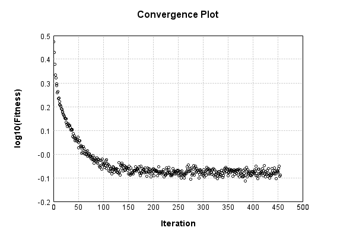

### Model
This is a very simple model that performs basic logistic regression. It is expected to be trainable to about 91% accuracy on MNIST.

Code from [MnistTestBase.java:293](../../../../../../../src/test/java/com/simiacryptus/mindseye/opt/MnistTestBase.java#L293) executed in 0.00 seconds: 
```java
    PipelineNetwork network = new PipelineNetwork();
    network.add(new BiasLayer(28, 28, 1));
    network.add(new FullyConnectedLayer(new int[]{28, 28, 1}, new int[]{10})
      .setWeights(() -> 0.001 * (Math.random() - 0.45)));
    network.add(new SoftmaxActivationLayer());
    return network;
```

Returns: 

```
    PipelineNetwork/0bd85e54-7090-4381-bfe7-eedb058d3086
```


### Training
Code from [L1NormalizationTest.java:43](../../../../../../../src/test/java/com/simiacryptus/mindseye/opt/trainable/L1NormalizationTest.java#L43) executed in 180.06 seconds: 
```java
    SimpleLossNetwork supervisedNetwork = new SimpleLossNetwork(network, new EntropyLossLayer());
    Trainable trainable = new L12Normalizer(new SampledArrayTrainable(trainingData, supervisedNetwork, 1000)) {
      @Override
      protected double getL1(NNLayer layer) {
        return 1.0;
      }
      
      @Override
      protected double getL2(NNLayer layer) {
        return 0;
      }
    };
    return new IterativeTrainer(trainable)
      .setMonitor(monitor)
      .setTimeout(3, TimeUnit.MINUTES)
      .setMaxIterations(500)
      .run();
```
Logging: 
```
    LBFGS Accumulation History: 1 points
    Constructing line search parameters: GD
    th(0)=3.468324075252002;dx=-137732.30903116087
    Armijo: th(2.154434690031884)=20386.96593977408; dx=9454.501266567739 delta=-20383.497615698827
    Armijo: th(1.077217345015942)=10202.413339028208; dx=9454.501073269337 delta=-10198.945014952955
    Armijo: th(0.3590724483386473)=3412.711642629839; dx=9454.501073269337 delta=-3409.243318554587
    Armijo: th(0.08976811208466183)=866.5735609058892; dx=9454.500099980667 delta=-863.1052368306372
    Armijo: th(0.017953622416932366)=187.54191398867476; dx=9458.81889172281 delta=-184.07358991342275
    Armijo: th(0.002992270402822061)=45.89217896925267; dx=9576.114589998904 delta=-42.42385489400067
    Armijo: th(4.2746720040315154E-4)=19.35831284823723; dx=17491.091001611465 delta=-15.889988772985227
    Armijo: th(5.343340005039394E-5)=6.249269655639855; dx=96032.88175376803 delta=-2.7809455803878533
    New Minimum: 3.468324075252002 > 2.977172385227648
    END: th(5.9370444500437714E-6)=2.977172385227648; dx=-
```
...[skipping 223958 bytes](etc/177.txt)...
```
     0.0007; Line Search: 0.1872
    LBFGS Accumulation History: 1 points
    th(0)=0.8063320397799547;dx=-3481.28565620541
    New Minimum: 0.8063320397799547 > 0.8053927543588528
    END: th(6.264351879919376E-7)=0.8053927543588528; dx=-486.5204941648787 delta=9.392854211018875E-4
    Iteration 454 complete. Error: 0.8053927543588528 Total: 62486160403430.0900; Orientation: 0.0007; Line Search: 0.1663
    LBFGS Accumulation History: 1 points
    th(0)=0.8181663375638264;dx=-2381.8488011720992
    New Minimum: 0.8181663375638264 > 0.8176356353772094
    WOLF (strong): th(1.349613700066475E-6)=0.8176356353772094; dx=412.6806481741798 delta=5.307021866169936E-4
    New Minimum: 0.8176356353772094 > 0.8174108638486122
    WOLF (strong): th(6.748068500332375E-7)=0.8174108638486122; dx=157.01934271826048 delta=7.554737152142277E-4
    END: th(2.2493561667774585E-7)=0.8176831021005091; dx=-1938.381061387392 delta=4.832354633172997E-4
    Iteration 455 complete. Error: 0.8174108638486122 Total: 62486682406041.8360; Orientation: 0.0007; Line Search: 0.4368
    
```

Returns: 

```
    0.8615411950971474
```


Code from [MnistTestBase.java:139](../../../../../../../src/test/java/com/simiacryptus/mindseye/opt/MnistTestBase.java#L139) executed in 0.00 seconds: 
```java
    PlotCanvas plot = ScatterPlot.plot(history.stream().map(step -> new double[]{step.iteration, Math.log10(step.point.getMean())}).toArray(i -> new double[i][]));
    plot.setTitle("Convergence Plot");
    plot.setAxisLabels("Iteration", "log10(Fitness)");
    plot.setSize(600, 400);
    return plot;
```

Returns: 




Saved model as [model0.json](etc/model0.json)

### Metrics
Code from [MnistTestBase.java:152](../../../../../../../src/test/java/com/simiacryptus/mindseye/opt/MnistTestBase.java#L152) executed in 0.05 seconds: 
```java
    try {
      ByteArrayOutputStream out = new ByteArrayOutputStream();
      JsonUtil.writeJson(out, monitoringRoot.getMetrics());
      return out.toString();
    } catch (IOException e) {
      throw new RuntimeException(e);
    }
```

Returns: 

```
    [ "java.util.HashMap", {
      "FullyConnectedLayer/a7376791-e5a7-459d-bd9e-9e7e58fd77b6" : [ "java.util.HashMap", {
        "avgMsPerItem" : 0.011788406654906288,
        "medianMsPerItem" : "NaN",
        "avgMsPerItem_Backward" : 7.606814864167574E-5,
        "totalItems" : 1814000,
        "backpropStatistics" : [ "java.util.HashMap", {
          "meanExponent" : -1.9974061502611047,
          "tp50" : -0.24145192228030604,
          "negative" : 500,
          "min" : -0.9521333014549694,
          "max" : 0.5557845221695674,
          "tp90" : -0.039513782001853986,
          "mean" : -1.0945708721994337E-18,
          "count" : 5000.0,
          "positive" : 4500,
          "stdDev" : 0.15575684485724967,
          "tp75" : -0.10469651726419489,
          "zeros" : 0
        } ],
        "totalBatches" : 3628,
        "weights" : [ "java.util.HashMap", {
          "tp50" : "NaN",
          "buffers" : 1,
          "max" : 0.0022320015524915347,
          "tp90" : "NaN",
          "count" : 7840.0,
          "positive" : 3710,
          "tp75" : "NaN",
          "zeros" : 0,
          "meanE
```
...[skipping 2805 bytes](etc/178.txt)...
```
    " : [ "java.util.HashMap", {
          "meanExponent" : 0.24288530509291695,
          "tp50" : -1.3183080009986259,
          "negative" : 500,
          "min" : -20.89135098923211,
          "max" : 0.0,
          "tp90" : -1.0411393534456006,
          "mean" : -0.693573454898337,
          "count" : 5000.0,
          "positive" : 0,
          "stdDev" : 28.811926098731437,
          "tp75" : -1.116939696184662,
          "zeros" : 4500
        } ],
        "totalBatches" : 3628,
        "class" : "com.simiacryptus.mindseye.layers.java.SoftmaxActivationLayer",
        "outputStatistics" : [ "java.util.HashMap", {
          "meanExponent" : -1.9523147380757746,
          "tp50" : 1.5716437582558208E-4,
          "negative" : 0,
          "min" : 1.3334970135085505E-5,
          "max" : 0.920606968577893,
          "tp90" : 3.9102541168774366E-4,
          "mean" : 0.1,
          "count" : 5000.0,
          "positive" : 5000,
          "stdDev" : 0.22086429142226843,
          "tp75" : 3.0469534790340515E-4,
          "zeros" : 0
        } ],
        "medianMsPerItem_Backward" : "NaN"
      } ]
    } ]
```


### Validation
If we run our model against the entire validation dataset, we get this accuracy:

Code from [MnistTestBase.java:209](../../../../../../../src/test/java/com/simiacryptus/mindseye/opt/MnistTestBase.java#L209) executed in 1.01 seconds: 
```java
    return MNIST.validationDataStream().mapToDouble(labeledObject ->
      predict(network, labeledObject)[0] == parse(labeledObject.label) ? 1 : 0)
      .average().getAsDouble() * 100;
```

Returns: 

```
    88.61
```


Let's examine some incorrectly predicted results in more detail:

Code from [MnistTestBase.java:216](../../../../../../../src/test/java/com/simiacryptus/mindseye/opt/MnistTestBase.java#L216) executed in 0.04 seconds: 
```java
    try {
      TableOutput table = new TableOutput();
      MNIST.validationDataStream().map(labeledObject -> {
        try {
          int actualCategory = parse(labeledObject.label);
          double[] predictionSignal = GpuController.call(ctx -> network.eval(ctx, labeledObject.data).getData().get(0).getData());
          int[] predictionList = IntStream.range(0, 10).mapToObj(x -> x).sorted(Comparator.comparing(i -> -predictionSignal[i])).mapToInt(x -> x).toArray();
          if (predictionList[0] == actualCategory) return null; // We will only examine mispredicted rows
          LinkedHashMap<String, Object> row = new LinkedHashMap<String, Object>();
          row.put("Image", log.image(labeledObject.data.toGrayImage(), labeledObject.label));
          row.put("Prediction", Arrays.stream(predictionList).limit(3)
            .mapToObj(i -> String.format("%d (%.1f%%)", i, 100.0 * predictionSignal[i]))
            .reduce((a, b) -> a + ", " + b).get());
          return row;
        } catch (IOException e) {
          throw new RuntimeException(e);
        }
      }).filter(x -> null != x).limit(10).forEach(table::putRow);
      return table;
    } catch (IOException e) {
      throw new RuntimeException(e);
    }
```

Returns: 

Image | Prediction
----- | ----------
![[5]](etc/test.819.png) | 6 (56.9%), 2 (19.5%), 8 (4.9%) 
![[6]](etc/test.820.png) | 8 (28.1%), 6 (24.3%), 2 (13.3%)
![[4]](etc/test.821.png) | 6 (35.7%), 0 (30.8%), 2 (11.6%)
![[1]](etc/test.822.png) | 3 (39.4%), 1 (29.3%), 8 (6.1%) 
![[3]](etc/test.823.png) | 2 (44.3%), 3 (30.4%), 8 (7.5%) 
![[6]](etc/test.824.png) | 7 (21.5%), 2 (20.8%), 6 (15.5%)
![[9]](etc/test.825.png) | 7 (29.1%), 9 (28.2%), 8 (20.8%)
![[2]](etc/test.826.png) | 7 (74.8%), 2 (9.9%), 9 (7.7%)  
![[7]](etc/test.827.png) | 9 (41.8%), 7 (41.6%), 4 (8.1%) 
![[9]](etc/test.828.png) | 4 (26.3%), 9 (22.7%), 8 (21.4%)


