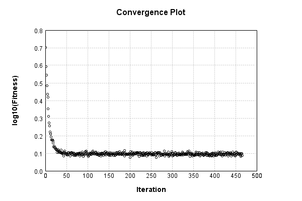

### Model
This is a very simple model that performs basic logistic regression. It is expected to be trainable to about 91% accuracy on MNIST.

Code from [MnistTestBase.java:293](../../../../../../../src/test/java/com/simiacryptus/mindseye/opt/MnistTestBase.java#L293) executed in 0.00 seconds: 
```java
    PipelineNetwork network = new PipelineNetwork();
    network.add(new BiasLayer(28, 28, 1));
    network.add(new FullyConnectedLayer(new int[]{28, 28, 1}, new int[]{10})
      .setWeights(() -> 0.001 * (Math.random() - 0.45)));
    network.add(new SoftmaxActivationLayer());
    return network;
```

Returns: 

```
    PipelineNetwork/f11f7414-3606-4880-a14d-affd36a4e65f
```


### Training
Training a model involves a few different components. First, our model is combined mapCoords a loss function. Then we take that model and combine it mapCoords our training data to define a trainable object. Finally, we use a simple iterative scheme to refine the weights of our model. The final output is the last output value of the loss function when evaluating the last batch.

Code from [L2NormalizationTest.java:47](../../../../../../../src/test/java/com/simiacryptus/mindseye/opt/trainable/L2NormalizationTest.java#L47) executed in 180.16 seconds: 
```java
    SimpleLossNetwork supervisedNetwork = new SimpleLossNetwork(network, new EntropyLossLayer());
    Trainable trainable = new L12Normalizer(new SampledArrayTrainable(trainingData, supervisedNetwork, 1000)) {
      @Override
      protected double getL1(NNLayer layer) {
        return 0.0;
      }
      
      @Override
      protected double getL2(NNLayer layer) {
        return 1e4;
      }
    };
    return new IterativeTrainer(trainable)
      .setMonitor(monitor)
      .setTimeout(3, TimeUnit.MINUTES)
      .setMaxIterations(500)
      .run();
```
Logging: 
```
    LBFGS Accumulation History: 1 points
    Constructing line search parameters: GD
    th(0)=5.896250167917021;dx=-226477.28892638048
    Armijo: th(2.154434690031884)=5.255918279700948E9; dx=4.8792337876613035E9 delta=-5.255918273804698E9
    Armijo: th(1.077217345015942)=1.313941082421821E9; dx=2.4395811488374815E9 delta=-1.3139410765255709E9
    Armijo: th(0.3590724483386473)=1.4597636109958982E8; dx=8.131460562882674E8 delta=-1.4597635520333967E8
    Armijo: th(0.08976811208466183)=9118731.424577525; dx=2.0323289714220464E8 delta=-9118725.528327357
    Armijo: th(0.017953622416932366)=363744.82596247585; dx=4.058939698238478E7 delta=-363738.92971230793
    Armijo: th(0.002992270402822061)=9947.942280956626; dx=6705517.8833011575 delta=-9942.04603078871
    Armijo: th(4.2746720040315154E-4)=195.045056919079; dx=905646.3298259536 delta=-189.14880675116197
    Armijo: th(5.343340005039394E-5)=7.07366192660364; dx=120599.94672577182 delta=-1.1774117586866186
    New Minimum: 5.896250167917021 > 5.013229276844239
    END: th(5.9370444500437714E-6)
```
...[skipping 224561 bytes](etc/179.txt)...
```
    69691753801
    New Minimum: 1.2669656209494624 > 1.2570267667746886
    WOLF (strong): th(1.4375001248706402E-5)=1.2570267667746886; dx=955.5103338966519 delta=0.009938854174773804
    New Minimum: 1.2570267667746886 > 1.2563933795264532
    END: th(7.187500624353201E-6)=1.2563933795264532; dx=-608.2039850526631 delta=0.010572241423009165
    Iteration 465 complete. Error: 1.2563933795264532 Total: 62668001760053.4200; Orientation: 0.0006; Line Search: 0.3443
    LBFGS Accumulation History: 1 points
    th(0)=1.2261469911514946;dx=-3581.816285856663
    Armijo: th(1.548500067973236E-5)=1.2506417921180102; dx=6712.0669287634355 delta=-0.024494800966515573
    New Minimum: 1.2261469911514946 > 1.2184917133809092
    WOLF (strong): th(7.74250033986618E-6)=1.2184917133809092; dx=1410.2249827617577 delta=0.007655277770585389
    END: th(2.58083344662206E-6)=1.2193423670953965; dx=-1962.9797097428916 delta=0.006804624056098163
    Iteration 466 complete. Error: 1.2184917133809092 Total: 62668412771846.0000; Orientation: 0.0005; Line Search: 0.3218
    
```

Returns: 

```
    1.2184917133809092
```


Code from [MnistTestBase.java:139](../../../../../../../src/test/java/com/simiacryptus/mindseye/opt/MnistTestBase.java#L139) executed in 0.00 seconds: 
```java
    PlotCanvas plot = ScatterPlot.plot(history.stream().map(step -> new double[]{step.iteration, Math.log10(step.point.getMean())}).toArray(i -> new double[i][]));
    plot.setTitle("Convergence Plot");
    plot.setAxisLabels("Iteration", "log10(Fitness)");
    plot.setSize(600, 400);
    return plot;
```

Returns: 




Saved model as [model0.json](etc/model0.json)

### Metrics
Code from [MnistTestBase.java:152](../../../../../../../src/test/java/com/simiacryptus/mindseye/opt/MnistTestBase.java#L152) executed in 0.05 seconds: 
```java
    try {
      ByteArrayOutputStream out = new ByteArrayOutputStream();
      JsonUtil.writeJson(out, monitoringRoot.getMetrics());
      return out.toString();
    } catch (IOException e) {
      throw new RuntimeException(e);
    }
```

Returns: 

```
    [ "java.util.HashMap", {
      "BiasLayer/4bb85e68-82b8-400d-9484-101641a25c6e" : [ "java.util.HashMap", {
        "avgMsPerItem" : 0.01650046702423262,
        "medianMsPerItem" : "NaN",
        "avgMsPerItem_Backward" : 2.2050909945072664E-5,
        "totalItems" : 1857000,
        "backpropStatistics" : [ "java.util.HashMap", {
          "meanExponent" : -6.2228644340241885,
          "tp50" : -3.2756135014109345E-4,
          "negative" : 148591,
          "min" : -1.6704442429135394E-14,
          "max" : 1.915370750045558E-14,
          "tp90" : -2.9475408184123945E-4,
          "mean" : 5.317241518394996E-7,
          "count" : 392000.0,
          "positive" : 243409,
          "stdDev" : 5.677137505872128E-5,
          "tp75" : -3.0489582031003665E-4,
          "zeros" : 0
        } ],
        "totalBatches" : 3714,
        "weights" : [ "java.util.HashMap", {
          "tp50" : "NaN",
          "buffers" : 1,
          "max" : 1.779053771183459E-8,
          "tp90" : "NaN",
          "count" : 784.0,
          "positive" : 320,
          "tp75" : "NaN",
          "zeros" : 0,
          "m
```
...[skipping 2810 bytes](etc/180.txt)...
```
        "weights" : [ "java.util.HashMap", {
          "tp50" : "NaN",
          "buffers" : 1,
          "max" : 6.305344307049265E-4,
          "tp90" : "NaN",
          "count" : 7840.0,
          "positive" : 2772,
          "tp75" : "NaN",
          "zeros" : 0,
          "meanExponent" : -5.884944571184703,
          "negative" : 5068,
          "min" : -4.2216461596968866E-4,
          "mean" : 1.4881404305718353E-15,
          "stdDev" : 9.64321758979331E-5
        } ],
        "class" : "com.simiacryptus.mindseye.layers.java.FullyConnectedLayer",
        "outputStatistics" : [ "java.util.HashMap", {
          "meanExponent" : -0.28275601387047583,
          "tp50" : -1.6040878867944164,
          "negative" : 2773,
          "min" : -2.311579747660805,
          "max" : 2.8264902763751008,
          "tp90" : -1.3229586159212856,
          "mean" : 3.681191664091018E-11,
          "count" : 5000.0,
          "positive" : 2227,
          "stdDev" : 1.1189713563697286,
          "tp75" : -1.419560241177694,
          "zeros" : 0
        } ],
        "medianMsPerItem_Backward" : "NaN"
      } ]
    } ]
```


### Validation
If we run our model against the entire validation dataset, we get this accuracy:

Code from [MnistTestBase.java:209](../../../../../../../src/test/java/com/simiacryptus/mindseye/opt/MnistTestBase.java#L209) executed in 0.94 seconds: 
```java
    return MNIST.validationDataStream().mapToDouble(labeledObject ->
      predict(network, labeledObject)[0] == parse(labeledObject.label) ? 1 : 0)
      .average().getAsDouble() * 100;
```

Returns: 

```
    85.65
```


Let's examine some incorrectly predicted results in more detail:

Code from [MnistTestBase.java:216](../../../../../../../src/test/java/com/simiacryptus/mindseye/opt/MnistTestBase.java#L216) executed in 0.04 seconds: 
```java
    try {
      TableOutput table = new TableOutput();
      MNIST.validationDataStream().map(labeledObject -> {
        try {
          int actualCategory = parse(labeledObject.label);
          double[] predictionSignal = GpuController.call(ctx -> network.eval(ctx, labeledObject.data).getData().get(0).getData());
          int[] predictionList = IntStream.range(0, 10).mapToObj(x -> x).sorted(Comparator.comparing(i -> -predictionSignal[i])).mapToInt(x -> x).toArray();
          if (predictionList[0] == actualCategory) return null; // We will only examine mispredicted rows
          LinkedHashMap<String, Object> row = new LinkedHashMap<String, Object>();
          row.put("Image", log.image(labeledObject.data.toGrayImage(), labeledObject.label));
          row.put("Prediction", Arrays.stream(predictionList).limit(3)
            .mapToObj(i -> String.format("%d (%.1f%%)", i, 100.0 * predictionSignal[i]))
            .reduce((a, b) -> a + ", " + b).get());
          return row;
        } catch (IOException e) {
          throw new RuntimeException(e);
        }
      }).filter(x -> null != x).limit(10).forEach(table::putRow);
      return table;
    } catch (IOException e) {
      throw new RuntimeException(e);
    }
```

Returns: 

Image | Prediction
----- | ----------
![[5]](etc/test.830.png) | 2 (20.7%), 6 (19.8%), 4 (13.6%)
![[5]](etc/test.831.png) | 3 (25.2%), 5 (22.5%), 8 (12.8%)
![[9]](etc/test.832.png) | 7 (32.4%), 9 (30.9%), 4 (8.9%) 
![[4]](etc/test.833.png) | 0 (30.5%), 6 (26.3%), 4 (12.4%)
![[2]](etc/test.834.png) | 3 (24.6%), 2 (19.8%), 8 (11.8%)
![[5]](etc/test.835.png) | 3 (31.1%), 5 (26.9%), 8 (16.0%)
![[1]](etc/test.836.png) | 3 (21.1%), 1 (14.4%), 5 (12.7%)
![[5]](etc/test.837.png) | 3 (22.4%), 5 (20.3%), 8 (13.1%)
![[6]](etc/test.838.png) | 2 (30.6%), 6 (20.7%), 4 (11.3%)
![[3]](etc/test.839.png) | 2 (29.2%), 3 (18.9%), 8 (11.9%)


