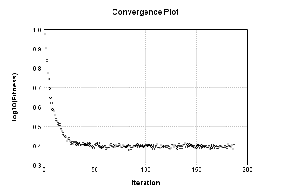

### Model
This is a very simple model that performs basic logistic regression. It is expected to be trainable to about 91% accuracy on MNIST.

Code from [MnistTestBase.java:272](../../../../../../../../MindsEye/src/test/java/com/simiacryptus/mindseye/mnist/MnistTestBase.java#L272) executed in 0.00 seconds: 
```java
    PipelineNetwork network = new PipelineNetwork();
    network.add(new BiasLayer(28, 28, 1));
    network.add(new FullyConnectedLayer(new int[]{28, 28, 1}, new int[]{10})
      .setWeights(() -> 0.001 * (Math.random() - 0.45)));
    network.add(new SoftmaxActivationLayer());
    return network;
```

Returns: 

```
    PipelineNetwork/e1035fb9-1fe3-4846-a360-622900000080
```


### Training
Training a model involves a few different components. First, our model is combined mapCoords a loss function. Then we take that model and combine it mapCoords our training data to define a trainable object. Finally, we use a simple iterative scheme to refine the weights of our model. The final output is the last output value of the loss function when evaluating the last batch.

Code from [L2NormalizationTest.java:47](../../../../../../../../MindsEye/src/test/java/com/simiacryptus/mindseye/opt/trainable/L2NormalizationTest.java#L47) executed in 180.11 seconds: 
```java
    SimpleLossNetwork supervisedNetwork = new SimpleLossNetwork(network, new EntropyLossLayer());
    Trainable trainable = new L12Normalizer(new SampledArrayTrainable(trainingData, supervisedNetwork, 1000)) {
      @Override
      protected double getL1(NNLayer layer) {
        return 0.0;
      }
      
      @Override
      protected double getL2(NNLayer layer) {
        return 1e4;
      }
    };
    return new IterativeTrainer(trainable)
      .setMonitor(monitor)
      .setTimeout(3, TimeUnit.MINUTES)
      .setMaxIterations(500)
      .run();
```
Logging: 
```
    LBFGS Accumulation History: 1 points
    Constructing line search parameters: GD
    Returning cached value; 2 buffers unchanged since 0.0 => 2.4364840923502706
    th(0)=11.647872076077807;dx=-796596.9065998588
    Armijo: th(2.154434690031884)=3.6974140133441956E10; dx=3.4324035671275196E10 delta=-3.697414012179408E10
    Armijo: th(1.077217345015942)=9.243381823755877E9; dx=1.7161875575866365E10 delta=-9.243381812108004E9
    Armijo: th(0.3590724483386473)=1.0269743576956229E9; dx=5.720435512260478E9 delta=-1.0269743460477508E9
    Armijo: th(0.08976811208466183)=6.4166785602635436E7; dx=1.4298954887416396E9 delta=-6.416677395476336E7
    Armijo: th(0.017953622416932366)=2562629.663446952; dx=2.857514896117402E8 delta=-2562618.015574876
    Armijo: th(0.002992270402822061)=70519.67750924174; dx=4.738829979641143E7 delta=-70508.02963716566
    Armijo: th(4.2746720040315154E-4)=1377.8490862175029; dx=6531342.471065177 delta=-1366.201214141425
    Armijo: th(5.343340005039394E-5)=39.15010813390807; dx=877167.8079448974 delta=-27.502236057830263
    New Minimum: 11.647872076077807 > 9.434661029658884
    WOLF (strong): th(5.9370444500437714E-6)=9.434661029658884; dx=25208.118562275442 delta=2.213211046418923
    WOLFE (weak): th(5.937044450043771E-7)=11.19579869922848; dx=-724872.635720214 delta=0.45207337684932725
    END: th(3.2653744475240744E-6)=9.784116884663625; dx=-316944.1841206605 delta=1.8637551914141817
    Iteration 1 complete. Error: 9.434661029658884 Total: 184836872143139.0300; Orientation: 0.0009; Line Search: 3.5324
    LBFGS Accumulation History: 1 points
    Returning cached value; 2 buffers unchanged since 0.0 => 1.9743739591934557
    th(0)=9.879527467605607;dx=-547505.6945620653
    New Minimum: 9.879527467605607 > 7.993496462607241
    END: th(7.035035985689563E-6)=7.993496462607241; dx=-43314.64991017458 delta=1.8860310049983662
    Iteration 2 complete. Error: 7.993496462607241 Total: 184837506419252.1200; Orientation: 0.0006; Line Search: 0.3243
    LBFGS Accumulation History: 1 points
    Returning cached value; 2 buffers unchanged since 0.0 => 1.76380642208
```
...[skipping 102052 bytes](etc/1.txt)...
```
    70545 delta=-0.06902013255387152
    New Minimum: 2.479522376047705 > 2.4612759696140345
    WOLF (strong): th(5.138686705174674E-6)=2.4612759696140345; dx=6565.295260028957 delta=0.018246406433670703
    END: th(1.712895568391558E-6)=2.46218860448644; dx=-6831.596201520782 delta=0.017333771561265365
    Iteration 184 complete. Error: 2.4612759696140345 Total: 185009227311245.0000; Orientation: 0.0006; Line Search: 0.9234
    LBFGS Accumulation History: 1 points
    Returning cached value; 2 buffers unchanged since 0.0 => 0.912466106057364
    th(0)=2.551522042650683;dx=-14620.923170734106
    New Minimum: 2.551522042650683 > 2.5287779791683134
    WOLF (strong): th(3.690321632944654E-6)=2.5287779791683134; dx=1516.4147802200569 delta=0.02274406348236946
    END: th(1.845160816472327E-6)=2.5327215388807827; dx=-6356.0833591006185 delta=0.018800503769900168
    Iteration 185 complete. Error: 2.5287779791683134 Total: 185010164095912.7800; Orientation: 0.0012; Line Search: 0.6235
    LBFGS Accumulation History: 1 points
    Returning cached value; 2 buffers unchanged since 0.0 => 0.8499496736602334
    th(0)=2.426272952584568;dx=-8846.226415786876
    New Minimum: 2.426272952584568 > 2.4054060715988705
    END: th(3.975278471695535E-6)=2.4054060715988705; dx=-2043.023070216919 delta=0.020866880985697556
    Iteration 186 complete. Error: 2.4054060715988705 Total: 185010802967305.8400; Orientation: 0.0007; Line Search: 0.3223
    LBFGS Accumulation History: 1 points
    Returning cached value; 2 buffers unchanged since 0.0 => 0.9029958850798327
    th(0)=2.5377282281159586;dx=-11326.767585867667
    Armijo: th(8.564477841957791E-6)=2.5554184826838426; dx=14120.73113293867 delta=-0.01769025456788409
    New Minimum: 2.5377282281159586 > 2.5194303383310417
    WOLF (strong): th(4.282238920978896E-6)=2.5194303383310417; dx=2330.8839580146064 delta=0.018297889784916865
    END: th(1.4274129736596318E-6)=2.5250955727295743; dx=-6559.895450309783 delta=0.01263265538638425
    Iteration 187 complete. Error: 2.5194303383310417 Total: 185012078036712.2000; Orientation: 0.0006; Line Search: 0.9304
    
```

Returns: 

```
    2.5194303383310417
```


Code from [MnistTestBase.java:131](../../../../../../../../MindsEye/src/test/java/com/simiacryptus/mindseye/mnist/MnistTestBase.java#L131) executed in 0.02 seconds: 
```java
    PlotCanvas plot = ScatterPlot.plot(history.stream().map(step -> new double[]{step.iteration, Math.log10(step.point.getMean())}).toArray(i -> new double[i][]));
    plot.setTitle("Convergence Plot");
    plot.setAxisLabels("Iteration", "log10(Fitness)");
    plot.setSize(600, 400);
    return plot;
```

Returns: 




Saved model as [model0.json](etc/model0.json)

### Metrics
Code from [MnistTestBase.java:144](../../../../../../../../MindsEye/src/test/java/com/simiacryptus/mindseye/mnist/MnistTestBase.java#L144) executed in 0.06 seconds: 
```java
    try {
      ByteArrayOutputStream out = new ByteArrayOutputStream();
      JsonUtil.writeJson(out, monitoringRoot.getMetrics());
      return out.toString();
    } catch (IOException e) {
      throw new RuntimeException(e);
    }
```

Returns: 

```
    [ "java.util.HashMap", {
      "FullyConnectedLayer/e1035fb9-1fe3-4846-a360-622900000082" : [ "java.util.HashMap", {
        "avgMsPerItem" : 0.014169258756613753,
        "medianMsPerItem" : "NaN",
        "avgMsPerItem_Backward" : 7.483814394708985E-5,
        "totalItems" : 567000,
        "backpropStatistics" : [ "java.util.HashMap", {
          "meanExponent" : -4.0173097775316435,
          "tp50" : -0.0010659371124484168,
          "negative" : 500,
          "min" : -0.0016325528867751485,
          "max" : 7.024207151031786E-4,
          "tp90" : -4.749280806451086E-4,
          "mean" : -1.157682280659815E-21,
          "count" : 5000.0,
          "positive" : 4500,
          "stdDev" : 3.8942712836626057E-4,
          "tp75" : -7.295311719657784E-4,
          "zeros" : 0
        } ],
        "totalBatches" : 1134,
        "weights" : [ "java.util.HashMap", {
          "tp50" : "NaN",
          "buffers" : 1,
          "max" : 6.444319002279117E-4,
          "tp90" : "NaN",
          "count" : 7840.0,
          "positive" : 2957,
          "tp75" : "NaN",
          "zeros" : 0,
          "meanExponent" : -5.29442878865623,
          "negative" : 4883,
          "min" : -4.397058411188843E-4,
          "mean" : 2.6808866207486486E-9,
          "stdDev" : 9.650317382803639E-5
        } ],
        "class" : "com.simiacryptus.mindseye.layers.java.FullyConnectedLayer",
        "outputStatistics" : [ "java.util.HashMap", {
          "meanExponent" : -0.2767717984691317,
          "tp50" : -1.5880938491826722,
          "negative" : 2750,
          "min" : -2.2407962637578844,
          "max" : 3.064539185105366,
          "tp90" : -1.3017495400162737,
          "mean" : 6.331810471862042E-5,
          "count" : 5000.0,
          "positive" : 2250,
          "stdDev" : 1.125087249404752,
          "tp75" : -1.3852290978079935,
          "zeros" : 0
        } ],
        "medianMsPerItem_Backward" : "NaN"
      } ],
      "BiasLayer/e1035fb9-1fe3-4846-a360-622900000081" : [ "java.util.HashMap", {
        "avgMsPerItem" : 0.02094247737213404,
        "medianMsPerItem" : "NaN",
        "avgMsPerItem_Backward" : 2.895330578130513E-5,
        "totalItems" : 567000,
        "backpropStat
```
...[skipping 778 bytes](etc/2.txt)...
```
         "negative" : 468,
          "min" : -6.654254701557755E-9,
          "mean" : -4.0431670602634607E-10,
          "stdDev" : 1.652024722118239E-9
        } ],
        "class" : "com.simiacryptus.mindseye.layers.java.BiasLayer",
        "outputStatistics" : [ "java.util.HashMap", {
          "meanExponent" : -7.103366895996851,
          "tp50" : -6.259767659999644E-9,
          "negative" : 182544,
          "min" : -4.3828941258983E-11,
          "max" : -4.3828941258983E-11,
          "tp90" : -5.6617632027862846E-9,
          "mean" : 33.24423979551431,
          "count" : 392000.0,
          "positive" : 209456,
          "stdDev" : 78.58269766561259,
          "tp75" : -5.6617632027862846E-9,
          "zeros" : 0
        } ],
        "medianMsPerItem_Backward" : "NaN"
      } ],
      "SoftmaxActivationLayer/e1035fb9-1fe3-4846-a360-622900000083" : [ "java.util.HashMap", {
        "avgMsPerItem" : 0.0037422939788359787,
        "medianMsPerItem" : "NaN",
        "avgMsPerItem_Backward" : 2.3271296719576685E-6,
        "totalItems" : 567000,
        "backpropStatistics" : [ "java.util.HashMap", {
          "meanExponent" : -2.318913940969209,
          "tp50" : -0.004282366908383459,
          "negative" : 500,
          "min" : -0.010885920329852446,
          "max" : 0.0,
          "tp90" : -0.002622827126534471,
          "mean" : -6.087892837600411E-4,
          "count" : 5000.0,
          "positive" : 0,
          "stdDev" : 0.0028915779491927706,
          "tp75" : -0.0031484440324200183,
          "zeros" : 4500
        } ],
        "totalBatches" : 1134,
        "class" : "com.simiacryptus.mindseye.layers.java.SoftmaxActivationLayer",
        "outputStatistics" : [ "java.util.HashMap", {
          "meanExponent" : -1.3237956666484312,
          "tp50" : 0.006676731262184917,
          "negative" : 0,
          "min" : 8.855380592990319E-4,
          "max" : 0.6662368763517885,
          "tp90" : 0.00998074286701841,
          "mean" : 0.1,
          "count" : 5000.0,
          "positive" : 5000,
          "stdDev" : 0.15226395047244318,
          "tp75" : 0.008680297997366207,
          "zeros" : 0
        } ],
        "medianMsPerItem_Backward" : "NaN"
      } ]
    } ]
```


### Validation
If we run our model against the entire validation dataset, we get this accuracy:

Code from [MnistTestBase.java:201](../../../../../../../../MindsEye/src/test/java/com/simiacryptus/mindseye/mnist/MnistTestBase.java#L201) executed in 0.81 seconds: 
```java
    return MNIST.validationDataStream().mapToDouble(labeledObject ->
      predict(network, labeledObject)[0] == parse(labeledObject.label) ? 1 : 0)
      .average().getAsDouble() * 100;
```

Returns: 

```
    85.45
```


Let's examine some incorrectly predicted results in more detail:

Code from [MnistTestBase.java:208](../../../../../../../../MindsEye/src/test/java/com/simiacryptus/mindseye/mnist/MnistTestBase.java#L208) executed in 0.06 seconds: 
```java
    try {
      TableOutput table = new TableOutput();
      MNIST.validationDataStream().map(labeledObject -> {
        try {
          int actualCategory = parse(labeledObject.label);
          double[] predictionSignal = CudaExecutionContext.gpuContexts.run(ctx -> network.eval(ctx, labeledObject.data).getData().get(0).getData());
          int[] predictionList = IntStream.range(0, 10).mapToObj(x -> x).sorted(Comparator.comparing(i -> -predictionSignal[i])).mapToInt(x -> x).toArray();
          if (predictionList[0] == actualCategory) return null; // We will only examine mispredicted rows
          LinkedHashMap<String, Object> row = new LinkedHashMap<String, Object>();
          row.put("Image", log.image(labeledObject.data.toGrayImage(), labeledObject.label));
          row.put("Prediction", Arrays.stream(predictionList).limit(3)
            .mapToObj(i -> String.format("%d (%.1f%%)", i, 100.0 * predictionSignal[i]))
            .reduce((a, b) -> a + ", " + b).get());
          return row;
        } catch (IOException e) {
          throw new RuntimeException(e);
        }
      }).filter(x -> null != x).limit(10).forEach(table::putRow);
      return table;
    } catch (IOException e) {
      throw new RuntimeException(e);
    }
```

Returns: 

Image | Prediction
----- | ----------
![[5]](etc/test.2.png)  | 6 (19.9%), 2 (19.2%), 4 (13.4%)
![[5]](etc/test.3.png)  | 3 (25.6%), 5 (23.2%), 8 (13.0%)
![[4]](etc/test.4.png)  | 0 (31.9%), 6 (24.6%), 4 (12.7%)
![[2]](etc/test.5.png)  | 3 (25.5%), 2 (17.5%), 8 (12.3%)
![[5]](etc/test.6.png)  | 3 (31.5%), 5 (27.7%), 8 (16.0%)
![[1]](etc/test.7.png)  | 3 (21.9%), 1 (14.3%), 5 (12.7%)
![[5]](etc/test.8.png)  | 3 (23.5%), 5 (19.8%), 8 (13.8%)
![[6]](etc/test.9.png)  | 2 (27.0%), 6 (21.4%), 4 (11.7%)
![[3]](etc/test.10.png) | 2 (28.3%), 3 (19.4%), 8 (11.6%)
![[4]](etc/test.11.png) | 9 (20.0%), 4 (15.0%), 3 (14.9%)


