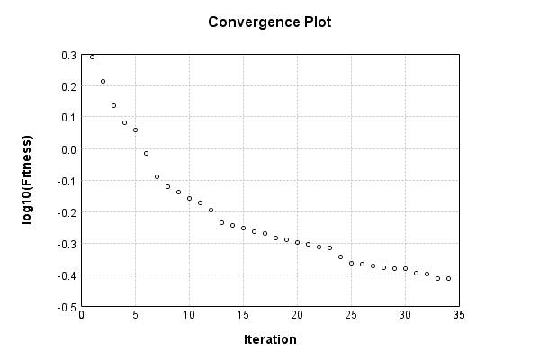

### Model
This is a very simple model that performs basic logistic regression. It is expected to be trainable to about 91% accuracy on MNIST.

Code from [MnistTestBase.java:293](../../../../../../../src/test/java/com/simiacryptus/mindseye/opt/MnistTestBase.java#L293) executed in 0.00 seconds: 
```java
    PipelineNetwork network = new PipelineNetwork();
    network.add(new BiasLayer(28, 28, 1));
    network.add(new FullyConnectedLayer(new int[]{28, 28, 1}, new int[]{10})
      .setWeights(() -> 0.001 * (Math.random() - 0.45)));
    network.add(new SoftmaxActivationLayer());
    return network;
```

Returns: 

```
    PipelineNetwork/1c7e0edf-017f-476f-bbeb-8f1289bb5060
```


### Training
Training a model involves a few different components. First, our model is combined mapCoords a loss function. Then we take that model and combine it mapCoords our training data to define a trainable object. Finally, we use a simple iterative scheme to refine the weights of our model. The final output is the last output value of the loss function when evaluating the last batch.

Code from [SimpleGradientDescentTest.java:50](../../../../../../../src/test/java/com/simiacryptus/mindseye/opt/trainable/SimpleGradientDescentTest.java#L50) executed in 183.40 seconds: 
```java
    SimpleLossNetwork supervisedNetwork = new SimpleLossNetwork(network, new EntropyLossLayer());
    ArrayList<Tensor[]> trainingList = new ArrayList<>(Arrays.stream(trainingData).collect(Collectors.toList()));
    Collections.shuffle(trainingList);
    Tensor[][] randomSelection = trainingList.subList(0, 10000).toArray(new Tensor[][]{});
    Trainable trainable = new ArrayTrainable(randomSelection, supervisedNetwork);
    return new IterativeTrainer(trainable)
      .setMonitor(monitor)
      .setTimeout(3, TimeUnit.MINUTES)
      .setMaxIterations(500)
      .run();
```
Logging: 
```
    LBFGS Accumulation History: 1 points
    Constructing line search parameters: GD
    th(0)=2.58709050397546;dx=-375040.7715486631
    Armijo: th(2.154434690031884)=19.66223462609475; dx=3.3872968876432166E-43 delta=-17.07514412211929
    Armijo: th(1.077217345015942)=19.66223462609475; dx=2.441324411331259E-21 delta=-17.07514412211929
    Armijo: th(0.3590724483386473)=19.662234626097387; dx=-2.459247425907918E-10 delta=-17.075144122121927
    Armijo: th(0.08976811208466183)=19.660101072959762; dx=0.14192582061808398 delta=-17.0730105689843
    Armijo: th(0.017953622416932366)=19.632555543860267; dx=2.3844848074512663 delta=-17.045465039884807
    Armijo: th(0.002992270402822061)=19.490724113823546; dx=135.2110871420797 delta=-16.903633609848086
    Armijo: th(4.2746720040315154E-4)=18.358305141837945; dx=6998.069640882451 delta=-15.771214637862485
    Armijo: th(5.343340005039394E-5)=8.218996829605784; dx=280099.0930265793 delta=-5.6319063256303235
    New Minimum: 2.58709050397546 > 1.947087666158977
    END: th(5.9370444500437714E-6)=1.94708
```
...[skipping 16013 bytes](etc/181.txt)...
```
    17899142671
    New Minimum: 0.3953172399593584 > 0.38677409612075675
    END: th(5.3407930849816775E-5)=0.38677409612075675; dx=-452.2096646729813 delta=0.013191761737744334
    Iteration 33 complete. Error: 0.38677409612075675 Total: 62847051526796.5300; Orientation: 0.0005; Line Search: 5.1549
    LBFGS Accumulation History: 1 points
    th(0)=0.38677409612075675;dx=-685.6005054544896
    Armijo: th(1.1506389894566929E-4)=0.567447418829494; dx=7779.459521324405 delta=-0.18067332270873726
    Armijo: th(5.7531949472834646E-5)=0.41712912781984135; dx=2928.894504295711 delta=-0.0303550316990846
    New Minimum: 0.38677409612075675 > 0.3855500180707969
    WOLF (strong): th(1.917731649094488E-5)=0.3855500180707969; dx=435.9213134603985 delta=0.0012240780499598314
    New Minimum: 0.3855500180707969 > 0.38546486994956586
    END: th(4.79432912273622E-6)=0.38546486994956586; dx=-409.83776364178993 delta=0.0013092261711908915
    Iteration 34 complete. Error: 0.38546486994956586 Total: 62853228321683.9450; Orientation: 0.0005; Line Search: 4.9357
    
```

Returns: 

```
    0.38546486994956586
```


Code from [MnistTestBase.java:139](../../../../../../../src/test/java/com/simiacryptus/mindseye/opt/MnistTestBase.java#L139) executed in 0.00 seconds: 
```java
    PlotCanvas plot = ScatterPlot.plot(history.stream().map(step -> new double[]{step.iteration, Math.log10(step.point.getMean())}).toArray(i -> new double[i][]));
    plot.setTitle("Convergence Plot");
    plot.setAxisLabels("Iteration", "log10(Fitness)");
    plot.setSize(600, 400);
    return plot;
```

Returns: 




Saved model as [model0.json](etc/model0.json)

### Metrics
Code from [MnistTestBase.java:152](../../../../../../../src/test/java/com/simiacryptus/mindseye/opt/MnistTestBase.java#L152) executed in 0.83 seconds: 
```java
    try {
      ByteArrayOutputStream out = new ByteArrayOutputStream();
      JsonUtil.writeJson(out, monitoringRoot.getMetrics());
      return out.toString();
    } catch (IOException e) {
      throw new RuntimeException(e);
    }
```

Returns: 

```
    [ "java.util.HashMap", {
      "BiasLayer/7ffd4026-c1dc-4ca5-b13f-744fc552d2aa" : [ "java.util.HashMap", {
        "avgMsPerItem" : 0.021072808608552637,
        "medianMsPerItem" : "NaN",
        "avgMsPerItem_Backward" : 2.710233095394736E-6,
        "totalItems" : 1520000,
        "backpropStatistics" : [ "java.util.HashMap", {
          "meanExponent" : -4.693379640416727,
          "tp50" : -0.0010975081670242626,
          "negative" : 1933554,
          "min" : -7.532213916815645E-4,
          "max" : 6.976929394474374E-4,
          "tp90" : -9.757127352839224E-4,
          "mean" : 2.15879448209838E-8,
          "count" : 3920000.0,
          "positive" : 1986446,
          "stdDev" : 1.5563696103058043E-4,
          "tp75" : -0.001014069366627226,
          "zeros" : 0
        } ],
        "totalBatches" : 304,
        "weights" : [ "java.util.HashMap", {
          "tp50" : "NaN",
          "buffers" : 1,
          "max" : 7.624813546006898E-9,
          "tp90" : "NaN",
          "count" : 784.0,
          "positive" : 371,
          "tp75" : "NaN",
          "zeros" : 0,
          "meanE
```
...[skipping 2817 bytes](etc/182.txt)...
```
    [ "java.util.HashMap", {
          "meanExponent" : 0.16447978443347314,
          "tp50" : -1.1153386508836352,
          "negative" : 5000,
          "min" : -1018.7541785711533,
          "max" : 0.0,
          "tp90" : -1.0094422579203064,
          "mean" : -0.6732168856036108,
          "count" : 50000.0,
          "positive" : 0,
          "stdDev" : 48.62027929911188,
          "tp75" : -1.0342799799483362,
          "zeros" : 45000
        } ],
        "totalBatches" : 304,
        "class" : "com.simiacryptus.mindseye.layers.java.SoftmaxActivationLayer",
        "outputStatistics" : [ "java.util.HashMap", {
          "meanExponent" : -2.574705756872605,
          "tp50" : 7.276972848921972E-6,
          "negative" : 0,
          "min" : 3.1771742245973767E-9,
          "max" : 0.9806520382434686,
          "tp90" : 2.522195859400875E-5,
          "mean" : 0.1,
          "count" : 50000.0,
          "positive" : 50000,
          "stdDev" : 0.25189052909533377,
          "tp75" : 1.6979203058021608E-5,
          "zeros" : 0
        } ],
        "medianMsPerItem_Backward" : "NaN"
      } ]
    } ]
```


### Validation
If we run our model against the entire validation dataset, we get this accuracy:

Code from [MnistTestBase.java:209](../../../../../../../src/test/java/com/simiacryptus/mindseye/opt/MnistTestBase.java#L209) executed in 0.85 seconds: 
```java
    return MNIST.validationDataStream().mapToDouble(labeledObject ->
      predict(network, labeledObject)[0] == parse(labeledObject.label) ? 1 : 0)
      .average().getAsDouble() * 100;
```

Returns: 

```
    89.71000000000001
```


Let's examine some incorrectly predicted results in more detail:

Code from [MnistTestBase.java:216](../../../../../../../src/test/java/com/simiacryptus/mindseye/opt/MnistTestBase.java#L216) executed in 0.20 seconds: 
```java
    try {
      TableOutput table = new TableOutput();
      MNIST.validationDataStream().map(labeledObject -> {
        try {
          int actualCategory = parse(labeledObject.label);
          double[] predictionSignal = GpuController.call(ctx -> network.eval(ctx, labeledObject.data).getData().get(0).getData());
          int[] predictionList = IntStream.range(0, 10).mapToObj(x -> x).sorted(Comparator.comparing(i -> -predictionSignal[i])).mapToInt(x -> x).toArray();
          if (predictionList[0] == actualCategory) return null; // We will only examine mispredicted rows
          LinkedHashMap<String, Object> row = new LinkedHashMap<String, Object>();
          row.put("Image", log.image(labeledObject.data.toGrayImage(), labeledObject.label));
          row.put("Prediction", Arrays.stream(predictionList).limit(3)
            .mapToObj(i -> String.format("%d (%.1f%%)", i, 100.0 * predictionSignal[i]))
            .reduce((a, b) -> a + ", " + b).get());
          return row;
        } catch (IOException e) {
          throw new RuntimeException(e);
        }
      }).filter(x -> null != x).limit(10).forEach(table::putRow);
      return table;
    } catch (IOException e) {
      throw new RuntimeException(e);
    }
```

Returns: 

Image | Prediction
----- | ----------
![[5]](etc/test.841.png) | 6 (58.4%), 2 (23.5%), 4 (9.4%) 
![[4]](etc/test.842.png) | 0 (49.4%), 6 (36.4%), 5 (5.0%) 
![[2]](etc/test.843.png) | 3 (42.2%), 2 (33.8%), 6 (8.8%) 
![[1]](etc/test.844.png) | 3 (64.4%), 1 (12.3%), 5 (6.1%) 
![[3]](etc/test.845.png) | 2 (46.3%), 3 (39.7%), 9 (4.1%) 
![[6]](etc/test.846.png) | 2 (33.9%), 6 (23.0%), 7 (22.6%)
![[2]](etc/test.847.png) | 7 (75.3%), 2 (12.5%), 9 (8.7%) 
![[7]](etc/test.848.png) | 9 (48.3%), 7 (38.3%), 4 (8.9%) 
![[9]](etc/test.849.png) | 4 (29.8%), 9 (29.3%), 8 (23.6%)
![[7]](etc/test.850.png) | 1 (54.5%), 7 (20.6%), 9 (10.8%)


