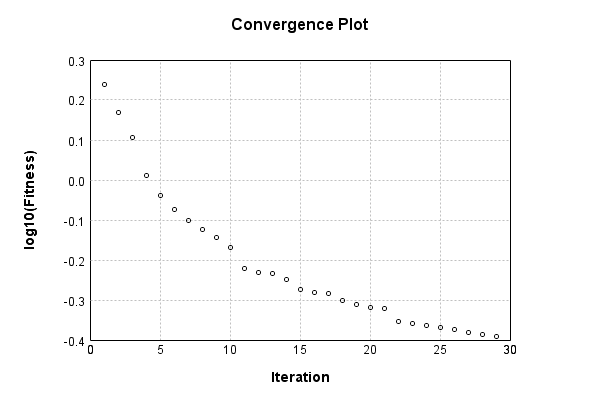

### Model
This is a very simple model that performs basic logistic regression. It is expected to be trainable to about 91% accuracy on MNIST.

Code from [MnistTestBase.java:272](../../../../../../../../MindsEye/src/test/java/com/simiacryptus/mindseye/mnist/MnistTestBase.java#L272) executed in 0.00 seconds: 
```java
    PipelineNetwork network = new PipelineNetwork();
    network.add(new BiasLayer(28, 28, 1));
    network.add(new FullyConnectedLayer(new int[]{28, 28, 1}, new int[]{10})
      .setWeights(() -> 0.001 * (Math.random() - 0.45)));
    network.add(new SoftmaxActivationLayer());
    return network;
```

Returns: 

```
    PipelineNetwork/e1035fb9-1fe3-4846-a360-622900000089
```


### Training
Training a model involves a few different components. First, our model is combined mapCoords a loss function. Then we take that model and combine it mapCoords our training data to define a trainable object. Finally, we use a simple iterative scheme to refine the weights of our model. The final output is the last output value of the loss function when evaluating the last batch.

Code from [SimpleGradientDescentTest.java:50](../../../../../../../../MindsEye/src/test/java/com/simiacryptus/mindseye/opt/trainable/SimpleGradientDescentTest.java#L50) executed in 185.32 seconds: 
```java
    SimpleLossNetwork supervisedNetwork = new SimpleLossNetwork(network, new EntropyLossLayer());
    ArrayList<Tensor[]> trainingList = new ArrayList<>(Arrays.stream(trainingData).collect(Collectors.toList()));
    Collections.shuffle(trainingList);
    Tensor[][] randomSelection = trainingList.subList(0, 10000).toArray(new Tensor[][]{});
    Trainable trainable = new ArrayTrainable(randomSelection, supervisedNetwork);
    return new IterativeTrainer(trainable)
      .setMonitor(monitor)
      .setTimeout(3, TimeUnit.MINUTES)
      .setMaxIterations(500)
      .run();
```
Logging: 
```
    LBFGS Accumulation History: 1 points
    Constructing line search parameters: GD
    th(0)=2.413677211443479;dx=-314624.812634792
    Armijo: th(2.154434690031884)=14.409577511957124; dx=-7.047635685859507E-12 delta=-11.995900300513645
    Armijo: th(1.077217345015942)=14.409577519295812; dx=-1.3436544395575105E-7 delta=-11.995900307852333
    Armijo: th(0.3590724483386473)=14.409582651788535; dx=-9.181048241637211E-5 delta=-11.995905440345055
    Armijo: th(0.08976811208466183)=14.40388782374109; dx=0.24121845918946064 delta=-11.990210612297611
    Armijo: th(0.017953622416932366)=14.366425017117447; dx=4.091497225207198 delta=-11.952747805673967
    Armijo: th(0.002992270402822061)=14.19925432929261; dx=154.16128379076784 delta=-11.785577117849131
    Armijo: th(4.2746720040315154E-4)=12.76937420499834; dx=8738.851473740826 delta=-10.35569699355486
    Armijo: th(5.343340005039394E-5)=3.5669048480224053; dx=132137.19073840237 delta=-1.1532276365789262
    New Minimum: 2.413677211443479 > 1.7335563647859524
    END: th(5.9370444500437714E-6)=1.7335563647859524; dx=-143875.01288958098 delta=0.6801208466575266
    Iteration 1 complete. Error: 1.7335563647859524 Total: 185030228392732.4700; Orientation: 0.0009; Line Search: 13.4057
    LBFGS Accumulation History: 1 points
    th(0)=1.7335563647859524;dx=-265759.00359634083
    Armijo: th(1.279097451943557E-5)=1.9346740923983305; dx=200590.08200774936 delta=-0.20111772761237812
    New Minimum: 1.7335563647859524 > 1.4731463822084718
    WOLF (strong): th(6.395487259717785E-6)=1.4731463822084718; dx=65176.363246921144 delta=0.2604099825774806
    END: th(2.131829086572595E-6)=1.5236934985725155; dx=-131198.98058299872 delta=0.20986286621343697
    Iteration 2 complete. Error: 1.4731463822084718 Total: 185037359367359.7800; Orientation: 0.0008; Line Search: 5.6777
    LBFGS Accumulation History: 1 points
    th(0)=1.5236934985725155;dx=-127853.1843012106
    New Minimum: 1.5236934985725155 > 1.2788830255495975
    END: th(4.592886537330983E-6)=1.2788830255495975; dx=-86128.50797807077 delta=0.24481047302291792
    Iteration 3 complete. Erro
```
...[skipping 11132 bytes](etc/1.txt)...
```
    70072 delta=0.0012331369623695965
    New Minimum: 0.42555963520297657 > 0.4236120381440365
    END: th(3.9663624873419665E-6)=0.4236120381440365; dx=-906.5082451721115 delta=0.0031807340213096946
    Iteration 26 complete. Error: 0.4236120381440365 Total: 185178671093394.4400; Orientation: 0.0016; Line Search: 5.6835
    LBFGS Accumulation History: 1 points
    th(0)=0.4236120381440365;dx=-1011.4107859775445
    New Minimum: 0.4236120381440365 > 0.4194249595695042
    WOLFE (weak): th(8.545268935970682E-6)=0.4194249595695042; dx=-951.7500511031793 delta=0.004187078574532266
    New Minimum: 0.4194249595695042 > 0.4154895369107878
    END: th(1.7090537871941364E-5)=0.4154895369107878; dx=-893.5783743053784 delta=0.008122501233248647
    Iteration 27 complete. Error: 0.4154895369107878 Total: 185184479050440.3400; Orientation: 0.0011; Line Search: 4.3245
    LBFGS Accumulation History: 1 points
    th(0)=0.4154895369107878;dx=-1084.107047781621
    New Minimum: 0.4154895369107878 > 0.413983582584432
    WOLF (strong): th(3.682044766261416E-5)=0.413983582584432; dx=897.7349697332106 delta=0.0015059543263558073
    New Minimum: 0.413983582584432 > 0.41018476735780895
    END: th(1.841022383130708E-5)=0.41018476735780895; dx=-73.50551065517529 delta=0.005304769552978872
    Iteration 28 complete. Error: 0.41018476735780895 Total: 185190260948208.5300; Orientation: 0.0013; Line Search: 4.3174
    LBFGS Accumulation History: 1 points
    th(0)=0.41018476735780895;dx=-4004.2581948748193
    Armijo: th(3.9663624873419673E-5)=0.6621690897400001; dx=27323.596803840737 delta=-0.25198432238219115
    Armijo: th(1.9831812436709837E-5)=0.45645957123123576; dx=13157.921713605823 delta=-0.046274803873426806
    New Minimum: 0.41018476735780895 > 0.4066969140005839
    WOLF (strong): th(6.6106041455699456E-6)=0.4066969140005839; dx=1830.8946479317672 delta=0.003487853357225068
    END: th(1.6526510363924864E-6)=0.4074997846456805; dx=-2519.3415588320654 delta=0.0026849827121284697
    Iteration 29 complete. Error: 0.4066969140005839 Total: 185198837078184.7500; Orientation: 0.0010; Line Search: 7.1327
    
```

Returns: 

```
    0.4066969140005839
```


Code from [MnistTestBase.java:131](../../../../../../../../MindsEye/src/test/java/com/simiacryptus/mindseye/mnist/MnistTestBase.java#L131) executed in 0.01 seconds: 
```java
    PlotCanvas plot = ScatterPlot.plot(history.stream().map(step -> new double[]{step.iteration, Math.log10(step.point.getMean())}).toArray(i -> new double[i][]));
    plot.setTitle("Convergence Plot");
    plot.setAxisLabels("Iteration", "log10(Fitness)");
    plot.setSize(600, 400);
    return plot;
```

Returns: 




Saved model as [model0.json](etc/model0.json)

### Metrics
Code from [MnistTestBase.java:144](../../../../../../../../MindsEye/src/test/java/com/simiacryptus/mindseye/mnist/MnistTestBase.java#L144) executed in 0.69 seconds: 
```java
    try {
      ByteArrayOutputStream out = new ByteArrayOutputStream();
      JsonUtil.writeJson(out, monitoringRoot.getMetrics());
      return out.toString();
    } catch (IOException e) {
      throw new RuntimeException(e);
    }
```

Returns: 

```
    [ "java.util.HashMap", {
      "FullyConnectedLayer/e1035fb9-1fe3-4846-a360-62290000008b" : [ "java.util.HashMap", {
        "avgMsPerItem" : 0.01198194556666667,
        "medianMsPerItem" : "NaN",
        "avgMsPerItem_Backward" : 8.34194933271318E-6,
        "totalItems" : 1290000,
        "backpropStatistics" : [ "java.util.HashMap", {
          "meanExponent" : -6.190254939326645,
          "tp50" : -2.3985190851936927E-5,
          "negative" : 5000,
          "min" : -1.9893688827268987E-4,
          "max" : 1.7734511858040982E-4,
          "tp90" : -2.770737425759545E-6,
          "mean" : -1.7211678630493124E-23,
          "count" : 50000.0,
          "positive" : 45000,
          "stdDev" : 2.6429360544813498E-5,
          "tp75" : -8.116843151201459E-6,
          "zeros" : 0
        } ],
        "totalBatches" : 258,
        "weights" : [ "java.util.HashMap", {
          "tp50" : "NaN",
          "buffers" : 1,
          "max" : 0.0019117832433512877,
          "tp90" : "NaN",
          "count" : 7840.0,
          "positive" : 4296,
          "tp75" : "NaN",
          "zeros" : 0,
          "meanExponent" : -3.679760359320312,
          "negative" : 3544,
          "min" : -0.0013996918260223844,
          "mean" : 4.934497265440752E-5,
          "stdDev" : 3.6960807290975647E-4
        } ],
        "class" : "com.simiacryptus.mindseye.layers.java.FullyConnectedLayer",
        "outputStatistics" : [ "java.util.HashMap", {
          "meanExponent" : 0.1548432280871972,
          "tp50" : -2.7869015171082463,
          "negative" : 16540,
          "min" : -5.491949676022742,
          "max" : 9.418464255593873,
          "tp90" : -2.1153630391372715,
          "mean" : 1.2873388895597058,
          "count" : 50000.0,
          "positive" : 33460,
          "stdDev" : 2.7791917158242505,
          "tp75" : -2.3329334511276407,
          "zeros" : 0
        } ],
        "medianMsPerItem_Backward" : "NaN"
      } ],
      "BiasLayer/e1035fb9-1fe3-4846-a360-62290000008a" : [ "java.util.HashMap", {
        "avgMsPerItem" : 0.018001828426356593,
        "medianMsPerItem" : "NaN",
        "avgMsPerItem_Backward" : 4.370737471472871E-6,
        "totalItems" : 1290000,
        "backp
```
...[skipping 799 bytes](etc/2.txt)...
```
    tive" : 429,
          "min" : -4.950929450383513E-9,
          "mean" : -1.2029198306988859E-10,
          "stdDev" : 1.7331442872552877E-9
        } ],
        "class" : "com.simiacryptus.mindseye.layers.java.BiasLayer",
        "outputStatistics" : [ "java.util.HashMap", {
          "meanExponent" : -6.872588211421808,
          "tp50" : -4.557596137577868E-9,
          "negative" : 1707936,
          "min" : -1.4925971096174748E-9,
          "max" : -1.4925971096174748E-9,
          "tp90" : -4.056148187011938E-9,
          "mean" : 33.48184770396372,
          "count" : 3920000.0,
          "positive" : 2212064,
          "stdDev" : 78.76410191893261,
          "tp75" : -4.557596137577868E-9,
          "zeros" : 0
        } ],
        "medianMsPerItem_Backward" : "NaN"
      } ],
      "SoftmaxActivationLayer/e1035fb9-1fe3-4846-a360-62290000008c" : [ "java.util.HashMap", {
        "avgMsPerItem" : 0.0032290967635658914,
        "medianMsPerItem" : "NaN",
        "avgMsPerItem_Backward" : 1.6743076883720934E-7,
        "totalItems" : 1290000,
        "backpropStatistics" : [ "java.util.HashMap", {
          "meanExponent" : -3.523479020512398,
          "tp50" : -2.272536054983427E-4,
          "negative" : 5000,
          "min" : -0.03762539625181971,
          "max" : 0.0,
          "tp90" : -2.0280966159848273E-4,
          "mean" : -6.540138933278707E-4,
          "count" : 50000.0,
          "positive" : 0,
          "stdDev" : 0.12960239110650637,
          "tp75" : -2.0846019346825467E-4,
          "zeros" : 45000
        } ],
        "totalBatches" : 258,
        "class" : "com.simiacryptus.mindseye.layers.java.SoftmaxActivationLayer",
        "outputStatistics" : [ "java.util.HashMap", {
          "meanExponent" : -2.4103434257858902,
          "tp50" : 1.691504541194361E-5,
          "negative" : 0,
          "min" : 3.3025077856345467E-8,
          "max" : 0.990510518815823,
          "tp90" : 5.329232412253809E-5,
          "mean" : 0.1,
          "count" : 50000.0,
          "positive" : 50000,
          "stdDev" : 0.24707434514112064,
          "tp75" : 3.727089857272353E-5,
          "zeros" : 0
        } ],
        "medianMsPerItem_Backward" : "NaN"
      } ]
    } ]
```


### Validation
If we run our model against the entire validation dataset, we get this accuracy:

Code from [MnistTestBase.java:201](../../../../../../../../MindsEye/src/test/java/com/simiacryptus/mindseye/mnist/MnistTestBase.java#L201) executed in 0.94 seconds: 
```java
    return MNIST.validationDataStream().mapToDouble(labeledObject ->
      predict(network, labeledObject)[0] == parse(labeledObject.label) ? 1 : 0)
      .average().getAsDouble() * 100;
```

Returns: 

```
    88.77000000000001
```


Let's examine some incorrectly predicted results in more detail:

Code from [MnistTestBase.java:208](../../../../../../../../MindsEye/src/test/java/com/simiacryptus/mindseye/mnist/MnistTestBase.java#L208) executed in 0.24 seconds: 
```java
    try {
      TableOutput table = new TableOutput();
      MNIST.validationDataStream().map(labeledObject -> {
        try {
          int actualCategory = parse(labeledObject.label);
          double[] predictionSignal = CudaExecutionContext.gpuContexts.run(ctx -> network.eval(ctx, labeledObject.data).getData().get(0).getData());
          int[] predictionList = IntStream.range(0, 10).mapToObj(x -> x).sorted(Comparator.comparing(i -> -predictionSignal[i])).mapToInt(x -> x).toArray();
          if (predictionList[0] == actualCategory) return null; // We will only examine mispredicted rows
          LinkedHashMap<String, Object> row = new LinkedHashMap<String, Object>();
          row.put("Image", log.image(labeledObject.data.toGrayImage(), labeledObject.label));
          row.put("Prediction", Arrays.stream(predictionList).limit(3)
            .mapToObj(i -> String.format("%d (%.1f%%)", i, 100.0 * predictionSignal[i]))
            .reduce((a, b) -> a + ", " + b).get());
          return row;
        } catch (IOException e) {
          throw new RuntimeException(e);
        }
      }).filter(x -> null != x).limit(10).forEach(table::putRow);
      return table;
    } catch (IOException e) {
      throw new RuntimeException(e);
    }
```

Returns: 

Image | Prediction
----- | ----------
![[5]](etc/test.2.png)  | 6 (55.1%), 2 (13.4%), 8 (9.3%) 
![[4]](etc/test.3.png)  | 0 (44.2%), 6 (38.9%), 4 (6.1%) 
![[1]](etc/test.4.png)  | 3 (40.0%), 1 (18.3%), 5 (11.0%)
![[3]](etc/test.5.png)  | 2 (48.0%), 3 (33.8%), 8 (5.9%) 
![[6]](etc/test.6.png)  | 2 (26.2%), 6 (23.7%), 7 (19.5%)
![[2]](etc/test.7.png)  | 7 (83.6%), 2 (7.1%), 9 (5.3%)  
![[7]](etc/test.8.png)  | 9 (48.4%), 7 (38.8%), 4 (6.6%) 
![[9]](etc/test.9.png)  | 8 (30.1%), 9 (23.6%), 4 (22.9%)
![[7]](etc/test.10.png) | 1 (57.3%), 7 (15.2%), 9 (9.7%) 
![[7]](etc/test.11.png) | 4 (58.0%), 9 (17.6%), 7 (16.8%)


