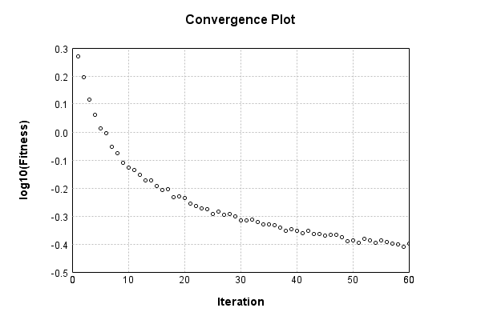

### Model
This is a very simple model that performs basic logistic regression. It is expected to be trainable to about 91% accuracy on MNIST.

Code from [MnistTestBase.java:293](../../../../../../../src/test/java/com/simiacryptus/mindseye/opt/MnistTestBase.java#L293) executed in 0.00 seconds: 
```java
    PipelineNetwork network = new PipelineNetwork();
    network.add(new BiasLayer(28, 28, 1));
    network.add(new FullyConnectedLayer(new int[]{28, 28, 1}, new int[]{10})
      .setWeights(() -> 0.001 * (Math.random() - 0.45)));
    network.add(new SoftmaxActivationLayer());
    return network;
```

Returns: 

```
    PipelineNetwork/33821e93-d09c-4ab9-859b-bfce32737f48
```


### Training
Training a model involves a few different components. First, our model is combined mapCoords a loss function. Then we take that model and combine it mapCoords our training data to define a trainable object. Finally, we use a simple iterative scheme to refine the weights of our model. The final output is the last output value of the loss function when evaluating the last batch.

Code from [SimpleStochasticGradientDescentTest.java:47](../../../../../../../src/test/java/com/simiacryptus/mindseye/opt/trainable/SimpleStochasticGradientDescentTest.java#L47) executed in 300.63 seconds: 
```java
    SimpleLossNetwork supervisedNetwork = new SimpleLossNetwork(network, new EntropyLossLayer());
    Trainable trainable = new SampledArrayTrainable(trainingData, supervisedNetwork, 10000);
    return new IterativeTrainer(trainable)
      .setMonitor(monitor)
      .setOrientation(new GradientDescent())
      .setTimeout(5, TimeUnit.MINUTES)
      .setMaxIterations(500)
      .run();
```
Logging: 
```
    Constructing line search parameters: GD
    th(0)=2.4747782327691663;dx=-435932.4854805194
    Armijo: th(2.154434690031884)=19.378380919233614; dx=0.0034997337885899773 delta=-16.903602686464446
    Armijo: th(1.077217345015942)=19.376493481411156; dx=0.0035049632245864647 delta=-16.90171524864199
    Armijo: th(0.3590724483386473)=19.374115056793592; dx=0.02903165317246429 delta=-16.899336824024424
    Armijo: th(0.08976811208466183)=19.34865823412874; dx=0.7074054256901033 delta=-16.873880001359574
    Armijo: th(0.017953622416932366)=19.258882814384734; dx=12.111696424295616 delta=-16.784104581615566
    Armijo: th(0.002992270402822061)=18.809825335120856; dx=408.82103118335147 delta=-16.335047102351687
    Armijo: th(4.2746720040315154E-4)=15.612087774376192; dx=16986.60150500791 delta=-13.137309541607026
    Armijo: th(5.343340005039394E-5)=5.660193098953073; dx=144059.04437881615 delta=-3.1854148661839066
    New Minimum: 2.4747782327691663 > 1.865285356146882
    END: th(5.9370444500437714E-6)=1.865285356146882; dx=-49836.54486143086
```
...[skipping 24683 bytes](etc/183.txt)...
```
    )=0.392625277133835;dx=-1139.0173226713732
    New Minimum: 0.392625277133835 > 0.39086978671057615
    WOLF (strong): th(1.7082391612548894E-5)=0.39086978671057615; dx=718.7283874592212 delta=0.001755490423258843
    New Minimum: 0.39086978671057615 > 0.38976603699057566
    END: th(8.541195806274447E-6)=0.38976603699057566; dx=-208.22999588296756 delta=0.002859240143259334
    Iteration 59 complete. Error: 0.38976603699057566 Total: 63149497270312.5160; Orientation: 0.0003; Line Search: 3.4379
    th(0)=0.403110317694513;dx=-1624.7417061667254
    Armijo: th(1.8401448539392513E-5)=0.4064212876578417; dx=2317.122436604421 delta=-0.0033109699633286915
    New Minimum: 0.403110317694513 > 0.4002382335135938
    WOLF (strong): th(9.200724269696257E-6)=0.4002382335135938; dx=360.57700181614763 delta=0.002872084180919221
    END: th(3.066908089898752E-6)=0.40113721203659225; dx=-957.6045249885141 delta=0.0019731056579207484
    Iteration 60 complete. Error: 0.4002382335135938 Total: 63155147084871.5000; Orientation: 0.0002; Line Search: 4.0171
    
```

Returns: 

```
    0.3999493176943768
```


Code from [MnistTestBase.java:139](../../../../../../../src/test/java/com/simiacryptus/mindseye/opt/MnistTestBase.java#L139) executed in 0.00 seconds: 
```java
    PlotCanvas plot = ScatterPlot.plot(history.stream().map(step -> new double[]{step.iteration, Math.log10(step.point.getMean())}).toArray(i -> new double[i][]));
    plot.setTitle("Convergence Plot");
    plot.setAxisLabels("Iteration", "log10(Fitness)");
    plot.setSize(600, 400);
    return plot;
```

Returns: 




Saved model as [model0.json](etc/model0.json)

### Metrics
Code from [MnistTestBase.java:152](../../../../../../../src/test/java/com/simiacryptus/mindseye/opt/MnistTestBase.java#L152) executed in 0.76 seconds: 
```java
    try {
      ByteArrayOutputStream out = new ByteArrayOutputStream();
      JsonUtil.writeJson(out, monitoringRoot.getMetrics());
      return out.toString();
    } catch (IOException e) {
      throw new RuntimeException(e);
    }
```

Returns: 

```
    [ "java.util.HashMap", {
      "BiasLayer/121f62c7-1b91-4b98-aee6-90a37597b537" : [ "java.util.HashMap", {
        "avgMsPerItem" : 0.020799147449387767,
        "medianMsPerItem" : "NaN",
        "avgMsPerItem_Backward" : 2.62656039665306E-6,
        "totalItems" : 2450000,
        "backpropStatistics" : [ "java.util.HashMap", {
          "meanExponent" : -4.688195058401267,
          "tp50" : -0.0010928723773924692,
          "negative" : 1928537,
          "min" : -8.40357063137821E-4,
          "max" : 8.363737415887154E-4,
          "tp90" : -9.703575385132208E-4,
          "mean" : 1.392695031773163E-7,
          "count" : 3920000.0,
          "positive" : 1991463,
          "stdDev" : 1.5757702889449536E-4,
          "tp75" : -0.001005249539061893,
          "zeros" : 0
        } ],
        "totalBatches" : 490,
        "weights" : [ "java.util.HashMap", {
          "tp50" : "NaN",
          "buffers" : 1,
          "max" : 6.688376520532399E-9,
          "tp90" : "NaN",
          "count" : 784.0,
          "positive" : 368,
          "tp75" : "NaN",
          "zeros" : 0,
          "meanEx
```
...[skipping 2815 bytes](etc/184.txt)...
```
     [ "java.util.HashMap", {
          "meanExponent" : 0.17437751491537432,
          "tp50" : -1.1127258256148456,
          "negative" : 5000,
          "min" : -952.1255335152117,
          "max" : 0.0,
          "tp90" : -1.0107536663622718,
          "mean" : -1.5309785590494118,
          "count" : 50000.0,
          "positive" : 0,
          "stdDev" : 181.49149271549018,
          "tp75" : -1.0338561280633973,
          "zeros" : 45000
        } ],
        "totalBatches" : 490,
        "class" : "com.simiacryptus.mindseye.layers.java.SoftmaxActivationLayer",
        "outputStatistics" : [ "java.util.HashMap", {
          "meanExponent" : -2.569514916723036,
          "tp50" : 7.57501024714346E-6,
          "negative" : 0,
          "min" : 1.8681183825144338E-8,
          "max" : 0.9831104299144834,
          "tp90" : 2.5782197000872024E-5,
          "mean" : 0.1,
          "count" : 50000.0,
          "positive" : 50000,
          "stdDev" : 0.2515967146285183,
          "tp75" : 1.7671219199469574E-5,
          "zeros" : 0
        } ],
        "medianMsPerItem_Backward" : "NaN"
      } ]
    } ]
```


### Validation
If we run our model against the entire validation dataset, we get this accuracy:

Code from [MnistTestBase.java:209](../../../../../../../src/test/java/com/simiacryptus/mindseye/opt/MnistTestBase.java#L209) executed in 0.87 seconds: 
```java
    return MNIST.validationDataStream().mapToDouble(labeledObject ->
      predict(network, labeledObject)[0] == parse(labeledObject.label) ? 1 : 0)
      .average().getAsDouble() * 100;
```

Returns: 

```
    89.63
```


Let's examine some incorrectly predicted results in more detail:

Code from [MnistTestBase.java:216](../../../../../../../src/test/java/com/simiacryptus/mindseye/opt/MnistTestBase.java#L216) executed in 0.04 seconds: 
```java
    try {
      TableOutput table = new TableOutput();
      MNIST.validationDataStream().map(labeledObject -> {
        try {
          int actualCategory = parse(labeledObject.label);
          double[] predictionSignal = GpuController.call(ctx -> network.eval(ctx, labeledObject.data).getData().get(0).getData());
          int[] predictionList = IntStream.range(0, 10).mapToObj(x -> x).sorted(Comparator.comparing(i -> -predictionSignal[i])).mapToInt(x -> x).toArray();
          if (predictionList[0] == actualCategory) return null; // We will only examine mispredicted rows
          LinkedHashMap<String, Object> row = new LinkedHashMap<String, Object>();
          row.put("Image", log.image(labeledObject.data.toGrayImage(), labeledObject.label));
          row.put("Prediction", Arrays.stream(predictionList).limit(3)
            .mapToObj(i -> String.format("%d (%.1f%%)", i, 100.0 * predictionSignal[i]))
            .reduce((a, b) -> a + ", " + b).get());
          return row;
        } catch (IOException e) {
          throw new RuntimeException(e);
        }
      }).filter(x -> null != x).limit(10).forEach(table::putRow);
      return table;
    } catch (IOException e) {
      throw new RuntimeException(e);
    }
```

Returns: 

Image | Prediction
----- | ----------
![[5]](etc/test.852.png) | 6 (74.1%), 2 (11.4%), 0 (5.8%) 
![[4]](etc/test.853.png) | 6 (44.7%), 0 (37.9%), 4 (7.1%) 
![[1]](etc/test.854.png) | 3 (43.7%), 1 (30.0%), 5 (9.2%) 
![[9]](etc/test.855.png) | 4 (35.3%), 9 (34.2%), 8 (10.5%)
![[3]](etc/test.856.png) | 2 (51.3%), 3 (38.3%), 8 (3.6%) 
![[9]](etc/test.857.png) | 7 (37.4%), 9 (37.3%), 8 (16.3%)
![[2]](etc/test.858.png) | 7 (89.7%), 2 (4.5%), 9 (4.3%)  
![[7]](etc/test.859.png) | 9 (50.8%), 7 (40.5%), 4 (4.9%) 
![[9]](etc/test.860.png) | 4 (38.7%), 8 (22.5%), 9 (20.3%)
![[7]](etc/test.861.png) | 1 (53.6%), 7 (25.1%), 9 (8.8%) 


