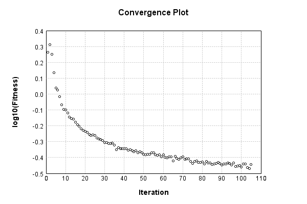

### Model
This is a very simple model that performs basic logistic regression. It is expected to be trainable to about 91% accuracy on MNIST.

Code from [MnistTestBase.java:272](../../../../../../../../MindsEye/src/test/java/com/simiacryptus/mindseye/mnist/MnistTestBase.java#L272) executed in 0.00 seconds: 
```java
    PipelineNetwork network = new PipelineNetwork();
    network.add(new BiasLayer(28, 28, 1));
    network.add(new FullyConnectedLayer(new int[]{28, 28, 1}, new int[]{10})
      .setWeights(() -> 0.001 * (Math.random() - 0.45)));
    network.add(new SoftmaxActivationLayer());
    return network;
```

Returns: 

```
    PipelineNetwork/e1035fb9-1fe3-4846-a360-622900000092
```


### Training
Training a model involves a few different components. First, our model is combined mapCoords a loss function. Then we take that model and combine it mapCoords our training data to define a trainable object. Finally, we use a simple iterative scheme to refine the weights of our model. The final output is the last output value of the loss function when evaluating the last batch.

Code from [SimpleStochasticGradientDescentTest.java:47](../../../../../../../../MindsEye/src/test/java/com/simiacryptus/mindseye/opt/trainable/SimpleStochasticGradientDescentTest.java#L47) executed in 301.78 seconds: 
```java
    SimpleLossNetwork supervisedNetwork = new SimpleLossNetwork(network, new EntropyLossLayer());
    Trainable trainable = new SampledArrayTrainable(trainingData, supervisedNetwork, 10000);
    return new IterativeTrainer(trainable)
      .setMonitor(monitor)
      .setOrientation(new GradientDescent())
      .setTimeout(5, TimeUnit.MINUTES)
      .setMaxIterations(500)
      .run();
```
Logging: 
```
    Constructing line search parameters: GD
    Returning cached value; 2 buffers unchanged since 0.0 => 2.6547437311300293
    th(0)=2.6547437311300293;dx=-781221.7538917821
    Armijo: th(2.154434690031884)=15.476259249792488; dx=1.2162610504685106E-4 delta=-12.821515518662459
    Armijo: th(1.077217345015942)=15.4762035707211; dx=8.483204161622066E-5 delta=-12.821459839591071
    Armijo: th(0.3590724483386473)=15.475527827387811; dx=0.014435063771455446 delta=-12.820784096257782
    Armijo: th(0.08976811208466183)=15.4719341967049; dx=0.031374643752359564 delta=-12.817190465574871
    Armijo: th(0.017953622416932366)=15.451882785395007; dx=3.789552280756563 delta=-12.797139054264978
    Armijo: th(0.002992270402822061)=15.31037877356642; dx=110.3363866835484 delta=-12.65563504243639
    Armijo: th(4.2746720040315154E-4)=13.980810126108848; dx=9614.923511883091 delta=-11.326066394978819
    Armijo: th(5.343340005039394E-5)=7.221675491343811; dx=110557.682224829 delta=-4.566931760213782
    New Minimum: 2.6547437311300293 > 2.220117326075367
    WOLF (strong): th(5.9370444500437714E-6)=2.220117326075367; dx=108178.33603349433 delta=0.43462640505466243
    END: th(5.937044450043771E-7)=2.456081889686063; dx=-560127.6607689215 delta=0.19866184144396648
    Iteration 1 complete. Error: 2.220117326075367 Total: 185217684776887.8000; Orientation: 0.0005; Line Search: 13.4640
    Returning cached value; 2 buffers unchanged since 0.0 => 2.4556276272496453
    th(0)=2.4556276272496453;dx=-428459.3182105479
    New Minimum: 2.4556276272496453 > 2.2239318967755533
    END: th(1.2790974519435567E-6)=2.2239318967755533; dx=-299543.9221600057 delta=0.2316957304740921
    Iteration 2 complete. Error: 2.2239318967755533 Total: 185220547734183.3000; Orientation: 0.0003; Line Search: 1.4182
    Returning cached value; 2 buffers unchanged since 0.0 => 2.2275036090465212
    th(0)=2.2275036090465212;dx=-262588.07855270786
    New Minimum: 2.2275036090465212 > 1.8997335555881185
    END: th(2.755731922398589E-6)=1.8997335555881185; dx=-212350.4054080081 delta=0.3277700534584027
    Iteration 3 complete. Er
```
...[skipping 32211 bytes](etc/1.txt)...
```
    00390307
    WOLF (strong): th(1.3345618447303816E-5)=0.3979125300390307; dx=208.82484185504032 delta=0.0029521138671529945
    END: th(6.672809223651908E-6)=0.39829762348410724; dx=-436.60328716235813 delta=0.0025670204220764603
    Iteration 68 complete. Error: 0.3979125300390307 Total: 185490036143844.2800; Orientation: 0.0008; Line Search: 2.8939
    Returning cached value; 2 buffers unchanged since 0.0 => 0.3964067724887349
    th(0)=0.3964067724887349;dx=-1108.4659726190027
    New Minimum: 0.3964067724887349 > 0.3949196269198514
    WOLF (strong): th(1.4376131671400394E-5)=0.3949196269198514; dx=705.1253371264426 delta=0.001487145568883519
    New Minimum: 0.3949196269198514 > 0.39403463838951747
    END: th(7.188065835700197E-6)=0.39403463838951747; dx=-201.52325661127756 delta=0.002372134099217438
    Iteration 69 complete. Error: 0.39403463838951747 Total: 185494427173232.9700; Orientation: 0.0009; Line Search: 2.8999
    Returning cached value; 2 buffers unchanged since 0.0 => 0.4063549554799541
    th(0)=0.4063549554799541;dx=-1025.790981062402
    New Minimum: 0.4063549554799541 > 0.40450603710854316
    WOLF (strong): th(1.5486218390665527E-5)=0.40450603710854316; dx=543.0993148034986 delta=0.0018489183714109347
    New Minimum: 0.40450603710854316 > 0.4039123818151168
    END: th(7.743109195332764E-6)=0.4039123818151168; dx=-235.81072096796686 delta=0.0024425736648372998
    Iteration 70 complete. Error: 0.4039123818151168 Total: 185498720958305.5600; Orientation: 0.0005; Line Search: 2.8240
    Returning cached value; 2 buffers unchanged since 0.0 => 0.39867093828864597
    th(0)=0.39867093828864597;dx=-1202.2886679382477
    New Minimum: 0.39867093828864597 > 0.39807784962968706
    WOLF (strong): th(1.668202305912977E-5)=0.39807784962968706; dx=1063.265731763967 delta=5.930886589589068E-4
    New Minimum: 0.39807784962968706 > 0.396012307369473
    END: th(8.341011529564885E-6)=0.396012307369473; dx=-65.95197583009532 delta=0.002658630919172955
    Iteration 71 complete. Error: 0.396012307369473 Total: 185502963211591.2800; Orientation: 0.0004; Line Search: 2.8128
    
```

Returns: 

```
    0.396012307369473
```


Code from [MnistTestBase.java:131](../../../../../../../../MindsEye/src/test/java/com/simiacryptus/mindseye/mnist/MnistTestBase.java#L131) executed in 0.01 seconds: 
```java
    PlotCanvas plot = ScatterPlot.plot(history.stream().map(step -> new double[]{step.iteration, Math.log10(step.point.getMean())}).toArray(i -> new double[i][]));
    plot.setTitle("Convergence Plot");
    plot.setAxisLabels("Iteration", "log10(Fitness)");
    plot.setSize(600, 400);
    return plot;
```

Returns: 




Saved model as [model0.json](etc/model0.json)

### Metrics
Code from [MnistTestBase.java:144](../../../../../../../../MindsEye/src/test/java/com/simiacryptus/mindseye/mnist/MnistTestBase.java#L144) executed in 0.66 seconds: 
```java
    try {
      ByteArrayOutputStream out = new ByteArrayOutputStream();
      JsonUtil.writeJson(out, monitoringRoot.getMetrics());
      return out.toString();
    } catch (IOException e) {
      throw new RuntimeException(e);
    }
```

Returns: 

```
    [ "java.util.HashMap", {
      "FullyConnectedLayer/e1035fb9-1fe3-4846-a360-622900000094" : [ "java.util.HashMap", {
        "avgMsPerItem" : 0.01201519739904762,
        "medianMsPerItem" : "NaN",
        "avgMsPerItem_Backward" : 8.202150641999997E-6,
        "totalItems" : 2100000,
        "backpropStatistics" : [ "java.util.HashMap", {
          "meanExponent" : -6.385038433262933,
          "tp50" : -1.9348380519208067E-5,
          "negative" : 5000,
          "min" : -1.999759090791789E-4,
          "max" : 1.919378293315803E-4,
          "tp90" : -2.068660712017805E-6,
          "mean" : 5.360775735011299E-23,
          "count" : 50000.0,
          "positive" : 45000,
          "stdDev" : 2.6378737583454885E-5,
          "tp75" : -6.5003763786491E-6,
          "zeros" : 0
        } ],
        "totalBatches" : 420,
        "weights" : [ "java.util.HashMap", {
          "tp50" : "NaN",
          "buffers" : 1,
          "max" : 0.002007761824682999,
          "tp90" : "NaN",
          "count" : 7840.0,
          "positive" : 4348,
          "tp75" : "NaN",
          "zeros" : 0,
          "meanExponent" : -3.675611543663783,
          "negative" : 3492,
          "min" : -0.0015405145572422512,
          "mean" : 5.555588750309256E-5,
          "stdDev" : 3.893446025811611E-4
        } ],
        "class" : "com.simiacryptus.mindseye.layers.java.FullyConnectedLayer",
        "outputStatistics" : [ "java.util.HashMap", {
          "meanExponent" : 0.21671669940930802,
          "tp50" : -3.0782413850252457,
          "negative" : 15399,
          "min" : -5.625864104280617,
          "max" : 11.32436874712067,
          "tp90" : -2.2919264874516565,
          "mean" : 1.5606298202278943,
          "count" : 50000.0,
          "positive" : 34601,
          "stdDev" : 3.075371721334114,
          "tp75" : -2.5443955344568288,
          "zeros" : 0
        } ],
        "medianMsPerItem_Backward" : "NaN"
      } ],
      "SoftmaxActivationLayer/e1035fb9-1fe3-4846-a360-622900000095" : [ "java.util.HashMap", {
        "avgMsPerItem" : 0.003222575263809523,
        "medianMsPerItem" : "NaN",
        "avgMsPerItem_Backward" : 1.6519320571428567E-7,
        "totalItems" : 2100000,
       
```
...[skipping 797 bytes](etc/2.txt)...
```
       "tp90" : 2.2818953916786172E-5,
          "mean" : 0.1,
          "count" : 50000.0,
          "positive" : 50000,
          "stdDev" : 0.2526872047386752,
          "tp75" : 1.542356283191917E-5,
          "zeros" : 0
        } ],
        "medianMsPerItem_Backward" : "NaN"
      } ],
      "BiasLayer/e1035fb9-1fe3-4846-a360-622900000093" : [ "java.util.HashMap", {
        "avgMsPerItem" : 0.017674779891904746,
        "medianMsPerItem" : "NaN",
        "avgMsPerItem_Backward" : 4.359859093428571E-6,
        "totalItems" : 2100000,
        "backpropStatistics" : [ "java.util.HashMap", {
          "meanExponent" : -8.394212958945207,
          "tp50" : -2.2780256092097875E-7,
          "negative" : 1933787,
          "min" : -1.4954610249309523E-7,
          "max" : 1.8409132895348625E-7,
          "tp90" : -2.0227704583631587E-7,
          "mean" : 5.344798645622104E-12,
          "count" : 3920000.0,
          "positive" : 1986213,
          "stdDev" : 3.1951428698593795E-8,
          "tp75" : -2.1085950277778442E-7,
          "zeros" : 0
        } ],
        "totalBatches" : 420,
        "weights" : [ "java.util.HashMap", {
          "tp50" : "NaN",
          "buffers" : 1,
          "max" : 7.913952498592511E-9,
          "tp90" : "NaN",
          "count" : 784.0,
          "positive" : 371,
          "tp75" : "NaN",
          "zeros" : 0,
          "meanExponent" : -8.838913765736134,
          "negative" : 413,
          "min" : -1.0253774480204919E-8,
          "mean" : -1.3170358792859888E-10,
          "stdDev" : 2.6222929735824074E-9
        } ],
        "class" : "com.simiacryptus.mindseye.layers.java.BiasLayer",
        "outputStatistics" : [ "java.util.HashMap", {
          "meanExponent" : -6.763730775876245,
          "tp50" : -1.0253774480204919E-8,
          "negative" : 1652068,
          "min" : -4.999891378140514E-10,
          "max" : -4.999891378140514E-10,
          "tp90" : -7.441381171271076E-9,
          "mean" : 33.02632448966311,
          "count" : 3920000.0,
          "positive" : 2267932,
          "stdDev" : 78.25211179822135,
          "tp75" : -7.441381171271076E-9,
          "zeros" : 0
        } ],
        "medianMsPerItem_Backward" : "NaN"
      } ]
    } ]
```


### Validation
If we run our model against the entire validation dataset, we get this accuracy:

Code from [MnistTestBase.java:201](../../../../../../../../MindsEye/src/test/java/com/simiacryptus/mindseye/mnist/MnistTestBase.java#L201) executed in 0.93 seconds: 
```java
    return MNIST.validationDataStream().mapToDouble(labeledObject ->
      predict(network, labeledObject)[0] == parse(labeledObject.label) ? 1 : 0)
      .average().getAsDouble() * 100;
```

Returns: 

```
    89.81
```


Let's examine some incorrectly predicted results in more detail:

Code from [MnistTestBase.java:208](../../../../../../../../MindsEye/src/test/java/com/simiacryptus/mindseye/mnist/MnistTestBase.java#L208) executed in 0.07 seconds: 
```java
    try {
      TableOutput table = new TableOutput();
      MNIST.validationDataStream().map(labeledObject -> {
        try {
          int actualCategory = parse(labeledObject.label);
          double[] predictionSignal = CudaExecutionContext.gpuContexts.run(ctx -> network.eval(ctx, labeledObject.data).getData().get(0).getData());
          int[] predictionList = IntStream.range(0, 10).mapToObj(x -> x).sorted(Comparator.comparing(i -> -predictionSignal[i])).mapToInt(x -> x).toArray();
          if (predictionList[0] == actualCategory) return null; // We will only examine mispredicted rows
          LinkedHashMap<String, Object> row = new LinkedHashMap<String, Object>();
          row.put("Image", log.image(labeledObject.data.toGrayImage(), labeledObject.label));
          row.put("Prediction", Arrays.stream(predictionList).limit(3)
            .mapToObj(i -> String.format("%d (%.1f%%)", i, 100.0 * predictionSignal[i]))
            .reduce((a, b) -> a + ", " + b).get());
          return row;
        } catch (IOException e) {
          throw new RuntimeException(e);
        }
      }).filter(x -> null != x).limit(10).forEach(table::putRow);
      return table;
    } catch (IOException e) {
      throw new RuntimeException(e);
    }
```

Returns: 

Image | Prediction
----- | ----------
![[5]](etc/test.2.png)  | 6 (52.5%), 2 (24.1%), 4 (8.6%) 
![[4]](etc/test.3.png)  | 0 (39.7%), 6 (32.8%), 5 (9.1%) 
![[1]](etc/test.4.png)  | 3 (52.2%), 1 (22.9%), 5 (7.4%) 
![[3]](etc/test.5.png)  | 2 (50.0%), 3 (32.4%), 9 (6.9%) 
![[2]](etc/test.6.png)  | 7 (75.6%), 2 (12.6%), 9 (8.5%) 
![[7]](etc/test.7.png)  | 9 (45.3%), 7 (44.8%), 4 (5.9%) 
![[3]](etc/test.8.png)  | 5 (51.6%), 3 (45.1%), 8 (1.1%) 
![[9]](etc/test.9.png)  | 4 (32.6%), 9 (24.9%), 8 (23.8%)
![[7]](etc/test.10.png) | 1 (50.8%), 7 (22.1%), 9 (9.0%) 
![[7]](etc/test.11.png) | 4 (53.8%), 9 (23.8%), 7 (16.0%)


